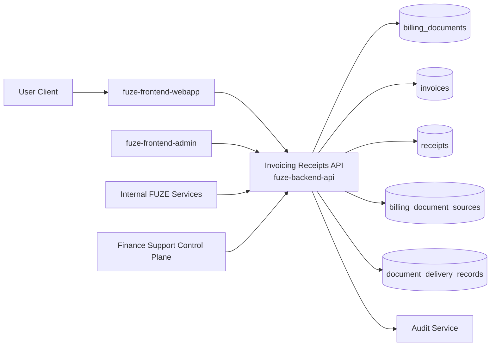
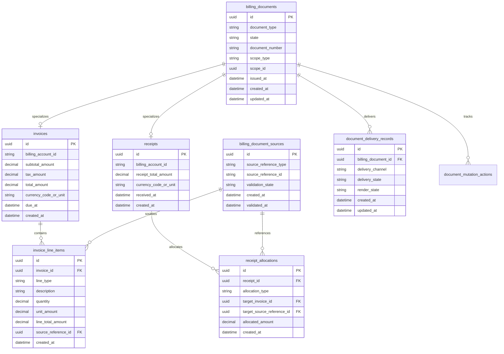
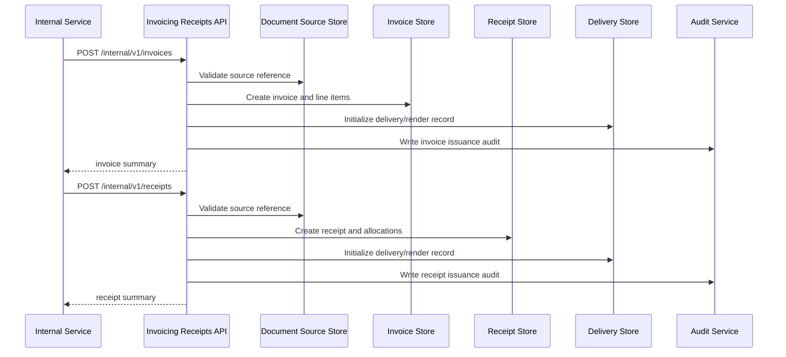

# INVOICING_RECEIPTS_API_SPEC

## 1. Title

**INVOICING_RECEIPTS_API_SPEC.md**

---

## 2. Document Metadata

- **Document Name:** INVOICING_RECEIPTS_API_SPEC.md
- **API Classification:** public, internal, admin, event-driven
- **Owning Domain:** Invoicing and Receipts Domain
- **Primary Implementing Repo:** `fuze-backend-api`
- **Primary System of Record:** invoice, receipt, billing-document issuance, delivery-status, and document-lineage stores in `fuze-backend-api`
- **Status:** Draft for canonical source-of-truth approval
- **Purpose:** Define the production-grade API contract architecture for FUZE invoices, receipts, billing-document visibility, issuance lineage, and controlled correction-safe document behavior across the platform
- **Canonical Folder:** `fuze.ac > docs > api-spec`

---

## 2.1 API Classification Header

- **API Classification:** public | internal | admin | event-driven
- **Owning Domain:** Invoicing and Receipts Domain
- **Primary Implementing Repo:** `fuze-backend-api`
- **Primary System of Record:** invoice and receipt domain

---

## 3. Purpose

This document defines the canonical API specification for FUZE invoicing and receipt operations. It translates the governing FUZE platform architecture, subscriptions and usage billing rules, Platform Credits semantics, pricing and monetization rules, payment-rail normalization, refund/reversal controls, and API architecture rules into an implementation-ready API contract.

This API exists because FUZE supports commercial flows that require formal billing artifacts. Invoices and receipts are not interchangeable, and neither should be treated as generic transaction notes. Invoices represent billing-document obligations or commercial billing records tied to approved platform semantics. Receipts represent confirmation of payment or value-settlement events according to the allowed business model. Both must remain distinct from Platform Credits balances, token holdings, payout balances, treasury resources, and raw payment-provider UI statuses.

Accordingly, this specification defines how invoice and receipt documents are represented through APIs, how account- and workspace-scoped billing documents are exposed, how invoices and receipts are generated from approved upstream commercial events, how document state and correction-safe behavior are controlled, and how document APIs remain auditable, idempotent, and architecture-consistent.

---

## 4. Scope

This specification covers:

- invoice visibility APIs
- receipt visibility APIs
- invoice and receipt summary/listing APIs
- invoice issuance and receipt issuance internal APIs
- document-delivery and document-render-ready status APIs
- invoice/receipt linkage to billing scopes, subscriptions, usage-rated charges, credits top-ups, or other approved commercial sources
- admin/control-plane APIs for document correction-safe actions, cancellation/supersession, and delivery remediation
- event emission requirements for invoice and receipt lifecycle changes
- request, response, error, idempotency, versioning, audit, and database-shape rules for this domain

This specification does **not** redefine:

- raw payment gateway contracts
- subscription state machine in full detail
- Platform Credits ledger semantics in full detail
- refund/reversal/adjustment workflow in full detail
- external tax compliance engine logic
- product entitlement rules
- token, payout, treasury, or governance semantics
- final PDF rendering implementation details

Those remain governed by their own source-of-truth specifications.

---

## 5. Source-of-Truth Inputs

### Primary FUZE docs and specs used

#### Highest-priority platform and ownership sources
- `SYSTEM_SPEC_INDEX.md`
- `SYSTEM_BOUNDARY_AND_OWNERSHIP_SPEC.md`
- `SYSTEM_OVERVIEW_AND_BOUNDARIES_SPEC.md`
- `PLATFORM_ARCHITECTURE_SPEC.md`
- `DOMAIN_OWNERSHIP_MATRIX_SPEC.md`
- `DATA_MODEL_AND_ENTITY_OWNERSHIP_SPEC.md`

#### Primary billing / document / commercial sources
- `INVOICING_AND_RECEIPTS_SPEC.md`
- `SUBSCRIPTIONS_AND_USAGE_BILLING_SPEC.md`
- `PRICING_AND_MONETIZATION_MODEL_SPEC.md`
- `PLATFORM_CREDITS_SPEC.md`
- `PAYMENT_RAILS_INTEGRATION_SPEC.md`
- `REFUND_REVERSAL_AND_ADJUSTMENT_SPEC.md`
- `PAYMENT_FRAUD_AND_ABUSE_PREVENTION_SPEC.md`

#### API and runtime sources
- `API_ARCHITECTURE_SPEC.md`
- `PUBLIC_API_SPEC.md`
- `INTERNAL_SERVICE_API_SPEC.md`
- `IDEMPOTENCY_AND_VERSIONING_SPEC.md`
- `EVENT_MODEL_AND_WEBHOOK_SPEC.md`
- `MIGRATION_AND_BACKWARD_COMPATIBILITY_SPEC.md`
- `AUDIT_LOG_AND_ACTIVITY_SPEC.md`

#### Security and operations sources
- `SECURITY_AND_RISK_CONTROL_SPEC.md`
- `SECRETS_CONFIG_AND_ENVIRONMENT_SPEC.md`
- `MONITORING_ALERTING_AND_INCIDENT_RESPONSE_SPEC.md`

#### Format guides
- `The_API_Specification_guide.md`
- `Database_Schemas_Guide.md`

### Highest-priority interpretation applied

For this file, the most important governing interpretation is:

1. invoices and receipts are distinct document classes with separate business meaning
2. backend owns canonical billing-document truth
3. invoices and receipts derive from approved commercial and billing events, not from frontend assumptions
4. document state and supersession/correction must preserve lineage instead of rewriting history
5. products may reference billing documents but do not define invoice/receipt semantics
6. invoices and receipts must remain distinct from Platform Credits balances, token balances, payouts, and treasury resources

### Supporting external standards used only as guidance

- HTTP semantics for resource reads and mutation responses. citeturn496817search0
- RFC 9457 problem details for machine-readable API error responses. citeturn496817search1

External guidance does not override FUZE source-of-truth documents.

---

## 6. Governing Architecture and Ownership Interpretation

This API belongs to the **Invoicing and Receipts Domain** because it owns the durable billing-document layer for FUZE commercial operations. It governs the issuance, visibility, lifecycle, supersession-safe correction behavior, and delivery-facing state of invoices and receipts.

This API is implemented primarily in `fuze-backend-api` because:

- backend owns durable document truth
- frontend surfaces must consume billing-document truth, not invent it
- invoices and receipts are commercial and finance-sensitive artifacts
- products and commercial flows need a shared and trusted billing-document interface
- admin remediation and audit generation must be backend-governed

This API is **not** owned by:

- `fuze-frontend-webapp`, because webapp only reads and requests allowed document operations
- `fuze-frontend-admin`, because admin surfaces trigger privileged document corrections/remediation but do not own billing-document truth
- payment-rail adapters, because payment-rail signals are upstream inputs, not the canonical document owner
- product domains, because products may trigger or reference billable events but do not define invoice or receipt semantics
- `fuze-contracts`, because invoices and receipts are off-chain commercial documents

### Architectural implications

- invoices and receipts may attach to account or workspace billing scopes
- one invoice may summarize one billing obligation or approved billable grouping according to domain policy
- one receipt confirms a specific approved payment or settlement event lineage according to allowed business rules
- receipts must not be used as a substitute for invoices where invoice semantics are required
- document summaries shown to users are derived from canonical document records
- document supersession or correction must preserve original lineage and not silently rewrite historical truth

---

## 7. Domain Responsibilities

The Invoicing and Receipts API domain is responsible for:

1. maintaining canonical invoice and receipt records
2. exposing invoice and receipt lists and detail views for allowed scopes
3. issuing invoices from approved upstream commercial state
4. issuing receipts from approved payment or settlement state
5. linking billing documents to subscriptions, cycles, usage-rated batches, credits purchases, or other approved source references
6. exposing document delivery/render-ready state safely
7. supporting admin/control-plane correction-safe document actions
8. emitting billing-document events
9. generating audit lineage for sensitive document actions
10. preserving separation between documents, balances, payments, and other financial concepts

The domain is not responsible for:

- determining all pricing rules
- settling payments
- mutating credits balances directly
- executing refunds directly
- generating token or payout statements
- replacing accounting system workflows outside approved platform scope

---

## 8. Out of Scope

The following are out of scope for this API specification:

- raw PDF rendering internals
- tax-engine integration internals
- external accounting-export formats in full detail
- chargeback lifecycle
- full refund or reversal policy logic
- unsupported peer-to-peer invoicing
- general contract-document management outside billing documents
- payout statements or treasury reports

Where later detailed specs are needed, they must remain compatible with this API.

---

## 9. Canonical Entities and Data Ownership

### Durable entities

#### 9.1 billing_documents
- **Owner:** Invoicing and Receipts Domain
- **Purpose:** canonical supertype or routing table for invoice/receipt document records
- **Nature:** source-of-truth durable entity

#### 9.2 invoices
- **Owner:** Invoicing and Receipts Domain
- **Purpose:** canonical invoice records
- **Nature:** source-of-truth durable entity

#### 9.3 invoice_line_items
- **Owner:** Invoicing and Receipts Domain
- **Purpose:** canonical line-level detail for invoice charges
- **Nature:** source-of-truth durable entity

#### 9.4 receipts
- **Owner:** Invoicing and Receipts Domain
- **Purpose:** canonical receipt records
- **Nature:** source-of-truth durable entity

#### 9.5 receipt_allocations
- **Owner:** Invoicing and Receipts Domain
- **Purpose:** linkage from receipt to invoice, billing cycle, credits top-up, or other approved source references
- **Nature:** source-of-truth durable entity

#### 9.6 billing_document_sources
- **Owner:** Invoicing and Receipts Domain
- **Purpose:** normalized references to subscriptions, cycles, usage batches, verified payments, credits purchase events, or other approved upstream commercial causes
- **Nature:** source-of-truth durable reference entity

#### 9.7 document_delivery_records
- **Owner:** Invoicing and Receipts Domain
- **Purpose:** rendering/delivery/channel lineage for invoice or receipt documents
- **Nature:** durable document-distribution records

#### 9.8 document_mutation_actions
- **Owner:** Invoicing and Receipts Domain
- **Purpose:** high-level action records for issuance, supersession, cancellation, regeneration, and remediation
- **Nature:** durable action records with audit linkage

#### 9.9 billing_document_audit_events
- **Owner:** Audit / Activity domain, sourced by Invoicing and Receipts Domain
- **Purpose:** immutable trail for sensitive billing-document actions
- **Nature:** durable audit records

### Derived or cached entities

#### 9.10 invoice_summary_views
- **Owner:** derived read-model layer
- **Purpose:** account/workspace invoice summaries for first-party clients
- **Nature:** derived

#### 9.11 receipt_summary_views
- **Owner:** derived read-model layer
- **Purpose:** account/workspace receipt summaries for first-party clients
- **Nature:** derived

#### 9.12 document_download_views
- **Owner:** derived read-model layer
- **Purpose:** short-lived document-access metadata for download or display
- **Nature:** derived

---

## 10. State Model and Lifecycle

### 10.1 invoice lifecycle

Possible states:

- `draft_if_supported`
- `issued`
- `voided`
- `superseded`
- `cancelled_if_supported`

### 10.2 receipt lifecycle

Possible states:

- `issued`
- `voided_if_supported`
- `superseded_if_supported`

### 10.3 delivery lifecycle

Possible states:

- `pending_render`
- `rendered`
- `delivered`
- `delivery_failed`
- `expired`

### 10.4 document mutation action lifecycle

Possible states:

- `requested`
- `validated`
- `executed`
- `failed`
- `closed`

Lifecycle notes:
- issued documents are durable business records
- supersession or voiding must preserve lineage rather than deleting original records
- receipts are issued only from approved payment/settlement outcomes
- invoice issuance must derive from approved billing-document creation rules, not ad hoc UI triggers

---

## 11. API Surface Overview

The API surface is divided into four families:

### 11.1 Public / first-party user-facing APIs
Used by `fuze-frontend-webapp` and approved first-party clients for:
- reading invoices
- reading receipts
- listing document summaries by scope
- retrieving document status and allowed download/display metadata

### 11.2 Internal service APIs
Used by trusted internal services for:
- issuing invoices
- issuing receipts
- attaching source references
- creating document delivery records
- resolving canonical document status for downstream services

### 11.3 Admin / control-plane APIs
Used by `fuze-frontend-admin` through backend-only privileged routes for:
- void / supersede document actions where policy allows
- delivery remediation
- corrective regeneration with preserved lineage
- discrepancy-linked document correction actions

### 11.4 Event-driven interfaces
Used for downstream side effects:
- audit generation
- user notifications
- accounting/export workflows
- analytics and reporting
- reconciliation and anomaly detection

---

## 12. Authentication and Authorization Model

### 12.1 Authentication posture by route family

#### Authenticated user routes
Require valid authenticated session:
- read own account invoices and receipts
- read workspace invoices and receipts if actor is authorized in workspace
- request document download/display metadata where allowed

#### Internal service routes
Require internal service identity with explicit least privilege:
- issue invoices
- issue receipts
- create or update delivery records
- resolve document status
- attach source references

#### Admin routes
Require privileged operator identity plus reason-coded actions:
- void / supersede document
- corrective regeneration
- delivery remediation
- discrepancy-linked document correction

### 12.2 Authorization checkpoints

Authorization must evaluate:
- canonical account identity
- session validity
- target billing scope
- actor’s workspace role where applicable
- whether action is read-only or privileged correction
- whether billing scope or document is restricted
- whether internal service has required issuance/remediation privileges
- whether admin/operator role is present for privileged actions

### 12.3 Sensitive action rules

The following require heightened checks:
- internal invoice issuance
- internal receipt issuance
- document supersession or void
- corrective regeneration
- admin delivery remediation
- discrepancy-linked document correction

---

## 13. API Endpoints / Interface Contracts

## 13.1 Public / First-Party User APIs

### 13.1.1 `GET /v1/invoices`
**Purpose:** list visible invoices for current actor’s account scope  
**Caller Type:** authenticated user  
**Auth Expectation:** valid authenticated session  
**Query Parameters Summary:**
- pagination
- optional date range
- optional state filters
- optional product or source-reference filters
**Response Summary:**
- invoice summaries
- issue dates
- totals
- currency or unit metadata
- state
- delivery availability summary
**Side Effects:** none
**Audit Requirements:** access logging only
**Emitted Events:** none required

### 13.1.2 `GET /v1/workspaces/{workspace_id}/invoices`
**Purpose:** list visible invoices for authorized workspace scope  
**Caller Type:** authenticated user  
**Response Summary:** workspace invoice summaries
**Side Effects:** none

### 13.1.3 `GET /v1/invoices/{invoice_id}`
**Purpose:** retrieve canonical invoice detail view for an allowed scope  
**Caller Type:** authenticated user  
**Response Summary:**
- invoice detail
- line items
- source reference summaries
- issue/supersession state
- delivery summary
**Side Effects:** none

### 13.1.4 `GET /v1/receipts`
**Purpose:** list visible receipts for current actor’s account scope  
**Caller Type:** authenticated user  
**Response Summary:** receipt summaries, issue dates, totals, state, and allocation summaries
**Side Effects:** none

### 13.1.5 `GET /v1/workspaces/{workspace_id}/receipts`
**Purpose:** list visible receipts for authorized workspace scope  
**Caller Type:** authenticated user  
**Response Summary:** workspace receipt summaries
**Side Effects:** none

### 13.1.6 `GET /v1/receipts/{receipt_id}`
**Purpose:** retrieve canonical receipt detail view for an allowed scope  
**Caller Type:** authenticated user  
**Response Summary:**
- receipt detail
- receipt allocations
- source reference summaries
- state
- delivery summary
**Side Effects:** none

### 13.1.7 `POST /v1/billing-documents/{document_id}/access-links`
**Purpose:** create short-lived display/download access metadata for an allowed billing document  
**Caller Type:** authenticated user with scope visibility  
**Request Body Summary:**
- optional `access_purpose`
- optional `format_hint`
**Response Summary:**
- short-lived access token or URL metadata
- expiry
- document type and identifier
**Side Effects:** creates access-link lineage record if policy requires
**Audit Requirements:** access logging; durable record optional for sensitive document classes
**Emitted Events:** none required

## 13.2 Internal Service APIs

### 13.2.1 `POST /internal/v1/invoices`
**Purpose:** issue invoice from approved upstream commercial context  
**Caller Type:** internal trusted services  
**Auth Expectation:** service-to-service identity only  
**Request Body Summary:**
- `scope_type`
- `scope_id`
- `source_reference_type`
- `source_reference_id`
- `line_items[]`
- `document_reason`
- `idempotency_key`
**Response Summary:**
- issued invoice summary
- invoice line items
- source linkage summary
- delivery/render status
**Side Effects:** creates invoice and line items, creates source linkage, may create delivery record
**Idempotency Behavior:** required
**Audit Requirements:** critical document issuance audit
**Emitted Events:** `billing.invoice_issued`

### 13.2.2 `POST /internal/v1/receipts`
**Purpose:** issue receipt from approved payment or settlement context  
**Caller Type:** internal trusted services with receipt issuance authority  
**Request Body Summary:**
- `scope_type`
- `scope_id`
- `source_reference_type`
- `source_reference_id`
- `receipt_allocations[]`
- `document_reason`
- `idempotency_key`
**Response Summary:**
- issued receipt summary
- allocation summaries
- source linkage summary
- delivery/render status
**Side Effects:** creates receipt and receipt allocations, creates source linkage, may create delivery record
**Idempotency Behavior:** required
**Audit Requirements:** critical document issuance audit
**Emitted Events:** `billing.receipt_issued`

### 13.2.3 `POST /internal/v1/billing-documents/{document_id}/deliveries`
**Purpose:** create or update delivery/render lifecycle for a billing document  
**Caller Type:** internal trusted services  
**Request Body Summary:**
- `delivery_channel`
- `delivery_action`
- optional `delivery_metadata`
- `idempotency_key`
**Response Summary:** delivery record summary
**Side Effects:** updates delivery/render status
**Idempotency Behavior:** required
**Audit Requirements:** billing-document operational audit where sensitivity requires
**Emitted Events:** `billing.document_delivery_updated`

### 13.2.4 `GET /internal/v1/billing-documents/{document_id}`
**Purpose:** retrieve canonical billing-document status for trusted services  
**Caller Type:** internal trusted services  
**Response Summary:**
- document type
- state
- scope
- source references
- delivery status
**Side Effects:** none

## 13.3 Admin / Control-Plane APIs

### 13.3.1 `POST /admin/v1/invoices/{invoice_id}/void`
**Purpose:** void an invoice where policy allows while preserving lineage  
**Caller Type:** admin/operator  
**Request Body Summary:**
- `reason_code`
- `operator_note`
- `idempotency_key`
**Response Summary:** updated invoice summary
**Side Effects:** invoice state transition to voided or superseded-safe equivalent
**Audit Requirements:** critical audit
**Emitted Events:** `billing.invoice_voided`

### 13.3.2 `POST /admin/v1/billing-documents/{document_id}/supersede`
**Purpose:** supersede a billing document with preserved lineage under controlled policy  
**Caller Type:** admin/operator  
**Request Body Summary:**
- `replacement_document_type`
- `replacement_reason`
- `operator_note`
- `related_case_id`
- `idempotency_key`
**Response Summary:** supersession action summary
**Side Effects:** original document marked superseded, replacement generation path initiated or linked
**Audit Requirements:** critical audit
**Emitted Events:** `billing.document_superseded`

### 13.3.3 `POST /admin/v1/billing-documents/{document_id}/delivery-remediation`
**Purpose:** remediate failed delivery or rendering lifecycle for a billing document  
**Caller Type:** admin/operator  
**Request Body Summary:**
- `remediation_action`
- `reason_code`
- `operator_note`
- `idempotency_key`
**Response Summary:** updated delivery remediation summary
**Side Effects:** may regenerate delivery record, re-render, or mark delivery state corrected
**Audit Requirements:** critical audit
**Emitted Events:** `billing.document_delivery_remediated`

### 13.3.4 `POST /admin/v1/billing-document-discrepancies`
**Purpose:** resolve invoice/receipt discrepancy under controlled policy  
**Caller Type:** admin/operator  
**Request Body Summary:**
- `document_id`
- `resolution_code`
- `operator_note`
- `related_case_id`
- `idempotency_key`
**Response Summary:** discrepancy resolution summary
**Side Effects:** may void, supersede, regenerate, or close discrepancy case with preserved lineage
**Audit Requirements:** critical audit
**Emitted Events:** `billing.document_discrepancy_resolved`

---

## 14. Request Rules

### 14.1 General request rules
- all mutation-capable routes must require JSON requests with explicit content type
- all mutation routes must carry correlation IDs
- sensitive document mutations must carry idempotency keys
- admin mutations must require reason codes and operator notes
- no route may accept frontend-computed billing-document truth as authoritative input

### 14.2 Sensitive-action request requirements
The following requests require heightened validation:
- invoice issuance
- receipt issuance
- document void/supersede
- delivery remediation
- discrepancy resolution

Heightened validation may include:
- scope authorization checks
- duplicate source-reference checks
- billing-state validation
- operator role confirmation
- support/finance case linkage for admin flows

### 14.3 Scope integrity rule
Billing-document mutations must target a valid and authorized billing scope or document. Product or service callers must not mutate unrelated or unauthorized document scopes.

### 14.4 Source-reference rule
Invoice and receipt issuance must reference an approved and valid commercial source reference. Billing documents must never be created by unaudited ad hoc mutation paths.

---

## 15. Response Rules

### 15.1 Success response rules
Successful responses must include:
- stable resource identifiers
- timestamps for created/updated state
- state/status values
- scope metadata
- document type and source-reference summaries
- correlation references for mutations

### 15.2 Async-accepted response rules
If remediation, supersession, or rendering becomes async, the response must:
- return accepted status
- include action or job ID
- provide follow-up status semantics

### 15.3 Terminal mutation response rules
Terminal mutation responses must clearly show:
- target document
- mutation type
- resulting document state
- supersession or replacement effects where relevant
- whether delivery or display metadata may refresh asynchronously

### 15.4 Read response rules
Read responses must distinguish:
- durable invoice/receipt truth
- visible derived summaries
- delivery/display convenience fields
- freshness metadata that is not itself a document mutation

---

## 16. Error Model

The API uses structured problem-details style error responses, which provide machine-readable error structure beyond HTTP status codes. citeturn496817search1

### 16.1 Required error fields
- `type`
- `title`
- `status`
- `code`
- `detail`
- `instance`
- `correlation_id`

### 16.2 Common error codes

#### Authorization / permission errors
- `DOCUMENT_SESSION_REQUIRED`
- `DOCUMENT_PERMISSION_DENIED`
- `DOCUMENT_OPERATOR_PERMISSION_DENIED`
- `DOCUMENT_SERVICE_PERMISSION_DENIED`

#### State conflict errors
- `DOCUMENT_STATE_INVALID`
- `DOCUMENT_ALREADY_TERMINAL`
- `DOCUMENT_SOURCE_ALREADY_APPLIED`
- `DOCUMENT_SUPERSESSION_CONFLICT`

#### Policy / safety errors
- `DOCUMENT_SCOPE_RESTRICTED`
- `DOCUMENT_SOURCE_NOT_VALID`
- `DOCUMENT_VOID_FORBIDDEN`
- `DOCUMENT_SUPERSESSION_REQUIRED`

#### Request integrity errors
- `DOCUMENT_IDEMPOTENCY_KEY_REQUIRED`
- `DOCUMENT_REQUEST_INVALID`
- `DOCUMENT_REQUEST_UNPROCESSABLE`

#### Dependency or provider errors
- `DOCUMENT_RENDER_UNAVAILABLE`
- `DOCUMENT_DELIVERY_UNAVAILABLE`

### 16.3 Error handling rules
- do not expose hidden finance/operator internals
- do not imply credits, token, payout, or treasury semantics from document errors
- distinguish invalid source reference from duplicate already-applied source
- distinguish display-access failure from document-state failure
- include retry guidance only where safe

---

## 17. Idempotency and Mutation Safety

### 17.1 Required idempotent mutations
The following mutation routes require idempotent behavior:
- invoice issuance
- receipt issuance
- delivery record creation/update
- document void
- document supersession
- delivery remediation
- discrepancy resolution

### 17.2 Idempotency key rules
- mutation requests must supply `Idempotency-Key`
- backend stores key scope, request hash, actor, and terminal result
- replay of same semantic request returns original terminal outcome
- replay of same key with different semantic request must fail with conflict

### 17.3 Mutation safety rules
- the same approved source reference must not issue the same document class twice unless an explicit supersession-safe rule applies
- void and supersession must preserve immutable lineage
- delivery remediation must not create ambiguous document identity
- receipt allocations must not silently over-allocate beyond approved source meaning
- admin corrections must preserve historical lineage instead of rewriting documents in place

---

## 18. Versioning and Compatibility Rules

### 18.1 Versioning
This API family is versioned under `/v1`, `/internal/v1`, and `/admin/v1` route families.

### 18.2 Compatibility approach
- additive evolution preferred
- no silent semantic change to invoice, receipt, or delivery state meaning
- new source-reference types may be added without breaking existing contracts
- response fields may be added but existing meanings must remain stable

### 18.3 Breaking-change rules
Breaking changes include:
- changing the meaning of issued/voided/superseded states
- changing receipt allocation semantics incompatibly
- removing critical invoice or receipt fields
- changing source-reference issuance rules incompatibly

Such changes require explicit migration planning and version evolution.

### 18.4 Deprecation
Deprecated routes or fields must:
- be documented explicitly
- carry deprecation metadata where supported
- preserve compatibility windows long enough for first-party consumers and future SDKs

---

## 19. Event Emission and Webhook Behavior

This domain is event-capable.

### 19.1 Internal events
The Invoicing and Receipts domain must emit canonical internal events such as:
- `billing.invoice_issued`
- `billing.receipt_issued`
- `billing.invoice_voided`
- `billing.document_superseded`
- `billing.document_delivery_updated`
- `billing.document_delivery_remediated`
- `billing.document_discrepancy_resolved`

### 19.2 Event payload minimums
Each event should contain:
- event ID
- event type
- occurred_at
- scope type and scope ID
- document type and document ID
- source reference where relevant
- actor type
- correlation ID
- reason code where applicable

### 19.3 External webhook posture
This specification does not expose general third-party webhooks for raw invoice and receipt mutations by default. Any future external billing-document webhook surface must be narrow, security-reviewed, commercially safe, and governed by a separate contract.

---

## 20. Audit and Activity Requirements

The following actions must generate durable audit events:

- invoice issuance
- receipt issuance
- document void
- document supersession
- delivery remediation
- discrepancy resolution
- other sensitive billing-document correction flows

### Required audit fields
- audit event ID
- actor type and actor reference
- scope type and scope reference
- target document reference
- action type
- before/after document summary where applicable
- reason code
- correlation ID
- operator note if operator action
- occurred_at

User-facing activity feeds may show a filtered subset, but audit truth must remain durable and immutable.

---

## 21. Data Model and Database Schema View

### 21.1 `billing_documents`
- `id` PK
- `document_type`
- `scope_type`
- `scope_id`
- `state`
- `document_number`
- `issued_at`
- `superseded_by_document_id` nullable self-FK
- `voided_at` nullable
- `created_at`
- `updated_at`

**Constraints:**
- unique `document_number`
- index on (`scope_type`, `scope_id`)
- index on (`document_type`, `state`)

### 21.2 `invoices`
- `id` PK and FK -> `billing_documents.id`
- `billing_account_id`
- `subtotal_amount`
- `tax_amount` nullable
- `total_amount`
- `currency_code_or_unit`
- `due_at` nullable
- `invoice_reason`
- `created_at`

**Constraints:**
- index on `billing_account_id`

### 21.3 `invoice_line_items`
- `id` PK
- `invoice_id` FK -> `invoices.id`
- `line_type`
- `description`
- `quantity`
- `unit_amount`
- `line_total_amount`
- `source_reference_id` nullable FK -> `billing_document_sources.id`
- `created_at`

**Constraints:**
- index on `invoice_id`

### 21.4 `receipts`
- `id` PK and FK -> `billing_documents.id`
- `billing_account_id`
- `receipt_total_amount`
- `currency_code_or_unit`
- `receipt_reason`
- `received_at`
- `created_at`

**Constraints:**
- index on `billing_account_id`

### 21.5 `receipt_allocations`
- `id` PK
- `receipt_id` FK -> `receipts.id`
- `allocation_type`
- `target_invoice_id` nullable FK -> `invoices.id`
- `target_source_reference_id` nullable FK -> `billing_document_sources.id`
- `allocated_amount`
- `created_at`

**Constraints:**
- index on `receipt_id`

### 21.6 `billing_document_sources`
- `id` PK
- `source_reference_type`
- `source_reference_id`
- `scope_type`
- `scope_id`
- `validation_state`
- `created_at`
- `validated_at` nullable

**Constraints:**
- unique (`source_reference_type`, `source_reference_id`, `scope_type`, `scope_id`)
- index on `validation_state`

### 21.7 `document_delivery_records`
- `id` PK
- `billing_document_id` FK -> `billing_documents.id`
- `delivery_channel`
- `delivery_state`
- `render_state`
- `delivery_metadata_json`
- `created_at`
- `updated_at`
- `last_attempted_at` nullable

**Constraints:**
- index on `billing_document_id`
- index on (`delivery_state`, `render_state`)

### 21.8 `document_mutation_actions`
- `id` PK
- `billing_document_id` FK -> `billing_documents.id`
- `action_type`
- `state`
- `reason_code`
- `operator_note` nullable
- `requested_by_actor_type`
- `requested_by_actor_id`
- `created_at`
- `executed_at` nullable
- `closed_at` nullable
- `correlation_id`

### 21.9 `idempotency_records`
- `id` PK
- `idempotency_key`
- `scope_family`
- `actor_reference`
- `request_hash`
- `response_hash`
- `terminal_status`
- `created_at`
- `expires_at`

### 21.10 `audit_log_entries`
Domain-sourced audit records written into the audit domain.

### Normalization notes
- canonical document identity stays in `billing_documents`
- invoice and receipt subtype details stay in subtype tables
- delivery lineage stays separate from document identity
- source-reference validation stays separate from document issuance action
- user-facing summaries and access links are derived and must not replace canonical document truth

### Reconciliation notes
- one document number must map to one canonical document record
- supersession must preserve explicit original-to-replacement lineage
- duplicate source issuance must be prevented or explicitly modeled through supersession-safe rules
- receipt allocations must remain reconcilable to approved source meaning

---

## 22. Architecture Diagram — Mermaid flowchart



---

## 23. Data Design — Mermaid Diagram



---

## 24. Flow View

### 24.1 Happy path — issue invoice
1. approved upstream commercial event or billing context becomes valid for invoice issuance
2. internal service calls invoice issuance API
3. backend validates scope and source reference
4. invoice and line items are created
5. delivery/render record is initialized if needed
6. audit event is written
7. `billing.invoice_issued` event is emitted

### 24.2 Happy path — issue receipt
1. approved payment or settlement event becomes valid for receipt issuance
2. internal service calls receipt issuance API
3. backend validates source and scope
4. receipt and receipt allocations are created
5. delivery/render record is initialized if needed
6. audit event is written
7. `billing.receipt_issued` event is emitted

### 24.3 Happy path — read documents
1. authenticated actor requests invoices or receipts for account or workspace scope
2. backend validates scope visibility
3. document summaries or detail views are returned
4. optional short-lived access-link metadata is generated for allowed download/display paths

### 24.4 Alternate path — supersede incorrect document
1. document discrepancy or correction case is identified
2. admin calls supersede action
3. backend validates policy and lineage rules
4. original document is marked superseded
5. replacement document path is initiated or linked
6. audit and supersession event are emitted

### 24.5 Failure path — invalid source reference
1. internal issuance request references invalid or unvalidated source
2. backend rejects issuance
3. no document is created
4. failure is returned with bounded error

### 24.6 Failure and remediation path — delivery/render failure
1. document issuance succeeds but rendering or delivery fails
2. delivery record reflects failure state
3. admin or internal remediation path retries or repairs delivery
4. corrected delivery state is recorded
5. audit and remediation event are emitted

### 24.7 Retry behavior
- invoice issuance retries return same terminal invoice result
- receipt issuance retries return same terminal receipt result
- void/supersede retries return same terminal action result
- delivery remediation retries return same final remediation result when no further effect is needed

---

## 25. Data Flows — Mermaid sequenceDiagram



---

## 26. Security and Risk Controls

1. **Billing documents are backend-owned truth**  
   Frontends and products may not authoritatively compute invoice or receipt truth outside approved backend APIs.

2. **Invoices and receipts are distinct document classes**  
   The API must keep invoice and receipt semantics explicitly separate.

3. **Source-reference validation**  
   Documents must not be issued from invalid or duplicate source references outside approved lineage rules.

4. **Least privilege**  
   Internal issuance and remediation routes must be limited to authorized service callers with explicit privileges.

5. **Immutable document lineage**  
   Voids, supersession, and corrections must preserve historical lineage instead of rewriting history.

6. **Restriction support**  
   The domain must support controlled remediation and discrepancy handling when risk or finance policy requires it.

7. **Problem-details discipline**  
   Error bodies must be structured and safe, without exposing hidden operator-only or fraud-review details. citeturn496817search1

8. **Audit immutability**  
   Sensitive document mutations require durable immutable audit lineage.

9. **Replay resistance**  
   Issuance, void, supersession, and remediation mutations must be idempotent and replay-safe.

10. **Access-link containment**  
    Download/display access metadata must be short-lived and derivative, never replacing canonical authorization checks.

---

## 27. Operational Considerations

- document reads are user-visible and should be highly available
- issuance and remediation flows are correctness-sensitive and must preserve lineage
- delivery/render failures require retry and remediation visibility
- derived access links should expire quickly and remain scoped to allowed users
- monitoring should alert on:
  - spikes in issuance failures
  - duplicate-source issuance attempts
  - delivery/render failure spikes
  - unusual void/supersession volume
  - discrepancy-resolution spikes

---

## 28. Acceptance Criteria

1. The API preserves the distinction between invoices and receipts.
2. Only `fuze-backend-api` owns canonical billing-document truth.
3. Invoice and receipt issuance require approved source references.
4. Document identity and lifecycle are durable and backend-owned.
5. Supersession and voiding preserve immutable lineage rather than rewriting history.
6. Delivery status is tracked separately from document identity.
7. User-facing reads are scope-authorized and do not expose unauthorized documents.
8. Internal issuance routes are least-privilege and backend-only.
9. Admin routes require reason-coded privileged authorization.
10. Event emissions exist for major billing-document mutations.
11. Response and error semantics are stable and machine-readable.
12. Database schema separates canonical documents, subtype details, sources, and delivery lineage.
13. Products can consume canonical billing-document APIs without redefining invoice/receipt semantics.
14. Discrepancy and delivery remediation are supported and safely replayable.
15. Mermaid diagrams remain consistent with prose and data model.

---

## 29. Test Cases

### 29.1 Positive cases
1. Authenticated user reads account-scoped invoices successfully.
2. Authorized workspace actor reads workspace-scoped receipts successfully.
3. Internal service issues invoice successfully.
4. Internal service issues receipt successfully.
5. Authenticated user retrieves invoice detail successfully.
6. Authenticated user retrieves receipt detail successfully.
7. Admin remediates failed delivery successfully.
8. Admin supersedes incorrect document successfully.

### 29.2 Negative cases
9. Unauthenticated call to user document route is rejected.
10. User without workspace visibility cannot read workspace documents.
11. Issuance using invalid source reference returns `DOCUMENT_SOURCE_NOT_VALID`.
12. Duplicate already-applied source returns `DOCUMENT_SOURCE_ALREADY_APPLIED`.
13. Void action forbidden by policy returns `DOCUMENT_VOID_FORBIDDEN`.
14. Access-link request for unauthorized document is denied.

### 29.3 Authorization cases
15. Ordinary user cannot call admin supersede route.
16. Internal service without issuance privilege cannot issue invoice or receipt.
17. Internal service without delivery privilege cannot mutate delivery records.
18. Product service cannot post frontend-computed document truth as canonical input.

### 29.4 Idempotency and replay cases
19. Repeating invoice issuance with same idempotency key returns original terminal invoice result.
20. Repeating receipt issuance with same idempotency key returns original terminal receipt result.
21. Repeating supersede with same idempotency key returns original terminal action result.
22. Repeating delivery remediation with same idempotency key returns original terminal remediation result.

### 29.5 Concurrency cases
23. Concurrent duplicate invoice issuance attempts on same approved source produce one success and one duplicate-safe outcome.
24. Concurrent supersede and void attempts preserve one explicit terminal lineage outcome.
25. Concurrent delivery remediations do not create ambiguous delivery state.

### 29.6 Recovery / admin cases
26. Delivery remediation updates failed record to delivered or remediated state under controlled policy.
27. Document discrepancy resolution preserves original lineage and closes correction case safely.
28. Superseded document remains readable as historical record with replacement reference.

### 29.7 Event and audit cases
29. Successful invoice issuance emits `billing.invoice_issued`.
30. Successful receipt issuance emits `billing.receipt_issued`.
31. Successful supersession emits `billing.document_superseded`.
32. Successful discrepancy resolution emits `billing.document_discrepancy_resolved` with critical audit lineage.

---

## 30. Open Questions or Explicit Deferred Decisions

1. Exact support for draft invoices is deferred.
2. Exact tax-field and jurisdiction-specific rendering model is deferred.
3. Exact document numbering strategy across all scope families is deferred.
4. Exact relationship between credits top-up receipts and invoice issuance for every rail is deferred.
5. Exact retention period for access-link metadata is deferred.
6. Exact external accounting-export attachment model is deferred.

---

## 31. Implementation Notes for `fuze-backend-api`

Recommended backend module layout:

```text
modules/platform/
  commerce-billing/
  invoicing-receipts/
  payment-normalization/
  audit-log/
  control-plane/
```

Implementation guidance:
- keep document identity, subtype detail, source-reference validation, and delivery lineage in one canonical domain service
- perform source validation and duplicate-issuance checks inside the commit boundary
- keep void/supersession as explicit domain actions with preserved lineage
- treat admin corrections as domain actions, not ad hoc row edits
- emit events only after canonical state commit succeeds
- publish user-facing summary and access-link views from canonical truth; do not let derived views mutate document state

---

## 32. Frontend Consumption Notes

### For `fuze-frontend-webapp`
- may read invoice and receipt summaries and detail views
- may request short-lived access-link metadata for allowed documents
- must not infer canonical billing-document truth from payment-provider UI state alone
- must treat backend document responses as authoritative
- should clearly distinguish invoices from receipts

### For `fuze-frontend-admin`
- may trigger privileged void, supersession, remediation, and discrepancy-resolution actions only through backend admin APIs
- must require operator reason input for sensitive mutations
- must not directly mutate billing-document truth client-side
- should present immutable audit-linked summaries after privileged actions

---

## 33. Contract Derivation Notes

### OpenAPI / AsyncAPI
This spec should later derive into:
- invoice and receipt read operations
- document-access-link operations
- internal invoice/receipt issuance operations
- delivery-status operations
- admin void / supersede / remediation / discrepancy operations
- shared problem-details schema
- billing-document events in AsyncAPI

### Future `fuze-sdk`
Future `fuze-sdk` packages may derive:
- invoice and receipt read helpers
- short-lived document access helpers
- typed invoice, receipt, and delivery-status models
- problem-error models for billing-document outcomes

The SDK must derive from approved API contracts and must not become the source of truth over this narrative specification.
