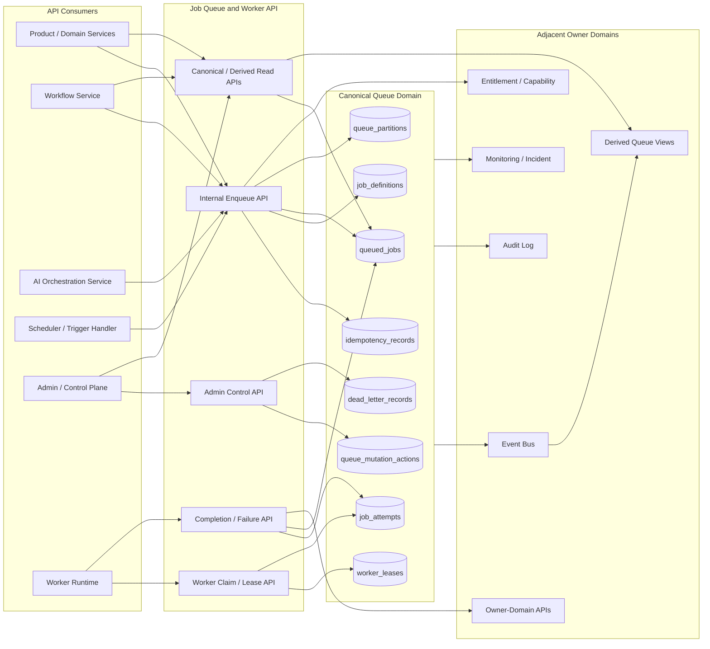
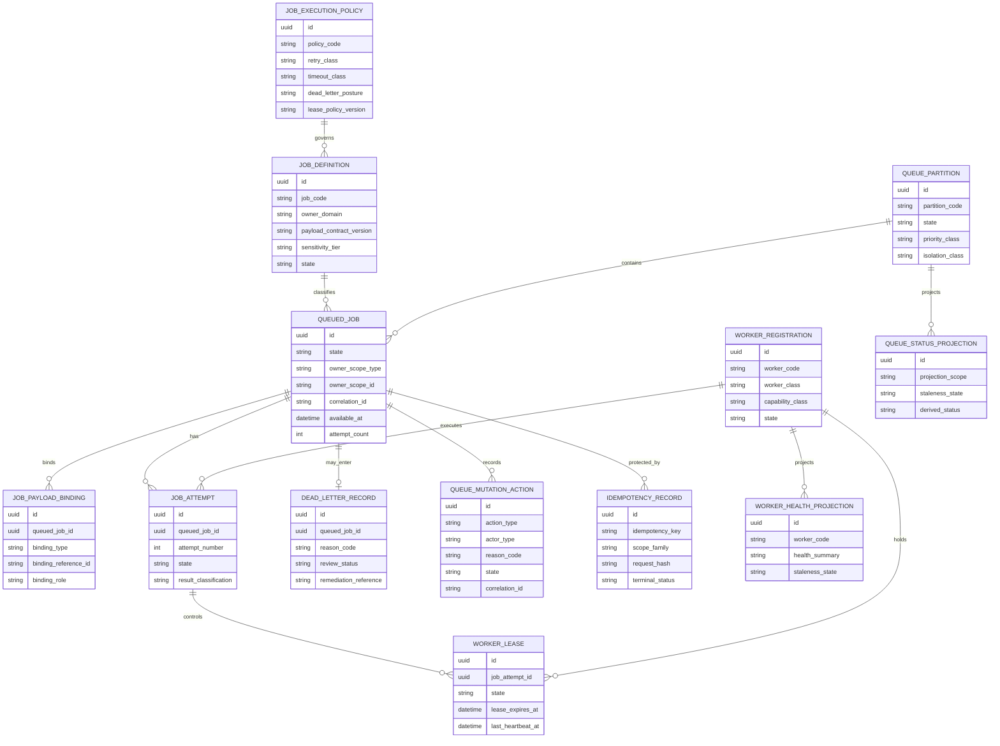

# JOB_QUEUE_AND_WORKER_API_SPEC.md

## Document Metadata

- **Document Name:** `JOB_QUEUE_AND_WORKER_API_SPEC.md`
- **Document Type:** API SPEC v2 — production-grade interface-contract specification
- **Status:** Draft for canonical API SPEC v2 approval
- **Version:** 2.0.0
- **Effective Date:** 2026-04-24
- **Last Updated:** 2026-04-24
- **Reviewed On:** 2026-04-24
- **Document Owner:** FUZE Job Queue and Worker Domain; named individual owner not explicitly specified in retrieved governing materials
- **Approval Authority:** FUZE platform architecture / API governance approval authority; explicit named approver not specified in retrieved governing materials
- **Review Cadence:** Review whenever queue topology, worker isolation, lease semantics, retry/dead-letter behavior, workflow coupling, AI execution posture, internal-service contract posture, event contracts, security posture, or control-plane remediation materially changes
- **Governing Layer:** Shared platform execution plane / job queue and worker API contract layer
- **Parent Registry:** `API_SPEC_INDEX.md`; API SPEC v2 Canonical File Registry
- **Upstream Semantic Registry:** `REFINED_SYSTEM_SPEC_INDEX.md`
- **Upstream API Registry:** `API_SPEC_INDEX.md`
- **Primary Audience:** Platform architecture, backend engineering, workflow/runtime engineering, AI engineering, product engineering, API/contract authors, security, audit, operations, support/control-plane operators, implementation-contract authors, QA, SDK/OpenAPI/AsyncAPI maintainers
- **Primary Purpose:** Define FUZE API contracts for deferred job acceptance, queue placement, worker claim and lease control, worker execution lineage, retry/timeout posture, dead-letter/quarantine handling, replay/cancellation/remediation, event propagation, observability, and auditability without allowing queue or worker APIs to become owners of workflow, AI, metering, billing, credits, entitlement, product, governance, or business-domain truth
- **Primary Upstream References:** `JOB_QUEUE_AND_WORKER_SPEC.md`; `REFINED_SYSTEM_SPEC_INDEX.md`; `API_SPEC_INDEX.md`; `DOCS_SPEC_INDEX.md`; `SYSTEM_SPEC_INDEX.md`; `WORKFLOW_AND_AUTOMATION_SPEC.md`; `AI_ORCHESTRATION_SPEC.md`; `MODEL_ROUTING_AND_CONTEXT_SPEC.md`; `AI_USAGE_METERING_SPEC.md`; `FEATURE_FLAG_AND_ROLLOUT_CONTROL_SPEC.md`; `API_ARCHITECTURE_SPEC.md`; `INTERNAL_SERVICE_API_SPEC.md`; `EVENT_MODEL_AND_WEBHOOK_SPEC.md`; `IDEMPOTENCY_AND_VERSIONING_SPEC.md`; `MIGRATION_AND_BACKWARD_COMPATIBILITY_SPEC.md`; `AUDIT_LOG_AND_ACTIVITY_SPEC.md`; `SECURITY_AND_RISK_CONTROL_SPEC.md`; `MONITORING_ALERTING_AND_INCIDENT_RESPONSE_SPEC.md`; `FUZE_WORKSPACE_ACCESS_CONTROL_BASICS_THESIS_FINAL_SPEC.md`; `FUZE_ACCOUNT_ACCESS_AND_SESSION_CANONICAL_FINAL_SPEC.md`
- **Primary Downstream Dependents:** Worker runtime implementation contracts; scheduler contracts; job definition registry contracts; retry-policy contracts; worker deployment adapters; internal service consumers; workflow step-execution contracts; AI execution jobs; reporting/export jobs; reconciliation jobs; notification fanout jobs; admin/control-plane tools; queue observability dashboards; OpenAPI/AsyncAPI/SDK artifacts
- **API Surface Families Covered:** Internal service APIs; worker-runtime APIs; admin/control-plane APIs; event/async APIs; operational read APIs; derived reporting/status APIs
- **API Surface Families Excluded:** General public mutation APIs; broad third-party queue webhooks; direct database APIs; broker-vendor APIs; product-local private worker APIs; frontend-owned queue mutation APIs; raw infrastructure autoscaling APIs
- **Canonical System Owner(s):** FUZE Job Queue and Worker Domain for queue, lease, attempt, worker, retry, timeout, dead-letter, quarantine, and execution-plane remediation semantics
- **Canonical API Owner:** FUZE Job Queue and Worker API family
- **Supersedes:** `JOB_QUEUE_WORKER_API_SPEC.md` as historical v1 API shape; any earlier API interpretation that treats broker state, worker-local state, product-local queues, or admin consoles as canonical queue truth
- **Superseded By:** None currently defined
- **Related Decision Records:** Not explicitly specified in retrieved governing materials
- **Canonical Status Note:** This API spec expresses refined queue/worker semantics at the interface-contract layer. It does not redefine refined system truth. Downstream OpenAPI, AsyncAPI, SDK, service, worker, scheduler, broker, and dashboard implementations MUST preserve this document's ownership, boundary, lineage, idempotency, audit, and control-plane requirements.
- **Implementation Status:** Target production contract; implementation alignment required before production readiness approval
- **Approval Status:** Pending explicit FUZE API SPEC v2 approval workflow
- **Change Summary:** Upgrades historical `JOB_QUEUE_WORKER_API_SPEC.md` into `JOB_QUEUE_AND_WORKER_API_SPEC.md`; normalizes API SPEC v2 metadata and structure; strengthens surface-family boundaries, accepted-state semantics, lease/claim contracts, retry/dead-letter/replay safety, non-canonical pattern detection, diagrams, acceptance criteria, and implementation test coverage.

---

## Purpose

This specification defines the FUZE API contract for the Job Queue and Worker domain.

The API exists because FUZE executes many long-running, retryable, scheduled, externally dependent, compute-heavy, reconciliation, notification, commercial, workflow, and AI tasks outside synchronous request paths. These tasks require a shared, governed execution substrate that is explicit, observable, idempotency-safe, auditable, and recoverable.

This API spec governs how internal services request deferred work, how jobs are accepted and placed into execution lanes, how workers claim jobs under leases, how heartbeats and attempts are recorded, how completion/failure/retry/dead-letter/quarantine/replay/cancellation work, and how queue-domain state is exposed to internal consumers, admin/control-plane tools, events, and derived operational views.

This API MUST preserve the refined semantic rule that queue and worker truth is execution-plane truth. Queue success means execution completed in the queue domain. It does not, by itself, prove that workflow state, AI run state, metering truth, billing truth, credits truth, entitlement truth, product truth, or governance truth was committed by the owning domain.

---

## Scope

This specification covers:

1. internal job enqueue APIs;
2. internal job claim APIs;
3. worker registration, heartbeat, lease, completion, and failure-report APIs;
4. retry, reschedule, timeout, cancellation, dead-letter, quarantine, and replay APIs;
5. queue partition and execution-lane control APIs;
6. admin/control-plane pause, drain, resume, quarantine, replay, force-cancel, release, and discrepancy remediation APIs;
7. operational read APIs for canonical queue, worker, lease, attempt, dead-letter, and partition state;
8. event and async API implications for queue lifecycle events;
9. derived read-model and reporting boundaries for queue health and backlog visibility;
10. request, response, error, status, idempotency, replay, migration, audit, and observability requirements;
11. OpenAPI, AsyncAPI, SDK, and implementation-contract derivation guardrails.

---

## Out of Scope

This specification does not define:

1. broker-vendor implementation contracts;
2. container orchestration, autoscaling, or worker deployment topology in operational detail;
3. exact cron/scheduler language or full schedule-authoring semantics;
4. workflow business meaning, approval semantics, or workflow-state ownership;
5. AI orchestration lifecycle semantics, model routing semantics, context release semantics, or AI usage metering truth;
6. billing, credits, payment, payout, entitlement, governance, or product-domain business truth;
7. exact payload schemas for every job class;
8. detailed incident runbooks;
9. public third-party queue mutation APIs;
10. user-facing dashboard UX copy.

All such downstream or adjacent documents MUST remain compatible with this API spec.

---

## Design Goals

1. Provide one shared, governed deferred-execution API substrate across FUZE.
2. Keep heavy, long-running, retryable, provider-dependent, or delayed work out of latency-sensitive synchronous paths.
3. Preserve explicit queue, attempt, lease, worker, retry, timeout, dead-letter, quarantine, replay, and remediation lineage.
4. Prevent queue and worker APIs from becoming shadow owners of business truth.
5. Provide deterministic, idempotency-safe mutation semantics for duplicate enqueue, duplicate claim, duplicate completion, retries, and replay.
6. Support workload isolation by job class, sensitivity, cost, priority, provider dependency, and incident containment needs.
7. Make queue execution observable, auditable, supportable, and recoverable.
8. Support safe OpenAPI, AsyncAPI, SDK, worker runtime, scheduler, and implementation-contract derivation.

---

## Non-Goals

1. This API does not make queue records the canonical owner of billing, credits, identity, authorization, entitlement, AI, workflow, governance, payout, or product truth.
2. This API does not authorize products to create private production queues for shared-domain work.
3. This API does not treat retries as a substitute for owning-domain idempotency or conflict handling.
4. This API does not allow worker runtime code to mutate sensitive domain records without explicit owner-domain contracts.
5. This API does not expose raw privileged queue mutation to public clients.
6. This API does not hide replay, quarantine, cancellation, or control-plane intervention behind ordinary worker behavior.
7. This API does not define one undifferentiated background execution lane for all workloads.

---

## Core Principles

### Platform-Owned Execution Substrate

Queue and worker coordination are shared FUZE platform capabilities. Products and domains MAY request jobs or consume job outcomes, but they MUST NOT redefine queue, attempt, lease, retry, timeout, or dead-letter semantics.

### Backend-Canonical Queue Truth

Backend-owned queue, lease, attempt, worker, partition, and remediation records are canonical for execution-plane state. Frontend, bot, dashboard, admin, broker, and worker-local views render or mediate this state; they do not own it.

### Execution-Not-Business-Truth

Queue APIs coordinate execution. They do not own the business meaning of AI output, workflow progression, billing completion, credit settlement, entitlement activation, product state, payout outcome, or governance action.

### Accepted Intent Before Execution

Material deferred work MUST begin from accepted intent recorded by an owning domain, workflow, scheduler, normalized event trigger, or the queue domain acting under a valid owner-domain contract.

### Explicit Attempt and Lease Lineage

Claim, lease, heartbeat, completion, failure, retry, timeout, cancellation, dead-letter, quarantine, and replay behavior MUST be reconstructable from durable records.

### Idempotency-Safe Execution

Duplicate enqueue, duplicate delivery, worker restart, lease timeout, ambiguous side effect, and replay MUST NOT silently create duplicate business effects.

### Bounded-Authority Worker

Workers execute bounded work under service identity, job-class policy, least privilege, and owner-domain contracts. Workers are not general-purpose mutation agents.

### Control-Plane Discipline

Pause, drain, resume, replay, cancel, release, quarantine, incident hold, and discrepancy remediation are control-plane actions. They MUST be bounded, policy-constrained, reason-coded, and audited.

### Visible Degraded Mode

When queue or worker conditions are unhealthy, FUZE MUST prefer visible degradation, controlled backlog growth, traffic shaping, hold states, or safe partition restrictions over unsafe silent execution.

### Derived Views Are Not Authority

Dashboards, activity feeds, incident consoles, exports, analytics, and queue-health summaries MAY project queue state but MUST NOT become canonical queue truth.

---

## Canonical Definitions

- **Job Definition:** A versioned definition of a deferred action class, including job code, owning domain, execution lane, payload contract reference, retry posture, timeout class, sensitivity tier, capability requirements, and result-contract expectations.
- **Job:** A durable accepted unit of deferred execution representing a bounded action to be executed by the queue and worker layer.
- **Job Payload Binding:** A lineage record connecting a job to domain objects, workflow instances, AI runs, source events, scopes, mutation intents, or provider inputs.
- **Queue Partition:** A logical execution lane grouping jobs with materially similar operational behavior, isolation needs, priority, sensitivity, and control requirements.
- **Worker Registration:** A durable record of a worker identity, worker class, capability class, runtime posture, and last-seen evidence.
- **Claim:** The act by which a worker accepts responsibility for an eligible job under a lease.
- **Lease:** A bounded runtime grant proving that one worker attempt is the current authorized executor for a claimed job.
- **Attempt:** One worker execution try associated with a job, including start, heartbeat, completion, failure, timeout, and supersession lineage.
- **Heartbeat:** Runtime evidence that an in-flight worker attempt remains alive and within lease posture.
- **Retryable Failure:** A failure class where policy permits another attempt after idempotency and safety checks.
- **Terminal Failure:** A failure class where automatic continuation is not allowed.
- **Dead-Letter:** A review-required isolation state for jobs that cannot safely continue automatically.
- **Quarantine:** A stronger containment state for poisoned, ambiguous, unsafe, sensitive, or incident-linked jobs.
- **Replay:** A bounded control-plane action that authorizes renewed execution based on prior job lineage without erasing history.
- **Compensation:** Explicit cleanup, release, reversal, or containment work after timeout, cancellation, partial completion, failure, or ambiguity.

---

## Truth Class Taxonomy

This API MUST preserve the following truth classes:

1. **Semantic truth:** meaning of jobs, job definitions, attempts, leases, workers, retries, timeouts, dead-letter, quarantine, and replay.
2. **API contract truth:** route-family boundaries, request fields, response classes, error codes, idempotency requirements, and versioning rules defined by this spec.
3. **Policy truth:** enqueue eligibility, execution-class routing, retry posture, timeout posture, worker capability, concurrency, isolation, entitlement gating, and remediation policy.
4. **Runtime truth:** current queue, partition, worker, lease, and attempt state.
5. **Ledger / storage truth:** durable queue-domain records for jobs, attempts, leases, worker registrations, dead-letter records, mutation actions, and idempotency records.
6. **Execution truth:** accepted async intent, queue progression, worker claim, attempt lineage, and terminal queue-domain outcome.
7. **Implementation-adapter truth:** broker state, worker-local state, scheduler mediation, provider SDK state, and runtime adapter translation.
8. **Provider-input truth:** external provider callback or dependency signal that MAY influence jobs only after normalization and validation.
9. **Event / async execution truth:** queue-domain events and async processing state; not final business truth unless owning domain confirms.
10. **Projection / reporting truth:** backlog summaries, worker-health dashboards, incident aggregates, SLA reports, and exports.
11. **Presentation truth:** user-visible labels, admin console wording, product progress summaries, and display-specific status composition.

Queue and worker truth MUST NOT absorb workflow truth, AI orchestration truth, routing/context truth, AI usage metering truth, authorization truth, entitlement truth, billing truth, credits truth, payment truth, payout truth, governance truth, or product truth.

---

## Architectural Position in the Spec Hierarchy

This API spec sits below the refined system semantic layer and expresses queue/worker semantics as API contracts.

### Upstream Semantic Owners

- `JOB_QUEUE_AND_WORKER_SPEC.md` owns job, queue, worker, lease, attempt, retry, timeout, dead-letter, quarantine, replay, and execution-plane remediation meaning.
- `WORKFLOW_AND_AUTOMATION_SPEC.md` owns workflow definition, workflow instance, approval, wait, compensation choreography, and cross-domain progression semantics.
- `AI_ORCHESTRATION_SPEC.md` owns AI execution request, AI run lifecycle, tool-use lineage, bounded AI output, and orchestration outcome semantics.
- `MODEL_ROUTING_AND_CONTEXT_SPEC.md` owns model routing, provider lane selection, context-pack release, context-source eligibility, and context lineage.
- `AI_USAGE_METERING_SPEC.md` owns normalized AI usage accounting, settlement-grade usage records, correction linkage, and metering truth.
- `FEATURE_FLAG_AND_ROLLOUT_CONTROL_SPEC.md` owns rollout and flag evaluation semantics that may enable or restrict job classes.
- `INTERNAL_SERVICE_API_SPEC.md` owns internal service-to-service mutation discipline and owner-domain contract posture.
- `EVENT_MODEL_AND_WEBHOOK_SPEC.md` owns event envelope, delivery, replay, webhook, and async event-contract posture.
- `IDEMPOTENCY_AND_VERSIONING_SPEC.md` owns cross-platform idempotency and compatibility posture.
- `AUDIT_LOG_AND_ACTIVITY_SPEC.md` owns immutable audit record semantics.
- `SECURITY_AND_RISK_CONTROL_SPEC.md` owns security and risk controls.
- `MONITORING_ALERTING_AND_INCIDENT_RESPONSE_SPEC.md` owns alerting, incident classification, and incident coordination semantics.

### Downstream Contract Layers

Downstream OpenAPI, AsyncAPI, SDK, service implementation contracts, worker runtime contracts, scheduler contracts, broker adapters, dashboard projections, and QA test suites MUST preserve this API spec and MUST NOT reinterpret queue/worker semantics.

---

## API Surface Families

### Internal Service APIs

Internal services use this surface to enqueue jobs, inspect authorized canonical state, claim work where service-authorized, and report queue-domain execution outcomes.

### Worker Runtime APIs

Worker processes use this surface to register, claim, heartbeat, complete, fail, release, and renew leases. Worker runtime APIs are privileged internal APIs and MUST use service identity and least privilege.

### Admin / Control-Plane APIs

Admin/control-plane APIs allow authorized operators to pause, drain, resume, restrict, quarantine, replay, force-cancel, release, and remediate queue state. These APIs require reason codes, policy checks, and durable audit linkage.

### Event / Async APIs

Queue-domain events announce queue execution outcomes and operational transitions. They MUST distinguish execution-plane outcomes from final business-domain outcomes.

### Reporting / Derived Read APIs

Derived read APIs MAY expose backlog, throughput, worker health, queue lag, dead-letter volume, and incident summaries. They are non-canonical and MUST preserve references to canonical queue records.

### Public API Posture

No general public API surface exists for raw queue mutation. Public-facing clients MAY receive product-owned progress or accepted-operation status from upstream products, but MUST NOT directly manipulate queue jobs, leases, partitions, or worker state.

---

## System / API Boundaries

1. The experience layer MAY initiate async actions through product or first-party application APIs but MUST NOT own queue truth.
2. Product and business domains own acceptance and final business semantics; they MAY request deferred execution.
3. The queue/worker API owns execution-plane acceptance, queue placement, claim/lease state, attempts, retries, timeouts, dead-letter, quarantine, replay lineage, and queue-domain completion/failure state.
4. Broker/vendor runtime state is implementation-adapter truth and MUST NOT replace durable queue-domain records.
5. Admin/control-plane APIs may intervene under policy but MUST NOT become ordinary business-state owners.
6. Reporting and dashboard views are projections and MUST NOT mutate canonical queue state.

---

## Adjacent API Boundaries

- **Workflow and Automation API:** May enqueue workflow continuation jobs and consume completion/failure events. It owns workflow progression, not queue-state meaning.
- **AI Orchestration API:** May enqueue heavy AI execution jobs and consume worker outcomes. It owns AI run lifecycle, not worker lease state.
- **Model Routing and Context API:** Provides routing/context decisions where jobs require model execution. Queue APIs may consume decisions but cannot redefine context governance.
- **AI Usage Metering API:** Consumes execution lineage where needed for usage accounting. Queue APIs may emit evidence but do not own metering truth.
- **Feature Flag and Rollout Control API:** May restrict job-class availability. Queue APIs enforce evaluated policy but do not own flag truth.
- **Entitlement and Capability APIs:** Own eligibility for premium/gated jobs. Queue APIs may block, hold, downgrade, or cancel based on evaluated entitlement posture.
- **Billing, Credits, Payments, Refunds, Payouts, Governance APIs:** Own their respective business outcomes. Queue APIs execute deferred work only through owner-domain contracts.
- **Internal Service API:** Owns service-to-service contract posture. Queue APIs must avoid hidden broad-write shortcuts.
- **Event/Webhook API:** Owns event envelope and external delivery posture. Queue events are internal by default unless separately approved.
- **Audit API:** Owns immutable audit records. Queue APIs source audit evidence for sensitive execution actions.

---

## Conflict Resolution Rules

1. `REFINED_SYSTEM_SPEC_INDEX.md` and active refined system specs win over historical API v1 files.
2. `JOB_QUEUE_AND_WORKER_SPEC.md` wins on queue-state, worker-state, lease, attempt, retry, timeout, dead-letter, quarantine, replay, and execution-plane semantics.
3. `WORKFLOW_AND_AUTOMATION_SPEC.md` wins on workflow-state meaning.
4. `AI_ORCHESTRATION_SPEC.md` wins on AI run meaning and AI output publication rules.
5. `MODEL_ROUTING_AND_CONTEXT_SPEC.md` wins on routing/context meaning.
6. `AI_USAGE_METERING_SPEC.md` wins on usage accounting truth.
7. Canonical business domains win over queue state whenever queue state conflicts with domain business truth.
8. Internal service contracts win over ad hoc worker mutation paths.
9. Broker state, scheduler state, and worker-local state never win by themselves.
10. Reporting, dashboards, and exports never win over canonical queue records.
11. When ambiguity remains, FUZE MUST choose the most conservative platform-consistent interpretation and escalate ambiguity into downstream refinement or a recorded decision.

---

## Default Decision Rules

1. Material deferred execution defaults to explicit queue representation.
2. Queue state defaults to execution meaning only.
3. Worker completion defaults to “execution attempt completed,” not “business effect committed,” unless the owning domain confirms the effect.
4. Retry defaults to bounded, policy-governed, idempotency-safe behavior.
5. Timeout defaults to ambiguity; sensitive re-execution requires revalidation, idempotency proof, or repair policy.
6. Dead-letter defaults to visible review/quarantine, not deletion.
7. Replay defaults to explicit policy or operator authorization with preserved lineage.
8. Admin intervention defaults to reason-coded, audited control-plane action.
9. If no clear owner can be named for the business effect of a job, the design MUST NOT ship.
10. Public exposure defaults to no raw queue mutation.
11. Derived read models default to non-authoritative status.

---

## Roles / Actors / API Consumers

### Human Actors

- End users, through product-owned progress surfaces only.
- Workspace members and owners, through product/first-party APIs where async work is product-scoped.
- Internal support operators, through bounded admin/control-plane routes.
- Security/trust reviewers, through audit and control-plane review routes.
- Platform engineers and runtime operators, through privileged operational interfaces.

### System Actors

- First-party application backends.
- Product domain services.
- Workflow and automation services.
- AI orchestration services.
- Schedulers and normalized trigger handlers.
- Worker runtimes.
- Internal event consumers.
- Audit, monitoring, and incident services.
- Reporting/projection builders.
- Broker adapters and runtime infrastructure adapters.

---

## Resource / Entity Families

Canonical API resources include:

1. `job_definitions`
2. `job_execution_policies`
3. `queue_partitions`
4. `queued_jobs`
5. `job_payload_bindings`
6. `job_attempts`
7. `worker_registrations`
8. `worker_leases`
9. `dead_letter_records`
10. `queue_mutation_actions`
11. `job_result_references`
12. `idempotency_records`
13. `audit_linkages`
14. `queue_status_projections` as derived, non-authoritative views
15. `worker_health_projections` as derived, non-authoritative views

---

## Ownership Model

### Canonical Queue Ownership

The Job Queue and Worker Domain owns canonical mutation APIs for queue-domain records: job definitions, jobs, partitions, worker registrations, leases, attempts, dead-letter records, queue mutation actions, replay linkage, and queue-domain execution outcomes.

### Business-Effect Ownership

The domain named in the job definition or payload binding owns final business effect. Queue APIs MUST invoke owner-domain contracts and MUST NOT directly reinterpret or commit another domain’s business truth.

### Worker Runtime Ownership

Workers own runtime execution participation only. They may report execution outcomes but do not own canonical state outside their active lease and authorized job class.

### Control-Plane Ownership

Control-plane operators may mutate queue state under bounded authority. Control-plane actions MUST preserve audit, reason code, before/after state, and lineage. They do not become ordinary workflow, AI, billing, credits, entitlement, or product owners.

---

## Authority / Decision Model

1. Enqueue authority is based on caller identity, service authority, job definition, target owner domain, scope, policy, sensitivity tier, entitlement posture where applicable, and idempotency posture.
2. Claim authority is based on worker identity, worker capability, queue partition, job class, current partition state, active policy, and lease eligibility.
3. Completion/failure authority requires active lease ownership and valid attempt state.
4. Retry authority is policy-derived and must consider idempotency, failure class, job class, side-effect ambiguity, and max attempts.
5. Replay authority is control-plane or policy-mediated and MUST preserve original failure lineage.
6. Business mutation authority remains with the target owner domain.

---

## Authentication Model

1. Internal service routes MUST use service-to-service authentication.
2. Worker routes MUST use durable worker/service identity and capability class evidence.
3. Admin/control-plane routes MUST use authenticated privileged human or service identity with operator role and policy evaluation.
4. Public clients MUST NOT authenticate directly against raw queue mutation routes.
5. Event consumers MUST authenticate through internal event infrastructure or approved webhook delivery mechanisms.

Authentication proves identity only. It does not by itself grant queue action authority.

---

## Authorization / Scope / Permission Model

Authorization checks MUST evaluate:

1. actor type and identity;
2. service or worker capability class;
3. job definition access;
4. queue partition access;
5. owner-domain authority;
6. workspace/account/product scope references where relevant;
7. sensitivity tier;
8. current job/attempt/lease/partition state;
9. policy version;
10. reason-code and approval linkage for admin actions.

Workers MUST NOT self-authorize broader privileges during degraded mode. Admin actions require stronger authorization than ordinary enqueue or status reads.

---

## Entitlement / Capability-Gating Model

The queue/worker API does not own entitlement truth. However, it MUST support entitlement/capability gating where job classes represent premium, costly, sensitive, or restricted capabilities.

1. Gated job enqueue MAY require entitlement validation before acceptance.
2. Long-running jobs MAY require entitlement revalidation before execution continuation or final side-effect invocation.
3. Loss of entitlement during deferred execution MAY trigger hold, downgrade, cancellation, quarantine, or review according to policy.
4. Workers MUST NOT expand capability use when entitlement context is missing or degraded.
5. Queue records MUST preserve enough lineage to explain entitlement-related acceptance, hold, denial, downgrade, or cancellation outcomes.

---

## API State Model

### Job States

- `accepted`
- `queued`
- `claimed`
- `running`
- `succeeded`
- `retryable_failure`
- `retry_scheduled`
- `failed_terminal`
- `dead_lettered`
- `quarantined`
- `canceled`
- `timed_out`
- `compensated` where applicable

### Attempt States

- `started`
- `heartbeat_current`
- `completed_success`
- `completed_retryable_failure`
- `completed_terminal_failure`
- `timed_out`
- `abandoned`
- `superseded`

### Lease States

- `active`
- `expired`
- `released`
- `revoked`
- `superseded`

### Worker States

- `starting`
- `ready`
- `degraded`
- `draining`
- `paused`
- `unhealthy`
- `retired`

### Queue Partition / Control States

- `normal`
- `restricted`
- `paused`
- `draining`
- `quarantined`
- `incident_hold`

All state values are API contract values. Downstream schemas MAY add fields but MUST NOT silently change these meanings.

---

## Lifecycle / Workflow Model

1. An owning domain, workflow, scheduler, AI orchestrator, product service, or normalized event trigger requests deferred execution.
2. The API validates actor/service identity, owner-domain authority, scope, policy, sensitivity tier, entitlement posture where applicable, payload contract version, and idempotency.
3. The API records accepted job intent, payload bindings, owner-domain references, correlation IDs, and job definition version.
4. The job is placed into a queue partition consistent with job class, sensitivity, priority, and execution policy.
5. An eligible worker claims the job under a bounded lease.
6. The worker emits heartbeat/progress evidence where required.
7. The worker invokes owner-domain contracts or bounded execution adapters.
8. The worker reports success, retryable failure, terminal failure, timeout, or ambiguity.
9. The queue domain records terminal or next-step state and emits queue-domain events.
10. Owner domains, workflow, audit, monitoring, and projections consume queue-domain outcomes according to their own contracts.
11. If automatic continuation is unsafe, the job is dead-lettered or quarantined.
12. If operator action is required, admin/control-plane APIs preserve reason code, actor lineage, policy linkage, and supersession history.

---

## Architecture Diagram — Mermaid flowchart



---

## Data Design — Mermaid Diagram



Derived projection entities MUST NOT be used as mutation owners.

---

## Flow View

### Happy Path — Enqueue and Execute

1. Internal service submits `POST /internal/v1/jobs` with `job_code`, owner scope, payload binding references, correlation ID, and idempotency key.
2. API authenticates the caller and evaluates service authority, owner-domain authority, scope, job definition, policy, sensitivity, entitlement posture where applicable, and payload contract version.
3. API stores idempotency record and durable `queued_job` plus payload bindings.
4. API returns `202 Accepted` with `job_id`, `state=queued`, `operation_reference`, and follow-up status link.
5. Worker claims eligible job under `POST /internal/v1/jobs/claims` and receives attempt and lease.
6. Worker heartbeats during execution.
7. Worker invokes owner-domain contract or bounded adapter.
8. Worker reports completion through `POST /internal/v1/jobs/{job_id}/complete`.
9. Queue domain records execution success and emits events/audit/observability signals.
10. Owner domain remains authoritative for final business truth.

### Retry Path

1. Worker reports retryable failure with failure classification.
2. API checks policy, idempotency posture, attempt count, side-effect ambiguity, and retry class.
3. Job transitions to `retry_scheduled` with backoff.
4. Subsequent claim creates a new attempt under preserved lineage.
5. Duplicate business effects remain prevented by owner-domain idempotency and queue-domain idempotency.

### Timeout Path

1. Lease heartbeat expires.
2. API marks lease `expired` and attempt `timed_out` or `abandoned` according to policy.
3. Timeout is treated as ambiguous, not proof of no side effect.
4. Job moves to retry, hold, dead-letter, quarantine, or remediation according to sensitivity and policy.

### Dead-Letter / Quarantine Path

1. Job exhausts retry policy or becomes unsafe/ambiguous/poisoned.
2. API records `dead_letter_record` or quarantine action.
3. Admin/control-plane review may close, repair, replay, or keep quarantined.
4. Replay creates explicit superseding lineage and does not erase prior attempts.

### Admin Partition Control Path

1. Operator pauses, drains, restricts, resumes, or incident-holds a partition.
2. API validates privileged authority, reason code, policy, and optional incident/case linkage.
3. API records queue mutation action, audit event, and partition state transition.
4. In-flight leases are handled according to policy; new claims are restricted as appropriate.

### Degraded Mode Path

1. Monitoring detects unhealthy worker pool, broker degradation, provider outage, or backlog saturation.
2. API may restrict claims, throttle enqueue, pause partitions, hold sensitive jobs, or route low-priority work to delayed states.
3. Degraded state is visible to monitoring and authorized admin/read APIs.
4. Degraded mode MUST NOT silently broaden worker privileges or drop canonical state.

---

## Data Flows — Mermaid sequenceDiagram

```mermaid
sequenceDiagram
    participant S as Internal Service
    participant Q as Job Queue API
    participant I as Idempotency Store
    participant P as Policy/Auth/Entitlement
    participant D as Queue Domain Store
    participant W as Worker Runtime
    participant O as Owner-Domain API
    participant E as Event Bus
    participant A as Audit/Monitoring
    participant R as Derived Projections

    S->>Q: POST /internal/v1/jobs + Idempotency-Key
    Q->>P: Authenticate, authorize, validate scope/policy/job definition
    P-->>Q: allowed + policy context
    Q->>I: record or resolve idempotency key
    I-->>Q: fresh or replayed result
    Q->>D: create queued_job + bindings
    Q->>E: emit queue.job_enqueued
    Q->>A: record enqueue audit/metric where required
    Q-->>S: 202 Accepted + job_id + state=queued

    W->>Q: POST /internal/v1/jobs/claims
    Q->>P: validate worker identity/capability/partition policy
    Q->>D: create attempt + active lease; mark job claimed/running
    Q->>E: emit queue.job_claimed
    Q-->>W: lease + attempt + payload binding refs

    loop while execution is active
        W->>Q: POST /internal/v1/jobs/{id}/heartbeats
        Q->>D: validate lease and record heartbeat
        Q-->>W: heartbeat accepted
    end

    W->>O: invoke bounded owner-domain contract
    O-->>W: owner-domain result or failure classification
    W->>Q: POST /internal/v1/jobs/{id}/complete or /fail
    Q->>D: validate lease, close attempt, classify outcome
    alt success
        Q->>E: emit queue.job_completed
    else retryable failure
        Q->>D: schedule retry preserving lineage
        Q->>E: emit queue.job_failed + retry_scheduled
    else terminal / unsafe
        Q->>D: create dead_letter/quarantine record
        Q->>E: emit queue.job_dead_lettered
    end
    Q->>A: audit + metrics + traces
    E->>R: update derived projections asynchronously
```

---

## Request Model

Mutation requests MUST include:

1. authenticated actor or service identity;
2. `Idempotency-Key` for all mutation-capable routes;
3. `correlation_id` or platform-generated correlation linkage;
4. route-specific resource identifiers;
5. owner scope reference where applicable;
6. job definition or job code for enqueue;
7. payload binding references, not arbitrary ungoverned payload blobs for sensitive jobs;
8. policy version or resolved policy linkage where material;
9. reason code and operator note for admin/control-plane actions;
10. lease ID and worker registration ID for worker completion/failure/heartbeat actions.

Requests MUST NOT:

1. rely on ambient workspace/account context for material jobs;
2. allow worker-local state as sufficient proof of canonical state;
3. submit raw business mutations outside owner-domain contracts;
4. use a public user credential to claim or mutate worker state;
5. omit reason codes for privileged remediation actions;
6. use the same idempotency key for semantically different requests.

---

## Response Model

### Enqueue Responses

Enqueue responses SHOULD use `202 Accepted` when final business effect is deferred and MUST include:

- `job_id`;
- `job_code`;
- `state`;
- `queue_partition_code`;
- `owner_scope` where applicable;
- `operation_reference`;
- `idempotency_result`;
- `correlation_id`;
- `accepted_at`;
- `status_url` for authorized internal consumers.

### Claim Responses

Claim responses MUST distinguish:

- claim granted;
- no eligible jobs;
- partition paused/restricted/draining;
- worker not authorized;
- lease conflict;
- policy hold.

### Completion / Failure Responses

Completion/failure responses MUST include:

- job state;
- attempt state;
- lease state;
- result classification;
- retry/dead-letter/quarantine status where applicable;
- owner-domain result reference if available;
- queue-domain event references where applicable.

### Admin Responses

Admin responses MUST include:

- action ID;
- target resource;
- before/after state summary;
- reason code;
- audit reference;
- correlation ID;
- whether execution is immediate or accepted for async control.

### Read Responses

Read responses MUST distinguish canonical queue truth from derived summaries and MUST label stale or eventually consistent projection data.

---

## Error / Result / Status Model

The API MUST use structured problem-details-style errors.

Required fields:

- `type`
- `title`
- `status`
- `code`
- `detail`
- `instance`
- `correlation_id`
- `retryable`
- `policy_reference` where safe and relevant

### Error Code Families

#### Authentication / Authorization

- `QUEUE_AUTHENTICATION_REQUIRED`
- `QUEUE_SERVICE_PERMISSION_DENIED`
- `QUEUE_WORKER_PERMISSION_DENIED`
- `QUEUE_OPERATOR_PERMISSION_DENIED`
- `QUEUE_SCOPE_FORBIDDEN`
- `QUEUE_ENTITLEMENT_REQUIRED`

#### Request Integrity

- `QUEUE_REQUEST_INVALID`
- `QUEUE_PAYLOAD_BINDING_INVALID`
- `QUEUE_JOB_DEFINITION_UNKNOWN`
- `QUEUE_POLICY_VERSION_UNSUPPORTED`
- `QUEUE_IDEMPOTENCY_KEY_REQUIRED`
- `QUEUE_IDEMPOTENCY_CONFLICT`

#### State Conflict

- `QUEUE_JOB_STATE_INVALID`
- `QUEUE_ATTEMPT_STATE_INVALID`
- `QUEUE_LEASE_INVALID`
- `QUEUE_LEASE_EXPIRED`
- `QUEUE_PARTITION_STATE_INVALID`
- `QUEUE_COMPLETION_CONFLICT`
- `QUEUE_REPLAY_CONFLICT`

#### Policy / Safety

- `QUEUE_PARTITION_RESTRICTED`
- `QUEUE_PARTITION_PAUSED`
- `QUEUE_JOB_NOT_CLAIMABLE`
- `QUEUE_RETRY_LIMIT_EXCEEDED`
- `QUEUE_REPLAY_FORBIDDEN`
- `QUEUE_QUARANTINE_REQUIRED`
- `QUEUE_TIMEOUT_AMBIGUOUS`
- `QUEUE_OWNER_DOMAIN_REQUIRED`

#### Dependency / Runtime

- `QUEUE_BROKER_UNAVAILABLE`
- `QUEUE_WORKER_REGISTRATION_UNAVAILABLE`
- `QUEUE_OWNER_DOMAIN_UNAVAILABLE`
- `QUEUE_POLICY_SERVICE_UNAVAILABLE`
- `QUEUE_MONITORING_UNAVAILABLE`

Errors MUST NOT imply business success or failure beyond queue-domain truth.

---

## Idempotency / Retry / Replay Model

### Idempotency Required For

- enqueue;
- claim handshake;
- heartbeat;
- completion;
- failure report;
- retry scheduling;
- replay;
- quarantine;
- force-cancel;
- partition pause/resume/drain;
- discrepancy remediation.

### Idempotency Rules

1. The backend stores idempotency key, scope, actor, request hash, resulting resource, terminal result, and expiry.
2. Reuse of the same key with the same semantic request returns the original outcome.
3. Reuse of the same key with a different semantic request fails with `QUEUE_IDEMPOTENCY_CONFLICT`.
4. Idempotency scope MUST include actor/service identity and route family.
5. Worker completion/failure idempotency MUST include job ID, attempt ID, lease ID, and result classification.

### Retry Rules

1. Retry is allowed only when job policy, failure class, idempotency posture, attempt count, and side-effect ambiguity permit it.
2. Retry MUST distinguish transport failure, dependency failure, provider failure, validation conflict, timeout, and ambiguous prior side effect.
3. Retry MUST preserve prior attempt history.
4. Retry MUST NOT assume repeated transport delivery is business-safe by default.

### Replay Rules

1. Replay is a bounded control-plane or policy-mediated action.
2. Replay MUST preserve original job, failure context, operator/policy authority, and superseding job lineage.
3. Replay MUST NOT erase dead-letter, quarantine, or terminal failure history.
4. Replay of sensitive jobs SHOULD require stronger authorization, incident/case linkage, and revalidation of owner-domain posture.

---

## Rate Limit / Abuse-Control Model

1. Enqueue APIs SHOULD enforce per-service, per-job-class, per-scope, and per-partition limits.
2. Claim APIs SHOULD enforce worker-class concurrency and partition-specific claim limits.
3. Heartbeat APIs SHOULD enforce sane frequency bounds to prevent noisy-worker abuse.
4. Replay and admin mutation APIs MUST be strongly rate-limited and policy-constrained.
5. Queue partitions MAY enter restricted or incident-hold state when abuse, runaway enqueue, poison-pill behavior, or retry storms are detected.
6. Abuse controls MUST preserve audit and observability evidence rather than silently dropping material jobs.

---

## Endpoint / Route Family Model

Route names are normative families, not final exhaustive OpenAPI paths.

### Internal Service Routes

- `POST /internal/v1/jobs` — enqueue a job.
- `GET /internal/v1/jobs/{job_id}` — read canonical job state.
- `GET /internal/v1/jobs/{job_id}/attempts` — read attempt lineage.
- `GET /internal/v1/queue-partitions/{partition_code}` — read partition state.
- `GET /internal/v1/job-definitions/{job_code}` — read job definition contract summary.

### Worker Runtime Routes

- `POST /internal/v1/workers/register` — register or refresh worker identity.
- `POST /internal/v1/jobs/claims` — claim an eligible job.
- `POST /internal/v1/jobs/{job_id}/heartbeats` — renew or affirm lease.
- `POST /internal/v1/jobs/{job_id}/complete` — complete an attempt.
- `POST /internal/v1/jobs/{job_id}/fail` — fail an attempt with classification.
- `POST /internal/v1/jobs/{job_id}/release` — release lease where policy permits.

### Admin / Control-Plane Routes

- `POST /admin/v1/queue-partitions/{partition_code}/pause`
- `POST /admin/v1/queue-partitions/{partition_code}/resume`
- `POST /admin/v1/queue-partitions/{partition_code}/drain`
- `POST /admin/v1/queue-partitions/{partition_code}/restrict`
- `POST /admin/v1/jobs/{job_id}/quarantine`
- `POST /admin/v1/jobs/{job_id}/replay`
- `POST /admin/v1/jobs/{job_id}/force-cancel`
- `POST /admin/v1/jobs/{job_id}/force-release-lease`
- `POST /admin/v1/queue-discrepancies`

### Derived Read Routes

- `GET /internal/v1/queue-status`
- `GET /internal/v1/worker-health`
- `GET /admin/v1/dead-letter-jobs`
- `GET /admin/v1/queue-incidents/{incident_id}/jobs`

Derived read routes MUST label projection staleness and canonical source references.

---

## Public API Considerations

General public clients MUST NOT directly create, claim, mutate, replay, cancel, quarantine, or inspect raw queue jobs. Product-owned public APIs MAY return accepted operation references or high-level progress labels derived from queue state only when:

1. the product owns the user-facing action;
2. no privileged queue internals are exposed;
3. the response distinguishes accepted intent from final business outcome;
4. stale or degraded derived state is handled safely;
5. raw worker/lease/dead-letter/control details are excluded.

---

## First-Party Application API Considerations

First-party applications MAY invoke product-owned endpoints that result in deferred jobs. They MUST NOT call raw queue mutation routes directly. First-party UI may display progress derived from queue status only when the owning product or workflow API provides an approved projection.

---

## Internal Service API Considerations

Internal service APIs are the primary queue mutation surface. They MUST:

1. require service identity;
2. enforce owner-domain authority;
3. require idempotency keys;
4. preserve correlation IDs;
5. use payload binding references;
6. avoid hidden table-level coupling;
7. return accepted-state semantics for deferred effects;
8. emit audit/event/monitoring evidence according to sensitivity.

---

## Admin / Control-Plane API Considerations

Admin/control-plane APIs MUST be separated from ordinary internal service routes. They MUST require:

1. privileged actor/service identity;
2. policy authorization;
3. reason code;
4. operator note where material;
5. incident/support/security case linkage for sensitive actions where policy requires;
6. idempotency key;
7. audit event;
8. before/after state summary;
9. rollback or containment visibility where applicable.

Control-plane APIs MUST NOT become broad hidden business-write shortcuts.

---

## Event / Webhook / Async API Considerations

### Internal Events

The queue domain SHOULD emit events such as:

- `queue.job_accepted`
- `queue.job_enqueued`
- `queue.job_claimed`
- `queue.job_heartbeat_recorded`
- `queue.job_completed`
- `queue.job_failed`
- `queue.job_retry_scheduled`
- `queue.job_timed_out`
- `queue.job_dead_lettered`
- `queue.job_quarantined`
- `queue.job_replayed`
- `queue.job_cancelled`
- `queue.lease_expired`
- `queue.partition_paused`
- `queue.partition_resumed`
- `queue.partition_draining`
- `queue.discrepancy_resolved`

### Event Payload Minimums

- event ID;
- event type;
- occurred_at;
- job ID;
- job code;
- job definition version;
- partition code;
- attempt ID where applicable;
- lease ID where applicable;
- worker ID where applicable;
- owner-domain reference;
- owner-scope reference where applicable;
- action ID where applicable;
- reason code where applicable;
- correlation ID;
- idempotency reference where safe;
- event schema version.

### Webhook Posture

No broad external queue webhooks are approved by default. Any external webhook surface exposing job progress MUST be approved in a separate public/webhook contract and MUST not expose privileged worker, lease, policy, or admin details.

---

## Chain-Adjacent API Considerations

Queue APIs MAY execute jobs that support chain-adjacent workflows, such as payout support work, registry propagation, snapshot preparation, eligibility processing, or chain-observation normalization. Queue APIs MUST NOT become chain truth.

1. Chain observations remain provider/input truth until normalized by the proper owner domain.
2. Queue completion does not imply on-chain finality.
3. Chain-adjacent retries require explicit idempotency and side-effect ambiguity handling.
4. Governance-sensitive and treasury-sensitive queue jobs require stronger authorization, audit, and control-plane handling.

---

## Data Model / Storage Support Implications

Implementation storage MUST support:

1. immutable or append-oriented attempt lineage;
2. active lease lookup and expiration;
3. job definition version linkage;
4. execution policy version linkage;
5. owner-domain and owner-scope references;
6. idempotency records;
7. dead-letter/quarantine records;
8. replay/supersession linkage;
9. admin action records;
10. audit references;
11. correlation and trace IDs;
12. derived projection staleness metadata.

Broker acknowledgements, worker memory, and vendor queue state MUST NOT be the only durable record of material job state.

---

## Read Model / Projection / Reporting Rules

Derived views MAY include:

- queue backlog by partition;
- latency and throughput summaries;
- retry/dead-letter trends;
- worker health summaries;
- incident-linked queue views;
- product progress summaries;
- SLA and export reports.

Derived views MUST:

1. preserve linkage to canonical queue records;
2. label staleness where relevant;
3. never invent business success semantics;
4. never mutate canonical queue state;
5. never hide terminal failure, replay, quarantine, or cancellation history from authorized operators;
6. avoid exposing privileged details to lower-privilege consumers.

---

## Security / Risk / Privacy Controls

1. Worker credentials MUST be least-privilege and job-class-scoped.
2. Queue partitions SHOULD be isolated by sensitivity, priority, cost, provider dependency, and incident containment needs.
3. Payloads MUST use references or minimized payload summaries for sensitive data.
4. Admin actions MUST be reason-coded and audited.
5. Replay MUST be protected against amplification, duplicate side effects, and abuse.
6. Dead-letter and quarantine records MUST protect sensitive payload details.
7. Worker logs MUST avoid leaking confidential payloads, secrets, or private user data.
8. Degraded mode MUST NOT grant broader worker privileges.
9. Unauthorized job injection, payload tampering, stale payload execution, and cross-scope claim attempts MUST be blocked and observable.

---

## Audit / Traceability / Observability Requirements

The API MUST preserve structured lineage sufficient to explain:

1. who or what requested enqueue;
2. what owner domain and scope authorized the job;
3. what job definition, payload contract, and policy version governed execution;
4. which worker claimed the job;
5. what lease authorized execution;
6. what attempts occurred;
7. what failure or result classification was reported;
8. what retry/dead-letter/quarantine/replay/cancel decision occurred;
9. what admin actor and reason code were used for control-plane actions;
10. which events, audit records, and traces were emitted.

Observability MUST include queue depth, claim latency, execution latency, heartbeat health, retry rate, dead-letter volume, timeout volume, worker availability, partition state, duplicate-delivery signals, idempotency conflicts, and owner-domain dependency failures.

---

## Failure Handling / Edge Cases

### Worker Crashes After Side Effect Before Completion

The queue may see timeout or lease expiration. Re-execution MUST require idempotency and owner-domain confirmation because side effects may already have occurred.

### Duplicate Enqueue From Same Upstream Event

Idempotency MUST return the original job or reject conflicting requests. Duplicate business effects MUST be prevented by queue and owner-domain guards.

### Payload Becomes Stale Before Execution

Sensitive jobs MUST revalidate payload bindings before final owner-domain mutation.

### Queue Backlog During Provider Outage

The system MAY restrict partitions, delay low-priority jobs, hold sensitive jobs, or surface degraded state. It MUST NOT silently drop material jobs.

### Heavy Report Job Partially Completes

Partial completion MUST be visible and recoverable. Derived report artifacts MUST NOT be treated as canonical queue success without durable queue state.

### Credits Reservation Linked to Timed-Out AI Job

Release, retry, or compensation MUST be explicit, auditable, and owned by the appropriate credits/metering/orchestration domains.

### Operator Replays Dead-Letter Without Fixing Root Cause

Replay MUST preserve prior failure lineage and repeated failures MUST remain visible.

### Lease Lost While Worker Continues

Sensitive execution after lease loss is forbidden unless an approved grace policy exists. Completion after lease loss MUST be rejected or routed to remediation.

---

## Migration / Versioning / Compatibility / Deprecation Rules

1. Route families SHOULD remain under `/internal/v1` and `/admin/v1` until a formal version transition is approved.
2. Additive response fields are allowed when they do not change semantics.
3. State meaning changes are breaking changes.
4. Lease and heartbeat semantic changes are breaking changes.
5. Retry/dead-letter/replay behavior changes are breaking changes when they affect safety, idempotency, or lineage.
6. Job definition and payload contract versions MUST be explicit where semantics can change.
7. Deprecated fields/routes MUST include deprecation metadata and compatibility windows.
8. Migration plans MUST preserve old-to-new job lineage where active jobs span versions.
9. In-flight jobs MUST not be silently reinterpreted under new policy without versioned migration logic.

---

## OpenAPI / AsyncAPI / SDK Derivation Rules

OpenAPI artifacts MUST preserve:

1. internal/admin route separation;
2. idempotency header requirements;
3. accepted-state response semantics;
4. structured error codes;
5. correlation/trace fields;
6. job/attempt/lease/partition state enums;
7. reason-code requirements for admin routes;
8. least-privilege authorization scopes;
9. projection staleness labels.

AsyncAPI artifacts MUST preserve event envelope versioning, event IDs, event type names, correlation IDs, resource references, replay safety, duplicate delivery assumptions, and distinction between queue-domain outcomes and business-domain outcomes.

SDKs MUST NOT provide public-client helpers for raw privileged queue mutation.

---

## Implementation-Contract Guardrails

1. Workers MUST mutate queue state through approved APIs, not direct database writes.
2. Workers MUST invoke owner-domain APIs or bounded adapters for business side effects.
3. Broker state MUST be reconciled into durable queue records.
4. Retry policy MUST be data/config governed and visible, not hidden solely in worker code.
5. Admin actions MUST have durable action records.
6. All material jobs MUST include owner-domain and owner-scope references.
7. Queue projections MUST not become repair mechanisms.
8. Worker-runtime code MUST tolerate duplicate delivery and restarts.
9. Sensitive job payloads MUST be minimized or referenced, not broadly replicated.
10. Test suites MUST validate lease, idempotency, retry, timeout, dead-letter, replay, and boundary-violation behavior.

---

## Downstream Execution Staging

1. Define or align job definition registry and payload contract versioning.
2. Align internal enqueue APIs with owner-domain acceptance semantics.
3. Implement lease/claim/heartbeat/attempt records.
4. Implement idempotency records across all mutation routes.
5. Implement retry/dead-letter/quarantine/replay policy engine.
6. Implement admin/control-plane routes with audit and reason codes.
7. Implement queue-domain events and AsyncAPI artifacts.
8. Implement derived projections with staleness labels.
9. Implement observability dashboards and alerting hooks.
10. Run contract, regression, degraded-mode, and migration tests before production approval.

---

## Required Downstream Specs / Contract Layers

- Machine-readable OpenAPI for internal/admin route families.
- AsyncAPI for queue-domain events.
- Worker runtime implementation contract.
- Job definition registry and payload contract guide.
- Retry/dead-letter/quarantine policy contract.
- Scheduler integration contract.
- Broker adapter contract.
- Queue projection/reporting contract.
- Admin remediation runbook and control-plane contract.
- QA/regression test suite.

---

## Boundary Violation Detection / Non-Canonical API Patterns

The following patterns are forbidden unless a narrower approved exception exists:

1. product-local shadow queues for shared-domain behavior;
2. direct worker mutation of another domain’s tables;
3. treating broker acknowledgement as canonical queue truth;
4. silent replay of terminal or ambiguous jobs;
5. assuming timeout proves no side effect occurred;
6. hiding retry policy solely inside worker code;
7. using admin UI state as source of truth;
8. exposing raw queue mutation through public APIs;
9. allowing dashboards to repair queue state;
10. claiming jobs without explicit lease;
11. completing or failing attempts without active lease validation;
12. replacing owner-domain idempotency with queue retry alone;
13. silently deleting dead-lettered jobs;
14. collapsing queue completion into billing, credits, entitlement, AI, or workflow success.

---

## Canonical Examples / Anti-Examples

### Canonical Example — Workflow Continuation Job

A workflow step requires delayed execution. Workflow API records accepted workflow state and calls the queue enqueue API with workflow instance binding. Worker claims the job, runs the bounded step, reports completion, and workflow consumes the queue event to advance workflow state. Queue completion does not itself advance workflow unless workflow accepts the event.

### Canonical Example — Heavy AI Job

AI orchestration accepts an AI run and enqueues heavy generation. Worker executes under AI orchestration contract. Queue records worker execution outcome. AI orchestration owns AI run status and output publication.

### Canonical Example — Dead-Letter Replay

A commerce reconciliation job fails after retry exhaustion. Queue creates dead-letter record. Operator reviews with reason code and replays only after owner-domain state and idempotency safety are verified. Replay links to original job and does not erase failure history.

### Anti-Example — Broker-Only Truth

A worker reads directly from a broker, mutates billing tables, and relies on broker acknowledgement as proof of completion. This violates queue canonicality, owner-domain mutation boundaries, idempotency, audit, and business-truth separation.

### Anti-Example — Public Queue Mutation

A frontend calls `/jobs/{id}/cancel` directly against queue state to cancel a sensitive job. Public clients must invoke product/workflow APIs; raw queue cancellation is admin/control-plane or internal only.

---

## Acceptance Criteria

1. Enqueue mutation returns `202 Accepted` with stable `job_id`, state, idempotency result, correlation ID, and status reference.
2. Enqueue with the same idempotency key and same request returns the original result.
3. Enqueue with the same idempotency key and different request fails with `QUEUE_IDEMPOTENCY_CONFLICT`.
4. A job cannot be accepted without a valid job definition, owner-domain reference, and authorized scope.
5. A worker cannot claim a job without valid worker identity, capability, partition authorization, and claim eligibility.
6. Claiming a job creates explicit attempt and lease records.
7. Heartbeat requires active lease ownership and records last-heartbeat evidence.
8. Completion or failure requires active lease, matching worker identity, and valid attempt state.
9. Completion does not update owner-domain business truth except through owner-domain contracts.
10. Retry scheduling preserves previous attempt lineage and follows job execution policy.
11. Timeout handling does not assume side effects did not happen.
12. Dead-letter and quarantine records are durable and visible to authorized operators.
13. Replay preserves original job linkage, failure context, operator/policy authority, and superseding action linkage.
14. Partition pause blocks new claims but does not silently rewrite in-flight job history.
15. Admin/control-plane actions require reason code, idempotency key, authorization, and audit record.
16. Queue-domain events include event ID, type, occurred_at, job ID, job code, partition, correlation ID, and relevant attempt/lease/action references.
17. Derived read models label staleness and preserve canonical record links.
18. Public clients cannot access raw queue claim, lease, completion, replay, quarantine, or partition-control routes.
19. Worker-local or broker-local state cannot replace canonical queue records.
20. Migration preserves state meanings and in-flight job lineage across version changes.

---

## Test Cases

### Positive Path Tests

1. **Enqueue accepted:** Authorized internal service enqueues a valid job and receives `202 Accepted` with canonical job ID.
2. **Claim and complete:** Authorized worker claims a job, heartbeats, completes it, and the job transitions to `succeeded` with attempt/lease lineage.
3. **Retry success:** Worker reports retryable failure; API schedules retry; second attempt succeeds with both attempts preserved.
4. **Admin pause/resume:** Operator pauses partition, claims are blocked, then resumes partition and claims proceed.
5. **Dead-letter replay:** Operator replays a dead-lettered job with reason code; new job lineage links to original failure.

### Negative Path Tests

6. **Missing idempotency key:** Mutation request without key fails with `QUEUE_IDEMPOTENCY_KEY_REQUIRED`.
7. **Idempotency conflict:** Same key with different request body fails with `QUEUE_IDEMPOTENCY_CONFLICT`.
8. **Unknown job definition:** Enqueue unknown `job_code` fails with `QUEUE_JOB_DEFINITION_UNKNOWN`.
9. **Unauthorized partition claim:** Worker without partition capability fails with `QUEUE_WORKER_PERMISSION_DENIED`.
10. **Expired lease completion:** Worker tries to complete after lease expiration and receives `QUEUE_LEASE_EXPIRED`.

### Authorization / Entitlement / Scope Tests

11. **Cross-scope enqueue denied:** Service attempts enqueue for unauthorized workspace/account scope and receives `QUEUE_SCOPE_FORBIDDEN`.
12. **Entitlement-gated job denied:** Premium job class enqueue without entitlement receives `QUEUE_ENTITLEMENT_REQUIRED` or policy hold.
13. **Admin replay without role denied:** Non-operator attempts replay and receives `QUEUE_OPERATOR_PERMISSION_DENIED`.
14. **Worker privilege escalation denied:** Worker attempts claim outside capability class and is denied.

### Idempotency / Retry / Replay / Conflict Tests

15. **Duplicate completion:** Duplicate completion with same key returns same terminal attempt outcome.
16. **Conflicting completion/failure:** Attempt cannot be completed and failed in conflicting terminal states.
17. **Timeout ambiguity:** Timed-out sensitive job is not automatically retried unless policy and idempotency allow.
18. **Replay lineage:** Replay creates superseding lineage and preserves original dead-letter record.
19. **Retry max exceeded:** Job exceeding retry count transitions to dead-letter or terminal state.

### Rate Limit / Abuse / Degraded Mode Tests

20. **Runaway enqueue throttled:** Excessive enqueue for a service/job class triggers rate-limit or restricted partition state.
21. **Heartbeat storm controlled:** Excessive heartbeat calls are bounded without losing canonical lease state.
22. **Provider outage:** Dependent jobs move to delayed/restricted/hold states and emit monitoring signals.
23. **Worker pool unhealthy:** Partition enters degraded or incident-hold posture without broadening worker permissions.

### Audit / Observability / Migration Tests

24. **Admin audit:** Pause, replay, quarantine, force-cancel, and discrepancy resolution each create audit records with reason code and correlation ID.
25. **Sensitive job audit:** Sensitive enqueue, claim, completion, and failure produce required audit/trace linkage.
26. **Projection staleness:** Derived queue status reports staleness and canonical job references.
27. **Event delivery duplicate:** Event consumer receives duplicate `queue.job_completed` and remains idempotent.
28. **Version migration:** In-flight jobs created under older job definition version retain original semantics while new jobs use new version.
29. **Boundary violation:** Direct worker DB mutation is detected as non-canonical in implementation validation.
30. **Public route absence:** Public API route tests confirm no raw queue mutation endpoints are exposed.

---

## Dependencies / Cross-Spec Links

- `JOB_QUEUE_AND_WORKER_SPEC.md`
- `WORKFLOW_AND_AUTOMATION_API_SPEC.md`
- `AI_ORCHESTRATION_API_SPEC.md`
- `MODEL_ROUTING_AND_CONTEXT_API_SPEC.md`
- `AI_USAGE_METERING_API_SPEC.md`
- `FEATURE_FLAG_AND_ROLLOUT_CONTROL_API_SPEC.md`
- `API_ARCHITECTURE_SPEC.md`
- `INTERNAL_SERVICE_API_SPEC.md`
- `EVENT_MODEL_AND_WEBHOOK_SPEC.md`
- `IDEMPOTENCY_AND_VERSIONING_SPEC.md`
- `MIGRATION_AND_BACKWARD_COMPATIBILITY_SPEC.md`
- `AUDIT_LOG_AND_ACTIVITY_API_SPEC.md`
- `SECURITY_AND_RISK_CONTROL_API_SPEC.md`
- `MONITORING_ALERTING_AND_INCIDENT_RESPONSE_API_SPEC.md`
- `ENTITLEMENT_AND_CAPABILITY_GATING_API_SPEC.md`
- relevant commercial, credits, billing, refund, payout, governance, public-trust, and product-specific API specs when jobs touch those domains

---

## Explicitly Deferred Items

1. Exact broker/vendor selection.
2. Exact worker deployment and autoscaling algorithms.
3. Exact retry tables by job class.
4. Exact job payload schemas for every job family.
5. Exact scheduler expression language.
6. Detailed runbooks for every incident class.
7. Product-specific progress-label UX.
8. External webhook contracts for queue-derived progress, if ever approved.
9. Formal machine-readable OpenAPI and AsyncAPI artifacts.

Deferred items MUST preserve this API spec’s ownership, idempotency, lineage, audit, and control-plane semantics.

---

## Final Normative Summary

The FUZE Job Queue and Worker API is the production interface-contract layer for deferred execution. It owns queue-domain API contracts for jobs, job definitions, queue partitions, worker registrations, leases, attempts, retries, timeouts, dead-letter/quarantine states, replay, cancellation, control-plane remediation, queue events, and derived operational reads.

It MUST preserve the refined semantic rule that queue and worker truth is execution-plane truth, not business-domain truth. Workers execute bounded units of work under policy, identity, lease, idempotency, and owner-domain contracts. Queue completion does not by itself mean workflow, AI, billing, credits, entitlement, product, payout, governance, or chain-adjacent success.

All downstream OpenAPI, AsyncAPI, SDK, service, worker, scheduler, broker, dashboard, event, audit, monitoring, migration, and QA artifacts MUST preserve this API spec’s boundaries, truth classes, idempotency, lineage, auditability, and conflict-resolution rules.

---

## Quality Gate Checklist

- [x] Upstream refined semantic owners are explicit.
- [x] Canonical API owner is explicit.
- [x] API surface families are explicit.
- [x] Mutation boundaries are explicit.
- [x] Read boundaries are explicit.
- [x] Adjacent API boundaries are explicit.
- [x] Truth classes are explicit.
- [x] Conflict-resolution rules are explicit.
- [x] Default decision rules are explicit.
- [x] Public, first-party, internal, admin/control, event/webhook, reporting, and chain-adjacent distinctions are explicit.
- [x] Non-canonical API patterns are called out.
- [x] Operator/admin override paths are bounded, reason-coded, and audited.
- [x] Read-model, cache, reporting, and projection rules are explicit.
- [x] On-chain/chain-adjacent responsibilities are explicit where relevant.
- [x] Accepted-state vs final success semantics are explicit.
- [x] Idempotency and replay requirements are explicit.
- [x] Request, response, error, result, and status classes are implementation-usable.
- [x] Failure and degraded-mode behaviors are explicit.
- [x] Audit, traceability, and observability requirements are explicit.
- [x] Versioning, migration, compatibility, and deprecation rules are explicit.
- [x] OpenAPI / AsyncAPI / SDK guardrails are explicit.
- [x] Dependencies and downstream impacts are explicit.
- [x] Non-goals and deferred items are explicit.
- [x] Architecture Diagram uses Mermaid `flowchart` syntax.
- [x] Architecture Diagram clarifies consumers, surfaces, owner domains, services, data stores, events, workers, and downstream consumers.
- [x] Data Design diagram uses Mermaid syntax and distinguishes canonical records from derived projections.
- [x] Flow View is clear.
- [x] Flow View includes synchronous, asynchronous, failure, retry, audit, admin/operator, and finalization paths.
- [x] Data Flows use Mermaid `sequenceDiagram` syntax.
- [x] Data Flows distinguish accepted-state responses from final business outcomes.
- [x] Acceptance Criteria are concrete and testable.
- [x] Test Cases are specific enough for implementation QA, contract validation, regression testing, and production readiness review.
