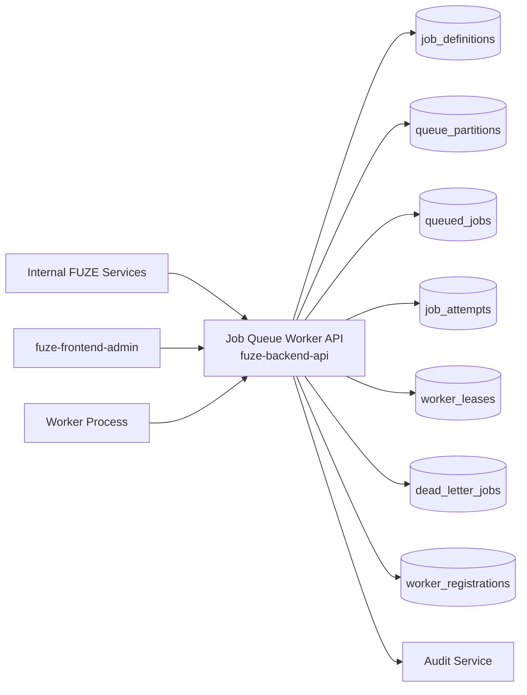
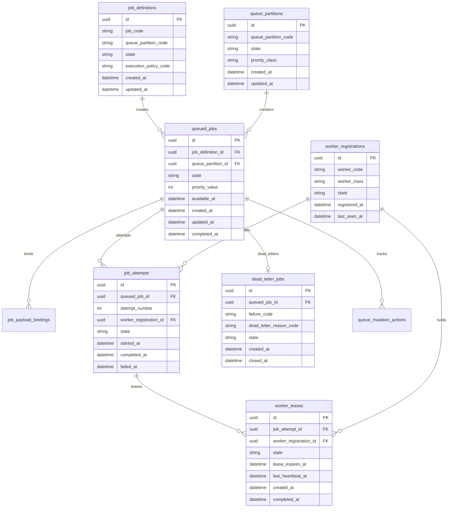
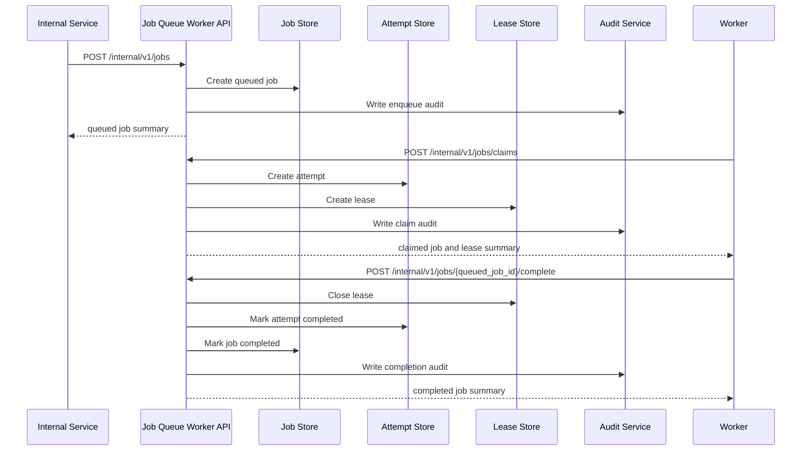

# JOB_QUEUE_WORKER_API_SPEC

## 1. Title

**JOB_QUEUE_WORKER_API_SPEC.md**

---

## 2. Document Metadata

- **Document Name:** JOB_QUEUE_WORKER_API_SPEC.md
- **API Classification:** internal, admin, event-driven
- **Owning Domain:** Job Queue and Worker Domain
- **Primary Implementing Repo:** `fuze-backend-api`
- **Primary System of Record:** job definitions, queued jobs, dispatch state, worker execution lineage, retry state, dead-letter state, and operational remediation records in `fuze-backend-api`
- **Status:** Draft for canonical source-of-truth approval
- **Purpose:** Define the production-grade API contract architecture for FUZE queued execution, worker dispatch, retry handling, failure isolation, dead-letter control, and operational remediation across platform and product background workloads
- **Canonical Folder:** `fuze.ac > docs > api-spec`

---

## 2.1 API Classification Header

- **API Classification:** internal | admin | event-driven
- **Owning Domain:** Job Queue and Worker Domain
- **Primary Implementing Repo:** `fuze-backend-api`
- **Primary System of Record:** queue and worker execution domain

---

## 3. Purpose

This document defines the canonical API specification for FUZE job queue and worker operations. It translates the governing FUZE platform architecture, workflow and automation rules, scheduled task and retry rules, AI orchestration rules, audit requirements, security controls, and API architecture rules into an implementation-ready API contract.

This API exists because FUZE includes many deferred, retried, scheduled, and background operations across platform and product domains. Queue and worker execution must therefore be explicit, observable, retry-safe, and ownership-safe. Deferred execution infrastructure cannot become an unbounded shadow owner of business truth. It must execute work on behalf of owning domains while preserving job lineage, worker state, retry posture, and operational recovery control.

Accordingly, this specification defines how jobs are represented, how queue state and worker execution are recorded, how leases/claims and retries are handled, how dead-letter and remediation flows work, and how queued execution remains auditable, idempotent, and architecture-consistent while preserving the separation between execution infrastructure and domain truth.

---

## 4. Scope

This specification covers:

- internal job enqueue APIs
- internal job-claim, heartbeat, completion, and failure-report APIs
- queue-state and worker-state visibility APIs
- retry, reschedule, cancellation, and dead-letter APIs
- admin/control-plane APIs for pause, drain, replay, quarantine, and discrepancy resolution
- event emission requirements for queue and worker lifecycle changes
- request, response, error, idempotency, versioning, audit, and database-shape rules for this domain

This specification does **not** redefine:

- workflow business meaning in full detail
- AI orchestration business meaning in full detail
- billing, credits, payout, governance, or product business truth
- low-level message broker implementation detail
- autoscaling or infrastructure provisioning detail
- full cron/scheduler semantics beyond queue-domain interfaces
- provider SDK or cloud queue vendor contract details

Those remain governed by their own source-of-truth specifications.

---

## 5. Source-of-Truth Inputs

### Primary FUZE docs and specs used

#### Highest-priority platform and ownership sources
- `SYSTEM_SPEC_INDEX.md`
- `SYSTEM_BOUNDARY_AND_OWNERSHIP_SPEC.md`
- `SYSTEM_OVERVIEW_AND_BOUNDARIES_SPEC.md`
- `PLATFORM_ARCHITECTURE_SPEC.md`
- `DOMAIN_OWNERSHIP_MATRIX_SPEC.md`
- `DATA_MODEL_AND_ENTITY_OWNERSHIP_SPEC.md`

#### Primary queue / runtime / automation sources
- `JOB_QUEUE_AND_WORKER_SPEC.md`
- `SCHEDULED_TASKS_AND_RETRY_POLICY_SPEC.md`
- `WORKFLOW_AND_AUTOMATION_SPEC.md`
- `AI_ORCHESTRATION_SPEC.md`
- `EVENT_MODEL_AND_WEBHOOK_SPEC_refreshed.md`
- `AUDIT_LOG_AND_ACTIVITY_SPEC.md`
- `SECURITY_AND_RISK_CONTROL_SPEC.md`
- `MONITORING_ALERTING_AND_INCIDENT_RESPONSE_SPEC.md`
- `SECRETS_CONFIG_AND_ENVIRONMENT_SPEC.md`

#### API and runtime sources
- `API_ARCHITECTURE_SPEC.md`
- `INTERNAL_SERVICE_API_SPEC.md`
- `IDEMPOTENCY_AND_VERSIONING_SPEC.md`
- `MIGRATION_AND_BACKWARD_COMPATIBILITY_SPEC.md`

#### Product integration context
- `PRODUCT_INTEGRATION_ARCHITECTURE_SPEC.md`
- `QTB_PRODUCT_INTEGRATION_SPEC.md`
- `AIMM_PRODUCT_INTEGRATION_SPEC.md`
- `ZAGA_PRODUCT_INTEGRATION_SPEC.md`
- `AIE_PRODUCT_INTEGRATION_SPEC.md`
- `HERHELP_PRODUCT_INTEGRATION_SPEC.md`
- `BOTMAD_PRODUCT_INTEGRATION_SPEC.md`

#### Format guides
- `The_API_Specification_guide.md`
- `Database_Schemas_Guide.md`

### Highest-priority interpretation applied

For this file, the most important governing interpretation is:

1. queue and worker infrastructure are execution infrastructure, not owners of durable business truth
2. backend owns canonical queue/worker execution truth
3. enqueue, claim, heartbeat, retry, and dead-letter lineage must remain explicit
4. products and domains may submit jobs but do not redefine queue semantics
5. admin/control-plane may pause, drain, replay, or quarantine under controlled policy but do not own domain business truth
6. job success means infrastructure execution completed; any owning-domain business mutation remains owned by the target domain and must be explicitly confirmed there

### Supporting external standards used only as guidance

- HTTP semantics for internal mutation and status APIs
- structured problem-details error design
- general lease/heartbeat/retry/dead-letter execution patterns as supporting guidance

External guidance does not override FUZE source-of-truth documents.

---

## 6. Governing Architecture and Ownership Interpretation

This API belongs to the **Job Queue and Worker Domain** because it owns the platform-governed lifecycle of deferred job creation, queue placement, worker claim/lease, execution progress, retry handling, dead-letter movement, and operational remediation.

This API is implemented primarily in `fuze-backend-api` because:

- backend owns durable queue and worker execution truth
- worker orchestration, lease management, and retry policy must be centralized
- product and platform domains require a shared and trusted deferred-execution layer
- audit generation, anomaly handling, and operational remediation must be backend-governed

This API is **not** owned by:

- `fuze-frontend-webapp`, because frontend must never directly own queue state or worker execution truth
- `fuze-frontend-admin`, because admin may inspect/remediate but must not own queue truth
- workflow domain, because workflow owns business sequencing while queue/worker owns execution transport/runtime state
- product domains, because products may enqueue jobs but do not define cross-platform queue semantics
- infrastructure vendor queues, because external broker/runtime state is an implementation substrate, not the canonical FUZE queue truth

### Architectural implications

- one domain action may enqueue one or more jobs
- one job may have multiple worker attempts across retries
- job claim/lease, heartbeat, completion, and failure transitions must remain explicit
- dead-letter and quarantine are explicit infrastructure terminal or review states
- queue completion does not imply that owning-domain business truth was committed unless confirmed by that domain
- replay and remediation must preserve lineage rather than silently overwrite prior attempt history

---

## 7. Domain Responsibilities

The Job Queue and Worker API domain is responsible for:

1. receiving and normalizing enqueue requests
2. maintaining canonical job, queue, lease, and worker-attempt records
3. managing claim, heartbeat, completion, failure, and retry state
4. enforcing retry policy, timeout policy, and dead-letter behavior
5. exposing bounded queue and worker status for trusted consumers
6. supporting admin/control-plane pause, drain, replay, and quarantine actions
7. emitting queue and worker lifecycle events
8. generating audit lineage for sensitive queue/worker actions
9. preserving separation between execution infrastructure and owning-domain business truth
10. supporting operational observability and discrepancy remediation

The domain is not responsible for:

- owning workflow business semantics
- owning AI orchestration business semantics
- owning credits, billing, or product business truth
- silently rewriting owning-domain state as a substitute for explicit domain APIs
- owning infrastructure autoscaling policy as business truth
- owning scheduler business meaning beyond job execution interfaces

---

## 8. Out of Scope

The following are out of scope for this API specification:

- specific broker technology contracts
- container/VM orchestration details
- low-level network partition handling implementation
- infrastructure autoscaling algorithms
- product-local scripting runtime design
- final dashboard UX for operations
- cloud-vendor queue primitives in full detail
- full scheduler authoring system beyond queue entry interfaces

Where later detailed specs are needed, they must remain compatible with this API.

---

## 9. Canonical Entities and Data Ownership

### Durable entities

#### 9.1 job_definitions
- **Owner:** Job Queue and Worker Domain
- **Purpose:** canonical reusable job type definitions and execution policy references
- **Nature:** source-of-truth durable entity

#### 9.2 queued_jobs
- **Owner:** Job Queue and Worker Domain
- **Purpose:** canonical queued job records
- **Nature:** source-of-truth durable entity

#### 9.3 job_payload_bindings
- **Owner:** Job Queue and Worker Domain
- **Purpose:** explicit references to domain objects, workflow runs, AI runs, or source events associated with a job
- **Nature:** source-of-truth durable lineage entity

#### 9.4 job_attempts
- **Owner:** Job Queue and Worker Domain
- **Purpose:** explicit worker-attempt lineage for each queued job
- **Nature:** source-of-truth durable entity

#### 9.5 worker_leases
- **Owner:** Job Queue and Worker Domain
- **Purpose:** explicit claim/lease and heartbeat control for in-flight job execution
- **Nature:** source-of-truth durable lineage entity

#### 9.6 dead_letter_jobs
- **Owner:** Job Queue and Worker Domain
- **Purpose:** terminal or review-required failed jobs isolated from active execution flow
- **Nature:** source-of-truth durable entity

#### 9.7 queue_partitions
- **Owner:** Job Queue and Worker Domain
- **Purpose:** logical queue-family or execution-lane records
- **Nature:** source-of-truth durable entity

#### 9.8 worker_registrations
- **Owner:** Job Queue and Worker Domain
- **Purpose:** known worker-process identity and capability summaries
- **Nature:** durable runtime identity entity

#### 9.9 job_execution_policies
- **Owner:** Job Queue and Worker Domain
- **Purpose:** named policy bundles controlling retry counts, backoff, lease TTL, timeout class, dead-letter behavior, and concurrency bounds
- **Nature:** source-of-truth durable entity

#### 9.10 queue_mutation_actions
- **Owner:** Job Queue and Worker Domain
- **Purpose:** high-level action records for enqueue, claim, release, retry, cancel, replay, quarantine, and close
- **Nature:** durable action records with audit linkage

#### 9.11 queue_audit_events
- **Owner:** Audit / Activity domain, sourced by Job Queue and Worker Domain
- **Purpose:** immutable trail for sensitive queue and worker actions
- **Nature:** durable audit records

### Derived or cached entities

#### 9.12 queue_status_views
- **Owner:** derived read-model layer
- **Purpose:** ops-facing queue summaries and workload backlog views
- **Nature:** derived

#### 9.13 worker_health_views
- **Owner:** derived read-model layer
- **Purpose:** worker health, lease saturation, and execution throughput summaries
- **Nature:** derived

#### 9.14 queue_discrepancy_views
- **Owner:** derived ops read-model layer
- **Purpose:** visibility into stuck, duplicate, poisoned, or inconsistent execution
- **Nature:** derived

---

## 10. State Model and Lifecycle

### 10.1 job definition lifecycle

Possible states:

- `draft`
- `active`
- `deprecated`
- `disabled`

### 10.2 queued job lifecycle

Possible states:

- `queued`
- `claimed`
- `running`
- `awaiting_retry`
- `completed`
- `failed`
- `dead_lettered`
- `cancelled`
- `quarantined`

### 10.3 job attempt lifecycle

Possible states:

- `created`
- `leased`
- `running`
- `completed`
- `failed`
- `expired`
- `superseded`

### 10.4 worker lease lifecycle

Possible states:

- `granted`
- `active`
- `expired`
- `released`
- `completed`

### 10.5 dead-letter lifecycle

Possible states:

- `dead_lettered`
- `under_review`
- `replayed`
- `closed`

Lifecycle notes:
- claim and lease must be explicit before running
- heartbeats extend lease validity but do not substitute for final completion
- retry transitions preserve explicit attempt lineage
- dead-lettering and quarantine are explicit terminal/review states, not silent deletion

---

## 11. API Surface Overview

The API surface is divided into three families:

### 11.1 Internal service APIs
Used by trusted internal services and worker processes for:
- enqueueing jobs
- claiming jobs
- heartbeating active leases
- reporting success or failure
- rescheduling and retry handling
- reading canonical job state

### 11.2 Admin / control-plane APIs
Used by `fuze-frontend-admin` through backend-only privileged routes for:
- pausing queue partitions
- draining or resuming partitions
- replaying dead-letter jobs
- quarantining poisoned jobs
- forcing cancellation, release, or discrepancy remediation

### 11.3 Event-driven interfaces
Used for downstream side effects:
- audit generation
- workflow continuation triggers
- anomaly detection and monitoring
- throughput/backlog reporting
- retry and dead-letter operational signals

No ordinary public user-facing route family exists for direct queue mutation.

---

## 12. Authentication and Authorization Model

### 12.1 Authentication posture by route family

#### Internal service and worker routes
Require internal service identity with explicit least privilege:
- enqueue jobs
- claim jobs
- heartbeat active leases
- report completion or failure
- inspect canonical queue state for authorized partitions

#### Admin routes
Require privileged operator identity plus reason-coded actions:
- pause/resume/drain partitions
- replay or quarantine jobs
- force-cancel or release jobs
- resolve discrepancies

### 12.2 Authorization checkpoints

Authorization must evaluate:
- caller service or worker identity
- allowed queue partitions and job definition access
- whether the caller has claim, heartbeat, completion, or remediation privilege
- whether admin/operator role is present for privileged actions
- whether policy allows action in the current queue/job state

### 12.3 Sensitive action rules

The following require heightened checks:
- manual replay of dead-letter jobs
- forced cancellation or lease release
- quarantine actions
- partition pause/drain
- discrepancy-resolution actions
- worker claim on privileged job classes

---

## 13. API Endpoints / Interface Contracts

## 13.1 Internal Service / Worker APIs

### 13.1.1 `POST /internal/v1/jobs`
**Purpose:** enqueue one job for deferred execution  
**Caller Type:** internal trusted service  
**Auth Expectation:** service-to-service identity only  
**Request Body Summary:**
- `job_code`
- `queue_partition_code`
- `payload_reference_summary`
- optional `not_before_at`
- optional `priority_class`
- `idempotency_key`
**Response Summary:**
- queued job summary
- current queue state
- next-eligible timing summary
**Side Effects:** creates queued job and payload-binding lineage
**Idempotency Behavior:** required
**Audit Requirements:** enqueue audit where sensitivity requires
**Emitted Events:** `queue.job_enqueued`

### 13.1.2 `POST /internal/v1/jobs/claims`
**Purpose:** claim one eligible job from an authorized partition  
**Caller Type:** internal trusted worker/service  
**Request Body Summary:**
- `queue_partition_code`
- `worker_registration_id`
- optional `claim_filters`
- `idempotency_key`
**Response Summary:**
- claimed job summary or no-job-available result
- lease summary
- attempt summary
**Side Effects:** creates job attempt and worker lease, queued job moves to claimed/running
**Idempotency Behavior:** required for safe repeated claim handshakes
**Audit Requirements:** sensitive claim audit where policy requires
**Emitted Events:** `queue.job_claimed`

### 13.1.3 `POST /internal/v1/jobs/{queued_job_id}/heartbeats`
**Purpose:** extend or affirm active worker lease for one running job  
**Caller Type:** internal trusted worker/service with active lease  
**Request Body Summary:**
- `worker_registration_id`
- `lease_id`
- optional `progress_summary`
- `idempotency_key`
**Response Summary:** updated lease summary and current job state
**Side Effects:** extends lease TTL and records heartbeat
**Idempotency Behavior:** required
**Audit Requirements:** operational audit where sensitivity requires
**Emitted Events:** `queue.job_heartbeat_recorded`

### 13.1.4 `POST /internal/v1/jobs/{queued_job_id}/complete`
**Purpose:** mark claimed job attempt as completed  
**Caller Type:** internal trusted worker/service with active lease  
**Request Body Summary:**
- `worker_registration_id`
- `lease_id`
- optional `result_summary`
- `idempotency_key`
**Response Summary:** completed job summary and final attempt summary
**Side Effects:** job transitions to completed, lease closes
**Idempotency Behavior:** required
**Audit Requirements:** completion audit where sensitivity requires
**Emitted Events:** `queue.job_completed`

### 13.1.5 `POST /internal/v1/jobs/{queued_job_id}/fail`
**Purpose:** report execution failure for claimed job attempt  
**Caller Type:** internal trusted worker/service with active lease  
**Request Body Summary:**
- `worker_registration_id`
- `lease_id`
- `failure_code`
- optional `failure_summary`
- `idempotency_key`
**Response Summary:** failed/awaiting_retry/dead_lettered job summary and attempt summary
**Side Effects:** job transitions to awaiting_retry or dead_lettered according to policy, lease closes
**Idempotency Behavior:** required
**Audit Requirements:** failure audit where sensitivity requires
**Emitted Events:** `queue.job_failed`, `queue.job_dead_lettered`

### 13.1.6 `GET /internal/v1/jobs/{queued_job_id}`
**Purpose:** retrieve canonical queued job truth  
**Caller Type:** internal trusted service  
**Response Summary:** full job, attempt, lease, partition, and dead-letter state lineage
**Side Effects:** none

### 13.1.7 `GET /internal/v1/queue-partitions/{queue_partition_code}`
**Purpose:** retrieve canonical queue partition status  
**Caller Type:** internal trusted service  
**Response Summary:** partition state, backlog metrics summary, and execution-policy summary
**Side Effects:** none

## 13.2 Admin / Control-Plane APIs

### 13.2.1 `POST /admin/v1/queue-partitions/{queue_partition_code}/pause`
**Purpose:** pause new claims on one partition under controlled policy  
**Caller Type:** admin/operator  
**Request Body Summary:**
- `reason_code`
- `operator_note`
- `idempotency_key`
**Response Summary:** updated partition summary
**Side Effects:** partition transitions to paused for claim eligibility
**Audit Requirements:** critical audit
**Emitted Events:** `queue.partition_paused`

### 13.2.2 `POST /admin/v1/queue-partitions/{queue_partition_code}/resume`
**Purpose:** resume claims on one paused partition  
**Caller Type:** admin/operator  
**Request Body Summary:**
- `reason_code`
- `operator_note`
- `idempotency_key`
**Response Summary:** updated partition summary
**Side Effects:** paused partition resumes claim eligibility
**Audit Requirements:** critical audit
**Emitted Events:** `queue.partition_resumed`

### 13.2.3 `POST /admin/v1/jobs/{queued_job_id}/replay`
**Purpose:** replay a dead-lettered or approved failed job under controlled policy  
**Caller Type:** admin/operator  
**Request Body Summary:**
- `replay_profile`
- `reason_code`
- `operator_note`
- `idempotency_key`
**Response Summary:** replay action summary and new/superseding queued job lineage
**Side Effects:** may create new queued job lineage from dead-letter source
**Audit Requirements:** critical audit
**Emitted Events:** `queue.job_replayed`

### 13.2.4 `POST /admin/v1/jobs/{queued_job_id}/quarantine`
**Purpose:** quarantine a job from normal execution flow under controlled policy  
**Caller Type:** admin/operator  
**Request Body Summary:**
- `reason_code`
- `operator_note`
- `idempotency_key`
**Response Summary:** quarantined job summary
**Side Effects:** job transitions to quarantined
**Audit Requirements:** critical audit
**Emitted Events:** `queue.job_quarantined`

### 13.2.5 `POST /admin/v1/jobs/{queued_job_id}/force-cancel`
**Purpose:** force-cancel queued or claimed job under controlled policy  
**Caller Type:** admin/operator  
**Request Body Summary:**
- `reason_code`
- `operator_note`
- `idempotency_key`
**Response Summary:** cancelled job summary
**Side Effects:** job transitions to cancelled, active lease may be closed/released
**Audit Requirements:** critical audit
**Emitted Events:** `queue.job_cancelled`

### 13.2.6 `POST /admin/v1/queue-discrepancies`
**Purpose:** resolve queue or worker discrepancy under controlled policy  
**Caller Type:** admin/operator  
**Request Body Summary:**
- `queued_job_id` or `queue_partition_code`
- `resolution_code`
- `operator_note`
- `related_case_id`
- `idempotency_key`
**Response Summary:** discrepancy-resolution summary
**Side Effects:** may replay, quarantine, release, pause, or close discrepancy posture with preserved lineage
**Audit Requirements:** critical audit
**Emitted Events:** `queue.discrepancy_resolved`

---

## 14. Request Rules

### 14.1 General request rules
- all mutation-capable routes must require JSON requests with explicit content type
- all mutation routes must carry correlation IDs
- sensitive queue mutations must carry idempotency keys
- admin mutations must require reason codes and operator notes
- no route may accept worker-local completion assumptions as authoritative queue truth without explicit backend mutation

### 14.2 Sensitive-action request requirements
The following requests require heightened validation:
- claim on privileged partitions
- completion/failure on active lease
- replay or quarantine
- force-cancel and partition pause/resume
- discrepancy-resolution actions

Heightened validation may include:
- lease ownership checks
- partition-authorization checks
- duplicate-attempt checks
- job-definition policy checks
- operator role confirmation
- support/security case linkage for admin flows

### 14.3 Scope integrity rule
Queue mutations must target valid and authorized partitions, jobs, and worker identities. Services and workers must not claim or mutate unrelated or unauthorized queue state.

### 14.4 Business-truth separation rule
Job completion or failure must not silently substitute for owning-domain business confirmation. Queue state reflects execution infrastructure truth; target domains remain authoritative for committed business outcomes.

---

## 15. Response Rules

### 15.1 Success response rules
Successful responses must include:
- stable resource identifiers
- timestamps for created/updated state
- state/status values
- partition/job/attempt/lease summaries where relevant
- correlation references for mutations

### 15.2 Async-accepted response rules
If replay, drain, or discrepancy remediation is async, the response must:
- return accepted status
- include action or job ID
- provide follow-up status semantics

### 15.3 Terminal mutation response rules
Terminal mutation responses must clearly show:
- target job or partition
- mutation type
- resulting job/attempt/lease/partition state
- replay or dead-letter effects where relevant
- whether ops-visible summaries may refresh asynchronously

### 15.4 Read response rules
Read responses must distinguish:
- durable queue/worker truth
- bounded backlog or health summaries
- operational remediation posture
- operator-only details that must remain excluded from lower-privilege consumers

---

## 16. Error Model

The API uses structured problem-details style error responses.

### 16.1 Required error fields
- `type`
- `title`
- `status`
- `code`
- `detail`
- `instance`
- `correlation_id`

### 16.2 Common error codes

#### Authorization / permission errors
- `QUEUE_PERMISSION_DENIED`
- `QUEUE_OPERATOR_PERMISSION_DENIED`
- `QUEUE_SERVICE_PERMISSION_DENIED`
- `QUEUE_WORKER_PERMISSION_DENIED`

#### State conflict errors
- `QUEUE_JOB_STATE_INVALID`
- `QUEUE_ATTEMPT_STATE_INVALID`
- `QUEUE_LEASE_INVALID`
- `QUEUE_LEASE_EXPIRED`
- `QUEUE_REPLAY_CONFLICT`
- `QUEUE_PARTITION_STATE_INVALID`

#### Policy / safety errors
- `QUEUE_PARTITION_RESTRICTED`
- `QUEUE_JOB_NOT_CLAIMABLE`
- `QUEUE_RETRY_LIMIT_EXCEEDED`
- `QUEUE_REPLAY_FORBIDDEN`
- `QUEUE_QUARANTINE_REQUIRED`

#### Request integrity errors
- `QUEUE_IDEMPOTENCY_KEY_REQUIRED`
- `QUEUE_REQUEST_INVALID`
- `QUEUE_REQUEST_UNPROCESSABLE`

#### Dependency or provider errors
- `QUEUE_BROKER_UNAVAILABLE`
- `QUEUE_WORKER_REGISTRATION_UNAVAILABLE`
- `QUEUE_REMEDIATION_UNAVAILABLE`

### 16.3 Error handling rules
- do not expose hidden operator-only or infrastructure-review internals
- do not imply owning-domain business success from queue completion alone
- distinguish lease-expired from generic failure
- distinguish partition pause from no-job-available outcome
- include retry guidance only where safe

---

## 17. Idempotency and Mutation Safety

### 17.1 Required idempotent mutations
The following mutation routes require idempotent behavior:
- enqueue
- claim handshake
- heartbeat
- complete
- fail
- replay
- quarantine
- force-cancel
- discrepancy resolution

### 17.2 Idempotency key rules
- mutation requests must supply `Idempotency-Key`
- backend stores key scope, request hash, actor, and terminal result
- replay of same semantic request returns original terminal outcome
- replay of same key with different semantic request must fail with conflict

### 17.3 Mutation safety rules
- the same job attempt must not be completed and failed in conflicting terminal ways
- lease ownership and expiration must be validated at mutation time
- replay lineage must preserve link to original dead-lettered or failed job
- quarantine and cancellation must preserve explicit prior attempt history
- remediation must preserve immutable history rather than rewrite prior queue records

---

## 18. Versioning and Compatibility Rules

### 18.1 Versioning
This API family is versioned under `/internal/v1` and `/admin/v1` route families.

### 18.2 Compatibility approach
- additive evolution preferred
- no silent semantic change to job, attempt, lease, dead-letter, or partition states
- new job codes and partition codes may be added without breaking existing contracts
- response fields may be added but existing meanings must remain stable

### 18.3 Breaking-change rules
Breaking changes include:
- changing the meaning of claimed, running, awaiting_retry, dead_lettered, or quarantined states
- changing lease/heartbeat semantics incompatibly
- removing critical job or attempt fields
- changing replay or dead-letter semantics incompatibly

Such changes require explicit migration planning and version evolution.

### 18.4 Deprecation
Deprecated routes or fields must:
- be documented explicitly
- carry deprecation metadata where supported
- preserve compatibility windows long enough for internal consumers and future SDK/tooling derivatives

---

## 19. Event Emission and Webhook Behavior

This domain is event-capable.

### 19.1 Internal events
The Job Queue and Worker domain must emit canonical internal events such as:
- `queue.job_enqueued`
- `queue.job_claimed`
- `queue.job_heartbeat_recorded`
- `queue.job_completed`
- `queue.job_failed`
- `queue.job_dead_lettered`
- `queue.partition_paused`
- `queue.partition_resumed`
- `queue.job_replayed`
- `queue.job_quarantined`
- `queue.job_cancelled`
- `queue.discrepancy_resolved`

### 19.2 Event payload minimums
Each event should contain:
- event ID
- event type
- occurred_at
- queue partition code
- queued job ID
- job code where relevant
- attempt or lease reference where relevant
- actor type
- correlation ID
- reason code where applicable

### 19.3 External webhook posture
This specification does not expose general third-party outbound queue/worker webhooks by default. Any future outbound queue status webhook surface must be narrow, security-reviewed, and governed by a separate contract.

---

## 20. Audit and Activity Requirements

The following actions must generate durable audit events:

- sensitive job enqueue
- job claim on privileged classes
- completion/failure for sensitive jobs
- replay, quarantine, force-cancel
- partition pause/resume
- discrepancy resolution
- other sensitive queue/worker remediation flows

### Required audit fields
- audit event ID
- actor type and actor reference
- target job / attempt / lease / partition reference as applicable
- action type
- before/after queue summary where applicable
- reason code
- correlation ID
- operator note if operator action
- occurred_at

User-facing activity feeds are generally not applicable; audit truth must remain durable and immutable for internal/ops use.

---

## 21. Data Model and Database Schema View

### 21.1 `job_definitions`
- `id` PK
- `job_code`
- `queue_partition_code`
- `state`
- `execution_policy_code`
- `payload_schema_summary_json`
- `created_at`
- `updated_at`

**Constraints:**
- unique `job_code`
- index on `state`

### 21.2 `queue_partitions`
- `id` PK
- `queue_partition_code`
- `state`
- `priority_class`
- `created_at`
- `updated_at`

**Constraints:**
- unique `queue_partition_code`
- index on `state`

### 21.3 `queued_jobs`
- `id` PK
- `job_definition_id` FK -> `job_definitions.id`
- `queue_partition_id` FK -> `queue_partitions.id`
- `state`
- `priority_value`
- `not_before_at` nullable
- `available_at`
- `created_at`
- `updated_at`
- `completed_at` nullable
- `failed_at` nullable
- `cancelled_at` nullable
- `dead_lettered_at` nullable
- `quarantined_at` nullable

**Constraints:**
- index on `queue_partition_id`
- index on (`state`, `available_at`)
- index on `priority_value`

### 21.4 `job_payload_bindings`
- `id` PK
- `queued_job_id` FK -> `queued_jobs.id`
- `binding_type`
- `binding_reference_id`
- `binding_role`
- `created_at`

**Constraints:**
- index on `queued_job_id`

### 21.5 `job_attempts`
- `id` PK
- `queued_job_id` FK -> `queued_jobs.id`
- `attempt_number`
- `worker_registration_id` FK -> `worker_registrations.id`
- `state`
- `started_at` nullable
- `completed_at` nullable
- `failed_at` nullable
- `expired_at` nullable
- `created_at`

**Constraints:**
- unique (`queued_job_id`, `attempt_number`)
- index on `queued_job_id`
- index on `state`

### 21.6 `worker_leases`
- `id` PK
- `job_attempt_id` FK -> `job_attempts.id`
- `worker_registration_id` FK -> `worker_registrations.id`
- `state`
- `lease_expires_at`
- `last_heartbeat_at` nullable
- `created_at`
- `released_at` nullable
- `completed_at` nullable

**Constraints:**
- index on `job_attempt_id`
- index on `lease_expires_at`
- index on `state`

### 21.7 `dead_letter_jobs`
- `id` PK
- `queued_job_id` FK -> `queued_jobs.id`
- `failure_code`
- `dead_letter_reason_code`
- `state`
- `created_at`
- `closed_at` nullable

### 21.8 `worker_registrations`
- `id` PK
- `worker_code`
- `worker_class`
- `state`
- `capability_summary_json`
- `registered_at`
- `last_seen_at`

**Constraints:**
- unique `worker_code`
- index on `state`

### 21.9 `job_execution_policies`
- `id` PK
- `policy_code`
- `state`
- `retry_policy_json`
- `lease_policy_json`
- `timeout_policy_json`
- `dead_letter_policy_json`
- `created_at`
- `updated_at`

**Constraints:**
- unique `policy_code`
- index on `state`

### 21.10 `queue_mutation_actions`
- `id` PK
- `queued_job_id` nullable FK -> `queued_jobs.id`
- `queue_partition_id` nullable FK -> `queue_partitions.id`
- `action_type`
- `state`
- `reason_code`
- `operator_note` nullable
- `requested_by_actor_type`
- `requested_by_actor_id`
- `created_at`
- `executed_at` nullable
- `closed_at` nullable
- `correlation_id`

### 21.11 `idempotency_records`
- `id` PK
- `idempotency_key`
- `scope_family`
- `actor_reference`
- `request_hash`
- `response_hash`
- `terminal_status`
- `created_at`
- `expires_at`

### 21.12 `audit_log_entries`
Domain-sourced audit records written into the audit domain.

### Normalization notes
- canonical queue truth stays in job definitions, partitions, jobs, attempts, leases, and dead-letter records
- runtime broker or worker-process local state remains external and referenced, not duplicated as canonical business truth
- ops-facing summaries are derived and must not replace canonical queue/worker state
- owning-domain business truth remains external to queue state

### Reconciliation notes
- one queued job should reconcile to one current job lineage plus explicit attempts and optional replay lineage
- leases must reconcile to heartbeat and completion/failure outcomes
- dead-letter and replay must preserve original-to-replay linkage
- partition pause/resume must reconcile to claim eligibility and backlog state

---

## 22. Architecture Diagram — Mermaid flowchart



---

## 23. Data Design — Mermaid Diagram



---

## 24. Flow View

### 24.1 Happy path — enqueue and execute
1. internal service enqueues job with authorized job code and payload bindings
2. queued job is created in eligible partition
3. worker claims eligible job and receives lease
4. worker executes job and heartbeats while active
5. worker reports completion
6. job transitions to completed and audit/events are emitted

### 24.2 Happy path — retry after transient failure
1. worker claims job and begins execution
2. transient failure occurs
3. worker reports failure
4. policy places job into awaiting_retry with backoff
5. later worker claims next attempt
6. subsequent attempt completes successfully

### 24.3 Alternate path — no eligible jobs
1. worker requests claim for authorized partition
2. backend checks partition state and eligible backlog
3. no eligible jobs are available
4. no-job result is returned without mutation to unrelated state

### 24.4 Failure path — lease expires
1. worker claims job and receives lease
2. heartbeats stop or expire
3. lease is marked expired
4. job becomes eligible for retry or remediation according to policy
5. prior attempt remains explicit in history

### 24.5 Failure and remediation path — dead-letter / quarantine
1. job repeatedly fails beyond retry policy or is identified as poisoned
2. job is dead-lettered or quarantined
3. admin reviews state and either replays, closes, or keeps quarantined
4. replay creates explicit new lineage rather than rewriting original job record

### 24.6 Partition pause path
1. admin pauses partition
2. new claims stop for that partition
3. in-flight leases may finish or be remediated separately
4. admin later resumes partition
5. queued eligible jobs become claimable again

### 24.7 Retry behavior
- duplicate enqueue returns same primary queued job result
- duplicate claim handshake returns same lease/attempt result when applicable
- duplicate completion/failure reports return same terminal attempt result
- duplicate replay/quarantine/cancel returns same terminal action result

---

## 25. Data Flows — Mermaid sequenceDiagram



---

## 26. Security and Risk Controls

1. **Queue truth is backend-owned**  
   Workers and services may not authoritatively assume queue state outside approved backend APIs.

2. **Queue is not business-truth owner**  
   Queue execution must not be treated as canonical domain truth without owning-domain confirmation.

3. **Policy-bound claims and retries**  
   Claim, heartbeat, retry, and dead-letter behavior must be governed by explicit execution policy.

4. **Least privilege**  
   Internal queue and worker routes must be limited to authorized service/worker callers with explicit privileges.

5. **Lease integrity**  
   Completion and failure actions must validate active lease ownership and expiry.

6. **Immutable lineage**  
   Retries, expirations, dead-lettering, replay, quarantine, and remediation must preserve history instead of rewriting prior records.

7. **Problem-details discipline**  
   Error bodies must be structured and safe, without exposing hidden operator-only or infrastructure-review details.

8. **Audit immutability**  
   Sensitive queue and worker actions require durable immutable audit lineage.

9. **Replay resistance**  
   Enqueue, claim, heartbeat, completion, failure, replay, and quarantine must be idempotent and replay-safe.

10. **Partition control**  
    Partition pause/resume must remain explicit and auditable, with no silent loss of queued jobs.

---

## 27. Operational Considerations

- queue-status reads are ops-visible and should be highly available
- claim/heartbeat/completion flows are correctness-sensitive and must preserve lease integrity
- expired leases, dead-letter growth, and replay spikes require explicit remediation visibility
- worker registration and health signals should surface clearly to ops views
- monitoring should alert on:
  - spikes in lease expiry
  - unusual dead-letter volume
  - replay or quarantine spikes
  - partition backlog growth
  - worker failure-rate spikes
  - queue discrepancy-resolution spikes

---

## 28. Acceptance Criteria

1. The API preserves the distinction between queue/worker execution truth and owning-domain business truth.
2. Only `fuze-backend-api` owns canonical queue and worker truth.
3. Job definitions, partitions, jobs, attempts, leases, and dead-letter records are durable and backend-owned.
4. Claim, lease, heartbeat, retry, and dead-letter behavior are policy-bound.
5. Job completion is distinct from business-truth commitment in target domains.
6. Attempt, lease, replay, quarantine, and dead-letter lineage are explicit and immutable.
7. Completion, failure, replay, and quarantine are idempotent and auditable.
8. Internal queue/worker routes are least-privilege and backend-only.
9. Admin routes require reason-coded privileged authorization.
10. Event emissions exist for major queue/worker mutations.
11. Response and error semantics are stable and machine-readable.
12. Database schema separates definitions, partitions, jobs, attempts, leases, dead-letter records, and worker registrations.
13. Products and domains can consume canonical queue APIs without redefining queue semantics.
14. Restriction and discrepancy handling are supported and safely replayable.
15. Mermaid diagrams remain consistent with prose and data model.

---

## 29. Test Cases

### 29.1 Positive cases
1. Internal service enqueues job successfully.
2. Authorized worker claims eligible job successfully.
3. Authorized worker heartbeats active lease successfully.
4. Authorized worker completes job successfully.
5. Authorized worker reports failure and job moves to awaiting_retry successfully.
6. Admin pauses and resumes queue partition successfully.
7. Admin replays dead-lettered job successfully.
8. Admin quarantines poisoned job successfully.

### 29.2 Negative cases
9. Unauthorized service cannot enqueue privileged job.
10. Worker without partition authorization cannot claim job.
11. Claim on paused partition returns appropriate no-claim or restricted outcome.
12. Completion with expired lease returns `QUEUE_LEASE_EXPIRED`.
13. Failure report on already terminal attempt returns state conflict.
14. Replay on non-dead-lettered job returns `QUEUE_REPLAY_FORBIDDEN` or state conflict.

### 29.3 Authorization cases
15. Ordinary user cannot call queue admin APIs.
16. Worker without heartbeat privilege cannot extend lease.
17. Service without enqueue privilege cannot create job.
18. Domain service cannot infer queue completion as business success without its own confirmation path.

### 29.4 Idempotency and replay cases
19. Repeating enqueue with same idempotency key returns original queued job result.
20. Repeating claim handshake with same idempotency key returns original claim result where applicable.
21. Repeating complete with same idempotency key returns original terminal completion result.
22. Repeating replay/quarantine with same idempotency key returns original admin action result.

### 29.5 Concurrency cases
23. Concurrent claim attempts on same eligible job produce one successful lease and one safe no-claim/conflict outcome.
24. Concurrent complete and fail actions on same attempt preserve one explicit terminal attempt outcome.
25. Concurrent partition pause and claim preserve explicit ordering without hidden overwrite.

### 29.6 Recovery / admin cases
26. Expired lease can return job to retry path under controlled policy.
27. Dead-lettered job remains historically linked after replay.
28. Quarantined job is isolated from normal claim flow until reviewed or closed.

### 29.7 Event and audit cases
29. Successful enqueue emits `queue.job_enqueued`.
30. Successful claim emits `queue.job_claimed`.
31. Successful completion emits `queue.job_completed`.
32. Successful dead-letter emits `queue.job_dead_lettered`.
33. Successful discrepancy resolution emits `queue.discrepancy_resolved` with critical audit lineage.

---

## 30. Open Questions or Explicit Deferred Decisions

1. Exact queue partition taxonomy across all products and platform domains is deferred.
2. Exact worker capability-registration schema is deferred.
3. Exact backoff profile library and poison-job detection rules are deferred.
4. Exact scheduler-to-queue handoff contract for all recurring jobs is deferred.
5. Exact no-job-available polling/long-poll behavior is deferred.
6. Exact discrepancy taxonomy for queue/worker anomalies is deferred.

---

## 31. Implementation Notes for `fuze-backend-api`

Recommended backend module layout:

```text
modules/platform/
  job-queue-worker/
  workflow-automation/
  ai-orchestration/
  audit-log/
  control-plane/
  integrations/
```

Implementation guidance:
- keep job identity, partition state, attempt lineage, lease lifecycle, and dead-letter lineage in one canonical domain service
- perform claim/lease ownership and retry-policy checks inside the commit boundary
- keep replay, quarantine, pause, and remediation explicit and idempotent
- treat admin remediations as domain actions, not ad hoc row edits
- emit events only after canonical state commit succeeds
- publish ops-facing queue summaries from canonical truth; do not let derived views mutate queue state

---

## 32. Frontend Consumption Notes

### For `fuze-frontend-webapp`
- no direct end-user queue mutation surface is expected
- user-facing product status should come from owning domains, not raw queue state
- frontend must not infer canonical queue completion from client-side assumptions

### For `fuze-frontend-admin`
- may trigger privileged pause, resume, replay, quarantine, cancel, and discrepancy actions only through backend admin APIs
- must require operator reason input for sensitive mutations
- must not directly mutate queue truth client-side
- should present immutable audit-linked summaries after privileged actions

---

## 33. Contract Derivation Notes

### OpenAPI / AsyncAPI
This spec should later derive into:
- internal enqueue/claim/heartbeat/complete/fail operations
- internal job and partition status read operations
- admin pause / resume / replay / quarantine / cancel / discrepancy operations
- shared problem-details schema
- queue and worker events in AsyncAPI

### Future `fuze-sdk`
Future `fuze-sdk` packages are unlikely to expose raw queue-worker mutation surfaces to ordinary partners or public clients. Any internal tooling helpers should derive from approved internal contracts and must not become the source of truth over this narrative specification.
