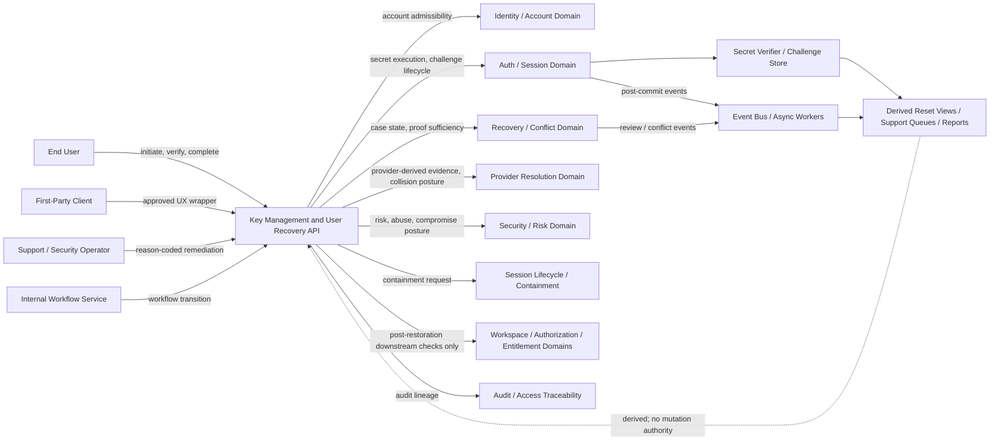
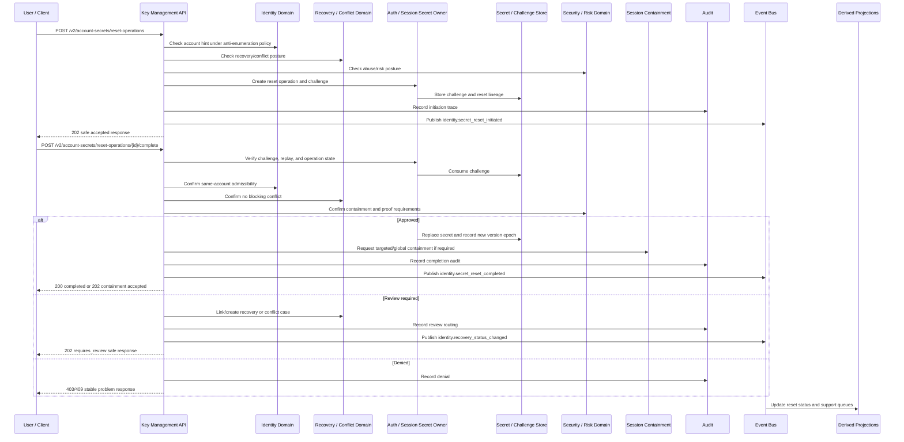

# KEY_MANAGEMENT_AND_USER_RECOVERY_API_SPEC.md

## Document Metadata

- **Document Name:** `KEY_MANAGEMENT_AND_USER_RECOVERY_API_SPEC.md`
- **Document Type:** FUZE API SPEC v2 / Production-grade interface-contract specification
- **Status:** Draft for production-grade API-spec review
- **Version:** 2.0.0
- **Effective Date:** 2026-04-24
- **Last Updated:** 2026-04-24
- **Reviewed On:** 2026-04-24
- **Document Owner:** FUZE Platform Identity and Access Architecture, with API ownership coordinated through FUZE Platform API Architecture; secret-lifecycle execution delegated to Auth / Session Domain and supporting security controls delegated to Security / Risk Domain.
- **Approval Authority:** FUZE Platform Architecture and Governance Authority
- **Review Cadence:** Quarterly or upon material change to password-backed access, recovery proof policy, challenge lifecycle, session-containment policy, compromise-response policy, provider-resolution policy, recovery/conflict policy, support/admin remediation controls, or API exposure.
- **Governing Layer:** API SPEC v2 / Identity, Account, Auth, and Session API family
- **Parent Registry:** `API_SPEC_INDEX.md`
- **Upstream Semantic Registry:** `REFINED_SYSTEM_SPEC_INDEX.md`
- **Upstream API Registry:** `API_SPEC_INDEX.md`
- **Primary Audience:** API designers, backend engineers, identity engineers, auth/session engineers, key-management engineers, recovery workflow engineers, security engineers, frontend/client engineers, support/control-plane engineers, audit/governance reviewers, OpenAPI/AsyncAPI/SDK authors, QA and contract-validation teams.
- **Primary Purpose:** Define the FUZE production API contract for user-facing key management and user recovery mechanics, including password or password-equivalent secret lifecycle, recovery challenges, reset-capable proofs, secret-version and reset-lineage behavior, reset completion, secret invalidation, recovery-sensitive secret mutation, support/admin remediation, session-containment consequences, event emission, idempotency, replay safety, audit traceability, and downstream derivation guardrails.
- **Primary Upstream References:**
  - `REFINED_SYSTEM_SPEC_INDEX.md`
  - `DOCS_SPEC_INDEX.md`
  - `SYSTEM_SPEC_INDEX.md`
  - `API_SPEC_INDEX.md`
  - `FUZE_ACCOUNT_ACCESS_AND_SESSION_THESIS_FINAL_SPEC.md`
  - `FUZE_ACCOUNT_ACCESS_AND_SESSION_CANONICAL_FINAL_SPEC.md`
  - `IDENTITY_AND_ACCOUNT_SPEC.md`
  - `AUTH_SESSION_AND_LINKED_LOGIN_SPEC.md`
  - `FUZE_ACCOUNT_ACCESS_CONTINUITY_SPEC.md`
  - `FUZE_PROVIDER_RESOLUTION_AND_LINKING_SPEC.md`
  - `FUZE_SESSION_LIFECYCLE_AND_SECURITY_SPEC.md`
  - `FUZE_ACCOUNT_RECOVERY_AND_CONFLICT_HANDLING_SPEC.md`
  - `KEY_MANAGEMENT_AND_USER_RECOVERY_SPEC.md`
  - `SECURITY_AND_RISK_CONTROL_SPEC.md`
  - `SECRETS_CONFIG_AND_ENVIRONMENT_SPEC.md`
  - `AUDIT_AND_ACCESS_TRACEABILITY_SPEC.md`
  - `ADMIN_ACCESS_CORRECTION_AND_CONTAINMENT_SPEC.md`
  - `AUTH_IDENTITY_API_SPEC.md`
  - `SESSION_AND_LINKED_LOGIN_API_SPEC.md`
- **Primary Downstream Dependents:**
  - OpenAPI contracts for secret reset, recovery challenge, and recovery-sensitive secret mutation APIs
  - AsyncAPI contracts for key/recovery/secret lifecycle events
  - auth/session implementation contracts
  - secret verifier and secret metadata storage contracts
  - recovery challenge and proof contracts
  - support/admin recovery tooling
  - session-containment workflows
  - security/risk and compromise-response workflows
  - audit and observability pipelines
  - frontend/mobile reset and recovery UX contracts
  - SDK recovery and reset helpers
  - QA, contract-validation, and regression suites
- **API Surface Families Covered:** public/unauthenticated anti-enumeration-safe initiation APIs, first-party user reset/recovery APIs, internal service APIs, admin/control-plane APIs, event/async APIs, derived read-model/reporting APIs.
- **API Surface Families Excluded:** general infrastructure secret management, cloud KMS vendor APIs, service-to-service credential inventory, wallet private-key custody, treasury/governance signing keys, full MFA catalog design, full provider-protocol mechanics, workspace authorization APIs, entitlement APIs, ordinary product capability APIs, chain APIs.
- **Canonical System Owner(s):** Key Management / User Recovery Domain; Identity and Account Domain for same-account preservation; Auth / Session Domain for secret verification and reset execution; Recovery / Conflict Domain for evidence sufficiency and review posture; Security / Risk Domain for compromise and containment policy; Audit Domain for traceability.
- **Canonical API Owner:** FUZE Platform API Architecture / Key Management and User Recovery API owner
- **Supersedes:** Key-management, password-reset, reset-token, and user-recovery portions of `AUTH_IDENTITY_API_SPEC.md` and `SESSION_AND_LINKED_LOGIN_API_SPEC.md` where this v2 document is narrower, stricter, or more explicit.
- **Superseded By:** Not yet known
- **Related Decision Records:** Not explicitly available in retrieved governing materials
- **Canonical Status Note:** This API spec derives from `KEY_MANAGEMENT_AND_USER_RECOVERY_SPEC.md`. It owns interface-contract expression only. It MUST NOT redefine canonical account identity, recovery/conflict truth, provider truth, session truth, authorization truth, entitlement truth, wallet truth, or platform security policy.
- **Implementation Status:** Normative API contract baseline; downstream OpenAPI, AsyncAPI, SDK, service, storage, support-tool, audit, and runtime contracts must conform.
- **Approval Status:** Drafted for API SPEC v2 inclusion; formal approval record not yet attached.
- **Change Summary:** Created a production-grade API v2 contract for key management and user recovery; separated secret/challenge/reset API ownership from account-recovery case truth, provider-resolution truth, session lifecycle truth, and workspace/entitlement truth; hardened secret-versioning, challenge lifecycle, reset completion, explicit review, operator remediation, idempotency, audit, containment, event, projection, migration, and forbidden-pattern rules.

---

## Purpose

This document defines the FUZE API contract for **key management and user recovery**.

The API layer governed here expresses refined key-management and user-recovery semantics as implementation-ready interface contracts. It defines how FUZE exposes approved reset initiation, challenge issuance, challenge verification, recovery-proof handling, password or password-equivalent secret replacement, secret invalidation, secret-version transitions, reset lineage, support/admin remediation, session containment coordination, and derived reset/recovery views.

This API spec exists because key-management and recovery-proof mechanics are not generic password-reset conveniences. In FUZE, user-facing secret material participates in canonical account access, linked access paths, account continuity, recovery/conflict handling, session containment, security/risk policy, operator remediation, and auditability. Reset mechanics must therefore preserve access to the same canonical `account_id`; they must not redefine identity, silently rebind access paths, bypass recovery/conflict posture, or treat active sessions, provider profile data, email overlap, wallet possession, product-local records, or support dashboards as identity truth.

---

## Scope

This specification governs API contracts for:

1. reset or recovery initiation for FUZE-controlled user-facing secrets;
2. password or password-equivalent secret set, reset, replacement, and invalidation;
3. recovery challenge issuance, verification, consumption, expiration, revocation, and supersession;
4. recovery proof references used for bounded reset or recovery-sensitive actions;
5. secret version, reset epoch, reset lineage, and replay-safety semantics;
6. recovery-sensitive secret mutation and access-path effects;
7. explicit review routing when proof is ambiguous, weak, contested, high-risk, or collision-prone;
8. admin/control-plane remediation for key or secret recovery workflows;
9. session invalidation and containment coordination after reset, recovery completion, secret replacement, compromise-sensitive correction, or secret invalidation;
10. event/async behavior for secret, challenge, reset, proof, and containment events;
11. derived read models, support views, reset summaries, dashboards, and reporting boundaries;
12. request, response, error, status, idempotency, audit, observability, migration, OpenAPI, AsyncAPI, and SDK derivation rules.

---

## Out of Scope

This API spec does not govern:

- canonical account identity lifecycle APIs in full;
- account-recovery and conflict-case semantics in full;
- ordinary login when no reset/recovery path is involved;
- full provider-resolution/linking APIs;
- full session lifecycle APIs beyond reset-driven containment coordination;
- general infrastructure-secret management for internal services;
- cloud KMS vendor selection or low-level cryptographic primitive selection;
- full MFA factor catalog or factor-by-factor productization;
- browser cookie flags, raw token transport, mobile secure enclave implementation, or passkey UX detail;
- wallet private-key custody, treasury custody, governance key custody, chain-signing policy, or user wallet recovery;
- workspace membership, role, permission, authorization, entitlement, billing, credits, payout, or product capability truth;
- exact legal/KYC evidence policy;
- support queue staffing or case-management UI design.

---

## Design Goals

1. Preserve reset and recovery outcomes as restoration to the same canonical `account_id`.
2. Keep secret material, recovery challenges, reset tokens, and proof artifacts as access infrastructure, not identity truth.
3. Prevent key/reset convenience from becoming silent takeover, silent account fragmentation, or silent access-path rebinding.
4. Make secret mutations explicit, durable, auditable, replay-safe, idempotent, and policy-constrained.
5. Support secure reset, replacement, rotation, invalidation, expiration, and supersession of approved account-access secrets.
6. Preserve separation among identity truth, auth-link truth, secret/key-state truth, recovery/conflict truth, runtime session truth, provider-input truth, wallet-aware truth, authorization truth, entitlement truth, derived view truth, and presentation truth.
7. Ensure high-impact key events deterministically drive session-containment or forced re-auth posture where policy requires.
8. Support support/admin remediation only through narrow, reason-coded, policy-bound, auditable, and owner-domain-mediated paths.
9. Provide enough contract clarity for OpenAPI, AsyncAPI, SDKs, QA, audit, observability, security, and migration work.

---

## Non-Goals

This API spec is not intended to:

- make key possession the canonical identity model;
- allow products to define separate reset or recovery truth;
- allow reset completion on weak or ambiguous proof;
- reduce recovery to email match, profile overlap, remembered session, wallet possession, or provider convenience;
- permit support/admin convenience to outrank takeover resistance or auditability;
- fully define cryptographic storage, KDF parameters, key escrow, HSM configuration, or infrastructure secret inventory;
- define every passkey, biometric, hardware-key, or MFA UX flow;
- replace downstream implementation contracts, database schemas, evidence storage contracts, security controls, runbooks, or incident procedures.

---

## Core Principles

### Canonical Account Preservation

All user-recovery and secret-reset outcomes MUST preserve the same canonical `account_id`. Secret replacement is not identity replacement.

### Secret Material Is Access Infrastructure

Passwords, reset tokens, recovery proofs, short-lived challenges, and equivalent secret material enable controlled access flows. They MUST NOT become canonical identity objects.

### Recovery-Proof Separation

A completed challenge or recovery proof MAY authorize a bounded recovery-sensitive action only when policy allows it. It does not become durable account truth.

### No Silent Rebinding

A recovery-capable key, reset path, provider-bound proof, secret verifier, or recovery-significant contact MUST NOT be silently rebound from one canonical account to another.

### Continuity Before Convenience

If easy reset behavior conflicts with continuity safety, FUZE MUST preserve continuity safety.

### Explicit Containment

Password reset, recovery completion, secret replacement, secret invalidation, or compromise-sensitive correction MAY require targeted or global session invalidation.

### Operator Narrowness

Support/admin intervention MUST remain narrow, reason-coded, policy-bound, authorization-checked, and audited.

### Backend Ownership

Products and frontends MAY initiate reset or recovery flows and display safe status. Canonical secret, challenge, reset, and recovery mutation truth remains backend-owned and domain-owned.

### Derived Views Stay Derived

Recovery summaries, reset hints, support queues, dashboards, device/session views, and reporting exports MUST NOT become mutation owners.

### Conservative Proof

Weak profile similarity, email overlap, product-local state, wallet possession, remembered-session presence, or mutable provider data MUST NOT substitute for approved proof in ambiguous cases.

---

## Canonical Definitions

- **Key Management:** FUZE-owned lifecycle management of security-sensitive secret or key-equivalent material used to authenticate, verify, reset, rotate, revoke, or recover approved account-access methods.
- **Authentication Secret:** FUZE-controlled secret or secret-equivalent verifier used to validate control of an approved access path.
- **Password-Equivalent Secret:** Secret-controlled access material that behaves like a password or reset-capable verifier for lifecycle, replay, audit, and containment purposes.
- **Recovery Challenge:** Short-lived durable challenge or verification record used to authorize a bounded recovery or reset step.
- **Recovery Proof:** Policy-approved evidence or completed challenge artifact used to decide whether a recovery-sensitive action may proceed.
- **Secret Version:** Durable version reference or epoch for a secret-controlled access method used to coordinate reset, invalidation, containment, migration, and audit reconstruction.
- **Reset Operation:** Durable operation tracking initiation, verification, review, completion, rejection, expiration, cancellation, or supersession of secret replacement.
- **Reset Completion:** Bounded action that replaces or restores a recovery-significant secret or access path while preserving the same canonical account.
- **Secret Invalidation:** Durable state transition rendering prior secret-derived access unusable for future authentication.
- **Recovery-Significant Secret:** Secret or secret-derived access-enabling relationship whose replacement, removal, or reset materially affects future reachability to the same account.
- **Compromise-Sensitive Recovery:** Reset or recovery path under elevated suspicion of account takeover, provider misuse, replay, or broader security incident, requiring stronger proof, review, or containment.
- **Corrective Remediation:** Explicit, policy-approved, audited correction path for prior mistake or contested secret/access-path ownership.

---

## Truth Class Taxonomy

This API spec preserves the following truth classes:

1. **Semantic Truth:** Defined by upstream refined system specs.
2. **API Contract Truth:** Defined here for request/response/error/status/event/idempotency behavior.
3. **Canonical Identity Truth:** Account record, lifecycle, and continuity semantics anchored by `account_id`.
4. **Auth-Link Truth:** Durable approved mapping between a canonical account and linked authentication method or provider-backed access path.
5. **Secret / Key-State Truth:** Durable secret state, version epoch, invalidation posture, reset-required posture, and challenge/reset lineage.
6. **Recovery / Conflict Case Truth:** Recovery/conflict case state, evidence sufficiency posture, review posture, and approved restoration outcomes.
7. **Runtime Session Truth:** Temporary authenticated runtime presence, session lineage, revocation, and security invalidation state.
8. **Policy Truth:** Recovery policy, security policy, continuity policy, operator-control policy, secret-handling policy, and higher-order platform rules.
9. **Provider-Input Truth:** Provider-supplied or adapter-supplied evidence inputs, not canonical identity or secret truth.
10. **Wallet-Aware Context Truth:** Wallet-link state and wallet-derived participation context; attached context, not default secret-recovery truth.
11. **Authorization / Entitlement Truth:** Workspace scope, roles, permissions, effective access, product capabilities, and entitlements evaluated downstream.
12. **Audit / Traceability Truth:** Durable actor/action/reason/policy/evidence/correlation/event lineage.
13. **Derived Read-Model Truth:** Support views, reset summaries, dashboards, review queues, search projections, and reports.
14. **Presentation Truth:** UX copy, emails, notifications, support copy, and SDK messages that summarize state without owning it.

---

## Architectural Position in the Spec Hierarchy

This API spec sits below:

- `REFINED_SYSTEM_SPEC_INDEX.md`
- `FUZE_ACCOUNT_ACCESS_AND_SESSION_CANONICAL_FINAL_SPEC.md`
- `IDENTITY_AND_ACCOUNT_SPEC.md`
- `AUTH_SESSION_AND_LINKED_LOGIN_SPEC.md`
- `FUZE_ACCOUNT_ACCESS_CONTINUITY_SPEC.md`
- `FUZE_PROVIDER_RESOLUTION_AND_LINKING_SPEC.md`
- `FUZE_SESSION_LIFECYCLE_AND_SECURITY_SPEC.md`
- `FUZE_ACCOUNT_RECOVERY_AND_CONFLICT_HANDLING_SPEC.md`
- `KEY_MANAGEMENT_AND_USER_RECOVERY_SPEC.md`
- `SECURITY_AND_RISK_CONTROL_SPEC.md`
- `SECRETS_CONFIG_AND_ENVIRONMENT_SPEC.md`
- `AUDIT_AND_ACCESS_TRACEABILITY_SPEC.md`

It sits beside or above downstream machine-readable and implementation layers:

- OpenAPI route contracts;
- AsyncAPI event contracts;
- secret verifier and secret metadata storage contracts;
- recovery challenge and proof contracts;
- support/admin remediation contracts;
- session containment contracts;
- frontend/mobile reset UX contracts;
- SDK reset/recovery helpers;
- QA and migration regression suites.

---

## Upstream Semantic Owners

### `KEY_MANAGEMENT_AND_USER_RECOVERY_SPEC.md`

Primary semantic owner for user-facing secret/key material, password-equivalent lifecycle, recovery challenge state, reset-capable proof handling, secret versioning, reset lineage, secret invalidation, reset completion, proof ambiguity, compromise-sensitive recovery, and reset-triggered containment.

### `IDENTITY_AND_ACCOUNT_SPEC.md`

Owns canonical account identity, `account_id`, account lifecycle, restriction/suspension posture, account-level continuity, and account admissibility.

### `AUTH_SESSION_AND_LINKED_LOGIN_SPEC.md`

Owns linked-auth behavior, authentication-secret verification execution, linked-method lifecycle, auth challenge behavior, and how secret reset affects approved access paths.

### `FUZE_ACCOUNT_RECOVERY_AND_CONFLICT_HANDLING_SPEC.md`

Owns recovery/conflict case meaning, evidence sufficiency posture, ambiguity handling, explicit review, remediation routing, and final same-account restoration decision.

### `FUZE_SESSION_LIFECYCLE_AND_SECURITY_SPEC.md`

Owns session invalidation, containment, fresh session issuance, re-entry, privileged-session posture, and stale-session rejection after trust reset.

### `FUZE_PROVIDER_RESOLUTION_AND_LINKING_SPEC.md`

Owns provider-subject uniqueness, provider collisions, provider-link correction, and provider-input interpretation before provider-derived evidence influences key/recovery flows.

### `SECURITY_AND_RISK_CONTROL_SPEC.md`

Owns compromise posture, stronger proof thresholds, abuse controls, containment severity, risk escalation, and operator constraints.

### `AUDIT_AND_ACCESS_TRACEABILITY_SPEC.md`

Owns durable traceability requirements for secret mutation, reset completion, recovery proof, admin remediation, containment, and access-sensitive control events.

---

## API Surface Families

### Public / Unauthenticated Safe Surfaces

MAY support reset initiation, challenge continuation, and safe status using anti-enumeration semantics. These surfaces MUST NOT disclose account existence, candidate accounts, secret state, recovery conflicts, raw evidence, challenge secrets, risk score, provider collisions, or internal review detail.

### First-Party Application Surfaces

MAY support authenticated password change, reset initiation, challenge submission, reset completion, safe status, and local re-entry handling. First-party surfaces remain consumers and initiators, not canonical owners.

### Internal Service Surfaces

MAY support challenge issuance, verification, reset-operation progression, secret-version transitions, containment coordination, and status checks through scoped service-to-service APIs.

### Admin / Control-Plane Surfaces

MAY support privileged reset/remediation operations only through separated, reason-coded, policy-referenced, audited, authorization-checked APIs.

### Event / Async Surfaces

MUST emit post-commit events for material secret/challenge/reset/invalidation/containment lifecycle changes. Events do not become mutation owners.

### Reporting / Projection Surfaces

MAY expose derived reset summaries, support queues, dashboards, and operational reports. They MUST be marked derived and MUST NOT mutate canonical secret or reset truth.

### Chain-Adjacent Surfaces

No chain-adjacent secret recovery authority is defined. Wallet or chain context MAY be supporting evidence only under a separate approved policy and MUST NOT become universal reset proof.

---

## System / API Boundaries

This API spec governs interface contracts for FUZE-controlled user-facing secret, recovery challenge, proof, reset, and secret-version behavior.

It does not govern:

- canonical identity truth;
- recovery/conflict case truth in full;
- provider-link truth in full;
- session lifecycle truth in full;
- downstream authorization/entitlement truth;
- infrastructure secret governance in full;
- wallet/chain custody.

Downstream APIs MAY reference secret/reset posture. They MUST NOT reinterpret it.

---

## Adjacent API Boundaries

- `IDENTITY_AND_ACCOUNT_API_SPEC.md` owns account identity and account lifecycle APIs.
- `AUTH_SESSION_AND_LINKED_LOGIN_API_SPEC.md` owns ordinary authentication and linked-login posture outside key/recovery mechanics.
- `PROVIDER_RESOLUTION_AND_LINKING_API_SPEC.md` owns provider normalization, linking, unlinking, collision, and correction APIs.
- `SESSION_LIFECYCLE_AND_SECURITY_API_SPEC.md` owns session refresh, logout, revoke, invalidation, containment, and introspection APIs.
- `ACCOUNT_RECOVERY_AND_CONFLICT_HANDLING_API_SPEC.md` owns recovery/conflict case lifecycle and final restoration decision.
- `ACCOUNT_ACCESS_CONTINUITY_API_SPEC.md` owns continuity preflight and continuity-sensitive mutation posture.
- `AUDIT_AND_ACCESS_TRACEABILITY_API_SPEC.md` owns generic audit and traceability APIs.
- `SECURITY_AND_RISK_CONTROL_API_SPEC.md` owns risk posture, compromise controls, abuse signals, and security policy APIs.
- Workspace, authorization, and entitlement API specs own downstream access after restored authentication.

---

## Conflict Resolution Rules

When interpretation conflicts arise:

1. Active refined system specs win on semantic truth.
2. `KEY_MANAGEMENT_AND_USER_RECOVERY_SPEC.md` wins on secret/key-state, challenge, proof, reset-lineage, and reset-completion semantics.
3. `IDENTITY_AND_ACCOUNT_SPEC.md` wins on canonical account identity and account lifecycle.
4. `FUZE_ACCOUNT_RECOVERY_AND_CONFLICT_HANDLING_SPEC.md` wins on recovery/conflict case meaning and final same-account restoration decision.
5. `FUZE_SESSION_LIFECYCLE_AND_SECURITY_SPEC.md` wins on session containment execution.
6. `FUZE_PROVIDER_RESOLUTION_AND_LINKING_SPEC.md` wins on provider collisions and provider-derived evidence interpretation.
7. `SECURITY_AND_RISK_CONTROL_SPEC.md` wins on compromise and containment thresholds.
8. This API spec wins only on interface-contract expression that does not contradict refined semantic owners.
9. Older v1 API specs may inform historical route posture, but MUST NOT override refined semantics or this v2 API contract.
10. Derived views, product-local records, support dashboards, cached session state, reporting exports, and frontend state never win over canonical owner-domain truth.

Specific conflict rules:

- email overlap MUST NOT justify reset against ambiguous identity state;
- provider callback success MUST NOT justify secret mutation when recovery conflict exists;
- stale active session state MUST NOT override reset blocks or conflict posture;
- wallet presence MUST NOT justify account ownership rewrite or reset completion;
- support tooling views MUST NOT be treated as authoritative if they diverge from canonical case or secret-state records;
- product-local user records MUST NOT become recovery anchors.

---

## Default Decision Rules

1. Default actor anchor is `account_id`.
2. Default recovery goal is restoration to the same canonical account.
3. Default secret lifecycle owner is Auth / Session Domain under approved policy.
4. Default recovery admissibility owner is Identity / Account and Recovery / Conflict Domains.
5. Default interpretation of challenge completion is bounded evidence, not durable identity truth.
6. Default interpretation of email/contact overlap is hint or review signal, not sole proof.
7. Default interpretation of active session presence is temporary runtime signal, not reset authority.
8. Default interpretation of wallet linkage is attached context, not universal reset proof.
9. Default ambiguous reset outcome is explicit review or denial.
10. Default degraded/high-risk posture for high-impact secret mutation is fail closed.
11. Default side-effecting API behavior is idempotent, replay-safe, auditable, and correlation-linked.
12. Default public response posture is anti-enumeration-safe.

---

## Roles / Actors / API Consumers

- **End User:** Initiates approved reset/recovery flows, completes challenges, submits bounded proof, and consumes safe status.
- **Authenticated User Performing Sensitive Mutation:** Changes an active secret or recovery-significant access method after current-session, recent-auth, step-up, and policy checks.
- **First-Party Client:** Presents approved reset/recovery UX and consumes safe API outcomes.
- **Identity Domain Service:** Confirms canonical account admissibility and same-account preservation.
- **Auth / Session Service:** Executes secret verification, secret replacement, secret invalidation, linked-method effects, and session containment.
- **Recovery / Conflict Service:** Owns evidence sufficiency, case state, review posture, and restoration decision.
- **Provider Resolution Service:** Supplies normalized provider evidence and collision posture.
- **Security / Risk Service:** Supplies compromise, abuse, stronger proof, and containment requirements.
- **Secret Storage / Verification Component:** Stores verifiers, version metadata, challenge hashes, or approved equivalent artifacts under owner-domain control.
- **Support Operator:** Reviews and executes narrow approved remediation through privileged APIs.
- **Security Reviewer:** Escalates, denies, or authorizes compromise-sensitive reset and containment actions.
- **Internal Workflow Service:** Progresses reset/challenge operations through policy-bound transitions.
- **Audit / Traceability Service:** Records durable lineage.
- **Projection / Reporting Consumer:** Consumes derived reset/recovery views only.

---

## Resource / Entity Families

### API-Facing Resources

- `secret_reset_operation`
- `recovery_challenge`
- `recovery_proof_reference`
- `account_secret_state`
- `secret_version`
- `secret_invalidation`
- `secret_replacement`
- `reset_completion`
- `key_recovery_operation`
- `recovery_sensitive_mutation`
- `secret_remediation_action`
- `reset_status_view`
- `secret_audit_reference`

### Canonical Owner-Domain Entities

- `account_secret_state`
- `account_recovery_challenge`
- `account_secret_reset_operation`
- `account_recovery_evidence_reference`
- `account_access_remediation_action`
- `secret_version_epoch`
- `secret_invalidation_record`
- `case_operation_record`
- `idempotency_record`
- `audit_event_reference`

### Referenced but Non-Owned Entities

- `account`
- `linked_auth_method`
- `account_recovery_case`
- `identity_conflict_case`
- `provider_resolution`
- `provider_link`
- `auth_session`
- `security_risk_signal`
- `workspace_membership`
- `permission_evaluation`
- `entitlement_evaluation`
- `wallet_link`

### Derived Entities

- `reset_status_view`
- `support_secret_review_queue_item`
- `secret_security_dashboard_item`
- `account_recovery_hint_view`
- `reset_metrics_report`
- `case_search_projection`

Derived entities MUST be regenerable from canonical records and MUST NOT write canonical secret/reset truth.

---

## Ownership Model

### Key Management / Auth Session Domains Own

- secret verification;
- secret verifier replacement;
- password-equivalent lifecycle execution;
- secret invalidation;
- secret version/epoch management;
- reset operation execution;
- challenge issuance/verification/consumption where linked-auth flows require it;
- session invalidation and containment execution after approved reset events.

### Identity and Account Domain Owns

- canonical `account_id`;
- account-level admissibility of reset outcomes;
- same-account preservation rule;
- identity-level continuity and restriction posture.

### Recovery / Conflict Domain Owns

- recovery/conflict case meaning;
- evidence sufficiency posture;
- review/remediation routing;
- final restoration decision when reset participates in account recovery.

### Provider Resolution Domain Owns

- provider-subject uniqueness;
- provider collision semantics;
- provider-link correction constraints;
- provider-derived evidence interpretation.

### Security / Risk Domain Owns

- compromise severity;
- abuse signals;
- stronger proof requirements;
- fail-closed thresholds;
- security-led invalidation and operator constraints.

### Support / Admin Domains May

- read admin-safe reset/recovery detail;
- attach review notes/evidence references;
- execute approved remediation actions through privileged audited endpoints.

### Support / Admin Domains Must Not

- create canonical secret truth outside owner domains;
- silently merge or reassign accounts;
- bypass blocked or under-review decisions;
- rewrite secret history destructively;
- directly mutate verifiers, secret versions, challenge state, or session containment outside owner-domain APIs.

### Product Domains May

- initiate user-facing reset/recovery flows;
- display safe status and guidance;
- route users to approved flows.

### Product Domains Must Not

- own canonical secret or reset truth;
- perform direct secret mutation;
- treat product-local state as reset authority;
- bypass continuity, conflict, challenge, or containment rules.

---

## Authority / Decision Model

### Automated Secret Reset or Replacement Is Allowed Only When

1. target canonical account is unambiguous;
2. evidence/proof meets policy for the requested action;
3. no recovery/conflict, provider collision, elevated risk, or account restriction posture blocks progression;
4. resulting auth-method and session effects are deterministic;
5. reset completion preserves continuity to the same account;
6. idempotency, audit, correlation, and policy references are available.

### Explicit Review Is Required When

1. proof could plausibly restore access to more than one canonical account;
2. provider-backed hint collides with another account’s stable provider subject;
3. recovery-significant contact or reset path is disputed;
4. prior operator remediation or conflict history makes automation unsafe;
5. account is under review, blocked, restricted, suspended, or compromise-sensitive;
6. dependencies are degraded such that safe automation cannot be trusted;
7. evidence is weak, mutable, profile-derived, or insufficiently bound to the account.

### Operator Remediation Is Permitted Only When

1. policy explicitly permits the action class;
2. stronger authorization is present;
3. reason code, policy reference, trace ID, correlation ID, and idempotency key are recorded;
4. continuity and containment effects are explicit;
5. action remains bounded and reconstructable;
6. owner-domain APIs execute canonical mutations.

### Denial Is Required When

1. evidence is insufficient;
2. ambiguity remains unresolved;
3. requested action violates same-account restoration;
4. requested correction would silently steal or overwrite another account’s access path;
5. required audit/policy controls cannot be satisfied;
6. security posture requires fail-closed behavior.

---

## Authentication Model

### Public / Unauthenticated Initiation

Reset initiation MAY be unauthenticated where policy permits. Responses MUST preserve anti-enumeration posture.

### Opaque Continuation

Challenge continuation MAY use short-lived opaque challenge references, reset operation references, or recovery tokens. These are bounded evidence carriers, not identity truth.

### Authenticated Sensitive Mutation

Password change, secret replacement, recovery-significant contact change, or linked-method secret-affecting mutation requires a valid session plus recent-auth, step-up, recovery proof, or policy-specific higher assurance where required.

### Internal Service Authentication

Internal APIs require service-to-service authentication, scoped service identity, operation family, target scope, and correlation ID.

### Admin / Control-Plane Authentication

Admin APIs require privileged operator identity, appropriate privileged session class or equivalent posture, authorization evaluation, reason code, policy reference, actor confirmation, and audit context.

---

## Authorization / Scope / Permission Model

The API MUST distinguish:

- public initiation;
- user-safe continuation;
- authenticated self-service secret mutation;
- trusted internal workflow progression;
- support review;
- security review;
- privileged remediation;
- derived reporting read.

A valid session alone is insufficient for high-impact secret mutation. The API MUST evaluate caller type, operation family, target account, case state, challenge state, proof state, recovery/conflict posture, provider collision posture, risk posture, recent-auth posture, operator permission, policy reference, idempotency state, and audit availability.

---

## Entitlement / Capability-Gating Model

Secret reset and recovery completion restore or modify account access paths. They do not grant workspace permission, product entitlement, product capability, billing status, credits, payout eligibility, governance authority, or wallet ownership.

Responses MAY include `requires_permission_evaluation` and `requires_entitlement_evaluation`. They MUST NOT imply downstream product access unless the relevant owner domain has independently evaluated it.

---

## API State Model

### Secret States

- `active`
- `reset_required`
- `reset_in_progress`
- `invalidated`
- `compromised_review`
- `superseded`

### Recovery Challenge States

- `issued`
- `verified`
- `consumed`
- `expired`
- `revoked`
- `superseded`
- `replayed_rejected`

### Secret Reset Operation States

- `initiated`
- `verification_pending`
- `under_review`
- `approved_for_completion`
- `completion_in_progress`
- `completed`
- `rejected`
- `expired`
- `cancelled`
- `superseded`
- `failed`
- `partially_completed`

### Invalidation / Containment States

- `not_required`
- `targeted_required`
- `global_required`
- `requested`
- `completed`
- `failed`
- `partially_completed`

### State Rules

- State transitions MUST be explicit, durable, monotonic where appropriate, and auditable.
- Terminal states MUST be durable and replay-safe.
- Consumed, expired, revoked, or superseded challenges MUST NOT become valid again.
- Reset completion MUST record resulting secret version/epoch.
- Derived views MUST NOT redefine canonical secret or reset truth.
- Supersession MUST preserve prior lineage.

---

## Lifecycle / Workflow Model

### Reset / Recovery Initiation

1. User, first-party client, internal workflow, or operator initiates an approved reset/recovery path.
2. API normalizes target hint without unsafe account-existence disclosure.
3. API checks current account, recovery, conflict, provider, and risk posture where available.
4. API creates or references durable reset operation and/or recovery case.
5. API records idempotency, operation, trace, and correlation context.
6. API returns safe `accepted`, `verification_pending`, `under_review`, or `blocked` response.
7. API does not silently mutate canonical identity or linked-auth ownership.

### Challenge Issuance

1. API verifies challenge issuance is allowed for the operation.
2. API creates short-lived purpose-bounded challenge.
3. API stores challenge hash or approved equivalent, version, expiry, and policy reference.
4. API returns a safe challenge reference or delivery status.
5. Challenge issuance emits audit/observability and events where required.

### Challenge Verification / Consumption

1. Caller submits challenge response or proof reference.
2. API verifies challenge binding, expiry, replay state, purpose, and policy.
3. API marks challenge consumed or rejected.
4. API records proof/evidence reference.
5. API progresses operation to completion, review, rejection, or expiration.
6. Consumed challenge cannot be reused.

### Evidence Evaluation

1. API or recovery owner evaluates proof sufficiency.
2. Provider-derived evidence remains evidence, not identity truth.
3. Weak profile similarity, mutable provider data, email overlap, wallet possession, and active sessions are insufficient in ambiguous cases.
4. Ambiguity routes to review/denial.
5. Evidence references preserve lineage.

### Reset Completion

1. Operation reaches `approved_for_completion`.
2. API rechecks account, conflict, risk, continuity, provider, and dependency posture.
3. Auth / Session owner replaces or restores the secret.
4. New secret version/epoch is recorded.
5. Prior secret is invalidated or superseded according to policy.
6. Containment requirement is computed and delegated to Session Lifecycle and Security.
7. Audit and post-commit events are emitted.
8. Response returns final or accepted operation outcome and re-entry instructions.

### Secret Invalidation

1. Security, recovery, provider correction, admin remediation, or user action requires invalidation.
2. API records reason, policy, idempotency, and audit context.
3. Owner domain marks secret state invalidated, compromised-review, or reset-required.
4. Sessions and challenges are contained or superseded where policy requires.
5. Downstream projections update post-commit.

### Corrective Remediation

1. A contested or mistaken access-path/secret situation requires correction.
2. API creates or references remediation action.
3. Operator/reviewer provides reason code, policy reference, and evidence references.
4. Owner domains execute bounded mutation.
5. Lineage, continuity effect, and containment effect are recorded.
6. Audit and events capture final result.

---

## Architecture Diagram — Mermaid flowchart

---

## Data Design — Mermaid Diagram

```mermaid
erDiagram
  ACCOUNT ||--o{ ACCOUNT_SECRET_STATE : "anchors"
  ACCOUNT ||--o{ ACCOUNT_SECRET_RESET_OPERATION : "target"
  ACCOUNT_SECRET_STATE ||--o{ SECRET_VERSION_EPOCH : "has"
  ACCOUNT_SECRET_RESET_OPERATION ||--o{ ACCOUNT_RECOVERY_CHALLENGE : "issues"
  ACCOUNT_SECRET_RESET_OPERATION ||--o{ ACCOUNT_RECOVERY_EVIDENCE_REFERENCE : "uses"
  ACCOUNT_SECRET_RESET_OPERATION ||--o{ SECRET_INVALIDATION_RECORD : "may create"
  ACCOUNT_SECRET_RESET_OPERATION ||--|| IDEMPOTENCY_RECORD : "protected by"
  ACCOUNT_SECRET_RESET_OPERATION ||--o{ CASE_OPERATION_RECORD : "records"
  ACCOUNT_ACCESS_REMEDIATION_ACTION ||--|| IDEMPOTENCY_RECORD : "protected by"
  ACCOUNT_ACCESS_REMEDIATION_ACTION ||--o{ SECRET_INVALIDATION_RECORD : "may create"
  ACCOUNT_RECOVERY_CASE ||--o{ ACCOUNT_SECRET_RESET_OPERATION : "may authorize"
  IDENTITY_CONFLICT_CASE ||--o{ ACCOUNT_SECRET_RESET_OPERATION : "may block"
  AUTH_SESSION ||--o{ SESSION_CONTAINMENT_REFERENCE : "contained by"
  ACCOUNT_SECRET_RESET_OPERATION ||--o{ AUDIT_EVENT_REFERENCE : "emits"
  ACCOUNT_SECRET_STATE ||--o{ RESET_STATUS_VIEW : "projects to"
  ACCOUNT_SECRET_RESET_OPERATION ||--o{ SUPPORT_SECRET_REVIEW_QUEUE_ITEM : "projects to"

  ACCOUNT {
    string account_id
    string account_state
    string restriction_state
  }

  ACCOUNT_SECRET_STATE {
    string secret_state_id
    string account_id
    string secret_type
    string state
    string current_version_epoch
    datetime updated_at
  }

  SECRET_VERSION_EPOCH {
    string version_epoch_id
    string secret_state_id
    string version_state
    datetime effective_at
    string supersedes_epoch_id
  }

  ACCOUNT_SECRET_RESET_OPERATION {
    string reset_operation_id
    string account_id
    string operation_type
    string state
    string policy_reference
    string correlation_id
  }

  ACCOUNT_RECOVERY_CHALLENGE {
    string challenge_id
    string reset_operation_id
    string purpose
    string state
    datetime expires_at
  }

  ACCOUNT_RECOVERY_EVIDENCE_REFERENCE {
    string evidence_reference_id
    string evidence_type
    string verification_state
    string sensitivity_class
  }

  SECRET_INVALIDATION_RECORD {
    string invalidation_id
    string reason_code
    string target_secret_state_id
    string containment_state
  }

  ACCOUNT_ACCESS_REMEDIATION_ACTION {
    string remediation_action_id
    string action_type
    string reason_code
    string state
    string policy_reference
  }

  IDEMPOTENCY_RECORD {
    string idempotency_key
    string request_fingerprint
    string operation_id
    string outcome_reference
  }

  AUDIT_EVENT_REFERENCE {
    string audit_event_id
    string actor_id
    string action
    string reason_code
  }

  RESET_STATUS_VIEW {
    string view_id
    string account_id
    string safe_status
  }

  SUPPORT_SECRET_REVIEW_QUEUE_ITEM {
    string queue_item_id
    string reset_operation_id
    string derived_priority
  }
```

---

## Flow View

### Primary Flow — Public Reset Initiation

1. Caller submits reset initiation with account hint or approved handle.
2. API applies anti-enumeration response policy.
3. API checks whether a reset/recovery path may be created or referenced.
4. API creates or locates reset operation using idempotency.
5. API creates challenge issuance request where policy allows.
6. API records audit/observability and returns safe accepted response.
7. API does not reveal whether the account exists on unsafe surfaces.

### Primary Flow — Challenge Verification and Reset Completion

1. Caller submits challenge response and proposed new secret or completion intent.
2. API validates operation state, challenge binding, challenge expiry, replay posture, risk posture, and proof sufficiency.
3. API checks recovery/conflict posture and account admissibility.
4. If safe, Auth / Session owner replaces secret and records secret version.
5. API invalidates prior secret state according to policy.
6. API delegates session containment where required.
7. API returns completed or accepted operation status and fresh re-entry requirements.
8. API emits audit and post-commit events.

### Review Flow — Ambiguous Proof

1. Proof could match multiple accounts or collides with provider/recovery posture.
2. API freezes unsafe automation.
3. Recovery/conflict case is created or linked.
4. Reset operation enters `under_review`.
5. User-safe response says review is required without leaking candidate detail.
6. Support/security/admin review proceeds through privileged APIs.

### Admin Remediation Flow

1. Operator enters privileged control-plane context.
2. Operator submits bounded remediation request with reason, policy reference, idempotency key, and evidence references.
3. API verifies operator authorization and action class.
4. Owner domains execute secret mutation, invalidation, or containment.
5. API records final operation state, audit lineage, and events.
6. Derived support queues update.

### Failure and Retry Flow

1. Caller retries a mutation with same idempotency key and same fingerprint.
2. API returns prior outcome or operation reference.
3. Caller reuses same key with different fingerprint.
4. API returns `IDEMPOTENCY_CONFLICT`.
5. Required dependency is unavailable.
6. High-impact mutation fails closed or returns governed accepted/retry state where safe.
7. API never substitutes stale derived view, active session, product-local record, or provider profile for canonical truth.

---

## Data Flows — Mermaid sequenceDiagram

---

## Request Model

Side-effecting requests MUST include or derive:

- operation family;
- caller type;
- target account hint, case reference, challenge reference, or secret state reference;
- idempotency key;
- request fingerprint;
- correlation ID and trace ID;
- policy reference where required;
- reason code for admin/remediation/security-sensitive actions;
- evidence or challenge reference where applicable;
- recent-auth or step-up reference where required;
- service identity for internal APIs;
- operator identity and actor confirmation for admin APIs.

Requests MUST NOT include:

- plaintext old secret in contexts where policy forbids it;
- raw secret material in logs or audit fields;
- frontend-declared canonical account truth;
- provider profile data as direct reset authority;
- email/contact overlap as sole proof;
- wallet proof as universal reset authority;
- product-local user ID as reset anchor;
- broad admin override flags without reason/policy/audit envelope;
- direct storage mutation intent.

---

## Response Model

### Success / Progress Response Classes

- `secret_reset_operation.accepted`
- `secret_reset_operation.status`
- `secret_reset_operation.verification_pending`
- `secret_reset_operation.requires_user_action`
- `secret_reset_operation.requires_review`
- `secret_reset_operation.approved_for_completion`
- `secret_reset_operation.completed`
- `secret_reset_operation.rejected`
- `secret_reset_operation.expired`
- `secret_reset_operation.superseded`
- `recovery_challenge.issued`
- `recovery_challenge.consumed`
- `secret_state.updated`
- `secret_state.invalidated`
- `remediation_action.accepted`
- `remediation_action.completed`
- `operation.partial`

### Required Fields Where Applicable

- `reset_operation_id` or opaque continuation reference;
- `challenge_reference` where safe;
- `state`;
- `safe_status`;
- `operation_id`;
- `correlation_id`;
- `audit_reference` for sensitive actions;
- `policy_reference`;
- `required_next_action`;
- `expires_at` where safe;
- `secret_version_reference` after completion where safe and non-sensitive;
- `containment_state`;
- `requires_reauth`;
- `requires_session_reentry`;
- `requires_permission_evaluation`;
- `requires_entitlement_evaluation`.

### Redaction Rules

Responses MUST NOT expose:

- raw passwords, verifier material, reset secrets, challenge answers, hashes, token material, or recovery proof secrets;
- account existence on unsafe public surfaces;
- candidate account details;
- internal risk scores;
- raw provider claims beyond safe policy;
- reviewer notes on user-facing surfaces;
- implementation-specific crypto/KMS detail.

---

## Error / Result / Status Model

### HTTP Classes

- `200 OK` for completed reads or idempotent completed outcomes.
- `201 Created` for explicit reset operation creation where anti-enumeration policy permits.
- `202 Accepted` for async initiation, challenge issuance, review routing, containment, or remediation.
- `400 Bad Request` for malformed input.
- `401 Unauthorized` for missing/invalid session where session is required.
- `403 Forbidden` for policy or authority denial.
- `404 Not Found` where safe concealment permits.
- `409 Conflict` for state conflicts, recovery conflict, provider collision, replay, or idempotency conflict.
- `410 Gone` for expired challenge or continuation where safe.
- `423 Locked` or equivalent problem code for blocked/recovery-only/restricted posture where FUZE uses that mapping.
- `429 Too Many Requests` for rate-limit or abuse control.
- `500/503` for server/dependency failure, with fail-closed high-impact posture.

### Stable Error Codes

- `RESET_OPERATION_NOT_FOUND`
- `RESET_OPERATION_EXPIRED`
- `RESET_OPERATION_TERMINAL`
- `RESET_OPERATION_SUPERSEDED`
- `RESET_NOT_AVAILABLE`
- `RESET_BLOCKED`
- `RESET_UNDER_REVIEW`
- `RESET_PROOF_REQUIRED`
- `RESET_PROOF_INSUFFICIENT`
- `CHALLENGE_REQUIRED`
- `CHALLENGE_EXPIRED`
- `CHALLENGE_REVOKED`
- `CHALLENGE_ALREADY_CONSUMED`
- `CHALLENGE_REPLAY_REJECTED`
- `SECRET_RESET_COMPLETION_DENIED`
- `SECRET_VERSION_CONFLICT`
- `SECRET_ALREADY_INVALIDATED`
- `PROVIDER_COLLISION_REQUIRES_REVIEW`
- `RECOVERY_CONFLICT_REQUIRES_REVIEW`
- `ACCOUNT_RESTRICTED`
- `ACCOUNT_SUSPENDED`
- `RISK_POSTURE_BLOCKS_RESET`
- `RECENT_AUTH_REQUIRED`
- `STEP_UP_REQUIRED`
- `REASON_CODE_REQUIRED`
- `POLICY_REFERENCE_REQUIRED`
- `OPERATOR_PERMISSION_DENIED`
- `IDEMPOTENCY_KEY_REQUIRED`
- `IDEMPOTENCY_CONFLICT`
- `RATE_LIMITED`
- `OWNER_DOMAIN_UNAVAILABLE_FAIL_CLOSED`
- `DERIVED_VIEW_UNAVAILABLE`

### Result Semantics

Accepted-state responses mean a reset/challenge/remediation/containment operation has been accepted or routed. They do not imply reset completion or restored access unless the canonical reset operation reaches `completed`.

---

## Idempotency / Retry / Replay Model

Idempotency is mandatory for:

- reset initiation;
- challenge issuance where duplicate delivery creates risk;
- challenge consumption;
- reset completion;
- secret invalidation;
- admin remediation;
- session-containment coordination;
- any provider/recovery evidence consumption that can alter durable state.

Rules:

1. Idempotency keys MUST be scoped to caller, operation family, target account/operation, and request fingerprint.
2. Same key and same fingerprint returns prior result or operation reference.
3. Same key and different fingerprint returns `IDEMPOTENCY_CONFLICT`.
4. Challenge consumption MUST be single-use and replay-safe.
5. Reset completion retry MUST NOT create duplicate secret versions or contradictory containment.
6. Expired/revoked/consumed challenges MUST NOT silently become valid.
7. Replayed provider or recovery proof MUST be denied or mapped to prior outcome.
8. Terminal reset operations MUST be replay-safe.
9. Idempotency records MUST be retained long enough for retry windows, async finalization, security investigation, and audit reconstruction.

---

## Rate Limit / Abuse-Control Model

Key-management and recovery APIs are high-sensitivity.

- Public reset initiation must be anti-enumeration-safe and rate-limited by IP/device/account-hint/risk envelope.
- Challenge issuance and verification must be attempt-limited and replay-protected.
- Reset completion must be rate-limited and risk-scored.
- Admin remediation must be operator-rate-limited and target-rate-limited.
- Excessive failures must emit security/risk signals.
- Rate-limit responses MUST NOT leak account existence or secret state.
- Abuse controls MUST be observable and auditable.

---

## Endpoint / Route Family Model

The following route families are normative contract families, not final OpenAPI path commitments. Exact paths MAY be adjusted by downstream OpenAPI work if semantics are preserved.

### Public / First-Party Reset APIs

#### `POST /v2/account-secrets/reset-operations`

Initiates a reset operation.

Required behavior:
- anti-enumeration-safe;
- idempotent where side effects occur;
- creates or references durable reset operation;
- may issue or schedule recovery challenge;
- does not mutate identity, provider links, or sessions directly.

#### `GET /v2/account-secrets/reset-operations/{reset_operation_id}`

Returns safe reset operation status.

Required behavior:
- validates continuation authority;
- returns user-safe state only;
- hides account existence and sensitive proof detail;
- distinguishes pending, review, completed, rejected, expired, cancelled, and superseded.

#### `POST /v2/account-secrets/reset-operations/{reset_operation_id}/challenges`

Issues or reissues an approved challenge.

Required behavior:
- purpose-bounded;
- finite validity;
- replay-safe;
- rate-limited;
- safe delivery response.

#### `POST /v2/account-secrets/reset-operations/{reset_operation_id}/challenge-verifications`

Verifies and consumes a challenge.

Required behavior:
- validates binding, expiry, and purpose;
- detects replay;
- records evidence reference;
- routes to completion, review, or rejection.

#### `POST /v2/account-secrets/reset-operations/{reset_operation_id}/complete`

Completes an approved reset.

Required behavior:
- rechecks account, recovery/conflict, provider, risk, and continuity posture;
- replaces/restores secret through owner domain;
- records secret version/epoch;
- invalidates prior secret as required;
- coordinates session containment;
- idempotent;
- returns final or accepted operation state.

### Authenticated Sensitive Secret APIs

#### `POST /v2/account-secrets/change`

Changes an active secret from authenticated context.

Required behavior:
- requires valid session;
- may require recent-auth or step-up;
- records new secret version;
- invalidates prior secret;
- may trigger containment according to policy.

#### `POST /v2/account-secrets/invalidate`

Invalidates a secret or marks reset required.

Required behavior:
- requires proper authority;
- reason-coded where sensitive;
- idempotent;
- emits audit and events;
- coordinates session containment where required.

### Internal Service APIs

#### `POST /internal/v2/account-secrets/reset-operations/{id}/transitions`

Progresses reset operation state under workflow policy.

Required behavior:
- service-authenticated;
- legal transition validation;
- idempotent;
- emits audit/events.

#### `POST /internal/v2/account-secrets/{secret_state_id}/version-epochs`

Creates or supersedes secret version epoch.

Required behavior:
- owner-domain restricted;
- audit-linked;
- reset-operation-linked;
- replay-safe.

#### `POST /internal/v2/account-secrets/containment-requirements`

Records or requests containment after secret event.

Required behavior:
- reason-coded;
- policy-referenced;
- idempotent;
- delegates execution to session owner.

### Admin / Control-Plane APIs

#### `GET /admin/v2/accounts/{account_id}/secret-recovery`

Reads admin-safe secret/recovery posture.

Required behavior:
- privileged access;
- redacted;
- read audit where required;
- marks derived vs canonical fields.

#### `POST /admin/v2/accounts/{account_id}/secret-remediation-actions`

Creates bounded remediation action.

Required behavior:
- privileged authorization;
- reason code;
- policy reference;
- operator note where required;
- idempotency key;
- audit;
- owner-domain mutation execution only.

#### `POST /admin/v2/account-secrets/reset-operations/{id}/decisions`

Records admin/reviewer decision.

Required behavior:
- supports approve, reject, require more evidence, escalate, supersede, or remediation plan;
- reason-coded;
- policy-referenced;
- auditable;
- does not directly bypass owner domains.

### Event Families

- `identity.secret_reset_initiated`
- `identity.secret_reset_verification_pending`
- `identity.recovery_challenge_issued`
- `identity.recovery_challenge_consumed`
- `identity.recovery_challenge_expired`
- `identity.recovery_challenge_revoked`
- `identity.secret_reset_under_review`
- `identity.secret_reset_completed`
- `identity.secret_reset_rejected`
- `identity.secret_invalidated`
- `identity.secret_version_superseded`
- `identity.recovery_proof_rejected`
- `identity.key_remediation_action_completed`
- `auth.session_targeted_invalidated`
- `auth.session_global_invalidated`

Events MUST include stable event ID, occurred time, account reference where safe, reset operation reference, operation ID, correlation ID, reason code where applicable, policy reference where applicable, and safe domain references. Events MUST NOT expose raw secret or proof material.

---

## Public API Considerations

Public APIs MUST be narrow, anti-enumeration-safe, and reset-focused. They may initiate or continue a reset flow but MUST NOT expose account existence, secret state, challenge answers, candidate accounts, provider collisions, risk posture, internal review notes, or raw proof detail.

---

## First-Party Application API Considerations

First-party clients MUST:

- treat backend reset/challenge state as authoritative;
- never implement local secret mutation;
- not store raw secrets beyond approved transport;
- distinguish accepted, pending, review, completed, rejected, expired, and superseded;
- clear local session state or require re-entry after reset completion where policy requires;
- not infer authorization or entitlement from reset completion;
- not auto-retry challenge consumption in a way that causes replay.

---

## Internal Service API Considerations

Internal APIs MUST:

- use service-to-service authentication;
- be least-privilege scoped;
- preserve operation lineage;
- include correlation IDs;
- return minimal necessary detail;
- avoid broad write shortcuts;
- distinguish canonical secret/reset truth from derived view detail.

---

## Admin / Control-Plane API Considerations

Admin/control-plane APIs MUST be:

- separated from ordinary user routes;
- privileged-session or equivalent controlled;
- reason-coded;
- policy-referenced;
- idempotent for side-effecting operations;
- auditable at high sensitivity;
- bounded to explicit target account/secret/operation/action;
- unable to silently merge accounts, reassign provider subjects, rewrite secret history, or bypass recovery/conflict posture.

---

## Event / Webhook / Async API Considerations

Secret/reset events are post-commit or workflow-transition notifications. They MUST NOT become write owners. Consumers MUST be idempotent.

External webhooks for key/recovery events are not generally approved by this spec. If later approved, they MUST expose minimal safe status only and MUST NOT include raw secrets, challenge data, proof details, candidate accounts, internal risk, or reviewer notes.

---

## Chain-Adjacent API Considerations

Wallet or chain evidence does not create secret reset authority by default. It MAY be supporting evidence only under a separate approved wallet-aware policy. Wallet private-key custody, treasury custody, governance keys, multisig, and time-lock keys are outside this API spec.

---

## Data Model / Storage Support Implications

Downstream storage contracts MUST support:

- durable `account_secret_state`;
- secret state enums and terminal states;
- secret version/epoch records;
- durable reset operation records;
- recovery challenge records;
- challenge hash or approved equivalent, not raw challenge secrets;
- challenge expiry, consumption, revocation, replay rejection, and supersession;
- evidence/proof references;
- secret invalidation records;
- remediation action records;
- idempotency records;
- operation records;
- reason codes;
- policy references;
- correlation IDs;
- audit event references;
- containment references;
- derived view regeneration.

Storage implementations MUST forbid reversible plaintext secret recovery for user-facing authentication secrets and MUST avoid destructive rewrites that erase reset or secret lineage.

---

## Read Model / Projection / Reporting Rules

Derived read models MAY expose:

- safe reset status;
- challenge delivery status;
- review required;
- completion category;
- rejected/expired/superseded status;
- support queue priority;
- reset operation age;
- projection freshness;
- operational counts.

Derived read models MUST NOT expose:

- raw secret or verifier material;
- challenge answers or reset tokens;
- raw evidence/proof;
- candidate accounts to unsafe surfaces;
- internal risk score;
- provider secrets;
- reviewer notes outside authorized admin surfaces;
- direct mutation controls;
- final authorization/entitlement conclusions.

Canonical records win over projections.

---

## Security / Risk / Privacy Controls

Key-management APIs MUST enforce:

- secure transport;
- anti-enumeration responses;
- challenge replay detection;
- rate limiting;
- abuse detection;
- short-lived challenge validity;
- purpose-bounded challenges;
- secret verifier security;
- redaction of raw secrets and proof material;
- stronger proof for compromise-sensitive reset;
- privileged route separation;
- fail-closed high-impact behavior;
- session containment after trust-reset events where policy requires;
- observability and audit.

Privacy controls MUST minimize exposure of recovery hints, contact information, provider data, evidence, support notes, and derived reports.

---

## Audit / Traceability / Observability Requirements

Material key/recovery actions MUST record:

- actor identity or service identity;
- target account;
- reset operation ID;
- challenge ID/reference;
- secret state/reference;
- secret version/epoch reference where safe;
- recovery/conflict case reference where applicable;
- operation type;
- pre-state and post-state;
- reason code;
- policy reference;
- evidence/proof reference;
- idempotency key reference;
- correlation ID;
- trace ID;
- result state;
- containment reference;
- emitted event IDs;
- operator note where required and authorized.

Observability MUST include initiation rate, challenge issuance rate, challenge failure/replay rate, reset completion rate, review routing, rejection, expiration, supersession, admin remediation, containment triggers, dependency failure, projection lag, and abuse-control metrics.

---

## Failure Handling / Edge Cases

### Unknown Account Hint

Return safe response without account-existence disclosure.

### Challenge Expired

Return expired/gone safe response. Do not reactivate challenge.

### Challenge Replayed

Reject or return prior outcome. Do not advance operation again.

### Provider Collision

Route to recovery/conflict review. Do not mutate secret.

### Email Overlap Only

Treat as hint or review signal. Do not complete reset automatically.

### Active Session Present

May support recent-auth only where policy permits. It does not authorize identity rewrite or ambiguous reset.

### Wallet Proof Only

Reject or route to policy-bound review unless separate approved wallet-aware policy permits.

### Account Restricted or Suspended

Block, review, or security-route reset according to identity/security posture.

### Risk Dependency Unavailable

Fail closed for high-impact reset completion.

### Audit Dependency Unavailable

Sensitive mutation must not proceed silently without traceability.

### Partial Completion

Return operation reference and per-domain outcomes. Repair through idempotent workflow.

### Derived View Stale

Canonical secret/reset records win. Projection freshness must be reported.

---

## Migration / Versioning / Compatibility / Deprecation Rules

- API v2 MUST preserve refined key/recovery semantics during migration from older auth/identity/session routes.
- Compatibility adapters MAY route older reset APIs into v2 semantics temporarily.
- Deprecated routes MUST NOT permit weaker anti-enumeration, proof, idempotency, review, or containment semantics.
- Secret version, reset operation, challenge, idempotency, and audit lineage must survive migration.
- SDKs must distinguish accepted, verification pending, under review, completed, rejected, expired, blocked, and superseded.
- Version changes MUST NOT silently change terminal-state, challenge-consumption, or proof-sufficiency semantics.
- Token/secret format migrations must be replay-safe and rollback-aware.

---

## OpenAPI / AsyncAPI / SDK Derivation Rules

OpenAPI artifacts MUST preserve:

- route-family separation;
- anti-enumeration requirements;
- idempotency requirements;
- challenge lifecycle state;
- reset operation state;
- stable error codes;
- reason-code and policy-reference requirements;
- admin/control-plane separation;
- derived vs canonical read labeling;
- accepted-state vs final completion semantics.

AsyncAPI artifacts MUST preserve:

- post-commit or workflow-transition semantics;
- event ID;
- reset operation ID;
- challenge reference where safe;
- operation ID;
- correlation ID;
- policy reference;
- reason code where applicable;
- idempotent consumer posture;
- no raw secret/proof leakage.

SDKs MUST preserve:

- safe initiation behavior;
- no account-existence inference;
- no local reset authority;
- deterministic terminal-state handling;
- no hidden auto-replay of challenge consumption;
- local session clearing or re-entry behavior after completion where policy requires;
- distinction between restored authentication and downstream authorization/entitlement.

---

## Implementation-Contract Guardrails

Downstream implementations MUST NOT:

1. store or recover plaintext user-facing authentication secrets;
2. perform product-local password reset outside backend owner domains;
3. treat key possession as identity truth;
4. create replacement accounts as reset shortcut;
5. complete reset from weak profile similarity, email overlap, active session, wallet possession, or product-local records in ambiguous cases;
6. silently rebind recovery-capable keys, provider proofs, contacts, or access paths;
7. ignore recovery/conflict posture;
8. skip secret version/epoch recording;
9. allow replay to consume a challenge twice;
10. reactivate expired/revoked challenges;
11. complete reset without idempotency;
12. omit audit for sensitive secret mutation;
13. expose raw secret/proof/challenge data;
14. let admin routes bypass reason, policy, and audit;
15. let derived views mutate canonical reset state;
16. treat reset completion as workspace authorization or entitlement;
17. let degraded runtime conditions cause hidden truth substitution.

---

## Downstream Execution Staging

1. Stabilize secret state and version/epoch model.
2. Implement reset operation model.
3. Implement anti-enumeration-safe initiation.
4. Implement challenge issuance and verification.
5. Implement proof/evidence references.
6. Implement reset completion and secret replacement.
7. Implement secret invalidation.
8. Implement recovery/conflict review routing.
9. Implement session-containment coordination.
10. Implement admin/control-plane remediation.
11. Implement events and audit.
12. Implement derived status/support views.
13. Generate OpenAPI/AsyncAPI artifacts.
14. Generate SDK helpers.
15. Implement migration and regression tests.

---

## Required Downstream Specs / Contract Layers

- OpenAPI route contract for key-management/user-recovery APIs
- AsyncAPI secret/reset/challenge event contract
- secret verifier storage contract
- secret version/epoch storage contract
- recovery challenge storage contract
- reset operation/idempotency contract
- recovery proof/evidence reference contract
- support/admin remediation contract
- session containment coordination contract
- audit event schema
- security/risk abuse-control contract
- migration adapter plan for older auth/identity/session routes
- frontend/mobile reset UX contract
- SDK reset/recovery helper contract
- QA and regression test contract

---

## Boundary Violation Detection / Non-Canonical API Patterns

Forbidden patterns:

1. `POST /password-reset` that reveals account existence.
2. reset completion based only on email overlap.
3. reset completion based only on active session.
4. reset completion based only on wallet signature.
5. provider callback directly mutating secret state.
6. product-local password reset table acting as canonical state.
7. support tool directly editing secret verifier records.
8. challenge consumed twice due to retry.
9. reset creating a new canonical account.
10. secret replacement without version/epoch record.
11. admin remediation without reason/policy/audit.
12. derived reset dashboard writing canonical state.
13. reset completion granting product entitlement.
14. expired challenge silently renewed as same challenge.
15. reporting export triggering secret invalidation directly.

---

## Canonical Examples / Anti-Examples

### Canonical Example — Password Reset With Containment

A user completes approved challenge proof for the same canonical account. The API completes reset, records a new secret version, invalidates prior secret access, triggers global session invalidation where policy requires, and returns re-entry instructions.

### Canonical Example — Ambiguous Recovery Proof

A recovery proof could map to more than one account. The API routes to recovery/conflict review, freezes reset completion, and returns safe `requires_review` status.

### Canonical Example — Admin Secret Remediation

A support/security operator submits a remediation action with reason code, policy reference, evidence references, and idempotency key. Owner domains execute bounded mutation and containment; audit records the full lineage.

### Anti-Example — Email Match Reset

A reset flow completes because an email matches a profile field despite ambiguous identity state. This is forbidden.

### Anti-Example — Product-Local Reset

A product service updates its own password table and treats that as FUZE account recovery. This is forbidden.

### Anti-Example — Session Equals Reset Authority

A stale active session authorizes secret rewrite after recovery conflict is present. This is forbidden.

---

## Acceptance Criteria

1. Public reset initiation returns anti-enumeration-safe response.
2. Reset initiation creates or references durable reset operation state.
3. Challenge issuance creates finite, purpose-bounded, replay-safe challenge state.
4. Challenge consumption is single-use and durable.
5. Expired, revoked, consumed, or superseded challenges cannot become valid again.
6. Reset completion records a new secret version or epoch.
7. Reset completion preserves the same canonical `account_id`.
8. Reset completion never creates a replacement account as shortcut.
9. Ambiguous proof routes to explicit review or denial.
10. Provider collision blocks reset completion and routes to recovery/conflict review.
11. Active session presence does not override reset blocks or conflict posture.
12. Wallet proof does not become universal reset proof.
13. Product-local records cannot anchor reset authority.
14. Admin remediation requires privilege, reason code, policy reference, idempotency key, and audit.
15. Secret mutation occurs only through owner-domain APIs.
16. High-impact reset completion coordinates session containment where policy requires.
17. Derived reset views cannot mutate canonical state.
18. Idempotent retries return prior outcome or idempotency conflict.
19. High-impact actions fail closed under unsafe dependency degradation.
20. API responses never expose raw secrets, challenge answers, token material, or unsafe proof detail.
21. OpenAPI artifacts preserve route separation, state enums, error codes, idempotency, redaction, and admin controls.
22. AsyncAPI artifacts preserve post-commit semantics and no raw secret/proof leakage.
23. SDKs avoid account-existence inference and handle terminal/reset/review states deterministically.
24. Migration from older routes preserves reset lineage, secret versions, terminal states, and audit references.

---

## Test Cases

### Positive Path

1. **Initiate reset safely:** Public request returns safe `202` and no account-existence leak.
2. **Issue challenge:** Valid operation issues finite purpose-bound challenge reference.
3. **Consume challenge:** Correct challenge response marks challenge `consumed` and advances operation once.
4. **Complete reset:** Approved proof replaces secret, records new version, and emits audit/events.
5. **Session containment:** Reset completion triggers targeted/global containment according to policy.
6. **Authenticated password change:** Valid session plus recent-auth changes secret and invalidates old version.
7. **Admin remediation:** Authorized operator completes bounded remediation with reason/policy/audit.
8. **Safe status read:** User receives safe state without raw proof or internal detail.

### Negative Path

9. **Unknown account hint:** Public initiation response is indistinguishable.
10. **Expired challenge:** Completion returns `CHALLENGE_EXPIRED`.
11. **Consumed challenge replay:** Replay returns prior outcome or `CHALLENGE_REPLAY_REJECTED`.
12. **Weak proof:** Reset remains pending, routes review, or rejects.
13. **Provider collision:** Completion returns `PROVIDER_COLLISION_REQUIRES_REVIEW`.
14. **Email overlap only:** Reset completion denied or reviewed.
15. **Wallet proof only:** Reset denied/reviewed unless separate policy permits.
16. **Active session only:** Secret rewrite denied when recovery conflict exists.
17. **Account restricted:** Reset blocked or routed by policy.
18. **Raw secret exposure:** Response/log redaction test fails if raw secret appears.

### Authorization / Admin

19. **Admin missing privilege:** Returns `OPERATOR_PERMISSION_DENIED`.
20. **Admin missing reason:** Returns `REASON_CODE_REQUIRED`.
21. **Admin missing policy:** Returns `POLICY_REFERENCE_REQUIRED`.
22. **Product attempts direct secret write:** Rejected.
23. **Support direct storage mutation:** Contract test fails.

### Idempotency / Retry / Replay

24. **Duplicate initiation same key:** Returns same operation.
25. **Duplicate initiation different fingerprint:** Returns `IDEMPOTENCY_CONFLICT`.
26. **Duplicate completion:** Does not create duplicate secret version.
27. **Duplicate invalidation:** Returns terminal success-equivalent outcome.
28. **Challenge delivery retry:** Does not create contradictory active challenges unless policy permits explicit supersession.

### Rate Limit / Abuse

29. **Initiation storm:** Rate limit triggers without account-existence leak.
30. **Challenge brute force:** Attempt limit triggers and risk signal emitted.
31. **Admin bulk remediation abuse:** Operator throttling or escalation triggers.
32. **Replay pattern:** Replayed challenge/proof attempts emit security signal.

### Degraded Mode

33. **Recovery dependency unavailable:** High-impact reset fails closed or routes governed retry.
34. **Risk dependency unavailable:** Compromise-sensitive reset fails closed.
35. **Audit dependency unavailable:** Sensitive mutation does not proceed silently.
36. **Projection unavailable:** Canonical reset status still works; derived view reports stale/unavailable.

### Migration / Compatibility

37. **Legacy reset adapter:** Old route maps to v2 operation without weaker semantics.
38. **Migrated reset operation:** Terminal operation remains terminal.
39. **Migrated secret version:** Version epoch and audit reference preserved.
40. **SDK migration:** SDK handles `under_review`, `expired`, `superseded`, and `completed`.

### Boundary Violation

41. **Silent rebinding attempt:** Contract test fails provider-bound proof rebinding.
42. **Replacement account reset:** Contract test fails account creation as reset shortcut.
43. **Derived dashboard mutation:** Write through projection is rejected.
44. **Reset grants entitlement:** Product route test fails if reset completion grants product capability.
45. **Expired challenge reactivation:** Contract test fails silent reactivation.

---

## Dependencies / Cross-Spec Links

This spec depends on:

- `REFINED_SYSTEM_SPEC_INDEX.md`
- `API_SPEC_INDEX.md`
- `KEY_MANAGEMENT_AND_USER_RECOVERY_SPEC.md`
- `FUZE_ACCOUNT_ACCESS_AND_SESSION_THESIS_FINAL_SPEC.md`
- `FUZE_ACCOUNT_ACCESS_AND_SESSION_CANONICAL_FINAL_SPEC.md`
- `IDENTITY_AND_ACCOUNT_SPEC.md`
- `AUTH_SESSION_AND_LINKED_LOGIN_SPEC.md`
- `FUZE_ACCOUNT_ACCESS_CONTINUITY_SPEC.md`
- `FUZE_PROVIDER_RESOLUTION_AND_LINKING_SPEC.md`
- `FUZE_SESSION_LIFECYCLE_AND_SECURITY_SPEC.md`
- `FUZE_ACCOUNT_RECOVERY_AND_CONFLICT_HANDLING_SPEC.md`
- `SECURITY_AND_RISK_CONTROL_SPEC.md`
- `SECRETS_CONFIG_AND_ENVIRONMENT_SPEC.md`
- `AUDIT_AND_ACCESS_TRACEABILITY_SPEC.md`
- `ADMIN_ACCESS_CORRECTION_AND_CONTAINMENT_SPEC.md`
- `AUTH_IDENTITY_API_SPEC.md`
- `SESSION_AND_LINKED_LOGIN_API_SPEC.md`

Downstream specs and implementation layers MUST preserve the semantic boundaries established by these upstream sources.

---

## Explicitly Deferred Items

The following are intentionally deferred:

- exact cryptographic primitive selection;
- exact KDF parameters;
- exact verifier storage implementation;
- exact KMS/HSM vendor selection;
- exact MFA/passkey/hardware-key UX;
- exact challenge delivery channels and message copy;
- exact evidence catalog;
- exact legal/KYC proof policy;
- exact retention periods for challenges, reset operations, evidence references, and idempotency records;
- exact OpenAPI path naming after API architecture review;
- exact SDK method names;
- exact incident runbook procedures.

Deferred items MUST NOT be implemented in ways that weaken this API contract.

---

## Final Normative Summary

`KEY_MANAGEMENT_AND_USER_RECOVERY_API_SPEC.md` governs the API expression of FUZE user-facing key-management and user-recovery mechanics.

Secret material, recovery challenges, reset tokens, proof artifacts, and secret versions are access infrastructure. They are not canonical identity truth. Reset and recovery outcomes must preserve the same canonical `account_id`, remain subordinate to recovery/conflict posture, preserve secret/reset lineage, prevent replay, avoid silent rebinding, trigger containment where required, and remain auditable.

No downstream API, product, frontend, SDK, support tool, operator route, provider callback, wallet proof, session artifact, derived dashboard, report, or cache may redefine secret/reset truth or bypass the owner-domain rules defined by refined system semantics.

---

## Quality Gate Checklist

- [x] Upstream refined semantic owners are explicit.
- [x] Canonical API owner is explicit.
- [x] API surface families are explicit.
- [x] Mutation boundaries are explicit.
- [x] Read boundaries are explicit.
- [x] Adjacent API boundaries are explicit.
- [x] Truth classes are explicit.
- [x] Conflict-resolution rules are explicit.
- [x] Default decision rules are explicit.
- [x] Public, first-party, internal, admin/control, event/webhook, reporting, and chain-adjacent distinctions are explicit.
- [x] Non-canonical API patterns are called out.
- [x] Operator/admin paths are bounded, reason-coded, policy-constrained, and audited.
- [x] Read-model/projection/reporting rules are explicit.
- [x] On-chain/wallet responsibilities are explicitly non-authoritative for reset unless approved by separate governing policy.
- [x] Accepted-state vs final completion semantics are explicit.
- [x] Idempotency and replay requirements are explicit.
- [x] Request, response, error, result, and status classes are defined.
- [x] Failure and degraded-mode behavior are explicit.
- [x] Audit, traceability, and observability requirements are explicit.
- [x] Versioning, migration, compatibility, and deprecation rules are explicit.
- [x] OpenAPI / AsyncAPI / SDK guardrails are explicit.
- [x] Dependencies and downstream impacts are explicit.
- [x] Non-goals and deferred items are explicit.
- [x] Architecture Diagram uses Mermaid `flowchart`.
- [x] Data Design diagram uses Mermaid `erDiagram`.
- [x] Flow View includes sync, async, failure, retry, audit, admin/operator, and finalization paths.
- [x] Data Flows use Mermaid `sequenceDiagram`.
- [x] Acceptance Criteria are concrete and testable.
- [x] Test Cases cover positive, negative, authorization, entitlement, idempotency, retry, conflict, rate-limit, degraded-mode, audit, migration, and boundary-violation behavior.

---

## End of Document
