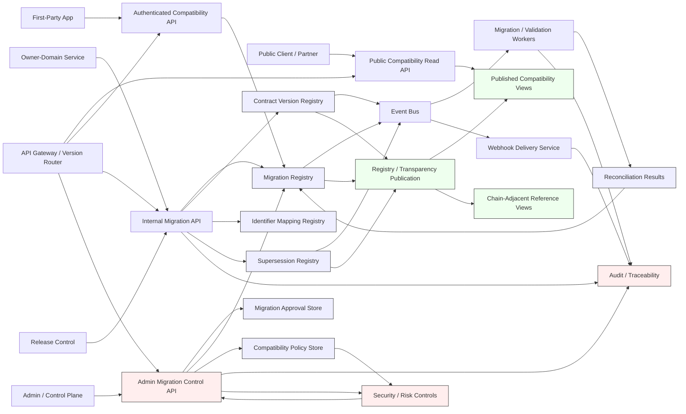
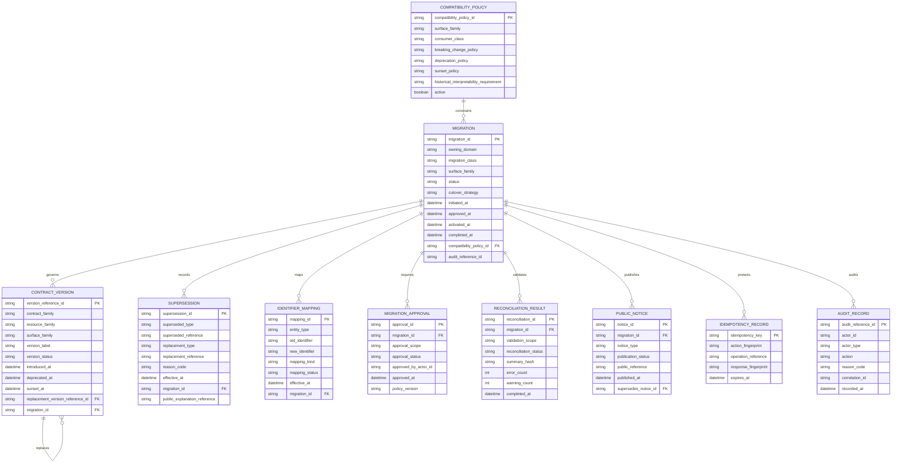
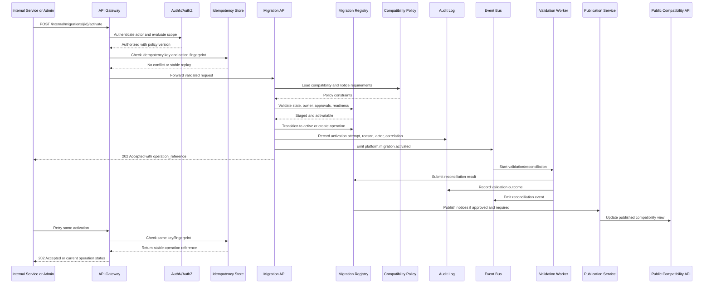

# FUZE Migration and Backward Compatibility API Specification

## Document Metadata

- **Document Name:** `MIGRATION_AND_BACKWARD_COMPATIBILITY_SPEC.md`
- **Document Type:** API SPEC v2 production-grade interface-contract specification
- **Status:** Draft for source-of-truth review
- **Version:** 2.0.0-api-v2
- **Effective Date:** 2026-04-24
- **Last Updated:** 2026-04-24
- **Reviewed On:** 2026-04-24
- **Document Owner:** FUZE Platform Migration and Compatibility Governance Domain; named individual owner is not explicitly specified in the retrieved governing materials
- **Approval Authority:** Not explicitly specified in the retrieved governing materials; approval remains governed by the active FUZE approval workflow and higher-order constitutional specification process
- **Review Cadence:** MUST be reviewed whenever API surface-family posture, contract-version policy, deprecation/sunset policy, migration registry schema, public-trust publication posture, chain-reference migration posture, rollback/forward-fix posture, or owner-domain migration authority materially changes; SHOULD be reviewed quarterly
- **Governing Layer:** API SPEC v2 / shared platform change-governance and compatibility interface-contract layer
- **Parent Registry:** `API_SPEC_INDEX.md` for historical API family registry; API SPEC v2 canonical registry order for new production API specs
- **Upstream Semantic Registry:** `REFINED_SYSTEM_SPEC_INDEX.md`
- **Upstream API Registry:** `API_SPEC_INDEX.md`
- **Primary Audience:** Platform architecture, backend engineering, API authors, implementation-contract authors, product engineering, event/webhook authors, public registry authors, transparency/reporting authors, security, audit, operations, support/control-plane operators, SDK/OpenAPI/AsyncAPI authors, and domain teams executing migrations
- **Primary Purpose:** Define the production-grade FUZE API contract for migration, backward compatibility, deprecation, sunset, coexistence, supersession, lineage preservation, public notice, and migration-safe evolution across APIs, internal contracts, events, webhooks, identifiers, read models, public artifacts, chain references, and trust-sensitive platform surfaces
- **Primary Upstream References:**
  - `REFINED_SYSTEM_SPEC_INDEX.md`
  - `DOCS_SPEC_INDEX.md`
  - `SYSTEM_SPEC_INDEX.md`
  - `API_SPEC_INDEX.md`
  - `MIGRATION_AND_BACKWARD_COMPATIBILITY_SPEC.md`
  - `API_ARCHITECTURE_SPEC.md`
  - `PUBLIC_API_SPEC.md`
  - `INTERNAL_SERVICE_API_SPEC.md`
  - `EVENT_MODEL_AND_WEBHOOK_SPEC.md`
  - `IDEMPOTENCY_AND_VERSIONING_SPEC.md`
  - `FEATURE_FLAG_AND_ROLLOUT_CONTROL_SPEC.md`
  - `WORKFLOW_AND_AUTOMATION_SPEC.md`
  - `JOB_QUEUE_AND_WORKER_SPEC.md`
  - `DEPLOYMENT_AND_RUNTIME_OPERATIONS_SPEC.md`
  - `BUSINESS_CONTINUITY_AND_RECOVERY_SPEC.md`
  - `AUDIT_LOG_AND_ACTIVITY_SPEC.md`
  - `AUDIT_AND_ACCESS_TRACEABILITY_SPEC.md`
  - `SECURITY_AND_RISK_CONTROL_SPEC.md`
  - `PUBLIC_CONTRACT_AND_WALLET_REGISTRY_SPEC.md`
  - `TRANSPARENCY_MODEL_SPEC.md`
  - `TRANSPARENCY_REPORTING_SPEC.md`
  - `ONCHAIN_OFFCHAIN_RESPONSIBILITY_SPEC.md`
  - `DATA_MODEL_AND_ENTITY_OWNERSHIP_SPEC.md`
  - `DOMAIN_OWNERSHIP_MATRIX_SPEC.md`
  - `FUZE_ACCOUNT_ACCESS_AND_SESSION_THESIS_FINAL_SPEC.md`
  - `FUZE_ACCOUNT_ACCESS_AND_SESSION_CANONICAL_FINAL_SPEC.md`
  - `FUZE_WORKSPACE_ACCESS_CONTROL_BASICS_THESIS_FINAL_SPEC.md`
- **Primary Downstream Dependents:**
  - domain API specifications that evolve contract-bearing resources
  - OpenAPI deprecation, sunset, lineage, and compatibility components
  - AsyncAPI migration and version-transition event catalogs
  - SDK migration metadata, warnings, and generated client behavior
  - public registry and transparency compatibility publication contracts
  - release-control runbooks and cutover procedures
  - migration implementation-contract specs
  - data migration and backfill specs
  - product migration plans and coexistence plans
  - chain-reference replacement and supersession procedures
- **API Surface Families Covered:** internal service API, admin/control-plane API, public compatibility read API, authenticated first-party compatibility read API, event/async API, webhook API, reporting/public-read API, chain-adjacent reference API
- **API Surface Families Excluded:** ordinary domain business APIs except where they expose migration/compatibility metadata; raw database migration scripts; chain contract ABI definitions; product UI-only copy; CI/CD implementation internals; ledger/payout/treasury business semantics owned by their respective domains
- **Canonical System Owner(s):** FUZE Platform Migration and Compatibility Governance Domain for migration and compatibility posture; owner domains retain canonical ownership of their business truth, identifiers, and domain-specific migration meaning
- **Canonical API Owner:** FUZE Platform API Governance / Runtime Change Control interface-contract layer
- **Supersedes:** Earlier API v1-style `MIGRATION_AND_BACKWARD_COMPATIBILITY_SPEC.md` interpretations that treated the API as route listing only or allowed migration mechanics to override refined system semantics
- **Superseded By:** Not yet known
- **Related Decision Records:** Not explicitly specified in the retrieved governing materials
- **Canonical Status Note:** This API spec derives from the active refined migration and backward-compatibility semantics. It governs interface-contract expression only. It MUST NOT redefine migration truth, domain ownership, compatibility posture, or conflict-resolution semantics established by the refined system-spec library.
- **Implementation Status:** Normative API-contract draft; downstream services, contract catalogs, migration registries, operator tooling, event/webhook catalogs, SDK derivation, and public compatibility surfaces MUST align after approval
- **Approval Status:** Draft pending explicit FUZE approval workflow
- **Change Summary:** Upgraded migration/backward-compatibility material into API SPEC v2 form with explicit API surface-family boundaries, resource families, request/response/error/status models, idempotency and replay rules, authorization and approval requirements, public/internal/admin/event separation, diagrams, flow view, data-flow sequence, acceptance criteria, tests, and implementation-contract guardrails.

## Purpose

This specification defines the FUZE API contract for migration and backward compatibility.

The purpose of this API contract is to make migration, compatibility, deprecation, sunset, supersession, cutover, rollback, forward-fix, identifier mapping, contract-version lineage, and public compatibility notice behavior deterministic at the interface layer while preserving refined system semantics.

This API specification exists because FUZE migration is not ordinary cleanup. Migration affects API contracts, internal service contracts, event schemas, webhook schemas, identifiers, projections, public trust artifacts, chain-adjacent references, product-visible behavior, and historical interpretability. A weak or implicit migration API would allow hidden dual ownership, silent breaking changes, reporting drift, public-trust damage, replay-unsafe cutovers, and operator shortcuts. This document prevents those failures by defining the allowed interface-contract model.

## Scope

This specification governs API-visible migration and backward-compatibility behavior for:

1. migration registration and lifecycle-state APIs
2. compatibility policy and contract-version registry APIs
3. deprecation and sunset scheduling APIs
4. supersession and identifier mapping APIs
5. readiness, approval, cutover, rollback, and forward-fix APIs
6. reconciliation and migration completion APIs
7. public and authenticated compatibility read APIs
8. migration/version/supersession event APIs
9. public webhook notification posture for approved external compatibility changes
10. reporting/projection/public-read rules for derived compatibility artifacts
11. chain-adjacent reference replacement and public explanation posture
12. OpenAPI, AsyncAPI, SDK, and implementation-contract derivation requirements

## Out of Scope

This API specification does not define:

- every table-level migration script or DDL statement
- every product-specific migration plan or release calendar
- domain-specific business approval rules outside compatibility/change-control behavior
- exact CI/CD implementation details
- every domain payload field for every version transition
- exact product UX copy for deprecation banners or migration guidance
- exact chain deployment transactions or smart-contract ABIs
- legal/accounting interpretation of public notices
- replacement of domain APIs that own business actions
- replacement of `IDEMPOTENCY_AND_VERSIONING_SPEC.md`, `EVENT_MODEL_AND_WEBHOOK_SPEC.md`, or `PUBLIC_API_SPEC.md`

Those details belong in domain implementation contracts, migration runbooks, machine-readable OpenAPI/AsyncAPI artifacts, data migration plans, contract deployment procedures, and product-specific release artifacts, provided they preserve this API contract.

## Design Goals

1. Preserve canonical ownership during migration.
2. Make compatibility obligations explicit, bounded, and observable.
3. Distinguish migration, correction, supersession, deprecation, sunset, and replacement.
4. Prevent hidden dual ownership during coexistence.
5. Preserve lineage and historical interpretability across API, event, webhook, registry, reporting, and chain-adjacent transitions.
6. Make public and partner-visible changes safe through notice, versioning, and narrow exposure.
7. Make mutation APIs idempotent and replay-safe.
8. Make operator/admin actions explicit, reason-coded, policy-constrained, and audited.
9. Make long-running migrations expose accepted/in-progress/final outcomes correctly.
10. Enable downstream OpenAPI, AsyncAPI, SDK, QA, and runtime implementation without contradictory reinterpretation.

## Non-Goals

This specification does not aim to:

- guarantee indefinite support for every legacy behavior
- freeze FUZE API surfaces permanently
- make public compatibility more important than platform correctness in emergency situations
- allow migration APIs to bypass domain ownership or validation rules
- allow rollout flags to substitute for migration truth
- turn reporting/publication artifacts into canonical migration owners
- treat chain observations as off-chain migration truth before owner-domain validation
- expose internal readiness, approval, or risk details through public compatibility APIs
- collapse implementation migration scripts into this interface-contract document

## Core Principles

### Canonical-Owner Preservation

Every migration MUST preserve a clear canonical owner for each material truth family. Coexistence MAY expose multiple representations, but it MUST NOT create multiple write owners for the same truth.

### Compatibility Is Bounded

Backward compatibility is a governed promise. It MUST be explicit, scoped, policy-bound, and time-bounded where appropriate.

### Historical Interpretability

Historical artifacts, references, identifiers, public notices, reports, and chain-adjacent references MUST remain intelligible after migration.

### Migration Is Not Rollout

Rollout controls MAY gate exposure, traffic, or feature availability, but rollout state MUST NOT become canonical migration truth, compatibility truth, or lineage truth.

### Correction Is Not Supersession

Correction, supersession, deprecation, sunset, migration, and replacement MUST remain separate API states and reason classes.

### Public-Trust Restraint

Public APIs, public webhooks, public registry references, transparency artifacts, payout-facing references, and chain-adjacent references receive the strongest compatibility, notice, and lineage discipline.

### Replay-and-Recovery Safety

Migration operations, events, webhooks, notices, and version transitions MUST be safe under retry, replay, resumption, deduplication, and controlled recovery.

### Operator Boundedness

Admin/control-plane mutation APIs MUST be narrow, reason-coded, policy-constrained, approval-aware, and durably audited.

## Canonical Definitions

- **Migration:** A controlled change in representation, contract, storage, topology, reference, or operational posture that moves live FUZE behavior from one governed state to another.
- **Backward Compatibility:** The bounded degree to which a new FUZE structure continues to support prior consumers, references, payload assumptions, or historical interpretation.
- **Coexistence Window:** A governed period in which old and new representations or contracts may both exist while one remains explicitly canonical for writes or authoritative interpretation.
- **Cutover:** The governed transition point at which primary write authority, canonical read authority, routing authority, or supported contract posture shifts from old to new.
- **Supersession:** A controlled replacement of an artifact, reference, contract, or representation by a newer one with preserved lineage to the prior one.
- **Correction:** A governed repair of incorrect historical or current data, publication, or interpretation that preserves explicit lineage to what was corrected.
- **Deprecation:** A declared reduction in future support or preferred use of a contract or representation. Deprecation does not itself mean immediate removal.
- **Sunset:** A declared end of supported use for a version, contract, or representation after required notice and compatibility obligations are satisfied or explicitly overridden under emergency policy.
- **Migration Truth:** The durable platform-governed record of migration identity, status, strategy, readiness, approvals, reconciliation, and lineage.
- **Compatibility Artifact:** A public or internal artifact that communicates version posture, deprecation status, replacement lineage, or migration guidance without owning underlying business meaning.
- **Contract Version:** A versioned API, internal-service, event, webhook, reporting, registry, or public-read contract reference.
- **Lineage Reference:** A durable relationship between old and new identifiers, contract versions, artifacts, registry entries, or chain-adjacent references.

## Truth Class Taxonomy

This API contract MUST preserve the following truth classes:

1. **Semantic truth** — what changed, what remains equivalent, and which domain owns meaning.
2. **API contract truth** — allowed route families, request and response envelopes, error classes, version fields, and surface-family exposure.
3. **Policy truth** — compatibility windows, deprecation/sunset policy, public notice policy, approval policy, and override conditions.
4. **Runtime truth** — staged state, active cutover state, validation progress, rollback state, forward-fix state, and execution progress.
5. **Ledger / storage truth** — durable migration records, approval records, compatibility policy records, version lineage, identifier mapping, supersession records, and reconciliation outcomes.
6. **Provider-input truth** — external, partner, or chain-originating observations before owner-domain validation.
7. **Event / async execution truth** — migration events, version-transition events, webhook delivery records, retry outcomes, and replay lineage.
8. **Projection / reporting truth** — dashboards, notices, registry views, transparency views, compatibility summaries, and public explanation artifacts derived from canonical sources.
9. **Presentation truth** — banners, SDK warnings, console labels, user-facing explanatory text, and admin UI labels.

These truth classes MUST NOT be collapsed. Migration governance does not become business-domain truth. Public notices do not become migration truth. Rollout flags do not become lineage truth. SDK hints do not become compatibility policy.

## Architectural Position in the Spec Hierarchy

This API spec derives from the active refined system specification for migration and backward compatibility and sits under the refined registry. It expresses system semantics as interface contracts.

It is downstream of:

- `REFINED_SYSTEM_SPEC_INDEX.md`
- `MIGRATION_AND_BACKWARD_COMPATIBILITY_SPEC.md`
- `API_ARCHITECTURE_SPEC.md`
- platform boundary and ownership specifications
- identity/session and workspace access-control foundation documents

It is adjacent to:

- `PUBLIC_API_SPEC.md`
- `INTERNAL_SERVICE_API_SPEC.md`
- `EVENT_MODEL_AND_WEBHOOK_SPEC.md`
- `IDEMPOTENCY_AND_VERSIONING_SPEC.md`
- `INTEGRATION_CONNECTOR_FRAMEWORK_API_SPEC.md`
- `DATA_CLASSIFICATION_AND_HANDLING_API_SPEC.md`
- `AUDIT_LOG_AND_ACTIVITY_API_SPEC.md`
- `SECURITY_AND_RISK_CONTROL_API_SPEC.md`

It is upstream to:

- domain migration implementation contracts
- data migration plans
- contract-version registries
- migration event catalogs
- public compatibility endpoints
- SDK migration warnings
- release-control runbooks
- OpenAPI and AsyncAPI contract components

## Upstream Semantic Owners

The upstream refined system specs own semantics as follows:

- `MIGRATION_AND_BACKWARD_COMPATIBILITY_SPEC.md` owns migration, compatibility, coexistence, cutover, rollback, forward-fix, supersession, deprecation, sunset, lineage, and historical interpretability semantics.
- `API_ARCHITECTURE_SPEC.md` owns shared API surface-family, accepted-state, request/response/error, chain-adjacent interface, and API-governance posture.
- `PUBLIC_API_SPEC.md` owns external/public exposure posture.
- `INTERNAL_SERVICE_API_SPEC.md` owns internal service-to-service contract posture.
- `EVENT_MODEL_AND_WEBHOOK_SPEC.md` owns event and webhook semantics.
- `IDEMPOTENCY_AND_VERSIONING_SPEC.md` owns replay/idempotency and contract-version classification semantics.
- `FEATURE_FLAG_AND_ROLLOUT_CONTROL_SPEC.md` owns rollout gating semantics and does not own migration truth.
- `AUDIT_LOG_AND_ACTIVITY_SPEC.md` and `AUDIT_AND_ACCESS_TRACEABILITY_SPEC.md` own immutable audit and traceability semantics.
- `SECURITY_AND_RISK_CONTROL_SPEC.md` owns sensitive-path risk controls and emergency withdrawal posture.
- `DEPLOYMENT_AND_RUNTIME_OPERATIONS_SPEC.md` owns release mechanics and runtime activation discipline.
- `BUSINESS_CONTINUITY_AND_RECOVERY_SPEC.md` owns resilience, containment, recovery, restoration, and degraded-mode posture.
- Domain refined specs own the meaning of their own resources, identifiers, and business outcomes.

## API Surface Families

### Public Compatibility Read API

Public, unauthenticated or public-safe API surfaces MAY expose published compatibility notices, deprecation status, sunset status, public supersession lineage, public registry migration references, and approved public contract metadata. These APIs MUST be read-only and MUST NOT expose internal readiness, approval, risk, unreleased migration state, or private domain data.

### Authenticated First-Party Compatibility Read API

First-party application APIs MAY expose caller-scoped migration metadata that directly affects the caller's own account, workspace, resources, entitlements, operations, or public artifacts. These APIs remain public/external authenticated APIs, not internal APIs.

### Internal Service Migration API

Internal service APIs MAY register migrations, read compatibility state, resolve identifier mappings, attach readiness data, record execution progress, and submit reconciliation results within authorized owner scope. Internal services MUST NOT mutate foreign-domain migration truth or business truth through convenience routes.

### Admin / Control-Plane Migration API

Admin/control APIs MAY approve, stage, activate, roll back, forward-fix, quarantine, or publish compatibility posture under explicit scopes, approval rules, policy gates, reason codes, and audit requirements.

### Event / Async API

Event APIs communicate migration lifecycle changes, version lifecycle changes, supersession records, public-notice publication, reconciliation outcomes, rollback, forward-fix, and sunset transitions. Event delivery is at-least-once unless otherwise specified and MUST be replay-safe.

### Webhook API

External webhooks MAY notify approved partner/public consumers of public compatibility changes, public contract version transitions, public registry supersessions, or upcoming sunset events. Webhooks MUST be narrower than internal events.

### Reporting / Public-Read API

Reporting and public-read APIs MAY expose derived compatibility summaries, dashboards, transparency references, and registry views. They MUST NOT become canonical migration owners.

### Chain-Adjacent API

Chain-adjacent APIs MAY expose or consume supersession references, contract-address lineage, wallet-registry migration references, and public explanation links. They MUST distinguish chain-native facts from off-chain migration policy and publication truth.

## System / API Boundaries

1. Application plane owner domains retain canonical business mutation authority.
2. Execution plane systems may coordinate backfills, validation jobs, and cutover workflows but do not own domain meaning.
3. Integration plane systems may normalize partner/provider inputs but raw external inputs do not become canonical migration truth.
4. Reporting plane systems may publish notices or compatibility summaries but remain derived.
5. Control plane systems may approve, restrict, stage, activate, roll back, or forward-fix migrations under policy but do not own business meaning.
6. Chain-adjacent systems may reference chain-native facts but MUST NOT represent off-chain migration state as chain-native fact.
7. API gateways may enforce route access, versioning, headers, and rate limits but do not own migration policy.

## Adjacent API Boundaries

- `API_ARCHITECTURE_SPEC.md` governs surface-family structure; this spec governs migration and compatibility API contracts.
- `PUBLIC_API_SPEC.md` governs external exposure; this spec governs compatibility reads and public-safe migration notices.
- `INTERNAL_SERVICE_API_SPEC.md` governs internal service posture; this spec governs internal migration and compatibility contract families.
- `EVENT_MODEL_AND_WEBHOOK_SPEC.md` governs event/webhook semantics; this spec governs migration-specific events and webhooks.
- `IDEMPOTENCY_AND_VERSIONING_SPEC.md` governs replay and version classification; this spec applies those rules to migration lifecycle and compatibility actions.
- `INTEGRATION_CONNECTOR_FRAMEWORK_API_SPEC.md` will govern connector interfaces; this spec constrains connector migrations, provider replacement, callback version transitions, and external lineage requirements.
- `AUDIT_LOG_AND_ACTIVITY_API_SPEC.md` will govern audit APIs; this spec defines required audit evidence for migration actions.
- `SECURITY_AND_RISK_CONTROL_API_SPEC.md` will govern sensitive control posture; this spec defines when migration APIs require security/risk control enforcement.
- Domain API specs govern their own resource APIs; this spec governs how those APIs migrate and preserve compatibility.

## Conflict Resolution Rules

1. `REFINED_SYSTEM_SPEC_INDEX.md` wins on active refined source-of-truth routing and refined-over-legacy precedence.
2. The active refined migration specification wins on migration, compatibility, coexistence, cutover, rollback, forward-fix, deprecation, sunset, supersession, and lineage semantics.
3. Domain refined specs win on business meaning, domain-specific entity lifecycle, validation, correction, compensation, and owner-domain mutation authority.
4. `API_ARCHITECTURE_SPEC.md` wins on API surface-family interpretation unless contradicted by stronger refined migration semantics for migration-specific state.
5. `IDEMPOTENCY_AND_VERSIONING_SPEC.md` wins on idempotency, replay, and contract-version classification inside its scope.
6. `PUBLIC_API_SPEC.md`, `INTERNAL_SERVICE_API_SPEC.md`, and `EVENT_MODEL_AND_WEBHOOK_SPEC.md` win on their respective surface-family meanings.
7. Public notices, reports, dashboards, caches, SDK warnings, and frontend banners never win over canonical migration truth or owner-domain truth.
8. Rollout flags never win over migration state, compatibility windows, or lineage records.
9. If ambiguity remains, the API MUST choose the more conservative architecture-consistent interpretation and require explicit recorded decision work before production activation.

## Default Decision Rules

1. One domain remains canonical for each truth family throughout migration.
2. One representation remains canonical for writes at any given time, even if multiple representations coexist for reads.
3. Additive evolution and adapter-based transition are preferred over silent semantic breakage.
4. Public and trust-sensitive surfaces receive strongest compatibility and historical interpretability.
5. Internal service surfaces default to coordinated coexistence and explicit cutover, not silent breaking change.
6. Derived/public/reporting surfaces default to derived status, not canonical migration ownership.
7. Rollback is allowed only when semantically safe; otherwise forward-fix with lineage is required.
8. Public sunset is forbidden without required prior notice unless emergency security/correctness policy explicitly overrides the window.
9. If a migration cannot name owner domain, affected truth classes, surface family, coexistence strategy, cutover authority, reconciliation method, recovery choice, and lineage strategy, it MUST NOT proceed to production activation.
10. If a caller attempts to use migration APIs to alter foreign-domain business truth, the API MUST reject the request.

## Roles / Actors / API Consumers

### Human Actors

- end users affected by product-visible migration
- partner integrators and external developers
- support operators
- product operators
- release managers
- security reviewers
- finance/control-plane operators
- governance or approval actors
- public/community readers of trust-sensitive compatibility notices

### System Actors

- public clients
- authenticated first-party applications
- API gateway
- owner-domain services
- migration registry service
- compatibility policy service
- contract version registry service
- release-control service
- workflow engines and workers
- validation and reconciliation jobs
- reporting/publication services
- public registry and transparency publication systems
- event bus
- webhook delivery service
- admin/control-plane backend
- chain-adjacent coordination services
- SDK and machine-readable contract generation pipelines

## Resource / Entity Families

### Canonical API Resources

- `migration`
- `compatibility_policy`
- `contract_version`
- `supersession`
- `identifier_mapping`
- `migration_approval`
- `migration_readiness`
- `migration_reconciliation_result`
- `public_compatibility_notice`
- `migration_event_reference`
- `migration_operation`
- `idempotency_record`
- `audit_reference`

### Derived API Resources

- `compatibility_summary`
- `public_contract_version_view`
- `public_supersession_view`
- `migration_dashboard_view`
- `sdk_migration_hint`
- `deprecation_warning_view`
- `historical_readability_view`

### Provider / External Input Resources

- `provider_contract_observation`
- `partner_callback_version_observation`
- `chain_reference_observation`
- `external_schema_observation`

Provider/external input resources are normalized inputs only until accepted by the owner domain or migration governance domain.

## Ownership Model

### Migration Governance Domain Owns

- migration lifecycle state semantics
- compatibility policy structure
- surface-family compatibility classification
- migration status transitions
- deprecation/sunset state posture
- cutover and recovery state posture
- shared lineage requirements
- migration approval and readiness contract structure
- migration registry schema-level API contract
- public notice eligibility rules

### Owner Domains Own

- business meaning of migrated resources
- domain validation and correction rules
- domain identifier families
- semantic equivalence or non-equivalence of old/new representations
- domain-specific compensation, repair, or forward-fix requirements
- domain-specific migration completion criteria

### Publication Domains Own

- published notices
- public registry views
- transparency views
- public explanation artifacts

They do not own migration truth or domain truth.

### Runtime / Release Domains Own

- release mechanics
- deployment activation
- runtime routing
- traffic exposure
- backfill execution environment

They do not own migration truth or business semantics.

## Authority / Decision Model

1. Platform migration governance authority controls shared lifecycle, compatibility, deprecation, sunset, and lineage posture.
2. Domain authority controls business meaning and validates that migration preserves or intentionally changes domain semantics.
3. Control-plane authority may approve, activate, roll back, or forward-fix only under bounded policy.
4. Security/risk authority may block, quarantine, or emergency-withdraw unsafe migrations.
5. Public registry/transparency authority may publish derived compatibility artifacts after canonical migration and owner-domain state supports publication.
6. Chain-native systems remain authoritative only for chain-native facts. Off-chain policy and explanation remain off-chain truths.
7. No actor may infer migration completion from UI behavior, cache state, rollout percentage, or deployment state alone.

## Authentication Model

### Public Reads

Public compatibility reads MAY be unauthenticated only where the resource is intentionally public. They MUST be rate-limited and MUST expose only published data.

### Authenticated End-User Reads

Authenticated first-party reads MUST use canonical account/session authentication. Session authentication confirms actor identity; it does not grant migration mutation authority.

### Workspace-Scoped Reads

Workspace-related migration metadata MUST require workspace scope and access evaluation. Workspace membership, workspace scope, permission, and entitlement MUST remain distinct.

### Internal Service Calls

Internal service migration APIs MUST authenticate service identity using approved internal service identity mechanisms. Service identity MUST be bound to an allowed owner domain and route family.

### Admin / Control Calls

Admin/control-plane mutation APIs MUST require privileged operator authentication, policy-bound scope, reason code, approval context, and traceable session or service identity.

### Webhook Delivery

Outbound webhooks MUST use signing, timestamp, delivery ID, and replay-window controls. Webhook consumers MUST NOT be trusted to acknowledge migration truth beyond delivery confirmation.

## Authorization / Scope / Permission Model

### Required Scope Families

- `migration:read`
- `migration:register`
- `migration:plan`
- `migration:approve`
- `migration:stage`
- `migration:activate`
- `migration:rollback`
- `migration:forward_fix`
- `migration:reconcile`
- `compatibility_policy:read`
- `compatibility_policy:write`
- `contract_version:read`
- `contract_version:write`
- `contract_version:deprecate`
- `contract_version:sunset`
- `supersession:write`
- `identifier_mapping:write`
- `public_notice:publish`
- `admin:migration_control`
- `security:migration_override`

### Authorization Rules

1. Read access MUST be scoped by actor type, visibility class, and affected resource.
2. Mutation access MUST require owner-domain authority or explicit platform migration governance authority.
3. Admin/control routes MUST require narrower privileges than internal read routes.
4. Public callers MUST NOT access internal migration registry details, approval records, readiness risks, unreleased migration plans, or validation failures unless explicitly published.
5. Workspace-scoped migration reads MUST enforce workspace access evaluation and must not rely solely on resource IDs.
6. Entitlement checks MAY constrain product migration visibility or transition access but MUST NOT replace authorization.
7. Governance-sensitive or chain-reference migrations MAY require dual-control or approval layers before activation.

## Entitlement / Capability-Gating Model

1. Migration APIs MUST NOT silently reinterpret plan, entitlement, or capability meaning.
2. If entitlement semantics or plan mappings change, the owner domain MUST publish explicit compatibility lineage and affected-resource handling.
3. Rollout gating MAY narrow exposure during migration but MUST NOT replace entitlement truth or migration truth.
4. Legacy entitlement interpretation MAY be temporarily supported only under explicit compatibility policy.
5. Public compatibility reads do not confer entitlement to use deprecated or sunset contracts.
6. SDK warnings or UI banners MUST NOT be treated as entitlement decisions.

## API State Model

### Migration Lifecycle

`draft -> planned -> approved -> staged -> active -> validating -> completed`

Exceptional or terminal states:

- `cancelled`
- `rolled_back`
- `failed_requires_forward_fix`
- `superseded`

### Version Lifecycle

`proposed -> current -> deprecated -> sunset_scheduled -> sunset_complete`

Additional state:

- `historical_readable_only`

### Supersession Lifecycle

`declared -> published -> effective -> historical_lineage_only`

### Public Notice Lifecycle

`draft -> approved_for_publication -> published -> corrected -> superseded -> archived`

### Operation Lifecycle

`accepted -> in_progress -> succeeded -> failed_retryable -> failed_terminal -> blocked_requires_operator -> rolled_back -> forward_fix_required`

### State Transition Rules

1. `active` requires owner attribution, readiness record, approval linkage, and idempotency protection.
2. `deprecated` requires replacement reference or explicit deprecation rationale.
3. `sunset_complete` requires satisfied notice window or explicit emergency override.
4. `completed` requires reconciliation success or governed override with residual risk acceptance.
5. `rolled_back` is allowed only when semantically safe for the owner domain.
6. `failed_requires_forward_fix` is required when rollback would corrupt truth or public trust.
7. `historical_readable_only` means no live supported behavior remains, but historical artifacts remain interpretable.

## Lifecycle / Workflow Model

1. Register migration candidate with owner domain, affected surface families, change class, migration class, and intended strategy.
2. Attach migration plan, readiness evidence, impact classification, compatibility policy reference, validation method, and recovery posture.
3. Collect approvals based on sensitivity tier, public exposure, chain-adjacent effect, financial/governance impact, and domain owner requirements.
4. Stage adapters, dual-read/dual-write plans, shadow validation, read-model rebuild plans, public notice drafts, event/webhook transition catalogs, and SDK metadata.
5. Activate cutover under explicit authority and idempotency guard.
6. Emit lifecycle events and produce operation reference.
7. Execute validation/reconciliation jobs and publish results.
8. Publish compatibility notices, deprecation metadata, supersession records, and public explanations where required.
9. Complete, roll back, or declare forward-fix with explicit lineage and audit references.
10. Preserve historical readability and compatibility artifacts for the required duration.

## Architecture Diagram — Mermaid flowchart

## Data Design — Mermaid Diagram

## Flow View

### Standard Migration Registration and Cutover

1. Caller submits `POST /internal/migrations` with owner domain, surface family, migration class, change scope, and cutover strategy.
2. API authenticates service/admin identity.
3. API authorizes owner-domain scope and route permission.
4. API validates that owner domain, affected truth classes, surface family, and recovery posture are explicit.
5. API records idempotency identity and rejects conflicting duplicate action fingerprints.
6. Migration registry records `draft` or `planned`.
7. Audit record captures actor, reason, correlation ID, request source, policy version, and idempotency key.
8. Event bus receives `platform.migration.created`.
9. Readiness APIs collect validation plan, dependency state, public notice need, rollback/forward-fix classification, and approval requirements.
10. Admin/control-plane approval records required approvals.
11. Stage API records staging state after adapters, compatibility policy, public notice draft, and reconciliation plan are ready.
12. Activate API performs cutover or records external cutover confirmation under explicit authority.
13. API returns `202 Accepted` with operation reference where activation is asynchronous or `200 OK` only when already durably applied.
14. Reconciliation jobs validate semantic, lineage, public notice, event/webhook, and projection correctness.
15. Completion API marks migration complete only after reconciliation success or governed override.
16. Public notices and compatibility views are published where required.
17. Historical readability remains available for deprecated or sunset references.

### Failure, Retry, and Recovery

1. Duplicate retries with same idempotency key and same action fingerprint return the original response or current stable operation status.
2. Duplicate retries with materially different fingerprints return `409 idempotency_conflict`.
3. Activation failure moves operation to `failed_retryable`, `blocked_requires_operator`, or `failed_terminal`.
4. If rollback is semantically safe, admin/control route may initiate rollback with reason code and risk acknowledgement.
5. If rollback is unsafe, migration transitions to `failed_requires_forward_fix`.
6. Forward-fix requires preserved lineage, approval reference, and public explanation where trust-sensitive.
7. All recovery actions emit events and audit records.
8. Public surfaces expose only approved/published status, not internal failure detail.

### Public Compatibility Read

1. Public client requests current compatibility notice or contract version metadata.
2. API gateway applies public rate limit and abuse controls.
3. API reads published compatibility views only.
4. API returns current status, replacement references, deprecation/sunset dates where published, and historical lineage references.
5. API omits internal readiness, approval, risk, and unreleased migration details.

## Data Flows — Mermaid sequenceDiagram

## Request Model

### Required Envelope Fields for Mutations

Mutation requests MUST include or derive:

- `request_id`
- `idempotency_key`
- `correlation_id`
- `actor_reference`
- `actor_type`
- `owning_domain`
- `surface_family`
- `reason_code`
- `policy_version`
- `requested_at`
- `operation_mode`
- `client_contract_version` where applicable

### Migration Registration Request

Required fields:

- `migration_class`
- `owning_domain`
- `affected_surface_families[]`
- `affected_resource_families[]`
- `affected_truth_classes[]`
- `change_scope`
- `cutover_strategy`
- `compatibility_policy_id`
- `rollback_classification`
- `forward_fix_plan_required`
- `public_notice_required`
- `chain_reference_impact`
- `reconciliation_strategy`

### Activation Request

Required fields:

- `activation_mode`
- `effective_at`
- `cutover_reference`
- `approval_references[]`
- `operator_confirmation`
- `risk_acknowledgement` when required
- `expected_migration_status`
- `expected_contract_versions[]`

### Deprecation / Sunset Request

Required fields:

- `version_reference_id`
- `deprecation_reason_code`
- `replacement_version_reference_id` or explicit no-replacement rationale
- `public_notice_reference` when public
- `sunset_at` when scheduling sunset
- `compatibility_window`
- `consumer_impact_class`

### Supersession Request

Required fields:

- `superseded_type`
- `superseded_reference`
- `replacement_type`
- `replacement_reference`
- `reason_code`
- `effective_at`
- `migration_id`
- `public_explanation_reference` when public/trust-sensitive

### Identifier Mapping Request

Required fields:

- `entity_type`
- `old_identifier`
- `new_identifier`
- `mapping_kind`
- `migration_id`
- `effective_at`
- `owner_domain_confirmation`

## Response Model

### Mutation Response Classes

- `created` — durable record created.
- `accepted` — action accepted for async processing; final business outcome pending.
- `applied` — state transition durably applied.
- `in_progress` — operation executing or validating.
- `completed` — migration or operation completed.
- `rolled_back` — rollback completed.
- `forward_fix_required` — rollback unsafe; forward-fix required.
- `conflict` — state, owner, idempotency, or policy conflict.
- `rejected` — authorization, scope, readiness, policy, or validation failure.

### Required Mutation Response Fields

- `status`
- `migration_id` where applicable
- `version_reference_id` where applicable
- `operation_reference`
- `result_class`
- `current_lifecycle_state`
- `accepted_at` or `applied_at`
- `correlation_id`
- `audit_reference_id`
- `idempotency_replay` boolean
- `lineage_references[]`
- `next_required_action` where applicable
- `retryability`

### Public Read Response Fields

Public reads MUST classify records as published derived compatibility data and include:

- `contract_family` or `reference`
- `current_version`
- `deprecated_versions[]`
- `sunset_status`
- `replacement_reference`
- `supersession_lineage[]`
- `public_explanation_reference`
- `published_at`
- `last_public_update_at`
- `historical_readability_status`

Public reads MUST NOT include:

- internal approval records
- unreleased migration plans
- internal risk flags
- operator identities
- validation failure details
- non-public resource IDs
- private domain data

## Error / Result / Status Model

### Canonical Error Families

- `migration_not_found`
- `migration_state_conflict`
- `migration_not_ready`
- `migration_owner_missing`
- `migration_owner_mismatch`
- `affected_truth_class_missing`
- `compatibility_policy_missing`
- `approval_missing`
- `approval_scope_insufficient`
- `rollback_not_semantically_safe`
- `forward_fix_required`
- `version_reference_not_found`
- `replacement_reference_missing`
- `legacy_mapping_conflict`
- `supersession_conflict`
- `public_notice_required`
- `public_notice_not_published`
- `sunset_window_not_satisfied`
- `surface_not_public`
- `idempotency_key_missing`
- `idempotency_conflict`
- `authorization_denied`
- `workspace_scope_denied`
- `entitlement_transition_denied`
- `governance_approval_required`
- `security_override_required`
- `reconciliation_failed`
- `chain_reference_lineage_missing`
- `derived_surface_not_canonical`
- `foreign_domain_write_forbidden`
- `rate_limited`
- `abuse_control_blocked`

### Error Envelope

Errors MUST include:

- stable machine-readable `code`
- human-readable `message`
- `correlation_id`
- `request_id`
- `retryability`
- `status`
- `policy_reference` where applicable
- `lineage_reference` where relevant
- `operation_reference` where an accepted operation exists
- `audit_reference_id` for control-plane and internal mutation failures where safe to expose

### Status Semantics

- `200 OK` MAY be used for completed reads or stable idempotent replay of completed actions.
- `201 Created` MAY be used for synchronous creation of migration, contract-version, mapping, or supersession records.
- `202 Accepted` MUST be used where final business outcome is asynchronous.
- `204 No Content` SHOULD NOT be used for migration mutations because response lineage is required.
- `400 Bad Request` is used for malformed requests.
- `401 Unauthorized` is used for missing/invalid authentication.
- `403 Forbidden` is used for valid authentication but denied scope/policy.
- `404 Not Found` MUST NOT leak private IDs across visibility boundaries.
- `409 Conflict` is used for state, idempotency, owner, mapping, or supersession conflicts.
- `422 Unprocessable Entity` is used for semantically invalid migration content.
- `423 Locked` MAY be used for migration hold/quarantine states.
- `429 Too Many Requests` is used for rate-limit or abuse controls.
- `500/503` are used for server/dependency failures and MUST include retry classification.

## Idempotency / Retry / Replay Model

1. Every mutation that creates, approves, stages, activates, rolls back, forward-fixes, deprecates, sunsets, supersedes, maps identifiers, publishes notices, or completes a migration MUST require idempotency.
2. The idempotency key MUST be scoped to actor, owner domain, operation family, target resource, and action fingerprint.
3. Replaying the same key and same fingerprint MUST return the stable prior response or current operation state.
4. Replaying the same key with a different fingerprint MUST return `idempotency_conflict`.
5. Activation replay MUST NOT trigger double cutover.
6. Deprecation replay MUST NOT create duplicate notices or multiple version transitions.
7. Identifier mapping replay MUST preserve uniqueness for `entity_type + old_identifier + migration_id`.
8. Event replay MUST NOT duplicate migration meaning.
9. Webhook redelivery MUST preserve delivery IDs and event IDs.
10. Retryable failures MUST distinguish transport retry from semantic retry.
11. Public reads do not require idempotency but MUST remain version-aware and cache-safe.
12. Idempotency records MUST be auditable for material migration actions.

## Rate Limit / Abuse-Control Model

1. Public compatibility reads MUST be rate-limited by IP, public token where applicable, contract family, and request class.
2. Authenticated first-party reads MUST be rate-limited by account, workspace, session, and resource family.
3. Internal service mutations MUST be rate-limited by service identity, owner domain, and operation class.
4. Admin/control mutations MUST be rate-limited more strictly and MAY require step-up confirmation.
5. Repeated failed activation, rollback, forward-fix, deprecation, sunset, or public notice publication attempts MUST trigger risk controls.
6. Public enumeration of unpublished or private migration resources MUST be blocked.
7. Webhook delivery retries MUST use bounded retry policies and dead-letter posture.
8. Abuse controls MUST NOT silently alter compatibility state; they may block access or require review.

## Endpoint / Route Family Model

This section defines route families, not exhaustive OpenAPI paths. Downstream OpenAPI MUST preserve these route-family boundaries.

### Internal Migration Registration

- `POST /internal/migrations`
- `GET /internal/migrations/{migration_id}`
- `PATCH /internal/migrations/{migration_id}/plan`
- `GET /internal/migrations/{migration_id}/readiness`

Allowed callers: owner-domain service, release-control service, admin backend.

### Approval and Control

- `POST /admin/migrations/{migration_id}/approve`
- `POST /admin/migrations/{migration_id}/reject`
- `POST /admin/migrations/{migration_id}/hold`
- `POST /admin/migrations/{migration_id}/release-hold`
- `GET /admin/migrations`
- `GET /admin/migrations/{migration_id}`

Allowed callers: privileged admin/control-plane actors only.

### Staging, Activation, Recovery

- `POST /internal/migrations/{migration_id}/stage`
- `POST /admin/migrations/{migration_id}/activate`
- `POST /admin/migrations/{migration_id}/rollback`
- `POST /admin/migrations/{migration_id}/forward-fix`
- `POST /internal/migrations/{migration_id}/reconcile`
- `POST /internal/migrations/{migration_id}/complete`

Activation, rollback, and forward-fix SHOULD be admin/control routes even when invoked by release-control workflows.

### Compatibility Policy

- `GET /internal/compatibility-policies`
- `GET /internal/compatibility-policies/{policy_id}`
- `POST /admin/compatibility-policies`
- `PATCH /admin/compatibility-policies/{policy_id}`

Policy writes are admin/control-plane only.

### Contract Versions

- `POST /internal/contract-versions`
- `GET /internal/contract-versions/{version_reference_id}`
- `POST /internal/contract-versions/{version_reference_id}/deprecate`
- `POST /internal/contract-versions/{version_reference_id}/schedule-sunset`
- `POST /admin/contract-versions/{version_reference_id}/sunset-complete`

Public equivalents MUST be read-only and published-only.

### Supersession and Identifier Mapping

- `POST /internal/supersessions`
- `GET /internal/supersessions/{supersession_id}`
- `POST /internal/identifier-mappings`
- `GET /internal/identifier-mappings:resolve`

Writes require owner-domain authority.

### Public Compatibility Reads

- `GET /public/compatibility/notices`
- `GET /public/compatibility/contracts/{contract_family}`
- `GET /public/compatibility/contracts/{contract_family}/versions/{version}`
- `GET /public/registry/supersessions/{reference}`
- `GET /public/compatibility/chain-references/{reference}`

These endpoints MUST return only published compatibility artifacts.

### Authenticated First-Party Reads

- `GET /v1/me/migration-notices`
- `GET /v1/workspaces/{workspace_id}/migration-notices`
- `GET /v1/resources/{resource_family}/{resource_id}/compatibility-status`

These endpoints MUST enforce account, session, workspace, permission, and visibility rules.

### Event and Webhook APIs

Events include:

- `platform.migration.created`
- `platform.migration.planned`
- `platform.migration.approval_recorded`
- `platform.migration.staged`
- `platform.migration.activated`
- `platform.migration.reconciliation_recorded`
- `platform.migration.completed`
- `platform.migration.rolled_back`
- `platform.migration.forward_fix_declared`
- `platform.contract_version.deprecated`
- `platform.contract_version.sunset_scheduled`
- `platform.contract_version.sunset_complete`
- `platform.supersession.recorded`
- `platform.public_compatibility_notice.published`

Public webhook families MAY include:

- `compatibility.contract.deprecated`
- `compatibility.contract.sunset_scheduled`
- `compatibility.contract.sunset_complete`
- `compatibility.registry.superseded`
- `compatibility.public_notice.published`

## Public API Considerations

1. Public APIs MUST expose only approved/published compatibility records.
2. Public APIs MUST remain narrow and stable.
3. Public reads MUST preserve historical interpretability and replacement lineage.
4. Public APIs MUST NOT expose draft, planned, staged, readiness, approval, internal risk, or operator details.
5. Public contract version metadata MUST distinguish `current`, `deprecated`, `sunset_scheduled`, `sunset_complete`, and `historical_readable_only`.
6. Public deprecation metadata MUST include replacement reference or explicit no-replacement rationale where published.
7. Public chain-reference supersession MUST include old/new reference, effective date, and public explanation reference.
8. Public surfaces MUST not imply a deprecated contract is already unusable unless sunset has occurred or an emergency withdrawal notice is published.

## First-Party Application API Considerations

1. First-party applications MAY show caller-relevant migration notices.
2. First-party APIs MUST enforce account/session/workspace visibility.
3. First-party APIs MUST distinguish user-facing migration warnings from canonical migration state.
4. First-party APIs MUST NOT mutate migration or compatibility policy.
5. User-facing notices MUST not expose unreleased risk or internal readiness details.
6. First-party migration status may be personalized only as a derived presentation view.

## Internal Service API Considerations

1. Internal APIs MUST authenticate service identity.
2. Internal APIs MUST enforce owner-domain scope for writes.
3. Internal APIs MAY read compatibility state required to coordinate safe coexistence.
4. Internal APIs MUST NOT become broad hidden write shortcuts.
5. Internal APIs MUST emit audit and event references for material state changes.
6. Internal route families MUST preserve accepted-state semantics for long-running migration work.
7. Internal APIs MUST reject foreign-domain migration writes unless explicit delegated authority exists and is audited.

## Admin / Control-Plane API Considerations

1. Admin/control mutations MUST be narrower than internal mutations.
2. Admin/control mutations MUST require reason codes, approval references, policy versions, actor identity, and audit references.
3. Activation, rollback, forward-fix, sunset-complete, hold, release-hold, and emergency override MUST be admin/control-plane actions.
4. Admin reads MAY expose risk, readiness, approval, validation, and failure detail but only to authorized operators.
5. Admin routes MUST NOT bypass owner-domain validation.
6. Emergency paths MUST be explicit and must preserve public explanation requirements when public trust is affected.
7. Operator confirmation MUST be captured for irreversible or trust-sensitive actions.

## Event / Webhook / Async API Considerations

1. Internal events represent migration lifecycle facts or accepted intents.
2. Public webhooks are derived external notifications and MUST be narrower than internal events.
3. Event envelopes MUST include `event_id`, `event_type`, `event_version`, `occurred_at`, `migration_id`, `operation_reference`, `correlation_id`, and lineage references where applicable.
4. Webhook envelopes MUST include delivery ID, signature, timestamp, event ID, event type, event version, public-safe payload, and replacement references where applicable.
5. Event and webhook version transitions MUST follow compatibility and lineage rules.
6. Replayed events MUST not duplicate migration meaning.
7. Webhook consumers MUST not be forced into silent schema breakage; replacement paths and deprecation windows MUST be explicit.
8. Async migration operations MUST distinguish accepted intent from final business outcome.

## Chain-Adjacent API Considerations

1. Chain-native facts and off-chain migration truth MUST remain distinct.
2. Contract address replacement or wallet registry supersession MUST preserve old-to-new lineage.
3. Public explanation references MUST exist for trust-sensitive chain-reference changes.
4. Off-chain compatibility policy MUST NOT be represented as chain-native fact.
5. Chain observations MUST remain provider/input truth until owner-domain validation succeeds.
6. Chain-adjacent public reads MUST preserve historical interpretability even when old references are no longer current.
7. Treasury, vault, payout, or governance-sensitive chain-reference migrations MAY require additional approval and dual-control gates.

## Data Model / Storage Support Implications

Downstream storage contracts SHOULD preserve durable records for:

- migration registry
- compatibility policy
- contract version registry
- supersession registry
- identifier mapping registry
- migration approval
- migration readiness
- migration reconciliation result
- public compatibility notice
- operation record
- idempotency record
- audit record
- event publication record
- webhook delivery record

Storage MUST distinguish canonical migration records from derived views and public notices. Derived caches may be rebuilt from canonical migration records, contract-version records, supersession records, and public notice records.

## Read Model / Projection / Reporting Rules

1. Derived read models MUST NOT be canonical migration owners.
2. Public compatibility views MUST derive from approved canonical records and publication records.
3. Dashboards may aggregate migration health but MUST link to canonical migration records.
4. Caches may lag only within documented freshness bounds and must indicate stale status where material.
5. Reporting exports MUST preserve lineage references and avoid hiding superseded records.
6. Public trust surfaces MUST not silently drop deprecated, sunset, superseded, or corrected references when historical readability is required.
7. Read models MUST not allow mutation of canonical migration state through projection APIs.

## Security / Risk / Privacy Controls

1. Migration APIs affecting public trust, finance, governance, treasury, payout, chain references, identity, access control, billing, credits, or audit systems are sensitive-path APIs.
2. Sensitive-path mutations MUST require elevated authorization and may require dual approval.
3. Migration plans may contain non-public risk details and must not be exposed through public APIs.
4. Public compatibility APIs MUST avoid leaking private resource IDs or unreleased contract plans.
5. Identifier mapping APIs MUST protect against enumeration.
6. Emergency override APIs MUST require explicit risk acknowledgement and post-action review.
7. Security may block or quarantine migrations that create unsafe exposure or compatibility ambiguity.
8. Audit evidence MUST not be redacted below the level needed for traceability, except where privacy policy requires protected views.
9. Webhook signing keys and endpoint secrets belong to secrets/config governance and MUST not be exposed through compatibility APIs.

## Audit / Traceability / Observability Requirements

Every material mutation MUST produce durable audit evidence including:

- actor identity
- actor type
- service identity where applicable
- owner domain
- route family
- action
- reason code
- policy version
- approval references
- idempotency key reference
- request fingerprint
- correlation ID
- trace ID
- operation reference
- before/after lifecycle state
- affected contract versions
- affected identifiers or supersession references
- public notice reference where applicable
- timestamp
- result class

Observability MUST include metrics for:

- migration registrations
- approval latency
- readiness gate failures
- activation failures
- rollback and forward-fix rates
- reconciliation failures
- public notice publication lag
- deprecated/sunset contract usage
- idempotency conflicts
- webhook delivery failures
- unauthorized mutation attempts
- stale projection incidents

## Failure Handling / Edge Cases

### Migration Not Ready

Activation MUST fail with `migration_not_ready` and return unmet gates.

### Missing Owner Domain

Migration registration MUST fail if owner domain is missing or ambiguous.

### Foreign-Domain Write Attempt

The API MUST reject writes where caller does not own the target domain or lacks delegated authority.

### Rollback Unsafe

Rollback MUST fail with `rollback_not_semantically_safe` and require forward-fix posture.

### Reconciliation Failed

Migration MUST remain `validating` or move to controlled failure state. Completion is forbidden unless governed override accepts residual risk.

### Public Notice Missing

Public or partner-visible deprecation/sunset MUST fail or remain blocked if required notice is missing, except emergency policy.

### Legacy Identifier Conflict

Identifier mapping conflicts MUST return `legacy_mapping_conflict` and MUST NOT silently choose a target.

### Sunset Window Not Satisfied

Sunset completion MUST fail unless required notice window is satisfied or emergency override is authorized.

### Chain Reference Ambiguity

Chain-reference migrations MUST remain blocked until old/new lineage and public explanation are explicit.

### Projection Lag

Derived views MAY indicate stale state but MUST NOT present stale compatibility data as current if material.

### Provider Callback Version Drift

Provider/partner callbacks using older payloads MUST be normalized and validated before influencing owner-domain migration state.

## Migration / Versioning / Compatibility / Deprecation Rules

1. All route families MUST include contract version posture in machine-readable specifications.
2. Breaking changes require explicit version transition, migration guidance, and compatibility window unless emergency withdrawal applies.
3. Deprecation does not change behavior by itself.
4. Sunset changes support posture after compatibility obligations are satisfied or emergency override applies.
5. Public APIs and public webhooks receive the strongest compatibility commitments.
6. Internal APIs receive coordinated compatibility commitments and MUST NOT silently break.
7. Event and webhook transitions MUST preserve replay safety.
8. Reports, ledgers, registries, and transparency artifacts require historical readability even when formats evolve.
9. Correction, migration, supersession, replacement, deprecation, and sunset MUST remain distinct metadata and event classes.
10. Compatibility windows MUST be visible to authorized consumers and public consumers where applicable.
11. Old and new representations may coexist temporarily, but only one may remain canonical for writes.

## OpenAPI / AsyncAPI / SDK Derivation Rules

### OpenAPI

OpenAPI artifacts MUST preserve:

- route-family boundaries
- public/internal/admin separation
- required idempotency headers for mutations
- correlation/request IDs
- version status fields
- deprecation/sunset metadata
- replacement references
- public/internal visibility separation
- error code taxonomy
- operation-reference schemas for accepted async work
- audit-reference fields where safe
- response classes distinguishing accepted, applied, completed, failed, and conflict states

### AsyncAPI

AsyncAPI artifacts MUST preserve:

- migration event families
- event IDs and versions
- lineage fields
- replay-safety requirements
- public webhook narrowing relative to internal events
- deprecation and sunset event semantics
- webhook delivery IDs, signatures, timestamps, and retry behavior
- accepted-state vs final-outcome semantics

### SDKs

SDKs MUST:

- expose deprecation and sunset warnings without redefining compatibility truth
- surface replacement references and public explanation links
- preserve operation references for async migration-related actions
- avoid hiding error codes behind generic exceptions
- handle idempotent replay responses
- respect public compatibility visibility
- avoid treating SDK hints as canonical policy

## Implementation-Contract Guardrails

1. Implementations MUST NOT treat migration APIs as generic data admin APIs.
2. Implementations MUST NOT allow direct database edits to replace migration API actions for production state transitions.
3. Implementations MUST NOT use rollout flags as migration status.
4. Implementations MUST NOT infer completion from deployment success alone.
5. Implementations MUST NOT expose internal readiness, approval, or risk data publicly.
6. Implementations MUST NOT create hidden dual-write owners.
7. Implementations MUST NOT make derived projections mutable.
8. Implementations MUST NOT skip idempotency for activation, rollback, forward-fix, deprecation, sunset, supersession, or mapping.
9. Implementations MUST NOT collapse correction and supersession.
10. Implementations MUST NOT delete historical lineage required for public trust or audit.
11. Implementations MUST NOT allow webhooks to expose unpublished migration state.
12. Implementations MUST NOT allow provider or chain inputs to become canonical without owner-domain validation.

## Downstream Execution Staging

Downstream teams SHOULD implement in this order:

1. canonical resource schemas for migration, compatibility policy, contract version, supersession, identifier mapping, approval, reconciliation, public notice, idempotency, and audit
2. internal read/registration APIs
3. admin approval and readiness APIs
4. idempotent stage/activate/rollback/forward-fix APIs
5. reconciliation jobs and operation status APIs
6. event publication for lifecycle transitions
7. public compatibility read models
8. public notice publication workflow
9. webhook delivery for approved external compatibility events
10. OpenAPI/AsyncAPI/SDK derivation
11. dashboard/reporting views
12. production-readiness regression suite

## Required Downstream Specs / Contract Layers

- migration registry storage contract
- compatibility policy storage contract
- contract version registry storage contract
- identifier mapping and supersession storage contracts
- migration approval and audit contract
- migration event catalog
- public compatibility OpenAPI contract
- internal/admin migration OpenAPI contract
- webhook AsyncAPI contract
- SDK migration-warning contract
- migration runbook and cutover procedure templates
- recovery/rollback/forward-fix runbook
- public notice publication contract
- chain-reference supersession contract where applicable

## Boundary Violation Detection / Non-Canonical API Patterns

The following patterns are forbidden unless explicitly approved and bounded:

1. public mutation of migration state
2. admin mutation without reason code and audit reference
3. activation without owner domain and readiness gates
4. deprecation without replacement reference or explicit rationale
5. sunset without notice window or emergency override
6. hidden dual-write during coexistence
7. migration completion without reconciliation or governed override
8. rollback where rollback is semantically unsafe
9. public notice published from draft/unapproved migration state
10. reporting view used as migration source of truth
11. SDK warning used as compatibility policy
12. frontend banner used as migration state
13. rollout percentage used as migration truth
14. chain observation treated as off-chain canonical migration state
15. internal service mutating foreign-domain identifiers
16. duplicate activation caused by retry
17. event replay creating duplicate migration meaning
18. webhook schema break without explicit version transition
19. deletion of historical lineage after supersession
20. direct database edits bypassing migration API state transitions

## Canonical Examples / Anti-Examples

### Canonical Example: Public API Deprecation

A public route family moves from `v1` to `v2`. The owner domain registers a migration, creates a contract-version record, marks `v1` deprecated with replacement `v2`, publishes a public notice, emits `platform.contract_version.deprecated`, keeps `v1` readable during the compatibility window, and later schedules sunset after notice obligations are met.

### Anti-Example: Silent Payload Drift

A team adds required response semantics to a public endpoint without version metadata, deprecation notice, or replacement reference. This is forbidden because consumers cannot distinguish additive change from semantic breakage.

### Canonical Example: Identifier Mapping

A domain replaces legacy identifiers with stable global IDs. The owner domain writes `identifier_mapping` records, exposes public mapping only where approved, preserves old-to-new lineage, validates projections, and keeps old references historically readable.

### Anti-Example: Reporting-Owned Migration

A dashboard remaps old IDs to new IDs and teams treat the dashboard mapping as canonical. This is forbidden because reporting is derived and cannot own migration truth.

### Canonical Example: Chain Reference Supersession

A contract address is superseded. The chain-native fact remains the old and new deployed addresses. FUZE off-chain systems record supersession lineage, publish a public registry explanation, preserve old references, and distinguish off-chain interpretation from chain-native state.

### Anti-Example: Rollout-as-Migration

A feature flag routes 90% of traffic to a new implementation and the team declares migration complete. This is forbidden unless migration state, reconciliation, lineage, and compatibility obligations are explicitly satisfied.

## Acceptance Criteria

1. Migration registration rejects requests without owner domain, surface family, affected truth classes, migration class, and recovery posture.
2. Internal migration writes require service identity or admin identity and owner-domain authorization.
3. Admin activation requires approval references, reason code, policy version, idempotency key, and audit reference.
4. Activation replay with same idempotency key and same fingerprint returns stable operation state without duplicate cutover.
5. Activation replay with same idempotency key and different fingerprint returns `409 idempotency_conflict`.
6. Migration cannot enter `active` without readiness gates and approval linkage.
7. Migration cannot enter `completed` without reconciliation success or governed override.
8. Rollback is rejected when rollback is semantically unsafe and forward-fix is required.
9. Public reads expose only published compatibility notices and public lineage.
10. Public reads do not expose internal readiness, approval, risk, or draft migration data.
11. Deprecation requires replacement reference or explicit rationale.
12. Public sunset completion requires satisfied notice window or explicit emergency override.
13. Supersession records preserve old/new reference, reason, effective date, and migration ID.
14. Identifier mapping is unique for `entity_type + old_identifier + migration_id`.
15. Event emission occurs for material lifecycle transitions.
16. Webhook payloads include version and lineage references and are narrower than internal events.
17. Public chain-reference supersession distinguishes chain-native facts from off-chain migration interpretation.
18. Reporting/projection APIs cannot mutate canonical migration state.
19. Audit records exist for every material mutation.
20. OpenAPI/AsyncAPI artifacts preserve public/internal/admin/event surface separation.
21. SDK derivation exposes deprecation/sunset warnings without redefining compatibility truth.
22. Boundary-violation attempts are rejected and audited.
23. Rate-limit and abuse controls apply to public enumeration and admin mutation attempts.
24. Degraded-mode responses distinguish stale projections from current canonical state.
25. Migration status cannot be inferred from rollout flags or deployment success alone.

## Test Cases

### Positive Tests

1. **Register migration:** Valid owner-domain service submits complete migration registration and receives `201 Created` with `migration_id`.
2. **Plan migration:** Owner-domain service attaches readiness plan and receives `200 OK` with updated state `planned`.
3. **Approve migration:** Authorized admin submits approval and receives approval record plus audit reference.
4. **Activate migration async:** Admin activates staged migration and receives `202 Accepted` with operation reference.
5. **Complete migration:** Reconciliation succeeds and completion request transitions migration to `completed`.
6. **Public notice read:** Public client retrieves published deprecation notice and sees replacement reference and sunset date.
7. **Identifier mapping resolve:** Authorized internal service resolves old ID to new ID with lineage reference.
8. **Supersession publish:** Public registry publishes supersession after canonical migration and receives public view update.
9. **Webhook delivery:** Partner receives signed deprecation webhook with event ID, version, lineage, and replacement reference.
10. **SDK deprecation warning:** SDK generated from OpenAPI surfaces deprecation metadata and replacement reference.

### Negative Tests

11. **Missing owner:** Registration without owner domain returns `422 migration_owner_missing`.
12. **Foreign write:** Internal service attempts to mutate another domain's identifier mapping and receives `403 foreign_domain_write_forbidden`.
13. **Public draft access:** Public client requests draft migration and receives `404` or visibility-safe denial.
14. **Activation without approval:** Activation fails with `approval_missing`.
15. **Activation not ready:** Activation fails with `migration_not_ready` and unmet gates for authorized callers.
16. **Deprecation without replacement/rationale:** Deprecation request returns `422 replacement_reference_missing`.
17. **Sunset too early:** Sunset completion before notice window returns `409 sunset_window_not_satisfied`.
18. **Unsafe rollback:** Rollback classified unsafe returns `409 rollback_not_semantically_safe`.
19. **Mapping conflict:** Duplicate old identifier with different new identifier returns `409 legacy_mapping_conflict`.
20. **Reporting mutation:** Attempt to mutate migration through dashboard/projection API returns `403 derived_surface_not_canonical`.

### Authorization / Entitlement / Scope Tests

21. Authenticated user can read migration notice only for own account/workspace/resource.
22. Workspace member without required permission receives `403 workspace_scope_denied`.
23. Entitlement transition notice is visible, but entitlement truth is not altered by compatibility read.
24. Admin without `migration:activate` cannot activate staged migration.
25. Security override requires elevated scope and policy version.

### Idempotency / Retry / Replay Tests

26. Same activation request replay returns same operation reference.
27. Same idempotency key with changed activation payload returns `409 idempotency_conflict`.
28. Event replay does not duplicate migration state.
29. Webhook redelivery preserves delivery ID and does not create duplicate notice.
30. Retry after transient worker failure resumes operation without duplicating reconciliation.

### Conflict / Concurrency Tests

31. Two activation attempts race; one succeeds, the other receives stable state or conflict.
32. Contract version cannot be both `current` and `sunset_complete`.
33. Supersession conflict with different replacement is rejected.
34. Completion during active reconciliation is rejected.
35. Hold/quarantine blocks activation.

### Rate Limit / Abuse Tests

36. Public enumeration across unknown references is rate-limited.
37. Repeated failed admin activations trigger risk controls.
38. Webhook delivery retries stop after bounded policy and enter dead-letter state.
39. Identifier mapping resolution protects against enumeration.
40. Public compatibility API returns cache-safe responses without exposing private IDs.

### Degraded Mode / Recovery Tests

41. Projection stale state is labeled stale and does not claim current compatibility.
42. Migration registry unavailable causes mutation fail-closed.
43. Public compatibility view can continue serving last published notice with freshness metadata.
44. Failed reconciliation prevents completion.
45. Forward-fix path preserves lineage and emits event.

### Audit / Observability Tests

46. Every material mutation has audit record with actor, reason, policy version, correlation ID, and before/after state.
47. Unauthorized mutation attempt is audited.
48. Metrics emit for activation failure, idempotency conflict, public notice lag, and webhook failure.
49. Trace ID links activation request, event, worker reconciliation, publication, and public view.
50. Audit view redacts only privacy-sensitive fields while preserving traceability.

### Migration / Compatibility Tests

51. Public API breaking change cannot be released without contract-version transition metadata.
52. Internal API breaking change requires coordinated compatibility window.
53. Deprecated version remains historically readable.
54. Sunset version blocks unsupported behavior after effective sunset.
55. Public registry supersession preserves old reference lookup.

### Boundary-Violation Tests

56. Rollout flag change alone does not move migration status.
57. Deployment success alone does not complete migration.
58. Frontend banner cannot publish public notice.
59. SDK warning cannot alter compatibility policy.
60. Chain observation cannot create off-chain migration truth without owner-domain validation.

## Dependencies / Cross-Spec Links

This API spec depends on:

- refined system registry for source-of-truth routing and precedence
- migration/backward-compatibility refined spec for semantics
- API architecture refined spec for surface-family posture
- idempotency/versioning refined spec for replay safety and version classification
- public/internal/event API specs for surface-family rules
- security/risk specs for sensitive-path controls
- audit specs for traceability
- deployment/runtime specs for release activation
- business continuity/recovery specs for rollback, containment, forward-fix, and degraded-mode behavior
- public registry/transparency specs for public compatibility publication
- domain refined specs for owner-domain business semantics

## Explicitly Deferred Items

1. exact OpenAPI schema files
2. exact AsyncAPI schema files
3. exact SDK method names
4. exact database DDL
5. exact public notice copy
6. exact compatibility window durations by each future contract family
7. exact release calendar and rollout schedule
8. exact CI/CD implementation
9. exact chain transaction scripts and ABIs
10. exact dashboard layout
11. exact product-specific migration plans
12. exact named human approval authority where not yet specified

Deferred items MUST preserve this API contract.

## Final Normative Summary

The FUZE migration and backward compatibility API contract exists to make platform evolution explicit, auditable, replay-safe, lineage-preserving, and compatible with refined system semantics.

The API layer MUST express migration truth without becoming domain business truth. It MUST preserve owner-domain mutation boundaries. It MUST distinguish public, first-party, internal, admin/control, event, webhook, reporting, and chain-adjacent surfaces. It MUST distinguish migration, correction, supersession, deprecation, sunset, replacement, rollout, publication, and presentation. It MUST require idempotency, auditability, authorization, approval, observability, compatibility windows, public notice posture, and recovery discipline wherever material. It MUST prevent hidden dual ownership, silent breaking changes, reporting-owned semantics, public exposure drift, operator shortcut drift, event replay drift, and chain-reference ambiguity.

Downstream implementation contracts, OpenAPI/AsyncAPI artifacts, SDKs, migration runbooks, public registry views, reporting surfaces, and release-control tools MUST preserve this specification and MUST NOT reinterpret it for convenience.

## Quality Gate Checklist

- [x] Upstream refined semantic owners are explicit.
- [x] Canonical API owner is explicit.
- [x] API surface families are explicit.
- [x] Mutation boundaries are explicit.
- [x] Read boundaries are explicit.
- [x] Adjacent API boundaries are explicit.
- [x] Truth classes are explicit.
- [x] Conflict-resolution rules are explicit.
- [x] Default decision rules are explicit.
- [x] Public, first-party, internal, admin/control, event/webhook, reporting, and chain-adjacent distinctions are explicit.
- [x] Non-canonical API patterns are called out.
- [x] Operator/admin override paths are bounded, reason-coded, policy-constrained, and audited.
- [x] Read-model, cache, reporting, and projection rules are explicit.
- [x] On-chain vs off-chain responsibilities are explicit.
- [x] Accepted-state vs final success semantics are explicit.
- [x] Idempotency and replay requirements are explicit.
- [x] Request, response, error, result, and status classes are explicit.
- [x] Failure and degraded-mode behaviors are explicit.
- [x] Audit, traceability, and observability requirements are explicit.
- [x] Versioning, migration, compatibility, and deprecation rules are explicit.
- [x] OpenAPI / AsyncAPI / SDK guardrails are explicit.
- [x] Dependencies and downstream impacts are explicit.
- [x] Non-goals and deferred items are explicit.
- [x] Architecture Diagram uses Mermaid `flowchart`.
- [x] Architecture Diagram clarifies consumers, surface families, owner domains, services, stores, events, async workers, publication, and chain-adjacent boundaries.
- [x] Data Design diagram uses Mermaid `erDiagram`.
- [x] Data Design distinguishes canonical records from derived/public records.
- [x] Flow View includes synchronous, asynchronous, failure, retry, audit, admin/operator, and finalization paths.
- [x] Data Flows use Mermaid `sequenceDiagram`.
- [x] Sequence diagram distinguishes accepted async intent from final outcomes.
- [x] Acceptance Criteria are concrete and testable.
- [x] Test Cases cover positive, negative, authorization, entitlement, idempotency, retry, conflict, rate-limit, degraded-mode, audit, migration, and boundary-violation behavior.
