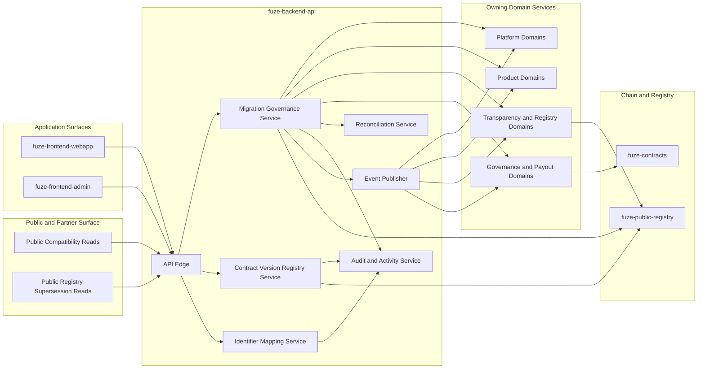
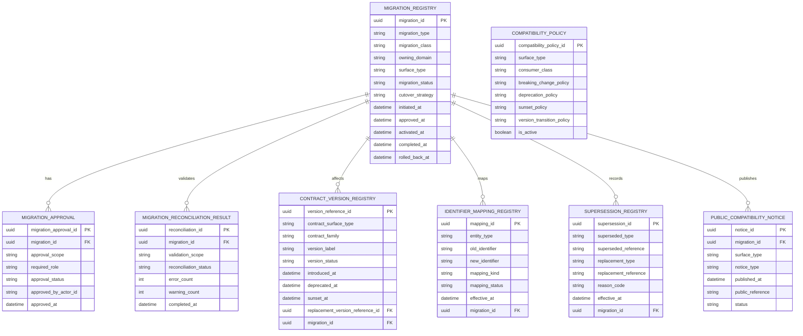
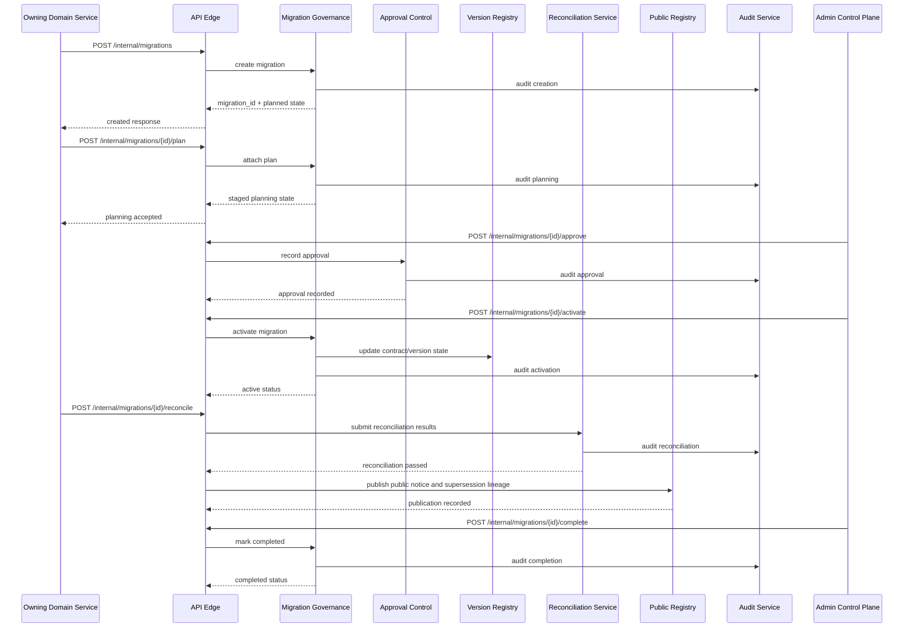

# MIGRATION_AND_BACKWARD_COMPATIBILITY_SPEC.md
Canonical API Specification for Migration and Backward Compatibility in FUZE

## 1. Title
**MIGRATION_AND_BACKWARD_COMPATIBILITY_SPEC.md**

---

## 2. Document Metadata
- Document Name: `MIGRATION_AND_BACKWARD_COMPATIBILITY_SPEC.md`
- Document Type: Canonical API specification
- Status: Draft for source-of-truth use
- API Classification: cross-cutting | public | internal | admin | derived-public | event-driven | chain-adjacent
- Owning Domain: Platform API Governance, Runtime Change Control, and Compatibility Architecture
- Primary Implementing Repo: `fuze-backend-api`
- Supporting Repos:
  - `fuze-frontend-webapp`
  - `fuze-frontend-admin`
  - `fuze-contracts`
  - `fuze-specs`
  - `fuze-public-registry`
  - future `fuze-sdk`
- Primary Systems of Record:
  - domain-owned canonical tables and service contracts in `fuze-backend-api`
  - migration registry, compatibility policy, and lineage tables in `fuze-backend-api`
  - contract and release metadata in `fuze-specs`
  - published public compatibility artifacts and supersession references in `fuze-public-registry`
  - explicit on-chain references in `fuze-contracts` and public registry artifacts where contract migration is involved
- Governing Registries:
  - `DOCS_SPEC.md`
  - `SYSTEM_SPEC_INDEX.md`
- Intended Folder: `fuze.ac > docs > api-spec`
- Machine-readable contract outputs derived later:
  - OpenAPI deprecation and compatibility conventions
  - shared migration and lineage schema components
  - AsyncAPI event versioning conventions
  - SDK migration guidance and client deprecation metadata

---

## 3. Purpose

This document defines the canonical API-level migration and backward compatibility model for the FUZE platform.

Its purpose is to establish how FUZE evolves APIs, events, webhooks, published trust artifacts, identifiers, workflow contracts, product interfaces, and chain-adjacent references without breaking canonical ownership, creating ambiguous truth, or silently damaging user, partner, holder, and operator trust.

FUZE is a platform-first ecosystem with shared identity, shared workspace and billing models, Platform Credits on Base, stablecoin payout execution on Base, Ethereum token participation, product-specific extension domains, public transparency surfaces, and governance-sensitive controls. In such a system, change management is not only an operational matter. It is an API and contract discipline. Interface migration, schema evolution, supersession, correction, deprecation, coexistence, and cutover all affect how consumers understand the platform and whether the platform remains trustworthy under change.

This file turns the broader FUZE migration and backward compatibility architecture into an implementation-ready API source-of-truth document.

---

## 4. Scope

This specification covers:

- canonical migration and backward compatibility rules for API-visible surfaces
- differentiation among migration, backward compatibility, correction, supersession, and deprecation
- contract evolution across public APIs, internal service APIs, admin and control-plane actions, events, webhooks, reports, registries, and payout-facing artifacts
- coexistence, dual-read, dual-write, shadow validation, and cutover patterns where API surfaces change over time
- migration-safe identifier mapping, lineage, and historical interpretability requirements
- compatibility commitments by surface sensitivity and stakeholder impact
- version-transition behavior for public consumers, internal services, and derived public artifacts
- audit, approval, reconciliation, rollback, and recovery requirements for material migrations
- implementation expectations for `fuze-backend-api`
- frontend consumption expectations for `fuze-frontend-webapp` and `fuze-frontend-admin`
- future derivation implications for OpenAPI, AsyncAPI, and `fuze-sdk`

This specification does **not** replace domain-specific rules such as credits issuance policy, payout execution authority, governance approval logic, or product-specific business lifecycles. Those remain owned by their canonical domains. This document defines the migration and compatibility rules those domains must apply when evolving interface contracts and externally or cross-domain consumed structures.

---

## 5. Source-of-Truth Inputs

### Primary FUZE docs and registries used
- `DOCS_SPEC.md`
- `SYSTEM_SPEC_INDEX.md`
- `FUZE_WHITEPAPER_v.2026.3.0.1.pdf`
- `FUZE_CHAIN_ARCHITECTURE.md`
- `FUZE_PLATFORM_CREDITS.md`
- `STABLECOIN_PROFIT_PARTICIPATION.md`
- `TOKEN_CONTRACT_ARCHITECTURE_.md`
- `ALLOCATION_WALLET_MAP.md`

### Primary FUZE system specifications used
- `SYSTEM_BOUNDARY_AND_OWNERSHIP_SPEC.md`
- `SYSTEM_OVERVIEW_AND_BOUNDARIES_SPEC.md`
- `PLATFORM_ARCHITECTURE_SPEC.md`
- `DOMAIN_OWNERSHIP_MATRIX_SPEC.md`
- `DATA_MODEL_AND_ENTITY_OWNERSHIP_SPEC.md`
- `ONCHAIN_OFFCHAIN_RESPONSIBILITY_SPEC.md`
- `API_ARCHITECTURE_SPEC.md`
- `PUBLIC_API_SPEC.md`
- `INTERNAL_SERVICE_API_SPEC.md`
- `EVENT_MODEL_AND_WEBHOOK_SPEC_refreshed.md`
- `IDEMPOTENCY_AND_VERSIONING_SPEC.md`
- `MIGRATION_AND_BACKWARD_COMPATIBILITY_SPEC.md`
- `ROLLOUT_STRATEGY_SPEC.md`
- `PRODUCT_ROLLOUT_DEPENDENCY_SPEC.md`
- `DEPLOYMENT_AND_RUNTIME_OPERATIONS_SPEC.md`
- `BUSINESS_CONTINUITY_AND_RECOVERY_SPEC.md`
- `AUDIT_LOG_AND_ACTIVITY_SPEC.md`
- `MONITORING_ALERTING_AND_INCIDENT_RESPONSE_SPEC.md`
- `SECURITY_AND_RISK_CONTROL_SPEC.md`
- `CREDIT_LEDGER_AND_SETTLEMENT_SPEC.md`
- `SUBSCRIPTIONS_AND_USAGE_BILLING_SPEC.md`
- `REFUND_REVERSAL_AND_ADJUSTMENT_SPEC.md`
- `PAYOUT_LEDGER_SPEC.md`
- `PUBLIC_CONTRACT_AND_WALLET_REGISTRY_SPEC.md`
- `TRANSPARENCY_REPORTING_SPEC.md`
- upstream conceptual source: `MIGRATION_AND_BACKWARD_COMPATIBILITY_SPEC.md`

### Highest-priority governing interpretation used here
1. system boundaries and ownership documents
2. platform architecture and domain ownership documents
3. on-chain/off-chain separation and core financial/platform-rail documents
4. shared API, event, idempotency, audit, runtime, and security documents
5. migration and compatibility documents
6. rollout and recovery documents

### Supporting standards and external references used only as guidance
- HTTP semantics for interface behavior
- HTTP Problem Details for structured error responses
- the `Deprecation` HTTP response header field
- the `Sunset` HTTP response header field
- general OpenAPI-oriented compatibility and deprecation discipline

Where a FUZE rule and an external standard differ, FUZE source-of-truth interpretation controls.

### Format guide status
- `The_API_Specification_guide.md` was named as a governing format guide in the generation prompt, but direct contents were not retrievable in the resolved source set for this run.
- `Database_Schemas_Guide.md` was named as a governing format guide in the generation prompt, but direct contents were not retrievable in the resolved source set for this run.

This file therefore applies the production-grade structure and schema discipline already established by approved FUZE API specifications and the resolved FUZE architecture sources.

---

## 6. Governing Architecture and Ownership Interpretation

### 6.1 Why this specification belongs to a cross-cutting platform domain

Migration and backward compatibility are not owned by a single product, single API family, or single runtime surface. They govern how all contract-bearing FUZE surfaces evolve. That includes public HTTP APIs, internal service APIs, events, webhooks, registry artifacts, transparency artifacts, payout-facing publications, and chain reference transitions.

The owning architectural center is therefore the platform API governance and change-control layer implemented in `fuze-backend-api`, with domain-specific application by each owning domain.

### 6.2 Why frontends do not own this behavior

`fuze-frontend-webapp` may display compatibility notices, migration banners, or resource-version metadata, but it does not define authoritative deprecation timing, cutover semantics, or migration lineage.

`fuze-frontend-admin` may allow operators to initiate approved migration workflows, approve cutovers, or inspect compatibility status, but it does not become the source of truth for migration state, compatibility policy, or supersession lineage.

All authoritative outcomes remain backend-owned.

### 6.3 Why contracts do not fully own this behavior

`fuze-contracts` may embody immutable contract semantics, superseding addresses, or chain-level migration constraints, but FUZE migration and backward compatibility are broader than smart-contract execution. They also cover off-chain business entities, cross-service interfaces, public reporting artifacts, event schemas, webhook payloads, and operational cutover controls.

### 6.4 Governing interpretation applied

This document applies the following architectural interpretation:

- one domain remains canonical for a given truth during migration
- coexistence is temporary and must not create hidden dual ownership
- migration is explicit, auditable, version-aware, and explainable
- compatibility obligations are strongest where external dependency and trust sensitivity are highest
- lineage must remain visible across migration, correction, and supersession
- public trust artifacts must preserve historical intelligibility even when live structures change

---

## 7. Domain Responsibilities

### 7.1 Platform API governance and runtime change control
Owns:
- cross-cutting migration policy for contract-bearing surfaces
- compatibility policy classification by surface type
- migration registry and cutover control framework
- deprecation and sunset metadata conventions
- migration approval gate orchestration
- compatibility observability and audit conventions

### 7.2 Domain owners
Each owning domain remains responsible for:
- migrating its own canonical entities and contracts
- defining migration semantics for its owned resources
- publishing lineage and mapping information
- executing correction or compensation where migration errors affect its truth
- maintaining compatibility documentation for its consumers

### 7.3 Reporting and public-registry domains
May:
- publish derived compatibility notices
- publish supersession relationships and public lineage
- expose historical publication references
Must not:
- become the owner of the migrated truth itself

### 7.4 Frontend surfaces
May:
- display migration status
- present deprecation warnings
- guide users through transition UX
Must not:
- redefine canonical migration state
- mutate compatibility policy directly
- infer migration completion from local heuristics

### 7.5 Contracts and chain-adjacent services
Own:
- contract deployment lineage
- canonical chain-side references
- chain-specific cutover metadata where needed
Must coordinate with:
- public registry
- payout and transparency domains
- governance and treasury control domains
when the migration affects public trust interpretation

---

## 8. Out of Scope

The following are out of scope for this document:

- exact table-by-table SQL migration scripts
- exact contract deployment transactions and network scripts
- exact product-specific UX copy for migration banners or notices
- exact SLA or retention period for every legacy version
- exact release calendar or date commitments for every migration
- domain-specific business approval rules outside the compatibility/change-control context
- low-level CI/CD pipeline implementation details beyond migration control implications

---

## 9. Canonical Entities and Data Ownership

### 9.1 Core durable entities

#### `migration_registry`
Authoritative backend record of material migrations.
Owned by: Platform API governance / runtime change control.
Durability: durable source-of-truth for migration coordination.
Key fields:
- `migration_id`
- `migration_type`
- `migration_class`
- `owning_domain`
- `surface_type`
- `migration_status`
- `change_scope`
- `cutover_strategy`
- `initiated_at`
- `approved_at`
- `activated_at`
- `completed_at`
- `rolled_back_at`
- `created_by_actor_id`
- `approved_by_actor_id`
- `notes`

#### `compatibility_policy`
Defines surface-specific compatibility commitments.
Owned by: Platform API governance.
Durability: durable policy truth.
Key fields:
- `compatibility_policy_id`
- `surface_type`
- `consumer_class`
- `breaking_change_policy`
- `deprecation_policy`
- `sunset_policy`
- `legacy_support_expectation`
- `historical_interpretability_requirement`
- `version_transition_policy`
- `is_active`

#### `contract_version_registry`
Tracks API, event, webhook, report, and registry versions.
Owned by: owning domain with platform-governed structure.
Durability: durable truth for version lineage.
Key fields:
- `version_reference_id`
- `contract_surface_type`
- `contract_family`
- `resource_family`
- `version_label`
- `version_status`
- `introduced_at`
- `deprecated_at`
- `sunset_at`
- `replacement_version_reference_id`
- `migration_id`

#### `supersession_registry`
Tracks explicit replacement relationships.
Owned by: owning domain, with platform-governed schema.
Durability: durable lineage truth.
Key fields:
- `supersession_id`
- `superseded_type`
- `superseded_reference`
- `replacement_type`
- `replacement_reference`
- `reason_code`
- `effective_at`
- `migration_id`
- `public_explanation_reference`

#### `identifier_mapping_registry`
Maps old identifiers to new identifiers where continuity is required.
Owned by: owning domain.
Durability: durable mapping truth.
Key fields:
- `mapping_id`
- `entity_type`
- `old_identifier`
- `new_identifier`
- `mapping_status`
- `mapping_kind`
- `migration_id`
- `effective_at`

#### `migration_approval`
Tracks operator and governance approvals required for material changes.
Owned by: runtime change control with references to governance-sensitive systems where applicable.
Durability: durable approval linkage.
Key fields:
- `migration_approval_id`
- `migration_id`
- `approval_scope`
- `required_role`
- `approval_status`
- `approved_by_actor_id`
- `approved_at`

#### `migration_reconciliation_result`
Tracks validation and semantic reconciliation after change.
Owned by: owning domain with platform visibility.
Durability: durable verification truth.
Key fields:
- `reconciliation_id`
- `migration_id`
- `validation_scope`
- `reconciliation_status`
- `summary_hash`
- `error_count`
- `warning_count`
- `completed_at`

#### `public_compatibility_notice`
Derived publication records for public-facing compatibility messaging.
Owned by: public registry / transparency publication services.
Durability: published artifact metadata, derived from canonical sources.
Key fields:
- `notice_id`
- `migration_id`
- `surface_type`
- `notice_type`
- `published_at`
- `public_reference`
- `status`

### 9.2 Ownership interpretation

- migration policy and status are platform-owned
- resource-specific lineage is owned by the resource-owning domain
- public notices are derived artifacts, not canonical migration truth
- contract-version records are authoritative for interface lineage
- identifier mappings are authoritative only when published by the owning domain

### 9.3 Derived versus durable fields

Durable:
- migration identifiers
- status transitions
- compatibility policy references
- version references
- supersession references
- approval linkage
- reconciliation outcomes

Derived or denormalized:
- public summary labels
- dashboard rollups
- deprecated-surface counts
- migration health summaries
- client-facing explanatory text caches

---

## 10. State Model and Lifecycle

### 10.1 Migration lifecycle states

`draft -> planned -> approved -> staged -> active -> validating -> completed`

Additional terminal or exceptional states:
- `cancelled`
- `rolled_back`
- `failed_requires_forward_fix`
- `superseded`

### 10.2 Version lifecycle states

`proposed -> current -> deprecated -> sunset_scheduled -> sunset_complete`

Additional state:
- `historical_readable_only`

### 10.3 Supersession lifecycle states

`declared -> published -> effective -> historical_lineage_only`

### 10.4 State transition rules

- no migration may move to `active` without explicit owner and approval linkage
- no version may move to `deprecated` without replacement or deprecation rationale
- no `sunset_complete` state should occur without published prior notice for public surfaces unless emergency risk controls require immediate withdrawal
- no migration should move to `completed` until reconciliation succeeds or risk is explicitly accepted through governed override
- a failed migration may move to `rolled_back` only if rollback is semantically safe for the owning domain
- otherwise it moves to `failed_requires_forward_fix` with preserved lineage

---

## 11. API Surface Overview

FUZE migration and backward compatibility expose several interface families.

### 11.1 Internal migration governance APIs
Used by domain services, release controls, and runtime operators to:
- register migrations
- stage cutovers
- publish compatibility metadata
- record approval and reconciliation outcomes

### 11.2 Admin migration control APIs
Restricted control-plane interfaces used by privileged operators to:
- review migration readiness
- trigger staged activation
- publish or confirm deprecation windows
- initiate rollback or forward-fix workflows where allowed

### 11.3 Public compatibility and deprecation reads
Externally readable surfaces for:
- deprecation notices
- version transition guidance
- public registry supersession lineage
- transparency artifact correction or supersession notices
- public product contract version metadata where intentionally exposed

### 11.4 Event-driven migration interfaces
Events emitted when:
- migration is approved
- cutover occurs
- version becomes deprecated
- sunset is scheduled
- reconciliation fails
- public notice is published

### 11.5 Chain-adjacent compatibility surfaces
Used for:
- contract supersession lineage
- old-to-new address traceability
- public registry reference migration
- payout and treasury reference transitions

---

## 12. Authentication and Authorization Model

### 12.1 Public reads
Allowed only for explicitly published compatibility surfaces such as:
- public registry supersession lineage
- public deprecation notices
- public artifact correction references
- public payout/report format supersession notices

No public write access exists for migration control.

### 12.2 Authenticated application reads
Authenticated end users may read migration-related metadata for surfaces that affect:
- their own account
- their workspaces
- their product resources
- their entitlement interpretation
- their asynchronous operations
- their published user-visible artifacts

### 12.3 Internal service access
Internal services authenticate through platform service identity and may:
- read compatibility state
- read version registries
- resolve identifier mappings
- record migration execution status for owned domains
They may not mutate foreign-domain truth through migration convenience routes.

### 12.4 Admin control-plane access
Only privileged operators with explicit scopes may:
- create material migration records
- approve or reject cutover readiness
- schedule deprecation and sunset metadata
- trigger cutover transitions
- invoke rollback or forward-fix workflows where permitted

### 12.5 Governance-sensitive access
Where migration touches:
- treasury controls
- payout publication
- governance structures
- contract registry meaning
- foundation or vault references

additional approval or dual-control expectations apply before activation.

---

## 13. API Endpoints / Interface Contracts

### 13.1 Internal migration registration

#### `POST /internal/migrations`
- Purpose: create a migration record for a material change
- Caller type: internal service or controlled admin backend
- Auth expectation: internal service identity or admin service token
- Request body summary:
  - `migration_type`
  - `migration_class`
  - `owning_domain`
  - `surface_type`
  - `change_scope`
  - `cutover_strategy`
  - `target_contract_families[]`
  - `target_entity_families[]`
- Response summary:
  - created `migration_id`
  - initial status `draft` or `planned`
- Side effects:
  - creates durable migration record
- Idempotency behavior:
  - required for create requests via business action key
- Audit requirements:
  - create actor, request source, correlation ID
- Emitted events:
  - `platform.migration.created`

#### `POST /internal/migrations/{migration_id}/plan`
- Purpose: attach detailed migration plan and readiness metadata
- Caller type: owning domain service or admin backend
- Side effects:
  - updates migration planning data
- Emitted events:
  - `platform.migration.planned`

### 13.2 Approval and readiness

#### `POST /internal/migrations/{migration_id}/approve`
- Purpose: record approval for a migration that passed readiness gates
- Caller type: admin backend or governed workflow
- Auth expectation: privileged internal scope
- Response summary:
  - approval status and required remaining approvals
- Side effects:
  - creates migration approval record
- Emitted events:
  - `platform.migration.approval_recorded`

#### `GET /internal/migrations/{migration_id}/readiness`
- Purpose: return readiness status including unmet gates
- Caller type: internal service, admin backend
- Response summary:
  - readiness result
  - unmet gates
  - risk flags
  - dependency references

### 13.3 Cutover and activation

#### `POST /internal/migrations/{migration_id}/stage`
- Purpose: mark migration as staged and ready for activation
- Caller type: admin backend or release control workflow
- Side effects:
  - state transition to `staged`
- Emitted events:
  - `platform.migration.staged`

#### `POST /internal/migrations/{migration_id}/activate`
- Purpose: execute or confirm cutover activation
- Caller type: admin backend or release control service
- Auth expectation: privileged internal scope with approval linkage
- Request body summary:
  - `activation_mode`
  - `cutover_reference`
  - `effective_at`
  - `operator_confirmation`
- Response summary:
  - migration status
  - activated contract version references
- Side effects:
  - state transition to `active`
  - may publish deprecation/sunset metadata to registries
- Idempotency behavior:
  - mandatory, because activation is correctness-sensitive
- Audit requirements:
  - full actor and approval correlation
- Emitted events:
  - `platform.migration.activated`

### 13.4 Reconciliation and completion

#### `POST /internal/migrations/{migration_id}/reconcile`
- Purpose: submit reconciliation results for the migration
- Caller type: owning domain service or validation job
- Response summary:
  - reconciliation status
  - error and warning counts
- Side effects:
  - creates reconciliation record
- Emitted events:
  - `platform.migration.reconciliation_recorded`

#### `POST /internal/migrations/{migration_id}/complete`
- Purpose: mark migration complete after validation
- Caller type: admin backend or owning domain service under policy
- Preconditions:
  - approved
  - active
  - reconciliation passed or governed override present
- Emitted events:
  - `platform.migration.completed`

### 13.5 Rollback and forward-fix

#### `POST /internal/migrations/{migration_id}/rollback`
- Purpose: initiate or record rollback where semantically safe
- Caller type: restricted admin backend
- Auth expectation: emergency-capable privileged role
- Request body summary:
  - `reason_code`
  - `rollback_reference`
  - `risk_acknowledgement`
- Response summary:
  - new migration status
- Side effects:
  - status transition to `rolled_back`
  - compatibility notices may be republished
- Emitted events:
  - `platform.migration.rolled_back`

#### `POST /internal/migrations/{migration_id}/forward-fix`
- Purpose: declare or execute controlled forward-fix pathway when rollback is unsafe
- Caller type: restricted admin backend or governed workflow
- Emitted events:
  - `platform.migration.forward_fix_declared`

### 13.6 Versioning and compatibility metadata

#### `POST /internal/contract-versions`
- Purpose: create a version registry entry for a contract family
- Caller type: internal service or controlled spec/release pipeline
- Side effects:
  - creates version reference record

#### `POST /internal/contract-versions/{version_reference_id}/deprecate`
- Purpose: mark a contract version deprecated
- Request body summary:
  - `deprecated_at`
  - `replacement_version_reference_id`
  - `deprecation_notice_reference`
  - `sunset_at` where applicable
- Emitted events:
  - `platform.contract_version.deprecated`

#### `POST /internal/contract-versions/{version_reference_id}/sunset`
- Purpose: mark a contract version sunset complete
- Preconditions:
  - prior deprecation exists
  - required notice window satisfied unless emergency override exists
- Emitted events:
  - `platform.contract_version.sunset_complete`

### 13.7 Identifier mapping and supersession

#### `POST /internal/identifier-mappings`
- Purpose: register mapping between legacy and current identifiers
- Caller type: owning domain service
- Side effects:
  - creates durable mapping record

#### `POST /internal/supersessions`
- Purpose: record controlled supersession for resource, artifact, contract, or registry entry
- Caller type: owning domain service or admin backend
- Emitted events:
  - `platform.supersession.recorded`

### 13.8 Public compatibility reads

#### `GET /public/compatibility/notices`
- Purpose: list published compatibility and deprecation notices intentionally visible to external consumers
- Caller type: public client
- Response summary:
  - published notices only
  - no internal approval or risk data

#### `GET /public/compatibility/contracts/{contract_family}`
- Purpose: read current public version metadata and deprecation lineage for an exposed contract family
- Caller type: public client or partner integrator
- Response summary:
  - current version
  - deprecated versions
  - replacement references
  - sunset dates where published

#### `GET /public/registry/supersessions/{reference}`
- Purpose: expose public supersession lineage for contract or wallet registry entries
- Caller type: public client
- Response summary:
  - previous reference
  - current reference
  - effective date
  - public explanation link

### 13.9 Admin control-plane reads

#### `GET /admin/migrations`
- Purpose: list migration records with filterable state and risk metadata
- Caller type: admin dashboard
- Auth expectation: privileged operator session

#### `GET /admin/migrations/{migration_id}`
- Purpose: inspect complete migration state including readiness, approvals, and reconciliation
- Caller type: admin dashboard

---

## 14. Request Rules

- mutation requests affecting migration status, deprecation, sunset, or cutover must use explicit idempotency semantics
- request bodies must identify owning domain and affected surface type
- migration activation and rollback requests must include operator or workflow confirmation context
- public-read endpoints must expose only published compatibility artifacts
- identifier mappings must be submitted only by the domain that owns the identifier family
- contract-version mutation requests must include replacement references when deprecation is material
- emergency overrides must include explicit risk acknowledgement and operator identity
- hidden direct write requests to foreign-domain migration state are forbidden

---

## 15. Response Rules

- responses must clearly classify returned records as:
  - canonical migration truth
  - canonical version truth
  - identifier lineage
  - derived public notice
- public compatibility responses must remain historically interpretable and must not silently omit relevant supersession when a public reference has changed
- mutation responses must include:
  - `migration_id` or `version_reference_id`
  - resulting status
  - relevant timestamps
  - replacement or lineage references where applicable
- status responses for long-running migration steps should return accepted or in-progress metadata rather than pretending immediate completion
- admin and internal responses may include readiness and risk detail not visible on public surfaces

---

## 16. Error Model

FUZE migration and compatibility interfaces should use a structured error model consistent with broader API architecture.

Canonical error families include:
- `migration_not_found`
- `migration_state_conflict`
- `migration_not_ready`
- `approval_missing`
- `approval_scope_insufficient`
- `rollback_not_semantically_safe`
- `forward_fix_required`
- `version_reference_not_found`
- `replacement_reference_missing`
- `legacy_mapping_conflict`
- `public_notice_not_published`
- `surface_not_public`
- `idempotency_conflict`
- `authorization_denied`
- `governance_approval_required`
- `reconciliation_failed`
- `sunset_window_not_satisfied`

Error responses must preserve:
- stable machine-readable code
- human-readable message
- correlation ID
- lineage reference where relevant
- retryability classification where relevant

---

## 17. Idempotency and Mutation Safety

- create, approve, stage, activate, rollback, and forward-fix endpoints are mutation-sensitive and require idempotent business semantics
- replay of the same activation request must not trigger double cutover
- replay of the same deprecation scheduling request must return stable version state
- conflicting reuse of a migration idempotency identity for materially different inputs must return conflict rather than applying an ambiguous action
- identifier mapping creation must be unique for a given `entity_type + old_identifier + migration_id`
- public read surfaces do not require idempotency but must remain version-aware
- rollback attempts after a forward-fix-only classification must be rejected unless override policy explicitly allows them

---

## 18. Versioning and Compatibility Rules

- public APIs and public webhooks receive the strongest compatibility commitment
- internal service APIs receive coordinated compatibility commitment, not silent breaking change
- reports, ledgers, and public registries require historical readability even when formats evolve
- a deprecation announcement does not by itself change resource behavior
- a sunset announcement indicates an intended future unresponsive or unsupported state for a resource or version
- compatibility policy must distinguish:
  - deprecation
  - sunset
  - correction
  - supersession
  - replacement
- additive change is preferred where feasible
- breaking changes require explicit version transition and migration guidance
- historical artifacts must preserve lineage instead of disappearing silently
- old and new representations may coexist temporarily, but only one may remain canonical for writes

---

## 19. Event Emission and Webhook Behavior

### 19.1 Internal events
The following internal events should exist where relevant:
- `platform.migration.created`
- `platform.migration.planned`
- `platform.migration.approval_recorded`
- `platform.migration.staged`
- `platform.migration.activated`
- `platform.migration.reconciliation_recorded`
- `platform.migration.completed`
- `platform.migration.rolled_back`
- `platform.migration.forward_fix_declared`
- `platform.contract_version.deprecated`
- `platform.contract_version.sunset_complete`
- `platform.supersession.recorded`

### 19.2 Webhook behavior
Public webhooks for compatibility changes should exist only where FUZE intentionally supports partner notification of:
- deprecation of public contract families
- upcoming sunset of public resources or versions
- public registry supersession for known references

Webhook payloads must:
- carry explicit version metadata
- carry lineage references
- not require consumers to infer replacement relationships
- avoid silent schema breakage during migration

### 19.3 Replay and recovery
Repeated event delivery must be safe under the broader idempotency model.
Compatibility events and webhooks must be replayable without duplicating migration meaning.

---

## 20. Audit and Activity Requirements

Every material migration action must preserve:
- actor reference
- service or operator source
- owning domain
- affected surface type
- migration ID
- previous status
- resulting status
- approval linkage
- correlation ID
- idempotency key where applicable
- replacement or supersession reference where applicable
- public notice reference where applicable

Audit records are mandatory for:
- migration creation
- approval recording
- cutover activation
- deprecation publishing
- sunset scheduling
- rollback
- forward-fix declaration
- public registry supersession
- compatibility override

---

## 21. Data Model and Database Schema View

### 21.1 Core tables

#### `migration_registry`
Primary key:
- `migration_id` UUID

Indexes:
- `(owning_domain, migration_status)`
- `(surface_type, migration_status)`
- `(activated_at)`
- `(migration_class, initiated_at)`

Important columns:
- `migration_id`
- `migration_type`
- `migration_class`
- `owning_domain`
- `surface_type`
- `change_scope_json`
- `migration_status`
- `cutover_strategy`
- `risk_level`
- `created_by_actor_id`
- `approved_by_actor_id`
- `initiated_at`
- `approved_at`
- `activated_at`
- `completed_at`
- `rolled_back_at`
- `superseded_by_migration_id`
- `notes`

Audit columns:
- `created_at`
- `updated_at`
- `created_by`
- `updated_by`

#### `compatibility_policy`
Primary key:
- `compatibility_policy_id` UUID

Unique constraints:
- `(surface_type, consumer_class, is_active=true)` logical uniqueness

Important columns:
- `compatibility_policy_id`
- `surface_type`
- `consumer_class`
- `breaking_change_policy`
- `deprecation_policy`
- `sunset_policy`
- `historical_interpretability_requirement`
- `legacy_support_expectation`
- `version_transition_policy`
- `is_active`

#### `contract_version_registry`
Primary key:
- `version_reference_id` UUID

Unique constraints:
- `(contract_surface_type, contract_family, version_label)`

Foreign keys:
- `migration_id -> migration_registry.migration_id`
- `replacement_version_reference_id -> contract_version_registry.version_reference_id`

Important columns:
- `version_reference_id`
- `contract_surface_type`
- `contract_family`
- `resource_family`
- `version_label`
- `version_status`
- `introduced_at`
- `deprecated_at`
- `sunset_at`
- `replacement_version_reference_id`
- `migration_id`

#### `supersession_registry`
Primary key:
- `supersession_id` UUID

Foreign keys:
- `migration_id -> migration_registry.migration_id`

Indexes:
- `(superseded_type, superseded_reference)`
- `(replacement_type, replacement_reference)`

Important columns:
- `supersession_id`
- `superseded_type`
- `superseded_reference`
- `replacement_type`
- `replacement_reference`
- `reason_code`
- `effective_at`
- `public_explanation_reference`
- `migration_id`

#### `identifier_mapping_registry`
Primary key:
- `mapping_id` UUID

Unique constraints:
- `(entity_type, old_identifier, migration_id)`
- optionally `(entity_type, new_identifier, migration_id)` where one-to-one migration is expected

Important columns:
- `mapping_id`
- `entity_type`
- `old_identifier`
- `new_identifier`
- `mapping_kind`
- `mapping_status`
- `effective_at`
- `migration_id`

#### `migration_approval`
Primary key:
- `migration_approval_id` UUID

Foreign keys:
- `migration_id -> migration_registry.migration_id`

Important columns:
- `migration_approval_id`
- `migration_id`
- `approval_scope`
- `required_role`
- `approval_status`
- `approved_by_actor_id`
- `approved_at`
- `approval_reference`

#### `migration_reconciliation_result`
Primary key:
- `reconciliation_id` UUID

Foreign keys:
- `migration_id -> migration_registry.migration_id`

Important columns:
- `reconciliation_id`
- `migration_id`
- `validation_scope`
- `reconciliation_status`
- `summary_hash`
- `error_count`
- `warning_count`
- `completed_at`
- `details_reference`

#### `public_compatibility_notice`
Primary key:
- `notice_id` UUID

Foreign keys:
- `migration_id -> migration_registry.migration_id`

Important columns:
- `notice_id`
- `migration_id`
- `surface_type`
- `notice_type`
- `published_at`
- `public_reference`
- `status`

### 21.2 Normalization and derived data

- migration status is canonical in `migration_registry`
- public notices are derived from canonical migration and version state
- read models used by dashboards must not become migration truth
- report or registry supersession artifacts may be rebuilt from canonical lineage tables where practical

### 21.3 Reconciliation and audit columns
Every core table should include:
- `created_at`
- `updated_at`
- `created_by`
- `updated_by`
- `correlation_id` where mutation trace is needed
- `audit_lineage_reference` where cross-domain traceability is needed

---

## 22. Architecture Diagram — Mermaid flowchart

---

## 23. Data Design — Mermaid Diagram

---

## 24. Flow View

### 24.1 Happy path
1. Owning domain or release control registers a migration.
2. Migration plan is attached with affected surfaces, versions, mappings, and cutover strategy.
3. Required approvals are recorded.
4. Migration moves to staged state.
5. Activation occurs through idempotent cutover request.
6. Owning domains execute controlled transition.
7. Reconciliation validates semantic integrity.
8. Public notices and supersession references are published where relevant.
9. Migration is marked completed.

### 24.2 Alternate path
1. Migration requires temporary coexistence.
2. Platform enters dual-read or shadow-validation phase.
3. New version is registered as current while old version remains deprecated but active.
4. Public or internal consumers receive explicit compatibility metadata.
5. Final cutover occurs once dependent consumers are ready.

### 24.3 Failure and recovery flow
1. Activation begins.
2. Reconciliation detects mismatch, ambiguity, or unacceptable divergence.
3. If rollback is semantically safe, rollback is triggered and recorded.
4. If rollback is unsafe, migration moves to `failed_requires_forward_fix`.
5. Forward-fix workflow is declared and executed with preserved lineage.
6. Public trust artifacts are not republished until correctness is revalidated.

### 24.4 Retry behavior
- migration create, approve, stage, activate, rollback, and complete operations are idempotent at business meaning level
- duplicate activation requests return stable existing state
- duplicate deprecation scheduling returns stable version metadata
- duplicate public notice publication should not produce ambiguous duplicate notices for the same notice type and migration

### 24.5 Admin override flow
- only privileged operators may apply emergency overrides
- override requires explicit risk acknowledgement
- override is always audited
- override does not erase lineage, approval gaps, or failed validation evidence

---

## 25. Data Flows — Mermaid sequenceDiagram

---

## 26. Security and Risk Controls

- migration and compatibility mutation routes are privileged and must not be exposed publicly
- deprecation and sunset metadata for public surfaces must be published intentionally and consistently
- internal migration routes must require service or operator identity with explicit scopes
- emergency override and rollback routes require tighter controls than routine planning routes
- contract and registry supersession affecting trust-sensitive meaning require dual-control or governed approval posture where relevant
- public compatibility notices must never expose internal-only risk analysis, secret operational context, or restricted approval detail
- migration APIs must preserve separation among FUZE token, Platform Credits, stablecoin payout execution, treasury policy, and governance records
- direct raw table mutation outside owning domains is forbidden even during migration urgency
- reconciliation failures in economic or payout-sensitive domains must trigger containment rather than silent continuation

---

## 27. Operational Considerations

- migration readiness should be observable through dashboards and structured status APIs
- cutover operations should support staged rollout and accepted-state patterns where work is long-running
- migration lineage should remain queryable for support and audit teams
- temporary coexistence must have explicit end conditions
- public compatibility messaging should remain synchronized with actual runtime and contract state
- reporting and registry publication pipelines must consume canonical supersession records rather than inferring change
- deployment sequencing should align with rollout dependencies and recovery posture
- failed migrations should preserve actionable reconciliation outputs and not leave operator teams guessing which representation is current

---

## 28. Acceptance Criteria

1. The specification defines migration and backward compatibility as a cross-cutting platform concern owned in `fuze-backend-api`.
2. The specification preserves canonical domain ownership during migration and explicitly forbids migration convenience writes into foreign truth.
3. The specification differentiates migration, compatibility, correction, supersession, deprecation, and sunset.
4. The specification defines concrete canonical entities for migration tracking, version lineage, identifier mapping, approvals, reconciliation, and public notices.
5. The specification defines state transitions for migration and version lifecycles.
6. The specification includes internal, admin, and public-read migration-related API families with clear boundary rules.
7. The specification defines idempotent activation, rollback, and completion semantics.
8. The specification preserves stronger compatibility commitments for public APIs, public webhooks, public registries, and trust-sensitive public artifacts.
9. The specification preserves historical interpretability of public artifacts and superseded references.
10. The specification includes a database-oriented schema view with keys, foreign keys, indexes, and audit columns.
11. The specification includes render-safe Mermaid architecture, data, and flow diagrams aligned with the prose design.
12. The specification aligns with `API_ARCHITECTURE_SPEC.md`, `PUBLIC_API_SPEC.md`, `INTERNAL_SERVICE_API_SPEC.md`, and `IDEMPOTENCY_AND_VERSIONING_SPEC.md`.
13. The specification is usable as a governing source-of-truth file for downstream migration-aware OpenAPI, AsyncAPI, and SDK derivation work.

---

## 29. Test Cases

### 29.1 Positive cases

1. **Migration registration succeeds**
   - Given a domain owner submits a valid migration registration request
   - When the request includes owning domain, surface type, and cutover strategy
   - Then a `migration_id` is created
   - And the migration enters `draft` or `planned` state

2. **Public contract deprecation is recorded with replacement**
   - Given a public API family has a replacement version
   - When the owning domain deprecates the older version
   - Then the version registry records deprecation, replacement, and optional sunset metadata
   - And public compatibility reads expose that lineage

3. **Controlled cutover completes with reconciliation**
   - Given approvals and readiness gates are satisfied
   - When the migration is activated and reconciliation passes
   - Then the migration can move to `completed`
   - And public notices may be published where relevant

### 29.2 Negative cases

4. **Foreign domain attempts migration write**
   - Given a non-owning domain attempts to mutate another domain’s migration-sensitive truth through convenience route
   - Then the request is rejected
   - And the design is considered non-compliant

5. **Deprecated public surface disappears without lineage**
   - Given a public contract family is removed without deprecation or supersession metadata
   - Then the design fails compatibility review

6. **Dual-write becomes indefinite ambiguous ownership**
   - Given a migration uses temporary dual-write
   - When no canonical write owner remains explicit
   - Then the migration fails review because it creates hidden multi-owner truth

### 29.3 Authorization cases

7. **Admin approval required for activation**
   - Given a migration is planned but not approved
   - When activation is requested
   - Then the API returns `approval_missing` or equivalent
   - And activation does not proceed

8. **Public client denied internal migration route**
   - Given an unauthenticated or partner client calls `/internal/migrations`
   - Then the request is denied or route is unreachable by design

### 29.4 Idempotency cases

9. **Duplicate activation returns stable state**
   - Given the same activation request is retried with the same idempotency identity
   - Then the API returns the same migration result without duplicate cutover

10. **Conflicting activation retry is rejected**
   - Given the same idempotency identity is reused for materially different activation payload
   - Then the API returns conflict and does not apply ambiguous activation

### 29.5 Reconciliation and lineage cases

11. **Failed reconciliation blocks completion**
   - Given reconciliation detects semantic mismatch
   - When completion is requested
   - Then the request is rejected unless governed override exists

12. **Superseded public registry reference remains traceable**
   - Given a contract or wallet reference is superseded
   - When a public client queries the older reference lineage
   - Then the API returns replacement mapping and effective date

### 29.6 Event and webhook cases

13. **Deprecation event emitted once**
   - Given a contract version is deprecated
   - When the mutation succeeds
   - Then `platform.contract_version.deprecated` is emitted once in business meaning

14. **Public compatibility webhook payload preserves version metadata**
   - Given a partner-compatible deprecation webhook exists
   - When it is delivered
   - Then the payload includes contract family, version, replacement, and timing metadata

---

## 30. Open Questions or Explicit Deferred Decisions

- exact public notice window duration by public API family
- exact retention policy for legacy version metadata
- exact dual-control thresholds for governance-, treasury-, and payout-sensitive migrations
- exact identifier mapping retention rules by entity family
- exact structure of public compatibility notice documents
- exact SDK-level deprecation annotation format derived from approved contracts
- exact compatibility policy matrix by product API family

These items do not weaken the canonical migration and backward compatibility architecture defined here.

---

## 31. Implementation Notes for `fuze-backend-api`

- implement migration governance as a dedicated internal service or strongly bounded module, not as scattered ad hoc logic
- keep migration registry, version registry, mapping registry, and reconciliation records in durable backend storage
- use asynchronous execution for long-running cutovers, validation, and publication workflows
- never let dashboard-only read models become authoritative for migration state
- expose public compatibility reads only from published artifacts or canonical registries intentionally marked for public use
- centralize audit, correlation, and idempotency support across migration-sensitive mutation routes
- integrate approval gates with existing role, governance, and control-plane policies
- preserve explicit contract family names and version references so downstream OpenAPI and AsyncAPI derivation remains stable

---

## 32. Frontend Consumption Notes

### `fuze-frontend-webapp`
- consumes only published migration- or compatibility-relevant metadata intended for end users
- may display warnings for deprecated resources, changed entitlements, or superseded public references
- must not infer migration completion from UI state alone
- must not expose internal-only migration risk, approval, or rollback controls

### `fuze-frontend-admin`
- may inspect migration details, readiness status, approvals, reconciliation, and public notice state
- may initiate privileged actions only through explicit backend APIs
- must present migration status, lineage, and risk clearly to operators
- must not become a side channel for undocumented direct database mutation or contract replacement

---

## 33. Contract Derivation Notes for OpenAPI / AsyncAPI / future `fuze-sdk`

### OpenAPI derivation
Derived machine-readable contracts should include:
- migration route families
- deprecation and sunset metadata conventions
- structured error families for migration states
- shared schema components for migration records, version records, supersession, and reconciliation results

### AsyncAPI derivation
Derived event contracts should include:
- migration lifecycle events
- contract version deprecation events
- supersession publication events
- replay-safe event identity and lineage metadata

### Future `fuze-sdk`
A future SDK should derive migration-related compatibility helpers from approved contracts only.
The SDK may surface:
- deprecation metadata
- replacement-version hints
- compatibility notice reads
- retry guidance for idempotent migration-aware calls

The SDK must not become the source of truth for migration policy, compatibility commitment, or lineage semantics.
