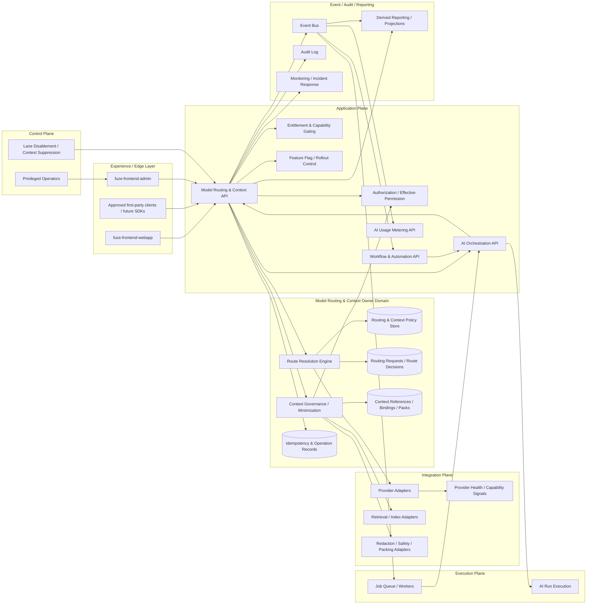
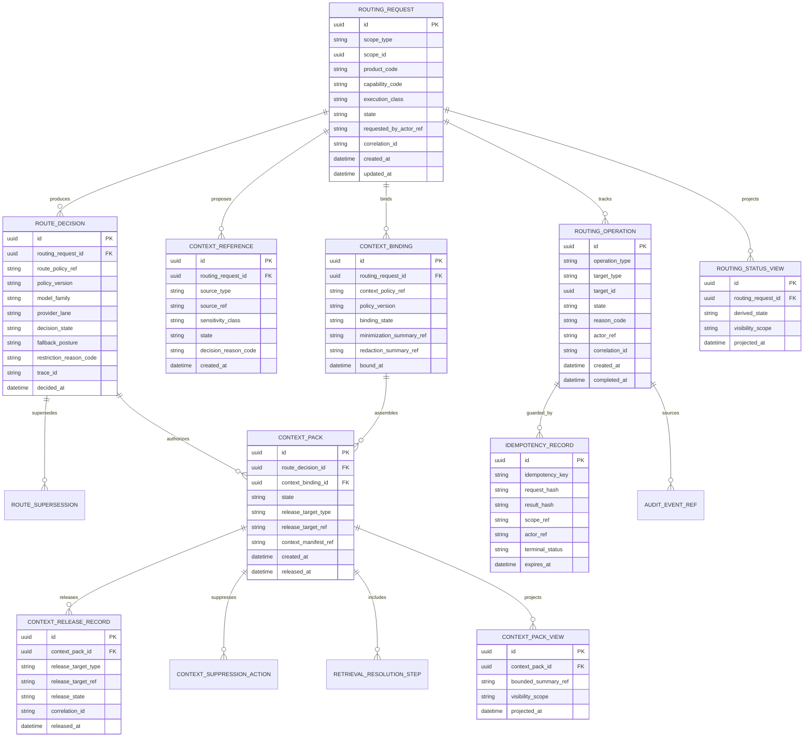
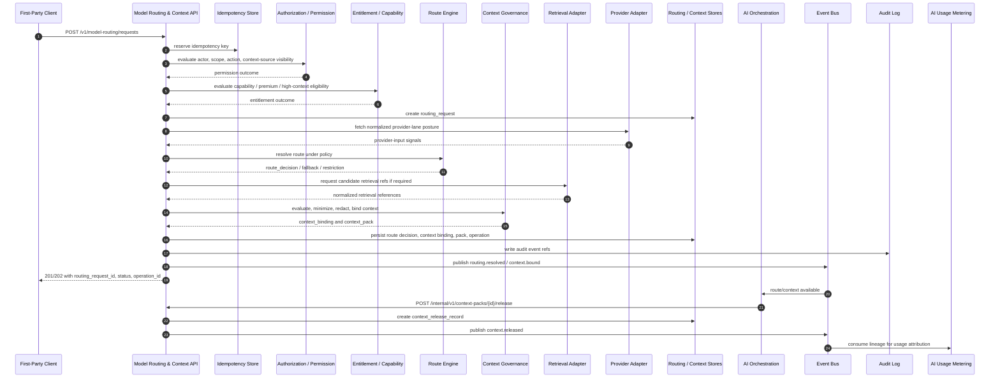

# FUZE Model Routing and Context API Specification

## Document Metadata

- **Document Name:** `MODEL_ROUTING_AND_CONTEXT_API_SPEC.md`
- **Document Type:** Production-grade API SPEC v2
- **Status:** Draft canonical API specification
- **Version:** 2.0.0
- **Effective Date:** 2026-04-24
- **Last Updated:** 2026-04-24
- **Reviewed On:** 2026-04-24
- **Document Owner:** FUZE AI Platform Architecture / Model Routing and Context Domain. A named individual owner is not explicitly specified in the retrieved governing materials.
- **Approval Authority:** FUZE Platform Architecture and Governance Authority, subject to the active FUZE approval workflow. A more specific approval authority is not explicitly specified in the retrieved governing materials.
- **Review Cadence:** Quarterly, and whenever provider portfolio, model-family policy, context-governance posture, authorization policy, entitlement posture, orchestration lifecycle semantics, workflow coupling, usage metering policy, event contracts, control-plane restrictions, audit requirements, public exposure, or migration/versioning posture materially changes.
- **Governing Layer:** API contract layer for shared platform AI / model routing and context governance.
- **Parent Registry:** `API_SPEC_INDEX.md` and FUZE API SPEC v2 Canonical File Registry.
- **Upstream Semantic Registry:** `REFINED_SYSTEM_SPEC_INDEX.md`
- **Upstream API Registry:** `API_SPEC_INDEX.md`
- **Primary Audience:** Platform architecture, backend engineering, AI engineering, product engineering, API and contract authors, orchestration engineers, workflow/runtime engineers, usage metering engineers, security, audit, operations, support/control-plane operators, OpenAPI / AsyncAPI / SDK authors, and implementation-contract authors.
- **Primary Purpose:** Define the API contract expression of the FUZE model-routing and context-governance semantics: how callers request routing/context resolution, how routing decisions and context bindings are represented, how context is admitted and released, how fallback/degraded behavior is exposed, how internal services consume route/context truth, and how admin/control-plane, event, audit, idempotency, and migration rules preserve ownership boundaries.
- **Primary Upstream References:**
  - `REFINED_SYSTEM_SPEC_INDEX.md`
  - `DOCS_SPEC_INDEX.md`
  - `SYSTEM_SPEC_INDEX.md`
  - `API_SPEC_INDEX.md`
  - `SYSTEM_BOUNDARY_AND_OWNERSHIP_SPEC.md`
  - `SYSTEM_OVERVIEW_AND_BOUNDARIES_SPEC.md`
  - `PLATFORM_ARCHITECTURE_SPEC.md`
  - `DOMAIN_OWNERSHIP_MATRIX_SPEC.md`
  - `DATA_MODEL_AND_ENTITY_OWNERSHIP_SPEC.md`
  - `PRODUCT_BOUNDARY_AND_DOMAIN_OWNERSHIP_SPEC.md`
  - `PRODUCT_ADMISSION_AND_EXPANSION_GATE_SPEC.md`
  - `AUTH_SESSION_AND_LINKED_LOGIN_SPEC.md`
  - `FUZE_ACCOUNT_ACCESS_AND_SESSION_THESIS_FINAL_SPEC.md`
  - `FUZE_ACCOUNT_ACCESS_AND_SESSION_CANONICAL_FINAL_SPEC.md`
  - `FUZE_WORKSPACE_ACCESS_CONTROL_BASICS_THESIS_FINAL_SPEC.md`
  - `ROLE_PERMISSION_AND_ACCESS_CONTROL_SPEC.md`
  - `SCOPED_AUTHORIZATION_MODEL_SPEC.md`
  - `ACCESS_EVALUATION_AND_EFFECTIVE_PERMISSION_SPEC.md`
  - `ENTITLEMENT_AND_CAPABILITY_GATING_SPEC.md`
  - `AI_ORCHESTRATION_SPEC.md`
  - `MODEL_ROUTING_AND_CONTEXT_SPEC.md`
  - `AI_USAGE_METERING_SPEC.md`
  - `WORKFLOW_AND_AUTOMATION_SPEC.md`
  - `JOB_QUEUE_AND_WORKER_SPEC.md`
  - `FEATURE_FLAG_AND_ROLLOUT_CONTROL_SPEC.md`
  - `API_ARCHITECTURE_SPEC.md`
  - `PUBLIC_API_SPEC.md`
  - `INTERNAL_SERVICE_API_SPEC.md`
  - `EVENT_MODEL_AND_WEBHOOK_SPEC.md`
  - `IDEMPOTENCY_AND_VERSIONING_SPEC.md`
  - `MIGRATION_AND_BACKWARD_COMPATIBILITY_SPEC.md`
  - `AUDIT_LOG_AND_ACTIVITY_SPEC.md`
  - `SECURITY_AND_RISK_CONTROL_SPEC.md`
  - `MONITORING_ALERTING_AND_INCIDENT_RESPONSE_SPEC.md`
  - `SECRETS_CONFIG_AND_ENVIRONMENT_SPEC.md`
- **Primary Downstream Dependents:**
  - `AI_USAGE_METERING_API_SPEC.md`
  - `WORKFLOW_AND_AUTOMATION_API_SPEC.md`
  - `JOB_QUEUE_AND_WORKER_API_SPEC.md`
  - `FEATURE_FLAG_AND_ROLLOUT_CONTROL_API_SPEC.md`
  - `API_ARCHITECTURE_SPEC.md`
  - `PUBLIC_API_SPEC.md`
  - `INTERNAL_SERVICE_API_SPEC.md`
  - `EVENT_MODEL_AND_WEBHOOK_SPEC.md`
  - product-specific AI API contracts
  - future prompt-contract, tool-registry, retrieval, evaluation, safety-policy, and model-provider adapter implementation contracts
  - OpenAPI, AsyncAPI, SDK, and internal client contract derivation layers
- **API Surface Families Covered:** First-party application APIs, internal service APIs, admin/control-plane APIs, event/async interfaces, reporting/projection APIs, implementation-facing contract surfaces.
- **API Surface Families Excluded:** Unapproved general public third-party routing APIs, raw provider SDK APIs, raw model-provider callbacks, raw retrieval/index engine APIs, database schemas as public contracts, provider procurement APIs, user-interface presentation logic, and product-local prompt library internals.
- **Canonical System Owner(s):** Model Routing and Context Domain owns semantic routing/context truth; Audit owns immutable audit records; Authorization and Effective Permission own final access outcomes; Entitlement and Capability Gating own capability eligibility; AI Orchestration owns AI run lifecycle; AI Usage Metering owns usage-accounting truth.
- **Canonical API Owner:** FUZE API Platform / Model Routing and Context API owner. A named individual owner is not explicitly specified in the retrieved governing materials.
- **Supersedes:** `MODEL_ROUTING_CONTEXT_API_SPEC.md` as a v1/historical API spec; any earlier weaker API interpretation that permits product-local direct model selection, frontend privileged prompt assembly, hidden worker rerouting, unbounded context release, provider-specific route truth, or read-model mutation shortcuts.
- **Superseded By:** None currently defined.
- **Related Decision Records:** Not explicitly linked in the retrieved governing materials.
- **Canonical Status Note:** This API spec is the API-contract expression of `MODEL_ROUTING_AND_CONTEXT_SPEC.md`. It does not own semantic truth. It translates refined routing/context semantics into governable API, event, idempotency, audit, and implementation-contract rules.
- **Implementation Status:** Draft for downstream implementation alignment.
- **Approval Status:** Pending explicit FUZE approval workflow.
- **Change Summary:** Upgrades the v1 `MODEL_ROUTING_CONTEXT_API_SPEC.md` into API SPEC v2 form under the canonical file name `MODEL_ROUTING_AND_CONTEXT_API_SPEC.md`; strengthens metadata, upstream/downstream boundaries, truth classes, surface-family separation, request/response/error semantics, idempotency, route/context lifecycle, admin controls, event posture, projection rules, diagrams, acceptance criteria, test cases, and implementation guardrails.

---

## Purpose

This document defines the production-grade FUZE API contract for model routing and context governance.

The API exists because FUZE is a multi-product AI platform and cannot allow each product, frontend, worker, or provider adapter to choose model routes, assemble privileged context, or broaden fallback behavior independently. Products may express task intent and capability requirements. The platform must resolve model families, provider lanes, execution classes, context sources, context packs, fallback posture, degraded-mode behavior, policy references, and route/context lineage through shared backend-governed interfaces.

This API specification governs how routing/context truth is exposed, requested, mutated, read, audited, projected, and consumed. It preserves the refined system principle that routing/context owns route selection and context release semantics, while AI orchestration owns run lifecycle, usage metering owns usage-accounting truth, workflow owns workflow progression truth, authorization owns final access truth, entitlement owns capability eligibility, and business domains own product/business truth.

---

## Scope

This API specification governs:

1. First-party and authenticated product-facing route/context capability discovery.
2. Creation and reading of routing/context resolution requests.
3. Internal service APIs for route decision resolution, context-source eligibility, context-binding creation, context-pack assembly, and context release.
4. Admin/control-plane APIs for lane disablement, forced restriction, context suppression, route supersession, context rebind, discrepancy resolution, and emergency safe degradation.
5. Event and async API posture for route requested/resolved/restricted/superseded, context bound/released/revoked/suppressed, lane disabled, degraded route applied, and discrepancy resolved outcomes.
6. Request, response, error, result, and status semantics for routing/context APIs.
7. Idempotency, retry, replay, correlation, operation-reference, and accepted-state behavior.
8. Authorization, scope, permission, entitlement, feature-flag, rollout, security, and audit enforcement at the interface layer.
9. Read-model, projection, reporting, and bounded public/first-party visibility rules.
10. OpenAPI, AsyncAPI, SDK, and implementation-contract derivation guardrails.

---

## Out of Scope

This API specification does not define:

1. Full AI run lifecycle, step execution, streaming transport, or AI output publication semantics. Those belong to `AI_ORCHESTRATION_API_SPEC.md`.
2. Full usage-accounting, cost classification, usage correction, billing, credits, or settlement semantics. Those belong to `AI_USAGE_METERING_API_SPEC.md` and commercial rail API specs.
3. Workflow DAG semantics, workflow progression ownership, approvals, waits, or compensation choreography. Those belong to `WORKFLOW_AND_AUTOMATION_API_SPEC.md`.
4. Queue claim, lease, worker retry, timeout, dead-letter, or worker substrate mechanics. Those belong to `JOB_QUEUE_AND_WORKER_API_SPEC.md`.
5. Low-level embedding, vector index, retrieval-engine implementation, ranking algorithms, index topology, or raw retrieval storage schemas.
6. Provider procurement, provider commercial contracts, provider SDK schemas, or raw provider model catalog integration details.
7. Full prompt-template registry, product prompt libraries, UI prompt composition, or product-specific prompt wording.
8. General third-party public APIs that expose internal model/provider topology or sensitive routing/context policy.
9. Database implementation details beyond API-contract-relevant resource and storage implications.
10. Product-domain validation or final business truth. AI output and context never commit business truth by themselves.

---

## Design Goals

1. Preserve one shared platform-owned model-routing and context-governance API layer.
2. Prevent product-local, frontend-local, worker-local, or provider-local model selection from becoming hidden canonical routing truth.
3. Expose route/context outcomes as stable API resources without exposing unsafe vendor topology or operator-only safety logic.
4. Ensure all context release is typed, scope-bound, authorized, minimized, redacted where required, and auditable.
5. Distinguish routing/context truth from orchestration, workflow, metering, authorization, entitlement, provider-input, reporting, and presentation truth.
6. Support sync, accepted-async, fallback, degraded-mode, re-evaluation, supersession, and remediation behavior without ambiguity.
7. Make API responses machine-readable enough for OpenAPI, SDK, backend implementation, first-party clients, and contract validation.
8. Make event and async behavior explicit enough for AsyncAPI and downstream consumers.
9. Provide durable correlation, traceability, idempotency, and lineage for audit, support, security review, commercial dispute investigation, and operational recovery.
10. Keep public and first-party surfaces narrower than internal service and admin/control-plane surfaces.

---

## Non-Goals

1. This API does not let callers request arbitrary raw model IDs or provider names as authoritative execution choices.
2. This API does not expose raw prompts, raw retrieved documents, provider secrets, safety internals, or operator-only policy internals by default.
3. This API does not make AI output authoritative business truth.
4. This API does not collapse context eligibility into entitlement, authorization, or workflow state.
5. This API does not make derived analytics, route summaries, cache rows, dashboards, or public read-models canonical mutation owners.
6. This API does not provide a general unbounded AI memory API.
7. This API does not replace implementation-contract specs for provider adapters, retrieval adapters, prompt contracts, safety classifiers, model inventory, or exact storage design.
8. This API does not permit admin/control actions to be implemented as ordinary internal writes with stronger authentication only.

---

## Core Principles

### Platform-Owned Routing Principle

Products declare task intent, capability needs, product references, and constraints. The platform resolves route outcomes under shared policy. API contracts MUST NOT let products or clients become canonical owners of provider selection, model-family selection, fallback order, or routing-policy meaning.

### Platform-Owned Context Governance Principle

Context admission, filtering, minimization, redaction, binding, and release are platform-governed. Product logic MAY propose context sources, but the API owner domain decides what is actually admissible and releasable.

### Authorization-Before-Context Principle

Scope-sensitive context MUST NOT be released until actor identity, session posture, target scope, action class, object authority, and effective permission have been evaluated enough to decide whether the context may be used.

### Entitlement-Aware Capability Principle

Entitlement and capability gating MAY permit or deny high-cost, premium, or restricted model/context capability classes. Entitlement is consumed by routing/context APIs, but it does not own routing semantics.

### Orchestration Separation Principle

Routing/context APIs decide model route and context posture. AI orchestration APIs decide run acceptance, run lifecycle, execution steps, bounded output publication, and final run state.

### Provider-Normalization Principle

Raw provider/model identifiers, provider health signals, vendor capabilities, and raw external retrieval results are provider-input or implementation-adapter truth until normalized into FUZE routing/context meaning. Public and first-party APIs SHOULD expose normalized model-family and provider-lane abstractions rather than raw vendor topology.

### Minimum-Necessary Context Principle

Context packs MUST include only the minimum approved context required for the approved execution class and capability. Direct full-content release is forbidden when references, summaries, redacted excerpts, or narrower context can satisfy the task.

### Safe Degradation Principle

Fallback and degraded-mode behavior MUST stay inside approved policy lanes. If the preferred route or context source is unavailable, disallowed, revoked, expired, or entitlement-denied, FUZE MUST choose a narrower compatible lane, return review-required, deny, or defer. It MUST NOT silently broaden model capability, data exposure, or provider trust posture.

### Auditability Principle

High-impact routing decisions, context releases, restrictions, route supersessions, fallback selections, degraded-mode applications, and operator interventions MUST be reconstructable through durable policy references, actor/scope identifiers, correlation IDs, operation IDs, reason codes, before/after summaries, and event/audit lineage.

---

## Canonical Definitions

- **Model Routing and Context Domain:** The FUZE domain that owns route selection, model-family resolution, provider-lane eligibility, context-source eligibility, context-pack composition posture, context release, and routing/context decision lineage for AI execution.
- **Routing Request:** A normalized request asking the platform to resolve an approved execution class and capability into route and context posture.
- **Route Decision:** The canonical output of route evaluation naming selected execution lane, model family, provider lane, fallback posture, restriction posture, and policy references.
- **Execution Class:** A named AI workload category, such as fast interactive generation, high-context reasoning, structured extraction, classification, tool-assisted execution, retrieval-assisted execution, or long-running async processing.
- **Provider Lane:** A normalized FUZE abstraction representing an approved provider family, hosting posture, trust level, region posture, safety posture, and integration path. It is not merely a raw provider name.
- **Model Family:** A normalized FUZE abstraction representing a capability class or compatible set of models that satisfy an execution class.
- **Context Source:** A governed source class from which context may be drawn, such as user-supplied input, workspace object content, product object state, workflow state, platform policy bundles, approved retrieval output, wallet-aware context, or bounded public data.
- **Context Reference:** A durable, typed reference to a proposed, admitted, rejected, redacted, minimized, or released context source.
- **Context Binding:** A durable binding between route/request/execution intent and context-source inclusion decisions, scope filters, sensitivity filters, policy versions, and redaction/minimization outcomes.
- **Context Pack:** A bounded, structured release package of approved context items, summaries, references, redacted snippets, or manifests attached to a routed execution.
- **Context Release:** The controlled act of making a context pack available to an execution target, orchestration run, worker, tool adapter, or other approved consumer.
- **Routing Policy:** A named and versioned policy bundle controlling route eligibility, execution-class mapping, model-family preferences, provider-lane preferences, fallback order, context-source admissibility, release constraints, and restriction posture.
- **Restricted Route:** A route whose model family, provider lane, context breadth, execution mode, or output posture is narrowed by policy, authorization, entitlement, risk, operational controls, or degraded-mode conditions.
- **Route Supersession:** A durable replacement of a prior route decision by a new decision while preserving old decision lineage.
- **Provider Input:** External vendor or provider capability, health, error, usage, model, or callback information before FUZE normalization.
- **Presentation Summary:** A bounded UI-safe description of mode, capability, route status, or context posture; never canonical routing/context truth.

---

## Truth Class Taxonomy

This API MUST preserve the following truth classes:

1. **Semantic Truth:** The meaning and ownership of model routing, provider lane, model family, context source, context binding, context pack, route decision, restriction, fallback, and context release. Owned by refined system specs, especially `MODEL_ROUTING_AND_CONTEXT_SPEC.md`.
2. **API Contract Truth:** The request, response, route family, status, error, event, idempotency, and visibility rules defined by this API spec.
3. **Policy Truth:** Routing policy, context-source policy, redaction policy, fallback policy, entitlement policy, authorization policy, rollout policy, and operator-control policy references.
4. **Runtime Truth:** Current provider-lane health, latency posture, quota posture, transient execution constraints, degraded-mode availability, and current disablement status.
5. **Ledger / Storage Truth:** Durable routing requests, route decisions, context references, context bindings, context packs, route supersession lineage, idempotency records, and operation records.
6. **Execution Truth:** AI runs, run attempts, worker attempts, retries, deferred continuation, streaming state, and step completion owned by orchestration and execution substrates.
7. **Provider-Input Truth:** Raw provider identifiers, model IDs, health signals, errors, usage details, raw retrieval results, and provider callback payloads before normalization.
8. **Implementation-Adapter Truth:** Provider adapters, retrieval adapters, redaction adapters, prompt packers, context packers, region selectors, and translation state at trust boundaries.
9. **Projection / Reporting Truth:** Route analytics, context breadth dashboards, route-cost reports, performance summaries, usage projections, audit views, and read models.
10. **Presentation Truth:** User-visible labels, AI mode descriptions, capability badges, context-use disclosures, UI hints, and product-local copy.

Routing/context API contracts MUST NOT allow one truth class to silently overwrite another. In particular, provider input, projections, and presentation summaries MUST NOT become canonical route or context truth.

---

## Architectural Position in the Spec Hierarchy

This API spec sits below the refined semantic sources and expresses their semantics at the interface layer. It consumes `MODEL_ROUTING_AND_CONTEXT_SPEC.md` as the governing semantic owner for routing and context, while remaining compatible with adjacent APIs.

### Upstream Semantic Owners

- `MODEL_ROUTING_AND_CONTEXT_SPEC.md` governs routing-resolution and context-governance meaning.
- `AI_ORCHESTRATION_SPEC.md` governs AI run lifecycle, step progression, tool-use lineage, and bounded output publication.
- `AI_USAGE_METERING_SPEC.md` governs normalized AI usage measurement, usage classes, correction lineage, and commercial attribution.
- `WORKFLOW_AND_AUTOMATION_SPEC.md` governs workflow progression, waits, approvals, retries, compensation, and cross-domain workflow coordination.
- `JOB_QUEUE_AND_WORKER_SPEC.md` governs queue/worker mechanics, leases, worker retries, timeouts, and dead-letter behavior.
- `ACCESS_EVALUATION_AND_EFFECTIVE_PERMISSION_SPEC.md` governs final action-level authorization outcomes.
- `ENTITLEMENT_AND_CAPABILITY_GATING_SPEC.md` governs eligibility for premium, cost-bearing, or restricted capability classes.
- `PUBLIC_API_SPEC.md` governs external/public contract posture.
- `INTERNAL_SERVICE_API_SPEC.md` governs service-to-service mutation discipline.
- `EVENT_MODEL_AND_WEBHOOK_SPEC.md` governs event envelope and webhook posture.
- `IDEMPOTENCY_AND_VERSIONING_SPEC.md` governs idempotency and compatibility posture.
- `MIGRATION_AND_BACKWARD_COMPATIBILITY_SPEC.md` governs migration, deprecation, and compatibility rules.
- `AUDIT_LOG_AND_ACTIVITY_SPEC.md` governs immutable audit records and activity visibility.
- `SECURITY_AND_RISK_CONTROL_SPEC.md` governs security, abuse controls, data handling restrictions, and risk posture.

### Downstream API and Implementation Layers

Downstream layers MAY implement narrower route families, OpenAPI schemas, AsyncAPI schemas, SDK methods, internal client libraries, provider adapters, context adapters, retrieval services, prompt packers, safety classifiers, and database schemas. They MUST preserve this API spec's ownership rules, truth-class separation, status semantics, audit requirements, and compatibility posture.

---

## API Surface Families

### Public API Surface

No general third-party public API for raw model routing or raw context release is approved by default. Any future public or partner-facing model-routing surface MUST expose only stable, bounded, externally safe abstractions such as capability availability, accepted AI action status, or safe context-use disclosure. It MUST NOT expose internal provider topology, operator-only policy internals, raw prompts, raw context packs, or full routing rationales.

### First-Party Application API Surface

First-party application APIs MAY support:

- capability discovery for the current actor/scope/product;
- creation of routing/context resolution requests for approved product actions;
- bounded reads of routing request status;
- bounded reads of context-use summaries;
- safe user-facing route status, degraded-mode indicators, or review-required posture.

First-party APIs MUST NOT allow clients to author canonical route decisions, select raw provider IDs, assemble privileged context directly, or approve context release by UI implication.

### Internal Service API Surface

Internal APIs support trusted service-to-service route/context operations:

- create routing requests from product/orchestration/workflow services;
- evaluate route eligibility;
- resolve model families and provider lanes;
- evaluate context-source eligibility;
- bind context references;
- assemble context packs;
- release context packs to approved execution targets;
- refresh or supersede route/context decisions under policy;
- read canonical route/context truth for execution and metering.

Internal APIs MUST terminate canonical writes in the routing/context owner domain and MUST NOT become hidden broad-write shortcuts for workers, products, or provider adapters.

### Admin / Control-Plane API Surface

Admin/control APIs support bounded operator actions:

- disable or restrict provider lanes;
- force safer degraded routes;
- suppress or revoke context packs;
- narrow context-source classes;
- trigger route/context re-evaluation;
- resolve discrepancies;
- quarantine route or context families during incidents;
- apply emergency kill switches.

All admin/control mutations MUST be reason-coded, policy-bound, scope-bound, actor-bound, auditable, idempotent where retryable, and separated from ordinary internal APIs.

### Event / Async API Surface

Event/async interfaces convey accepted routing/context outcomes and state changes to orchestration, workflow, metering, audit, monitoring, and reporting systems. Events MUST be emitted only after owner-domain acceptance and MUST NOT become mutation commands unless explicitly modeled as command messages under separate contract.

### Reporting / Projection API Surface

Reporting APIs MAY expose route usage, degraded-mode frequency, context breadth, policy-denial counts, provider-lane health summaries, and cost/performance analytics. Reporting APIs MUST be derived and MUST NOT mutate route/context truth or provide a hidden visibility bypass.

---

## System / API Boundaries

### Owner-Domain Mutation Boundary

All canonical route decisions, context bindings, context packs, route restrictions, context suppressions, route supersessions, and context release records MUST be created or accepted by the Model Routing and Context API owner domain.

### Read Boundary

Canonical reads return owner-domain state. Derived reads return projections and MUST identify themselves as derived. First-party reads MUST be bounded by actor visibility, scope permission, and context sensitivity.

### Provider Boundary

Provider adapters MAY contribute normalized capability, health, model, latency, quota, error, or usage signals. They MUST NOT directly decide canonical route semantics or release context.

### Retrieval Boundary

Retrieval systems MAY provide candidate source material and retrieval references. They MUST NOT decide final context admissibility or release posture.

### Orchestration Boundary

AI orchestration consumes route decisions and context bindings. It owns AI run lifecycle and bounded output publication, but MUST NOT silently override route/context policy or broaden context.

### Workflow Boundary

Workflow may initiate AI actions or consume route/context results indirectly through orchestration. Workflow owns workflow progression meaning, not route/context meaning.

### Metering Boundary

Metering consumes route, model-family, execution-class, provider-lane, context-breadth, usage, and run lineage. Metering owns usage-accounting truth, not route selection or context release truth.

### Authorization and Entitlement Boundary

Authorization owns actor permission. Entitlement owns capability eligibility. Routing/context consumes both before route/context release and MUST NOT redefine either.

---

## Adjacent API Boundaries

1. `AI_ORCHESTRATION_API_SPEC.md` owns `/ai-runs`, run lifecycle, execution steps, output validation, streaming posture, and run cancellation.
2. `AI_USAGE_METERING_API_SPEC.md` owns metering records, normalized usage classes, usage correction, commercial attribution, and usage reporting.
3. `WORKFLOW_AND_AUTOMATION_API_SPEC.md` owns workflow definitions, workflow instances, progression, approvals, waits, compensation, and workflow-triggered AI actions.
4. `JOB_QUEUE_AND_WORKER_API_SPEC.md` owns jobs, worker attempts, claim/lease, retry substrate, timeout, dead-letter, and execution substrate signals.
5. `FEATURE_FLAG_AND_ROLLOUT_CONTROL_API_SPEC.md` owns rollout posture, kill-switch policy, route-lane rollout flags, and feature admission.
6. `ENTITLEMENT_AND_CAPABILITY_GATING_API_SPEC.md` owns capability eligibility and gated access decisions.
7. `ACCESS_EVALUATION_AND_EFFECTIVE_PERMISSION_API_SPEC.md` owns effective permission evaluation.
8. `AUDIT_LOG_AND_ACTIVITY_API_SPEC.md` owns immutable audit records and filtered activity feeds.
9. `PUBLIC_API_SPEC.md` owns external API publication rules.
10. `INTERNAL_SERVICE_API_SPEC.md` owns service-to-service contract posture.
11. `EVENT_MODEL_AND_WEBHOOK_SPEC.md` owns event envelope, webhook delivery semantics, and event consumer posture.

---

## Conflict Resolution Rules

When implementation materials, API contracts, or interpretations conflict:

1. `REFINED_SYSTEM_SPEC_INDEX.md` and active refined system specs win over API convenience.
2. `MODEL_ROUTING_AND_CONTEXT_SPEC.md` wins on route selection, provider-lane normalization, context-source admissibility, context-pack governance, context release, fallback semantics, and route/context lineage.
3. `AI_ORCHESTRATION_SPEC.md` wins on AI run lifecycle, execution-step ownership, tool execution, output validation, and bounded output publication.
4. `AI_USAGE_METERING_SPEC.md` wins on usage-accounting truth, usage correction, commercial measurement, and metering state.
5. `WORKFLOW_AND_AUTOMATION_SPEC.md` wins on workflow-state meaning and workflow progression.
6. `JOB_QUEUE_AND_WORKER_SPEC.md` wins on queue mechanics, retry substrate, worker leases, dead-letter, and worker attempts.
7. `ACCESS_EVALUATION_AND_EFFECTIVE_PERMISSION_SPEC.md` wins on final access outcomes.
8. `ENTITLEMENT_AND_CAPABILITY_GATING_SPEC.md` wins on capability eligibility.
9. `PUBLIC_API_SPEC.md` wins on external exposure constraints.
10. `INTERNAL_SERVICE_API_SPEC.md` wins on service-to-service mutation discipline.
11. Canonical business-domain specs win over AI output, context, or suggestions when AI behavior conflicts with owned business truth.
12. Raw provider capabilities, raw retrieval results, and provider callback payloads never win by themselves.
13. When ambiguity remains, API behavior MUST default to the narrower, safer, more auditable, lower-exposure, architecture-consistent interpretation.

---

## Default Decision Rules

1. Route/context writes default to owner-domain acceptance. Hidden product, worker, provider, or frontend writes are invalid.
2. Context release defaults to deny, restrict, redact, or minimize when identity, scope, permission, entitlement, product ownership, or sensitivity posture is incomplete.
3. Public and first-party APIs default to stable normalized abstractions, not raw vendor topology.
4. Internal APIs default to least-privilege service identity and explicit resource ownership.
5. Admin actions default to reason-coded, bounded, auditable control actions, not silent configuration mutation.
6. Fallback defaults to narrower compatible lanes, never broader exposure.
7. Derived reads default to non-authoritative unless explicitly reading canonical owner-domain resources.
8. Accepted async responses default to "accepted for processing," not final route success or final business outcome.
9. Cache hits default to advisory for sensitive context release and MUST be invalidated on revocation, supersession, entitlement changes, policy changes, or route disablement.
10. If no clear canonical owner can be named for route meaning or context admissibility, the API design MUST NOT ship.

---

## Roles / Actors / API Consumers

### Human Actors

- End users
- Workspace members
- Workspace owners/admins
- Internal staff users
- Support operators
- Security/trust reviewers
- AI engineers
- Product engineers
- Platform operators
- Privileged control-plane operators

### System Actors

- `fuze-frontend-webapp`
- `fuze-frontend-admin`
- product domain services
- AI orchestration services
- workflow and automation services
- job queue and worker runtime
- routing/context services
- retrieval services
- provider adapters
- prompt/context packing adapters
- safety/redaction services
- entitlement services
- authorization/effective permission services
- audit services
- metering services
- monitoring/incident systems
- reporting/projection services

---

## Resource / Entity Families

### Canonical API Resources

- `routing_requests`
- `route_decisions`
- `route_policy_refs`
- `provider_lanes`
- `model_families`
- `context_source_candidates`
- `context_references`
- `context_bindings`
- `context_packs`
- `context_release_records`
- `route_supersession_records`
- `context_suppression_actions`
- `routing_control_actions`
- `routing_context_discrepancies`
- `routing_context_operations`
- `idempotency_records`
- `audit_event_refs`

### Derived Resources

- `routing_capability_views`
- `routing_status_views`
- `context_pack_views`
- `routing_analytics_views`
- `context_breadth_reports`
- `provider_lane_health_views`
- `degraded_route_reports`
- `operator_discrepancy_views`

Derived resources MUST NOT become mutation owners.

---

## Ownership Model

| Object / Behavior | Canonical Owner | API Rule |
|---|---|---|
| Route request meaning | Model Routing and Context Domain | Created through routing/context APIs only |
| Route decision | Model Routing and Context Domain | MUST be policy-versioned and auditable |
| Provider lane | Model Routing and Context Domain with provider-adapter inputs | Raw provider IDs are not public route truth |
| Model family | Model Routing and Context Domain | External contracts SHOULD prefer family abstractions |
| Context source admissibility | Model Routing and Context Domain consuming authorization/security/product object facts | MUST be evaluated before release |
| Context binding | Model Routing and Context Domain | MUST preserve policy, scope, and source lineage |
| Context pack | Model Routing and Context Domain | MUST be bounded, minimized, redacted where required |
| Context release | Model Routing and Context Domain | MUST be target-bound, idempotent, and auditable |
| AI run | AI Orchestration Domain | Route/context APIs reference but do not own run truth |
| Usage measurement | AI Usage Metering Domain | Route/context emits lineage but does not own usage truth |
| Workflow progression | Workflow and Automation Domain | Route/context may be consumed but does not own workflow truth |
| Worker attempts | Job Queue and Worker Domain | Workers consume route decisions without redefining them |
| Authorization | Authorization / Effective Permission Domain | Must be consulted before context release |
| Entitlement | Entitlement and Capability Gating Domain | Must be consumed for premium/restricted capability |
| Audit records | Audit Domain | Route/context sources audit events |

---

## Authority / Decision Model

### Platform Routing Authority

The platform routing/context owner domain decides selected model family, provider lane, fallback posture, route restriction, context-source admissibility, context pack, and context release posture.

### Product Authority

Products may provide task intent, capability code, product object references, structured output requirements, downstream validation expectations, and proposed context references. Products MUST NOT author canonical route decisions or privileged context release.

### Orchestration Authority

Orchestration may request route/context resolution and consume the resulting decision/binding for a run. Orchestration MUST NOT silently broaden route, provider, model, or context.

### Provider Authority

Providers supply capabilities and runtime signals. Their input MUST be normalized and policy-evaluated before affecting route decisions.

### Security / Risk Authority

Security and risk controls may restrict model families, provider lanes, context classes, retrieval sources, prompt/context packers, and release targets under policy.

### Control-Plane Authority

Operators may restrict, suppress, rebind, reroute, remediate, quarantine, disable, or release within explicit policy. Operator action MUST be reason-coded, idempotency-safe, auditable, and bounded.

---

## Authentication Model

### First-Party User Routes

First-party routes require valid user authentication and session posture. The API MUST validate canonical account identity and session validity before evaluating scope or context release.

### Internal Service Routes

Internal routes require service identity, service authorization, route-family permission, target-domain permission, and least-privilege posture. Internal service calls MUST carry correlation IDs and SHOULD carry trace IDs.

### Admin / Control Routes

Admin routes require privileged operator identity, stronger authentication posture, control-plane permission, reason codes, operator notes, and policy justification. Sensitive admin operations MAY require multi-actor approval or case linkage under narrower implementation policy.

### Event Consumers

Event consumers authenticate through internal event infrastructure. Event receipt MUST NOT grant mutation authority unless the event is explicitly a command under a separate approved contract.

---

## Authorization / Scope / Permission Model

Routing/context APIs MUST evaluate:

1. actor identity;
2. session validity;
3. target account/workspace/product scope;
4. workspace membership and role where applicable;
5. product object visibility;
6. action class and requested execution class;
7. context-source visibility;
8. context-source sensitivity class;
9. requested release target;
10. service-principal authority for internal calls;
11. operator authority for admin/control routes.

Permission to initiate an AI action does not imply permission to use every candidate context source. Context-source admissibility MUST be evaluated separately.

---

## Entitlement / Capability-Gating Model

Entitlement may affect:

- premium model-family eligibility;
- high-context window eligibility;
- retrieval breadth limits;
- async or long-running execution eligibility;
- tool-use eligibility;
- cost-bearing route eligibility;
- workspace enterprise model lanes;
- context retention/trace controls;
- concurrency limits;
- rate limits.

Entitlement APIs own eligibility truth. Routing/context APIs consume eligibility and produce route outcomes such as `eligible`, `degraded`, `restricted`, `denied`, or `review_required`. They MUST NOT redefine entitlement semantics.

---

## API State Model

### Routing Request States

- `submitted`
- `normalized`
- `awaiting_authorization`
- `awaiting_entitlement`
- `awaiting_context_evaluation`
- `resolving`
- `resolved`
- `restricted`
- `denied`
- `review_required`
- `failed`
- `expired`
- `superseded`
- `cancelled`

### Route Decision States

- `candidate`
- `accepted`
- `fallback_selected`
- `restricted`
- `degraded`
- `temporarily_unavailable`
- `disabled`
- `denied`
- `expired`
- `superseded`

### Context Reference States

- `proposed`
- `eligible`
- `admitted`
- `minimized`
- `redacted`
- `rejected`
- `restricted`
- `revoked`
- `expired`
- `superseded`

### Context Pack States

- `assembling`
- `ready`
- `released`
- `restricted`
- `suppressed`
- `revoked`
- `expired`
- `superseded`
- `failed`

### Operation States

- `accepted`
- `processing`
- `succeeded`
- `failed`
- `cancelled`
- `expired`
- `conflicted`

State values MUST be machine-readable and stable. Additive state expansion is allowed only when compatibility rules are preserved.

---

## Lifecycle / Workflow Model

1. Caller submits a routing/context request or orchestration invokes internal route/context resolution.
2. API authenticates actor or service.
3. API resolves account/session/scope/product/action context.
4. API checks feature rollout and capability eligibility.
5. API checks authorization and effective permission for requested action and context sources.
6. API checks entitlement for premium, restricted, high-cost, high-context, async, or tool-enabled capability classes.
7. API normalizes task intent into execution class and capability posture.
8. API evaluates route policy and provider-lane health.
9. API evaluates proposed context sources and retrieval/source classes.
10. API minimizes, redacts, excludes, or binds context references.
11. API creates or updates routing request, route decision, context binding, and context pack lineage.
12. API returns synchronous final decision or accepted async operation reference.
13. API emits owner-accepted events.
14. Orchestration consumes route decision and released context pack.
15. Metering consumes route/context lineage without redefining route/context truth.
16. Workflow and worker systems consume route/context state only through approved contracts.
17. If policy, provider health, entitlement, authorization, or control-plane posture changes, route/context may be re-evaluated or superseded with lineage preserved.
18. Derived read models update asynchronously and remain non-canonical.

---

## Architecture Diagram — Mermaid flowchart

---

## Data Design — Mermaid Diagram

Canonical resources are `ROUTING_REQUEST`, `ROUTE_DECISION`, `CONTEXT_REFERENCE`, `CONTEXT_BINDING`, `CONTEXT_PACK`, `CONTEXT_RELEASE_RECORD`, `ROUTING_OPERATION`, and `IDEMPOTENCY_RECORD`. `ROUTING_STATUS_VIEW` and `CONTEXT_PACK_VIEW` are derived and MUST NOT become mutation owners.

---

## Flow View

### Synchronous First-Party Routing Request

1. User submits an AI action through a first-party surface.
2. First-party API authenticates session and resolves scope.
3. API validates product code, capability code, execution class, and candidate context references.
4. API calls authorization and entitlement checks.
5. API creates `routing_request` under idempotency protection.
6. If policy and runtime data are immediately available, API resolves route decision and context eligibility synchronously.
7. API returns `200` or `201` with routing request, route status, and bounded context-use summary.
8. API emits accepted events and audit records where required.

### Accepted Async Routing Request

1. Caller submits a route/context request requiring retrieval, provider-health evaluation, security review, or long-running context assembly.
2. API authenticates, authorizes, validates, and records the accepted request.
3. API returns `202 Accepted` with `operation_id`, `routing_request_id`, current state, polling/read location, and correlation ID.
4. Async worker or internal service continues evaluation through approved owner-domain APIs.
5. Final route/context state is emitted through events and visible through canonical reads.
6. Accepted state MUST NOT be presented as final route success or final business outcome.

### Internal Route and Context Resolution

1. Orchestration, workflow, or product backend service creates an internal route/context request.
2. Internal API validates service identity, ownership, scope, and allowed route family.
3. Routing engine selects model family and provider lane under policy.
4. Context governance evaluates proposed context sources and retrieval outputs.
5. Context binding and context pack are created.
6. Context pack is released only to approved execution target.
7. Orchestration consumes the route decision and context pack.
8. Metering receives lineage through event or internal read.

### Fallback / Degraded Route

1. Preferred provider lane is unavailable, denied, policy-restricted, disabled, over quota, or below trust posture.
2. Routing engine evaluates approved fallback chain.
3. API chooses narrower or equivalent compatible route, never broader exposure.
4. Decision records fallback position, reason code, policy version, and provider/runtime signal references.
5. API returns `degraded` or `fallback_selected` status with safe bounded details.
6. Event and audit lineage are emitted.

### Context Revocation / Supersession

1. Context source permission, entitlement, policy, data classification, or product object state changes after context binding.
2. API marks affected context references or packs as revoked, expired, restricted, or superseded.
3. Active execution consumers MUST revalidate or stop privileged use where required.
4. New context binding may be produced under explicit operation lineage.
5. Old binding remains historically queryable but not releasable as current context.

### Admin / Control-Plane Remediation

1. Operator opens admin/control route with privileged identity.
2. API validates operator authority, reason code, operator note, target scope, and policy.
3. API applies lane disablement, context suppression, forced degradation, route re-evaluation, or discrepancy resolution.
4. Action creates routing operation, audit event, and event emission.
5. Derived read models update asynchronously.
6. Ordinary first-party surfaces see only bounded safe status.

---

## Data Flows — Mermaid sequenceDiagram

This sequence distinguishes accepted request state from final orchestration outcome, provider-input signals from normalized route truth, and context binding from release.

---

## Request Model

### Common Headers

- `Authorization`
- `Content-Type: application/json`
- `Idempotency-Key` for retryable mutations
- `X-Correlation-Id`
- `X-Trace-Id` where available
- `X-FUZE-Client` for approved first-party/internal clients
- `X-FUZE-API-Version` where version negotiation is supported

### Common Mutation Request Fields

- `scope_type`
- `scope_id`
- `product_code`
- `capability_code`
- `execution_class`
- `requested_output_shape`
- `requested_context_references[]`
- `workflow_reference` where applicable
- `orchestration_run_reference` where applicable
- `route_policy_ref` for internal/admin surfaces where allowed
- `context_policy_ref` for internal/admin surfaces where allowed
- `reason_code` for admin/control mutations
- `operator_note` for admin/control mutations
- `related_case_id` where support/security review applies
- `client_request_ref` for caller correlation
- `idempotency_key` for body-level compatibility where header propagation is not sufficient

### Request Validation Rules

1. Mutation requests MUST be JSON with explicit content type.
2. Mutation requests MUST be schema-validated before side effects.
3. Public/first-party callers MUST NOT supply raw provider IDs as authoritative route selections.
4. Internal callers MAY supply route/context policy references only if their service identity is authorized.
5. Candidate context references MUST be typed, scope-bound, and source-classed.
6. Admin/control requests MUST include reason code and operator note.
7. Requests involving sensitive contexts MUST include enough actor/scope/action context to permit authorization-before-context evaluation.
8. Requests MUST NOT use frontend-computed context packs or UI prompt strings as canonical context release.

---

## Response Model

### Success Response Classes

- `routing_request`: canonical request summary
- `route_decision`: canonical or bounded route decision summary
- `context_binding`: canonical or bounded binding summary
- `context_pack`: bounded context pack summary
- `context_release`: release target and release state
- `operation`: accepted async operation reference
- `warnings[]`: non-terminal safe warnings
- `restrictions[]`: safe restriction indicators
- `links`: canonical read endpoints, polling endpoints, or related resources

### Required Response Fields for Mutations

- stable resource ID
- state/status
- created/updated timestamps
- actor/scope/product summaries
- correlation ID
- operation ID where async or admin action
- idempotency result posture
- policy reference or bounded policy version where safe
- next valid read or status route
- machine-readable reason codes for restriction, degraded route, denial, or review-required outcome

### Visibility Rules

First-party responses MUST expose only bounded route and context summaries. Internal responses MAY expose fuller canonical details to authorized services. Admin responses MAY expose operator-only details through control-plane routes. Public or partner responses MUST be narrower and governed by public API exposure rules.

---

## Error / Result / Status Model

The API uses structured problem-details responses.

### Required Error Fields

- `type`
- `title`
- `status`
- `code`
- `detail`
- `instance`
- `correlation_id`
- `trace_id` where available
- `operation_id` where applicable
- `retry_after` where safe
- `safe_user_message` where applicable

### Error Code Families

#### Authentication / Session

- `ROUTING_AUTHENTICATION_REQUIRED`
- `ROUTING_SESSION_INVALID`
- `ROUTING_SESSION_EXPIRED`
- `ROUTING_SERVICE_IDENTITY_REQUIRED`

#### Authorization / Permission

- `ROUTING_PERMISSION_DENIED`
- `CONTEXT_PERMISSION_DENIED`
- `CONTEXT_SOURCE_NOT_VISIBLE`
- `ROUTING_OPERATOR_PERMISSION_DENIED`
- `ROUTING_SERVICE_PERMISSION_DENIED`

#### Entitlement / Capability

- `ROUTING_CAPABILITY_NOT_ENTITLED`
- `ROUTING_CAPABILITY_NOT_ALLOWED`
- `ROUTING_PREMIUM_ROUTE_RESTRICTED`
- `CONTEXT_BREADTH_NOT_ENTITLED`
- `EXECUTION_CLASS_NOT_AVAILABLE`

#### Policy / Safety

- `ROUTING_POLICY_DENIED`
- `ROUTING_REVIEW_REQUIRED`
- `ROUTING_LANE_DISABLED`
- `ROUTING_DEGRADED_ROUTE_REQUIRED`
- `CONTEXT_CLASS_NOT_ALLOWED`
- `CONTEXT_SOURCE_NOT_ALLOWED`
- `CONTEXT_RELEASE_FORBIDDEN`
- `CONTEXT_REDACTION_REQUIRED`
- `CONTEXT_SUPPRESSED`

#### State / Conflict

- `ROUTING_REQUEST_STATE_INVALID`
- `ROUTE_DECISION_ALREADY_SUPERSEDED`
- `ROUTE_DECISION_EXPIRED`
- `CONTEXT_BINDING_EXPIRED`
- `CONTEXT_PACK_STATE_INVALID`
- `CONTEXT_PACK_ALREADY_RELEASED`
- `CONTEXT_PACK_ALREADY_SUPPRESSED`
- `ROUTING_REBIND_CONFLICT`

#### Idempotency / Replay

- `ROUTING_IDEMPOTENCY_KEY_REQUIRED`
- `ROUTING_IDEMPOTENCY_CONFLICT`
- `ROUTING_REPLAY_REJECTED`
- `ROUTING_OPERATION_ALREADY_TERMINAL`

#### Provider / Dependency / Runtime

- `ROUTING_PROVIDER_LANE_UNAVAILABLE`
- `ROUTING_RESOLUTION_UNAVAILABLE`
- `CONTEXT_RETRIEVAL_UNAVAILABLE`
- `CONTEXT_BINDING_UNAVAILABLE`
- `ROUTING_DEPENDENCY_TIMEOUT`
- `ROUTING_DEGRADED_MODE_ACTIVE`

#### Request Integrity

- `ROUTING_REQUEST_INVALID`
- `ROUTING_REQUEST_UNPROCESSABLE`
- `CONTEXT_REFERENCE_INVALID`
- `ROUTE_POLICY_REF_INVALID`
- `CONTEXT_POLICY_REF_INVALID`

### Error Handling Rules

1. Errors MUST distinguish unauthorized context from unavailable retrieval.
2. Errors MUST distinguish entitlement deficiency from permission denial.
3. Errors MUST distinguish provider unavailability from policy denial.
4. Errors MUST distinguish accepted async pending state from final failure.
5. Errors MUST NOT expose internal safety taxonomy, raw prompt details, provider secrets, or operator-only rationale.
6. Retry guidance MUST be emitted only where safe and policy-permitted.
7. Repeated failures MUST be observable and auditable.

---

## Idempotency / Retry / Replay Model

### Required Idempotency

Idempotency is mandatory for:

- create routing request;
- resolve route decision;
- evaluate/bind context;
- assemble context pack;
- release context pack;
- create retrieval resolution step;
- apply route supersession;
- suppress/revoke context;
- disable/re-enable provider lane;
- force degraded route;
- remediate policy discrepancy;
- create admin/control operation.

### Idempotency Rules

1. `Idempotency-Key` MUST be scoped by actor/service, route family, target scope, and operation type.
2. Backend MUST store request hash, actor/service reference, scope reference, operation target, terminal response hash, and expiry.
3. Replay of the same semantic request returns the original terminal result.
4. Replay with same key and different semantic request MUST fail with `ROUTING_IDEMPOTENCY_CONFLICT`.
5. Idempotency records MUST not be used to preserve privilege after authorization, entitlement, or context revocation; sensitive replays require revalidation where policy requires.
6. Async operations MUST expose stable `operation_id`.
7. Worker retries MUST use explicit operation lineage and MUST NOT choose broader routes or context.

### Replay Safety

Replay MUST NOT:

- create duplicate route decisions without supersession;
- release the same context pack to conflicting targets;
- re-admit revoked context;
- bypass updated authorization or entitlement posture for sensitive actions;
- rewrite route history;
- convert failed provider input into accepted route truth.

---

## Rate Limit / Abuse-Control Model

Rate limits and abuse controls SHOULD apply by:

- account;
- workspace;
- product;
- capability;
- execution class;
- context-source class;
- provider lane;
- model family;
- service principal;
- operator;
- IP or device posture where relevant;
- high-cost or high-context route class.

Abuse controls MUST detect:

- context amplification attempts;
- repeated unauthorized context-source probing;
- premium route probing without entitlement;
- provider-lane exhaustion attempts;
- repeated structured-output validation abuse;
- cross-workspace context requests;
- suspicious rebind/retry loops;
- operator misuse or anomalous suppression/release behavior.

Abuse responses MAY include denial, degraded route, review-required status, throttling, context narrowing, lane quarantine, or security review. Abuse-control decisions MUST be auditable when they materially affect route/context outcomes.

---

## Endpoint / Route Family Model

Endpoint names below define route-family posture, not final OpenAPI schemas. Downstream OpenAPI MUST preserve these boundaries.

### First-Party Application Routes

#### `GET /v1/model-routing/capabilities`

Purpose: Return visible routing/context capabilities for current actor, scope, product, and capability family.

Rules:
- MUST authenticate user.
- MUST apply scope and entitlement filtering.
- MUST return normalized capability classes, not raw provider topology.
- MUST not expose operator-only policy internals.

#### `POST /v1/model-routing/requests`

Purpose: Create a routing/context request for an approved first-party action.

Required inputs:
- `scope_type`
- `scope_id`
- `product_code`
- `capability_code`
- `execution_class` or approved equivalent
- `input_summary`
- optional `requested_context_references[]`
- optional `requested_output_shape`
- `Idempotency-Key`

Rules:
- MUST create an owner-domain routing request.
- MUST evaluate authorization, entitlement, and context-source posture.
- MAY return `201` if resolved synchronously.
- MAY return `202` with `operation_id` if async evaluation is required.
- MUST NOT treat user-visible request creation as business success.

#### `GET /v1/model-routing/requests`

Purpose: List visible routing/context requests for current actor and scope.

Rules:
- MUST enforce visibility.
- MUST return bounded summaries.
- MUST not include raw context contents by default.

#### `GET /v1/model-routing/requests/{routing_request_id}`

Purpose: Return a bounded first-party view of one routing/context request.

Rules:
- MUST distinguish current route state, context state, restriction state, and async operation state.
- MUST not expose raw provider IDs or operator-only details unless specifically allowed by first-party policy.

#### `GET /v1/context-packs/{context_pack_id}`

Purpose: Return bounded context-use summary where the actor has visibility.

Rules:
- MUST not return raw privileged context by default.
- MUST expose safe source-class summaries, redaction/restriction indicators, and release state.

### Internal Service Routes

#### `POST /internal/v1/model-routing/requests`

Purpose: Internal creation of routing/context request by product, workflow, or orchestration service.

Rules:
- MUST require service identity.
- MUST validate service authority for target product/scope/capability.
- MUST require idempotency.

#### `POST /internal/v1/model-routing/requests/{routing_request_id}/resolve`

Purpose: Resolve route decision.

Rules:
- MUST terminate canonical route decision write in owner domain.
- MUST record policy version, provider-lane posture, fallback chain, decision reason code, and correlation ID.
- MUST emit owner-accepted event after persistence.

#### `POST /internal/v1/model-routing/requests/{routing_request_id}/context-eligibility:evaluate`

Purpose: Evaluate candidate context sources before binding.

Rules:
- MUST consult authorization and context policies.
- MUST return per-source allowed, minimized, redacted, denied, restricted, or review-required outcomes.
- MUST preserve candidate context-source lineage.

#### `POST /internal/v1/context-bindings`

Purpose: Create or refresh context binding for a routing request.

Rules:
- MUST be idempotent.
- MUST create explicit binding records with policy references.
- MUST not directly release context unless release target is included and allowed by route family.

#### `POST /internal/v1/context-packs`

Purpose: Assemble context pack from approved context binding.

Rules:
- MUST apply minimization and redaction.
- MUST preserve context manifest reference and included source lineage.
- MUST produce bounded pack state.

#### `POST /internal/v1/context-packs/{context_pack_id}/release`

Purpose: Release context pack to approved execution target.

Rules:
- MUST require target type and target reference.
- MUST validate release target authority.
- MUST create release record.
- MUST be idempotent.
- MUST emit `context.released` after acceptance.

#### `POST /internal/v1/model-routing/requests/{routing_request_id}/supersede`

Purpose: Create a superseding route/context decision under approved policy.

Rules:
- MUST preserve old route/context lineage.
- MUST not destructive-overwrite prior decisions.
- MUST state reason code.

#### `GET /internal/v1/model-routing/requests/{routing_request_id}`

Purpose: Return canonical route/context details to authorized internal services.

Rules:
- MUST require service authority.
- MAY include policy references, provider-lane references, and context binding details.
- MUST not bypass data-classification or secret-handling policies.

### Admin / Control-Plane Routes

#### `POST /admin/v1/model-routing/provider-lanes/{provider_lane_id}/disable`

Purpose: Disable provider lane under policy.

Rules:
- MUST require operator authority.
- MUST require reason code and operator note.
- MUST emit lane-disabled event.
- MUST not delete prior route decisions.

#### `POST /admin/v1/model-routing/requests/{routing_request_id}/force-degraded-route`

Purpose: Force safe degraded route under incident or policy control.

Rules:
- MUST be bounded by policy.
- MUST record before/after decision summary.
- MUST not broaden context.

#### `POST /admin/v1/context-packs/{context_pack_id}/suppress`

Purpose: Suppress or restrict context pack.

Rules:
- MUST create suppression action.
- MUST prevent future release unless explicitly remediated.
- MUST emit suppression event.
- MUST update derived views asynchronously.

#### `POST /admin/v1/context-packs/{context_pack_id}/rebind`

Purpose: Rebind context under controlled remediation.

Rules:
- MUST create new binding lineage.
- MUST preserve previous binding.
- MUST require reason code, operator note, idempotency key.

#### `POST /admin/v1/model-routing/discrepancies`

Purpose: Resolve routing/context discrepancy.

Rules:
- MUST create discrepancy operation.
- MUST not patch analytics or reports as canonical state.
- MUST produce auditable outcome.

### Reporting / Projection Routes

#### `GET /internal/v1/model-routing/reports/usage-summary`

Derived route usage summary.

#### `GET /internal/v1/model-routing/reports/context-breadth`

Derived context breadth and redaction summary.

#### `GET /admin/v1/model-routing/discrepancies`

Admin-visible derived discrepancy queue.

Rules:
- All reporting routes MUST identify derived nature.
- Reporting routes MUST NOT provide mutation authority.
- Reporting routes MUST respect visibility and sensitivity.

---

## Public API Considerations

A general public API for model routing and context is not approved by default. Public exposure MAY exist only as:

- safe public documentation of capability classes;
- partner-safe route status where a partner initiated an approved action;
- public trust disclosure of AI-context-use categories where approved;
- externally safe webhook projections from an approved downstream spec.

Public APIs MUST NOT expose:

- raw provider/model IDs as authoritative choices;
- raw prompts;
- raw context packs;
- internal policy rules;
- safety/redaction internals;
- operator notes;
- provider-lane health internals;
- context-source details that reveal private data.

---

## First-Party Application API Considerations

First-party clients MAY create and read bounded routing/context state. They MUST:

- use authenticated user/session flows;
- pass product/capability/scope references;
- avoid raw provider selection;
- render degraded/review-required/denied states accurately;
- avoid implying final business success from route success;
- avoid rendering hidden context details;
- tolerate async status transitions.

First-party clients MUST NOT assemble privileged context on the frontend, persist hidden "AI memory" outside governed context bindings, or send privileged raw context to providers outside backend context-release paths.

---

## Internal Service API Considerations

Internal service APIs MUST:

- require service identity;
- require least privilege;
- validate service authority for target product/scope/capability;
- terminate canonical writes in routing/context owner domain;
- emit events only after durable acceptance;
- preserve idempotency;
- preserve correlation IDs;
- avoid hidden database coupling;
- avoid direct provider calls that bypass routing policy;
- not silently broaden route/context during worker retry.

---

## Admin / Control-Plane API Considerations

Admin/control APIs MUST:

- be isolated from ordinary first-party/internal route families;
- require privileged identity and appropriate role;
- require reason code, operator note, target reference, and correlation ID;
- be idempotent where retryable;
- capture before/after summaries;
- emit audit events;
- preserve lineage instead of rewriting history;
- support emergency restriction and kill-switch behavior;
- expose bounded operator result summaries;
- prevent control-plane actions from becoming normal application flows.

---

## Event / Webhook / Async API Considerations

### Internal Event Families

- `model_routing.requested`
- `model_routing.normalized`
- `model_routing.authorization_failed`
- `model_routing.entitlement_failed`
- `model_routing.resolved`
- `model_routing.restricted`
- `model_routing.fallback_selected`
- `model_routing.degraded_route_applied`
- `model_routing.superseded`
- `model_routing.expired`
- `context_source.evaluated`
- `context_binding.created`
- `context_binding.superseded`
- `context_pack.assembled`
- `context_pack.released`
- `context_pack.suppressed`
- `context_pack.revoked`
- `provider_lane.disabled`
- `provider_lane.restored`
- `routing_context.discrepancy_opened`
- `routing_context.discrepancy_resolved`

### Event Payload Minimums

Events SHOULD include:

- `event_id`
- `event_type`
- `occurred_at`
- `producer`
- `schema_version`
- `routing_request_id`
- `route_decision_id` where applicable
- `context_binding_id` where applicable
- `context_pack_id` where applicable
- `scope_type`
- `scope_id`
- `product_code`
- `capability_code`
- `execution_class`
- `actor_type`
- `actor_ref`
- `service_ref` where applicable
- `reason_code` where applicable
- `policy_ref`
- `policy_version`
- `correlation_id`
- `trace_id`

### External Webhook Posture

No broad third-party webhook exposing routing/context internals is approved by default. Any future webhook MUST be externally safe, versioned, security-reviewed, and limited to approved state summaries.

---

## Chain-Adjacent API Considerations

This API has no direct on-chain mutation ownership. Chain-adjacent implications are limited to:

- ensuring AI route/context decisions do not become wallet, token, treasury, governance, payout, or chain truth;
- ensuring wallet-aware context is included only when relevant, authorized, and policy-approved;
- preventing route/context APIs from exposing private wallet or transaction context outside approved scope;
- ensuring any AI-generated recommendation involving chain-adjacent action is validated by the owning product/business/governance domain before action.

Any future chain-adjacent context source or wallet-aware route class MUST preserve on-chain/off-chain responsibility boundaries.

---

## Data Model / Storage Support Implications

Storage SHOULD support:

- routing request records;
- route decision records;
- route policy/version references;
- provider-lane registry references;
- model-family registry references;
- context-source candidate records;
- context reference records;
- context binding records;
- context pack manifests;
- context release records;
- route supersession records;
- context suppression/revocation records;
- routing control operations;
- routing discrepancies;
- idempotency records;
- operation records;
- audit references;
- event publication outbox records;
- derived projection records.

Storage MUST preserve:

- stable IDs;
- actor/scope/product/capability lineage;
- policy version lineage;
- context-source lineage;
- minimization/redaction lineage;
- route fallback lineage;
- supersession instead of destructive overwrite;
- audit references;
- event outbox durability;
- cache invalidation signals.

---

## Read Model / Projection / Reporting Rules

Read models MAY project:

- visible route status;
- first-party context-use summaries;
- admin discrepancy queues;
- route usage by product/capability;
- provider-lane health summaries;
- fallback frequency;
- degraded route frequency;
- denied/restricted/review-required counts;
- context breadth by source class;
- redaction/suppression rates;
- metering and cost-support summaries.

Read models MUST NOT:

- mutate route or context state;
- become authority for context release;
- preserve privileged context after revocation;
- expose raw context to unauthorized actors;
- redefine policy rationale;
- overwrite canonical route decisions;
- serve as public API without exposure review.

---

## Security / Risk / Privacy Controls

1. Sensitive context MUST support exclusion, minimization, redaction, transformation, or denial.
2. Cross-workspace context composition is forbidden unless explicitly modeled and approved.
3. Cross-product context use requires approved shared policy.
4. Wallet-aware context requires relevance, permission, and policy.
5. Provider secrets MUST remain outside products and UI.
6. Raw prompts and context manifests MUST follow data-classification and retention rules.
7. Provider-lane disablement MUST take effect without product redeploy.
8. Suspicious context amplification MUST trigger restriction or review.
9. High-cost route abuse MUST trigger entitlement/rate-limit/security posture.
10. Admin actions MUST be monitored for unusual frequency, scope, or target type.
11. Caches MUST be invalidated after permission revocation, policy change, context suppression, route disablement, or entitlement loss.
12. Context pack release MUST be target-bound and not reusable for unrelated executions.

---

## Audit / Traceability / Observability Requirements

The API MUST make it possible to answer:

- who requested route/context resolution;
- which account/workspace/product/capability was involved;
- which execution class was requested;
- which authorization and entitlement results governed the decision;
- which routing policy and context policy version applied;
- which provider lane and model family were selected or denied;
- whether fallback or degraded route was applied;
- which context sources were proposed, admitted, minimized, redacted, rejected, released, suppressed, or revoked;
- which orchestration run consumed the decision;
- which usage metering record consumed the lineage;
- which operator action changed route/context posture;
- which events were emitted;
- which idempotency key guarded each mutation.

### Observability Metrics

- route resolution latency;
- context assembly latency;
- provider-lane selection distribution;
- fallback rate;
- degraded-mode rate;
- policy-denial rate;
- entitlement-denial rate;
- authorization-denial rate;
- context breadth by source class;
- redaction rate;
- context suppression rate;
- route supersession rate;
- provider-lane disablement duration;
- idempotency conflict rate;
- async operation failure rate.

---

## Failure Handling / Edge Cases

### Preferred Provider Lane Unavailable

API MUST apply approved fallback, degrade safely, return temporary unavailable, or deny. It MUST NOT silently broaden context or choose unapproved provider lane.

### Premium Route Requested Without Entitlement

API MUST return entitlement deficiency, degraded lower-tier lane where allowed, or denial. It MUST NOT mask entitlement deficiency as provider failure.

### Context Source Revoked After Binding

API MUST mark context reference/binding/pack revoked, restricted, expired, or superseded and prevent future release unless revalidated.

### Context Retrieval Returns Restricted Data

Restricted data MUST be excluded, redacted, minimized, or trigger review/denial. Raw retrieval output MUST NOT be released merely because the retrieval service returned it.

### Worker Retry After Route Expiry

Worker MUST revalidate route/context state or obtain superseding decision. Worker MUST NOT reuse expired or superseded route/context for sensitive actions.

### Structured Output Requires Stronger Model Family

Routing MAY choose a structure-capable model family or return unsupported/review-required. It MUST NOT return malformed output as successful route/context resolution.

### Product Object Changes After Context Assembly

Sensitive context packs MUST be refreshed, superseded, or invalidated if product object state materially changed beyond allowed freshness posture.

### Admin Suppression During Active Run

Suppression MUST prevent future release and MAY require orchestration cancellation or output hold depending on policy. The API MUST emit event and audit lineage.

### Idempotency Key Reused With Different Payload

API MUST return conflict and MUST NOT create a second mutation.

### Provider Callback Claims Model Success

Provider callback is provider-input truth only. It MUST NOT create route success, context release, run success, or business truth without owner-domain validation.

---

## Migration / Versioning / Compatibility / Deprecation Rules

### Versioning

Route families are versioned as:

- `/v1/...` for first-party/application routes;
- `/internal/v1/...` for internal service routes;
- `/admin/v1/...` for admin/control routes.

### Compatibility

Additive fields are preferred. Stable state meanings MUST NOT change silently. Existing route and context statuses MUST preserve meaning across compatible releases.

### Breaking Changes

Breaking changes include:

- changing meaning of route states;
- changing meaning of context states;
- removing stable IDs;
- changing idempotency behavior;
- changing route-selection or context-release semantics;
- exposing raw provider topology where previously normalized;
- changing event payload meaning;
- changing accepted-state vs final-state semantics;
- making derived views canonical.

Breaking changes require migration plan, compatibility window, version evolution, and downstream contract notice.

### Deprecation

Deprecated fields/routes MUST include deprecation metadata, replacement guidance, compatibility window, and migration status. Public/first-party deprecations require stricter compatibility guarantees than internal-only routes.

---

## OpenAPI / AsyncAPI / SDK Derivation Rules

### OpenAPI

OpenAPI derivation MUST preserve:

- distinct route families;
- canonical IDs;
- state enums;
- error code families;
- idempotency header requirements;
- correlation headers;
- accepted async response shapes;
- first-party/internal/admin visibility differences;
- non-authoritative derived view markers.

OpenAPI MUST NOT flatten admin/control routes into ordinary internal routes.

### AsyncAPI

AsyncAPI derivation MUST preserve:

- event names;
- schema versions;
- producer identity;
- routing/context IDs;
- policy references;
- correlation IDs;
- trace IDs;
- reason codes;
- owner-accepted event semantics;
- consumer non-ownership rules.

### SDKs

SDKs MUST:

- expose capability-class abstractions;
- avoid raw provider selection helpers;
- make async accepted-state explicit;
- surface machine-readable errors;
- require idempotency for mutations;
- prevent client-side privileged context assembly;
- distinguish bounded summaries from canonical internal details.

---

## Implementation-Contract Guardrails

Downstream implementation contracts MUST:

1. keep route decision writes in the routing/context owner domain;
2. keep context release backend-governed;
3. use normalized provider lanes and model families;
4. preserve policy version references;
5. use idempotency for retryable mutations;
6. emit events only after persistence;
7. preserve audit lineage;
8. invalidate caches after revocation or policy changes;
9. keep raw provider input non-canonical;
10. keep raw retrieval output non-canonical until admitted;
11. keep reporting projections non-canonical;
12. prevent frontend privileged context assembly;
13. prevent worker hidden rerouting;
14. preserve explicit fallback and degraded-mode semantics;
15. require reason-coded admin/control actions.

---

## Downstream Execution Staging

1. **Contract staging:** Define OpenAPI/AsyncAPI route and event schemas based on this spec.
2. **Storage staging:** Create routing/context canonical resource storage and idempotency/operation/audit references.
3. **Policy staging:** Implement routing policy, context policy, provider-lane registry, model-family registry, and context-source classifiers.
4. **Integration staging:** Connect authorization, entitlement, feature flags, provider adapters, retrieval adapters, safety/redaction, orchestration, metering, workflow, audit, and monitoring.
5. **First-party staging:** Implement bounded capability discovery and route/context status surfaces.
6. **Internal staging:** Implement route resolution, context eligibility, binding, pack assembly, release, and supersession routes.
7. **Admin staging:** Implement lane disablement, suppression, rebind, discrepancy resolution, forced degradation, and emergency controls.
8. **Event staging:** Implement outbox-backed events and consumer contracts.
9. **QA staging:** Validate acceptance criteria and test cases in this document.
10. **Migration staging:** Migrate v1 `MODEL_ROUTING_CONTEXT_API_SPEC.md` terminology to v2 canonical filename and route/resource terminology.

---

## Required Downstream Specs / Contract Layers

- Machine-readable OpenAPI for first-party/internal/admin route families.
- AsyncAPI for routing/context events.
- Provider-lane registry implementation contract.
- Model-family registry implementation contract.
- Context-source classifier contract.
- Context minimization/redaction adapter contract.
- Retrieval adapter contract.
- Prompt/context packer contract.
- Safety/risk classifier contract.
- Orchestration integration contract.
- Metering integration contract.
- Workflow/job integration contract.
- Audit event mapping contract.
- Reporting/projection contract.
- Cache invalidation contract.
- Migration/deprecation plan from v1 API naming.

---

## Boundary Violation Detection / Non-Canonical API Patterns

The following patterns are forbidden unless an explicit narrower approved spec creates a bounded exception consistent with this document:

1. Product route submits raw provider/model ID as authoritative model choice.
2. Frontend assembles privileged prompt/context outside backend context governance.
3. Worker chooses a broader or cheaper untracked route during retry.
4. Provider adapter writes route decisions directly.
5. Retrieval service marks raw result as releasable without context governance.
6. Product-local "memory" acts as hidden cross-product context truth.
7. Route analytics table is patched as source of truth.
8. Admin route is implemented as ordinary internal mutation with stronger role.
9. Context pack is reused for unrelated execution target.
10. Public API exposes provider-lane internals without approval.
11. Context summary cache remains visible after canonical revocation.
12. Accepted async operation is displayed as final business success.
13. AI output is committed to business domain without owner-domain validation.
14. Event consumer treats route/context event as permission to mutate owner-domain state.
15. SDK helper encourages direct provider/model selection.

---

## Canonical Examples / Anti-Examples

### Canonical Example — Premium Reasoning Route

A product requests high-context reasoning for a workspace object. The API authenticates the user, checks workspace permission, checks premium capability entitlement, evaluates proposed workspace object context, minimizes sensitive fields, selects approved model family and provider lane, records route decision and context binding, releases context pack to orchestration, emits events, and returns bounded route status.

### Anti-Example — Product-Local Provider Selection

A product sends `provider=openai_raw_model_x` and expects the backend to honor it as route truth. This is non-canonical. Products may express execution class and capability requirements; platform routing decides provider lane/model family.

### Canonical Example — Provider Outage

A provider lane is unavailable. Routing applies approved fallback chain to a narrower compatible lane and records `fallback_selected` with reason code. The context pack is not broadened. Metering receives lineage.

### Anti-Example — Silent Worker Reroute

A worker retries a failed execution and directly chooses a cheaper raw provider without route supersession. This violates owner-domain mutation, audit, and replay safety.

### Canonical Example — Context Suppression

Security flags a context pack. Operator uses admin suppression route with reason code and case link. API records suppression, emits event, invalidates derived views, and prevents further release.

### Anti-Example — Retrieval Result Equals Context Release

A retrieval adapter returns documents and the API passes all returned content into a model. This violates context-source admissibility, minimization, redaction, and authorization-before-context.

---

## Acceptance Criteria

1. **Owner-domain write boundary:** All canonical route decisions and context bindings are created through routing/context owner-domain APIs; direct product, frontend, worker, provider, or reporting writes fail.
2. **Capability discovery safety:** `GET /v1/model-routing/capabilities` returns only capabilities visible to the actor/scope and does not expose raw provider topology.
3. **Authorization-before-context:** A request with a context source the actor cannot access returns a context permission error or restricted outcome before context pack release.
4. **Entitlement separation:** A request for a premium route without entitlement returns entitlement-specific denial or approved degraded route, not generic provider failure.
5. **Idempotent creation:** Replaying `POST /v1/model-routing/requests` with the same idempotency key and same payload returns the original result; replay with different payload returns conflict.
6. **Accepted async clarity:** Async route/context preparation returns `202` with operation ID and does not imply final route success or business outcome.
7. **Fallback safety:** Provider unavailability selects only approved fallback lanes or returns denial/unavailable; no broader context is released.
8. **Context minimization:** Context pack assembly excludes, redacts, or summarizes fields according to context policy; raw retrieval output is not blindly released.
9. **Context release target binding:** Context pack release requires target type and target reference and cannot be reused for unrelated execution.
10. **Supersession lineage:** Route/context re-evaluation creates supersession lineage and does not overwrite prior decisions destructively.
11. **Admin boundedness:** Admin/control mutations require privileged identity, reason code, operator note, correlation ID, and audit event.
12. **Event acceptance:** Events are emitted only after owner-domain persistence and include stable IDs and correlation references.
13. **Derived-read safety:** Reporting/projection APIs identify derived nature and cannot mutate canonical state.
14. **Public exposure control:** No public route exposes raw prompts, raw context packs, operator notes, provider secrets, or internal safety policy.
15. **Audit completeness:** Sensitive route decisions, context releases, fallback selections, suppressions, and rebinds generate audit lineage with actor/scope/policy/correlation data.
16. **Cache invalidation:** Revocation, suppression, entitlement loss, permission loss, or policy change invalidates affected derived views and context release eligibility.
17. **OpenAPI guardrail:** Generated OpenAPI preserves first-party/internal/admin route-family separation and idempotency requirements.
18. **AsyncAPI guardrail:** Generated AsyncAPI preserves owner-accepted event semantics and non-ownership for consumers.
19. **SDK guardrail:** SDKs do not provide raw provider-selection helpers as canonical route controls.
20. **Boundary violation detection:** Tests detect and reject product-local provider selection, frontend privileged context assembly, worker hidden rerouting, and reporting-table mutation.

---

## Test Cases

### Positive Path Tests

1. **Create first-party routing request:** Authenticated user with scope permission submits valid request; API returns `201` or `202`, persists routing request, and emits `model_routing.requested`.
2. **Resolve route synchronously:** Internal service resolves route for eligible capability; API records route decision with policy version, model family, provider lane, correlation ID.
3. **Assemble and release context pack:** Approved context sources are minimized/redacted, context pack created, release record written to orchestration target.
4. **Fallback route:** Preferred provider lane unavailable; approved fallback selected with `fallback_selected` and safe degraded indicator.
5. **Admin lane disablement:** Operator disables provider lane with reason code; subsequent route requests avoid disabled lane and audit record is created.

### Negative Path Tests

6. **Unauthenticated request:** Missing auth returns `ROUTING_AUTHENTICATION_REQUIRED`; no routing request is created.
7. **Unauthorized context:** User requests workspace-private context without permission; context is denied and not released.
8. **Entitlement missing:** Premium high-context route requested without entitlement; API returns `ROUTING_CAPABILITY_NOT_ENTITLED` or approved degraded response.
9. **Invalid context reference:** Malformed source reference returns `CONTEXT_REFERENCE_INVALID`.
10. **Raw provider selection attempt:** First-party request submits raw provider/model ID as authoritative; API rejects or ignores it according to policy and records no canonical provider truth from client input.

### Idempotency / Retry / Replay Tests

11. **Same-key replay:** Same key and same payload returns original terminal result.
12. **Same-key different payload:** Same key and modified context reference returns `ROUTING_IDEMPOTENCY_CONFLICT`.
13. **Duplicate context release:** Replaying context release returns original release result and does not create conflicting release record.
14. **Worker retry after expired route:** Worker attempts reuse of expired route; API requires revalidation or supersession.
15. **Async operation replay:** Accepted operation replay returns current operation state without duplicate side effect.

### Authorization / Entitlement / Scope Tests

16. **Cross-workspace context attempt:** Request mixes workspace A and B context without approved policy; API denies or review-requires.
17. **Service identity overreach:** Internal service for one product attempts route/context mutation for unrelated product; API denies.
18. **Admin missing role:** Operator without required control-plane permission attempts suppression; API returns operator permission denial.
19. **Permission revoked after binding:** Context source permission is revoked; context pack becomes revoked/restricted and cannot be released.
20. **Entitlement lost before deferred execution:** Pending route is re-evaluated and degraded/denied before execution.

### Event / Async Tests

21. **Event after persistence:** Simulate persistence failure; event is not emitted.
22. **Event payload minimums:** Route resolved event includes event ID, type, scope, routing request ID, route decision ID, policy version, and correlation ID.
23. **Consumer non-ownership:** Event consumer attempts to mutate route truth from event alone; mutation is rejected without owner-domain API call.
24. **Outbox retry:** Event publication retry does not duplicate canonical route state.
25. **Webhook exposure:** Attempt to expose raw context in external webhook fails contract validation.

### Rate Limit / Abuse Tests

26. **Context probing:** Repeated unauthorized context-source attempts trigger throttling or review-required.
27. **Premium route probing:** Repeated premium route attempts without entitlement trigger abuse/rate controls.
28. **Provider lane exhaustion:** High-frequency expensive route requests trigger route-family limit.
29. **Admin anomaly:** Operator suppresses unusually many context packs; monitoring emits alert.
30. **Rebind loop:** Repeated rebind attempts beyond policy return conflict or review-required.

### Migration / Compatibility Tests

31. **V1 route compatibility:** Existing `MODEL_ROUTING_CONTEXT_API_SPEC.md` concepts map to v2 route/resource names without semantic loss.
32. **State enum additive expansion:** New state added with backward-compatible default handling.
33. **Deprecated field metadata:** Deprecated v1 field includes replacement and compatibility window.
34. **OpenAPI route separation:** Generated OpenAPI has distinct `/v1`, `/internal/v1`, and `/admin/v1` families.
35. **SDK visibility safety:** SDK method returns bounded context summary, not raw context pack.

### Boundary Violation Tests

36. **Frontend prompt assembly bypass:** Client attempts to submit privileged assembled prompt as context truth; API rejects as non-canonical.
37. **Provider callback canonicalization:** Provider success callback alone does not mark route decision accepted.
38. **Analytics mutation:** Reporting API call attempts to patch route state; route is unsupported/denied.
39. **Business truth leakage:** AI route success is not accepted as product business state commit without product owner-domain validation.
40. **Cache after revocation:** Derived context view disappears or marks revoked after canonical revocation.

---

## Dependencies / Cross-Spec Links

This API spec depends on:

- refined model routing/context semantics for domain meaning;
- AI orchestration API for run consumption;
- usage metering API for cost/commercial attribution;
- workflow/automation API for workflow-coupled AI execution;
- job/worker API for async execution substrate;
- entitlement/capability API for premium/restricted capability checks;
- authorization/effective permission API for access checks;
- feature-flag/rollout API for route-lane rollout and kill-switch posture;
- audit API for immutable traceability;
- public/internal/event/idempotency/migration API foundations for interface-governance consistency;
- security/risk controls for sensitive data, abuse, and context exfiltration controls.

---

## Explicitly Deferred Items

1. Exact provider/model inventory and ranking.
2. Exact context truncation algorithms.
3. Exact retrieval ranking and citation behavior.
4. Exact prompt template registry and prompt versioning workflow.
5. Exact cross-product memory policy if later introduced.
6. Exact safety classifier taxonomy and redaction implementation.
7. Exact database schema names and indexes beyond API-contract implications.
8. Exact UI copy for context-use disclosures.
9. Exact third-party partner/public API, if any.
10. Exact OpenAPI/AsyncAPI machine-readable files.

Deferred items MUST remain compatible with this API spec.

---

## Final Normative Summary

`MODEL_ROUTING_AND_CONTEXT_API_SPEC.md` defines the FUZE API contract for platform-owned model route resolution and context governance. The API MUST preserve the rule that products express intent while the platform decides route and context under shared policy. It MUST preserve separation among routing/context truth, orchestration truth, workflow truth, metering truth, authorization truth, entitlement truth, provider-input truth, projection truth, and presentation truth.

All route/context mutations MUST terminate in the routing/context owner domain. Context release MUST be authorized, entitlement-aware, minimized, redacted where required, target-bound, idempotency-safe, and auditable. Fallback and degraded routes MUST remain within approved lanes and MUST NOT broaden data exposure. Admin/control paths MUST be bounded, reason-coded, policy-constrained, and audited. Public/first-party surfaces MUST be narrow and safe. Internal surfaces MUST not become hidden broad-write shortcuts. Events MUST be emitted only after owner-domain acceptance. Derived views MUST remain non-canonical.

Downstream OpenAPI, AsyncAPI, SDK, implementation contracts, provider adapters, retrieval adapters, prompt/context packers, workers, and product integrations MUST preserve these rules.

---

## Quality Gate Checklist

- [x] Upstream refined semantic owners are explicit.
- [x] Canonical API owner is explicit, with unknown named owner stated.
- [x] API surface families are explicit.
- [x] Mutation boundaries are explicit.
- [x] Read boundaries are explicit.
- [x] Adjacent API boundaries are explicit.
- [x] Truth classes are explicit.
- [x] Conflict-resolution rules are explicit.
- [x] Default decision rules are explicit.
- [x] Public, first-party, internal, admin/control, event/webhook, reporting, and chain-adjacent distinctions are explicit.
- [x] Non-canonical API patterns are called out.
- [x] Operator/admin override paths are bounded, reason-coded, and audited.
- [x] Read-model, cache, reporting, and projection rules are explicit.
- [x] On-chain vs off-chain responsibilities are addressed where relevant.
- [x] Accepted-state vs final success semantics are explicit.
- [x] Idempotency and replay requirements are explicit.
- [x] Request, response, error, result, and status classes are explicit.
- [x] Failure and degraded-mode behavior is explicit.
- [x] Audit, traceability, and observability requirements are explicit.
- [x] Versioning, migration, compatibility, and deprecation rules are explicit.
- [x] OpenAPI / AsyncAPI / SDK guardrails are explicit.
- [x] Dependencies and downstream impacts are explicit.
- [x] Non-goals and deferred items are explicit.
- [x] The document is strong enough for backend/API/frontend/data/runtime/security teams to implement without inventing contradictory semantics.
- [x] Architecture Diagram uses Mermaid `flowchart`.
- [x] Architecture Diagram clarifies API consumers, surfaces, owner domains, services, stores, event systems, async workers, provider/retrieval systems, and downstream consumers.
- [x] Data Design diagram uses Mermaid syntax.
- [x] Data Design distinguishes canonical data from derived/projection data.
- [x] Flow View is clear.
- [x] Flow View includes synchronous, asynchronous, failure, retry, audit, admin/operator, and finalization paths.
- [x] Data Flows use Mermaid `sequenceDiagram`.
- [x] Data Flows distinguish accepted-state responses from final business outcomes.
- [x] Acceptance Criteria are concrete and testable.
- [x] Acceptance Criteria include observable pass/fail behavior.
- [x] Test Cases cover positive, negative, authorization, entitlement, idempotency, retry, conflict, rate-limit, degraded-mode, audit, migration, and boundary-violation behavior.
