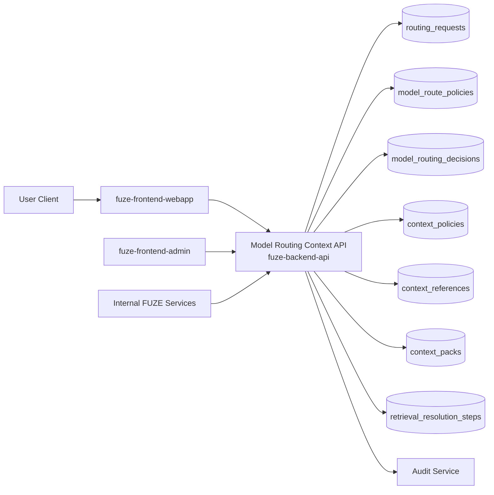
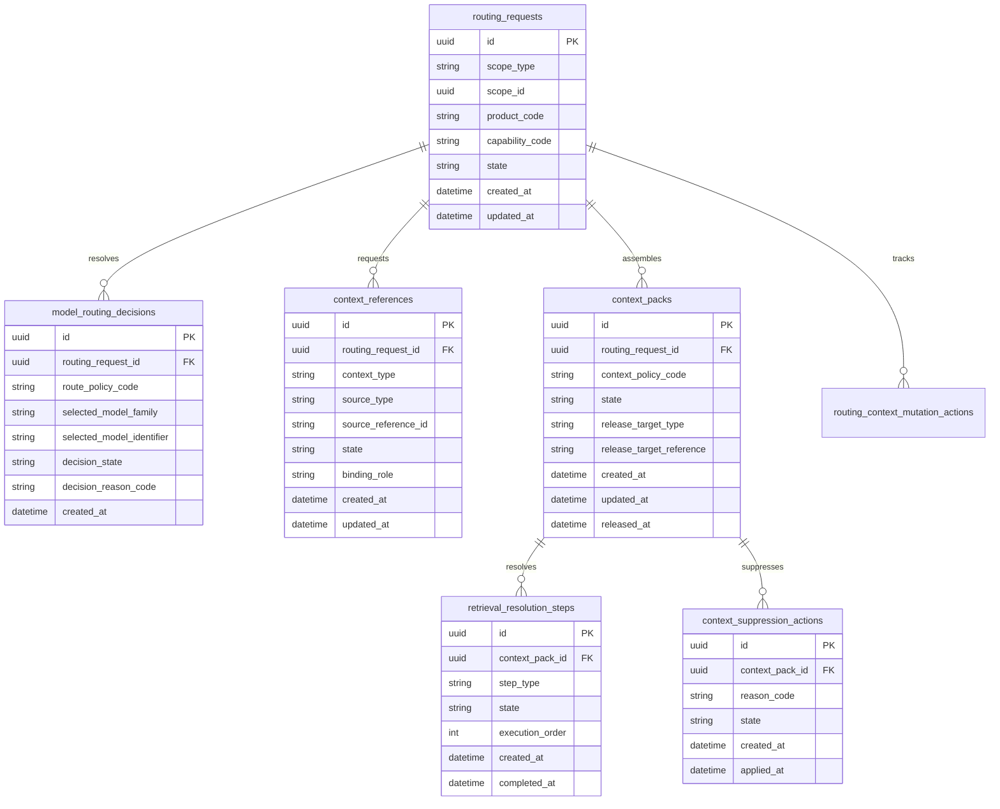
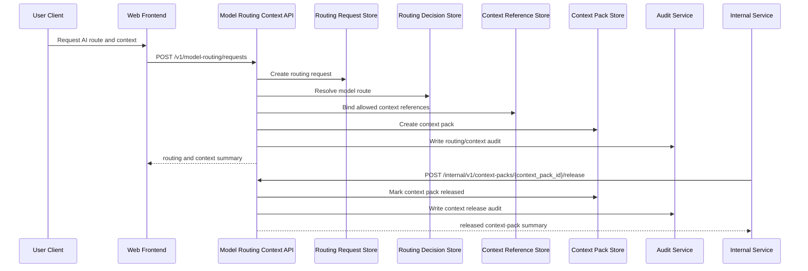

# MODEL_ROUTING_CONTEXT_API_SPEC

## 1. Title

**MODEL_ROUTING_CONTEXT_API_SPEC.md**

---

## 2. Document Metadata

- **Document Name:** MODEL_ROUTING_CONTEXT_API_SPEC.md
- **API Classification:** public, internal, admin, event-driven
- **Owning Domain:** Model Routing and Context Domain
- **Primary Implementing Repo:** `fuze-backend-api`
- **Primary System of Record:** model-routing policies, context-pack definitions, context bindings, retrieval references, routing decisions, and context-governance lineage in `fuze-backend-api`
- **Status:** Draft for canonical source-of-truth approval
- **Purpose:** Define the production-grade API contract architecture for FUZE model routing, context assembly, context-governance policy, retrieval/reference binding, and controlled execution-context resolution across the platform
- **Canonical Folder:** `fuze.ac > docs > api-spec`

---

## 2.1 API Classification Header

- **API Classification:** public | internal | admin | event-driven
- **Owning Domain:** Model Routing and Context Domain
- **Primary Implementing Repo:** `fuze-backend-api`
- **Primary System of Record:** model-routing and context-governance domain

---

## 3. Purpose

This document defines the canonical API specification for FUZE model routing and context operations. It translates the governing FUZE platform architecture, AI orchestration rules, model-routing and context rules, AI usage metering rules, workflow/automation rules, audit requirements, security controls, and API architecture rules into an implementation-ready API contract.

This API exists because FUZE is a platform of AI-enabled products that cannot rely on ad hoc prompt construction or product-local model selection. Model choice, fallback behavior, context assembly, retrieval/reference binding, context-class safety, and context release policy must be governed consistently at the platform layer. Without that layer, products would drift into incompatible context semantics, unbounded retrieval behavior, and inconsistent model-cost/safety tradeoffs.

Accordingly, this specification defines how routing requests are represented, how model families and context classes are resolved, how retrieval and context references are bound into governed execution packs, how routing decisions and fallback chains are recorded, and how context release remains bounded, auditable, idempotent, and architecture-consistent without allowing retrieved or assembled context to become uncontrolled business truth.

---

## 4. Scope

This specification covers:

- model-routing capability visibility APIs
- context-pack visibility APIs
- routing-request and context-resolution APIs
- retrieval/reference binding APIs
- internal service APIs for governed model and context resolution
- admin/control-plane APIs for routing-policy remediation, context suppression, fallback overrides, and discrepancy resolution
- event emission requirements for routing/context lifecycle changes
- request, response, error, idempotency, versioning, audit, and database-shape rules for this domain

This specification does **not** redefine:

- full AI orchestration run lifecycle semantics
- full AI usage metering semantics
- full workflow engine semantics
- product business truth ownership
- vector index or retrieval-engine implementation details in full detail
- provider SDK schemas in full detail
- billing, credits, payout, treasury, governance, or wallet semantics

Those remain governed by their own source-of-truth specifications.

---

## 5. Source-of-Truth Inputs

### Primary FUZE docs and specs used

#### Highest-priority platform and ownership sources
- `SYSTEM_SPEC_INDEX.md`
- `SYSTEM_BOUNDARY_AND_OWNERSHIP_SPEC.md`
- `SYSTEM_OVERVIEW_AND_BOUNDARIES_SPEC.md`
- `PLATFORM_ARCHITECTURE_SPEC.md`
- `DOMAIN_OWNERSHIP_MATRIX_SPEC.md`
- `DATA_MODEL_AND_ENTITY_OWNERSHIP_SPEC.md`

#### Primary AI / context / routing sources
- `MODEL_ROUTING_AND_CONTEXT_SPEC.md`
- `AI_ORCHESTRATION_SPEC.md`
- `AI_USAGE_METERING_SPEC.md`
- `WORKFLOW_AND_AUTOMATION_SPEC.md`
- `JOB_QUEUE_AND_WORKER_SPEC.md`
- `AUDIT_LOG_AND_ACTIVITY_SPEC.md`
- `SECURITY_AND_RISK_CONTROL_SPEC.md`
- `EVENT_MODEL_AND_WEBHOOK_SPEC_refreshed.md`
- `INTERNAL_SERVICE_API_SPEC.md`
- `ROLE_PERMISSION_AND_ACCESS_CONTROL_SPEC.md`

#### Product integration context
- `PRODUCT_INTEGRATION_ARCHITECTURE_SPEC.md`
- `QTB_PRODUCT_INTEGRATION_SPEC.md`
- `AIMM_PRODUCT_INTEGRATION_SPEC.md`
- `ZAGA_PRODUCT_INTEGRATION_SPEC.md`
- `AIE_PRODUCT_INTEGRATION_SPEC.md`
- `HERHELP_PRODUCT_INTEGRATION_SPEC.md`
- `BOTMAD_PRODUCT_INTEGRATION_SPEC.md`

#### API and runtime sources
- `API_ARCHITECTURE_SPEC.md`
- `PUBLIC_API_SPEC.md`
- `IDEMPOTENCY_AND_VERSIONING_SPEC.md`
- `MIGRATION_AND_BACKWARD_COMPATIBILITY_SPEC.md`
- `MONITORING_ALERTING_AND_INCIDENT_RESPONSE_SPEC.md`
- `SECRETS_CONFIG_AND_ENVIRONMENT_SPEC.md`

#### Format guides
- `The_API_Specification_guide.md`
- `Database_Schemas_Guide.md`

### Highest-priority interpretation applied

For this file, the most important governing interpretation is:

1. model routing and context assembly are platform-governed capabilities, not product-local conveniences
2. backend owns canonical routing and context-governance truth
3. routing decisions, context classes, retrieval references, and fallback chains must remain explicit
4. products may request routing and context resolution but do not redefine platform-wide routing semantics
5. admin/control-plane may remediate, restrict, or suppress context under controlled policy but do not own routing/context truth
6. assembled context, retrieved material, and routing output remain execution inputs, not canonical business truth by themselves

### Supporting external standards used only as guidance

- HTTP semantics for safe reads and async or mutation-style responses
- structured problem-details error design
- general routing-policy, retrieval-reference, and context-governance lineage patterns as supporting guidance

External guidance does not override FUZE source-of-truth documents.

---

## 6. Governing Architecture and Ownership Interpretation

This API belongs to the **Model Routing and Context Domain** because it owns the platform-governed lifecycle of resolving which model family should be used, which context sources are permitted, which retrieval references are bound, and which bounded context pack is released to AI execution.

This API is implemented primarily in `fuze-backend-api` because:

- backend owns durable routing and context-governance truth
- frontend surfaces must consume resolved routing/context results, not author them
- context-class safety and model/tool/cost tradeoffs must be centrally enforced
- product domains require a shared and trusted routing/context interface
- audit generation, safety restriction, and operational remediation must be backend-governed

This API is **not** owned by:

- `fuze-frontend-webapp`, because webapp only requests and reads allowed routing/context summaries
- `fuze-frontend-admin`, because admin may inspect or remediate but must not own routing/context truth
- AI orchestration domain, because orchestration owns run lifecycle while routing/context owns pre-execution and in-execution route/context decisions
- product domains, because products may define business intent and allowed capability requests but do not define cross-platform routing or context rules
- retrieval/index subsystems, because they provide context source material but do not own the final governed context release decision

### Architectural implications

- one orchestration request may cause one or more routing decisions
- one run may bind multiple context references under explicit policy
- retrieved context must remain typed, bounded, and attributable
- routing decisions must preserve fallback chains and resolution reasons
- context release must not imply business-truth commitment in another domain
- context suppression or re-binding must preserve lineage rather than silently overwrite prior routing/context history

---

## 7. Domain Responsibilities

The Model Routing and Context API domain is responsible for:

1. receiving and normalizing routing/context resolution requests
2. resolving model families and fallback chains under policy
3. binding retrieval references and context sources into governed context packs
4. enforcing context-class, sensitivity, and release policies
5. exposing bounded routing and context summaries for allowed consumers
6. supporting internal service routing/context resolution during AI execution
7. supporting admin/control-plane remediation, suppression, and discrepancy handling
8. emitting routing/context lifecycle events
9. generating audit lineage for sensitive routing/context actions
10. preserving separation between context inputs and durable business truth

The domain is not responsible for:

- owning AI orchestration run truth
- owning metering or billing truth
- owning vector index or knowledge source truth
- owning product business truth
- owning provider secrets or commercial provider billing truth
- directly committing retrieved context into other domains as truth

---

## 8. Out of Scope

The following are out of scope for this API specification:

- low-level embedding and vector search implementation details
- full provider model catalog API integration detail
- full prompt template management system
- end-user streaming transport protocols
- full data-classification system internals
- product-specific retrieval ranking policy in full detail
- external knowledge warehouse schema design
- final UI presentation of retrieved citations or references

Where later detailed specs are needed, they must remain compatible with this API.

---

## 9. Canonical Entities and Data Ownership

### Durable entities

#### 9.1 routing_requests
- **Owner:** Model Routing and Context Domain
- **Purpose:** canonical normalized requests for routing and context resolution
- **Nature:** source-of-truth durable entity

#### 9.2 model_route_policies
- **Owner:** Model Routing and Context Domain
- **Purpose:** canonical routing policy definitions controlling model families, fallback chains, and allowed execution classes
- **Nature:** source-of-truth durable entity

#### 9.3 model_routing_decisions
- **Owner:** Model Routing and Context Domain
- **Purpose:** explicit record of resolved route, fallback sequence, and bounded routing rationale
- **Nature:** source-of-truth durable lineage entity

#### 9.4 context_policies
- **Owner:** Model Routing and Context Domain
- **Purpose:** canonical policy definitions for context classes, release limits, sensitivity rules, and allowed source types
- **Nature:** source-of-truth durable entity

#### 9.5 context_references
- **Owner:** Model Routing and Context Domain
- **Purpose:** canonical records of requested or resolved context sources and retrieval references
- **Nature:** source-of-truth durable lineage entity

#### 9.6 context_packs
- **Owner:** Model Routing and Context Domain
- **Purpose:** governed assembled context package released to orchestration or execution
- **Nature:** source-of-truth durable entity with lineage to inputs

#### 9.7 retrieval_resolution_steps
- **Owner:** Model Routing and Context Domain
- **Purpose:** explicit step-level lineage for retrieval or context assembly actions
- **Nature:** durable execution lineage entity

#### 9.8 context_suppression_actions
- **Owner:** Model Routing and Context Domain
- **Purpose:** controlled suppression, redaction, or invalidation actions against context packs or context references
- **Nature:** durable corrective lineage entity

#### 9.9 routing_context_mutation_actions
- **Owner:** Model Routing and Context Domain
- **Purpose:** high-level action records for create, resolve, rebind, suppress, override, and discrepancy resolution
- **Nature:** durable action records with audit linkage

#### 9.10 routing_context_audit_events
- **Owner:** Audit / Activity domain, sourced by Model Routing and Context Domain
- **Purpose:** immutable trail for sensitive routing/context actions
- **Nature:** durable audit records

### Derived or cached entities

#### 9.11 routing_summary_views
- **Owner:** derived read-model layer
- **Purpose:** user-facing and admin-facing routing summaries
- **Nature:** derived

#### 9.12 context_pack_views
- **Owner:** derived read-model layer
- **Purpose:** bounded context pack presentations for allowed consumers
- **Nature:** derived

#### 9.13 routing_discrepancy_views
- **Owner:** derived ops read-model layer
- **Purpose:** visibility into routing failures, fallback anomalies, or context-policy discrepancies
- **Nature:** derived

---

## 10. State Model and Lifecycle

### 10.1 routing request lifecycle

Possible states:

- `created`
- `validated`
- `rejected`
- `resolving`
- `resolved`
- `failed`
- `cancelled`

### 10.2 routing decision lifecycle

Possible states:

- `selected`
- `fallback_selected`
- `rejected`
- `superseded`

### 10.3 context reference lifecycle

Possible states:

- `requested`
- `validated`
- `bound`
- `rejected`
- `suppressed`
- `superseded`

### 10.4 context pack lifecycle

Possible states:

- `assembling`
- `ready`
- `released`
- `restricted`
- `suppressed`
- `superseded`

### 10.5 retrieval-resolution step lifecycle

Possible states:

- `pending`
- `executing`
- `completed`
- `failed`
- `cancelled`
- `superseded`

Lifecycle notes:
- routing may resolve without context release if policy rejects requested context
- context packs may be `ready` before release to orchestration or may be restricted/suppressed after creation
- fallback routing must preserve explicit lineage rather than overwrite original selection attempt
- suppression or supersession must preserve historical routing/context lineage

---

## 11. API Surface Overview

The API surface is divided into four families:

### 11.1 Public / first-party user-facing APIs
Used by `fuze-frontend-webapp` and approved first-party clients for:
- reading visible routing capability summaries
- reading bounded context-pack summaries where permitted
- creating user-facing routing/context requests within allowed capability scope
- reading routing-context status and bounded outputs

### 11.2 Internal service APIs
Used by trusted internal services for:
- creating product-owned routing/context requests
- resolving model routes
- binding and releasing context packs
- reporting retrieval-resolution outcomes
- reading canonical routing/context state

### 11.3 Admin / control-plane APIs
Used by `fuze-frontend-admin` through backend-only privileged routes for:
- route-policy override-safe remediation
- context suppression or restriction
- rebind/recompute under controlled policy
- discrepancy resolution for routing or context anomalies

### 11.4 Event-driven interfaces
Used for downstream side effects:
- orchestration continuation triggers
- audit generation
- metering and anomaly detection triggers
- workflow continuation or safe fallback actions
- monitoring and reporting

---

## 12. Authentication and Authorization Model

### 12.1 Authentication posture by route family

#### Authenticated user routes
Require valid authenticated session:
- create allowed routing/context requests in owned or authorized scope
- read visible routing/context status
- read bounded context-pack summaries where visible

#### Internal service routes
Require internal service identity with explicit least privilege:
- create and resolve product-owned routing/context requests
- bind context references
- release or update context packs
- read canonical routing/context state

#### Admin routes
Require privileged operator identity plus reason-coded actions:
- suppress or restrict context
- retry or rebind context resolution
- apply route-policy remediation
- resolve discrepancies

### 12.2 Authorization checkpoints

Authorization must evaluate:
- canonical account identity
- session validity
- target scope and product context
- actor’s workspace role where applicable
- whether requested capability, context class, and source types are allowed
- whether run or routing request belongs to actor’s visible scope
- whether admin/operator role is present for privileged actions

### 12.3 Sensitive action rules

The following require heightened checks:
- requests involving sensitive context classes
- retrieval references that touch restricted source classes
- context-pack release into execution
- suppression or rebind actions
- route override or discrepancy-resolution actions

---

## 13. API Endpoints / Interface Contracts

## 13.1 Public / First-Party User APIs

### 13.1.1 `GET /v1/model-routing/capabilities`
**Purpose:** list visible routing/context capabilities for current actor and scope  
**Caller Type:** authenticated user  
**Auth Expectation:** valid authenticated session  
**Query Parameters Summary:**
- optional `scope_type`
- optional `scope_id`
- optional `product_code`
**Response Summary:**
- visible capability summaries
- allowed model-family classes
- allowed context-class hints
- async/interactive resolution hints where applicable
**Side Effects:** none
**Audit Requirements:** access logging only
**Emitted Events:** none required

### 13.1.2 `POST /v1/model-routing/requests`
**Purpose:** create routing/context resolution request for an owned or authorized scope  
**Caller Type:** authenticated user with scope authority  
**Request Body Summary:**
- `scope_type`
- `scope_id`
- `product_code`
- `capability_code`
- `input_summary`
- optional `requested_context_references[]`
- optional `execution_mode`
- `idempotency_key`
**Response Summary:**
- routing request summary
- current routing/context status
- bounded route and context-pack summary if already available
**Side Effects:** creates routing request and may start resolution
**Idempotency Behavior:** required
**Audit Requirements:** sensitive routing/context initiation audit
**Emitted Events:** `routing.requested`

### 13.1.3 `GET /v1/model-routing/requests`
**Purpose:** list visible routing/context requests for current actor  
**Caller Type:** authenticated user  
**Query Parameters Summary:**
- pagination
- optional state filters
- optional product filters
- optional date range
**Response Summary:** request summaries, route/context state summaries, and bounded output availability
**Side Effects:** none

### 13.1.4 `GET /v1/model-routing/requests/{routing_request_id}`
**Purpose:** retrieve canonical bounded routing/context detail view  
**Caller Type:** authenticated user with visibility  
**Response Summary:**
- request state
- routing summary
- context-reference summary
- context-pack summary where visible
- bounded restriction indicators
**Side Effects:** none

### 13.1.5 `GET /v1/context-packs/{context_pack_id}`
**Purpose:** retrieve bounded view of one visible context pack  
**Caller Type:** authenticated user with visibility  
**Response Summary:**
- context-pack state
- context-class summary
- source-count and type summaries
- bounded release/suppression indicators
**Side Effects:** none

## 13.2 Internal Service APIs

### 13.2.1 `POST /internal/v1/model-routing/requests`
**Purpose:** create product-owned routing/context request  
**Caller Type:** internal trusted services  
**Auth Expectation:** service-to-service identity only  
**Request Body Summary:**
- `scope_type`
- `scope_id`
- `product_code`
- `capability_code`
- `input_summary`
- `route_policy_code`
- `context_policy_code`
- optional `requested_context_references[]`
- optional `workflow_reference`
- `idempotency_key`
**Response Summary:** routing request and current resolution summary
**Side Effects:** creates routing request and starts resolution lineage
**Idempotency Behavior:** required
**Audit Requirements:** routing/context initiation audit
**Emitted Events:** `routing.requested`

### 13.2.2 `POST /internal/v1/model-routing/requests/{routing_request_id}/resolve`
**Purpose:** resolve model route and initial context policy outcome  
**Caller Type:** internal trusted services with routing authority  
**Request Body Summary:**
- optional `routing_input_override_summary`
- `idempotency_key`
**Response Summary:** routing-decision summary and current context status
**Side Effects:** creates routing-decision lineage, updates request state
**Idempotency Behavior:** required
**Audit Requirements:** sensitive routing-decision audit
**Emitted Events:** `routing.resolved`, `routing.fallback_selected`

### 13.2.3 `POST /internal/v1/context-packs`
**Purpose:** bind and assemble context pack for a routing request or run  
**Caller Type:** internal trusted services with context authority  
**Request Body Summary:**
- `routing_request_id`
- `context_references[]`
- optional `binding_metadata`
- `idempotency_key`
**Response Summary:** context-pack summary and context-reference summaries
**Side Effects:** creates context references, retrieval-resolution lineage, and context pack
**Idempotency Behavior:** required
**Audit Requirements:** sensitive context-assembly audit
**Emitted Events:** `context.pack_assembled`

### 13.2.4 `POST /internal/v1/context-packs/{context_pack_id}/release`
**Purpose:** release context pack to execution consumer under policy  
**Caller Type:** internal trusted services with release authority  
**Request Body Summary:**
- `release_target_type`
- `release_target_reference`
- `idempotency_key`
**Response Summary:** released context-pack summary
**Side Effects:** context pack transitions to released
**Idempotency Behavior:** required
**Audit Requirements:** critical context-release audit
**Emitted Events:** `context.pack_released`

### 13.2.5 `POST /internal/v1/context-packs/{context_pack_id}/retrieval-steps`
**Purpose:** record or advance one retrieval/context-resolution step  
**Caller Type:** internal trusted services  
**Request Body Summary:**
- `step_type`
- `step_payload`
- `idempotency_key`
**Response Summary:** retrieval step summary and updated context-pack status
**Side Effects:** creates or advances retrieval-resolution lineage
**Idempotency Behavior:** required
**Audit Requirements:** context-resolution audit where sensitivity requires
**Emitted Events:** `context.retrieval_step_updated`

### 13.2.6 `GET /internal/v1/model-routing/requests/{routing_request_id}`
**Purpose:** retrieve canonical routing/context truth for trusted services  
**Caller Type:** internal trusted services  
**Response Summary:** full request, routing, context-reference, context-pack, and retrieval-step lineage
**Side Effects:** none

## 13.3 Admin / Control-Plane APIs

### 13.3.1 `POST /admin/v1/context-packs/{context_pack_id}/suppress`
**Purpose:** suppress or restrict context pack under controlled policy  
**Caller Type:** admin/operator  
**Request Body Summary:**
- `reason_code`
- `operator_note`
- optional `related_case_id`
- `idempotency_key`
**Response Summary:** suppressed context-pack summary
**Side Effects:** context pack transitions to suppressed or restricted
**Audit Requirements:** critical audit
**Emitted Events:** `context.pack_suppressed`

### 13.3.2 `POST /admin/v1/model-routing/requests/{routing_request_id}/rebind`
**Purpose:** trigger controlled rebind or reroute for failed or remediable routing/context request  
**Caller Type:** admin/operator  
**Request Body Summary:**
- `rebind_profile`
- `reason_code`
- `operator_note`
- `idempotency_key`
**Response Summary:** rebind action summary and updated/new routing lineage
**Side Effects:** may create superseding route/context lineage
**Audit Requirements:** critical audit
**Emitted Events:** `routing.rebound`

### 13.3.3 `POST /admin/v1/model-routing/policy-remediations`
**Purpose:** resolve route-policy or context-policy discrepancy under controlled policy  
**Caller Type:** admin/operator  
**Request Body Summary:**
- `target_reference_type`
- `target_reference_id`
- `resolution_code`
- `operator_note`
- `related_case_id`
- `idempotency_key`
**Response Summary:** policy-remediation summary
**Side Effects:** may supersede routing decision, restrict context, or close discrepancy posture
**Audit Requirements:** critical audit
**Emitted Events:** `routing.policy_remediated`

### 13.3.4 `POST /admin/v1/model-routing/discrepancies`
**Purpose:** resolve routing or context discrepancy under controlled policy  
**Caller Type:** admin/operator  
**Request Body Summary:**
- `routing_request_id`
- `resolution_code`
- `operator_note`
- `related_case_id`
- `idempotency_key`
**Response Summary:** discrepancy-resolution summary
**Side Effects:** may update request, routing, context, or release posture with preserved lineage
**Audit Requirements:** critical audit
**Emitted Events:** `routing.discrepancy_resolved`

---

## 14. Request Rules

### 14.1 General request rules
- all mutation-capable routes must require JSON requests with explicit content type
- all mutation routes must carry correlation IDs
- sensitive routing/context mutations must carry idempotency keys
- admin mutations must require reason codes and operator notes
- no route may accept frontend-computed route or released-context truth as authoritative input

### 14.2 Sensitive-action request requirements
The following requests require heightened validation:
- requests involving restricted context classes
- route resolution and fallback selection
- context-pack assembly and release
- suppression or rebind actions
- policy-remediation and discrepancy-resolution actions

Heightened validation may include:
- scope authorization checks
- capability-policy checks
- context-policy and source-class validation
- duplicate reference and duplicate release checks
- operator role confirmation
- support/security case linkage for admin flows

### 14.3 Scope integrity rule
Routing/context mutations must target valid and authorized scopes, products, and capability contexts. Product or service callers must not create or mutate routing/context state for unrelated or unauthorized scopes.

### 14.4 Business-truth separation rule
Resolved routes and context packs are execution inputs. They must not silently commit business truth into another domain without that owning domain’s explicit validation and commit path.

---

## 15. Response Rules

### 15.1 Success response rules
Successful responses must include:
- stable resource identifiers
- timestamps for created/updated state
- state/status values
- scope and product summaries
- routing and context summaries where relevant
- correlation references for mutations

### 15.2 Async-accepted response rules
If retrieval, rebind, or remediation is async, the response must:
- return accepted status
- include action or job ID
- provide follow-up status semantics

### 15.3 Terminal mutation response rules
Terminal mutation responses must clearly show:
- target request, route, or context pack
- mutation type
- resulting route/context state
- release, suppression, or supersession effects where relevant
- whether user-visible summaries may refresh asynchronously

### 15.4 Read response rules
Read responses must distinguish:
- durable routing/context truth
- bounded context-pack summaries
- release/suppression posture
- operator-only details that must remain excluded from user-facing views

---

## 16. Error Model

The API uses structured problem-details style error responses.

### 16.1 Required error fields
- `type`
- `title`
- `status`
- `code`
- `detail`
- `instance`
- `correlation_id`

### 16.2 Common error codes

#### Authorization / permission errors
- `ROUTING_SESSION_REQUIRED`
- `ROUTING_PERMISSION_DENIED`
- `ROUTING_OPERATOR_PERMISSION_DENIED`
- `ROUTING_SERVICE_PERMISSION_DENIED`

#### State conflict errors
- `ROUTING_REQUEST_STATE_INVALID`
- `ROUTING_DECISION_ALREADY_SUPERSEDED`
- `CONTEXT_PACK_STATE_INVALID`
- `CONTEXT_PACK_ALREADY_SUPPRESSED`
- `ROUTING_REBIND_CONFLICT`

#### Policy / safety errors
- `ROUTING_CAPABILITY_NOT_ALLOWED`
- `ROUTING_SCOPE_RESTRICTED`
- `CONTEXT_CLASS_NOT_ALLOWED`
- `CONTEXT_SOURCE_NOT_ALLOWED`
- `CONTEXT_RELEASE_FORBIDDEN`
- `ROUTING_POLICY_RESTRICTION_REQUIRED`

#### Request integrity errors
- `ROUTING_IDEMPOTENCY_KEY_REQUIRED`
- `ROUTING_REQUEST_INVALID`
- `ROUTING_REQUEST_UNPROCESSABLE`

#### Dependency or provider errors
- `ROUTING_RESOLUTION_UNAVAILABLE`
- `CONTEXT_RETRIEVAL_UNAVAILABLE`
- `CONTEXT_BINDING_UNAVAILABLE`

### 16.3 Error handling rules
- do not expose hidden operator-only or security-review internals
- do not imply orchestration success or business-truth commitment from successful routing/context resolution
- distinguish restricted context from failed retrieval
- distinguish disallowed context source from generic provider or retrieval failure
- include retry guidance only where safe

---

## 17. Idempotency and Mutation Safety

### 17.1 Required idempotent mutations
The following mutation routes require idempotent behavior:
- routing request creation
- route resolution
- context-pack assembly
- context-pack release
- retrieval-step updates
- suppression
- rebind
- policy-remediation and discrepancy resolution

### 17.2 Idempotency key rules
- mutation requests must supply `Idempotency-Key`
- backend stores key scope, request hash, actor, and terminal result
- replay of same semantic request returns original terminal outcome
- replay of same key with different semantic request must fail with conflict

### 17.3 Mutation safety rules
- the same routing request must not resolve to conflicting canonical current states without explicit supersession lineage
- the same context pack must not be released twice in conflicting ways
- retrieval steps must not be applied twice accidentally in conflicting terminal states
- suppression and rebind actions must preserve immutable lineage rather than rewrite prior records
- context reference supersession must preserve source lineage

---

## 18. Versioning and Compatibility Rules

### 18.1 Versioning
This API family is versioned under `/v1`, `/internal/v1`, and `/admin/v1` route families.

### 18.2 Compatibility approach
- additive evolution preferred
- no silent semantic change to routing, context-reference, context-pack, or retrieval-step states
- new context classes, source types, and model families may be added without breaking existing contracts
- response fields may be added but existing meanings must remain stable

### 18.3 Breaking-change rules
Breaking changes include:
- changing the meaning of resolved, released, restricted, or suppressed states
- changing bounded context-pack semantics incompatibly
- removing critical routing or context fields
- changing fallback-chain or release semantics incompatibly

Such changes require explicit migration planning and version evolution.

### 18.4 Deprecation
Deprecated routes or fields must:
- be documented explicitly
- carry deprecation metadata where supported
- preserve compatibility windows long enough for first-party consumers and future SDKs

---

## 19. Event Emission and Webhook Behavior

This domain is event-capable.

### 19.1 Internal events
The Model Routing and Context domain must emit canonical internal events such as:
- `routing.requested`
- `routing.resolved`
- `routing.fallback_selected`
- `context.pack_assembled`
- `context.pack_released`
- `context.retrieval_step_updated`
- `context.pack_suppressed`
- `routing.rebound`
- `routing.policy_remediated`
- `routing.discrepancy_resolved`

### 19.2 Event payload minimums
Each event should contain:
- event ID
- event type
- occurred_at
- scope type and scope ID
- routing request ID
- product code and capability code where relevant
- routing decision or context pack reference where relevant
- actor type
- correlation ID
- reason code where applicable

### 19.3 External webhook posture
This specification does not expose general third-party outbound routing/context webhooks by default. Any future outbound routing/context webhook surface must be narrow, security-reviewed, and governed by a separate contract.

---

## 20. Audit and Activity Requirements

The following actions must generate durable audit events:

- sensitive routing/context request creation
- route resolution and fallback selection where policy requires
- context-pack assembly and release
- suppression actions
- rebind and remediation actions
- discrepancy resolution
- other sensitive routing/context flows

### Required audit fields
- audit event ID
- actor type and actor reference
- scope type and scope reference
- target request / route / context pack / retrieval step reference as applicable
- action type
- before/after routing or context summary where applicable
- reason code
- correlation ID
- operator note if operator action
- occurred_at

User-facing activity feeds may show a filtered subset, but audit truth must remain durable and immutable.

---

## 21. Data Model and Database Schema View

### 21.1 `routing_requests`
- `id` PK
- `scope_type`
- `scope_id`
- `product_code`
- `capability_code`
- `requested_by_actor_type`
- `requested_by_actor_id`
- `input_summary_json`
- `state`
- `created_at`
- `updated_at`

**Constraints:**
- index on (`scope_type`, `scope_id`)
- index on (`product_code`, `capability_code`)
- index on `state`

### 21.2 `model_route_policies`
- `id` PK
- `policy_code`
- `state`
- `allowed_model_families_json`
- `fallback_chain_json`
- `selection_rules_json`
- `created_at`
- `updated_at`

**Constraints:**
- unique `policy_code`
- index on `state`

### 21.3 `model_routing_decisions`
- `id` PK
- `routing_request_id` FK -> `routing_requests.id`
- `route_policy_code`
- `selected_model_family`
- `selected_model_identifier`
- `decision_state`
- `decision_reason_code`
- `fallback_position` nullable
- `created_at`

**Constraints:**
- index on `routing_request_id`
- index on `decision_state`

### 21.4 `context_policies`
- `id` PK
- `policy_code`
- `state`
- `allowed_context_classes_json`
- `allowed_source_types_json`
- `release_limits_json`
- `created_at`
- `updated_at`

**Constraints:**
- unique `policy_code`
- index on `state`

### 21.5 `context_references`
- `id` PK
- `routing_request_id` FK -> `routing_requests.id`
- `context_type`
- `source_type`
- `source_reference_id`
- `state`
- `binding_role`
- `created_at`
- `updated_at`

**Constraints:**
- index on `routing_request_id`
- index on (`context_type`, `source_type`)
- index on `state`

### 21.6 `context_packs`
- `id` PK
- `routing_request_id` FK -> `routing_requests.id`
- `context_policy_code`
- `state`
- `release_target_type` nullable
- `release_target_reference` nullable
- `context_summary_json`
- `created_at`
- `updated_at`
- `released_at` nullable
- `suppressed_at` nullable

**Constraints:**
- index on `routing_request_id`
- index on `state`

### 21.7 `retrieval_resolution_steps`
- `id` PK
- `context_pack_id` FK -> `context_packs.id`
- `step_type`
- `state`
- `execution_order`
- `step_summary_json`
- `created_at`
- `completed_at` nullable
- `failed_at` nullable

**Constraints:**
- index on `context_pack_id`
- index on (`state`, `execution_order`)

### 21.8 `context_suppression_actions`
- `id` PK
- `context_pack_id` FK -> `context_packs.id`
- `reason_code`
- `operator_note` nullable
- `state`
- `created_at`
- `applied_at` nullable
- `closed_at` nullable

### 21.9 `routing_context_mutation_actions`
- `id` PK
- `target_reference_type`
- `target_reference_id`
- `action_type`
- `state`
- `reason_code`
- `operator_note` nullable
- `requested_by_actor_type`
- `requested_by_actor_id`
- `created_at`
- `executed_at` nullable
- `closed_at` nullable
- `correlation_id`

### 21.10 `idempotency_records`
- `id` PK
- `idempotency_key`
- `scope_family`
- `actor_reference`
- `request_hash`
- `response_hash`
- `terminal_status`
- `created_at`
- `expires_at`

### 21.11 `audit_log_entries`
Domain-sourced audit records written into the audit domain.

### Normalization notes
- canonical routing/context truth stays in routing requests, routing decisions, context references, context packs, and retrieval steps
- AI orchestration run truth remains external and referenced, not duplicated as routing/context truth
- context-pack views are derived and bounded for consumer-safe visibility
- product business truth remains external to routing/context state

### Reconciliation notes
- one routing request should reconcile to one current route/context lineage plus explicit supersession chains where needed
- released context packs must reconcile to explicit context references and retrieval steps
- suppression/rebind actions must preserve supersession lineage
- routing decisions and fallback chains must remain historically queryable

---

## 22. Architecture Diagram — Mermaid flowchart



---

## 23. Data Design — Mermaid Diagram



---

## 24. Flow View

### 24.1 Happy path — resolve route and context
1. authenticated actor or internal service requests model routing and context resolution
2. backend validates capability, scope, route policy, and context policy
3. routing request is created
4. route decision selects model family and fallback chain
5. allowed context references are bound
6. context pack is assembled
7. context pack is released to execution target if policy allows
8. audit and events are emitted

### 24.2 Happy path — product-owned routing
1. product service submits routing request with route and context policy codes
2. backend validates product/scope/policy relationship
3. model route resolves
4. retrieval steps assemble bounded context pack
5. released context pack is made available to orchestration
6. product continues execution through orchestration domain

### 24.3 Alternate path — fallback route
1. initial preferred model family is unavailable or disallowed at resolution time
2. fallback chain is evaluated
3. fallback model is selected
4. routing decision records fallback position and rationale
5. context resolution continues against resulting policy

### 24.4 Failure path — disallowed context source
1. request references restricted or disallowed context source type
2. backend rejects or suppresses that context reference
3. routing request may fail or resolve with reduced context depending on policy
4. no unauthorized context is released

### 24.5 Failure and remediation path — context pack needs suppression or rebind
1. context pack is assembled
2. later review detects policy or quality issue
3. admin suppresses pack or requests rebind/recompute
4. superseding context lineage is created
5. prior context pack remains historically queryable but not normally released

### 24.6 Retry behavior
- duplicate request initiation returns same terminal request result
- duplicate route resolution returns same terminal decision result
- duplicate context-pack release returns same terminal release result
- duplicate suppression or rebind returns same terminal action result

---

## 25. Data Flows — Mermaid sequenceDiagram



---

## 26. Security and Risk Controls

1. **Routing/context truth is backend-owned**  
   Frontends and products may not authoritatively mark routes or released context as canonical truth outside approved backend APIs.

2. **Context is not business-truth owner**  
   Retrieved or assembled context must not be treated as canonical domain truth without owning-domain validation.

3. **Policy-bound route and context release**  
   Model-family selection, fallback, source types, and context classes must be governed by explicit route and context policies.

4. **Least privilege**  
   Internal routing, retrieval, and release routes must be limited to authorized service callers with explicit privileges.

5. **Sensitive-context controls**  
   Restricted context classes and source types must be explicitly allowed before binding or release.

6. **Immutable lineage**  
   Fallbacks, suppressions, rebinds, and remediation actions must preserve history instead of rewriting prior records.

7. **Problem-details discipline**  
   Error bodies must be structured and safe, without exposing hidden operator-only or security-review details.

8. **Audit immutability**  
   Sensitive routing/context actions require durable immutable audit lineage.

9. **Replay resistance**  
   Request creation, route resolution, context-pack assembly, release, suppression, and rebind must be idempotent and replay-safe.

10. **Output-release separation**  
    Released context is an execution input; it does not authorize automatic final output or business-truth mutation in another domain.

---

## 27. Operational Considerations

- routing/context-status reads are user- and product-visible and should be highly available
- retrieval and context assembly are correctness-sensitive and must preserve source attribution lineage
- fallback rates and restricted-context incidents should surface clearly to ops views
- context suppression or rebind should propagate quickly to dependent execution flows
- monitoring should alert on:
  - spikes in routing fallbacks
  - unusual context suppression volume
  - retrieval-step failure spikes
  - route-resolution backlog growth
  - restricted source-reference spikes
  - routing/context discrepancy spikes

---

## 28. Acceptance Criteria

1. The API preserves the distinction between model routing/context truth, AI orchestration truth, metering truth, and product business truth.
2. Only `fuze-backend-api` owns canonical routing/context truth.
3. Routing requests, decisions, context references, context packs, and retrieval steps are durable and backend-owned.
4. Route and context release are policy-bound.
5. Released context is distinct from business-truth commitment in other domains.
6. Fallback, suppression, rebind, and supersession lineage are explicit and immutable.
7. Release, suppression, and rebind are idempotent and auditable.
8. Internal routing/context routes are least-privilege and backend-only.
9. Admin routes require reason-coded privileged authorization.
10. Event emissions exist for major routing/context mutations.
11. Response and error semantics are stable and machine-readable.
12. Database schema separates routing requests, policies, decisions, context references, context packs, and retrieval steps.
13. Products can consume canonical routing/context APIs without redefining platform routing semantics.
14. Restriction and discrepancy handling are supported and safely replayable.
15. Mermaid diagrams remain consistent with prose and data model.

---

## 29. Test Cases

### 29.1 Positive cases
1. Authenticated user creates allowed routing/context request successfully.
2. Authenticated user reads visible routing/context summary successfully.
3. Authenticated user reads visible bounded context-pack summary successfully.
4. Internal service creates product-owned routing request successfully.
5. Internal service resolves route successfully.
6. Internal service assembles context pack successfully.
7. Internal service releases context pack successfully.
8. Admin suppresses problematic context pack successfully.

### 29.2 Negative cases
9. Unauthenticated call to user routing route is rejected.
10. User without scope authority cannot create routing request for workspace scope.
11. Request for disallowed capability returns `ROUTING_CAPABILITY_NOT_ALLOWED`.
12. Request with disallowed context class returns `CONTEXT_CLASS_NOT_ALLOWED`.
13. Request with disallowed source type returns `CONTEXT_SOURCE_NOT_ALLOWED`.
14. Attempt to read suppressed context pack returns appropriate restricted or suppressed result.

### 29.3 Authorization cases
15. Ordinary user cannot call admin suppress/rebind/remediation routes.
16. Internal service without routing privilege cannot resolve route.
17. Internal service without context-release privilege cannot release context pack.
18. Product service cannot treat released context as canonical product truth without separate owning-domain path.

### 29.4 Idempotency and replay cases
19. Repeating request creation with same idempotency key returns original request result.
20. Repeating route resolution with same idempotency key returns original routing decision.
21. Repeating context-pack release with same idempotency key returns original release result.
22. Repeating suppression with same idempotency key returns original suppression result.

### 29.5 Concurrency cases
23. Concurrent fallback and primary-resolution attempts preserve one explicit current route lineage and one superseded lineage where appropriate.
24. Concurrent context release and suppression preserve explicit state ordering without hidden overwrite.
25. Concurrent retrieval-step updates do not create ambiguous terminal retrieval-step state.

### 29.6 Recovery / admin cases
26. Failed context assembly can be rebound under controlled policy with explicit supersession linkage.
27. Restricted context pack prevents normal release without approved remediation.
28. Suppressed context pack remains historically linked while no longer normally releasable.

### 29.7 Event and audit cases
29. Successful routing request creation emits `routing.requested`.
30. Successful route resolution emits `routing.resolved`.
31. Successful context-pack release emits `context.pack_released`.
32. Successful suppression emits `context.pack_suppressed` with critical audit lineage.

---

## 30. Open Questions or Explicit Deferred Decisions

1. Exact model-family taxonomy and provider mapping across all products is deferred.
2. Exact context-class hierarchy for all sensitive source classes is deferred.
3. Exact retrieval-reference schema for every future knowledge source is deferred.
4. Exact fallback cost/latency weighting rules are deferred.
5. Exact user-visible context-pack summary detail is deferred.
6. Exact discrepancy taxonomy for routing/context anomalies is deferred.

---

## 31. Implementation Notes for `fuze-backend-api`

Recommended backend module layout:

```text
modules/platform/
  model-routing-context/
  ai-orchestration/
  workflow-orchestration/
  audit-log/
  control-plane/
  integrations/
```

Implementation guidance:
- keep request identity, routing policy, decision lineage, context reference binding, context pack assembly, and retrieval-step lineage in one canonical domain service
- perform capability-policy and context-policy checks inside the commit boundary
- keep suppressions, rebinds, and supersession explicit and idempotent
- treat admin remediations as domain actions, not ad hoc row edits
- emit events only after canonical state commit succeeds
- publish user-facing routing/context summaries from canonical truth; do not let derived views mutate routing/context state

---

## 32. Frontend Consumption Notes

### For `fuze-frontend-webapp`
- may create routing/context requests and read visible summaries
- must not infer canonical route choice or context release from client-side heuristics alone
- must treat backend routing/context responses as authoritative
- should clearly distinguish resolving, resolved, released, restricted, failed, and suppressed states
- should not present retrieved context as committed platform truth unless the owning domain separately confirms that outcome

### For `fuze-frontend-admin`
- may trigger privileged suppress, rebind, remediation, and discrepancy actions only through backend admin APIs
- must require operator reason input for sensitive mutations
- must not directly mutate routing/context truth client-side
- should present immutable audit-linked summaries after privileged actions

---

## 33. Contract Derivation Notes

### OpenAPI / AsyncAPI
This spec should later derive into:
- routing capability and request-creation operations
- request-status and context-pack read operations
- internal route-resolution, context-pack, and retrieval-step operations
- admin suppress / rebind / remediation / discrepancy operations
- shared problem-details schema
- routing/context events in AsyncAPI

### Future `fuze-sdk`
Future `fuze-sdk` packages may derive:
- routing request helpers
- routing/context status polling helpers
- typed routing request, decision, context pack, and retrieval-step models
- problem-error models for routing/context outcomes

The SDK must derive from approved API contracts and must not become the source of truth over this narrative specification.
