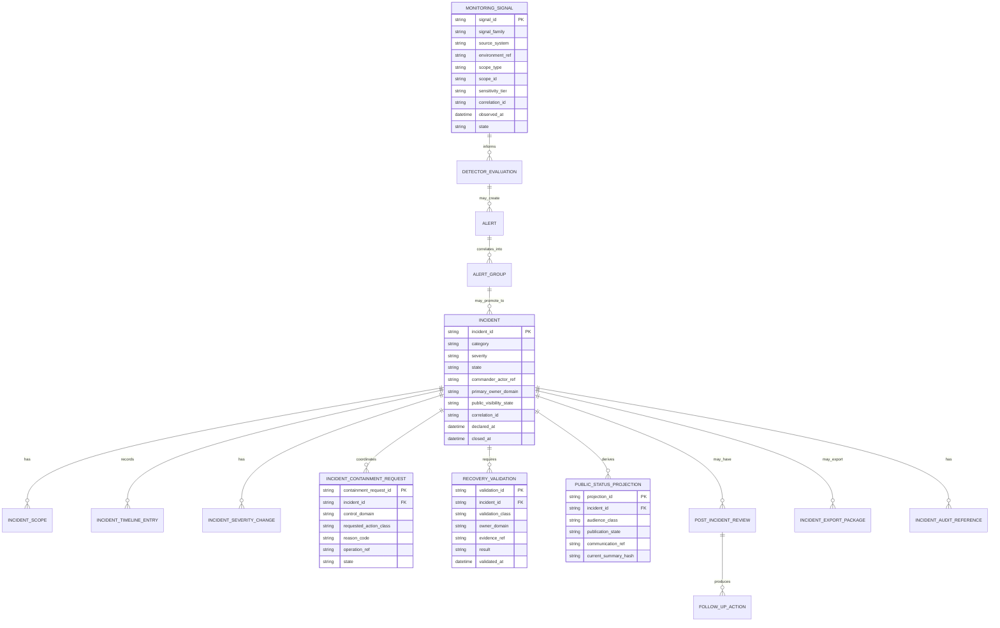
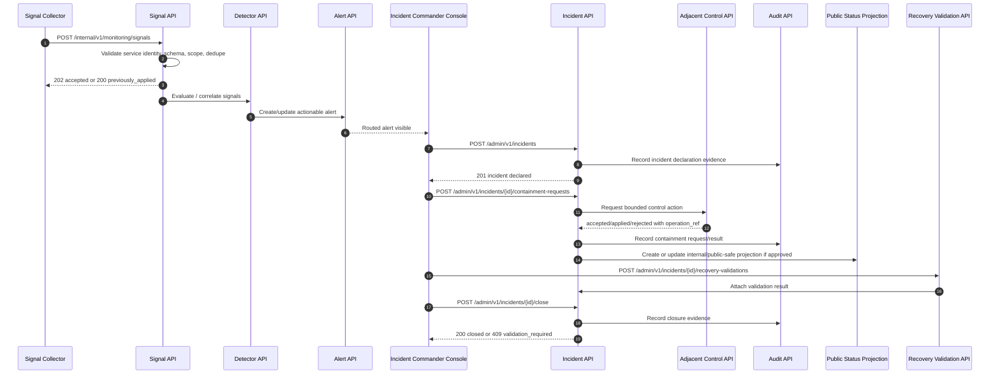

# FUZE Monitoring, Alerting, and Incident Response API Specification

## Document Metadata

- **Document Name:** `MONITORING_ALERTING_AND_INCIDENT_RESPONSE_API_SPEC.md`
- **Document Type:** FUZE API SPEC v2 / Production-grade interface contract specification
- **Status:** Draft production API specification for canonical review
- **Version:** 2.0.0
- **Effective Date:** 2026-04-24
- **Last Updated:** 2026-04-24
- **Reviewed On:** 2026-04-24
- **Document Owner:** FUZE Platform Reliability, Incident Command, and Operational Trust Governance Domain
- **Approval Authority:** FUZE Platform Architecture and Specification Governance Domain; named final approver not yet specified
- **Review Cadence:** Quarterly and whenever incident posture, runtime control posture, security/risk posture, public-status posture, event/webhook posture, continuity posture, deployment/runtime posture, or trust-sensitive monitoring changes materially
- **Governing Layer:** API contract layer derived from the refined monitoring, alerting, and incident-response system semantics
- **Parent Registry:** `API_SPEC_INDEX.md` and FUZE API SPEC v2 Canonical File Registry
- **Upstream Semantic Registry:** `REFINED_SYSTEM_SPEC_INDEX.md`
- **Upstream API Registry:** `API_SPEC_INDEX.md`
- **Primary Audience:** Backend engineering, platform/SRE, incident-command tooling authors, API architects, security engineering, audit/compliance, runtime operations, workflow/worker teams, public-status tooling authors, notification/communication authors, implementation-contract authors, OpenAPI/AsyncAPI authors, QA and production-readiness reviewers
- **Primary Purpose:** Define the production-grade API contract posture for monitoring signals, detector evaluations, alerts, incidents, containment coordination, recovery validation, public-status-safe incident projections, post-incident review, and follow-up actions without allowing incident APIs, dashboards, status pages, or operator tooling to redefine owner-domain business truth, security truth, audit truth, runtime truth, or public communication truth
- **Primary Upstream References:** `REFINED_SYSTEM_SPEC_INDEX.md`; `MONITORING_ALERTING_AND_INCIDENT_RESPONSE_SPEC.md`; `API_ARCHITECTURE_SPEC.md`; `PUBLIC_API_SPEC.md`; `INTERNAL_SERVICE_API_SPEC.md`; `EVENT_MODEL_AND_WEBHOOK_SPEC.md`; `IDEMPOTENCY_AND_VERSIONING_SPEC.md`; `MIGRATION_AND_BACKWARD_COMPATIBILITY_SPEC.md`; `SECURITY_AND_RISK_CONTROL_SPEC.md`; `SECRETS_CONFIG_AND_ENVIRONMENT_SPEC.md`; `AUDIT_LOG_AND_ACTIVITY_SPEC.md`; `AUDIT_AND_ACCESS_TRACEABILITY_SPEC.md`; `FEATURE_FLAG_AND_ROLLOUT_CONTROL_SPEC.md`; `DEPLOYMENT_AND_RUNTIME_OPERATIONS_SPEC.md`; `BUSINESS_CONTINUITY_AND_RECOVERY_SPEC.md`; `NOTIFICATION_AND_USER_COMMUNICATION_SPEC.md`; `WORKFLOW_AND_AUTOMATION_SPEC.md`; `JOB_QUEUE_AND_WORKER_SPEC.md`; `AI_ORCHESTRATION_SPEC.md`; `MODEL_ROUTING_AND_CONTEXT_SPEC.md`; `AI_USAGE_METERING_SPEC.md`; `DATA_CLASSIFICATION_AND_HANDLING_SPEC.md`; `DATA_RETENTION_DELETION_AND_ARCHIVAL_SPEC.md`; `PUBLIC_CONTRACT_AND_WALLET_REGISTRY_SPEC.md`; `TRANSPARENCY_REPORTING_SPEC.md`; `FUZE_ACCOUNT_ACCESS_AND_SESSION_THESIS_FINAL_SPEC.md`; `FUZE_ACCOUNT_ACCESS_AND_SESSION_CANONICAL_FINAL_SPEC.md`; `FUZE_WORKSPACE_ACCESS_CONTROL_BASICS_THESIS_FINAL_SPEC.md`
- **Primary Downstream Dependents:** Incident-management service contracts; detector and signal-ingestion contracts; internal alerting APIs; admin/control incident console APIs; runtime containment request contracts; public-status projection APIs; incident communication workflows; post-incident review tooling; recovery-validation contracts; OpenAPI/AsyncAPI artifacts; incident runbooks; production readiness tests; operational dashboards
- **API Surface Families Covered:** Internal service APIs; admin/control-plane APIs; event/async APIs; reporting/read-model APIs; first-party application APIs for authorized operator consoles; public-safe status APIs where approved
- **API Surface Families Excluded:** General public mutation APIs; arbitrary third-party incident webhooks; raw observability vendor APIs; direct database writes; product-local dashboard contracts; low-level pager vendor integrations; generic BI exports not governed as incident projections
- **Canonical System Owner(s):** FUZE Platform Reliability, Incident Command, and Operational Trust Governance Domain; adjacent owners retain their own semantic truth
- **Canonical API Owner:** FUZE Platform Monitoring and Incident API Governance Domain
- **Supersedes:** Older or weaker API interpretations that treat alerts as incidents, dashboards as incident truth, public-status pages as canonical incident records, incident-command routes as broad owner-domain mutation authority, or emergency runtime controls as unaudited convenience paths
- **Superseded By:** Not yet known
- **Related Decision Records:** Not yet specified
- **Canonical Status Note:** This API specification is authoritative for interface-contract expression of monitoring, alerting, and incident-response semantics. The refined system specification owns semantic truth; this API spec owns route-family, request/response, status, error, idempotency, audit, event, projection, and implementation-contract posture.
- **Implementation Status:** Normative API baseline for downstream implementation; service-specific OpenAPI, AsyncAPI, schema, runbook, and QA artifacts must conform
- **Approval Status:** Draft pending formal approval workflow
- **Change Summary:** Created the API SPEC v2 production-grade interface contract for monitoring, alerting, and incident response; normalized signal, detector, alert, incident, containment, recovery validation, public-status projection, and post-incident review APIs; made truth-class separation, public/internal/admin separation, async accepted-state behavior, idempotency, auditability, and production-readiness tests explicit.

## Purpose

This document defines the FUZE API contract architecture for monitoring, alerting, and incident response.

It translates the refined monitoring and incident semantics into implementation-usable API rules for:

- signal intake and normalized monitoring observations
- detector evaluation and condition correlation
- alert creation, routing, acknowledgement, suppression, escalation, and closure
- incident declaration, categorization, severity, ownership, timeline, containment coordination, recovery validation, resolution, closure, and post-incident review
- bounded admin/control actions during incidents
- public-status-safe incident projections and communication handoff
- event, async, audit, observability, idempotency, migration, and compatibility behavior

The API layer does not decide what business truth means. It exposes and coordinates monitoring and incident truth while preserving the upstream rule that incidents coordinate response and visibility; they do not become semantic owners of affected domains.

## Scope

This API specification governs:

- internal signal-ingestion APIs for runtime health, detector output, reconciliation results, provider/dependency health, workflow/worker/AI/runtime conditions, and trust-sensitive publication checks
- internal detector evaluation and alert creation APIs
- admin/control-plane incident APIs for authorized incident commanders, responders, and governance-aware operators
- first-party operator console read APIs for incident, alert, timeline, validation, follow-up, and public-status projection views
- runtime containment request APIs that coordinate with rollout, deployment/runtime, security/risk, workflow, queue, and owner-domain APIs without replacing those domains
- recovery-validation APIs that record evidence, checks, and re-enable readiness
- post-incident review and follow-up APIs
- public-safe status read APIs where approved
- internal event families and AsyncAPI derivation posture for incident lifecycle, alert lifecycle, containment, recovery validation, and communication handoff
- request, response, status, error, idempotency, audit, versioning, migration, observability, and rate-limit posture for this API family

## Out of Scope

This API specification does not define:

- every observability vendor schema, pager vendor primitive, SIEM integration, or dashboard widget
- every product-specific SLO, detector threshold, or alert-routing calendar
- every incident runbook step or staffing roster
- exact public-status page copy, legal disclosure text, or support macro wording
- direct mutation semantics for affected business domains
- security/risk decision semantics beyond consuming and correlating their outputs
- rollout/kill-switch semantics beyond requesting or referencing bounded controls
- deployment/runtime rollback mechanics beyond referencing runtime-control outcomes
- continuity/recovery strategy beyond immediate incident-lifecycle handoff and validation references
- low-level database DDL or storage-engine implementation

Those concerns belong to adjacent specs and downstream implementation contracts.

## Design Goals

1. Preserve strict separation among monitoring truth, alert truth, incident truth, business truth, security truth, runtime truth, audit truth, public communication truth, and reporting/presentation truth.
2. Make incident APIs implementation-usable without allowing incident tooling to become a hidden owner-domain mutation surface.
3. Support signal ingestion, detection, alerting, triage, containment, recovery validation, public communication, and post-incident review through explicit route families and resource models.
4. Preserve actionability discipline: alerts are action signals; incidents are coordination records; dashboards are derived views.
5. Support safe degraded operation, bounded containment, staged re-enable, and explicit recovery validation.
6. Require reason codes, policy references, actor attribution, correlation IDs, trace IDs, audit lineage, and idempotency keys for sensitive actions.
7. Support public-status-safe projection while keeping internal incident records richer and more sensitive.
8. Enable OpenAPI, AsyncAPI, SDK, runbook, and implementation-contract derivation without route drift or truth-class drift.

## Non-Goals

This API spec is not intended to:

- expose raw internal incident records as public status APIs
- let alert acknowledgement imply incident closure
- let incident commander authority mutate arbitrary business truth
- make dashboards, chats, status pages, or public communications canonical incident truth
- guarantee that every detector finding becomes an alert or incident
- encode all detector logic in the API spec
- make recovery complete because an HTTP endpoint is green
- weaken security, audit, continuity, or owner-domain constraints during emergencies

## Core Principles

### 1. Monitoring-Is-Observation
Monitoring APIs capture and normalize observations. They do not own final business meaning.

### 2. Alert-Is-Action Signal
Alert APIs manage routed action signals. Alerts may prompt triage, but they do not automatically create canonical incident truth.

### 3. Incident-Is-Coordination
Incident APIs coordinate response, containment, communication, validation, and review. They do not become owners of affected business, security, runtime, chain, governance, or reporting truth.

### 4. Correctness Before Cosmetic Recovery
Incident API responses and closure paths MUST require correctness and validation evidence, not only service responsiveness.

### 5. Public Status Is Derived
Public status APIs and communication artifacts are curated projections from internal incident truth and approved communication posture.

### 6. Bounded Control Authority
Containment and remediation APIs MUST route to the rightful control domain and preserve reason-coded, auditable lineage.

### 7. Sensitive Surface Restraint
Security, governance, treasury, payout, publication, credits, and public-trust incidents require narrower visibility, stronger authorization, and more explicit audit lineage.

### 8. Idempotent Incident Operations
Repeated detector emissions, alert acknowledgements, incident updates, containment requests, recovery validations, and public-status updates MUST be replay-safe.

### 9. Derived Views Stay Subordinate
Dashboards, incident summaries, export packages, timelines, and postmortem documents are derived views unless explicitly recorded as canonical incident resources.

### 10. Post-Incident Learning Is Part of Closure
Material incident APIs MUST preserve follow-up and review workflow references so closure cannot erase learning obligations.

## Canonical Definitions

- **Monitoring Signal:** A normalized observation about runtime, correctness, security, workflow, provider, publication, public-trust, or dependency state.
- **Detector Evaluation:** A governed rule/model/reconciliation result that interprets signals into a condition or non-condition.
- **Alert:** A routed action signal requiring human or bounded automated attention.
- **Alert Group:** A correlated collection of alerts and signals representing one operational condition or possible incident candidate.
- **Incident:** A declared condition materially threatening availability, correctness, security posture, public-trust coherence, governance/control integrity, payout-sensitive interpretation, or other operational safety outcomes.
- **Incident Record:** The canonical operational coordination resource for an incident.
- **Incident Timeline Entry:** A canonical or derived timestamped record of meaningful incident lifecycle, containment, decision, communication, validation, or follow-up activity.
- **Containment Action:** A bounded control request or record used to prevent further harm or limit blast radius during incident response.
- **Recovery Validation:** A governed record proving that correction, containment, dependencies, derived views, public surfaces, and re-enable prerequisites have been checked.
- **Public Status Projection:** A curated public-safe or audience-safe read model derived from internal incident truth.
- **Post-Incident Review:** A structured review resource capturing timeline, impact, contributing factors, decisions, recovery, follow-up items, and accepted risks.
- **Follow-Up Action:** A tracked improvement, repair, test, runbook update, control change, or accepted-risk record created after an incident.

## Truth Class Taxonomy

This API family MUST preserve these truth classes:

1. **Monitoring truth:** raw/normalized signals, detector outputs, thresholds, traces, domain-state checks, health observations.
2. **Alert truth:** alert routing, acknowledgement, suppression, escalation, dedupe, and closure state.
3. **Incident truth:** declared incident identity, category, severity, scope, owner, timeline, containment, recovery, resolution, closure, and review posture.
4. **Owner-domain truth:** canonical business, identity, billing, credits, payout, registry, transparency, workflow, governance, and product state owned outside incident APIs.
5. **Security/risk truth:** protective posture, restriction, challenge, review, containment, compromise state, and release decisions owned by security/risk APIs.
6. **Runtime truth:** deployment, activation, service health, worker/queue posture, dependency health, rollback, hold, and runtime-control state owned by runtime/operations APIs.
7. **Continuity/recovery truth:** longer-horizon restoration ordering, recovery holds, replay plans, reconciliation, and continuity readiness owned by continuity APIs.
8. **Audit truth:** immutable evidence of declarations, severity changes, containment actions, privileged reads, public disclosures, and closure actions.
9. **Public communication truth:** approved public/partner/user communication records and message delivery lineage owned by notification/communication domains.
10. **Projection/presentation truth:** dashboards, status pages, summary exports, postmortem publications, support views, and UI labels.

Incident APIs MAY reference, correlate, or expose bounded views across these truth classes. They MUST NOT collapse them.

## Architectural Position in the Spec Hierarchy

This document sits below the refined system-spec registry and the refined monitoring/incident system spec. It also depends on API architecture, public API, internal service API, event/webhook, idempotency/versioning, migration/backward compatibility, security/risk, audit/activity, deployment/runtime, business continuity, notification/communication, secrets/config, feature flag/rollout control, workflow, queue, AI, data classification, and lifecycle specifications.

This API spec is not a replacement for the refined monitoring/incident specification. It is the interface-contract expression of that semantic truth.

## Upstream Semantic Owners

### Primary Semantic Owner
`MONITORING_ALERTING_AND_INCIDENT_RESPONSE_SPEC.md` owns:

- signal, detector, alert, alert group, incident, severity, incident category, command posture, containment coordination, recovery validation, public/internal communication boundary, post-incident review, and follow-up semantics
- monitoring-vs-alerting-vs-incident separation
- truth-class separation for monitoring, alert, incident, owner-domain, security/risk, audit, runtime, projection, and presentation truth
- incident lifecycle posture and closure discipline

### Adjacent Semantic Owners

- `SECURITY_AND_RISK_CONTROL_SPEC.md` owns security/risk decisions, restrictions, challenge/review posture, compromise meaning, and security containment semantics.
- `AUDIT_LOG_AND_ACTIVITY_SPEC.md` owns audit evidence and activity-history semantics.
- `AUDIT_AND_ACCESS_TRACEABILITY_SPEC.md` owns access-related reconstruction evidence.
- `FEATURE_FLAG_AND_ROLLOUT_CONTROL_SPEC.md` owns rollout truth, kill-switch state, and emergency disablement semantics.
- `DEPLOYMENT_AND_RUNTIME_OPERATIONS_SPEC.md` owns deployment, activation, runtime control, rollback, runtime hold, and service-operating semantics.
- `BUSINESS_CONTINUITY_AND_RECOVERY_SPEC.md` owns continuity posture, restoration ordering, replay, reconciliation, recovery holds, and longer-horizon recovery validation.
- `NOTIFICATION_AND_USER_COMMUNICATION_SPEC.md` owns communication records, delivery lineage, preference/suppression, and message semantics.
- `EVENT_MODEL_AND_WEBHOOK_SPEC.md` owns event and webhook envelope, projection, delivery, replay, and compatibility semantics.
- `SECRETS_CONFIG_AND_ENVIRONMENT_SPEC.md` owns environment identity, secret/config posture, and runtime trust inputs.
- Owner-domain specs own what happened in their business domains.

## API Surface Families

### Public-Safe Status APIs
Narrow read-only APIs that expose curated current status and public-safe incident summaries. They MUST NOT reveal internal timeline details, raw detector results, security reasoning, root-cause speculation, internal containment tactics, or owner-domain private data.

### First-Party Operator APIs
Authenticated first-party routes used by internal operator consoles, support consoles, incident dashboards, and reliability workspaces. They MAY expose richer incident and alert views according to role, scope, and sensitivity.

### Internal Service APIs
Service-to-service APIs for signal ingestion, detector evaluation, alert creation, alert correlation, incident updates, status projection updates, and incident-event publication.

### Admin / Control-Plane APIs
Privileged APIs for incident declaration, severity changes, incident commander assignment, containment orchestration, public-status approval, closure, re-open, accepted-risk approval, and sensitive post-incident actions. These require stronger authorization, reason codes, policy references, audit lineage, and idempotency.

### Event / Async APIs
Internal events and async operation contracts for alert lifecycle, incident lifecycle, containment requests, recovery validation, public-status projection, communication handoff, and post-incident follow-up.

### Reporting / Export APIs
Read-only internal or controlled exports for incident retrospectives, compliance packages, review summaries, SLO/SLA impact packages, and post-incident learning. Exports are derived and MUST remain source-linked.

## System / API Boundaries

### Owned by This API Spec

- route-family posture for monitoring/incident APIs
- request/response envelope classes for signals, alerts, incidents, timelines, containment references, validation records, public projections, post-incident reviews, and follow-ups
- error/status/idempotency/rate-limit/audit/versioning expectations for incident API operations
- public/internal/admin/event/reporting distinction for this API domain
- allowed mutation and read families for incident resources
- constraints preventing incident APIs from mutating owner-domain truth directly

### Not Owned by This API Spec

- detector threshold implementation and vendor configuration
- runtime rollback internals
- kill-switch semantic meaning
- security containment meaning
- owner-domain correction meaning
- communication delivery semantics
- exact runbook actions
- low-level storage topology
- public disclosure legal wording

## Adjacent API Boundaries

- `SECURITY_AND_RISK_CONTROL_API_SPEC.md` owns challenge, restriction, containment, release, and risk-decision APIs. Incident APIs MAY request or reference security controls but MUST NOT redefine them.
- `FEATURE_FLAG_AND_ROLLOUT_CONTROL_API_SPEC.md` owns kill-switch and rollout-control APIs. Incident APIs MAY create a containment request referencing a kill-switch action but MUST NOT own kill-switch truth.
- `DEPLOYMENT_AND_RUNTIME_OPERATIONS_API_SPEC.md` owns deploy, activate, rollback, hold, pause, runtime isolation, and runtime-readiness APIs. Incident APIs MAY reference runtime controls and validation outputs.
- `BUSINESS_CONTINUITY_AND_RECOVERY_API_SPEC.md` owns continuity plans, restoration ordering, replay plans, recovery holds, and extended recovery validation.
- `NOTIFICATION_AND_USER_COMMUNICATION_API_SPEC.md` owns user/partner/public communication records and delivery attempts.
- `AUDIT_LOG_AND_ACTIVITY_API_SPEC.md` owns canonical audit evidence APIs. Incident APIs emit audit lineage but do not replace audit storage.
- `EVENT_MODEL_AND_WEBHOOK_SPEC.md` and event API derivatives own event/webhook delivery behavior.

## Conflict Resolution Rules

1. Refined system specs own semantic truth; this API spec owns interface-contract expression.
2. Monitoring/incident refined semantics win on signal, alert, incident, severity, category, lifecycle, closure, public/internal communication boundary, and recovery-validation meaning.
3. Owner-domain specs win on affected business-state meaning and domain correction.
4. Security/risk APIs win on security decision, restriction, challenge, containment, and release meaning.
5. Runtime/operations APIs win on deployment, rollback, runtime hold, pause, route disablement, and activation mechanics.
6. Feature-flag/rollout APIs win on kill-switch and exposure-control truth.
7. Continuity APIs win on longer-horizon restoration ordering and recovery strategy.
8. Communication APIs win on notification/delivery truth and public message records.
9. Audit APIs win on evidence semantics and immutable audit record truth.
10. Public status pages, dashboards, support notes, chats, analytics, and exports never win over canonical incident records, audit evidence, or owner-domain truth.
11. When ambiguity remains, APIs MUST choose the conservative architecture-consistent posture: hold, review, narrow visibility, or escalate rather than silently allow unsafe continuation.

## Default Decision Rules

1. Signals default to non-incident observations until detector, alert, or incident logic explicitly promotes them.
2. Alerts default to action signals, not incident records.
3. Incident creation requires explicit declaration, category, severity, scope, owner, and initiator or approved automation identity.
4. Severity defaults upward when correctness, public-trust, governance, treasury, payout, registry, or security risk is materially uncertain.
5. Public status defaults to internal-only until a public-safe projection is approved.
6. Recovery defaults to verification pending until domain correctness, runtime readiness, containment release, and public-surface coherence are validated.
7. Containment requests default to accepted async coordination unless the controlling domain returns a final result synchronously.
8. Derived dashboards default to non-authoritative when they conflict with incident records.
9. Re-open is preferred over destructive rewrite when incident interpretation changes after closure.
10. If an API call cannot name actor, scope, incident/alert target, correlation ID, reason class, and policy reference for a high-impact transition, the call MUST fail.

## Roles / Actors / API Consumers

### Human Actors

- On-call responder
- Incident commander
- Service/domain owner
- Security reviewer
- Finance-risk operator
- Governance-aware operator
- Support operator
- Communications/trust operator
- Audit/compliance reviewer
- Workspace/customer support viewer with bounded scope, where applicable

### System Actors

- Signal collectors
- Detector evaluators
- Metrics/log/trace pipelines
- Domain-state reconciliation jobs
- Alert router
- Incident-management service
- Runtime-control service
- Security/risk decision service
- Feature-flag/kill-switch service
- Workflow/queue/worker systems
- AI/runtime monitoring systems
- Public-status projection service
- Notification/communication service
- Audit/evidence service
- Reporting/export service

## Resource / Entity Families

### Canonical API Resources

- `monitoring_signal`
- `detector_evaluation`
- `operational_condition`
- `alert`
- `alert_group`
- `alert_route`
- `alert_suppression`
- `incident`
- `incident_scope`
- `incident_severity_change`
- `incident_timeline_entry`
- `incident_containment_request`
- `incident_containment_reference`
- `incident_recovery_validation`
- `incident_public_status_projection`
- `incident_communication_handoff`
- `incident_post_review`
- `incident_follow_up_action`
- `incident_export_package`
- `incident_idempotency_record`
- `incident_audit_lineage_reference`

### Derived / Projection Resources

- operator dashboard views
- incident summary views
- public status views
- incident analytics summaries
- compliance review packages
- postmortem publication drafts
- support-facing impact summaries

Derived resources MUST retain source references and MUST NOT become mutation owners.

## Ownership Model

The Monitoring and Incident API domain owns:

- API contracts for signal intake, detector/evaluation capture, alert lifecycle, incident lifecycle, timeline, containment coordination, recovery validation, public-status projection, post-incident review, and follow-up tracking
- API-level state and response semantics for incident coordination
- route-family classification and access posture for incident operations
- idempotency, audit, and event obligations for incident operations

It does not own:

- owner-domain remediation semantics
- security/risk containment meaning
- rollout/kill-switch truth
- deployment/runtime control truth
- continuity restoration strategy
- communication delivery truth
- audit evidence storage truth
- public transparency or registry publication truth
- chain-native truth

## Authority / Decision Model

### Incident API Authority
Incident APIs may create, update, correlate, and close incident coordination records and may request or reference bounded controls. They do not directly mutate foreign domain truth.

### Owner-Domain Authority
Affected domains determine whether their state is correct, what correction is required, and what validation evidence proves recovery for their domain.

### Incident Commander Authority
Incident commanders coordinate severity, response sequence, timeline discipline, containment coordination, validation completion, and closure. They do not automatically gain unrestricted mutation authority over other domains.

### Control-Plane Authority
Privileged control-plane actors or automation may declare incidents, change severity, request containment, approve public projections, or close incidents when authorized and reason-coded.

### Public Communication Authority
Public/partner/user-facing messages require approved communication pathways. Incident API publication state is a projection trigger or reference, not delivery truth.

## Authentication Model

- Public-safe status APIs MAY be unauthenticated only for approved public status resources and MUST expose minimal curated projections.
- Authenticated first-party read APIs require a valid FUZE account/session and applicable role/scope checks.
- Internal service APIs require authenticated service principal identity, environment binding, route-family grant, and caller scope.
- Admin/control-plane APIs require privileged human or automation identity, explicit role, reason code, policy reference, and in some cases step-up or dual-control posture.
- Bulk export and sensitive incident evidence reads require stronger authorization and audit treatment than ordinary operator dashboard reads.

## Authorization / Scope / Permission Model

Authorization checks MUST consider:

- actor identity or service principal
- incident sensitivity tier
- incident category and affected domains
- tenant/workspace/account/product scope where applicable
- environment and runtime scope
- whether the actor can view internal incident detail, security-sensitive detail, public projection, or only bounded impact summary
- whether the actor can mutate incident metadata, assign commander, change severity, request containment, approve communication, close incident, or accept risk
- active security/risk restrictions and incident-specific access narrowing

### Required Permission Classes

- `monitoring.signal.write`
- `monitoring.signal.read`
- `alert.read`
- `alert.acknowledge`
- `alert.suppress`
- `incident.read`
- `incident.read_sensitive`
- `incident.declare`
- `incident.update`
- `incident.severity.change`
- `incident.command.assign`
- `incident.containment.request`
- `incident.recovery.validate`
- `incident.public_status.propose`
- `incident.public_status.approve`
- `incident.close`
- `incident.reopen`
- `incident.review.write`
- `incident.export`

## Entitlement / Capability-Gating Model

Entitlement does not determine whether an incident exists. Commercial tier MAY influence notification obligations, reporting package availability, or customer-facing impact summaries, but MUST NOT weaken core incident detection, classification, containment, or recovery validation.

## API State Model

### Monitoring Signal States
- `observed`
- `accepted`
- `rejected`
- `normalized`
- `correlated`
- `expired`
- `archived`

### Detector Evaluation States
- `evaluated`
- `condition_detected`
- `condition_not_detected`
- `inconclusive`
- `stale`
- `suppressed_by_policy`

### Alert States
- `observed`
- `routed`
- `acknowledged`
- `suppressed`
- `correlated`
- `escalated`
- `resolved`
- `closed`

### Incident States
- `declared`
- `triaging`
- `active_containment`
- `stabilizing`
- `recovering`
- `verification_pending`
- `resolved`
- `closed`
- `postmortem_pending`
- `reopened`

### Public Status Projection States
- `not_required`
- `draft_internal_only`
- `approval_pending`
- `approved_for_release`
- `published`
- `updated`
- `withdrawn`
- `superseded`

### Follow-Up States
- `opened`
- `assigned`
- `in_progress`
- `blocked`
- `completed`
- `accepted_risk`
- `closed`

## Lifecycle / Workflow Model

1. Signals are accepted from approved collectors or services.
2. Signals are normalized, classified, scoped, and correlated.
3. Detector evaluations interpret signal groups into operational conditions.
4. Alerts are routed when a condition is actionable or formally visible.
5. Operators or approved automation acknowledge and triage alerts.
6. An incident is declared only when a condition meets incident criteria.
7. Incident command assigns severity, category, scope, owner, commander, affected domains, and initial timeline entries.
8. Containment requests are issued through bounded control APIs; their results are referenced in incident timelines.
9. Owner domains diagnose and remediate affected truth through their own APIs.
10. Runtime, security, rollout, continuity, communication, and audit systems contribute references and validation evidence.
11. Recovery validation confirms service, correctness, dependency, security, public-status, and derived-view coherence.
12. Incident is resolved and then closed only after validation, required communication, audit capture, and follow-up assignment are complete.
13. Material incidents produce post-incident review records and follow-up actions.
14. Re-open and supersession preserve lineage instead of rewriting history.

## Architecture Diagram — Mermaid flowchart

```mermaid
flowchart TD
  subgraph Sources[Signal and Truth Sources]
    Runtime[Runtime Services / APIs / Workers]
    Domain[Owner Domains]
    Security[Security/Risk Controls]
    Config[Secrets/Config/Environment]
    Eventing[Events/Webhooks]
    PublicTrust[Registry / Transparency / Payout Surfaces]
    Providers[Providers / Chain / Dependencies]
  end

  subgraph MonitoringPlane[Monitoring and Incident API Domain]
    SignalAPI[Internal Signal Ingestion API]
    DetectorAPI[Detector Evaluation API]
    AlertAPI[Alert Lifecycle API]
    IncidentAPI[Incident Record API]
    TimelineAPI[Timeline and Evidence Reference API]
    ValidationAPI[Recovery Validation API]
    ReviewAPI[Post-Incident Review API]
  end

  subgraph ControlPlane[Adjacent Control Domains]
    RuntimeControl[Deployment / Runtime Control APIs]
    RolloutControl[Feature Flag / Kill Switch APIs]
    SecurityControl[Security Containment APIs]
    Continuity[Business Continuity APIs]
    Communication[Notification / Communication APIs]
    Audit[Audit Evidence APIs]
  end

  subgraph ReadModels[Derived Views]
    OperatorDash[Operator Incident Console]
    PublicStatus[Public-Safe Status API]
    Reports[Incident Reports / Exports]
    Analytics[Operational Analytics]
  end

  Runtime --> SignalAPI
  Domain --> SignalAPI
  Security --> SignalAPI
  Config --> SignalAPI
  Eventing --> SignalAPI
  PublicTrust --> SignalAPI
  Providers --> SignalAPI
  SignalAPI --> DetectorAPI --> AlertAPI --> IncidentAPI
  IncidentAPI --> TimelineAPI
  IncidentAPI --> RuntimeControl
  IncidentAPI --> RolloutControl
  IncidentAPI --> SecurityControl
  IncidentAPI --> Continuity
  IncidentAPI --> Communication
  IncidentAPI --> Audit
  RuntimeControl --> TimelineAPI
  RolloutControl --> TimelineAPI
  SecurityControl --> TimelineAPI
  Continuity --> ValidationAPI
  Communication --> TimelineAPI
  Audit --> TimelineAPI
  IncidentAPI --> OperatorDash
  IncidentAPI --> PublicStatus
  IncidentAPI --> Reports
  IncidentAPI --> Analytics
  ValidationAPI --> IncidentAPI
  ReviewAPI --> Reports
```

## Data Design — Mermaid Diagram

## Flow View

### Signal to Incident Flow

1. An approved collector submits a monitoring signal with source, environment, scope, signal family, observed time, sensitivity tier, and correlation ID.
2. Signal API validates service identity, environment correctness, schema version, dedupe key, and classification.
3. Detector API records an evaluation result and correlates signals into a condition or non-condition.
4. Alert API creates or updates alert state only when an actionable or formally visible condition exists.
5. Alert router determines routing group, sensitivity, escalation path, and suppression eligibility.
6. A responder or automation promotes the alert group to incident only when incident criteria are met.
7. Incident API records category, severity, commander, affected scopes, initial blast radius, source alerts, and initial timeline.

### Incident Containment Flow

1. Incident commander requests containment with reason code, action class, scope, and control-domain target.
2. Incident API validates authority and records an accepted containment request.
3. The rightful control domain receives the request: rollout, security, runtime, workflow, queue, AI, public-surface, or continuity.
4. Control-domain API applies or rejects the control according to its own semantics.
5. Incident timeline records the result, operation reference, and audit linkage.
6. Incident state MAY move into `active_containment` but does not claim the underlying business domain has been corrected.

### Recovery and Closure Flow

1. Affected owner domains provide remediation and correctness evidence.
2. Runtime and dependency owners provide readiness and stability evidence.
3. Security/risk provides release or continuing containment evidence where applicable.
4. Public-status and communication owners confirm external-facing coherence where required.
5. Recovery Validation API records validation results and evidence references.
6. Incident commander moves the incident to `resolved` only after material validation passes.
7. Incident closure requires timeline completeness, required public/internal communication state, audit lineage, and follow-up assignment.
8. Material incidents create post-incident review and follow-up action records.

### Failure, Retry, and Degraded-Mode Flow

1. Duplicate signals and detector emissions dedupe by signal key, source, window, and idempotency/correlation references.
2. If detector systems degrade, incident APIs MAY accept manual operator signals but MUST mark evidence source and confidence.
3. If public-status projection fails, canonical incident truth remains internal; public surface shows stale/unavailable posture rather than inventing status.
4. If containment request cannot be executed, incident remains active and records rejected or retryable control result.
5. If recovery evidence is incomplete, closure fails and incident remains `verification_pending` or `recovering`.

## Data Flows — Mermaid sequenceDiagram

## Request Model

All mutation requests MUST include or derive:

- `correlation_id`
- `trace_id` where available
- `actor_reference` or `service_principal_reference`
- `source_system`
- `environment_reference`
- `scope_reference`
- `request_timestamp`
- `schema_version`
- `idempotency_key` for mutation-capable routes
- `reason_code` for privileged, sensitive, containment, public-status, severity, closure, re-open, export, and accepted-risk operations
- `policy_reference` where policy materially controls the action

### Signal Ingestion Request Requirements

Signal ingestion requests MUST include:

- signal family
- source system
- observed timestamp
- environment reference
- resource reference
- severity hint if any
- sensitivity tier
- correlation ID
- payload summary or payload reference
- dedupe key
- classification and retention class

Signal payloads MUST NOT include secrets, raw credentials, unrestricted PII, or unbounded content unless a narrower approved handling contract allows it.

### Incident Mutation Request Requirements

Incident mutation requests MUST include:

- incident reference or declaration payload
- intended state transition
- reason code
- actor role and scope
- affected domain references
- validation or evidence references where applicable
- current expected state for conflict-safe transitions
- idempotency key

## Response Model

### Success Response Classes

- `recorded`: signal or timeline entry accepted as durable record
- `routed`: alert routed or updated
- `declared`: incident created
- `accepted`: async control/validation/publication request accepted
- `applied`: mutation completed immediately
- `previously_applied`: idempotent replay returned prior terminal result
- `validation_pending`: operation accepted but closure/recovery depends on future evidence
- `published_projection`: public-safe projection updated
- `closed`: incident closed

### Response Envelope Minimums

Responses MUST include:

- resource identifier
- state/status
- `correlation_id`
- `trace_id` where available
- `operation_reference` for async actions
- `audit_reference` where a meaningful audit record is created
- `source_lineage` or `source_references` for derived responses
- timestamps
- version fields
- retry guidance where safe

### Public Response Constraints

Public-safe status responses MUST:

- expose only approved public severity/status language
- avoid raw detector details, internal root-cause speculation, raw security evidence, internal actor names, sensitive business-object identifiers, or control-path internals
- distinguish `investigating`, `identified`, `monitoring`, `resolved`, or equivalent public-safe states from canonical internal incident states
- preserve stale/unavailable posture rather than inventing optimistic updates

## Error / Result / Status Model

Errors MUST use structured problem-details style responses with:

- `type`
- `title`
- `status`
- `code`
- `detail`
- `instance`
- `correlation_id`
- `trace_id` where available
- `retryable`
- `safe_user_message` where public/first-party visible

### Common Error Codes

- `MONITORING_SIGNAL_INVALID`
- `MONITORING_SIGNAL_DUPLICATE_CONFLICT`
- `MONITORING_SOURCE_UNAUTHORIZED`
- `DETECTOR_EVALUATION_INVALID`
- `ALERT_STATE_INVALID`
- `ALERT_SUPPRESSION_FORBIDDEN`
- `INCIDENT_DECLARATION_FORBIDDEN`
- `INCIDENT_STATE_INVALID`
- `INCIDENT_SEVERITY_CHANGE_FORBIDDEN`
- `INCIDENT_COMMANDER_REQUIRED`
- `INCIDENT_CONTAINMENT_TARGET_INVALID`
- `INCIDENT_CONTAINMENT_AUTHORITY_MISMATCH`
- `INCIDENT_VALIDATION_REQUIRED`
- `INCIDENT_CLOSURE_FORBIDDEN`
- `INCIDENT_PUBLIC_STATUS_NOT_APPROVED`
- `INCIDENT_PUBLIC_STATUS_UNSAFE`
- `INCIDENT_EXPORT_FORBIDDEN`
- `INCIDENT_IDEMPOTENCY_KEY_REQUIRED`
- `INCIDENT_IDEMPOTENCY_CONFLICT`
- `INCIDENT_RATE_LIMITED`
- `INCIDENT_DEPENDENCY_UNAVAILABLE`
- `INCIDENT_DEGRADED_MODE_ACTIVE`

### Status Semantics

- `202 Accepted` means request accepted for async processing or external control-domain action; it does not mean final containment or recovery succeeded.
- `200 OK` on idempotent replay may mean `previously_applied`.
- `409 Conflict` is required for invalid state transitions or idempotency-key semantic mismatch.
- `422 Unprocessable Entity` is required for structurally valid but semantically invalid incident requests.
- `403 Forbidden` must not leak hidden incident existence unless visibility policy allows it.

## Idempotency / Retry / Replay Model

### Required Idempotent Operations

- signal ingestion
- detector evaluation submission
- alert create/update/acknowledge/suppress/escalate
- incident declaration
- severity change
- commander assignment
- containment request
- public-status proposal/approval/publish
- recovery validation submission
- incident resolution/closure/reopen
- post-incident review creation/update
- follow-up action creation/update
- export package creation

### Idempotency Rules

- Idempotency key scope MUST include actor or service principal, route family, target resource, environment, and operation class.
- Replays with same semantic request MUST return prior result.
- Replays with same key and different semantic request MUST fail with `INCIDENT_IDEMPOTENCY_CONFLICT`.
- Signal duplicate handling MAY additionally use source dedupe keys and observation windows.
- Alert deduplication MUST preserve occurrence count and source references rather than hiding all duplicates.
- Incident declaration duplicate handling SHOULD correlate to existing incident candidates when safe, but MUST NOT merge incidents destructively without explicit lineage.

## Rate Limit / Abuse-Control Model

- Public status APIs MAY use broad read caching and abuse throttling.
- Signal ingestion APIs MUST rate-limit by source, signal family, environment, and severity class to protect incident systems from noisy or compromised collectors.
- Alert mutation APIs MUST guard against flapping acknowledgement/suppression loops.
- Admin/control APIs MUST enforce stricter limits and anomaly detection for severity changes, containment requests, closure, exports, and public-status publication.
- Bulk exports and cross-incident reads require stronger controls and audit.
- Rate limits MUST fail safe without silently dropping required high-severity signals; overflow handling MUST be visible as degraded posture or backpressure.

## Endpoint / Route Family Model

### Internal Service APIs

#### `POST /internal/v1/monitoring/signals`
Records a normalized or raw-to-be-normalized monitoring signal from an approved source.

Required: service identity, source family, environment, resource, sensitivity tier, dedupe key, correlation ID.

Returns: `202 accepted`, `200 previously_applied`, or validation error.

#### `POST /internal/v1/monitoring/detector-evaluations`
Records detector evaluation results and links them to signals or source references.

#### `POST /internal/v1/alerts`
Creates or updates an alert from detector output or approved internal condition.

#### `POST /internal/v1/alerts/{alert_id}/correlate`
Adds alert to an alert group or incident candidate with correlation lineage.

#### `GET /internal/v1/incidents/{incident_id}`
Returns internal incident state for authorized service consumers.

#### `POST /internal/v1/incidents/{incident_id}/timeline-entries`
Adds service-originated timeline entry with source reference and audit posture.

#### `POST /internal/v1/incidents/{incident_id}/status-projection-updates`
Updates derived internal status projection after canonical incident change.

### Admin / Control-Plane APIs

#### `POST /admin/v1/incidents`
Declares an incident from alert group, manual report, detector output, or owner-domain escalation.

Required: category, severity, affected domains, scope, reason code, commander or assignment plan, correlation ID, idempotency key.

#### `PATCH /admin/v1/incidents/{incident_id}`
Updates incident title, scope, category metadata, owner domain references, or triage metadata. Does not mutate owner-domain truth.

#### `POST /admin/v1/incidents/{incident_id}/severity-changes`
Changes severity with rationale, reason code, previous severity, new severity, and policy reference.

#### `POST /admin/v1/incidents/{incident_id}/commander-assignments`
Assigns or changes incident commander with audit lineage.

#### `POST /admin/v1/incidents/{incident_id}/containment-requests`
Requests bounded containment from a rightful control domain.

#### `POST /admin/v1/incidents/{incident_id}/recovery-validations`
Records validation evidence from owner domains, runtime, security, public status, continuity, or communication systems.

#### `POST /admin/v1/incidents/{incident_id}/resolve`
Moves incident to resolved only if required validation posture is satisfied or explicitly marked with accepted risk.

#### `POST /admin/v1/incidents/{incident_id}/close`
Closes incident after resolution, communication state, audit capture, and follow-up requirements are satisfied.

#### `POST /admin/v1/incidents/{incident_id}/reopen`
Reopens closed/resolved incident with reason code and lineage.

#### `POST /admin/v1/incidents/{incident_id}/public-status-projections`
Creates or updates a draft public-safe status projection.

#### `POST /admin/v1/incidents/{incident_id}/public-status-projections/{projection_id}/approve`
Approves public-safe projection for publication or communication handoff.

#### `POST /admin/v1/incidents/{incident_id}/post-incident-reviews`
Creates or updates a post-incident review.

#### `POST /admin/v1/incidents/{incident_id}/follow-up-actions`
Creates follow-up action with owner, due posture, target outcome, and status.

#### `POST /admin/v1/incidents/{incident_id}/exports`
Creates a controlled incident export package.

### First-Party Operator Read APIs

#### `GET /ops/v1/alerts`
Lists alerts for authorized operator views.

#### `GET /ops/v1/alert-groups/{alert_group_id}`
Returns correlated alert-group details.

#### `GET /ops/v1/incidents`
Lists incidents visible to the caller.

#### `GET /ops/v1/incidents/{incident_id}`
Returns incident detail view appropriate to caller sensitivity access.

#### `GET /ops/v1/incidents/{incident_id}/timeline`
Returns timeline entries visible to caller.

#### `GET /ops/v1/incidents/{incident_id}/validations`
Returns recovery-validation records.

#### `GET /ops/v1/incidents/{incident_id}/follow-ups`
Returns follow-up action status.

### Public-Safe Status APIs

#### `GET /v1/status`
Returns current public-safe service/platform status projection.

#### `GET /v1/status/incidents`
Returns public-safe incident list, where approved.

#### `GET /v1/status/incidents/{public_incident_id}`
Returns public-safe incident detail for approved projections only.

Public incident identifiers SHOULD be separate from internal incident IDs unless a narrower public-trust contract explicitly approves stable mapping.

## Public API Considerations

Public APIs MUST be narrow, read-only, cache-safe, and projection-based. They MUST NOT expose internal severity labels if public severity framing differs, internal detector evidence, raw timelines, sensitive control actions, private customer/workspace scope, root-cause speculation, or security details.

Public status APIs MAY expose:

- public incident identifier
- public-safe title
- public-safe status
- affected public service categories
- started/updated/resolved timestamps
- approved impact summary
- approved update history
- next update expectation if approved

Public status APIs MUST expose stale/unavailable posture if the projection pipeline is degraded.

## First-Party Application API Considerations

First-party operator APIs MAY expose richer data than public APIs but MUST still apply role, scope, sensitivity, and need-to-know constraints. They must distinguish canonical incident records from derived dashboards, suggested root cause, AI-generated summaries, or incomplete detector hypotheses.

## Internal Service API Considerations

Internal service APIs MUST require explicit service identity and service grants. Network location alone is never sufficient. Internal ingestion APIs must validate source legitimacy and environment identity. Internal incident update APIs must not become hidden routes for owner-domain corrections.

## Admin / Control-Plane API Considerations

Admin/control APIs are privileged and MUST be separated from ordinary operator reads. These APIs require:

- explicit actor or automation identity
- role and scope validation
- reason code
- policy reference where applicable
- idempotency key
- expected current state for state transitions
- audit lineage
- stronger rate limits and anomaly detection

Severity reduction, closure, public-status approval, export, containment request, accepted-risk approval, and re-open are high-sensitivity actions.

## Event / Webhook / Async API Considerations

### Internal Event Families

- `monitoring.signal_accepted`
- `monitoring.detector_evaluated`
- `alert.created`
- `alert.routed`
- `alert.acknowledged`
- `alert.suppressed`
- `alert.escalated`
- `incident.declared`
- `incident.severity_changed`
- `incident.commander_assigned`
- `incident.containment_requested`
- `incident.containment_updated`
- `incident.recovery_validation_recorded`
- `incident.public_status_projection_approved`
- `incident.resolved`
- `incident.closed`
- `incident.reopened`
- `incident.post_review_created`
- `incident.follow_up_created`

Events MUST be emitted after canonical commit and MUST preserve incident ID, event ID, version, source, correlation ID, causation ID, sensitivity, public exposure class, actor/service reference, and audit lineage where applicable.

### External Webhook Posture

This API spec does not expose arbitrary external incident webhooks by default. Public incident webhook projections MAY be added only under a future approved public/webhook contract that is narrower than internal incident events.

## Chain-Adjacent API Considerations

Incident APIs MAY monitor, classify, and coordinate around chain-adjacent conditions such as RPC degradation, indexer lag, payout publication mismatch, registry reference mismatch, or chain-observed discrepancy. They MUST NOT redefine chain-native truth. Public chain-related incident projections MUST be careful to distinguish observed operational posture from on-chain fact.

## Data Model / Storage Support Implications

Implementations SHOULD support durable records for:

- `monitoring_signals`
- `detector_evaluations`
- `operational_conditions`
- `alerts`
- `alert_routes`
- `alert_groups`
- `alert_suppressions`
- `incidents`
- `incident_scopes`
- `incident_severity_changes`
- `incident_commander_assignments`
- `incident_timeline_entries`
- `incident_containment_requests`
- `incident_containment_results`
- `incident_recovery_validations`
- `incident_public_status_projections`
- `incident_communication_handoffs`
- `post_incident_reviews`
- `incident_follow_up_actions`
- `incident_exports`
- `incident_idempotency_records`
- `incident_audit_references`

Storage MUST preserve canonical-vs-derived distinctions and source references.

## Read Model / Projection / Reporting Rules

- Operator dashboards are derived unless explicitly exposing canonical incident resources.
- Public status is a curated projection and MUST be source-linked.
- Analytics summaries do not decide incident state or severity.
- Exports must preserve source lineage and audience classification.
- Postmortem publications are derived or curated artifacts unless separately recorded as approved communication/publication truth.
- Search indexes must enforce incident sensitivity and visibility controls.

## Security / Risk / Privacy Controls

- Sensitive incident categories require narrower access and redaction.
- Security incidents MUST avoid leaking exploit detail, internal detection rules, attacker indicators, or containment tactics to unauthorized users.
- Incident APIs MUST integrate with security/risk restrictions and may fail closed under active compromise posture.
- Bulk reads and exports require reason-coded audit.
- Public status content MUST undergo safety filtering before approval.
- Signal ingestion must block secret or credential leakage.
- Cross-tenant and cross-workspace incident views require explicit authorization.

## Audit / Traceability / Observability Requirements

The following MUST be auditable:

- incident declaration
- severity changes
- commander assignment
- sensitive incident reads where policy requires
- containment requests and results
- public-status proposal and approval
- incident resolution and closure
- re-open
- accepted-risk approval
- post-incident review approval or publication
- export creation and access
- alert suppression for high-sensitivity alerts

All meaningful requests MUST preserve correlation IDs and trace IDs. Incident systems MUST be observable themselves: ingestion lag, detector lag, alert routing failure, incident API error rates, public-status projection lag, export failures, and closure validation failures must be monitored.

## Failure Handling / Edge Cases

### Detector Flapping
Repeated detector emissions MUST be deduped and correlated without hiding instability. Alert state MAY remain active with occurrence count and flapping marker.

### Alert Acknowledged but Condition Persists
Acknowledgement does not resolve condition or incident. Detectors may continue updating alert evidence.

### Incident Declared From Manual Report
Manual incident declaration is allowed for trusted operators but MUST record evidence source, confidence, and reason code.

### Containment Request Rejected
Incident remains active; rejection reason, controlling domain, and next action must be recorded.

### Public Status Projection Fails
Canonical internal incident truth remains valid. Public API must show stale/unavailable projection state rather than fabricate an update.

### Owner-Domain Correction Incomplete
Incident cannot close unless accepted-risk workflow or continuation/handoff policy is explicitly recorded.

### Recovery Looks Green but Public Trust Surface Diverges
Recovery validation fails until public-trust surfaces are coherent or intentionally held with explanation.

### Incident Closed Too Early
Re-open must preserve closure lineage and reason, not overwrite historical closure record.

### Security Restriction Blocks Incident Detail Access
The narrower security posture wins; incident API must return safe denial or redacted view.

## Migration / Versioning / Compatibility / Deprecation Rules

- API versions MUST preserve incident state meanings and severity semantics.
- Breaking changes to severity, state, category, public-status projection, or closure semantics require new API version or explicit migration window.
- Additive fields are preferred.
- Public status APIs require longer compatibility and deprecation windows than internal operator APIs.
- Legacy incident identifiers may be aliased only with explicit mapping and supersession lineage.
- Migration from older incident tooling MUST preserve historical incident timeline, severity changes, containment records, public communications, and follow-ups.

## OpenAPI / AsyncAPI / SDK Derivation Rules

OpenAPI artifacts MUST:

- preserve public/internal/admin route-family separation
- model accepted-state vs final-state explicitly
- include state enums and error codes
- include required headers for idempotency and correlation
- mark public-safe schemas separately from internal schemas
- avoid exposing internal-only fields in public SDKs

AsyncAPI artifacts MUST:

- distinguish internal incident events from public webhook projections
- preserve event version, source, correlation, causation, sensitivity, and exposure class
- specify replay/deduplication expectations
- prohibit exactly-once claims unless supported by narrower contract

SDKs MUST not collapse public status, operator incident, and admin control APIs into one undifferentiated client.

## Implementation-Contract Guardrails

Downstream implementations MUST preserve:

1. monitoring, alert, and incident truth separation
2. incident coordination without owner-domain mutation authority
3. public-safe projection discipline
4. explicit severity, category, state, scope, owner, commander, and timeline fields
5. idempotency for repeated submissions and state transitions
6. audit lineage for privileged and material actions
7. recovery validation before closure
8. containment request handoff to rightful control domains
9. role- and sensitivity-aware reads
10. safe degraded-mode behavior
11. event and projection source linkage
12. migration lineage and backwards compatibility

Downstream implementations MUST NOT:

- store canonical incident truth only in dashboards or chat threads
- auto-close incidents solely because health checks pass
- expose internal incidents publicly by default
- use incident APIs to rewrite business-domain truth
- bypass security/risk or runtime control APIs for containment
- suppress alert or incident evidence destructively
- publish public status from unapproved internal notes

## Downstream Execution Staging

1. Define canonical incident, alert, signal, timeline, validation, projection, and follow-up schemas.
2. Implement internal signal ingestion with dedupe and source validation.
3. Implement detector evaluation and alert lifecycle APIs.
4. Implement admin incident lifecycle and containment request APIs.
5. Integrate audit lineage and event emission.
6. Integrate runtime/security/rollout/continuity control-domain references.
7. Implement recovery validation and closure gate.
8. Implement public-safe projection and communication handoff.
9. Implement export and post-incident review workflows.
10. Add OpenAPI, AsyncAPI, SDK, QA, and runbook artifacts.

## Required Downstream Specs / Contract Layers

- Incident data-schema implementation contract
- Detector/evaluation contract and signal catalog
- Alert-routing and escalation implementation contract
- Incident admin/control OpenAPI contract
- Public status OpenAPI contract
- Incident event AsyncAPI contract
- Containment request integration contracts with runtime, security, rollout, workflow, and continuity domains
- Incident communication handoff contract
- Post-incident review and follow-up contract
- Incident export and retention contract
- Incident QA/regression suite

## Boundary Violation Detection / Non-Canonical API Patterns

The following patterns are forbidden:

- public API exposes raw internal incident records
- alert acknowledgement closes incident automatically
- incident commander mutates owner-domain records directly through incident API
- dashboard rows become canonical incident state
- chat timeline becomes the only incident record
- public status page claims recovery without validation evidence
- incident closure omits required follow-up or accepted-risk record
- containment is executed through undocumented scripts with no incident reference or audit lineage
- detector failure silently suppresses incident visibility
- security-sensitive incidents expose raw detection and containment detail to broad users
- closure rewrites earlier severity history instead of preserving lineage

## Canonical Examples / Anti-Examples

### Canonical Example — API Incident With Safe Containment
A public API latency and error-rate detector triggers an alert. An incident commander declares a SEV-2 service availability incident, requests runtime traffic narrowing through runtime-control APIs, records recovery validation after error rates normalize and owner-domain checks pass, updates a public-safe status projection, then closes with follow-up actions.

### Canonical Example — Credits Correctness Incident
A reconciliation signal detects credits issuance mismatch. The incident API declares a correctness incident but does not mutate credit balances. The credits owner domain performs correction through its own APIs. Incident closure waits for credits reconciliation validation and audit evidence.

### Canonical Example — Public Registry Staleness
A publication freshness detector opens an alert. Incident is declared when public trust coherence is materially affected. Public-status projection says registry updates are delayed without exposing internal control details. Closure requires registry owner validation and public projection refresh.

### Anti-Example — Dashboard-As-Truth
A dashboard shows green service status and an operator closes the incident without recovery validation. This is non-canonical.

### Anti-Example — Public Raw Incident Dump
A public status API mirrors internal incident timeline including detector names, private customer scope, and security containment detail. This is forbidden.

### Anti-Example — Incident API Corrects Domain Truth
An incident route directly updates billing, credits, registry, or payout records. This is forbidden unless the route is actually the rightful owner-domain API under that domain’s spec.

## Acceptance Criteria

1. Signal ingestion rejects unauthorized sources and records accepted signals with dedupe keys, classification, source, scope, and correlation ID.
2. Duplicate signal submissions return `previously_applied` or update occurrence lineage without creating false duplicate business meaning.
3. Alert acknowledgement does not resolve or close an incident.
4. Incident declaration requires category, severity, scope, owner domain, commander/assignment plan, reason code, correlation ID, and idempotency key.
5. Severity change requires privileged authorization, prior/current state validation, reason code, and audit record.
6. Containment requests are routed to the rightful control domain and cannot directly mutate foreign business truth.
7. Closure fails with `INCIDENT_VALIDATION_REQUIRED` unless required recovery validation and follow-up posture are present.
8. Public status API exposes only approved public-safe projections.
9. Public projection failure results in stale/unavailable status, not fabricated incident truth.
10. Sensitive incident detail is hidden or redacted from unauthorized operator views.
11. Incident export creation is reason-coded, audited, and access-controlled.
12. Re-open preserves prior closure and reason lineage.
13. Internal events are emitted after canonical commit and include correlation and audit references.
14. OpenAPI separates public, operator, internal, and admin schemas.
15. AsyncAPI separates internal incident events from any approved public webhook projections.
16. Migration preserves historical incident IDs, severity changes, timelines, containment records, public communications, and follow-up records.
17. Rate-limiting protects noisy sources without silently dropping high-severity signals.
18. Recovery validation references owner-domain, runtime, security, public-status, and continuity evidence as applicable.
19. Dashboards and analytics cannot override canonical incident state.
20. Test environments cannot be used as substitutes for production incident truth.

## Test Cases

### Positive Path Tests

1. Authorized signal collector submits a valid signal; API returns `202 accepted` and emits `monitoring.signal_accepted`.
2. Detector evaluation creates a routed alert from correlated signals.
3. Authorized incident commander declares incident from alert group; audit record and `incident.declared` event are created.
4. Incident commander changes severity with valid reason code; severity history is preserved.
5. Runtime containment request is accepted and later updated with operation reference.
6. Recovery validation records owner-domain correctness and runtime stability evidence.
7. Incident closes after validation, communication status, audit lineage, and follow-ups are complete.
8. Public status API returns curated public-safe incident details after approval.

### Negative Path Tests

1. Unauthorized collector submits signal; API returns `MONITORING_SOURCE_UNAUTHORIZED`.
2. Incident declaration without severity fails.
3. Severity reduction without reason code fails.
4. Public projection containing sensitive internal field is rejected with `INCIDENT_PUBLIC_STATUS_UNSAFE`.
5. Closure before validation fails with `INCIDENT_VALIDATION_REQUIRED`.
6. Attempt to mutate owner-domain state through incident API fails.
7. Attempt to export sensitive incident without export permission fails.

### Authorization and Scope Tests

1. Support operator can view bounded impact summary but not sensitive security timeline.
2. Security reviewer can view security-sensitive incident details when policy grants access.
3. Workspace-scoped incident view does not leak cross-tenant scope.
4. Service principal can submit signals only for approved source family and environment.
5. Public unauthenticated caller cannot access internal incident ID.

### Idempotency and Retry Tests

1. Replayed signal request returns prior result or occurrence update.
2. Replayed incident declaration with same key returns same incident.
3. Same idempotency key with different declaration payload returns conflict.
4. Containment request replay does not create duplicate runtime control action.
5. Public-status approval retry does not publish duplicate updates.

### Conflict and Concurrency Tests

1. Two severity changes with stale expected state: one succeeds, the other returns conflict.
2. Incident closure races with new high-severity validation failure; closure is blocked.
3. Alert group correlation merges sources without dropping source references.
4. Re-open after closure creates new state lineage, not destructive rewrite.

### Rate-Limit and Abuse Tests

1. Noisy low-confidence signal source is throttled with visible backpressure state.
2. High-severity critical signal is not silently dropped under rate pressure.
3. Alert suppression loop triggers abuse/anomaly detection.
4. Bulk export attempts are throttled and audited.

### Degraded-Mode Tests

1. Detector service degraded; manual operator signal is accepted with confidence/source marker.
2. Public projection system degraded; public API returns stale/unavailable projection state.
3. Audit service dependency unavailable for high-sensitivity closure; closure fails or enters retry-safe pending state according to policy.
4. Runtime control API unavailable; containment request remains pending/retryable and incident stays active.

### Audit and Observability Tests

1. Incident declaration, severity change, containment, closure, re-open, export, and public approval create audit records.
2. Trace IDs propagate from signal to alert to incident to containment operation.
3. Incident API metrics expose ingestion lag, alert routing lag, closure validation failures, and public projection lag.

### Migration and Compatibility Tests

1. Legacy incident state maps to v2 state without losing severity history.
2. Deprecated public status field remains available through compatibility window.
3. New incident category is additive and does not break older clients.
4. Historical incident exports remain reproducible after schema migration.

### Boundary-Violation Tests

1. Dashboard attempts to patch incident state directly; rejected.
2. Public status route attempts to expose internal timeline; rejected.
3. Incident route attempts owner-domain correction; rejected.
4. Security-sensitive incident read without sensitivity grant returns safe denial/redaction.
5. Public communication is attempted before projection approval; rejected.

## Dependencies / Cross-Spec Links

- `REFINED_SYSTEM_SPEC_INDEX.md`
- `MONITORING_ALERTING_AND_INCIDENT_RESPONSE_SPEC.md`
- `API_ARCHITECTURE_SPEC.md`
- `PUBLIC_API_SPEC.md`
- `INTERNAL_SERVICE_API_SPEC.md`
- `EVENT_MODEL_AND_WEBHOOK_SPEC.md`
- `IDEMPOTENCY_AND_VERSIONING_SPEC.md`
- `MIGRATION_AND_BACKWARD_COMPATIBILITY_SPEC.md`
- `SECURITY_AND_RISK_CONTROL_SPEC.md`
- `SECRETS_CONFIG_AND_ENVIRONMENT_SPEC.md`
- `AUDIT_LOG_AND_ACTIVITY_SPEC.md`
- `AUDIT_AND_ACCESS_TRACEABILITY_SPEC.md`
- `FEATURE_FLAG_AND_ROLLOUT_CONTROL_SPEC.md`
- `DEPLOYMENT_AND_RUNTIME_OPERATIONS_SPEC.md`
- `BUSINESS_CONTINUITY_AND_RECOVERY_SPEC.md`
- `NOTIFICATION_AND_USER_COMMUNICATION_SPEC.md`
- `WORKFLOW_AND_AUTOMATION_SPEC.md`
- `JOB_QUEUE_AND_WORKER_SPEC.md`
- `AI_ORCHESTRATION_SPEC.md`
- `MODEL_ROUTING_AND_CONTEXT_SPEC.md`
- `AI_USAGE_METERING_SPEC.md`
- `DATA_CLASSIFICATION_AND_HANDLING_SPEC.md`
- `DATA_RETENTION_DELETION_AND_ARCHIVAL_SPEC.md`
- `PUBLIC_CONTRACT_AND_WALLET_REGISTRY_SPEC.md`
- `TRANSPARENCY_REPORTING_SPEC.md`

## Explicitly Deferred Items

- Exact detector thresholds and SLO targets
- Exact vendor-specific observability schema mapping
- Exact public-status page copy and legal disclosure language
- Exact pager roster and escalation calendar
- Exact postmortem template text
- Detailed service-specific runbooks
- Machine-readable OpenAPI and AsyncAPI files
- Exact low-level storage DDL
- Exact public incident webhook contract, if ever approved

## Final Normative Summary

`MONITORING_ALERTING_AND_INCIDENT_RESPONSE_API_SPEC.md` defines the FUZE API contract posture for monitoring signals, detector evaluations, alerts, incidents, containment coordination, recovery validation, public-safe status projection, post-incident review, and follow-up tracking.

The API MUST preserve monitoring-vs-alert-vs-incident separation; MUST preserve owner-domain, security, runtime, audit, public-communication, and continuity boundaries; MUST keep public status as a curated projection; MUST require reason-coded and auditable privileged actions; MUST implement idempotent and replay-safe mutations; MUST prevent incident APIs from becoming hidden business-domain mutation owners; and MUST require recovery validation before closure.

## Quality Gate Checklist

- [x] Upstream refined semantic owners are explicit.
- [x] Canonical API owner is explicit.
- [x] API surface families are explicit.
- [x] Mutation boundaries are explicit.
- [x] Read boundaries are explicit.
- [x] Adjacent API boundaries are explicit.
- [x] Truth classes are explicit.
- [x] Conflict-resolution rules are explicit.
- [x] Default decision rules are explicit.
- [x] Public, first-party, internal, admin/control, event/webhook, reporting, and chain-adjacent distinctions are explicit.
- [x] Non-canonical API patterns are identified.
- [x] Operator/admin paths are bounded, reason-coded, and audited.
- [x] Read-model, cache, reporting, and projection rules are explicit.
- [x] On-chain/chain-adjacent posture is addressed.
- [x] Accepted-state vs final success semantics are explicit.
- [x] Idempotency and replay requirements are explicit.
- [x] Request, response, error, result, and status classes are explicit.
- [x] Failure and degraded-mode behavior is explicit.
- [x] Audit, traceability, and observability requirements are explicit.
- [x] Versioning, migration, compatibility, and deprecation rules are explicit.
- [x] OpenAPI, AsyncAPI, and SDK guardrails are explicit.
- [x] Dependencies and downstream impacts are explicit.
- [x] Non-goals and deferred items are explicit.
- [x] Architecture Diagram uses Mermaid `flowchart` syntax.
- [x] Architecture Diagram clarifies consumers, surfaces, owner domains, services, stores, events, async/control systems, and derived consumers.
- [x] Data Design diagram uses Mermaid syntax.
- [x] Data Design distinguishes canonical data from derived projections and public views.
- [x] Flow View includes synchronous, asynchronous, failure, retry, audit, admin/operator, and finalization paths.
- [x] Data Flows use Mermaid `sequenceDiagram` syntax.
- [x] Data Flows distinguish accepted-state responses from final outcomes.
- [x] Acceptance Criteria are concrete and testable.
- [x] Test Cases include positive, negative, auth, idempotency, retry, conflict, rate-limit, degraded-mode, audit, migration, and boundary-violation coverage.
