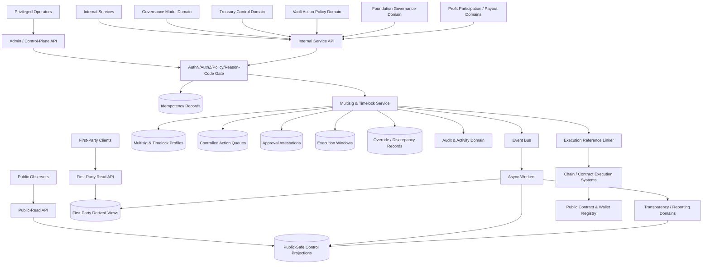
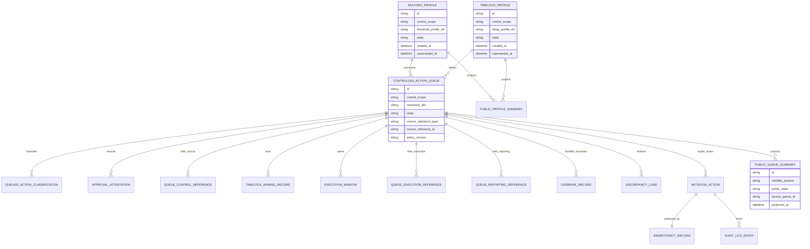
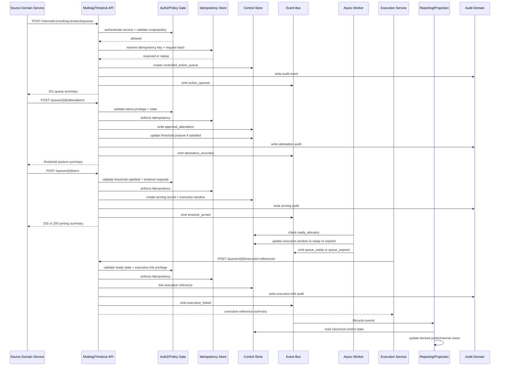

# FUZE Multisig and Timelock API Specification

## Document Metadata

- **Document Name:** `MULTISIG_AND_TIMELOCK_API_SPEC.md`
- **Document Type:** API SPEC v2 / Production-grade interface-contract specification
- **Status:** Draft for canonical API SPEC v2 approval
- **Version:** 2.0.0
- **Effective Date:** 2026-04-25
- **Last Updated:** 2026-04-25
- **Reviewed On:** 2026-04-25
- **Document Owner:** FUZE Multisig and Timelock Domain; named individual owner not yet specified in retrieved governing materials
- **Approval Authority:** FUZE platform/API governance approval workflow; explicit individual approver not yet specified
- **Review Cadence:** Quarterly and whenever governance-model posture, treasury-control posture, vault-action posture, Foundation-governance posture, payout-control posture, control-path architecture, signer/path management, chain-adjacent execution, or public-trust disclosure policy materially changes
- **Governing Layer:** API contract layer derived from the refined multisig/timelock system-spec layer
- **Parent Registry:** `API_SPEC_INDEX.md` and the FUZE API SPEC v2 Canonical File Registry
- **Upstream Semantic Registry:** `REFINED_SYSTEM_SPEC_INDEX.md`
- **Upstream API Registry:** `API_SPEC_INDEX.md`
- **Primary Audience:** Backend/API engineering, platform architecture, admin/control-plane engineering, contracts engineering, treasury and finance stakeholders, governance/control authors, security engineering, audit/compliance, public-trust/reporting authors, OpenAPI/AsyncAPI/SDK authors, QA and implementation-contract authors
- **Primary Purpose:** Define the production-grade API contract posture for FUZE multisig and timelock control surfaces, including control profiles, queued sensitive actions, threshold attestations, timelock arming, execution windows, cancellation, expiry, exceptional overrides, supersession, discrepancy handling, public-safe summaries, events, audit lineage, idempotency, and chain-adjacent execution references
- **Primary Upstream References:** `MULTISIG_AND_TIMELOCK_SPEC.md`, `GOVERNANCE_MODEL_SPEC.md`, `TREASURY_CONTROL_POLICY_SPEC.md`, `VAULT_ACTION_POLICY_SPEC.md`, `FOUNDATION_GOVERNANCE_SPEC.md`, `PROFIT_PARTICIPATION_SYSTEM_SPEC.md`, `TRANSPARENCY_MODEL_SPEC.md`, `TRANSPARENCY_REPORTING_SPEC.md`, `PUBLIC_CONTRACT_AND_WALLET_REGISTRY_SPEC.md`, `CHAIN_ARCHITECTURE_SPEC.md`, `ONCHAIN_OFFCHAIN_RESPONSIBILITY_SPEC.md`, `API_ARCHITECTURE_SPEC.md`, `PUBLIC_API_SPEC.md`, `INTERNAL_SERVICE_API_SPEC.md`, `EVENT_MODEL_AND_WEBHOOK_SPEC.md`, `IDEMPOTENCY_AND_VERSIONING_SPEC.md`, `MIGRATION_AND_BACKWARD_COMPATIBILITY_SPEC.md`, `AUDIT_LOG_AND_ACTIVITY_SPEC.md`, `SECURITY_AND_RISK_CONTROL_SPEC.md`
- **Primary Downstream Dependents:** multisig/timelock service implementation, admin control-plane tooling, internal governance/treasury/vault/Foundation/payout integrations, contract-execution orchestration, public-safe control summaries, transparency/reporting linkages, audit pipelines, discrepancy/correction workflows, OpenAPI/AsyncAPI/SDK artifacts, implementation-contract specs
- **API Surface Families Covered:** public-read, first-party authenticated read, internal service, admin/control-plane, event/async, reporting/export, chain-adjacent reference surfaces
- **API Surface Families Excluded:** raw wallet signing UX, raw signer-key custody, raw hardware-wallet operation, direct safe/contract transaction-builder UX, low-level contract ABI surfaces, generalized DAO voting APIs, unrestricted third-party webhooks
- **Canonical System Owner(s):** FUZE Multisig and Timelock Domain for multisig-profile semantics, timelock-profile semantics, queued-action lifecycle semantics, threshold-attestation and threshold-satisfaction semantics, timelock arming, ready-window, expiry, cancellation, supersession, exceptional override, discrepancy, and correction semantics
- **Canonical API Owner:** FUZE API Platform / Multisig and Timelock API family
- **Supersedes:** `MULTISIG_TIMELOCK_API_SPEC.md` and any earlier API interpretation that used the old filename, collapsed threshold satisfaction with execution readiness, treated multisig as full governance, treated timelock as a universal checkbox, or allowed emergency paths to become ordinary governance shortcuts
- **Superseded By:** None currently defined
- **Related Decision Records:** Not explicitly specified in retrieved governing materials
- **Canonical Status Note:** This document is the API-contract expression of the active refined multisig/timelock semantics. Refined system specs own semantic truth; this API spec owns interface-contract expression. Downstream OpenAPI, AsyncAPI, SDK, admin tooling, internal services, and implementation contracts MUST preserve this document's ownership, truth-class, lifecycle, idempotency, audit, public-safe exposure, and boundary rules.
- **Implementation Status:** Normative API contract draft; downstream implementations must align before production readiness approval
- **Approval Status:** Pending explicit FUZE approval workflow
- **Change Summary:** Upgrades the earlier v1 `MULTISIG_TIMELOCK_API_SPEC.md` into the canonical API SPEC v2 filename and structure; formalizes public/first-party/internal/admin/event/reporting/chain-adjacent surface families; strengthens refined-semantics hierarchy; clarifies truth classes, lifecycle separation, idempotency, audit, public-safe read models, route families, error/status behavior, conflict resolution, and production readiness tests

## Purpose

This API specification defines the production-grade interface contract for FUZE multisig and timelock APIs.

The API exists to express, not redefine, the refined multisig/timelock semantic model. It provides stable route-family, request, response, status, error, idempotency, event, audit, projection, and migration rules for:

- multisig control profiles;
- timelock profiles;
- controlled action queues;
- approval attestations;
- threshold-satisfaction posture;
- timelock arming;
- execution-window readiness and expiry;
- execution-reference linkage;
- reporting-reference linkage;
- cancellation, pause, escalation, exceptional override, supersession, and discrepancy workflows;
- public-safe control-profile and queued-action summaries.

This API specification is not a wallet-operations guide. It is a governing API document for shared authorization and delayed execution control surfaces inside FUZE.

## Scope

This specification governs API contracts for:

1. creation, activation, restriction, supersession, archival, and reading of multisig profiles;
2. creation, activation, restriction, supersession, archival, and reading of timelock profiles;
3. controlled action queue creation and classification;
4. threshold attestation recording and threshold-satisfaction state;
5. timelock arming, ready-window creation, expiry, closure, and supersession;
6. execution-reference and reporting-reference linkage;
7. admin/control-plane approval, cancellation, pause, escalation, exceptional override, supersession, and discrepancy resolution;
8. public-safe read models for published control profile and queued-action summaries;
9. first-party authenticated read models where policy permits actor-specific visibility;
10. internal events and async processing for lifecycle changes;
11. audit, traceability, observability, correlation, rate limiting, idempotency, versioning, migration, and compatibility behavior.

## Out of Scope

This API spec does not govern:

- final signer identities, signer rosters, exact signer counts, or exact threshold numbers;
- exact timelock delay durations unless exposed through approved profile summaries;
- raw signer private-key custody or hardware-wallet procedures;
- low-level safe transaction encoding or direct contract ABI details;
- treasury category meaning, Foundation principal-protection meaning, vault allowed-behavior meaning, payout eligibility truth, or governance decision truth;
- end-user wallet-signing UI flows;
- generalized DAO voting surfaces;
- public transparency-report authorship semantics;
- third-party outbound webhooks unless a later approved contract explicitly creates them.

## Design Goals

1. Preserve refined multisig/timelock semantics at the interface layer.
2. Make threshold approval, timelock arming, ready-for-execution, and executed-reference linkage distinguishable in every API contract.
3. Prevent route, schema, state, public-exposure, and implementation drift.
4. Support bounded public trust without exposing unsafe operational detail.
5. Make privileged control-plane actions explicit, least-privilege, reason-coded, idempotent, and audited.
6. Preserve separation between governance approval, control staging, and downstream execution.
7. Support OpenAPI, AsyncAPI, SDK, QA, audit, migration, and implementation-contract derivation.

## Non-Goals

This API spec does not attempt to:

- make multisig a full governance system;
- make timelock a blanket checkbox for every action;
- optimize for frontend or operator convenience at the expense of control integrity;
- replace governance, treasury, Foundation, vault, payout, reporting, audit, chain, or contract-execution specs;
- disclose operationally unsafe signer-path details publicly;
- define final smart-contract code or storage layout;
- provide a raw endpoint dump without governing contract rules.

## Core Principles

### Refined-Semantics Preservation Principle

Refined system specifications own semantic truth. This API spec owns how that truth is expressed across API surfaces. No route, response field, SDK method, admin action, worker job, public summary, event payload, or implementation-contract optimization may reinterpret multisig/timelock semantics.

### Shared Authorization Is Not Governance

Multisig is a shared-authorization mechanism for sensitive actions. It can enforce or stage decisions, but it does not decide why an action is legitimate. Governance and source domains own action meaning and approval posture.

### Timelock Is Delayed Execution

Timelock introduces a review and observation window for selected high-impact actions. Timelock is not equivalent to threshold satisfaction and is not final execution.

### Lifecycle Separation Principle

The API MUST preserve the distinct states of queue creation, threshold pending, threshold satisfied, timelock armed, ready for execution, execution reference linked, cancellation, expiry, pause, supersession, and closure.

### Public-Safe Disclosure Principle

Public and first-party read APIs MAY expose structural control posture and material queued-action summaries where policy allows, but MUST NOT expose unsafe operational security details or let public summaries become write owners of control truth.

### Exception Narrowness Principle

Emergency and exceptional override routes MUST remain narrow, protective, audited, reason-coded, post-reviewed, and policy-constrained. They MUST NOT become ordinary governance convenience routes.

## Canonical Definitions

- **Multisig:** The shared-authorization mechanism requiring a defined threshold of valid signers through a known control path for sensitive FUZE actions.
- **Timelock:** The delayed-execution mechanism that introduces a policy-defined interval between threshold satisfaction and execution readiness.
- **Multisig Profile:** Canonical API resource representing a thresholded control profile for a control scope.
- **Timelock Profile:** Canonical API resource representing delay and execution-window rules for a controlled action class or scope.
- **Controlled Action Queue:** Canonical API resource representing a staged sensitive action and its control lifecycle.
- **Approval Attestation:** A durable record that an approved attestor or signer-path participant contributed to threshold posture.
- **Threshold Satisfaction:** State in which required approval threshold has been met; not equivalent to timelock arming, ready-for-execution, or executed.
- **Timelock Arming:** Scheduling a threshold-satisfied queue into delayed-execution state and creating an execution window.
- **Execution Window:** Bounded interval in which an armed action is executable and after which it may expire.
- **Execution Reference:** Link to downstream contract, operational, chain, or service execution artifact; not the owner of queue truth.
- **Reporting Reference:** Link to transparency, public-registry, governance, treasury, Foundation, vault, payout, or other reporting artifact; not an ownership transfer.
- **Exceptional Override:** Narrow emergency/control treatment that may alter ordinary queue/delay path under explicit policy and post-review requirements.
- **Discrepancy Case:** Review/remediation resource for stale, invalid, conflicting, misclassified, or misreported multisig/timelock state.

## Truth Class Taxonomy

The API MUST preserve these truth classes:

1. **Semantic truth:** refined multisig/timelock system semantics.
2. **API contract truth:** route families, resource contracts, request/response/error/status behavior, idempotency, and versioning defined here.
3. **Governance truth:** upstream decision, policy, proposal, approval, and scope meaning.
4. **Treasury/Foundation/vault/payout truth:** source-domain policy meaning for protected capital, vault behavior, Foundation stewardship, and payout control.
5. **Control truth:** multisig profiles, timelock profiles, controlled queues, attestations, arming records, execution windows, cancellations, pauses, overrides, supersessions, and discrepancy cases.
6. **Execution truth:** downstream contract/service/chain execution state linked by explicit reference.
7. **Audit truth:** immutable activity and audit records sourced by this API family.
8. **Runtime truth:** jobs, retries, worker state, projection freshness, queue expiry processing, and remediation progress.
9. **Read-model truth:** derived public, first-party, internal status, reporting, export, and discrepancy views.
10. **Presentation truth:** labels and explanatory summaries displayed to users or stakeholders.
11. **Public-read truth:** public-safe interpretation of control posture after policy filtering, correction, and supersession rules.

Derived, runtime, reporting, public-read, and presentation truth MUST NOT become canonical mutation truth.

## Architectural Position in the Spec Hierarchy

This API spec sits below:

- `REFINED_SYSTEM_SPEC_INDEX.md`;
- `MULTISIG_AND_TIMELOCK_SPEC.md`;
- platform architecture, boundary, ownership, data ownership, and on-chain/off-chain responsibility specs;
- governance, treasury-control, vault-action, Foundation-governance, profit-participation, transparency, reporting, chain, and registry refined specs.

It sits alongside or above:

- machine-readable OpenAPI/AsyncAPI artifacts;
- SDK method design;
- service implementation contracts;
- admin UI route wiring;
- projection/export contracts;
- QA test plans;
- operational runbooks for queue remediation and discrepancy handling.

## Upstream Semantic Owners

The upstream semantic owner for multisig-profile semantics, timelock-profile semantics, threshold-attestation meaning, queue lifecycle, execution-window semantics, override restraint, correction, discrepancy, and supersession is `MULTISIG_AND_TIMELOCK_SPEC.md`.

Adjacent semantic owners include:

- `GOVERNANCE_MODEL_SPEC.md` for why actions are governance-sensitive and whether decisions are approved;
- `TREASURY_CONTROL_POLICY_SPEC.md` for treasury-sensitive permission and reserve-category control meaning;
- `VAULT_ACTION_POLICY_SPEC.md` for allowed vault behavior and category-sensitive vault actions;
- `FOUNDATION_GOVERNANCE_SPEC.md` for Foundation stewardship and principal-protection posture;
- `PROFIT_PARTICIPATION_SYSTEM_SPEC.md` for payout-cycle and holder-facing payout control truth;
- `CHAIN_ARCHITECTURE_SPEC.md` and `ONCHAIN_OFFCHAIN_RESPONSIBILITY_SPEC.md` for chain/off-chain boundaries;
- `TRANSPARENCY_MODEL_SPEC.md`, `TRANSPARENCY_REPORTING_SPEC.md`, and public registry specs for public-safe explanations and reporting.

## API Surface Families

### Public-Read Surface

Public-read APIs expose only approved, bounded, public-safe summaries of control profiles and queued-action posture. They MUST be stable, conservative, cacheable where safe, and filtered for operational security.

### First-Party Authenticated Surface

First-party authenticated read APIs MAY expose actor-visible control summaries where policy allows. They MUST NOT expose privileged queue mutation paths or sensitive signer details.

### Internal Service Surface

Internal service APIs create profiles, queues, attestations, arming records, execution references, reporting references, and discrepancy records. They require service identity, least privilege, idempotency, correlation, audit, and state-machine enforcement.

### Admin / Control-Plane Surface

Admin/control-plane APIs perform privileged actions such as approve-for-queue, cancel, pause, escalate, exceptional override, supersede, discrepancy resolution, and profile restriction. They require privileged operator identity, reason code, policy version, operator note or structured justification, idempotency, correlation, and critical audit logging.

### Event / Async Surface

Event surfaces publish lifecycle changes to internal consumers. Async processors update execution windows, expiry, derived views, reporting references, and discrepancy state. Events are internal by default.

### Reporting / Export Surface

Reporting/export surfaces produce derived views and export artifacts. They MUST remain subordinate to canonical queue/profile/window truth and MUST preserve source references, correction lineage, and supersession visibility.

### Chain-Adjacent Surface

Chain-adjacent APIs link to contract ownership, transaction, timelock-controller, multisig-safe, or execution artifacts. They MUST NOT treat chain transaction history alone as full multisig/timelock historical meaning.

## System / API Boundaries

This API governs interface expression for:

- control-profile truth;
- queued-action truth;
- threshold-attestation truth;
- timelock arming and execution-window truth;
- queue lifecycle truth;
- override/discrepancy/supersession truth;
- public-safe control summaries.

This API does not own:

- upstream governance approval truth;
- treasury, Foundation, vault, or payout source-domain truth;
- raw signer-key custody truth;
- final contract-execution truth;
- public transparency-report authorship truth;
- presentation-only UI wording.

## Adjacent API Boundaries

- `GOVERNANCE_MODEL_API_SPEC.md` owns governance action/proposal/policy approval APIs. Multisig/timelock APIs receive explicit references; they do not create governance approval meaning.
- `TREASURY_CONTROL_POLICY_API_SPEC.md` owns treasury policy classification, category restriction, and treasury action permission APIs. Multisig/timelock APIs stage control execution after treasury posture is known.
- `VAULT_ACTION_POLICY_API_SPEC.md` owns what vault actions are meaningful and allowed. Multisig/timelock APIs enforce shared authorization/delay where vault sensitivity requires it.
- `FOUNDATION_GOVERNANCE_API_SPEC.md` owns Foundation stewardship and principal-protection treatment. Multisig/timelock APIs apply stronger control treatment where referenced.
- `PROFIT_PARTICIPATION_API_SPEC.md` and payout specs own payout eligibility/funding/execution semantics. Multisig/timelock APIs stage payout-critical control actions.
- `PUBLIC_CONTRACT_AND_WALLET_REGISTRY_API_SPEC.md` owns public registry publication and wallet/contract registry semantics. Multisig/timelock APIs may link public-safe control references.
- `TRANSPARENCY_MODEL_API_SPEC.md` and `TRANSPARENCY_REPORTING_API_SPEC.md` own public explanation/reporting artifacts. Multisig/timelock APIs provide source linkage, not final public report meaning.
- `CHAIN_ARCHITECTURE_API_SPEC.md` owns chain architecture and contract-execution posture. Multisig/timelock APIs link execution artifacts without redefining chain truth.
- `AUDIT_LOG_AND_ACTIVITY_API_SPEC.md` owns canonical audit-log storage and reporting, while this API family MUST source the relevant audit events.

## Conflict Resolution Rules

1. Active refined system specs win over older v1 API material.
2. Higher platform boundary and ownership specs win on top-level ownership questions.
3. Source-domain refined specs win on governance, treasury, Foundation, vault, payout, transparency, and chain meaning.
4. This API spec wins on route-family, request, response, error, status, idempotency, event, audit, projection, and API-surface expression for multisig/timelock control truth.
5. Public summaries, admin panels, wallet UIs, exports, dashboards, SDK wrappers, and cache projections never win over canonical control records.
6. Ambiguous cases default to the more conservative, trust-preserving, least-privilege, non-mutating interpretation until resolved by approved governance/spec update.
7. If chain execution data conflicts with off-chain queue history, the discrepancy MUST be opened and resolved with preserved lineage rather than silently overwriting either side.
8. If an emergency-path request conflicts with normal policy, emergency narrowness and post-review obligations MUST be enforced.

## Default Decision Rules

- Sensitive actions default to requiring shared authorization.
- High/critical, Foundation-, payout-, reserve-, trust-, and control-path-sensitive actions default to stronger multisig/timelock treatment.
- Timelock applies where delay materially improves trust, observability, review, or recovery opportunity.
- Queue existence is not threshold satisfaction.
- Threshold satisfaction is not timelock arming.
- Timelock arming is not ready-for-execution until the ready window is reached.
- Ready-for-execution is not execution.
- Execution-reference linkage is not final public reporting.
- Emergency override defaults to containment and protection, not repurposing capital or bypassing ordinary governance for convenience.
- Missing control scope, missing policy version, missing profile reference, missing state precondition, missing reason code, or missing idempotency key MUST fail closed.

## Roles / Actors / API Consumers

- **Public observers:** may read public-safe control summaries.
- **Authenticated FUZE users:** may read first-party-safe summaries where policy allows.
- **First-party frontend:** consumes public/first-party read surfaces only; does not own control truth.
- **Admin/control-plane operators:** may request privileged mutations under role, policy, reason-code, and audit constraints.
- **Internal services:** may create/link/read canonical records under service identity and explicit privilege.
- **Governance/treasury/Foundation/vault/payout services:** provide upstream approval and domain references.
- **Contracts/chain execution services:** execute or observe chain-adjacent actions and provide execution references.
- **Audit/observability systems:** consume mutation, event, and correlation data.
- **Reporting/transparency services:** consume public-safe references and derived projection inputs.
- **OpenAPI/AsyncAPI/SDK generators:** derive contracts while preserving route-family and truth-class separation.

## Resource / Entity Families

Canonical API resources:

- `multisig_profile`
- `timelock_profile`
- `controlled_action_queue`
- `queued_action_classification`
- `approval_attestation`
- `queue_control_reference`
- `timelock_arming_record`
- `execution_window`
- `queue_execution_reference`
- `queue_reporting_reference`
- `override_record`
- `multisig_timelock_discrepancy_case`
- `multisig_timelock_mutation_action`
- `idempotency_record`
- `audit_log_entry` as domain-sourced audit output

Derived resources:

- `public_control_profile_summary`
- `public_queued_action_summary`
- `first_party_control_summary`
- `internal_queue_status_view`
- `discrepancy_dashboard_view`
- `reporting_export_artifact`

## Ownership Model

The Multisig and Timelock API family owns API contracts for canonical control resources and lifecycle mutations. It MUST NOT own upstream business approval meaning, raw contract execution, signer private keys, public transparency-report final text, or product UI presentation.

## Authority / Decision Model

Authority MUST be evaluated in this order:

1. Identify upstream source-domain action and approval reference.
2. Determine action category, control scope, sensitivity tier, and policy version.
3. Resolve required multisig profile and timelock profile posture.
4. Validate caller route-family authority.
5. Validate state-machine preconditions.
6. Enforce idempotency and replay safety.
7. Write canonical control record or reject with a deterministic error.
8. Emit events and audit.
9. Refresh derived views asynchronously where applicable.
10. Link downstream execution/reporting references without transferring ownership.

Signer participation authorizes through a control profile; it does not define policy meaning independently.

## Authentication Model

- Public-read APIs MAY be unauthenticated but MUST be rate-limited and disclosure-filtered.
- First-party authenticated APIs require valid FUZE session and actor visibility checks.
- Internal APIs require service identity, mTLS or equivalent service-auth posture, explicit scope, and correlation identity.
- Admin APIs require human operator identity, privileged role, active session, step-up authentication where policy requires, reason code, and audit linkage.
- Chain-adjacent callbacks or observers MUST be normalized as input/reference truth until validated by the owner domain.

## Authorization / Scope / Permission Model

Authorization MUST evaluate:

- route family;
- caller identity and trust class;
- service or operator scopes;
- workspace/organization scope where an internal admin surface is scoped;
- action category and sensitivity tier;
- control scope;
- source-domain policy version;
- current resource state;
- required profile references;
- public/first-party/internal visibility posture;
- reason code and remediation context for privileged actions.

Required permissions include:

- `multisig_timelock.profile.create`
- `multisig_timelock.profile.read`
- `multisig_timelock.profile.restrict`
- `multisig_timelock.queue.create`
- `multisig_timelock.queue.read`
- `multisig_timelock.queue.attest`
- `multisig_timelock.queue.arm`
- `multisig_timelock.queue.cancel`
- `multisig_timelock.queue.pause`
- `multisig_timelock.queue.escalate`
- `multisig_timelock.queue.override`
- `multisig_timelock.queue.supersede`
- `multisig_timelock.execution.link`
- `multisig_timelock.reporting.link`
- `multisig_timelock.discrepancy.resolve`

Access failures on mutation routes MUST fail closed.

## Entitlement / Capability-Gating Model

Entitlements do not create multisig/timelock authority. Product subscription, user capability, community status, investor status, or public registry visibility MUST NOT become signer authority, queue mutation authority, profile ownership, or emergency override authority.

Entitlement MAY affect whether a user can view a first-party-safe derived summary, but only after policy visibility checks.

## API State Model

### Multisig Profile States

- `draft`
- `active`
- `restricted`
- `superseded`
- `archived`

### Timelock Profile States

- `draft`
- `active`
- `restricted`
- `superseded`
- `archived`

### Controlled Action Queue States

- `draft`
- `queued`
- `threshold_pending`
- `threshold_satisfied`
- `timelock_armed`
- `ready_for_execution`
- `executed_reference_linked`
- `cancelled`
- `expired`
- `paused`
- `superseded`
- `closed`

### Execution Window States

- `scheduled`
- `ready`
- `expired`
- `closed`
- `superseded`

### Override States

- `declared`
- `containment_active`
- `post_review_pending`
- `closed`
- `superseded`

### Discrepancy States

- `opened`
- `under_review`
- `resolved`
- `failed`
- `closed`

## Lifecycle / Workflow Model

1. A source domain identifies a sensitive action.
2. Governance/source-domain policy classifies the action and supplies a source reference.
3. Internal service creates a controlled action queue with control scope, sensitivity tier, profile references, source reference, policy version, and idempotency key.
4. The queue enters `queued` or `threshold_pending` depending on validation.
5. Approval attestations are recorded until threshold satisfaction.
6. If no timelock is required, the queue may become ready under policy.
7. If timelock is required, the timelock is armed and an execution window is created.
8. Worker/runtime processes update execution-window readiness and expiry.
9. Downstream execution service executes through approved path and links execution reference.
10. Reporting/transparency references are linked where policy requires.
11. Public-safe projections refresh asynchronously.
12. Cancellation, pause, escalation, exceptional override, supersession, discrepancy, and correction paths preserve lineage.

## Architecture Diagram — Mermaid flowchart

## Data Design — Mermaid Diagram

Derived summaries in this diagram are projections only. They are not canonical write owners.

## Flow View

### Standard Controlled Action Flow

1. Source-domain service submits action reference, control scope, sensitivity tier, policy version, requested visibility posture, and idempotency key.
2. API authenticates the service, evaluates scope permission, validates source-domain reference, and checks profile compatibility.
3. API creates a controlled action queue or returns idempotent replay result.
4. API records initial audit event and emits `multisig_timelock.action_queued`.
5. Attestation API records valid approval attestations.
6. Threshold engine updates queue to `threshold_satisfied` only after deterministic threshold evaluation.
7. If timelock applies, arming API creates arming record and execution window.
8. Worker transitions execution window from `scheduled` to `ready` when ready timestamp is reached.
9. Execution service links execution reference only when state allows.
10. Reporting service links public-safe reporting/reference artifacts.
11. Projection worker refreshes public/first-party/internal derived views.

### Failure and Retry Flow

1. Duplicate mutation with same idempotency key and same request hash returns original result.
2. Duplicate key with different request hash returns idempotency conflict.
3. Missing profile, invalid state, threshold-not-satisfied, timelock-not-armed, or unauthorized source reference fails with deterministic problem response.
4. Worker failures leave canonical queue state intact and expose retryable runtime status internally.
5. Projection lag does not change canonical state.

### Admin / Operator Flow

1. Operator authenticates with privileged session.
2. API evaluates role, route permission, state precondition, policy version, reason code, and operator note.
3. Mutation action is idempotency-protected.
4. Queue is cancelled, paused, escalated, superseded, or moved into exceptional override path with preserved lineage.
5. Critical audit event and lifecycle event are emitted.
6. Post-review is mandatory for exceptional overrides.

### Emergency Flow

1. Emergency request identifies protective need, threat class, target queue/profile/reference, expected blast-radius, source-domain linkage, and reason code.
2. API validates that exception treatment is allowed and cannot be replaced by ordinary queue/cancel/pause/escalate path.
3. Delay may be reduced or bypassed only if delay materially worsens risk.
4. Override record enters `declared` or `containment_active`.
5. Post-review must close or supersede the override with reporting/audit linkage.

## Data Flows — Mermaid sequenceDiagram

## Request Model

All mutation requests MUST include:

- `Idempotency-Key` header;
- `X-Correlation-ID` or platform equivalent;
- authenticated caller identity;
- route-family appropriate scope;
- content type `application/json`;
- `policy_version` where policy-sensitive;
- reason code and operator note for admin/control-plane actions;
- source-domain reference for controlled actions;
- control scope and sensitivity tier for queue creation;
- profile references where required;
- request timestamp or server-assigned request time.

Frontend-authored control truth MUST NOT be accepted as authoritative input. Public APIs MUST NOT accept mutation requests.

## Response Model

Successful mutation responses MUST include:

- stable resource identifier;
- resource state;
- state transition result;
- correlation ID;
- idempotency result indicator where safe;
- timestamps;
- profile/queue/window summaries where applicable;
- accepted async operation reference where finalization is asynchronous;
- derived-view refresh note where public/first-party projections may lag.

Read responses MUST distinguish:

- canonical internal control truth;
- public-safe summary;
- first-party-safe summary;
- derived reporting/export view;
- execution reference;
- reporting reference;
- superseded or corrected lineage.

## Error / Result / Status Model

Errors use structured problem details with:

- `type`
- `title`
- `status`
- `code`
- `detail`
- `instance`
- `correlation_id`
- optional `retry_after`
- optional `operation_id`
- optional `safe_public_detail`

Required error classes:

- `MULTISIG_TIMELOCK_PERMISSION_DENIED`
- `MULTISIG_TIMELOCK_OPERATOR_PERMISSION_DENIED`
- `MULTISIG_TIMELOCK_SERVICE_PERMISSION_DENIED`
- `MULTISIG_TIMELOCK_AUDIENCE_PERMISSION_DENIED`
- `MULTISIG_TIMELOCK_PROFILE_REQUIRED`
- `MULTISIG_TIMELOCK_PROFILE_STATE_INVALID`
- `MULTISIG_TIMELOCK_QUEUE_STATE_INVALID`
- `MULTISIG_TIMELOCK_THRESHOLD_NOT_SATISFIED`
- `MULTISIG_TIMELOCK_TIMELOCK_REQUIRED`
- `MULTISIG_TIMELOCK_ARMING_CONFLICT`
- `MULTISIG_TIMELOCK_EXECUTION_WINDOW_NOT_READY`
- `MULTISIG_TIMELOCK_EXECUTION_WINDOW_EXPIRED`
- `MULTISIG_TIMELOCK_EXCEPTION_NOT_ALLOWED`
- `MULTISIG_TIMELOCK_CANCELLATION_RESTRICTED`
- `MULTISIG_TIMELOCK_SUPERSESSION_CONFLICT`
- `MULTISIG_TIMELOCK_IDEMPOTENCY_KEY_REQUIRED`
- `MULTISIG_TIMELOCK_IDEMPOTENCY_CONFLICT`
- `MULTISIG_TIMELOCK_REQUEST_INVALID`
- `MULTISIG_TIMELOCK_REQUEST_UNPROCESSABLE`
- `MULTISIG_TIMELOCK_RATE_LIMITED`
- `MULTISIG_TIMELOCK_STORAGE_UNAVAILABLE`
- `MULTISIG_TIMELOCK_EXECUTION_UNAVAILABLE`
- `MULTISIG_TIMELOCK_RECONCILIATION_UNAVAILABLE`

Public errors MUST be disclosure-safe and MUST NOT reveal sensitive signer/control-path details.

## Idempotency / Retry / Replay Model

The following mutation families MUST be idempotent:

- profile creation;
- profile state transitions;
- queue creation;
- approval-attestation recording;
- timelock arming;
- reporting-reference attachment;
- execution-reference linking;
- approve-for-queue;
- cancel;
- pause;
- escalate;
- exceptional override;
- supersede;
- discrepancy creation/resolution.

Idempotency records MUST store key, route family, actor/service identity, request hash, semantic target, terminal result, correlation ID, and expiry. Same key and same request returns prior result. Same key with different semantic request fails with conflict. Retryable dependency failures MUST NOT create duplicate queues, duplicate attestations, duplicate arming records, duplicate override records, or conflicting execution windows.

## Rate Limit / Abuse-Control Model

- Public-read APIs MUST apply IP/user-agent/device/network-aware rate limiting and abuse detection.
- First-party reads MUST apply actor/session-aware rate limits.
- Internal/admin mutation routes MUST apply stricter per-actor, per-service, per-target, and per-sensitivity controls.
- Repeated failed privileged mutations MUST alert security/operations.
- Emergency override attempts MUST be anomaly-monitored and audit-reviewed.
- Public rate limiting MUST avoid exposing whether hidden internal queues exist.

## Endpoint / Route Family Model

### Public-Read APIs

- `GET /v1/multisig-timelock/profiles`
- `GET /v1/multisig-timelock/profiles/{profile_id}`
- `GET /v1/multisig-timelock/queues`
- `GET /v1/multisig-timelock/queues/{controlled_action_queue_id}`
- `GET /v1/multisig-timelock/control-summary`

Public route responses MUST be public-safe projections.

### First-Party Authenticated Read APIs

- `GET /v1/multisig-timelock/me/queues`
- `GET /v1/multisig-timelock/me/control-references`

These routes expose only actor-visible derived summaries.

### Internal Service APIs

- `POST /internal/v1/multisig-timelock/profiles/multisig`
- `POST /internal/v1/multisig-timelock/profiles/timelock`
- `GET /internal/v1/multisig-timelock/profiles/{profile_id}`
- `POST /internal/v1/multisig-timelock/queues`
- `GET /internal/v1/multisig-timelock/queues/{controlled_action_queue_id}`
- `POST /internal/v1/multisig-timelock/queues/{controlled_action_queue_id}/attestations`
- `POST /internal/v1/multisig-timelock/queues/{controlled_action_queue_id}/arm`
- `POST /internal/v1/multisig-timelock/queues/{controlled_action_queue_id}/execution-references`
- `POST /internal/v1/multisig-timelock/queues/{controlled_action_queue_id}/reporting-references`
- `POST /internal/v1/multisig-timelock/discrepancies`

### Admin / Control-Plane APIs

- `POST /admin/v1/multisig-timelock/queues/{controlled_action_queue_id}/approve-for-queue`
- `POST /admin/v1/multisig-timelock/queues/{controlled_action_queue_id}/cancel`
- `POST /admin/v1/multisig-timelock/queues/{controlled_action_queue_id}/pause`
- `POST /admin/v1/multisig-timelock/queues/{controlled_action_queue_id}/escalate`
- `POST /admin/v1/multisig-timelock/queues/{controlled_action_queue_id}/exceptional-override`
- `POST /admin/v1/multisig-timelock/queues/{controlled_action_queue_id}/supersede`
- `POST /admin/v1/multisig-timelock/profiles/{profile_id}/restrict`
- `POST /admin/v1/multisig-timelock/discrepancies/{case_id}/resolve`

Admin routes MUST NOT be directly exposed as public or first-party application routes.

## Public API Considerations

Public APIs MUST:

- expose only approved public-safe control summaries;
- explain material control posture without operationally unsafe detail;
- represent superseded, cancelled, expired, or corrected queues accurately;
- include source/reporting references only where approved for public exposure;
- avoid implying execution readiness when only threshold or queue state exists;
- avoid exposing signer lists, sensitive thresholds, internal notes, private source references, incident details, or unreviewed emergency information unless explicitly approved.

## First-Party Application API Considerations

First-party applications may display bounded control status, but MUST NOT:

- mint queue truth;
- author canonical profile state;
- bypass admin/control-plane checks;
- infer readiness from presentation labels;
- expose internal-only source references;
- let user entitlements become mutation authority.

## Internal Service API Considerations

Internal service APIs MUST:

- require service identity;
- be least-privilege and scope-specific;
- validate source-domain references;
- enforce state-machine transitions;
- preserve idempotency and audit;
- emit lifecycle events;
- reject unsupported route-family crossover;
- never become hidden broad-write shortcuts.

## Admin / Control-Plane API Considerations

Admin/control-plane APIs MUST:

- require privileged operator identity;
- require reason codes;
- require operator note or structured justification;
- require policy version and source reference where relevant;
- enforce state preconditions;
- generate critical audit entries;
- emit lifecycle events;
- preserve post-review requirements for exceptional overrides;
- fail closed when authorization, policy, state, or idempotency is ambiguous.

## Event / Webhook / Async API Considerations

Canonical internal event families SHOULD include:

- `multisig_timelock.multisig_profile_created`
- `multisig_timelock.timelock_profile_created`
- `multisig_timelock.profile_restricted`
- `multisig_timelock.profile_superseded`
- `multisig_timelock.action_queued`
- `multisig_timelock.attestation_recorded`
- `multisig_timelock.threshold_satisfied`
- `multisig_timelock.timelock_armed`
- `multisig_timelock.execution_window_ready`
- `multisig_timelock.execution_window_expired`
- `multisig_timelock.execution_linked`
- `multisig_timelock.reporting_linked`
- `multisig_timelock.queue_approved`
- `multisig_timelock.queue_cancelled`
- `multisig_timelock.queue_paused`
- `multisig_timelock.queue_escalated`
- `multisig_timelock.override_declared`
- `multisig_timelock.override_closed`
- `multisig_timelock.queue_superseded`
- `multisig_timelock.discrepancy_opened`
- `multisig_timelock.discrepancy_resolved`

External webhooks are not provided by default. Any future external control-status webhook MUST be separately approved, public-safe, narrow, signed, replay-protected, rate-limited, and versioned.

## Chain-Adjacent API Considerations

Chain-adjacent references MAY include contract address, chain ID, safe/contract reference, transaction hash, timelock-controller reference, execution transaction reference, block number, confirmation state, and explorer-safe public reference.

Rules:

- chain data is execution/reference truth unless validated and linked into canonical queue truth;
- chain transaction success does not erase queue, approval, arming, expiry, or exception history;
- off-chain queue state and chain execution state discrepancies MUST open discrepancy cases;
- public chain references MUST be filtered for disclosure safety;
- raw contract ABI and low-level transaction encoding remain out of scope.

## Data Model / Storage Support Implications

Canonical storage SHOULD include:

- `multisig_profiles`
- `timelock_profiles`
- `controlled_action_queues`
- `queued_action_classifications`
- `approval_attestations`
- `queue_control_references`
- `timelock_arming_records`
- `execution_windows`
- `queue_execution_references`
- `queue_reporting_references`
- `override_records`
- `multisig_timelock_discrepancy_cases`
- `multisig_timelock_mutation_actions`
- `idempotency_records`

Derived stores MAY include public summaries, first-party summaries, internal dashboards, reporting exports, and discrepancy views. Derived stores MUST include source references, projection timestamp, projection version, and correction/supersession awareness.

## Read Model / Projection / Reporting Rules

- Public-safe summaries are derived views.
- Internal queue and readiness dashboards are derived views.
- Reporting/export artifacts are derived views unless governed by their source spec.
- Public summaries MUST NOT overtake canonical profile, queue, attestation, arming, execution-window, override, or discrepancy records.
- Projection lag MUST be visible internally and reconciled.
- Corrections and supersessions MUST preserve historical meaning.
- Reporting references remain links, not ownership transfers.

## Security / Risk / Privacy Controls

The API MUST protect against:

- unauthorized profile mutation;
- unauthorized queue mutation;
- unauthorized attestation;
- silent history rewrite;
- threshold confusion;
- readiness confusion;
- control-path drift;
- emergency-path abuse;
- public unsafe disclosure;
- signer/control-path operational leakage;
- cross-domain ownership collapse;
- chain/off-chain mismatch;
- idempotency replay attacks;
- privilege escalation through internal service routes;
- stale projection misinterpretation.

Security-sensitive data MUST be excluded from public responses unless explicitly approved.

## Audit / Traceability / Observability Requirements

Every mutation MUST capture:

- actor/service identity;
- route family;
- target resource;
- action type;
- before/after state summary where applicable;
- reason code for admin/control actions;
- policy version;
- idempotency key reference;
- correlation ID;
- trace ID;
- source-domain reference;
- result status;
- emitted event ID;
- timestamp.

Observability MUST include queue lifecycle metrics, stuck queue detection, threshold pending age, timelock ready/expired counts, exceptional override counts, discrepancy counts, projection freshness, event delivery health, idempotency conflict rate, and privileged mutation anomaly alerts.

## Failure Handling / Edge Cases

- Queue exists but threshold not satisfied: MUST NOT be ready or executable.
- Threshold satisfied but timelock required and not armed: MUST remain incomplete.
- Timelock armed but ready time not reached: MUST NOT be ready.
- Execution window expired: execution reference MUST NOT be linked as ordinary success without explicit remediation.
- Chain execution observed without valid queue: open discrepancy case.
- Public summary lags internal state: summary remains derived and must reconcile.
- Signer/control-path change materially alters trust: require governance-sensitive treatment and often timelock.
- Emergency action declared: require containment framing and post-review.
- Duplicate attestation: reject or idempotently return prior result according to attestation identity rules.
- Conflicting source-domain references: reject and open discrepancy if already persisted.
- Missing reason code on admin mutation: fail closed.

## Migration / Versioning / Compatibility / Deprecation Rules

The canonical route-family version is `/v1`, `/internal/v1`, and `/admin/v1` until explicitly superseded.

Breaking changes include:

- changing lifecycle state meanings;
- collapsing threshold/timelock/ready/execution states;
- removing source-domain references;
- weakening public-safe disclosure filtering;
- changing idempotency semantics;
- changing override or supersession meaning;
- removing audit/correlation fields from mutation responses;
- renaming resources in a way that breaks SDK or OpenAPI clients.

Migration from `MULTISIG_TIMELOCK_API_SPEC.md` to `MULTISIG_AND_TIMELOCK_API_SPEC.md` MUST preserve resource semantics and may introduce canonical aliases, deprecation metadata, or compatibility adapters. The old filename should be treated as historical/v1 material, not a separate domain.

## OpenAPI / AsyncAPI / SDK Derivation Rules

OpenAPI artifacts MUST preserve:

- public vs first-party vs internal vs admin route separation;
- canonical resource names;
- lifecycle enum values;
- idempotency header requirements;
- correlation fields;
- structured error codes;
- public-safe vs canonical internal response schemas;
- admin reason-code requirements;
- response distinction between accepted async operation and final outcome.

AsyncAPI artifacts MUST preserve event names, payload minimums, versioning, correlation IDs, source resource IDs, actor/service identity class, policy version, and replay/deduplication requirements.

SDKs MUST NOT expose admin/internal mutation methods through public client packages.

## Implementation-Contract Guardrails

Implementation layers MUST NOT:

- store canonical queue truth only inside event payloads;
- let frontend labels become lifecycle state;
- accept user-supplied threshold state as truth;
- infer ready-for-execution from threshold satisfaction;
- infer execution from chain observation without owner-domain linkage;
- silently delete or rewrite cancelled, expired, overridden, or superseded queues;
- expose sensitive signer-path details publicly;
- share idempotency scope across unrelated route families;
- bypass policy/reference validation for internal services;
- collapse emergency override into normal admin action.

## Downstream Execution Staging

Implementation should stage delivery as:

1. canonical resource schema and state machine;
2. internal create/read/attest/arm/link APIs;
3. idempotency, audit, and event pipeline;
4. admin control-plane actions;
5. projection generation and public-safe read APIs;
6. discrepancy/remediation flows;
7. OpenAPI/AsyncAPI/SDK generation;
8. contract tests and migration compatibility checks;
9. production readiness review.

## Required Downstream Specs / Contract Layers

- OpenAPI spec for public, first-party, internal, and admin REST routes.
- AsyncAPI spec for lifecycle events.
- Service implementation contract for queue state machine and idempotency.
- Admin-control contract for reason codes and policy versions.
- Public projection contract for disclosure filtering.
- Audit event contract for activity logging.
- Chain-adjacent linkage contract for execution references.
- Migration plan from v1 naming to v2 canonical naming.

## Boundary Violation Detection / Non-Canonical API Patterns

Forbidden patterns:

- treating multisig as full governance;
- treating timelock as universal or interchangeable with multisig;
- allowing unilateral operator execution for sensitive actions without approved exception;
- using emergency override for ordinary convenience;
- treating queue creation as threshold satisfaction;
- treating threshold satisfaction as ready-for-execution;
- treating ready-for-execution as executed;
- allowing chain execution to rewrite queue history;
- allowing public dashboards or exports to mutate control state;
- allowing admin UI to write directly to storage without API contract enforcement;
- exposing sensitive signer/threshold details publicly without policy approval;
- letting internal services perform broad writes outside scoped permissions.

Detection SHOULD produce discrepancy cases, security alerts, audit entries, and where necessary automatic pause/escalation.

## Canonical Examples / Anti-Examples

### Canonical Example — Timelocked Treasury Action

A treasury-control service approves a high-impact reserve deployment and creates a queue with a treasury source reference, high sensitivity tier, active multisig profile, and active timelock profile. Attestations satisfy threshold. The timelock is armed. After ready time, execution is linked. Public summary updates after reporting review.

### Canonical Example — Emergency Containment

A contract vulnerability is identified. Admin requests exceptional override with threat class, protective objective, reason code, and policy reference. The API permits reduced delay only if delay would worsen risk, records override, emits critical audit/event records, and requires post-review closure.

### Anti-Example — Frontend-Driven Control Truth

A frontend page marks a queue as ready because enough signers appear in UI. This is forbidden. Only canonical threshold evaluation and timelock execution-window state can produce ready posture.

### Anti-Example — Chain Transaction as Full History

A transaction hash exists on-chain, so an internal report marks an action as properly approved and delayed. This is forbidden. Chain execution is a reference; it does not prove governance approval, threshold satisfaction, timelock arming, public reporting, or exception compliance.

## Acceptance Criteria

1. Public routes return only public-safe summaries and never expose internal signer-path details.
2. Internal queue creation requires service identity, valid source reference, control scope, sensitivity tier, profile references where required, correlation ID, and idempotency key.
3. Queue creation with missing profile for a profile-required action fails closed.
4. Threshold satisfaction cannot be reached by frontend-authored input.
5. Timelock arming fails unless the queue is threshold-satisfied and timelock policy applies.
6. Ready-for-execution is not returned before execution-window ready time.
7. Execution-reference linking fails if queue is not ready or has expired, unless a controlled remediation path applies.
8. Admin cancellation, pause, escalation, exceptional override, supersession, and discrepancy resolution require privileged operator identity, reason code, policy version, idempotency key, and critical audit.
9. Same idempotency key and same semantic request returns the original terminal result.
10. Same idempotency key with different semantic request returns idempotency conflict.
11. Public projections can lag but remain reconcilable to canonical records.
12. Correction and supersession preserve historical queue meaning.
13. Event emission occurs for material lifecycle changes.
14. Audit records include actor/service, action, before/after summary where applicable, reason code, policy version, correlation ID, idempotency reference, and timestamp.
15. Emergency override cannot close without post-review or explicit supersession.
16. Chain/off-chain mismatch opens discrepancy case rather than silently rewriting control state.
17. OpenAPI keeps public/internal/admin schemas separate.
18. SDK packages do not expose admin/internal mutations to public clients.
19. Migration from old v1 filename preserves resource meaning and state enums.
20. Boundary violation tests fail when any non-owner layer attempts to mutate canonical control truth.

## Test Cases

### Positive Path Tests

1. Create multisig profile with valid service identity and idempotency key; expect `201`, profile `draft`, audit event, and `multisig_profile_created` event.
2. Create timelock profile; expect `201`, profile `draft`, audit event, and `timelock_profile_created` event.
3. Create controlled action queue for high-sensitivity treasury action; expect queue with source reference, sensitivity tier, profile references, and event.
4. Record approval attestations until threshold is satisfied; expect transition to `threshold_satisfied` only at deterministic threshold.
5. Arm timelock for threshold-satisfied queue; expect arming record, execution window, audit event, and `timelock_armed` event.
6. Worker transitions ready window after ready time; expect `ready_for_execution` and lifecycle event.
7. Link execution reference for ready queue; expect `executed_reference_linked`, audit, and event.
8. Attach reporting reference; expect reporting link persisted without ownership transfer.

### Negative / Boundary Tests

9. Public user attempts mutation; expect `403` or `404` disclosure-safe response.
10. Frontend submits threshold-satisfied state; expect rejection.
11. Internal service without `queue.create` attempts queue creation; expect service permission denied.
12. Queue creation without idempotency key; expect idempotency-key-required error.
13. Queue creation with invalid source reference; expect unprocessable request.
14. Arm timelock before threshold satisfaction; expect threshold-not-satisfied error.
15. Link execution before ready window; expect execution-window-not-ready error.
16. Link execution after expiry without remediation; expect execution-window-expired error.
17. Admin override without reason code; expect request invalid and no state mutation.
18. Same idempotency key with different body; expect idempotency conflict.
19. Public summary attempts to expose internal signer details; expect contract/schema validation failure.
20. Chain transaction arrives for unknown queue; expect discrepancy case opened.

### Authorization / Entitlement Tests

21. Entitled product user attempts queue mutation; expect permission denied.
22. Investor/community visibility does not grant internal queue read; expect audience permission denied.
23. Admin with read-only role attempts cancellation; expect operator permission denied.
24. Internal service attempts to mutate unrelated control scope; expect permission denied.

### Retry / Concurrency Tests

25. Concurrent attestation submissions for same attestor do not double count threshold.
26. Concurrent arming requests create one arming record and one execution window.
27. Retry after storage timeout returns original terminal result or safe retry status without duplicate mutation.
28. Projection worker replay is idempotent and does not change canonical queue state.

### Rate Limit / Abuse Tests

29. Public queue list endpoint rate limits aggressive scraping without leaking hidden queues.
30. Repeated failed admin override attempts trigger security alert.
31. Internal service exceeding mutation threshold is throttled and audited.

### Degraded-Mode / Failure Tests

32. Event bus unavailable after canonical write; system records outbox/retry and does not duplicate canonical write.
33. Projection store unavailable; public view remains stale with internal alert and canonical truth intact.
34. Audit write unavailable on privileged mutation; mutation fails closed unless approved break-glass audit buffer exists.
35. Execution service unavailable; queue remains ready and retryable, not executed.

### Migration / Compatibility Tests

36. Old v1 resource names map to canonical v2 resource meanings during migration.
37. State enum meanings remain compatible across generated OpenAPI versions.
38. Deprecated route emits deprecation metadata while returning semantically equivalent result.
39. SDK public client cannot import admin mutation methods.

### Boundary Violation Tests

40. Treasury service attempts to rewrite timelock ready state directly; expect rejection.
41. Governance service attempts to mark queue executed; expect rejection.
42. Public registry attempts to mutate queue summary; expect rejection.
43. Admin UI attempts direct storage write bypassing API; integration gate fails.
44. Emergency override tries to repurpose capital rather than contain risk; expect exception-not-allowed.

## Dependencies / Cross-Spec Links

- `REFINED_SYSTEM_SPEC_INDEX.md`
- `API_SPEC_INDEX.md`
- `MULTISIG_AND_TIMELOCK_SPEC.md`
- `GOVERNANCE_MODEL_API_SPEC.md`
- `FOUNDATION_GOVERNANCE_API_SPEC.md`
- `TREASURY_CONTROL_POLICY_API_SPEC.md`
- `VAULT_ACTION_POLICY_API_SPEC.md`
- `PROFIT_PARTICIPATION_API_SPEC.md`
- `CHAIN_ARCHITECTURE_API_SPEC.md`
- `PUBLIC_CONTRACT_AND_WALLET_REGISTRY_API_SPEC.md`
- `TRANSPARENCY_MODEL_API_SPEC.md`
- `TRANSPARENCY_REPORTING_API_SPEC.md`
- `AUDIT_LOG_AND_ACTIVITY_API_SPEC.md`
- `SECURITY_AND_RISK_CONTROL_API_SPEC.md`
- `EVENT_MODEL_AND_WEBHOOK_SPEC.md`
- `IDEMPOTENCY_AND_VERSIONING_SPEC.md`
- `MIGRATION_AND_BACKWARD_COMPATIBILITY_SPEC.md`

## Explicitly Deferred Items

- Exact signer identities and signer-set composition.
- Exact threshold numbers by control scope.
- Exact timelock durations by action class and sensitivity tier.
- Exact emergency exception matrix.
- Exact public disclosure depth for signer-path changes.
- Exact contract ABI and transaction-builder details.
- Third-party webhook exposure, if any.
- Detailed runbook for signer compromise and key rotation.
- Machine-readable OpenAPI/AsyncAPI artifacts.

Deferred items do not weaken the API rules in this document. Until explicitly resolved, implementations MUST choose the conservative, least-privilege, trust-preserving interpretation.

## Final Normative Summary

The FUZE Multisig and Timelock API is the production interface-contract layer for shared authorization and delayed execution control. It MUST preserve the refined distinction between multisig, timelock, upstream governance/source-domain approval, downstream execution, public reporting, and audit truth. It MUST keep queue creation, threshold satisfaction, timelock arming, execution readiness, execution reference linkage, cancellation, expiry, supersession, and exceptional override distinct. It MUST expose privileged mutation only through internal/admin surfaces with least privilege, reason codes, idempotency, audit, and correlation. It MAY expose public-safe summaries, but those summaries are derived and MUST NOT become canonical write owners. It MUST fail closed when ownership, policy, state, authorization, idempotency, or disclosure posture is ambiguous.

## Quality Gate Checklist

- [x] Upstream refined semantic owners are explicit.
- [x] Canonical API owner is explicit.
- [x] API surface families are explicit.
- [x] Mutation boundaries are explicit.
- [x] Read boundaries are explicit.
- [x] Adjacent API boundaries are explicit.
- [x] Truth classes are explicit.
- [x] Conflict-resolution rules are explicit.
- [x] Default decision rules are explicit.
- [x] Public, first-party, internal, admin/control, event, reporting, and chain-adjacent distinctions are explicit.
- [x] Non-canonical API patterns are called out.
- [x] Operator/admin override paths are bounded, reason-coded, policy-constrained, audited, and post-reviewed.
- [x] Read-model, cache, reporting, and projection rules are explicit.
- [x] On-chain/off-chain responsibilities are explicit.
- [x] Accepted-state vs final success semantics are explicit.
- [x] Idempotency and replay requirements are explicit.
- [x] Request, response, error, result, and status classes are explicit.
- [x] Failure and degraded-mode behavior is explicit.
- [x] Audit, traceability, and observability requirements are explicit.
- [x] Versioning, migration, compatibility, and deprecation rules are explicit.
- [x] Downstream OpenAPI / AsyncAPI / SDK guardrails are explicit.
- [x] Dependencies and downstream impacts are explicit.
- [x] Non-goals and deferred items are explicit.
- [x] Architecture Diagram uses Mermaid `flowchart` syntax.
- [x] Data Design diagram uses Mermaid syntax.
- [x] Flow View includes standard, failure, retry, audit, admin/operator, emergency, and finalization paths.
- [x] Data Flows use Mermaid `sequenceDiagram` syntax.
- [x] Acceptance Criteria are concrete and testable.
- [x] Test Cases include positive, negative, authorization, entitlement, idempotency, retry, conflict, rate-limit, degraded-mode, audit, migration, and boundary-violation coverage.
