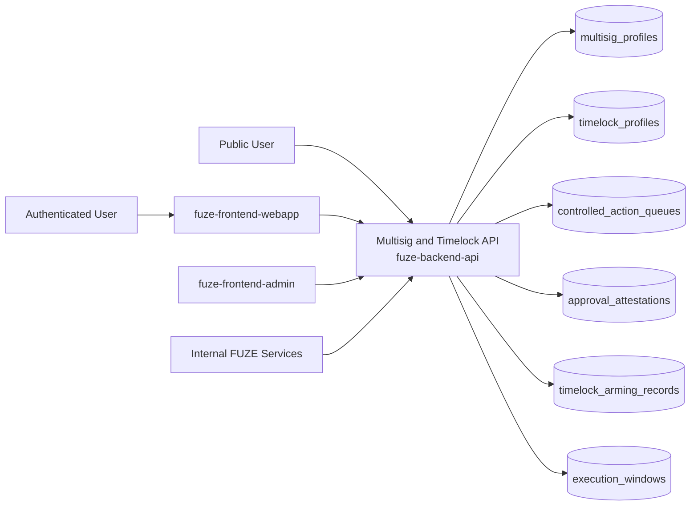
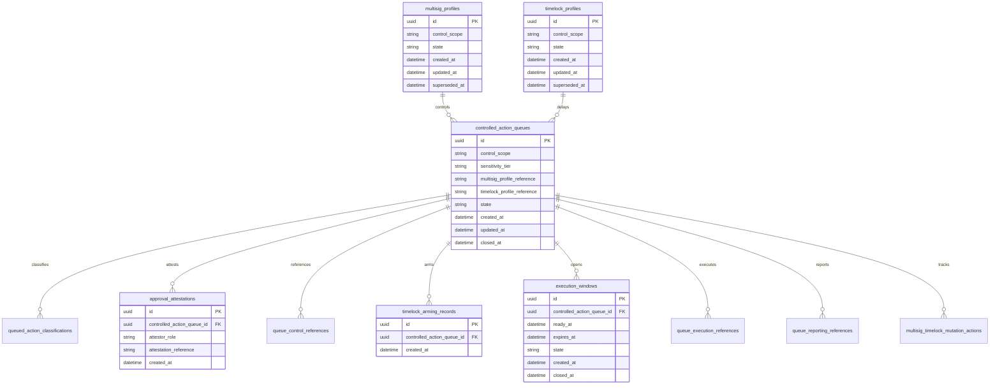
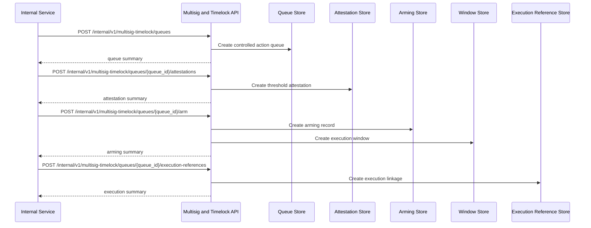

# MULTISIG_TIMELOCK_API_SPEC

## 1. Title

**MULTISIG_TIMELOCK_API_SPEC.md**

---

## 2. Document Metadata

- **Document Name:** MULTISIG_TIMELOCK_API_SPEC.md
- **API Classification:** internal, admin, event-driven, public-read, chain-adjacent
- **Owning Domain:** Multisig and Timelock Domain
- **Primary Implementing Repo:** `fuze-backend-api`
- **Primary Chain-Adjacent Dependency:** `fuze-contracts`
- **Primary System of Record:** multisig profiles, timelock profiles, controlled action queues, approval attestations, execution-window records, cancellation records, emergency override records, and correction-safe multisig/timelock lineage in `fuze-backend-api`
- **Status:** Draft for canonical source-of-truth approval
- **Purpose:** Define the production-grade API contract architecture for FUZE multisig and timelock control, including execution-control profile management, queued-action governance, approval-threshold coordination, timelock delay enforcement, emergency-path restraint, and structured audit/reporting-safe lifecycle management across the platform
- **Canonical Folder:** `fuze.ac > docs > api-spec`

---

## 2.1 API Classification Header

- **API Classification:** internal | admin | event-driven | public-read | chain-adjacent
- **Owning Domain:** Multisig and Timelock Domain
- **Primary Implementing Repo:** `fuze-backend-api`
- **Primary Chain-Adjacent Dependency:** `fuze-contracts`
- **Primary System of Record:** multisig/timelock control and queued-action governance domain

---

## 3. Purpose

This document defines the canonical API specification for FUZE multisig and timelock operations. It translates the governing FUZE platform architecture, multisig and timelock rules, treasury control policy, vault action policy, Foundation governance expectations, payout funding sensitivity, transparency expectations, audit requirements, and API architecture rules into an implementation-ready API contract.

This API exists because FUZE treats multisig and timelock as explicit execution-control infrastructure, not as informal operator conventions and not as vague wallet hygiene. The domain must preserve:

- explicit control profiles,
- explicit threshold and role-path meaning,
- explicit queue, delay, ready, execution, cancellation, and expiry states,
- separation between governance approval and execution readiness,
- emergency-path restraint rather than convenience shortcuts,
- and durable public-safe reporting compatibility for material actions.

Accordingly, this specification defines how multisig profiles, timelock profiles, queued actions, approval attestations, execution windows, cancellations, override records, and reporting references are represented, and how multisig/timelock behavior remains auditable, idempotent, and architecture-consistent across FUZE.

---

## 4. Scope

This specification covers:

- internal APIs for multisig profile and timelock profile lifecycle management
- internal APIs for controlled-action queue creation, threshold attestation capture, timelock scheduling, execution-window management, cancellation, and expiry handling
- internal APIs for emergency or exceptional override-path records under stronger restraint
- internal read APIs for canonical multisig/timelock truth
- admin/control-plane APIs for approve-for-queue, arm-timelock, cancel, pause, escalate, exceptional override, supersede, and discrepancy resolution
- public-read APIs for bounded public-safe control-profile summaries and public-safe queued-action reporting summaries where policy allows
- event emission requirements for multisig/timelock lifecycle changes
- request, response, error, idempotency, versioning, audit, and database-shape rules for this domain

This specification does **not** redefine:

- raw signer key management
- raw contract ABI details
- low-level safe transaction encoding
- the full treasury-control policy domain
- the full Foundation governance domain
- the full vault-action policy domain
- DAO-lite voting mechanics
- end-user UI for wallet-signing workflows

Those remain governed by their own source-of-truth specifications.

---

## 5. Source-of-Truth Inputs

### Primary FUZE docs and specs used

#### Highest-priority platform and ownership sources
- `SYSTEM_SPEC_INDEX.md`
- `DOCS_SPEC.md`
- `SYSTEM_BOUNDARY_AND_OWNERSHIP_SPEC.md`
- `SYSTEM_OVERVIEW_AND_BOUNDARIES_SPEC.md`
- `PLATFORM_ARCHITECTURE_SPEC.md`
- `DOMAIN_OWNERSHIP_MATRIX_SPEC.md`
- `DATA_MODEL_AND_ENTITY_OWNERSHIP_SPEC.md`
- `ONCHAIN_OFFCHAIN_RESPONSIBILITY_SPEC.md`

#### Primary control / governance sources
- `MULTISIG_AND_TIMELOCK_SPEC.md`
- `TREASURY_CONTROL_POLICY_SPEC.md`
- `VAULT_ACTION_POLICY_SPEC.md`
- `FOUNDATION_GOVERNANCE_SPEC.md`
- `GOVERNANCE_MODEL_SPEC.md`
- `TRANSPARENCY_MODEL_SPEC.md`
- `TRANSPARENCY_REPORTING_SPEC.md`
- `PROFIT_PARTICIPATION_SYSTEM_SPEC.md`
- `CHAIN_ARCHITECTURE_SPEC.md`
- `PUBLIC_CONTRACT_AND_WALLET_REGISTRY_SPEC.md`

#### Core docs inputs
- `FUZE_WHITEPAPER_v.2026.3.0.1.pdf`
- `FUZE_CHAIN_ARCHITECTURE.md`
- `TOKEN_CONTRACT_ARCHITECTURE_.md`
- `FUZE_TOKENOMICS_TABLES.md`
- `ALLOCATION_WALLET_MAP.md`

#### API and runtime sources
- `API_ARCHITECTURE_SPEC.md`
- `PUBLIC_API_SPEC.md`
- `INTERNAL_SERVICE_API_SPEC.md`
- `EVENT_MODEL_AND_WEBHOOK_SPEC.md`
- `IDEMPOTENCY_AND_VERSIONING_SPEC.md`
- `MIGRATION_AND_BACKWARD_COMPATIBILITY_SPEC.md`
- `AUDIT_LOG_AND_ACTIVITY_SPEC.md`

#### Security and operations sources
- `SECURITY_AND_RISK_CONTROL_SPEC.md`
- `MONITORING_ALERTING_AND_INCIDENT_RESPONSE_SPEC.md`
- `SECRETS_CONFIG_AND_ENVIRONMENT_SPEC.md`

#### Format guides
- `The_API_Specification_guide.md`
- `Database_Schemas_Guide.md`

### Highest-priority interpretation applied

For this file, the most important governing interpretation is:

1. multisig and timelock are explicit control layers for sensitive execution and not replacements for upstream governance
2. backend owns canonical control-profile truth and queued-action lifecycle truth
3. threshold approval, timelock delay, ready-for-execution, and executed states must remain distinct
4. different governance scopes may require different multisig and timelock profiles
5. emergency or exceptional paths must remain narrow, audited, and post-reviewed
6. public-safe visibility should explain material queued or executed actions without exposing unsafe operational detail

### Supporting external standards used only as guidance

- HTTP semantics for internal mutation and bounded public-read APIs
- structured problem-details error design
- general queued-action, threshold-attestation, and delay-window patterns as supporting guidance

External guidance does not override FUZE source-of-truth documents.

---

## 6. Governing Architecture and Ownership Interpretation

This API belongs to the **Multisig and Timelock Domain** because it owns the canonical lifecycle of:

- multisig control profiles,
- timelock control profiles,
- queued sensitive actions,
- approval attestations,
- arm-and-delay posture,
- readiness windows,
- execution references,
- cancellation and expiry handling,
- and correction-safe control history.

This API is implemented primarily in `fuze-backend-api` because:

- backend owns durable control-profile and queue truth
- multisig/timelock usage must be linked to upstream governance and downstream execution without collapsing them together
- queue orchestration, expiry, delay, and cancellation require centralized coordination
- public trust requires structured control lineage beyond contract transaction history
- audit generation and discrepancy handling must be centralized

This API is **not** owned by:

- `fuze-frontend-webapp`, because frontend only reads bounded public-safe control summaries
- `fuze-frontend-admin`, because admin may queue, arm, cancel, or escalate but must not own canonical control truth
- `fuze-contracts`, because contracts enforce parts of execution but do not own the full off-chain control interpretation and historical queue explanation
- treasury-control domain, because treasury control says when treasury-sensitive action is permitted, while this domain governs how controlled execution is staged
- governance-model domain, because governance records why a decision exists, while this domain records how it is thresholded and delayed
- Foundation-governance domain, because Foundation may require stronger control posture but does not own multisig/timelock mechanics broadly

### Architectural implications

- every material controlled action may reference one multisig profile and zero or one timelock profile
- one governance-approved action may create one or more queued-action records depending on execution segmentation
- one queued action may collect multiple attestations before threshold satisfaction
- one armed timelock may expose an execution window with start and expiry bounds
- execution, cancellation, expiry, and override must preserve explicit lineage
- corrections and supersession must preserve historical control meaning rather than silently rewriting records

---

## 7. Domain Responsibilities

The Multisig and Timelock API domain is responsible for:

1. maintaining canonical multisig profiles and timelock profiles
2. recording threshold requirements, control scopes, and control-path meaning
3. creating and managing queued sensitive actions
4. recording approval attestations and threshold-satisfaction posture
5. recording timelock arming, delay, ready, expiry, cancellation, and execution linkage
6. exposing public-safe and trusted internal control status views
7. supporting admin approve-for-queue, arm-timelock, cancel, pause, escalate, exceptional override, supersede, and discrepancy workflows
8. emitting multisig/timelock lifecycle events
9. generating audit lineage for sensitive multisig/timelock actions
10. preserving separation between governance approval truth, control truth, and downstream execution truth

The domain is not responsible for:

- storing signer private keys
- acting as the governance decision domain
- acting as the treasury policy domain
- acting as the final execution domain
- replacing raw wallet or safe software
- enabling silent bypass of delay or threshold requirements outside explicitly bounded exceptional paths

---

## 8. Out of Scope

The following are out of scope for this API specification:

- raw EOA or hardware-wallet UX
- direct transaction-builder UI logic
- contract ABI detail
- signer invitation or offboarding flows
- low-level nonce management implementation
- end-user governance portal UX
- external explorer integrations
- generalized crypto wallet infrastructure

---

## 9. Canonical Entities and Data Ownership

### Durable entities

#### 9.1 multisig_profiles
- **Owner:** Multisig and Timelock Domain
- **Purpose:** canonical control profiles defining thresholded execution groups
- **Nature:** source-of-truth durable entity

#### 9.2 timelock_profiles
- **Owner:** Multisig and Timelock Domain
- **Purpose:** canonical delay and execution-window profiles for controlled actions
- **Nature:** source-of-truth durable entity

#### 9.3 controlled_action_queues
- **Owner:** Multisig and Timelock Domain
- **Purpose:** canonical queued-action records for controlled execution
- **Nature:** source-of-truth durable entity

#### 9.4 queued_action_classifications
- **Owner:** Multisig and Timelock Domain
- **Purpose:** explicit classification of governance scope, sensitivity tier, control scope, and visibility posture
- **Nature:** source-of-truth durable entity

#### 9.5 approval_attestations
- **Owner:** Multisig and Timelock Domain
- **Purpose:** attestation records toward threshold satisfaction
- **Nature:** source-of-truth durable lineage entity

#### 9.6 queue_control_references
- **Owner:** Multisig and Timelock Domain
- **Purpose:** links from queued actions to upstream governance, treasury, vault, Foundation, payout, or other control-relevant references
- **Nature:** source-of-truth durable lineage entity

#### 9.7 timelock_arming_records
- **Owner:** Multisig and Timelock Domain
- **Purpose:** explicit records of timelock scheduling and armed delay posture
- **Nature:** source-of-truth durable lineage entity

#### 9.8 execution_windows
- **Owner:** Multisig and Timelock Domain
- **Purpose:** start, ready, expiry, and closure windows for controlled execution
- **Nature:** source-of-truth durable entity

#### 9.9 queue_execution_references
- **Owner:** Multisig and Timelock Domain
- **Purpose:** bounded references to downstream execution artifacts
- **Nature:** durable execution-lineage entity

#### 9.10 queue_reporting_references
- **Owner:** Multisig and Timelock Domain
- **Purpose:** references to transparency reports, public registries, or governed-domain reporting artifacts
- **Nature:** durable reporting-lineage entity

#### 9.11 override_records
- **Owner:** Multisig and Timelock Domain
- **Purpose:** emergency or exceptional override records with post-incident review requirements
- **Nature:** durable exceptional-case entity

#### 9.12 multisig_timelock_discrepancy_cases
- **Owner:** Multisig and Timelock Domain
- **Purpose:** review and remediation records for invalid, stale, misqueued, or misreported control states
- **Nature:** durable review/remediation entity

#### 9.13 multisig_timelock_mutation_actions
- **Owner:** Multisig and Timelock Domain
- **Purpose:** high-level action records for create, queue, attest, arm, cancel, pause, escalate, exceptional_override, supersede, and resolve discrepancy
- **Nature:** durable action records with audit linkage

#### 9.14 multisig_timelock_audit_events
- **Owner:** Audit / Activity domain, sourced by Multisig and Timelock Domain
- **Purpose:** immutable trail for sensitive multisig/timelock actions
- **Nature:** durable audit records

### Derived or cached entities

#### 9.15 multisig_timelock_public_views
- **Owner:** derived read-model layer
- **Purpose:** public-safe control profile and queued-action summaries
- **Nature:** derived

#### 9.16 multisig_timelock_internal_status_views
- **Owner:** derived read-model layer
- **Purpose:** trusted queue, threshold, and execution-window operational summaries
- **Nature:** derived

#### 9.17 multisig_timelock_discrepancy_views
- **Owner:** derived ops read-model layer
- **Purpose:** visibility into stale, invalid, or conflicting control conditions
- **Nature:** derived

---

## 10. State Model and Lifecycle

### 10.1 multisig profile lifecycle

Possible states:

- `draft`
- `active`
- `restricted`
- `superseded`
- `archived`

### 10.2 timelock profile lifecycle

Possible states:

- `draft`
- `active`
- `restricted`
- `superseded`
- `archived`

### 10.3 queued action lifecycle

Possible states:

- `draft`
- `queued`
- `threshold_pending`
- `threshold_satisfied`
- `timelock_armed`
- `ready_for_execution`
- `executed_reference_linked`
- `cancelled`
- `expired`
- `paused`
- `superseded`
- `closed`

### 10.4 execution-window lifecycle

Possible states:

- `scheduled`
- `ready`
- `expired`
- `closed`
- `superseded`

### 10.5 override lifecycle

Possible states:

- `declared`
- `containment_active`
- `post_review_pending`
- `closed`
- `superseded`

### 10.6 discrepancy lifecycle

Possible states:

- `opened`
- `under_review`
- `resolved`
- `failed`
- `closed`

Lifecycle notes:
- threshold satisfaction is distinct from timelock arming
- timelock arming is distinct from ready_for_execution
- ready_for_execution is distinct from executed_reference_linked
- exceptional overrides must remain narrower than ordinary controlled execution
- supersession must preserve prior control meaning and public explanation

---

## 11. API Surface Overview

The API surface is divided into four families:

### 11.1 Public-read APIs
Used by public users, holders, and community observers for:
- reading bounded multisig/timelock policy summaries
- reading public-safe queued-action summaries
- reading category-aware public explanations of material controlled actions where policy allows

### 11.2 First-party authenticated read APIs
Used by `fuze-frontend-webapp` and approved first-party clients for:
- reading bounded control-related public-safe and first-party-safe summaries where policy allows
- reading linked reporting or governed-domain references without exposing internal-only operational detail

### 11.3 Internal service APIs
Used by trusted internal services for:
- creating profiles
- queuing actions
- recording attestations and timelock arming
- linking execution and reporting references
- reading canonical truth

### 11.4 Admin / control-plane APIs
Used by `fuze-frontend-admin` through backend-only privileged routes for:
- approve-for-queue, arm-timelock, cancel, pause, escalate, exceptional override, supersede, and discrepancy actions
- control-path repair and policy-governed remediation workflows

---

## 12. Authentication and Authorization Model

### 12.1 Authentication posture by route family

#### Public-read routes
No authentication required:
- list public-safe control profile summaries
- read public-safe queued-action summaries and references where published

#### Authenticated read routes
Require valid authenticated session:
- read bounded first-party-safe control-related summaries where actor has visibility under policy

#### Internal service routes
Require internal service identity with explicit least privilege:
- create profiles
- queue actions
- record attestations, arming records, reporting references, and execution references
- read canonical truth

#### Admin routes
Require privileged operator identity plus reason-coded actions:
- approve-for-queue, arm-timelock, cancel, pause, escalate, declare exceptional override, supersede, and resolve discrepancy cases

### 12.2 Authorization checkpoints

Authorization must evaluate:
- caller identity and route family
- whether target action is public-safe, first-party-safe, or privileged internal state
- whether internal service has create/queue/attest/arm/link/read privilege
- whether admin/operator role is present for sensitive control actions
- whether current action state allows requested mutation
- whether control scope and sensitivity tier require stronger profile validation

### 12.3 Sensitive action rules

The following require heightened checks:
- arming timelock for material queued actions
- actions tied to treasury, Foundation, payout funding, or other high-trust scopes
- cancellation after threshold satisfaction
- exceptional override declarations
- discrepancy-resolution actions

---

## 13. API Endpoints / Interface Contracts

## 13.1 Public-Read APIs

### 13.1.1 `GET /v1/multisig-timelock/profiles`
**Purpose:** list published public-safe multisig/timelock profile summaries  
**Caller Type:** public  
**Auth Expectation:** none  
**Query Parameters Summary:**
- optional `state`
- optional `control_scope`
- pagination
**Response Summary:**
- profile summaries
- threshold and delay posture in bounded public-safe form
- active/superseded posture
- timestamps
**Side Effects:** none
**Audit Requirements:** access logging optional
**Emitted Events:** none required

### 13.1.2 `GET /v1/multisig-timelock/queues`
**Purpose:** list published public-safe queued-action summaries  
**Caller Type:** public  
**Query Parameters Summary:**
- optional `control_scope`
- optional `sensitivity_tier`
- pagination
**Response Summary:**
- public-safe queue summaries
- control scope, status, and ready/expired posture
- bounded reporting and public references
**Side Effects:** none

### 13.1.3 `GET /v1/multisig-timelock/queues/{controlled_action_queue_id}`
**Purpose:** retrieve one public-safe queued-action detail  
**Caller Type:** public  
**Response Summary:**
- public-safe queued-action detail
- threshold and delay posture summary
- linked reporting and governed-domain references where published
- cancellation, expiry, or supersession guidance where relevant
**Side Effects:** none

## 13.2 First-Party Authenticated Read APIs

### 13.2.1 `GET /v1/multisig-timelock/me/queues`
**Purpose:** retrieve bounded first-party-safe control-related queued-action summaries where actor has policy visibility  
**Caller Type:** authenticated user  
**Auth Expectation:** valid authenticated session  
**Query Parameters Summary:**
- optional `reference_type`
- pagination
**Response Summary:**
- bounded control-related summaries
- linked public reporting or governance guidance where applicable
**Side Effects:** none

## 13.3 Internal Service APIs

### 13.3.1 `POST /internal/v1/multisig-timelock/profiles/multisig`
**Purpose:** create draft multisig control profile  
**Caller Type:** internal trusted service  
**Auth Expectation:** service-to-service identity only  
**Request Body Summary:**
- `control_scope`
- `threshold_profile`
- optional `profile_summary`
- `idempotency_key`
**Response Summary:** multisig profile summary
**Side Effects:** creates draft profile
**Idempotency Behavior:** required
**Audit Requirements:** control-profile creation audit
**Emitted Events:** `multisig_timelock.multisig_profile_created`

### 13.3.2 `POST /internal/v1/multisig-timelock/profiles/timelock`
**Purpose:** create draft timelock profile  
**Caller Type:** internal trusted service  
**Request Body Summary:**
- `control_scope`
- `delay_profile`
- optional `profile_summary`
- `idempotency_key`
**Response Summary:** timelock profile summary
**Side Effects:** creates draft profile
**Idempotency Behavior:** required
**Audit Requirements:** control-profile creation audit
**Emitted Events:** `multisig_timelock.timelock_profile_created`

### 13.3.3 `POST /internal/v1/multisig-timelock/queues`
**Purpose:** create controlled queued-action record  
**Caller Type:** internal trusted service  
**Request Body Summary:**
- `control_scope`
- `sensitivity_tier`
- `multisig_profile_reference`
- optional `timelock_profile_reference`
- optional `queue_summary`
- `idempotency_key`
**Response Summary:** queued-action summary
**Side Effects:** creates queued action and classification record
**Idempotency Behavior:** required
**Audit Requirements:** queued-action creation audit
**Emitted Events:** `multisig_timelock.action_queued`

### 13.3.4 `POST /internal/v1/multisig-timelock/queues/{controlled_action_queue_id}/attestations`
**Purpose:** record approval attestation for queued action  
**Caller Type:** internal trusted service  
**Request Body Summary:**
- `attestor_role`
- `attestation_reference`
- optional `attestation_summary`
- `idempotency_key`
**Response Summary:** attestation summary and threshold posture
**Side Effects:** creates attestation lineage and may move queue to threshold_satisfied
**Idempotency Behavior:** required
**Audit Requirements:** threshold-attestation audit
**Emitted Events:** `multisig_timelock.attestation_recorded`

### 13.3.5 `POST /internal/v1/multisig-timelock/queues/{controlled_action_queue_id}/arm`
**Purpose:** arm timelock for threshold-satisfied queued action  
**Caller Type:** internal trusted service  
**Request Body Summary:**
- optional `arming_summary`
- `idempotency_key`
**Response Summary:** arming summary and execution-window summary
**Side Effects:** creates timelock arming record and execution window; may move queue to timelock_armed
**Idempotency Behavior:** required
**Audit Requirements:** timelock-arming audit
**Emitted Events:** `multisig_timelock.timelock_armed`

### 13.3.6 `POST /internal/v1/multisig-timelock/queues/{controlled_action_queue_id}/reporting-references`
**Purpose:** attach transparency, registry, or governed-domain reporting references to queued action  
**Caller Type:** internal trusted service  
**Request Body Summary:**
- optional `transparency_report_reference`
- optional `public_registry_reference`
- optional `domain_reporting_reference`
- optional `exception_reference`
- `idempotency_key`
**Response Summary:** reporting-reference summary
**Side Effects:** creates reporting and trust-surface linkage
**Idempotency Behavior:** required
**Audit Requirements:** reporting-link audit
**Emitted Events:** `multisig_timelock.reporting_linked`

### 13.3.7 `POST /internal/v1/multisig-timelock/queues/{controlled_action_queue_id}/execution-references`
**Purpose:** link downstream execution reference to queued action  
**Caller Type:** internal trusted service  
**Request Body Summary:**
- `execution_reference_type`
- `execution_reference_id`
- optional `execution_summary`
- `idempotency_key`
**Response Summary:** execution-reference summary and updated queue state
**Side Effects:** creates execution linkage and may move queue into executed_reference_linked
**Idempotency Behavior:** required
**Audit Requirements:** execution-link audit
**Emitted Events:** `multisig_timelock.execution_linked`

### 13.3.8 `GET /internal/v1/multisig-timelock/queues/{controlled_action_queue_id}`
**Purpose:** retrieve canonical multisig/timelock truth  
**Caller Type:** internal trusted service  
**Response Summary:** full queue, profile references, classification, attestations, arming records, execution windows, execution references, reporting references, and discrepancy lineage
**Side Effects:** none

## 13.4 Admin / Control-Plane APIs

### 13.4.1 `POST /admin/v1/multisig-timelock/queues/{controlled_action_queue_id}/approve-for-queue`
**Purpose:** approve queued-action control posture under policy  
**Caller Type:** admin/operator  
**Request Body Summary:**
- `reason_code`
- `operator_note`
- `idempotency_key`
**Response Summary:** approved-for-queue summary
**Side Effects:** queue moves to queued or threshold_pending as checks pass
**Audit Requirements:** critical audit
**Emitted Events:** `multisig_timelock.queue_approved`

### 13.4.2 `POST /admin/v1/multisig-timelock/queues/{controlled_action_queue_id}/cancel`
**Purpose:** cancel queued action under controlled policy  
**Caller Type:** admin/operator  
**Request Body Summary:**
- `reason_code`
- `operator_note`
- `idempotency_key`
**Response Summary:** cancelled queue summary
**Side Effects:** queue moves to cancelled
**Audit Requirements:** critical audit
**Emitted Events:** `multisig_timelock.queue_cancelled`

### 13.4.3 `POST /admin/v1/multisig-timelock/queues/{controlled_action_queue_id}/pause`
**Purpose:** pause queued action under controlled policy  
**Caller Type:** admin/operator  
**Request Body Summary:**
- `reason_code`
- `operator_note`
- `idempotency_key`
**Response Summary:** paused queue summary
**Side Effects:** queue moves to paused
**Audit Requirements:** critical audit
**Emitted Events:** `multisig_timelock.queue_paused`

### 13.4.4 `POST /admin/v1/multisig-timelock/queues/{controlled_action_queue_id}/escalate`
**Purpose:** escalate queued action to stronger control posture  
**Caller Type:** admin/operator  
**Request Body Summary:**
- `escalation_type`
- `reason_code`
- `operator_note`
- `idempotency_key`
**Response Summary:** escalation summary
**Side Effects:** queue control posture strengthens, for example through stronger profile linkage or extra delay
**Audit Requirements:** critical audit
**Emitted Events:** `multisig_timelock.queue_escalated`

### 13.4.5 `POST /admin/v1/multisig-timelock/queues/{controlled_action_queue_id}/exceptional-override`
**Purpose:** declare emergency or exceptional override treatment under controlled policy  
**Caller Type:** admin/operator  
**Request Body Summary:**
- `exception_type`
- `public_or_internal_summary`
- `reason_code`
- `operator_note`
- `idempotency_key`
**Response Summary:** override summary
**Side Effects:** creates override record and may restrict or alter ordinary queue path until review completes
**Audit Requirements:** critical audit
**Emitted Events:** `multisig_timelock.override_declared`

### 13.4.6 `POST /admin/v1/multisig-timelock/queues/{controlled_action_queue_id}/supersede`
**Purpose:** supersede one queued action with a replacement controlled action under policy  
**Caller Type:** admin/operator  
**Request Body Summary:**
- `replacement_controlled_action_queue_id`
- `reason_code`
- `operator_note`
- `idempotency_key`
**Response Summary:** supersession summary
**Side Effects:** creates old-to-new supersession linkage and updates current visible preference
**Audit Requirements:** critical audit
**Emitted Events:** `multisig_timelock.queue_superseded`

### 13.4.7 `POST /admin/v1/multisig-timelock/discrepancies`
**Purpose:** resolve multisig/timelock discrepancy under controlled policy  
**Caller Type:** admin/operator  
**Request Body Summary:**
- `target_reference_type`
- `target_reference_id`
- `resolution_code`
- `operator_note`
- `related_case_id`
- `idempotency_key`
**Response Summary:** discrepancy-resolution summary
**Side Effects:** may correct, supersede, pause, escalate, cancel, or close discrepancy posture with preserved lineage
**Audit Requirements:** critical audit
**Emitted Events:** `multisig_timelock.discrepancy_resolved`

---

## 14. Request Rules

### 14.1 General request rules
- all mutation-capable routes must require JSON requests with explicit content type
- all mutation routes must carry correlation IDs
- sensitive multisig/timelock mutations must carry idempotency keys
- admin mutations must require reason codes and operator notes
- no route may accept frontend-authored control truth as authoritative input

### 14.2 Sensitive-action request requirements
The following requests require heightened validation:
- queueing material controlled actions
- threshold attestation for treasury, Foundation, or payout-related scopes
- timelock arming
- cancellation after threshold satisfaction
- exceptional override declarations
- discrepancy-resolution actions

Heightened validation may include:
- control-scope consistency checks
- profile-compatibility checks
- threshold-satisfaction checks
- delay-profile completeness checks
- operator role confirmation
- governance/finance/security case linkage for sensitive actions

### 14.3 Scope integrity rule
Multisig/timelock mutations must target valid and authorized profiles, queue records, attestation records, arming records, execution windows, and discrepancy records. Services and operators must not mutate unrelated or unauthorized control state.

### 14.4 Layer-separation rule
Multisig/timelock domain must remain the execution-control layer. It must not collapse:
- governance meaning,
- treasury meaning,
- Foundation meaning,
- vault policy meaning,
- or downstream execution settlement
into one ambiguous state object.

---

## 15. Response Rules

### 15.1 Success response rules
Successful responses must include:
- stable resource identifiers
- timestamps for created/updated state
- state/status values
- profile, queue, or execution-window summaries where relevant
- threshold and delay posture summaries where relevant
- correlation references for mutations

### 15.2 Async-accepted response rules
If escalation, exceptional review, or discrepancy remediation is async, the response must:
- return accepted status
- include action or job ID
- provide follow-up status semantics

### 15.3 Terminal mutation response rules
Terminal mutation responses must clearly show:
- target queue or discrepancy
- mutation type
- resulting profile/queue/window state
- cancellation, escalation, override, supersession, or closure effects where relevant
- whether public-safe views may refresh asynchronously

### 15.4 Read response rules
Read responses must distinguish:
- canonical internal control truth
- public-safe control profile summaries
- public-safe queued-action reporting views
- execution references versus final downstream execution outcomes

---

## 16. Error Model

The API uses structured problem-details style error responses.

### 16.1 Required error fields
- `type`
- `title`
- `status`
- `code`
- `detail`
- `instance`
- `correlation_id`

### 16.2 Common error codes

#### Authorization / permission errors
- `MULTISIG_TIMELOCK_PERMISSION_DENIED`
- `MULTISIG_TIMELOCK_OPERATOR_PERMISSION_DENIED`
- `MULTISIG_TIMELOCK_SERVICE_PERMISSION_DENIED`
- `MULTISIG_TIMELOCK_AUDIENCE_PERMISSION_DENIED`

#### State conflict errors
- `MULTISIG_TIMELOCK_QUEUE_STATE_INVALID`
- `MULTISIG_TIMELOCK_PROFILE_STATE_INVALID`
- `MULTISIG_TIMELOCK_THRESHOLD_STATE_INVALID`
- `MULTISIG_TIMELOCK_SUPERSESSION_CONFLICT`
- `MULTISIG_TIMELOCK_ARMING_CONFLICT`

#### Policy / safety errors
- `MULTISIG_TIMELOCK_PROFILE_REQUIRED`
- `MULTISIG_TIMELOCK_THRESHOLD_NOT_SATISFIED`
- `MULTISIG_TIMELOCK_DELAY_NOT_ALLOWED`
- `MULTISIG_TIMELOCK_EXCEPTION_NOT_ALLOWED`
- `MULTISIG_TIMELOCK_CANCELLATION_RESTRICTION`

#### Request integrity errors
- `MULTISIG_TIMELOCK_IDEMPOTENCY_KEY_REQUIRED`
- `MULTISIG_TIMELOCK_REQUEST_INVALID`
- `MULTISIG_TIMELOCK_REQUEST_UNPROCESSABLE`

#### Dependency or provider errors
- `MULTISIG_TIMELOCK_EXECUTION_UNAVAILABLE`
- `MULTISIG_TIMELOCK_STORAGE_UNAVAILABLE`
- `MULTISIG_TIMELOCK_RECONCILIATION_UNAVAILABLE`

### 16.3 Error handling rules
- do not expose hidden internal governance, treasury, or security detail in public or low-privilege responses
- do not imply ready or executable state merely because a queue exists
- distinguish threshold-not-satisfied from generic invalid state
- distinguish profile-required from generic invalid request
- include retry guidance only where safe

---

## 17. Idempotency and Mutation Safety

### 17.1 Required idempotent mutations
The following mutation routes require idempotent behavior:
- multisig profile creation
- timelock profile creation
- queue creation
- attestation recording
- timelock arming
- reporting-reference attachment
- execution-reference linking
- approve-for-queue
- cancel
- pause
- escalate
- exceptional override
- supersede
- discrepancy resolution

### 17.2 Idempotency key rules
- mutation requests must supply `Idempotency-Key`
- backend stores key scope, request hash, actor, and terminal result
- replay of same semantic request returns original terminal outcome
- replay of same key with different semantic request must fail with conflict

### 17.3 Mutation safety rules
- one canonical visible controlled action per current queue lineage unless explicit supersession exists
- attestation, arming, and execution-window records must remain referentially consistent with control profiles and queue state
- threshold satisfaction, delay, and execution linkage must preserve approval/arming/execution separation
- corrections and supersession must preserve prior queue lineage
- exceptional overrides must not silently normalize into routine controlled execution behavior

---

## 18. Versioning and Compatibility Rules

### 18.1 Versioning
This API family is versioned under `/v1`, `/internal/v1`, and `/admin/v1` route families.

### 18.2 Compatibility approach
- additive evolution preferred
- no silent semantic change to queued, threshold_satisfied, timelock_armed, ready_for_execution, executed_reference_linked, cancelled, expired, paused, or superseded states
- new control scopes, profile types, or control-reference types may be added without breaking existing contracts
- response fields may be added but existing meanings must remain stable

### 18.3 Breaking-change rules
Breaking changes include:
- changing the meaning of threshold satisfaction versus ready-for-execution
- changing queue lifecycle semantics incompatibly
- removing critical profile, attestation, or window fields
- changing exceptional-override or supersession semantics incompatibly

Such changes require explicit migration planning and version evolution.

### 18.4 Deprecation
Deprecated routes or fields must:
- be documented explicitly
- carry deprecation metadata where supported
- preserve compatibility windows long enough for public, first-party, and internal consumers

---

## 19. Event Emission and Webhook Behavior

This domain is event-capable.

### 19.1 Internal events
The Multisig and Timelock domain must emit canonical internal events such as:
- `multisig_timelock.multisig_profile_created`
- `multisig_timelock.timelock_profile_created`
- `multisig_timelock.action_queued`
- `multisig_timelock.attestation_recorded`
- `multisig_timelock.timelock_armed`
- `multisig_timelock.reporting_linked`
- `multisig_timelock.execution_linked`
- `multisig_timelock.queue_approved`
- `multisig_timelock.queue_cancelled`
- `multisig_timelock.queue_paused`
- `multisig_timelock.queue_escalated`
- `multisig_timelock.override_declared`
- `multisig_timelock.queue_superseded`
- `multisig_timelock.discrepancy_resolved`

### 19.2 Event payload minimums
Each event should contain:
- event ID
- event type
- occurred_at
- controlled action queue ID
- control scope
- sensitivity tier
- actor type
- correlation ID
- reason code where applicable

### 19.3 External webhook posture
This specification does not expose general third-party outbound multisig/timelock webhooks by default. Any future outbound control-status webhook surface must be narrow, security-reviewed, and governed by a separate contract.

---

## 20. Audit and Activity Requirements

The following actions must generate durable audit events:

- profile creation
- queue creation
- threshold attestation recording
- timelock arming
- approve-for-queue, cancel, pause, escalate, and exceptional override treatment
- execution-reference and reporting-reference linkage for material actions
- supersession and discrepancy-resolution actions
- other sensitive multisig/timelock mutations

### Required audit fields
- audit event ID
- actor type and actor reference
- target queue / profile / attestation / control path / discrepancy reference as applicable
- action type
- before/after summary where applicable
- reason code
- correlation ID
- operator note if operator action
- occurred_at

---

## 21. Data Model and Database Schema View

### 21.1 `multisig_profiles`
- `id` PK
- `control_scope`
- `threshold_profile_json`
- `state`
- `created_at`
- `updated_at`
- `superseded_at` nullable

**Constraints:**
- index on `state`

### 21.2 `timelock_profiles`
- `id` PK
- `control_scope`
- `delay_profile_json`
- `state`
- `created_at`
- `updated_at`
- `superseded_at` nullable

**Constraints:**
- index on `state`

### 21.3 `controlled_action_queues`
- `id` PK
- `control_scope`
- `sensitivity_tier`
- `multisig_profile_reference`
- `timelock_profile_reference` nullable
- `state`
- `created_at`
- `updated_at`
- `closed_at` nullable

**Constraints:**
- index on (`control_scope`, `sensitivity_tier`)
- index on `state`

### 21.4 `queued_action_classifications`
- `id` PK
- `controlled_action_queue_id` FK -> `controlled_action_queues.id`
- `visibility_posture`
- `classification_summary_json`
- `created_at`

**Constraints:**
- index on `controlled_action_queue_id`

### 21.5 `approval_attestations`
- `id` PK
- `controlled_action_queue_id` FK -> `controlled_action_queues.id`
- `attestor_role`
- `attestation_reference`
- `attestation_summary_json`
- `created_at`

**Constraints:**
- index on `controlled_action_queue_id`

### 21.6 `queue_control_references`
- `id` PK
- `controlled_action_queue_id` FK -> `controlled_action_queues.id`
- `reference_type`
- `reference_id`
- `created_at`

**Constraints:**
- index on `controlled_action_queue_id`

### 21.7 `timelock_arming_records`
- `id` PK
- `controlled_action_queue_id` FK -> `controlled_action_queues.id`
- `arming_summary_json`
- `created_at`

**Constraints:**
- index on `controlled_action_queue_id`

### 21.8 `execution_windows`
- `id` PK
- `controlled_action_queue_id` FK -> `controlled_action_queues.id`
- `ready_at`
- `expires_at`
- `state`
- `created_at`
- `closed_at` nullable

**Constraints:**
- index on `controlled_action_queue_id`
- index on `state`

### 21.9 `queue_execution_references`
- `id` PK
- `controlled_action_queue_id` FK -> `controlled_action_queues.id`
- `execution_reference_type`
- `execution_reference_id`
- `execution_summary_json`
- `created_at`

**Constraints:**
- index on `controlled_action_queue_id`
- index on (`execution_reference_type`, `execution_reference_id`)

### 21.10 `queue_reporting_references`
- `id` PK
- `controlled_action_queue_id` FK -> `controlled_action_queues.id`
- `transparency_report_reference` nullable
- `public_registry_reference` nullable
- `domain_reporting_reference` nullable
- `exception_reference` nullable
- `created_at`

**Constraints:**
- index on `controlled_action_queue_id`

### 21.11 `override_records`
- `id` PK
- `controlled_action_queue_id` FK -> `controlled_action_queues.id`
- `exception_type`
- `summary_json`
- `state`
- `created_at`
- `closed_at` nullable

### 21.12 `multisig_timelock_discrepancy_cases`
- `id` PK
- `target_reference_type`
- `target_reference_id`
- `state`
- `resolution_code` nullable
- `created_at`
- `updated_at`
- `closed_at` nullable

### 21.13 `multisig_timelock_mutation_actions`
- `id` PK
- `target_reference_type`
- `target_reference_id`
- `action_type`
- `state`
- `reason_code`
- `operator_note` nullable
- `requested_by_actor_type`
- `requested_by_actor_id`
- `created_at`
- `executed_at` nullable
- `closed_at` nullable
- `correlation_id`

### 21.14 `idempotency_records`
- `id` PK
- `idempotency_key`
- `scope_family`
- `actor_reference`
- `request_hash`
- `response_hash`
- `terminal_status`
- `created_at`
- `expires_at`

### 21.15 `audit_log_entries`
Domain-sourced audit records written into the audit domain.

### Normalization notes
- canonical multisig/timelock truth stays in profiles, queue records, classifications, attestations, arming records, execution windows, execution references, reporting references, and discrepancy records
- governance, treasury, Foundation, and vault-policy truth remain external and are referenced rather than duplicated
- public-safe views must derive from canonical control truth filtered by disclosure policy
- execution references remain explicit rather than embedded as opaque strings

### Reconciliation notes
- one visible controlled action should reconcile to one current queue lineage under current preference
- attestation records must reconcile to threshold posture
- arming records and execution windows must reconcile to active timelock profile behavior
- discrepancy cases must preserve review lineage for failed or conflicting multisig/timelock conditions

---

## 22. Architecture Diagram — Mermaid flowchart



---

## 23. Data Design — Mermaid Diagram



---

## 24. Flow View

### 24.1 Happy path — queue, satisfy threshold, arm, execute
1. internal service creates controlled queued action
2. attestation records accumulate toward threshold
3. threshold becomes satisfied
4. timelock is armed where required
5. execution window becomes ready after delay
6. downstream execution reference is linked
7. reporting and public registry references are attached
8. public-safe queued-action view becomes explainable and historically traceable

### 24.2 Happy path — threshold only without timelock
1. queued action references multisig profile without active timelock requirement
2. attestation threshold is satisfied
3. action moves directly toward ready_for_execution according to control profile
4. downstream execution reference is linked
5. public-safe summary explains thresholded control without delay posture

### 24.3 Alternate path — escalated control treatment
1. action carries heightened treasury, Foundation, payout, or cross-domain implications
2. operator escalates to stronger control posture
3. stronger profile linkage or extra delay is attached
4. queue proceeds only if stronger-control requirements are satisfied

### 24.4 Failure path — threshold or delay violation
1. system attempts arming or execution linkage
2. backend detects missing threshold satisfaction, invalid profile, or expired window
3. request is rejected or action remains paused/cancelled
4. no effective premature execution posture is created

### 24.5 Failure and remediation path — discrepancy or misreporting
1. queue, attestation, delay, or reporting linkage becomes stale or inconsistent
2. admin opens discrepancy-resolution flow
3. backend preserves existing lineage
4. corrected or superseding queue or linkage is created
5. discrepancy closes with preserved history

### 24.6 Exceptional-override path
1. emergency or exceptional condition is detected
2. operator declares exceptional override with explicit reason and narrow containment posture
3. ordinary queue shortcuts are not normalized into standing authority
4. post-incident review remains required
5. override record closes only after structured review

### 24.7 Retry behavior
- duplicate queue creation returns same canonical queue result
- duplicate attestation or arming returns same lineage result where applicable
- duplicate approve/cancel/pause/escalate/override/supersede/discrepancy actions return same terminal action result

---

## 25. Data Flows — Mermaid sequenceDiagram



---

## 26. Security and Risk Controls

1. **Multisig/timelock truth is backend-owned**  
   Frontends and informal channels may not authoritatively define controlled-action truth.

2. **Control-scope clarity is mandatory**  
   A controlled action must preserve explicit control-scope meaning rather than vague “sensitive tx” labeling.

3. **Threshold-before-readiness**  
   A queued action must not appear ready merely because it exists.

4. **Delay-before-execution where required**  
   Timelock delay must remain explicitly represented and enforced.

5. **Approval, arming, and execution separation**  
   Threshold satisfaction, timelock arming, and execution linkage must remain distinct lifecycle steps.

6. **Visibility discipline**  
   Public-safe visibility and internal-only operational detail must remain explicitly separated.

7. **Least privilege**  
   Internal write and admin approve/cancel/pause/escalate routes must be limited to authorized services and operators.

8. **Emergency narrowness**  
   Exceptional override paths should remain narrow and recovery-oriented rather than becoming standing discretionary shortcuts.

9. **Audit immutability**  
   Sensitive multisig/timelock actions require durable immutable audit lineage.

10. **Historical intelligibility**  
    Corrections and supersession must preserve why a queued action changed, not only that it changed.

---

## 27. Operational Considerations

- queue, threshold, and execution-window reads for trusted operators should be highly available
- attestation capture, arming, expiry handling, and control-reference integrity are correctness-sensitive
- treasury-, Foundation-, and payout-related queued actions should surface clearly to ops views
- exceptional-override and discrepancy workflows should be observable and reviewable
- monitoring should alert on:
  - missing attestation progression for queued material actions
  - arming attempts without threshold satisfaction
  - expired ready windows
  - unusual exceptional-override frequency
  - reporting-link gaps for executed material actions
  - public-safe view inconsistency versus canonical multisig/timelock state

---

## 28. Acceptance Criteria

1. The API preserves the distinction between multisig/timelock truth, governance truth, treasury-control truth, Foundation-governance truth, execution truth, and transparency-report truth.
2. Only `fuze-backend-api` owns canonical control profile and queued-action truth.
3. Multisig profiles, timelock profiles, queued-action records, classifications, attestations, arming records, execution windows, execution references, reporting references, and discrepancy records are durable and backend-owned.
4. Public and first-party routes expose only bounded safe multisig/timelock views.
5. Control scope, threshold posture, and delay posture are explicit and validated.
6. Threshold satisfaction, timelock arming, and execution linkage remain distinct lifecycle steps.
7. High-sensitivity controlled actions are handled with stronger policy sensitivity where required.
8. Cancellation, escalation, override, correction, and discrepancy actions preserve immutable lineage.
9. Multisig/timelock mutation actions are idempotent and auditable.
10. Internal and admin multisig/timelock routes are least-privilege and backend-only.
11. Admin routes require reason-coded privileged authorization.
12. Event emissions exist for major multisig/timelock mutations.
13. Database schema separates profiles, queues, classifications, attestations, control references, arming records, execution windows, execution references, reporting references, and discrepancy layers.
14. Public-safe consumers can rely on multisig/timelock views without needing hidden internal operational detail.
15. Mermaid diagrams remain consistent with prose and data model.

---

## 29. Test Cases

### 29.1 Positive cases
1. Internal service creates draft multisig profile successfully.
2. Internal service creates draft timelock profile successfully.
3. Internal service creates queued action successfully.
4. Internal service records attestation successfully.
5. Internal service arms timelock successfully after threshold satisfaction.
6. Internal service links execution reference successfully.
7. Admin approves queue successfully.
8. Public actor reads published public-safe queued-action summary successfully.

### 29.2 Negative cases
9. Public user cannot access internal control truth or discrepancy detail.
10. Internal service without write privilege cannot create queued action.
11. Queue without required control profile returns `MULTISIG_TIMELOCK_PROFILE_REQUIRED`.
12. Arming before threshold satisfaction returns `MULTISIG_TIMELOCK_THRESHOLD_NOT_SATISFIED`.
13. Delay posture conflict returns `MULTISIG_TIMELOCK_DELAY_NOT_ALLOWED`.
14. Exceptional override in ineligible state returns `MULTISIG_TIMELOCK_EXCEPTION_NOT_ALLOWED`.

### 29.3 Authorization cases
15. Ordinary public or authenticated user cannot call multisig/timelock admin APIs.
16. Internal service without attestation privilege cannot attach attestation records.
17. Operator without approval privilege cannot approve queued action.
18. Ready or armed queued action does not prove downstream execution completion by itself.

### 29.4 Idempotency and replay cases
19. Repeating queue creation with same idempotency key returns original queue result.
20. Repeating attestation with same idempotency key returns original attestation result.
21. Repeating arm action with same idempotency key returns original arming result.
22. Repeating exceptional override or discrepancy resolution with same idempotency key returns original terminal action result.

### 29.5 Concurrency cases
23. Concurrent attestation updates preserve one explicit current attestation lineage and duplicate-safe outcomes where appropriate.
24. Concurrent cancel and arm actions preserve explicit lifecycle ordering without hidden overwrite.
25. Concurrent supersede and pause actions preserve explicit visible lineage without ambiguity.

### 29.6 Recovery / admin cases
26. Stale or misreported queued action can be corrected under controlled policy with explicit lineage.
27. Superseded queued action remains historically linked to the original record.
28. Discrepancy resolution closes threshold, delay, or reporting conflict with preserved audit history.

### 29.7 Event and audit cases
29. Successful queue creation emits `multisig_timelock.action_queued`.
30. Successful attestation emits `multisig_timelock.attestation_recorded`.
31. Successful timelock arming emits `multisig_timelock.timelock_armed`.
32. Successful exceptional override emits `multisig_timelock.override_declared`.
33. Successful discrepancy resolution emits `multisig_timelock.discrepancy_resolved` with critical audit lineage.

---

## 30. Open Questions or Explicit Deferred Decisions

1. Exact control-scope taxonomy code sets are deferred.
2. Exact threshold-profile and delay-profile schema standardization is deferred.
3. Exact public-safe disclosure depth for queued actions is deferred.
4. Exact exceptional-override rollback taxonomy is deferred.
5. Exact expiry and requeue semantics for each control scope are deferred.
6. Exact discrepancy taxonomy for multisig/timelock conflicts is deferred.

---

## 31. Implementation Notes for `fuze-backend-api`

Recommended backend module layout:

```text
modules/platform/
  multisig-timelock/
  governance-model/
  treasury-control/
  foundation-governance/
  transparency-reporting/
  audit-log/
  control-plane/
  integrations/
```

Implementation guidance:
- keep profile definitions, queue lifecycle, threshold logic, arming logic, execution-window handling, and control-reference linkage in one canonical domain service
- perform scope, threshold, delay, visibility, and control-path completeness checks inside the commit boundary
- keep approve-for-queue, cancel, pause, escalate, exceptional override, supersede, and discrepancy actions explicit and idempotent
- treat admin remediations as domain actions, not ad hoc row edits
- emit events only after canonical state commit succeeds
- publish public-safe multisig/timelock views from canonical truth; do not let derived views mutate control state

---

## 32. Frontend Consumption Notes

### For `fuze-frontend-webapp`
- may read public-safe control profile and queued-action summaries where approved
- must not infer execution permissibility from isolated contract transfers or signer actions alone
- must treat backend multisig/timelock responses as authoritative for structured control status
- should clearly distinguish queued, threshold_satisfied, timelock_armed, ready_for_execution, executed_reference_linked, cancelled, expired, paused, corrected, and superseded states when visible

### For `fuze-frontend-admin`
- may trigger privileged approve-for-queue, cancel, pause, escalate, exceptional override, supersede, and discrepancy actions only through backend admin APIs
- must require operator reason input for sensitive mutations
- must not directly mutate canonical control truth client-side
- should present immutable queued-action history and correction lineage separately from current visible state

---

## 33. Contract Derivation Notes

### OpenAPI / AsyncAPI
This spec should later derive into:
- public profile/queue read operations and bounded first-party-safe summary operations
- internal profile creation, queue, attestation, arming, reporting-reference, and execution-reference operations
- admin approve-for-queue / cancel / pause / escalate / exceptional-override / supersede / discrepancy operations
- shared problem-details schema
- multisig/timelock lifecycle events in AsyncAPI

### Future `fuze-sdk`
Future `fuze-sdk` packages may derive:
- public control-profile lookup helpers
- public-safe queued-action summary helpers
- typed control-scope, threshold, and delay summary models
- problem-error models for multisig/timelock outcomes

The SDK must derive from approved API contracts and must not become the source of truth over this narrative specification.
