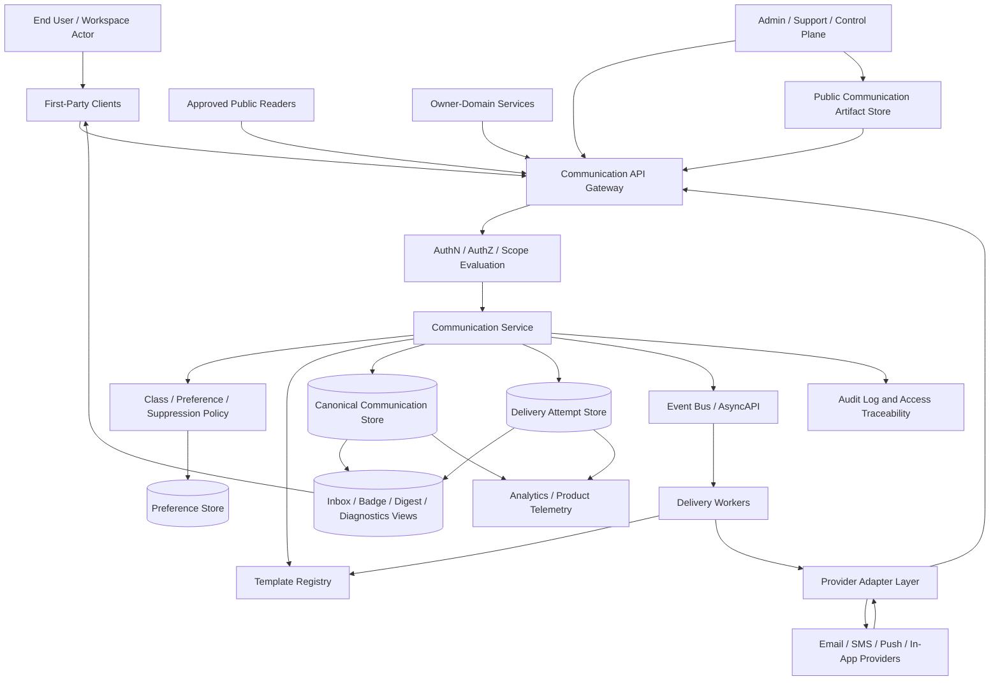
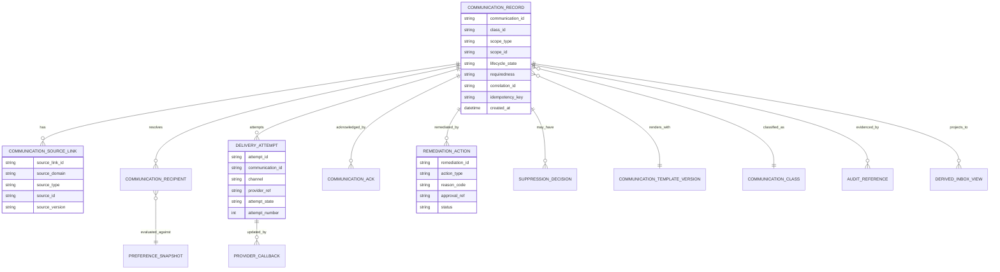
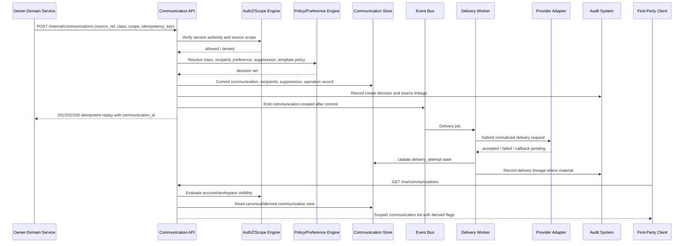

# FUZE Notification and User Communication API Specification

## Document Metadata

- **Document Name:** `NOTIFICATION_AND_USER_COMMUNICATION_API_SPEC.md`
- **Document Type:** Production-grade API SPEC v2
- **Status:** Draft production API specification
- **Version:** 2.0.0
- **Effective Date:** 2026-04-24
- **Last Updated:** 2026-04-24
- **Reviewed On:** 2026-04-24
- **Document Owner:** FUZE Platform Notification and Communication Governance Domain; named individual owner is not explicitly specified in the retrieved governing materials
- **Approval Authority:** Not explicitly specified in the retrieved governing materials; approval authority remains governed by the active FUZE approval workflow and higher-order specification process
- **Review Cadence:** SHOULD be reviewed quarterly and whenever communication classes, delivery channels, preference posture, incident/continuity communication posture, billing-document delivery, security notices, public-trust communication, provider adapters, retention posture, or privileged operator controls materially change
- **Governing Layer:** API contract layer derived from refined system semantics
- **Parent Registry:** `API_SPEC_INDEX.md` and the API SPEC v2 canonical registry
- **Upstream Semantic Registry:** `REFINED_SYSTEM_SPEC_INDEX.md`
- **Upstream API Registry:** `API_SPEC_INDEX.md`
- **Primary Audience:** API architects, backend engineers, frontend engineers, communication-service implementers, platform engineers, support/control-plane engineers, billing engineers, security engineers, incident/continuity operators, audit/compliance reviewers, analytics engineers, provider-adapter implementers, OpenAPI/AsyncAPI/SDK authors
- **Primary Purpose:** Define the production-grade API contract posture for FUZE notifications and user communication, including communication records, source links, recipients, preferences, suppression, templates, delivery attempts, digests, remediation, provider adapter boundaries, public-safe reads, admin/control actions, events, webhooks, idempotency, auditability, observability, migration, acceptance criteria, and implementation QA tests
- **Primary Upstream References:** `REFINED_SYSTEM_SPEC_INDEX.md`; `NOTIFICATION_AND_USER_COMMUNICATION_SPEC.md`; `API_ARCHITECTURE_SPEC.md`; `PUBLIC_API_SPEC.md`; `INTERNAL_SERVICE_API_SPEC.md`; `EVENT_MODEL_AND_WEBHOOK_SPEC.md`; `IDEMPOTENCY_AND_VERSIONING_SPEC.md`; `MIGRATION_AND_BACKWARD_COMPATIBILITY_SPEC.md`; `IDENTITY_AND_ACCOUNT_SPEC.md`; `AUTH_SESSION_AND_LINKED_LOGIN_SPEC.md`; `WORKSPACE_AND_ORGANIZATION_SPEC.md`; `SCOPED_AUTHORIZATION_MODEL_SPEC.md`; `ACCESS_EVALUATION_AND_EFFECTIVE_PERMISSION_SPEC.md`; `ENTITLEMENT_AND_CAPABILITY_GATING_SPEC.md`; `INVOICING_AND_RECEIPTS_SPEC.md`; `PAYMENT_FRAUD_AND_ABUSE_PREVENTION_SPEC.md`; `SECURITY_AND_RISK_CONTROL_SPEC.md`; `MONITORING_ALERTING_AND_INCIDENT_RESPONSE_SPEC.md`; `BUSINESS_CONTINUITY_AND_RECOVERY_SPEC.md`; `WORKFLOW_AND_AUTOMATION_SPEC.md`; `JOB_QUEUE_AND_WORKER_SPEC.md`; `DATA_CLASSIFICATION_AND_HANDLING_SPEC.md`; `DATA_RETENTION_DELETION_AND_ARCHIVAL_SPEC.md`; `AUDIT_LOG_AND_ACTIVITY_SPEC.md`; `AUDIT_AND_ACCESS_TRACEABILITY_SPEC.md`; `ANALYTICS_AND_PRODUCT_TELEMETRY_SPEC.md`; `PUBLIC_CONTRACT_AND_WALLET_REGISTRY_SPEC.md`; `TRANSPARENCY_REPORTING_SPEC.md`
- **Primary Downstream Dependents:** Communication service implementation contracts; notification center contracts; user/workspace preference APIs; provider delivery adapter contracts; billing-document delivery workflows; security/account notice flows; incident and continuity communication runbooks; support/control-plane remediation tooling; analytics and product telemetry contracts; OpenAPI and AsyncAPI artifacts; SDK contracts; QA contract suites; migration adapters from product-local notification systems
- **API Surface Families Covered:** First-party application read/update APIs; internal service creation/orchestration APIs; admin/control-plane remediation APIs; event/async APIs; provider-adapter implementation APIs; reporting/analytics-safe derived read APIs; limited public communication artifact reads where explicitly approved
- **API Surface Families Excluded:** Raw delivery-provider public APIs; marketing campaign authoring systems outside canonical communication classes; exact copywriting/localization authoring tools; exact legal disclosure workflows; public transparency report APIs except where they consume communication artifacts as inputs; raw BI/warehouse schema contracts; product-local non-canonical UI notices that do not claim shared-platform communication truth
- **Canonical System Owner(s):** FUZE Platform Notification and Communication Governance Domain, with upstream owner domains retaining truth over the business events being communicated
- **Canonical API Owner:** FUZE Platform API Governance and Communication API Domain
- **Supersedes:** No same-name v1 API spec was found in the retrieved materials. This spec supersedes weaker or product-local API interpretations that treat delivery logs, emails, push messages, UI toasts, or status banners as canonical communication truth, or allow operator communication without bounded template, scope, reason-code, and audit controls
- **Superseded By:** None currently defined
- **Related Decision Records:** Not explicitly specified in retrieved materials
- **Canonical Status Note:** This API spec is authoritative for interface-contract expression of FUZE notification and communication semantics. It does not own system semantics; the refined notification and communication system spec owns the semantic truth. API contracts, OpenAPI/AsyncAPI artifacts, SDKs, provider adapters, workers, dashboards, support tooling, and product surfaces MUST preserve the boundaries defined here.
- **Implementation Status:** Normative API specification for downstream implementation planning and contract derivation
- **Approval Status:** Draft for review under FUZE API governance
- **Change Summary:** Created API SPEC v2 version for the notification and user communication domain. Normalized route/resource families, public/first-party/internal/admin/event distinctions, canonical communication-vs-delivery-vs-preference truth, idempotent creation/send/remediation behavior, provider adapter boundaries, derived read-model limits, audit/observability requirements, diagrams, acceptance criteria, and tests.

## Purpose

This API specification defines how FUZE exposes, creates, reads, delivers, suppresses, remediates, and audits notifications and user communications at the interface-contract layer.

The API exists to express refined communication semantics through safe interfaces. It MUST preserve that communications are derived from authorized upstream triggers or bounded operator actions, that delivered messages are not owner-domain business truth, that delivery state is distinct from canonical communication state, and that user/workspace preference does not suppress required security, fraud, billing, continuity, or platform-safety notices unless an approved narrower rule explicitly allows it.

This document governs the API contract, not exact service internals, provider vendor behavior, template copy, legal text, database schema, or UX layout. It is strong enough to support backend implementation planning, first-party UI integration, internal service contracts, admin tooling, worker orchestration, OpenAPI/AsyncAPI/SDK derivation, audit review, migration, and QA.

## Scope

This specification governs API contracts for:

- communication record creation, read, acknowledgement, and lifecycle visibility;
- source-link and upstream-trigger validation at the API boundary;
- recipient resolution and scope attachment for account, workspace, object, and public audience contexts;
- user and workspace communication preference reads and mutations;
- communication-class and template metadata reads;
- suppression, deduplication, digest, expiration, resend, correction, and remediation actions;
- delivery attempt creation and delivery-provider callback ingestion;
- first-party notification center, badge, inbox, toast, banner, and digest reads as derived surfaces;
- internal service creation and dispatch orchestration;
- admin/control-plane emergency holds, resend, suppress, remediate, and public-communication actions;
- event and async delivery posture, including `communication.*` and `preference.*` event families;
- audit, traceability, observability, idempotency, replay, compatibility, and migration behavior.

## Out of Scope

This API spec does not define:

- the canonical meaning or validity of the upstream domain event that triggered a communication;
- invoice, receipt, payment, subscription, credits, fraud, incident, recovery, security, access, or public-trust semantics in full depth;
- exact message copy, brand voice, legal drafting, localization wording, or template authoring UX;
- provider-vendor selection or deliverability optimization internals;
- raw provider APIs or provider-specific callback shapes except as normalized input obligations;
- analytics warehouse schemas or BI dashboards;
- product-local non-canonical notices that do not claim platform communication truth;
- exact frontend layouts for notification center, badges, banners, or preference screens.

## Design Goals

1. Preserve communication as a shared platform API domain rather than allowing product-local messaging APIs to fragment shared semantics.
2. Ensure API-created communications always derive from explicit authorized triggers or bounded operator actions.
3. Keep canonical communication truth, delivery truth, preference truth, template truth, authorization truth, and derived views separate.
4. Provide stable first-party reads without allowing clients to mint shared communication meaning.
5. Provide internal creation APIs that require source references, class, scope, template, policy, idempotency, and correlation metadata.
6. Provide bounded admin/control APIs for resend, suppression, correction, remediation, emergency holds, and public communication with reason-coded audit lineage.
7. Support multi-channel delivery while preserving one canonical communication identity and lifecycle.
8. Ensure required notices cannot be accidentally suppressed by promotional or optional-preference settings.
9. Make provider delivery callbacks normalized input truth until accepted by FUZE communication APIs.
10. Make OpenAPI, AsyncAPI, SDK, provider-adapter, worker, analytics, and QA derivations deterministic and safe.

## Non-Goals

- Make communication records the canonical proof of the upstream event they describe.
- Make provider delivery logs the system of record for FUZE communication truth.
- Let delivery success prove invoice issuance, payment finality, incident resolution, entitlement grant, permission outcome, or public-report publication.
- Let public banners or status pages prove private recipient notification coverage.
- Let support/operator tools bypass template, scope, reason-code, authorization, or audit controls.
- Guarantee delivery across every channel under every provider or destination failure mode.
- Make all communications user-configurable.
- Replace downstream implementation contracts, database schemas, provider adapters, or runbooks.

## Core Principles

1. **API-specs-express-system-truth principle:** This API spec expresses the refined communication model; it MUST NOT redefine it.
2. **Communication-is-not-business-truth principle:** APIs MAY describe upstream truth but MUST NOT treat the communication response as the upstream business outcome.
3. **Authorized-trigger principle:** API creation requires canonical source references or approved operator control references.
4. **Required-vs-optional distinction principle:** API contracts MUST preserve requiredness and suppression policy as machine-readable fields.
5. **Scope-correctness principle:** API requests MUST bind to explicit recipient and audience scopes or fail closed.
6. **Channel-is-not-meaning principle:** Channel selection and provider delivery do not change communication semantics.
7. **Idempotent-communication principle:** Creation, scheduling, resend, suppression, and remediation APIs MUST be idempotent or explicitly versioned.
8. **Provider-normalization principle:** Provider callbacks and delivery logs remain normalized delivery-input truth until accepted by FUZE.
9. **Derived-view subordination principle:** Inboxes, unread counts, badges, digests, analytics, and provider dashboards are derived read surfaces.
10. **Auditable-control principle:** Admin and operator communication actions MUST be reason-coded, policy-constrained, correlated, and auditable.

## Canonical Definitions

- **Communication Record:** Canonical API resource representing the semantic identity and lifecycle of a FUZE communication.
- **Communication Source Link:** API-visible reference to the upstream event, business object, workflow, incident, invoice, security action, continuity event, or operator action that authorized communication creation.
- **Communication Class:** API-visible classification determining requiredness, sensitivity, suppression, channel eligibility, template policy, and audit posture.
- **Recipient Resolution Snapshot:** Immutable or versioned record of the recipients, scopes, channels, and contact/destination references selected for a communication at decision time.
- **Delivery Attempt:** Channel/provider-specific attempt to send, surface, or dispatch a communication.
- **Preference:** User- or workspace-scoped configuration that shapes optional delivery but cannot override required notices except where explicit policy allows.
- **Suppression:** Explicit API result indicating a communication, recipient, channel, or resend was not delivered because preference, policy, deduplication, quieting, invalid destination, containment, or safety rules required it.
- **Remediation:** Bounded corrective API action after wrong-scope delivery, wrong-channel delivery, duplicate sends, failed required notices, malformed content, stale template, provider failure, or unsafe operator action.
- **Public Communication Artifact:** Broad-audience communication, distinct from private recipient communications and distinct from public-trust registry/reporting truth.

## Truth Class Taxonomy

The API MUST preserve these truth classes:

1. **Semantic truth:** Owned by upstream refined system specs and owner domains.
2. **API contract truth:** Route/resource, request, response, error, status, idempotency, compatibility, and event contract obligations defined here.
3. **Policy truth:** Communication class rules, requiredness, suppression, template, channel, and operator-control policy.
4. **Trigger/source truth:** Upstream source references that authorize communication creation.
5. **Canonical communication truth:** Communication records, class, scope, lifecycle, recipients, source links, remediation lineage.
6. **Delivery truth:** Delivery attempts, provider responses, retries, terminal channel outcomes.
7. **Preference truth:** User/workspace preferences, channel choices, locale settings, quieting, suppression exceptions.
8. **Authorization truth:** Who may read, create, suppress, remediate, resend, publish, or mutate preferences.
9. **Template/content truth:** Template identity, version, locale variant, renderer input contract, and content artifact metadata.
10. **Projection/reporting truth:** Notification center, badges, digest summaries, support dashboards, analytics, provider reports.
11. **Presentation truth:** UI copy, copy variants, product labels, badge wording, and display rendering.

API implementations MUST NOT collapse these into one undifferentiated `message` model.

## Architectural Position in the Spec Hierarchy

This document sits beneath the refined registry and the refined `NOTIFICATION_AND_USER_COMMUNICATION_SPEC.md`. It consumes API architecture, public API, internal service API, event/webhook, idempotency/versioning, migration, identity/session, workspace/authz, billing, security, incident, continuity, audit, data-retention, and analytics refined semantics.

It governs the API expression of communication semantics. It does not replace upstream owner domains, communication system semantics, provider adapter specifications, implementation contracts, storage schema contracts, or machine-readable OpenAPI/AsyncAPI artifacts.

## Upstream Semantic Owners

- `NOTIFICATION_AND_USER_COMMUNICATION_SPEC.md` owns communication semantics, class posture, preference/suppression posture, delivery lineage, operator discipline, and derived-view rules.
- Identity/account/session specs own actor identity, account continuity, contact ownership, verified destination posture, and authenticated session posture.
- Workspace/access specs own workspace scope, visibility, membership, effective permission, and privileged control-plane access.
- Billing/payment/security/incident/continuity/public-trust specs own the upstream events and required notice conditions that communication APIs express but do not redefine.
- Audit specs own evidence semantics.
- Event and worker specs own async/event semantics outside this API's narrower communication event posture.
- Data lifecycle specs own retention, deletion, archival, masking, and classification constraints.

## API Surface Families

### Public API
Generally excluded. Public APIs MAY expose only approved public communication artifacts or public status-style references where a separate public API/public-trust specification authorizes exposure. Public routes MUST be narrow, stable, read-only by default, cache-safe, and must not leak internal incident, recipient, provider, or delivery details.

### First-Party Application API
Used by FUZE first-party clients for notification center, inbox, badge, read/acknowledge, preference management, and scoped delivery-status summaries. These APIs are authenticated, scope-aware, and derived-read aware. They MUST NOT create shared-platform communication truth directly.

### Internal Service API
Used by owner-domain services and workflow/worker systems to create canonical communication records, schedule delivery, create delivery attempts, process provider callbacks, and update delivery state. These APIs require source references, idempotency keys, class, scope, template, policy, and correlation IDs.

### Admin / Control-Plane API
Used for bounded resend, suppression, emergency hold, remediation, correction, template/class overrides, and public communication publication. These APIs require privileged authorization, reason codes, policy references, audit lineage, and stronger idempotency semantics.

### Event / Async API
Used for communication lifecycle events, delivery events, preference events, remediation events, and provider-normalization events. Async events are synchronization signals and MUST NOT become canonical communication truth by themselves.

### Reporting / Analytics API
Derived reads MAY expose communication engagement, delivery performance, unread counts, class-level health, and provider diagnostics. These APIs MUST remain derived and subordinate to canonical communication and delivery records.

### Provider Adapter API
Provider-facing integrations MUST be normalized through adapter contracts. Raw provider callbacks MUST not mutate canonical communication records without verification, normalization, idempotency, and source linkage.

## System / API Boundaries

Communication APIs own interface contracts for communication resources and control actions. They do not own upstream business truth, final authorization truth, invoice/receipt truth, incident/recovery truth, security risk truth, public-trust truth, or analytics truth.

A communication API MAY accept `source_ref` from an upstream owner domain, but the upstream domain remains the semantic owner. A delivery API MAY accept provider callback input, but the communication API must normalize and validate it before it affects FUZE delivery truth. A first-party read API MAY expose derived unread count, but the unread count is not canonical communication truth.

## Adjacent API Boundaries

- **Identity/account/session APIs:** own authenticated user identity, account contact destinations, verified destination posture, login/security notice triggers.
- **Workspace/access APIs:** own workspace-scoped visibility and effective permission to read or manage workspace communications.
- **Billing/invoicing APIs:** own invoices, receipts, payment events, billing-document truth, and billing-required notice triggers.
- **Security/risk APIs:** own security challenges, fraud/security restrictions, high-risk required notices, and protective containment.
- **Monitoring/incident and continuity APIs:** own incident/recovery records and status; communication APIs only create audience-scoped artifacts derived from those records.
- **Workflow/job APIs:** own work acceptance and execution; communication APIs schedule and deliver communication work without redefining workflow truth.
- **Audit APIs:** own immutable evidence. Communication APIs must emit audit-worthy facts but not define audit semantics.
- **Analytics APIs:** may measure communication performance as derived telemetry only.
- **Public trust APIs:** own registry/report publication; communication APIs may publish public communication artifacts only under explicit authority.

## Conflict Resolution Rules

1. The refined registry and higher-order boundary specs win over this API spec.
2. `NOTIFICATION_AND_USER_COMMUNICATION_SPEC.md` wins on communication system semantics.
3. Owner-domain specs win on the meaning and validity of the event being communicated.
4. Access/authorization specs win on visibility and mutation authorization where they are stricter.
5. Security, incident, continuity, billing, fraud, and public-trust specs win where they impose narrower required notice, disclosure, or suppression posture.
6. This API spec wins on communication API route/resource, request/response/error/status, idempotency, event, and SDK derivation posture within those semantic boundaries.
7. Provider logs, frontend states, dashboards, analytics, exports, cached views, and support notes never win over canonical communication records or upstream truth.
8. Ambiguity defaults to the more restrictive, architecture-consistent interpretation.

## Default Decision Rules

- No create request without a valid `source_ref` or approved `operator_action_ref`.
- Ambiguous communication class resolves to the stricter class or `review_required`.
- Unknown recipient scope resolves to `no_send`, `review_required`, or `scope_resolution_failed`, not best-guess delivery.
- Required security, fraud, billing, continuity, and legal/safety notices default to durable retry or explicit review, not silent suppression.
- Optional/promotional communication defaults to suppression if consent, eligibility, scope, preference, or classification is uncertain.
- Duplicate trigger replay defaults to idempotent reuse or controlled suppression, not duplicate messaging.
- Provider callback ambiguity defaults to quarantine and diagnostics.
- Public communication defaults to non-public unless public-safe publication authority is explicit.
- Derived views MUST mark derived status or stay unavailable when canonical state cannot be verified.

## Roles / Actors / API Consumers

- **End User:** reads account-scoped communications, acknowledges messages, manages personal preferences where allowed.
- **Workspace Member/Admin:** reads workspace-scoped communications according to membership and effective permission; manages workspace preferences where authorized.
- **Owner-Domain Service:** creates communications from canonical domain events via internal APIs.
- **Communication Service:** canonical API owner for records, preferences, suppression, delivery orchestration, and provider normalization.
- **Delivery Worker:** renders, sends, retries, and terminalizes delivery attempts under communication policy.
- **Provider Adapter:** normalizes provider callbacks, bounces, delivery receipts, and error codes.
- **Support Operator:** views scoped diagnostics and executes bounded resend/suppression/remediation if authorized.
- **Admin/Control Operator:** executes privileged public communication, emergency hold, correction, or remediation with reason code and audit lineage.
- **Analytics Consumer:** reads derived communication telemetry without acquiring communication truth ownership.
- **Audit/Compliance Reviewer:** reads evidence-bearing lineage through approved audit paths.

## Resource / Entity Families

- `communication_records`
- `communication_source_links`
- `communication_recipients`
- `communication_templates`
- `communication_template_versions`
- `communication_render_artifacts`
- `communication_delivery_attempts`
- `communication_preferences`
- `communication_suppression_rules`
- `communication_suppression_decisions`
- `communication_acknowledgements`
- `communication_digests`
- `communication_remediation_actions`
- `communication_public_artifacts`
- `communication_provider_callbacks`
- `communication_operation_records`
- `communication_audit_events`
- derived `notification_center_views`, `badge_counts`, `delivery_diagnostics`, and `communication_analytics_views`

## Ownership Model

The Communication API Domain owns canonical API contracts for communication resources and delivery orchestration. It may create and mutate communication records only through authorized source references, policy evaluation, and idempotent operation records. It does not own identity, workspace scope, upstream event validity, invoice issuance, incident declaration, security risk determination, public-trust publication, or analytics interpretation.

Owner-domain services MUST use internal communication APIs rather than creating product-local canonical message records. Provider adapters MUST not write directly to canonical communication state. First-party clients MUST not mint communication truth. Admin/control actions MUST be bounded and audit-linked.

## Authority / Decision Model

- **Create Authority:** Internal owner-domain services or approved control-plane actors only.
- **Read Authority:** End users and workspace actors according to account/workspace scope, visibility, membership, and effective permission.
- **Preference Authority:** User or workspace actors according to preference scope and effective permission; required-notice rules override optional preferences.
- **Delivery Authority:** Communication service and delivery workers under communication class and provider policy.
- **Resend/Suppress/Remediate Authority:** Admin/control or support roles only where authorized, reason-coded, and audit-linked.
- **Public Publish Authority:** Explicit public communication authority only; internal notification admin authority does not imply public publication authority.

## Authentication Model

All non-public routes MUST require authenticated principals or authenticated service principals. First-party reads require user session authentication. Internal create/delivery routes require service-to-service authentication with service identity and environment identity. Admin/control routes require privileged authentication, step-up where required, and audit-capable actor attribution. Public communication artifact reads MAY be unauthenticated only when a public API/public-trust spec explicitly allows that exposure.

## Authorization / Scope / Permission Model

APIs MUST enforce:

- account-scoped communications visible only to the account or authorized support/control actors;
- workspace-scoped communications visible only to authorized workspace actors with effective permission;
- object-scoped communications visible only through the object owner's visibility rules;
- public artifacts visible only after public publication authority;
- template, class, suppression, remediation, and provider diagnostic APIs restricted to internal/admin actors;
- stale membership, stale permission, stale contact verification, or unknown scope failures as fail-closed outcomes for trust-sensitive messages.

## Entitlement / Capability-Gating Model

Entitlement MAY gate optional product communication features, premium notification center capabilities, or advanced analytics. Entitlement MUST NOT suppress required notices, create communications without authorized triggers, or redefine communication semantics. Product capability gates MAY narrow optional communication features but cannot weaken security, billing, continuity, or legal required-notice posture.

## API State Model

### Communication lifecycle states
- `pending_creation`
- `created`
- `scheduled`
- `suppressed`
- `rendered`
- `dispatching`
- `partially_delivered`
- `delivered`
- `delivery_failed`
- `expired`
- `acknowledged`
- `corrected`
- `superseded`
- `remediation_pending`
- `remediated`
- `cancelled`

### Delivery attempt states
- `queued`
- `rendered`
- `provider_submitted`
- `provider_accepted`
- `delivered`
- `bounced`
- `failed_retryable`
- `failed_terminal`
- `quarantined`
- `expired`
- `cancelled`

### Preference states
- `active`
- `disabled_optional`
- `channel_limited`
- `quieted`
- `suppressed_by_policy`
- `superseded`

### Remediation states
- `opened`
- `review_required`
- `approved`
- `executing`
- `completed`
- `failed`
- `closed_with_followup`

State names MAY vary downstream, but the semantic distinctions MUST remain expressible.

## Lifecycle / Workflow Model

1. Upstream owner domain commits a canonical event or an authorized operator creates a bounded action.
2. Internal create API receives source reference, class, scope, template, idempotency key, and correlation metadata.
3. Communication service validates source legitimacy, class policy, recipient scope, preference, suppression, template, locale, and channel eligibility.
4. Canonical communication record and operation record are committed.
5. Events are emitted after commit.
6. Delivery worker renders channel artifacts and creates delivery attempts.
7. Provider adapter submits and normalizes responses/callbacks.
8. Delivery state is terminalized or retried according to class policy.
9. First-party reads expose canonical or derived views with scope-aware filtering.
10. Admin/control actions may resend, suppress, correct, supersede, remediate, or hold under strict authorization and audit.
11. Analytics and reporting consume derived communication and delivery facts without becoming canonical communication truth.

## Architecture Diagram - Mermaid flowchart

## Data Design - Mermaid Diagram

## Flow View

### Standard internal communication creation
1. Internal owner-domain service sends `CreateCommunication` with `source_ref`, `communication_class`, `scope`, `template_ref`, `recipient_strategy`, `idempotency_key`, `correlation_id`, and `trace_id`.
2. API authenticates service principal and verifies creation authority for the class and source domain.
3. API validates that upstream source is compatible with class and scope.
4. Communication service resolves recipients through identity/workspace/access rules.
5. Policy engine evaluates requiredness, preference, suppression, deduplication, quieting, channel eligibility, and template governance.
6. API commits canonical communication record, source link, recipient snapshot, suppression decisions, and operation record.
7. API returns `201 Created`, `200 Idempotent Replay`, `202 Accepted`, or `207 Partial Suppression` depending on contract outcome.
8. Events trigger delivery workers.
9. Workers render and create delivery attempts.
10. Provider callbacks update delivery attempts after normalization.

### First-party read path
1. User requests notification center, communication detail, badge count, or preference state.
2. API authenticates session and evaluates account/workspace scope.
3. API reads canonical records and/or derived views.
4. Sensitive fields and provider diagnostics are redacted unless actor has privileged support/control access.
5. Response marks canonical vs derived fields.

### Admin remediation path
1. Operator submits resend, suppress, correction, public artifact, or remediation request with reason code.
2. API authenticates privileged actor, performs step-up where required, and checks class policy.
3. API validates that the action does not rewrite upstream truth or hide prior history.
4. API commits remediation action and audit reference.
5. API schedules bounded follow-up delivery or suppression actions.

### Failure and degraded mode
If upstream truth, scope, preference, template, destination, or provider state is ambiguous, APIs MUST return deterministic error/result classes and preserve remediation or pending state where a required notice obligation exists. Optional communications may be suppressed safely with explanation.

## Data Flows - Mermaid sequenceDiagram

## Request Model

All mutation requests MUST include, where applicable:

- `idempotency_key` for create, schedule, resend, suppress, acknowledge, remediate, and preference mutation;
- `correlation_id` and `trace_id`;
- `source_ref` or `operator_action_ref`;
- `communication_class`;
- `scope_type` and `scope_id`;
- recipient strategy or explicit recipient references, subject to policy;
- `template_ref` and `template_version` where governed template use is required;
- `requiredness` or class-derived requiredness indicator;
- `policy_version_ref` where policy evaluation must be reconstructible;
- reason code for privileged actions;
- optional `operation_mode` such as `create_only`, `create_and_schedule`, `dry_run`, `validate_only`, or `remediate`.

Requests MUST NOT contain raw secrets, unvalidated rich content, arbitrary freeform trust-sensitive copy, or provider-specific state as canonical input unless a provider-adapter contract normalizes it first.

## Response Model

Responses MUST distinguish:

- canonical communication state;
- delivery state;
- suppression state;
- preference evaluation summary;
- acknowledgement/read state;
- operation acceptance vs final delivery outcome;
- canonical fields vs derived fields;
- public-safe fields vs privileged diagnostics;
- idempotent replay result vs new mutation result;
- async operation reference where delivery or remediation continues after API response.

Representative result classes:

- `created`
- `accepted_for_delivery`
- `suppressed_by_preference`
- `suppressed_by_policy`
- `partially_suppressed`
- `already_processed`
- `scheduled`
- `delivery_pending`
- `delivery_failed`
- `remediation_opened`
- `review_required`
- `blocked_by_scope_uncertainty`
- `blocked_by_required_notice_policy`

## Error / Result / Status Model

APIs MUST use deterministic error classes such as:

- `AUTHENTICATION_REQUIRED`
- `AUTHORIZATION_DENIED`
- `SCOPE_NOT_VISIBLE`
- `SOURCE_REF_REQUIRED`
- `SOURCE_REF_INVALID`
- `COMMUNICATION_CLASS_UNKNOWN`
- `COMMUNICATION_CLASS_REQUIRES_TEMPLATE`
- `TEMPLATE_VERSION_INVALID`
- `RECIPIENT_SCOPE_UNRESOLVED`
- `DESTINATION_NOT_VERIFIED`
- `PREFERENCE_STATE_AMBIGUOUS`
- `SUPPRESSION_NOT_ALLOWED_FOR_REQUIRED_NOTICE`
- `DUPLICATE_IDEMPOTENCY_CONFLICT`
- `DELIVERY_PROVIDER_UNAVAILABLE`
- `PROVIDER_CALLBACK_INVALID`
- `REMEDIATION_REASON_REQUIRED`
- `PUBLICATION_AUTHORITY_REQUIRED`
- `MIGRATION_ALIAS_NOT_CANONICAL`
- `RATE_LIMITED`
- `ABUSE_DETECTED`
- `DEGRADED_MODE_HOLD`

Errors MUST not leak unsafe workspace, account, recipient, incident, billing, or security details to unauthorized callers.

## Idempotency / Retry / Replay Model

- Internal create APIs MUST use idempotency keys scoped by source domain, source object, communication class, recipient scope, and template version.
- Replays with matching payloads MUST return the original operation result or an explicit `already_processed` result.
- Replays with conflicting payloads under the same idempotency key MUST return `DUPLICATE_IDEMPOTENCY_CONFLICT`.
- Resend APIs MUST be separately idempotent from create APIs and MUST include resend reason and delivery target.
- Provider callbacks MUST be idempotent by provider message id, attempt id, provider event id, and normalized event type.
- Required notices that fail delivery MUST preserve retry or remediation state.
- Optional communications MAY terminally suppress after class-policy exhaustion.
- Replay MUST NOT duplicate meaning-bearing user-visible messages unless class policy explicitly authorizes resend.

## Rate Limit / Abuse-Control Model

FUZE MUST enforce rate limits and abuse controls for:

- user acknowledgement and preference mutation endpoints;
- first-party notification listing if abused for enumeration;
- internal creation APIs by source domain and class;
- provider callback ingestion by provider and attempt identity;
- resend and remediation APIs by operator, class, recipient scope, and time window;
- public communication artifact APIs;
- optional/promotional communications by recipient and channel.

Required notices may bypass ordinary optional rate limits only through class policy and MUST remain bounded by abuse, deliverability, and safety controls.

## Endpoint / Route Family Model

The exact route names MAY vary, but downstream OpenAPI MUST preserve these route families:

### First-party communication reads
- `GET /v2/me/communications`
- `GET /v2/me/communications/{communication_id}`
- `POST /v2/me/communications/{communication_id}/acknowledge`
- `GET /v2/workspaces/{workspace_id}/communications`
- `GET /v2/notification-center/views/{scope}`
- `GET /v2/notification-center/badge-counts`

### Preference APIs
- `GET /v2/me/communication-preferences`
- `PATCH /v2/me/communication-preferences`
- `GET /v2/workspaces/{workspace_id}/communication-preferences`
- `PATCH /v2/workspaces/{workspace_id}/communication-preferences`
- `GET /v2/communication-classes`
- `GET /v2/communication-classes/{class_id}`

### Internal service APIs
- `POST /internal/v2/communications`
- `POST /internal/v2/communications/validate`
- `POST /internal/v2/communications/{communication_id}/schedule`
- `POST /internal/v2/communications/{communication_id}/delivery-attempts`
- `POST /internal/v2/provider-callbacks/{provider}`
- `GET /internal/v2/communications/{communication_id}/delivery-summary`

### Admin/control APIs
- `POST /admin/v2/communications/{communication_id}/resend`
- `POST /admin/v2/communications/{communication_id}/suppress`
- `POST /admin/v2/communications/{communication_id}/correct`
- `POST /admin/v2/communications/{communication_id}/remediate`
- `POST /admin/v2/communications/emergency-holds`
- `POST /admin/v2/public-communication-artifacts`
- `GET /admin/v2/communications/{communication_id}/diagnostics`

### Reporting/analytics-safe APIs
- `GET /internal/v2/communication-delivery-health`
- `GET /internal/v2/communication-class-metrics`
- `GET /internal/v2/communication-remediation-cases`

## Public API Considerations

Public APIs MUST be narrow and read-only unless an approved public communication spec explicitly allows otherwise. They MUST expose only public-safe artifacts, not private recipient scope, provider diagnostics, incident detail, support notes, audit evidence, or delivery attempt details. Public artifacts MUST indicate publication state, staleness, supersession, and derivation if relevant.

## First-Party Application API Considerations

First-party APIs SHOULD support rich UX but must remain safe:

- response fields must indicate unread/acknowledged state separately from delivery state;
- badge counts are derived;
- inbox views are derived;
- user preference updates must not suppress required notices;
- workspace communications must be scoped through workspace membership and effective permission;
- deleted or archived UI items must not delete canonical communication history;
- client-side read receipts must be idempotent and not create communication truth beyond acknowledgement state.

## Internal Service API Considerations

Internal service APIs are the primary creation surface. They MUST require:

- authenticated service principal;
- approved source domain;
- source object identity and version;
- communication class;
- scope and recipient strategy;
- template reference where required;
- idempotency key;
- correlation/trace IDs;
- class-compatible policy version.

Internal APIs MUST return accepted-state references when delivery is async and MUST not claim final delivery success in create responses.

## Admin / Control-Plane API Considerations

Admin/control APIs MUST be separated from ordinary application APIs and MUST enforce:

- privileged role and scope;
- step-up or dual control for trust-sensitive public, billing, security, fraud, or incident communications where policy requires it;
- reason code;
- approval reference if required;
- audit reference;
- idempotency key;
- immutable remediation lineage;
- no destructive rewriting of prior user-visible communication history.

## Event / Webhook / Async API Considerations

AsyncAPI derivations SHOULD include:

- `communication.created`
- `communication.suppressed`
- `communication.scheduled`
- `communication.rendered`
- `communication.delivery_attempted`
- `communication.delivered`
- `communication.delivery_failed`
- `communication.expired`
- `communication.acknowledged`
- `communication.corrected`
- `communication.superseded`
- `communication.remediation_opened`
- `communication.remediation_executed`
- `preference.updated`
- `provider_callback.normalized`

Events MUST be emitted after canonical commit. Webhook-like partner notices, if supported, are delivery channels or curated communication artifacts, not raw internal event feeds by default.

## Chain-Adjacent API Considerations

This domain is generally not chain-owning. Chain-adjacent communications MAY notify users about public registry, payout, governance, treasury, or contract-reference events, but communication APIs MUST not redefine chain-native truth, payout truth, registry truth, governance truth, or public-trust reporting truth. Chain-adjacent messages MUST preserve source references, staleness/confirmation posture where relevant, and public-safe wording controls.

## Data Model / Storage Support Implications

Storage contracts MUST preserve:

- canonical communication identity;
- source links;
- recipient snapshots;
- class and template version;
- delivery attempts and provider callback normalization;
- preference snapshots and suppression decisions;
- operation records and idempotency records;
- acknowledgement/read states;
- remediation and correction lineage;
- audit references;
- derived read-model rebuildability;
- retention/deletion/archival classification by communication class.

## Read Model / Projection / Reporting Rules

Derived read models MAY support inbox, badge, unread counts, digest summaries, provider diagnostics, support summaries, and analytics. They MUST not become write owners. Sensitive mutations must re-check canonical backend state. Projection lag must not silently erase or create canonical communication truth. Analytics may aggregate delivery performance but must remain subordinate to communication and delivery records.

## Security / Risk / Privacy Controls

APIs MUST protect against:

- notification spoofing;
- cross-scope recipient leakage;
- wrong-channel delivery;
- content injection;
- unsafe rich content;
- replay-induced duplicate sends;
- provider callback spoofing;
- broad operator access to recipient destinations or content;
- suppression of required notices;
- derived unread counts driving privileged action;
- public exposure of private communication or incident/security detail.

Privacy and classification controls MUST apply to communication content, recipient destinations, provider diagnostics, bounces, and delivery metadata.

## Audit / Traceability / Observability Requirements

Every material mutation MUST be traceable to:

- upstream source or operator action;
- authenticated actor or service principal;
- communication class and template version;
- recipient and scope context;
- preference and suppression rules evaluated;
- channels attempted and outcomes;
- idempotency key;
- correlation and trace IDs;
- reason code for privileged actions;
- policy version;
- audit reference;
- remediation lineage if any.

Observability MUST distinguish upstream-trigger failure, communication creation failure, policy suppression, render failure, provider submission failure, provider callback failure, delivery terminal failure, and derived-view projection lag.

## Failure Handling / Edge Cases

- Upstream event exists but communication creation fails: preserve pending/remediation state if required notice obligation exists.
- Communication created but provider unavailable: canonical communication remains intact; delivery state becomes retryable or terminal failure by class policy.
- Wrong recipient scope detected before send: fail closed and open remediation/review.
- Wrong recipient scope detected after send: preserve history, contain further sends, open remediation, and issue correction only through approved policy.
- Preference ambiguity during security incident: required notice posture wins.
- Invoice exists but delivery lags: invoice truth remains owned by invoicing domain.
- Duplicate provider callback: idempotent no-op or state confirmation.
- Provider claims delivery for unknown attempt: quarantine and diagnostics.
- Public banner published but private recipients not notified: do not infer private notification coverage.
- Derived unread count conflicts with canonical record: canonical record wins.

## Migration / Versioning / Compatibility / Deprecation Rules

- Product-local shared-platform notification systems MUST migrate to canonical communication APIs or be explicitly marked non-canonical.
- Legacy provider IDs may be preserved as adapter references but not canonical communication IDs.
- Legacy logs missing scope, class, source link, or remediation lineage MUST NOT be treated as complete control-plane evidence without normalization and caveat.
- Historical assumptions that email sent equals business action completed are superseded.
- Backward-compatible read aliases may exist temporarily, but canonical v2 resource naming and truth distinctions must be preserved.
- Deprecation of communication classes, templates, routes, or provider adapters MUST preserve historical communication readability and audit lineage.

## OpenAPI / AsyncAPI / SDK Derivation Rules

OpenAPI and SDK artifacts MUST:

- distinguish communication, delivery attempt, preference, suppression, remediation, template, and derived view resources;
- mark required vs optional notices;
- include idempotency headers for mutation routes;
- include `correlation_id`, `trace_id`, `operation_id`, and `audit_ref` where appropriate;
- type source references and scope references explicitly;
- avoid generic `message` models that collapse truth classes;
- expose canonical vs derived field markers;
- avoid provider-specific callback payloads as canonical models.

AsyncAPI artifacts MUST mark communication events as post-commit synchronization signals, not substitutes for canonical records.

## Implementation-Contract Guardrails

Downstream services MUST NOT:

- create shared-platform communications from frontend speculation;
- write provider callback state directly into canonical records without normalization;
- use delivery success as business truth;
- suppress required notices due to optional preference;
- delete wrong communications to hide history;
- give product teams local APIs to mint shared communication classes;
- rely on unread counts for privileged remediation;
- expose raw provider diagnostics to ordinary users;
- make public banners equivalent to private notices;
- optimize away source links, class, template version, preference snapshots, suppression rationale, delivery lineage, idempotency, or audit references.

## Downstream Execution Staging

1. Stabilize communication class taxonomy and required/optional posture.
2. Stabilize canonical resource model, source links, scope attachment, and idempotency records.
3. Implement internal creation and first-party read APIs.
4. Implement preference and suppression APIs.
5. Implement delivery attempt and provider callback normalization.
6. Implement admin/control remediation, resend, suppress, correction, and emergency hold paths.
7. Implement event families and worker integration.
8. Implement derived inbox, badge, digest, support diagnostics, and analytics views.
9. Migrate product-local and legacy notification pathways.
10. Harden contract tests, migration aliases, and operational dashboards.

## Required Downstream Specs / Contract Layers

- Communication service implementation contract
- Communication preference API implementation contract
- Delivery provider adapter contracts
- Template registry and renderer contracts
- Notification center / inbox / badge contracts
- Delivery worker and retry contract
- Admin/control remediation tooling contract
- Incident and continuity communication runbooks
- Billing-document delivery workflow contract
- Security alert and account-notice workflow contract
- Analytics and product telemetry communication-measurement contract
- Retention/deletion/archival contract for communication records
- OpenAPI and AsyncAPI contract packages

## Boundary Violation Detection / Non-Canonical API Patterns

APIs and QA checks SHOULD detect:

- communication creation without source reference;
- product-local shared class creation;
- provider log as source of truth;
- missing idempotency key on create/resend/remediate;
- unsupported freeform operator security/billing/incident message;
- required notice suppressed by optional preference;
- cross-scope recipient resolution;
- public artifact treated as private notice coverage;
- destructive deletion of incorrect communication history;
- derived inbox state used for admin mutation;
- missing template version for governed classes;
- delivery callback without attempt identity.

## Canonical Examples / Anti-Examples

### Canonical Example - Security Login Notice
A security domain event creates a required account-scoped communication. Recipient resolution uses verified account destinations. Preferences cannot suppress the required notice. Delivery failure creates retry/remediation state. The notice does not become account-access truth.

### Canonical Example - Invoice Delivery Failure
Invoicing owns invoice truth. Communication API records invoice-delivery communication and delivery failure. Resend is idempotent and audit-linked. The invoice remains valid or invalid according to invoicing APIs, not email delivery state.

### Canonical Example - Incident Update
Incident API owns incident record and status. Communication API creates private scoped notices and, separately, public communication artifacts only if approved. Public banner state does not prove every private recipient was notified.

### Anti-Example - Email as Receipt Truth
An API returns `payment_success` because email delivery succeeded. Forbidden.

### Anti-Example - Provider Callback Direct Write
A provider bounce callback directly mutates a communication record without FUZE normalization and idempotency. Forbidden.

### Anti-Example - Marketing Preference Suppresses Fraud Notice
A user disables promotional messaging and fraud-required notices stop. Forbidden.

### Anti-Example - Support Freeform Threat
A support operator sends a billing/security-sensitive freeform message without template, reason code, or audit. Forbidden.

## Acceptance Criteria

1. Create APIs reject requests without `source_ref` or approved `operator_action_ref`.
2. Communication class is machine-readable and determines requiredness, template, preference, suppression, and channel posture.
3. Required notices cannot be suppressed by optional preference settings.
4. First-party reads enforce account/workspace scope and mark derived views.
5. Workspace communication reads fail closed on stale membership or effective-permission ambiguity for sensitive classes.
6. Create/resend/suppress/remediate APIs require idempotency and behave deterministically under replay.
7. Delivery provider callbacks are normalized, authenticated/verified where possible, and idempotent.
8. Provider logs never outrank canonical communication/delivery attempt records.
9. Delivery state remains separate from communication lifecycle and upstream business truth.
10. Admin/control routes require privileged authorization, reason code, correlation ID, and audit reference.
11. Wrong-scope or wrong-destination cases enter remediation without destructive history rewrite.
12. Public communication artifacts are separate from private recipient notifications and public-trust reporting truth.
13. Events are emitted only after canonical commit.
14. Derived inboxes, badge counts, digests, dashboards, analytics, and provider reports do not own communication truth.
15. OpenAPI models do not collapse communication, delivery, preference, template, and remediation into one generic message object.
16. AsyncAPI marks communication events as synchronization signals, not canonical record substitutes.
17. Migration adapters preserve legacy IDs as adapter references only.
18. Audit lineage can reconstruct source, actor, class, template, recipients, preference/suppression, delivery attempts, and remediation actions.
19. Sensitive fields are redacted from unauthorized responses.
20. Contract tests cover positive, negative, authorization, idempotency, replay, conflict, rate-limit, degraded-mode, audit, migration, and boundary-violation behavior.

## Test Cases

### Positive tests
1. Internal billing source creates required invoice-delivery communication with valid source link and template; response returns `created` and delivery operation reference.
2. Security source creates required login notice; user marketing opt-out does not suppress delivery attempt.
3. First-party client lists account-scoped communications and receives only authorized records.
4. Workspace admin with permission reads workspace-scoped incident communication summary.
5. User updates optional product digest preference with idempotency key and receives updated preference version.
6. Provider callback marks one delivery attempt delivered; duplicate callback returns idempotent confirmation.
7. Operator opens remediation for wrong-channel delivery with reason code and approval reference.
8. Public API reads approved public communication artifact without private recipient details.

### Negative tests
1. Create request without source reference is rejected.
2. Frontend client attempts to create shared-platform communication and is denied.
3. Unknown workspace recipient scope returns `RECIPIENT_SCOPE_UNRESOLVED` and no send occurs.
4. Optional promotional communication with uncertain consent is suppressed.
5. Required security notice suppression request returns `SUPPRESSION_NOT_ALLOWED_FOR_REQUIRED_NOTICE` unless an approved narrower safety policy applies.
6. Provider callback with unknown attempt ID is quarantined.
7. Admin resend without reason code is rejected.
8. Public artifact request for non-public communication returns not found or unauthorized without leaking existence.

### Authorization and scope tests
1. Workspace member without permission cannot read admin-only workspace communication diagnostics.
2. Support operator can view redacted delivery diagnostics but cannot view raw content unless explicitly privileged.
3. User cannot acknowledge another account's communication.
4. Removed workspace member cannot read workspace communications after membership-dependent visibility expires.

### Idempotency, retry, replay, and conflict tests
1. Replaying create with same idempotency key and same payload returns original communication ID.
2. Replaying create with same key and different template returns conflict.
3. Resend replay does not produce duplicate provider submission.
4. Delivery retry after retryable provider failure preserves attempt lineage.
5. Duplicate source event creates one communication or a class-policy digest, not spam.

### Failure and degraded-mode tests
1. Preference store unavailable during required security notice creation results in hold/review or delivery under required policy, not silent suppression.
2. Template registry unavailable for required notice returns pending/remediation state and alert-worthy diagnostics.
3. Provider outage creates retryable delivery failures while canonical communication remains intact.
4. Derived inbox projection lag does not affect canonical communication read by ID.
5. Continuity incident communication uses public/private artifact separation.

### Migration and compatibility tests
1. Legacy provider message ID maps to canonical communication ID as adapter reference.
2. Legacy communication log without scope cannot be used as complete control-plane evidence.
3. Deprecated route returns canonical v2 shape or explicit deprecation metadata.
4. Historical email-sent status cannot mark upstream invoice paid or incident resolved.

### Boundary-violation tests
1. Product-local API attempting to mint shared communication class is rejected.
2. Provider dashboard status cannot override FUZE delivery record.
3. Support freeform security message without governed template is rejected.
4. Public banner cannot be counted as private recipient notice coverage.
5. Analytics open-rate event cannot become communication delivery truth.

## Dependencies / Cross-Spec Links

This API spec depends on refined communication semantics and on adjacent identity, workspace, authorization, billing, security, incident, continuity, workflow, worker, event, idempotency, migration, audit, data lifecycle, analytics, and public-trust specifications. Downstream route-level OpenAPI and AsyncAPI contracts MUST cite this spec as the governing API-family source.

## Explicitly Deferred Items

- Exact OpenAPI schema field names and enum values.
- Exact AsyncAPI topic names and broker configuration.
- Exact delivery provider adapter schemas.
- Exact template copy, localization, and legal text.
- Exact notification center UX and badge calculation implementation.
- Exact retention periods by class.
- Exact operator approval workflow UX.
- Exact analytics metric definitions for delivery performance.

Deferred items MUST NOT weaken the truth separation, API ownership, idempotency, audit, or scope rules in this document.

## Final Normative Summary

The FUZE notification and user communication API family is the canonical interface layer for communication records, preferences, suppression, delivery attempts, templates, remediation, provider normalization, and derived communication reads. It expresses but does not own upstream business semantics. It MUST preserve required-vs-optional distinction, scope correctness, source linkage, delivery lineage, idempotency, provider normalization, admin/control auditability, and derived-view subordination. Public, first-party, internal, admin/control, event, provider-adapter, and reporting surfaces MUST remain separate. Downstream implementations MUST NOT treat emails, push messages, provider logs, public banners, dashboards, unread counters, or analytics as substitutes for canonical communication truth or upstream owner-domain truth.

## Quality Gate Checklist

- [x] Upstream refined semantic owners are explicit.
- [x] Canonical API owner is explicit.
- [x] API surface families are explicit.
- [x] Mutation boundaries are explicit.
- [x] Read boundaries are explicit.
- [x] Adjacent API boundaries are explicit.
- [x] Truth classes are explicit.
- [x] Conflict-resolution rules are explicit.
- [x] Default decision rules are explicit.
- [x] Public, first-party, internal, admin/control, event, provider, reporting, and public-trust distinctions are explicit.
- [x] Non-canonical API patterns are called out.
- [x] Operator/admin override paths are bounded, reason-coded, and audited.
- [x] Read-model, cache, reporting, and projection rules are explicit.
- [x] Chain-adjacent posture is explicit where relevant.
- [x] Accepted-state vs final delivery semantics are explicit.
- [x] Idempotency and replay requirements are explicit.
- [x] Request, response, error, result, and status classes are explicit.
- [x] Failure and degraded-mode behavior is explicit.
- [x] Audit, traceability, and observability requirements are explicit.
- [x] Versioning, migration, compatibility, and deprecation rules are explicit.
- [x] OpenAPI, AsyncAPI, and SDK guardrails are explicit.
- [x] Dependencies and downstream impacts are explicit.
- [x] Non-goals and deferred items are explicit.
- [x] Architecture Diagram uses Mermaid `flowchart` syntax.
- [x] Data Design uses Mermaid `erDiagram` syntax.
- [x] Flow View is included.
- [x] Data Flows sequence diagram is included.
- [x] Acceptance Criteria are concrete and testable.
- [x] Test Cases cover positive, negative, authorization, entitlement/capability, idempotency, retry, conflict, rate-limit, degraded-mode, audit, migration, and boundary-violation behavior.
