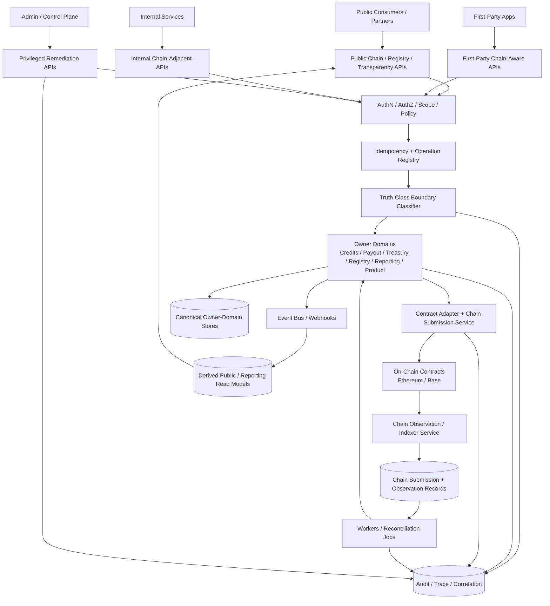
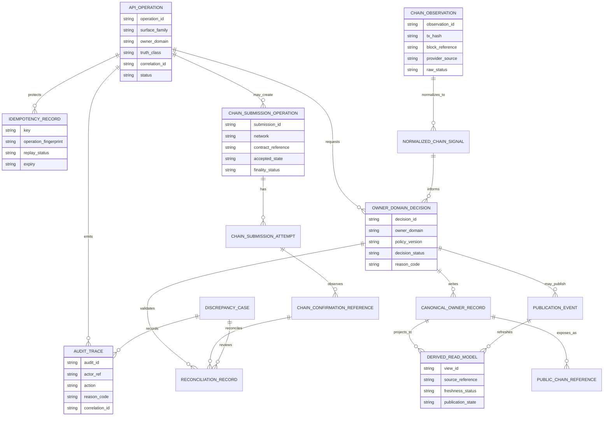
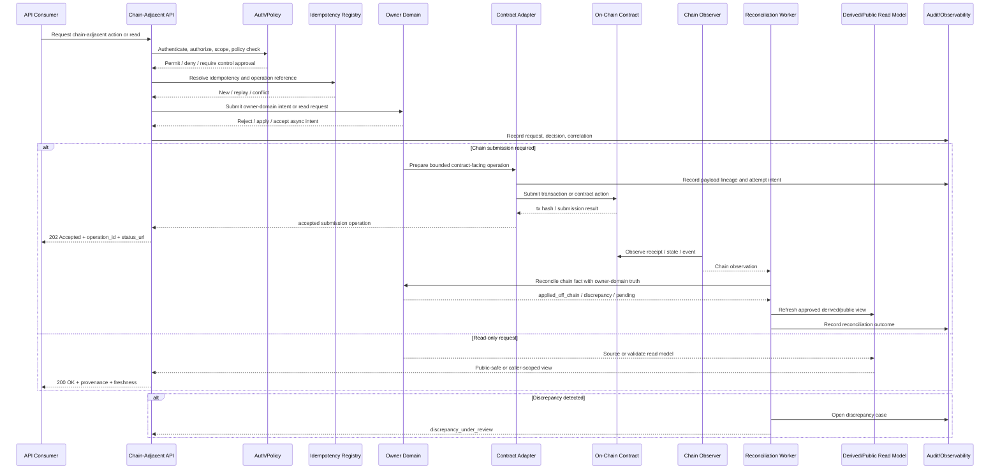

# FUZE On-Chain / Off-Chain Responsibility API Specification

## Document Metadata

- **Document Name:** `ONCHAIN_OFFCHAIN_RESPONSIBILITY_API_SPEC.md`
- **Document Type:** FUZE API SPEC v2 / Production-grade interface-contract specification
- **Status:** Draft production-grade API specification
- **Version:** 2.0.0
- **Effective Date:** 2026-04-24
- **Last Updated:** 2026-04-24
- **Reviewed On:** 2026-04-24
- **Document Owner:** FUZE Platform API Architecture / Chain-Adjacent Interface Governance Domain; named individual owner is not explicitly specified in the retrieved governing materials
- **Approval Authority:** Not explicitly specified in the retrieved governing materials; approval authority remains governed by the active FUZE approval workflow and higher-order constitutional specification process
- **Review Cadence:** SHOULD be reviewed whenever chain commitments, Base/Ethereum responsibility split, payout execution posture, Platform Credits chain posture, registry publication posture, transparency reporting posture, treasury/governance controls, or chain-adjacent API exposure materially changes
- **Governing Layer:** API contract layer derived from platform constitution / chain boundary / on-chain-off-chain responsibility semantics
- **Parent Registry:** `API_SPEC_INDEX.md` for API-family historical structure; API SPEC v2 canonical file registry for this document family
- **Upstream Semantic Registry:** `REFINED_SYSTEM_SPEC_INDEX.md`
- **Upstream API Registry:** `API_SPEC_INDEX.md`
- **Primary Audience:** Platform architecture, backend engineering, contracts engineering, API authors, event/worker authors, treasury and payout engineering, public API authors, registry/reporting authors, security, audit, operations, implementation-contract authors, OpenAPI/AsyncAPI/SDK authors
- **Primary Purpose:** Define the production API contract posture for FUZE APIs that observe, coordinate, prepare, submit, reconcile, expose, or report across the on-chain/off-chain boundary without redefining the refined semantic division of responsibility
- **Primary Upstream References:** `REFINED_SYSTEM_SPEC_INDEX.md`, `DOCS_SPEC_INDEX.md`, `SYSTEM_SPEC_INDEX.md`, `API_SPEC_INDEX.md`, `SYSTEM_BOUNDARY_AND_OWNERSHIP_SPEC.md`, `SYSTEM_OVERVIEW_AND_BOUNDARIES_SPEC.md`, `PLATFORM_ARCHITECTURE_SPEC.md`, `DOMAIN_OWNERSHIP_MATRIX_SPEC.md`, `DATA_MODEL_AND_ENTITY_OWNERSHIP_SPEC.md`, `ONCHAIN_OFFCHAIN_RESPONSIBILITY_SPEC.md`, `API_ARCHITECTURE_SPEC.md`, `PUBLIC_API_SPEC.md`, `INTERNAL_SERVICE_API_SPEC.md`, `EVENT_MODEL_AND_WEBHOOK_SPEC.md`, `IDEMPOTENCY_AND_VERSIONING_SPEC.md`, `MIGRATION_AND_BACKWARD_COMPATIBILITY_SPEC.md`, `CHAIN_ARCHITECTURE_SPEC.md`, `BASE_PAYOUT_EXECUTION_LAYER_SPEC.md`, `BASE_PLATFORM_CREDITS_LAYER_SPEC.md`, `PAYOUT_LEDGER_SPEC.md`, `PROFIT_PARTICIPATION_SYSTEM_SPEC.md`, `SNAPSHOT_AND_ELIGIBILITY_PIPELINE_SPEC.md`, `PUBLIC_CONTRACT_AND_WALLET_REGISTRY_SPEC.md`, `TRANSPARENCY_MODEL_SPEC.md`, `TRANSPARENCY_REPORTING_SPEC.md`, `TREASURY_CONTROL_POLICY_SPEC.md`, `VAULT_ACTION_POLICY_SPEC.md`, `MULTISIG_AND_TIMELOCK_SPEC.md`, `SECURITY_AND_RISK_CONTROL_SPEC.md`, `AUDIT_LOG_AND_ACTIVITY_SPEC.md`, `MONITORING_ALERTING_AND_INCIDENT_RESPONSE_SPEC.md`, `FUZE_ACCOUNT_ACCESS_AND_SESSION_THESIS_FINAL_SPEC.md`, `FUZE_ACCOUNT_ACCESS_AND_SESSION_CANONICAL_FINAL_SPEC.md`, `FUZE_WORKSPACE_ACCESS_CONTROL_BASICS_THESIS_FINAL_SPEC.md`
- **Primary Downstream Dependents:** `CHAIN_ARCHITECTURE_API_SPEC.md`, `BASE_PAYOUT_EXECUTION_LAYER_API_SPEC.md`, `BASE_PLATFORM_CREDITS_LAYER_API_SPEC.md`, `PUBLIC_CHAIN_REFERENCE_API_SPEC.md`, `PUBLIC_REGISTRY_LOOKUP_API_SPEC.md`, `PUBLIC_CONTRACT_AND_WALLET_REGISTRY_API_SPEC.md`, `PUBLIC_PAYOUT_STATUS_API_SPEC.md`, `PAYOUT_LEDGER_API_SPEC.md`, `SNAPSHOT_AND_ELIGIBILITY_PIPELINE_API_SPEC.md`, payout execution implementation contracts, chain adapter contracts, indexer contracts, reconciliation workers, public trust APIs, OpenAPI / AsyncAPI / SDK derivation layers
- **API Surface Families Covered:** public read-safe chain references, first-party chain-aware reads, internal chain-adjacent coordination APIs, admin/control-plane chain-boundary actions, event and webhook coordination, reporting/public-trust derived APIs, implementation-facing contract-adapter APIs
- **API Surface Families Excluded:** raw contract ABI definition, direct wallet/provider SDK implementation, private signer topology APIs, unrestricted chain-node RPC proxying, product-local chain shortcuts, unaudited support scripts, legal/accounting policy documents, raw database schemas
- **Canonical System Owner(s):** FUZE Platform Architecture for the on-chain/off-chain boundary; narrower owner domains for chain layer, credits, payout, treasury, registry, reporting, and product semantics remain authoritative within their scope
- **Canonical API Owner:** FUZE Platform API Architecture / Chain-Adjacent Interface Governance Domain
- **Supersedes:** Earlier or weaker API interpretations that treat chain APIs as generic RPC pass-throughs, let public chain reads imply full business truth, allow off-chain reporting APIs to redefine on-chain state, collapse Base payout execution and Base credits because both use Base, or let internal chain adapters become hidden semantic owners
- **Superseded By:** None currently defined
- **Related Decision Records:** Not explicitly specified in the retrieved governing materials
- **Canonical Status Note:** API specs own interface-contract expression only. Refined system specs own semantic truth. This API specification MUST preserve the refined on-chain/off-chain responsibility model and MUST NOT redefine chain-native, policy, accounting, registry, payout, credits, treasury, governance, product, or reporting truth.
- **Implementation Status:** Normative API specification for downstream route families, event catalogs, adapter contracts, public-read APIs, reconciliation flows, admin/control tools, and machine-readable contracts
- **Approval Status:** Draft pending explicit approval workflow
- **Change Summary:** Created API SPEC v2 interface contract for on-chain/off-chain responsibility. Normalized surface families, request/response/status/error semantics, idempotency and replay safety, public/internal/admin separation, chain-adjacent event posture, audit/observability rules, migration guardrails, diagrams, acceptance criteria, and QA test cases.

## Purpose

This document defines the FUZE API contract posture for interfaces that cross, expose, coordinate, or report on the on-chain/off-chain boundary.

The governing semantic rule is simple: APIs may observe, coordinate, reconcile, explain, and expose bounded state across chain and off-chain systems, but APIs MUST NOT collapse chain-native truth, off-chain policy truth, accounting truth, payout truth, credits truth, treasury/governance truth, registry publication truth, reporting truth, product truth, or provider-input truth into one API-owned model.

This specification exists so downstream API contracts can safely support Ethereum token participation, Base credits commitments, Base payout execution, public registry lookup, transparency reporting, chain-adjacent reconciliation, admin remediation, and implementation-facing adapters without allowing convenience APIs to become shadow semantic owners.

## Scope

This API specification governs:

1. API surface families that expose or coordinate on-chain/off-chain state.
2. Route/resource family posture for chain references, chain observations, off-chain policy decisions, execution operations, reconciliation, registry publication, transparency reporting, and public-safe reads.
3. Request, response, status, and error expectations for chain-adjacent API contracts.
4. Idempotency, retry, replay, duplicate submission, and chain-finality handling.
5. Authorization, scope, entitlement, control-plane, and policy checks for chain-adjacent interfaces.
6. Public, first-party, internal, admin/control, event/webhook, reporting, and implementation-facing API distinctions.
7. Audit, observability, correlation, operation reference, reconciliation, and source-lineage requirements.
8. OpenAPI, AsyncAPI, SDK, worker-contract, and implementation-contract derivation guardrails.

## Out of Scope

This API specification does not define:

- smart contract ABI, bytecode, deployment scripts, gas strategy, or low-level contract storage layout;
- raw node RPC or indexer implementation detail;
- exact provider SDK behavior;
- exact private signer, custody, hot-wallet, cold-wallet, or key-management topology;
- full treasury accounting policy;
- full legal or investor-relations reporting language;
- detailed database schemas;
- product-local UI rendering;
- exact event payload fields beyond interface-level requirements.

Those concerns belong to downstream implementation contracts or adjacent refined/API specs. They MUST remain compatible with this document.

## Design Goals

1. Preserve the refined FUZE on-chain/off-chain responsibility model at every API surface.
2. Make chain-adjacent APIs safe enough for economic, payout, registry, treasury, governance, and public-trust use.
3. Prevent raw chain observations, provider callbacks, explorer data, public views, dashboards, or adapter records from becoming canonical business truth.
4. Distinguish accepted async intent from final chain/business outcome.
5. Support idempotent and replay-safe chain submission and reconciliation flows.
6. Give public APIs stable, narrow, public-safe chain/reference exposure without leaking internal control detail.
7. Ensure admin/control APIs are explicit, bounded, reason-coded, auditable, and separated from ordinary application APIs.
8. Enable OpenAPI, AsyncAPI, SDK, worker, and contract-adapter derivation without semantic drift.
9. Preserve transparency by exposing derived/public trust artifacts only through source-linked, correction-safe read models.
10. Support long-term migration, network expansion, chain upgrades, contract supersession, and compatibility windows.

## Non-Goals

This document is not intended to:

- make API architecture the owner of chain semantics;
- expose direct contract mutation as ordinary public API capability;
- make public chain visibility equivalent to full FUZE business truth;
- convert registry/reporting/public metadata APIs into semantic owners;
- allow product teams to bypass platform chain-adjacent APIs for shared primitives;
- make internal services broad-write shortcuts into chain-sensitive domains;
- collapse Ethereum token participation, Base credits, Base payout execution, registry publication, and treasury controls because they all interact with chain systems.

## Core Principles

### 1. Refined Semantics Win

`ONCHAIN_OFFCHAIN_RESPONSIBILITY_SPEC.md` owns the division between chain-committed truth and off-chain truth. This API specification owns only the interface expression of that division.

### 2. APIs Enforce Boundaries

Chain-adjacent APIs MUST enforce the boundary between chain-native facts and off-chain policy, accounting, execution, registry, reporting, or product truth. They MUST NOT blur that boundary for convenience.

### 3. Explicit Truth Classing

Every material API response touching the boundary MUST make its truth class clear through resource type, state field, provenance, source references, or documentation-level contract.

### 4. Normalization Before Influence

Raw chain events, raw provider callbacks, wallet signals, client-provided transaction hashes, and explorer data are input or observation truth until a FUZE owner domain validates and normalizes them.

### 5. Accepted Does Not Mean Final

Accepted operation references, queued chain submissions, pending confirmations, and observed transactions MUST remain distinct from final business state.

### 6. Owner-Domain Mutation

Canonical business writes MUST terminate in the owner domain. Chain adapters and APIs MAY submit or reconcile, but they MUST NOT invent payout, credits, treasury, registry, or reporting meaning.

### 7. Public Narrowing

Public APIs MUST expose narrower public-safe chain references, statuses, registry entries, and transparency artifacts. Public APIs MUST NOT expose internal signer topology, private wallet inventory, unsafe operational detail, or broad mutation capability.

### 8. Audit and Reconciliation Are Mandatory

Every material chain-adjacent mutation, submission, reconciliation, correction, publication, and privileged read MUST preserve correlation, audit, operation, and source-lineage references.

### 9. Historical Integrity Beats Convenience

Retries, supersessions, corrections, revocations, chain reorg responses, payout discrepancies, registry corrections, and report corrections MUST preserve lineage. Silent rewrite is forbidden.

## Canonical Definitions

### Chain-Adjacent API

An API that observes, prepares, submits, reconciles, publishes, or reports on chain-related state while preserving explicit separation between chain-native truth and off-chain owner-domain truth.

### Chain Observation

A raw or normalized representation of chain state, transaction state, event log, contract state, balance, role reference, or confirmation result.

### Owner-Domain Consequence

A FUZE-approved canonical business result written by the relevant owner domain after validation, policy evaluation, and authorization.

### Chain Submission Operation

A durable accepted intent to submit a contract-facing transaction or payload through approved execution pathways. It is not final success.

### Chain Confirmation Reference

A recorded observation that a chain submission reached an approved confirmation threshold or finality posture. It is still scoped to chain facts and does not necessarily prove full business completion.

### Reconciliation Record

A durable record comparing owner-domain state, chain observations, execution attempts, ledger/projection outputs, and public/reporting surfaces.

### Public Chain Reference

A public-safe resource that identifies approved network, contract, wallet, transaction, payout, registry, or transparency references without exposing unsafe internal control detail.

### Boundary Decision

A decision by an API or owner domain that classifies a requested operation or observed fact as chain-native, off-chain canonical, provider-input, execution, derived, reporting, or presentation truth.

## Truth Class Taxonomy

APIs governed by this document MUST preserve these truth classes:

1. **Semantic truth** — meaning and ownership assigned by refined system specs.
2. **API contract truth** — route/resource/request/response/error semantics defined by API specs.
3. **Policy truth** — authorization, scope, treasury, governance, exposure, eligibility, and publication policy.
4. **Runtime truth** — request processing, job state, chain submission progress, retry status, dependency status.
5. **Ledger / storage truth** — canonical owner-domain records, chain submission records, payout ledger records, idempotency records, audit records.
6. **Chain-native truth** — contract-committed facts and chain-observed state within the relevant network and contract context.
7. **Provider-input truth** — wallet, client, explorer, RPC, relayer, provider, or callback data before FUZE normalization.
8. **Event / async execution truth** — event publication, worker execution, queue status, webhook delivery, and async operation status.
9. **Projection / reporting truth** — derived read models, dashboards, registry views, transparency reports, payout status pages, exports, caches.
10. **Public read-model truth** — intentionally public-safe representation of selected canonical/derived facts.
11. **Presentation truth** — UI labels, explanations, formatting, and user-facing copy.

No API may return or mutate these classes as if they were interchangeable.

## Architectural Position in the Spec Hierarchy

This document sits below the refined semantic sources and above downstream implementation contracts.

- Upstream semantic owner: `ONCHAIN_OFFCHAIN_RESPONSIBILITY_SPEC.md`.
- Upstream constitutional constraints: `SYSTEM_BOUNDARY_AND_OWNERSHIP_SPEC.md`, `SYSTEM_OVERVIEW_AND_BOUNDARIES_SPEC.md`, `PLATFORM_ARCHITECTURE_SPEC.md`, `DOMAIN_OWNERSHIP_MATRIX_SPEC.md`, `DATA_MODEL_AND_ENTITY_OWNERSHIP_SPEC.md`.
- Shared API constraints: `API_ARCHITECTURE_SPEC.md`, `PUBLIC_API_SPEC.md`, `INTERNAL_SERVICE_API_SPEC.md`, `EVENT_MODEL_AND_WEBHOOK_SPEC.md`, `IDEMPOTENCY_AND_VERSIONING_SPEC.md`, `MIGRATION_AND_BACKWARD_COMPATIBILITY_SPEC.md`.
- Adjacent chain and public trust domains: `CHAIN_ARCHITECTURE_SPEC.md`, `BASE_PAYOUT_EXECUTION_LAYER_SPEC.md`, `BASE_PLATFORM_CREDITS_LAYER_SPEC.md`, `PAYOUT_LEDGER_SPEC.md`, `PUBLIC_CONTRACT_AND_WALLET_REGISTRY_SPEC.md`, `TRANSPARENCY_MODEL_SPEC.md`, `TRANSPARENCY_REPORTING_SPEC.md`.

## Upstream Semantic Owners

This API spec consumes, but does not redefine, these semantic owners:

- **Platform Architecture:** top-level platform planes and chain-adjacent posture.
- **On-Chain / Off-Chain Responsibility:** boundary between chain-committed and off-chain responsibilities.
- **Domain Ownership Matrix:** canonical owner-domain assignment.
- **Data Model and Entity Ownership:** canonical vs derived entity posture.
- **Chain Architecture:** network, contract, and chain-layer structure.
- **Base Payout Execution:** payout execution orchestration and Base-side execution semantics.
- **Base Platform Credits:** committed credits state and credits-chain posture where applicable.
- **Payout Ledger:** structured payout-cycle trust records.
- **Public Contract and Wallet Registry:** public registry publication truth.
- **Transparency Reporting:** recurring public-trust report truth.
- **Treasury / Vault / Multisig / Timelock / Governance:** sensitive authority, approval, control, and remediation truth.

## API Surface Families

### Public API

Public APIs MAY expose:

- public-safe chain references;
- official contract and wallet registry lookup;
- public payout status summaries;
- public transparency artifacts;
- public network metadata;
- approved transaction or contract references.

Public APIs MUST NOT expose:

- private signer topology;
- private wallet inventories;
- internal treasury approval detail beyond approved public summaries;
- raw internal chain-adapter state;
- broad contract mutation capability;
- unpublished registry or reporting data;
- owner-domain private canonical records.

### First-Party Application API

First-party APIs MAY expose authenticated, caller-scoped chain-aware reads and permitted actions, such as wallet-aware status, credits visibility, payout claim status, and product-safe chain context. They MUST remain narrower than internal or admin capabilities.

### Internal Service API

Internal APIs MAY coordinate owner-domain validation, chain observation, chain submission preparation, reconciliation, worker dispatch, and read-model refresh. They MUST preserve service identity, owner-domain boundaries, and explicit operation references.

### Admin / Control-Plane API

Admin/control APIs MAY support publication, correction, pause, retry, discrepancy handling, revocation, supersession, and remediation. They MUST be privileged, policy-constrained, reason-coded, audited, and separated from ordinary application routes.

### Event / Webhook / Async API

Events and webhooks MAY publish normalized boundary outcomes, submission-state changes, confirmation-state changes, discrepancy events, registry/publication changes, and reporting-publication changes. They MUST distinguish observed input, accepted intent, canonical owner-domain result, and derived public view.

### Reporting / Public-Trust API

Reporting APIs MAY expose derived public trust artifacts grounded in source lineage. They MUST NOT become source-domain truth owners.

### Implementation-Facing API

Implementation-facing chain-adapter APIs MAY prepare payloads, submit transactions, query receipts, or reconcile observations. They MUST remain internal, authenticated, idempotent, auditable, and subordinate to owner-domain intent.

## System / API Boundaries

1. API gateways and route families do not own chain or business truth.
2. Contract adapters do not own payout, credits, treasury, registry, or reporting semantics.
3. Public read APIs do not own canonical chain state or off-chain source truth.
4. Internal service APIs do not become hidden broad-write shortcuts.
5. Admin/control APIs can constrain or remediate but must not silently bypass owner domains.
6. Events complement APIs; they do not replace owner-domain mutation contracts.
7. Chain observations remain chain observations until owner-domain validation and normalization succeed.

## Adjacent API Boundaries

- `CHAIN_ARCHITECTURE_API_SPEC.md` governs chain architecture API expression in fuller depth.
- `BASE_PAYOUT_EXECUTION_LAYER_API_SPEC.md` governs payout execution API surfaces.
- `BASE_PLATFORM_CREDITS_LAYER_API_SPEC.md` governs Base credits chain API surfaces.
- `PUBLIC_CONTRACT_AND_WALLET_REGISTRY_API_SPEC.md` and `PUBLIC_REGISTRY_LOOKUP_API_SPEC.md` govern registry publication and lookup surfaces.
- `PUBLIC_CHAIN_REFERENCE_API_SPEC.md` governs public chain reference exposure.
- `PUBLIC_PAYOUT_STATUS_API_SPEC.md` governs public payout status surfaces.
- `TRANSPARENCY_REPORTING_API_SPEC.md` and `PUBLIC_TRANSPARENCY_API_SPEC.md` govern transparency report API expression.
- `EVENT_MODEL_AND_WEBHOOK_SPEC.md` governs event and webhook semantics.
- `IDEMPOTENCY_AND_VERSIONING_SPEC.md` governs cross-cutting replay and compatibility rules.

This document provides the cross-cutting boundary posture those narrower API specs must preserve.

## Conflict Resolution Rules

1. Active refined specs win on semantic truth.
2. This API spec wins only on interface-contract expression of the on-chain/off-chain boundary.
3. Chain-native facts win only within the contract/network state they actually commit.
4. Off-chain owner domains win on policy, accounting, eligibility, product, reporting, registry, and treasury interpretation unless a narrower approved chain commitment explicitly owns the relevant fact.
5. API v1 materials are historical and MUST NOT override refined semantics.
6. Public API convenience never expands public exposure beyond approved public-safe surfaces.
7. Internal service convenience never bypasses owner-domain mutation termination.
8. Admin/control approval may authorize, constrain, or remediate, but it does not make the control plane the owner of ordinary business truth.
9. If ambiguity remains, choose the most conservative trust-preserving interpretation and require explicit recorded decision or downstream refinement.

## Default Decision Rules

1. Unclassified chain-related responses default to non-public and non-canonical until classified.
2. Raw chain data defaults to chain-observation truth, not full FUZE business truth.
3. Raw provider, wallet, relayer, RPC, or explorer data defaults to provider-input truth.
4. Chain submission acceptance defaults to `accepted`, not `applied` or `final`.
5. Chain confirmation defaults to chain-native confirmation, not off-chain policy finality.
6. Derived views default to read-only and non-canonical for mutation.
7. Public exposure defaults to withheld or narrower summary when public-safety status is unclear.
8. Retry defaults to blocked when duplicate settlement or duplicate chain effect cannot be ruled out.
9. Admin remediation defaults to reason-coded, audited, and lineage-preserving.
10. If an API cannot name the owner domain, truth class, surface family, and mutation boundary, it is incomplete and MUST NOT ship.

## Roles / Actors / API Consumers

### Human Actors

- public users and community observers;
- authenticated FUZE users;
- workspace members and owners;
- holders and claimants where applicable;
- partners and public registry consumers;
- support operators;
- treasury/governance reviewers;
- security and audit reviewers.

### System Actors

- public API gateway;
- first-party frontend surfaces;
- internal platform services;
- product services;
- chain-adjacent coordination services;
- contract adapters;
- indexers and observation services;
- payout execution workers;
- credits workers;
- registry publication services;
- transparency/reporting services;
- audit and monitoring systems;
- admin/control-plane services.

## Resource / Entity Families

Allowed resource families include:

- `chain_network_reference`
- `contract_reference`
- `wallet_reference`
- `public_registry_entry_reference`
- `chain_observation`
- `normalized_chain_signal`
- `chain_submission_operation`
- `chain_submission_attempt`
- `chain_confirmation_reference`
- `reconciliation_record`
- `discrepancy_case`
- `public_chain_reference`
- `payout_execution_reference`
- `credits_commitment_reference`
- `treasury_control_reference`
- `governance_control_reference`
- `transparency_source_reference`
- `idempotency_record`
- `audit_trace_reference`

These resources MUST be named so their truth class and owner domain are visible.

## Ownership Model

- Chain-native state is owned by the relevant contract/network context.
- Off-chain canonical state is owned by the relevant FUZE owner domain.
- API contracts own interface expression, not business truth.
- Chain adapters own submission mechanics and observation handling, not payout/credits/treasury/registry/reporting meaning.
- Public registry APIs expose registry publication truth, not chain-native truth.
- Transparency APIs expose derived reporting truth, not source-domain truth.
- Payout status APIs expose bounded derived status, not full payout execution or eligibility ownership.
- Admin APIs own controlled remediation pathway semantics, not ordinary business ownership.

## Authority / Decision Model

### Ordinary User Authority

Authenticated users may perform only caller-scoped, policy-permitted actions. Wallet possession, transaction hash submission, or client-provided chain evidence is not sufficient authority to mutate owner-domain truth.

### Service Authority

Internal service callers require service identity, operation purpose, scope, and policy authorization. Service-to-service trust MUST be explicit and bounded.

### Owner-Domain Authority

Owner domains decide whether chain observations become business consequences.

### Chain Authority

Contracts decide contract-native state. Chain state does not decide off-chain accounting, reporting, eligibility, product, or public registry meaning outside its explicitly committed scope.

### Control Authority

Control-plane actors may approve, pause, retry, restrict, supersede, publish, or remediate only through explicitly bounded, audited APIs.

## Authentication Model

APIs governed by this spec MUST use authentication appropriate to surface family:

- public unauthenticated reads only for approved public-safe resources;
- authenticated public/first-party reads for caller-scoped chain-aware data;
- service identity for internal chain-adjacent APIs;
- step-up authentication and privileged operator identity for admin/control APIs;
- webhook signing or delivery authentication for outbound and inbound webhook flows;
- contract-adapter credentials restricted to least-privilege execution pathways.

Authentication alone is never sufficient for action authority.

## Authorization / Scope / Permission Model

Authorization MUST evaluate:

- caller identity or service identity;
- requested surface family;
- target owner domain;
- workspace/account scope where relevant;
- operation class;
- policy version;
- entitlement/capability where relevant;
- public/private visibility state;
- treasury/governance/control requirements;
- chain/network/contract risk posture;
- rate-limit and abuse posture;
- degraded-mode restrictions.

## Entitlement / Capability-Gating Model

Entitlement may gate access to chain-aware capabilities, but entitlement is not the owner of chain truth. Capability gates MAY determine whether a caller may initiate a permitted chain-adjacent request, view a caller-scoped status, or access a product-linked public/private read. They MUST NOT redefine payout entitlement, credits truth, registry publication truth, or chain-native state.

## API State Model

API responses MUST distinguish:

- `requested`
- `validated`
- `accepted`
- `observed`
- `normalized`
- `submitted`
- `receipt_pending`
- `confirmed_on_chain`
- `applied_off_chain`
- `reconciled`
- `published`
- `partially_applied`
- `conflicted`
- `discrepancy_under_review`
- `failed_retryable`
- `failed_terminal`
- `compensated`
- `superseded`
- `revoked`
- `deprecated`

`confirmed_on_chain` MUST NOT be presented as `applied_off_chain` unless the owner domain has actually applied the off-chain consequence.

## Lifecycle / Workflow Model

1. **Request or Observation:** Caller submits a request or system observes a chain/provider event.
2. **Authentication and Surface Validation:** API identifies caller, surface family, operation class, and visibility posture.
3. **Authorization and Policy Evaluation:** Scope, permission, entitlement, policy, and control requirements are checked.
4. **Idempotency Resolution:** The operation key and semantic intent are checked before side effects.
5. **Truth-Class Classification:** Input is classified as chain observation, provider input, owner-domain action, execution operation, derived read, or public view.
6. **Owner-Domain Validation:** The relevant owner domain accepts, rejects, or defers the consequence.
7. **Execution or Projection:** If required, a chain submission, worker operation, read-model update, or publication refresh proceeds under explicit operation references.
8. **Confirmation and Reconciliation:** Chain observations and off-chain records are reconciled.
9. **Audit and Event Emission:** Audit records, events, webhooks, and observability signals are emitted as appropriate.
10. **Public/Derived Exposure:** Approved public/derived views update without becoming owners.
11. **Correction or Remediation:** Discrepancies proceed through bounded admin/control flows with preserved lineage.

## Architecture Diagram - Mermaid flowchart

## Data Design - Mermaid Diagram

## Flow View

### Synchronous Public Read

1. Caller requests public chain reference, registry entry, payout status, or transparency artifact.
2. API validates public exposure posture and rate-limit status.
3. API reads derived/public read model with source and freshness metadata.
4. API returns public-safe response with provenance, visibility state, and no private operational detail.
5. Audit or access telemetry is recorded according to sensitivity.

### Authenticated Chain-Aware Read

1. Caller authenticates through first-party surface.
2. API resolves account/workspace/caller scope.
3. Owner-domain or derived caller-scoped read is selected.
4. Response distinguishes chain-native, off-chain canonical, and derived fields.
5. Privileged or sensitive fields require additional permission and audit.

### Internal Chain Submission

1. Owner domain accepts an operation requiring chain submission.
2. API resolves idempotency key, owner-domain intent, policy version, and operation reference.
3. Contract adapter prepares a bounded payload.
4. Submission attempt is recorded and emitted to execution workers.
5. Chain confirmation is observed.
6. Reconciliation maps chain result back to owner-domain state.
7. Derived/public views refresh only after owner-domain and publication rules permit.

### Discrepancy Handling

1. Reconciliation detects mismatch between chain observation, submission record, owner-domain state, ledger, registry, or public view.
2. System opens a discrepancy case.
3. Ordinary mutation/retry is blocked where duplicate or unsafe effects are possible.
4. Admin/control actor reviews through privileged, reason-coded API.
5. Remediation produces correction, supersession, retry, pause, revocation, or public stale/unavailable posture.
6. Audit and events preserve full lineage.

## Data Flows - Mermaid sequenceDiagram

## Request Model

Material mutation or chain-adjacent operation requests MUST include, where relevant:

- operation intent;
- target owner domain;
- surface family;
- actor or service identity;
- account/workspace scope where relevant;
- chain/network identifier;
- contract reference or registry reference;
- policy version or policy reference;
- idempotency key for mutating or accepted async operations;
- correlation ID and trace context;
- reason code for privileged/admin/control operations;
- source references for provider or chain input;
- expected state or precondition when conflict risk exists;
- public visibility intent where publication is requested.

APIs MUST reject mutation requests that omit required owner-domain, policy, idempotency, or reason-code fields.

## Response Model

Responses MUST identify:

- resource type;
- owner domain;
- truth class;
- status;
- operation ID for accepted or async operations;
- idempotency replay status where applicable;
- correlation ID;
- audit trace reference for privileged operations;
- source references or provenance for chain/public/reporting reads;
- freshness/staleness for derived views;
- next allowed action where useful;
- safe public/private visibility state.

Accepted async responses SHOULD use `202 Accepted` with operation reference. They MUST NOT imply final success.

## Error / Result / Status Model

APIs MUST distinguish these error/result classes:

- `authentication_required`
- `authorization_denied`
- `scope_denied`
- `entitlement_denied`
- `policy_denied`
- `public_visibility_denied`
- `owner_domain_required`
- `truth_class_mismatch`
- `invalid_chain_reference`
- `unsupported_network`
- `contract_not_registered`
- `registry_entry_unpublished`
- `idempotency_key_missing`
- `idempotency_conflict`
- `duplicate_submission_risk`
- `chain_submission_pending`
- `chain_confirmation_pending`
- `chain_reorg_or_finality_uncertain`
- `provider_input_untrusted`
- `normalization_failed`
- `reconciliation_required`
- `discrepancy_under_review`
- `rate_limited`
- `degraded_mode_restricted`
- `migration_version_unsupported`
- `admin_reason_code_required`
- `audit_lineage_required`

Errors MUST be machine-readable and mapped to stable problem codes in downstream OpenAPI contracts.

## Idempotency / Retry / Replay Model

Mutating and accepted async APIs MUST require idempotency keys. The idempotency record MUST bind:

- caller or service identity;
- operation class;
- owner domain;
- semantic payload fingerprint;
- target chain/network/contract reference where relevant;
- expected state/precondition;
- policy version;
- operation reference;
- result or accepted status.

Retries MUST return prior result when the semantic operation matches. Retries MUST fail with `idempotency_conflict` when the key is reused for a different semantic intent. Chain submissions MUST additionally guard against duplicate settlement, duplicate payout, duplicate credit commitment, duplicate publication, and unsafe replay of control actions.

## Rate Limit / Abuse-Control Model

Public and first-party chain-aware APIs MUST enforce rate limits appropriate to public trust, cost, and abuse posture. High-risk reads such as registry enumeration, transaction-status polling, payout-status lookups, and chain-reference search MAY use stricter throttles, caching, or pagination. Mutation and admin/control APIs MUST use stricter anti-abuse controls, anomaly detection, and privileged review. Rate limits MUST not be bypassed by switching from public to first-party surfaces without corresponding authorization.

## Endpoint / Route Family Model

This specification does not prescribe final endpoint paths, but allowed route families SHOULD follow these patterns:

### Public Read Families

- `GET /public/chain/networks`
- `GET /public/chain/contracts/{contract_reference}`
- `GET /public/registry/contracts/{registry_reference}`
- `GET /public/registry/wallets/{registry_reference}`
- `GET /public/payout-status/{cycle_reference}`
- `GET /public/transparency/chain-references/{reference}`

### First-Party Authenticated Families

- `GET /me/chain-context`
- `GET /me/wallet-aware-status`
- `GET /me/payouts/{cycle_reference}/status`
- `GET /workspaces/{workspace_id}/chain-aware-products/{product_reference}`

### Internal Coordination Families

- `POST /internal/chain-observations/normalize`
- `POST /internal/chain-submissions`
- `GET /internal/chain-submissions/{operation_id}`
- `POST /internal/reconciliation/chain-boundary-runs`
- `POST /internal/read-models/public-chain-refresh`

### Admin / Control Families

- `POST /admin/chain-boundary/discrepancies/{case_id}/resolve`
- `POST /admin/chain-submissions/{operation_id}/pause`
- `POST /admin/chain-submissions/{operation_id}/retry`
- `POST /admin/public-chain-references/{reference}/supersede`
- `POST /admin/registry-chain-references/{reference}/restrict`

All route families MUST preserve owner-domain and truth-class distinctions in schemas and documentation.

## Public API Considerations

Public APIs MUST be stable, narrow, source-linked, and safe. They MAY expose public chain references, official registry entries, public payout cycle status, supported networks, and transparency artifacts. They MUST provide freshness and provenance where the response is derived. They MUST NOT expose private operational controls, internal discrepancy detail, signer topology, unpublished registry entries, raw chain-adapter records, or unsupported inferred meaning.

## First-Party Application API Considerations

First-party application APIs MAY provide richer authenticated views than public APIs, but only within caller scope. They MUST not become internal broad-read channels. They MUST distinguish chain-native state from off-chain account/workspace/product status. They MUST not treat wallet possession or transaction hash evidence as sufficient authority for unrelated state changes.

## Internal Service API Considerations

Internal service APIs MUST use service identity, explicit owner-domain references, operation IDs, idempotency records, and audit lineage. Internal APIs MAY coordinate chain observations, owner-domain validation, adapter submission, reconciliation, and derived model refresh. They MUST NOT permit non-owner services to mutate canonical state directly.

## Admin / Control-Plane API Considerations

Admin/control APIs MUST be separate from ordinary application APIs. They MUST require privileged authorization, reason codes, policy references, audit trace IDs, and bounded operation classes. Permitted control actions MAY include pause, retry, discrepancy creation/resolution, supersession, registry restriction, publication correction, and degraded-mode override. Forbidden actions include silent deletion of execution history, unaudited direct contract invocation, unpublished public exposure, and unbounded state rewriting.

## Event / Webhook / Async API Considerations

Events MUST distinguish:

- raw chain observation received;
- chain observation normalized;
- owner-domain intent accepted;
- chain submission accepted;
- chain submission attempted;
- chain confirmation observed;
- owner-domain consequence applied;
- discrepancy opened/resolved;
- public read model refreshed;
- registry/reporting publication changed.

Webhook delivery MUST be limited to approved public/partner-safe facts and MUST NOT leak internal operation details.

## Chain-Adjacent API Considerations

Chain-adjacent APIs MUST preserve:

- network identity;
- contract identity;
- registry/public designation state;
- operation lineage;
- chain finality posture;
- owner-domain consequence status;
- discrepancy status;
- public-safety posture.

Direct chain submission APIs MUST be internal or admin/control only unless a narrower approved domain API explicitly exposes a bounded public user action.

## Data Model / Storage Support Implications

Downstream storage MUST separately persist:

- API operation records;
- idempotency records;
- chain observation records;
- normalized chain signal records;
- submission operation records;
- submission attempt and receipt records;
- owner-domain decision records;
- reconciliation records;
- discrepancy cases;
- derived read-model snapshots;
- public publication states;
- audit trace records.

Storage schemas MUST NOT combine these into one ambiguous status table that obscures truth class or owner domain.

## Read Model / Projection / Reporting Rules

Derived read models MAY aggregate chain observations, owner-domain state, registry entries, payout-ledger facts, and transparency artifacts. They MUST:

- record source references;
- record freshness/staleness;
- identify canonical owner for each sourced fact;
- prevent writes through derived projections;
- preserve correction and supersession lineage;
- expose public-safe subsets only after publication policy permits.

## Security / Risk / Privacy Controls

APIs MUST protect:

- private signer topology;
- private wallet inventory;
- unsafe treasury/governance operational detail;
- workspace-private product state;
- account/session secrets;
- raw provider credentials;
- internal risk signals;
- unpublished registry/reporting artifacts;
- discrepancy details whose publication could create exploitation risk.

Security-sensitive routes MUST support least privilege, anomaly detection, audit, rate limits, and emergency restriction.

## Audit / Traceability / Observability Requirements

Every material mutation, accepted async intent, chain submission, admin/control action, public publication, discrepancy action, and privileged read MUST emit:

- correlation ID;
- trace ID;
- actor/service identity;
- owner domain;
- surface family;
- truth class;
- operation reference;
- idempotency reference where applicable;
- policy version;
- reason code for privileged actions;
- source references;
- outcome status.

Observability MUST distinguish dependency failure, provider failure, chain pending state, chain confirmed state, owner-domain applied state, and discrepancy state.

## Failure Handling / Edge Cases

### Chain Reorganization or Finality Uncertainty

APIs MUST report `chain_reorg_or_finality_uncertain` or equivalent pending/finality states. Derived/public views MUST not overstate finality.

### Provider / RPC Inconsistency

Conflicting provider observations MUST be treated as discrepancy or pending reconciliation, not inferred success.

### Duplicate Submission Risk

If retry could duplicate settlement, credit commitment, payout, or registry/publication effect, retry MUST be blocked until remediation.

### Owner-Domain Disagreement

If chain observation and owner-domain state disagree, the API MUST return discrepancy or reconciliation status. It MUST NOT let the API choose a new business truth.

### Public Projection Lag

Public APIs MUST expose stale/unavailable/refreshing state instead of fabricating current truth.

### Admin Remediation Failure

Failure of an admin remediation action MUST preserve the original state, remediation attempt, actor, reason code, and failure reason.

## Migration / Versioning / Compatibility / Deprecation Rules

- Public APIs MUST maintain stronger compatibility and narrower contract evolution.
- Internal APIs MAY evolve faster but MUST preserve migration lineage and contract versioning.
- Admin/control APIs MUST preserve audit and reason-code compatibility through migrations.
- Contract supersession MUST preserve old and new contract references and public registry linkage.
- Network migration MUST not silently reinterpret historical chain references.
- Derived read-model migration MUST preserve source lineage and freshness semantics.
- Breaking changes require explicit versioning, coexistence or cutover plan, and deprecation posture.

## OpenAPI / AsyncAPI / SDK Derivation Rules

OpenAPI and SDK artifacts MUST:

- expose truth-class and owner-domain semantics in schemas or documentation;
- distinguish accepted async responses from final outcomes;
- define stable error codes;
- require idempotency keys for mutation and async acceptance;
- avoid generic `status` fields without enumerated meaning;
- avoid SDK helper methods that imply direct ownership of chain or business truth;
- mark public-safe fields separately from internal/admin-only fields.

AsyncAPI/event artifacts MUST:

- distinguish observed, normalized, accepted, submitted, confirmed, applied, reconciled, published, and discrepancy events;
- preserve correlation and operation references;
- prevent event consumers from treating event receipt as permission to mutate non-owned canonical truth.

## Implementation-Contract Guardrails

Implementation contracts MUST NOT:

1. implement public chain APIs as raw RPC proxies;
2. let frontend state decide final chain/business state;
3. let chain adapters write owner-domain business records directly without owner-domain acceptance;
4. let reporting or registry projections mutate source truth;
5. merge chain observation, submission, confirmation, owner decision, reconciliation, and public projection into one table without truth-class separation;
6. omit idempotency for chain submissions;
7. retry chain actions when duplicate economic effect cannot be ruled out;
8. expose admin correction through ordinary application routes;
9. silently overwrite registry, reporting, payout, or execution history;
10. treat Base payout execution and Base credits as one shared API domain merely because both use Base.

## Downstream Execution Staging

1. Confirm upstream refined owner-domain semantics.
2. Define route family, surface family, and owner domain.
3. Define request and response schemas with truth-class labels.
4. Define idempotency and operation-reference behavior.
5. Define audit, event, and observability hooks.
6. Define read-model and publication dependencies.
7. Define public/internal/admin visibility split.
8. Define migration and compatibility posture.
9. Define QA contract tests and boundary-violation tests.

## Required Downstream Specs / Contract Layers

- OpenAPI contracts for each public, first-party, internal, and admin route family.
- AsyncAPI event catalogs for chain boundary events.
- Chain adapter implementation contracts.
- Reconciliation worker contracts.
- Public read-model contracts.
- Registry/publication implementation contracts.
- Security and audit implementation contracts.
- Migration plans for contract/network supersession.

## Boundary Violation Detection / Non-Canonical API Patterns

Forbidden patterns include:

- public `POST /chain/transactions` that submits arbitrary contract calls;
- route families that expose chain status as full business finality;
- product-local APIs that mint credits or payout semantics outside shared owner domains;
- internal services writing payout, credits, treasury, registry, or reporting tables directly after seeing chain events;
- public registry pages that maintain independent official address lists;
- transparency APIs that summarize source truth without source lineage;
- admin routes that mutate chain-related state without reason code and audit;
- worker retries without idempotency and duplicate-effect checks;
- SDK methods named as if they finalize business outcomes when they only submit chain transactions.

## Canonical Examples / Anti-Examples

### Canonical Example: Public Contract Lookup

A public API returns an official contract reference with network, address, registry status, supersession state, source artifact links, and freshness. It does not expose signer topology or claim that the registry entry is the full chain truth.

### Anti-Example: Explorer-Driven Business Status

A frontend observes a transaction on an explorer and marks a payout cycle complete. This is forbidden because chain observation has not been reconciled through owner-domain and payout-ledger rules.

### Canonical Example: Chain Submission Accepted

An internal API accepts an owner-domain-approved payout execution submission and returns `202 Accepted` with operation ID, submission reference, and pending confirmation status.

### Anti-Example: Synchronous Finality

An API submits a transaction and returns `200 payout_complete` before chain confirmation and owner-domain reconciliation. This is forbidden.

### Canonical Example: Discrepancy Case

A chain receipt conflicts with backend execution records. The API opens `discrepancy_under_review`, blocks unsafe retry, and requires audited admin remediation.

### Anti-Example: Silent Rewrite

An operator edits the public payout status read model to hide a failed attempt. This is forbidden.

## Acceptance Criteria

1. Every chain-adjacent API route identifies its surface family, owner domain, and truth class.
2. Public APIs expose only approved public-safe fields and omit private operational detail.
3. Mutating and accepted async APIs require idempotency keys and stable operation references.
4. API responses distinguish accepted, submitted, confirmed-on-chain, applied-off-chain, reconciled, and published states.
5. Raw provider, wallet, explorer, RPC, and chain event inputs cannot mutate owner-domain truth without normalization and owner-domain acceptance.
6. Chain submission APIs prevent duplicate economic effects during retry and replay.
7. Admin/control APIs require privileged authorization, reason codes, policy references, and audit lineage.
8. Derived/public read models include source references, freshness/staleness, and publication state.
9. Event and webhook contracts distinguish observed, normalized, accepted, submitted, confirmed, applied, reconciled, published, and discrepancy events.
10. Discrepancy handling blocks unsafe retry and preserves remediation lineage.
11. Public registry and transparency routes do not become source-domain owners.
12. OpenAPI schemas include stable error/result codes and do not use ambiguous untyped status values.
13. AsyncAPI schemas include correlation, operation, and source references.
14. Migration plans preserve historical contract/network references and supersession lineage.
15. Boundary-violation tests fail builds that introduce raw RPC public mutation, direct database writes by non-owners, or hidden admin shortcuts.

## Test Cases

### Positive Path Tests

1. **Public contract lookup returns safe registry-derived data.** Verify no private signer topology or internal control metadata is returned.
2. **Authenticated payout-status read returns caller-scoped view.** Verify chain-native, off-chain, and derived fields are labeled distinctly.
3. **Internal owner-domain chain submission returns accepted operation.** Verify `202 Accepted`, operation ID, idempotency record, audit trace, and no final success claim.
4. **Chain confirmation reconciles into owner-domain state.** Verify chain observation becomes owner-domain consequence only after validation.
5. **Public read model refresh follows publication policy.** Verify source references and freshness update.

### Negative Path Tests

6. **Raw tx hash cannot finalize business state.** Submit tx hash without owner-domain validation; expect `provider_input_untrusted` or equivalent.
7. **Unknown contract reference denied.** Request action against unregistered contract; expect `contract_not_registered`.
8. **Unsupported network denied.** Request operation on unsupported network; expect `unsupported_network`.
9. **Missing owner domain rejected.** Internal request without owner domain; expect `owner_domain_required`.
10. **Truth-class mismatch rejected.** Attempt to mutate canonical state through reporting API; expect `truth_class_mismatch`.

### Authorization / Scope / Entitlement Tests

11. **Public caller cannot access internal operation detail.** Expect `authorization_denied` or public-safe narrowing.
12. **First-party caller cannot view another workspace chain context.** Expect `scope_denied`.
13. **Service identity without domain authorization cannot submit chain operation.** Expect `authorization_denied`.
14. **Capability gate prevents chain-aware product access.** Expect `entitlement_denied` without changing chain/business state.
15. **Admin action requires reason code.** Missing reason code returns `admin_reason_code_required`.

### Idempotency / Retry / Replay Tests

16. **Identical retry returns prior accepted operation.** Same key and payload returns prior operation reference.
17. **Different payload with same key fails.** Expect `idempotency_conflict`.
18. **Unsafe duplicate settlement retry is blocked.** Expect `duplicate_submission_risk` and discrepancy/remediation requirement.
19. **Provider timeout retry preserves attempt lineage.** Verify multiple attempts under one operation without overwriting.
20. **Replay after finalization returns previously applied state.** Verify no duplicate chain submission.

### Conflict / Discrepancy Tests

21. **Chain observation conflicts with backend state.** Verify discrepancy case opens and public projection does not mark final success.
22. **RPC providers disagree.** Verify finality uncertainty or discrepancy state, not inferred success.
23. **Chain reorg detected.** Verify state moves to pending/reconciliation-required and events are emitted.
24. **Payout ledger and execution status disagree.** Verify reconciliation record and correction workflow, not direct overwrite.
25. **Registry entry superseded.** Verify old reference remains intelligible with successor linkage.

### Rate Limit / Abuse Tests

26. **Public lookup enumeration is throttled.** Verify rate-limit code and no internal leak.
27. **Repeated tx-status polling uses cache/stale response safely.** Verify freshness metadata.
28. **Suspicious submission pattern triggers risk restriction.** Verify no side effect after restriction.

### Degraded Mode / Operations Tests

29. **Indexer degraded mode.** Public API returns stale/unavailable posture and does not fabricate current truth.
30. **Chain adapter degraded mode.** Submission route returns retryable failure or accepted-pending only if durable operation state exists.
31. **Audit backend unavailable for privileged action.** Privileged mutation fails closed.
32. **Read model refresh fails after owner-domain apply.** Canonical state remains correct; public view reports stale.

### Migration / Compatibility Tests

33. **Contract supersession preserves old references.** Verify public and internal APIs include supersession lineage.
34. **Versioned public schema remains backward-compatible.** Verify deprecated fields remain or have migration path.
35. **SDK does not expose finalizing helper for accepted-only operation.** Contract validation rejects misleading SDK generation.

### Boundary-Violation Tests

36. **Raw RPC public proxy route is rejected during review.** Verify route classification fails.
37. **Non-owner internal service attempts direct canonical write.** Verify authorization and contract tests fail.
38. **Reporting API attempts source mutation.** Verify method not allowed.
39. **Admin shortcut without audit is rejected.** Verify no state change.
40. **Product-local credits/payout chain route is rejected.** Verify shared owner-domain API required.

## Dependencies / Cross-Spec Links

This document depends on the refined registry and upstream refined specs for semantic truth. It depends on API architecture, event/webhook, idempotency/versioning, and migration specs for cross-cutting interface posture. It is upstream to chain architecture API, public chain reference API, Base payout execution API, Base credits API, public registry API, transparency API, and implementation-facing adapter contracts.

## Explicitly Deferred Items

- Exact endpoint paths and field-level schemas for each narrower domain API.
- Exact smart contract ABI and event names.
- Exact chain finality thresholds by network.
- Exact registry role taxonomy values.
- Exact transparency report family field lists.
- Exact signer/custody implementation detail.
- Exact rate-limit numbers.
- Exact OpenAPI/AsyncAPI machine-readable artifacts.

Deferred items MUST preserve this document's truth-class, owner-domain, idempotency, audit, and public-safety rules.

## Final Normative Summary

FUZE APIs that touch chain systems MUST preserve the refined on-chain/off-chain responsibility model. Chain-native facts are authoritative only within their committed contract/network scope. Off-chain owner domains remain authoritative for policy, accounting, eligibility, product, reporting, registry publication, treasury, governance, and public-trust interpretation unless a narrower approved contract commitment explicitly owns the relevant fact. API surfaces may expose, coordinate, submit, reconcile, and publish across the boundary, but they MUST NOT become semantic owners. Public surfaces must be narrow and safe. Internal surfaces must preserve owner-domain mutation discipline. Admin/control surfaces must be bounded, reason-coded, and audited. Events and derived read models must preserve source lineage and must not become hidden write owners.

## Quality Gate Checklist

- [x] Upstream refined semantic owners are explicit.
- [x] Canonical API owner is explicit.
- [x] API surface families are explicit.
- [x] Mutation boundaries are explicit.
- [x] Read boundaries are explicit.
- [x] Adjacent API boundaries are explicit.
- [x] Truth classes are explicit.
- [x] Conflict-resolution rules are explicit.
- [x] Default decision rules are explicit.
- [x] Public, first-party, internal, admin/control, event/webhook, reporting, and chain-adjacent distinctions are explicit.
- [x] Non-canonical API patterns are called out.
- [x] Operator/admin override paths are bounded, reason-coded, and audited.
- [x] Read-model, cache, reporting, and projection rules are explicit.
- [x] On-chain vs off-chain responsibilities are explicit.
- [x] Accepted-state vs final success semantics are explicit.
- [x] Idempotency and replay requirements are explicit.
- [x] Request, response, error, result, and status classes are explicit.
- [x] Failure and degraded-mode behaviors are explicit.
- [x] Audit, traceability, and observability requirements are explicit.
- [x] Versioning, migration, compatibility, and deprecation rules are explicit.
- [x] Downstream OpenAPI / AsyncAPI / SDK guardrails are explicit.
- [x] Dependencies and downstream impacts are explicit.
- [x] Non-goals and deferred items are explicit.
- [x] Architecture Diagram uses Mermaid flowchart syntax.
- [x] Data Design diagram uses Mermaid ER syntax.
- [x] Flow View is included.
- [x] Data Flows use Mermaid sequenceDiagram syntax.
- [x] Acceptance Criteria are concrete and testable.
- [x] Test Cases include positive, negative, authorization, entitlement, idempotency, retry, conflict, rate-limit, degraded-mode, audit, migration, and boundary-violation coverage.
