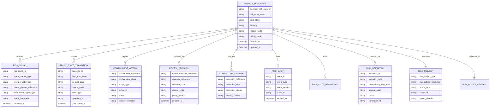
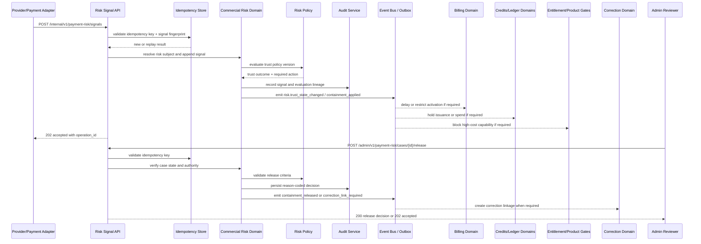

# PAYMENT_FRAUD_AND_ABUSE_PREVENTION_API_SPEC.md

## Title
FUZE Payment Fraud and Abuse Prevention API Specification

## Document Metadata

- **Document Name:** `PAYMENT_FRAUD_AND_ABUSE_PREVENTION_API_SPEC.md`
- **Document Type:** API SPEC v2 / Production-grade FUZE API specification
- **Status:** Draft for canonical API SPEC v2 source-of-truth approval
- **Version:** 2.0.0
- **Effective Date:** 2026-04-24
- **Last Updated:** 2026-04-24
- **Reviewed On:** 2026-04-24
- **Document Owner:** FUZE Platform Commercial Risk and Fraud Architecture
- **Approval Authority:** FUZE Platform Architecture and Governance Authority; formal named approver not yet attached
- **Review Cadence:** Quarterly or upon material change to payment rails, risk policy, credits issuance, billing activation, entitlement gating, correction posture, support-control posture, public API exposure, event propagation, idempotency, or audit requirements
- **Governing Layer:** API contract layer / shared commercial infrastructure / payment fraud and abuse prevention
- **Parent Registry:** `API_SPEC_INDEX.md`; API SPEC v2 Canonical File Registry
- **Upstream Semantic Registry:** `REFINED_SYSTEM_SPEC_INDEX.md`
- **Upstream API Registry:** `API_SPEC_INDEX.md`
- **Primary Audience:** API architecture, backend engineering, payments engineering, commercial risk engineering, fraud/risk operations, support tooling, finance operations, billing engineering, credits/ledger engineering, entitlement engineering, security engineering, audit/compliance, platform operations, OpenAPI/AsyncAPI/SDK authors, implementation-contract authors
- **Primary Purpose:** Define the production-grade FUZE API contract architecture for payment fraud, commercial abuse prevention, risk-case review, trust-state evaluation, containment, release, correction linkage, product trust-context enforcement, audit, and event propagation without redefining refined system semantics.
- **Primary Upstream References:** `PAYMENT_FRAUD_AND_ABUSE_PREVENTION_SPEC.md`, `PAYMENT_RAILS_INTEGRATION_SPEC.md`, `PLATFORM_CREDITS_SPEC.md`, `CREDIT_LEDGER_AND_SETTLEMENT_SPEC.md`, `SUBSCRIPTIONS_AND_USAGE_BILLING_SPEC.md`, `INVOICING_AND_RECEIPTS_SPEC.md`, `REFUND_REVERSAL_AND_ADJUSTMENT_SPEC.md`, `PRICING_AND_MONETIZATION_MODEL_SPEC.md`, `AI_USAGE_METERING_SPEC.md`, `SECURITY_AND_RISK_CONTROL_SPEC.md`, `AUDIT_LOG_AND_ACTIVITY_SPEC.md`, `AUDIT_AND_ACCESS_TRACEABILITY_SPEC.md`, `IDENTITY_AND_ACCOUNT_SPEC.md`, `FUZE_ACCOUNT_ACCESS_AND_SESSION_THESIS_FINAL_SPEC.md`, `FUZE_ACCOUNT_ACCESS_AND_SESSION_CANONICAL_FINAL_SPEC.md`, `WORKSPACE_AND_ORGANIZATION_SPEC.md`, `ROLE_PERMISSION_AND_ACCESS_CONTROL_SPEC.md`, `FUZE_WORKSPACE_ACCESS_CONTROL_BASICS_THESIS_FINAL_SPEC.md`, `SCOPED_AUTHORIZATION_MODEL_SPEC.md`, `ACCESS_EVALUATION_AND_EFFECTIVE_PERMISSION_SPEC.md`, `ENTITLEMENT_AND_CAPABILITY_GATING_SPEC.md`, `API_ARCHITECTURE_SPEC.md`, `PUBLIC_API_SPEC.md`, `INTERNAL_SERVICE_API_SPEC.md`, `EVENT_MODEL_AND_WEBHOOK_SPEC.md`, `IDEMPOTENCY_AND_VERSIONING_SPEC.md`, `MIGRATION_AND_BACKWARD_COMPATIBILITY_SPEC.md`, `MONITORING_ALERTING_AND_INCIDENT_RESPONSE_SPEC.md`, `NOTIFICATION_AND_USER_COMMUNICATION_SPEC.md`
- **Primary Downstream Dependents:** payment risk service implementation contracts, fraud-review console contracts, support-safe risk context views, checkout/payment-intent APIs, product trust-context adapters, high-cost usage gates, billing/credits/entitlement enforcement adapters, correction-linkage workers, risk event consumers, risk read models, OpenAPI and AsyncAPI artifacts, SDK trust-context clients, QA/contract validation suites
- **API Surface Families Covered:** first-party authenticated risk status reads, internal service risk evaluation APIs, internal provider-signal intake APIs, admin/control-plane review APIs, event/async propagation APIs, reporting/projection reads, support-safe read APIs
- **API Surface Families Excluded:** unauthenticated public fraud-detail APIs, unrestricted public risk scoring APIs, direct provider SDK contracts, raw ML-model internals, direct balance mutation APIs, direct billing-state mutation APIs, direct entitlement mutation APIs, direct invoice/receipt mutation APIs, direct correction execution APIs outside correction domain, direct chain-write APIs
- **Canonical System Owner(s):** Payment Fraud and Abuse Prevention Domain; adjacent semantic owners remain Payments, Billing, Platform Credits, Credit Ledger and Settlement, Invoicing and Receipts, Refund/Reversal/Adjustment, Entitlement, Identity, Workspace/Authorization, Security/Audit/Ops domains
- **Canonical API Owner:** FUZE Backend API / Payment Risk and Commercial Trust API layer
- **Supersedes:** Earlier weaker or implicit payment-fraud API interpretations, including any API posture that exposed risk handling as provider-fraud passthrough, product-local trust heuristics, support-driven balance edits, or unbounded admin mutation surfaces
- **Superseded By:** Not yet known
- **Related Decision Records:** Not yet known
- **Canonical Status Note:** This document is the API contract expression of refined fraud/risk semantics. Refined system specs own semantic truth. This API spec owns allowed surfaces, request/response contracts, error/status classes, idempotency, authorization, event propagation, audit, compatibility, and implementation guardrails for the fraud/risk API family.
- **Implementation Status:** Normative API contract baseline; implementation contracts, OpenAPI, AsyncAPI, SDKs, services, workers, dashboards, and tests must conform
- **Approval Status:** Draft API SPEC v2 pending formal approval record
- **Change Summary:** Created production-grade API SPEC v2 for payment fraud and abuse prevention; normalized risk-case APIs, trust-context APIs, containment/release APIs, admin review APIs, internal signal/evaluation APIs, event contracts, idempotency, audit, migration, diagrams, acceptance criteria, and test cases.

## Purpose

This specification defines the canonical FUZE API contract for payment fraud and commercial abuse prevention.

The API exists to expose and govern the platform-owned commercial risk layer that receives risk signals, resolves risk subjects, evaluates trust state, applies containment or restriction, releases or escalates cases, links confirmed abuse to formal correction flows, and provides product-safe trust-context outputs for downstream enforcement.

This API does not create payment truth, credits truth, billing truth, ledger truth, entitlement truth, document truth, or correction truth. It expresses how those owner-domain truths are consumed, constrained, and coordinated through a dedicated fraud/risk API layer.

## Scope

This API specification governs:

- commercial risk-case creation and lifecycle contracts
- risk-signal intake contracts for payment-originating and commerce-originating signals
- trust-state evaluation and trust-context read contracts
- containment, restriction, release, escalation, and correction-linkage action contracts
- support-safe and admin-safe risk detail reads
- product enforcement APIs for high-cost and commercially sensitive actions
- event families for trust-state change, containment, release, high-cost action blocking, correction linkage, and reporting exclusion
- request, response, error, status, idempotency, retry, audit, observability, compatibility, and migration behavior for this API family

## Out of Scope

This API specification does not govern:

- raw payment provider verification implementation
- payment-intent, payment-record, settlement, or provider-callback canonical truth
- Platform Credits semantic classes or ledger posting mechanics
- subscription and usage-billing state machines
- invoice/receipt creation and supersession semantics
- refund, reversal, and adjustment execution semantics
- final legal fraud determination wording
- machine-learning feature engineering, model thresholds, or training data internals
- unrestricted user-facing disclosure of risk scores or fraud-review notes
- generic product abuse unrelated to payment, commercial value, entitlement, or high-cost usage

## Design Goals

1. Preserve refined fraud/risk semantics at API boundary level.
2. Prevent unsafe provider input, payment state, or product-local assumptions from becoming trusted platform value.
3. Make trust-context enforcement available to checkout, credits, billing, entitlement, and high-cost product flows without exposing privileged internals.
4. Separate signal intake, risk evaluation, containment, review, release, correction linkage, and reporting exclusion into explicit contracts.
5. Ensure every material mutation is idempotent, reason-coded where applicable, audit-linked, and traceable.
6. Bound admin/control-plane authority so fraud handling cannot become a broad-write shortcut.
7. Support async propagation while distinguishing accepted API intent from final business outcome.
8. Provide deterministic error, status, retry, and compatibility rules for implementation and QA.

## Non-Goals

- Do not expose raw fraud scores publicly.
- Do not permit clients to set canonical trust state directly.
- Do not allow product services to invent independent “trusted payment” or “trusted credits” semantics.
- Do not treat risk holds as refunds or reversals.
- Do not bypass payment, billing, credits, ledger, entitlement, document, or correction APIs under a fraud-handling label.
- Do not make support/admin narratives canonical without bounded review and audit lineage.

## Core Principles

1. **Refined semantics own meaning.** This API expresses, not redefines, the refined fraud/risk model.
2. **Risk is a distinct truth class.** Risk state constrains downstream effects but does not become payment, ledger, billing, entitlement, document, or correction truth.
3. **Provider signals are inputs.** Raw provider scores, disputes, callbacks, and chargeback notices are provider-input truth until normalized and interpreted.
4. **Containment is scoped.** Every hold, restriction, or release must attach to explicit account, workspace, commercial subject, or risk subject scope.
5. **Fail closed for value.** Unknown or ambiguous trust posture must not unlock credits issuance, premium activation, or high-cost usage.
6. **No silent mutation.** Fraud APIs must coordinate through owner-domain APIs and events rather than directly rewriting balances, subscriptions, documents, or entitlements.
7. **Admin is bounded.** Operator release, override, remediation, and closure require permission, reason code, policy version, correlation ID, and audit event.
8. **Derived views are subordinate.** Dashboards, support summaries, reporting views, and product badges do not own final risk truth.

## Canonical Definitions

- **Payment Risk Case:** API-facing resource representing one commercial risk investigation or automated review path.
- **Risk Subject:** Scoped object under evaluation, such as payment record, payment attempt, account, workspace, credits issuance request, subscription funding action, entitlement activation, or high-cost product action.
- **Risk Signal:** Provider, payment, billing, credits, usage, support, linked-subject, or correction/dispute input that may alter risk posture.
- **Trust State:** Platform-owned interpreted risk posture for a risk subject.
- **Trust Context:** Bounded API response summarizing what a caller may do for a target subject without exposing privileged internals.
- **Containment:** Bounded action that prevents downstream economic or product effects while evaluation remains unresolved.
- **Restriction:** Narrower action limiting specific risk-sensitive capabilities.
- **Release:** Reason-coded policy decision that removes or reduces containment or restriction.
- **Correction Linkage:** Explicit reference from a risk case to formal refund, reversal, or adjustment flow when economic unwind is required.
- **Reporting Exclusion Marker:** Risk-owned marker indicating disputed, contained, reversed, or unsafe commercial value must be excluded from trust-sensitive reporting until finalized.

## Truth Class Taxonomy

The API MUST preserve these truth classes:

1. **Semantic Truth:** Refined fraud/risk semantics and owner-domain semantics.
2. **API Contract Truth:** Allowed resources, routes, request/response schemas, error classes, and compatibility behavior.
3. **Policy Truth:** Risk-policy versions, containment classes, release criteria, review thresholds, disclosure rules, and operator-authority rules.
4. **Runtime Truth:** Current request handling, async operation state, retry state, queue state, and enforcement cache status.
5. **Provider-Input Truth:** Raw processor, app-store, chain-adjacent, or external rail signals before platform interpretation.
6. **Payment Truth:** Normalized payment attempt and payment-record state owned by payment rails.
7. **Billing Truth:** Subscription, usage-billing, plan, renewal, and billing-scope state owned by billing.
8. **Credits Semantic Truth:** Platform Credits meaning and issuance/spend policy owned by credits domain.
9. **Ledger / Settlement Truth:** Append-oriented credit mutation and settlement lineage owned by ledger domain.
10. **Document Truth:** Invoice and receipt records owned by document domain.
11. **Correction Truth:** Refund, reversal, and adjustment records owned by correction domain.
12. **Fraud / Risk Truth:** Risk cases, trust states, containment, review outcomes, release eligibility, policy versions, and risk reason codes.
13. **Authorization Truth:** Who may read, evaluate, review, release, override, or audit risk data.
14. **Event / Async Truth:** Event emission and accepted async operation state for propagation.
15. **Projection / Reporting Truth:** Dashboards, support summaries, analytics, trust badges, and reporting views derived from canonical records.
16. **Presentation Truth:** User-facing wording, UI labels, and SDK ergonomics.

## Architectural Position in the Spec Hierarchy

This API spec sits below `REFINED_SYSTEM_SPEC_INDEX.md` and the refined payment fraud and abuse prevention specification. It also depends on the API architecture, public API, internal service API, event/webhook, idempotency/versioning, and migration specifications for shared interface posture.

This API spec sits above:

- machine-readable OpenAPI and AsyncAPI artifacts for payment risk surfaces
- backend service implementation contracts
- event schemas and consumer contracts
- fraud-review console contracts
- support-safe read-model contracts
- checkout and product trust-context integrations
- QA and regression test suites

## Upstream Semantic Owners

- **Payment Fraud and Abuse Prevention Domain:** owns risk-case, trust-state, containment, release, risk-policy, and fraud-event semantics.
- **Payment Rails Domain:** owns normalized payment truth and provider-event interpretation.
- **Platform Credits Domain:** owns credits semantics and issuance/spend policy.
- **Credit Ledger and Settlement Domain:** owns authoritative ledger mutation and settlement lineage.
- **Billing Domain:** owns subscription, usage, renewal, grace, and billing responsibility.
- **Invoicing and Receipts Domain:** owns billing-document truth.
- **Refund/Reversal/Adjustment Domain:** owns typed correction behavior.
- **Entitlement Domain:** owns commercial and policy eligibility for products/capabilities.
- **Identity/Session Domain:** owns canonical account identity and session posture.
- **Workspace/Authorization Domain:** owns workspace membership, scoped permission, and effective authorization.
- **Security/Audit/Ops Domains:** own broader security control, audit infrastructure, monitoring, incident, and operational response.

## API Surface Families

### Public / External Surface

No unauthenticated public fraud-detail surface is allowed. Public exposure is limited to highly bounded user-visible status surfaces only when routed through authenticated first-party application APIs.

### First-Party Application Surface

First-party authenticated clients MAY read bounded risk status for user-owned or workspace-authorized commercial objects and MAY submit certain user-context risk appeals where explicitly allowed.

### Internal Service Surface

Internal service APIs govern signal intake, risk-subject resolution, trust evaluation, containment application, trust-context reads, and downstream coordination hooks.

### Admin / Control-Plane Surface

Admin/control-plane APIs govern review, release, escalation, remediation, correction linkage, reporting exclusion, and sensitive audit reads. These APIs require stronger permission, reason-code, and audit posture.

### Event / Webhook / Async Surface

Event surfaces propagate risk changes internally and, where approved, emit bounded partner/webhook notifications. Risk events do not replace payment, ledger, billing, document, or correction events.

### Reporting Surface

Reporting surfaces MAY expose derived commercial-risk summaries for finance, reconciliation, monitoring, and trust-sensitive reporting, but MUST remain subordinate to canonical risk-case truth.

### Chain-Adjacent Surface

Chain-adjacent payment or settlement signals may enter as provider-input or payment-normalized truth. This API MUST NOT directly write chain state or treat chain observations as fraud truth without platform interpretation.

## System / API Boundaries

This API owns:

- risk-case API resources
- risk-signal intake API contracts
- trust-context evaluation API contracts
- containment/restriction/release API contracts
- risk review and decision API contracts
- risk-to-correction linkage API contracts
- risk event and reporting exclusion API contracts

This API does not own:

- provider payment verification
- creation or mutation of canonical payment records
- ledger postings
- billing state transitions
- invoice or receipt issuance
- entitlement creation or deletion
- correction execution
- final accounting treatment

## Adjacent API Boundaries

- `PAYMENT_RAILS_INTEGRATION_API_SPEC.md` owns payment-intent and payment-record interfaces.
- `PLATFORM_CREDITS_API_SPEC.md` owns credits semantic interfaces.
- `CREDIT_LEDGER_AND_SETTLEMENT_API_SPEC.md` owns ledger mutation interfaces.
- `SUBSCRIPTIONS_AND_USAGE_BILLING_API_SPEC.md` owns subscription/billing interfaces.
- `INVOICING_AND_RECEIPTS_API_SPEC.md` owns invoice/receipt interfaces.
- `REFUND_REVERSAL_AND_ADJUSTMENT_API_SPEC.md` owns typed correction interfaces.
- `ENTITLEMENT_AND_CAPABILITY_GATING_API_SPEC.md` owns entitlement and capability gates.
- `AUDIT_LOG_AND_ACTIVITY_API_SPEC.md` owns canonical audit records.
- `SECURITY_AND_RISK_CONTROL_API_SPEC.md` owns broader security/risk posture not specific to commercial payment risk.

## Conflict Resolution Rules

1. Refined semantic specs win over API convenience.
2. Payment rails truth determines what payment/provider state was normalized.
3. Fraud/risk truth determines whether commercial state is trusted, monitored, delayed, restricted, or contained.
4. Billing, credits, ledger, document, and correction domains retain their own canonical truth.
5. Product-local views and caches MUST yield to platform trust-context responses.
6. Admin/support narratives MUST yield to canonical risk records unless converted into approved reviewed decisions.
7. Derived reports MUST yield to canonical risk-case and owner-domain truth.
8. Unknown or contradictory risk posture for economically material action MUST fail closed.

## Default Decision Rules

- If a payment-derived action lacks resolvable risk posture, default to hold or restricted mode.
- If subject scope is ambiguous, reject or route to review; do not guess.
- If duplicate signals arrive, deduplicate by idempotency and signal fingerprint.
- If a release request lacks reason code, policy version, or permission, reject it.
- If a risk action requires economic unwind, create correction linkage rather than directly mutating balances or documents.
- If a user-facing disclosure would expose sensitive review logic, return bounded status and hide internals.
- If a product asks for high-cost-action authorization and trust cache is stale, require fresh trust-context evaluation.

## Roles / Actors / API Consumers

- Account holder
- Workspace owner / billing owner
- Authorized billing operator
- Support operator with limited risk context
- Fraud/risk reviewer
- Finance reviewer
- Security operator
- Internal payment service
- Internal billing service
- Internal credits/ledger service
- Entitlement service
- Product service requiring trust-context checks
- High-cost AI/workflow service
- Reporting/reconciliation service
- Provider adapter or event-ingestion service
- Audit/compliance reviewer

## Resource / Entity Families

- `payment_risk_case`
- `risk_subject`
- `risk_signal`
- `trust_state_transition`
- `trust_context`
- `containment_action`
- `restriction_action`
- `release_decision`
- `review_decision`
- `correction_linkage`
- `reporting_exclusion_marker`
- `risk_policy_reference`
- `risk_operation`
- `risk_idempotency_record`
- `risk_audit_reference`
- `risk_event`
- `risk_projection`

## Ownership Model

The payment fraud and abuse prevention API owns API contract truth for the above resources. The canonical fraud/risk system owner owns semantic meaning. Adjacent owner domains must be reached through their APIs or events when downstream action is required.

Forbidden ownership shortcuts:

- risk API directly creates ledger entries
- risk API directly marks an invoice void
- risk API directly changes subscription plan state
- risk API directly grants/revokes entitlements outside entitlement APIs
- risk API directly creates refund/reversal/adjustment result without correction domain participation
- frontend or product service directly sets `trust_state`

## Authority / Decision Model

- **Automated Risk Engine:** may evaluate signals and propose or apply policy-allowed low/medium-risk actions.
- **Fraud/Risk Reviewer:** may review, escalate, release, or confirm abuse within assigned authority.
- **Finance Reviewer:** may review financial/reconciliation impacts but cannot bypass risk or correction ownership.
- **Support Operator:** may view limited risk context and submit support-linked signals or appeals, but cannot create final trust truth.
- **Security Operator:** may escalate broad security incidents or account-risk concerns.
- **Admin/Control Plane:** may execute bounded review actions through reason-coded, audited APIs only.

## Authentication Model

- User and first-party routes require valid FUZE account session and current session security posture.
- Workspace-scoped reads require both authenticated account identity and workspace-scope authorization.
- Internal service routes require service identity, mTLS or equivalent authenticated channel, service allowlist, and least-privilege scopes.
- Admin routes require authenticated operator identity, strong session posture, role/permission authorization, reason code, correlation ID, and audit capture.
- Provider signal intake requires verified adapter identity or verified event signature before normalization into risk-signal input.

## Authorization / Scope / Permission Model

The authorization layer MUST evaluate:

- `account_id`
- `workspace_id` where applicable
- `risk_subject_type`
- `risk_subject_reference`
- actor role and effective permissions
- route family and action class
- policy version
- required authority tier
- sensitive data disclosure class

Permission classes SHOULD include:

- `risk:status:read:self`
- `risk:status:read:workspace`
- `risk:trust-context:evaluate`
- `risk:signal:create`
- `risk:case:read:internal`
- `risk:case:review`
- `risk:containment:apply`
- `risk:containment:release`
- `risk:correction-link:create`
- `risk:reporting-exclusion:update`
- `risk:audit:read`

## Entitlement / Capability-Gating Model

Risk APIs do not own entitlements. They provide trust context that entitlement and product systems MUST respect. Low-trust, contained, or suspicious states MAY delay, restrict, or block entitlement activation and high-cost capabilities. Restricted release MAY allow low-risk capabilities while continuing to block expensive or irreversible actions.

## API State Model

### Trust States

- `initiated`
- `pending_verification`
- `verified_pending_risk`
- `verified_trusted`
- `verified_low_trust`
- `monitored`
- `suspicious`
- `contained`
- `released_restricted`
- `released_full`
- `reversed_or_invalidated`
- `resolved_confirmed_abuse`
- `resolved_cleared`

### Risk Case Statuses

- `open`
- `awaiting_signal_completion`
- `awaiting_manual_review`
- `contained_pending_review`
- `released`
- `linked_to_correction`
- `closed_confirmed_abuse`
- `closed_cleared`
- `closed_false_positive`

### Operation Statuses

- `accepted`
- `deduplicated`
- `pending_evaluation`
- `pending_review`
- `applied`
- `partially_applied`
- `failed_retryable`
- `failed_terminal`
- `superseded`

## Lifecycle / Workflow Model

1. A signal is received from provider, payment, billing, credits, usage, support, linked-subject, or correction/dispute source.
2. The API validates caller identity, signal integrity, schema, idempotency, scope, and correlation references.
3. The risk domain resolves the risk subject and links canonical owner-domain references.
4. Trust evaluation runs against current policy version.
5. The API returns either synchronous trust-context result or accepted async operation reference.
6. Containment, restriction, monitoring, release, escalation, or no-op is applied according to policy.
7. Downstream services receive explicit events or service callbacks.
8. If economic unwind is required, correction linkage is created through correction-domain APIs.
9. Derived views and reporting exclusions are updated after canonical state change.
10. Audit, monitoring, and trace records are finalized before terminal closure.

## Architecture Diagram — Mermaid flowchart

```mermaid
flowchart TD
  subgraph Consumers[API Consumers]
    User[Authenticated User]
    FirstParty[First-Party App]
    ProductSvc[Product / High-Cost Service]
    Support[Support Console]
    Admin[Fraud Admin Console]
    ProviderAdapter[Provider / Rail Adapter]
    Reporting[Finance / Reporting]
  end

  subgraph APISurfaces[Payment Fraud and Abuse API Surfaces]
    UserRiskAPI[Bounded User Risk Status API]
    TrustAPI[Trust Context API]
    SignalAPI[Internal Risk Signal Intake API]
    CaseAPI[Internal Risk Case API]
    AdminAPI[Admin Review / Release API]
    EventAPI[Risk Event / Async API]
    ReportAPI[Risk Projection / Reporting API]
  end

  subgraph RiskDomain[Commercial Risk Domain]
    RiskCase[Risk Case Store]
    SignalStore[Signal Lineage Store]
    Policy[Risk Policy Version Store]
    Engine[Risk Evaluation Engine]
    Containment[Containment / Release Store]
    AuditRef[Risk Audit References]
    Idem[Risk Idempotency Records]
  end

  subgraph OwnerDomains[Adjacent Canonical Owner Domains]
    Payments[Payment Rails Domain]
    Credits[Platform Credits Domain]
    Ledger[Credit Ledger Domain]
    Billing[Billing Domain]
    Entitlements[Entitlement Domain]
    Documents[Invoicing / Receipts Domain]
    Corrections[Refund / Reversal / Adjustment Domain]
    Authz[Identity / Workspace / Authorization]
    Audit[Audit Log / Activity Domain]
  end

  User --> UserRiskAPI
  FirstParty --> UserRiskAPI
  ProductSvc --> TrustAPI
  ProviderAdapter --> SignalAPI
  Support --> CaseAPI
  Admin --> AdminAPI
  Reporting --> ReportAPI

  UserRiskAPI --> Authz
  TrustAPI --> Authz
  SignalAPI --> Idem
  CaseAPI --> RiskCase
  AdminAPI --> Authz
  AdminAPI --> Audit

  SignalAPI --> SignalStore
  SignalStore --> Engine
  Engine --> Policy
  Engine --> RiskCase
  Engine --> Containment
  RiskCase --> EventAPI
  Containment --> EventAPI
  EventAPI --> Payments
  EventAPI --> Credits
  EventAPI --> Ledger
  EventAPI --> Billing
  EventAPI --> Entitlements
  EventAPI --> Documents
  EventAPI --> Corrections
  EventAPI --> Audit
  RiskCase --> ReportAPI

  Payments --> SignalAPI
  Billing --> SignalAPI
  Credits --> SignalAPI
  Corrections --> SignalAPI
```

## Data Design — Mermaid Diagram

## Flow View

### Synchronous Trust-Context Evaluation

1. Caller submits target subject, intended action, scope, and correlation ID.
2. API authenticates caller and validates effective permission or service scope.
3. API resolves canonical risk subject and relevant owner-domain references.
4. API checks current trust state and policy version.
5. API returns bounded `trust_context` with allowed, denied, review-required, or restricted outcome.
6. Product caller MUST enforce the response and MUST NOT replace it with local heuristics.

### Async Signal Intake and Risk Evaluation

1. Internal service or provider adapter submits risk signal with idempotency key and signal fingerprint.
2. API deduplicates or creates a risk operation.
3. API creates or updates risk case and signal lineage.
4. Risk evaluation produces trust-state transition or review-required state.
5. API emits risk events and updates projections.
6. Downstream domains enforce explicit events or service calls.
7. Final closure waits for required downstream enforcement, correction linkage, and audit completion.

### Admin Review and Release

1. Reviewer reads risk case through admin API.
2. Reviewer submits decision with reason code, policy version, and idempotency key.
3. API verifies authority tier and case state.
4. API records review decision and applies release, restriction, escalation, or correction-linkage action.
5. API emits events and audit entries.
6. Downstream services re-evaluate gated actions; stale caches are invalidated.

### Failure / Retry / Degraded Mode

- Retryable downstream propagation failure returns accepted state with operation reference and retry status.
- Terminal failure requires explicit remediation or escalation.
- If trust-context store is unavailable for high-cost action, product must fail closed.
- If event bus is unavailable after canonical mutation, mutation may commit only if outbox/event recovery is durable.
- If audit write fails for critical admin action, mutation must fail or remain pending until audit can be persisted.

## Data Flows — Mermaid sequenceDiagram

## Request Model

All mutation-capable requests MUST include:

- `Idempotency-Key` header unless an approved internal batch contract supplies an equivalent operation key
- `X-FUZE-Correlation-Id` or generated correlation ID
- authenticated actor or service identity
- `scope_type` and `scope_id` where subject is scoped
- `risk_subject_type` and `risk_subject_reference` when targeting an existing subject
- `reason_code` for review, containment, release, escalation, correction-linkage, and reporting-exclusion mutations
- `policy_version` for admin decisions or policy-sensitive actions where known
- structured JSON body with explicit content type

Clients MUST NOT provide final canonical `trust_state` as an authoritative input except through constrained admin/review action classes that the backend validates and records as a decision.

## Response Model

Successful responses MUST include:

- stable resource ID or operation ID
- current status and status class
- current trust-state summary where authorized
- scope summary
- owner-domain references where safe
- correlation ID
- trace ID where available
- operation result or async follow-up link
- redaction indicator where details are intentionally withheld

User-facing responses MUST be bounded. They MAY show `under_review`, `restricted`, `cleared`, `action_required`, or similar public-safe statuses, but MUST NOT disclose raw fraud scores, provider internals, linked-account graphs, reviewer notes, or sensitive abuse indicators.

## Error / Result / Status Model

Error responses MUST use structured problem-details style with:

- `type`
- `title`
- `status`
- `code`
- `detail`
- `instance`
- `correlation_id`
- optional `operation_id`
- optional `retry_after` where safe

### Required Error Codes

- `RISK_SESSION_REQUIRED`
- `RISK_PERMISSION_DENIED`
- `RISK_SERVICE_PERMISSION_DENIED`
- `RISK_OPERATOR_PERMISSION_DENIED`
- `RISK_SCOPE_REQUIRED`
- `RISK_SCOPE_INVALID`
- `RISK_SUBJECT_NOT_FOUND`
- `RISK_SUBJECT_AMBIGUOUS`
- `RISK_SIGNAL_INVALID`
- `RISK_SIGNAL_DUPLICATE_CONFLICT`
- `RISK_IDEMPOTENCY_KEY_REQUIRED`
- `RISK_IDEMPOTENCY_CONFLICT`
- `RISK_CASE_STATE_INVALID`
- `RISK_POLICY_VERSION_REQUIRED`
- `RISK_POLICY_DENIED`
- `RISK_CONTAINMENT_REQUIRED`
- `RISK_RELEASE_FORBIDDEN`
- `RISK_REVIEW_REQUIRED`
- `RISK_CORRECTION_LINK_REQUIRED`
- `RISK_DOWNSTREAM_UNAVAILABLE`
- `RISK_AUDIT_REQUIRED`
- `RISK_RATE_LIMITED`
- `RISK_DISCLOSURE_REDACTED`

## Idempotency / Retry / Replay Model

Idempotency is mandatory for:

- risk-signal intake
- risk-case creation
- containment application
- restriction application
- release decisions
- review decisions
- escalation decisions
- correction-linkage creation
- reporting-exclusion changes
- high-cost action authorization requests where repeated submission could create inconsistent enforcement

The idempotency record MUST bind:

- key hash
- actor/service identity
- route family
- semantic request hash
- risk subject
- scope
- policy version where applicable
- operation status
- final or current response

Replay of same key and same semantic request MUST return the stored outcome. Replay of same key with materially different request MUST fail with `RISK_IDEMPOTENCY_CONFLICT`.

## Rate Limit / Abuse-Control Model

- Public and first-party risk-status reads MUST be rate limited by account, workspace, IP/device posture, and route family.
- Risk appeal or support-signal submissions MUST be throttled and abuse-scored.
- Internal signal intake MUST be protected by service quotas and duplicate-signal deduplication.
- Trust-context evaluation for high-cost product services MUST support low-latency reads but must protect against hot-loop abuse.
- Admin review APIs MUST be rate-monitored for unusual release/override patterns.

## Endpoint / Route Family Model

### First-Party User / Application APIs

#### `GET /v1/payment-risk/status`
Returns bounded risk status for an authorized account or workspace-owned commercial subject.

Query fields:

- `scope_type`
- `scope_id`
- `risk_subject_type`
- `risk_subject_reference`

Response fields:

- `status_view`
- `public_status_code`
- `action_required`
- `restricted_capabilities[]`
- `updated_at`
- `correlation_id`

#### `POST /v1/payment-risk/appeals`
Creates a bounded user-origin appeal or clarification signal where policy allows.

Request fields:

- `scope_type`
- `scope_id`
- `risk_subject_type`
- `risk_subject_reference`
- `appeal_reason_code`
- `user_note`
- `supporting_reference_ids[]`

Response: `202 accepted` with `operation_id` and bounded status.

### Internal Service APIs

#### `POST /internal/v1/payment-risk/signals`
Ingests a normalized risk signal.

Request fields:

- `signal_source_type`
- `signal_source_reference`
- `risk_subject_type`
- `risk_subject_reference`
- `scope_type`
- `scope_id`
- `normalized_signal_type`
- `severity_hint`
- `provider_reference`
- `owner_domain_references[]`
- `signal_fingerprint`
- `observed_at`

Response: `202 accepted`, `200 deduplicated`, or error.

#### `POST /internal/v1/payment-risk/evaluations`
Evaluates trust posture for a risk subject or intended action.

Request fields:

- `risk_subject_type`
- `risk_subject_reference`
- `intended_action_type`
- `scope_type`
- `scope_id`
- `cost_exposure_class`
- `required_freshness_seconds`

Response fields:

- `trust_context_id`
- `decision`: `allow`, `monitor`, `restrict`, `hold`, `deny`, `review_required`
- `trust_state`
- `policy_version`
- `restricted_capabilities[]`
- `expires_at`

#### `GET /internal/v1/payment-risk/cases/{payment_risk_case_id}`
Returns canonical internal risk case detail for authorized services.

#### `POST /internal/v1/payment-risk/cases/{payment_risk_case_id}/containments`
Applies policy-authorized containment.

#### `POST /internal/v1/payment-risk/cases/{payment_risk_case_id}/correction-linkages`
Creates linkage to correction domain when formal refund/reversal/adjustment flow is required.

### Admin / Control-Plane APIs

#### `GET /admin/v1/payment-risk/cases`
Lists risk cases with filters for status, severity, scope, assigned reviewer, and SLA posture.

#### `GET /admin/v1/payment-risk/cases/{payment_risk_case_id}`
Returns privileged case detail subject to role-based redaction.

#### `POST /admin/v1/payment-risk/cases/{payment_risk_case_id}/review-decisions`
Records review decision.

Allowed decision classes:

- `clear`
- `monitor`
- `restrict`
- `contain`
- `release_restricted`
- `release_full`
- `confirm_abuse`
- `link_to_correction`
- `escalate_security`

#### `POST /admin/v1/payment-risk/cases/{payment_risk_case_id}/release`
Performs release of containment/restriction after policy validation.

#### `POST /admin/v1/payment-risk/reporting-exclusions`
Creates, updates, or clears reporting exclusion marker for contained/disputed/unsafe commercial value.

### Reporting APIs

#### `GET /internal/v1/payment-risk/reporting/exclusions`
Returns derived reporting exclusion records for authorized finance/reconciliation systems.

#### `GET /internal/v1/payment-risk/projections/trust-summary`
Returns derived trust summaries for dashboards and monitoring.

## Public API Considerations

The fraud/risk API is not a general public API. External exposure MUST remain narrower than internal surfaces. Public-safe outputs may include only bounded status or user action guidance. No public route may expose:

- raw fraud scores
- internal signals
- reviewer notes
- linked-account graphs
- provider risk internals
- policy thresholds
- hidden rule names
- identities of reviewers

## First-Party Application API Considerations

First-party clients MAY display bounded status and submit allowed appeals. They MUST NOT locally infer trust state from payment provider UI, credits balance, billing status, receipt status, or cached product state. They MUST use backend-provided risk-status or trust-context responses.

## Internal Service API Considerations

Internal services MUST use risk APIs for commercial trust decisions when payment-derived value, credits issuance, premium activation, entitlement activation, or high-cost usage may be affected. Internal service APIs MUST remain least-privilege and MUST NOT become hidden broad-write admin APIs.

## Admin / Control-Plane API Considerations

Admin APIs MUST require:

- strong operator authentication
- effective permission checks
- reason code
- operator note where policy requires
- idempotency key
- correlation ID
- policy version
- audit event before or atomically with mutation
- redaction controls for sensitive indicators

Admin APIs MUST NOT support arbitrary manual setting of credits balances, subscription state, invoice status, entitlement state, or correction completion.

## Event / Webhook / Async API Considerations

Internal event families SHOULD include:

- `payment_risk.signal_received`
- `payment_risk.case_opened`
- `payment_risk.trust_state_changed`
- `payment_risk.containment_applied`
- `payment_risk.containment_released`
- `payment_risk.high_cost_action_blocked`
- `payment_risk.subscription_activation_delayed`
- `payment_risk.correction_linkage_created`
- `payment_risk.confirmed_abuse_finalized`
- `payment_risk.reporting_exclusion_changed`
- `payment_risk.case_closed`

Event payloads MUST include:

- event ID
- event type
- event version
- risk case ID where applicable
- risk subject reference
- scope
- trust-state transition summary
- policy version
- reason code where applicable
- correlation ID
- trace ID
- emitted timestamp

Webhook exposure, if any, MUST be partner-safe, explicitly approved, redacted, signed, replay-protected, versioned, and narrower than internal events.

## Chain-Adjacent API Considerations

Chain observations, stablecoin settlement signals, or Base-linked payment/commitment references may become provider-input or payment-normalized signals. They MUST NOT become fraud/risk truth until interpreted by platform risk evaluation. This API MUST NOT directly execute chain writes or publish public chain assertions that imply finalized fraud outcome without approved owner-domain state.

## Data Model / Storage Support Implications

Canonical storage MUST preserve:

- risk case header
- subject/scope references
- signal lineage
- trust-state transition history
- containment and release history
- review decisions
- correction linkage
- policy version
- operator attribution
- support case references where applicable
- linked-account/workspace references where policy allows
- monitoring timestamps
- idempotency records
- audit references
- event outbox records

Storage MUST be append-oriented for material risk decisions. Destructive rewrite of risk decisions is forbidden except through separately governed redaction/privacy controls that preserve audit-safe lineage.

## Read Model / Projection / Reporting Rules

- Product trust-context caches MUST have explicit freshness windows.
- High-cost actions MUST require fresh or policy-approved cached trust context.
- Support views MUST redact sensitive internals while showing safe operational guidance.
- Finance/reporting projections MUST distinguish gross intake, normalized payment acceptance, contained value, corrected value, and finalized value.
- Transparency/public-trust projections MUST NOT treat contained or disputed value as finalized.
- Derived risk dashboards MUST NOT become canonical risk-case owners.

## Security / Risk / Privacy Controls

- Fraud indicators are sensitive and access-controlled.
- Linked-subject data requires enhanced authorization and audit.
- Provider payloads must be authenticated and replay-protected before ingestion.
- Risk APIs must validate schema, scope, and source references.
- Admin routes require strong authentication and anomaly monitoring.
- Public/first-party routes must redact privileged information.
- Stored signals and review notes must follow retention, privacy, and redaction policies.

## Audit / Traceability / Observability Requirements

Every material mutation MUST emit or link to audit records for:

- signal intake
- trust-state transition
- containment application
- release decision
- review decision
- correction linkage
- reporting exclusion change
- admin access to privileged risk detail
- failed or denied privileged action

Observability MUST capture:

- evaluation latency
- containment propagation latency
- stale trust-context rate
- duplicate-signal rate
- idempotency conflict rate
- review queue SLA
- release/override rates by operator and policy version
- event delivery lag
- failed downstream propagation

## Failure Handling / Edge Cases

- **Duplicate signal:** return deduplicated outcome or idempotent replay result.
- **Ambiguous subject:** fail closed for high-value effects and route to review.
- **Payment success but risk hold:** payment remains normalized but downstream value is held.
- **Risk release but billing failure:** release does not activate billing; billing owner decides.
- **Correction needed:** create correction linkage; do not mutate ledger or documents directly.
- **Audit failure:** privileged mutation fails or remains pending until audit persistence succeeds.
- **Event failure:** canonical state may commit only if durable outbox recovery exists.
- **Stale trust cache:** high-cost action must request fresh evaluation or deny/review.
- **Wrong-scope request:** reject and audit if sensitive.
- **Operator overreach:** reject and audit permission failure.

## Migration / Versioning / Compatibility / Deprecation Rules

- Route families use `/v1`, `/internal/v1`, and `/admin/v1`.
- Additive fields are preferred.
- Trust-state names and status meanings MUST NOT change silently.
- New signal types, subject types, and containment classes require enum-version handling.
- Deprecation requires migration notice for machine clients and compatibility window.
- Old clients must not receive expanded sensitive disclosures by default.
- Migration from older payment-fraud APIs must map old risk states into canonical trust states with explicit `migration_reference` lineage.

## OpenAPI / AsyncAPI / SDK Derivation Rules

OpenAPI artifacts MUST preserve:

- route family separation
- auth requirements
- redacted vs privileged response schemas
- idempotency headers
- correlation headers
- structured errors
- stable enum definitions
- async operation references
- policy-version fields where applicable

AsyncAPI artifacts MUST preserve:

- event versions
- event IDs
- trace IDs
- replay and idempotency semantics
- consumer responsibilities
- distinction between risk events and owner-domain events

SDKs MUST NOT expose convenience methods that imply direct trust-state mutation by clients.

## Implementation-Contract Guardrails

- Implementations MUST include durable idempotency records before applying material mutations.
- Implementations MUST resolve risk subject and scope before evaluation.
- Implementations MUST use owner-domain APIs/events for downstream effects.
- Implementations MUST persist audit lineage for privileged actions.
- Implementations MUST prevent direct frontend/admin setting of canonical trust state without validated decision workflow.
- Implementations MUST ensure event emission is outbox-backed or otherwise recoverable.
- Implementations MUST enforce redaction boundaries per route family.

## Downstream Execution Staging

1. Define canonical risk resources, enums, error classes, and idempotency model.
2. Implement internal signal intake and trust evaluation.
3. Implement product trust-context reads and high-cost enforcement integration.
4. Implement containment/release and admin review workflows.
5. Implement event propagation and derived projections.
6. Integrate correction linkage with refund/reversal/adjustment APIs.
7. Add reporting exclusion and finance/reconciliation views.
8. Generate OpenAPI/AsyncAPI artifacts and contract tests.
9. Execute migration mapping from legacy payment-fraud states if present.

## Required Downstream Specs / Contract Layers

- payment-risk service implementation contract
- risk event schema contract
- risk policy versioning contract
- fraud-review admin console contract
- support-safe risk view contract
- product trust-context enforcement contract
- high-cost usage gating contract
- risk reporting projection contract
- risk audit event contract
- correction-linkage integration contract
- migration mapping contract

## Boundary Violation Detection / Non-Canonical API Patterns

Forbidden patterns:

- `POST /admin/.../set-trust-state` without decision workflow
- support API that grants credits as fraud remediation without credits/ledger/correction authority
- product API that decides a payment is safe from provider UI state
- risk API that directly reverses ledger entries
- risk API that directly voids invoice or receipt
- public API that exposes raw fraud score
- dashboard/export used as final trust authority
- event consumer treating `payment_risk.containment_applied` as a refund/reversal
- high-cost product action ignoring trust-context denial
- retry path that creates duplicate containment or release

## Canonical Examples / Anti-Examples

### Canonical Example: Payment Succeeds but Risk Hold Applies
A provider reports payment success. Payment rails normalize the payment. Risk evaluation identifies high-risk linked signals and applies `issuance_hold`. Credits issuance is delayed; billing activation may be held; user sees bounded `under_review` status. No refund is created unless correction domain later receives a formal correction linkage.

### Canonical Example: High-Cost AI Action Requires Fresh Trust Context
A product service asks whether a workspace-funded high-cost AI workflow may run. Trust API returns `restrict` with `high_cost_usage_block`. Product denies the action or offers restricted-mode behavior and records the correlation ID.

### Anti-Example: Support Manually Restores Balance
A support operator receives a complaint and directly edits a credits balance under “fraud false positive.” This is forbidden. Support may submit a signal or admin review request; any balance effect must flow through credits/ledger/correction owner domains.

### Anti-Example: Provider Score Becomes Final Fraud Truth
A payment provider returns high risk score and a product permanently bans the account. This is forbidden. Provider input must become risk signal, risk domain must evaluate, and account/product action must follow authorized owner-domain policy.

## Acceptance Criteria

1. All mutation APIs reject requests missing idempotency key unless a documented equivalent internal operation key exists.
2. All trust-context evaluations return explicit `decision`, `trust_state`, `policy_version`, `scope`, and `correlation_id`.
3. Public/first-party risk status responses never include raw fraud score, linked-account graph, reviewer notes, or provider internals.
4. Admin release requires operator permission, reason code, policy version, correlation ID, and audit persistence.
5. Risk hold blocks credits issuance or high-cost usage through explicit downstream contract, not product-local inference.
6. Duplicate provider signal does not create duplicate risk cases or duplicate downstream events.
7. Correction-requiring abuse outcome creates correction linkage and does not directly mutate ledger/document/billing records.
8. Event payloads include event ID, event version, risk subject, scope, policy version, and trace/correlation references.
9. Stale trust-context cache cannot authorize high-cost action outside approved freshness window.
10. Derived reporting views distinguish contained, corrected, and finalized commercial value.
11. Migration mapping preserves legacy risk lineage and does not silently change trust-state meaning.
12. Boundary-violation tests prove products, support tools, and admin tools cannot bypass owner-domain APIs.

## Test Cases

| ID | Scenario | Expected Result |
|---|---|---|
| RISK-001 | Internal service submits new valid provider risk signal | `202 accepted`; risk signal stored; operation ID returned; audit/event outbox created |
| RISK-002 | Same signal replayed with same idempotency key | Original result returned; no duplicate case/event |
| RISK-003 | Same idempotency key used with different request body | `RISK_IDEMPOTENCY_CONFLICT` |
| RISK-004 | Product requests high-cost action with trusted state | Trust context returns `allow`; response includes freshness expiry |
| RISK-005 | Product requests high-cost action with contained state | Trust context returns `deny` or `restrict`; action must not execute |
| RISK-006 | Public user attempts to read another workspace risk status | `RISK_PERMISSION_DENIED`; access attempt audited where sensitive |
| RISK-007 | User reads own bounded risk status | Response redacts internals and returns safe status only |
| RISK-008 | Provider signal references ambiguous subject | High-value actions fail closed; case enters `awaiting_manual_review` |
| RISK-009 | Admin release without reason code | Request rejected with `RISK_POLICY_VERSION_REQUIRED` or validation error |
| RISK-010 | Admin release without permission | `RISK_OPERATOR_PERMISSION_DENIED`; denial audited |
| RISK-011 | Confirmed abuse requires economic unwind | Risk case links to correction domain; ledger not mutated directly by risk API |
| RISK-012 | Event bus temporarily unavailable after containment decision | Mutation commits only with durable outbox recovery or remains pending |
| RISK-013 | Audit service unavailable for release | Release fails or remains pending; no unaudited release is finalized |
| RISK-014 | Support attempts direct balance correction through risk route | Route unavailable or forbidden; boundary violation logged |
| RISK-015 | Reporting asks for trust-sensitive value summary | Projection distinguishes gross, contained, corrected, finalized values |
| RISK-016 | Legacy risk state migrated | New canonical trust state includes migration reference and preserves lineage |
| RISK-017 | Rate limit exceeded on risk appeal | `RISK_RATE_LIMITED`; retry guidance included only if safe |
| RISK-018 | Product trust cache expired | Product must refresh trust context or fail closed |
| RISK-019 | Correction event arrives after risk case closed cleared | New signal opens linked review or rejects based on policy; prior record not rewritten |
| RISK-020 | Partner webhook requested for risk update | Only approved redacted event is delivered with signature/replay protection |

## Dependencies / Cross-Spec Links

- `PAYMENT_FRAUD_AND_ABUSE_PREVENTION_SPEC.md`
- `REFINED_SYSTEM_SPEC_INDEX.md`
- `API_SPEC_INDEX.md`
- `PAYMENT_RAILS_INTEGRATION_SPEC.md`
- `PLATFORM_CREDITS_SPEC.md`
- `CREDIT_LEDGER_AND_SETTLEMENT_SPEC.md`
- `SUBSCRIPTIONS_AND_USAGE_BILLING_SPEC.md`
- `INVOICING_AND_RECEIPTS_SPEC.md`
- `REFUND_REVERSAL_AND_ADJUSTMENT_SPEC.md`
- `ENTITLEMENT_AND_CAPABILITY_GATING_SPEC.md`
- `PUBLIC_API_SPEC.md`
- `INTERNAL_SERVICE_API_SPEC.md`
- `EVENT_MODEL_AND_WEBHOOK_SPEC.md`
- `IDEMPOTENCY_AND_VERSIONING_SPEC.md`
- `MIGRATION_AND_BACKWARD_COMPATIBILITY_SPEC.md`
- `AUDIT_LOG_AND_ACTIVITY_SPEC.md`
- `SECURITY_AND_RISK_CONTROL_SPEC.md`
- `MONITORING_ALERTING_AND_INCIDENT_RESPONSE_SPEC.md`
- `NOTIFICATION_AND_USER_COMMUNICATION_SPEC.md`

## Explicitly Deferred Items

- exact ML model threshold and feature definitions
- final fraud-review staffing workflow
- complete provider-specific dispute taxonomy
- jurisdiction-specific fraud/legal communication wording
- full public/partner webhook eligibility matrix
- exact retention/redaction durations for each risk-signal class
- exact admin console UI layout

## Final Normative Summary

The Payment Fraud and Abuse Prevention API is the canonical interface-contract family for FUZE commercial risk and trust-control behavior. It receives risk signals, resolves scoped risk subjects, evaluates trust posture, applies containment or release, exposes bounded trust context, links confirmed abuse into correction workflows, and emits auditable events. It MUST preserve separation between risk truth and payment, billing, credits, ledger, document, correction, entitlement, authorization, event, projection, and presentation truth. It MUST fail closed for economically material ambiguity, enforce idempotency and auditability on material mutations, and prevent public, product, support, or admin surfaces from becoming shadow semantic owners.

## Quality Gate Checklist

- [x] Upstream refined semantic owners are explicit.
- [x] Canonical API owner is explicit.
- [x] API surface families are explicit.
- [x] Mutation boundaries are explicit.
- [x] Read boundaries are explicit.
- [x] Adjacent API boundaries are explicit.
- [x] Truth classes are explicit.
- [x] Conflict-resolution rules are explicit.
- [x] Default decision rules are explicit.
- [x] Public, first-party, internal, admin/control, event/webhook, reporting, and chain-adjacent distinctions are explicit.
- [x] Non-canonical API patterns are called out.
- [x] Operator/admin override paths are bounded, reason-coded, and audited.
- [x] Read-model, cache, reporting, and projection rules are explicit.
- [x] On-chain vs off-chain / chain-adjacent posture is explicit.
- [x] Accepted-state vs final outcome semantics are explicit.
- [x] Idempotency and replay requirements are explicit.
- [x] Request, response, error, result, and status classes are explicit.
- [x] Failure and degraded-mode behavior is explicit.
- [x] Audit, traceability, and observability requirements are explicit.
- [x] Versioning, migration, compatibility, and deprecation rules are explicit.
- [x] OpenAPI / AsyncAPI / SDK guardrails are explicit.
- [x] Dependencies and downstream impacts are explicit.
- [x] Non-goals and deferred items are explicit.
- [x] Architecture Diagram uses Mermaid `flowchart` syntax.
- [x] Data Design diagram uses Mermaid syntax and distinguishes canonical vs derived records.
- [x] Flow View covers synchronous, asynchronous, failure, retry, audit, admin, and finalization paths.
- [x] Data Flows use Mermaid `sequenceDiagram` syntax.
- [x] Acceptance Criteria are concrete and testable.
- [x] Test Cases cover positive, negative, authorization, entitlement, idempotency, retry, conflict, rate-limit, degraded-mode, audit, migration, and boundary-violation behavior.
