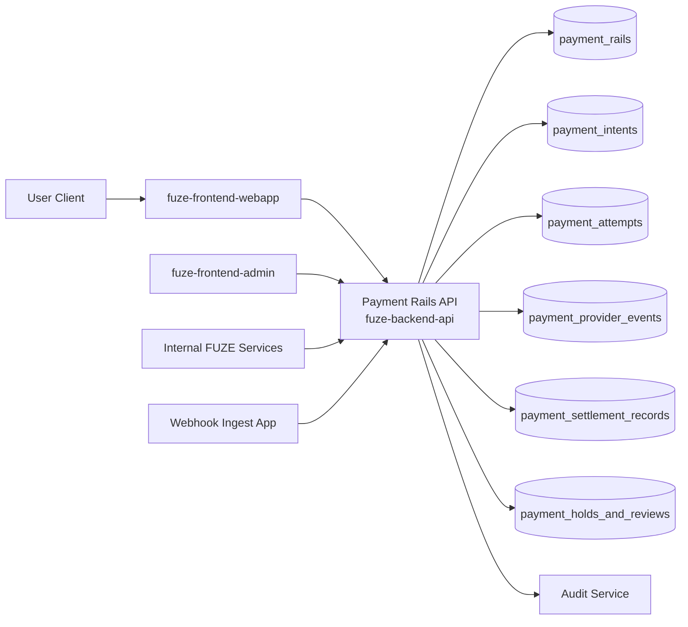
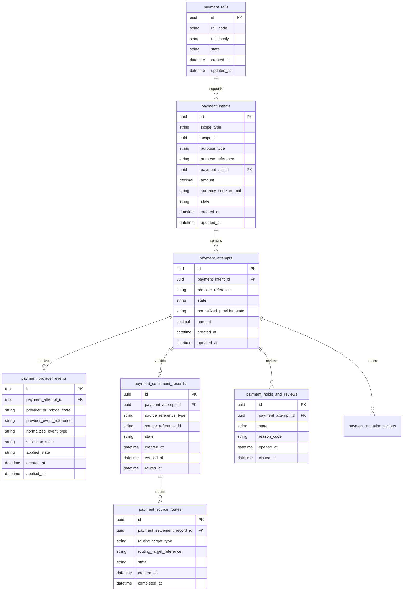
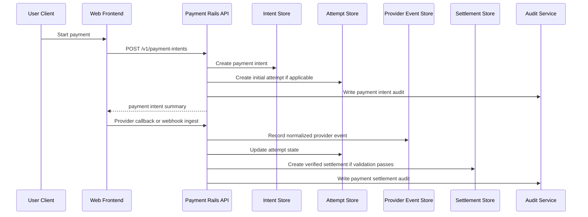

# PAYMENT_RAILS_API_SPEC

## 1. Title

**PAYMENT_RAILS_API_SPEC.md**

---

## 2. Document Metadata

- **Document Name:** PAYMENT_RAILS_API_SPEC.md
- **API Classification:** public, internal, admin, event-driven, chain-adjacent
- **Owning Domain:** Payment Rails Integration Domain
- **Primary Implementing Repo:** `fuze-backend-api`
- **Primary System of Record:** payment intent, payment attempt, provider-normalization, settlement-status, and payment-source lineage stores in `fuze-backend-api`
- **Status:** Draft for canonical source-of-truth approval
- **Purpose:** Define the production-grade API contract architecture for FUZE payment-rail initiation, provider normalization, settlement-state intake, payment-attempt visibility, and controlled payment exception behavior across the platform
- **Canonical Folder:** `fuze.ac > docs > api-spec`

---

## 2.1 API Classification Header

- **API Classification:** public | internal | admin | event-driven | chain-adjacent
- **Owning Domain:** Payment Rails Integration Domain
- **Primary Implementing Repo:** `fuze-backend-api`
- **Primary System of Record:** payment rail normalization and payment-attempt domain

---

## 3. Purpose

This document defines the canonical API specification for FUZE payment-rail operations. It translates the governing FUZE platform architecture, payment-rail integration rules, Platform Credits semantics, subscriptions and usage billing rules, invoicing/receipts expectations, refund/reversal controls, fraud/abuse-prevention controls, and API architecture rules into an implementation-ready API contract.

This API exists because FUZE is multi-rail by design. It may accept value through fiat/card gateways, stablecoins, approved token-linked flows, app-store billing, Telegram-native or platform-native rails, and other normalized commercial entry points. These rails must be integrated consistently without collapsing them into the same business meaning. A successful payment event is not itself a Platform Credits balance, not itself a subscription state, not itself an invoice, and not itself a payout state. It is an upstream commercial and settlement input that must be normalized, verified, and routed into the appropriate downstream platform domain.

Accordingly, this specification defines how payment rails are exposed, how payment intents and attempts are represented, how provider callbacks are normalized, how settlement-state changes are ingested, how user-facing payment status is surfaced safely, and how payment flows remain auditable, idempotent, fraud-aware, and architecture-consistent.

---

## 4. Scope

This specification covers:

- payment rail catalog visibility APIs
- payment-intent creation APIs
- payment-attempt visibility APIs
- user-facing payment-status APIs
- provider callback / webhook ingestion interfaces
- internal service APIs for settlement normalization and downstream routing
- admin/control-plane APIs for payment review, hold, release, and exception remediation
- event emission requirements for payment lifecycle changes
- request, response, error, idempotency, versioning, audit, and database-shape rules for this domain

This specification does **not** redefine:

- Platform Credits ledger mutation rules in full detail
- subscription state machine in full detail
- invoice/receipt issuance rules in full detail
- refund/reversal business rules in full detail
- payout execution or profit participation rules
- treasury semantics
- product entitlement rules
- smart-contract implementation details for chain-side receipt of funds

Those remain governed by their own source-of-truth specifications.

---

## 5. Source-of-Truth Inputs

### Primary FUZE docs and specs used

#### Highest-priority platform and ownership sources
- `SYSTEM_SPEC_INDEX.md`
- `SYSTEM_BOUNDARY_AND_OWNERSHIP_SPEC.md`
- `SYSTEM_OVERVIEW_AND_BOUNDARIES_SPEC.md`
- `PLATFORM_ARCHITECTURE_SPEC.md`
- `DOMAIN_OWNERSHIP_MATRIX_SPEC.md`
- `DATA_MODEL_AND_ENTITY_OWNERSHIP_SPEC.md`
- `ONCHAIN_OFFCHAIN_RESPONSIBILITY_SPEC.md`

#### Primary payment / commercial / financial sources
- `PAYMENT_RAILS_INTEGRATION_SPEC.md`
- `PAYMENT_FRAUD_AND_ABUSE_PREVENTION_SPEC.md`
- `PLATFORM_CREDITS_SPEC.md`
- `CREDIT_LEDGER_AND_SETTLEMENT_SPEC.md`
- `SUBSCRIPTIONS_AND_USAGE_BILLING_SPEC.md`
- `INVOICING_AND_RECEIPTS_SPEC.md`
- `REFUND_REVERSAL_AND_ADJUSTMENT_SPEC.md`
- `PRICING_AND_MONETIZATION_MODEL_SPEC.md`

#### API and runtime sources
- `API_ARCHITECTURE_SPEC.md`
- `PUBLIC_API_SPEC.md`
- `INTERNAL_SERVICE_API_SPEC.md`
- `EVENT_MODEL_AND_WEBHOOK_SPEC.md`
- `IDEMPOTENCY_AND_VERSIONING_SPEC.md`
- `MIGRATION_AND_BACKWARD_COMPATIBILITY_SPEC.md`
- `AUDIT_LOG_AND_ACTIVITY_SPEC.md`

#### Security and operations sources
- `SECURITY_AND_RISK_CONTROL_SPEC.md`
- `SECRETS_CONFIG_AND_ENVIRONMENT_SPEC.md`
- `MONITORING_ALERTING_AND_INCIDENT_RESPONSE_SPEC.md`

#### Format guides
- `The_API_Specification_guide.md`
- `Database_Schemas_Guide.md`

### Highest-priority interpretation applied

For this file, the most important governing interpretation is:

1. payment rails are upstream value-ingress and settlement-ingress mechanisms
2. payment success does not itself equal credits issuance, subscription activation, invoice issuance, or receipt issuance
3. backend owns canonical payment normalization truth
4. products may initiate approved payment intents but do not define payment-rail semantics
5. admin/control-plane may trigger review, remediation, or release actions under controlled policy but do not own payment truth
6. chain-adjacent and fiat/app-store rails must be normalized into common platform-owned payment-attempt semantics without collapsing their distinct source characteristics

### Supporting external standards used only as guidance

- HTTP semantics for safe reads, mutations, and callback acknowledgements
- structured problem-details error design
- general payment-state normalization and webhook-ingestion safety patterns as supporting guidance

External guidance does not override FUZE source-of-truth documents.

---

## 6. Governing Architecture and Ownership Interpretation

This API belongs to the **Payment Rails Integration Domain** because it owns the normalized representation of payment intents, payment attempts, provider-origin state changes, and settlement-ingress status across all supported rails. It is the platform boundary where heterogeneous rail behavior is translated into consistent FUZE payment semantics.

This API is implemented primarily in `fuze-backend-api` because:

- backend owns durable payment normalization truth
- frontend surfaces must consume payment state, not author it
- provider callbacks and settlement signals must terminate in backend-owned verification logic
- downstream domains need a trusted upstream payment-state interface
- fraud review, holds, remediation, and audit generation must be backend-governed

This API is **not** owned by:

- `fuze-frontend-webapp`, because webapp only initiates and reads payment flows
- `fuze-frontend-admin`, because admin may review/remediate but must not own canonical payment truth
- `fuze-contracts`, because chain-side receipt or contract events are upstream or adjacent signals, not the canonical cross-rail payment normalization owner
- Platform Credits, Billing, Invoicing, or Refund domains, because those domains consume approved payment outcomes rather than own raw rail-state normalization
- product domains, because products may request payment intents but do not define how rails are normalized

### Architectural implications

- one payment intent may produce one or more payment attempts depending on provider behavior and retry policy
- one payment attempt belongs to a billing or funding scope and an intended downstream purpose
- provider callback payloads are normalized into platform-owned payment-attempt state
- verified settlement outcomes are routed into downstream domains, but remain distinct from those downstream mutations
- payment holds, risk review, and settlement-verification state must remain explicit
- derived user-facing payment-status summaries must never replace canonical payment-attempt truth

---

## 7. Domain Responsibilities

The Payment Rails Integration API domain is responsible for:

1. exposing supported payment-rail options and normalized payment-intent creation
2. maintaining canonical payment intent and payment attempt records
3. receiving and normalizing provider or chain-adjacent payment-state signals
4. exposing user-safe payment status for current account or authorized workspace scopes
5. routing verified outcomes to downstream domains through controlled internal interfaces/events
6. supporting fraud-aware hold/review/release behavior under policy
7. supporting admin/control-plane remediation and exception handling
8. emitting payment domain events
9. generating audit lineage for sensitive payment actions
10. preserving separation between payments and downstream credits/billing/document outcomes

The domain is not responsible for:

- directly creating Platform Credits balances as the source of truth
- directly creating subscription truth as the source of truth
- directly issuing invoices or receipts as the source of truth
- directly executing refunds as the source of truth
- directly executing payouts
- defining treasury behavior

---

## 8. Out of Scope

The following are out of scope for this API specification:

- direct provider SDK implementation detail
- final smart-contract settlement logic detail
- full refund / reversal lifecycle design
- final invoice / receipt rendering
- product-local pricing logic
- payout claim or profit-participation settlement
- full KYC/compliance workflow design
- raw secrets management details

Where later detailed specs are needed, they must remain compatible with this API.

---

## 9. Canonical Entities and Data Ownership

### Durable entities

#### 9.1 payment_rails
- **Owner:** Payment Rails Integration Domain
- **Purpose:** catalog of supported normalized payment rails
- **Nature:** source-of-truth durable entity

#### 9.2 payment_intents
- **Owner:** Payment Rails Integration Domain
- **Purpose:** user- or service-initiated intent to pay or fund a downstream commercial purpose
- **Nature:** source-of-truth durable entity

#### 9.3 payment_attempts
- **Owner:** Payment Rails Integration Domain
- **Purpose:** actual provider- or rail-bound payment execution attempts
- **Nature:** source-of-truth durable entity

#### 9.4 payment_provider_events
- **Owner:** Payment Rails Integration Domain
- **Purpose:** normalized ingestion record of provider callbacks or chain-adjacent events
- **Nature:** durable lineage entity

#### 9.5 payment_settlement_records
- **Owner:** Payment Rails Integration Domain
- **Purpose:** verified settlement-state records ready for downstream routing
- **Nature:** source-of-truth durable entity within payment domain

#### 9.6 payment_holds_and_reviews
- **Owner:** Payment Rails Integration Domain
- **Purpose:** fraud/risk hold, manual review, or release state
- **Nature:** durable action/review entity

#### 9.7 payment_source_routes
- **Owner:** Payment Rails Integration Domain
- **Purpose:** downstream routing intent for a successful normalized payment outcome
- **Nature:** durable linkage entity

#### 9.8 payment_mutation_actions
- **Owner:** Payment Rails Integration Domain
- **Purpose:** high-level action records for intent create, attempt retry, hold, release, remediation, or reconciliation
- **Nature:** durable action records with audit linkage

#### 9.9 payment_audit_events
- **Owner:** Audit / Activity domain, sourced by Payment Rails Integration Domain
- **Purpose:** immutable trail for sensitive payment actions
- **Nature:** durable audit records

### Derived or cached entities

#### 9.10 payment_status_views
- **Owner:** derived read-model layer
- **Purpose:** user-facing and admin-facing payment summaries
- **Nature:** derived

#### 9.11 payment_availability_views
- **Owner:** derived read-model layer
- **Purpose:** scope-aware rail availability summaries
- **Nature:** derived

#### 9.12 downstream_routing_views
- **Owner:** derived ops read-model layer
- **Purpose:** visibility into whether verified payment outcomes have been routed to downstream domains
- **Nature:** derived

---

## 10. State Model and Lifecycle

### 10.1 payment intent lifecycle

Possible states:

- `created`
- `awaiting_customer_action`
- `awaiting_provider_processing`
- `completed`
- `failed`
- `expired`
- `cancelled`

### 10.2 payment attempt lifecycle

Possible states:

- `created`
- `pending`
- `requires_action`
- `processing`
- `succeeded_unverified`
- `succeeded_verified`
- `failed`
- `expired`
- `cancelled`
- `held_for_review`

### 10.3 provider event lifecycle

Possible states:

- `received`
- `validated`
- `rejected`
- `applied`
- `superseded`

### 10.4 settlement record lifecycle

Possible states:

- `pending_verification`
- `verified`
- `routed`
- `invalidated`
- `superseded`

### 10.5 hold/review lifecycle

Possible states:

- `opened`
- `under_review`
- `released`
- `rejected`
- `closed`

Lifecycle notes:
- a succeeded provider or chain event must not directly imply downstream success until verification completes
- `succeeded_verified` indicates payment domain acceptance, not necessarily downstream credits or billing completion
- hold/review state may suspend normal routing to downstream domains
- invalidation and supersession must preserve lineage rather than rewrite history

---

## 11. API Surface Overview

The API surface is divided into four families:

### 11.1 Public / first-party user-facing APIs
Used by `fuze-frontend-webapp` and approved first-party clients for:
- listing available payment rails for a scope and purpose
- creating payment intents
- reading current payment-intent/payment-attempt status
- polling or reading payment outcome summaries
- reading limited payment history for owned/authorized scopes

### 11.2 Internal service APIs
Used by trusted internal services for:
- creating service-initiated payment intents
- ingesting provider callbacks/webhooks
- verifying settlement-state changes
- routing verified outcomes downstream
- reading canonical payment-attempt state

### 11.3 Admin / control-plane APIs
Used by `fuze-frontend-admin` through backend-only privileged routes for:
- hold/review actions
- release or reject under policy
- manual remediation of stuck attempts
- discrepancy/reconciliation-safe closure actions
- scope or rail-specific disablement where policy allows

### 11.4 Event-driven interfaces
Used for downstream side effects:
- audit generation
- credits issuance routing
- billing settlement routing
- invoice/receipt issuance triggers
- analytics and reconciliation
- monitoring and risk detection

---

## 12. Authentication and Authorization Model

### 12.1 Authentication posture by route family

#### Authenticated user routes
Require valid authenticated session:
- list available payment rails for owned or authorized scope
- create payment intent for owned or authorized scope
- read payment status for current account or authorized workspace scope
- read visible payment history summaries

#### Internal service routes
Require internal service identity with explicit least privilege:
- create service-owned payment intents
- ingest callbacks/webhooks
- verify settlement
- route verified outcomes
- read canonical attempt state

#### Admin routes
Require privileged operator identity plus reason-coded actions:
- open/release/reject hold or review
- remediate stuck payment attempts
- restrict or disable a payment path where policy allows
- close discrepancies under controlled policy

### 12.2 Authorization checkpoints

Authorization must evaluate:
- canonical account identity
- session validity
- target scope
- actor’s workspace role where applicable
- whether action is read-only, initiation, internal normalization, or privileged review
- whether target scope or payment rail is restricted
- whether internal service has required mutation privilege
- whether admin/operator role is present for privileged actions

### 12.3 Sensitive action rules

The following require heightened checks:
- payment intent create for financial scopes
- callback/webhook ingestion apply
- verified settlement promotion
- hold/review release or rejection
- remediation and discrepancy closure
- rail disablement or scope restriction actions

---

## 13. API Endpoints / Interface Contracts

## 13.1 Public / First-Party User APIs

### 13.1.1 `GET /v1/payment-rails`
**Purpose:** list visible supported payment rails for a scope and commercial purpose  
**Caller Type:** authenticated user or approved client where public-safe  
**Auth Expectation:** session required for scope-aware responses  
**Query Parameters Summary:**
- `scope_type`
- `scope_id`
- `purpose_type`
- optional `product_code`
- optional `country_or_region_hint`
**Response Summary:**
- available rail summaries
- rail families
- customer-action requirements
- display ordering and policy flags
**Side Effects:** none
**Audit Requirements:** access logging only
**Emitted Events:** none required

### 13.1.2 `POST /v1/payment-intents`
**Purpose:** create payment intent for a target scope and downstream commercial purpose  
**Caller Type:** authenticated user with scope authority  
**Request Body Summary:**
- `scope_type`
- `scope_id`
- `purpose_type`
- `purpose_reference`
- `payment_rail_code`
- `amount`
- `currency_code_or_unit`
- optional `return_uri`
- optional `customer_metadata`
- `idempotency_key`
**Response Summary:**
- payment intent summary
- current attempt summary if immediately created
- provider handoff or customer-action metadata
- status
**Side Effects:** creates payment intent and optionally initial attempt
**Idempotency Behavior:** required
**Audit Requirements:** sensitive payment initiation audit
**Emitted Events:** `payments.intent_created`

### 13.1.3 `GET /v1/payment-intents/{payment_intent_id}`
**Purpose:** retrieve current normalized status of one payment intent  
**Caller Type:** authenticated user with scope visibility  
**Response Summary:**
- payment intent state
- latest attempt summary
- rail summary
- customer-action requirements if still pending
- verified settlement summary if completed
**Side Effects:** none

### 13.1.4 `GET /v1/payment-attempts`
**Purpose:** list visible payment attempts for current account or authorized workspace scope  
**Caller Type:** authenticated user  
**Query Parameters Summary:**
- pagination
- optional state filters
- optional date range
- optional rail filters
**Response Summary:** payment attempt summaries and statuses
**Side Effects:** none

### 13.1.5 `GET /v1/payment-attempts/{payment_attempt_id}`
**Purpose:** retrieve canonical user-safe view of one payment attempt  
**Caller Type:** authenticated user with scope visibility  
**Response Summary:**
- attempt status
- normalized provider state
- verified settlement flags
- downstream routing summary if user-safe
**Side Effects:** none

## 13.2 Internal Service APIs

### 13.2.1 `POST /internal/v1/payment-intents`
**Purpose:** create service-owned payment intent for an approved downstream purpose  
**Caller Type:** internal trusted services  
**Auth Expectation:** service-to-service identity only  
**Request Body Summary:**
- `scope_type`
- `scope_id`
- `purpose_type`
- `purpose_reference`
- `payment_rail_code`
- `amount`
- `currency_code_or_unit`
- `idempotency_key`
**Response Summary:** payment intent summary and initial attempt details if created
**Side Effects:** creates payment intent and optionally initial attempt
**Idempotency Behavior:** required
**Audit Requirements:** payment initiation audit
**Emitted Events:** `payments.intent_created`

### 13.2.2 `POST /internal/v1/payment-provider-events`
**Purpose:** ingest normalized provider callback or chain-adjacent event  
**Caller Type:** webhook-ingest app or internal trusted bridge  
**Request Body Summary:**
- provider/rail identifier
- raw event reference
- normalized event type
- normalized payload
- signature-validation result metadata or bridge validation result
- `idempotency_key`
**Response Summary:** provider-event ingestion summary
**Side Effects:** creates provider event record and may update attempt state
**Idempotency Behavior:** required
**Audit Requirements:** sensitive payment-ingestion audit
**Emitted Events:** `payments.provider_event_received`

### 13.2.3 `POST /internal/v1/payment-settlements`
**Purpose:** verify settlement outcome and create verified settlement record  
**Caller Type:** internal trusted services with settlement authority  
**Request Body Summary:**
- `payment_attempt_id`
- `source_reference_type`
- `source_reference_id`
- `verification_outcome`
- `idempotency_key`
**Response Summary:** settlement verification summary
**Side Effects:** creates or updates settlement record, updates attempt status
**Idempotency Behavior:** required
**Audit Requirements:** critical payment mutation audit
**Emitted Events:** `payments.settlement_verified`, `payments.settlement_invalidated`

### 13.2.4 `POST /internal/v1/payment-routings`
**Purpose:** route verified settlement outcome to downstream domain  
**Caller Type:** internal trusted services with routing authority  
**Request Body Summary:**
- `payment_attempt_id`
- `routing_target_type`
- `routing_target_reference`
- `idempotency_key`
**Response Summary:** routing summary
**Side Effects:** marks settlement record routed, creates downstream routing lineage
**Idempotency Behavior:** required
**Audit Requirements:** critical payment-routing audit
**Emitted Events:** `payments.routed_downstream`

### 13.2.5 `GET /internal/v1/payment-attempts/{payment_attempt_id}`
**Purpose:** retrieve canonical payment-attempt truth for trusted services  
**Caller Type:** internal trusted services  
**Response Summary:** full normalized attempt, settlement, hold/review, and routing summaries
**Side Effects:** none

## 13.3 Admin / Control-Plane APIs

### 13.3.1 `POST /admin/v1/payment-attempts/{payment_attempt_id}/holds`
**Purpose:** open or affirm hold/review on a payment attempt  
**Caller Type:** admin/operator  
**Request Body Summary:**
- `hold_reason_code`
- `operator_note`
- optional `related_case_id`
- `idempotency_key`
**Response Summary:** hold/review summary
**Side Effects:** attempt may move to held_for_review
**Audit Requirements:** critical audit
**Emitted Events:** `payments.held_for_review`

### 13.3.2 `POST /admin/v1/payment-attempts/{payment_attempt_id}/release`
**Purpose:** release hold/review and permit normal routing where policy allows  
**Caller Type:** admin/operator  
**Request Body Summary:**
- `reason_code`
- `operator_note`
- `idempotency_key`
**Response Summary:** updated hold/review and attempt summary
**Side Effects:** hold/review released, attempt may proceed to routing path
**Audit Requirements:** critical audit
**Emitted Events:** `payments.review_released`

### 13.3.3 `POST /admin/v1/payment-attempts/{payment_attempt_id}/reject`
**Purpose:** reject held or suspect payment attempt under policy  
**Caller Type:** admin/operator  
**Request Body Summary:**
- `reason_code`
- `operator_note`
- `idempotency_key`
**Response Summary:** rejected attempt summary
**Side Effects:** payment attempt rejected or invalidated from payment-domain perspective
**Audit Requirements:** critical audit
**Emitted Events:** `payments.review_rejected`

### 13.3.4 `POST /admin/v1/payment-discrepancies`
**Purpose:** resolve payment discrepancy under controlled policy  
**Caller Type:** admin/operator  
**Request Body Summary:**
- `payment_attempt_id`
- `resolution_code`
- `operator_note`
- `related_case_id`
- `idempotency_key`
**Response Summary:** discrepancy resolution summary
**Side Effects:** may update attempt, settlement, or routing posture with preserved lineage
**Audit Requirements:** critical audit
**Emitted Events:** `payments.discrepancy_resolved`

---

## 14. Request Rules

### 14.1 General request rules
- all mutation-capable routes must require JSON requests with explicit content type
- all mutation routes must carry correlation IDs
- sensitive payment mutations must carry idempotency keys
- admin mutations must require reason codes and operator notes
- no route may accept frontend-computed payment success as authoritative input

### 14.2 Sensitive-action request requirements
The following requests require heightened validation:
- payment intent creation
- provider event apply
- settlement verification
- downstream routing
- hold/release/reject actions
- discrepancy resolution

Heightened validation may include:
- scope authorization checks
- duplicate action and duplicate provider event checks
- signature or bridge-validation checks
- settlement-verification checks
- operator role confirmation
- support/finance case linkage for admin flows

### 14.3 Scope integrity rule
Payment mutations must target a valid and authorized scope and intended downstream purpose. Product or service callers must not mutate unrelated or unauthorized scopes.

### 14.4 Downstream-separation rule
Verified payment success must not directly mutate downstream domain truth without explicit routed action. The payment domain records payment truth first, then routes the verified outcome downstream.

---

## 15. Response Rules

### 15.1 Success response rules
Successful responses must include:
- stable resource identifiers
- timestamps for created/updated state
- state/status values
- scope metadata
- rail and purpose summaries
- correlation references for mutations

### 15.2 Async-accepted response rules
If review, verification, or routing becomes async, the response must:
- return accepted status
- include action or job ID
- provide follow-up status semantics

### 15.3 Terminal mutation response rules
Terminal mutation responses must clearly show:
- target intent/attempt
- mutation type
- resulting payment, settlement, or review state
- downstream routing effects where relevant
- whether user-facing status may refresh asynchronously

### 15.4 Read response rules
Read responses must distinguish:
- durable payment-intent and payment-attempt truth
- settlement verification status
- review/hold posture
- downstream routing summaries that are safe to expose
- provider-specific metadata that is normalized and bounded

---

## 16. Error Model

The API uses structured problem-details style error responses.

### 16.1 Required error fields
- `type`
- `title`
- `status`
- `code`
- `detail`
- `instance`
- `correlation_id`

### 16.2 Common error codes

#### Authorization / permission errors
- `PAYMENTS_SESSION_REQUIRED`
- `PAYMENTS_PERMISSION_DENIED`
- `PAYMENTS_OPERATOR_PERMISSION_DENIED`
- `PAYMENTS_SERVICE_PERMISSION_DENIED`

#### State conflict errors
- `PAYMENTS_INTENT_STATE_INVALID`
- `PAYMENTS_ATTEMPT_STATE_INVALID`
- `PAYMENTS_PROVIDER_EVENT_ALREADY_APPLIED`
- `PAYMENTS_SETTLEMENT_ALREADY_VERIFIED`
- `PAYMENTS_ROUTING_ALREADY_COMPLETED`

#### Policy / safety errors
- `PAYMENTS_SCOPE_RESTRICTED`
- `PAYMENTS_RAIL_UNAVAILABLE`
- `PAYMENTS_SOURCE_NOT_VALID`
- `PAYMENTS_HELD_FOR_REVIEW`
- `PAYMENTS_REJECTION_REQUIRED`
- `PAYMENTS_AMOUNT_MISMATCH`

#### Request integrity errors
- `PAYMENTS_IDEMPOTENCY_KEY_REQUIRED`
- `PAYMENTS_REQUEST_INVALID`
- `PAYMENTS_REQUEST_UNPROCESSABLE`
- `PAYMENTS_SIGNATURE_INVALID`

#### Dependency or provider errors
- `PAYMENTS_PROVIDER_UNAVAILABLE`
- `PAYMENTS_SETTLEMENT_VERIFICATION_UNAVAILABLE`
- `PAYMENTS_ROUTING_UNAVAILABLE`

### 16.3 Error handling rules
- do not expose hidden fraud-review or operator-only internals
- do not imply credits, billing, invoice, or payout success solely from payment-domain success
- distinguish held-for-review from verified success
- distinguish invalid source/signature from duplicate already-applied event
- include retry guidance only where safe

---

## 17. Idempotency and Mutation Safety

### 17.1 Required idempotent mutations
The following mutation routes require idempotent behavior:
- payment intent create
- provider event ingestion
- settlement verification
- downstream routing
- hold/release/reject
- discrepancy resolution

### 17.2 Idempotency key rules
- mutation requests must supply `Idempotency-Key`
- backend stores key scope, request hash, actor, and terminal result
- replay of same semantic request returns original terminal outcome
- replay of same key with different semantic request must fail with conflict

### 17.3 Mutation safety rules
- the same provider event must not be applied twice
- the same verified settlement source must not be promoted twice
- verified payment success must not be routed downstream twice
- hold/review transitions must preserve explicit lineage
- admin remediation must preserve immutable history rather than rewrite prior records

---

## 18. Versioning and Compatibility Rules

### 18.1 Versioning
This API family is versioned under `/v1`, `/internal/v1`, and `/admin/v1` route families.

### 18.2 Compatibility approach
- additive evolution preferred
- no silent semantic change to payment-intent, attempt, settlement, or hold/review states
- new rail codes may be added without breaking existing contracts
- response fields may be added but existing meanings must remain stable

### 18.3 Breaking-change rules
Breaking changes include:
- changing the meaning of verified success or hold/review states
- changing downstream-routing semantics incompatibly
- removing critical intent or attempt fields
- changing provider-event application rules incompatibly

Such changes require explicit migration planning and version evolution.

### 18.4 Deprecation
Deprecated routes or fields must:
- be documented explicitly
- carry deprecation metadata where supported
- preserve compatibility windows long enough for first-party consumers and future SDKs

---

## 19. Event Emission and Webhook Behavior

This domain is event-capable and also consumes inbound provider callback events.

### 19.1 Internal events
The Payment Rails Integration domain must emit canonical internal events such as:
- `payments.intent_created`
- `payments.provider_event_received`
- `payments.settlement_verified`
- `payments.settlement_invalidated`
- `payments.routed_downstream`
- `payments.held_for_review`
- `payments.review_released`
- `payments.review_rejected`
- `payments.discrepancy_resolved`

### 19.2 Event payload minimums
Each event should contain:
- event ID
- event type
- occurred_at
- scope type and scope ID
- payment intent ID and attempt ID where relevant
- rail code
- source reference where relevant
- actor type
- correlation ID
- reason code where applicable

### 19.3 External webhook posture
This specification includes inbound webhook/callback ingestion from providers as an internal integration surface. It does not expose general third-party outbound payment webhooks by default. Any future outbound payment webhook surface must be narrow, security-reviewed, and governed by a separate contract.

---

## 20. Audit and Activity Requirements

The following actions must generate durable audit events:

- payment intent creation where commercially sensitive
- provider-event application
- settlement verification
- downstream routing
- hold/review open, release, or reject
- discrepancy resolution
- other sensitive payment remediation flows

### Required audit fields
- audit event ID
- actor type and actor reference
- scope type and scope reference
- target intent / attempt / review reference as applicable
- action type
- before/after payment summary where applicable
- reason code
- correlation ID
- operator note if operator action
- occurred_at

User-facing activity feeds may show a filtered subset, but audit truth must remain durable and immutable.

---

## 21. Data Model and Database Schema View

### 21.1 `payment_rails`
- `id` PK
- `rail_code`
- `rail_family`
- `state`
- `supported_scope_families_json`
- `supported_purpose_types_json`
- `display_name`
- `created_at`
- `updated_at`

**Constraints:**
- unique `rail_code`
- index on `state`

### 21.2 `payment_intents`
- `id` PK
- `scope_type`
- `scope_id`
- `purpose_type`
- `purpose_reference`
- `payment_rail_id` FK -> `payment_rails.id`
- `amount`
- `currency_code_or_unit`
- `state`
- `created_at`
- `updated_at`
- `expires_at` nullable
- `customer_action_required_at` nullable

**Constraints:**
- index on (`scope_type`, `scope_id`)
- index on `state`
- unique action reference policy by idempotency scope where appropriate

### 21.3 `payment_attempts`
- `id` PK
- `payment_intent_id` FK -> `payment_intents.id`
- `provider_reference`
- `state`
- `normalized_provider_state`
- `amount`
- `currency_code_or_unit`
- `created_at`
- `updated_at`
- `succeeded_at` nullable
- `failed_at` nullable
- `held_for_review_at` nullable

**Constraints:**
- index on `payment_intent_id`
- index on `state`
- unique `provider_reference` within provider namespace

### 21.4 `payment_provider_events`
- `id` PK
- `payment_attempt_id` nullable FK -> `payment_attempts.id`
- `provider_or_bridge_code`
- `provider_event_reference`
- `normalized_event_type`
- `validation_state`
- `applied_state`
- `created_at`
- `applied_at` nullable

**Constraints:**
- unique (`provider_or_bridge_code`, `provider_event_reference`)
- index on `validation_state`
- index on `applied_state`

### 21.5 `payment_settlement_records`
- `id` PK
- `payment_attempt_id` FK -> `payment_attempts.id`
- `source_reference_type`
- `source_reference_id`
- `state`
- `verified_at` nullable
- `invalidated_at` nullable
- `routed_at` nullable
- `created_at`

**Constraints:**
- unique (`source_reference_type`, `source_reference_id`) in verified-applicable space
- index on `state`

### 21.6 `payment_holds_and_reviews`
- `id` PK
- `payment_attempt_id` FK -> `payment_attempts.id`
- `state`
- `reason_code`
- `operator_note` nullable
- `opened_at`
- `closed_at` nullable
- `created_by_actor_type`
- `created_by_actor_id`

**Constraints:**
- index on `payment_attempt_id`
- index on `state`

### 21.7 `payment_source_routes`
- `id` PK
- `payment_settlement_record_id` FK -> `payment_settlement_records.id`
- `routing_target_type`
- `routing_target_reference`
- `state`
- `created_at`
- `completed_at` nullable

**Constraints:**
- unique (`payment_settlement_record_id`, `routing_target_type`, `routing_target_reference`)
- index on `state`

### 21.8 `payment_mutation_actions`
- `id` PK
- `payment_attempt_id` nullable FK -> `payment_attempts.id`
- `action_type`
- `state`
- `reason_code`
- `operator_note` nullable
- `requested_by_actor_type`
- `requested_by_actor_id`
- `created_at`
- `executed_at` nullable
- `closed_at` nullable
- `correlation_id`

### 21.9 `idempotency_records`
- `id` PK
- `idempotency_key`
- `scope_family`
- `actor_reference`
- `request_hash`
- `response_hash`
- `terminal_status`
- `created_at`
- `expires_at`

### 21.10 `audit_log_entries`
Domain-sourced audit records written into the audit domain.

### Normalization notes
- canonical payment truth stays in intents, attempts, provider events, settlement records, and review entities
- provider-specific raw semantics must be normalized before becoming canonical payment-domain state
- downstream credits/billing/document routing remains separate from payment truth
- user-facing payment summaries are derived and must not replace canonical attempt state

### Reconciliation notes
- one provider event reference must map to one canonical ingestion record
- one verified settlement source must not route twice
- held/review states must reconcile to explicit action lineage
- attempt state transitions must remain traceable through provider-event and settlement records

---

## 22. Architecture Diagram — Mermaid flowchart



---

## 23. Data Design — Mermaid Diagram



---

## 24. Flow View

### 24.1 Happy path — create payment intent
1. authenticated actor selects payment rail for authorized scope and purpose
2. backend validates rail availability and scope authority
3. payment intent is created
4. initial payment attempt may be created depending on rail
5. audit event is written
6. `payments.intent_created` event is emitted

### 24.2 Happy path — provider callback and settlement verification
1. provider or chain-adjacent bridge sends callback/event
2. backend validates and normalizes event
3. payment attempt state is updated
4. settlement verification creates verified settlement record
5. verified result is available for downstream routing
6. audit and events are emitted

### 24.3 Happy path — route downstream
1. verified settlement exists
2. internal routing service calls downstream routing API
3. backend validates routing is still eligible and not already completed
4. routing record is created and marked completed
5. downstream domain consumes verified payment outcome
6. audit and event are emitted

### 24.4 Alternate path — customer action required
1. payment intent creates attempt
2. attempt enters requires_action
3. frontend receives provider handoff or action metadata
4. user completes action
5. callback later updates canonical state

### 24.5 Failure path — invalid or duplicate provider event
1. callback is received
2. validation fails or duplicate event is detected
3. provider event is rejected or treated as duplicate-safe no-op
4. attempt state is not mutated incorrectly

### 24.6 Failure and review path — suspicious payment
1. payment attempt is flagged by fraud/risk rules
2. hold/review is opened
3. downstream routing is suspended
4. admin releases or rejects under policy
5. canonical lineage preserves review action

### 24.7 Retry behavior
- payment intent creation retries return same terminal intent result
- duplicate provider events return duplicate-safe outcome
- settlement verification retries return same verified or invalidated result
- routing retries return same routed terminal state
- review release/reject retries return same terminal action result

---

## 25. Data Flows — Mermaid sequenceDiagram



---

## 26. Security and Risk Controls

1. **Payment truth is backend-owned**  
   Frontends and products may not authoritatively mark payments as successful outside approved backend APIs.

2. **Payments are distinct from downstream credits/billing/documents**  
   The API must keep payment-ingress semantics explicitly separate from downstream domain truth.

3. **Provider-event validation**  
   Callback and webhook ingestion must validate signature, bridge trust, replay, and provider reference consistency before state changes.

4. **Least privilege**  
   Internal mutation routes must be limited to authorized service callers with explicit payment mutation privileges.

5. **Review/hold support**  
   The domain must support explicit fraud/risk holds before downstream routing.

6. **Immutable lineage**  
   Duplicate, invalidated, and remediated payment states must preserve history instead of rewriting prior records.

7. **Problem-details discipline**  
   Error bodies must be structured and safe, without exposing hidden fraud-review or operator-only details.

8. **Audit immutability**  
   Sensitive payment mutations require durable immutable audit lineage.

9. **Replay resistance**  
   Intent creation, event application, settlement verification, routing, and review actions must be idempotent and replay-safe.

10. **Downstream routing separation**  
    Verified payment outcomes must be routed explicitly and only once to downstream domains.

---

## 27. Operational Considerations

- payment-status reads are user-visible and should be highly available
- webhook/callback ingestion must tolerate duplicate delivery safely
- settlement verification and downstream routing must be correctness-sensitive and traceable
- held/review attempts should surface quickly to ops views
- monitoring should alert on:
  - spikes in callback validation failures
  - duplicate-event spikes
  - unusual held-for-review volume
  - routing backlog or failure spikes
  - settlement verification lag

---

## 28. Acceptance Criteria

1. The API preserves the distinction between payments, Platform Credits, subscriptions, invoices/receipts, payouts, treasury resources, and token balances.
2. Only `fuze-backend-api` owns canonical payment normalization truth.
3. Payment intents and attempts are durable and backend-owned.
4. Provider callbacks are normalized through explicit backend verification.
5. Verified settlement is distinct from raw provider success.
6. Verified payment outcomes route to downstream domains only through explicit routing lineage.
7. Hold/review is supported and auditable.
8. Internal mutation routes are least-privilege and backend-only.
9. Admin routes require reason-coded privileged authorization.
10. Event emissions exist for major payment mutations.
11. Response and error semantics are stable and machine-readable.
12. Database schema separates rails, intents, attempts, provider events, settlements, reviews, and routing lineage.
13. Products can consume canonical payment APIs without redefining rail semantics.
14. Duplicate-event and discrepancy handling are supported and safely replayable.
15. Mermaid diagrams remain consistent with prose and data model.

---

## 29. Test Cases

### 29.1 Positive cases
1. Authenticated user lists available payment rails successfully.
2. Authorized actor creates payment intent successfully.
3. Authenticated user reads payment intent status successfully.
4. Webhook-ingest applies valid provider event successfully.
5. Internal service verifies settlement successfully.
6. Internal service routes verified settlement downstream successfully.
7. Admin releases held payment successfully.

### 29.2 Negative cases
8. Unauthenticated call to user payment route is rejected.
9. User without workspace authority cannot create workspace payment intent.
10. Attempt to use unavailable rail returns `PAYMENTS_RAIL_UNAVAILABLE`.
11. Invalid signature or validation fails returns `PAYMENTS_SIGNATURE_INVALID`.
12. Duplicate provider event returns duplicate-safe outcome or `PAYMENTS_PROVIDER_EVENT_ALREADY_APPLIED`.
13. Attempt to route unverified settlement fails with appropriate state error.

### 29.3 Authorization cases
14. Ordinary user cannot call admin hold/release/reject routes.
15. Internal service without settlement privilege cannot verify settlement.
16. Internal service without routing privilege cannot route downstream.
17. Product service cannot post frontend-computed success state as canonical payment truth.

### 29.4 Idempotency and replay cases
18. Repeating payment intent create with same idempotency key returns original terminal intent result.
19. Replaying same provider event does not duplicate state mutation.
20. Repeating settlement verification with same idempotency key returns same verified result.
21. Repeating downstream routing with same idempotency key returns same routed result.

### 29.5 Concurrency cases
22. Concurrent duplicate provider events produce one applied result and one duplicate-safe result.
23. Concurrent routing attempts on same verified settlement produce one success and one duplicate-safe outcome.
24. Concurrent hold and release actions preserve one explicit terminal review lineage.

### 29.6 Recovery / admin cases
25. Held payment can be rejected under controlled policy with preserved lineage.
26. Payment discrepancy resolution updates payment posture safely under controlled policy.
27. Invalidated settlement is not routed downstream.

### 29.7 Event and audit cases
28. Successful payment intent creation emits `payments.intent_created`.
29. Successful settlement verification emits `payments.settlement_verified`.
30. Successful downstream routing emits `payments.routed_downstream`.
31. Successful review release emits `payments.review_released` with critical audit lineage.

---

## 30. Open Questions or Explicit Deferred Decisions

1. Exact rail-code set for first production release is deferred.
2. Exact workspace commercial authority model for every payment purpose is deferred.
3. Exact chain-adjacent confirmation-depth policy is deferred.
4. Exact user-visible downstream-routing summary detail is deferred.
5. Exact provider-event retention policy is deferred.
6. Exact discrepancy case taxonomy is deferred.

---

## 31. Implementation Notes for `fuze-backend-api`

Recommended backend module layout:

```text
modules/platform/
  payment-normalization/
  commerce-billing/
  platform-credits/
  audit-log/
  control-plane/
  integrations/
```

Implementation guidance:
- keep rail catalog, intent, attempt, provider-event, settlement, review, and routing lineage in one canonical domain service
- perform event validation and duplicate-application checks inside the commit boundary
- keep downstream routing explicit and idempotent
- treat admin reviews and discrepancies as domain actions, not ad hoc row edits
- emit events only after canonical state commit succeeds
- publish user-facing payment summaries from canonical truth; do not let derived views mutate payment state

---

## 32. Frontend Consumption Notes

### For `fuze-frontend-webapp`
- may list rails, create payment intents, and read payment status
- must not infer canonical payment success from provider UI state alone
- must treat backend payment responses as authoritative
- should clearly distinguish pending, requires-action, verified, and held-for-review states
- should not present payment success as automatic credits or subscription success unless downstream state also confirms that outcome

### For `fuze-frontend-admin`
- may trigger privileged hold/release/reject and discrepancy actions only through backend admin APIs
- must require operator reason input for sensitive mutations
- must not directly mutate payment truth client-side
- should present immutable audit-linked summaries after privileged actions

---

## 33. Contract Derivation Notes

### OpenAPI / AsyncAPI
This spec should later derive into:
- rail catalog and payment-intent operations
- payment-status read operations
- provider-event ingestion operations
- settlement verification and downstream routing operations
- admin hold/release/reject/discrepancy operations
- shared problem-details schema
- payment events in AsyncAPI

### Future `fuze-sdk`
Future `fuze-sdk` packages may derive:
- payment-intent helpers
- payment-status polling helpers
- typed rail, intent, attempt, and settlement models
- problem-error models for payment outcomes

The SDK must derive from approved API contracts and must not become the source of truth over this narrative specification.
