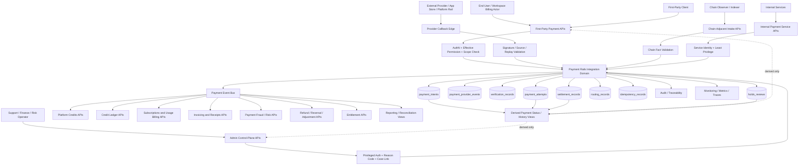
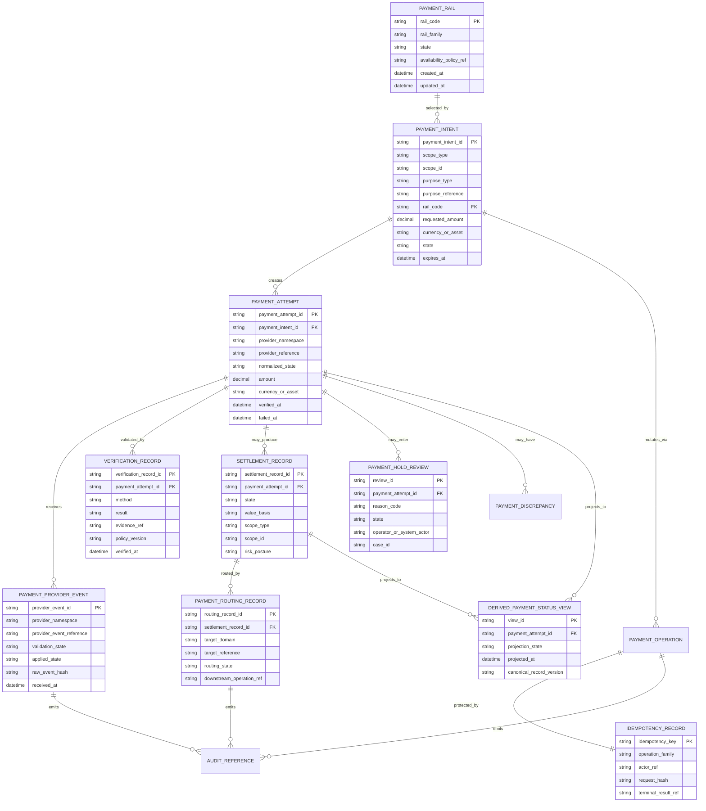

# PAYMENT_RAILS_INTEGRATION_API_SPEC.md

## Document Metadata

- **Document Name:** `PAYMENT_RAILS_INTEGRATION_API_SPEC.md`
- **Document Type:** FUZE API SPEC v2 / production-grade interface-contract specification
- **Status:** Draft for canonical API SPEC v2 inclusion
- **Version:** 2.0.0
- **Effective Date:** 2026-04-24
- **Last Updated:** 2026-04-24
- **Reviewed On:** 2026-04-24
- **Document Owner:** FUZE Platform Commerce and Payment Integration Architecture
- **Approval Authority:** FUZE Platform Architecture and Governance Authority
- **Review Cadence:** Quarterly or upon material change to supported payment rail classes, provider verification posture, Platform Credits semantics, billing activation, refund/reversal policy, payment fraud controls, chain responsibility, app-store payment posture, or commercial risk controls
- **Governing Layer:** API contract layer derived from platform core / shared commercial infrastructure / payment rails integration semantics
- **Parent Registry:** API SPEC v2 Canonical File Registry
- **Upstream Semantic Registry:** `REFINED_SYSTEM_SPEC_INDEX.md`
- **Upstream API Registry:** `API_SPEC_INDEX.md`
- **Primary Audience:** API platform engineering, payments engineering, billing engineering, credits and ledger engineering, product engineering, frontend engineering, backend service teams, provider integration teams, fraud/risk operations, finance operations, support operations, security engineering, audit/compliance, data engineering, implementation-contract authors, OpenAPI/AsyncAPI/SDK authors, and production readiness reviewers
- **Primary Purpose:** Define the canonical FUZE API contract posture for creating payment intents, exposing approved payment rail availability, ingesting and verifying provider or chain-adjacent payment signals, normalizing external value ingress into platform-owned payment state, routing verified outcomes to downstream commercial domains, exposing safe read models, and bounding admin/control-plane remediation without allowing raw provider state or payment convenience APIs to redefine FUZE commercial truth
- **Primary Upstream References:** `REFINED_SYSTEM_SPEC_INDEX.md`, `PAYMENT_RAILS_INTEGRATION_SPEC.md`, `PAYMENT_RAILS_API_SPEC.md`, `PLATFORM_CREDITS_SPEC.md`, `CREDIT_LEDGER_AND_SETTLEMENT_SPEC.md`, `SUBSCRIPTIONS_AND_USAGE_BILLING_SPEC.md`, `INVOICING_AND_RECEIPTS_SPEC.md`, `REFUND_REVERSAL_AND_ADJUSTMENT_SPEC.md`, `PAYMENT_FRAUD_AND_ABUSE_PREVENTION_SPEC.md`, `PRICING_AND_MONETIZATION_MODEL_SPEC.md`, `API_ARCHITECTURE_SPEC.md`, `PUBLIC_API_SPEC.md`, `INTERNAL_SERVICE_API_SPEC.md`, `EVENT_MODEL_AND_WEBHOOK_SPEC.md`, `IDEMPOTENCY_AND_VERSIONING_SPEC.md`, `MIGRATION_AND_BACKWARD_COMPATIBILITY_SPEC.md`, `AUDIT_LOG_AND_ACTIVITY_SPEC.md`, `SECURITY_AND_RISK_CONTROL_SPEC.md`, `MONITORING_ALERTING_AND_INCIDENT_RESPONSE_SPEC.md`, `SYSTEM_BOUNDARY_AND_OWNERSHIP_SPEC.md`, `DOMAIN_OWNERSHIP_MATRIX_SPEC.md`, `DATA_MODEL_AND_ENTITY_OWNERSHIP_SPEC.md`, `ONCHAIN_OFFCHAIN_RESPONSIBILITY_SPEC.md`, `IDENTITY_AND_ACCOUNT_SPEC.md`, `WORKSPACE_AND_ORGANIZATION_SPEC.md`, `ACCESS_EVALUATION_AND_EFFECTIVE_PERMISSION_SPEC.md`, `ENTITLEMENT_AND_CAPABILITY_GATING_SPEC.md`
- **Primary Downstream Dependents:** payment provider adapters, checkout and funding flows, product checkout APIs, Platform Credits APIs, credit ledger and settlement APIs, subscriptions and usage billing APIs, invoicing and receipts APIs, refund/reversal/adjustment APIs, payment fraud and risk-review APIs, support/control-plane tools, reconciliation pipelines, payment-history views, reporting exports, OpenAPI contracts, AsyncAPI contracts, SDKs, and implementation-contract specs
- **API Surface Families Covered:** public-safe catalog reads where approved, first-party authenticated checkout/payment intent APIs, internal service APIs, admin/control-plane APIs, inbound provider webhook/callback ingestion, internal event interfaces, reporting/read-model APIs, and chain-adjacent intake/status APIs
- **API Surface Families Excluded:** unrestricted public payment mutation APIs, direct third-party outbound payment webhooks, raw provider SDK contracts, database schema as API, direct provider dashboard APIs, final refund policy APIs, final invoice/receipt document APIs, direct credits-ledger mutation APIs, treasury APIs, profit-participation APIs, and unrestricted chain write APIs
- **Canonical System Owner(s):** Payment Rails Integration Domain for normalized payment rail truth; adjacent owners remain Platform Credits, Credit Ledger and Settlement, Billing, Invoicing and Receipts, Refund/Reversal/Adjustment, Fraud and Abuse Prevention, Security/Risk, Audit, Identity/Session, Workspace/Authorization, and On-Chain/Off-Chain Responsibility domains
- **Canonical API Owner:** FUZE API Platform in coordination with FUZE Platform Commerce and Payment Integration Architecture
- **Supersedes:** Older `PAYMENT_RAILS_API_SPEC.md` where it is weaker, incomplete, or not aligned with API SPEC v2 structure; earlier payment-rail API notes that did not preserve strict separation between provider truth, normalized payment truth, billing truth, Platform Credits truth, ledger truth, entitlement truth, invoice/receipt truth, correction truth, and risk truth
- **Superseded By:** Not yet known
- **Related Decision Records:** Not yet known
- **Canonical Status Note:** This API specification is the canonical API SPEC v2 interface-contract expression of `PAYMENT_RAILS_INTEGRATION_SPEC.md`. Refined system specs own payment-rail semantics; this document owns API route-family posture, resource exposure, request/response/error/idempotency/audit/event/versioning guardrails, and downstream contract obligations. API convenience MUST NOT reinterpret provider-side payment state, app-store state, chain transfer facts, checkout UI state, or user-facing payment status as canonical FUZE commercial truth.
- **Implementation Status:** Normative API design baseline; downstream OpenAPI, AsyncAPI, SDK, provider-adapter, service, storage, runbook, and QA contracts must be derived from this specification and the upstream refined semantics
- **Approval Status:** Drafted for API SPEC v2 review; formal approval record not yet attached
- **Change Summary:** Upgrades the older payment rails API draft into the requested API SPEC v2 registry filename and format; strengthens provider trust-boundary handling, normalized payment truth, route family separation, idempotency/replay controls, admin/control-plane constraints, chain-adjacent posture, event payload rules, read-model safeguards, acceptance criteria, diagrams, and test cases.

## Purpose

This API specification defines the production-grade FUZE API contract for payment rails integration.

The payment rails API family is the interface boundary through which approved external value-ingress channels are discovered, initiated, received, verified, normalized, reviewed, and routed into downstream FUZE commercial domains. FUZE may accept value through fiat processors, stablecoin transfers, ecosystem token payment inputs under approved policy, platform-embedded payment environments, app-store billing environments, Telegram-native or similar provider-specific surfaces, and future approved rail classes. The API contract MUST make those diverse rail behaviors usable by products and internal services without allowing products, clients, provider callbacks, chain observations, or admin dashboards to own payment semantics independently.

This specification exists to ensure that every API surface preserves the central FUZE rule: external provider success is not itself Platform Credits truth, billing truth, invoice truth, entitlement truth, ledger truth, refund truth, fraud truth, profit truth, or treasury truth. External inputs become FUZE commercial meaning only after rail-specific verification and platform-owned normalization.

## Scope

This specification governs API contracts for:

1. scope-aware payment rail catalog visibility;
2. first-party payment intent creation and payment attempt status reads;
3. service-created payment intents for approved commercial purposes;
4. provider callback, webhook, app-store event, bridge event, and chain-adjacent intake surfaces;
5. rail-specific verification and normalized payment status recording;
6. settlement-state verification and downstream routing to billing, credits, ledger, invoicing, entitlement, refund/correction, fraud/risk, and reporting domains;
7. admin/control-plane hold, release, reject, discrepancy, and remediation APIs;
8. event emission and async workflow posture for payment lifecycle changes;
9. request, response, error, status, idempotency, replay, rate-limit, audit, correlation, and observability requirements;
10. read-model, projection, reporting, and user-facing payment-history constraints; and
11. downstream OpenAPI, AsyncAPI, SDK, implementation-contract, QA, and production-readiness derivation rules.

## Out of Scope

This specification does not govern:

- the semantic meaning of Platform Credits or credit classes;
- authoritative credit ledger posting and balance derivation mechanics;
- recurring subscription or usage-billing truth;
- final invoice, receipt, credit note, refund note, or tax document truth;
- final refund, reversal, or adjustment policy in full depth;
- final fraud threshold tuning or risk scoring model internals;
- raw provider SDK internals or provider dashboard behavior;
- exact app-store receipt-validation implementation details beyond API contract obligations;
- exact smart-contract ABI, chain indexer, confirmation algorithm, or wallet custody implementation;
- final accounting, revenue recognition, treasury, payout, profit-participation, or governance fund movement truth;
- product-local pricing tables, offer configuration, or UI presentation details except where they feed payment intent request validation; or
- unrestricted public third-party payment APIs.

Those concerns are governed by adjacent refined system specs and their downstream API/implementation-contract specs.

## Design Goals

1. Preserve payment rails as FUZE-owned external value-ingress and normalization infrastructure.
2. Support multiple payment rail classes without fragmenting FUZE commercial semantics.
3. Ensure verification-first behavior before downstream economic effects.
4. Keep normalized payment truth separate from Platform Credits, billing, ledger, invoice, entitlement, fraud, correction, profit, and treasury truth.
5. Provide stable route families for first-party apps, internal services, admin/control-plane tools, provider callbacks, events, and reporting.
6. Make idempotency, replay protection, duplicate-provider-event handling, and downstream routing safety mandatory.
7. Preserve account and workspace scope integrity for commercial effects.
8. Allow future rail expansion without route and schema drift.
9. Ensure admin/operator remediation is bounded, reason-coded, policy-constrained, audited, and lineage-preserving.
10. Provide sufficient contract clarity for OpenAPI, AsyncAPI, SDK, implementation QA, and production readiness.

## Non-Goals

This specification is not intended to:

- make each provider rail its own balance system;
- let products integrate providers directly without FUZE normalization;
- treat raw provider status, app-store purchase state, chain transfers, or frontend checkout status as canonical internal payment truth;
- allow payment success to directly mutate credits, billing, invoice, entitlement, or ledger truth without explicit downstream routing;
- replace fraud, refund, invoice, credits-ledger, pricing, accounting, treasury, or chain architecture specs;
- expose provider internals broadly to public or first-party clients;
- define a public marketplace for credits or tokens;
- define final legal refund rights or tax treatment; or
- serve as a raw endpoint dump without architecture-level contract rules.

## Core Principles

### 1. Refined Semantics Own Meaning

`PAYMENT_RAILS_INTEGRATION_SPEC.md` owns canonical payment rails semantics. This API specification expresses those semantics at the interface layer and MUST NOT redefine payment truth for route convenience.

### 2. External Trust Boundary

External providers, app stores, platform-native rails, and blockchains may be authoritative for their raw facts. FUZE is authoritative for normalized commercial meaning after verification and policy interpretation.

### 3. Verification Before Economic Effect

No API response, callback acknowledgment, provider bridge event, or chain observation may cause credits issuance, subscription activation, invoice settlement, entitlement activation, or accounting interpretation until the payment rail layer records a verified normalized outcome and routes it through the owning downstream domain.

### 4. Payment Is Not Credits

Verified payment may justify Platform Credits issuance, but payment truth is not credit semantic truth, ledger truth, or spendable balance truth.

### 5. Payment Is Not Billing

Payment rails provide verified value-ingress facts and settlement evidence. Billing owns subscription, usage, renewal, seat, grace, recovery, and billing-scope truth.

### 6. Payment Is Not Document Truth

Payment rails may provide receipt or invoice settlement inputs. Invoicing and Receipts own billing-document truth.

### 7. Payment Is Not Entitlement

Payment verification may justify entitlement activation or renewal. Entitlement and capability gating remain separate truth and API families.

### 8. Correction Is First-Class

Refunds, revocations, chargebacks, disputes, payment anomalies, and app-store cancellations MUST be normalized and routed into correction/risk workflows. They MUST NOT be handled as destructive edits to prior payment state.

### 9. Scope Assignment Is Mandatory

Every economically material payment intent, attempt, verification, settlement, and routing decision MUST resolve to an explicit account or workspace scope before downstream commercial effects finalize.

### 10. Derived Reads Cannot Become Owners

Payment-history views, checkout status views, support dashboards, exports, reconciliation reports, analytics, and caches are derived. They MUST NOT own payment state or trigger economic effects without checking canonical normalized payment truth.

## Canonical Definitions

- **Payment Rail:** An approved external value-ingress channel such as a fiat processor, stablecoin rail, ecosystem token payment path, platform-embedded payment environment, app-store billing channel, or future approved rail.
- **Payment Intent:** FUZE-owned request to initiate a payment for an explicit scope, purpose, amount, rail, and downstream commercial target.
- **Payment Attempt:** Provider-bound or rail-bound execution attempt associated with a payment intent.
- **Provider Event:** Raw or bridged provider/chain/app-store/platform-native signal received by FUZE and stored for validation, normalization, and lineage.
- **Verification Record:** Durable FUZE record describing how an event or payment attempt was validated under rail-specific rules.
- **Normalized Payment State:** FUZE-owned status and commercial interpretation after verification and normalization.
- **Payment Settlement Record:** FUZE record that a payment outcome is sufficiently verified and ready for downstream routing, or explicitly invalidated/disputed/review-required.
- **Payment Routing Record:** Durable linkage from a verified payment outcome to a downstream owner domain such as Platform Credits, Billing, Invoicing, Entitlement, Correction, or Risk.
- **Payment Scope:** Account or workspace context to which the downstream commercial effect is attached.
- **Payment Hold/Review:** Risk, anomaly, fraud, verification, or operator review state that suspends or constrains downstream routing.
- **Provider Truth:** Raw status or facts asserted by an external provider, app store, platform rail, or blockchain.
- **Platform Commercial Truth:** FUZE-owned normalized interpretation after verification, scope resolution, and policy checks.
- **Derived Payment View:** Any UI, reporting, support, export, or cached summary derived from canonical payment rail records.

## Truth Class Taxonomy

Downstream API, SDK, event, storage, reporting, and implementation layers MUST preserve these truth classes:

1. **Identity Truth:** canonical account identity and actor anchors.
2. **Session Truth:** runtime authentication, active session, privileged-session posture, and session risk constraints.
3. **Workspace / Organization Truth:** collaborative scope, billing-scope ownership, organization state, and membership context.
4. **Authorization Truth:** role, permission, scope, and effective-permission outcomes for payment actions.
5. **Entitlement Truth:** product/capability eligibility that may be activated or constrained downstream of payment.
6. **Payment Rail Provider-Input Truth:** raw provider, bridge, chain, app-store, or platform-native event facts before FUZE validation.
7. **Payment Rail API Contract Truth:** request/response/error/status/event/idempotency obligations defined by this API spec.
8. **Normalized Payment Truth:** FUZE-owned verified payment intent, attempt, provider-event application, settlement, dispute, reversal, hold, and routing posture.
9. **Platform Credits Semantic Truth:** credit class, ownership scope, issuance category, spend semantics, and policy posture.
10. **Credit Ledger and Settlement Truth:** append-oriented ledger mutation, balance derivation, reservation, reversal, reconciliation, and commitment linkage.
11. **Billing Truth:** subscription, usage-billing, seat, renewal, recovery, grace, billing owner, and billing-scope responsibility.
12. **Invoice / Receipt Truth:** billing-document issuance, allocation, delivery, voiding, and supersession state.
13. **Refund / Reversal / Adjustment Truth:** typed correction lifecycle, approval, downstream-effect coordination, and partial correction handling.
14. **Fraud / Risk Truth:** trust states, holds, containment, release, review, risk scoring, and abuse posture.
15. **Chain Fact Truth:** observed chain transfer, asset, address, confirmation, transaction, and bridge fact before FUZE commercial interpretation.
16. **Policy Truth:** compliance, security, rail admission, country/region, app-store, risk, governance, and commercial policy constraints.
17. **Runtime Truth:** current worker/job state, provider outage state, verification dependency state, queue state, and monitoring state.
18. **Audit / Traceability Truth:** durable evidence, actor, reason code, correlation, request lineage, and reconstructable access/action history.
19. **Projection / Reporting Truth:** dashboards, exports, analytics, payment history, reconciliation views, and support summaries derived from canonical records.
20. **Presentation Truth:** UI labels, provider display names, checkout messages, support text, and customer-facing affordances.

## Architectural Position in the Spec Hierarchy

This API specification sits below the refined semantic registry and the refined payment rails integration specification. It consumes, but does not replace, the payment, credits, billing, invoice, refund, fraud, entitlement, authorization, audit, security, and chain responsibility refined system specs.

This API specification sits above downstream OpenAPI files, AsyncAPI files, SDKs, provider-adapter contracts, webhook ingestion implementations, admin-console contracts, operational runbooks, database schema details, and QA test suites.

## Upstream Semantic Owners

The following upstream owners are normative for this API family:

| Domain | Governing semantic owner | API obligation |
|---|---|---|
| Payment rail normalization | `PAYMENT_RAILS_INTEGRATION_SPEC.md` | Preserve provider-input vs normalized payment truth separation. |
| Platform Credits | `PLATFORM_CREDITS_SPEC.md` | Do not treat payment verification as credits balance. |
| Credits ledger | `CREDIT_LEDGER_AND_SETTLEMENT_SPEC.md` | Route verified value into ledger APIs/events; do not post ledger truth directly from provider input. |
| Billing | `SUBSCRIPTIONS_AND_USAGE_BILLING_SPEC.md` | Use payment state as input; do not own billing lifecycle through payment APIs. |
| Invoicing/receipts | `INVOICING_AND_RECEIPTS_SPEC.md` | Provide settlement evidence; document truth remains separate. |
| Refund/reversal/adjustment | `REFUND_REVERSAL_AND_ADJUSTMENT_SPEC.md` | Normalize correction inputs; typed correction domain owns unwind coordination. |
| Fraud/risk | `PAYMENT_FRAUD_AND_ABUSE_PREVENTION_SPEC.md` | Surface risk signals and obey holds/review gates. |
| Authorization | `ACCESS_EVALUATION_AND_EFFECTIVE_PERMISSION_SPEC.md` | Enforce concrete action/scope decisions before payment reads or mutations. |
| Entitlement | `ENTITLEMENT_AND_CAPABILITY_GATING_SPEC.md` | Do not bypass capability gating or downstream eligibility truth. |
| Chain responsibility | `ONCHAIN_OFFCHAIN_RESPONSIBILITY_SPEC.md` | Distinguish chain facts from platform business meaning. |
| Audit/activity | `AUDIT_AND_ACCESS_TRACEABILITY_SPEC.md` and `AUDIT_LOG_AND_ACTIVITY_SPEC.md` | Generate reconstructable audit and action lineage. |
| API governance | `API_ARCHITECTURE_SPEC.md`, `PUBLIC_API_SPEC.md`, `INTERNAL_SERVICE_API_SPEC.md`, `EVENT_MODEL_AND_WEBHOOK_SPEC.md`, `IDEMPOTENCY_AND_VERSIONING_SPEC.md`, `MIGRATION_AND_BACKWARD_COMPATIBILITY_SPEC.md` | Preserve API family separation, compatibility, idempotency, event, and migration rules. |

## API Surface Families

### Public API Surface

Public unauthenticated payment APIs are excluded by default. Public-safe reads MAY exist only for static, non-scope-specific rail metadata when approved by public API governance. Public surfaces MUST NOT expose provider credentials, scope-specific eligibility, user payment history, risk posture, fraud signals, settlement status, or downstream routing state.

### First-Party Application Surface

First-party authenticated surfaces allow approved FUZE clients to list scope-aware rail options, create payment intents, retrieve payment intent and attempt status, poll customer-action requirements, and read user-safe payment history for authorized account or workspace scopes.

### Internal Service Surface

Internal service APIs ingest provider events, verify settlement, create service-owned intents, route verified outcomes, read canonical payment state, and coordinate with billing, credits, ledger, invoicing, correction, fraud, entitlement, and reconciliation systems. These routes require service identity, least privilege, idempotency, correlation, and audit.

### Admin / Control-Plane Surface

Admin APIs support hold, review, release, rejection, discrepancy resolution, rail disablement, scope restriction, stuck-attempt remediation, and support/finance case linkage. These routes are privileged, bounded, reason-coded, operator-attributed, audited, and separated from ordinary application APIs.

### Event / Webhook / Async Surface

This family includes inbound provider callbacks/webhooks, internal event emissions, async verification jobs, downstream routing events, risk review transitions, and reconciliation events. Inbound provider callbacks are not public business APIs; they are trust-boundary integration endpoints with strict verification and replay handling.

### Reporting / Read-Model Surface

Reporting APIs expose derived payment views, reconciliation summaries, and support dashboards. They MUST remain traceable to canonical payment records and MUST NOT be used as mutation authorities.

### Chain-Adjacent Surface

Chain-adjacent APIs and events accept or query observed chain facts for approved rails. They MUST distinguish transaction facts from FUZE commercial meaning and MUST preserve confirmation, asset, address, replay, source-policy, and chain-reorg safety constraints.

## System / API Boundaries

The payment rails API owns interface contracts for normalized payment rail resources. It does not own downstream economic domain mutation semantics.

Allowed API ownership:

- create payment intents;
- create payment attempts where provider flow requires it;
- accept raw/bridged provider events;
- validate provider/chain/app-store/platform-native events;
- record normalized payment status;
- record verification evidence and settlement records;
- hold, release, reject, or require review under policy;
- route verified outcomes to downstream owner domains through explicit APIs/events;
- expose safe derived read models.

Forbidden API ownership:

- directly edit credits balances;
- directly define subscription active/inactive truth;
- directly issue or void invoices/receipts as source of truth;
- directly create entitlement truth without downstream entitlement owner;
- directly classify final refund rights outside correction domain;
- directly create accounting, profit, treasury, or payout truth;
- expose raw provider webhook state as public truth;
- allow products to write provider success into platform commercial state.

## Adjacent API Boundaries

- `PLATFORM_CREDITS_API_SPEC.md` owns credit semantic exposure and credit issuance eligibility interfaces.
- `CREDIT_LEDGER_AND_SETTLEMENT_API_SPEC.md` owns append-oriented credit ledger mutation and reconciliation APIs.
- `SUBSCRIPTIONS_AND_USAGE_BILLING_API_SPEC.md` owns recurring and usage billing lifecycle APIs.
- `INVOICING_AND_RECEIPTS_API_SPEC.md` owns billing-document APIs.
- `REFUND_REVERSAL_AND_ADJUSTMENT_API_SPEC.md` owns typed correction lifecycle APIs.
- `PAYMENT_FRAUD_AND_ABUSE_PREVENTION_API_SPEC.md` owns commercial risk-case APIs and trust-state intervention APIs.
- `PRICING_AND_MONETIZATION_MODEL_API_SPEC.md` owns pricing policy and monetization model APIs.
- `ENTITLEMENT_AND_CAPABILITY_GATING_API_SPEC.md` owns capability eligibility APIs.
- `AUDIT_LOG_AND_ACTIVITY_API_SPEC.md` owns generalized audit/activity APIs.
- `PUBLIC_CHAIN_REFERENCE_API_SPEC.md`, `CHAIN_ARCHITECTURE_API_SPEC.md`, and Base-related API specs own chain reference and chain execution posture where applicable.

## Conflict Resolution Rules

1. Active refined system specs win on domain semantics.
2. This API spec wins on payment-rails API contract posture where it does not contradict refined semantics.
3. Provider documentation wins only for provider-side raw event meaning and verification mechanics, never for FUZE commercial interpretation.
4. Chain observations win only on chain facts, never on FUZE business interpretation.
5. Platform Credits, billing, invoicing, refund/correction, fraud/risk, entitlement, and ledger owner specs win in their own downstream domains.
6. If payment, billing, and credits states appear inconsistent, treat normalized payment truth as upstream evidence only and require downstream owner reconciliation rather than overwriting downstream truth.
7. If a provider callback is valid but scope is ambiguous, final downstream routing MUST fail closed until scope resolution is explicit and audited.
8. If a user-facing checkout status conflicts with canonical payment state, canonical payment state wins.
9. If a derived read model conflicts with canonical payment records, canonical payment records win and the derived view must be repaired.
10. If ambiguity remains, choose the most restrictive architecture-consistent interpretation and route to review, correction, or governance decision.

## Default Decision Rules

1. Provider event received does not equal payment verified.
2. Payment verified does not equal credits issued.
3. Payment verified does not equal subscription active.
4. Payment verified does not equal invoice paid unless the invoice domain records settlement.
5. Payment verified does not equal entitlement active unless entitlement domain records eligibility.
6. Payment held for review MUST block ordinary downstream routing unless an approved policy explicitly allows constrained routing.
7. Duplicate provider event MUST return an idempotent already-applied or already-recorded outcome, not create duplicate economic effects.
8. Same idempotency key with materially different request body MUST fail with conflict.
9. Admin remediation MUST append lineage and reason codes; it MUST NOT rewrite prior provider or payment records.
10. Future rail classes MUST be introduced through rail admission, verification, normalization, correction, risk, audit, and compatibility review before exposure to product payment flows.

## Roles / Actors / API Consumers

- **End User:** Authenticated account holder initiating or reading personal-scope payments.
- **Workspace Billing Actor:** Authorized workspace member initiating or reading workspace-scope payments.
- **First-Party Client:** FUZE web/mobile/embedded client consuming payment catalog, intent, and status APIs.
- **Internal Payment Service:** Service that creates intents, validates provider events, records settlement, and emits payment events.
- **Provider Adapter / Webhook Bridge:** Internal or edge component receiving provider callbacks and converting them into controlled internal ingestion requests.
- **Chain Observer / Indexer:** Chain-adjacent component that observes approved chain facts and forwards them for validation.
- **Billing Service:** Downstream service consuming verified payment outcomes for subscription or usage billing.
- **Credits Service:** Downstream service consuming verified payment outcomes for credits issuance eligibility.
- **Ledger Service:** Downstream service recording authoritative ledger mutation and reconciliation posture.
- **Invoicing Service:** Downstream service deriving receipt or invoice settlement actions.
- **Fraud / Risk Service:** Service that places, evaluates, releases, or escalates payment holds and trust states.
- **Support / Finance Operator:** Privileged actor performing bounded review or remediation through admin routes.
- **Audit / Compliance Consumer:** Authorized internal consumer reviewing immutable payment action lineage.
- **Reporting / Reconciliation Consumer:** Internal service or operator using derived views tied to canonical payment records.

## Resource / Entity Families

### Canonical API Resources

- `payment_rail`
- `payment_rail_availability`
- `payment_intent`
- `payment_attempt`
- `payment_provider_event`
- `payment_verification_record`
- `payment_settlement_record`
- `payment_routing_record`
- `payment_hold_review`
- `payment_discrepancy`
- `payment_correction_signal`
- `payment_reconciliation_case`
- `payment_idempotency_record`
- `payment_operation`
- `payment_audit_reference`

### Derived API Resources

- `payment_status_view`
- `payment_history_view`
- `payment_availability_view`
- `payment_reconciliation_view`
- `support_payment_summary`
- `reporting_payment_export`

Derived resources MUST carry canonical references and projection timestamps. They MUST NOT expose themselves as mutation targets for payment truth.

## Ownership Model

The Payment Rails Integration Domain owns normalized payment-intent, payment-attempt, provider-event, verification, settlement, hold/review, discrepancy, and downstream-routing API resources.

Provider adapters own transport-specific integration code, not normalized payment truth.

First-party clients own presentation and customer-action handoff, not payment success.

Downstream domains own their own effects:

- credits issuance and credit class assignment belong to Platform Credits and Ledger domains;
- subscriptions, renewals, failed-payment workflows, and billing ownership belong to Billing;
- document issuance belongs to Invoicing and Receipts;
- refund/reversal coordination belongs to Correction;
- fraud/risk containment belongs to Fraud and Abuse Prevention;
- entitlement activation belongs to Entitlement;
- chain execution belongs to chain-specific architecture specs.

## Authority / Decision Model

Payment APIs make the following decisions:

- whether a rail is available for a scope, purpose, amount, and policy context;
- whether a payment intent request is valid;
- whether a provider event is authentic, unique, and processable;
- whether a payment attempt is verified, failed, disputed, reversed, expired, or review-required;
- whether a verified payment can be routed downstream;
- whether a payment attempt requires risk hold, review, release, or rejection;
- whether a discrepancy requires correction, remediation, or reconciliation.

Payment APIs do not decide final downstream economic effects except by issuing explicit routed payment outcomes to the downstream owner domain.

## Authentication Model

### First-Party User Routes

MUST require valid account-authenticated session. Workspace-scoped actions MUST require scope-aware authorization and current session posture appropriate to financial action sensitivity.

### Internal Service Routes

MUST require service identity, service authorization, mTLS or equivalent internal trust, explicit caller classification, and least-privilege policy. Provider callback edges MUST terminate into verified internal service routes before canonical mutation.

### Admin Routes

MUST require privileged operator identity, privileged session posture, authorization to the target payment scope or global payment operations scope, reason code, case linkage where applicable, and step-up controls for high-risk actions.

### Provider Callback Routes

MUST validate provider signatures, bridge credentials, replay windows, event references, provider account/tenant mapping, expected rail code, and source IP or channel posture where applicable. Provider callbacks are not authenticated user sessions.

### Chain-Adjacent Routes

MUST require approved observer identity or bridge identity, chain/source identifier, confirmation posture, transaction reference, destination/asset validation metadata, and replay constraints.

## Authorization / Scope / Permission Model

Every route MUST define:

- actor type;
- target scope type and scope id;
- action class: read, initiate, ingest, verify, route, hold, release, reject, remediate, export, or administer;
- required permission or service capability;
- effective-permission decision result;
- applicable policy version;
- entitlement/capability gating where a payment action unlocks product access;
- risk restrictions or containment state;
- audit/correlation requirements.

Workspace payment actions MUST NOT rely only on membership. They MUST evaluate effective permission for the concrete commercial action.

## Entitlement / Capability-Gating Model

Payment APIs MAY expose payment routes for purchases that lead to entitlement changes. They MUST NOT grant capability access directly. A verified payment outcome MAY route to entitlement or billing APIs, and entitlement state must be read from the entitlement owner.

Rail availability MAY be narrowed by entitlement, product capability, country/region, commercial policy, or risk posture. Such narrowing MUST be represented as policy/availability posture, not as payment truth.

## API State Model

### Payment Intent States

- `created`
- `awaiting_customer_action`
- `awaiting_provider_processing`
- `attempt_created`
- `completed`
- `failed`
- `expired`
- `cancelled`
- `requires_review`

### Payment Attempt States

- `created`
- `pending`
- `requires_action`
- `processing`
- `succeeded_unverified`
- `succeeded_verified`
- `failed`
- `expired`
- `cancelled`
- `held_for_review`
- `disputed`
- `partially_reversed`
- `reversed`

### Provider Event States

- `received`
- `signature_invalid`
- `validated`
- `rejected`
- `duplicate_recorded`
- `applied`
- `superseded`
- `requires_review`

### Verification States

- `pending_verification`
- `verified`
- `failed`
- `insufficient_evidence`
- `provider_unavailable`
- `chain_confirmation_pending`
- `requires_review`

### Settlement States

- `pending_verification`
- `verified`
- `routed`
- `invalidated`
- `superseded`
- `blocked_by_hold`
- `blocked_by_scope_ambiguity`

### Hold / Review States

- `opened`
- `under_review`
- `released`
- `rejected`
- `escalated`
- `closed`

### Routing States

- `not_ready`
- `ready`
- `queued`
- `routed`
- `downstream_accepted`
- `downstream_failed_retryable`
- `downstream_failed_terminal`
- `requires_reconciliation`

## Lifecycle / Workflow Model

1. Caller requests available rails for scope and purpose.
2. API evaluates authentication, authorization, policy, rail availability, scope, and commercial purpose.
3. Caller creates payment intent with explicit scope, purpose, amount, rail, return/callback metadata, and idempotency key.
4. Payment service creates intent and attempt, returns customer-action or provider handoff metadata.
5. Provider, app store, platform rail, or chain observer returns event to controlled intake surface.
6. Intake verifies signature/source/replay/tenant/event identity and records provider event.
7. Verification worker or synchronous logic validates rail-specific evidence.
8. Payment attempt moves to verified, failed, disputed, reversed, expired, or review-required state.
9. Risk and policy checks may hold, release, reject, or escalate the outcome.
10. Verified and unblocked settlement routes to downstream owner domain through explicit event or internal API.
11. Downstream domain accepts or rejects routed outcome under its own semantics.
12. Read models and reports update from canonical records.
13. Audit and observability records remain reconstructable across the entire chain.
14. Corrections, disputes, refunds, chargebacks, or reversals append new records and route through correction/risk workflows.

## Architecture Diagram — Mermaid flowchart



## Data Design — Mermaid Diagram



## Flow View

### Main First-Party Payment Flow

1. Client requests `GET /v1/payment-rails` with `scope_type`, `scope_id`, `purpose_type`, and optional product context.
2. API authenticates the actor, evaluates effective permission, checks rail availability, applies policy/risk restrictions, and returns safe rail summaries.
3. Client submits `POST /v1/payment-intents` with explicit scope, purpose, rail, amount, currency/asset, return URI, and idempotency key.
4. API validates amount, purpose, scope, rail, policy, pricing context, and idempotency.
5. Payment service creates a payment intent and initial attempt if needed.
6. API returns `201 Created` or `202 Accepted` with intent state, attempt state, operation reference, and customer-action metadata.
7. Client polls intent/attempt status or receives first-party app notification.
8. Provider callback or chain observer supplies result through internal intake.
9. Payment service validates provider event and updates normalized payment state.
10. Risk checks may hold or release routing.
11. Verified and unblocked settlement routes downstream.
12. Client reads final payment-domain status, which distinguishes payment verification from downstream credits/billing/document completion.

### Provider Callback / Webhook Flow

1. Provider sends callback to controlled edge endpoint.
2. Edge validates signature, tenant/provider namespace, event reference, timestamp/replay window, expected endpoint, and payload integrity.
3. Edge or bridge forwards normalized intake request to internal payment provider event API.
4. API stores provider event with idempotency and duplicate-provider-reference protection.
5. Verification applies rail-specific rules.
6. Attempt, settlement, hold/review, or discrepancy state changes append records and emit events.
7. Callback response acknowledges intake only; it MUST NOT imply downstream success unless downstream routing has separately finalized.

### Admin / Operator Flow

1. Operator opens payment case or loads payment attempt through admin UI.
2. Admin API authenticates privileged session and checks operator permission.
3. Operator submits hold/release/reject/remediate/discrepancy action with reason code, notes, case id, and idempotency key.
4. API records immutable action and updates hold/review or discrepancy posture.
5. API emits audit and payment events.
6. Downstream routing remains blocked, resumed, invalidated, or escalated according to policy.

### Failure / Retry / Degraded Mode

- If provider is unavailable, payment state remains pending or provider-unavailable without inventing success.
- If verification is unavailable, accepted-state response includes operation reference and retryable status.
- If routing to downstream domain fails retryably, payment settlement remains verified but routing remains pending/retryable.
- If routing fails terminally, reconciliation case is created.
- If duplicate provider event arrives, API returns safe idempotent result.
- If event is ambiguous, mismatched, or wrong-scope, API fails closed and requires review.

## Data Flows — Mermaid sequenceDiagram

```mermaid
sequenceDiagram
  autonumber
  participant Client as First-Party Client
  participant API as Payment Rails API
  participant Auth as AuthZ / Effective Permission
  participant Pay as Payment Service
  participant Store as Payment Stores
  participant Provider as Provider / App Store / Chain Bridge
  participant Risk as Fraud / Risk Service
  participant EventBus as Event Bus
  participant Downstream as Credits / Billing / Ledger / Invoice / Entitlement
  participant Audit as Audit / Observability

  Client->>API: POST /v1/payment-intents + Idempotency-Key
  API->>Auth: evaluate actor, scope, action, policy
  Auth-->>API: allow / deny / review-required
  API->>Pay: create intent and attempt
  Pay->>Store: write intent, attempt, idempotency record
  Pay->>Audit: audit payment intent creation
  Pay-->>API: intent + attempt + customer action
  API-->>Client: 201/202 with payment_intent_id and status

  Provider->>API: callback / provider event / chain observation
  API->>API: validate signature, source, replay, tenant, event ref
  API->>Pay: ingest provider event
  Pay->>Store: record provider event and verification record
  Pay->>Risk: evaluate risk / hold posture
  Risk-->>Pay: clear / hold / review / reject
  Pay->>Store: update normalized payment and settlement state
  Pay->>Audit: audit provider event and verification outcome
  Pay->>EventBus: emit payment lifecycle event

  alt verified and unblocked
    EventBus->>Downstream: route verified payment outcome
    Downstream-->>EventBus: accepted / rejected / retry
    Pay->>Store: record routing state
    Pay->>Audit: audit downstream routing
  else held or review required
    Pay->>Store: record hold/review state
    Pay->>EventBus: emit payments.held_for_review
  else failed or invalid
    Pay->>Store: record failed/invalidated state
    Pay->>EventBus: emit failure/rejection event
  end

  Client->>API: GET /v1/payment-intents/{id}
  API->>Auth: read permission check
  API->>Store: read canonical + derived safe state
  API-->>Client: payment status; downstream completion clearly separated
```

## Request Model

### Common Request Headers

- `Authorization` for authenticated first-party routes.
- `X-Service-Identity` or equivalent internal identity for service routes.
- Provider signature headers for callback routes.
- `Idempotency-Key` for mutation routes.
- `X-Correlation-ID` for all mutation and provider intake routes.
- `X-Request-ID` for all routes.
- `FUZE-API-Version` or versioned route path where supported.

### Common Mutation Fields

Mutation requests MUST include or derive:

- actor or service identity;
- scope type and scope id where scope is material;
- operation family;
- idempotency key;
- correlation id;
- reason code for admin/control or exception paths;
- policy version where policy evaluation affects result;
- related payment intent, attempt, provider event, settlement, or case reference;
- downstream purpose type and purpose reference where relevant.

### Payment Intent Create Request

Required fields:

- `scope_type`: `account` or `workspace`;
- `scope_id`;
- `purpose_type`: e.g. `credits_top_up`, `subscription_activation`, `subscription_renewal`, `seat_expansion`, `usage_charge`, `product_purchase`, `invoice_settlement`, `manual_payment_link`, or approved future purpose;
- `purpose_reference`;
- `payment_rail_code`;
- `amount`;
- `currency_or_asset`;
- `idempotency_key`;
- optional `return_uri`;
- optional `customer_metadata` constrained to non-authoritative presentation metadata.

### Provider Event Intake Request

Required fields:

- `provider_namespace`;
- `rail_code`;
- `provider_event_reference`;
- `event_type`;
- `raw_payload_hash`;
- `normalized_payload`;
- `signature_validation_result` or `bridge_validation_result`;
- `received_at`;
- `idempotency_key`;
- optional `payment_intent_id`;
- optional `payment_attempt_id`;
- optional chain/app-store/platform-native evidence references.

### Settlement Verification Request

Required fields:

- `payment_attempt_id`;
- `source_reference_type`;
- `source_reference_id`;
- `verification_outcome`;
- `verified_value_amount`;
- `currency_or_asset`;
- `scope_type`;
- `scope_id`;
- `evidence_reference`;
- `policy_version`;
- `idempotency_key`.

### Admin Hold / Release / Reject / Remediation Request

Required fields:

- target payment attempt, settlement, discrepancy, or review id;
- `reason_code`;
- `operator_note`;
- `case_id` where policy requires;
- intended action;
- `idempotency_key`;
- privileged session reference or derived operator context.

## Response Model

### Success Response Requirements

All successful mutation responses MUST include:

- stable resource identifier;
- resulting state;
- operation reference;
- correlation id;
- idempotency replay indicator where applicable;
- timestamps;
- scope summary;
- actor/service class where safe;
- downstream routing status where relevant;
- explicit statement of accepted-state vs terminal payment outcome.

### Accepted-State Responses

If processing is async, `202 Accepted` MUST include:

- `operation_id`;
- `operation_state`;
- `payment_intent_id` or `payment_attempt_id` where applicable;
- polling/status route;
- retry guidance when safe;
- clear statement that downstream credits/billing/invoice/entitlement effects are not yet final.

### Read Responses

Read responses MUST distinguish:

- canonical payment intent or attempt state;
- verification state;
- settlement state;
- hold/review posture;
- routing state;
- downstream accepted/finalized state if known and safe;
- derived view freshness;
- provider-specific display metadata sanitized for caller type.

### Admin Responses

Admin responses MUST include:

- operator action state;
- reason code;
- case reference;
- before/after summary where safe;
- immutable action reference;
- audit reference;
- downstream routing or blocking implication.

## Error / Result / Status Model

API errors MUST use structured problem details with:

- `type`;
- `title`;
- `status`;
- `code`;
- `detail`;
- `instance`;
- `correlation_id`;
- optional `retry_after`;
- optional `operation_id`;
- optional `safe_user_message`.

### Common Error Codes

#### Authentication / Authorization

- `PAYMENT_SESSION_REQUIRED`
- `PAYMENT_SERVICE_AUTH_REQUIRED`
- `PAYMENT_PROVIDER_SIGNATURE_INVALID`
- `PAYMENT_PERMISSION_DENIED`
- `PAYMENT_OPERATOR_PERMISSION_DENIED`
- `PAYMENT_SCOPE_PERMISSION_DENIED`

#### Request Integrity

- `PAYMENT_REQUEST_INVALID`
- `PAYMENT_IDEMPOTENCY_KEY_REQUIRED`
- `PAYMENT_IDEMPOTENCY_CONFLICT`
- `PAYMENT_AMOUNT_INVALID`
- `PAYMENT_CURRENCY_OR_ASSET_UNSUPPORTED`
- `PAYMENT_PURPOSE_INVALID`
- `PAYMENT_SCOPE_INVALID`
- `PAYMENT_RETURN_URI_INVALID`

#### Rail / Provider / Chain

- `PAYMENT_RAIL_UNAVAILABLE`
- `PAYMENT_RAIL_NOT_ALLOWED_FOR_SCOPE`
- `PAYMENT_PROVIDER_UNAVAILABLE`
- `PAYMENT_PROVIDER_EVENT_DUPLICATE`
- `PAYMENT_PROVIDER_EVENT_INVALID`
- `PAYMENT_PROVIDER_EVENT_ALREADY_APPLIED`
- `PAYMENT_CHAIN_CONFIRMATION_PENDING`
- `PAYMENT_CHAIN_FACT_MISMATCH`
- `PAYMENT_APP_STORE_VALIDATION_FAILED`

#### State / Conflict

- `PAYMENT_INTENT_STATE_INVALID`
- `PAYMENT_ATTEMPT_STATE_INVALID`
- `PAYMENT_SETTLEMENT_ALREADY_VERIFIED`
- `PAYMENT_SETTLEMENT_INVALIDATED`
- `PAYMENT_ROUTING_ALREADY_COMPLETED`
- `PAYMENT_SCOPE_AMBIGUOUS`
- `PAYMENT_AMOUNT_MISMATCH`
- `PAYMENT_REQUIRES_REVIEW`

#### Risk / Policy

- `PAYMENT_HELD_FOR_REVIEW`
- `PAYMENT_RISK_REJECTED`
- `PAYMENT_SCOPE_RESTRICTED`
- `PAYMENT_POLICY_DENIED`
- `PAYMENT_RAIL_REGION_RESTRICTED`
- `PAYMENT_ABUSE_CONTROL_TRIGGERED`

#### Dependency / Runtime

- `PAYMENT_VERIFICATION_UNAVAILABLE`
- `PAYMENT_ROUTING_UNAVAILABLE`
- `PAYMENT_DOWNSTREAM_REJECTED`
- `PAYMENT_DOWNSTREAM_RETRYABLE_FAILURE`
- `PAYMENT_PROJECTION_LAGGING`
- `PAYMENT_RATE_LIMITED`

### Status Semantics

- `verified` means accepted payment-domain input, not downstream business completion.
- `routed` means payment-domain routing was attempted or completed according to routing state, not necessarily final downstream state unless downstream confirmation is present.
- `held_for_review` means ordinary downstream routing is blocked.
- `requires_review` means deterministic automated resolution is not safe.
- `disputed`, `reversed`, and `partially_reversed` are new canonical states or correction inputs, not destructive edits to old states.

## Idempotency / Retry / Replay Model

### Required Idempotency

The following routes MUST be idempotent:

- payment intent creation;
- payment attempt creation or retry;
- provider event ingestion;
- settlement verification;
- downstream routing;
- hold/review open;
- hold release;
- review rejection;
- discrepancy resolution;
- admin remediation;
- rail enable/disable or scope restriction changes;
- reconciliation action creation.

### Idempotency Record Requirements

Each idempotency record MUST store:

- idempotency key;
- operation family;
- actor/service/provider namespace;
- target resource scope;
- request hash;
- response class;
- terminal or latest operation result;
- created/updated timestamps;
- expiry policy;
- audit reference.

### Replay Rules

- Same key + same semantic request MUST return the original terminal result or current accepted-state operation reference.
- Same key + different semantic request MUST fail with `PAYMENT_IDEMPOTENCY_CONFLICT`.
- Same provider event reference MUST NOT be applied twice.
- Same chain transaction reference MUST NOT create duplicate payment effects.
- Same app-store purchase token or transaction reference MUST NOT create duplicate payment effects.
- Retry of downstream routing MUST preserve settlement and routing lineage.

## Rate Limit / Abuse-Control Model

Rate limits MUST be applied by actor, account, workspace, rail, provider namespace, IP or edge identity where applicable, and operation family.

Higher-risk operations require stricter controls:

- payment intent creation bursts;
- payment method or rail availability probing;
- provider callback intake spikes;
- chain observation event submissions;
- admin remediation attempts;
- refund/reversal-triggering events;
- repeated failed verification events.

Rate-limit responses MUST NOT reveal hidden fraud or risk thresholds. Abuse controls MAY place payment attempts or scopes into review posture.

## Endpoint / Route Family Model

Route names are illustrative contract families. Machine-readable OpenAPI files MAY refine exact path names while preserving semantics.

### First-Party Routes

| Method | Route family | Purpose | Notes |
|---|---|---|---|
| `GET` | `/v1/payment-rails` | List scope/purpose-aware available rails | Requires auth for scope-aware output. |
| `POST` | `/v1/payment-intents` | Create payment intent | Requires idempotency and explicit scope/purpose. |
| `GET` | `/v1/payment-intents/{payment_intent_id}` | Read intent status | User-safe; downstream state separated. |
| `GET` | `/v1/payment-attempts/{payment_attempt_id}` | Read attempt status | User-safe; provider internals bounded. |
| `GET` | `/v1/payment-attempts` | List payment attempts/history | Derived-safe view with canonical references. |
| `POST` | `/v1/payment-intents/{payment_intent_id}/cancel` | Cancel eligible pending intent | Must not cancel verified/downstream-routed effects. |

### Internal Service Routes

| Method | Route family | Purpose | Notes |
|---|---|---|---|
| `POST` | `/internal/v1/payment-intents` | Service-created intent | Service auth and idempotency required. |
| `POST` | `/internal/v1/payment-provider-events` | Ingest provider/bridge event | Signature/source/replay validation required. |
| `POST` | `/internal/v1/payment-verifications` | Record verification outcome | Rail-specific evidence required. |
| `POST` | `/internal/v1/payment-settlements` | Promote/record settlement state | Must not route if held/ambiguous. |
| `POST` | `/internal/v1/payment-routings` | Route verified settlement downstream | Idempotent and auditable. |
| `GET` | `/internal/v1/payment-attempts/{id}` | Canonical internal read | Least-privilege service access. |
| `POST` | `/internal/v1/payment-reconciliation-cases` | Create reconciliation case | Required for terminal inconsistencies. |

### Provider / Webhook Intake Routes

| Method | Route family | Purpose | Notes |
|---|---|---|---|
| `POST` | `/webhooks/v1/payments/{provider_namespace}` | Provider callback intake | Edge trust-boundary route; business effects require internal application. |
| `POST` | `/webhooks/v1/app-store/{store_namespace}` | App-store event intake | Receipt/purchase-token validation required. |
| `POST` | `/webhooks/v1/platform-rails/{rail_namespace}` | Platform-native rail intake | Provider/platform signature and replay validation required. |

### Chain-Adjacent Routes

| Method | Route family | Purpose | Notes |
|---|---|---|---|
| `POST` | `/internal/v1/chain-payment-observations` | Submit observed chain facts | Observer identity and replay safety required. |
| `GET` | `/internal/v1/chain-payment-observations/{id}` | Read chain observation linkage | Chain fact; not commercial truth by itself. |

### Admin / Control-Plane Routes

| Method | Route family | Purpose | Notes |
|---|---|---|---|
| `POST` | `/admin/v1/payment-attempts/{id}/holds` | Open/affirm hold | Reason code, case id, audit. |
| `POST` | `/admin/v1/payment-attempts/{id}/release` | Release hold | Policy constrained. |
| `POST` | `/admin/v1/payment-attempts/{id}/reject` | Reject payment attempt | Cannot rewrite provider truth. |
| `POST` | `/admin/v1/payment-discrepancies` | Resolve discrepancy | Lineage-preserving. |
| `POST` | `/admin/v1/payment-rails/{rail_code}/restrictions` | Restrict rail/scope | Separation from normal app APIs. |
| `GET` | `/admin/v1/payment-reviews` | Review queue | Derived/admin view; canonical references required. |

### Reporting / Reconciliation Routes

| Method | Route family | Purpose | Notes |
|---|---|---|---|
| `GET` | `/internal/v1/payment-reconciliation` | Reconciliation view | Derived; canonical references. |
| `GET` | `/internal/v1/payment-exports` | Export payment records | Least privilege and audit required. |
| `GET` | `/admin/v1/payment-history` | Support/admin history | Derived, redacted, traceable. |

## Public API Considerations

Public APIs MUST default to narrow, stable, non-sensitive exposure. Public unauthenticated mutation is forbidden. Public rail catalog exposure MAY only include non-scope-specific high-level rail families if approved. Any future external partner payment API requires separate public API review, scope-constrained OAuth/service auth, fraud review, and contract-specific limitations.

## First-Party Application API Considerations

First-party clients MAY initiate and read payment flows for authorized scopes. They MUST NOT:

- submit provider success as authoritative;
- choose downstream domain effects without approved purpose validation;
- override rail availability or risk holds;
- expose hidden risk, provider, or operator metadata;
- infer credits/billing/entitlement success from payment verification alone.

## Internal Service API Considerations

Internal service APIs are powerful but MUST NOT become hidden broad-write shortcuts. They require service identity, least privilege, explicit operation families, idempotency, audit, and downstream owner preservation. Internal service APIs MUST use explicit routing records rather than directly writing downstream domain tables.

## Admin / Control-Plane API Considerations

Admin paths MUST be separated from user and internal automated paths. Operator actions MUST be:

- privileged-session protected;
- permission checked;
- reason-coded;
- case-linked where material;
- immutable in action history;
- policy-constrained;
- observable;
- reversible only through explicit correction paths;
- unable to erase provider or payment lineage.

Emergency restrictions MAY disable rails or hold scopes, but they MUST preserve affected scope/rail references and audit lineage.

## Event / Webhook / Async API Considerations

### Inbound Provider Webhooks

Inbound webhooks acknowledge receipt or rejection of provider input. They MUST NOT report downstream economic success unless the downstream owner has actually confirmed it. Webhook handlers MUST resist replay, duplicate events, malformed payloads, signature failure, provider namespace confusion, wrong account/tenant mapping, and amount/currency mismatch.

### Internal Events

Canonical payment events SHOULD include:

- `payments.intent_created`
- `payments.attempt_created`
- `payments.provider_event_received`
- `payments.provider_event_validated`
- `payments.provider_event_rejected`
- `payments.verification_completed`
- `payments.verification_failed`
- `payments.settlement_verified`
- `payments.settlement_invalidated`
- `payments.held_for_review`
- `payments.review_released`
- `payments.review_rejected`
- `payments.routed_downstream`
- `payments.routing_failed`
- `payments.dispute_received`
- `payments.reversal_received`
- `payments.discrepancy_created`
- `payments.discrepancy_resolved`

Minimum event payload fields:

- `event_id`;
- `event_type`;
- `occurred_at`;
- `payment_intent_id` where relevant;
- `payment_attempt_id` where relevant;
- `provider_event_id` where relevant;
- `settlement_record_id` where relevant;
- `scope_type` and `scope_id`;
- `rail_code`;
- `provider_namespace` where relevant;
- `actor_type`;
- `operation_id`;
- `correlation_id`;
- `idempotency_key_hash` where relevant;
- `policy_version`;
- `reason_code` where relevant;
- `canonical_state_after`.

## Chain-Adjacent API Considerations

Chain-adjacent payment rails MUST distinguish:

- observed chain transaction facts;
- confirmation depth and finality posture;
- asset, amount, source, destination, and memo/reference validation;
- chain-reorg or bridge-risk posture;
- FUZE commercial interpretation;
- downstream routing into credits/billing/correction.

Chain facts MAY justify a payment verification result only after policy-controlled validation. Chain facts MUST NOT directly create credits, subscriptions, entitlements, receipts, profit, or payout truth.

## Data Model / Storage Support Implications

Implementations SHOULD support at least:

- payment rails catalog table/store;
- payment intent store;
- payment attempt store;
- provider event store with uniqueness by provider namespace and event reference;
- verification record store;
- settlement record store;
- hold/review store;
- routing record store;
- discrepancy/reconciliation store;
- idempotency store;
- audit/action lineage references;
- derived status/history/projection stores.

Canonical stores MUST support append-oriented or lineage-preserving updates for economically material events. Destructive overwrites of provider events, verification outcomes, settlement transitions, holds, rejections, or remediation actions are forbidden.

## Read Model / Projection / Reporting Rules

1. Payment status and history views are derived from canonical payment records.
2. Projection lag MUST be visible or safe; it MUST NOT create spendable value or active access.
3. Reports and exports MUST link to canonical payment, settlement, and routing records.
4. Support dashboards MUST not expose hidden risk thresholds to ordinary support roles.
5. Public or user-facing reads MUST redact provider secrets, internal risk reasoning, operator notes, and security-sensitive metadata.
6. Reconciliation reports MUST distinguish provider-input truth, normalized payment truth, downstream routing state, ledger state, invoice state, refund/correction state, and derived export state.

## Security / Risk / Privacy Controls

Payment APIs are high-risk external-trust-boundary APIs. They MUST enforce:

- strong authentication and service identity;
- provider signature validation;
- webhook replay protection;
- idempotency and duplicate event detection;
- sensitive metadata minimization;
- secret and token redaction;
- explicit risk hold/review state;
- anti-probing rate limits;
- least-privilege admin access;
- privileged-session requirements for operator actions;
- scope integrity and workspace permission checks;
- audit and traceability;
- safe error messages that do not reveal fraud thresholds;
- encryption and storage controls appropriate to payment-provider references;
- compliance with data classification and retention rules.

## Audit / Traceability / Observability Requirements

Durable audit MUST be generated for:

- scope-aware rail availability decisions where commercially sensitive;
- payment intent creation;
- payment attempt creation/retry;
- provider event receipt, rejection, validation, and application;
- settlement verification or invalidation;
- hold/review open, release, reject, escalation, and closure;
- downstream routing;
- admin remediation and discrepancy resolution;
- rail enable/disable or scope restriction;
- export or sensitive admin read access.

Audit records MUST include actor/service/provider identity, target scope, resource ids, action, before/after state where safe, reason code, policy version, correlation id, request id, idempotency reference, operation id, timestamp, and evidence references.

Observability MUST include metrics, traces, and alerts for provider callback volume, validation failures, duplicate events, verification latency, provider outage, routing failures, stuck attempts, risk holds, webhook signature failures, chain confirmation delays, and projection lag.

## Failure Handling / Edge Cases

- **Provider duplicate event:** store or recognize duplicate, return idempotent outcome, do not reapply downstream effect.
- **Provider event out of order:** preserve event, apply only if state transition is valid or route to review.
- **Provider signature invalid:** reject event, audit failure, do not mutate payment attempt.
- **Amount mismatch:** hold or reject according to policy; do not route downstream.
- **Currency/asset mismatch:** reject or review; do not normalize into valid value.
- **Scope ambiguous:** fail closed and create review/discrepancy case.
- **Wrong-scope detected after verification:** block downstream routing if possible; otherwise initiate correction and audit.
- **Provider unavailable:** keep intent pending or failed according to timeout policy; do not invent success.
- **Verification dependency unavailable:** return accepted/retryable state with operation id.
- **Downstream routing retryable failure:** keep settlement verified, routing pending, retry safely.
- **Downstream terminal rejection:** create reconciliation or correction case.
- **Chargeback/dispute after consumption:** append reversal/dispute input and route to risk/correction/ledger/billing domains.
- **Chain reorg or confirmation reversal:** invalidate or review settlement according to chain policy, preserve evidence.
- **Admin conflicting action:** enforce idempotency, state transition rules, and privileged policy.

## Migration / Versioning / Compatibility / Deprecation Rules

- API route families SHOULD remain versioned under `/v1`, `/internal/v1`, `/admin/v1`, and `/webhooks/v1` until a breaking change requires new versioning.
- New rail codes MAY be added additively if existing fields remain stable.
- New normalized states require compatibility review and client handling rules.
- Existing meanings of `verified`, `held_for_review`, `routed`, `reversed`, and `disputed` MUST NOT change silently.
- Deprecated fields/routes MUST include deprecation metadata and migration windows.
- Older `PAYMENT_RAILS_API_SPEC.md` semantics MUST be migrated into this API SPEC v2 posture without allowing old names to weaken refined semantics.
- Data migrations MUST preserve idempotency, provider event uniqueness, audit lineage, and downstream routing history.

## OpenAPI / AsyncAPI / SDK Derivation Rules

OpenAPI artifacts MUST preserve:

- route-family separation;
- operation ids aligned to resource family and action;
- request/response schemas distinguishing accepted-state and terminal outcomes;
- structured problem-details errors;
- idempotency header requirements;
- correlation/request id headers;
- authorization requirements;
- scope and purpose fields;
- redaction by caller class;
- enum compatibility rules.

AsyncAPI artifacts MUST preserve:

- event names and payload minimums;
- canonical ids and correlation ids;
- producer and consumer ownership;
- retry and dead-letter posture;
- ordering and idempotency expectations;
- derived vs canonical event semantics.

SDKs MUST NOT flatten provider-specific states into simple `success/failure` booleans that erase verification, hold, dispute, routing, or downstream distinction.

## Implementation-Contract Guardrails

Implementation contracts MUST define:

- service boundaries for payment intent, attempt, provider event, verification, settlement, hold/review, routing, and projection components;
- storage uniqueness constraints for provider references and idempotency keys;
- state transition rules;
- provider-specific adapter contracts;
- chain observer contracts;
- retry/backoff and dead-letter rules;
- audit event schemas;
- role/permission and service capability mappings;
- redaction rules;
- reconciliation and repair procedures;
- migration scripts preserving lineage.

Implementation contracts MUST NOT:

- write directly to credits ledger, billing, invoice, entitlement, or correction stores from raw provider callbacks;
- bypass effective permission for workspace payment actions;
- store provider secrets in user-facing read models;
- treat projections as canonical mutation sources;
- allow admin updates that rewrite canonical payment history.

## Downstream Execution Staging

1. Define or update OpenAPI contracts for first-party, internal, admin, and webhook route families.
2. Define AsyncAPI contracts for payment lifecycle events.
3. Implement idempotency and provider event uniqueness before enabling mutating provider intake.
4. Implement read-safe projection models separately from canonical stores.
5. Integrate effective permission and privileged admin session checks.
6. Integrate risk/hold gates before downstream routing.
7. Integrate downstream routing contracts with credits, ledger, billing, invoicing, entitlement, fraud, and correction domains.
8. Add reconciliation and discrepancy workflows.
9. Add migration compatibility for older payment rail API names and clients.
10. Complete production readiness validation using acceptance criteria and test cases in this spec.

## Required Downstream Specs / Contract Layers

- OpenAPI: first-party payment rails routes.
- OpenAPI: internal payment service routes.
- OpenAPI: admin payment control-plane routes.
- OpenAPI: provider webhook intake routes.
- AsyncAPI: payment lifecycle events.
- Provider adapter implementation contracts.
- Chain observer and chain-adjacent intake contracts.
- Payment idempotency and uniqueness storage contract.
- Payment audit event contract.
- Payment projection/read-model contract.
- Payment reconciliation and discrepancy contract.
- Payment-to-credits routing contract.
- Payment-to-billing routing contract.
- Payment-to-invoicing routing contract.
- Payment-to-refund/correction routing contract.
- Payment-to-fraud/risk routing contract.

## Boundary Violation Detection / Non-Canonical API Patterns

The following are forbidden:

1. Product directly calls provider and writes `paid=true` into FUZE business state.
2. Provider webhook directly credits a user without payment normalization and ledger routing.
3. Chain transfer directly creates spendable credits without confirmation, scope resolution, and policy interpretation.
4. App-store purchase token directly activates entitlement without FUZE verification and downstream entitlement owner.
5. Payment API returns `subscription_active=true` as if it owns billing truth.
6. Payment status view becomes source of truth for support adjustments.
7. Admin operator edits a payment attempt from failed to verified without reason-coded remediation lineage.
8. Duplicate provider events create duplicate credits issuance or subscription activation.
9. Reporting export is used as reconciliation authority over canonical stores.
10. Public API exposes provider event payloads, fraud reasons, operator notes, or internal settlement evidence.
11. Service route writes directly to billing, ledger, invoice, or entitlement tables instead of routing through owner APIs/events.
12. SDK collapses states into unsafe boolean success.

## Canonical Examples / Anti-Examples

### Canonical Example: Stripe Credits Top-Up

1. User creates payment intent for `credits_top_up` in account scope.
2. Provider confirms payment through signed webhook.
3. FUZE validates signature, amount, currency, metadata, and provider reference.
4. Payment attempt becomes `succeeded_verified`.
5. Risk posture clears.
6. Settlement routes to Platform Credits/Credit Ledger owner.
7. Credits/ledger domain records issuance.
8. Payment status view shows payment verified and downstream credits issuance status separately.

### Canonical Example: Workspace Subscription Renewal

1. Billing domain requests or user initiates payment for workspace subscription renewal.
2. Payment intent records workspace scope and billing purpose.
3. Provider event is verified.
4. Settlement routes to Billing domain.
5. Billing domain records renewal or payment state.
6. Invoicing/Receipts may create document truth from billing/payment evidence.

### Canonical Example: Stablecoin Deposit

1. Chain observer reports transaction to approved destination.
2. API validates observer identity, chain, transaction, asset, amount, destination, confirmation threshold, and replay status.
3. FUZE records chain fact as provider-input truth.
4. Payment verification applies commercial scope and policy.
5. Verified settlement routes downstream; chain fact alone never creates credits.

### Anti-Example: Product-Owned Provider Integration

A product directly creates a Stripe checkout and, on success redirect, marks user credits available. This violates payment normalization, verification, ledger, audit, and idempotency rules.

### Anti-Example: Admin Rewrite

An operator changes a failed payment attempt into verified by editing the row. Correct behavior is a reason-coded remediation or correction record with evidence, approval, audit, and downstream routing constraints.

## Acceptance Criteria

1. Every mutating payment route requires idempotency key and correlation id.
2. Provider event uniqueness prevents duplicate economic effects for the same provider event reference.
3. Payment intent creation requires explicit scope, purpose, amount, rail, and authorization.
4. Workspace payment mutation requires effective permission for the concrete payment action.
5. Provider callback acknowledgment does not imply credits, billing, invoice, entitlement, or ledger success.
6. Raw provider event is stored and validated before normalized payment state changes.
7. Payment verification cannot complete without rail-specific evidence and policy version.
8. Verified payment settlement cannot route downstream while hold/review state is active unless an explicit approved policy allows constrained routing.
9. Downstream routing records distinguish routing queued, routed, downstream accepted, retryable failure, and terminal failure.
10. Read responses distinguish payment-domain status from downstream owner-domain status.
11. Admin actions require privileged session, permission, reason code, operator note, and audit record.
12. Dispute, chargeback, reversal, and app-store revocation create new lineage records rather than rewriting prior payment truth.
13. Derived read models carry canonical references and projection timestamps.
14. Public or first-party responses redact provider secrets, internal risk signals, and operator-only metadata.
15. Chain-adjacent intake distinguishes chain facts from FUZE commercial interpretation.
16. Rate limits apply to payment intent creation, provider callback intake, verification, and admin remediation.
17. Structured errors use stable machine-readable codes and safe details.
18. OpenAPI contracts preserve route-family separation and idempotency requirements.
19. AsyncAPI contracts include event ids, payment ids, scope, rail, actor type, correlation id, policy version, and state-after fields.
20. Migration from older `PAYMENT_RAILS_API_SPEC.md` preserves semantics while adopting API SPEC v2 metadata, diagrams, tests, and downstream guardrails.

## Test Cases

### Positive Path Tests

1. **Create account-scope credits top-up intent:** authenticated user with valid scope creates intent; response returns intent id, attempt id, customer action, idempotency reference, and no credits balance claim.
2. **Create workspace payment intent:** authorized workspace billing actor creates renewal payment; permission evaluated and workspace scope preserved.
3. **Provider webhook verification:** signed provider event validates, records provider event, creates verification record, updates attempt to verified, emits event.
4. **Stablecoin observation:** approved observer submits transaction; chain evidence validates after confirmation threshold; normalized payment state records verified settlement.
5. **Downstream routing success:** verified unblocked settlement routes to billing or credits; routing record shows downstream accepted without overwriting downstream truth.

### Negative Path Tests

6. **Missing idempotency key:** payment intent mutation returns `PAYMENT_IDEMPOTENCY_KEY_REQUIRED`.
7. **Same key different body:** replay with changed amount returns `PAYMENT_IDEMPOTENCY_CONFLICT`.
8. **Invalid provider signature:** webhook returns signature error and does not mutate attempt.
9. **Amount mismatch:** provider amount differs from intent; attempt enters review or rejection according to policy and does not route downstream.
10. **Unauthorized workspace actor:** workspace member without billing permission receives `PAYMENT_PERMISSION_DENIED`.

### Authorization / Entitlement / Policy Tests

11. **Rail not available for scope:** rail availability API excludes or flags rail under policy; create intent fails if forced.
12. **Restricted account:** risk-restricted account cannot initiate high-risk rail; safe error returned.
13. **Entitlement purchase mapping:** payment verification routes to entitlement owner, but payment API does not mark capability active.
14. **Admin release without privilege:** non-privileged operator release attempt fails and is audited as denied where required.

### Idempotency / Retry / Replay Tests

15. **Duplicate provider event:** same event reference is recorded once; repeated callback returns duplicate/already-applied result.
16. **Provider callback retry:** provider retry after timeout returns same result and does not duplicate settlement.
17. **Downstream routing retry:** retryable downstream failure requeues routing without duplicating payment settlement.
18. **Chain transaction replay:** same transaction hash/reference cannot create second payment effect.

### Conflict / Edge Case Tests

19. **Out-of-order provider events:** later refund/dispute before success is recorded safely and requires review if transition invalid.
20. **Wrong scope metadata:** verified provider event with ambiguous or wrong scope fails closed and creates discrepancy.
21. **Dispute after credits issuance:** dispute event appends correction/risk input and routes to correction/ledger owners.
22. **Projection lag:** user-facing status view shows pending/lagging projection and cannot create spendable value.

### Rate Limit / Abuse Tests

23. **Payment intent burst:** repeated create attempts trigger rate limit without leaking risk thresholds.
24. **Webhook flood:** callback edge throttles or queues provider namespace safely while preserving valid event idempotency.
25. **Rail probing:** unauthorized repeated rail catalog probes are limited and logged.

### Degraded-Mode / Runtime Tests

26. **Provider outage:** API returns provider unavailable or accepted pending state; no success invented.
27. **Verification worker down:** provider event accepted into pending verification; operation reference available; alert emitted.
28. **Event bus unavailable:** canonical payment state commits only if outbox/retry mechanism preserves event delivery semantics.
29. **Read projection unavailable:** canonical read route can still return safe status or projection-lag error.

### Audit / Observability Tests

30. **Audit reconstructability:** payment intent creation, provider event, verification, hold, release, routing, and downstream failure can be reconstructed by correlation id.
31. **Admin case linkage:** admin remediation without required case id fails; with case id writes immutable audit.
32. **Sensitive redaction:** first-party read does not expose operator notes, raw provider payload, secrets, or risk scoring internals.

### Migration / Compatibility Tests

33. **Older client read compatibility:** existing v1 payment intent status client receives additive fields without changed enum meaning.
34. **New rail additive launch:** adding new rail code does not break existing rail list clients.
35. **Deprecated field warning:** deprecated provider field remains available during compatibility window with metadata.

### Boundary-Violation Tests

36. **Direct credits mutation attempt:** payment service cannot write credits ledger directly; contract test rejects forbidden dependency.
37. **Product direct provider success:** frontend-supplied success flag is ignored/rejected as non-authoritative.
38. **Reporting export mutation attempt:** reporting API has no mutation authority and cannot correct payment state.
39. **Admin row rewrite simulation:** direct destructive update path fails policy; only append remediation action allowed.
40. **Public webhook exposure:** external third party cannot subscribe to broad payment events without separate approved webhook contract.

## Dependencies / Cross-Spec Links

- `REFINED_SYSTEM_SPEC_INDEX.md`
- `API_SPEC_INDEX.md`
- `PAYMENT_RAILS_INTEGRATION_SPEC.md`
- `PAYMENT_RAILS_API_SPEC.md`
- `PLATFORM_CREDITS_SPEC.md`
- `CREDIT_LEDGER_AND_SETTLEMENT_SPEC.md`
- `SUBSCRIPTIONS_AND_USAGE_BILLING_SPEC.md`
- `INVOICING_AND_RECEIPTS_SPEC.md`
- `REFUND_REVERSAL_AND_ADJUSTMENT_SPEC.md`
- `PAYMENT_FRAUD_AND_ABUSE_PREVENTION_SPEC.md`
- `PRICING_AND_MONETIZATION_MODEL_SPEC.md`
- `ENTITLEMENT_AND_CAPABILITY_GATING_SPEC.md`
- `ACCESS_EVALUATION_AND_EFFECTIVE_PERMISSION_SPEC.md`
- `AUDIT_AND_ACCESS_TRACEABILITY_SPEC.md`
- `AUDIT_LOG_AND_ACTIVITY_SPEC.md`
- `SECURITY_AND_RISK_CONTROL_SPEC.md`
- `ONCHAIN_OFFCHAIN_RESPONSIBILITY_SPEC.md`
- `EVENT_MODEL_AND_WEBHOOK_SPEC.md`
- `IDEMPOTENCY_AND_VERSIONING_SPEC.md`
- `MIGRATION_AND_BACKWARD_COMPATIBILITY_SPEC.md`
- `MONITORING_ALERTING_AND_INCIDENT_RESPONSE_SPEC.md`

## Explicitly Deferred Items

The following are intentionally deferred to downstream or adjacent specifications:

1. provider-specific SDK implementation details;
2. exact Stripe, Apple, Google, Telegram, stablecoin, and future rail validation adapters;
3. final fraud scoring model thresholds;
4. final legal/compliance refund rights;
5. final tax invoice rendering and accounting export schema;
6. smart-contract ABI and chain confirmation algorithms;
7. exact treasury and revenue-recognition treatment;
8. public partner payment API expansion;
9. final data retention periods for each provider artifact class;
10. final operational runbooks for provider outages and manual reconciliation.

## Final Normative Summary

Payment rails are FUZE's controlled external value-ingress and normalization interface. Payment APIs MUST preserve the separation between provider facts and FUZE commercial meaning. Verified payment may become evidence for credits issuance, billing activation, invoice settlement, entitlement activation, correction handling, or risk review, but it does not own those downstream truths. All payment mutations must be scope-aware, authorized, idempotent, replay-safe, auditable, observable, and compatible with refined system semantics. Admin and internal service paths must be bounded and must never become hidden shortcuts around domain ownership. Derived views and reports must remain subordinate to canonical payment records.

## Quality Gate Checklist

- [x] Upstream refined semantic owners are explicit.
- [x] Canonical API owner is explicit.
- [x] API surface families are explicit.
- [x] Mutation boundaries are explicit.
- [x] Read boundaries are explicit.
- [x] Adjacent API boundaries are explicit.
- [x] Truth classes are explicit.
- [x] Conflict-resolution rules are explicit.
- [x] Default decision rules are explicit.
- [x] Public, first-party, internal, admin/control, event/webhook, reporting, and chain-adjacent distinctions are explicit.
- [x] Non-canonical API patterns are called out clearly.
- [x] Operator/admin override paths are bounded, reason-coded, and audited.
- [x] Read-model, cache, reporting, and projection rules are explicit.
- [x] On-chain vs off-chain responsibilities are explicit where relevant.
- [x] Accepted-state vs final success semantics are explicit.
- [x] Idempotency and replay requirements are explicit.
- [x] Request, response, error, result, and status classes are explicit enough for implementation.
- [x] Failure and degraded-mode behaviors are explicit.
- [x] Audit, traceability, and observability requirements are explicit.
- [x] Versioning, migration, compatibility, and deprecation rules are explicit.
- [x] Downstream OpenAPI / AsyncAPI / SDK guardrails are explicit.
- [x] Dependencies and downstream impacts are explicit.
- [x] Non-goals and deferred items are explicit.
- [x] Architecture Diagram using Mermaid `flowchart` syntax is included.
- [x] Architecture Diagram clarifies API consumers, surface families, owner domains, services, data stores, event systems, async/downstream consumers, and chain-adjacent systems.
- [x] Data Design diagram using Mermaid syntax is included.
- [x] Data Design distinguishes canonical data from derived/projected/reporting/provider-input data.
- [x] Flow View includes synchronous, asynchronous, failure, retry, audit, admin/operator, and finalization paths.
- [x] Data Flows using Mermaid `sequenceDiagram` syntax are included.
- [x] Sequence diagram distinguishes accepted-state handling, provider input, canonical mutation, derived projection, and downstream outcome routing.
- [x] Acceptance Criteria are concrete and testable.
- [x] Acceptance Criteria include observable pass/fail conditions.
- [x] Test Cases cover positive, negative, authorization, entitlement, idempotency, retry, conflict, rate-limit, degraded-mode, audit, migration, and boundary-violation behavior.
