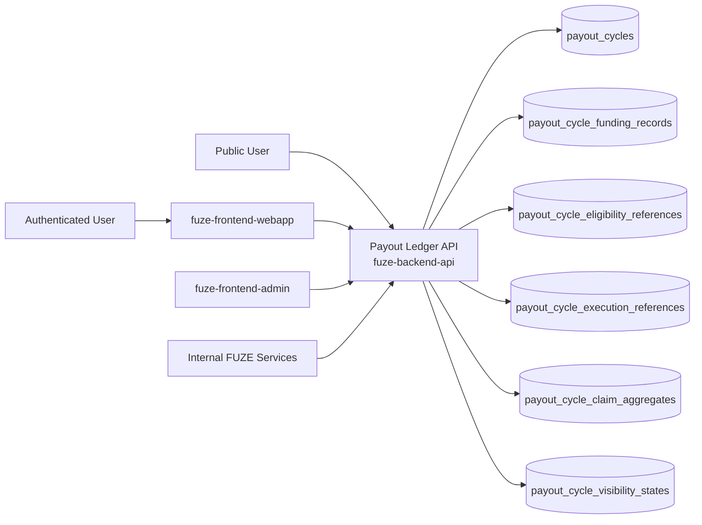
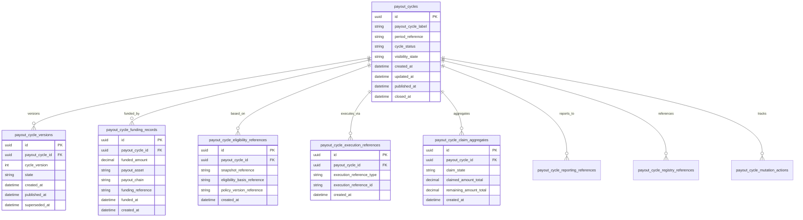
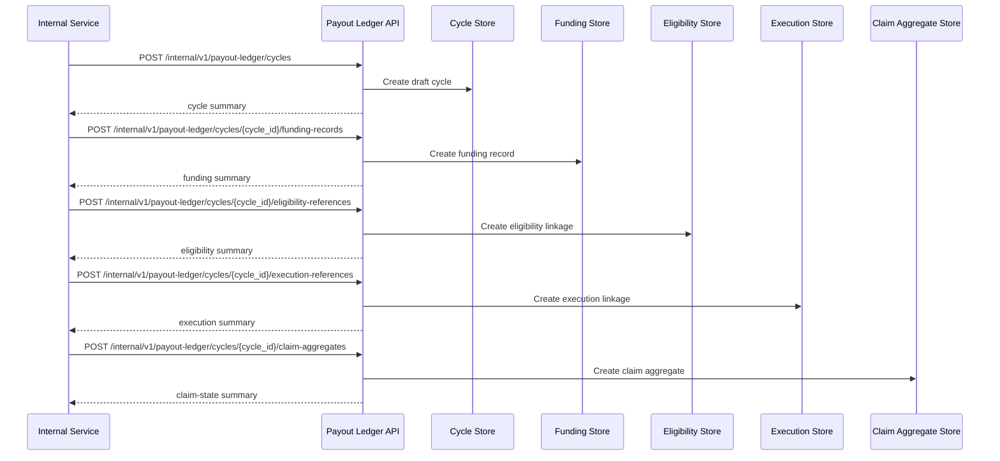

# PAYOUT_LEDGER_API_SPEC

## 1. Title

**PAYOUT_LEDGER_API_SPEC.md**

---

## 2. Document Metadata

- **Document Name:** PAYOUT_LEDGER_API_SPEC.md
- **API Classification:** internal, admin, public-read, event-driven, chain-adjacent
- **Owning Domain:** Payout Ledger Domain
- **Primary Implementing Repo:** `fuze-backend-api`
- **Primary Chain-Adjacent Dependency:** `fuze-contracts` and approved Base payout execution state references
- **Primary System of Record:** payout cycles, payout cycle versions, funding records, claim-state aggregates, execution references, reporting references, correction lineage, and visibility-safe payout-ledger records in `fuze-backend-api`
- **Status:** Draft for canonical source-of-truth approval
- **Purpose:** Define the production-grade API contract architecture for FUZE payout-ledger cycle recording, funding and claim-state linkage, public and first-party-safe payout cycle status disclosure, reconciliation-safe correction behavior, and structured cycle-history trust surfaces across the platform
- **Canonical Folder:** `fuze.ac > docs > api-spec`

---

## 2.1 API Classification Header

- **API Classification:** internal | admin | public-read | event-driven | chain-adjacent
- **Owning Domain:** Payout Ledger Domain
- **Primary Implementing Repo:** `fuze-backend-api`
- **Primary Chain-Adjacent Dependency:** `fuze-contracts`
- **Primary System of Record:** payout cycle ledger and payout-cycle visibility domain

---

## 3. Purpose

This document defines the canonical API specification for FUZE payout ledger operations. It translates the governing FUZE platform architecture, payout ledger rules, Base payout execution rules, snapshot and eligibility rules, profit participation rules, transparency expectations, public registry expectations, audit requirements, and API architecture rules into an implementation-ready API contract.

This API exists because FUZE profit participation is not a single transfer event. It is a multi-stage cycle involving:
- treasury and accounting finalization,
- Ethereum-derived holder eligibility,
- Base-based stablecoin funding,
- cycle-specific claim execution,
- closure and reporting,
- and trust-sensitive public explanation.

Raw contract state alone is not sufficient to explain these cycles. A dedicated payout ledger is therefore required to preserve formal cycle identity, funding records, eligibility basis references, claim-state visibility, correction lineage, and structured linkage to reporting and governance references. The payout ledger must remain distinct from the payout contract, distinct from internal audit records, and distinct from narrative transparency reports, while still linking to all of them.

Accordingly, this specification defines how payout cycles, versions, funding records, execution references, claim-state aggregates, reporting links, corrections, and public-safe visibility are represented, and how payout-ledger behavior remains auditable, idempotent, and architecture-consistent across FUZE.

---

## 4. Scope

This specification covers:

- internal APIs for payout-cycle ledger creation and lifecycle management
- internal APIs for funding records, execution references, claim-state aggregates, and reporting linkage
- internal read APIs for canonical payout-cycle ledger truth
- admin/control-plane APIs for publish, correct, supersede, close, re-open-if-policy-allows, or close discrepancy actions
- public-read APIs for published payout-cycle summaries and detail
- first-party authenticated read APIs for bounded holder-safe cycle status views where policy allows
- event emission requirements for payout-ledger lifecycle changes
- request, response, error, idempotency, versioning, audit, and database-shape rules for this domain

This specification does **not** redefine:

- snapshot and eligibility calculation logic in full detail
- Base payout execution contract ABI or claim-proof detail in full detail
- treasury authorization procedures in full detail
- raw internal audit-log schema in full detail
- full transparency-report publication schema
- wallet registry semantics in full detail
- user-specific raw claim history interfaces in full detail

Those remain governed by their own source-of-truth specifications.

---

## 5. Source-of-Truth Inputs

### Primary FUZE docs and specs used

#### Highest-priority platform and ownership sources
- `SYSTEM_SPEC_INDEX.md`
- `DOCS_SPEC.md`
- `SYSTEM_BOUNDARY_AND_OWNERSHIP_SPEC.md`
- `SYSTEM_OVERVIEW_AND_BOUNDARIES_SPEC.md`
- `PLATFORM_ARCHITECTURE_SPEC.md`
- `DOMAIN_OWNERSHIP_MATRIX_SPEC.md`
- `DATA_MODEL_AND_ENTITY_OWNERSHIP_SPEC.md`
- `ONCHAIN_OFFCHAIN_RESPONSIBILITY_SPEC.md`

#### Primary payout / snapshot / execution / trust sources
- `PAYOUT_LEDGER_SPEC.md`
- `PROFIT_PARTICIPATION_SYSTEM_SPEC.md`
- `BASE_PAYOUT_EXECUTION_LAYER_SPEC.md`
- `SNAPSHOT_AND_ELIGIBILITY_PIPELINE_SPEC.md`
- `TRANSPARENCY_REPORTING_SPEC.md`
- `TRANSPARENCY_MODEL_SPEC.md`
- `PUBLIC_CONTRACT_AND_WALLET_REGISTRY_SPEC.md`
- `CHAIN_ARCHITECTURE_SPEC.md`

#### Core docs inputs
- `FUZE_CHAIN_ARCHITECTURE.md`
- `STABLECOIN_PROFIT_PARTICIPATION.md`
- `TOKEN_CONTRACT_ARCHITECTURE_.md`
- `ALLOCATION_WALLET_MAP.md`

#### API and runtime sources
- `API_ARCHITECTURE_SPEC.md`
- `PUBLIC_API_SPEC.md`
- `INTERNAL_SERVICE_API_SPEC.md`
- `EVENT_MODEL_AND_WEBHOOK_SPEC.md`
- `IDEMPOTENCY_AND_VERSIONING_SPEC.md`
- `MIGRATION_AND_BACKWARD_COMPATIBILITY_SPEC.md`
- `AUDIT_LOG_AND_ACTIVITY_SPEC.md`

#### Security and operations sources
- `SECURITY_AND_RISK_CONTROL_SPEC.md`
- `MONITORING_ALERTING_AND_INCIDENT_RESPONSE_SPEC.md`
- `SECRETS_CONFIG_AND_ENVIRONMENT_SPEC.md`

#### Format guides
- `The_API_Specification_guide.md`
- `Database_Schemas_Guide.md`

### Highest-priority interpretation applied

For this file, the most important governing interpretation is:

1. the payout ledger is the structured cycle-level trust record for profit participation
2. backend owns canonical payout-ledger cycle truth and visibility state
3. the payout ledger must remain distinct from the Base payout contract, from raw audit logs, and from transparency reports
4. each payout cycle must link cycle identity, funding, eligibility basis, claim state, and reporting references without collapsing those domains together
5. corrections and supersession must preserve historical integrity rather than silently rewriting payout history
6. public visibility should expose cycle-level intelligibility without leaking internal-only operational detail

### Supporting external standards used only as guidance

- HTTP semantics for public-read, first-party-read, and controlled mutation APIs
- structured problem-details error design
- general cycle-ledger, correction-lineage, and reconciliation-record patterns as supporting guidance

External guidance does not override FUZE source-of-truth documents.

---

## 6. Governing Architecture and Ownership Interpretation

This API belongs to the **Payout Ledger Domain** because it owns the formal cycle-record layer that connects:

- snapshot/eligibility basis,
- treasury/funding authorization references,
- Base payout execution references,
- claim-open/claim-close lifecycle posture,
- reporting references,
- and correction lineage.

This API is implemented primarily in `fuze-backend-api` because:

- backend owns durable payout-ledger truth
- cycle-level visibility, correction, and publication controls must be centralized
- multiple adjacent systems must remain linked without one subsuming the others
- public trust requires structured off-chain records even when execution happens on-chain
- audit generation and discrepancy handling must be backend-governed

This API is **not** owned by:

- `fuze-frontend-webapp`, because frontend only reads public or bounded first-party-safe ledger status
- `fuze-frontend-admin`, because admin may publish or correct but must not own ledger truth
- `fuze-contracts`, because Base payout contracts own on-chain execution state, not the full cross-domain explanation layer
- snapshot and eligibility domain, because it supplies the entitlement basis but is not the payout ledger itself
- transparency reporting domain, because reports explain cycles narratively but do not own the structured cycle record
- audit domain, because audit records preserve richer operational lineage but the payout ledger is the bounded cycle-trust surface

### Architectural implications

- every profit-participation cycle must be represented as a formal payout-ledger cycle
- each cycle must have stable identity independent of announcements or transient UI pages
- funding, claims-open, claims-close, and closure states must be explicit
- reporting and registry references must be linkable from the cycle record
- corrections and supersession must append or supersede transparently rather than erase prior public understanding
- the payout ledger should preserve cycle-level intelligibility rather than raw per-user operational overload

---

## 7. Domain Responsibilities

The Payout Ledger API domain is responsible for:

1. maintaining canonical payout-cycle records
2. maintaining payout-cycle version and correction lineage
3. recording funding references and aggregate claim-state summaries
4. linking eligibility basis, payout execution, reporting, and governance references
5. exposing public-safe and trusted internal payout-cycle status
6. supporting admin publish, correct, supersede, close, and discrepancy resolution workflows
7. emitting payout-ledger lifecycle events
8. generating audit lineage for sensitive payout-ledger actions
9. preserving separation between execution truth, eligibility truth, reporting truth, and ledger truth
10. supporting reconciliation of cycle-level states across domains

The domain is not responsible for:

- executing Base payout claims
- defining eligibility policy calculations
- owning treasury authorization policy
- replacing internal audit systems
- replacing transparency reports
- replacing user-specific claim history tooling

---

## 8. Out of Scope

The following are out of scope for this API specification:

- payout contract proof verification mechanics
- user-specific raw claim explorer UX
- multisig signing flows
- private governance decision logs
- raw accounting export formats
- final transparency report layout
- external block explorer integration specifics
- contract ABI documentation

Where later detailed specs are needed, they must remain compatible with this API.

---

## 9. Canonical Entities and Data Ownership

### Durable entities

#### 9.1 payout_cycles
- **Owner:** Payout Ledger Domain
- **Purpose:** canonical cycle records for stablecoin profit-participation payouts
- **Nature:** source-of-truth durable entity

#### 9.2 payout_cycle_versions
- **Owner:** Payout Ledger Domain
- **Purpose:** immutable version lineage for payout-cycle records
- **Nature:** source-of-truth durable entity

#### 9.3 payout_cycle_funding_records
- **Owner:** Payout Ledger Domain
- **Purpose:** linkage of cycle identity to funded amount, payout asset, payout chain, and funding timestamp/state
- **Nature:** source-of-truth durable lineage entity

#### 9.4 payout_cycle_eligibility_references
- **Owner:** Payout Ledger Domain
- **Purpose:** explicit structural references to snapshot and eligibility basis
- **Nature:** source-of-truth durable lineage entity

#### 9.5 payout_cycle_execution_references
- **Owner:** Payout Ledger Domain
- **Purpose:** explicit linkage to Base payout execution contract state and downstream execution references
- **Nature:** durable execution-lineage entity

#### 9.6 payout_cycle_claim_aggregates
- **Owner:** Payout Ledger Domain
- **Purpose:** cycle-level aggregate claim status and claim progress summaries
- **Nature:** source-of-truth durable aggregate entity

#### 9.7 payout_cycle_reporting_references
- **Owner:** Payout Ledger Domain
- **Purpose:** structured references to transparency reports and other approved reporting surfaces
- **Nature:** durable reporting-lineage entity

#### 9.8 payout_cycle_registry_references
- **Owner:** Payout Ledger Domain
- **Purpose:** links to public contract and wallet registry entries relevant to the cycle
- **Nature:** durable registry-lineage entity

#### 9.9 payout_cycle_visibility_states
- **Owner:** Payout Ledger Domain
- **Purpose:** publication and visibility state for payout-ledger records
- **Nature:** source-of-truth durable entity

#### 9.10 payout_cycle_supersession_links
- **Owner:** Payout Ledger Domain
- **Purpose:** old-to-new lineage for corrected or superseded payout cycles
- **Nature:** durable lineage entity

#### 9.11 payout_cycle_discrepancy_cases
- **Owner:** Payout Ledger Domain
- **Purpose:** review and remediation records for failed, stale, inconsistent, or mispublished payout-cycle state
- **Nature:** durable review/remediation entity

#### 9.12 payout_cycle_mutation_actions
- **Owner:** Payout Ledger Domain
- **Purpose:** high-level action records for create, publish, correct, supersede, close, reopen_if_policy_allows, and resolve discrepancy
- **Nature:** durable action records with audit linkage

#### 9.13 payout_cycle_audit_events
- **Owner:** Audit / Activity domain, sourced by Payout Ledger Domain
- **Purpose:** immutable trail for sensitive payout-ledger actions
- **Nature:** durable audit records

### Derived or cached entities

#### 9.14 payout_cycle_public_views
- **Owner:** derived read-model layer
- **Purpose:** public-safe cycle summaries and detail representations
- **Nature:** derived

#### 9.15 payout_cycle_first_party_views
- **Owner:** derived read-model layer
- **Purpose:** first-party holder-safe cycle status views
- **Nature:** derived

#### 9.16 payout_cycle_discrepancy_views
- **Owner:** derived ops read-model layer
- **Purpose:** visibility into failed, mislinked, stale, or inconsistent payout-cycle conditions
- **Nature:** derived

---

## 10. State Model and Lifecycle

### 10.1 payout cycle lifecycle

Possible states:

- `draft`
- `initialized`
- `funded`
- `claims_open`
- `partially_claimed`
- `claims_closed`
- `closed`
- `corrected`
- `superseded`
- `cancelled_before_launch`

### 10.2 payout cycle version lifecycle

Possible states:

- `draft`
- `published`
- `superseded`
- `archived`

### 10.3 visibility lifecycle

Possible states:

- `internal_only`
- `published_public`
- `published_first_party`
- `restricted`
- `archived`

### 10.4 discrepancy lifecycle

Possible states:

- `opened`
- `under_review`
- `resolved`
- `failed`
- `closed`

Lifecycle notes:
- the payout ledger models cycles as lifecycle objects rather than one-time funding events
- claim-open and claim-close states must remain explicit
- corrections and supersession must preserve stable identifiers and version lineage
- public visibility may lag internal initialization according to policy

---

## 11. API Surface Overview

The API surface is divided into four families:

### 11.1 Public-read APIs
Used by public users, holders, and community observers for:
- listing public-safe payout cycles
- retrieving public-safe cycle detail
- reading funded/open/closed/corrected/superseded cycle status
- reading public-safe reporting and contract references

### 11.2 First-party authenticated read APIs
Used by `fuze-frontend-webapp` and approved first-party clients for:
- reading bounded cycle status relevant to the actor where policy allows
- reading first-party-safe cycle detail and status summaries
- reading bounded claim-state posture without exposing internal-only metadata

### 11.3 Internal service APIs
Used by trusted internal services for:
- creating payout cycles
- recording funding, eligibility, execution, reporting, and registry references
- updating claim-state aggregates
- reading canonical payout-ledger truth

### 11.4 Admin / control-plane APIs
Used by `fuze-frontend-admin` through backend-only privileged routes for:
- publish, correct, supersede, close, reopen_if_policy_allows, and discrepancy actions
- status repair and reconciliation workflows

---

## 12. Authentication and Authorization Model

### 12.1 Authentication posture by route family

#### Public-read routes
No authentication required:
- list public-safe payout cycles
- read public-safe cycle detail and status

#### Authenticated read routes
Require valid authenticated session:
- read bounded first-party-safe cycle status
- read claim-safe summary views for allowed actors

#### Internal service routes
Require internal service identity with explicit least privilege:
- create cycles
- bind references
- update cycle state and aggregates
- read canonical truth

#### Admin routes
Require privileged operator identity plus reason-coded actions:
- publish, correct, supersede, close, reopen_if_policy_allows
- resolve discrepancies
- repair state or linkage under controlled policy

### 12.2 Authorization checkpoints

Authorization must evaluate:
- caller identity and route family
- whether target cycle is public-safe, first-party-safe, or privileged internal state
- actor entitlement for first-party-safe views
- whether internal service has write privilege for lifecycle mutations
- whether admin/operator role is present for correction or publication actions
- whether current state allows requested mutation

### 12.3 Sensitive action rules

The following require heightened checks:
- cycle publication
- correction or supersession of visible cycles
- manual claim-state aggregate changes
- linkage changes to eligibility or funding references after publication
- discrepancy-resolution actions

---

## 13. API Endpoints / Interface Contracts

## 13.1 Public-Read APIs

### 13.1.1 `GET /v1/payout-ledger/cycles`
**Purpose:** list published public-safe payout cycles  
**Caller Type:** public  
**Auth Expectation:** none  
**Query Parameters Summary:**
- optional `cycle_status`
- optional `year`
- pagination
**Response Summary:**
- cycle summaries
- funded amount summary where public-safe
- payout asset and chain summary
- claims-open/closed posture
- correction or supersession status
- timestamps
**Side Effects:** none
**Audit Requirements:** access logging optional
**Emitted Events:** none required

### 13.1.2 `GET /v1/payout-ledger/cycles/{payout_cycle_id}`
**Purpose:** retrieve one public-safe payout-cycle detail  
**Caller Type:** public  
**Response Summary:**
- cycle detail
- funding reference summary
- eligibility basis summary
- claim-state aggregate summary
- reporting and registry references where public-safe
- correction or supersession guidance where relevant
**Side Effects:** none

## 13.2 First-Party Authenticated Read APIs

### 13.2.1 `GET /v1/payout-ledger/me/cycles`
**Purpose:** retrieve bounded first-party-safe payout-cycle summaries for current actor where policy allows  
**Caller Type:** authenticated user  
**Auth Expectation:** valid authenticated session  
**Query Parameters Summary:**
- optional `cycle_status`
- pagination
**Response Summary:**
- bounded cycle summaries
- first-party-safe claim status summaries
- guidance for related first-party payout surfaces if applicable
**Side Effects:** none

### 13.2.2 `GET /v1/payout-ledger/me/cycles/{payout_cycle_id}`
**Purpose:** retrieve one bounded first-party-safe payout-cycle detail  
**Caller Type:** authenticated user with authorized visibility  
**Response Summary:**
- bounded cycle status
- claim-safe summary
- related reporting and eligibility-safe references where policy allows
**Side Effects:** none

## 13.3 Internal Service APIs

### 13.3.1 `POST /internal/v1/payout-ledger/cycles`
**Purpose:** create draft payout-cycle ledger record  
**Caller Type:** internal trusted service  
**Auth Expectation:** service-to-service identity only  
**Request Body Summary:**
- `payout_cycle_label`
- `period_reference`
- optional `policy_version_reference`
- optional `notes_summary`
- `idempotency_key`
**Response Summary:** payout-cycle summary
**Side Effects:** creates draft payout-cycle record and initial version lineage
**Idempotency Behavior:** required
**Audit Requirements:** sensitive cycle-creation audit
**Emitted Events:** `payout_ledger.cycle_created`

### 13.3.2 `POST /internal/v1/payout-ledger/cycles/{payout_cycle_id}/funding-records`
**Purpose:** attach funding record to one cycle  
**Caller Type:** internal trusted service  
**Request Body Summary:**
- `funded_amount`
- `payout_asset`
- `payout_chain`
- `funding_reference`
- `funded_at`
- `idempotency_key`
**Response Summary:** funding-record summary and updated cycle state
**Side Effects:** creates funding linkage and may move cycle to funded state
**Idempotency Behavior:** required
**Audit Requirements:** funding-record audit
**Emitted Events:** `payout_ledger.funding_recorded`

### 13.3.3 `POST /internal/v1/payout-ledger/cycles/{payout_cycle_id}/eligibility-references`
**Purpose:** attach structural eligibility basis reference to one cycle  
**Caller Type:** internal trusted service  
**Request Body Summary:**
- `snapshot_reference`
- `eligibility_basis_reference`
- `policy_version_reference`
- `idempotency_key`
**Response Summary:** eligibility-reference summary
**Side Effects:** creates eligibility-basis linkage
**Idempotency Behavior:** required
**Audit Requirements:** eligibility-link audit
**Emitted Events:** `payout_ledger.eligibility_linked`

### 13.3.4 `POST /internal/v1/payout-ledger/cycles/{payout_cycle_id}/execution-references`
**Purpose:** attach Base payout execution reference to one cycle  
**Caller Type:** internal trusted service  
**Request Body Summary:**
- `execution_reference_type`
- `execution_reference_id`
- optional `execution_summary`
- `idempotency_key`
**Response Summary:** execution-reference summary and updated cycle state
**Side Effects:** creates execution linkage and may advance cycle state
**Idempotency Behavior:** required
**Audit Requirements:** execution-link audit
**Emitted Events:** `payout_ledger.execution_linked`

### 13.3.5 `POST /internal/v1/payout-ledger/cycles/{payout_cycle_id}/claim-aggregates`
**Purpose:** record or refresh cycle-level claim-state aggregate  
**Caller Type:** internal trusted service  
**Request Body Summary:**
- `claim_state`
- `claimed_amount_total`
- `remaining_amount_total`
- optional `claim_progress_summary`
- `idempotency_key`
**Response Summary:** claim-aggregate summary and updated cycle state
**Side Effects:** creates or supersedes aggregate claim-state view
**Idempotency Behavior:** required
**Audit Requirements:** claim-aggregate audit
**Emitted Events:** `payout_ledger.claim_aggregate_updated`

### 13.3.6 `POST /internal/v1/payout-ledger/cycles/{payout_cycle_id}/reporting-references`
**Purpose:** attach reporting and registry references to one payout cycle  
**Caller Type:** internal trusted service  
**Request Body Summary:**
- optional `reporting_reference_ids[]`
- optional `registry_reference_ids[]`
- `idempotency_key`
**Response Summary:** reference-link summary
**Side Effects:** creates reporting and/or registry linkage
**Idempotency Behavior:** required
**Audit Requirements:** reporting-link audit where sensitivity requires
**Emitted Events:** `payout_ledger.references_linked`

### 13.3.7 `GET /internal/v1/payout-ledger/cycles/{payout_cycle_id}`
**Purpose:** retrieve canonical payout-cycle ledger truth  
**Caller Type:** internal trusted service  
**Response Summary:** full cycle, versions, funding, eligibility, execution, claim aggregate, reporting, registry, and discrepancy lineage
**Side Effects:** none

## 13.4 Admin / Control-Plane APIs

### 13.4.1 `POST /admin/v1/payout-ledger/cycles/{payout_cycle_id}/publish`
**Purpose:** publish payout-cycle ledger record to public-safe or first-party-safe visibility state  
**Caller Type:** admin/operator  
**Request Body Summary:**
- `visibility_target`
- `reason_code`
- `operator_note`
- `idempotency_key`
**Response Summary:** published cycle summary
**Side Effects:** visibility state changes to published_public or published_first_party
**Audit Requirements:** critical audit
**Emitted Events:** `payout_ledger.cycle_published`

### 13.4.2 `POST /admin/v1/payout-ledger/cycles/{payout_cycle_id}/correct`
**Purpose:** apply correction-safe metadata or summary correction to one payout cycle  
**Caller Type:** admin/operator  
**Request Body Summary:**
- `correction_type`
- `correction_summary`
- `reason_code`
- `operator_note`
- `idempotency_key`
**Response Summary:** correction summary
**Side Effects:** creates corrected or superseding version lineage
**Audit Requirements:** critical audit
**Emitted Events:** `payout_ledger.cycle_corrected`

### 13.4.3 `POST /admin/v1/payout-ledger/cycles/{payout_cycle_id}/supersede`
**Purpose:** supersede one payout-cycle record with another corrected or replacement cycle record  
**Caller Type:** admin/operator  
**Request Body Summary:**
- `replacement_payout_cycle_id`
- `reason_code`
- `operator_note`
- `idempotency_key`
**Response Summary:** supersession summary
**Side Effects:** creates old-to-new supersession linkage and updates current visibility preference
**Audit Requirements:** critical audit
**Emitted Events:** `payout_ledger.cycle_superseded`

### 13.4.4 `POST /admin/v1/payout-ledger/cycles/{payout_cycle_id}/close`
**Purpose:** close payout-cycle ledger record under controlled policy  
**Caller Type:** admin/operator  
**Request Body Summary:**
- `closure_reason_code`
- `operator_note`
- `idempotency_key`
**Response Summary:** closed cycle summary
**Side Effects:** cycle moves to claims_closed or closed state according to allowed lifecycle
**Audit Requirements:** critical audit
**Emitted Events:** `payout_ledger.cycle_closed`

### 13.4.5 `POST /admin/v1/payout-ledger/discrepancies`
**Purpose:** resolve payout-ledger discrepancy under controlled policy  
**Caller Type:** admin/operator  
**Request Body Summary:**
- `target_reference_type`
- `target_reference_id`
- `resolution_code`
- `operator_note`
- `related_case_id`
- `idempotency_key`
**Response Summary:** discrepancy-resolution summary
**Side Effects:** may correct, supersede, republish, restrict, or close discrepancy posture with preserved lineage
**Audit Requirements:** critical audit
**Emitted Events:** `payout_ledger.discrepancy_resolved`

---

## 14. Request Rules

### 14.1 General request rules
- all mutation-capable routes must require JSON requests with explicit content type
- all mutation routes must carry correlation IDs
- sensitive payout-ledger mutations must carry idempotency keys
- admin mutations must require reason codes and operator notes
- no route may accept frontend-authored payout-cycle truth as authoritative input

### 14.2 Sensitive-action request requirements
The following requests require heightened validation:
- publication of payout cycles
- correction or supersession of visible cycles
- funding or eligibility linkage changes after publication
- manual claim-aggregate updates
- discrepancy-resolution actions

Heightened validation may include:
- cycle-state checks
- funding-reference and eligibility-basis integrity checks
- execution-reference consistency checks
- visibility-class checks
- operator role confirmation
- governance/finance/security case linkage for sensitive actions

### 14.3 Scope integrity rule
Payout-ledger mutations must target valid and authorized cycles, versions, references, and discrepancy records. Services and operators must not mutate unrelated or unauthorized payout-ledger state.

### 14.4 Layer-separation rule
The payout ledger must remain the cycle-level record layer and must not collapse:
- payout contract execution truth,
- eligibility basis construction,
- raw audit detail,
- or transparency reporting
into one ambiguous state object.

---

## 15. Response Rules

### 15.1 Success response rules
Successful responses must include:
- stable resource identifiers
- timestamps for created/updated state
- state/status values
- cycle, funding, or claim summaries where relevant
- visibility and correction/supersession summaries where relevant
- correlation references for mutations

### 15.2 Async-accepted response rules
If claim-aggregate refresh, publication propagation, or discrepancy remediation is async, the response must:
- return accepted status
- include action or job ID
- provide follow-up status semantics

### 15.3 Terminal mutation response rules
Terminal mutation responses must clearly show:
- target cycle or discrepancy
- mutation type
- resulting cycle/version/visibility state
- correction, supersession, closure, or publication effects where relevant
- whether public or first-party views may refresh asynchronously

### 15.4 Read response rules
Read responses must distinguish:
- canonical internal cycle truth
- public-safe cycle detail
- first-party-safe cycle detail
- execution reference versus actual user-specific claim settlement data

---

## 16. Error Model

The API uses structured problem-details style error responses.

### 16.1 Required error fields
- `type`
- `title`
- `status`
- `code`
- `detail`
- `instance`
- `correlation_id`

### 16.2 Common error codes

#### Authorization / permission errors
- `PAYOUT_LEDGER_PERMISSION_DENIED`
- `PAYOUT_LEDGER_OPERATOR_PERMISSION_DENIED`
- `PAYOUT_LEDGER_SERVICE_PERMISSION_DENIED`
- `PAYOUT_LEDGER_AUDIENCE_PERMISSION_DENIED`

#### State conflict errors
- `PAYOUT_LEDGER_CYCLE_STATE_INVALID`
- `PAYOUT_LEDGER_VERSION_STATE_INVALID`
- `PAYOUT_LEDGER_VISIBILITY_STATE_INVALID`
- `PAYOUT_LEDGER_SUPERSESSION_CONFLICT`
- `PAYOUT_LEDGER_CLOSE_CONFLICT`

#### Policy / safety errors
- `PAYOUT_LEDGER_FUNDING_REFERENCE_REQUIRED`
- `PAYOUT_LEDGER_ELIGIBILITY_REFERENCE_REQUIRED`
- `PAYOUT_LEDGER_PUBLICATION_FORBIDDEN`
- `PAYOUT_LEDGER_CORRECTION_NOT_ALLOWED`
- `PAYOUT_LEDGER_PRIVATE_METADATA_FORBIDDEN`

#### Request integrity errors
- `PAYOUT_LEDGER_IDEMPOTENCY_KEY_REQUIRED`
- `PAYOUT_LEDGER_REQUEST_INVALID`
- `PAYOUT_LEDGER_REQUEST_UNPROCESSABLE`

#### Dependency or provider errors
- `PAYOUT_LEDGER_EXECUTION_UNAVAILABLE`
- `PAYOUT_LEDGER_STORAGE_UNAVAILABLE`
- `PAYOUT_LEDGER_RECONCILIATION_UNAVAILABLE`

### 16.3 Error handling rules
- do not expose hidden internal treasury/security detail in public or low-privilege responses
- do not imply complete economic explanation from raw funding or raw contract linkage alone
- distinguish no public cycle from forbidden first-party audience access
- distinguish missing reference requirements from generic invalid state
- include retry guidance only where safe

---

## 17. Idempotency and Mutation Safety

### 17.1 Required idempotent mutations
The following mutation routes require idempotent behavior:
- cycle creation
- funding-record creation
- eligibility-reference creation
- execution-reference creation
- claim-aggregate refresh
- reporting/reference linking
- publish
- correct
- supersede
- close
- discrepancy resolution

### 17.2 Idempotency key rules
- mutation requests must supply `Idempotency-Key`
- backend stores key scope, request hash, actor, and terminal result
- replay of same semantic request returns original terminal outcome
- replay of same key with different semantic request must fail with conflict

### 17.3 Mutation safety rules
- one canonical visible cycle record per payout cycle identity under current lineage
- funding, eligibility, and execution linkage must remain referentially consistent
- claim-aggregate refresh must supersede prior aggregate state cleanly rather than destructively rewriting history
- corrections must be additive or superseding, not in-place destructive rewrites
- publication and supersession must preserve historical trust lineage

---

## 18. Versioning and Compatibility Rules

### 18.1 Versioning
This API family is versioned under `/v1`, `/internal/v1`, and `/admin/v1` route families.

### 18.2 Compatibility approach
- additive evolution preferred
- no silent semantic change to funded, claims_open, partially_claimed, claims_closed, corrected, or superseded states
- new reporting-reference or execution-reference types may be added without breaking existing contracts
- response fields may be added but existing meanings must remain stable

### 18.3 Breaking-change rules
Breaking changes include:
- changing the meaning of payout-cycle lifecycle states
- changing public versus first-party visibility semantics incompatibly
- removing critical funding, eligibility, or execution reference fields
- changing correction or supersession semantics incompatibly

Such changes require explicit migration planning and version evolution.

### 18.4 Deprecation
Deprecated routes or fields must:
- be documented explicitly
- carry deprecation metadata where supported
- preserve compatibility windows long enough for public, first-party, and internal consumers

---

## 19. Event Emission and Webhook Behavior

This domain is event-capable.

### 19.1 Internal events
The Payout Ledger domain must emit canonical internal events such as:
- `payout_ledger.cycle_created`
- `payout_ledger.funding_recorded`
- `payout_ledger.eligibility_linked`
- `payout_ledger.execution_linked`
- `payout_ledger.claim_aggregate_updated`
- `payout_ledger.references_linked`
- `payout_ledger.cycle_published`
- `payout_ledger.cycle_corrected`
- `payout_ledger.cycle_superseded`
- `payout_ledger.cycle_closed`
- `payout_ledger.discrepancy_resolved`

### 19.2 Event payload minimums
Each event should contain:
- event ID
- event type
- occurred_at
- payout cycle ID
- funding or execution reference where relevant
- actor type
- correlation ID
- reason code where applicable

### 19.3 External webhook posture
This specification does not expose general third-party outbound payout-ledger webhooks by default. Any future outbound cycle-status webhook surface must be narrow, security-reviewed, and governed by a separate contract.

---

## 20. Audit and Activity Requirements

The following actions must generate durable audit events:

- cycle creation
- funding and eligibility linkage
- publication
- correction and supersession
- claim-aggregate correction or refresh for sensitive cycles
- closure and discrepancy-resolution actions
- other sensitive payout-ledger mutations

### Required audit fields
- audit event ID
- actor type and actor reference
- target cycle / version / funding / execution / discrepancy reference as applicable
- action type
- before/after summary where applicable
- reason code
- correlation ID
- operator note if operator action
- occurred_at

Public-facing activity may show selected cycle publication events through other bounded surfaces, but canonical internal audit truth remains durable and immutable.

---

## 21. Data Model and Database Schema View

### 21.1 `payout_cycles`
- `id` PK
- `payout_cycle_label`
- `period_reference`
- `cycle_status`
- `policy_version_reference` nullable
- `visibility_state`
- `created_at`
- `updated_at`
- `published_at` nullable
- `closed_at` nullable

**Constraints:**
- unique `payout_cycle_label`
- index on `cycle_status`
- index on `visibility_state`

### 21.2 `payout_cycle_versions`
- `id` PK
- `payout_cycle_id` FK -> `payout_cycles.id`
- `cycle_version`
- `state`
- `created_at`
- `published_at` nullable
- `superseded_at` nullable

**Constraints:**
- unique (`payout_cycle_id`, `cycle_version`)
- index on `state`

### 21.3 `payout_cycle_funding_records`
- `id` PK
- `payout_cycle_id` FK -> `payout_cycles.id`
- `funded_amount`
- `payout_asset`
- `payout_chain`
- `funding_reference`
- `funded_at`
- `created_at`

**Constraints:**
- index on `payout_cycle_id`

### 21.4 `payout_cycle_eligibility_references`
- `id` PK
- `payout_cycle_id` FK -> `payout_cycles.id`
- `snapshot_reference`
- `eligibility_basis_reference`
- `policy_version_reference`
- `created_at`

**Constraints:**
- index on `payout_cycle_id`

### 21.5 `payout_cycle_execution_references`
- `id` PK
- `payout_cycle_id` FK -> `payout_cycles.id`
- `execution_reference_type`
- `execution_reference_id`
- `execution_summary_json`
- `created_at`

**Constraints:**
- index on `payout_cycle_id`
- index on (`execution_reference_type`, `execution_reference_id`)

### 21.6 `payout_cycle_claim_aggregates`
- `id` PK
- `payout_cycle_id` FK -> `payout_cycles.id`
- `claim_state`
- `claimed_amount_total`
- `remaining_amount_total`
- `claim_progress_summary_json`
- `created_at`

**Constraints:**
- index on `payout_cycle_id`

### 21.7 `payout_cycle_reporting_references`
- `id` PK
- `payout_cycle_id` FK -> `payout_cycles.id`
- `reporting_reference_id`
- `created_at`

**Constraints:**
- index on `payout_cycle_id`

### 21.8 `payout_cycle_registry_references`
- `id` PK
- `payout_cycle_id` FK -> `payout_cycles.id`
- `registry_reference_id`
- `created_at`

**Constraints:**
- index on `payout_cycle_id`

### 21.9 `payout_cycle_visibility_states`
- `id` PK
- `payout_cycle_id` FK -> `payout_cycles.id`
- `state`
- `reason_code` nullable
- `created_at`
- `updated_at`

**Constraints:**
- index on `payout_cycle_id`
- index on `state`

### 21.10 `payout_cycle_supersession_links`
- `id` PK
- `from_payout_cycle_id` FK -> `payout_cycles.id`
- `to_payout_cycle_id` FK -> `payout_cycles.id`
- `reason_code`
- `created_at`

**Constraints:**
- unique (`from_payout_cycle_id`, `to_payout_cycle_id`)
- index on `from_payout_cycle_id`
- index on `to_payout_cycle_id`

### 21.11 `payout_cycle_discrepancy_cases`
- `id` PK
- `target_reference_type`
- `target_reference_id`
- `state`
- `resolution_code` nullable
- `created_at`
- `updated_at`
- `closed_at` nullable

### 21.12 `payout_cycle_mutation_actions`
- `id` PK
- `target_reference_type`
- `target_reference_id`
- `action_type`
- `state`
- `reason_code`
- `operator_note` nullable
- `requested_by_actor_type`
- `requested_by_actor_id`
- `created_at`
- `executed_at` nullable
- `closed_at` nullable
- `correlation_id`

### 21.13 `idempotency_records`
- `id` PK
- `idempotency_key`
- `scope_family`
- `actor_reference`
- `request_hash`
- `response_hash`
- `terminal_status`
- `created_at`
- `expires_at`

### 21.14 `audit_log_entries`
Domain-sourced audit records written into the audit domain.

### Normalization notes
- canonical payout-ledger truth stays in cycles, versions, funding records, eligibility references, execution references, claim aggregates, and correction/discrepancy records
- public and first-party views must derive from canonical cycle truth filtered by disclosure policy
- raw user claim history and deep audit details remain outside the primary cycle record
- reporting and registry links remain explicit rather than embedded as opaque strings

### Reconciliation notes
- one visible cycle should reconcile to one current cycle identity under current lineage
- funding state must reconcile to payout execution contract funding references
- eligibility basis must reconcile to snapshot and eligibility outputs
- claim aggregate state must reconcile to downstream execution summaries
- discrepancy cases must preserve review lineage for failed or conflicting cycle conditions

---

## 22. Architecture Diagram — Mermaid flowchart



---

## 23. Data Design — Mermaid Diagram



---

## 24. Flow View

### 24.1 Happy path — initialize, fund, publish
1. internal service creates draft payout-cycle ledger record
2. funding record is attached after treasury-authorized funding occurs
3. eligibility basis and execution references are attached
4. claim-state aggregate is initialized or refreshed
5. admin publishes the cycle to public-safe or first-party-safe visibility
6. readers can inspect a structured cycle record rather than reconstructing meaning from raw contract activity

### 24.2 Happy path — claim lifecycle updates
1. cycle enters claims_open state
2. claim executions occur on Base payout layer
3. internal service refreshes aggregate claim-state summary
4. payout ledger exposes cycle-level claim progress and closure posture
5. cycle later transitions to claims_closed or closed

### 24.3 Alternate path — corrected or superseded cycle
1. visible cycle later requires correction or replacement
2. corrected cycle version or replacement cycle is created
3. admin supersedes the older cycle
4. older record remains historically visible according to policy with supersession guidance
5. new cycle becomes current trust surface

### 24.4 Failure path — missing linkage or invalid publication
1. publish or visibility change is attempted
2. backend detects missing funding, eligibility, or required execution/reporting linkage according to policy
3. request is rejected
4. no public-visible mutation occurs

### 24.5 Failure and remediation path — stale or inconsistent aggregate state
1. cycle, funding, execution, or claim-state aggregate becomes stale or inconsistent
2. admin opens discrepancy-resolution flow
3. backend preserves existing lineage
4. corrected aggregate or superseding cycle/version is created
5. discrepancy closes with preserved history

### 24.6 Close path
1. claims period ends or cycle reaches closure condition
2. admin or internal system records closed posture
3. public-safe cycle view reflects closure
4. historical lineage remains queryable for trust and reporting purposes

### 24.7 Retry behavior
- duplicate cycle creation returns same canonical cycle result
- duplicate funding or eligibility link returns same lineage result where applicable
- duplicate publish/correct/supersede/close/discrepancy actions return same terminal action result
- duplicate claim-aggregate refresh returns same resulting aggregate state where applicable

---

## 25. Data Flows — Mermaid sequenceDiagram



---

## 26. Security and Risk Controls

1. **Payout-ledger truth is backend-owned**  
   Frontends and informal channels may not authoritatively define payout-cycle truth.

2. **Cycle-level trust record is distinct from contract execution**  
   The API must keep the payout ledger separate from the Base payout contract while preserving explicit linkage.

3. **Structured identity is mandatory**  
   Every payout cycle must have stable identity, lifecycle state, and explicit funding and eligibility references.

4. **Least privilege**  
   Internal write and admin publish/correct/supersede routes must be limited to authorized services and operators.

5. **Immutable lineage for trust-sensitive corrections**  
   Corrections and supersession must preserve historical lineage rather than erase prior public meaning.

6. **Public-private field separation**  
   Public and first-party routes must not expose internal treasury notes, deep audit detail, or unsafe operational metadata.

7. **Problem-details discipline**  
   Error bodies must be structured and safe, without exposing hidden internal-only details.

8. **Audit immutability**  
   Sensitive payout-ledger actions require durable immutable audit lineage.

9. **Replay resistance**  
   Cycle creation, linkage, publication, correction, and discrepancy actions must be idempotent and replay-safe.

10. **Claim-state integrity**  
    Claim-state aggregates must remain bounded cycle-level truth and must not overstate or misrepresent execution settlement.

---

## 27. Operational Considerations

- public and first-party payout-cycle status routes should remain highly available
- funding, execution, and claim-aggregate linkage is correctness-sensitive and must preserve cycle intelligibility
- stale aggregate or broken-linkage anomalies should surface clearly to ops views
- correction and supersession workflows should be observable and retryable
- monitoring should alert on:
  - missing funding references for visible cycles
  - missing eligibility basis for visible cycles
  - stale claim aggregate refreshes
  - unusual correction or supersession volume
  - public-status inconsistency versus canonical state
  - broken reporting or registry references

---

## 28. Acceptance Criteria

1. The API preserves the distinction between payout-ledger cycle truth, Base payout contract execution truth, snapshot/eligibility truth, and transparency-report truth.
2. Only `fuze-backend-api` owns canonical payout-ledger cycle truth.
3. Cycles, versions, funding records, eligibility references, execution references, claim aggregates, and correction/discrepancy records are durable and backend-owned.
4. Public and first-party routes expose only bounded safe cycle status views.
5. Cycle identity, funding, claim state, and reporting linkage are explicit and durable.
6. Corrections, supersession, and closure preserve immutable lineage.
7. Publication, correction, claim-aggregate refresh, and discrepancy actions are idempotent and auditable.
8. Internal and admin payout-ledger routes are least-privilege and backend-only.
9. Admin routes require reason-coded privileged authorization.
10. Event emissions exist for major payout-ledger mutations.
11. Response and error semantics are stable and machine-readable.
12. Database schema separates cycles, versions, funding, eligibility, execution, claims, visibility, and discrepancy layers.
13. Public and first-party consumers can rely on structured cycle records without needing raw contract inspection alone.
14. Discrepancy handling is supported and safely replayable.
15. Mermaid diagrams remain consistent with prose and data model.

---

## 29. Test Cases

### 29.1 Positive cases
1. Internal service creates draft payout-cycle record successfully.
2. Internal service attaches funding record successfully.
3. Internal service attaches eligibility reference successfully.
4. Internal service attaches execution reference successfully.
5. Internal service refreshes claim aggregate successfully.
6. Admin publishes cycle successfully.
7. Admin supersedes corrected cycle successfully.
8. Public actor reads published cycle summary successfully.

### 29.2 Negative cases
9. Public user cannot access internal cycle truth or discrepancy detail.
10. Internal service without write privilege cannot create cycle.
11. Publication without required funding or eligibility linkage returns `PAYOUT_LEDGER_FUNDING_REFERENCE_REQUIRED` or `PAYOUT_LEDGER_ELIGIBILITY_REFERENCE_REQUIRED`.
12. Attempt to publish private metadata returns `PAYOUT_LEDGER_PRIVATE_METADATA_FORBIDDEN`.
13. Attempt to supersede with invalid replacement state returns state conflict.
14. Authenticated actor without authorized visibility cannot read first-party-safe cycle detail.

### 29.3 Authorization cases
15. Ordinary public or authenticated user cannot call admin publish/correct/supersede routes.
16. Internal service without claim-aggregate privilege cannot update claim aggregate.
17. Operator without publication privilege cannot publish cycle.
18. Published payout-ledger cycle does not prove user-specific claim entitlement or completed settlement by itself.

### 29.4 Idempotency and replay cases
19. Repeating cycle creation with same idempotency key returns original draft cycle result.
20. Repeating funding record creation with same idempotency key returns original linkage result.
21. Repeating publish with same idempotency key returns original publish result.
22. Repeating correction or discrepancy resolution with same idempotency key returns original terminal action result.

### 29.5 Concurrency cases
23. Concurrent claim-aggregate refresh attempts preserve one explicit current aggregate lineage and duplicate-safe outcomes where appropriate.
24. Concurrent publish and correction actions preserve explicit lifecycle ordering without hidden overwrite.
25. Concurrent supersede and close actions preserve explicit visible lineage without ambiguity.

### 29.6 Recovery / admin cases
26. Stale claim-state aggregate can be corrected under controlled policy with explicit lineage.
27. Corrected payout cycle remains historically linked to the original record.
28. Discrepancy resolution closes cycle-linkage or visibility conflict with preserved audit history.

### 29.7 Event and audit cases
29. Successful cycle creation emits `payout_ledger.cycle_created`.
30. Successful funding record creation emits `payout_ledger.funding_recorded`.
31. Successful execution linkage emits `payout_ledger.execution_linked`.
32. Successful publication emits `payout_ledger.cycle_published`.
33. Successful discrepancy resolution emits `payout_ledger.discrepancy_resolved` with critical audit lineage.

---

## 30. Open Questions or Explicit Deferred Decisions

1. Exact first-party-safe claim summary depth is deferred.
2. Exact public aggregate claim-progress disclosure policy is deferred.
3. Exact cycle reopening policy after closure is deferred.
4. Exact version-numbering semantics for minor versus major corrections are deferred.
5. Exact reporting-reference taxonomy is deferred.
6. Exact discrepancy taxonomy for payout-ledger linkage conflicts is deferred.

---

## 31. Implementation Notes for `fuze-backend-api`

Recommended backend module layout:

```text
modules/platform/
  payout-ledger/
  payout-execution/
  snapshot-eligibility/
  profit-participation/
  transparency-reporting/
  audit-log/
  control-plane/
  integrations/
```

Implementation guidance:
- keep cycle identity, funding linkage, eligibility linkage, execution linkage, claim-aggregate handling, and correction lineage in one canonical domain service
- perform visibility and linkage-integrity checks inside the commit boundary
- keep publication, correction, supersession, and closure actions explicit and idempotent
- treat admin remediations as domain actions, not ad hoc row edits
- emit events only after canonical state commit succeeds
- publish public and first-party-safe cycle views from canonical truth; do not let derived views mutate payout-ledger state

---

## 32. Frontend Consumption Notes

### For `fuze-frontend-webapp`
- may read public cycle/status views and bounded first-party-safe cycle views where approved
- must not infer full cycle meaning from raw contract balances or isolated claim transactions alone
- must treat backend payout-ledger responses as authoritative for structured cycle status
- should clearly distinguish funded, claims_open, partially_claimed, claims_closed, corrected, and superseded states when visible

### For `fuze-frontend-admin`
- may trigger privileged publish, correct, supersede, close, and discrepancy actions only through backend admin APIs
- must require operator reason input for sensitive mutations
- must not directly mutate canonical payout-ledger truth client-side
- should present immutable cycle history and correction lineage separately from current visible state

---

## 33. Contract Derivation Notes

### OpenAPI / AsyncAPI
This spec should later derive into:
- public cycle-status and first-party-safe read operations
- internal cycle creation, linkage, claim-aggregate, and canonical read operations
- admin publish / correct / supersede / close / discrepancy operations
- shared problem-details schema
- payout-ledger lifecycle events in AsyncAPI

### Future `fuze-sdk`
Future `fuze-sdk` packages may derive:
- public payout-cycle lookup helpers
- first-party-safe cycle-status helpers for approved surfaces
- typed payout-cycle, funding, and claim-status summary models
- problem-error models for payout-ledger outcomes

The SDK must derive from approved API contracts and must not become the source of truth over this narrative specification.
