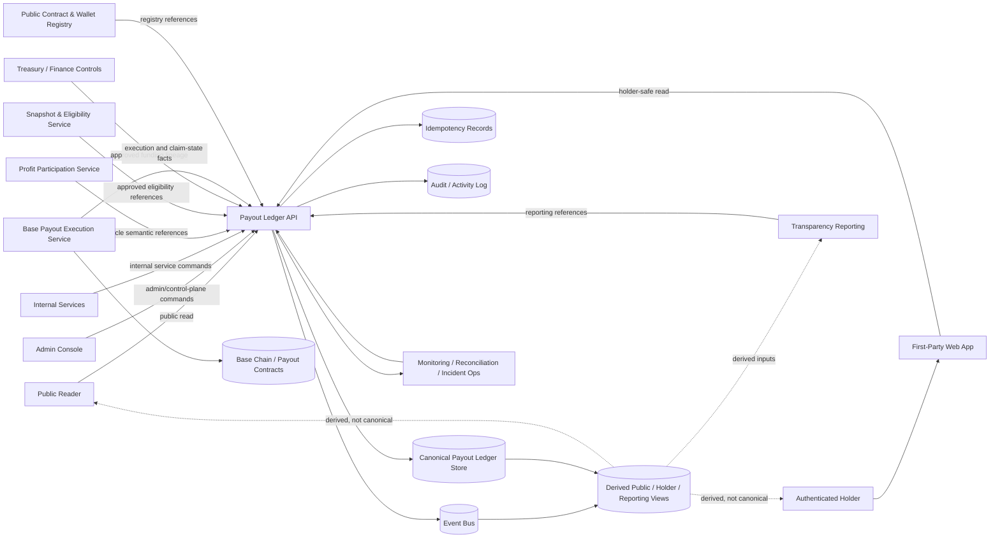
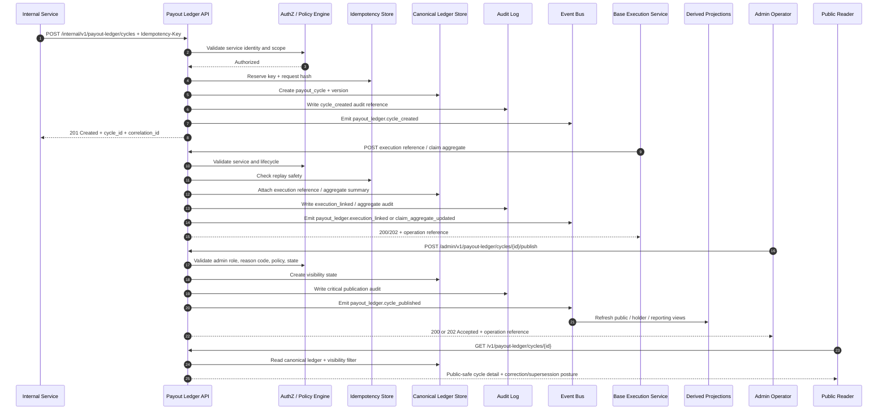

# PAYOUT_LEDGER_API_SPEC.md

## Document Metadata

- **Document Name:** `PAYOUT_LEDGER_API_SPEC.md`
- **Document Type:** FUZE API SPEC v2 — Production-Grade Interface Contract Specification
- **Status:** Draft production-grade API specification
- **Version:** 2.0.0
- **Effective Date:** 2026-04-25
- **Last Updated:** 2026-04-25
- **Reviewed On:** 2026-04-25
- **Document Owner:** FUZE Payout Ledger Domain; named individual owner not explicitly specified in retrieved governing materials
- **Approval Authority:** FUZE API governance / platform architecture approval workflow; explicit named authority not yet specified
- **Review Cadence:** Quarterly and whenever profit-participation policy, snapshot/eligibility lineage, Base payout execution posture, treasury-control posture, transparency/reporting posture, registry posture, correction posture, or implementation-contract posture materially changes
- **Governing Layer:** API contract layer for payout-cycle ledger truth, cycle-history publication, reconciliation, correction, and public-safe payout visibility
- **Parent Registry:** API SPEC v2 Canonical File Registry
- **Upstream Semantic Registry:** `REFINED_SYSTEM_SPEC_INDEX.md`
- **Upstream API Registry:** `API_SPEC_INDEX.md`
- **Primary Audience:** Backend/API engineers, platform architects, contracts engineers, finance/treasury operators, public-trust/reporting authors, frontend and admin-console implementers, security/audit/operations teams, OpenAPI/AsyncAPI/SDK authors, QA and contract-validation reviewers
- **Primary Purpose:** Define the production-grade API contract for creating, linking, publishing, correcting, superseding, reconciling, and exposing FUZE payout-ledger cycle records while preserving refined payout-ledger semantics and adjacent ownership boundaries
- **Primary Upstream References:** `PAYOUT_LEDGER_SPEC.md`, `PROFIT_PARTICIPATION_SYSTEM_SPEC.md`, `SNAPSHOT_AND_ELIGIBILITY_PIPELINE_SPEC.md`, `BASE_PAYOUT_EXECUTION_LAYER_SPEC.md`, `TREASURY_CONTROL_POLICY_SPEC.md`, `TRANSPARENCY_MODEL_SPEC.md`, `TRANSPARENCY_REPORTING_SPEC.md`, `PUBLIC_CONTRACT_AND_WALLET_REGISTRY_SPEC.md`, `CHAIN_ARCHITECTURE_SPEC.md`, `ONCHAIN_OFFCHAIN_RESPONSIBILITY_SPEC.md`, `API_ARCHITECTURE_SPEC.md`, `PUBLIC_API_SPEC.md`, `INTERNAL_SERVICE_API_SPEC.md`, `EVENT_MODEL_AND_WEBHOOK_SPEC.md`, `IDEMPOTENCY_AND_VERSIONING_SPEC.md`, `MIGRATION_AND_BACKWARD_COMPATIBILITY_SPEC.md`, `AUDIT_LOG_AND_ACTIVITY_SPEC.md`, `SECURITY_AND_RISK_CONTROL_SPEC.md`, `MONITORING_ALERTING_AND_INCIDENT_RESPONSE_SPEC.md`, `FUZE_ACCOUNT_ACCESS_AND_SESSION_THESIS_FINAL_SPEC.md`, `FUZE_ACCOUNT_ACCESS_AND_SESSION_CANONICAL_FINAL_SPEC.md`, `FUZE_WORKSPACE_ACCESS_CONTROL_BASICS_THESIS_FINAL_SPEC.md`
- **Primary Downstream Dependents:** Payout-ledger implementation contracts, payout-cycle storage contracts, public payout-status surfaces, holder-safe payout views, admin cycle-control tooling, reconciliation jobs, transparency reporting inputs, public registry-linked views, Base payout execution reconciliation, finance/treasury reconciliation workflows, audit/event pipelines, OpenAPI / AsyncAPI / SDK artifacts
- **API Surface Families Covered:** Public read, first-party authenticated read, internal service, admin/control-plane, event/async, reporting/export, chain-adjacent reference consumption, implementation-facing contract surfaces
- **API Surface Families Excluded:** Raw Base payout contract ABI, raw claim-proof construction, treasury accounting books, full transparency-report composition schema, full public registry schema, private claimant receipt explorer UX, generic audit-log schema, wallet-link/account/session semantics except as dependency constraints
- **Canonical System Owner(s):** Payout Ledger Domain for payout-cycle ledger semantics; adjacent semantic owners remain Profit Participation, Snapshot and Eligibility, Base Payout Execution, Treasury/Accounting, Transparency Reporting, Public Contract and Wallet Registry, Audit, Security/Risk, and Operations domains
- **Canonical API Owner:** FUZE Backend/API Platform under Payout Ledger Domain governance
- **Supersedes:** Earlier v1 `PAYOUT_LEDGER_API_SPEC.md` interpretations that predate API SPEC v2 structure, omit full truth-class taxonomy, omit complete diagram/test/acceptance requirements, or under-specify API surface-family separation
- **Superseded By:** None currently defined
- **Related Decision Records:** Not explicitly specified in retrieved governing materials
- **Canonical Status Note:** Refined system specs own semantic truth. This API spec owns interface-contract expression of payout-ledger truth and MUST NOT redefine refined payout-ledger, profit-participation, eligibility, execution, treasury, reporting, registry, audit, or chain semantics.
- **Implementation Status:** Draft governing API contract; downstream implementation, OpenAPI/AsyncAPI, SDK, service, storage, event, admin-console, and QA artifacts MUST align before production readiness
- **Approval Status:** Pending explicit FUZE approval workflow
- **Change Summary:** Upgraded payout-ledger API material into API SPEC v2 format; normalized public/first-party/internal/admin/event/reporting/chain-adjacent surfaces; strengthened mutation boundaries, idempotency, correction/supersession, reconciliation, visibility, audit, projection, failure-handling, migration, and QA rules.

## Purpose

This specification defines the FUZE Payout Ledger API contract.

The Payout Ledger API is the interface layer for the structured cycle-history record of FUZE profit-participation payout cycles. It allows approved services and operators to create payout-cycle ledger records, attach policy, eligibility, funding, execution, claim-state, reporting, and registry references, publish bounded public or holder-safe views, preserve correction and supersession lineage, and reconcile discrepancies across treasury, eligibility, Base execution, reporting, and registry systems.

The API MUST preserve the refined payout-ledger rule that the ledger is the durable, correction-safe, explainable cycle record. It MUST NOT collapse payout-ledger truth into raw Base contract activity, treasury/accounting books, eligibility datasets, audit logs, transparency reports, public registry entries, user claim history, spreadsheets, dashboards, exports, or UI presentation labels.

## Scope

This API spec governs:

- public-safe payout-cycle listing and detail retrieval
- first-party authenticated holder-safe cycle status retrieval where policy allows
- internal creation and lifecycle management of payout-cycle ledger records
- attachment of policy, snapshot, eligibility, funding, execution, claim-aggregate, reporting, and registry references
- admin/control-plane publication, correction, supersession, closure, restriction, cancellation, and discrepancy-resolution actions
- event emission for payout-ledger lifecycle and reference changes
- accepted-state and async behavior for reconciliation, aggregate refresh, projection, publication, and discrepancy workflows
- request, response, error, result, status, idempotency, retry, replay, authorization, audit, observability, migration, and versioning expectations
- read-model, projection, export, reporting, public-read, and cache constraints for payout-ledger-derived state
- OpenAPI, AsyncAPI, SDK, implementation-contract, storage-contract, and QA derivation guardrails

## Out of Scope

This API spec does not define:

- the semantic business meaning of profit participation cycles beyond referencing `PROFIT_PARTICIPATION_SYSTEM_SPEC.md`
- snapshot block selection, raw holder dataset construction, address classification, eligibility treatment, proof-root construction, or entitlement-input algorithms
- Base payout contract ABI, claim-proof verification, raw claim transaction execution, or execution receipt mechanics
- treasury accounting methodology, distributable-profit calculation, reserves, vault movement authority, or funding approval policy
- public contract/wallet registry publication truth beyond linking to registry references
- full transparency-report schema, narrative report composition, cadence, or publication workflow beyond ledger-reference integration
- wallet-link, account, session, workspace, or product-entitlement semantics beyond access-control constraints
- full audit-log schema, incident runbooks, queue topology, database physical topology, infrastructure layout, or UI rendering detail

## Design Goals

1. Preserve payout-cycle ledger records as durable trust-bearing objects.
2. Make payout-cycle history easier to interpret than raw contract activity alone.
3. Preserve linkage among profit-participation cycle meaning, eligibility basis, treasury funding lineage, Base execution references, claim-state posture, reporting references, registry references, and correction lineage.
4. Keep ledger truth distinct from execution truth, eligibility truth, accounting truth, audit truth, reporting truth, registry truth, projection truth, and presentation truth.
5. Provide narrow mutation contracts rather than generic update shortcuts.
6. Support bounded public transparency without unsafe internal detail leakage.
7. Require strong idempotency, retry safety, correlation, auditability, and observability for trust-sensitive mutations.
8. Preserve correction and supersession lineage rather than silently rewriting published history.
9. Enable OpenAPI / AsyncAPI / SDK derivation without permitting downstream reinterpretation of ownership or lifecycle semantics.
10. Provide concrete acceptance criteria and test cases for production readiness.

## Non-Goals

This API spec is not intended to:

- turn the payout ledger into a treasury ledger
- turn the payout ledger into a Base contract indexer
- allow API consumers to infer eligibility, funding authority, or execution finality from narrative reporting alone
- expose full private claimant-level data through public cycle records
- allow frontend, dashboards, exports, spreadsheets, or reports to become mutation owners
- provide unbounded admin repair shortcuts
- flatten cycle state, funding state, claim state, visibility state, correction state, and presentation labels into one generic status field

## Core Principles

### Principle 1 — Refined Semantics Own Meaning

`PAYOUT_LEDGER_SPEC.md` owns payout-ledger semantics. This API owns how those semantics are exposed, mutated, linked, protected, and validated through interface contracts.

### Principle 2 — Ledger Truth Links Domains Without Absorbing Them

The API MUST link profit-participation, eligibility, treasury, Base execution, reporting, registry, and audit references without allowing the payout-ledger API to redefine those domains.

### Principle 3 — Mutation Boundaries Are Narrow

The API MUST use explicit command surfaces for cycle creation, reference attachment, funding registration, claim-aggregate refresh, publication, correction, supersession, closure, restriction, discrepancy handling, and projection refresh. A generic `PATCH /payout-ledger/cycles/{id}` that can mutate arbitrary ledger truth is non-canonical.

### Principle 4 — Public Transparency Is Structured and Bounded

Public outputs SHOULD make payout cycles intelligible, but MUST be filtered by visibility policy and MUST NOT leak restricted operational, treasury, incident, security, claimant-private, or audit-only detail.

### Principle 5 — Historical Integrity Beats Convenience

Published or trust-sensitive payout history MUST NOT be silently overwritten. Correction, cancellation, restriction, and supersession MUST preserve reason-coded lineage.

### Principle 6 — Reconciliation Is an API Obligation

The API MUST expose and preserve enough stable references to reconcile ledger state with eligibility, treasury, Base execution, reporting, registry, and audit sources. Inconsistent state MUST enter discrepancy posture rather than inferred success.

## Canonical Definitions

- **Payout Ledger:** Canonical off-chain structured cycle-record layer for payout-cycle identity, lifecycle, linkage, visibility posture, correction lineage, and reconciliation references.
- **Payout Cycle Ledger Record:** The API-facing resource representing one formal profit-participation payout cycle in ledger form.
- **Cycle Identifier:** Stable unique identifier for a payout cycle. It MUST remain stable across correction and supersession lineage.
- **Cycle Version:** Immutable or append-only representation of a material version of a payout-cycle record.
- **Ledger State:** Lifecycle state of the ledger record itself, distinct from execution state, claim state, funding state, reporting state, and visibility state.
- **Visibility State:** Audience and publication posture of a ledger record or field family.
- **Funding Reference:** Structured linkage to approved treasury/funding lineage and relevant execution funding reference.
- **Eligibility Basis Reference:** Structured linkage to approved snapshot/eligibility lineage.
- **Execution Reference:** Structured linkage to Base payout execution run, batch, request, receipt, claim-state, or reconciliation reference.
- **Claim-State Summary:** Ledger-visible cycle-level aggregate claim posture derived from execution truth.
- **Reporting Reference:** Link to transparency-reporting or other approved public explanatory artifacts.
- **Registry Reference:** Link to public contract/wallet registry entries relevant to a cycle.
- **Correction:** Reason-coded lineage-preserving change to a ledger record or reference.
- **Supersession:** Relationship that marks one record/version as replaced by another because current meaning cannot safely be represented as a simple correction.
- **Discrepancy:** Explicit state representing unresolved mismatch, missing linkage, stale projection, unsafe publication, execution mismatch, or reconciliation failure.
- **Accepted State:** API acknowledgement that a requested operation has been accepted for asynchronous processing; it is not final business success.

## Truth Class Taxonomy

The API MUST preserve these truth classes:

1. **Semantic truth:** Payout-ledger meaning owned by `PAYOUT_LEDGER_SPEC.md`; cycle semantic meaning owned by `PROFIT_PARTICIPATION_SYSTEM_SPEC.md`.
2. **API contract truth:** Route/resource/request/response/error/idempotency/event/versioning rules defined by this document.
3. **Policy truth:** Eligibility policy, treasury policy, visibility policy, correction policy, and admin-control policy owned by their respective domains.
4. **Runtime truth:** Operation state, async jobs, projection refresh, reconciliation runs, provider/chain observation state, incident posture, and runtime health.
5. **Ledger/storage truth:** Canonical payout-cycle records, versions, references, visibility state, discrepancies, correction/supersession lineage, and idempotency records.
6. **Eligibility truth:** Snapshot, raw holder, treatment, eligible dataset, and entitlement-input truth owned by the snapshot and eligibility domain.
7. **Execution truth:** Base funding, claim-window, claim execution, receipt, settlement-status, and execution discrepancy truth owned by Base payout execution.
8. **Treasury/accounting truth:** Funding authority, distributable-profit finalization, reserve-sensitive context, and finance-book truth owned by treasury/accounting domains.
9. **Audit truth:** Immutable internal action, decision, operator, investigation, and mutation lineage owned by audit/activity systems.
10. **Registry truth:** Official public contract and wallet designation owned by the registry domain.
11. **Transparency/reporting truth:** Public explanatory and recurring report publication truth owned by reporting domains.
12. **Projection/read-model truth:** Public pages, holder views, admin consoles, exports, caches, indexes, and reporting inputs derived from canonical ledger truth.
13. **Presentation truth:** Human-readable status labels, UI copy, charts, summary copy, and public narrative framing.

These truth classes MUST NOT be merged into one generic payout-history object.

## Architectural Position in the Spec Hierarchy

This API spec sits below refined semantic specs and above downstream implementation-contract artifacts. It consumes the refined payout-ledger rule that the ledger owns structured cycle-history meaning while Base execution owns raw chain execution facts, snapshot/eligibility owns eligibility lineage, treasury owns funding authority, transparency reporting owns report publication, registry owns public contract/wallet designation, and audit owns immutable decision/action lineage.

## Upstream Semantic Owners

| Upstream owner | API dependency posture |
| --- | --- |
| Payout Ledger Domain | Owns ledger record identity, lifecycle, versioning, correction, visibility, reconciliation, and publication semantics consumed directly by this API. |
| Profit Participation Domain | Owns payout-cycle semantic meaning and policy-finalized payout-cycle posture. |
| Snapshot and Eligibility Domain | Owns snapshot references, eligible datasets, entitlement inputs, address treatment, and reproducibility. |
| Base Payout Execution Domain | Owns execution-run, funding-state, claim-window, claim execution, receipt, and execution-reconciliation truth. |
| Treasury / Accounting / Control Domains | Own funding authority, distributable-profit posture, reserve treatment, and finance-book truth. |
| Transparency Reporting Domain | Owns explanatory report artifacts and report publication state. |
| Public Contract and Wallet Registry Domain | Owns official public designation of payout-related contracts and wallets. |
| Audit / Activity Domain | Owns immutable audit lineage for sensitive ledger actions. |
| Security / Risk / Operations Domains | Own controls, incident posture, alerting, risk checks, and runtime remediation workflows. |

## API Surface Families

### Public Read Surface

Public routes expose only approved public-safe payout-cycle summaries and details. Public routes MUST NOT expose internal funding controls, operator notes, private claimant detail, internal discrepancy investigations, restricted audit fields, security-sensitive execution routing, or unpublished references.

### First-Party Authenticated Surface

First-party routes expose holder-safe or user-contextual cycle views where policy allows. Authentication MAY identify the actor or wallet-aware context, but the first-party surface MUST NOT compute entitlement or redefine ledger truth.

### Internal Service Surface

Internal routes create records, attach references, refresh aggregate summaries, read canonical cycle truth, trigger reconciliation, and feed projections. Internal service routes MUST enforce service identity, least privilege, idempotency, correlation, and owner-domain authorization.

### Admin / Control-Plane Surface

Admin routes publish, restrict, correct, supersede, close, cancel, reopen-if-policy-allows, mark discrepancies, and resolve discrepancies. These routes MUST be reason-coded, policy-constrained, audited, bounded, and separated from ordinary application APIs.

### Event / Async Surface

The API emits and consumes internal event families for lifecycle, reference, aggregate, publication, correction, supersession, closure, discrepancy, reconciliation, and projection changes. Events MUST be replay-safe and MUST preserve owner-domain boundaries.

### Reporting / Export Surface

Reporting/export outputs MAY expose derived cycle data for transparency reports, finance reconciliation, public data exports, and internal review, but MUST remain subordinate to canonical ledger records and MUST preserve correction/supersession lineage.

### Chain-Adjacent Surface

Chain-adjacent behavior is reference-oriented. The API MAY consume Base execution references, payout contract references, transaction hashes, batch references, and claim-state facts, but MUST NOT own raw contract truth or treat contract observation alone as full cycle-history truth.

## System / API Boundaries

The Payout Ledger API governs:

- payout-cycle ledger resource families
- payout-cycle lifecycle and version resource contracts
- structured reference attachment and validation contracts
- visibility and publication contracts
- correction, supersession, closure, cancellation, restriction, discrepancy, and remediation contracts
- public-safe and holder-safe read contracts
- event contracts and async operation references
- idempotency, audit, correlation, observability, and migration contracts

The Payout Ledger API does not govern:

- eligibility computation
- raw Base payout execution
- treasury-funding approval
- treasury accounting books
- transparency-report publication truth
- public registry publication truth
- account/session/wallet-link/workspace semantics
- low-level contract ABI, proof format, or queue topology

## Adjacent API Boundaries

- `PROFIT_PARTICIPATION_API_SPEC.md` governs cycle semantic intent, allocation generation, payout intent, and cycle-level participation posture. This API records and exposes structured ledger history for approved cycles.
- `SNAPSHOT_AND_ELIGIBILITY_PIPELINE_API_SPEC.md` governs deterministic snapshot, address treatment, eligible dataset, and entitlement-input APIs. This API references approved eligibility artifacts.
- `BASE_PAYOUT_EXECUTION_LAYER_API_SPEC.md` governs execution runs, batch submission, receipts, claim-state facts, and execution reconciliation. This API references execution facts and records ledger-visible claim summaries.
- `TREASURY_CONTROL_POLICY_API_SPEC.md`, `VAULT_ACTION_POLICY_API_SPEC.md`, and `MULTISIG_AND_TIMELOCK_API_SPEC.md` govern funding authority and controlled release posture. This API records approved funding lineage only.
- `TRANSPARENCY_REPORTING_API_SPEC.md` governs recurring public reports. This API provides structured ledger references and public-safe cycle status consumed by reports.
- `PUBLIC_CONTRACT_AND_WALLET_REGISTRY_API_SPEC.md` governs official public designation of contracts and wallets. This API links to registry references but does not define registry publication truth.
- `PUBLIC_PAYOUT_STATUS_API_SPEC.md` MAY provide public-status views derived from this API and Base execution, but MUST NOT become canonical ledger owner.

## Conflict Resolution Rules

1. The active refined semantic registry wins over older API material.
2. Higher-order platform boundary, ownership, data-model, and on-chain/off-chain specs win on constitutional interpretation.
3. `PAYOUT_LEDGER_SPEC.md` wins on ledger record identity, lifecycle, visibility, correction, supersession, reconciliation, and ledger-state semantics.
4. `PROFIT_PARTICIPATION_SYSTEM_SPEC.md` wins on semantic payout-cycle meaning.
5. `SNAPSHOT_AND_ELIGIBILITY_PIPELINE_SPEC.md` wins on eligibility-basis and entitlement-input meaning.
6. `BASE_PAYOUT_EXECUTION_LAYER_SPEC.md` wins on Base execution mechanics, funding observation, claim-window, receipt, and claim-state facts.
7. `TREASURY_CONTROL_POLICY_SPEC.md` and adjacent treasury/vault/multisig specs win on funding authority and control-policy interpretation.
8. `TRANSPARENCY_REPORTING_SPEC.md` wins on report publication truth.
9. `PUBLIC_CONTRACT_AND_WALLET_REGISTRY_SPEC.md` wins on registry publication truth.
10. This API spec wins on interface contract expression of payout-ledger truth.
11. If ambiguity remains, the API MUST choose the most conservative architecture-consistent interpretation and expose discrepancy, restriction, accepted-state, or manual-review posture rather than inferred success.

## Default Decision Rules

1. No stable cycle identifier means no canonical payout-ledger record.
2. No approved eligibility basis reference means the API MUST NOT expose the cycle as claim-ready or canonically open.
3. No approved treasury/funding authority reference means the API MUST NOT treat an amount as canonical funded-cycle truth.
4. No execution reference or execution reconciliation strategy means the API MUST NOT expose claim-state finality.
5. Execution truth controls raw claim and contract facts; ledger truth controls structured cycle-history meaning.
6. Reporting copy cannot override ledger references.
7. Registry publication cannot create payout-cycle existence.
8. Public or holder-safe reads MUST be narrowed when visibility policy is uncertain.
9. Claim-state aggregates MUST be labelled delayed, partial, estimated, or final as applicable.
10. Correction or supersession MUST be used when an update would otherwise erase trust-sensitive history.
11. Duplicate or conflicting idempotency keys MUST fail closed.
12. If reconciliation is incomplete, return `accepted` or `discrepancy_under_review`, not final success.

## Roles / Actors / API Consumers

- **Public Reader:** Unauthenticated observer consuming public-safe cycle history.
- **Authenticated Holder / User:** Authenticated actor consuming permitted holder-safe cycle status.
- **First-Party Web Client:** FUZE frontend consuming public and first-party read APIs.
- **Admin Console:** FUZE admin frontend invoking privileged backend-mediated control-plane actions.
- **Internal Ledger Service:** Service owning payout-cycle record mutations and canonical reads.
- **Profit Participation Service:** Upstream cycle-intent and allocation-intent source.
- **Snapshot / Eligibility Service:** Source of approved eligibility references and entitlement-input references.
- **Base Payout Execution Service:** Source of execution references, claim-state facts, and execution discrepancy events.
- **Treasury / Finance Service:** Source of approved funding lineage references and finance reconciliation inputs.
- **Transparency Reporting Service:** Consumer of ledger references and source of reporting-reference links.
- **Registry Service:** Source of approved contract/wallet registry references.
- **Audit / Activity Service:** Sink for sensitive mutation audit events.
- **Operations / Security / Risk:** Monitors discrepancies, abuse controls, incidents, and remediation.

## Resource / Entity Families

### Canonical API Resources

- `payout_cycle`
- `payout_cycle_version`
- `payout_cycle_policy_reference`
- `payout_cycle_eligibility_reference`
- `payout_cycle_funding_record`
- `payout_cycle_execution_reference`
- `payout_cycle_claim_aggregate`
- `payout_cycle_reporting_reference`
- `payout_cycle_registry_reference`
- `payout_cycle_visibility_state`
- `payout_cycle_correction`
- `payout_cycle_supersession_link`
- `payout_cycle_discrepancy_case`
- `payout_cycle_reconciliation_run`
- `payout_cycle_public_view`
- `payout_cycle_holder_view`
- `payout_cycle_export`
- `payout_ledger_operation`
- `idempotency_record`
- `audit_reference`

### Derived Resources

Derived resources include public cycle-history views, holder-safe cycle-status views, transparency-report input views, registry-linked cycle views, finance reconciliation exports, admin console projections, cache entries, search indexes, and analytics summaries. Derived resources MUST NOT own canonical ledger truth.

## Ownership Model

The Payout Ledger Domain owns canonical payout-ledger records, version lineage, ledger state, visibility posture, correction/supersession lineage, reconciliation posture, discrepancy posture, and API resource contracts for ledger truth. Adjacent domains own the referenced facts and policies. The API MUST validate reference shape and lifecycle compatibility, but MUST NOT reinterpret adjacent domain facts.

## Authority / Decision Model

### Mutation Authority

- Internal services MAY create draft cycles and attach approved references only through explicit service-to-service routes.
- Admin/control-plane users MAY publish, restrict, correct, supersede, cancel, close, or remediate only through reason-coded, policy-constrained, audited routes.
- Public and first-party consumers MUST NOT mutate ledger truth.
- Reporting, registry, frontend, dashboard, export, and analytics systems MUST NOT become mutation owners.

### Approval and Policy Authority

- Publication policy determines whether fields are public, first-party, operator-only, finance-restricted, audit-restricted, or hidden.
- Treasury policy controls whether funding references can be treated as approved.
- Eligibility policy controls whether an eligibility basis can be treated as approved.
- Execution reconciliation controls whether claim-state facts are current, delayed, partial, final, or discrepancy-under-review.

## Authentication Model

- Public-read routes MAY be unauthenticated, rate-limited, and cacheable subject to public-safe visibility policy.
- First-party holder-safe routes MUST require authenticated session and, where applicable, wallet-aware authorization or actor-visibility checks.
- Internal service routes MUST require service identity, workload identity, route-family authorization, and least-privilege scopes.
- Admin/control routes MUST require authenticated operator identity, privileged role, policy authorization, reason code, and correlation ID.
- Event consumers/producers MUST authenticate service identity and validate event schema, source, and replay semantics.

## Authorization / Scope / Permission Model

Authorization MUST evaluate:

- route family
- caller identity type
- service or user scope
- target resource visibility state
- ledger lifecycle state
- required policy references
- whether a mutation is owner-domain authorized
- whether admin/control action is permitted in the current state
- reason-code requirement
- whether the actor may see restricted fields
- whether the requested view is public, holder-safe, operator-only, finance-restricted, or audit-restricted

Workspace scope MUST NOT be used as a substitute for payout-cycle truth, public-ledger visibility, eligibility, or claim authority.

## Entitlement / Capability-Gating Model

The payout ledger does not compute entitlement. It references approved eligibility and entitlement-input artifacts. First-party holder-safe views MAY use authenticated context to determine whether the caller can see bounded cycle status or claim-safe summaries, but MUST NOT create or modify entitlement truth. Product capability gates may control UI or feature access; they MUST NOT redefine public payout-cycle existence, ledger publication truth, eligibility truth, or execution truth.

## API State Model

### Ledger Lifecycle States

Allowed top-level ledger states SHOULD include:

- `draft`
- `prepared_internal`
- `published_internal`
- `public_published`
- `funded`
- `open_for_claims`
- `claims_active`
- `claims_closed`
- `closed`
- `finalized`
- `discrepancy_under_review`
- `corrected`
- `superseded`
- `restricted`
- `cancelled_pre_funding`
- `cancelled_pre_publication`

### Visibility States

- `internal_only`
- `published_public`
- `published_first_party`
- `operator_only`
- `finance_restricted`
- `audit_restricted`
- `restricted`
- `archived`

### Claim Aggregate States

- `not_open`
- `open`
- `partially_claimed`
- `fully_claimed`
- `claims_closed`
- `aggregate_delayed`
- `aggregate_partial`
- `aggregate_unavailable`
- `execution_discrepancy`

### Operation States

- `accepted`
- `in_progress`
- `succeeded`
- `failed`
- `blocked`
- `requires_review`
- `superseded`
- `cancelled`

Accepted operation state MUST NOT be presented as final business success.

## Lifecycle / Workflow Model

1. **Cycle initialization:** Internal service creates a draft ledger record with stable cycle identifier and idempotency record.
2. **Structural reference attachment:** Policy, eligibility, funding-planning, execution-environment, reporting, and registry references are attached through explicit commands.
3. **Readiness validation:** API verifies required references, lifecycle compatibility, visibility policy, and owner-domain constraints.
4. **Funding registration:** Approved treasury/funding lineage and execution funding references are recorded.
5. **Execution linkage:** Base payout execution references and claim-window facts are linked.
6. **Claim aggregate refresh:** Ledger-visible aggregate claim posture is refreshed from execution truth and labelled final/partial/delayed as applicable.
7. **Publication:** Admin/control-plane publishes public or first-party-safe visibility after policy and safety checks.
8. **Projection:** Public, holder, reporting, registry-linked, export, and admin projections update asynchronously.
9. **Reconciliation:** Scheduled or event-driven jobs compare ledger records with eligibility, treasury, execution, reporting, registry, and audit references.
10. **Discrepancy handling:** Mismatches enter discrepancy state and may be resolved through correction, supersession, restriction, republish, or closure.
11. **Closure/finalization:** The cycle is closed and finalized only when required references and discrepancies are resolved or explicitly recorded.
12. **Historical preservation:** Corrections and supersessions preserve old-to-new lineage and reason-coded audit references.

## Architecture Diagram — Mermaid flowchart

## Data Design — Mermaid Diagram

```mermaid
erDiagram
    PAYOUT_CYCLE ||--o{ PAYOUT_CYCLE_VERSION : has_versions
    PAYOUT_CYCLE ||--o{ POLICY_REFERENCE : links_policy
    PAYOUT_CYCLE ||--o{ ELIGIBILITY_REFERENCE : links_eligibility
    PAYOUT_CYCLE ||--o{ FUNDING_RECORD : links_funding
    PAYOUT_CYCLE ||--o{ EXECUTION_REFERENCE : links_execution
    PAYOUT_CYCLE ||--o{ CLAIM_AGGREGATE : has_claim_summary
    PAYOUT_CYCLE ||--o{ REPORTING_REFERENCE : links_reports
    PAYOUT_CYCLE ||--o{ REGISTRY_REFERENCE : links_registry
    PAYOUT_CYCLE ||--o{ VISIBILITY_STATE : has_visibility
    PAYOUT_CYCLE ||--o{ CORRECTION_RECORD : corrected_by
    PAYOUT_CYCLE ||--o{ SUPERSESSION_LINK : superseded_by
    PAYOUT_CYCLE ||--o{ DISCREPANCY_CASE : has_discrepancy
    PAYOUT_CYCLE ||--o{ LEDGER_OPERATION : changed_by
    LEDGER_OPERATION ||--|| IDEMPOTENCY_RECORD : protected_by
    LEDGER_OPERATION ||--o{ AUDIT_REFERENCE : audited_by

    PAYOUT_CYCLE {
        uuid id PK
        string cycle_key
        string cycle_label
        string ledger_state
        string visibility_state
        string period_reference
        datetime created_at
        datetime updated_at
        datetime published_at
        datetime closed_at
    }

    PAYOUT_CYCLE_VERSION {
        uuid id PK
        uuid payout_cycle_id FK
        int version_number
        string version_state
        string change_reason_code
        datetime created_at
        datetime superseded_at
    }

    ELIGIBILITY_REFERENCE {
        uuid id PK
        uuid payout_cycle_id FK
        string snapshot_reference
        string eligibility_basis_reference
        string entitlement_input_reference
        string policy_version_reference
        string validation_state
    }

    FUNDING_RECORD {
        uuid id PK
        uuid payout_cycle_id FK
        decimal funded_amount
        string payout_asset
        string payout_chain
        string treasury_reference
        string execution_funding_reference
        datetime funded_at
    }

    EXECUTION_REFERENCE {
        uuid id PK
        uuid payout_cycle_id FK
        string execution_run_reference
        string batch_reference
        string contract_reference
        string receipt_reference
        string execution_state
    }

    CLAIM_AGGREGATE {
        uuid id PK
        uuid payout_cycle_id FK
        string aggregate_state
        decimal claimed_amount_total
        decimal remaining_amount_total
        string derivation_state
        datetime observed_at
    }

    DISCREPANCY_CASE {
        uuid id PK
        uuid payout_cycle_id FK
        string discrepancy_type
        string severity
        string state
        string resolution_code
        datetime opened_at
        datetime closed_at
    }
```

## Flow View

### Primary Synchronous Creation Flow

1. Internal service submits `POST /internal/v1/payout-ledger/cycles` with `Idempotency-Key`, `X-Correlation-ID`, cycle label, period reference, and optional policy reference.
2. API authenticates service identity and validates route permission.
3. API checks duplicate cycle identifiers and idempotency scope.
4. API creates draft payout-cycle record and initial version.
5. API writes audit/activity event and internal lifecycle event.
6. API returns `201 Created` with cycle identifier, ledger state, version, operation reference, and correlation ID.

### Reference Attachment Flow

1. Internal service attaches eligibility, funding, execution, reporting, or registry reference through the specific command route.
2. API validates the reference shape and lifecycle compatibility.
3. API does not reinterpret external truth; it records linkage and validation state.
4. API updates ledger state only if required references satisfy lifecycle transition rules.
5. API emits replay-safe reference-linked event and audit record.

### Publication Flow

1. Admin submits publication command with visibility target, reason code, operator note, idempotency key, and correlation ID.
2. API verifies operator authority, policy, eligibility reference, funding reference where needed, execution reference where needed, restricted-field filtering, and current lifecycle state.
3. API creates visibility-state record and, when needed, async projection refresh operation.
4. API returns terminal publication result or `202 Accepted` with operation reference.
5. Public/holder/reporting projections update asynchronously and MUST preserve correction/supersession lineage.

### Correction / Supersession Flow

1. Admin submits correction or supersession request with reason code and target record/version.
2. API verifies lifecycle state, materiality, allowed correction type, and policy approval.
3. API creates correction or supersession lineage; it MUST NOT silently overwrite published trust-sensitive history.
4. API emits event, writes audit record, and triggers projection refresh.
5. Public and reporting outputs show corrected/superseded posture where omission would mislead.

### Reconciliation / Discrepancy Flow

1. Event, scheduled job, or operator triggers reconciliation across ledger, eligibility, treasury, execution, reporting, registry, and audit references.
2. API records reconciliation result and marks discrepancy if references are missing, stale, inconsistent, unsafe, delayed, or conflicting.
3. API returns accepted or terminal remediation state.
4. Admin resolves discrepancy through bounded actions: restrict, correct, supersede, republish, close, or leave under review.

### Failure / Retry Flow

1. If a mutation fails before durable commit, idempotency record MAY remain retryable according to policy.
2. If a mutation commits but projection fails, canonical ledger truth remains committed and projection refresh remains async.
3. If an idempotent replay matches original request hash, original terminal response is returned.
4. If replay uses same key with different semantic request, API returns idempotency conflict.
5. If retry risks duplicate funding, duplicate claim aggregate, or misleading publication, API blocks and requires remediation.

## Data Flows — Mermaid sequenceDiagram

## Request Model

### Common Headers

- `Authorization` where required by route family
- `Idempotency-Key` for all material mutation commands
- `X-Correlation-ID` for all mutations and SHOULD be present for reads initiated by first-party or internal clients
- `X-Request-ID` for request tracing
- `Content-Type: application/json` for requests with bodies
- `Accept: application/json`

### Common Mutation Fields

Mutation bodies MUST include or derive:

- target resource identifier where applicable
- reason code for admin/control actions
- operator note for admin/control actions where policy requires
- reference type and reference identifier for external-domain linkages
- expected current state or version for concurrency-sensitive mutations
- operation metadata sufficient for audit and reconciliation

### Forbidden Request Patterns

- frontend-authored cycle truth as authoritative input
- generic arbitrary update payloads
- silently overwriting `cycle_status`, `visibility_state`, `funding_reference`, `eligibility_reference`, or `execution_reference`
- mutation without idempotency for material state changes
- admin mutation without reason code and audit context
- public request fields that imply write authority or hidden field expansion

## Response Model

### Success Responses

Successful responses MUST include:

- stable resource identifiers
- ledger state and visibility state where relevant
- version or lineage reference where relevant
- created/updated/published/closed timestamps where relevant
- public-safe or privileged field filtering according to route family
- correction and supersession posture where relevant
- correlation ID for mutations
- operation reference for async or accepted-state work

### Async Accepted Responses

When projection, reconciliation, claim-aggregate refresh, publication propagation, or remediation is asynchronous, the API MUST return:

- `202 Accepted`
- `operation_id`
- `operation_state = accepted`
- target resource reference
- current known state
- status endpoint where applicable
- warning that accepted does not equal final business outcome

### Public Read Responses

Public read responses MUST distinguish:

- cycle identity
- ledger state
- public-safe funding summary
- public-safe eligibility basis summary
- public-safe execution/claim-state posture
- public-safe reporting and registry references
- correction/supersession/closure posture
- whether aggregate data is delayed, partial, derived, or final

### Internal Canonical Read Responses

Internal canonical reads MAY include full linkage and discrepancy detail according to service authorization, but MUST still identify canonical, derived, restricted, audit-reference, and external-reference fields distinctly.

## Error / Result / Status Model

Errors MUST use structured problem-details-style JSON with:

- `type`
- `title`
- `status`
- `code`
- `detail`
- `instance`
- `correlation_id`
- `retryable`
- `safe_to_display`
- `operation_id` where applicable

### Required Error Families

#### Authentication / Authorization

- `PAYOUT_LEDGER_AUTHENTICATION_REQUIRED`
- `PAYOUT_LEDGER_PERMISSION_DENIED`
- `PAYOUT_LEDGER_SERVICE_PERMISSION_DENIED`
- `PAYOUT_LEDGER_OPERATOR_PERMISSION_DENIED`
- `PAYOUT_LEDGER_AUDIENCE_PERMISSION_DENIED`
- `PAYOUT_LEDGER_FIELD_VISIBILITY_DENIED`

#### State and Conflict

- `PAYOUT_LEDGER_CYCLE_STATE_INVALID`
- `PAYOUT_LEDGER_VERSION_CONFLICT`
- `PAYOUT_LEDGER_VISIBILITY_STATE_INVALID`
- `PAYOUT_LEDGER_ALREADY_PUBLISHED`
- `PAYOUT_LEDGER_SUPERSESSION_CONFLICT`
- `PAYOUT_LEDGER_CLOSE_CONFLICT`
- `PAYOUT_LEDGER_DISCREPANCY_UNRESOLVED`

#### Reference / Lineage

- `PAYOUT_LEDGER_POLICY_REFERENCE_REQUIRED`
- `PAYOUT_LEDGER_ELIGIBILITY_REFERENCE_REQUIRED`
- `PAYOUT_LEDGER_FUNDING_REFERENCE_REQUIRED`
- `PAYOUT_LEDGER_EXECUTION_REFERENCE_REQUIRED`
- `PAYOUT_LEDGER_REPORTING_REFERENCE_INVALID`
- `PAYOUT_LEDGER_REGISTRY_REFERENCE_INVALID`
- `PAYOUT_LEDGER_REFERENCE_RECONCILIATION_FAILED`

#### Idempotency / Replay

- `PAYOUT_LEDGER_IDEMPOTENCY_KEY_REQUIRED`
- `PAYOUT_LEDGER_IDEMPOTENCY_CONFLICT`
- `PAYOUT_LEDGER_REPLAY_BLOCKED`

#### Request Integrity

- `PAYOUT_LEDGER_REQUEST_INVALID`
- `PAYOUT_LEDGER_REQUEST_UNPROCESSABLE`
- `PAYOUT_LEDGER_REASON_CODE_REQUIRED`
- `PAYOUT_LEDGER_OPERATOR_NOTE_REQUIRED`

#### Dependency / Runtime

- `PAYOUT_LEDGER_EXECUTION_UNAVAILABLE`
- `PAYOUT_LEDGER_ELIGIBILITY_UNAVAILABLE`
- `PAYOUT_LEDGER_TREASURY_REFERENCE_UNAVAILABLE`
- `PAYOUT_LEDGER_PROJECTION_DELAYED`
- `PAYOUT_LEDGER_RECONCILIATION_UNAVAILABLE`
- `PAYOUT_LEDGER_STORAGE_UNAVAILABLE`

#### Public Safety

- `PAYOUT_LEDGER_PUBLICATION_FORBIDDEN`
- `PAYOUT_LEDGER_PRIVATE_METADATA_FORBIDDEN`
- `PAYOUT_LEDGER_PUBLIC_VIEW_RESTRICTED`

## Idempotency / Retry / Replay Model

All material mutations MUST be idempotent, including:

- cycle creation
- policy reference attachment
- eligibility reference attachment
- funding record creation
- execution reference attachment
- claim aggregate refresh
- reporting/reference linking
- publication
- restriction
- correction
- supersession
- cancellation
- closure
- discrepancy creation/resolution
- projection refresh requests where externally triggered

Idempotency records MUST bind:

- key
- route family
- operation family
- actor/service identity
- target resource
- request hash
- resulting resource/operation reference
- terminal response hash
- created/expires timestamps

Replay with identical semantic request MUST return the original terminal response or current operation status. Replay with changed semantic payload MUST fail with conflict. Retry MUST be blocked if it may duplicate funding, duplicate ledger creation, duplicate publication, duplicate correction, or mislead public/holder views.

## Rate Limit / Abuse-Control Model

- Public reads MUST be rate-limited and cache-aware.
- Authenticated holder reads MUST be rate-limited by actor, IP/device signals where applicable, and abuse posture.
- Internal writes MUST be protected by service identity, route-level quotas, idempotency, and anomaly detection.
- Admin/control mutations MUST be low-volume, reason-coded, and alertable.
- Public enumeration of hidden, restricted, unpublished, or private claimant information MUST be prevented.
- Suspicious repeated publication/correction/discrepancy attempts MUST alert security/operations.

## Endpoint / Route Family Model

### Public Read Routes

- `GET /v1/payout-ledger/cycles`
  - Lists public-safe payout cycles.
  - Filters MAY include `ledger_state`, `year`, `period_reference`, `payout_asset`, `payout_chain`, `corrected`, `superseded`, and pagination.
  - MUST NOT expose unpublished, restricted, audit-only, operator-only, or private claimant fields.

- `GET /v1/payout-ledger/cycles/{payout_cycle_id}`
  - Retrieves one public-safe payout-cycle detail.
  - MUST include correction/supersession status when omission would mislead.

- `GET /v1/payout-ledger/cycles/{payout_cycle_id}/lineage`
  - Retrieves public-safe correction/supersession lineage where approved.

### First-Party Authenticated Routes

- `GET /v1/payout-ledger/me/cycles`
  - Retrieves bounded first-party-safe payout-cycle summaries for the authenticated actor where policy allows.

- `GET /v1/payout-ledger/me/cycles/{payout_cycle_id}`
  - Retrieves bounded holder-safe cycle detail. It MUST NOT expose full private claimant receipt detail unless governed by a separate claimant-history API.

### Internal Service Routes

- `POST /internal/v1/payout-ledger/cycles`
- `GET /internal/v1/payout-ledger/cycles/{payout_cycle_id}`
- `POST /internal/v1/payout-ledger/cycles/{payout_cycle_id}/policy-references`
- `POST /internal/v1/payout-ledger/cycles/{payout_cycle_id}/eligibility-references`
- `POST /internal/v1/payout-ledger/cycles/{payout_cycle_id}/funding-records`
- `POST /internal/v1/payout-ledger/cycles/{payout_cycle_id}/execution-references`
- `POST /internal/v1/payout-ledger/cycles/{payout_cycle_id}/claim-aggregates`
- `POST /internal/v1/payout-ledger/cycles/{payout_cycle_id}/reporting-references`
- `POST /internal/v1/payout-ledger/cycles/{payout_cycle_id}/registry-references`
- `POST /internal/v1/payout-ledger/cycles/{payout_cycle_id}/reconcile`
- `GET /internal/v1/payout-ledger/discrepancies/{discrepancy_id}`

### Admin / Control-Plane Routes

- `POST /admin/v1/payout-ledger/cycles/{payout_cycle_id}/publish`
- `POST /admin/v1/payout-ledger/cycles/{payout_cycle_id}/restrict`
- `POST /admin/v1/payout-ledger/cycles/{payout_cycle_id}/correct`
- `POST /admin/v1/payout-ledger/cycles/{payout_cycle_id}/supersede`
- `POST /admin/v1/payout-ledger/cycles/{payout_cycle_id}/cancel`
- `POST /admin/v1/payout-ledger/cycles/{payout_cycle_id}/close`
- `POST /admin/v1/payout-ledger/cycles/{payout_cycle_id}/reopen-if-policy-allows`
- `POST /admin/v1/payout-ledger/discrepancies`
- `POST /admin/v1/payout-ledger/discrepancies/{discrepancy_id}/resolve`

Admin routes MUST require reason codes, correlation IDs, idempotency keys, operator notes where policy requires, and critical audit records.

### Operation Status Routes

- `GET /internal/v1/payout-ledger/operations/{operation_id}`
- `GET /admin/v1/payout-ledger/operations/{operation_id}`

Operation status MUST distinguish accepted, running, failed, succeeded, blocked, superseded, and requires-review states.

## Public API Considerations

Public APIs MUST default to narrow, stable, safe contracts. They MAY expose:

- cycle identifier
- cycle label
- period reference where public-safe
- public-safe ledger state
- public-safe funding summary
- payout asset and chain
- public-safe contract/registry references
- public-safe eligibility-basis summary
- claim-open/claim-closed/aggregate posture where approved
- correction/supersession/closure posture
- reporting references
- updated/published timestamps

Public APIs MUST NOT expose:

- internal operator notes
- raw audit trails
- internal incident details
- private claimant-level data
- restricted treasury controls
- signer/routing/security internals
- unpublished references
- raw execution/provider diagnostics

## First-Party Application API Considerations

First-party apps MAY show holder-safe status, but MUST distinguish:

- cycle ledger state
- claim-state summary
- user-specific claim/receipt status if consumed from a separate governed claimant API
- public explanatory labels
- delayed or partial aggregate state

The first-party app MUST NOT derive eligibility from UI state, wallet link alone, dashboard cache, or public report copy.

## Internal Service API Considerations

Internal services MUST:

- authenticate via service identity
- use least-privilege route scopes
- provide idempotency keys on mutations
- provide correlation IDs
- use explicit reference attachment routes
- validate state transitions
- not perform broad-write shortcuts
- not mutate adjacent domain truth through ledger routes
- emit or consume replay-safe events with schema versions

## Admin / Control-Plane API Considerations

Admin/control-plane operations MUST be:

- explicit
- bounded
- policy-constrained
- reason-coded
- audited
- idempotent
- protected by privileged role and contextual authorization
- unable to silently erase published history
- visible to operations/security where material

High-risk admin operations include post-publication correction, supersession, restriction, manual aggregate change, funding-reference change, eligibility-reference change, close/reopen, and discrepancy resolution.

## Event / Webhook / Async API Considerations

### Internal Events

Required event families SHOULD include:

- `payout_ledger.cycle_created`
- `payout_ledger.policy_reference_attached`
- `payout_ledger.eligibility_linked`
- `payout_ledger.funding_recorded`
- `payout_ledger.execution_linked`
- `payout_ledger.claim_aggregate_updated`
- `payout_ledger.references_linked`
- `payout_ledger.cycle_published`
- `payout_ledger.cycle_restricted`
- `payout_ledger.cycle_corrected`
- `payout_ledger.cycle_superseded`
- `payout_ledger.cycle_cancelled`
- `payout_ledger.cycle_closed`
- `payout_ledger.reconciliation_started`
- `payout_ledger.reconciliation_completed`
- `payout_ledger.discrepancy_detected`
- `payout_ledger.discrepancy_resolved`
- `payout_ledger.projection_refresh_requested`
- `payout_ledger.projection_refreshed`

### Event Payload Minimums

Events MUST include:

- event id
- event type
- event version
- occurred_at
- source service
- payout_cycle_id where applicable
- target version/reference/discrepancy id where applicable
- operation id
- correlation id
- causation id where applicable
- actor/service type
- reason code where applicable
- visibility classification

### External Webhooks

No broad third-party outbound payout-ledger webhook surface is approved by default. Future external webhooks MUST be separately specified, narrow, versioned, signed, rate-limited, replay-safe, privacy-reviewed, and public-safe.

## Chain-Adjacent API Considerations

The API may store Base chain and payout-contract references as execution references, but:

- Base execution owns raw contract-state facts
- chain observations alone do not create payout-cycle ledger truth
- chain transaction presence does not prove eligibility basis, treasury authority, public publication, or ledger closure
- chain reorg, provider delay, RPC/indexing discrepancy, or receipt mismatch MUST be handled as execution or reconciliation uncertainty
- public chain links MUST be registry-approved or public-safe before exposure

## Data Model / Storage Support Implications

Canonical storage SHOULD maintain durable records for:

- payout cycles
- cycle versions
- policy references
- eligibility references
- funding records
- execution references
- claim aggregates
- reporting references
- registry references
- visibility states
- corrections
- supersession links
- discrepancy cases
- reconciliation runs
- operations
- idempotency records
- audit references

Storage MUST support append-only or lineage-preserving change semantics for material trust-sensitive state. Physical schema may vary, but implementation MUST preserve logical entity ownership, referential integrity, idempotency, auditability, and lineage.

## Read Model / Projection / Reporting Rules

Derived read models MAY include:

- public payout-cycle history
- holder-safe payout status
- admin cycle-control views
- transparency-report inputs
- registry-linked public views
- finance reconciliation exports
- operations discrepancy queues
- search and cache indexes

Derived models MUST:

- identify their derivation source and freshness where material
- preserve correction/supersession lineage where omission would mislead
- label delayed, partial, estimated, or final aggregates
- remain subordinate to canonical payout-ledger records
- not invent cycle existence or meaning from contract observations alone
- not merge ledger state, funding state, claim state, visibility state, and presentation label into one ambiguous field
- not become mutation owners

## Security / Risk / Privacy Controls

The API MUST protect against:

- unauthorized cycle mutation
- unauthorized publication or restriction changes
- replay or duplicate mutation processing
- mis-linkage to eligibility, treasury, execution, reporting, or registry references
- spoofed or unofficial contract/wallet references
- private claimant data exposure
- unsafe internal treasury, signer, routing, or security detail exposure
- silent post-publication rewrite
- discrepancy suppression
- abuse of public enumeration routes
- compromised service or operator credentials

Sensitive mutation paths MUST be monitored, alertable, and subject to privileged access controls stronger than ordinary product write APIs.

## Audit / Traceability / Observability Requirements

Material operations MUST produce audit records including:

- actor/service identity
- target resource identifiers
- action type
- before/after summary where safe and useful
- reason code
- operator note where applicable
- correlation id
- idempotency key reference
- operation id
- policy version references where applicable
- timestamp

Observability MUST include metrics, structured logs, traces, and alerts for:

- mutation success/failure
- idempotency conflicts
- publication operations
- correction/supersession operations
- unresolved discrepancies
- projection lag
- claim aggregate staleness
- missing references
- dependency failures
- unsafe access attempts

## Failure Handling / Edge Cases

The API MUST explicitly handle:

1. funding observed before treasury reference is attached
2. treasury approval present but Base execution funding not yet observed
3. eligibility basis missing after cycle creation
4. execution-ready state attempted without approved entitlement input
5. claim window opened while public ledger publication is delayed
6. claim aggregate unavailable, delayed, partial, or inconsistent
7. transparency report published with stale ledger link
8. registry entry superseded after cycle publication
9. chain reorg or provider/indexing anomaly affecting claim-state summary
10. duplicate cycle creation request
11. duplicate funding or execution reference submission
12. idempotency replay with changed request hash
13. post-publication correction needed
14. supersession required after contained launch issue
15. operator attempts to mutate finalized/superseded cycle
16. public route requested for restricted or unpublished cycle
17. internal dependency unavailable during publication
18. projection update failure after canonical mutation succeeds
19. audit write failure for critical mutation
20. migration of legacy cycle records with incomplete lineage

Failure handling MUST favor explicit uncertainty, restricted visibility, discrepancy posture, accepted-state status, or manual review over inferred success.

## Migration / Versioning / Compatibility / Deprecation Rules

- Route families are versioned under `/v1`, `/internal/v1`, and `/admin/v1` unless a later API-wide versioning standard supersedes this convention.
- Additive response fields are preferred.
- State meaning changes are breaking changes.
- Public/first-party visibility semantics cannot be changed incompatibly without migration and deprecation plan.
- Correction/supersession semantics cannot be weakened without higher-order approval.
- Legacy v1 API routes and fields MAY be mapped to v2 resources, but missing lineage MUST be represented explicitly rather than fabricated.
- Deprecated fields/routes MUST include deprecation metadata and compatibility windows.
- Public clients MUST receive stable identifiers and correction/supersession relationships during migration.

## OpenAPI / AsyncAPI / SDK Derivation Rules

OpenAPI artifacts MUST preserve:

- route family separation
- required headers and idempotency requirements
- stable resource identifiers
- visibility field filtering
- lifecycle state enums
- correction/supersession lineage schemas
- structured problem-details errors
- accepted-state operation schemas
- public vs internal vs admin response differences

AsyncAPI artifacts MUST preserve:

- event names
- schema versions
- stable cycle/reference identifiers
- correlation/causation ids
- replay-safe semantics
- idempotent consumers
- visibility classification

SDKs MUST NOT provide convenience methods that blur public/internal/admin boundaries, hide idempotency requirements, or flatten state semantics into ambiguous labels.

## Implementation-Contract Guardrails

Implementation contracts MUST preserve:

1. owner-domain mutation boundaries
2. canonical vs derived truth separation
3. explicit reference attachment commands
4. lifecycle state transition checks
5. visibility-state filtering
6. idempotency and replay protection
7. reason-coded admin actions
8. audit emission before/with material commit where required
9. event schema versioning
10. async accepted-state distinction
11. reconciliation and discrepancy handling
12. correction/supersession lineage
13. migration compatibility
14. public-safe field constraints
15. no broad-write internal shortcuts

## Downstream Execution Staging

1. Confirm refined semantic alignment and API governance approval.
2. Define OpenAPI and AsyncAPI artifacts from this API spec.
3. Define storage/implementation contracts and migration mapping for existing records.
4. Implement internal service routes and idempotency records first.
5. Implement admin/control-plane routes with audit and policy gates.
6. Implement event emission and projection refresh.
7. Implement public and first-party read routes from canonical records/projections.
8. Implement reconciliation jobs and discrepancy workflows.
9. Add contract, integration, security, migration, and regression test suites.
10. Run production readiness review before public exposure.

## Required Downstream Specs / Contract Layers

- Machine-readable OpenAPI specification for public, first-party, internal, and admin route families
- AsyncAPI event contract for payout-ledger events
- Storage / logical schema contract
- Idempotency-record implementation contract
- Admin reason-code and policy mapping contract
- Projection/export schema contract
- Public-safe field classification matrix
- Reconciliation job contract
- QA test plan and regression suite
- Migration plan for legacy payout-ledger API records
- Runbook for discrepancy remediation and post-publication correction

## Boundary Violation Detection / Non-Canonical API Patterns

Forbidden patterns include:

1. `PATCH /payout-ledger/cycles/{id}` accepting arbitrary canonical state mutations
2. public route exposing unpublished or restricted ledger records
3. public route exposing private claimant details as cycle-level truth
4. UI/admin console mutating ledger truth outside backend APIs
5. report publication creating or altering payout-cycle ledger records
6. registry entry creating payout-cycle existence
7. Base contract event alone creating full payout-cycle history without approved references
8. treasury book entry alone becoming public cycle ledger truth
9. eligibility dataset alone opening a cycle for claims
10. silently overwriting published funding, eligibility, execution, or reporting references
11. generic `status` field hiding ledger/funding/claim/visibility distinction
12. spreadsheet/export/cache/dashboard as mutation owner
13. internal broad-write route bypassing owner-domain checks
14. accepting async operation as final success
15. using workspace scope as eligibility or cycle-publication authority

Implementations SHOULD detect and alert on attempted boundary violations.

## Canonical Examples / Anti-Examples

### Canonical Example — Funding Reference Attachment

A treasury-approved funding lineage exists and a Base execution funding reference is available. The internal service calls the explicit funding-record route with idempotency key and correlation ID. The API records the funding reference, emits `payout_ledger.funding_recorded`, and leaves claim state unchanged until execution truth provides claim-window facts.

### Anti-Example — Contract Transaction as Full Cycle Truth

A Base transaction is observed and a dashboard immediately displays a new public payout cycle without cycle identifier, eligibility basis, treasury reference, publication policy, or ledger record. This is forbidden.

### Canonical Example — Post-Publication Correction

A reporting reference is discovered to be stale after public publication. Admin submits a correction with reason code. API creates correction lineage, emits event, updates derived projections asynchronously, and public views show corrected/superseded posture where material.

### Anti-Example — Silent Rewrite

An operator directly edits the public view or database row to replace the old reporting reference without correction or audit lineage. This is forbidden.

### Canonical Example — Delayed Claim Aggregate

Execution facts show claims are open but aggregate claim progress is delayed. Public API returns claim posture as open and aggregate state as `aggregate_delayed`; it does not imply final totals.

## Acceptance Criteria

1. Public reads return only records with approved public visibility and never expose restricted fields.
2. First-party reads require authentication and never compute or redefine entitlement truth.
3. Every material mutation requires `Idempotency-Key` and `X-Correlation-ID`.
4. Replaying the same idempotency key with the same semantic request returns the original result or operation status.
5. Replaying the same key with a different payload fails with `PAYOUT_LEDGER_IDEMPOTENCY_CONFLICT`.
6. Cycle creation requires stable unique cycle identity and creates initial version lineage.
7. Funding registration cannot mark canonical funded state without approved funding lineage.
8. Claim-ready/open publication cannot occur without approved eligibility basis and execution/claim-state reference strategy.
9. Admin publication requires privileged authorization, reason code, audit record, and visibility-policy validation.
10. Post-publication correction creates correction lineage and never silently overwrites visible history.
11. Supersession creates old-to-new lineage visible to internal readers and public readers where omission would mislead.
12. Claim aggregates distinguish final, delayed, partial, unavailable, and discrepancy states.
13. Derived projections identify derivation/freshness where material and cannot mutate canonical ledger truth.
14. Reconciliation mismatch creates or updates discrepancy posture rather than inferred success.
15. Internal reads distinguish canonical ledger truth from execution, eligibility, reporting, registry, audit, and projection references.
16. Error responses use structured problem-details shape and include correlation IDs.
17. Events include stable identifiers, event version, correlation ID, source, and visibility classification.
18. Public route rate limits prevent enumeration abuse and hidden-field inference.
19. Migration preserves old identifiers, correction lineage, and public compatibility windows.
20. OpenAPI, AsyncAPI, and SDK artifacts preserve route-family separation and state semantics.
21. Audit logs are generated for cycle creation, reference attachment, publication, correction, supersession, closure, restriction, and discrepancy resolution.
22. Projection failure after canonical mutation results in accepted/degraded projection status, not rollback of committed canonical truth unless transactionality requires it.
23. Attempted generic broad-write update is rejected or impossible by contract.
24. Boundary-violation attempts are observable and alertable.

## Test Cases

### Positive Path

1. Create draft cycle with valid service identity, idempotency key, and correlation ID; expect `201`, stable cycle ID, initial version, audit event, and lifecycle event.
2. Attach approved eligibility reference; expect reference record, event, audit, and no ownership change to eligibility truth.
3. Attach approved funding record; expect funding record, state transition where allowed, and no treasury-truth reinterpretation.
4. Attach execution reference and claim aggregate; expect execution linkage, aggregate state, and proper derived/final label.
5. Publish public-safe cycle; expect visibility state, public projection refresh, audit, event, and public read availability.
6. Retrieve public detail; expect public-safe fields and correction/supersession posture.
7. Retrieve internal canonical detail; expect full authorized linkage and distinct truth-class fields.

### Negative / Authorization

8. Public caller requests unpublished cycle; expect not found or restricted response without hidden-state leakage.
9. Unauthenticated caller requests first-party holder route; expect authentication-required error.
10. Internal service without route scope attempts funding attachment; expect service-permission-denied.
11. Admin without privileged role attempts correction; expect operator-permission-denied.
12. Workspace-scoped user attempts to mutate cycle; expect permission-denied and no state change.

### Idempotency / Replay / Conflict

13. Replay identical cycle creation request; expect original result.
14. Replay same key with different cycle payload; expect idempotency conflict.
15. Retry funding attachment after transient failure before commit; expect safe single record.
16. Retry claim aggregate refresh with changed semantics under same key; expect conflict.

### State / Lifecycle

17. Publish cycle without eligibility reference; expect eligibility-reference-required error.
18. Publish cycle with missing funding reference where funding is required; expect funding-reference-required error.
19. Mark claims final while aggregate is delayed; expect state conflict or aggregate-delayed response.
20. Attempt to close cycle with unresolved critical discrepancy; expect close conflict.
21. Attempt to mutate superseded cycle without approved correction path; expect version/state conflict.

### Correction / Supersession

22. Correct public-safe reporting reference; expect correction lineage and projection refresh.
23. Supersede public cycle; expect old-to-new link and public-safe supersession visibility.
24. Attempt silent overwrite of funding reference; expect forbidden pattern rejection.
25. Attempt correction without reason code; expect reason-code-required error.

### Reconciliation / Failure

26. Execution truth and ledger claim aggregate disagree; expect discrepancy-under-review.
27. Funding observed but treasury reference missing; expect discrepancy and no canonical funded finality.
28. Reporting link stale after report supersession; expect discrepancy or correction workflow.
29. Projection refresh fails after publication; expect canonical state committed and operation/projection delayed status.
30. Audit write fails for critical mutation; expect mutation blocked or safely rolled back according to implementation transaction rules.

### Public Safety / Privacy

31. Public read attempts field expansion for audit/operator fields; expect forbidden or ignored fields.
32. Public route attempts enumeration of restricted cycle IDs; expect rate limiting and no hidden-state leakage.
33. Holder-safe view attempts to expose private claimant detail through cycle ledger endpoint; expect bounded response or separate governed API requirement.

### Migration / Compatibility

34. Legacy cycle without complete references is migrated; expect explicit unknown/incomplete lineage markers, not fabricated truth.
35. Deprecated public field remains stable through compatibility window.
36. SDK method for publish requires idempotency key, reason code, and admin auth context.

### Boundary Violations

37. Dashboard tries to write canonical cycle status; expect rejection.
38. Transparency report tries to create payout cycle; expect rejection.
39. Registry entry tries to imply cycle existence; expect no canonical ledger mutation.
40. Contract event creates execution reference but not full cycle; expect reference/discrepancy posture until ledger prerequisites are met.

## Dependencies / Cross-Spec Links

- `PAYOUT_LEDGER_SPEC.md` — canonical payout-ledger semantics
- `PROFIT_PARTICIPATION_SYSTEM_SPEC.md` — payout-cycle semantic meaning
- `SNAPSHOT_AND_ELIGIBILITY_PIPELINE_SPEC.md` — eligibility and entitlement-input truth
- `BASE_PAYOUT_EXECUTION_LAYER_SPEC.md` — Base execution and claim-state facts
- `TREASURY_CONTROL_POLICY_SPEC.md` — funding authority and treasury controls
- `VAULT_ACTION_POLICY_SPEC.md` — vault action constraints where funding movement is vault-linked
- `MULTISIG_AND_TIMELOCK_SPEC.md` — shared authorization and delayed execution control truth where applicable
- `TRANSPARENCY_MODEL_SPEC.md` and `TRANSPARENCY_REPORTING_SPEC.md` — public-trust explanation and reporting truth
- `PUBLIC_CONTRACT_AND_WALLET_REGISTRY_SPEC.md` — registry truth for official contracts/wallets
- `CHAIN_ARCHITECTURE_SPEC.md` and `ONCHAIN_OFFCHAIN_RESPONSIBILITY_SPEC.md` — chain role and boundary posture
- `AUDIT_LOG_AND_ACTIVITY_SPEC.md` — audit truth
- `SECURITY_AND_RISK_CONTROL_SPEC.md` — security controls and risk posture
- `MONITORING_ALERTING_AND_INCIDENT_RESPONSE_SPEC.md` — operational monitoring and incident handling
- `IDEMPOTENCY_AND_VERSIONING_SPEC.md` — idempotency and compatibility posture
- `MIGRATION_AND_BACKWARD_COMPATIBILITY_SPEC.md` — migration and deprecation posture
- `FUZE_ACCOUNT_ACCESS_AND_SESSION_CANONICAL_FINAL_SPEC.md` and related access/session foundation docs — authentication/session constraints
- `FUZE_WORKSPACE_ACCESS_CONTROL_BASICS_THESIS_FINAL_SPEC.md` — workspace access-control constraints where admin/internal tools involve workspace-scoped users

## Explicitly Deferred Items

- final machine-readable OpenAPI files
- final AsyncAPI event schemas
- final SDK method names
- final database physical schema and indexes
- final public-safe field classification matrix
- final admin reason-code taxonomy
- final discrepancy severity taxonomy
- final migration map for all legacy records
- claimant-specific receipt/history API scope
- external webhook contract, if ever approved

## Final Normative Summary

The Payout Ledger API MUST expose FUZE payout-cycle history as structured, durable, auditable, correction-safe ledger truth. It MUST preserve the refined semantic rule that payout-ledger truth links policy, eligibility, funding, execution, claim-state, reporting, registry, and audit references without absorbing those domains. Public and first-party surfaces MUST be bounded and safe. Internal and admin surfaces MUST be explicit, idempotent, audited, and policy-constrained. Derived projections, reports, exports, dashboards, caches, and public pages MUST remain subordinate to canonical ledger records. No API, service, UI, report, contract observation, spreadsheet, or operator shortcut may silently rewrite published trust-sensitive payout history or collapse ledger, execution, eligibility, treasury, reporting, registry, audit, projection, and presentation truth into one ambiguous object.

## Quality Gate Checklist

- [x] Upstream refined semantic owners are explicit.
- [x] Canonical API owner is explicit.
- [x] API surface families are explicit.
- [x] Mutation boundaries are explicit.
- [x] Read boundaries are explicit.
- [x] Adjacent API boundaries are explicit.
- [x] Truth classes are explicit.
- [x] Conflict-resolution rules are explicit.
- [x] Default decision rules are explicit.
- [x] Public, first-party, internal, admin/control, event/webhook, reporting, and chain-adjacent distinctions are explicit.
- [x] Non-canonical API patterns are called out.
- [x] Operator/admin override paths are bounded, reason-coded, and audited.
- [x] Read-model, cache, reporting, and projection rules are explicit.
- [x] On-chain vs off-chain responsibilities are explicit.
- [x] Accepted-state vs final success semantics are explicit.
- [x] Idempotency and replay requirements are explicit.
- [x] Request, response, error, result, and status classes are explicit.
- [x] Failure and degraded-mode behaviors are explicit.
- [x] Audit, traceability, and observability requirements are explicit.
- [x] Versioning, migration, compatibility, and deprecation rules are explicit.
- [x] OpenAPI / AsyncAPI / SDK guardrails are explicit.
- [x] Dependencies and downstream impacts are explicit.
- [x] Non-goals and deferred items are explicit.
- [x] Architecture Diagram uses Mermaid `flowchart` syntax.
- [x] Data Design diagram uses Mermaid syntax.
- [x] Flow View includes synchronous, asynchronous, failure, retry, audit, admin/operator, and finalization paths.
- [x] Data Flows use Mermaid `sequenceDiagram` syntax.
- [x] Acceptance Criteria are concrete and testable.
- [x] Test Cases cover positive, negative, authorization, entitlement, idempotency, retry, conflict, rate-limit, degraded-mode, audit, migration, and boundary-violation behavior where relevant.
