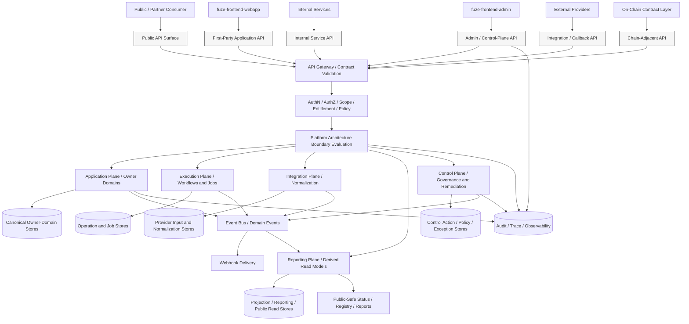
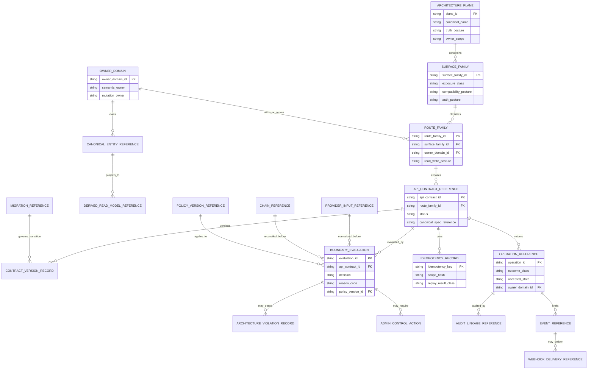
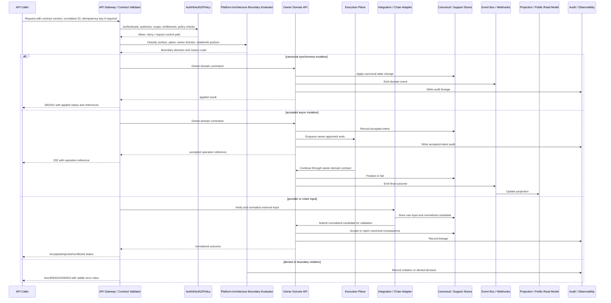

# FUZE Platform Architecture API Specification

## Document Metadata

- **Document Name:** `PLATFORM_ARCHITECTURE_API_SPEC.md`
- **Document Type:** FUZE API SPEC v2 — production-grade interface-contract specification
- **Status:** Draft API SPEC v2 for approval
- **Version:** 2.0.0
- **Effective Date:** 2026-04-24
- **Last Updated:** 2026-04-24
- **Reviewed On:** 2026-04-24
- **Document Owner:** FUZE Platform API Architecture / Interface Governance Domain. Named individual owner is not yet specified.
- **Approval Authority:** FUZE platform architecture and specification-governance approval workflow. Named approver is not yet specified.
- **Review Cadence:** MUST be reviewed whenever FUZE top-level planes, service-domain boundaries, product-extension architecture, API surface-family posture, chain-adjacent posture, admin/control-plane posture, runtime execution posture, or cross-domain contract-governance rules materially change; SHOULD also be reviewed quarterly.
- **Governing Layer:** API SPEC v2 / platform architecture API contract layer
- **Parent Registry:** `API_SPEC_INDEX.md` for API-family registry and historical API posture; API SPEC v2 canonical file registry for this production-grade series
- **Upstream Semantic Registry:** `REFINED_SYSTEM_SPEC_INDEX.md`
- **Upstream API Registry:** `API_SPEC_INDEX.md`
- **Primary Audience:** Platform architecture, backend engineering, API engineering, frontend engineering, internal service authors, event/webhook authors, product-domain teams, security, audit, operations, reporting, governance/control-plane authors, OpenAPI/AsyncAPI/SDK authors, implementation-contract authors
- **Primary Purpose:** Define the API contract posture for exposing, enforcing, and deriving FUZE platform-architecture boundaries without redefining the refined platform architecture semantics.
- **Primary Upstream References:** `REFINED_SYSTEM_SPEC_INDEX.md`; `PLATFORM_ARCHITECTURE_SPEC.md`; `SYSTEM_BOUNDARY_AND_OWNERSHIP_SPEC.md`; `SYSTEM_OVERVIEW_AND_BOUNDARIES_SPEC.md`; `DOMAIN_OWNERSHIP_MATRIX_SPEC.md`; `DATA_MODEL_AND_ENTITY_OWNERSHIP_SPEC.md`; `ONCHAIN_OFFCHAIN_RESPONSIBILITY_SPEC.md`; `PRODUCT_BOUNDARY_AND_DOMAIN_OWNERSHIP_SPEC.md`; `PRODUCT_ADMISSION_AND_EXPANSION_GATE_SPEC.md`; `API_ARCHITECTURE_SPEC.md`; `PUBLIC_API_SPEC.md`; `INTERNAL_SERVICE_API_SPEC.md`; `EVENT_MODEL_AND_WEBHOOK_SPEC.md`; `IDEMPOTENCY_AND_VERSIONING_SPEC.md`; `MIGRATION_AND_BACKWARD_COMPATIBILITY_SPEC.md`; `AUDIT_LOG_AND_ACTIVITY_SPEC.md`; `SECURITY_AND_RISK_CONTROL_SPEC.md`; `MONITORING_ALERTING_AND_INCIDENT_RESPONSE_SPEC.md`; `FUZE_ACCOUNT_ACCESS_AND_SESSION_THESIS_FINAL_SPEC.md`; `FUZE_ACCOUNT_ACCESS_AND_SESSION_CANONICAL_FINAL_SPEC.md`; `FUZE_WORKSPACE_ACCESS_CONTROL_BASICS_THESIS_FINAL_SPEC.md`
- **Primary Downstream Dependents:** Platform implementation-contract specs; route catalogs; service-contract specs; OpenAPI / AsyncAPI / SDK artifacts; public, first-party, internal, admin/control, reporting, event, webhook, and chain-adjacent API specifications; product integration specifications; runtime and deployment contracts; audit and observability instrumentation contracts
- **API Surface Families Covered:** Public read where explicitly approved; first-party application APIs; internal service APIs; admin/control-plane APIs; event and webhook APIs; reporting/read-model APIs; chain-adjacent coordination APIs; implementation-facing APIs used to preserve platform plane and owner-domain boundaries
- **API Surface Families Excluded:** Product-local endpoint detail; raw database schema APIs; direct provider-vendor APIs not normalized by FUZE; direct smart-contract ABI definitions; internal operator runbook procedures; frontend component APIs; undocumented private shortcuts
- **Canonical System Owner(s):** FUZE Platform Architecture Domain owns platform plane and shared-core architecture semantics. Domain owners retain semantic and mutation ownership for their own business domains.
- **Canonical API Owner:** FUZE Platform API Architecture / Interface Governance Domain owns the API-level expression of platform architecture boundaries.
- **Supersedes:** Earlier or weaker API interpretations that treat platform architecture APIs as transport-only catalogs, repository maps, frontend convenience surfaces, or implementation diagrams; any implied API posture that lets runtime surfaces, queues, workers, dashboards, SDKs, provider callbacks, or admin tools become hidden truth owners.
- **Superseded By:** None currently defined.
- **Related Decision Records:** Not explicitly linked in retrieved governing materials.
- **Canonical Status Note:** This API specification is canonical for API-level expression of FUZE platform architecture. It does not own the semantic platform architecture itself; `PLATFORM_ARCHITECTURE_SPEC.md` remains the semantic owner. Downstream API and implementation contracts MUST preserve this document's surface-family, request/response, idempotency, audit, migration, and boundary-enforcement requirements.
- **Implementation Status:** Normative API specification pending approval; downstream implementation MUST NOT treat it as optional guidance once approved.
- **Approval Status:** Draft pending explicit approval workflow.
- **Change Summary:** Created API SPEC v2 production-grade interface-contract specification derived from the active refined platform architecture, active refined registry, current API architecture spec, and historical API v1 posture. Clarifies API surface families, route/resource families, request/response/error/status semantics, accepted async behavior, owner-domain mutation termination, plane-boundary enforcement, admin/control posture, public exposure constraints, event/webhook behavior, chain-adjacent handling, idempotency, audit, observability, migration, diagrams, acceptance criteria, and test cases.

## Purpose

This specification defines how FUZE APIs MUST expose, preserve, and enforce the canonical platform architecture.

The platform architecture API layer exists to make the refined platform model implementable through stable interface contracts. It governs how API surfaces represent FUZE's experience/edge layer, application plane, execution plane, integration plane, reporting plane, control plane, and adjacent on-chain contract layer. It also governs how APIs express shared platform domains, product-extension domains, runtime coordination, provider normalization, chain-adjacent coordination, derived reporting, public trust surfaces, and privileged control paths.

This specification is not a route dump. It is a production-grade governing API document. It defines the contract rules that narrower endpoint catalogs, OpenAPI files, AsyncAPI files, SDKs, internal service contracts, event schemas, storage support specs, and implementation contracts MUST preserve.

## Scope

This specification governs:

1. API expression of the FUZE platform-architecture plane model.
2. API surface-family posture for public, first-party, internal, admin/control, event/webhook, reporting, chain-adjacent, and implementation-facing surfaces.
3. Boundary rules for canonical writes, canonical reads, derived reads, reporting projections, provider inputs, chain observations, async execution, and control-plane actions.
4. Resource and entity families needed to expose or validate platform architecture posture.
5. Request, response, error, status, idempotency, retry, rate-limit, audit, observability, migration, and versioning rules for platform-architecture APIs.
6. Cross-spec guardrails that downstream domain API specs must preserve.
7. API-level diagrams, flow views, acceptance criteria, and test cases for implementation review and contract validation.

## Out of Scope

This specification does not define:

- every endpoint path or payload field for all FUZE domains
- exact database schemas for each platform or product domain
- every event payload or webhook schema in full detail
- queue, broker, gateway, cloud, service mesh, database, Kubernetes, or infrastructure-vendor choices
- exact smart-contract ABI behavior or chain-indexer internals
- frontend component structure, local state-management details, or UX copy
- product-local API contracts except where they must preserve platform architecture
- operator runbook procedures or human escalation workflows in full procedural detail
- legal, tax, investor-relations, or accounting interpretation

These belong in narrower implementation-contract, API, runbook, legal, finance, public-read, or product documents, provided they remain consistent with this document and the upstream refined system specs.

## Design Goals

The design goals of this API spec are to:

1. make the FUZE platform architecture enforceable through APIs rather than merely descriptive
2. preserve refined system semantics while defining interface-contract obligations
3. keep platform planes visible in API contracts even when implemented inside one backend estate
4. make canonical write ownership and canonical read ownership explicit
5. prevent public, first-party, internal, admin/control, reporting, event, webhook, and chain-adjacent surfaces from drifting into one undifferentiated API
6. support synchronous, accepted async, deferred, retryable, and control-sensitive behaviors with unambiguous response semantics
7. keep provider-input truth and chain-native truth separate from FUZE owner-domain truth until validation and normalization complete
8. preserve audit, traceability, observability, idempotency, and migration safety across meaningful API interactions
9. make downstream OpenAPI, AsyncAPI, SDK, service-contract, and implementation-contract derivation safe and deterministic
10. reduce architectural drift, route drift, schema drift, ownership drift, public exposure drift, event drift, and test drift

## Non-Goals

This specification is not intended to:

- create a single generic `/architecture` API that owns all platform truth
- turn platform architecture into a new business-domain owner
- make the API gateway, frontend, SDK, dashboard, worker, queue, report, public registry, provider adapter, or admin console a hidden owner of semantic truth
- expose every platform capability publicly
- make internal services broad-write shortcuts around owner-domain APIs
- collapse accepted async intent into final business success
- let derived reporting APIs correct canonical source data
- let chain observation or provider callback data become canonical without explicit normalization and owner-domain acceptance
- replace narrower domain API specs, OpenAPI/AsyncAPI files, service contracts, or implementation contracts

## Core Principles

### 1. Refined-Semantics Preservation Principle

API contracts MUST derive from refined system specs. The API layer MUST NOT redefine platform architecture semantics, truth classes, ownership boundaries, lifecycle meaning, or conflict-resolution posture for convenience.

### 2. Platform-Architecture as Boundary Enforcement Principle

Platform architecture APIs exist to expose and enforce boundary posture. They are not merely health checks, service maps, or transport schemas.

### 3. Plane Separation Principle

Experience/edge, application, execution, integration, reporting, control, and on-chain contract layers MUST remain distinguishable in API design, even if some runtime components are deployed together.

### 4. Owner-Domain Mutation Principle

Canonical off-chain business mutations MUST terminate in the owning application-plane domain or an explicitly owner-controlled equivalent path. Platform architecture APIs MUST NOT become broad mutation proxies.

### 5. Derived-Read Discipline Principle

Reporting, dashboard, registry, transparency, analytics, cache, search, and export APIs MAY expose derived views but MUST NOT become hidden canonical mutation owners.

### 6. Accepted-Async Honesty Principle

Accepted async intent MUST remain distinct from final business outcome. APIs MUST return operation references and status classes rather than pretending long-running work has completed.

### 7. Normalization-Before-Influence Principle

Provider callbacks, chain observations, external identity claims, AI-vendor results, and other external inputs MUST cross an explicit normalization boundary before influencing owner-domain truth.

### 8. Control-Plane Explicitness Principle

Privileged actions, overrides, remediation, emergency controls, provider/config enablement, governance-sensitive actions, and admin corrections MUST use explicit privileged surfaces with stronger authorization, reason codes, audit lineage, and policy references.

### 9. Contract-Governance Principle

Versioning, idempotency, compatibility, deprecation, migration, and lineage are mandatory API architecture obligations.

### 10. Future-Safe Extensibility Principle

New products, providers, chain rails, public trust surfaces, SDKs, and internal services MUST extend the platform through explicit owner-domain and surface-family contracts rather than creating shadow primitives.

## Canonical Definitions

### Platform Architecture API Domain

The API contract domain that governs how FUZE's canonical platform architecture is exposed and enforced through interface families.

### Platform Plane

A durable architectural role in the FUZE system: experience/edge, application, execution, integration, reporting, control, or adjacent on-chain contract layer.

### Architecture Descriptor Resource

A read-oriented API representation of approved architecture metadata, such as plane taxonomy, surface-family classification, owner-domain references, route-family classification, policy version references, and cross-spec lineage. It is not a business-object owner.

### Boundary Evaluation

A deterministic API-level validation that determines whether a proposed route family, operation, service contract, event, projection, or public exposure preserves the platform architecture and owner-domain boundaries.

### Surface Family

A canonical category of API exposure with different trust, compatibility, authorization, audit, and public-exposure posture.

### Owner-Domain Contract

A contract owned by the semantic domain that owns the relevant canonical truth. Platform architecture APIs may reference owner-domain contracts but MUST NOT replace them.

### Platform Architecture Violation

A detected attempt to bypass, blur, or reinterpret canonical platform architecture, such as an internal service writing another domain's truth directly or a report attempting to correct canonical data.

### Accepted Architecture Operation

A durable API response indicating that a requested architecture-governed change, validation, publication, migration, or enforcement operation has been accepted for asynchronous processing. It is not final success.

## Truth Class Taxonomy

This API specification MUST preserve the following truth classes:

1. **Semantic truth** — platform plane meaning, shared-core model, product-extension model, and ownership semantics owned by refined system specs.
2. **API contract truth** — surface-family classification, route-family posture, request/response/error/status rules, and interface-governance obligations owned by API specs.
3. **Policy truth** — rollout, exposure, authorization, governance, control, compatibility, deprecation, and boundary-enforcement policy.
4. **Runtime truth** — current request processing, service health, workflow progress, job state, dependency state, and degraded-mode status.
5. **Ledger / storage truth** — durable domain records, idempotency records, operation records, audit records, contract registry records, and architecture decision records where applicable.
6. **Provider-input truth** — raw external callback, provider status, identity-provider signal, AI-vendor response, or chain observation before FUZE normalization.
7. **Implementation-adapter truth** — gateway translation, validation, adapter mediation, contract-codegen state, provider mapping, or edge protocol handling.
8. **Execution truth** — job, workflow, retry, backoff, compensation, and deferred progression truth.
9. **Projection / reporting truth** — derived read models, dashboards, public registry outputs, transparency views, analytics, exports, and compatibility summaries.
10. **Presentation truth** — frontend wording, admin labels, SDK helper naming, documentation prose, and user-visible rendering.
11. **Public read-model truth** — approved public or stakeholder-facing interpretation of architecture-relevant records after publication, redaction, supersession, and correction rules apply.
12. **Chain-native truth** — state committed in smart contracts or on-chain events where the chain is explicitly the owner.

These truth classes MUST NOT be collapsed into a generic platform-state concept.

## Architectural Position in the Spec Hierarchy

This API spec sits below:

- `REFINED_SYSTEM_SPEC_INDEX.md`
- `SYSTEM_BOUNDARY_AND_OWNERSHIP_SPEC.md`
- `SYSTEM_OVERVIEW_AND_BOUNDARIES_SPEC.md`
- `PLATFORM_ARCHITECTURE_SPEC.md`
- `DOMAIN_OWNERSHIP_MATRIX_SPEC.md`
- `DATA_MODEL_AND_ENTITY_OWNERSHIP_SPEC.md`
- `ONCHAIN_OFFCHAIN_RESPONSIBILITY_SPEC.md`
- `PRODUCT_BOUNDARY_AND_DOMAIN_OWNERSHIP_SPEC.md`

It sits alongside or above downstream API contract work for:

- `API_ARCHITECTURE_SPEC.md`
- `PUBLIC_API_SPEC.md`
- `INTERNAL_SERVICE_API_SPEC.md`
- `EVENT_MODEL_AND_WEBHOOK_SPEC.md`
- `IDEMPOTENCY_AND_VERSIONING_SPEC.md`
- `MIGRATION_AND_BACKWARD_COMPATIBILITY_SPEC.md`
- all domain API specifications that need platform plane and surface-family discipline
- OpenAPI / AsyncAPI / SDK generation layers
- implementation-contract specs and route catalogs

This document governs the API-level expression of platform architecture. It does not replace upstream platform architecture semantics or downstream endpoint-level detail.

## Upstream Semantic Owners

The upstream semantic owners are:

- **Refined System Registry:** owns refined-library membership, precedence, routing, and derivation obligations.
- **System Boundary and Ownership:** owns top-level ownership interpretation and mutation-boundary discipline.
- **System Overview and Boundaries:** owns top-level ecosystem and boundary framing.
- **Platform Architecture:** owns plane model, shared-core architecture, product-extension discipline, runtime interaction model, integration normalization, reporting plane, control plane, and chain-adjacent architecture posture.
- **Domain Ownership Matrix:** owns owner assignment for specific domains.
- **Data Model and Entity Ownership:** owns canonical entity and storage ownership interpretation.
- **On-Chain / Off-Chain Responsibility:** owns chain-adjacent responsibility separation.
- **Product Boundary and Domain Ownership:** owns product-extension and product-local ownership posture.

This API spec consumes those semantics and expresses them as API contract obligations.

## API Surface Families

### Public APIs

Public APIs MAY expose only approved, stable, intentionally public architecture information, such as public platform status, public registry references, or public documentation-driven metadata. They MUST NOT expose internal plane topology, control-plane capabilities, sensitive provider configuration, internal service mapping, private audit data, or privileged boundary-evaluation detail.

### First-Party Application APIs

First-party APIs MAY expose architecture-aware context needed by FUZE applications, such as allowed capabilities, domain-owned status references, operation status, product-surface routing context, user/workspace-scoped platform capability posture, and derived status views. They MUST not allow frontend surfaces to reinterpret platform architecture or write another domain's canonical truth.

### Internal Service APIs

Internal service APIs MAY expose platform architecture validation, service-contract classification, owner-domain resolution, event classification, route-family classification, and internal boundary-evaluation functions. They MUST be least-privilege, mutually authenticated, auditable for sensitive decisions, and unable to act as hidden broad-write shortcuts.

### Admin / Control-Plane APIs

Admin/control-plane APIs MAY expose boundary review, exception handling, remediation, controlled override, exposure approval, route-family activation, migration cutover, deprecation, and incident-aligned controls. They MUST require stronger authorization, reason codes, policy versions, approval references where applicable, and audit lineage.

### Event / Webhook APIs

Event APIs MAY announce architecture-governed lifecycle changes such as route-family activation, contract version publication, boundary violation detected, migration window opened, or public architecture metadata published. Public webhooks MUST be narrower than internal events and MUST NOT leak internal control-plane state.

### Reporting / Read-Model APIs

Reporting APIs MAY expose derived architecture dashboards, compatibility views, API catalog projections, public-safe status summaries, and migration posture. They MUST be read-only unless a narrower reporting-domain API explicitly owns a publication-state mutation. They MUST preserve source lineage.

### Chain-Adjacent APIs

Chain-adjacent APIs MAY expose approved chain-reference posture, off-chain/on-chain responsibility descriptors, tx-reference status, registry references, and reconciliation status. They MUST NOT represent off-chain policy as chain-native truth or chain observations as owner-domain state before normalization.

### Implementation-Facing APIs

Implementation-facing APIs MAY support contract validation, code-generation metadata, route registration checks, schema compatibility checks, idempotency registration, event contract validation, and internal audit references. They MUST remain subordinate to approved API specs and implementation-contract specs.

## System / API Boundaries

### What This API Spec Governs

This API spec governs the API contract layer that expresses platform architecture. It determines how APIs identify, validate, expose, and preserve architecture boundaries.

### What the Upstream Refined System Spec Governs

`PLATFORM_ARCHITECTURE_SPEC.md` governs the semantic platform architecture: plane definitions, shared-core model, product-extension model, runtime interaction roles, control-plane posture, integration posture, reporting posture, and chain-adjacent architecture.

### What Adjacent API Specs Govern

- `API_ARCHITECTURE_SPEC.md` governs shared API architecture across surface families.
- `PUBLIC_API_SPEC.md` governs public exposure and external contract posture.
- `INTERNAL_SERVICE_API_SPEC.md` governs service-to-service contract posture.
- `EVENT_MODEL_AND_WEBHOOK_SPEC.md` governs event and webhook semantics.
- `IDEMPOTENCY_AND_VERSIONING_SPEC.md` governs replay safety and contract versioning.
- `MIGRATION_AND_BACKWARD_COMPATIBILITY_SPEC.md` governs coexistence, cutover, deprecation, and supersession.
- Domain API specs govern domain-specific resources, requests, responses, lifecycle transitions, and error classes.

### What Implementation Contracts Govern

Implementation contracts MUST define concrete endpoint schemas, service boundaries, storage support, event payloads, SDK types, route handlers, validation code, test fixtures, observability dimensions, and runbook linkages. They MUST NOT reinterpret the boundaries in this document.

### Intentionally Deferred

The following are intentionally deferred to downstream specs:

- exact route paths and payload fields for the full platform architecture API catalog
- exact authorization scopes and policy identifiers
- exact audit event names and SIEM fields
- exact OpenAPI/AsyncAPI component names
- exact internal service registry storage schema
- exact UI behavior for architecture review and route approval tools

## Adjacent API Boundaries

1. **Boundary and Ownership API:** owns API-level expression of top-level mutation and ownership boundaries.
2. **System Overview and Boundaries API:** owns API-level expression of top-level ecosystem boundary framing.
3. **Platform Architecture API:** this document; owns API-level expression of the plane model and shared-core architecture.
4. **Domain Ownership Matrix API:** owns owner-domain lookup, domain responsibility mapping, and contested ownership classification.
5. **Data Model and Entity Ownership API:** owns entity-family ownership and canonical-vs-derived data contract posture.
6. **On-Chain / Off-Chain Responsibility API:** owns chain-adjacent boundary expression.
7. **Public API:** narrows externally visible surface.
8. **Internal Service API:** narrows service-to-service posture.
9. **Event/Webhook API:** narrows event and webhook surfaces.

## Conflict Resolution Rules

When materials, implementations, generated contracts, or interpretations conflict, FUZE MUST resolve them in the following order:

1. `REFINED_SYSTEM_SPEC_INDEX.md` wins on refined-library membership, routing, and precedence.
2. Higher-order boundary and ownership specs win on top-level ownership and truth-family posture.
3. `PLATFORM_ARCHITECTURE_SPEC.md` wins on platform plane semantics, shared-core model, product-extension discipline, runtime interaction model, integration normalization posture, reporting posture, and control-plane posture.
4. This document wins on API-level expression of platform architecture, route-family posture, surface-family classification, request/response/error/status contract requirements, architecture-boundary evaluation, idempotency requirements, audit requirements, and API derivation guardrails.
5. `API_ARCHITECTURE_SPEC.md` wins on shared API architecture that is broader than this specific platform architecture API domain.
6. `PUBLIC_API_SPEC.md`, `INTERNAL_SERVICE_API_SPEC.md`, `EVENT_MODEL_AND_WEBHOOK_SPEC.md`, `IDEMPOTENCY_AND_VERSIONING_SPEC.md`, and `MIGRATION_AND_BACKWARD_COMPATIBILITY_SPEC.md` win on their narrower API-family concerns where they do not contradict refined platform architecture semantics.
7. Domain API specs win on domain-specific interface detail within their owner-domain boundaries.
8. OpenAPI, AsyncAPI, SDK, dashboards, generated code, route catalogs, migration scripts, reports, and runbooks never win over approved source specs.
9. When ambiguity remains, FUZE MUST select the more conservative architecture-consistent interpretation and escalate the ambiguity into recorded decision or refinement work.

## Default Decision Rules

1. If an API cannot identify its surface family, owner domain, platform plane, compatibility posture, mutation boundary, and audit posture, it is incomplete.
2. If a proposed write affects canonical business truth, it defaults to the owner-domain application-plane API.
3. If a proposed API only composes, reports, searches, indexes, exports, or displays data, it defaults to derived read-only posture.
4. If a proposed operation is privileged, exceptional, security-sensitive, economic, governance-sensitive, public-trust-sensitive, or control-sensitive, it defaults to admin/control-plane treatment.
5. If a request initiates long-running work, it defaults to accepted async semantics with operation references.
6. If a provider or chain signal arrives, it defaults to provider-input or chain-observation truth until normalized and validated by an owner domain.
7. If external exposure is requested, the default answer is no public exposure unless an approved public API spec allows it.
8. If a frontend, SDK, dashboard, worker, report, or internal adapter appears to own truth, the design is presumed invalid unless a canonical owner-domain path is explicit.
9. If a product needs a shared primitive, it MUST consume a platform-owned primitive rather than redefining it locally.
10. If route convenience conflicts with boundary preservation, boundary preservation wins.

## Roles / Actors / API Consumers

### Human Actors

- end users
- workspace members and owners
- product operators
- support operators
- security reviewers
- API reviewers
- platform architects
- finance and treasury reviewers
- governance or approval actors
- public or stakeholder readers of approved public-trust surfaces

### System Actors

- `fuze-frontend-webapp`
- `fuze-frontend-admin`
- `fuze-backend-api`
- platform domain services
- product domain services
- workflow engines
- job workers and schedulers
- provider adapters and normalization services
- chain-adjacent coordination services
- reporting and publication services
- public registry surfaces
- API gateway / edge adapters
- contract registry / schema registry systems
- OpenAPI / AsyncAPI / SDK generation pipelines
- observability, audit, and security-monitoring systems
- `fuze-contracts`
- future bounded public or partner consumers

## Resource / Entity Families

This API domain MAY expose or support the following resource families:

- `architecture_plane`
- `surface_family`
- `route_family`
- `owner_domain_reference`
- `architecture_boundary_rule`
- `boundary_evaluation`
- `api_contract_reference`
- `operation_reference`
- `idempotency_record`
- `contract_version_record`
- `compatibility_window`
- `migration_reference`
- `public_exposure_reference`
- `admin_control_action`
- `boundary_exception_record`
- `architecture_violation_record`
- `provider_input_reference`
- `chain_reference`
- `derived_read_model_reference`
- `audit_linkage_reference`
- `trace_correlation_reference`
- `policy_version_reference`

These are API-facing resources. They are not permission to centralize all business truth under this API domain.

## Ownership Model

### Platform Architecture API Domain Owns

- API-level expression of platform plane classification
- architecture-boundary validation contract rules
- surface-family mapping for platform architecture concerns
- route-family architecture classification
- API-level architecture violation classification
- architecture operation reference posture
- platform architecture API request/response/error/status semantics
- cross-domain derivation guardrails for downstream API contracts
- audit, idempotency, and migration expectations specific to platform architecture APIs

### Platform Architecture API Domain Does Not Own

- domain business semantics
- canonical domain writes outside architecture-governance records
- workflow meaning
- job queue mechanics
- AI orchestration meaning
- billing, credits, payout, treasury, governance, entitlement, or access-control semantics
- public registry truth
- reporting truth
- chain-native truth
- provider-native truth
- presentation wording

### Owner Domains MUST

- expose canonical mutations through explicit owner-domain contracts
- identify their platform plane and route-family posture
- emit sufficient lineage for audit, events, reporting, and status APIs
- preserve the architecture plane model in endpoint, event, and storage support contracts
- refuse shortcut writes from non-owner surfaces

### Non-Owners MAY

- request owner-domain actions through approved contracts
- consume approved canonical reads or derived reads
- compose user-facing or operator-facing views
- initiate accepted async work through owner-approved APIs
- publish approved derived or public-safe outputs

### Non-Owners MUST NOT

- directly mutate owner-domain storage
- present derived projections as canonical truth
- treat internal service authentication as mutation authority
- promote provider or chain input into canonical FUZE truth without normalization
- use admin/control APIs as ordinary application routes
- create route aliases that hide the canonical owner domain

## Authority / Decision Model

### Semantic Authority

Refined system specs have semantic authority. API specs MUST preserve their meaning.

### API Contract Authority

The Platform API Architecture / Interface Governance Domain has authority over API expression, surface-family posture, request/response/error/status conventions, contract-evolution guardrails, and API derivation posture for this domain.

### Domain Authority

Each owner domain retains authority over its own business meaning, lifecycle, canonical writes, canonical reads, and domain events.

### Control / Governance Authority

Control-plane and governance actors may approve, restrict, override, remediate, or supersede architecture-governed actions only through explicit privileged APIs. They do not become ordinary owners of business-domain truth.

### External Authority

External providers and chains have authority only over their own systems or contract-native facts. FUZE APIs decide normalization, acceptance, reconciliation, and public exposure according to FUZE owner-domain rules.

## Authentication Model

API consumers MUST authenticate according to surface family:

- public read APIs MAY allow unauthenticated access only for explicitly public resources
- first-party APIs MUST authenticate user/session context where user or workspace state is involved
- internal service APIs MUST use service identity, mutual authentication or equivalent strong service authentication, and least-privilege authorization
- admin/control APIs MUST authenticate privileged operators or governance-aware service actors with elevated assurance
- event/webhook APIs MUST authenticate or verify event source, endpoint ownership, signing material, and replay protections where applicable
- chain-adjacent APIs MUST distinguish user identity, service identity, wallet identity, signer identity, and contract/native chain identity

Authentication alone MUST NOT imply authorization or owner-domain mutation authority.

## Authorization / Scope / Permission Model

Authorization MUST be evaluated across these dimensions where relevant:

- account identity
- session validity
- workspace scope
- organization scope
- product scope
- owner-domain permission
- effective permission
- entitlement or capability-gating result
- public visibility class
- internal service grant
- admin/operator role
- control-plane policy
- governance approval reference
- environment and rollout posture
- chain-adjacent execution right
- provider/config access right

Platform architecture APIs MUST include authorization outcomes in audit lineage for meaningful mutations, privileged reads, boundary evaluations, exposure approvals, and override actions.

## Entitlement / Capability-Gating Model

Entitlement and capability gating are adjacent constraints, not replacements for authorization. Platform architecture APIs MAY require entitlement checks when a caller attempts to activate, expose, consume, or derive capabilities tied to product availability, rollout stage, plan, workspace status, credits, policy restriction, or internal feature gate.

An entitlement result MUST NOT authorize mutation outside the owner domain. A permission result MUST NOT imply product capability availability. A rollout flag MUST NOT override authorization or ownership.

## API State Model

Platform architecture APIs MUST distinguish the following state classes:

- `draft`
- `proposed`
- `validated`
- `accepted`
- `active`
- `inactive`
- `blocked`
- `rejected`
- `conflicted`
- `degraded`
- `deprecated`
- `superseded`
- `withdrawn`
- `failed_retryable`
- `failed_terminal`
- `compensated`

State rules:

1. `accepted` is not final success.
2. `active` requires owner-domain or governance-approved activation where applicable.
3. `blocked` must identify the blocking boundary rule, policy, or dependency.
4. `conflicted` must distinguish contested ownership, incompatible versions, duplicate routes, or policy contradictions from generic failure.
5. `deprecated`, `superseded`, and `withdrawn` must preserve lineage.
6. `degraded` must identify the affected plane and the source of runtime limitation.

## Lifecycle / Workflow Model

### Architecture-Governed API Lifecycle

1. A request enters through an identified surface family.
2. The API gateway or service validates authentication, schema, contract version, correlation ID, and idempotency posture.
3. Authorization, scope, permission, entitlement, rollout, and policy checks are evaluated.
4. The platform architecture boundary classifier identifies plane, owner domain, route family, derived/canonical posture, public exposure posture, and mutation/read posture.
5. The owner domain accepts, rejects, applies, or records accepted async intent.
6. If async work is required, operation references are issued and workers operate through owner-domain contracts.
7. Events, webhooks, audit records, and observability records are emitted according to surface sensitivity.
8. Derived read models and public/status views update downstream with lineage.
9. Failures preserve error class, retry posture, correlation ID, and affected plane.
10. Corrections, overrides, migrations, deprecations, and supersessions preserve explicit lineage.

## Architecture Diagram — Mermaid Flowchart



## Data Design — Mermaid Diagram



## Flow View

### Standard Synchronous Read Flow

1. Caller enters through an approved surface family.
2. Contract version, schema, correlation ID, and caller identity are validated.
3. Authorization and visibility class are resolved.
4. Boundary evaluation confirms the read is canonical, derived, public-safe, or presentation-only.
5. Canonical owner-domain read or approved projection is queried.
6. Response includes `data`, `truth_class`, `source_domain`, `contract_version`, and correlation references.
7. Privileged or sensitive reads emit audit records.

### Canonical Mutation Flow

1. Caller submits mutation with idempotency key where required.
2. API validates schema, authentication, authorization, entitlement, policy, and surface family.
3. Boundary evaluation identifies owner domain and confirms that the route terminates in that owner domain.
4. Owner domain validates business semantics.
5. Owner domain applies synchronously or records accepted async intent.
6. API returns `applied`, `accepted`, `rejected`, or `conflicted` status with operation and audit references.
7. Domain events and derived projections update downstream without becoming owners.

### Accepted Async Flow

1. Request validates and receives owner-domain acceptance.
2. API returns `202 Accepted`-class semantics with operation reference and current status.
3. Execution plane performs deferred work through owner-domain contracts.
4. Retries preserve idempotency and operation lineage.
5. Final outcome is recorded separately as `completed`, `failed_terminal`, `failed_retryable`, `compensated`, or `superseded`.
6. Status APIs and events communicate the final result.

### Provider / Chain Input Flow

1. Provider callback or chain observation enters integration or chain-adjacent API.
2. API verifies signature, source, network, provider identity, replay protection, and schema.
3. Raw input is recorded as provider-input or chain-observation truth.
4. Normalization converts the input into FUZE-owned interpretation candidates.
5. Owner-domain validation decides whether canonical FUZE state changes.
6. Rejected inputs preserve audit and discrepancy lineage but do not mutate owner truth.

### Admin / Control Flow

1. Privileged caller authenticates through admin/control surface.
2. API enforces role, policy, reason code, approval reference, and scope.
3. Boundary evaluation confirms the action is an approved privileged path, not an ordinary route shortcut.
4. Control action is recorded and either constrains an owner-domain action, initiates remediation, or approves a bounded exception.
5. Audit, traceability, event, and post-review requirements are recorded.

### Failure / Retry / Degraded-Mode Flow

1. Failure is classified as validation, authorization, entitlement, conflict, policy denial, rate limit, dependency degraded, retryable execution failure, terminal failure, or boundary violation.
2. Response includes stable error code, affected plane, retryability, correlation ID, and operation reference where applicable.
3. Retryable operations preserve idempotency and do not create duplicate business effects.
4. Degraded mode returns partial or narrowed responses only when explicitly safe.
5. Remediation or compensation preserves lineage to original operation.

## Data Flows — Mermaid sequenceDiagram



## Request Model

Platform architecture API requests MUST include or derive the following contract-level fields where relevant:

- `request_id` or generated request reference
- `correlation_id`
- `trace_id` where applicable
- `contract_version`
- `surface_family`
- `route_family`
- `actor_type`
- `actor_id` or service identity reference
- `account_id` where user-account scoped
- `workspace_id` where workspace scoped
- `owner_domain_id` where known
- `idempotency_key` for mutation, accepted async, control, external callback, retryable, or duplicate-sensitive operations
- `operation_type`
- `resource_type`
- `resource_id` or proposed resource reference where applicable
- `policy_version` where policy-sensitive
- `reason_code` for admin/control, override, remediation, exception, or migration actions
- `approval_reference` where required
- `provider_input_reference` for provider callbacks
- `chain_reference` for chain-adjacent inputs
- `migration_reference` for cutover, deprecation, or compatibility operations

Requests MUST NOT rely on frontend naming, SDK helper names, dashboard labels, or provider-specific field names as canonical semantics.

## Response Model

Responses MUST distinguish:

- canonical owner-domain data
- derived read-model data
- public-safe or presentation-safe data
- accepted async operation references
- error or denial outcomes
- conflict outcomes
- retryable vs terminal failure
- migration or deprecation state
- source-domain and truth-class metadata where relevant

Recommended response envelope:

```json
{
  "status": "accepted|applied|rejected|conflicted|failed_retryable|failed_terminal|degraded",
  "truth_class": "api_contract|semantic|runtime|projection|provider_input|chain_native|presentation",
  "source_domain": "platform_architecture|<owner_domain>",
  "data": {},
  "operation": {
    "operation_id": "op_...",
    "operation_type": "...",
    "accepted_at": "2026-04-24T00:00:00Z",
    "status_url": "/v1/operations/op_..."
  },
  "lineage": {
    "correlation_id": "corr_...",
    "trace_id": "trace_...",
    "audit_id": "audit_...",
    "contract_version": "v1"
  }
}
```

The exact payload is downstream contract work, but the distinctions above are mandatory.

## Error / Result / Status Model

API implementations MUST distinguish at minimum:

- `validation_error`
- `authentication_required`
- `authorization_denied`
- `permission_denied`
- `entitlement_denied`
- `policy_denied`
- `surface_family_not_allowed`
- `owner_domain_mismatch`
- `boundary_violation`
- `canonical_owner_required`
- `derived_write_forbidden`
- `public_exposure_forbidden`
- `control_plane_required`
- `reason_code_required`
- `approval_reference_required`
- `idempotency_key_required`
- `idempotency_conflict`
- `operation_already_applied`
- `accepted_not_final`
- `provider_input_unverified`
- `normalization_failed`
- `chain_reference_unconfirmed`
- `migration_window_closed`
- `contract_version_deprecated`
- `contract_version_unsupported`
- `rate_limited`
- `dependency_degraded`
- `failed_retryable`
- `failed_terminal`

Errors MUST include stable machine-readable codes, human-safe messages, affected plane where relevant, retry posture, correlation ID, and documentation or contract reference where appropriate.

## Idempotency / Retry / Replay Model

Idempotency is mandatory for:

- mutation routes
- accepted async commands
- admin/control actions
- boundary exception requests
- route activation/deactivation requests
- migration cutover requests
- provider callbacks
- chain-observation ingestion where duplicate delivery is possible
- public-trust publication actions
- webhook delivery acknowledgements or retries where applicable

Idempotency scope MUST include caller identity or service identity, owner domain, route family, resource or operation type, workspace/account scope where applicable, and normalized payload hash where required.

Replay behavior MUST distinguish:

- exact duplicate returning `previously_applied` or equivalent replay result
- duplicate accepted async operation returning the existing operation reference
- payload mismatch returning `idempotency_conflict`
- expired key returning a safe retry or conflict depending on operation class
- provider duplicate returning previously recorded provider-input reference
- webhook retry returning existing delivery status without new business effect

## Rate Limit / Abuse-Control Model

Rate limits MUST be surface-family aware:

- public APIs require stricter abuse controls and information-minimizing errors
- first-party APIs require account/workspace/session scoped limits
- internal service APIs require service-specific quotas and circuit breakers
- admin/control APIs require strict throttling, review safeguards, and anomaly alerts
- provider callback APIs require source verification, signature checks, replay windows, and per-provider quotas
- reporting/public-read APIs require cache-safe and export-safe controls
- chain-adjacent APIs require network-aware and reconciliation-aware throttles

Rate-limit responses MUST be non-mutating and MUST NOT obscure already accepted operations. Where appropriate, they SHOULD provide retry-after guidance without exposing sensitive internal limits.

## Endpoint / Route Family Model

This document defines route families, not final endpoints. Downstream OpenAPI and service contracts MAY use paths such as the following if approved:

### Architecture Descriptor Reads

- `GET /v1/platform-architecture/planes`
- `GET /v1/platform-architecture/surface-families`
- `GET /v1/platform-architecture/owner-domains`
- `GET /v1/platform-architecture/route-families`
- `GET /v1/platform-architecture/contracts/{contract_id}`

### Boundary Evaluation

- `POST /v1/platform-architecture/boundary-evaluations`
- `GET /v1/platform-architecture/boundary-evaluations/{evaluation_id}`

### Contract Registration / Validation

- `POST /v1/platform-architecture/contracts:validate`
- `POST /v1/platform-architecture/route-families:classify`
- `POST /v1/platform-architecture/events:classify`

### Admin / Control

- `POST /v1/admin/platform-architecture/boundary-exceptions`
- `POST /v1/admin/platform-architecture/contracts/{contract_id}:activate`
- `POST /v1/admin/platform-architecture/contracts/{contract_id}:deprecate`
- `POST /v1/admin/platform-architecture/violations/{violation_id}:remediate`

### Reporting / Projection

- `GET /v1/platform-architecture/reports/contract-coverage`
- `GET /v1/platform-architecture/reports/boundary-violations`
- `GET /v1/platform-architecture/reports/migration-readiness`

These examples are non-final route candidates. They MUST NOT be implemented without downstream contract review.

## Public API Considerations

Public exposure MUST be narrow. Public APIs MAY expose:

- approved public platform status
- public-safe architecture metadata already approved for publication
- public registry or transparency references under their own API specs
- public-safe deprecation notices and compatibility summaries

Public APIs MUST NOT expose:

- internal service maps
- privileged route details
- provider configuration
- internal audit records
- vulnerability or incident-sensitive details
- boundary-evaluation internals that enable abuse
- admin/control-plane capabilities
- hidden owner-domain identifiers not approved for public release

## First-Party Application API Considerations

First-party applications MAY receive architecture-aware data needed for user experience, such as allowed capability posture, workspace-scoped platform capability availability, operation status, and derived status summaries.

First-party surfaces MUST NOT:

- decide canonical owner-domain transitions
- locally infer permission or entitlement as canonical
- treat `accepted` as final success
- write directly to derived/reporting stores as if canonical
- expose privileged architecture details through client code

## Internal Service API Considerations

Internal service APIs MUST:

- be least-privilege
- identify caller service identity
- identify requested owner domain and route family
- preserve owner-domain write termination
- reject cross-domain writes that bypass owner APIs
- record boundary-sensitive decisions
- emit audit and observability for sensitive operations
- keep implementation-adapter truth separate from semantic truth

Internal trust MUST NOT replace domain authorization.

## Admin / Control-Plane API Considerations

Admin/control APIs MUST be separated from ordinary application APIs. They MUST require:

- privileged authentication
- explicit permission or role
- policy version
- reason code
- scope
- approval reference where required
- idempotency key for mutations
- operation reference
- audit lineage
- post-review or remediation linkage where applicable

Admin/control APIs MAY approve, deny, pause, quarantine, deprecate, supersede, remediate, or record bounded exceptions. They MUST NOT silently bypass owner-domain semantics.

## Event / Webhook / Async API Considerations

Events MAY be emitted for:

- contract validation completed
- route family activated
- route family deprecated
- boundary violation detected
- boundary exception approved or denied
- migration window opened or closed
- public-safe architecture metadata published
- control-plane remediation completed

Event rules:

1. Events MUST identify source domain, event type, event version, correlation ID, and operation reference.
2. Internal events MAY be richer than public webhooks.
3. Public webhooks MUST be explicitly approved and narrowed.
4. At-least-once delivery MUST NOT create duplicate business effects.
5. Event consumers MUST NOT become owners of original truth.

## Chain-Adjacent API Considerations

Chain-adjacent APIs MUST preserve:

- off-chain policy truth vs chain-native truth separation
- chain observation vs owner-domain validation separation
- submission intent vs transaction inclusion vs confirmation vs final reconciliation separation
- public registry and chain reference publication boundaries
- governance/control approval before sensitive chain-linked execution

Chain data MAY inform FUZE state only after approved normalization and owner-domain validation.

## Data Model / Storage Support Implications

Storage support MAY include:

- `architecture_plane`
- `surface_family_registry`
- `route_family_registry`
- `api_contract_registry`
- `boundary_evaluation_log`
- `architecture_violation_log`
- `idempotency_record`
- `operation_reference`
- `contract_version_record`
- `compatibility_window`
- `migration_reference`
- `admin_control_action`
- `boundary_exception_record`
- `audit_linkage_reference`
- `projection_refresh_record`

These storage structures support API contract behavior. They do not replace owner-domain canonical storage.

## Read Model / Projection / Reporting Rules

1. Read models MAY combine architecture descriptors, route registries, contract versions, owner-domain references, migration posture, and audit summaries.
2. Projections MUST identify their source specs or source records.
3. Projections MUST be read-only unless a narrow publication-domain API owns publication state.
4. Public read models MUST be redacted and approved.
5. Dashboards MUST NOT override canonical contract registries or owner-domain truth.
6. Cache invalidation MUST preserve contract-version lineage.
7. Reports MUST identify freshness and known degraded dependencies where relevant.

## Security / Risk / Privacy Controls

Platform architecture APIs are sensitive because they may reveal system shape and boundary posture. Implementations MUST apply:

- least privilege
- surface-family authorization
- defense against route enumeration abuse
- redaction of internal topology for public surfaces
- sensitive-control action hardening
- audit for privileged reads and all privileged mutations
- strong provider callback verification
- chain-reference validation
- secure handling of policy and configuration identifiers
- anomaly detection for repeated boundary violations
- no sensitive secrets or credentials in responses, logs, or events

## Audit / Traceability / Observability Requirements

Every meaningful platform architecture API operation MUST record:

- actor identity or service identity
- account/workspace scope where applicable
- surface family
- route family
- owner domain
- request ID
- correlation ID
- trace ID where applicable
- idempotency key where applicable
- policy version
- reason code for admin/control actions
- approval reference where applicable
- boundary decision and reason code
- operation reference
- result class
- error class where applicable
- emitted event references
- projection refresh references where relevant

Observability MUST include metrics by surface family, owner domain, plane, route family, decision class, error class, latency, retry count, dependency status, and degraded-mode state.

## Failure Handling / Edge Cases

### Ownership Conflict

Return `409 owner_domain_mismatch` or `409 boundary_violation`. Do not auto-route a write to a convenient non-owner domain unless a defined owner-domain forwarding contract exists.

### Missing Surface Classification

Reject production activation with `422 surface_family_not_allowed` or equivalent validation failure.

### Accepted Async Confusion

Return explicit accepted state and operation reference. Do not return success wording implying final business outcome.

### Duplicate Mutation

Return previous result or existing operation reference if the idempotency scope matches. Return conflict if payload differs.

### Provider Callback Duplicate

Record or return existing provider-input reference. Do not trigger duplicate owner-domain consequences.

### Chain Observation Discrepancy

Classify as chain-adjacent discrepancy. Do not overwrite off-chain canonical state without reconciliation rules.

### Reporting Store Lag

Return stale/degraded metadata or query canonical owner-domain read where safe. Do not claim projection freshness if stale.

### Admin Override Attempt Without Reason

Reject with `reason_code_required` and audit the denied attempt if sensitive.

### Public Exposure Attempt

Reject unless public API approval exists. Record boundary decision and route the proposal to review if appropriate.

## Migration / Versioning / Compatibility / Deprecation Rules

1. Breaking API changes require explicit version transition.
2. Public and cross-domain APIs require compatibility windows and deprecation notices.
3. Internal APIs require migration lineage when multiple services are affected.
4. Contract version records MUST preserve supersession history.
5. Deprecated routes MUST remain interpretable until the approved sunset.
6. Migration cutovers MUST use idempotent operation references.
7. Event versions and webhook versions MUST preserve replay-safe transition windows.
8. SDK changes MUST not hide breaking semantic changes behind helper renames.
9. Public read-model changes MUST preserve public interpretation lineage.
10. Migration reports are derived and MUST NOT become canonical domain truth.

## OpenAPI / AsyncAPI / SDK Derivation Rules

OpenAPI artifacts MUST preserve:

- surface family
- owner domain
- route family
- request/response envelopes
- error classes
- idempotency-key requirements
- accepted async operation references
- contract version
- authorization scopes
- audit/correlation references where applicable
- deprecation and migration metadata

AsyncAPI artifacts MUST preserve:

- source domain
- event family
- event version
- operation reference
- idempotency or replay posture
- internal vs webhook exposure distinction
- delivery retry semantics
- public redaction posture where applicable

SDKs MUST NOT:

- hide accepted async semantics
- merge public, first-party, internal, and admin/control methods into ambiguous helpers
- rename owner-domain concepts into product-local aliases that weaken canonical meaning
- generate writes against derived projections
- omit idempotency support for mutation helpers

## Implementation-Contract Guardrails

Implementation contracts MUST:

1. identify upstream refined semantic owners
2. identify API surface family
3. identify owner domain
4. identify canonical vs derived read posture
5. identify mutation termination path
6. specify auth, permission, entitlement, and policy checks
7. specify idempotency requirements
8. specify audit and observability fields
9. specify error/result/status classes
10. specify event/webhook consequences
11. specify migration and versioning metadata
12. specify non-canonical patterns and rejections
13. include test fixtures for boundary violations

Implementation contracts MUST NOT:

- write canonical state from non-owner services
- call private storage APIs as a shortcut
- expose control-plane actions through ordinary app routes
- create public routes without public exposure approval
- convert provider input into owner-domain truth without normalization
- let dashboards, reports, SDKs, or frontend helpers define domain semantics

## Downstream Execution Staging

A safe implementation sequence is:

1. confirm upstream refined semantic owner files
2. classify surface families and route families
3. define owner-domain write paths
4. define canonical and derived read paths
5. define request/response/error/status envelopes
6. define idempotency and replay storage
7. define audit, trace, and observability fields
8. define event and webhook consequences
9. define admin/control-plane exceptions
10. define migration/versioning posture
11. generate OpenAPI/AsyncAPI contracts
12. generate SDKs only after contract review
13. run acceptance criteria and test cases
14. review boundary violation logs before production launch

## Required Downstream Specs / Contract Layers

- platform route-family catalog
- architecture boundary-evaluation implementation contract
- API contract registry schema contract
- OpenAPI specification for approved routes
- AsyncAPI specification for approved events/webhooks
- idempotency storage and replay contract
- audit and observability field contract
- public exposure approval contract
- admin/control-plane action contract
- migration and deprecation runbook
- SDK derivation and naming guardrail

## Boundary Violation Detection / Non-Canonical API Patterns

The following patterns are forbidden unless an explicit bounded exception is approved:

1. frontend-owned platform architecture decisions
2. SDK helper methods that hide owner domains
3. worker writes directly to canonical business storage
4. internal service writes another domain's state without owner API
5. dashboard or report updates that correct canonical source data
6. public routes exposing internal service topology
7. admin routes used by ordinary application flows
8. provider callbacks directly mutating canonical state
9. chain observations treated as off-chain business truth without reconciliation
10. migration scripts that silently rewrite contract lineage
11. route aliases that obscure surface family or owner domain
12. event consumers becoming hidden owners of original truth
13. retries creating duplicate business effects
14. accepted async responses presented as final success
15. entitlement checks treated as authorization or owner-domain approval

## Canonical Examples / Anti-Examples

### Canonical Example: First-Party Product Request

A product surface submits a job request. The first-party API validates user, workspace, permission, entitlement, product scope, idempotency key, and owner-domain route family. The product owner domain records accepted async intent. The execution plane performs work through owner-domain contracts. The response returns `accepted` with operation reference. Derived status updates later.

### Anti-Example: Worker as Business Owner

A worker receives a job and directly writes credits, billing, payout, or workspace state. This is forbidden. The worker may execute steps but must mutate canonical state only through owner-domain contracts.

### Canonical Example: Public Architecture Status

A public endpoint exposes approved status of public API versions and deprecation windows. It does not expose internal service maps, boundary-evaluation internals, provider configuration, or control-plane state.

### Anti-Example: Public Route Discovery of Internal Topology

A public API lists internal services, admin routes, integration providers, or sensitive control-plane configuration. This violates public exposure rules.

### Canonical Example: Provider Callback

A payment or identity provider callback enters an integration API. The raw callback is stored as provider-input truth, verified, normalized, and submitted to the owning domain. Only the owner domain decides canonical consequences.

### Anti-Example: Provider Callback as Canonical State

A callback directly changes billing, identity, workspace, entitlement, or credits truth. This is forbidden.

### Canonical Example: Admin Remediation

An operator remediates a boundary violation through admin/control APIs with reason code, approval reference, idempotency key, policy version, audit record, and owner-domain consequence.

### Anti-Example: Admin Console Direct Database Edit

An admin UI edits canonical database rows without owner-domain contract, reason code, and audit lineage. This is forbidden.

## Acceptance Criteria

1. Every platform architecture API route has an explicit surface family, owner domain, route family, platform plane, and compatibility posture.
2. Mutation-capable routes terminate in the owner domain or an explicitly owner-controlled equivalent path.
3. Derived, reporting, cache, dashboard, search, export, and public-read APIs cannot mutate canonical owner-domain truth.
4. Public APIs expose only approved, redacted, stable, public-safe architecture information.
5. Admin/control routes are separated from ordinary application routes and require role, policy, reason code, idempotency key, and audit lineage.
6. Accepted async operations return operation references and do not imply final success.
7. Provider callbacks and chain observations are stored and classified as input or observation truth until normalization and owner-domain validation complete.
8. Idempotency is enforced for mutation, async, control, provider callback, chain-adjacent, migration, and publication actions.
9. Duplicate retries return existing operation references or previous results without duplicate business effects.
10. Error responses include stable machine-readable error classes, retry posture, correlation ID, and affected plane where applicable.
11. Boundary violations are detected, rejected or quarantined, and auditable.
12. Contract version, deprecation, supersession, and migration lineage are preserved.
13. Events and webhooks identify source domain, event version, operation reference, and internal/public exposure class.
14. OpenAPI, AsyncAPI, and SDK derivations preserve surface-family and owner-domain metadata.
15. Observability emits metrics by surface family, route family, owner domain, plane, decision class, error class, and dependency status.
16. Security review confirms public routes do not leak internal topology, control-plane detail, provider config, or sensitive audit data.
17. Implementation contracts identify upstream refined semantic owners and do not redefine platform architecture semantics.
18. Degraded-mode responses identify stale or partial data and do not claim projection freshness incorrectly.
19. Migration cutovers are idempotent and auditable.
20. Boundary review test suites include positive, negative, authorization, entitlement, idempotency, retry, conflict, rate-limit, degraded-mode, audit, migration, and boundary-violation scenarios.

## Test Cases

### Positive Path Tests

1. **First-party architecture descriptor read:** Authenticated user with workspace access reads allowed capability posture; response identifies derived/canonical source class and includes correlation ID.
2. **Internal route-family classification:** Authorized service submits contract metadata; classifier returns surface family, owner domain, plane, and route posture.
3. **Owner-domain mutation path:** Mutation request targeting a platform domain terminates in the owning domain and returns applied or accepted status.
4. **Accepted async operation:** Long-running architecture validation returns operation reference; final status updates through status API and event.
5. **Public deprecation status:** Public caller retrieves approved public-safe API deprecation metadata without internal topology leakage.

### Negative Path Tests

6. **Missing surface family:** Route activation request without surface family is rejected.
7. **Owner mismatch:** Internal service attempts to mutate another domain directly; API returns owner-domain mismatch.
8. **Derived write attempt:** Reporting projection write attempts to correct canonical source state; API rejects with derived-write-forbidden class.
9. **Public exposure violation:** Public route attempts to expose internal service map; API rejects and records boundary violation.
10. **Admin reason missing:** Admin override request without reason code is rejected and audited.

### Authentication / Authorization / Entitlement Tests

11. **Unauthenticated first-party request:** Protected architecture read rejects unauthenticated caller.
12. **Authenticated but unauthorized user:** Caller has session but lacks workspace permission; request denied.
13. **Internal service overreach:** Service identity authenticated but lacks owner-domain grant; request denied.
14. **Entitlement missing:** Capability exposure request passes permission but fails entitlement; request denied without owner-domain mutation.
15. **Control-plane approval missing:** Sensitive activation request lacks approval reference; request denied.

### Idempotency / Retry / Replay Tests

16. **Exact duplicate mutation:** Same idempotency key and payload returns previous operation result.
17. **Conflicting duplicate:** Same key with different payload returns idempotency conflict.
18. **Duplicate provider callback:** Same provider event is recorded once and does not create duplicate owner-domain effect.
19. **Webhook retry:** Webhook retry returns existing delivery status and does not trigger new business action.
20. **Migration cutover retry:** Replayed cutover request returns same migration operation reference.

### Conflict / Boundary Tests

21. **Frontend canonical mutation attempt:** Frontend attempts to claim owner-domain state; backend rejects.
22. **Worker direct-write attempt:** Worker attempts direct canonical storage mutation; implementation test fails boundary guard.
23. **SDK alias drift:** SDK helper generated without owner-domain metadata fails contract-generation test.
24. **Chain observation mismatch:** Chain observation conflicts with off-chain state; discrepancy recorded, no silent overwrite.
25. **Provider normalization failure:** Invalid provider signature is rejected and raw input marked untrusted.

### Rate Limit / Abuse Tests

26. **Public enumeration attempt:** Public caller repeatedly queries architecture metadata; throttled without sensitive detail.
27. **Admin control burst:** Repeated control-plane mutations trigger throttling and security alert.
28. **Provider callback flood:** Provider callback API enforces replay window and source-specific rate limits.

### Degraded Mode / Failure Tests

29. **Projection stale:** Reporting read returns stale metadata or degraded response; does not claim freshness.
30. **Execution dependency degraded:** Accepted async operation status identifies execution-plane degradation and retry posture.
31. **Owner-domain unavailable:** API returns retryable dependency failure without recording false success.
32. **Audit write failure on privileged action:** Privileged mutation fails closed if required audit record cannot be written.

### Audit / Observability Tests

33. **Boundary evaluation audit:** Sensitive boundary decision includes actor, service, surface family, owner domain, reason code, policy version, and correlation ID.
34. **Admin remediation audit:** Remediation stores reason, approval, operation, affected route, old/new state, and event references.
35. **Metrics dimensions:** API emits metrics for surface family, route family, owner domain, plane, decision class, and error class.

### Migration / Compatibility Tests

36. **Deprecated route:** Deprecated contract returns deprecation metadata and remains interpretable during compatibility window.
37. **Unsupported version:** Unsupported version returns stable contract-version error.
38. **Superseded contract:** Superseded route points to successor metadata without silent behavior change.
39. **SDK generation:** SDK includes accepted async handling, idempotency support, owner-domain metadata, and deprecation annotations.
40. **AsyncAPI version transition:** Event version transition preserves replay-safe overlap and source-domain metadata.

## Dependencies / Cross-Spec Links

This API spec depends on:

- `REFINED_SYSTEM_SPEC_INDEX.md`
- `API_SPEC_INDEX.md`
- `DOCS_SPEC_INDEX.md`
- `SYSTEM_SPEC_INDEX.md`
- `SYSTEM_BOUNDARY_AND_OWNERSHIP_SPEC.md`
- `SYSTEM_OVERVIEW_AND_BOUNDARIES_SPEC.md`
- `PLATFORM_ARCHITECTURE_SPEC.md`
- `DOMAIN_OWNERSHIP_MATRIX_SPEC.md`
- `DATA_MODEL_AND_ENTITY_OWNERSHIP_SPEC.md`
- `ONCHAIN_OFFCHAIN_RESPONSIBILITY_SPEC.md`
- `PRODUCT_BOUNDARY_AND_DOMAIN_OWNERSHIP_SPEC.md`
- `PRODUCT_ADMISSION_AND_EXPANSION_GATE_SPEC.md`
- `API_ARCHITECTURE_SPEC.md`
- `PUBLIC_API_SPEC.md`
- `INTERNAL_SERVICE_API_SPEC.md`
- `EVENT_MODEL_AND_WEBHOOK_SPEC.md`
- `IDEMPOTENCY_AND_VERSIONING_SPEC.md`
- `MIGRATION_AND_BACKWARD_COMPATIBILITY_SPEC.md`
- `WORKFLOW_AND_AUTOMATION_SPEC.md`
- `JOB_QUEUE_AND_WORKER_SPEC.md`
- `AUDIT_LOG_AND_ACTIVITY_SPEC.md`
- `AUDIT_AND_ACCESS_TRACEABILITY_SPEC.md`
- `SECURITY_AND_RISK_CONTROL_SPEC.md`
- `MONITORING_ALERTING_AND_INCIDENT_RESPONSE_SPEC.md`
- `DEPLOYMENT_AND_RUNTIME_OPERATIONS_SPEC.md`
- `FUZE_ACCOUNT_ACCESS_AND_SESSION_THESIS_FINAL_SPEC.md`
- `FUZE_ACCOUNT_ACCESS_AND_SESSION_CANONICAL_FINAL_SPEC.md`
- `FUZE_WORKSPACE_ACCESS_CONTROL_BASICS_THESIS_FINAL_SPEC.md`

## Explicitly Deferred Items

- final endpoint path approval
- exact schemas and JSON component names
- exact authorization scope names
- exact policy IDs and approval workflow identifiers
- exact event names and webhook payloads
- exact database schema migrations
- exact service deployment topology
- exact UI/admin workflows for review and remediation
- exact SDK package layout
- exact public status-page rendering

Deferred items MUST remain subordinate to this specification and upstream refined system semantics.

## Final Normative Summary

FUZE platform architecture APIs MUST preserve the refined platform architecture. They MUST expose and enforce platform planes, surface families, owner-domain boundaries, canonical-vs-derived reads, accepted async semantics, provider normalization, chain-adjacent responsibility separation, public exposure limits, admin/control-plane constraints, auditability, idempotency, replay safety, migration lineage, and contract derivation guardrails.

The API layer does not own platform semantics. It owns the interface-contract expression of those semantics. Downstream implementation layers MUST NOT reinterpret refined system truth for route convenience, frontend convenience, worker convenience, internal service convenience, public API convenience, provider convenience, SDK convenience, or admin convenience.

If an API design cannot name its upstream refined semantic owner, canonical API owner, surface family, owner domain, platform plane, mutation boundary, read boundary, truth class, idempotency posture, audit posture, and migration posture, it is not production-grade and MUST NOT proceed.

## Quality Gate Checklist

- [x] Upstream refined semantic owners are explicit.
- [x] Canonical API owner is explicit.
- [x] API surface families are explicit.
- [x] Mutation boundaries are explicit.
- [x] Read boundaries are explicit.
- [x] Adjacent API boundaries are explicit.
- [x] Truth classes are explicit.
- [x] Conflict-resolution rules are explicit.
- [x] Default decision rules are explicit.
- [x] Public, first-party, internal, admin/control, event/webhook, reporting, and chain-adjacent distinctions are explicit.
- [x] Non-canonical API patterns are explicit.
- [x] Operator/admin override paths are bounded, reason-coded, and audited.
- [x] Read-model, cache, reporting, and projection rules are explicit.
- [x] On-chain vs off-chain responsibilities are explicit where relevant.
- [x] Accepted-state vs final success semantics are explicit.
- [x] Idempotency and replay requirements are explicit.
- [x] Request, response, error, result, and status classes are explicit.
- [x] Failure and degraded-mode behaviors are explicit.
- [x] Audit, traceability, and observability requirements are explicit.
- [x] Versioning, migration, compatibility, and deprecation rules are explicit.
- [x] OpenAPI / AsyncAPI / SDK guardrails are explicit.
- [x] Dependencies and downstream impacts are explicit.
- [x] Non-goals and deferred items are explicit.
- [x] The document includes an Architecture Diagram using Mermaid `flowchart` syntax.
- [x] The Architecture Diagram clarifies consumers, surface families, planes, owner domains, services, stores, event systems, async workers, external providers, chain-adjacent systems, and downstream consumers.
- [x] The document includes a Data Design diagram using Mermaid syntax.
- [x] The Data Design diagram distinguishes canonical data from derived, projected, provider-input, chain-adjacent, idempotency, operation, audit, and policy records.
- [x] The document includes a clear Flow View.
- [x] The Flow View includes synchronous, asynchronous, failure, retry, audit, admin/operator, and finalization paths.
- [x] The document includes Data Flows using Mermaid `sequenceDiagram` syntax.
- [x] Data Flows distinguish accepted-state responses from final business outcomes.
- [x] Acceptance Criteria are concrete and testable.
- [x] Acceptance Criteria include observable pass/fail conditions.
- [x] Test Cases are specific enough for implementation QA, contract validation, regression testing, and production readiness review.
- [x] Test Cases include positive, negative, authorization, entitlement, idempotency, retry, conflict, rate-limit, degraded-mode, audit, migration, and boundary-violation coverage.