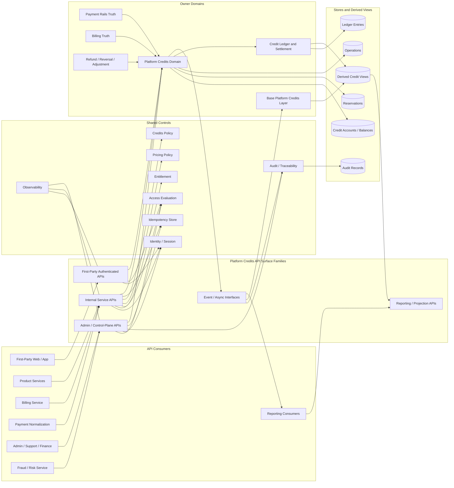
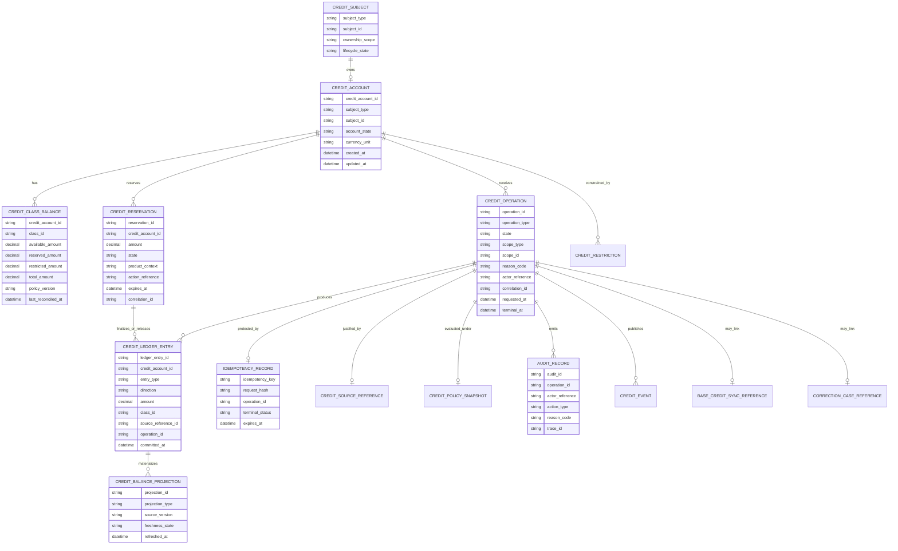
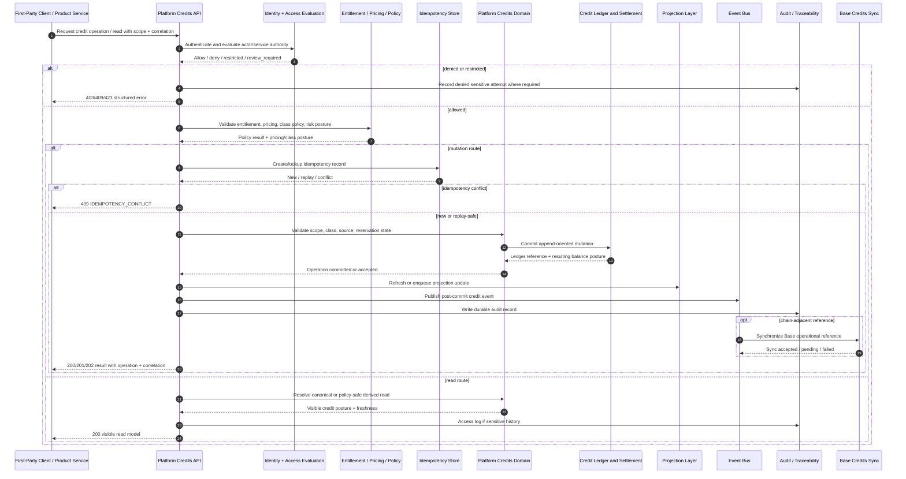

# PLATFORM_CREDITS_API_SPEC.md

## Title
FUZE Platform Credits API Specification

## Document Metadata

- **Document Name:** `PLATFORM_CREDITS_API_SPEC.md`
- **Document Type:** API SPEC v2 / Production-grade interface-contract specification
- **Status:** Draft for canonical API SPEC v2 inclusion
- **Version:** 2.0.0
- **Effective Date:** 2026-04-24
- **Last Updated:** 2026-04-24
- **Reviewed On:** 2026-04-24
- **Document Owner:** FUZE Platform Commerce and Credits API Architecture
- **Approval Authority:** FUZE Platform Architecture and Governance Authority
- **Review Cadence:** Quarterly, and upon material change to platform-credit semantics, credit-ledger posture, payment normalization, billing scope rules, entitlement posture, pricing models, chain-layer commitment posture, fraud/risk controls, or governance-sensitive correction controls
- **Governing Layer:** API contract layer / shared commercial infrastructure / platform credits
- **Parent Registry:** `API_SPEC_INDEX.md`
- **Upstream Semantic Registry:** `REFINED_SYSTEM_SPEC_INDEX.md`
- **Upstream API Registry:** `API_SPEC_INDEX.md`
- **Primary Audience:** Platform API engineering, commerce engineering, credits engineering, ledger engineering, billing engineering, payments engineering, product engineering, frontend engineering, admin/control-plane engineering, audit/compliance, security, finance operations, support operations, data engineering, SDK/OpenAPI/AsyncAPI authors, runtime operations, implementation-contract authors
- **Primary Purpose:** Define the canonical FUZE API contract for querying, issuing, reserving, spending, releasing, reversing, expiring, reassigning, restricting, auditing, and observing Platform Credits without redefining the upstream Platform Credits semantic model or downstream credit-ledger implementation truth.
- **Primary Upstream References:** `REFINED_SYSTEM_SPEC_INDEX.md`; `DOCS_SPEC_INDEX.md`; `SYSTEM_SPEC_INDEX.md`; `API_SPEC_INDEX.md`; `PLATFORM_CREDITS_SPEC.md`; `CREDIT_LEDGER_AND_SETTLEMENT_SPEC.md`; `SUBSCRIPTIONS_AND_USAGE_BILLING_SPEC.md`; `PAYMENT_RAILS_INTEGRATION_SPEC.md`; `INVOICING_AND_RECEIPTS_SPEC.md`; `REFUND_REVERSAL_AND_ADJUSTMENT_SPEC.md`; `PAYMENT_FRAUD_AND_ABUSE_PREVENTION_SPEC.md`; `PRICING_AND_MONETIZATION_MODEL_SPEC.md`; `AI_USAGE_METERING_SPEC.md`; `ENTITLEMENT_AND_CAPABILITY_GATING_SPEC.md`; `ACCESS_EVALUATION_AND_EFFECTIVE_PERMISSION_SPEC.md`; `AUDIT_AND_ACCESS_TRACEABILITY_SPEC.md`; `BASE_PLATFORM_CREDITS_LAYER_SPEC.md`; `ONCHAIN_OFFCHAIN_RESPONSIBILITY_SPEC.md`; `SECURITY_AND_RISK_CONTROL_SPEC.md`; `FUZE_ACCOUNT_ACCESS_AND_SESSION_THESIS_FINAL_SPEC.md`; `FUZE_ACCOUNT_ACCESS_AND_SESSION_CANONICAL_FINAL_SPEC.md`; `FUZE_WORKSPACE_ACCESS_CONTROL_BASICS_THESIS_FINAL_SPEC.md`
- **Primary Downstream Dependents:** `CREDIT_LEDGER_AND_SETTLEMENT_API_SPEC.md`; `SUBSCRIPTIONS_AND_USAGE_BILLING_API_SPEC.md`; `PAYMENT_RAILS_INTEGRATION_API_SPEC.md`; `INVOICING_AND_RECEIPTS_API_SPEC.md`; `REFUND_REVERSAL_AND_ADJUSTMENT_API_SPEC.md`; `PAYMENT_FRAUD_AND_ABUSE_PREVENTION_API_SPEC.md`; `PRICING_AND_MONETIZATION_MODEL_API_SPEC.md`; `AI_USAGE_METERING_API_SPEC.md`; `BASE_PLATFORM_CREDITS_LAYER_API_SPEC.md`; product spend-consumer APIs; OpenAPI specs; AsyncAPI specs; internal service contracts; SDKs; admin/control-plane implementation contracts; support and reconciliation tooling
- **API Surface Families Covered:** First-party authenticated read APIs; first-party availability-check APIs; internal service mutation APIs; internal service canonical-read APIs; admin/control-plane correction APIs; event/async APIs; reporting/projection APIs; chain-adjacent synchronization references
- **API Surface Families Excluded:** Raw payment-provider APIs; full credit-ledger settlement API details; invoice/receipt document APIs; final refund/reversal policy APIs; payout execution APIs; treasury/governance control APIs; unrestricted public transfer APIs; public-market token APIs; final Base contract ABI APIs; product-local pricing tables
- **Canonical System Owner(s):** Platform Credits Domain for semantic credit model; Credit Ledger and Settlement Domain for authoritative ledger mutation and balance derivation; Payment Rails, Billing, Pricing, Entitlement, Authorization, Audit, Fraud/Risk, and Base Credits domains for adjacent truths
- **Canonical API Owner:** Platform Commerce and Credits API Architecture
- **Supersedes:** Earlier `PLATFORM_CREDITS_API_SPEC.md` v1 drafts and weaker API descriptions that conflated credits semantics with payment receipts, billing state, ledger state, invoice truth, token participation, payout state, or product-local balances
- **Superseded By:** Not yet known
- **Related Decision Records:** Not yet known
- **Canonical Status Note:** This API spec expresses the Platform Credits semantics owned by `PLATFORM_CREDITS_SPEC.md` as durable API contracts. It does not redefine the meaning of credits, ledger mutation truth, payment verification truth, billing truth, invoice truth, entitlement truth, authorization truth, token truth, or payout/profit truth.
- **Implementation Status:** Normative API contract baseline; downstream OpenAPI, AsyncAPI, SDK, service, storage, runtime, admin, and testing artifacts must conform
- **Approval Status:** Drafted for API SPEC v2 review
- **Change Summary:** Upgrades the v1 API spec into API SPEC v2 form; separates semantic credits truth from ledger and commercial adjacent truths; hardens scope binding, class policy, issuance, spend, reservation, reversal, reassignment, idempotency, audit, projection, event, chain-adjacent, and operator-control rules; adds diagrams, flow view, acceptance criteria, and test cases.

---

## Purpose

This specification defines the production-grade API contract for FUZE Platform Credits.

Platform Credits are the canonical internal consumption unit of the FUZE ecosystem. The API layer governed here exposes and protects that model through stable contracts for balance visibility, class-aware availability, issuance, reservation, spend, release, reversal, expiry, controlled reassignment, restriction, audit linkage, and event propagation.

This API spec exists to prevent route drift, schema drift, ownership drift, public exposure drift, financial-integrity drift, and product-local reinterpretation of credits. It MUST preserve the upstream refined-system rule that credits are neither raw payment-rail funds, nor invoice state, nor billing truth, nor ledger implementation detail, nor FUZE token, nor profit-participation right, nor treasury balance, nor unrestricted transferable asset.

The API layer owns interface-contract expression only. The upstream refined system specs own semantic truth.

---

## Scope

This API specification governs:

1. First-party authenticated balance, ledger-summary, reservation-summary, class posture, and availability-check APIs.
2. Internal service APIs for issuance, reservation, spend/debit, release, reversal, expiry, internal reassignment, and canonical credit-state reads.
3. Admin/control-plane APIs for bounded support, finance, migration, fraud/risk, and operational correction actions.
4. Request, response, error, result, status, idempotency, replay, retry, audit, event, and observability contracts for Platform Credits APIs.
5. Public, first-party, internal, admin/control-plane, reporting, event/webhook, and chain-adjacent exposure posture.
6. Route/resource family boundaries that downstream OpenAPI, AsyncAPI, SDK, service-contract, and implementation artifacts MUST preserve.
7. Read-model, projection, cache, reporting, and export constraints for credit balances, credit history, class posture, and product-affordability summaries.
8. API-level coordination with authorization, entitlement, billing, pricing, payment normalization, ledger, refund/reversal, fraud/risk, audit, and Base operational credits systems.

---

## Out of Scope

This API specification does not govern:

1. The semantic meaning of a Platform Credit beyond expressing the rules owned by `PLATFORM_CREDITS_SPEC.md`.
2. Full double-entry or append-oriented ledger implementation mechanics owned by `CREDIT_LEDGER_AND_SETTLEMENT_SPEC.md` and `CREDIT_LEDGER_AND_SETTLEMENT_API_SPEC.md`.
3. Raw payment provider, app-store, stablecoin, card, or chain-provider verification contracts.
4. Subscription, billing, invoicing, receipt, tax, revenue-recognition, or accounting-book truth.
5. Final refund, chargeback, dispute, debt-state, or adjustment policy in full depth.
6. Product-specific pricing tables, campaign packages, or local monetization experiments.
7. Product entitlement truth, structural authorization truth, account/session truth, or workspace membership truth.
8. FUZE token participation, snapshot eligibility, payout ledger, treasury, vault, governance, or stablecoin payout execution.
9. Unrestricted public transfer markets for credits.
10. Exact Base smart-contract ABI, chain-write batching implementation, or adapter-specific implementation internals.

---

## Design Goals

1. Provide one stable API contract for the shared FUZE Platform Credits model.
2. Preserve strict separation between credits semantics, credit-ledger truth, payment truth, billing truth, invoice truth, entitlement truth, authorization truth, token truth, and payout/profit truth.
3. Make every economically material API mutation scope-bound, policy-evaluated, idempotent, auditable, and replay-safe.
4. Support both immediate spend and reservation-backed workflows.
5. Support account-scoped and workspace-scoped credit use without ambiguous ownership.
6. Expose product-safe and user-safe read models without allowing derived views to become hidden sources of truth.
7. Enable internal services to consume credits safely while preventing hidden broad-write shortcuts.
8. Enable support/finance/admin correction without permitting undocumented minting, deletion, or lineage rewriting.
9. Support event, projection, reconciliation, and chain-adjacent synchronization without moving semantic ownership out of the Platform Credits domain.
10. Provide enough contract detail for OpenAPI, AsyncAPI, SDK, backend, frontend, worker, data, audit, and QA teams to implement consistently.

---

## Non-Goals

This API spec is not intended to:

1. Create a product-local currency model.
2. Treat payment verification as automatic credits balance.
3. Treat invoice state, subscription state, or entitlement state as credits truth.
4. Treat credit balance as actor authority.
5. Treat credits as token holdings, equity, governance rights, treasury balances, or direct profit-participation rights.
6. Permit admin tooling to mint, destroy, or move credits without documented policy, reason codes, case linkage, audit lineage, and idempotency.
7. Make on-chain or Base state the sole business-level credit truth.
8. Publish broad public APIs or third-party webhooks for sensitive credit history by default.
9. Define final implementation storage schemas in full detail.

---

## Core Principles

### 1. API Expression of Refined Semantic Truth

The API MUST express the Platform Credits model defined by refined system specs. It MUST NOT redefine credit class meaning, ownership posture, issuance categories, spend semantics, transfer restrictions, or policy posture.

### 2. Scope-Bound Credit Operations

Every credit read or mutation MUST bind to an explicit subject scope such as account, workspace, organization, or another approved platform subject. Contextless balances and ambiguous scope mutation are forbidden.

### 3. Credits Do Not Grant Authority

Possessing credits MUST NOT imply that an actor may spend, transfer, administer, or view detailed economic history. Actor authority remains governed by identity, session, workspace, authorization, effective-permission, and operator-control systems.

### 4. Class-Aware Spend Integrity

APIs MUST preserve credit class semantics, including `paid`, `bonus`, `restricted`, and future approved classes. Products MUST consume class policy through contract fields and policy references, not UI labels or local assumptions.

### 5. Ledger-Backed Mutation Integrity

Every economically material credits mutation MUST resolve into ledger-authoritative mutation lineage. API success MUST NOT be based solely on mutable aggregate balance counters or derived views.

### 6. Reservation Is Not Final Spend

Reservation-backed APIs MUST distinguish temporary holds from final consumption. Every reservation MUST terminate through spend, release, expiry, cancellation, or controlled correction.

### 7. Payment Verification Is Not Credits Issuance

External value or provider events MAY justify issuance, but credits become authoritative only after normalized, policy-approved issuance completes through canonical Platform Credits and ledger pathways.

### 8. Derived Views Are Not Owners

Balance summaries, dashboards, product-affordability views, search indexes, analytics exports, and support summaries MAY exist, but they MUST remain derived and MUST NOT authorize cost-bearing mutation by themselves.

### 9. Fail-Closed Economic Safety

If ownership, class validity, spend authority, available balance, entitlement posture, policy state, or ledger mutation safety cannot be determined for a cost-bearing operation, the API MUST deny, return review-required, or accept only into a bounded pending state. It MUST NOT silently approve.

### 10. Bounded Operator Power

Admin/control-plane APIs MUST be explicit, policy-constrained, reason-coded, case-linked where required, idempotent, auditable, and separated from ordinary application APIs.

### 11. Chain-Adjacent Separation

Base operational credits records MAY reflect or synchronize credits posture, but they MUST NOT replace Platform Credits semantic truth or Credit Ledger and Settlement truth.

---

## Canonical Definitions

- **Platform Credit:** The canonical FUZE internal consumption unit representing spendable platform purchasing power inside FUZE.
- **Credit Subject:** The account, workspace, organization, or other approved platform subject to which a credit balance and credit lineage attach.
- **Credit Account:** The API-facing representation of a subject-bound credit-holding context.
- **Credit Class:** A policy-defined class such as `paid`, `bonus`, or `restricted`, with distinct spend, expiry, priority, and restriction posture.
- **Credit Balance:** The current class-aware available, reserved, restricted, pending, and total posture derived from authoritative ledger state.
- **Credit Reservation:** A temporary hold against available credits for a pending action, workflow, fulfillment, or settlement-sensitive operation.
- **Credit Spend / Debit:** Final consumption of credits for an approved product, subscription, workflow, usage, add-on, report, automation, or other platform action.
- **Credit Issuance:** The creation of credits for a subject through an approved, source-linked, policy-governed path.
- **Credit Reversal:** A controlled reduction, unwind, or compensating mutation caused by refund, chargeback, revocation, fraud, expiry, correction, or policy decision.
- **Internal Reassignment:** A controlled lineage-preserving movement or reattachment of credits between approved internal scopes, without creating public transferability.
- **Credit Source Reference:** Stable reference to the verified payment, billing, promotion, migration, support case, enterprise adjustment, or governance-approved event that justifies a credit mutation.
- **Credit Policy Snapshot:** The versioned policy inputs used to evaluate issuance, class validity, spend, expiry, priority, restriction, and reassignment.
- **Product Affordability View:** A derived read model that answers whether a product action appears payable under current policy, subject to revalidation before mutation.
- **Credit Operation Reference:** Stable reference to a mutation request or async operation returned by APIs to track accepted intent and final outcome.

---

## Truth Class Taxonomy

Downstream APIs, services, storage, SDKs, clients, workers, exports, and dashboards MUST preserve the following truth classes:

1. **Canonical Identity Truth** — durable actor and account identity owned by identity/account systems.
2. **Runtime Session Truth** — current authenticated session, privileged session, service principal, and continuity posture.
3. **Collaborative Scope Truth** — workspace, organization, billing-scope, and ownership-scope state.
4. **Structural Authorization Truth** — roles, permissions, scoped grants, billing-owner relations, and operator privileges.
5. **Effective-Permission Truth** — final allow/deny/restricted/review-required result for a concrete actor, action, scope, and resource.
6. **Entitlement Truth** — product and capability eligibility; may consume credits posture but is not replaced by it.
7. **Platform Credits Semantic Truth** — canonical meaning of credits, classes, scopes, issuance categories, spend posture, transfer restrictions, and policy semantics.
8. **Credit Ledger and Settlement Truth** — authoritative mutation lineage, balances from entries, reservation finalization, settlement posture, and reconciliation.
9. **Payment-Rail Truth** — verified external input, normalized payment status, dispute, reversal, chargeback, and provider-origin state.
10. **Billing / Pricing Truth** — subscription state, usage-billing charge state, billing owner, pricing outputs, and commercial obligation logic.
11. **Invoice / Receipt Truth** — billing-document and receipt-document state derived from approved billing and payment outcomes.
12. **Refund / Reversal / Adjustment Truth** — typed correction records, correction status, approval posture, unused/consumed value handling, debt state, and correction lineage.
13. **Fraud / Risk / Policy Truth** — review, containment, block, trust posture, and governance-sensitive controls that may narrow credits use.
14. **Base Operational Credits Truth** — chain-adjacent Base operational representation, synchronization, commitment, and discrepancy posture.
15. **Audit / Traceability Truth** — durable records of who/what/why/when/how for sensitive operations.
16. **Derived Read-Model Truth** — UI displays, dashboards, exports, reports, product-affordability views, and cached projections.
17. **Presentation Truth** — copy, labels, friendly explanations, and UI formatting that do not alter canonical state.

---

## Architectural Position in the Spec Hierarchy

This API spec sits below the refined system specs and expresses their semantics at the API layer. It MUST preserve the canonical rule that `PLATFORM_CREDITS_SPEC.md` owns credit semantics while `CREDIT_LEDGER_AND_SETTLEMENT_SPEC.md` owns ledger mutation and settlement truth.

This API spec sits above:

- OpenAPI path/schema files for Platform Credits.
- AsyncAPI event contracts for Platform Credits.
- Internal service contracts for credit consumers and commerce workers.
- SDKs for first-party clients and internal services.
- Admin/control-plane implementation contracts.
- Runtime workers for credit reservation expiry, reconciliation, projection refresh, and event dispatch.
- Database implementation specs for credit accounts, balances, reservations, operation records, idempotency records, and projections.

This API spec does not override any refined system spec. If this API spec appears to conflict with `PLATFORM_CREDITS_SPEC.md`, the refined semantic spec wins and this API spec MUST be corrected.

---

## Upstream Semantic Owners

The following upstream refined system specs own semantics consumed by this API:

- `PLATFORM_CREDITS_SPEC.md` — meaning of credits, subject attachment, class semantics, issuance categories, spend semantics, expiry, controlled reassignment, transfer restrictions, minimum API/event/audit expectations.
- `CREDIT_LEDGER_AND_SETTLEMENT_SPEC.md` — append-oriented mutation lineage, balance derivation, reservation settlement, ledger reconciliation, settlement posture, correction-lineage requirements.
- `PAYMENT_RAILS_INTEGRATION_SPEC.md` — external payment verification, normalized payment records, payment scope assignment, issuance eligibility, provider/correction signals.
- `SUBSCRIPTIONS_AND_USAGE_BILLING_SPEC.md` — subscription and usage-billing truth, billing owner, billing scope, included usage, overage, and commercial activation logic.
- `PRICING_AND_MONETIZATION_MODEL_SPEC.md` — pricing outputs, charge rules, rate posture, offer/package interpretation.
- `INVOICING_AND_RECEIPTS_SPEC.md` — invoice and receipt document truth, allocation references, document visibility.
- `REFUND_REVERSAL_AND_ADJUSTMENT_SPEC.md` — refund, chargeback, adjustment, debt-state, unused/consumed value, and correction-lineage semantics.
- `PAYMENT_FRAUD_AND_ABUSE_PREVENTION_SPEC.md` — fraud/risk review, containment, holds, risk-aware gating, and operator review posture.
- `ENTITLEMENT_AND_CAPABILITY_GATING_SPEC.md` — eligibility and capability gating that may need credits-aware checks but remains separate from credit balance.
- `ACCESS_EVALUATION_AND_EFFECTIVE_PERMISSION_SPEC.md` — actor authority to view, reserve, spend, administer, or correct credits.
- `AUDIT_AND_ACCESS_TRACEABILITY_SPEC.md` and `AUDIT_LOG_AND_ACTIVITY_API_SPEC.md` — durable audit, traceability, activity, lineage, and visibility rules.
- `BASE_PLATFORM_CREDITS_LAYER_SPEC.md` — Base operational credits representation and chain-adjacent synchronization posture.
- `ONCHAIN_OFFCHAIN_RESPONSIBILITY_SPEC.md` and `CHAIN_ARCHITECTURE_SPEC.md` — chain/off-chain division of responsibility.
- `SECURITY_AND_RISK_CONTROL_SPEC.md` — security, containment, abuse, and operational control constraints.

---

## API Surface Families

### Public API

No broad unauthenticated public Platform Credits API is allowed by default. Public-safe exposure MAY exist only as narrow, aggregated, non-sensitive public-trust reporting governed by public-trust and transparency specs.

### First-Party Authenticated APIs

First-party authenticated APIs allow approved FUZE clients to read visible balances, class posture, derived ledger summaries, reservation summaries, and product-affordability checks for scopes where the actor has access.

### Internal Service APIs

Internal service APIs allow trusted FUZE services to perform canonical credit-affecting actions through least-privilege service identity and actor-on-behalf-of context where applicable.

### Admin / Control-Plane APIs

Admin APIs allow bounded operator actions for correction, review, restriction, release, adjustment, migration, and discrepancy handling. These APIs MUST be separated from user-facing and ordinary internal-service routes.

### Event / Async APIs

Event and async APIs communicate committed credit changes, accepted operation status, projection-refresh signals, reconciliation findings, and downstream synchronization events. Events are synchronization and integration signals, not independent sources of truth.

### Reporting / Projection APIs

Reporting APIs expose derived summaries, reconciliation views, support views, or finance views. They MUST label derived state and MUST NOT become hidden semantic owners.

### Chain-Adjacent APIs

Chain-adjacent APIs MAY expose Base synchronization or commitment references, but MUST preserve the separation between Platform Credits semantic truth, ledger truth, and Base operational truth.

---

## System / API Boundaries

### Governed by This API Spec

- Credit account and scope lookup surfaces.
- Balance and class posture read surfaces.
- Credit availability-check surfaces.
- Issuance command surfaces from verified and approved upstream causes.
- Reservation, spend/debit, release, expiry, reversal, and controlled-reassignment command surfaces.
- Admin/control-plane correction, restriction, suspension, force-release, and discrepancy-resolution surfaces.
- Event, operation status, audit-linkage, idempotency, and observability requirements.

### Governed by Adjacent API Specs

- Credit ledger posting detail, settlement runs, reconciliation algorithms, and settlement-grade reporting: `CREDIT_LEDGER_AND_SETTLEMENT_API_SPEC.md`.
- Subscription lifecycle, usage billing, included usage, overage, and billing-owner changes: `SUBSCRIPTIONS_AND_USAGE_BILLING_API_SPEC.md`.
- Payment intent, provider callback normalization, rail verification, payment-scope assignment: `PAYMENT_RAILS_INTEGRATION_API_SPEC.md`.
- Invoice and receipt document APIs: `INVOICING_AND_RECEIPTS_API_SPEC.md`.
- Refund/reversal/adjustment case and debt-state APIs: `REFUND_REVERSAL_AND_ADJUSTMENT_API_SPEC.md`.
- Entitlement and capability APIs: `ENTITLEMENT_AND_CAPABILITY_GATING_API_SPEC.md`.
- Access evaluation APIs: `ACCESS_EVALUATION_AND_EFFECTIVE_PERMISSION_API_SPEC.md`.
- Base credits operational APIs: `BASE_PLATFORM_CREDITS_LAYER_API_SPEC.md`.

### Governed by Implementation Contracts

- Physical data schemas and indexes.
- Exact OpenAPI schemas and response examples.
- AsyncAPI channel and payload details.
- Per-service retry policies.
- Worker scheduling and queue implementation.
- Storage-engine locking and transaction mechanics.
- Admin UI presentation.

---

## Adjacent API Boundaries

1. **Credit Ledger and Settlement API Boundary:** Platform Credits API may initiate and read business-level credit operations, but ledger API owns append-oriented ledger entries, balance derivation, settlement status, reconciliation, and ledger-grade correction lineage.
2. **Payment Rails API Boundary:** Payment APIs normalize external value and expose issuance eligibility. Platform Credits APIs MUST NOT accept raw provider events as issuance authority.
3. **Billing API Boundary:** Billing APIs decide commercial obligations, plan changes, seat changes, included usage, and overage state. Platform Credits APIs consume billing-approved causes but do not own billing lifecycle.
4. **Pricing API Boundary:** Pricing APIs produce machine-interpretable charge outcomes. Platform Credits APIs consume pricing output, not product-local amount guesses.
5. **Entitlement API Boundary:** Entitlement APIs decide capability eligibility. Credits may be one input, but credits cannot replace entitlement records.
6. **Authorization API Boundary:** Access APIs decide whether an actor may view or spend a subject’s credits. Credit ownership is not actor authority.
7. **Refund/Reversal API Boundary:** Refund and correction APIs decide typed correction posture. Platform Credits APIs execute or expose credits-side effects only through approved correction references.
8. **Fraud/Risk API Boundary:** Risk APIs may hold, block, review, or constrain issuance/spend, but must use canonical credits and ledger pathways for economic mutations.
9. **Base Credits API Boundary:** Base APIs own chain-adjacent operational representation and synchronization status, not off-chain semantic meaning.
10. **Audit API Boundary:** Audit APIs own durable audit record visibility and trace querying. Platform Credits APIs MUST emit and link audit events but do not own the audit store.

---

## Conflict Resolution Rules

1. If this API spec conflicts with `PLATFORM_CREDITS_SPEC.md` on semantic credit meaning, class rules, subject attachment, transfer restrictions, issuance categories, or spend semantics, `PLATFORM_CREDITS_SPEC.md` wins.
2. If this API spec conflicts with `CREDIT_LEDGER_AND_SETTLEMENT_SPEC.md` on ledger mutation lineage, balance derivation, settlement posture, or reconciliation, the ledger spec wins for those matters.
3. If payment provider state conflicts with Platform Credits state, provider state remains provider/input truth until normalized and accepted by the platform.
4. If a derived balance view conflicts with canonical ledger-backed posture, canonical ledger-backed posture wins.
5. If Base operational state conflicts with off-chain semantic and ledger state, the conflict MUST enter reconciliation; Base state does not redefine semantic credits truth.
6. If billing, entitlement, and credits state disagree, each domain retains its own truth and the API MUST expose a restricted, review-required, or fail-closed posture instead of collapsing them into one ambiguous flag.
7. If authorization is uncertain, spend, mutation, detailed history read, and admin action MUST fail closed.
8. If policy version is unknown for a sensitive issuance or spend, the API MUST deny or place the operation into review-required state.
9. If duplicate mutation requests disagree under the same idempotency key, the API MUST return idempotency conflict and MUST NOT create a second business effect.
10. If operator intent conflicts with canonical domain rules, operator action MUST be denied or routed through a documented policy escalation path.

---

## Default Decision Rules

1. **Ambiguous scope:** fail closed.
2. **Missing actor authority:** fail closed.
3. **Missing service permission:** fail closed.
4. **Missing idempotency key for mutation:** reject before mutation.
5. **Missing source reference for issuance:** reject before mutation.
6. **Unverified payment source:** reject or accept into pending verification; do not issue credits.
7. **Insufficient available balance:** reject spend/reservation with distinct insufficient-available error.
8. **Restricted or suspended credit account:** reject ordinary spend and mutation; allow only approved remediation routes.
9. **Class policy mismatch:** reject or return policy-denied; do not silently spend another class unless policy explicitly defines priority.
10. **Stale derived view:** revalidate against canonical posture for cost-bearing action.
11. **Partial finalization:** record final spend and release remainder explicitly.
12. **Correction:** add compensating or superseding records; do not rewrite or delete historical lineage.
13. **Chain synchronization uncertainty:** fail closed for materially sensitive spend unless an approved degraded-mode policy exists.
14. **Public exposure ambiguity:** choose narrower visibility.

---

## Roles / Actors / API Consumers

- **Authenticated Account Actor:** End user viewing or using account-scoped credits through first-party clients.
- **Workspace Member Actor:** User acting within workspace scope; requires workspace authority for reads and spend.
- **Billing Owner / Commercial Controller:** Actor or workspace role authorized to administer or approve credit-affecting commercial actions.
- **Product Service:** Internal FUZE service that checks availability, reserves credits, spends credits, or releases reservations for product actions.
- **Billing Service:** Internal service that may trigger credits issuance, settlement, or usage-billing spend after commercial logic.
- **Payment Normalization Service:** Internal service that produces verified source references or correction signals.
- **Pricing Service:** Internal policy/service layer that returns charge amount, currency/credit unit, and pricing policy version.
- **Entitlement Service:** Internal service that returns eligibility and capability posture.
- **Access Evaluation Service:** Internal service that returns effective permission for reads, spends, and admin actions.
- **Credit Ledger Service:** Internal owner of ledger-authoritative mutation lineage and settlement state.
- **Audit Service:** Durable audit and traceability sink.
- **Projection / Reporting Service:** Derived read-model and export producer.
- **Base Credits Adapter / Synchronization Worker:** Chain-adjacent integration for Base operational credits state.
- **Admin Operator:** Privileged actor using bounded admin/control-plane routes.
- **Fraud/Risk Operator:** Privileged actor or service that may request holds, restrictions, release, or review.
- **Finance / Support Operator:** Privileged actor who may initiate case-linked corrections under policy.

---

## Resource / Entity Families

### API-Facing Resources

- `credit_account`
- `credit_balance_summary`
- `credit_class_balance`
- `credit_availability_evaluation`
- `credit_ledger_summary`
- `credit_reservation`
- `credit_spend`
- `credit_issuance`
- `credit_reversal`
- `credit_expiry`
- `credit_reassignment`
- `credit_account_restriction`
- `credit_operation`
- `credit_source_reference`
- `credit_policy_snapshot`
- `credit_audit_link`
- `credit_projection_status`
- `credit_reconciliation_reference`
- `base_credit_sync_reference`

### Canonical Entities Owned or Mediated by Platform Credits / Ledger Domains

- `credit_accounts`
- `credit_balances`
- `credit_class_balances`
- `credit_ledger_entries`
- `credit_reservations`
- `credit_operations`
- `credit_source_references`
- `credit_policy_snapshots`
- `credit_restrictions`
- `credit_reassignment_records`
- `idempotency_records`
- `credit_projection_records`
- `credit_reconciliation_cases`

### Derived / Projection Resources

- `credit_balance_view`
- `product_credit_availability_view`
- `credit_history_summary_view`
- `support_credit_summary_view`
- `finance_credit_reconciliation_view`
- `public_safe_credit_report_fragment`

---

## Ownership Model

The Platform Credits API domain owns the API expression of credit operations. It does not own every underlying truth. Ownership is divided as follows:

| Concern | Canonical Owner | API Rule |
|---|---|---|
| Meaning of credits and classes | Platform Credits Domain | Expose, do not redefine |
| Credit account scope binding | Platform Credits Domain with Workspace/Account ownership inputs | Require explicit scope |
| Ledger mutation lineage | Credit Ledger and Settlement Domain | Mutations must map to ledger-authoritative records |
| Payment verification | Payment Rails Domain | Consume verified source references only |
| Billing commercial obligation | Billing Domain | Consume billing-approved causes only |
| Pricing amount | Pricing Domain | Consume versioned pricing output |
| Entitlement eligibility | Entitlement Domain | Evaluate separately from credits balance |
| Actor authority | Authorization / Effective Permission Domain | Require effective permission for reads/spend/admin |
| Fraud/risk restriction | Fraud/Risk and Security Domains | Apply as narrowing policy |
| Base operational representation | Base Platform Credits Layer | Expose only references/sync posture here |
| Audit records | Audit and Access Traceability Domain | Emit/link, do not rewrite |
| Derived dashboards/reports | Projection/Reporting layer | Derived only, no mutation ownership |

---

## Authority / Decision Model

1. **Semantic Authority:** `PLATFORM_CREDITS_SPEC.md` controls what credits mean.
2. **Ledger Authority:** Credit Ledger and Settlement controls authoritative mutation recording and balance derivation.
3. **Policy Authority:** Governed policy controls class, expiry, issuance, spend priority, conversion, restriction, reassignment, and operator authority.
4. **Access Authority:** Effective-permission evaluation controls whether an actor or service may act on a subject.
5. **Commercial Authority:** Billing, pricing, payment, invoicing, and refund domains determine upstream commercial causes.
6. **Runtime Authority:** Platform Credits API accepts, validates, coordinates, and returns operation results.
7. **Operator Authority:** Operators may act only through reason-coded, case-linked, audit-bound, policy-approved admin routes.
8. **Chain Authority:** Base layer owns Base operational state, not semantic credit meaning.

---

## Authentication Model

### First-Party Authenticated Routes

MUST require a valid FUZE session and canonical account identity. Session validity alone is not sufficient for workspace spend or sensitive history access.

### Internal Service Routes

MUST require service-to-service authentication with explicit service identity, audience, allowed route family, and least-privilege capability. Calls that act on behalf of a user or workspace MUST carry actor-on-behalf-of context where spend authority matters.

### Admin / Control-Plane Routes

MUST require:

- privileged operator identity;
- privileged-session or step-up posture where required;
- route-specific admin permission;
- reason code;
- case or incident reference where policy requires;
- correlation ID;
- idempotency key for mutation routes.

### Event / Worker Routes

MUST require trusted service identity and signed/verified event or queue context. Worker retries MUST preserve idempotency linkage.

---

## Authorization / Scope / Permission Model

Authorization MUST evaluate:

1. canonical actor identity;
2. authenticated session or service principal;
3. target subject type and ID;
4. workspace role or billing-owner posture where applicable;
5. route family and action type;
6. read vs mutation vs privileged correction;
7. detailed-history visibility vs summary visibility;
8. product/action context for spend;
9. service identity and allowed mutation class;
10. risk/restriction/containment posture;
11. operator scope and reason-code authority.

### Permission Families

- `credits.balance.read`
- `credits.history.read`
- `credits.availability.evaluate`
- `credits.reservation.create`
- `credits.reservation.release`
- `credits.spend.execute`
- `credits.issuance.apply`
- `credits.reversal.apply`
- `credits.expiry.apply`
- `credits.reassignment.apply`
- `credits.restriction.apply`
- `credits.admin.adjust`
- `credits.admin.force_release`
- `credits.admin.restrict`
- `credits.admin.resolve_discrepancy`
- `credits.reporting.read`
- `credits.reconciliation.read`

Possession of one permission MUST NOT imply possession of another.

---

## Entitlement / Capability-Gating Model

Credits and entitlement are adjacent but not interchangeable.

- Credits MAY be required for some capability use.
- Entitlement MAY require sufficient credits posture, but entitlement records remain canonical eligibility truth.
- Credit balance MUST NOT be used as a substitute for entitlement.
- Product capability use that consumes credits MUST verify both entitlement/capability eligibility and credit affordability where policy requires.
- Availability-check APIs MAY include entitlement-aware warnings, but MUST NOT return entitlement decisions as if credits owned them.
- A subject MAY have credits and still be denied use due to missing entitlement, missing permission, risk hold, invalid scope, or product restriction.

---

## API State Model

### Credit Account States

- `active`
- `restricted`
- `suspended`
- `closed`
- `review_required`

### Credit Class States

- `active`
- `restricted`
- `expired`
- `disabled`
- `pending_policy_review`

### Reservation States

- `requested`
- `active`
- `partially_consumed`
- `fully_consumed`
- `released`
- `expired`
- `cancelled`
- `failed`
- `corrected`

### Credit Operation States

- `requested`
- `accepted`
- `validated`
- `committed`
- `projecting`
- `completed`
- `failed`
- `rejected`
- `requires_review`
- `reversed`
- `superseded`

### Issuance States

- `pending_source_verification`
- `source_verified`
- `policy_approved`
- `committed`
- `rejected`
- `reversed`

### Reassignment States

- `requested`
- `approved`
- `committed`
- `rejected`
- `superseded`

### Projection States

- `fresh`
- `stale`
- `refreshing`
- `degraded`
- `unavailable`

---

## Lifecycle / Workflow Model

1. **Source establishment:** Payment, promotion, billing, migration, support, or governance system creates or references a normalized source.
2. **Policy and authority check:** Platform Credits API validates scope, source, class, policy, access, entitlement where relevant, risk posture, and idempotency.
3. **Operation record creation:** Mutation request creates a stable `credit_operation` and idempotency record before economic effect.
4. **Ledger-authoritative mutation:** The API coordinates with ledger domain to commit append-oriented mutation truth.
5. **Balance/projection update:** Canonical aggregate balances and derived read models update synchronously or asynchronously according to route contract.
6. **Event emission:** Post-commit events emit to downstream systems.
7. **Audit emission:** Sensitive reads and all mutations emit durable audit or trace records.
8. **Async finalization:** For accepted async operations, callers poll status or subscribe to events until terminal result.
9. **Reconciliation:** Reconciliation jobs detect and resolve inconsistencies through controlled correction flows.
10. **Correction:** Operators or automated policies create compensating/superseding records, not destructive edits.

---

## Architecture Diagram — Mermaid flowchart

---

## Data Design — Mermaid Diagram

Derived resources such as `CREDIT_BALANCE_PROJECTION` are explicitly non-canonical. They MUST NOT issue, spend, reverse, restrict, or reassign credits.

---

## Flow View

### A. Balance and Class Posture Read

1. Client calls a first-party or internal read route with subject scope.
2. API authenticates actor/session or service principal.
3. API evaluates read permission and visibility level.
4. API resolves canonical credit account and class posture.
5. API returns visible fields only, with projection freshness and correlation ID.
6. Sensitive detailed history reads generate access/audit logs.

### B. Availability Check

1. Caller provides scope, product/action context, amount or pricing reference, and optional class preference.
2. API authenticates and authorizes evaluation.
3. API fetches pricing output when amount is not pre-approved.
4. API checks scope, class policy, available balance, restrictions, entitlement posture, risk posture, and projection freshness.
5. API returns `sufficient`, `insufficient`, `restricted`, `policy_denied`, `requires_review`, or `unavailable` without mutating balance.
6. Cost-bearing actions MUST revalidate before reservation or spend.

### C. Verified Issuance

1. Payment/billing/promotion/migration/support/governance system creates approved source reference.
2. Internal service calls issuance route with source reference, scope, amount, class, reason, policy version, idempotency key, and correlation ID.
3. API authenticates service and validates issuance authority.
4. API verifies source, scope, class, policy, risk, and duplicate-application state.
5. API creates operation and idempotency record.
6. Ledger records issuance entry.
7. Balances/projections update.
8. API emits `CreditsIssued` or class-specific event and audit record.
9. Response returns operation, ledger reference, balances, source linkage, and projection freshness.

### D. Reservation-Backed Spend

1. Product service calls reservation route with actor-on-behalf-of context, subject scope, action reference, amount/pricing reference, class policy, expiry, idempotency key, and correlation ID.
2. API validates service identity, actor authority, entitlement, pricing, policy, balance, risk, and scope.
3. API creates active reservation and ledger-authoritative reservation posture.
4. Product executes pending work.
5. Product finalizes with spend/debit route using reservation ID.
6. API validates reservation state, final amount, policy drift rules, and idempotency.
7. API commits spend; releases unused remainder if partial.
8. Events and audit records emit for reservation, spend, and release.

### E. Release / Expiry

1. Product, worker, or admin calls release or expiry route.
2. API authenticates caller and validates reservation state.
3. API rejects terminal reservations and duplicate release mismatches.
4. API commits release/expiry through ledger and updates balances.
5. API emits event and audit.

### F. Reversal / Adjustment / Correction

1. Refund, chargeback, fraud, support, finance, or migration source creates correction case/reference.
2. Authorized internal or admin caller submits correction action with reason code, case reference, policy version, idempotency key, and correlation ID.
3. API validates source truth, actor/operator authority, unused/consumed value posture, scope, and policy.
4. API creates compensating/superseding operation, never destructive mutation.
5. Ledger records correction effect.
6. API updates restrictions, balances, projections, events, audit, and reconciliation references.
7. Response distinguishes corrected state from original historical state.

### G. Degraded / Failure / Retry

1. If a dependency is unavailable before mutation, API returns safe retryable error or accepted pending state only if policy allows.
2. If failure occurs after operation acceptance but before finalization, operation status remains queryable.
3. Retried requests with same idempotency key return original terminal or pending result.
4. Duplicate requests with different semantic payload under same key return conflict.
5. Reconciliation workers detect stuck operations and route them to controlled remediation.

---

## Data Flows — Mermaid sequenceDiagram

---

## Request Model

### Common Headers

All Platform Credits API requests SHOULD include:

- `X-Request-ID`
- `X-Correlation-ID`
- `X-Trace-ID`
- `Accept: application/json`

All mutation requests MUST include:

- `Idempotency-Key`
- `Content-Type: application/json`

Admin/control-plane mutation requests MUST include or carry in body:

- `reason_code`
- `operator_note` when required
- `case_id` / `incident_id` / `correction_reference` where policy requires
- privileged-session proof where required

### Common Request Fields

Mutation request bodies MUST include, where applicable:

- `scope_type`
- `scope_id`
- `amount`
- `class_id` or `class_selection_policy`
- `source_reference_type`
- `source_reference_id`
- `action_reference`
- `product_context`
- `pricing_reference`
- `entitlement_reference`
- `reservation_id`
- `reason_code`
- `policy_version`
- `actor_on_behalf_of`
- `correlation_id`

### Request Validation Rules

1. Do not accept client-calculated balances as authoritative.
2. Do not accept UI labels as class policy.
3. Do not accept raw provider callback IDs without normalized source references.
4. Do not accept workspace scope mutation without workspace authority context.
5. Do not accept product-local action references without approved service identity.
6. Do not accept negative amounts unless a typed correction route and policy allow the effect through compensating records.
7. Do not accept hidden transfer semantics through reassignment fields.
8. Do not accept mutation routes without idempotency keys.

---

## Response Model

### Common Response Fields

Responses SHOULD include:

- `resource_type`
- stable resource ID
- `state` or `status`
- `scope_type`
- `scope_id`
- `correlation_id`
- `trace_id`
- timestamps
- `policy_version`
- `projection_freshness` where a derived view is returned

### Balance Summary Response

MUST distinguish:

- `available_amount`
- `reserved_amount`
- `restricted_amount`
- `pending_amount` where applicable
- `total_amount`
- `class_breakdown`
- `account_state`
- `last_reconciled_at`
- `source_of_truth`: `canonical`, `derived`, or `projection`

### Mutation Response

MUST include:

- `operation_id`
- `operation_state`
- `ledger_reference` when committed;
- `reservation_id` where applicable;
- `source_reference` where applicable;
- resulting balance posture if available;
- `accepted_at` / `committed_at` / `terminal_at` where applicable;
- event references where available;
- audit reference where policy allows exposure;
- projection-refresh status.

### Accepted Async Response

For `202 Accepted`, response MUST include:

- `operation_id`
- `operation_state: accepted`
- status route or polling reference
- retry guidance
- correlation ID
- no implication of final business success

### Derived Read Response

Derived read responses MUST label derived state and include freshness/lag metadata. Derived views MUST NOT be represented as canonical mutation authority.

---

## Error / Result / Status Model

The API MUST use stable machine-readable error codes with problem-details-compatible response shape.

### Required Error Fields

- `type`
- `title`
- `status`
- `code`
- `detail`
- `instance`
- `correlation_id`
- `retryable`
- `safe_to_retry_with_same_idempotency_key`
- `policy_reference` where safe and applicable

### Authentication / Authorization Errors

- `CREDITS_SESSION_REQUIRED`
- `CREDITS_SERVICE_AUTH_REQUIRED`
- `CREDITS_PERMISSION_DENIED`
- `CREDITS_WORKSPACE_AUTHORITY_REQUIRED`
- `CREDITS_OPERATOR_PERMISSION_DENIED`
- `CREDITS_PRIVILEGED_SESSION_REQUIRED`

### Scope / Ownership Errors

- `CREDITS_SCOPE_REQUIRED`
- `CREDITS_SCOPE_INVALID`
- `CREDITS_SCOPE_AMBIGUOUS`
- `CREDITS_SCOPE_MISMATCH`
- `CREDITS_SUBJECT_CLOSED`

### Balance / Class / Policy Errors

- `CREDITS_INSUFFICIENT_AVAILABLE`
- `CREDITS_CLASS_INVALID`
- `CREDITS_CLASS_RESTRICTED`
- `CREDITS_CLASS_EXPIRED`
- `CREDITS_POLICY_DENIED`
- `CREDITS_POLICY_VERSION_REQUIRED`
- `CREDITS_SPEND_PRIORITY_UNAVAILABLE`

### State Conflict Errors

- `CREDITS_RESERVATION_ALREADY_TERMINAL`
- `CREDITS_RESERVATION_NOT_ACTIVE`
- `CREDITS_SOURCE_ALREADY_APPLIED`
- `CREDITS_OPERATION_ALREADY_TERMINAL`
- `CREDITS_MUTATION_CONFLICT`
- `CREDITS_REASSIGNMENT_FORBIDDEN`

### Source / Commercial Errors

- `CREDITS_SOURCE_REFERENCE_REQUIRED`
- `CREDITS_SOURCE_NOT_VERIFIED`
- `CREDITS_PAYMENT_SCOPE_MISMATCH`
- `CREDITS_BILLING_CAUSE_INVALID`
- `CREDITS_PRICING_REFERENCE_INVALID`
- `CREDITS_REFUND_CORRECTION_REQUIRED`

### Restriction / Risk Errors

- `CREDITS_ACCOUNT_RESTRICTED`
- `CREDITS_ACCOUNT_SUSPENDED`
- `CREDITS_RISK_REVIEW_REQUIRED`
- `CREDITS_CONTAINMENT_ACTIVE`
- `CREDITS_FRAUD_HOLD_ACTIVE`

### Idempotency / Replay Errors

- `CREDITS_IDEMPOTENCY_KEY_REQUIRED`
- `CREDITS_IDEMPOTENCY_REPLAY`
- `CREDITS_IDEMPOTENCY_CONFLICT`
- `CREDITS_DUPLICATE_ACTION_REFERENCE`

### Dependency / Degraded Errors

- `CREDITS_LEDGER_UNAVAILABLE`
- `CREDITS_POLICY_UNAVAILABLE`
- `CREDITS_AUTHORIZATION_UNAVAILABLE`
- `CREDITS_PROJECTION_STALE`
- `CREDITS_RECONCILIATION_REQUIRED`
- `CREDITS_BASE_SYNC_PENDING`

### Status Semantics

- `200 OK` for safe reads and synchronous successful operations.
- `201 Created` for new reservations, issuances, operations, or correction records when synchronously committed.
- `202 Accepted` only for accepted async intent, not final success.
- `400` for malformed requests.
- `401` for missing/invalid authentication.
- `403` for permission denial.
- `409` for state conflicts, idempotency conflicts, duplicate source application, or mutation conflicts.
- `422` for validly formed requests that fail domain validation.
- `423` for restricted, suspended, held, or contained states.
- `429` for rate limits or abuse controls.
- `503` for dependency outage where safe degraded behavior is not available.

---

## Idempotency / Retry / Replay Model

### Required Idempotent Routes

The following MUST be idempotent:

- credit issuance;
- reservation creation;
- spend/debit;
- release;
- expiry;
- reversal;
- internal reassignment;
- admin adjustment;
- account restriction/unrestriction;
- force release;
- discrepancy resolution;
- accepted async operation creation.

### Idempotency Record Requirements

Each idempotency record MUST store:

- idempotency key;
- route family;
- actor/service identity;
- scope;
- request hash;
- semantic action reference;
- operation ID;
- terminal result or pending status;
- created/expires timestamps;
- replay count or equivalent metric;
- correlation ID.

### Retry Rules

1. Retrying the same semantic request with same idempotency key MUST return original pending or terminal result.
2. Retrying the same key with a different semantic request MUST fail with `CREDITS_IDEMPOTENCY_CONFLICT`.
3. Network failure after operation acceptance MUST be recoverable by operation status route.
4. Workers MUST preserve operation ID and idempotency linkage across retries.
5. Provider or event replays MUST NOT produce duplicate issuance, spend, reversal, or adjustment.

---

## Rate Limit / Abuse-Control Model

Platform Credits APIs are economic and abuse-sensitive.

1. First-party balance reads MAY be rate-limited per actor, subject, workspace, and client.
2. Availability checks MUST be rate-limited by actor, subject, product context, and service where high-volume checks could leak or degrade economic posture.
3. Mutation routes MUST be rate-limited and quota-controlled per service identity, subject, and operation family.
4. Admin/control-plane routes MUST use stricter throttles, anomaly detection, and policy gates.
5. Repeated insufficient-balance, invalid-scope, or denied-spend attempts SHOULD trigger risk signals.
6. Rate-limit responses MUST not leak sensitive balance or account state.
7. Abuse controls MUST not create hidden successful or partial economic effects.

---

## Endpoint / Route Family Model

This section defines route families and required contract posture. Final OpenAPI files may refine path names, but MUST preserve these families and semantics.

### First-Party Authenticated Read and Evaluation Routes

| Route Family | Method | Purpose | Mutation | Canonical / Derived |
|---|---:|---|---|---|
| `/v1/credits/me` | GET | Current account-scoped credit summary | No | Canonical summary or labeled derived projection |
| `/v1/workspaces/{workspace_id}/credits` | GET | Workspace credit summary | No | Canonical summary or labeled derived projection |
| `/v1/credits/{credit_account_id}` | GET | Credit account summary where visible | No | Canonical summary |
| `/v1/credits/{credit_account_id}/classes` | GET | Class-aware posture | No | Canonical summary |
| `/v1/credits/{credit_account_id}/ledger-summary` | GET | Visible ledger summary | No | Derived/filtered from ledger truth |
| `/v1/credits/{credit_account_id}/reservations` | GET | Visible reservations | No | Canonical reservation summary |
| `/v1/credits/availability-checks` | POST | Product-safe affordability and policy check | No economic mutation | Evaluation result; not spend authorization |
| `/v1/credits/operations/{operation_id}` | GET | Operation status | No | Operation truth |

First-party APIs MUST not expose sensitive ledger detail beyond actor visibility policy.

### Internal Service Mutation Routes

| Route Family | Method | Purpose | Idempotency | Notes |
|---|---:|---|---|---|
| `/internal/v1/credits/issuances` | POST | Apply verified issuance | Required | Requires verified source reference |
| `/internal/v1/credits/reservations` | POST | Create reservation | Required | Requires scope, amount, product/action context |
| `/internal/v1/credits/spends` | POST | Finalize spend/debit | Required | Reservation strongly preferred |
| `/internal/v1/credits/releases` | POST | Release reservation | Required | Must not over-release |
| `/internal/v1/credits/expirations` | POST | Expire eligible credits/reservations | Required | Class-policy controlled |
| `/internal/v1/credits/reversals` | POST | Apply approved reversal | Required | Requires correction/source reference |
| `/internal/v1/credits/reassignments` | POST | Controlled internal reassignment | Required | Not public transfer |
| `/internal/v1/credits/scopes/{scope_type}/{scope_id}` | GET | Canonical internal read | No | Least-privilege service read |
| `/internal/v1/credits/operations/{operation_id}` | GET | Operation read | No | Service visibility policy |

Internal service APIs MUST NOT become hidden broad-write shortcuts. Every service permission MUST be route- and operation-family scoped.

### Admin / Control-Plane Routes

| Route Family | Method | Purpose | Idempotency | Required Controls |
|---|---:|---|---|---|
| `/admin/v1/credits/adjustments` | POST | Manual adjustment | Required | Reason, case, operator note, audit |
| `/admin/v1/credits/reservations/{reservation_id}/force-release` | POST | Force release stuck reservation | Required | Reason, case, audit |
| `/admin/v1/credits/accounts/{credit_account_id}/restrict` | POST | Restrict credit account | Required | Reason, policy, audit |
| `/admin/v1/credits/accounts/{credit_account_id}/unrestrict` | POST | Remove restriction | Required | Reason, approval, audit |
| `/admin/v1/credits/reassignments` | POST | Controlled scope migration/correction | Required | Case, approval, lineage |
| `/admin/v1/credits/discrepancy-resolutions` | POST | Resolve discrepancy | Required | Case, reconciliation reference, audit |
| `/admin/v1/credits/reconciliation-cases/{case_id}` | GET | Case-linked credit state | No | Privileged read |

Admin routes MUST never rewrite historical ledger truth. They MUST create compensating, superseding, or restriction records.

### Reporting / Projection Routes

| Route Family | Method | Purpose | Canonicality |
|---|---:|---|---|
| `/internal/v1/credits/reports/balances` | GET | Operational balance report | Derived |
| `/internal/v1/credits/reports/reconciliation` | GET | Reconciliation summary | Derived from ledger/reconciliation truth |
| `/internal/v1/credits/reports/activity` | GET | Activity and support view | Derived/filterable |
| `/internal/v1/credits/projections/status` | GET | Projection status | Operational |

Reporting routes MUST include freshness metadata and MUST not be used for cost-bearing decisions without canonical revalidation.

---

## Public API Considerations

No broad public Platform Credits API is approved by this spec.

Public exposure, where allowed by future public-trust specs, MUST be:

- narrow;
- aggregate or explicitly subject-authorized;
- privacy-safe;
- non-sensitive;
- stable;
- separated from mutation routes;
- unable to expose detailed economic history, payment provenance, operator notes, risk state, or support case linkage.

Third-party public APIs MUST NOT issue, spend, reverse, reassign, restrict, or administer Platform Credits unless a future explicit approved API spec creates such a surface.

---

## First-Party Application API Considerations

First-party clients MAY:

- show balance summaries;
- show class-aware visible posture where policy allows;
- show reservation summaries;
- show filtered ledger/history summaries;
- request non-mutating availability checks;
- poll operation status for user-initiated actions.

First-party clients MUST NOT:

- compute authoritative credit balances;
- decide class spend order locally;
- infer entitlement from credits balance;
- infer spend authority from membership alone;
- show stale projections as guaranteed spendable balance;
- trigger mutation without backend revalidation;
- expose operator notes, hidden risk reasons, raw provider identifiers, or sensitive source references.

---

## Internal Service API Considerations

Internal services MAY reserve, spend, release, issue, reverse, expire, or reassign credits only when specifically authorized for that operation family.

Internal service requests MUST preserve:

- service identity;
- actor-on-behalf-of context where relevant;
- target subject scope;
- product/action context;
- pricing reference;
- entitlement/capability reference where relevant;
- source/correction reference where relevant;
- idempotency key;
- correlation/trace identifiers;
- policy version.

Internal service APIs MUST fail closed if they cannot determine scope, authority, policy, class validity, balance sufficiency, risk posture, or source validity.

---

## Admin / Control-Plane API Considerations

Admin/control-plane APIs are privileged but not sovereign.

They MUST:

1. require privileged operator identity and privileged session where required;
2. enforce least-privilege route-level authorization;
3. require reason codes and operator notes where policy requires;
4. require case, incident, risk, finance, support, or reconciliation reference for sensitive actions;
5. create durable audit records;
6. create explicit operation records;
7. preserve immutable lineage;
8. use idempotency for all mutations;
9. expose bounded results;
10. prevent hidden minting or deletion.

They MUST NOT:

1. mutate balances outside canonical ledger-backed pathways;
2. erase ledger history;
3. bypass risk, fraud, governance, or policy controls;
4. create unscoped credits;
5. create public transfer semantics;
6. act as a general-purpose write surface for product teams.

---

## Event / Webhook / Async API Considerations

### Internal Events

The Platform Credits API domain MUST emit post-commit events such as:

- `CreditsIssued`
- `BonusCreditsIssued`
- `CreditsAdjusted`
- `CreditsReserved`
- `CreditsSpent`
- `CreditsReleased`
- `CreditsReversed`
- `CreditsRefunded`
- `CreditsExpired`
- `CreditsReassignedInternally`
- `CreditAccountRestricted`
- `CreditAccountUnrestricted`
- `CreditClassPolicyUpdated`
- `CreditsPolicyHashUpdated`
- `CreditsProjectionRefreshed`
- `CreditsReconciliationRequired`
- `CreditsDiscrepancyResolved`

### Event Payload Minimums

Events MUST carry:

- event ID;
- event type;
- occurred timestamp;
- operation ID;
- credit account ID;
- scope type and scope ID;
- class ID where applicable;
- amount where applicable;
- source/correction/reservation reference where applicable;
- policy version;
- actor/service reference;
- correlation ID;
- trace ID;
- reason code where applicable.

### Event Rules

1. Events MUST be emitted after canonical commit or with explicit accepted-state status.
2. Events MUST be idempotent for consumers.
3. Events MUST be ordered or versioned per credit account where ordering matters.
4. Consumers MUST treat events as synchronization signals, not independent credit truth.
5. External webhooks for raw credit mutations are not approved by default.
6. Any future external webhook must be narrow, privacy-reviewed, financially safe, and governed by explicit contract.

---

## Chain-Adjacent API Considerations

Platform Credits may have Base operational representation or commitment linkage, but this API spec preserves the following:

1. Off-chain Platform Credits semantic truth remains owned by Platform Credits domain.
2. Ledger mutation truth remains owned by Credit Ledger and Settlement domain.
3. Base operational truth remains chain-adjacent and must be reconciled to platform truth.
4. Base sync references MAY appear in operation responses where safe.
5. Base synchronization failure MUST NOT silently convert into successful final business state if reconciliation is required.
6. Product spend approval SHOULD fail closed for materially sensitive actions when chain synchronization status is required and unavailable.
7. Credits MUST NOT become unrestricted public-market transfer assets through chain-adjacent route design.

---

## Data Model / Storage Support Implications

Implementation storage MUST support, at minimum:

- subject-bound credit accounts;
- class-aware balances;
- reservations;
- operation records;
- idempotency records;
- source references;
- policy snapshots;
- ledger references;
- restriction records;
- reassignment records;
- correction case links;
- audit links;
- event outbox records;
- projection records;
- reconciliation references;
- Base sync references where applicable.

Storage implementation MUST preserve:

1. immutable ledger lineage;
2. non-negative balance constraints unless explicit policy supports debt or correction state through separate records;
3. unique source application for issuance/reversal;
4. unique action references where required;
5. reservation finalization safety;
6. idempotency-key conflict detection;
7. explicit scope binding;
8. audit correlation;
9. policy version linkage;
10. projection freshness metadata.

---

## Read Model / Projection / Reporting Rules

1. Derived balance views MAY support UX and low-risk reads.
2. Sensitive or cost-bearing paths MUST revalidate against canonical posture.
3. Product-affordability views MUST be labeled as evaluations and MUST NOT reserve or spend.
4. Reporting views MUST include freshness, generation time, source range, and projection state.
5. Support and finance views MAY expose richer history only under privileged authorization.
6. Public-safe reports MUST remove sensitive actor, provider, source, operator, risk, and support-case details.
7. Projection lag MUST NOT allow revoked, expired, restricted, suspended, or exhausted credits to be used.
8. Exports MUST distinguish canonical rows from derived summaries.
9. Caches MUST be invalidated or bypassed for mutations.
10. Reporting APIs MUST NOT become hidden mutation inputs.

---

## Security / Risk / Privacy Controls

The API MUST enforce:

1. strong service identity for internal routes;
2. privileged-session posture for high-risk admin actions;
3. least-privilege permissions;
4. scope-aware authorization;
5. fraud/risk containment and review states;
6. policy-bound issuance authority;
7. operator reason codes and case linkage;
8. masking of sensitive provider/source details;
9. protection against balance enumeration;
10. no leakage of operator notes to ordinary users;
11. no raw provider secrets, chain signing materials, or payment tokens in API responses;
12. anomaly detection for repeated failed spend/availability attempts;
13. emergency restriction or suspension pathways;
14. privacy-safe exports and reporting.

---

## Audit / Traceability / Observability Requirements

### Audit-Required Actions

- issuance;
- reservation;
- spend/debit;
- release;
- expiry;
- reversal;
- internal reassignment;
- admin adjustment;
- restriction/unrestriction;
- force release;
- discrepancy resolution;
- sensitive history reads;
- failed privileged attempts;
- policy changes affecting class, priority, expiry, or issuance authority.

### Required Audit Fields

- audit ID;
- operation ID;
- actor/service identity;
- actor-on-behalf-of reference;
- scope type and ID;
- credit account ID;
- action type;
- amount/class where applicable;
- source/correction/reservation reference;
- before/after summary where safe and applicable;
- reason code;
- policy version;
- idempotency key hash/reference;
- correlation ID;
- trace ID;
- request timestamp;
- result status;
- operator note where applicable.

### Observability

APIs MUST emit metrics and traces for:

- mutation latency;
- ledger commit latency;
- projection lag;
- idempotency replay/conflict count;
- insufficient-balance and policy-denial rates;
- restricted/suspended route attempts;
- admin action counts;
- event dispatch latency/failure;
- reconciliation discrepancies;
- Base sync pending/failure;
- dependency outage and degraded-mode counts.

---

## Failure Handling / Edge Cases

1. **Duplicate source issuance:** return `CREDITS_SOURCE_ALREADY_APPLIED`; do not reissue.
2. **Reservation finalization race:** use operation and ledger state to ensure single finalization.
3. **Partial spend:** final spend and release remainder explicitly.
4. **Expired reservation:** reject spend unless policy-approved recovery route exists.
5. **Wrong scope:** reject and audit if sensitive.
6. **Class mismatch:** reject or apply explicit policy priority; never guess.
7. **Payment later reversed:** route through refund/reversal/correction; do not delete original issuance.
8. **Consumed value after reversal:** create correction/debt/restriction posture through correction domain; do not pretend unused balance exists.
9. **Projection stale:** read may return stale label; mutation must revalidate.
10. **Ledger unavailable before mutation:** return retryable dependency error.
11. **Failure after accepted operation:** expose operation status and reconcile.
12. **Base sync failure:** mark sync pending/failed; route to reconciliation if material.
13. **Admin unsupported correction:** deny or require governance escalation.
14. **Negative balance:** forbidden unless explicit correction/debt policy supports separate debt state.
15. **Public history request:** return only policy-approved visible fields.
16. **Risk containment:** block ordinary spend and mutation; allow only remediation routes.

---

## Migration / Versioning / Compatibility / Deprecation Rules

1. API versioning MUST use explicit route family versioning such as `/v1`, `/internal/v1`, and `/admin/v1`.
2. Additive fields are preferred.
3. Existing field meanings MUST NOT change silently.
4. Breaking changes include changes to available/reserved/total meanings, class semantics, reservation lifecycle, idempotency behavior, source-reference rules, correction semantics, and visibility rules.
5. Deprecations MUST include migration notes, compatibility windows, and downstream SDK/OpenAPI update guidance.
6. v1 API semantics that conflict with refined system semantics MUST be superseded by API SPEC v2.
7. Migrating existing credits records MUST preserve historical lineage and source references.
8. Migration grants or corrections MUST be typed, reason-coded, auditable, and distinguishable from paid issuance.
9. OpenAPI clients MUST tolerate additive response fields but MUST not infer new states without schema updates.
10. Async event consumers MUST handle unknown event fields and new event types safely.

---

## OpenAPI / AsyncAPI / SDK Derivation Rules

### OpenAPI

OpenAPI artifacts MUST preserve:

- route-family separation;
- authentication requirements;
- idempotency headers;
- stable enums;
- problem-details error shape;
- operation status objects;
- canonical vs derived read labels;
- visibility constraints;
- deprecation metadata;
- no broad public mutation routes.

### AsyncAPI

AsyncAPI artifacts MUST preserve:

- post-commit event semantics;
- idempotent consumer guidance;
- operation ID and correlation ID;
- scope and credit account identifiers;
- source/reference fields;
- event ordering/versioning requirements;
- no event-as-owner semantics.

### SDKs

SDKs MUST:

- expose safe typed clients per surface family;
- require idempotency keys for mutations;
- expose operation polling helpers;
- avoid hiding `202 Accepted` vs final success;
- surface structured error codes;
- prevent client-side authoritative balance computation;
- distinguish first-party read models from internal/admin mutation clients.

---

## Implementation-Contract Guardrails

1. Do not implement direct SQL or storage mutations outside domain services.
2. Do not implement product-local credit balances with shared platform meaning.
3. Do not implement admin “mint credits” shortcuts.
4. Do not infer credits from payment receipts, invoice status, plan labels, token holdings, or UI toggles.
5. Do not allow raw provider callbacks to issue credits.
6. Do not allow derived projections to authorize spend.
7. Do not allow support tools to delete, rewrite, or hide ledger history.
8. Do not collapse entitlement, authorization, and credits into a single `can_use` flag.
9. Do not bypass class policy for convenience.
10. Do not ignore actor-on-behalf-of context in workspace spend.
11. Do not use Base state to override platform semantic or ledger truth.
12. Do not emit events before commit unless the event explicitly represents accepted/pending intent.
13. Do not expose sensitive economic history through public or weakly authorized endpoints.
14. Do not make idempotency optional for mutation routes.
15. Do not silently convert failed or disputed payments into usable credits.

---

## Downstream Execution Staging

1. **Stage 1 — Contract Baseline:** Align OpenAPI, AsyncAPI, internal service permissions, and operation/status models to this spec.
2. **Stage 2 — Canonical Reads:** Implement subject-bound balance, class posture, reservation, operation, and filtered ledger-summary reads.
3. **Stage 3 — Internal Mutations:** Implement issuance, reservation, spend, release, expiry, reversal, reassignment, and idempotency records with ledger-backed commits.
4. **Stage 4 — Admin Controls:** Implement correction, restriction, force-release, discrepancy-resolution, and audit-heavy admin flows.
5. **Stage 5 — Events and Projections:** Implement post-commit events, projection freshness, reporting views, and reconciliation signals.
6. **Stage 6 — Chain-Adjacent Integration:** Link to Base operational credits synchronization without moving semantic ownership.
7. **Stage 7 — Contract Validation:** Add positive, negative, idempotency, authorization, projection, event, migration, and degraded-mode tests.

---

## Required Downstream Specs / Contract Layers

- OpenAPI: Platform Credits public/first-party route schemas.
- OpenAPI: Platform Credits internal service route schemas.
- OpenAPI: Platform Credits admin/control-plane route schemas.
- AsyncAPI: Platform Credits event families.
- Service contract: credits ledger commit adapter.
- Service contract: pricing and entitlement check adapters.
- Service contract: payment source reference adapter.
- Service contract: refund/reversal correction adapter.
- Service contract: Base credits synchronization adapter.
- Database schema contract: credit accounts, class balances, reservations, operations, source references, idempotency, projections, restrictions.
- QA contract: deterministic idempotency, retry, concurrency, authorization, restriction, and migration tests.
- Runbook: reconciliation, projection lag, stuck reservation, duplicate source, and admin correction remediation.

---

## Boundary Violation Detection / Non-Canonical API Patterns

The following are forbidden patterns:

1. `POST /credits/mint` without source, policy, reason, and ledger lineage.
2. Product-local balance tables that users or services treat as Platform Credits.
3. Public or third-party routes that expose raw ledger history by default.
4. A UI field named `credits` treated as canonical balance.
5. Payment success webhook directly increasing balance without normalized source and issuance operation.
6. Invoice paid status directly treated as spendable credits.
7. Entitlement enabled solely because available credits are positive.
8. Workspace member allowed to spend workspace credits without effective-permission evaluation.
9. Admin adjustment without idempotency key, reason code, case link, and audit.
10. Force release that restores more credits than reserved.
11. Reservation consumed twice.
12. Reversal implemented by deleting prior issuance.
13. Derived dashboard export used as settlement truth.
14. Base chain state used as sole credit truth.
15. Credits reassignment exposed as free transfer.
16. Error messages that collapse insufficient balance, restriction, missing permission, invalid class, and policy block into one indistinguishable failure internally.

---

## Canonical Examples / Anti-Examples

### Example: Valid Workspace Spend

A product service requests reservation against `workspace_id=ws_123` with actor-on-behalf-of `account_id=acct_1`, pricing reference `price_run_456`, entitlement reference `ent_eval_789`, and idempotency key. The API validates workspace spend authority, entitlement, class policy, available balance, and risk posture before reserving. The reservation later finalizes into spend and emits `CreditsSpent`.

### Anti-Example: Membership-Only Spend

A frontend sees that a user is a workspace member and sends a direct spend request. The API MUST reject because membership alone does not prove billing/spend authority and frontend cannot perform canonical mutation.

### Example: Verified Payment Issuance

Payment Rails emits a normalized verified payment source. Billing/commercial policy approves credits issuance. Internal service calls issuance API with source reference, class `paid`, policy version, reason code, scope, and idempotency key. Credits issue only after source and policy validation.

### Anti-Example: Raw Provider Webhook Issuance

A provider callback directly increments credits. This is forbidden. Provider truth must be normalized into platform payment truth and then approved for issuance through canonical credits APIs.

### Example: Partial Reservation Finalization

A workflow reserves 100 credits, consumes 70, and releases 30. API records spend and release as explicit lineage, emits both events where required, and updates projection freshness.

### Anti-Example: Best-Effort Ambiguous Scope

A product cannot decide between account and workspace balance and charges whichever has enough credits. This is forbidden. Ambiguous scope MUST fail closed.

### Example: Admin Correction

Support resolves an incorrectly scoped migration grant through admin reassignment with case ID, reason code, operator note, idempotency key, and audit record. The API creates compensating lineage and does not delete the original grant.

### Anti-Example: Admin Rewrite

An operator edits `available_amount` directly to fix a complaint. This is forbidden. Corrections must use ledger-backed compensating or superseding operations.

---

## Acceptance Criteria

1. The API rejects all mutation requests missing `Idempotency-Key` before any economic effect occurs.
2. A duplicate issuance using the same verified source reference does not create additional credits.
3. A duplicate mutation with the same idempotency key and same request returns the same terminal or pending result.
4. A duplicate mutation with the same idempotency key and different request returns an idempotency conflict.
5. Account and workspace scopes remain distinguishable in every read, mutation, event, audit, and projection response.
6. A workspace credit spend is denied when the actor lacks effective permission, even if the workspace has sufficient credits.
7. Credit availability checks do not mutate balance, create reservations, or imply final spend approval.
8. Cost-bearing mutation routes revalidate stale projection data against canonical posture.
9. Issuance requires a verified source reference, class, subject scope, reason code, policy version, and authorized caller.
10. Reservation creation reduces available posture and creates reservation lineage without final spend.
11. Reservation spend cannot consume more than reserved amount unless explicit policy supports a validated supplemental debit.
12. Reservation release cannot restore more than currently reserved.
13. Terminal reservations cannot be spent or released again.
14. Partial finalization records both settled spend and released remainder.
15. Reversal and correction create compensating or superseding lineage rather than deleting original history.
16. Admin adjustments require privileged operator identity, route-level permission, reason code, case/reference where required, idempotency key, and audit record.
17. Product services cannot issue, reverse, reassign, or restrict credits unless explicitly authorized for those mutation classes.
18. Derived balance, reporting, and product-affordability views are labeled with freshness and source-of-truth posture.
19. Public or weakly authorized routes do not expose sensitive ledger detail, provider source detail, operator notes, risk state, or correction case data.
20. Events are emitted only after commit or are explicitly labeled accepted/pending.
21. Event payloads include operation ID, scope, credit account ID, class where applicable, source/correlation references, and policy version.
22. Audit records are generated for all sensitive mutations and privileged reads.
23. Failure after accepted operation leaves a queryable operation status.
24. Ledger unavailability before mutation returns a safe error and does not create hidden partial effect.
25. Base sync pending/failure is exposed as chain-adjacent status and does not redefine credit semantics.
26. Error codes distinguish insufficient balance, invalid class, invalid scope, policy block, missing permission, risk restriction, and unverified source.
27. Migration from v1 routes preserves lineage and does not alter the meaning of available/reserved/total balances.
28. OpenAPI and SDK outputs preserve route-family separation and do not expose internal/admin clients through public-safe packages.

---

## Test Cases

### Positive Path Tests

1. **Read account balance:** Authenticated actor reads own account credits and receives visible balance, class posture, projection freshness, and correlation ID.
2. **Read workspace balance:** Authorized workspace billing actor reads workspace credits; unauthorized member receives permission denial.
3. **Availability check sufficient:** Product action evaluates sufficient credits without mutation; subsequent reservation still revalidates.
4. **Verified paid issuance:** Internal service issues `paid` credits from verified payment source and receives ledger reference, balance update, event, and audit.
5. **Bonus issuance:** Approved promotion service issues `bonus` credits with class policy and expiry metadata.
6. **Reservation and spend:** Product service reserves credits and later spends full reservation exactly once.
7. **Partial spend and release:** Product reserves 100, spends 60, releases 40, and ledger/projection reflect both effects.
8. **Admin force release:** Privileged operator force releases stuck reservation with case link and audit.
9. **Controlled reassignment:** Admin migrates credits from account to workspace through approved reassignment with full source/destination lineage.
10. **Operation polling:** A `202 Accepted` issuance returns operation ID; polling transitions from accepted to completed.

### Negative / Boundary Tests

11. **Missing idempotency:** Mutation without key returns `CREDITS_IDEMPOTENCY_KEY_REQUIRED` and no operation.
12. **Idempotency conflict:** Same key with different amount returns conflict and no second effect.
13. **Duplicate source:** Same verified payment source cannot issue twice.
14. **Unverified source:** Issuance from unverified payment source is rejected.
15. **Wrong scope:** Workspace spend request using account-scoped authorization is rejected.
16. **Missing permission:** Actor with session but no spend permission cannot spend workspace credits.
17. **Insufficient balance:** Reservation request for amount above available returns `CREDITS_INSUFFICIENT_AVAILABLE`.
18. **Invalid class:** Spend requiring paid credits cannot use restricted credits unless policy allows.
19. **Restricted account:** Ordinary spend on restricted credit account returns `CREDITS_ACCOUNT_RESTRICTED`.
20. **Terminal reservation:** Attempt to spend released reservation returns `CREDITS_RESERVATION_ALREADY_TERMINAL`.
21. **Over-release:** Release request greater than reserved amount fails.
22. **Admin no reason:** Admin adjustment without reason code or case reference is rejected.
23. **Public route leakage:** Public or ordinary user route cannot access operator notes, risk flags, raw source details, or full ledger data.
24. **Derived-view mutation:** Attempt to spend using projection-only balance without revalidation is rejected by contract test.

### Retry / Concurrency / Failure Tests

25. **Network retry:** Client retries after timeout with same idempotency key and receives same operation result.
26. **Concurrent spend race:** Two concurrent reservations against same balance cannot overspend.
27. **Ledger outage:** Reservation request during ledger outage returns safe error or accepted pending only under approved policy.
28. **Projection lag:** Balance read shows stale projection; spend route revalidates canonical state.
29. **Event replay:** Replayed `CreditsIssued` event does not create duplicate downstream effect.
30. **Worker retry:** Expiry worker retries same operation and returns original terminal result.

### Audit / Observability Tests

31. **Audit mutation:** Issuance, spend, release, reversal, reassignment, and admin adjustment each create durable audit record.
32. **Privileged read audit:** Admin history read creates access trace without exposing ordinary-user-only fields.
33. **Correlation propagation:** Request ID, correlation ID, trace ID, operation ID, ledger ID, event ID, and audit ID are linkable.
34. **Metrics:** Mutations emit latency, success/failure, idempotency, and projection-lag metrics.

### Migration / Compatibility Tests

35. **v1 compatibility:** Existing v1 balance fields map to v2 response without changing available/reserved/total meaning.
36. **Unknown response fields:** Client tolerates additive fields.
37. **Deprecated route:** Deprecated v1 route returns deprecation metadata while preserving compatibility window.
38. **Class expansion:** New credit class appears only after policy and schema support; old clients treat it safely.

### Chain-Adjacent Tests

39. **Base sync pending:** Operation committed off-chain but Base sync pending reports pending without changing semantic truth.
40. **Base mismatch:** Base operational mismatch creates reconciliation reference and does not allow product to override platform credits truth.

---

## Dependencies / Cross-Spec Links

- `PLATFORM_CREDITS_SPEC.md`
- `CREDIT_LEDGER_AND_SETTLEMENT_SPEC.md`
- `CREDIT_LEDGER_AND_SETTLEMENT_API_SPEC.md`
- `SUBSCRIPTIONS_AND_USAGE_BILLING_SPEC.md`
- `SUBSCRIPTIONS_AND_USAGE_BILLING_API_SPEC.md`
- `PAYMENT_RAILS_INTEGRATION_SPEC.md`
- `PAYMENT_RAILS_INTEGRATION_API_SPEC.md`
- `INVOICING_AND_RECEIPTS_SPEC.md`
- `INVOICING_AND_RECEIPTS_API_SPEC.md`
- `REFUND_REVERSAL_AND_ADJUSTMENT_SPEC.md`
- `REFUND_REVERSAL_AND_ADJUSTMENT_API_SPEC.md`
- `PAYMENT_FRAUD_AND_ABUSE_PREVENTION_SPEC.md`
- `PRICING_AND_MONETIZATION_MODEL_SPEC.md`
- `ENTITLEMENT_AND_CAPABILITY_GATING_SPEC.md`
- `ENTITLEMENT_AND_CAPABILITY_GATING_API_SPEC.md`
- `ACCESS_EVALUATION_AND_EFFECTIVE_PERMISSION_API_SPEC.md`
- `AUDIT_AND_ACCESS_TRACEABILITY_API_SPEC.md`
- `BASE_PLATFORM_CREDITS_LAYER_SPEC.md`
- `BASE_PLATFORM_CREDITS_LAYER_API_SPEC.md`
- `API_ARCHITECTURE_SPEC.md`
- `PUBLIC_API_SPEC.md`
- `INTERNAL_SERVICE_API_SPEC.md`
- `EVENT_MODEL_AND_WEBHOOK_SPEC.md`
- `IDEMPOTENCY_AND_VERSIONING_SPEC.md`
- `MIGRATION_AND_BACKWARD_COMPATIBILITY_SPEC.md`
- `SECURITY_AND_RISK_CONTROL_SPEC.md`
- `ONCHAIN_OFFCHAIN_RESPONSIBILITY_SPEC.md`
- `CHAIN_ARCHITECTURE_SPEC.md`

---

## Explicitly Deferred Items

1. Exact OpenAPI schema files.
2. Exact AsyncAPI channel definitions and payload schemas.
3. Exact database DDL and indexing strategy.
4. Exact ledger posting implementation.
5. Exact Base contract ABI and chain transaction batching.
6. Exact pricing schedules and product-local charge tables.
7. Exact fraud/risk scoring model.
8. Exact support/admin UI layout.
9. Exact public-transparency credit reporting shape.
10. Exact accounting, tax, and revenue-recognition integration.

Deferred items MUST conform to this API spec and upstream refined semantics.

---

## Final Normative Summary

The Platform Credits API is the interface-contract expression of FUZE’s canonical internal consumption unit. It MUST preserve scope-bound credit ownership, class-aware policy, verified-source issuance, deterministic spend, reservation-backed finalization, controlled reversal/reassignment, bounded admin correction, ledger-backed mutation integrity, auditability, idempotency, retry safety, read-model discipline, and chain/off-chain separation.

Credits APIs MUST NOT collapse into payment truth, billing truth, invoice truth, entitlement truth, authorization truth, token truth, payout truth, treasury truth, Base operational truth, or derived presentation truth. Public, first-party, internal, admin/control, event, reporting, and chain-adjacent surfaces MUST remain explicitly separated.

Every economically material Platform Credits mutation MUST be explicit, scope-bound, source-linked, policy-evaluated, authorized, idempotent, ledger-backed, auditable, observable, and replay-safe. Every derived view MUST remain derived. Every ambiguity that could affect economic integrity MUST resolve conservatively.

---

## Quality Gate Checklist

- [x] Upstream refined semantic owners are explicit.
- [x] Canonical API owner is explicit.
- [x] API surface families are explicit.
- [x] Mutation boundaries are explicit.
- [x] Read boundaries are explicit.
- [x] Adjacent API boundaries are explicit.
- [x] Truth classes are explicit.
- [x] Conflict-resolution rules are explicit.
- [x] Default decision rules are explicit.
- [x] Public, first-party, internal, admin/control, event/webhook, reporting, and chain-adjacent distinctions are explicit.
- [x] Non-canonical API patterns are called out.
- [x] Operator/admin override paths are bounded, reason-coded, audited, and policy-constrained.
- [x] Read-model, cache, reporting, and projection rules are explicit.
- [x] On-chain vs off-chain responsibility is explicit.
- [x] Accepted-state vs final success semantics are explicit.
- [x] Idempotency and replay requirements are explicit.
- [x] Request, response, error, result, and status classes are explicit.
- [x] Failure and degraded-mode behaviors are explicit.
- [x] Audit, traceability, and observability requirements are explicit.
- [x] Versioning, migration, compatibility, and deprecation rules are explicit.
- [x] OpenAPI, AsyncAPI, and SDK guardrails are explicit.
- [x] Dependencies and downstream impacts are explicit.
- [x] Non-goals and deferred items are explicit.
- [x] Architecture diagram uses Mermaid `flowchart` syntax.
- [x] Data design diagram uses Mermaid syntax and distinguishes canonical and derived state.
- [x] Flow view covers synchronous, async, failure, retry, audit, admin, and finalization paths.
- [x] Data-flow sequence diagram distinguishes canonical mutation from projection and accepted state from final outcome.
- [x] Acceptance criteria are concrete and testable.
- [x] Test cases cover positive, negative, authorization, entitlement, idempotency, retry, conflict, rate-limit/degraded-mode, audit, migration, and boundary-violation behavior.
