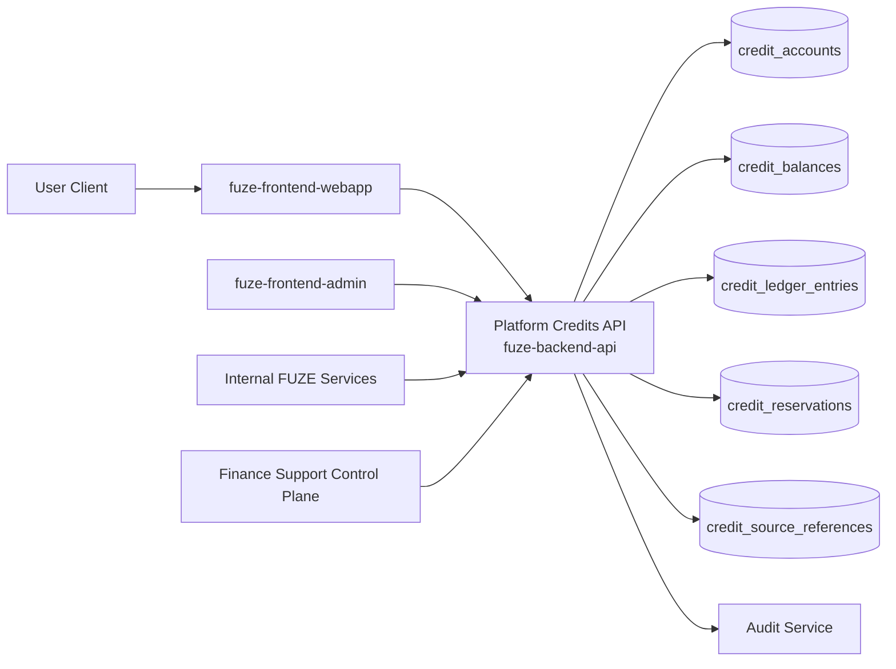
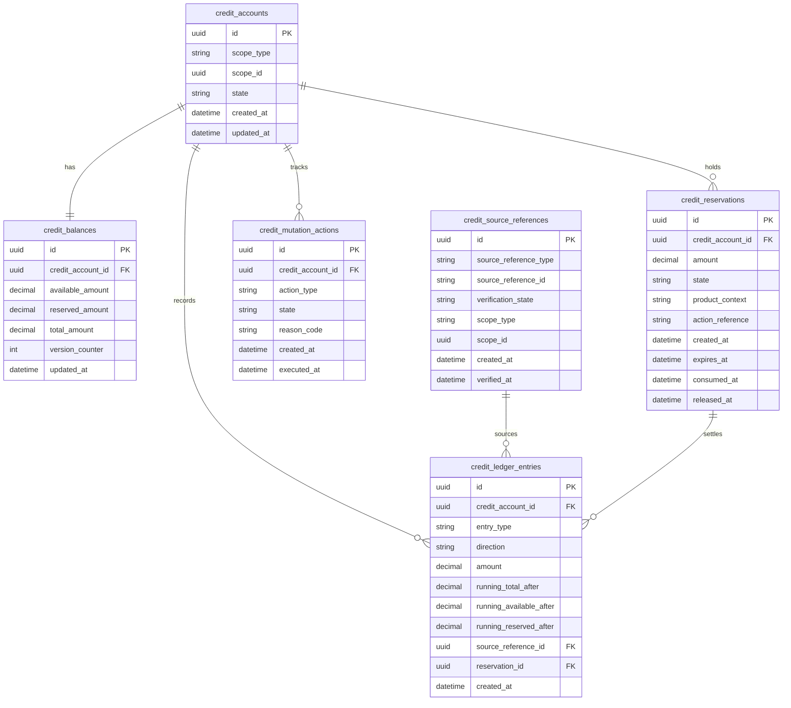
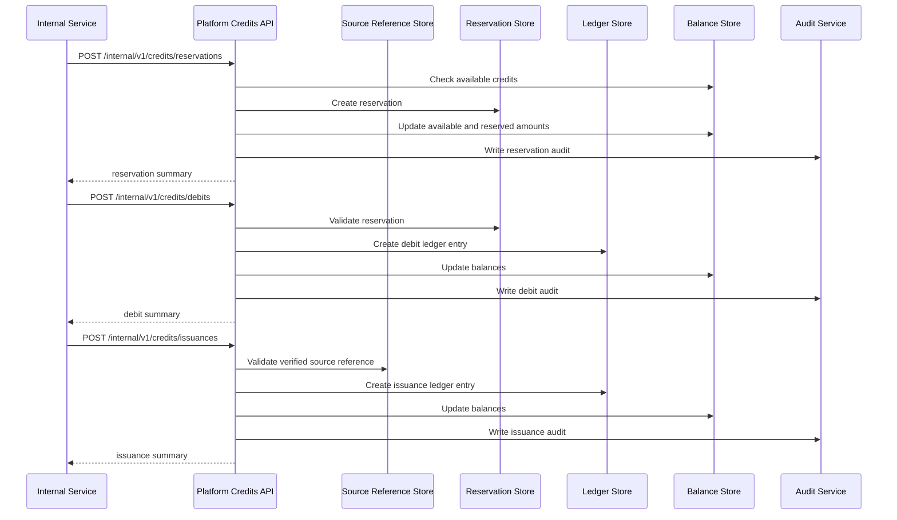

# PLATFORM_CREDITS_API_SPEC

## 1. Title

**PLATFORM_CREDITS_API_SPEC.md**

---

## 2. Document Metadata

- **Document Name:** PLATFORM_CREDITS_API_SPEC.md
- **API Classification:** public, internal, admin, event-driven, chain-adjacent
- **Owning Domain:** Platform Credits Domain
- **Primary Implementing Repo:** `fuze-backend-api`
- **Primary System of Record:** Platform Credits accounting, balances, reservations, debits, releases, reversals, and derived account/workspace credit views in `fuze-backend-api`
- **Status:** Draft for canonical source-of-truth approval
- **Purpose:** Define the production-grade API contract architecture for FUZE Platform Credits issuance, balance visibility, reservation, debit, release, adjustment-aware mutation, and product-facing credit consumption behavior across the platform
- **Canonical Folder:** `fuze.ac > docs > api-spec`

---

## 2.1 API Classification Header

- **API Classification:** public | internal | admin | event-driven | chain-adjacent
- **Owning Domain:** Platform Credits Domain
- **Primary Implementing Repo:** `fuze-backend-api`
- **Primary System of Record:** Platform Credits ledger and balance domain

---

## 3. Purpose

This document defines the canonical API specification for FUZE Platform Credits operations. It converts the governing FUZE platform architecture, credits semantics, ledger/settlement rules, payment normalization, invoicing/receipts, refund/reversal/adjustment controls, and API architecture rules into an implementation-ready API contract.

This API exists because FUZE Platform Credits are the shared internal consumption layer of the FUZE ecosystem. Credits are not the FUZE token, not treasury balance, not stablecoin payout balance, and not raw payment-rail funds. Credits are the normalized internal spend unit used across platform and product flows, and therefore require explicit APIs for visibility, reservation, debit, release, adjustment lineage, and controlled reconciliation.

Accordingly, this specification defines how credits are represented through APIs, how account- and workspace-scoped credit balances are exposed, how product and platform flows reserve and consume credits safely, how finance- and support-sensitive exceptions are controlled, and how credit operations remain auditable, idempotent, and architecture-consistent.

---

## 4. Scope

This specification covers:

- credit balance visibility APIs
- credit ledger entry visibility APIs
- credit reservation APIs
- credit debit / consume APIs
- credit release APIs
- credit transfer-between-scopes exclusions and rules
- platform-controlled issuance result APIs where credits are created from verified upstream commercial events
- admin/control-plane APIs for correction-safe manual actions
- internal service APIs for high-integrity credit consumption and balance checks
- event emission requirements for credit mutations
- request, response, error, idempotency, versioning, audit, and database-shape rules for this domain

This specification does **not** redefine:

- raw payment intake itself
- invoices and receipts in full detail
- raw refund and reversal policy in full detail
- Ethereum FUZE token semantics
- Base payout execution semantics
- treasury or profit participation behavior
- direct smart-contract implementation details for the Base credits rail
- product-specific entitlement rules beyond credit affordability and consumption signals

Those remain governed by their own source-of-truth specifications.

---

## 5. Source-of-Truth Inputs

### Primary FUZE docs and specs used

#### Highest-priority platform and ownership sources
- `SYSTEM_SPEC_INDEX.md`
- `SYSTEM_BOUNDARY_AND_OWNERSHIP_SPEC.md`
- `SYSTEM_OVERVIEW_AND_BOUNDARIES_SPEC.md`
- `PLATFORM_ARCHITECTURE_SPEC.md`
- `DOMAIN_OWNERSHIP_MATRIX_SPEC.md`
- `DATA_MODEL_AND_ENTITY_OWNERSHIP_SPEC.md`
- `ONCHAIN_OFFCHAIN_RESPONSIBILITY_SPEC.md`

#### Primary credits / commerce / financial sources
- `PLATFORM_CREDITS_SPEC.md`
- `CREDIT_LEDGER_AND_SETTLEMENT_SPEC.md`
- `BASE_PLATFORM_CREDITS_LAYER_SPEC.md`
- `SUBSCRIPTIONS_AND_USAGE_BILLING_SPEC.md`
- `PRICING_AND_MONETIZATION_MODEL_SPEC.md`
- `INVOICING_AND_RECEIPTS_SPEC.md`
- `PAYMENT_RAILS_INTEGRATION_SPEC.md`
- `REFUND_REVERSAL_AND_ADJUSTMENT_SPEC.md`

#### API and runtime sources
- `API_ARCHITECTURE_SPEC.md`
- `PUBLIC_API_SPEC.md`
- `INTERNAL_SERVICE_API_SPEC.md`
- `IDEMPOTENCY_AND_VERSIONING_SPEC.md`
- `EVENT_MODEL_AND_WEBHOOK_SPEC.md`
- `MIGRATION_AND_BACKWARD_COMPATIBILITY_SPEC.md`
- `AUDIT_LOG_AND_ACTIVITY_SPEC.md`

#### Security and operations sources
- `SECURITY_AND_RISK_CONTROL_SPEC.md`
- `PAYMENT_FRAUD_AND_ABUSE_PREVENTION_SPEC.md`
- `SECRETS_CONFIG_AND_ENVIRONMENT_SPEC.md`
- `MONITORING_ALERTING_AND_INCIDENT_RESPONSE_SPEC.md`

#### Format guides
- `The_API_Specification_guide.md`
- `Database_Schemas_Guide.md`

### Highest-priority interpretation applied

For this file, the most important governing interpretation is:

1. Platform Credits are a shared internal consumption layer
2. credits are distinct from FUZE token, stablecoin payouts, treasury resources, and raw payment rails
3. backend owns canonical credits truth
4. product consumers may reserve and consume credits but do not redefine credits semantics
5. admin/control-plane may trigger corrections under controlled policy but do not own financial truth
6. on-chain/base-layer representation and off-chain application-owned credit truth must remain explicitly related but not conflated

### Supporting external standards used only as guidance

- HTTP semantics for safe reads, mutations, and conflict handling
- RFC 9457 problem-details style for machine-readable error responses
- general ledger-safety, reservation, and idempotent mutation design patterns as supporting guidance

External guidance does not override FUZE source-of-truth documents.

---

## 6. Governing Architecture and Ownership Interpretation

This API belongs to the **Platform Credits Domain** because it owns the shared internal spend unit used across the FUZE ecosystem. Credits represent normalized consumable platform value after verified upstream commercial events or approved internal platform-issued events. This domain owns balance truth, reservation truth, debit truth, release truth, and adjustment lineage for credits.

This API is implemented primarily in `fuze-backend-api` because:

- backend owns durable business and ledger-adjacent truth
- frontend surfaces must consume credit truth, not invent it
- product domains need a shared and trusted credit-consumption interface
- finance, support, correction, and reconciliation actions must be backend-governed
- chain-adjacent credits representation must be mediated through backend-owned platform logic

This API is **not** owned by:

- `fuze-frontend-webapp`, because webapp only reads balances and triggers approved credit-affecting actions
- `fuze-frontend-admin`, because admin surfaces trigger privileged actions but do not own credits truth
- `fuze-contracts`, because contract-side or Base-side representation does not replace the platform-owned internal credits domain
- payment-rail adapters, because verified payment intake is upstream normalization input, not the internal credits owner
- product domains, because products consume credits but do not define what credits are

### Architectural implications

- credits are scoped to canonical account and/or workspace ownership contexts
- credits must support available, reserved, consumed, released, expired, and adjusted states as governed by platform rules
- product debit flows must use canonical reservation/debit APIs
- credits issuance requires verified upstream cause references
- derived balance summaries must never replace canonical ledger truth
- chain-adjacent reporting or anchoring must stay explicitly tied to the platform credits domain without collapsing on-chain and off-chain responsibility boundaries

---

## 7. Domain Responsibilities

The Platform Credits API domain is responsible for:

1. maintaining canonical credits balances and mutation lineage
2. exposing current available / reserved / total visibility for allowed scopes
3. creating and managing reservations for pending product or platform actions
4. converting approved reservations into final debit/consumption
5. releasing unused or failed reservations
6. surfacing issuance results tied to verified upstream causes
7. supporting safe internal service credit checks and mutations
8. supporting admin/control-plane correction-safe actions under policy
9. emitting credits events
10. generating audit lineage for sensitive financial mutations

The domain is not responsible for:

- raw payment checkout capture
- invoice generation in full detail
- refund policy determination in full detail
- payout execution
- token contract balance semantics
- treasury allocation management
- product entitlement design beyond affordability/consumption inputs

---

## 8. Out of Scope

The following are out of scope for this API specification:

- raw card, stablecoin, token, or app-store payment gateway contracts
- full invoice and receipt schema design
- full refund / reversal business workflow design
- payout-cycle distribution logic
- Base smart-contract method details
- cross-user or peer-to-peer credits transfer markets
- unsupported credits trading or withdrawal semantics
- product-specific consumption pricing tables

Where later detailed specs are needed, they must remain compatible with this API.

---

## 9. Canonical Entities and Data Ownership

### Durable entities

#### 9.1 credit_accounts
- **Owner:** Platform Credits Domain
- **Purpose:** canonical credit-bearing account/workspace scope record
- **Nature:** source-of-truth durable entity

#### 9.2 credit_balances
- **Owner:** Platform Credits Domain
- **Purpose:** canonical aggregated balances for a given credit account
- **Nature:** source-of-truth durable entity, but always reconcilable from ledger entries

#### 9.3 credit_ledger_entries
- **Owner:** Platform Credits Domain
- **Purpose:** immutable credits mutation lineage
- **Nature:** source-of-truth durable entity

#### 9.4 credit_reservations
- **Owner:** Platform Credits Domain
- **Purpose:** pending holds against available credits for workflow-safe consumption
- **Nature:** source-of-truth durable entity

#### 9.5 credit_mutation_actions
- **Owner:** Platform Credits Domain
- **Purpose:** high-level action records for issuance, reservation, debit, release, adjustment, expiry, or correction
- **Nature:** durable action records with audit linkage

#### 9.6 credit_source_references
- **Owner:** Platform Credits Domain
- **Purpose:** normalized references to verified payment, subscription, promotion, refund/reversal, or approved platform event that caused a credit mutation
- **Nature:** source-of-truth durable reference entity

#### 9.7 credit_audit_events
- **Owner:** Audit / Activity domain, sourced by Platform Credits Domain
- **Purpose:** immutable trail for sensitive credits actions
- **Nature:** durable audit records

### Derived or cached entities

#### 9.8 credit_balance_views
- **Owner:** derived read-model layer
- **Purpose:** account/workspace balance summaries for first-party clients
- **Nature:** derived

#### 9.9 product_credit_availability_views
- **Owner:** derived read-model layer
- **Purpose:** product-safe affordability/availability summaries
- **Nature:** derived

#### 9.10 credit_reconciliation_views
- **Owner:** derived ops/finance read-model layer
- **Purpose:** reconciliation and discrepancy views
- **Nature:** derived

---

## 10. State Model and Lifecycle

### 10.1 credit account lifecycle

Possible states:

- `active`
- `restricted`
- `suspended`
- `closed`

### 10.2 credit reservation lifecycle

Possible states:

- `created`
- `active`
- `partially_consumed`
- `fully_consumed`
- `released`
- `expired`
- `cancelled`

### 10.3 credit mutation action lifecycle

Possible states:

- `requested`
- `validated`
- `executed`
- `failed`
- `reversed_if_supported`
- `closed`

### 10.4 credit source reference lifecycle

Possible states:

- `pending_verification`
- `verified`
- `invalidated`
- `superseded`

Lifecycle notes:
- credits become available only from approved executed mutations, not pending commercial events
- reservations reduce available credits without final consumption until debit or release
- debit finalizes consumption against active reservation or approved direct-debit route
- release restores reserved capacity to availability
- adjustment, reversal, or correction must preserve immutable lineage instead of deleting history

---

## 11. API Surface Overview

The API surface is divided into four families:

### 11.1 Public / first-party user-facing APIs
Used by `fuze-frontend-webapp` and approved first-party clients for:
- reading current credit balances
- listing credit ledger summaries
- reading current reservations visible to actor
- product-safe credit availability checks
- reading issuance result references and selected derived history views where policy allows

### 11.2 Internal service APIs
Used by trusted internal services for:
- balance checks
- reservation creation
- debit / consume actions
- reservation release
- verified issuance application
- reconciliation-safe internal reads

### 11.3 Admin / control-plane APIs
Used by `fuze-frontend-admin` through backend-only privileged routes for:
- controlled credit adjustments
- reservation correction or forced release
- restriction / suspension of credit account
- corrective replay of failed mutation action flows
- discrepancy resolution under controlled policy

### 11.4 Event-driven interfaces
Used for downstream side effects:
- audit generation
- product fulfillment triggers
- invoice/receipt side-effect coordination
- analytics and reporting
- reconciliation and anomaly detection
- transparency-compatible internal reporting where allowed

---

## 12. Authentication and Authorization Model

### 12.1 Authentication posture by route family

#### Authenticated user routes
Require valid authenticated session:
- read own account credit balances
- read own workspace credit balances if actor is authorized in workspace
- read visible ledger summaries
- read visible reservation summaries
- request product-safe availability checks in owned/authorized scopes

#### Internal service routes
Require internal service identity with explicit least privilege:
- reserve credits
- debit credits
- release reservations
- apply verified issuance
- perform internal balance checks and reconciliation-safe reads

#### Admin routes
Require privileged operator identity plus reason-coded actions:
- adjustments
- forced release
- credit-account restriction or suspension
- correction or discrepancy resolution actions

### 12.2 Authorization checkpoints

Authorization must evaluate:
- canonical account identity
- session validity
- target credit scope (account/workspace)
- actor’s workspace role where applicable
- whether action is read-only, mutation, or privileged correction
- whether target credit account is restricted/suspended
- whether internal service has the required mutation class privilege
- whether admin/operator role is present for privileged actions

### 12.3 Sensitive action rules

The following require heightened checks:
- internal reservation create
- internal debit / consume
- internal verified issuance apply
- admin credit adjustment
- admin forced release
- admin restriction / suspension
- discrepancy correction actions

---

## 13. API Endpoints / Interface Contracts

## 13.1 Public / First-Party User APIs

### 13.1.1 `GET /v1/credits/me`
**Purpose:** retrieve current account-scoped credits summary for current authenticated actor  
**Caller Type:** authenticated user  
**Auth Expectation:** valid authenticated session  
**Response Summary:**
- credit account identifier
- available credits
- reserved credits
- total credits
- account state
- last reconciled / refreshed metadata
**Side Effects:** none
**Audit Requirements:** access logging only
**Emitted Events:** none required

### 13.1.2 `GET /v1/workspaces/{workspace_id}/credits`
**Purpose:** retrieve workspace-scoped credits summary where actor is authorized  
**Caller Type:** authenticated user  
**Response Summary:**
- workspace credit account identifier
- available / reserved / total credits
- scope state
- actor visibility classification
**Side Effects:** none

### 13.1.3 `GET /v1/credits/ledger`
**Purpose:** list visible credit ledger summaries for current actor’s account scope  
**Caller Type:** authenticated user  
**Query Parameters Summary:**
- pagination
- optional date range
- optional entry types
- optional source reference filters
**Response Summary:**
- ledger entry summaries
- mutation type
- amount
- running-balance reference snapshot where supported
- source reference summaries
**Side Effects:** none

### 13.1.4 `GET /v1/workspaces/{workspace_id}/credits/ledger`
**Purpose:** list visible credit ledger summaries for an authorized workspace scope  
**Caller Type:** authenticated user  
**Response Summary:** workspace-scoped ledger entry summaries
**Side Effects:** none

### 13.1.5 `GET /v1/credits/reservations`
**Purpose:** list visible credit reservations for current actor’s account scope  
**Caller Type:** authenticated user  
**Response Summary:**
- reservation summaries
- state
- reserved amount
- source/product context summaries
- expiry metadata
**Side Effects:** none

### 13.1.6 `GET /v1/workspaces/{workspace_id}/credits/reservations`
**Purpose:** list visible credit reservations for authorized workspace scope  
**Caller Type:** authenticated user  
**Response Summary:** workspace-scoped reservation summaries
**Side Effects:** none

### 13.1.7 `POST /v1/credits/availability-checks`
**Purpose:** determine whether a target scope has enough available credits for a proposed action without mutating balance  
**Caller Type:** authenticated user or approved first-party client  
**Request Body Summary:**
- `scope_type`
- `scope_id`
- `required_amount`
- optional `product_context`
- optional `action_class`
**Response Summary:**
- sufficient / insufficient
- available amount
- reservation-affecting warnings if policy allows
- scope state
**Side Effects:** none
**Audit Requirements:** access logging; durable evaluation optional for sensitive flows
**Emitted Events:** none required

## 13.2 Internal Service APIs

### 13.2.1 `POST /internal/v1/credits/reservations`
**Purpose:** create a credits reservation against an eligible scope  
**Caller Type:** internal trusted services  
**Auth Expectation:** service-to-service identity only  
**Request Body Summary:**
- `scope_type`
- `scope_id`
- `amount`
- `product_context`
- `action_reference`
- `reservation_reason`
- `idempotency_key`
- optional `expires_at`
**Response Summary:**
- reservation ID
- state
- reserved amount
- remaining available amount
- scope summary
**Side Effects:** creates reservation and reduces available credits
**Idempotency Behavior:** required
**Audit Requirements:** sensitive financial mutation audit
**Emitted Events:** `credits.reserved`

### 13.2.2 `POST /internal/v1/credits/debits`
**Purpose:** consume credits by finalizing debit against a reservation or approved direct-debit route  
**Caller Type:** internal trusted services  
**Request Body Summary:**
- `scope_type`
- `scope_id`
- `amount`
- `reservation_id` optional but strongly preferred
- `product_context`
- `action_reference`
- `debit_reason`
- `idempotency_key`
**Response Summary:**
- ledger mutation summary
- resulting available / reserved / total summary
- finalized debit record
**Side Effects:** debits credits, updates ledger and balances, may close reservation
**Idempotency Behavior:** required
**Audit Requirements:** critical credits mutation audit
**Emitted Events:** `credits.debited`

### 13.2.3 `POST /internal/v1/credits/releases`
**Purpose:** release an active reservation back to available credits  
**Caller Type:** internal trusted services  
**Request Body Summary:**
- `reservation_id`
- `release_reason`
- `idempotency_key`
**Response Summary:**
- released reservation summary
- updated balances
**Side Effects:** reservation released, available credits restored
**Idempotency Behavior:** required
**Audit Requirements:** sensitive financial mutation audit
**Emitted Events:** `credits.released`

### 13.2.4 `POST /internal/v1/credits/issuances`
**Purpose:** apply verified credits issuance from an approved upstream source reference  
**Caller Type:** internal trusted services with issuance authority  
**Request Body Summary:**
- `scope_type`
- `scope_id`
- `amount`
- `source_reference_type`
- `source_reference_id`
- `issuance_reason`
- `idempotency_key`
**Response Summary:**
- issuance ledger entry summary
- resulting balances
- source linkage summary
**Side Effects:** increases total and available credits when valid
**Idempotency Behavior:** required
**Audit Requirements:** critical credits mutation audit
**Emitted Events:** `credits.issued`

### 13.2.5 `GET /internal/v1/credits/scopes/{scope_type}/{scope_id}`
**Purpose:** retrieve canonical credit summary for internal trusted services  
**Caller Type:** internal trusted services  
**Response Summary:**
- balances
- state
- reservation counts
- reconciliation metadata
**Side Effects:** none

## 13.3 Admin / Control-Plane APIs

### 13.3.1 `POST /admin/v1/credits/adjustments`
**Purpose:** apply controlled manual credit adjustment under finance/support policy  
**Caller Type:** admin/operator  
**Request Body Summary:**
- `scope_type`
- `scope_id`
- `adjustment_amount`
- `direction`
- `reason_code`
- `operator_note`
- optional `related_case_id`
- `idempotency_key`
**Response Summary:** adjustment ledger summary and updated balances
**Side Effects:** adds corrective positive or negative adjustment through immutable ledger mutation
**Audit Requirements:** critical audit
**Emitted Events:** `credits.adjusted`

### 13.3.2 `POST /admin/v1/credits/reservations/{reservation_id}/force-release`
**Purpose:** forcibly release a stuck or invalid reservation  
**Caller Type:** admin/operator  
**Request Body Summary:**
- `reason_code`
- `operator_note`
- `idempotency_key`
**Response Summary:** released reservation summary and updated balances
**Side Effects:** releases reservation and restores available credits
**Audit Requirements:** critical audit
**Emitted Events:** `credits.released`

### 13.3.3 `POST /admin/v1/credits/scopes/{scope_type}/{scope_id}/restrict`
**Purpose:** restrict a credits account scope for risk or control reasons  
**Caller Type:** admin/operator  
**Request Body Summary:**
- `reason_code`
- `operator_note`
**Response Summary:** restricted account summary
**Side Effects:** credit account state transition to restricted
**Audit Requirements:** critical audit
**Emitted Events:** `credits.account_restricted`

### 13.3.4 `POST /admin/v1/credits/scopes/{scope_type}/{scope_id}/unrestrict`
**Purpose:** restore restricted credits account to active state where policy allows  
**Caller Type:** admin/operator  
**Request Body Summary:**
- `reason_code`
- `operator_note`
**Response Summary:** updated account summary
**Side Effects:** restricted -> active
**Audit Requirements:** critical audit
**Emitted Events:** `credits.account_unrestricted`

### 13.3.5 `POST /admin/v1/credits/discrepancy-resolutions`
**Purpose:** resolve a credits discrepancy through controlled corrective action  
**Caller Type:** admin/operator  
**Request Body Summary:**
- `scope_type`
- `scope_id`
- `resolution_code`
- `operator_note`
- `related_case_id`
- optional `adjustment_amount`
- `idempotency_key`
**Response Summary:** discrepancy resolution action summary
**Side Effects:** may apply adjustments, releases, restrictions, or closure metadata
**Audit Requirements:** critical audit
**Emitted Events:** `credits.discrepancy_resolved`

---

## 14. Request Rules

### 14.1 General request rules
- all mutation-capable routes must require JSON requests with explicit content type
- all mutation routes must carry correlation IDs
- sensitive credits mutations must carry idempotency keys
- admin mutations must require reason codes and operator notes
- no route may accept frontend-calculated credits truth as authoritative input

### 14.2 Sensitive-action request requirements
The following requests require heightened validation:
- reservation create
- debit
- release
- issuance apply
- admin adjustment
- force release
- scope restrict/unrestrict
- discrepancy resolution

Heightened validation may include:
- scope-state validation
- duplicate action reference validation
- upstream source verification checks
- reservation-state validation
- operator role confirmation
- support/finance case linkage for admin flows

### 14.3 Scope integrity rule
Credits mutations must target a valid and authorized credit account scope. Product or service callers must not mutate an unrelated or unauthorized scope.

### 14.4 Source-reference rule
Credits issuance must reference a verified and approved source reference. Credits must never be created by unaudited ad hoc mutation paths.

---

## 15. Response Rules

### 15.1 Success response rules
Successful responses must include:
- stable resource identifiers
- timestamps for created/updated state
- state/status values
- scope metadata
- resulting balance summary
- correlation references for mutations

### 15.2 Async-accepted response rules
If discrepancy resolution or some issuance reconciliation becomes async, the response must:
- return accepted status
- include action or job ID
- provide follow-up status semantics

### 15.3 Terminal mutation response rules
Terminal mutation responses must clearly show:
- target scope
- mutation type
- resulting balances
- reservation / source reference effects where relevant
- whether downstream derived views may refresh asynchronously

### 15.4 Read response rules
Read responses must distinguish:
- durable balance and ledger truth
- visible derived summaries
- product-safe convenience fields
- reconciliation or freshness metadata that is not itself a balance mutation

---

## 16. Error Model

The API uses structured problem-details style error responses with stable error codes.

### 16.1 Required error fields
- `type`
- `title`
- `status`
- `code`
- `detail`
- `instance`
- `correlation_id`

### 16.2 Common error codes

#### Authorization / permission errors
- `CREDITS_SESSION_REQUIRED`
- `CREDITS_PERMISSION_DENIED`
- `CREDITS_OPERATOR_PERMISSION_DENIED`
- `CREDITS_SERVICE_PERMISSION_DENIED`

#### State conflict errors
- `CREDITS_RESERVATION_ALREADY_TERMINAL`
- `CREDITS_SOURCE_ALREADY_APPLIED`
- `CREDITS_ACCOUNT_STATE_INVALID`
- `CREDITS_MUTATION_CONFLICT`

#### Policy / safety errors
- `CREDITS_INSUFFICIENT_AVAILABLE`
- `CREDITS_SCOPE_RESTRICTED`
- `CREDITS_SCOPE_SUSPENDED`
- `CREDITS_SOURCE_NOT_VERIFIED`
- `CREDITS_RESERVATION_REQUIRED`
- `CREDITS_NEGATIVE_BALANCE_FORBIDDEN`

#### Request integrity errors
- `CREDITS_IDEMPOTENCY_KEY_REQUIRED`
- `CREDITS_REQUEST_INVALID`
- `CREDITS_REQUEST_UNPROCESSABLE`

#### Dependency or provider errors
- `CREDITS_RECONCILIATION_UNAVAILABLE`
- `CREDITS_UPSTREAM_SOURCE_UNAVAILABLE`

### 16.3 Error handling rules
- do not expose hidden finance/operator internals
- do not imply token or payout semantics from credits errors
- distinguish insufficient availability from restricted scope
- distinguish unverified source reference from duplicate already-applied source
- include retry guidance only where safe

---

## 17. Idempotency and Mutation Safety

### 17.1 Required idempotent mutations
The following mutation routes require idempotent behavior:
- reservation create
- debit / consume
- release
- issuance apply
- admin adjustment
- force release
- discrepancy resolution

### 17.2 Idempotency key rules
- mutation requests must supply `Idempotency-Key`
- backend stores key scope, request hash, actor, and terminal result
- replay of same semantic request returns original terminal outcome
- replay of same key with different semantic request must fail with conflict

### 17.3 Mutation safety rules
- balance mutations must be derived from immutable ledger entries
- reservations must not be consumed twice
- release must not restore more than currently reserved amount
- issuance must not apply same verified source twice
- negative balances are forbidden unless an explicitly approved exception exists in higher-priority source docs; absent that, the conservative interpretation is to forbid them
- admin adjustments must preserve immutable lineage rather than rewriting history

---

## 18. Versioning and Compatibility Rules

### 18.1 Versioning
This API family is versioned under `/v1`, `/internal/v1`, and `/admin/v1` route families.

### 18.2 Compatibility approach
- additive evolution preferred
- no silent semantic change to balance fields, reservation state, or ledger mutation meaning
- new source reference types may be added without breaking existing contracts
- response fields may be added but existing meanings must remain stable

### 18.3 Breaking-change rules
Breaking changes include:
- changing the meaning of available / reserved / total balances
- changing reservation lifecycle semantics incompatibly
- removing critical ledger or balance fields
- changing source-reference application rules incompatibly

Such changes require explicit migration planning and version evolution.

### 18.4 Deprecation
Deprecated routes or fields must:
- be documented explicitly
- carry deprecation metadata where supported
- preserve compatibility windows long enough for first-party consumers and future SDKs

---

## 19. Event Emission and Webhook Behavior

This domain is event-capable.

### 19.1 Internal events
The Platform Credits domain must emit canonical internal events such as:
- `credits.issued`
- `credits.reserved`
- `credits.debited`
- `credits.released`
- `credits.adjusted`
- `credits.account_restricted`
- `credits.account_unrestricted`
- `credits.discrepancy_resolved`
- `credits.reconciliation_refreshed`

### 19.2 Event payload minimums
Each event should contain:
- event ID
- event type
- occurred_at
- scope type and scope ID
- credit account ID
- mutation reference
- reservation ID where applicable
- source reference where applicable
- actor type
- correlation ID
- reason code where applicable

### 19.3 External webhook posture
This specification does not expose general third-party webhooks for raw Platform Credits mutations by default. Any future external credits webhook surface must be narrow, security-reviewed, commercially safe, and governed by a separate contract.

---

## 20. Audit and Activity Requirements

The following actions must generate durable audit events:

- credits issuance apply
- reservation create
- debit / consume
- release
- admin adjustment
- forced release
- scope restriction / unrestriction
- discrepancy resolution
- other sensitive correction flows

### Required audit fields
- audit event ID
- actor type and actor reference
- scope type and scope reference
- credit account ID
- target reservation / ledger / action reference as applicable
- action type
- before/after balance summary where applicable
- reason code
- correlation ID
- operator note if operator action
- occurred_at

User-facing activity feeds may show a filtered subset, but audit truth must remain durable and immutable.

---

## 21. Data Model and Database Schema View

### 21.1 `credit_accounts`
- `id` PK
- `scope_type`
- `scope_id`
- `state`
- `currency_unit` fixed to platform credits unit
- `created_at`
- `updated_at`
- `restricted_at` nullable
- `closed_at` nullable

**Constraints:**
- unique (`scope_type`, `scope_id`)
- index on `state`

### 21.2 `credit_balances`
- `id` PK
- `credit_account_id` FK -> `credit_accounts.id`
- `available_amount`
- `reserved_amount`
- `total_amount`
- `version_counter`
- `updated_at`

**Constraints:**
- unique `credit_account_id`
- non-negative amount constraints under conservative interpretation
- index on `updated_at`

### 21.3 `credit_ledger_entries`
- `id` PK
- `credit_account_id` FK -> `credit_accounts.id`
- `entry_type`
- `direction`
- `amount`
- `running_total_after`
- `running_available_after`
- `running_reserved_after`
- `source_reference_id` nullable FK -> `credit_source_references.id`
- `reservation_id` nullable FK -> `credit_reservations.id`
- `action_reference`
- `correlation_id`
- `created_at`

**Constraints:**
- index on `credit_account_id`
- index on `created_at`
- index on `entry_type`
- immutable after creation

### 21.4 `credit_reservations`
- `id` PK
- `credit_account_id` FK -> `credit_accounts.id`
- `amount`
- `state`
- `product_context`
- `action_reference`
- `created_at`
- `expires_at` nullable
- `consumed_at` nullable
- `released_at` nullable
- `cancelled_at` nullable
- `correlation_id`

**Constraints:**
- unique `action_reference` within idempotency / scope policy where appropriate
- index on `credit_account_id`
- index on `state`
- index on `expires_at`

### 21.5 `credit_source_references`
- `id` PK
- `source_reference_type`
- `source_reference_id`
- `verification_state`
- `scope_type`
- `scope_id`
- `created_at`
- `verified_at` nullable
- `invalidated_at` nullable

**Constraints:**
- unique (`source_reference_type`, `source_reference_id`) in verified-applicable space
- index on `verification_state`

### 21.6 `credit_mutation_actions`
- `id` PK
- `credit_account_id` FK -> `credit_accounts.id`
- `action_type`
- `state`
- `reason_code`
- `operator_note` nullable
- `requested_by_actor_type`
- `requested_by_actor_id`
- `created_at`
- `executed_at` nullable
- `closed_at` nullable
- `correlation_id`

### 21.7 `idempotency_records`
- `id` PK
- `idempotency_key`
- `scope_family`
- `actor_reference`
- `request_hash`
- `response_hash`
- `terminal_status`
- `created_at`
- `expires_at`

### 21.8 `audit_log_entries`
Domain-sourced audit records written into the audit domain.

### Normalization notes
- canonical balance truth must reconcile from immutable ledger entries
- aggregated balance rows are authoritative but must remain derivable from ledger
- reservations remain separate from final debit ledger entries
- source reference verification remains separate from actual issuance entry application
- product affordability views are derived and must not replace canonical balances

### Reconciliation notes
- balance aggregates must reconcile against ledger entries regularly
- stale reservations require controlled expiry/release handling
- verified source references must not be applied twice
- discrepancy actions must preserve explicit lineage linking to cases and corrections

---

## 22. Architecture Diagram — Mermaid flowchart



---

## 23. Data Design — Mermaid Diagram



---

## 24. Flow View

### 24.1 Happy path — verified issuance
1. upstream verified commercial or approved platform event becomes a verified source reference
2. internal service calls credits issuance API
3. backend validates source is verified and unused
4. immutable issuance ledger entry is created
5. balances are updated
6. audit event is written
7. `credits.issued` event is emitted

### 24.2 Happy path — reserve then debit
1. product/internal service checks scope affordability
2. product/internal service creates reservation
3. available credits decrease while reserved credits increase
4. later, service debits against reservation
5. debit ledger entry is created
6. reserved amount decreases and total decreases appropriately
7. audit and event are emitted

### 24.3 Happy path — release unused reservation
1. product workflow fails or is cancelled
2. internal service calls release
3. reservation transitions to released
4. available credits are restored
5. audit and event are emitted

### 24.4 Alternate path — direct debit under approved policy
1. internal service performs approved debit without preexisting reservation
2. backend validates policy and availability
3. debit ledger entry is created
4. balances update
5. audit and event are emitted

### 24.5 Failure path — insufficient available credits
1. product/internal service requests reservation or debit
2. backend evaluates available credits
3. amount exceeds available amount
4. request is rejected with insufficient-available error
5. no mutation occurs

### 24.6 Failure and correction path — stuck reservation or discrepancy
1. reservation remains active after failed downstream workflow or reconciliation identifies mismatch
2. admin/support opens corrective action
3. forced release or adjustment is executed under controlled policy
4. immutable corrective lineage is created
5. audit and event are emitted

### 24.7 Retry behavior
- issuance retries with same idempotency key return same terminal issuance result
- reservation retries return same active reservation result
- debit retries return same terminal debit result and must not consume twice
- release retries return same released terminal state
- discrepancy resolution retries return the same final action result

---

## 25. Data Flows — Mermaid sequenceDiagram



---

## 26. Security and Risk Controls

1. **Credits are not token or payout balances**  
   The API must keep credits semantics explicitly separate from token, payout, treasury, and raw payment semantics.

2. **Backend-owned financial truth**  
   Frontends and products may not authoritatively compute or mutate balances outside approved backend APIs.

3. **Immutable ledger lineage**  
   Credits mutations must preserve immutable ledger history instead of rewriting prior outcomes.

4. **Least privilege**  
   Internal mutation routes must be limited to authorized service callers with explicit mutation privileges.

5. **Verified source requirement for issuance**  
   Credits issuance must not happen from unverified or duplicate upstream causes.

6. **Reservation safety**  
   Reservation and debit flows must prevent double-spend and double-consumption.

7. **Restriction support**  
   The domain must support fast restriction or suspension of credits accounts when risk or finance policy requires it.

8. **Problem-details discipline**  
   Error bodies must be structured and safe, without exposing hidden operator-only or fraud-review details.

9. **Audit immutability**  
   Sensitive credits mutations require durable immutable audit lineage.

10. **Replay resistance**  
    Reservation, debit, release, issuance, and adjustment mutations must be idempotent and replay-safe.

---

## 27. Operational Considerations

- balance reads are latency-sensitive and should be highly available
- reservation and debit flows are correctness-sensitive and must be strongly serialized or version-guarded as needed
- stale reservations require scheduled expiry/release handling
- immutable ledger creation and balance aggregation must remain reconcilable
- derived product affordability views should refresh quickly on material credit mutations
- monitoring should alert on:
  - spikes in insufficient-credit failures
  - unusual adjustment volume
  - duplicate-source issuance attempts
  - large numbers of stale reservations
  - discrepancy-resolution spikes
  - balance-vs-ledger reconciliation drift

---

## 28. Acceptance Criteria

1. The API preserves the distinction between Platform Credits, token balances, payout balances, treasury resources, and raw payment-rail funds.
2. Only `fuze-backend-api` owns canonical Platform Credits truth.
3. Credits issuance requires a verified source reference.
4. Balance summaries are reconcilable to immutable ledger entries.
5. Reservations reduce available credits without final debit until consumed or released.
6. Debit is idempotent and does not consume the same reservation twice.
7. Release restores reserved capacity safely and audibly.
8. Internal mutation routes are least-privilege and backend-only.
9. Admin routes require reason-coded privileged authorization.
10. Event emissions exist for major credits mutations.
11. Response and error semantics are stable and machine-readable.
12. Database schema separates canonical balances, ledger entries, reservations, and source references.
13. Products can consume canonical credits APIs without redefining credits semantics.
14. Discrepancy resolution is supported and safely replayable.
15. Mermaid diagrams remain consistent with prose and data model.

---

## 29. Test Cases

### 29.1 Positive cases
1. Authenticated user reads account-scoped credit balance successfully.
2. Authorized workspace member reads workspace-scoped credits successfully.
3. Internal service creates reservation successfully.
4. Internal service debits against active reservation successfully.
5. Internal service releases active reservation successfully.
6. Internal issuance applies verified source reference successfully.
7. Admin applies controlled adjustment successfully.

### 29.2 Negative cases
8. Unauthenticated call to user credits route is rejected.
9. User without workspace authority cannot read workspace credits.
10. Reservation request exceeding available amount returns `CREDITS_INSUFFICIENT_AVAILABLE`.
11. Debit using already terminal reservation is rejected.
12. Issuance using unverified source reference returns `CREDITS_SOURCE_NOT_VERIFIED`.
13. Duplicate already-applied source returns `CREDITS_SOURCE_ALREADY_APPLIED`.

### 29.3 Authorization cases
14. Ordinary user cannot call admin adjustment routes.
15. Internal service without issuance privilege cannot apply issuance.
16. Internal service without debit privilege cannot consume credits.
17. Product service cannot post frontend-computed balance truth as canonical input.

### 29.4 Idempotency and replay cases
18. Repeating reservation with same idempotency key returns original terminal reservation result.
19. Repeating debit with same idempotency key returns original terminal debit result.
20. Repeating issuance with same idempotency key returns original terminal issuance result.

### 29.5 Concurrency cases
21. Two concurrent reservations against the same scope preserve non-negative available balance.
22. Concurrent debit and release on same reservation produce one terminal consume path and one terminal no-op/conflict-safe outcome.
23. Concurrent duplicate issuance attempts on same verified source produce one success and one duplicate-safe outcome.

### 29.6 Recovery / admin cases
24. Forced release restores availability for stuck reservation under controlled policy.
25. Restrict route blocks new mutation attempts where policy requires.
26. Discrepancy resolution creates explicit immutable corrective lineage.

### 29.7 Event and audit cases
27. Successful reservation emits `credits.reserved`.
28. Successful debit emits `credits.debited`.
29. Successful issuance emits `credits.issued`.
30. Successful adjustment emits `credits.adjusted` with critical audit lineage.

---

## 30. Open Questions or Explicit Deferred Decisions

1. Exact account-vs-workspace default credit-account provisioning behavior is deferred.
2. Exact expiry policy for promotional or time-bounded credits is deferred.
3. Exact direct-debit-no-reservation policy classes are deferred.
4. Exact Base-side anchoring or commitment frequency for credits representation is deferred.
5. Exact user-facing ledger detail granularity is deferred.
6. Exact discrepancy case taxonomy is deferred.

---

## 31. Implementation Notes for `fuze-backend-api`

Recommended backend module layout:

```text
modules/platform/
  platform-credits/
  commerce-billing/
  payment-normalization/
  audit-log/
  control-plane/
```

Implementation guidance:
- keep credit-account, balance, reservation, source-reference, and immutable-ledger logic in one canonical domain service
- perform source verification and duplicate-application checks inside the commit boundary
- keep aggregate balances versioned and reconcilable from ledger
- treat admin corrections as domain actions, not ad hoc row edits
- emit events only after canonical state commit succeeds
- publish product-safe affordability views from canonical credit truth; do not let derived views mutate balances

---

## 32. Frontend Consumption Notes

### For `fuze-frontend-webapp`
- may read balances, visible ledger summaries, reservation summaries, and affordability checks
- must not infer canonical credits truth from cached frontend totals alone
- must treat backend credits responses as authoritative
- should clearly distinguish available versus reserved versus total credits
- should not present credits as token balances, treasury balances, or payout balances

### For `fuze-frontend-admin`
- may trigger privileged adjustments, forced releases, restrictions, and discrepancy resolutions only through backend admin APIs
- must require operator reason input for sensitive mutations
- must not directly mutate credits truth client-side
- should present immutable audit-linked summaries after privileged actions

---

## 33. Contract Derivation Notes

### OpenAPI / AsyncAPI
This spec should later derive into:
- balance and ledger read operations
- reservation / debit / release operations
- issuance operations
- admin adjustment / restriction / discrepancy operations
- shared problem-details schema
- credits events in AsyncAPI

### Future `fuze-sdk`
Future `fuze-sdk` packages may derive:
- shared credits balance helpers
- reservation / debit workflow helpers for authorized clients
- typed balance, ledger, and reservation models
- problem-error models for credits outcomes

The SDK must derive from approved API contracts and must not become the source of truth over this narrative specification.
