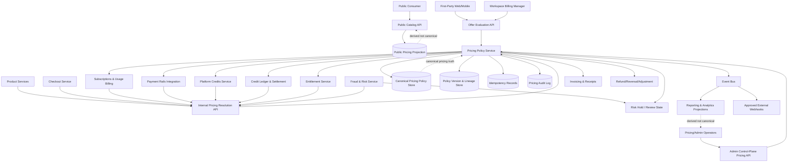
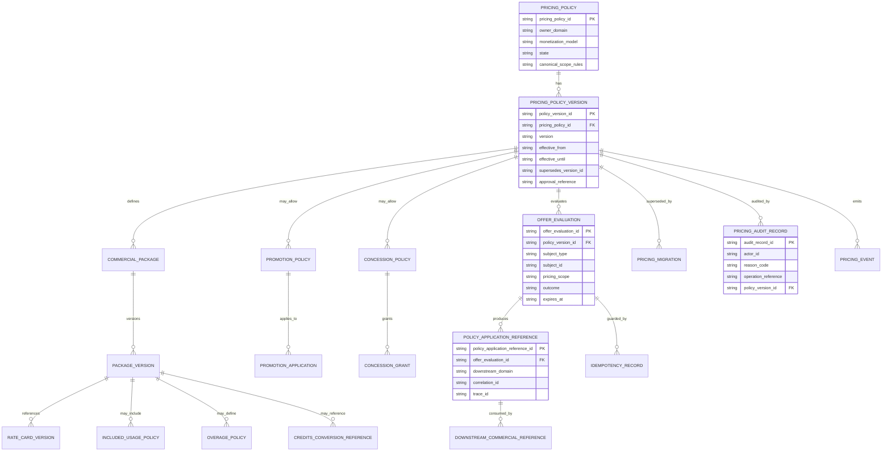
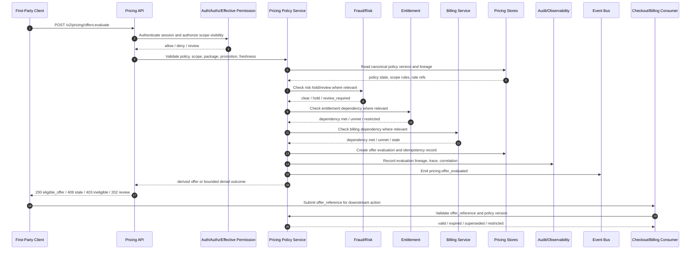

# FUZE Pricing and Monetization Model API Specification

## Document Metadata

- Document Name: `PRICING_AND_MONETIZATION_MODEL_API_SPEC.md`
- Document Type: FUZE API SPEC v2 / production-grade interface-contract specification
- Status: Draft for production API-spec library inclusion
- Version: 2.0.0
- Effective Date: 2026-04-24
- Last Updated: 2026-04-24
- Reviewed On: 2026-04-24
- Document Owner: FUZE Platform Commerce and Pricing Architecture
- Approval Authority: FUZE Platform Architecture and Governance Authority
- Review Cadence: Quarterly or upon material change to pricing policy, product admission, subscriptions and usage billing, Platform Credits conversion posture, payment rails, entitlement posture, fraud/risk controls, promotion policy, enterprise packaging, API versioning, or commercial governance controls
- Governing Layer: API contract layer / shared commercial infrastructure / pricing and monetization model
- Parent Registry: `API_SPEC_INDEX.md` and API SPEC v2 Canonical File Registry
- Upstream Semantic Registry: `REFINED_SYSTEM_SPEC_INDEX.md`
- Upstream API Registry: `API_SPEC_INDEX.md`
- Primary Audience: API architecture, backend engineering, commerce engineering, pricing operators, product engineering, billing engineering, payments engineering, Platform Credits and ledger engineering, entitlement engineering, fraud/risk engineering, finance operations, support/control-plane tooling, frontend engineering, data engineering, QA, security, audit, implementation-contract authors, OpenAPI/AsyncAPI/SDK authors
- Primary Purpose: Define the production API contract for FUZE pricing policy, monetization model, commercial package, offer evaluation, rate-card, promotion, concession, policy version, pricing migration, and derived pricing-read surfaces without allowing those APIs to redefine refined system semantics owned by `PRICING_AND_MONETIZATION_MODEL_SPEC.md` or adjacent commerce domains.
- Primary Upstream References:
  - `REFINED_SYSTEM_SPEC_INDEX.md`
  - `API_SPEC_INDEX.md`
  - `DOCS_SPEC_INDEX.md`
  - `SYSTEM_SPEC_INDEX.md`
  - `PRICING_AND_MONETIZATION_MODEL_SPEC.md`
  - `SUBSCRIPTIONS_AND_USAGE_BILLING_SPEC.md`
  - `PLATFORM_CREDITS_SPEC.md`
  - `CREDIT_LEDGER_AND_SETTLEMENT_SPEC.md`
  - `PAYMENT_RAILS_INTEGRATION_SPEC.md`
  - `INVOICING_AND_RECEIPTS_SPEC.md`
  - `REFUND_REVERSAL_AND_ADJUSTMENT_SPEC.md`
  - `PAYMENT_FRAUD_AND_ABUSE_PREVENTION_SPEC.md`
  - `ENTITLEMENT_AND_CAPABILITY_GATING_SPEC.md`
  - `AI_USAGE_METERING_SPEC.md`
  - `SECURITY_AND_RISK_CONTROL_SPEC.md`
  - `AUDIT_AND_ACCESS_TRACEABILITY_SPEC.md`
  - `ACCESS_EVALUATION_AND_EFFECTIVE_PERMISSION_SPEC.md`
  - `FUZE_ACCOUNT_ACCESS_AND_SESSION_THESIS_FINAL_SPEC.md`
  - `FUZE_ACCOUNT_ACCESS_AND_SESSION_CANONICAL_FINAL_SPEC.md`
  - `FUZE_WORKSPACE_ACCESS_CONTROL_BASICS_THESIS_FINAL_SPEC.md`
- Primary Downstream Dependents:
  - `SUBSCRIPTIONS_AND_USAGE_BILLING_API_SPEC.md`
  - `PAYMENT_RAILS_INTEGRATION_API_SPEC.md`
  - `INVOICING_AND_RECEIPTS_API_SPEC.md`
  - `REFUND_REVERSAL_AND_ADJUSTMENT_API_SPEC.md`
  - `PAYMENT_FRAUD_AND_ABUSE_PREVENTION_API_SPEC.md`
  - `PLATFORM_CREDITS_API_SPEC.md`
  - `CREDIT_LEDGER_AND_SETTLEMENT_API_SPEC.md`
  - `AI_USAGE_METERING_API_SPEC.md`
  - `ENTITLEMENT_AND_CAPABILITY_GATING_API_SPEC.md`
  - product-specific monetization and package-integration APIs
  - checkout adapters, billing adapters, support/control-plane tools, reporting pipelines, data exports, OpenAPI, AsyncAPI, and SDK artifacts
- API Surface Families Covered: Public read-safe catalog surfaces where approved, first-party application offer-evaluation surfaces, internal pricing-policy service APIs, admin/control-plane pricing-policy and concession APIs, event/async surfaces, reporting/projection surfaces, implementation-facing derivation contracts.
- API Surface Families Excluded: Direct payment-provider APIs, raw billing-state mutation APIs, direct credit-ledger mutation APIs, invoice/receipt issuance APIs, entitlement mutation APIs, payout/treasury APIs, product-local experiment configuration APIs, on-chain contract write APIs, tax/accounting engines, and unsupported external public write APIs.
- Canonical System Owner(s): FUZE Platform Commerce and Pricing Architecture; adjacent canonical owners retain ownership of billing, payment, credits, ledger, entitlement, invoice, correction, fraud/risk, authorization, workspace, and identity semantics.
- Canonical API Owner: FUZE API Architecture with FUZE Platform Commerce and Pricing Architecture
- Supersedes: Historical `PRICING_MONETIZATION_API_SPEC.md` and any weaker pricing/monetization API writeups where they conflict with API SPEC v2 or refined system semantics.
- Superseded By: Not yet known.
- Related Decision Records: Not yet known.
- Canonical Status Note: This API spec is canonical for interface-contract expression only. `PRICING_AND_MONETIZATION_MODEL_SPEC.md` remains the semantic source of truth. API routes, SDKs, OpenAPI schemas, event payloads, UI catalogs, checkout previews, provider metadata, support tools, and reporting outputs MUST NOT reinterpret plan labels, offer previews, hardcoded product rates, provider-side prices, coupon UI, spreadsheet price tables, or derived projections as pricing policy truth.
- Implementation Status: Normative API contract baseline; implementation contracts, OpenAPI, AsyncAPI, SDKs, services, workers, read models, and tests must conform.
- Approval Status: Drafted for architecture and API governance review; formal approval record not yet attached.
- Change Summary:
  - Upgrades the pricing and monetization API contract into API SPEC v2 format.
  - Establishes pricing APIs as expressions of canonical pricing policy truth, not as product-local rate storage or billing mutation shortcuts.
  - Defines public, first-party, internal, admin/control, event, reporting, and implementation-facing surface boundaries.
  - Adds request, response, error, status, idempotency, migration, observability, audit, and diagram requirements.
  - Adds implementation-ready acceptance criteria and test cases for contract validation and production readiness.

## Purpose

This specification defines the FUZE API contract for pricing and monetization.

The API exists to expose, evaluate, govern, activate, version, migrate, and project canonical pricing policy in a way that preserves the refined FUZE pricing model. It covers API resource families for pricing policies, monetization models, commercial packages, rate cards, included-usage and overage rules, credits-conversion references, promotions, concessions, offer evaluations, catalog publication, policy activation, supersession, migration, derived read models, and pricing events.

This API does not own the semantic meaning of pricing. The upstream refined system spec owns the canonical pricing and monetization model. This API owns the interface contract through which that model is safely consumed and operated.

## Scope

This API specification governs:

1. Route families for pricing-policy definition, reading, evaluation, activation, retirement, supersession, and migration.
2. Route families for commercial package, monetization model, rate-card, promotion, concession, and exception policy management.
3. Offer-evaluation APIs that return scope-aware derived offers from canonical policy.
4. Catalog and public-read APIs that expose approved, stable, narrow pricing information without exposing privileged commercial policy internals.
5. Internal service APIs that allow billing, payment, credits, entitlement, invoice, fraud/risk, AI metering, product, and checkout systems to consume policy references.
6. Admin/control-plane APIs for sensitive pricing changes, migration, operator concession, rollback, and restricted policy activation.
7. Event and webhook posture for pricing policy activation, offer evaluation, promotion application, supersession, exception grant, migration, and scope mismatch.
8. Request, response, status, error, idempotency, replay, audit, observability, rate-limit, migration, and compatibility requirements.
9. Guardrails for OpenAPI, AsyncAPI, SDK, service, worker, read-model, reporting, and implementation-contract derivation.

## Out of Scope

This API specification does not govern:

1. Final payment verification or provider-side payment state machines.
2. Final subscription, usage charge, renewal, dunning, grace, or billing-state truth.
3. Final Platform Credits semantic meaning, balance state, or ledger append mechanics.
4. Invoice/receipt issuance, tax document lifecycle, or accounting-book treatment.
5. Entitlement-state mutation or effective-permission decisioning.
6. Fraud/risk case ownership, dispute ownership, or commercial containment ownership.
7. Refund, reversal, adjustment, or correction-lineage ownership.
8. Product-local UI copy, experiment assignment, customer-facing marketing layout, or unsupported off-platform quote documents.
9. Treasury, payout, profit participation, governance voting, or chain-contract mutation.
10. Exact product price points unless they have been admitted as canonical policy records through the pricing domain.

## Design Goals

1. Preserve pricing policy as a platform-owned API domain.
2. Make every economically material price application reconstructable by policy ID, version, scope, eligibility basis, request lineage, and downstream references.
3. Keep offer previews, checkout previews, UI plan cards, provider metadata, and reports derived from policy rather than policy owners.
4. Provide clear surface-family separation for public, first-party, internal, admin/control-plane, event, and reporting APIs.
5. Support recurring, usage-rated, seat-based, credits-linked, add-on, bundle, hybrid, promotional, migration, and enterprise monetization models.
6. Fail closed for sensitive or cost-bearing actions when scope, eligibility, policy version, risk posture, entitlement dependency, billing dependency, or freshness cannot be safely resolved.
7. Prevent route drift, schema drift, policy-version drift, product-local pricing drift, and support/operator override drift.
8. Make API outputs usable by billing, payment, credits, entitlement, invoice, fraud/risk, AI metering, product, checkout, reporting, and SDK consumers without allowing them to redefine pricing truth.
9. Make pricing changes auditable, reason-coded, versioned, rollback-safe, migration-safe, and operationally observable.
10. Support production-ready contract testing, OpenAPI/AsyncAPI generation, SDK generation, regression testing, and migration validation.

## Non-Goals

1. This API does not force every FUZE product into the same visible price shape.
2. This API does not turn pricing policy into billing truth, payment truth, entitlement truth, credits truth, ledger truth, invoice truth, correction truth, or fraud/risk truth.
3. This API does not allow public clients to submit arbitrary prices for economically material actions.
4. This API does not create hidden admin discount paths, spreadsheet-only enterprise pricing, or support-side commercial truth.
5. This API does not replace implementation-specific OpenAPI files, database schemas, runbooks, billing formulas, tax engines, or product-specific packaging docs.
6. This API does not allow old policy versions to be destructively reinterpreted without a typed migration or correction path.

## Core Principles

### Pricing API Is Contract Truth, Not Semantic Truth

This API expresses refined pricing semantics as route, request, response, error, event, and compatibility contracts. It MUST NOT redefine the upstream pricing model.

### Platform-Owned Pricing Principle

APIs that create, activate, retire, supersede, migrate, or apply pricing policy MUST be owned by the platform pricing domain. Product APIs MAY request approved evaluations and consume policy references, but MUST NOT create separate pricing truth.

### Derived Offer Principle

Offer evaluation, plan cards, checkout previews, quote summaries, and public catalog views are derived from canonical policy. They MUST include stable references to the policy and policy version from which they were derived.

### Pricing-Is-Not-Billing Principle

Pricing APIs determine what policy applies and how commercial value is represented. Billing APIs determine actual subscription, usage, renewal, seat, included-usage, overage, and charge state.

### Pricing-Is-Not-Payment Principle

Payment provider prices, checkout pages, app-store products, provider coupons, payment-intent metadata, and payment callbacks are provider input or payment truth. They MUST NOT replace canonical FUZE pricing policy.

### Pricing-Is-Not-Credits or Ledger Principle

Pricing APIs MAY return approved credits-conversion or credits-funding policy references. They MUST NOT mutate credit balances, define credit semantics, or write ledger entries.

### Pricing-Is-Not-Entitlement Principle

A priced package or promotion may provide a commercial basis for entitlement. It MUST NOT by itself grant actor authority or capability eligibility unless the entitlement domain evaluates and records the outcome.

### Scope-Correct Pricing Principle

Every offer evaluation, committed policy application, promotion application, enterprise concession, and downstream commercial reference MUST bind to an explicit account, workspace, organization, or other approved pricing scope.

### Versioned Policy Principle

Every canonical pricing policy, package, rate card, promotion, conversion posture, concession class, and migration rule MUST have a stable version or supersession reference. Historical commercial actions MUST remain attached to the version that governed them.

### No Shadow Monetization Principle

Frontend code, provider dashboards, product experiments, support macros, analytics transformations, app-store product definitions, spreadsheets, or cached catalog projections MUST NOT become hidden pricing systems.

## Canonical Definitions

- **Pricing Policy**: Canonical platform-owned rule set defining how a class of commercial action is valued, packaged, priced, scoped, versioned, and applied.
- **Monetization Model**: Approved economic shape for a product or capability family, including recurring subscription, usage-rated charging, seat-based pricing, credits top-up, hybrid model, add-on, bundle, promotion, or enterprise variant.
- **Commercial Package**: Named, versioned API-facing resource representing what is sold or valued, under which scope and eligibility conditions, and by which pricing rules.
- **Offer Evaluation**: Read-side or pre-commit evaluation that materializes a presentation-safe offer for a subject, scope, product, capability, package, promotion, or checkout context.
- **Rate Card**: Versioned pricing schedule for usage, seats, bundles, add-ons, overage, credits-backed actions, or other chargeable units.
- **Included Usage Policy**: Pricing policy that defines included consumption before additional commercial action is required.
- **Overage Policy**: Pricing policy applied when included usage or bundled value is exhausted.
- **Credits Conversion Policy**: Pricing-owned reference that describes how approved value may convert to or be funded by Platform Credits without redefining credits semantics or ledger truth.
- **Promotion**: Time-bounded and policy-bounded pricing modifier such as discount, trial uplift, launch incentive, migration incentive, partner concession, waiver, or approved enterprise adjustment.
- **Concession / Exception**: Bounded, approved, reason-coded commercial exception that modifies pricing applicability for a subject or scope without becoming hidden pricing truth.
- **Pricing Scope**: Account, workspace, organization, or other approved subject context in which pricing policy may be evaluated or applied.
- **Commercial Policy Version**: Immutable or supersession-controlled identifier attached to pricing policy, package, rate card, promotion, concession, or migration rule.
- **Policy Application Reference**: Stable downstream reference attached to payment, billing, credits, invoice, entitlement, correction, or reporting objects that records the applied pricing policy lineage.

## Truth Class Taxonomy

Downstream implementations MUST preserve these truth classes:

1. **Pricing Policy Truth**: Canonical policy, package, rate, scope, eligibility, version, and promotion semantics owned by the pricing domain.
2. **API Contract Truth**: Route, request, response, error, status, event, idempotency, audit, and compatibility rules defined by this API spec.
3. **Offer Presentation Truth**: Derived offer materialization for UI, checkout preview, quote summary, public catalog, or operator review. It is not canonical policy.
4. **Normalized Payment Truth**: Verified payment-intake and provider normalization truth owned by payment rails.
5. **Billing Truth**: Subscription, usage, seat, renewal, charge, included-usage, overage, and billing-scope truth owned by billing.
6. **Entitlement Truth**: Product and capability eligibility truth owned by entitlement.
7. **Platform Credits Semantic Truth**: Meaning and class semantics of credits owned by Platform Credits.
8. **Credits-Ledger Truth**: Append-oriented mutation, reservation, spend, release, reversal, expiry, adjustment, settlement, and reconciliation truth owned by ledger.
9. **Billing-Document Truth**: Invoice and receipt truth derived from approved upstream commercial outcomes.
10. **Correction Truth**: Typed refund, reversal, adjustment, and supersession truth preserving additive lineage after commercial outcomes change.
11. **Fraud / Risk Truth**: Risk posture, review state, containment, and release truth that may block or constrain monetization outcomes.
12. **Provider-Input Truth**: Raw or normalized external provider prices, products, coupons, app-store IDs, payment-page fields, or checkout metadata that cannot define canonical price policy.
13. **Projection / Reporting Truth**: Derived dashboards, exports, catalog indexes, analytics summaries, BI datasets, and public-readable summaries subordinate to canonical policy and event truth.
14. **Presentation Truth**: UX copy, UI labels, plan cards, localized text, pricing banners, or marketing surfaces that must consume canonical offer evaluation and must not become policy truth.

## Architectural Position in the Spec Hierarchy

This API sits below refined system semantics and above implementation contracts. It derives from `PRICING_AND_MONETIZATION_MODEL_SPEC.md`, which is the canonical refined semantic owner for pricing and monetization.

This API is co-dependent with adjacent commercial APIs. It feeds pricing references to billing, payment, credits, ledger, entitlement, invoice, fraud/risk, refund/correction, and AI usage APIs. It does not own those domains.

## Upstream Semantic Owners

The primary upstream semantic owner is `PRICING_AND_MONETIZATION_MODEL_SPEC.md`.

Material adjacent semantic owners include:

- `SUBSCRIPTIONS_AND_USAGE_BILLING_SPEC.md` for subscription, usage, seat, included-usage, overage, renewal, and billing-state truth.
- `PLATFORM_CREDITS_SPEC.md` for credits semantics, classes, ownership scopes, issuance posture, and spend posture.
- `CREDIT_LEDGER_AND_SETTLEMENT_SPEC.md` for append-oriented credits mutation and settlement truth.
- `PAYMENT_RAILS_INTEGRATION_SPEC.md` for payment input, verification, provider normalization, and payment-intent posture.
- `INVOICING_AND_RECEIPTS_SPEC.md` for invoice and receipt document truth.
- `REFUND_REVERSAL_AND_ADJUSTMENT_SPEC.md` for typed correction truth.
- `PAYMENT_FRAUD_AND_ABUSE_PREVENTION_SPEC.md` for risk hold, review, containment, and abuse-control truth.
- `ENTITLEMENT_AND_CAPABILITY_GATING_SPEC.md` for capability eligibility truth.
- `AI_USAGE_METERING_SPEC.md` for AI-native usage measurement and action attribution that may feed pricing or billing.
- Identity, session, workspace, authorization, access-evaluation, and audit/access traceability specs for actor, scope, permission, and traceability requirements.

## API Surface Families

### Public API Surfaces

Public surfaces MAY expose approved product catalog, public plan descriptors, stable package slugs, price-display metadata, public eligibility hints, and public documentation-safe pricing states.

Public surfaces MUST NOT expose internal rate formulas, unpublished promotions, operator concessions, risk flags, enterprise private policy, internal rollout rules, or raw provider-mapping internals.

### First-Party Application API Surfaces

First-party surfaces MAY request offer evaluation, checkout-ready offer previews, scope-aware package lists, promotion-preview results, account/workspace catalog views, and safe plan comparison data.

First-party surfaces MUST submit explicit scope context and MUST NOT submit arbitrary price amounts for committed commercial actions.

### Internal Service API Surfaces

Internal service surfaces MAY provide pricing policy resolution, policy application references, rate-card lookup, package compatibility checks, promotion applicability evaluation, credits-conversion references, billing integration references, and policy version validation.

Internal services MUST preserve policy identifiers, policy versions, request lineage, idempotency keys where applicable, and correlation IDs.

### Admin / Control-Plane API Surfaces

Admin/control APIs MAY create drafts, request approval, activate, restrict, supersede, retire, roll back, migrate, grant concession, revoke concession, and inspect privileged policy lineage.

Admin/control APIs MUST be separated from ordinary application APIs, require elevated authorization, reason codes, actor attribution, approval references where required, audit records, and policy constraints.

### Event / Webhook / Async API Surfaces

Event surfaces SHOULD publish pricing-relevant lifecycle events. External webhooks MUST be narrow and only expose approved public or partner-safe summaries.

### Reporting / Projection API Surfaces

Reporting APIs MAY expose derived pricing analytics, package adoption, promotion usage, offer evaluation counts, migration status, and commercial-policy lineage for authorized internal consumers. They MUST remain subordinate to canonical policy and event truth.

## System / API Boundaries

This API governs:

- policy creation, read, evaluation, activation, restriction, supersession, retirement, and migration interfaces;
- commercial package, rate-card, included usage, overage, credits-conversion, promotion, and concession interfaces;
- offer evaluation and derived catalog contracts;
- pricing event contracts;
- policy application references consumed by adjacent APIs;
- API-level idempotency, error, response, audit, observability, and versioning requirements.

This API does not govern:

- actual subscription activation, usage charge finalization, credits mutation, invoice issuance, payment capture, entitlement activation, fraud case resolution, or correction execution;
- raw provider price creation outside approved provider-mapping workflows;
- product-local UI display choices except as consumers of derived offer outputs;
- unsupported private quote documents that do not resolve into canonical pricing policy.

## Adjacent API Boundaries

### Subscriptions and Usage Billing APIs

Billing APIs consume pricing policy references and policy versions to create or update subscription, usage, seat, included-usage, overage, renewal, and charge state. Billing APIs MUST NOT redefine rates or packages.

### Payment Rails APIs

Payment APIs consume checkout-intent or payment-intent inputs that reference approved pricing policy and offer evaluation outputs. Payment APIs MUST NOT treat provider-side price metadata as canonical pricing policy.

### Platform Credits APIs

Credits APIs consume approved conversion and funding policy references. They own credits semantics and spend posture. Pricing APIs MUST NOT issue, reserve, spend, release, reverse, or adjust credits.

### Credit Ledger APIs

Ledger APIs consume pricing-derived commercial references when recording approved economic mutations. Ledger APIs own append-oriented mutation truth and idempotent ledger effects.

### Invoicing and Receipts APIs

Invoice APIs consume pricing references for line-item basis and customer-facing documentation, but document lifecycle and issuance remain invoice truth.

### Refund, Reversal, and Adjustment APIs

Correction APIs consume original pricing lineage to reverse, adjust, or supersede commercial outcomes. Pricing APIs MUST NOT destructively rewrite past policy application history.

### Fraud and Abuse Prevention APIs

Fraud/risk APIs may block, contain, review, or release pricing application paths. Pricing APIs MUST expose risk-hold compatible outcomes but MUST NOT own risk-case truth.

### Entitlement APIs

Entitlement APIs consume commercial basis references where pricing and billing justify eligibility. Pricing APIs MUST NOT grant final entitlement.

### AI Usage Metering APIs

AI usage APIs may provide measurement units, chargeable action references, and metered classes. Pricing APIs define approved rate policies for those classes; billing and metering own their respective runtime and charge states.

## Conflict Resolution Rules

1. Refined system semantics override API convenience.
2. Canonical pricing policy overrides offer UI, catalog cache, checkout preview, provider price metadata, product experiment labels, support macros, and reporting projections.
3. Billing truth overrides pricing expectations for actual historical subscription, usage, seat, and renewal state; corrections must use typed correction APIs.
4. Payment truth overrides provider verification posture; configured price does not imply successful payment.
5. Credits and ledger specs override pricing APIs for credits meaning and ledger mutation.
6. Entitlement specs override pricing APIs for capability eligibility.
7. Fraud/risk containment may block or defer otherwise valid pricing application.
8. Authorization and effective-permission APIs decide actor authority; valid pricing policy is not actor permission.
9. A public catalog record is never sufficient to commit a sensitive commercial action without a fresh offer evaluation or equivalent policy reference.
10. When historical policy interpretation changes, old commercial outcomes remain attached to their original policy version unless a typed migration or correction explicitly supersedes them.

## Default Decision Rules

1. If scope is ambiguous, return `scope_required` or `ineligible_scope`; do not infer silently.
2. If account and workspace pricing could apply, the explicitly requested commercial scope and billable object scope control.
3. If required policy version is missing, stale, superseded, retired, or restricted, return `stale_pricing_context`, `policy_superseded`, `policy_retired`, or `policy_restricted`.
4. If promotion eligibility cannot be safely evaluated, return `promotion_ineligible` or `promotion_review_required`; do not apply the promotion.
5. If risk posture is unresolved for a sensitive or cost-bearing action, return `risk_hold` or `review_required`.
6. If entitlement or billing dependency cannot be safely resolved for an offer that depends on it, return a dependency error and fail closed.
7. If a product submits free-form pricing values for shared-platform commerce, reject with `non_canonical_pricing_input`.
8. If a provider callback contains price metadata that does not match a canonical policy reference, treat the provider data as input for reconciliation or investigation, not as price policy.
9. If a migration affects historical commercial meaning, require explicit migration plan, reason code, approval reference, affected policy versions, and audit lineage.
10. If an operator concession lacks approved policy class, bounded scope, reason code, expiry, and audit lineage, reject it.

## Roles / Actors / API Consumers

- **Anonymous Public Consumer**: May read only approved public catalog data where public exposure is enabled.
- **Authenticated Account User**: May request self-service offer evaluation and package views for account-scoped contexts where allowed.
- **Workspace Member**: May view workspace offers subject to membership, scope, and permission posture.
- **Workspace Billing Manager / Owner**: May request workspace-scoped offer evaluation and initiate downstream commercial actions when authorized.
- **Product Service**: May request policy resolution for product-specific chargeable action families.
- **Checkout Service**: May request checkout-ready offer references but MUST delegate payment truth to payment APIs.
- **Billing Service**: May consume policy references for subscription, usage, seat, included-usage, overage, renewal, and charge logic.
- **Credits / Ledger Service**: May consume conversion or funding references but owns credits and mutation truth separately.
- **Entitlement Service**: May consume commercial basis references to evaluate eligibility.
- **Fraud / Risk Service**: May block, review, contain, or release pricing application pathways.
- **Support Operator**: May view policy lineage and initiate bounded concession workflows only if policy permits.
- **Pricing Operator**: May draft and manage pricing policy subject to approval, elevated authorization, and audit.
- **Finance Operator**: May inspect policy lineage, promotion usage, and migration state, but does not become pricing owner.
- **Service Principal / Worker**: May execute internal workflows with scoped machine identity, reason codes, idempotency keys, and audit lineage.

## Resource / Entity Families

API-facing resources SHOULD include:

- `pricing_policy`
- `pricing_policy_version`
- `monetization_model`
- `commercial_package`
- `package_version`
- `rate_card`
- `rate_card_version`
- `included_usage_policy`
- `overage_policy`
- `credits_conversion_policy_reference`
- `promotion_policy`
- `promotion_application`
- `concession_policy`
- `concession_grant`
- `offer_evaluation`
- `catalog_entry`
- `policy_application_reference`
- `pricing_migration`
- `pricing_approval_request`
- `pricing_audit_record`
- `pricing_event`
- `pricing_projection`

## Ownership Model

The pricing API domain owns:

- pricing policy contract resources;
- commercial package and package-version contract resources;
- monetization model admission contract resources;
- rate-card and promotion contract resources;
- offer-evaluation contract outputs;
- policy versioning, activation, restriction, supersession, retirement, and migration contract posture;
- pricing event payload shape;
- policy application references consumed by adjacent APIs.

The pricing API domain does not own:

- subscription or usage billing state;
- payment verification or payment intent truth;
- credit semantics or ledger mutations;
- invoice and receipt lifecycle;
- entitlement state;
- fraud/risk cases;
- refund, reversal, and adjustment execution;
- identity, session, workspace, authorization, or effective-permission truth;
- product-specific UI copy or unsupported product-local pricing tables.

## Authority / Decision Model

Pricing API decisions MUST follow this layered authority order:

1. Platform constitutional and ownership boundaries.
2. Refined pricing and monetization semantics.
3. Adjacent refined commerce, entitlement, credits, billing, payment, fraud, correction, identity, workspace, authorization, and audit semantics.
4. Active pricing policy version and scope rules.
5. Current risk, entitlement, billing, promotion, and eligibility dependencies.
6. API request contract, idempotency, freshness, rate-limit, and compatibility rules.
7. Derived presentation or projection concerns.

No request parameter, frontend behavior, provider callback, operator convenience, or product experiment may reorder this authority stack.

## Authentication Model

1. Public catalog reads MAY be unauthenticated only for approved public entries.
2. First-party offer evaluation requires authenticated session unless the route is explicitly public-preview and does not expose subject-specific pricing.
3. Workspace-scoped offer evaluation requires authenticated actor, valid session, and workspace context.
4. Admin/control-plane APIs require privileged session posture, elevated authorization, actor attribution, and where required approval workflow references.
5. Service-to-service APIs require service-principal authentication, scoped audience, least-privilege grants, request signing or equivalent platform controls, and trace context.
6. Provider-facing mapping callbacks, if any, MUST authenticate provider identity and still normalize provider input before it influences policy application.

## Authorization / Scope / Permission Model

Authorization checks MUST distinguish:

- viewing public catalog;
- viewing subject-specific offers;
- evaluating account-scoped offers;
- evaluating workspace-scoped offers;
- initiating downstream checkout or billing actions;
- drafting pricing policy;
- approving pricing policy;
- activating, restricting, superseding, retiring, rolling back, or migrating policy;
- granting or revoking concessions;
- reading privileged policy internals;
- reading reporting projections.

Workspace-scoped pricing APIs MUST consume workspace membership and effective-permission posture. Authorization MUST NOT be inferred from valid payment method, credits balance, plan label, or product ownership alone.

## Entitlement / Capability-Gating Model

Pricing APIs MAY return entitlement dependency indicators, capability references, or entitlement-basis references. They MUST NOT produce final entitlement truth.

Offer evaluation MAY return:

- `entitlement_dependency_unmet`
- `capability_not_available`
- `capability_restricted`
- `capability_requires_billing_activation`
- `capability_requires_credits_support`
- `capability_review_required`

Those outcomes are evaluation results, not entitlement mutations.

## API State Model

### Pricing Policy States

- `draft`
- `approval_requested`
- `approved_not_active`
- `scheduled`
- `active`
- `restricted`
- `deprecated`
- `superseded`
- `retired`
- `rollback_pending`
- `migration_pending`
- `migration_active`
- `archived`

### Offer Evaluation Outcomes

- `eligible_offer`
- `eligible_with_conditions`
- `ineligible_scope`
- `policy_blocked`
- `risk_blocked`
- `entitlement_dependency_unmet`
- `billing_dependency_unmet`
- `credits_dependency_unmet`
- `promotion_ineligible`
- `promotion_expired`
- `promotion_review_required`
- `stale_pricing_context`
- `review_required`
- `expired_offer`
- `unsupported_monetization_shape`

### Promotion States

- `draft`
- `scheduled`
- `active`
- `paused`
- `expired`
- `revoked`
- `superseded`
- `archived`

### Concession States

- `requested`
- `approved`
- `active`
- `rejected`
- `revoked`
- `expired`
- `superseded`

### Migration States

- `planned`
- `approval_required`
- `approved`
- `scheduled`
- `in_progress`
- `completed`
- `failed`
- `rolled_back`
- `canceled`

## Lifecycle / Workflow Model

### Pricing Policy Lifecycle

1. Draft pricing policy, package, rate card, promotion, or monetization model.
2. Validate canonical domain boundaries, scope applicability, rate shape, promotion logic, credits references, billing compatibility, entitlement implications, fraud/risk posture, and audit requirements.
3. Request approval with reason, change summary, impacted scopes, impacted products, migration posture, risk assessment, and rollout plan.
4. Approve, reject, or require revision.
5. Schedule or activate approved policy version.
6. Publish safe catalog or offer-evaluation derivatives as allowed.
7. Consume policy references from checkout, billing, payment, credits, entitlement, invoice, product, and reporting systems.
8. Restrict, supersede, retire, roll back, or migrate policy through controlled pathways.
9. Preserve historical policy application references for reconstructability.

### Offer Evaluation Lifecycle

1. Caller submits subject, scope, product, package, action, desired monetization path, optional promotion code, and client context.
2. API authenticates and authorizes actor or service.
3. API validates scope, policy version, package state, rate-card applicability, promotion eligibility, entitlement dependencies, billing dependencies, credits dependencies, risk posture, and freshness.
4. API creates or retrieves idempotent offer evaluation where required.
5. API returns derived offer, ineligible result, review result, or fail-closed dependency result.
6. Downstream payment, billing, credits, or entitlement APIs consume the offer reference only if the offer is valid, unexpired, and compatible with their own domain checks.

### Admin / Operator Lifecycle

1. Operator submits mutation request with reason code, affected policy, scope, effective time, approval reference, and rollback posture.
2. API performs elevated authorization, policy constraint, and risk checks.
3. API creates auditable operation reference.
4. API applies synchronous safe mutation or accepts async migration.
5. API emits lifecycle events and updates derived projections.
6. API preserves previous policy version and operation lineage.

## Architecture Diagram - Mermaid Flowchart

## Data Design - Mermaid Diagram

## Flow View

### Synchronous Offer Evaluation

1. Caller sends `POST /v2/pricing/offers:evaluate` with subject, scope, product, package/action context, client context, optional promotion, and optional expected policy version.
2. API authenticates caller.
3. API authorizes actor or service for the requested scope and visibility level.
4. API validates request schema, scope type, subject binding, policy references, promotion references, and freshness constraints.
5. API checks canonical pricing policy state and policy version.
6. API checks risk, entitlement, billing, credits, and product-admission dependencies only to the extent required for pricing evaluation.
7. API creates/reuses idempotent evaluation if the route is mutation-like or produces a reusable offer reference.
8. API returns derived offer or bounded denial/review outcome.
9. API emits `pricing.offer_evaluated` internally and records audit/observability metadata.

### Async Policy Migration

1. Admin submits `POST /v2/admin/pricing/migrations` with source policy, target policy, affected scopes, rollout plan, reason code, approval reference, compatibility posture, and rollback plan.
2. API authenticates privileged actor and checks elevated authorization.
3. API validates migration does not rewrite historical application records without explicit correction or migration semantics.
4. API creates migration operation in `planned` or `approval_required` state.
5. Worker executes migration in stages, emitting progress events.
6. Pricing projections and caches are updated only after canonical migration state changes.
7. Completion creates final migration lineage and immutable audit records.
8. Failure returns migration to `failed` or `rollback_pending` with no silent partial reinterpretation.

### Failure / Retry Path

1. Repeated offer-evaluation or admin mutation requests must supply idempotency keys where required.
2. API returns the prior equivalent response for safe retry or `idempotency_conflict` when payload differs.
3. Partial downstream failure must not create hidden pricing truth; operation references remain inspectable.
4. Sensitive actions fail closed when pricing dependencies cannot be resolved.

### Admin / Operator Path

1. Ordinary users cannot call admin/control routes.
2. Operators must provide reason code, operation scope, policy reference, approval reference where required, and expected version.
3. API must record actor, session posture, policy version, before/after state, trace ID, correlation ID, and operation reference.
4. Overrides must remain bounded by policy; hidden discounts and fee waivers are rejected.

## Data Flows - Mermaid Sequence Diagram

## Request Model

All pricing API requests MUST include or derive:

- `request_id` or `correlation_id`
- `trace_id` where available
- authenticated actor or service principal context where required
- `subject_type` and `subject_id` for subject-specific evaluation
- explicit `pricing_scope` with type and identifier
- `product_id`, `product_namespace`, `capability_id`, or `chargeable_action_reference` where relevant
- `pricing_policy_id`, `policy_version_id`, `commercial_package_id`, or stable catalog slug where relevant
- `promotion_code`, `promotion_policy_id`, or `concession_reference` where relevant
- expected policy version or freshness constraints for sensitive actions
- locale/currency/presentation context only as presentation inputs, not semantic pricing authority
- `idempotency_key` for mutation-like operations and committed reusable offer references
- `reason_code`, `approval_reference`, and `operation_reference` for admin/control-plane mutations

Request payloads MUST NOT accept arbitrary product-side amount, rate, discount, coupon, tax treatment, or provider product ID as canonical pricing truth unless the route is explicitly an admin/provider-mapping route with validation, approval, and audit.

## Response Model

Responses MUST distinguish:

- `pricing_policy_reference`
- `policy_version_reference`
- `commercial_package_reference`
- `rate_card_reference`
- `promotion_reference`
- `offer_evaluation_reference`
- `policy_application_reference`
- `billing_reference`
- `payment_reference`
- `credits_reference`
- `ledger_reference`
- `invoice_reference`
- `entitlement_reference`
- `risk_reference`
- `correction_reference`
- `operation_reference`
- `audit_reference`
- `correlation_id`
- `trace_id`

Offer responses SHOULD include:

- `outcome`
- `display_amount` only where approved for presentation
- `currency` or `credits_unit_reference` where relevant
- `tax_display_posture` where known, without replacing tax truth
- `valid_from`
- `expires_at`
- `scope`
- `eligibility_basis`
- `promotion_application`
- `requires_review`
- `downstream_allowed_actions`
- `non_canonical_warning` where applicable

## Error / Result / Status Model

Pricing APIs MUST use bounded machine-readable errors. At minimum:

- `unauthenticated`
- `permission_denied`
- `scope_required`
- `ineligible_scope`
- `unsupported_scope_type`
- `policy_not_found`
- `policy_not_active`
- `policy_restricted`
- `policy_superseded`
- `policy_retired`
- `stale_pricing_context`
- `promotion_not_found`
- `promotion_expired`
- `promotion_ineligible`
- `promotion_stack_conflict`
- `concession_not_allowed`
- `approval_required`
- `risk_hold`
- `review_required`
- `billing_dependency_unmet`
- `entitlement_dependency_unmet`
- `credits_dependency_unmet`
- `payment_dependency_unmet`
- `unsupported_monetization_shape`
- `non_canonical_pricing_input`
- `provider_price_mismatch`
- `idempotency_conflict`
- `rate_limited`
- `migration_conflict`
- `version_conflict`
- `derived_projection_stale`
- `internal_dependency_unavailable`

HTTP status mapping SHOULD preserve semantic distinction:

- `200 OK` for successful reads and evaluations.
- `201 Created` for created policy resources, concessions, or admin operation records.
- `202 Accepted` for async review, approval, migration, or rollout operations.
- `400 Bad Request` for invalid schema or unsupported inputs.
- `401 Unauthorized` for missing authentication.
- `403 Forbidden` for permission, scope visibility, or policy denial.
- `404 Not Found` for inaccessible or nonexistent resources where safe.
- `409 Conflict` for policy version, idempotency, migration, stale context, or concurrency conflict.
- `410 Gone` for retired public catalog resources where appropriate.
- `422 Unprocessable Entity` for semantically invalid but syntactically valid pricing requests.
- `423 Locked` for restricted or risk-held policy where implemented.
- `429 Too Many Requests` for rate-limit or abuse-control outcomes.
- `500/502/503/504` only for platform or dependency failures, with safe retry guidance.

## Idempotency / Retry / Replay Model

1. Admin/control-plane mutations MUST require idempotency keys.
2. Offer evaluations that create reusable offer references MUST require idempotency keys or deterministic evaluation fingerprints.
3. Policy activation, restriction, supersession, retirement, rollback, migration, concession grant, concession revocation, and provider-mapping operations MUST be replay-safe.
4. Idempotency records MUST bind actor/service, route family, method, key, normalized payload hash, policy version, scope, and response outcome.
5. Replays with identical payload MUST return the original outcome or operation state.
6. Replays with different payload under the same key MUST return `idempotency_conflict`.
7. Event emission MUST be deduplicated by operation reference.
8. Retry after dependency failure MUST NOT create duplicate policy versions, duplicate concessions, duplicate migrations, or duplicate offer references.

## Rate Limit / Abuse-Control Model

Pricing APIs MUST enforce rate limits by surface family:

- Public catalog APIs: cacheable, CDN-safe where approved, stricter abuse controls for scraping.
- First-party offer evaluation: per-account, per-workspace, per-IP/device, per-product, and per-promotion controls.
- Promotion validation: high-abuse-risk route family with code enumeration protections.
- Admin/control-plane: low-volume privileged operations with strict audit and anomaly alerts.
- Internal resolution APIs: service-to-service quotas, circuit breakers, and degraded-mode handling.

Abuse signals MUST integrate with fraud/risk controls where suspicious pricing evaluation, promotion probing, concession misuse, or provider price mismatch is detected.

## Endpoint / Route Family Model

Route names are contract families, not exhaustive endpoint listings. Implementation-specific OpenAPI files MAY refine them but MUST preserve semantics.

### Public Catalog Routes

- `GET /v2/public/pricing/catalog`
- `GET /v2/public/pricing/catalog/{catalog_entry_id}`
- `GET /v2/public/pricing/products/{product_id}/packages`

Allowed for approved public-read entries only. MUST return derived public catalog truth, not full policy internals.

### First-Party Offer Evaluation Routes

- `POST /v2/pricing/offers:evaluate`
- `GET /v2/pricing/offers/{offer_evaluation_id}`
- `POST /v2/pricing/promotions:evaluate`
- `POST /v2/pricing/packages:compare`
- `POST /v2/pricing/actions:quote`

These routes return derived, scope-aware offer and quote outputs. They MUST validate freshness and must expire reusable offer references.

### Internal Pricing Resolution Routes

- `POST /v2/internal/pricing/policies:resolve`
- `POST /v2/internal/pricing/packages:resolve`
- `POST /v2/internal/pricing/rate-cards:resolve`
- `POST /v2/internal/pricing/policy-applications:validate`
- `POST /v2/internal/pricing/provider-mappings:validate`

These routes are service-to-service only.

### Admin / Control-Plane Routes

- `POST /v2/admin/pricing/policies`
- `PATCH /v2/admin/pricing/policies/{pricing_policy_id}`
- `POST /v2/admin/pricing/policies/{pricing_policy_id}:request-approval`
- `POST /v2/admin/pricing/policies/{pricing_policy_id}:activate`
- `POST /v2/admin/pricing/policies/{pricing_policy_id}:restrict`
- `POST /v2/admin/pricing/policies/{pricing_policy_id}:supersede`
- `POST /v2/admin/pricing/policies/{pricing_policy_id}:retire`
- `POST /v2/admin/pricing/policies/{pricing_policy_id}:rollback`
- `POST /v2/admin/pricing/migrations`
- `GET /v2/admin/pricing/migrations/{pricing_migration_id}`
- `POST /v2/admin/pricing/concessions`
- `POST /v2/admin/pricing/concessions/{concession_grant_id}:revoke`

These routes MUST require elevated authorization, reason codes, approval references where required, audit records, and idempotency keys.

### Reporting / Projection Routes

- `GET /v2/internal/pricing/reports/policy-lineage`
- `GET /v2/internal/pricing/reports/promotion-usage`
- `GET /v2/internal/pricing/reports/package-adoption`
- `GET /v2/internal/pricing/reports/migration-status`

Reporting routes MUST clearly label derived/projection status and must not be accepted as canonical policy state for mutations.

## Public API Considerations

Public APIs MUST default to narrow, stable, cacheable, presentation-safe contracts. Public APIs MAY expose:

- approved catalog entries;
- stable package names and descriptions;
- public price display metadata;
- high-level billing cadence descriptors;
- public eligibility hints;
- public terms links;
- public deprecation/retirement notices where approved.

Public APIs MUST NOT expose:

- unpublished policies;
- internal rate formulas;
- scope-specific private pricing;
- enterprise concessions;
- fraud/risk flags;
- privileged promotion rules;
- exact approval workflow internals;
- support override history;
- provider secret mapping internals;
- raw analytics or internal policy lineage.

## First-Party Application API Considerations

First-party applications may consume richer offer evaluation than public clients. They MUST still treat offer outputs as derived and expiring. First-party clients MUST submit explicit scope and must not cache offer outputs beyond their validity. They MUST not create local pricing truth for offline or degraded UI.

## Internal Service API Considerations

Internal service APIs MUST be designed for deterministic backend consumption:

- stable resource IDs;
- policy version references;
- validation endpoints;
- idempotent operation references;
- bounded error classes;
- trace context propagation;
- explicit dependency outcomes;
- clear distinction between canonical and derived resources.

Internal service APIs MUST NOT become hidden broad-write shortcuts for pricing activation or discounting.

## Admin / Control-Plane API Considerations

Admin/control-plane paths are financially sensitive and governance-sensitive. They MUST enforce:

- privileged authentication;
- effective permission checks;
- elevated session posture where required;
- reason codes;
- approval references;
- expected version checks;
- idempotency keys;
- actor attribution;
- operation references;
- before/after state records;
- rollback or supersession posture;
- immutable audit logs;
- anomaly alerts for high-impact changes.

Support operators MAY only use approved concession or remediation workflows. Hidden discounts, unbounded fee waivers, manual database edits, spreadsheet-only overrides, or provider-only coupons are forbidden.

## Event / Webhook / Async API Considerations

Internal events SHOULD include:

- `pricing.policy_created`
- `pricing.policy_approval_requested`
- `pricing.policy_approved`
- `pricing.policy_rejected`
- `pricing.policy_activated`
- `pricing.policy_restricted`
- `pricing.policy_superseded`
- `pricing.policy_retired`
- `pricing.policy_rolled_back`
- `pricing.offer_evaluated`
- `pricing.promotion_evaluated`
- `pricing.promotion_applied`
- `pricing.promotion_revoked`
- `pricing.concession_granted`
- `pricing.concession_revoked`
- `pricing.scope_mismatch_detected`
- `pricing.provider_price_mismatch_detected`
- `pricing.migration_started`
- `pricing.migration_completed`
- `pricing.migration_failed`

Events MUST carry policy version, scope, reason code where relevant, actor/service attribution where relevant, operation reference, correlation ID, trace ID, and downstream-impact hints.

External webhooks, if supported, MUST expose only approved partner-safe or public-safe event summaries and MUST NOT disclose privileged pricing internals.

## Chain-Adjacent API Considerations

Pricing and monetization APIs are primarily off-chain. They MAY reference chain-adjacent credits or Base commitment posture only as approved commercial context. They MUST NOT:

- write directly to Base contracts;
- define token, treasury, payout, or profit truth;
- treat token price, market price, or chain event as canonical product pricing unless a separate approved policy admits that behavior;
- expose chain-adjacent pricing details publicly without explicit public-trust or governance approval.

## Data Model / Storage Support Implications

Canonical storage MUST support:

- immutable or supersession-controlled pricing policy versions;
- commercial package and package-version records;
- rate-card and rate-card-version records;
- promotion and concession records;
- scope applicability rules;
- policy approval records;
- operation records;
- idempotency records;
- offer evaluation records where reusable or audit-relevant;
- policy application references;
- provider-mapping validation records where relevant;
- migration and rollback lineage;
- audit and observability records;
- projection invalidation metadata.

Derived stores MAY support public catalog, package comparison, UI plan cards, reporting dashboards, and analytics exports. Derived stores MUST be invalidated or marked stale after policy changes.

## Read Model / Projection / Reporting Rules

1. Public catalog, UI plan cards, reporting tables, analytics dashboards, and support summaries are derived read models.
2. Derived read models MUST include `source_policy_version_id`, `projection_generated_at`, and freshness posture where used for operational decisions.
3. Derived read models MUST NOT be accepted as write inputs for policy activation, downstream billing, payment, credits, entitlement, or corrections.
4. Stale projections MUST fail closed for sensitive or cost-bearing actions.
5. Reporting must preserve scope, policy version, promotion, concession, operation reference, and downstream commercial references.
6. Public reports MUST not expose private enterprise pricing, risk restrictions, or support concessions unless approved by a public-trust specification.

## Security / Risk / Privacy Controls

Pricing APIs MUST protect commercially sensitive data:

- private packages and enterprise concessions must be access-controlled;
- promotion enumeration must be rate-limited and abuse-monitored;
- public catalog must avoid leaking internal policy IDs where not approved;
- privileged operations must require elevated checks and audit;
- provider mapping mismatches must trigger risk or reconciliation workflows;
- high-impact changes must generate security and finance observability signals;
- personal data in pricing evaluation must be minimized;
- workspace commercial visibility must respect workspace authorization.

## Audit / Traceability / Observability Requirements

Every material pricing API operation MUST record:

- actor or service principal;
- session or service-auth posture;
- scope and subject;
- route family and operation type;
- request ID, correlation ID, and trace ID;
- idempotency key where applicable;
- pricing policy and version;
- previous and new state for mutations;
- reason code;
- approval reference where required;
- dependency outcomes;
- event IDs emitted;
- projection invalidation state;
- downstream references created or validated.

Observability MUST include metrics for offer evaluations, ineligible outcomes, stale-context failures, policy activations, promotion errors, concession operations, migration progress, provider mismatches, risk holds, dependency failures, and projection lag.

## Failure Handling / Edge Cases

### Product Requests New Monetization Shape

Return `unsupported_monetization_shape` unless the shape is admitted through platform pricing policy. Do not create product-local exception semantics.

### Wrong Scope

Return `ineligible_scope` or `scope_required`; do not silently map account pricing to workspace billing or workspace pricing to account checkout.

### Promotion Expires Mid-Flow

Offer references must expire. Downstream checkout or billing must validate the offer at commit time. Expired promotion returns `promotion_expired` or requires re-evaluation.

### Provider Price Mismatch

Treat provider price mismatch as provider-input mismatch. Do not let provider metadata define canonical policy. Return `provider_price_mismatch` and emit risk/reconciliation event.

### Stale Catalog Cache

Public or UI catalog cache must not commit economic action. Revalidate through offer evaluation or internal policy validation.

### Enterprise Concession Without Policy

Reject with `concession_not_allowed` or `approval_required`. Spreadsheet-only or verbal exceptions are non-canonical.

### Policy Superseded During Checkout

Return `policy_superseded` or allow grace only where explicit policy says the old offer remains valid until `expires_at`.

### Risk Hold

Return `risk_hold` or `review_required`. Do not leak sensitive risk details to public or first-party clients.

### Partial Migration Failure

Do not rewrite old policy references. Mark migration `failed`, preserve operation lineage, and require retry or rollback operation.

### Dependency Outage

For public catalog, serve stale-safe derived data only if labeled and not used for committed commercial action. For cost-bearing offer evaluation or admin changes, fail closed or return `internal_dependency_unavailable`.

## Migration / Versioning / Compatibility / Deprecation Rules

1. API versioning MUST preserve canonical resource identity and policy lineage.
2. New response fields MUST be additive unless a major version change is approved.
3. Deprecation of policy resources MUST not remove historical policy application references.
4. Superseded policies MUST remain readable for audit and reconstruction.
5. Retired public catalog entries SHOULD return stable retirement metadata or `410 Gone` where appropriate.
6. SDKs MUST expose policy-version-aware models and MUST NOT hide version conflict states.
7. Migration APIs MUST distinguish preview, plan, approval, execution, completion, rollback, and failure.
8. Historical events MUST remain attached to original policy version unless explicitly migrated through a governed migration record.
9. Compatibility breaks affecting checkout, billing, payment, credits, entitlement, invoice, or product services require coordinated rollout and acceptance testing.

## OpenAPI / AsyncAPI / SDK Derivation Rules

OpenAPI artifacts MUST preserve:

- surface-family separation;
- canonical resource IDs;
- policy version fields;
- scope fields;
- expected version fields;
- idempotency headers;
- correlation and trace fields;
- bounded error enums;
- operation reference models;
- public vs internal vs admin schemas;
- derived vs canonical field descriptions.

AsyncAPI artifacts MUST preserve:

- event names;
- event IDs;
- policy and version references;
- reason codes;
- scope references;
- operation references;
- actor/service attribution where allowed;
- replay/deduplication semantics;
- internal vs external event exposure.

SDKs MUST NOT hide `stale_pricing_context`, `policy_superseded`, `promotion_expired`, `risk_hold`, or `review_required` behind generic exceptions.

## Implementation-Contract Guardrails

1. Do not implement pricing as product-local constants for shared-platform commerce.
2. Do not allow frontend-submitted amounts to define committed price.
3. Do not accept provider product IDs as canonical pricing references without approved mapping validation.
4. Do not let support/admin tools mutate pricing or discounts outside control-plane routes.
5. Do not let reporting projections feed committed billing, payment, credits, or entitlement actions.
6. Do not skip offer revalidation at downstream commit points.
7. Do not destructively update old policy versions.
8. Do not expose internal pricing internals through public catalog.
9. Do not collapse plan labels into entitlement truth.
10. Do not collapse rate-card policy into actual usage billing state.
11. Do not omit idempotency and audit on policy mutations.
12. Do not bypass risk holds.
13. Do not interpret hidden or undocumented enterprise terms as canonical policy unless admitted through approved policy records.

## Downstream Execution Staging

Recommended staging:

1. Define canonical resource schemas and route families.
2. Implement read-only internal policy resolution.
3. Implement public/first-party catalog and offer evaluation with limited products.
4. Integrate billing, payment, credits, entitlement, invoice, and fraud/risk validation.
5. Implement admin/control-plane draft, approval, activation, restriction, supersession, retirement, and concession flows.
6. Implement events and projections.
7. Implement migration and rollback tooling.
8. Generate OpenAPI/AsyncAPI/SDK artifacts.
9. Run contract, integration, migration, and security tests.
10. Enable production rollout with observability and audit review.

## Required Downstream Specs / Contract Layers

- Machine-readable OpenAPI for public, first-party, internal, and admin surfaces.
- AsyncAPI for pricing event families.
- Service-level contracts for pricing resolution and policy application validation.
- Database schema for canonical policy store, version lineage, operation records, idempotency records, audit records, and projections.
- SDK contracts for web, backend, admin, and service consumers.
- Runbooks for pricing activation, rollback, migration, promotion incident, provider mismatch, and stale projection handling.
- QA contract test suite for offer evaluation, promotion, admin mutation, idempotency, migration, event, and reporting behavior.

## Boundary Violation Detection / Non-Canonical API Patterns

Non-canonical patterns include:

1. Frontend hardcodes price and submits amount for checkout without policy reference.
2. Product service creates a private meter, plan, or rate table with shared commercial meaning.
3. Provider product ID is used as canonical package ID.
4. Support applies hidden coupon, fee waiver, or enterprise concession without approved policy.
5. Billing service recalculates rate formulas from local constants instead of pricing policy references.
6. Entitlement service grants access based only on plan label or price display.
7. Credits service issues or spends credits based only on displayed offer without validated policy application.
8. Reporting dashboard becomes source for migration decisions without canonical policy read.
9. Public API exposes unpublished private pricing.
10. Admin directly edits database rows to activate policy.
11. Historical policy version is overwritten instead of superseded.
12. Migration rewrites old policy references without migration lineage.
13. Risk hold is ignored because offer was previously evaluated.

Detection SHOULD generate audit events, security/risk alerts, and corrective workflow references.

## Canonical Examples / Anti-Examples

### Canonical Example: Workspace Offer Evaluation

A workspace billing manager requests an offer for a team plan. The API authenticates the actor, checks workspace permission, validates active policy version and scope rules, checks risk and entitlement dependencies, returns a derived offer with `offer_evaluation_id`, `policy_version_id`, `commercial_package_id`, `expires_at`, and allowed downstream actions. Checkout later validates the offer reference before payment intent creation.

### Anti-Example: UI Price Drives Checkout

A frontend plan card sends `{amount: 99, currency: USD}` directly to payment intent creation without `policy_version_id` or `offer_evaluation_id`. This is forbidden and must fail with `non_canonical_pricing_input`.

### Canonical Example: Promotion Application

A user enters a promotion code. The API evaluates promotion state, validity window, scope eligibility, stacking rules, risk posture, and package compatibility. The response includes the promotion application reference and expiration. Billing consumes the reference if checkout proceeds before expiry.

### Anti-Example: Provider Coupon Becomes FUZE Policy

A Stripe or app-store coupon appears in provider metadata and is accepted as a FUZE discount without an approved promotion policy. This is forbidden and must trigger `provider_price_mismatch` or reconciliation review.

### Canonical Example: Enterprise Concession

A finance-approved enterprise concession is modeled as a bounded concession policy with scope, reason code, expiry, approval reference, and audit. Offer evaluation can consume the concession reference.

### Anti-Example: Spreadsheet-Only Enterprise Price

Sales or support records a workspace price in a spreadsheet and expects billing to charge it. This is non-canonical until admitted into pricing policy.

## Acceptance Criteria

1. Public catalog routes expose only approved derived catalog data and never expose unpublished policy internals.
2. First-party offer evaluation requires explicit scope and returns policy version references for every eligible offer.
3. Account-scoped and workspace-scoped offer evaluations cannot be silently substituted for each other.
4. Offer evaluations fail closed when required policy, scope, risk, entitlement, billing, or credits dependency cannot be safely resolved.
5. No committed downstream payment, billing, credits, or entitlement action accepts free-form frontend price amounts as canonical price.
6. Admin policy mutation routes require privileged authorization, idempotency key, reason code, expected version, actor attribution, and audit record.
7. Promotion application validates policy state, eligibility, validity window, stacking rules, scope, and risk posture.
8. Concessions require approved policy class, bounded scope, reason code, expiry or review cadence, and audit lineage.
9. Policy activation, restriction, supersession, retirement, rollback, and migration emit events with policy version and operation references.
10. Historical policy application references remain readable after policy supersession or retirement.
11. Provider price mismatches do not alter canonical pricing policy and trigger bounded error or review event.
12. Idempotent retries for offer references and admin mutations return stable outcomes or `idempotency_conflict`.
13. Public, first-party, internal, admin/control, event, and reporting schemas remain separated in OpenAPI/AsyncAPI artifacts.
14. Reporting and projection APIs label derived data and cannot be used as canonical mutation inputs.
15. Migration operations preserve source and target policy versions, affected scopes, rollout state, failure state, rollback posture, and audit lineage.
16. Risk holds block or defer pricing application where policy requires.
17. Entitlement outputs from pricing APIs remain dependency indicators and never final entitlement truth.
18. Credits conversion outputs remain policy references and never ledger mutations.
19. Audit records include actor/service, scope, policy version, request ID, correlation ID, trace ID, reason code, and operation reference.
20. SDKs expose bounded pricing errors distinctly rather than collapsing them into generic failures.

## Test Cases

### Positive Path Tests

1. Public catalog read returns only approved catalog entries with derived status and source policy version.
2. Authenticated account user evaluates an account-scoped offer and receives `eligible_offer` with policy version, package reference, expiration, and downstream allowed actions.
3. Workspace billing manager evaluates a workspace-scoped team package and receives workspace-bound offer.
4. Product service resolves a rate card for a chargeable action using internal service auth.
5. Billing service validates a policy application reference before creating a subscription.
6. Promotion code applies correctly when active, in scope, stackable, and unexpired.
7. Admin creates draft policy, requests approval, activates policy, and emits required events.
8. Migration preview returns affected policy versions and scopes without changing canonical state.

### Negative / Boundary Tests

9. Anonymous caller cannot access subject-specific offer evaluation.
10. Workspace member without billing permission cannot evaluate or initiate workspace billing offer where permission is required.
11. Account-scoped offer cannot be used for workspace checkout.
12. Workspace-scoped package cannot be applied to account billing without explicit policy.
13. Frontend-submitted free-form price is rejected with `non_canonical_pricing_input`.
14. Provider product ID without canonical mapping is rejected or routed to provider mismatch review.
15. Retired policy cannot produce new eligible offers.
16. Superseded policy returns `policy_superseded` unless an explicit valid offer grace policy applies.
17. Promotion expired mid-flow fails downstream validation.
18. Concession without reason code or approval reference is rejected.
19. Admin mutation without idempotency key is rejected.
20. Admin mutation replay with different payload under same key returns `idempotency_conflict`.

### Authorization / Entitlement / Scope Tests

21. Valid pricing offer does not grant final entitlement without entitlement evaluation.
22. Valid workspace membership does not grant pricing admin permission.
23. Valid credits balance does not authorize pricing policy mutation.
24. Offer evaluation returns `entitlement_dependency_unmet` where required entitlement basis is absent.
25. Offer evaluation returns `billing_dependency_unmet` where active billing context is required but missing.
26. Risk-held subject receives bounded `risk_hold` without sensitive risk details.

### Idempotency / Retry / Concurrency Tests

27. Repeating identical offer-evaluation request with same idempotency key returns same offer reference.
28. Policy activation retry after network timeout does not create duplicate activation event.
29. Concurrent policy activation with stale expected version returns `version_conflict`.
30. Migration retry resumes operation state instead of creating duplicate migration.
31. Event replay is deduplicated by operation reference.

### Rate Limit / Abuse Tests

32. Promotion enumeration attempts are rate-limited and produce abuse signal.
33. Public catalog scraping beyond threshold is throttled without exposing private data.
34. Internal service over-quota receives controlled rate-limit response and no partial mutation.

### Failure / Degraded-Mode Tests

35. Dependency outage during public catalog read returns cache-safe derived data only if marked non-committable.
36. Dependency outage during cost-bearing offer evaluation fails closed.
37. Projection lag is observable and does not permit stale commit.
38. Partial migration failure marks migration `failed` and preserves prior policy references.

### Audit / Observability / Migration Tests

39. Every admin activation record contains actor, reason, approval reference, prior state, new state, policy version, trace ID, and correlation ID.
40. Offer evaluation event contains scope, policy version, outcome, and correlation reference.
41. Provider mismatch emits reconciliation/risk event.
42. Superseded policy remains readable for historical audit.
43. Migration completion emits source policy, target policy, affected scopes, and operation reference.

### Boundary-Violation Tests

44. Reporting projection cannot be used as policy application input.
45. Product-local rate constant mismatch is rejected by internal validation.
46. Support tool cannot grant hidden discount outside concession route.
47. Payment provider coupon cannot apply unless mapped to approved promotion policy.
48. Entitlement service cannot treat plan label as final capability eligibility without entitlement record.

## Dependencies / Cross-Spec Links

This API spec depends on:

- `PRICING_AND_MONETIZATION_MODEL_SPEC.md`
- `SUBSCRIPTIONS_AND_USAGE_BILLING_SPEC.md`
- `PLATFORM_CREDITS_SPEC.md`
- `CREDIT_LEDGER_AND_SETTLEMENT_SPEC.md`
- `PAYMENT_RAILS_INTEGRATION_SPEC.md`
- `INVOICING_AND_RECEIPTS_SPEC.md`
- `REFUND_REVERSAL_AND_ADJUSTMENT_SPEC.md`
- `PAYMENT_FRAUD_AND_ABUSE_PREVENTION_SPEC.md`
- `ENTITLEMENT_AND_CAPABILITY_GATING_SPEC.md`
- `AI_USAGE_METERING_SPEC.md`
- `SECURITY_AND_RISK_CONTROL_SPEC.md`
- `AUDIT_AND_ACCESS_TRACEABILITY_SPEC.md`
- `SCOPED_AUTHORIZATION_MODEL_SPEC.md`
- `ACCESS_EVALUATION_AND_EFFECTIVE_PERMISSION_SPEC.md`
- account/session and workspace access-control canonical/thesis documents.

## Explicitly Deferred Items

1. Exact price points for each product and package.
2. Exact tax and invoice rendering rules.
3. Exact accounting and revenue-recognition policy.
4. Product-specific package naming and customer-facing copy.
5. Exact external provider mapping table schemas.
6. Exact BI/reporting schemas.
7. Exact enterprise contract legal language.
8. Exact public-trust disclosure posture for pricing changes.
9. Machine-readable OpenAPI and AsyncAPI files.
10. Runtime runbooks for pricing incident response, projection lag, provider mismatch, promotion abuse, and migration rollback.

## Final Normative Summary

The FUZE Pricing and Monetization Model API expresses platform-owned pricing policy as safe, versioned, scope-aware, auditable interface contracts. It allows FUZE products to monetize differently while preventing product-local, provider-local, frontend-local, support-local, or reporting-local pricing truth. It separates canonical policy from derived offers, billing outcomes, payment verification, credits semantics, ledger mutations, entitlement posture, invoice documents, corrections, fraud/risk containment, public catalog views, and presentation copy.

Every economically material price application MUST carry canonical policy lineage. Every sensitive pricing mutation MUST be authorized, reason-coded, idempotent, audited, and version-safe. Every downstream API and implementation contract MUST preserve the distinction between pricing policy truth and adjacent commercial truth classes.

## Quality Gate Checklist

- [x] Upstream refined semantic owners are explicit.
- [x] Canonical API owner is explicit.
- [x] API surface families are explicit.
- [x] Mutation boundaries are explicit.
- [x] Read boundaries are explicit.
- [x] Adjacent API boundaries are explicit.
- [x] Truth classes are explicit.
- [x] Conflict-resolution rules are explicit.
- [x] Default decision rules are explicit.
- [x] Public, first-party, internal, admin/control, event/webhook, reporting, and chain-adjacent distinctions are explicit where relevant.
- [x] Non-canonical API patterns are called out.
- [x] Operator/admin override paths are bounded, reason-coded, policy-constrained, and audited.
- [x] Read-model, cache, reporting, and projection rules are explicit.
- [x] On-chain vs off-chain responsibilities are explicit where relevant.
- [x] Accepted-state vs final success semantics are explicit for async migration/review operations.
- [x] Idempotency and replay requirements are explicit.
- [x] Request, response, error, result, and status classes are explicit.
- [x] Failure and degraded-mode behavior is explicit.
- [x] Audit, traceability, and observability requirements are explicit.
- [x] Versioning, migration, compatibility, and deprecation rules are explicit.
- [x] OpenAPI, AsyncAPI, and SDK derivation guardrails are explicit.
- [x] Dependencies and downstream impacts are explicit.
- [x] Non-goals and deferred items are explicit.
- [x] Architecture Diagram uses Mermaid `flowchart` syntax.
- [x] Architecture Diagram clarifies consumers, surface families, owner domains, stores, event systems, external/provider boundaries, and downstream consumers.
- [x] Data Design diagram uses Mermaid syntax and distinguishes canonical resources from derived views, audit records, operation records, idempotency records, and downstream references.
- [x] Flow View includes synchronous, asynchronous, failure, retry, audit, admin/operator, and finalization paths where relevant.
- [x] Data Flows use Mermaid `sequenceDiagram` syntax.
- [x] Data Flows distinguish derived offer evaluation from downstream final business outcome.
- [x] Acceptance Criteria are concrete, testable, and domain-aligned.
- [x] Test Cases cover positive, negative, authorization, entitlement, idempotency, retry, conflict, rate-limit, degraded-mode, audit, migration, and boundary-violation behavior.
