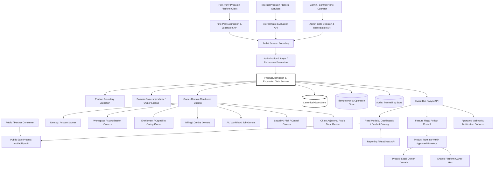
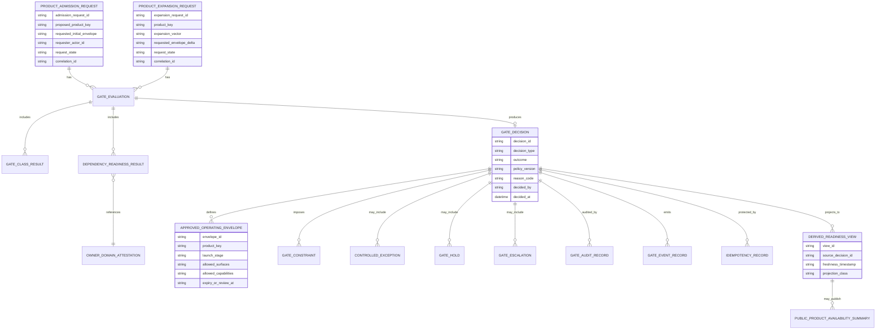
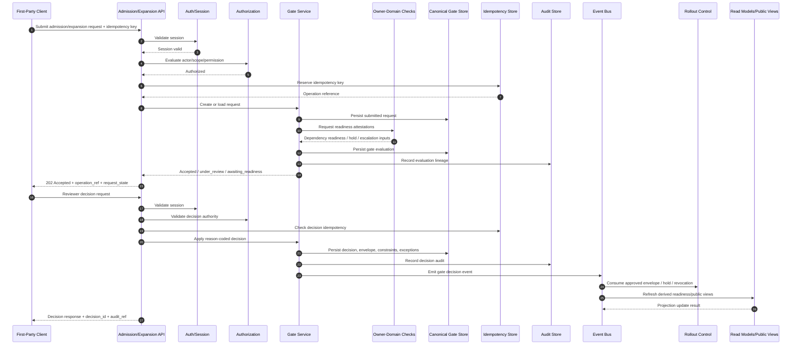

# FUZE Product Admission and Expansion Gate API Specification

## Document Metadata

- **Document Name:** `PRODUCT_ADMISSION_AND_EXPANSION_GATE_API_SPEC.md`
- **Document Type:** API SPEC v2 / Production-grade interface-contract specification
- **Status:** Draft production API specification
- **Version:** 2.0.0
- **Effective Date:** 2026-04-24
- **Last Updated:** 2026-04-24
- **Reviewed On:** 2026-04-24
- **Document Owner:** FUZE API Architecture / Product Admission and Expansion Gate API Governance; named individual owner not yet assigned
- **Approval Authority:** FUZE Platform Architecture and Product Architecture governance authority; explicit approval workflow not yet recorded
- **Review Cadence:** Quarterly, and whenever product-boundary interpretation, admission posture, product expansion posture, entitlement/capability-gating posture, commercial rails, AI/workflow infrastructure, public trust exposure, or governance/control requirements materially change
- **Governing Layer:** API SPEC v2 / platform constitution and product admission API expression
- **Parent Registry:** `API_SPEC_INDEX.md` for API-family lineage; API SPEC v2 canonical registry for this document family
- **Upstream Semantic Registry:** `REFINED_SYSTEM_SPEC_INDEX.md`
- **Upstream API Registry:** `API_SPEC_INDEX.md`
- **Primary Audience:** Platform architecture, API design, backend engineering, product architecture, product engineering, frontend engineering, rollout engineering, security, operations, audit, governance/control-plane operators, OpenAPI / AsyncAPI / SDK authors, implementation-contract authors, contract-test authors
- **Primary Purpose:** Define how FUZE APIs express, evaluate, record, audit, expose, constrain, and evolve product admission and product expansion gate decisions without allowing launch convenience, product ambition, rollout tooling, public surfaces, events, dashboards, admin controls, or implementation shortcuts to redefine refined product-admission semantics
- **Primary Upstream References:** `REFINED_SYSTEM_SPEC_INDEX.md`, `DOCS_SPEC_INDEX.md`, `SYSTEM_SPEC_INDEX.md`, `API_SPEC_INDEX.md`, `SYSTEM_BOUNDARY_AND_OWNERSHIP_SPEC.md`, `SYSTEM_OVERVIEW_AND_BOUNDARIES_SPEC.md`, `PLATFORM_ARCHITECTURE_SPEC.md`, `DOMAIN_OWNERSHIP_MATRIX_SPEC.md`, `DATA_MODEL_AND_ENTITY_OWNERSHIP_SPEC.md`, `ONCHAIN_OFFCHAIN_RESPONSIBILITY_SPEC.md`, `PRODUCT_BOUNDARY_AND_DOMAIN_OWNERSHIP_SPEC.md`, `PRODUCT_ADMISSION_AND_EXPANSION_GATE_SPEC.md`, `API_ARCHITECTURE_SPEC.md`, `PUBLIC_API_SPEC.md`, `INTERNAL_SERVICE_API_SPEC.md`, `EVENT_MODEL_AND_WEBHOOK_SPEC.md`, `IDEMPOTENCY_AND_VERSIONING_SPEC.md`, `MIGRATION_AND_BACKWARD_COMPATIBILITY_SPEC.md`, `ENTITLEMENT_AND_CAPABILITY_GATING_SPEC.md`, `FEATURE_FLAG_AND_ROLLOUT_CONTROL_SPEC.md`, `WORKFLOW_AND_AUTOMATION_SPEC.md`, `AI_ORCHESTRATION_SPEC.md`, `MODEL_ROUTING_AND_CONTEXT_SPEC.md`, `PLATFORM_CREDITS_SPEC.md`, `SUBSCRIPTIONS_AND_USAGE_BILLING_SPEC.md`, `SECURITY_AND_RISK_CONTROL_SPEC.md`, `AUDIT_LOG_AND_ACTIVITY_SPEC.md`, `AUDIT_AND_ACCESS_TRACEABILITY_SPEC.md`, `MONITORING_ALERTING_AND_INCIDENT_RESPONSE_SPEC.md`, `FUZE_ACCOUNT_ACCESS_AND_SESSION_THESIS_FINAL_SPEC.md`, `FUZE_ACCOUNT_ACCESS_AND_SESSION_CANONICAL_FINAL_SPEC.md`, `FUZE_WORKSPACE_ACCESS_CONTROL_BASICS_THESIS_FINAL_SPEC.md`
- **Primary Downstream Dependents:** Product integration specifications, rollout and product-readiness implementation contracts, product catalog APIs, product-specific public APIs, first-party product clients, internal service contracts, product enablement workflows, product launch checklists, admin/control-plane tooling, product event catalogs, webhook catalogs, reporting/read-model contracts, OpenAPI specifications, AsyncAPI specifications, SDKs, frontend clients, gateway policy, audit/observability contracts, production-readiness review artifacts, contract tests
- **API Surface Families Covered:** First-party product admission and expansion review APIs, internal gate-evaluation APIs, admin/control-plane gate-decision APIs, product-readiness read APIs, constrained public metadata APIs where explicitly approved, reporting/projection APIs, event/async APIs for gate lifecycle, webhook-safe derived notifications where approved, implementation-facing gate validation contracts
- **API Surface Families Excluded:** Raw database schemas, exact UI copy, launch calendar tooling, marketing campaign systems, sprint-level roadmap management, exact product pricing tables, exact feature-flag implementation schemas, ungoverned local scripts, raw provider APIs, raw smart-contract ABI details, detailed product-specific service topologies, legal/accounting treatment, team staffing workflow
- **Canonical System Owner(s):** FUZE Product Admission and Expansion Gate semantic owner; FUZE Product Boundary and Domain Ownership semantic owner for product/platform boundary interpretation; FUZE Platform Architecture for platform-fit and shared plane interpretation; individual owner domains listed in `DOMAIN_OWNERSHIP_MATRIX_SPEC.md` for shared primitive readiness
- **Canonical API Owner:** FUZE API Architecture with Product Admission and Expansion Gate API Governance
- **Supersedes:** Any previous or informal API interpretation that treats product admission, launch, rollout, expansion, or product-readiness status as a frontend flag, launch-note field, dashboard convenience, product-local self-certification, operator-only action, or marketing approval rather than a canonical gate decision derived from refined platform semantics
- **Superseded By:** Not yet known
- **Related Decision Records:** Not explicitly known; future admission exceptions, gate overrides, expansion approvals, and boundary-sensitive allowances MUST reference recorded decision records or approved exception records
- **Canonical Status Note:** This API specification expresses refined product admission and expansion gate semantics at the interface-contract layer. It does not own product-admission semantics. When tension exists, the active refined system specifications and registry govern semantic truth, while this document governs API expression, resource shape, decision contract, exposure posture, auditability, idempotency, event behavior, and downstream derivation guardrails.
- **Implementation Status:** Normative API specification for downstream implementation planning; machine-readable OpenAPI / AsyncAPI artifacts not yet generated
- **Approval Status:** Draft pending explicit FUZE approval workflow
- **Change Summary:** Created API SPEC v2 production-grade interface contract for product admission and product expansion gate APIs. Consolidates refined gate semantics, boundary discipline, owner-domain readiness, launch-stage constraints, decision recording, audit requirements, events, projections, idempotency, migration, diagrams, acceptance criteria, and contract-test coverage.

## Purpose

This document defines how FUZE APIs MUST express, validate, decide, record, expose, audit, and evolve the canonical product admission and product expansion gate model.

The purpose of this API specification is to ensure that every API surface participating in product admission, product launch, product expansion, product readiness, product enablement, launch-stage restriction, controlled exception, or gate reporting preserves the following refined-system semantics:

1. FUZE products are admitted only as bounded extension domains inside a shared platform.
2. Product admission is not the same as broad launch, unlimited rollout, public exposure, monetization depth, automation power, or ecosystem-critical coupling.
3. Product expansion is earned by stage-specific readiness, dependency maturity, boundary discipline, and control maturity.
4. Admission and expansion decisions are canonical gate outcomes, not frontend flags, marketing labels, rollout booleans, product-local self-certifications, or dashboard summaries.
5. Product ambition, provider readiness, runtime convenience, or operator confidence MUST NOT override platform-boundary, shared-primitive, audit, public-trust, commercial, AI/workflow, chain-aware, or governance constraints.
6. Derived reports, launch trackers, public product availability views, event projections, and read models MUST NOT become hidden owners of admission or expansion truth.

This document is a governing API specification, not a launch memo, product thesis, endpoint catalog, implementation schema, or marketing review checklist.

## Scope

This specification governs API contract rules for:

- product-admission requests, reviews, decisions, restrictions, holds, rejections, and escalations
- product-expansion requests, scope envelopes, gate evaluation, constraints, approvals, holds, and staged activation
- product launch-stage and operating-envelope resources as API-facing contract objects
- gate class evidence, readiness posture, dependency classification, constraint bundles, controlled exceptions, and decision lineage
- first-party and internal API consumption of canonical gate outcomes
- admin/control-plane decisions that approve, restrict, pause, remediate, or escalate product admission or expansion
- event and async behavior for gate lifecycle, readiness review, approval, hold, rejection, escalation, rollout activation, rollback, and constraint change
- derived read models, reporting surfaces, and public-safe product availability surfaces where approved
- downstream OpenAPI, AsyncAPI, SDK, gateway, audit, observability, and implementation-contract derivation

## Out of Scope

This specification does not govern:

- the full semantic definition of a FUZE product; that belongs to `PRODUCT_BOUNDARY_AND_DOMAIN_OWNERSHIP_SPEC.md`
- the top-level system boundary and ownership model
- detailed product-specific business design
- exact product roadmap sequence or sprint schedule
- exact pricing tables, packaging copy, GTM plan, launch narrative, or marketing campaign detail
- exact database table structure for gate records
- exact UI copy for product status labels
- exact feature-flag backend implementation
- exact legal/accounting/staffing workflow
- raw provider integrations except where their inputs affect readiness posture after normalization
- raw smart-contract ABI behavior except where chain-adjacent readiness is assessed through approved boundaries

## Design Goals

The API design goals are to:

1. make admission and expansion state explicit, durable, auditable, and machine-readable
2. prevent launch or expansion decisions from being represented as ambiguous flags or informal status strings
3. require every admitted or expanded product to preserve shared-platform primitive discipline
4. make gate classes, dependency classes, readiness evidence, constraints, and exceptions explicit at the API layer
5. distinguish proposed, admitted, approved-with-constraints, held, rejected, escalated, runtime rollout, and derived reporting states
6. support narrow launches without allowing narrow launch exceptions to become shadow architecture
7. make public, first-party, internal, admin/control, event, webhook, and reporting surfaces narrower than canonical decision contracts unless explicitly approved
8. preserve idempotency, replay safety, auditability, observability, and migration compatibility for all gate-changing API operations
9. give downstream implementation teams enough contract clarity to generate OpenAPI, AsyncAPI, SDKs, gateway policy, and contract tests without inventing contradictory semantics

## Non-Goals

This API specification is not intended to:

- maximize product admission speed
- allow a product to self-certify admission or expansion
- let rollout, feature-flag, or deployment systems become admission owners
- treat marketing launch readiness as platform gate readiness
- require every dependency to be fully mature before a narrow launch when a constrained, honest launch is architecture-safe
- collapse entitlement, authorization, rollout flags, product availability, and admission state into one API concept
- replace downstream implementation contracts, database schemas, runbooks, or machine-readable OpenAPI / AsyncAPI files

## Core Principles

### Platform-Fit-First API Principle

An admission API MUST evaluate whether the proposed product fits FUZE as a shared platform extension before it allows product-local implementation to proceed as production-bound truth.

### Stage-Specific Expansion API Principle

An expansion API MUST require the requested expansion vector and operating envelope to be explicit. Admission to FUZE MUST NOT imply unrestricted expansion, broad launch, public API exposure, monetization depth, automation power, or chain-aware behavior.

### Shared-Primitive Discipline API Principle

Gate APIs MUST fail closed or escalate when a product admission or expansion request requires alternate identity, workspace, authorization, entitlement, billing, credits, payout, registry, reserve, audit, governance, AI orchestration, workflow, or chain-aware primitives.

### Constraint-Is-Contract Principle

A constrained admission or constrained expansion is not an informal warning. Constraints MUST be represented as durable, reason-coded, scoped, time- or stage-bounded contract objects that downstream APIs, clients, workers, and control systems can enforce.

### Derived-Read Safety Principle

Product-readiness dashboards, launch trackers, public availability surfaces, product catalog views, reports, and analytics are derived unless a narrower approved spec states otherwise. They MUST reference canonical gate records and MUST NOT mutate gate truth.

### Audit-First Gate Mutation Principle

Every API operation that changes admission state, expansion state, approved scope, constraint posture, exception posture, or escalation posture MUST produce audit lineage, decision authority, reason codes, policy version references, correlation identifiers, and operation references.

### Conservative Ambiguity Principle

If the API cannot determine that a product or expansion preserves platform boundaries, the default response is hold, reject, or escalate, not approve.

## Canonical Definitions

- **Product Admission:** API-recognized canonical decision that a proposed product may exist as a bounded FUZE product-extension domain.
- **Product Expansion:** API-recognized canonical decision that an admitted product may widen scope, audience, monetization depth, automation power, public exposure, wallet-aware behavior, external integration, or ecosystem coupling.
- **Admission Request:** A canonical API resource representing a proposed product and its requested initial operating envelope.
- **Expansion Request:** A canonical API resource representing a proposed change to the approved operating envelope of an admitted product.
- **Gate Evaluation:** A structured assessment against required gate classes, dependency readiness, boundary discipline, risk posture, public-trust posture, and control maturity.
- **Gate Outcome:** The canonical result of an admission or expansion evaluation: approved, approved with constraints, held, rejected, or escalated.
- **Approved Operating Envelope:** The explicit scope within which the product may operate: audience, surfaces, capabilities, monetization posture, automation power, public exposure, integrations, and required constraints.
- **Launch Stage:** Runtime and release stage derived from gate outcome and rollout implementation: internal, beta, limited, narrow, broad, paused, rolled back, or contained.
- **Gate Hold:** A canonical state preventing admission, launch, or expansion until stated deficiencies are resolved.
- **Controlled Exception:** A narrow, documented, reason-coded, time-bounded or stage-bounded allowance that does not transfer canonical ownership or weaken refined system semantics.
- **Readiness Evidence:** Structured evidence that a gate dependency, owner-domain readiness check, security control, entitlement posture, commercial posture, workflow/AI posture, public-trust posture, or operational posture meets the requested stage.
- **Derived Readiness View:** A dashboard, report, public summary, product catalog field, launch tracker, or search/read-model projection derived from canonical gate state.

## Truth Class Taxonomy

Gate APIs MUST distinguish:

1. **Semantic truth** — what a FUZE product is, what admission means, what expansion means, and what shared primitives products may not redefine; owned by refined system specs.
2. **API contract truth** — route families, request models, response models, error classes, status classes, idempotency behavior, exposure rules, and versioning rules defined by API specs.
3. **Policy truth** — gate criteria, approval authority, required gate classes, rollout constraints, entitlement posture, risk posture, restriction posture, and controlled exception policy.
4. **Runtime truth** — current rollout, deployment, activation, pause, rollback, migration, feature-flag, and degraded-mode execution state.
5. **Ledger / storage truth** — durable admission records, expansion records, decision records, constraint records, exception records, audit records, operation records, and idempotency records.
6. **Provider-input truth** — raw external provider claims, model outputs, chain observations, integration readiness claims, or vendor signals before FUZE owner-domain validation.
7. **Event / async execution truth** — accepted gate-review jobs, evaluation attempts, emitted domain events, webhook deliveries, projection jobs, remediation workflows, and retry state.
8. **Projection / reporting truth** — readiness dashboards, product catalog availability fields, launch reports, internal summaries, public-safe availability summaries, exports, caches, and search indexes.
9. **Presentation truth** — UI labels, human-readable launch copy, marketing wording, status badges, and frontend-local state.

These truth classes MUST NOT be collapsed into a generic `product_status`, `launch_status`, `availability`, `enabled`, `ready`, or `approved` field without explicit class and owner context.

## Architectural Position in the Spec Hierarchy

This API specification sits below:

- `REFINED_SYSTEM_SPEC_INDEX.md`
- `SYSTEM_BOUNDARY_AND_OWNERSHIP_SPEC.md`
- `SYSTEM_OVERVIEW_AND_BOUNDARIES_SPEC.md`
- `PLATFORM_ARCHITECTURE_SPEC.md`
- `DOMAIN_OWNERSHIP_MATRIX_SPEC.md`
- `DATA_MODEL_AND_ENTITY_OWNERSHIP_SPEC.md`
- `ONCHAIN_OFFCHAIN_RESPONSIBILITY_SPEC.md`
- `PRODUCT_BOUNDARY_AND_DOMAIN_OWNERSHIP_SPEC.md`
- `PRODUCT_ADMISSION_AND_EXPANSION_GATE_SPEC.md`

It coordinates with:

- `API_ARCHITECTURE_SPEC.md`
- `PUBLIC_API_SPEC.md`
- `INTERNAL_SERVICE_API_SPEC.md`
- `EVENT_MODEL_AND_WEBHOOK_SPEC.md`
- `IDEMPOTENCY_AND_VERSIONING_SPEC.md`
- `MIGRATION_AND_BACKWARD_COMPATIBILITY_SPEC.md`
- `ENTITLEMENT_AND_CAPABILITY_GATING_SPEC.md`
- `FEATURE_FLAG_AND_ROLLOUT_CONTROL_SPEC.md`
- `SECURITY_AND_RISK_CONTROL_SPEC.md`
- `AUDIT_LOG_AND_ACTIVITY_SPEC.md`
- `MONITORING_ALERTING_AND_INCIDENT_RESPONSE_SPEC.md`

It governs downstream:

- product-specific API specs
- product integration contracts
- product rollout contracts
- admission/expansion OpenAPI contracts
- gate-event AsyncAPI contracts
- SDKs and first-party clients
- admin/control-plane tools
- product readiness dashboards and reports
- contract tests and production-readiness checklists

## Upstream Semantic Owners

The primary upstream semantic owner is `PRODUCT_ADMISSION_AND_EXPANSION_GATE_SPEC.md`. It defines admission, expansion, gate classes, dependency posture, narrow launch rules, hold logic, controlled exceptions, escalation posture, and readiness interpretation.

Material adjacent semantic owners include:

- `PRODUCT_BOUNDARY_AND_DOMAIN_OWNERSHIP_SPEC.md` for what admitted products may own and must not own
- `DOMAIN_OWNERSHIP_MATRIX_SPEC.md` for owner-domain readiness and shared primitive ownership
- `DATA_MODEL_AND_ENTITY_OWNERSHIP_SPEC.md` for canonical entity and derived projection implications
- `ONCHAIN_OFFCHAIN_RESPONSIBILITY_SPEC.md` for wallet-aware, chain-aware, and chain-adjacent expansion posture
- identity, account, session, workspace, authorization, entitlement, billing, credits, AI, workflow, security, audit, operations, public trust, and governance specs for gate-specific readiness dimensions

## API Surface Families

### Public API Surface

Public exposure of product admission or expansion state MUST be narrow, stable, and public-safe. Public APIs MAY expose approved product availability, public product catalog metadata, or public launch-stage descriptors only when approved by a public/trust specification. Public APIs MUST NOT expose internal gate evidence, unresolved holds, operator notes, security deficiencies, commercial defects, or governance-sensitive exception details.

### First-Party Application API Surface

First-party applications MAY create admission and expansion drafts, submit requests, view relevant review state, render constraints, and guide product teams through missing evidence. They MUST NOT bypass owner-domain readiness checks or reinterpret a hold as launch permission.

### Internal Service API Surface

Internal services MAY perform gate evaluation, dependency verification, boundary validation, projection updates, event publication, and rollout coordination. Internal APIs MUST use owner-controlled contracts for shared dependencies and MUST NOT become hidden broad-write shortcuts.

### Admin / Control-Plane API Surface

Admin/control-plane APIs MAY approve, constrain, hold, reject, escalate, pause, remediate, or revoke gate decisions only through bounded, reason-coded, audited, policy-constrained operations. Operator override does not transfer semantic ownership.

### Event / Webhook / Async API Surface

Event APIs MAY publish gate lifecycle events, constraint changes, launch-stage changes, escalation events, projection refresh requests, and public-safe derived notifications. Events and webhooks MUST remain downstream of canonical gate decisions and MUST NOT be accepted as canonical mutation authority.

### Reporting / Projection API Surface

Reporting APIs MAY provide read-optimized views of gate state, readiness posture, launch status, and dependency health. These views are derived and MUST include freshness, source lineage, and canonical gate references.

### Chain-Adjacent API Surface

Chain-adjacent exposure applies only when admission or expansion includes wallet-aware, chain-aware, payout, credits commitment, registry, governance, or public trust behavior. Chain observations remain normalized inputs until owner-domain validation succeeds.

## System / API Boundaries

This API spec governs API expression of gate decisions. It does not define product meaning, platform meaning, shared primitive ownership, chain truth, entitlement truth, billing truth, credits truth, workflow truth, AI truth, or public trust semantics.

The API layer MUST:

- require admission and expansion mutations to terminate in the product-admission owner domain
- require shared dependency verification through owner-domain APIs
- require constraints and exceptions to be durable, scoped, reason-coded, and auditable
- require derived read models to reference canonical gate records
- reject or escalate product-local attempts to self-approve shared-primitive violations

## Adjacent API Boundaries

- `PRODUCT_BOUNDARY_AND_DOMAIN_OWNERSHIP_API_SPEC.md` governs API expression of product/platform boundary rules after and around admission.
- `DOMAIN_OWNERSHIP_MATRIX_API_SPEC.md` governs domain owner lookup and ownership validation APIs.
- `DATA_MODEL_AND_ENTITY_OWNERSHIP_API_SPEC.md` governs entity ownership and data-model implications.
- `ENTITLEMENT_AND_CAPABILITY_GATING_API_SPEC.md` governs actor/workspace/product capability eligibility after product admission.
- `FEATURE_FLAG_AND_ROLLOUT_CONTROL_API_SPEC.md` governs rollout activation mechanics but MUST consume gate decisions rather than own them.
- `PUBLIC_PRODUCT_CATALOG_API_SPEC.md` governs public-safe product metadata exposure derived from canonical admission state.
- `AUDIT_LOG_AND_ACTIVITY_API_SPEC.md` and `AUDIT_AND_ACCESS_TRACEABILITY_API_SPEC.md` govern durable audit surfaces.
- `EVENT_MODEL_AND_WEBHOOK_SPEC.md` governs event and webhook derivation rules.

## Conflict Resolution Rules

1. Refined system specs override API convenience.
2. The admission/expansion gate owner decides canonical gate outcome; rollout systems execute approved outcome only.
3. Product-boundary rules override product-local implementation convenience.
4. Domain owner readiness responses override product-provided self-attestations for shared primitives.
5. Public availability and product catalog projections never override canonical gate state.
6. Feature flags, deployment state, and runtime activation never prove admission or expansion approval.
7. Provider inputs, chain observations, AI model outputs, and external claims remain input truth until normalized and accepted by the relevant owner domain.
8. When ambiguity remains, the API MUST return hold, escalation, or conservative denial rather than approve.

## Default Decision Rules

1. A new product defaults to `not_admitted` until an approved gate outcome exists.
2. An admitted product defaults to no additional expansion beyond its approved operating envelope.
3. Any expansion vector not explicitly approved is forbidden.
4. Any shared primitive not mapped to a canonical owner domain is incomplete and MUST block approval.
5. Any public exposure request without public-safe projection rules is held.
6. Any commercial, credits, payout, chain-aware, governance, or trust-sensitive ambiguity defaults to hold or escalation.
7. Any controlled exception without reason code, scope, expiry/stage bound, remediation path, and audit lineage is invalid.
8. Any stale derived readiness view MUST be refreshed or bypassed in favor of canonical owner-domain checks before approving sensitive expansion.

## Roles / Actors / API Consumers

- **Product proposer:** Creates an admission or expansion request and provides product-local domain proposal, requested envelope, dependency posture, and evidence.
- **Product architecture reviewer:** Reviews product fit, local-domain boundaries, staged expansion path, and boundary implications.
- **Platform architecture reviewer:** Reviews platform fit, shared primitive usage, owner-domain readiness, and system-boundary implications.
- **Shared domain owner:** Provides readiness verdicts for identity, workspace, authorization, entitlement, billing, credits, AI, workflow, chain-aware, audit, security, or operations dependencies.
- **Security/risk reviewer:** Provides risk posture and restriction conditions for sensitive launches or expansions.
- **Governance/control operator:** Performs bounded, audited decisions, holds, escalations, revocations, or remediations.
- **First-party client:** Renders request, evidence, state, constraints, and next required actions without becoming decision authority.
- **Internal rollout service:** Activates or narrows runtime rollout only after consuming canonical gate outcome.
- **Reporting/public consumers:** Read derived views only.

## Resource / Entity Families

### Canonical API Resources

- `ProductAdmissionRequest`
- `ProductExpansionRequest`
- `GateEvaluation`
- `GateClassResult`
- `DependencyReadinessResult`
- `OwnerDomainReadinessAttestation`
- `AdmissionDecision`
- `ExpansionDecision`
- `ApprovedOperatingEnvelope`
- `GateConstraint`
- `GateHold`
- `ControlledException`
- `GateEscalation`
- `GateReviewAssignment`
- `GateOperation`
- `GateAuditReference`
- `GateEventReference`

### Derived API Resources

- `ProductReadinessView`
- `LaunchStageView`
- `ProductCatalogAvailabilityView`
- `GateDashboardSummary`
- `ReadinessReportExport`
- `PublicProductAvailabilitySummary`

Derived resources MUST include source references and freshness metadata and MUST NOT accept canonical mutation.

## Ownership Model

The product-admission gate domain owns canonical admission and expansion decision records. Product domains own product-local proposals and product-local evidence but not approval. Shared platform owner domains own readiness verdicts for their own dependencies. Rollout systems own runtime activation execution but not admission semantics. Reporting systems own derived summaries but not gate decisions.

## Authority / Decision Model

### Ordinary Decision Authority

Ordinary admission or expansion approval requires:

- authenticated actor
- authorized reviewer or control-plane role
- product/domain scope
- valid request state
- complete required gate evaluation
- owner-domain readiness inputs for all hard dependencies
- recorded policy version
- reason-coded decision
- audit and operation references

### Admin / Control Authority

Admin/control actions MAY:

- impose or lift holds
- add or narrow constraints
- approve controlled exceptions
- pause or revoke expansion
- escalate disputed ownership
- remediate incorrect gate state

They MUST NOT silently rewrite decision history, erase audit lineage, mutate shared owner-domain truth, or convert an exception into permanent architecture.

## Authentication Model

All mutation-capable gate APIs MUST require platform authentication and session validation. Authentication proves actor continuity only. It does not prove authorization, product authority, reviewer authority, entitlement, or admission authority.

Public-safe reads MAY use public access only for explicitly approved public metadata surfaces. Internal evidence, reviews, holds, controlled exceptions, and security-sensitive details MUST require authenticated, authorized access.

## Authorization / Scope / Permission Model

Gate APIs MUST separate:

- actor identity
- session validity
- product scope
- workspace/organization scope where relevant
- reviewer role
- owner-domain authority
- control-plane authority
- entitlement/capability gating where relevant
- policy hold or risk restriction

Required permission classes SHOULD include:

- `product_admission.request.create`
- `product_admission.request.read`
- `product_admission.evidence.submit`
- `product_admission.evaluate`
- `product_admission.decide`
- `product_admission.constrain`
- `product_admission.escalate`
- `product_expansion.request.create`
- `product_expansion.evaluate`
- `product_expansion.decide`
- `product_gate.exception.approve`
- `product_gate.admin.remediate`
- `product_gate.public_metadata.publish`

Downstream implementations MAY rename permissions only through approved mapping and MUST preserve the semantics.

## Entitlement / Capability-Gating Model

Admission and expansion gate APIs do not replace entitlement. Instead:

- product admission determines whether a product may exist as a FUZE product domain
- expansion determines what scope the product may operate within
- entitlement determines whether a subject may access or use a product or capability
- authorization determines whether an actor may perform an action
- rollout controls determine whether an approved product/capability is currently active for a cohort

A product may be admitted but not entitled for a subject. A subject may be entitled but blocked by rollout, authorization, risk, or gate constraints. A rollout flag may narrow exposure but MUST NOT represent admission truth.

## API State Model

Canonical gate state MUST distinguish:

- `draft`
- `submitted`
- `under_review`
- `awaiting_owner_domain_readiness`
- `awaiting_security_review`
- `awaiting_governance_review`
- `approved`
- `approved_with_constraints`
- `held`
- `rejected`
- `escalated`
- `revoked`
- `superseded`
- `archived`

Runtime launch state MUST be represented separately:

- `not_started`
- `provisioning`
- `internal_only`
- `beta`
- `limited`
- `narrow_launch`
- `broad_launch`
- `paused`
- `contained`
- `rolling_back`
- `retired`

Derived reporting state MUST be separately marked as derived and MUST include freshness and source references.

## Lifecycle / Workflow Model

1. A proposer creates a draft admission or expansion request.
2. The request identifies product-local domain, requested operating envelope, expansion vector if any, dependency classes, public/trust exposure, monetization posture, AI/workflow posture, chain-aware posture, control posture, and expected rollout stage.
3. The API validates schema, ownership references, and required fields.
4. The API records idempotency and operation references before accepting mutation.
5. The API performs authentication and authorization checks.
6. The API routes shared dependency checks to owner domains.
7. The gate evaluation records gate-class outcomes and evidence references.
8. Boundary-sensitive ambiguity triggers escalation.
9. A reviewer or control-plane action records a reason-coded decision.
10. If approved, constraints and operating envelope become enforceable contract state.
11. Rollout systems consume the gate outcome and may activate only within approved constraints.
12. Events and projections are emitted from canonical gate state.
13. Derived read models and public surfaces refresh from canonical gate state.
14. Holds, revocations, remediations, and exceptions remain auditable and lineage-bound.

## Architecture Diagram — Mermaid flowchart

## Data Design — Mermaid Diagram

## Flow View

### Synchronous Admission / Expansion Submission

1. Client submits request with idempotency key, correlation ID, product key/proposed product key, requested envelope, dependency classification, and evidence references.
2. API validates authentication, authorization, scope, product identity, schema, and request state.
3. API stores idempotency record and operation reference.
4. API records request in canonical gate store as `submitted` or returns existing operation result for replay.
5. API returns accepted operation reference and current request state.

### Gate Evaluation Path

1. Gate service loads request and required gate classes.
2. Owner-domain readiness checks are requested from the relevant owner services.
3. Boundary validation checks product-local vs shared-primitive implications.
4. Commercial, AI/workflow, wallet/chain, transparency, governance, operational, security, and rollout impacts are evaluated where relevant.
5. Evaluation records each gate class result and evidence reference.
6. Missing hard dependency produces hold or escalation.
7. Boundary exception requirement produces escalation unless already covered by an approved controlled exception.

### Decision Path

1. Authorized reviewer or control-plane operator loads complete evaluation.
2. API validates authority, policy version, required reason codes, and required audit metadata.
3. Decision is recorded as approved, approved with constraints, held, rejected, escalated, revoked, or remediated.
4. Constraints, exceptions, holds, operating envelope, and review dates are stored as durable resources.
5. Audit record and gate lifecycle event are emitted.
6. Rollout and projection consumers refresh from canonical gate state.

### Retry / Replay Path

1. Duplicate request with same idempotency key returns the same operation reference and result if request body matches.
2. Duplicate request with same idempotency key and conflicting body returns idempotency conflict.
3. Retried owner-domain readiness check reuses operation references and MUST NOT create duplicate decisions.

### Failure / Degraded-Mode Path

1. If owner-domain readiness is unavailable for a hard dependency, the API returns accepted evaluation state with `awaiting_owner_domain_readiness` or holds the request.
2. If projection refresh fails, canonical decision remains valid but derived views are marked stale.
3. If audit write fails for a mutation-capable operation, the operation MUST fail closed unless a governed write-ahead audit mechanism is active.
4. If public projection is stale or inconsistent, public API MUST suppress or narrow exposure rather than publish misleading status.

### Admin / Operator Path

1. Operator performs bounded action with reason code, policy version, scope, and correlation ID.
2. API validates control-plane authority and required approvals.
3. Action records new decision, hold, constraint, exception, revocation, remediation, or escalation resource.
4. Audit, event, observability, and downstream projection updates are mandatory.

## Data Flows — Mermaid sequenceDiagram

## Request Model

Mutation requests MUST include:

- stable idempotency key for create/submit/decision/remediation operations
- correlation ID and trace context
- actor context supplied by auth/session and authorization layers, not trusted from request body
- product key or proposed product key
- request type: admission or expansion
- requested operating envelope or envelope delta
- requested API surface families
- product-local domain description reference
- shared dependency classification: hard, soft, expansion
- gate class evidence references
- public exposure, commercial, AI/workflow, chain-aware, governance/control, security, operational, and reporting impact flags where relevant
- desired launch stage
- reason code for decision or admin/control-plane mutation
- policy version reference for decision-changing operations

Requests MUST NOT accept:

- direct writes to shared owner-domain readiness truth
- frontend-provided final approval authority
- public exposure booleans without approved projection/public-surface policy
- unscoped controlled exceptions
- hidden product-local shared primitive declarations

## Response Model

Responses MUST distinguish:

- synchronous validation success
- accepted async evaluation
- current canonical request state
- current canonical decision state
- constraint and hold state
- derived projection state
- final gate outcome
- authorization or entitlement denial
- policy hold
- conflict or idempotency replay
- stale projection warning
- operation, audit, and correlation references

Sensitive internal evidence MUST be omitted from public responses. First-party and internal responses MAY include actionable missing evidence, gate-class result summaries, owner-domain readiness states, and next required actions according to authorization.

## Error / Result / Status Model

Required error classes include:

- `invalid_request_schema`
- `missing_required_gate_evidence`
- `unknown_product_key`
- `product_not_admitted`
- `product_already_admitted`
- `expansion_outside_current_envelope`
- `owner_domain_readiness_unavailable`
- `hard_dependency_not_ready`
- `shared_primitive_boundary_violation`
- `controlled_exception_required`
- `controlled_exception_invalid`
- `authorization_denied`
- `permission_denied`
- `entitlement_denied`
- `policy_hold`
- `security_risk_hold`
- `governance_review_required`
- `public_exposure_not_approved`
- `idempotency_conflict`
- `state_conflict`
- `stale_projection`
- `rate_limited`
- `audit_write_failed`
- `migration_mapping_required`

Status values MUST be explicit and MUST NOT rely on a single boolean `approved` or `enabled` field.

## Idempotency / Retry / Replay Model

Idempotency is mandatory for:

- admission request creation
- expansion request creation
- request submission
- evidence submission
- gate evaluation job creation
- owner-domain readiness request
- decision application
- constraint creation/update
- hold creation/lift
- exception approval/revocation
- rollout activation request derived from gate outcome
- remediation and correction actions

Replay behavior MUST be deterministic. Same key and same payload returns the original operation reference/result. Same key with incompatible payload returns `idempotency_conflict`. Retried async jobs MUST NOT duplicate gate decisions, duplicate events, duplicate audit records, duplicate rollout activations, or duplicate public projection publications.

## Rate Limit / Abuse-Control Model

Gate APIs MUST apply stricter abuse controls to:

- repeated admission submissions for the same proposed product
- repeated expansion requests outside approved envelope
- repeated evidence mutations after hold
- broad public exposure requests
- requests involving commercial, payout, credits, chain-aware, governance, or public-trust surfaces
- admin/control-plane mutation attempts
- public availability queries if they could leak launch posture or infer unannounced products

Rate-limit responses MUST include safe retry guidance without exposing sensitive decision details.

## Endpoint / Route Family Model

This spec does not mandate final path names, but allowed route families SHOULD include:

- `/product-admission/requests`
- `/product-admission/requests/{admission_request_id}`
- `/product-admission/requests/{admission_request_id}/submit`
- `/product-admission/requests/{admission_request_id}/evidence`
- `/product-admission/requests/{admission_request_id}/evaluations`
- `/product-admission/requests/{admission_request_id}/decisions`
- `/products/{product_key}/expansion-requests`
- `/products/{product_key}/expansion-requests/{expansion_request_id}`
- `/products/{product_key}/approved-envelope`
- `/products/{product_key}/gate-constraints`
- `/products/{product_key}/gate-holds`
- `/products/{product_key}/controlled-exceptions`
- `/products/{product_key}/readiness-view`
- `/public/products/{product_key}/availability` where explicitly approved
- `/admin/product-gates/{gate_resource_id}/remediations`
- `/internal/product-gates/evaluations/{evaluation_id}`

Forbidden route families include product-local routes that directly approve admission, product-local routes that self-attest shared primitive readiness, and public routes that expose unresolved internal gate details.

## Public API Considerations

Public APIs MUST expose only stable, approved, public-safe, non-sensitive derived availability. Public surfaces MUST NOT expose:

- unresolved proposed products
- internal holds
- security/risk reasons
- owner-domain deficiencies
- governance exception details
- internal rollout sequencing
- raw evaluation evidence
- internal reviewer identities

Public responses SHOULD include safe availability state, public product description, approved availability class, and source/freshness metadata where relevant.

## First-Party Application API Considerations

First-party clients MAY guide proposers and reviewers through request creation, evidence submission, missing-dependency resolution, decision review, and constraint rendering. Clients MUST render canonical decision, derived readiness, runtime rollout, and entitlement state separately.

## Internal Service API Considerations

Internal gate evaluation APIs MAY coordinate owner-domain checks, dependency classification, event production, projection refresh, and rollout integration. Internal APIs MUST not bypass canonical owner-domain contracts or write shared primitive truth directly.

## Admin / Control-Plane API Considerations

Admin/control APIs MUST require:

- elevated authorization
- reason code
- policy version
- scope and target resource
- operation reference
- audit reference
- explicit outcome
- expiration or review marker for exceptions where applicable
- rollback/remediation path for high-impact changes

Admin actions MUST be separated from ordinary application APIs and MUST be observable.

## Event / Webhook / Async API Considerations

Canonical gate events MAY include:

- `product_admission.request.created`
- `product_admission.request.submitted`
- `product_admission.evaluation.started`
- `product_admission.evaluation.completed`
- `product_admission.decision.approved`
- `product_admission.decision.approved_with_constraints`
- `product_admission.decision.held`
- `product_admission.decision.rejected`
- `product_admission.decision.escalated`
- `product_expansion.request.created`
- `product_expansion.decision.approved`
- `product_expansion.decision.held`
- `product_gate.constraint.created`
- `product_gate.constraint.updated`
- `product_gate.exception.approved`
- `product_gate.exception.revoked`
- `product_gate.decision.revoked`
- `product_gate.public_projection.refreshed`

Events MUST include source resource IDs, event ID, producer, occurred-at timestamp, correlation ID, policy version where relevant, and projection eligibility. Webhooks MUST be derived and public-safe unless explicitly internal.

## Chain-Adjacent API Considerations

If admission or expansion touches wallet-aware, holder-aware, token, credits commitment, payout, registry, governance, multisig, timelock, or chain-visible public trust posture:

- chain observations remain input truth until normalized
- chain-native truth remains canonical only for facts explicitly committed to contract design
- off-chain policy, admission, expansion, entitlement, commercial, and public reporting truth remain owner-domain truth
- public chain references MUST be source-linked and must not imply broader product approval than the gate outcome permits

## Data Model / Storage Support Implications

Storage contracts MUST support:

- immutable decision history
- mutable current state derived from decision history
- explicit operating envelope versions
- gate class result records
- dependency readiness records
- owner-domain attestation references
- constraint and controlled exception records
- hold and escalation records
- idempotency and operation records
- audit and correlation references
- projection freshness metadata
- migration mapping records

Direct overwrites of prior gate decisions are forbidden except through recorded correction/remediation semantics.

## Read Model / Projection / Reporting Rules

Read models MUST:

- derive from canonical gate records
- include source resource references
- include freshness timestamps
- mark stale views explicitly
- distinguish canonical decision state from runtime rollout state
- distinguish operating envelope from entitlement and authorization
- suppress or narrow public exposure when canonical or projection consistency is uncertain

Reporting views MUST NOT become mutation sources.

## Security / Risk / Privacy Controls

Gate APIs MUST protect:

- proposed product concepts before public approval
- security/risk review details
- governance/control exceptions
- commercial readiness deficiencies
- owner-domain internal evidence
- chain-adjacent and public trust posture details before approved disclosure
- reviewer identities where sensitive

Sensitive gate evidence MUST be scoped and classification-aware. Access to evidence MUST be audited.

## Audit / Traceability / Observability Requirements

Every material gate operation MUST record:

- actor ID
- actor authority / role context
- product key or proposed product key
- request ID
- evaluation ID
- decision ID where applicable
- reason code
- policy version
- idempotency key hash or reference
- correlation ID
- trace ID
- source and target states
- owner-domain readiness references
- constraint / exception references
- emitted event IDs
- projection refresh references

Observability MUST cover evaluation latency, readiness-check failures, hold rates, escalation rates, stale projection incidents, public suppression incidents, decision replay rates, idempotency conflicts, and control-plane interventions.

## Failure Handling / Edge Cases

### Owner-Domain Readiness Unavailable
Hard dependency readiness unavailable for sensitive expansion MUST produce hold or awaiting-readiness state, not approval.

### Product Requests Alternate Primitive
The API MUST reject or escalate if product admission requires alternate identity, billing, credits, entitlement, payout, registry, governance, audit, or workflow primitives.

### Rollout Flag Active Without Gate Approval
Runtime activation MUST be contained or rolled back. The gate state remains canonical.

### Public Catalog Shows Stale Availability
Public view MUST suppress, narrow, or mark stale output according to public-surface policy.

### Controlled Exception Expired
The product MUST return to constrained posture or trigger review. Expired exception MUST NOT continue silently.

### Conflicting Reviewer Decisions
The API MUST detect state conflict and require higher-authority resolution or explicit supersession.

### Admission Approved but Expansion Not Approved
The product may operate only within approved envelope. Expansion vectors outside the envelope MUST be denied.

### Product Entitled but Gate-Held
Gate hold wins for product-level availability where launch or expansion is not approved. Entitlement may remain true but capability exposure MUST be suppressed.

## Migration / Versioning / Compatibility / Deprecation Rules

- Legacy launch flags MUST be mapped to explicit gate decision, rollout state, entitlement state, or presentation state.
- Existing products MUST be backfilled with canonical admission state and operating envelope before API v2 consumers rely on gate state.
- Public fields MAY be preserved only as derived compatibility aliases and MUST not become canonical.
- Deprecated ambiguous fields such as `is_product_ready`, `launch_status`, `approved`, or `enabled` MUST map to explicit v2 state classes before removal.
- API version changes MUST preserve audit and decision lineage.
- Tightening of gate rules MUST prefer explicit holds, constraints, and migration windows rather than silent behavior changes.

## OpenAPI / AsyncAPI / SDK Derivation Rules

OpenAPI artifacts MUST preserve:

- distinct admission and expansion resources
- distinct canonical, runtime, derived, and public state fields
- idempotency headers and operation references
- reason-code requirements for decision mutations
- audit/correlation response references
- error class taxonomy
- authorization scope annotations
- public vs internal/admin schemas

AsyncAPI artifacts MUST preserve:

- gate lifecycle event names
- event source and correlation metadata
- canonical resource references
- projection eligibility markers
- replay/deduplication fields
- public-safe vs internal event separation

SDKs MUST NOT flatten gate state into booleans.

## Implementation-Contract Guardrails

Implementation contracts MUST NOT:

- store only a single product status string
- let product-local services approve themselves
- allow feature flags to stand in for admission
- treat public catalog publication as gate approval
- allow entitlement success to bypass a gate hold
- allow admin correction without audit and reason codes
- collapse controlled exceptions into permanent product configuration
- publish unresolved hold reasons to public consumers
- retry decision mutations without idempotency protection
- write shared dependency readiness from the product gate service except through owner-domain contracts

## Downstream Execution Staging

Recommended implementation order:

1. define canonical gate resources and state machine
2. define owner-domain readiness contract interfaces
3. define idempotency and audit requirements
4. define admin/control-plane decision APIs
5. define first-party request and review APIs
6. define internal evaluation and event flows
7. define derived readiness views and product catalog projections
8. define rollout integration consuming approved envelopes
9. define public-safe availability API
10. define migration mappings from legacy launch/readiness fields
11. generate OpenAPI, AsyncAPI, SDK, and contract tests

## Required Downstream Specs / Contract Layers

Downstream work MUST define:

- machine-readable admission/expansion OpenAPI specs
- gate event AsyncAPI specs
- owner-domain readiness attestation contracts
- gate evidence schema contracts
- admin/control-plane workflow contracts
- public product availability projection contracts
- rollout integration contracts
- audit/observability field contracts
- migration mapping contracts
- contract-test suites and production-readiness review checklists

## Boundary Violation Detection / Non-Canonical API Patterns

Forbidden patterns include:

1. `POST /products/{id}/approve-launch` owned by a product-local service.
2. A public product catalog field treated as canonical admission state.
3. A feature flag enabling broad launch without approved expansion envelope.
4. Product-local database field `billing_ready=true` standing in for billing-domain readiness.
5. Product-local entitlement logic replacing platform entitlement.
6. Dashboard override changing admission state.
7. Admin action lifting hold without reason code and audit lineage.
8. Controlled exception with no expiry, no scope, no owner, or no remediation path.
9. Event consumer treating `projection.refreshed` as a canonical decision.
10. SDK helper exposing only `isReady()` for gate state.

## Canonical Examples / Anti-Examples

### Canonical Example 1 — Narrow Launch Approval
A product is admitted for internal beta with AI workflow enabled, public API disabled, billing disabled, and explicit review date. The API records approved-with-constraints, operating envelope, constraints, audit, and event. This is canonical.

### Canonical Example 2 — Expansion Hold for Commercial Readiness
An admitted product requests paid broad launch, but billing and entitlement owners cannot attest readiness. The API records expansion hold with missing hard dependencies. This is canonical.

### Canonical Example 3 — Chain-Aware Escalation
A product requests wallet-aware public claims. The API escalates because public trust and chain-adjacent boundaries require additional owner-domain validation. This is canonical.

### Canonical Example 4 — Public Availability Derived from Gate State
A public product catalog shows only products with approved public-safe projection and suppresses held or escalated products. This is canonical.

### Anti-Example 1 — Product Self-Approval
A product service writes `admitted=true` after internal testing. This is forbidden.

### Anti-Example 2 — Rollout Flag Overrides Hold
A feature flag turns on public availability while the expansion request is held. This is forbidden.

### Anti-Example 3 — Exception Becomes Permanent
A time-bounded exception remains active after expiry because no worker checked it. This is forbidden.

### Anti-Example 4 — Entitlement Replaces Admission
A workspace is commercially entitled to a product that has not passed admission or expansion gates. The product launches anyway. This is forbidden.

## Acceptance Criteria

1. The API rejects admission approval unless the request has a product-local domain description, requested envelope, gate evidence, owner-domain readiness inputs for hard dependencies, reason code, policy version, authorization, idempotency, and audit reference.
2. The API can represent proposed, submitted, under review, awaiting readiness, approved, approved-with-constraints, held, rejected, escalated, revoked, superseded, and archived states without using a single boolean field.
3. The API prevents product-local services from approving product admission or expansion.
4. The API prevents runtime rollout activation outside the approved operating envelope.
5. The API records constraints and controlled exceptions as durable, scoped, reason-coded resources.
6. The API denies or escalates requests that require alternate shared primitives.
7. The API separates admission state, rollout state, entitlement state, authorization state, and public availability state.
8. The API emits canonical gate events only after canonical state changes are persisted.
9. The API marks derived readiness/public views with source references and freshness metadata.
10. Public APIs suppress internal hold, security, governance, commercial, and owner-domain deficiency details.
11. Idempotent replay of request creation or decision application returns deterministic results and does not duplicate events, audit, or rollout activation.
12. Admin/control operations require elevated authority, reason code, policy version, scope, audit, and correlation references.
13. Stale projections cannot be used to approve sensitive expansion.
14. Migration mappings can map legacy readiness flags to explicit v2 state classes.
15. OpenAPI/AsyncAPI/SDK derivations preserve state separation and do not flatten gate state into `enabled` or `approved` booleans.

## Test Cases

### Positive Path Tests

1. Create admission request for a bounded product with complete hard dependency evidence; expect `submitted` and operation reference.
2. Complete gate evaluation with all owner-domain readiness checks passed; expect evaluation completed and audit record.
3. Approve admission with constraints; expect decision, operating envelope, constraints, audit, event, and projection refresh.
4. Submit expansion request for a previously admitted product within current boundary model; expect accepted evaluation.
5. Publish public availability only after approved public-safe projection; expect public response with safe metadata only.

### Negative / Boundary Tests

6. Submit admission request requiring alternate identity root; expect boundary violation or escalation.
7. Submit expansion request requiring product-local credits balance; expect shared primitive violation.
8. Attempt product-local approval route; expect route forbidden or authorization denial.
9. Attempt broad public launch when expansion is held; expect rollout containment or denial.
10. Attempt to approve without reason code; expect validation error.

### Authorization / Entitlement / Scope Tests

11. Authenticated actor without reviewer permission attempts decision; expect `permission_denied`.
12. Entitled workspace requests product use while product gate is held; expect product availability denied or suppressed.
13. Reviewer outside product scope attempts approval; expect scoped authorization denial.
14. Admin attempts exception without control-plane authority; expect denial.

### Idempotency / Retry / Replay Tests

15. Replay admission creation with same key and body; expect same operation result.
16. Replay admission creation with same key and different envelope; expect `idempotency_conflict`.
17. Retry decision application after network timeout; expect single decision and single event.
18. Retry owner-domain readiness job; expect no duplicate readiness record.

### Conflict / Concurrency Tests

19. Two reviewers attempt contradictory decisions concurrently; expect state conflict and no silent overwrite.
20. Decision attempted after request superseded; expect state conflict.
21. Expired controlled exception used for rollout; expect denial or review required.

### Rate Limit / Abuse Tests

22. Repeated expansion requests outside envelope exceed threshold; expect rate limit or review restriction.
23. Public queries infer unannounced products; expect safe not-found or suppressed response.

### Failure / Degraded-Mode Tests

24. Owner-domain readiness service unavailable for hard dependency; expect awaiting-readiness or hold, not approval.
25. Audit write fails during decision mutation; expect fail closed unless approved write-ahead audit path exists.
26. Projection refresh fails after approval; canonical state persists and derived view marked stale.

### Migration / Compatibility Tests

27. Legacy `is_ready=true` maps to explicit gate, rollout, entitlement, or presentation state; ambiguous values require migration review.
28. Deprecated `launch_status` does not appear in v2 public schema except as documented compatibility alias.

### Audit / Observability Tests

29. Every decision response includes audit reference, operation reference, correlation ID, and decision ID.
30. Metrics record hold rates, escalation rates, owner readiness failures, stale projection incidents, and idempotency conflicts.

## Dependencies / Cross-Spec Links

This API specification depends on:

- `REFINED_SYSTEM_SPEC_INDEX.md`
- `API_SPEC_INDEX.md`
- `DOCS_SPEC_INDEX.md`
- `SYSTEM_SPEC_INDEX.md`
- `SYSTEM_BOUNDARY_AND_OWNERSHIP_SPEC.md`
- `SYSTEM_OVERVIEW_AND_BOUNDARIES_SPEC.md`
- `PLATFORM_ARCHITECTURE_SPEC.md`
- `DOMAIN_OWNERSHIP_MATRIX_SPEC.md`
- `DATA_MODEL_AND_ENTITY_OWNERSHIP_SPEC.md`
- `ONCHAIN_OFFCHAIN_RESPONSIBILITY_SPEC.md`
- `PRODUCT_BOUNDARY_AND_DOMAIN_OWNERSHIP_SPEC.md`
- `PRODUCT_ADMISSION_AND_EXPANSION_GATE_SPEC.md`
- `API_ARCHITECTURE_SPEC.md`
- `PUBLIC_API_SPEC.md`
- `INTERNAL_SERVICE_API_SPEC.md`
- `EVENT_MODEL_AND_WEBHOOK_SPEC.md`
- `IDEMPOTENCY_AND_VERSIONING_SPEC.md`
- `MIGRATION_AND_BACKWARD_COMPATIBILITY_SPEC.md`
- identity/account/session/workspace/access-control foundation specs
- entitlement, billing, credits, AI, workflow, security, audit, monitoring, rollout, public trust, and chain-adjacent specs where relevant

## Explicitly Deferred Items

- Final path naming and OpenAPI operation IDs
- Exact database schema for gate resources
- Exact public product catalog schema
- Exact owner-domain readiness API schema per owner domain
- Exact approval workflow tooling and named approval authority
- Exact policy version registry
- Exact feature flag provider integration
- Exact UI copy for gate states and constraints
- Exact rollout calendar semantics

Deferred items MUST NOT be used to weaken canonical gate semantics.

## Final Normative Summary

FUZE product admission and product expansion APIs MUST preserve the refined gate model. Admission means a product may exist as a bounded FUZE product-extension domain. Expansion means a specific approved widening of that product's operating envelope. Neither admission nor expansion may be inferred from rollout flags, public catalog entries, entitlement success, deployment state, product-local confidence, provider readiness, or dashboard summaries.

All gate-changing mutations MUST be authenticated, authorized, scoped, idempotent, reason-coded, audited, correlated, policy-versioned, and emitted through approved events. All derived views MUST remain downstream of canonical gate state. Ambiguous, boundary-sensitive, commercially sensitive, public-trust-sensitive, chain-aware, AI/workflow-sensitive, or governance-sensitive cases MUST default to hold, rejection, or escalation rather than unsafe approval.

## Quality Gate Checklist

- [x] Upstream refined semantic owners are explicit.
- [x] Canonical API owner is explicit.
- [x] API surface families are explicit.
- [x] Mutation boundaries are explicit.
- [x] Read boundaries are explicit.
- [x] Adjacent API boundaries are explicit.
- [x] Truth classes are explicit.
- [x] Conflict-resolution rules are explicit.
- [x] Default decision rules are explicit.
- [x] Public, first-party, internal, admin/control, event/webhook, reporting, and chain-adjacent distinctions are explicit.
- [x] Non-canonical API patterns are called out.
- [x] Operator/admin paths are bounded, reason-coded, and audited.
- [x] Read-model, cache, reporting, and projection rules are explicit.
- [x] On-chain/off-chain implications are explicit where relevant.
- [x] Accepted-state versus final success semantics are explicit.
- [x] Idempotency and replay requirements are explicit.
- [x] Request, response, error, result, and status classes are explicit.
- [x] Failure and degraded-mode behavior is explicit.
- [x] Audit, traceability, and observability requirements are explicit.
- [x] Versioning, migration, compatibility, and deprecation rules are explicit.
- [x] OpenAPI, AsyncAPI, and SDK guardrails are explicit.
- [x] Dependencies and downstream impacts are explicit.
- [x] Non-goals and deferred items are explicit.
- [x] Architecture Diagram uses Mermaid `flowchart` syntax.
- [x] Data Design diagram uses Mermaid syntax.
- [x] Flow View is included.
- [x] Data Flows use Mermaid `sequenceDiagram` syntax.
- [x] Acceptance Criteria are concrete and testable.
- [x] Test Cases cover positive, negative, authorization, entitlement, idempotency, retry, conflict, rate-limit, degraded-mode, audit, migration, and boundary-violation behavior.
