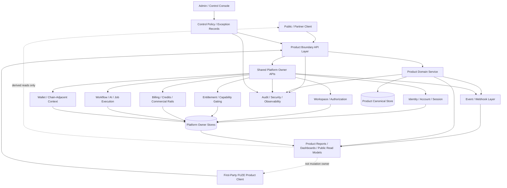
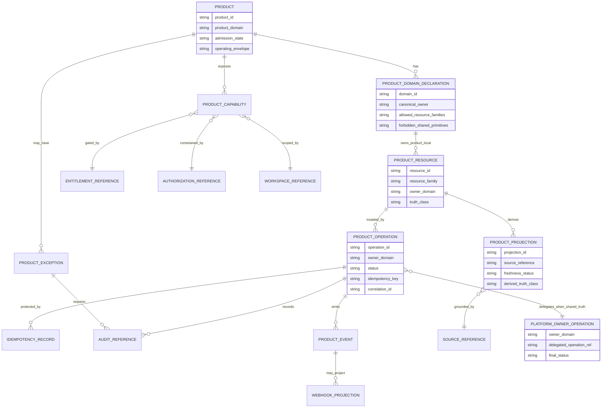
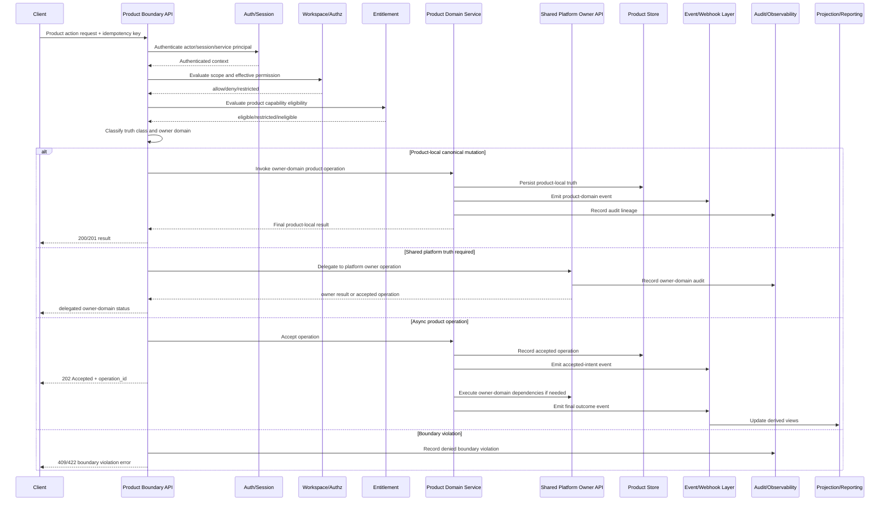

''# FUZE Product Boundary and Domain Ownership API Specification

## Document Metadata

- **Document Name:** `PRODUCT_BOUNDARY_AND_DOMAIN_OWNERSHIP_API_SPEC.md`
- **Document Type:** API SPEC v2 / Production-grade interface-contract specification
- **Status:** Draft production API specification
- **Version:** 2.0.0
- **Effective Date:** 2026-04-24
- **Last Updated:** 2026-04-24
- **Reviewed On:** 2026-04-24
- **Document Owner:** FUZE API Architecture / Product Boundary API Governance; named individual owner not yet assigned
- **Approval Authority:** FUZE Platform Architecture and Product Architecture governance authority; explicit approval workflow not yet recorded
- **Review Cadence:** Quarterly, and whenever product-boundary interpretation, product admission, product expansion, shared platform primitive ownership, public product API posture, product event posture, entitlement/capability-gating posture, commercial rails, chain-aware product behavior, or product integration contracts materially change
- **Governing Layer:** API SPEC v2 / platform constitution and product boundary API expression
- **Parent Registry:** `API_SPEC_INDEX.md` for API-family lineage; API SPEC v2 canonical registry for this document family
- **Upstream Semantic Registry:** `REFINED_SYSTEM_SPEC_INDEX.md`
- **Upstream API Registry:** `API_SPEC_INDEX.md`
- **Primary Audience:** Platform architecture, API design, backend engineering, product engineering, product architecture, frontend engineering, data engineering, security, operations, audit, product integration authors, OpenAPI / AsyncAPI / SDK authors, implementation-contract authors
- **Primary Purpose:** Define how FUZE APIs expose, enforce, validate, audit, and evolve the product/platform boundary and product-domain ownership model without allowing product APIs, local services, derived views, external providers, public surfaces, events, admin controls, or implementation convenience layers to redefine shared platform primitives or canonical owner-domain truth
- **Primary Upstream References:** `REFINED_SYSTEM_SPEC_INDEX.md`, `SYSTEM_BOUNDARY_AND_OWNERSHIP_SPEC.md`, `SYSTEM_OVERVIEW_AND_BOUNDARIES_SPEC.md`, `PLATFORM_ARCHITECTURE_SPEC.md`, `DOMAIN_OWNERSHIP_MATRIX_SPEC.md`, `DATA_MODEL_AND_ENTITY_OWNERSHIP_SPEC.md`, `ONCHAIN_OFFCHAIN_RESPONSIBILITY_SPEC.md`, `PRODUCT_BOUNDARY_AND_DOMAIN_OWNERSHIP_SPEC.md`, `PRODUCT_ADMISSION_AND_EXPANSION_GATE_SPEC.md`, `API_ARCHITECTURE_SPEC.md`, `PUBLIC_API_SPEC.md`, `INTERNAL_SERVICE_API_SPEC.md`, `EVENT_MODEL_AND_WEBHOOK_SPEC.md`, `IDEMPOTENCY_AND_VERSIONING_SPEC.md`, `MIGRATION_AND_BACKWARD_COMPATIBILITY_SPEC.md`, `ENTITLEMENT_AND_CAPABILITY_GATING_SPEC.md`, `AUDIT_LOG_AND_ACTIVITY_SPEC.md`, `SECURITY_AND_RISK_CONTROL_SPEC.md`, `MONITORING_ALERTING_AND_INCIDENT_RESPONSE_SPEC.md`, `FUZE_ACCOUNT_ACCESS_AND_SESSION_THESIS_FINAL_SPEC.md`, `FUZE_ACCOUNT_ACCESS_AND_SESSION_CANONICAL_FINAL_SPEC.md`, `FUZE_WORKSPACE_ACCESS_CONTROL_BASICS_THESIS_FINAL_SPEC.md`
- **Primary Downstream Dependents:** Product-specific public APIs, product first-party APIs, product internal service APIs, product integration contracts, product event catalogs, product webhook catalogs, product workflow contracts, product data contracts, product telemetry contracts, product rollout/admission APIs, API gateways, OpenAPI specifications, AsyncAPI specifications, SDKs, frontend clients, implementation-contract specs, contract tests, governance/control-plane tooling
- **API Surface Families Covered:** Public product API posture, authenticated product API posture, first-party product application APIs, internal product service APIs, product integration APIs, product boundary validation APIs, product admission/expansion-adjacent APIs, product admin/control-plane APIs, product event/webhook surfaces, reporting/projection APIs, product-read APIs, product-local mutation APIs, product-to-platform service APIs
- **API Surface Families Excluded:** Raw database schemas, ungoverned implementation internals, product marketing sites, frontend-only local component state, unofficial internal scripts, unmanaged provider callbacks, raw chain contracts, detailed pricing tables, exact UI copy, product roadmap sequencing, feature-level runbook detail
- **Canonical System Owner(s):** FUZE Product Boundary and Domain Ownership semantic owner; FUZE Platform Architecture for platform boundary interpretation; owner domains listed in the domain ownership matrix for narrower shared primitives
- **Canonical API Owner:** FUZE API Architecture with Product Boundary API Governance
- **Supersedes:** Any previous or informal API interpretation allowing products to create alternate identity, workspace, authorization, entitlement, credits, billing, payout, registry, governance, audit, workflow, AI orchestration, wallet-aware, chain-aware, or public-trust primitives through product-local APIs
- **Superseded By:** Not yet known
- **Related Decision Records:** Not explicitly known; future product-boundary exceptions MUST reference recorded decision records or approved exception records
- **Canonical Status Note:** This API specification expresses refined product-boundary semantics at the interface-contract layer. It does not own system semantics. When tension exists, the active refined system specifications and registry govern semantic truth, while this document governs API expression, validation, contract shape, exposure posture, and downstream derivation guardrails.
- **Implementation Status:** Normative API specification for downstream implementation planning; machine-readable OpenAPI / AsyncAPI artifacts not yet generated
- **Approval Status:** Draft pending explicit FUZE approval workflow
- **Change Summary:** Created API SPEC v2 production-grade interface contract for product-boundary and product-domain ownership APIs. Consolidates refined product/platform boundary semantics, API surface-family posture, owner-domain mutation termination, canonical versus derived reads, event/webhook posture, idempotency, audit, migration, diagrams, acceptance criteria, and contract test coverage.

## Purpose

This document defines how FUZE APIs MUST express and enforce the canonical boundary between shared platform domains and product-local domains.

The purpose of this API specification is to ensure that every product-facing, product-owned, product-integrating, product-administering, and product-reporting interface preserves the following refined-system semantics:

1. FUZE products are bounded extension domains built on a shared platform.
2. Product domains MAY own product-local entities, workflows, outputs, AI specializations, UX surfaces, analytics objects, and derived product views.
3. Product domains MUST consume shared platform primitives through explicit owner-controlled contracts.
4. Product APIs MUST NOT create shadow identity, workspace, authorization, entitlement, credits, billing, payout, reserve, registry, governance, audit, workflow, AI orchestration, chain-aware, or public-trust primitives.
5. Product-local APIs MUST terminate canonical writes only in the product domain for product-local truth; shared-platform writes MUST terminate in the appropriate platform owner domain.
6. Derived reads, dashboards, reports, search indexes, exports, AI explanations, public views, events, and webhooks MUST NOT become hidden semantic owners.

This document is a governing API specification, not a product thesis, feature brief, endpoint dump, implementation schema, or marketing document.

## Scope

This specification governs API contract rules for:

- product catalog and product identity resources as API-facing descriptions of admitted product domains
- product-local resource families and mutation boundaries
- product-to-platform dependency contracts
- product capability, entitlement, workspace, account, and session context consumption
- product boundary validation and admission/expansion references
- product admin/control-plane actions that affect product enablement, restriction, containment, or exception posture
- product internal service APIs that coordinate with shared platform primitives
- product public/partner/read APIs and product-specific external surfaces
- product events and webhook projections related to product-local outcomes
- product read models, dashboards, analytics, reporting, exports, and presentation views
- idempotency, replay safety, conflict rules, audit lineage, traceability, observability, and migration requirements for product-boundary API behavior

## Out of Scope

This specification does not govern:

- the full business model of any individual FUZE product
- exact product-specific route lists for QTB, AIMM, ZAGA, AIE, HerHelp, Botmad, or future products
- exact product entity schemas beyond API contract-level ownership and resource-family requirements
- exact UI composition, copy, design, or local frontend component state
- exact deployment topology, queue implementation, database topology, or provider SDK usage
- exact pricing tables, product packaging, campaign copy, or launch calendar sequencing
- detailed product admission gate decision workflow beyond API contract boundaries and references
- raw on-chain ABI definitions or chain-indexing implementation details
- full machine-readable OpenAPI / AsyncAPI artifacts

Those belong in downstream product, implementation-contract, OpenAPI, AsyncAPI, data-model, workflow, and operations specifications, provided they preserve this document.

## Design Goals

1. Preserve FUZE as a platform-first multi-product ecosystem rather than a portfolio of unrelated mini-platforms.
2. Give product teams strong product-local autonomy without allowing boundary drift.
3. Make product API ownership clear enough for backend, frontend, SDK, contract-test, and operations teams.
4. Prevent product APIs from creating alternate shared primitives.
5. Preserve explicit separation among identity, authentication, session, authorization, entitlement, billing, credits, audit, workflow, AI orchestration, chain-aware context, and product-local business logic.
6. Enable product-specific external, first-party, internal, admin, event, webhook, and reporting surfaces with safe boundaries.
7. Make contested product/platform ownership cases deterministic and auditable.
8. Support product admission, controlled exceptions, staged expansion, migration, deprecation, and public-read safety.
9. Make OpenAPI, AsyncAPI, SDK, contract test, and implementation-contract derivation safe and consistent.

## Non-Goals

This specification does not aim to:

- eliminate product differentiation
- force every product action through one generic platform API
- grant products broad authority over shared platform primitives
- hide platform dependencies behind vague “product service” abstractions
- expose all internal product state publicly
- make product dashboards authoritative for shared platform or product truth
- allow admin/control-plane convenience to bypass owner-domain writes
- allow product API routes to become de facto source-of-truth definitions for refined system semantics

## Core Principles

### 1. Refined Semantics Own Meaning

Refined system specifications own semantic truth. Product-boundary APIs express that truth as interface contracts.

### 2. Product APIs Are Bounded Extension Interfaces

Product APIs MAY accept and return product-local resources, product-local operations, product-local workflow state, and product-local derived views. They MUST NOT redefine shared platform primitives.

### 3. Shared Primitives Are Consumed, Not Reowned

Products MUST consume platform identity, sessions, workspaces, authorization, entitlement, credits, billing, audit, workflow, AI orchestration, security, and chain-aware context through explicit platform-owned API or service contracts.

### 4. Owner-Domain Mutation Termination

Every canonical write MUST terminate in exactly one owner domain. Product-local APIs MAY terminate product-local writes; platform truth MUST terminate in the relevant platform owner domain.

### 5. Derived Reads Are Downstream

Product dashboards, reports, exports, search indexes, AI summaries, webhook payloads, public reads, and presentation bundles are derived surfaces. They MUST expose source references and MUST NOT become write owners.

### 6. Public Exposure Defaults Narrow

Product public APIs MUST default to stable, minimal, public-safe contract shapes. Internal richness MUST NOT leak through public convenience routes.

### 7. Admin Override Is Not Ordinary Mutation

Admin/control-plane actions affecting product boundaries MUST be reason-coded, policy-constrained, audited, bounded, and separated from ordinary product application APIs.

### 8. Exceptions Do Not Transfer Ownership

Controlled exceptions may permit temporary bounded operation, but they MUST NOT transfer canonical ownership of platform primitives to products.

## Canonical Definitions

- **Product API:** Any API surface whose primary resource, action, workflow, report, or integration belongs to a FUZE product domain.
- **Product Domain:** A bounded product-specific service, data, API, workflow, and UX scope that owns product-local truth.
- **Product-Local Resource:** An API resource whose canonical meaning and lifecycle are product-specific and not shared-platform primitive truth.
- **Shared Platform Primitive:** A cross-product capability or truth family owned by the platform, including identity, session, workspace, authorization, entitlement, billing, credits, payout, registry, governance, audit, workflow substrate, AI orchestration, and chain-aware context.
- **Product Boundary Contract:** The interface rule that determines which product API operations are allowed, which platform owner APIs must be called, which dependencies must be checked, and which truth classes may be exposed.
- **Product Capability:** A product behavior or feature that may be gated by entitlement, policy, workspace context, credits, rollout, admission stage, or control-plane restriction.
- **Product Integration Contract:** A product-to-platform, platform-to-product, or product-to-product API/event contract that preserves owner-domain boundaries.
- **Controlled Product Exception:** A narrow, documented, reason-coded, time-bounded API allowance that does not change canonical ownership.
- **Product Boundary Violation:** Any route, schema, event, projection, or operational action that lets a product redefine, mutate, or publish unsupported shared primitive truth.

## Truth Class Taxonomy

Product-boundary APIs MUST distinguish:

1. **Semantic truth** — what a product, product capability, product entity, or shared primitive means, owned by refined system specs and owner domains.
2. **API contract truth** — route, resource, request, response, error, status, version, idempotency, and exposure rules defined by API specs.
3. **Policy truth** — authorization, entitlement, rollout, product-admission, security, restriction, and exception rules.
4. **Runtime truth** — current execution, workflow, job, attempt, retry, rollout, restriction, and degraded-mode posture.
5. **Ledger / storage truth** — authoritative product-local records and shared-platform durable records owned by their respective domains.
6. **Provider-input truth** — raw external signals, third-party callbacks, model outputs, or chain observations before owner-domain validation.
7. **Event / async execution truth** — accepted intents, domain events, integration events, operational events, webhook projections, and delivery attempts.
8. **Projection / reporting truth** — dashboards, product reports, analytics views, exports, public-read projections, caches, and search indexes.
9. **Presentation truth** — UI labels, rendered product state, human-readable product copy, and frontend-local status.

These truth classes MUST NOT be collapsed into a generic “product status,” “product user,” “product entitlement,” “product account,” “product credits,” or “product report” object.

## Architectural Position in the Spec Hierarchy

This API specification sits below:

- `REFINED_SYSTEM_SPEC_INDEX.md`
- `SYSTEM_BOUNDARY_AND_OWNERSHIP_SPEC.md`
- `SYSTEM_OVERVIEW_AND_BOUNDARIES_SPEC.md`
- `PLATFORM_ARCHITECTURE_SPEC.md`
- `DOMAIN_OWNERSHIP_MATRIX_SPEC.md`
- `DATA_MODEL_AND_ENTITY_OWNERSHIP_SPEC.md`
- `ONCHAIN_OFFCHAIN_RESPONSIBILITY_SPEC.md`
- `PRODUCT_BOUNDARY_AND_DOMAIN_OWNERSHIP_SPEC.md`
- `PRODUCT_ADMISSION_AND_EXPANSION_GATE_SPEC.md`

and alongside or above downstream:

- product-specific API specifications
- product-specific implementation contracts
- product event and webhook catalogs
- OpenAPI / AsyncAPI contracts
- product SDKs and frontend clients
- product operational runbooks and contract tests

This document does not override the refined product-boundary spec. It defines how that spec must be expressed through APIs.

## Upstream Semantic Owners

The primary upstream semantic owner is `PRODUCT_BOUNDARY_AND_DOMAIN_OWNERSHIP_SPEC.md`. It defines what products may own, what platform primitives remain shared, how products consume platform context, and how ambiguity must be handled.

Material adjacent semantic owners include:

- `SYSTEM_BOUNDARY_AND_OWNERSHIP_SPEC.md` for top-level ownership and truth classes
- `SYSTEM_OVERVIEW_AND_BOUNDARIES_SPEC.md` for ecosystem layer placement
- `PLATFORM_ARCHITECTURE_SPEC.md` for shared platform planes and service boundaries
- `DOMAIN_OWNERSHIP_MATRIX_SPEC.md` for canonical domain owners
- `DATA_MODEL_AND_ENTITY_OWNERSHIP_SPEC.md` for entity-level ownership
- `ONCHAIN_OFFCHAIN_RESPONSIBILITY_SPEC.md` for chain-aware product behavior
- `PRODUCT_ADMISSION_AND_EXPANSION_GATE_SPEC.md` for admission and expansion state
- identity/account/auth/session/workspace/access/entitlement specs for product context and gating
- billing/credits/payment specs for product commercial behavior
- AI/workflow/job specs for product automation and AI behavior
- audit/security/monitoring/migration/event specs for cross-cutting API safety

## API Surface Families

### Public Product APIs

Public product APIs expose approved product-local actions, public-safe product catalog reads, product-specific authenticated reads, and stable external product integrations. They MUST be narrower than internal or first-party surfaces.

### First-Party Product Application APIs

First-party application APIs support FUZE-owned product clients. They MAY expose richer product workflows and context bundles than public APIs, but they MUST still preserve platform owner-domain boundaries and MUST NOT become direct shared-primitive mutation channels.

### Internal Product Service APIs

Internal service APIs support service-to-service coordination between product domains and shared platform domains. They MUST explicitly identify owner domain, actor/service principal, operation purpose, correlation lineage, idempotency posture, and required policy checks.

### Admin / Control-Plane Product APIs

Admin/control-plane APIs may constrain, enable, pause, remediate, quarantine, or approve product behavior. They MUST be separated from ordinary product APIs and MUST require reason codes, policy references, actor attribution, audit lineage, and bounded scope.

### Event / Webhook / Async Product APIs

Product events and webhooks represent product-local outcomes, accepted intents, or curated external projections. They MUST NOT grant mutation authority to consumers and MUST distinguish accepted intent from final product outcome.

### Reporting / Projection Product APIs

Reporting, dashboard, analytics, export, cache, and search APIs expose derived product and platform views. They MUST include source lineage and freshness metadata where material and MUST NOT be used as canonical write APIs.

### Chain-Adjacent Product APIs

Where products consume wallet-aware or chain-aware context, APIs MUST distinguish chain-native state, platform-normalized chain observations, wallet-link context, product-local interpretation, and public-trust publication surfaces.

## System / API Boundaries

### What This API Spec Governs

This document governs product-boundary API contracts: resource-family posture, allowed and forbidden route families, owner-domain mutation termination, context consumption, derived-read limits, event posture, idempotency, audit, migration, and downstream derivation rules.

### What Upstream Refined Specs Govern

Upstream refined specs govern the meaning of product domains, shared primitives, domain ownership, admission state, chain/off-chain separation, identity/session/workspace/access/entitlement semantics, commercial truth, workflow meaning, audit truth, and platform architecture.

### What Adjacent API Specs Govern

- `API_ARCHITECTURE_SPEC.md` governs shared API surface-family posture.
- `PUBLIC_API_SPEC.md` governs public and external API contract restraint.
- `INTERNAL_SERVICE_API_SPEC.md` governs service-to-service API discipline.
- `EVENT_MODEL_AND_WEBHOOK_SPEC.md` governs event and webhook semantics.
- `IDEMPOTENCY_AND_VERSIONING_SPEC.md` governs replay and version classification.
- `MIGRATION_AND_BACKWARD_COMPATIBILITY_SPEC.md` governs coexistence, cutover, deprecation, and supersession.
- Identity, workspace, access, entitlement, billing, credits, workflow, AI, audit, security, and chain API specs govern their respective owner-domain APIs.

### What Implementation-Contract Specs Govern

Implementation-contract specs govern exact route definitions, schema fields, validation functions, storage mapping, service topology, queue mechanics, provider SDK behavior, observability instrumentation, and contract-test execution. They MUST NOT reinterpret this API spec.

## Adjacent API Boundaries

1. Product APIs MUST call identity/account APIs for canonical account context and MUST NOT create product-owned account roots.
2. Product APIs MUST call auth/session APIs for runtime session status and MUST NOT own durable session truth.
3. Product APIs MUST call workspace/access APIs for scope and permission checks and MUST NOT invent incompatible collaborative scope truth.
4. Product APIs MUST call entitlement/capability APIs for product eligibility and MUST NOT self-authorize commercial access.
5. Product APIs MUST call billing/credits APIs for commercial and credits operations and MUST NOT maintain alternate ledgers.
6. Product APIs MUST call workflow/AI/job APIs for shared automation and AI orchestration where relevant and MUST NOT redefine shared execution meaning.
7. Product APIs MUST call audit/security/control APIs for sensitive actions and MUST NOT bury overrides in ordinary product routes.
8. Product APIs MAY publish product-domain events only for product-owned outcomes; shared-platform events remain emitted by their owner domains.

## Conflict Resolution Rules

1. The active refined registry and refined product-boundary spec win over this API spec on semantic meaning.
2. This API spec wins over product-local API drafts on interface contract boundaries.
3. The domain ownership matrix wins when the owner domain of a material truth family is contested.
4. Shared platform primitive owner specs win over product APIs for identity, session, workspace, authorization, entitlement, billing, credits, payout, registry, governance, audit, workflow, AI orchestration, and chain-aware semantics.
5. Public API restraint wins over product convenience for external exposure.
6. Event/webhook rules win over product-specific event convenience.
7. Migration and compatibility rules win over shortcut contract changes.
8. Admin/control-plane approval may constrain or remediate product behavior but does not transfer business truth ownership.
9. Derived read models, dashboards, reports, AI summaries, exports, and search indexes never win over owner-domain truth.
10. If ambiguity remains, choose the most conservative architecture-consistent interpretation and require recorded architecture review before implementation.

## Default Decision Rules

1. A product route that mutates shared primitive truth defaults to forbidden unless routed to the platform owner domain.
2. A product-local mutation defaults to allowed only when product-local ownership is explicit.
3. A cross-product capability defaults to platform ownership.
4. A public product API defaults to read-only or narrowly scoped action unless explicit approval expands it.
5. A product-admin API defaults to control-plane treatment with reason-code and audit requirements.
6. A product report, export, analytics view, cache, or search result defaults to derived truth.
7. A provider callback defaults to provider-input truth until normalized by the appropriate owner domain.
8. A chain observation defaults to chain-adjacent input until validated and interpreted by the owner boundary.
9. A long-running product operation defaults to accepted async intent until final owner-domain outcome is recorded.
10. If a route cannot name owner domain, truth class, authorization model, idempotency posture, event behavior, and audit lineage, it MUST NOT ship.

## Roles / Actors / API Consumers

- **End User:** Uses a product surface and may initiate product-local actions within platform authorization and entitlement constraints.
- **Workspace Member:** Acts within workspace scope and effective permission boundaries.
- **Workspace Owner / Admin:** Administers product availability or configuration only through approved role, entitlement, and product-boundary rules.
- **Product Service:** Owns product-local resources and workflows within its bounded domain.
- **Platform Service:** Owns shared primitive semantics consumed by products.
- **First-Party Client:** FUZE-owned application consuming product APIs.
- **Public / Partner Client:** External client consuming approved stable public product APIs.
- **Admin / Control Operator:** Performs bounded product-boundary actions under privileged policy.
- **Event Consumer:** Receives product events or webhook projections and must treat them as notifications, not write authority.
- **Reporting Consumer:** Reads derived product views and must not treat them as canonical mutation surfaces.
- **External Provider:** Supplies raw inputs, callbacks, model outputs, or integration signals that require normalization before owner-domain influence.

## Resource / Entity Families

### API-Facing Product Boundary Resources

- `product` — admitted FUZE product descriptor; references product domain and approved operating envelope.
- `product_domain` — product-local owner-domain metadata and boundary declaration.
- `product_capability` — product feature or action class subject to entitlement, rollout, policy, and product-local rules.
- `product_context` — composed read bundle of product-local and platform-owned context; derived and non-canonical where it includes shared primitives.
- `product_boundary_evaluation` — deterministic response explaining whether a product API action is allowed, denied, restricted, escalated, or requires platform-owner routing.
- `product_operation` — accepted product-local operation reference, especially for async workflows.
- `product_exception` — controlled exception record with reason, scope, owner, policy, expiry, and audit lineage.
- `product_projection` — derived read model, dashboard, report, search document, export, or public-safe view.
- `product_event_projection` — event/webhook projection derived from product-local or platform-owner events.
- `product_audit_reference` — audit lineage reference for product boundary-sensitive actions.

### Canonical Entity Ownership

Product APIs MAY own product-local entity families such as product projects, product artifacts, product tasks, product workflows, product configuration, product-specific AI outputs, product dashboards, and product-local analytics objects when those are not shared primitives.

Product APIs MUST NOT own canonical account, session, workspace, role, permission, entitlement, billing, credit, payout, registry, governance, audit, platform workflow substrate, AI orchestration lifecycle, wallet-link, chain-native, or public-trust publication entities.

## Ownership Model

### Product-Owned API Truth

A product API may be canonical for:

- product-local objects
- product-local workflow meaning
- product-local configuration under platform rules
- product-local AI artifacts and prompt specializations where not shared orchestration metadata
- product-local reports and dashboards as derived product views
- product-local UX state that does not redefine platform or owner-domain truth

### Platform-Owned API Truth

Platform APIs remain canonical for:

- identity and account roots
- authentication/session truth
- workspace/organization truth
- role, permission, scoped authorization, and effective permission truth
- entitlement and capability-gating truth
- billing, payment, subscription, invoicing, refund, and receipt truth
- Platform Credits and shared ledger truth
- payout, treasury, reserve, governance, registry, and public-trust publication truth
- shared AI orchestration, model routing, usage metering, workflow, job, audit, security, migration, and monitoring truth

### Non-Owner Product Rights

Products MAY request, reference, display, consume, and compose shared platform outputs. They MUST NOT directly write, fork, cache-as-canonical, or reinterpret shared primitive truth.

## Authority / Decision Model

### Authority to Accept Product-Local Mutation

A product service may accept a product-local mutation only when:

1. the resource family is explicitly product-owned;
2. the actor or service principal is authenticated;
3. workspace scope and authorization are evaluated where relevant;
4. entitlement/capability gating is evaluated where relevant;
5. commercial, credits, chain, AI, or workflow dependencies are routed to their owner APIs;
6. idempotency and replay safeguards are applied;
7. audit, correlation, and trace references are recorded.

### Authority to Request Shared Platform Mutation

A product API may request a shared platform mutation only through the owner-domain API. The product route MUST represent the result as a delegated owner-domain operation, not as product-owned truth.

### Authority to Publish Product Events

A product domain may publish canonical product events only for product-owned outcomes. Events involving shared primitives MUST be emitted by the owning platform domain or represented as downstream integration events with explicit source references.

### Authority to Expose Product Public APIs

Public product exposure requires explicit approval, stable contract shape, data-classification review, abuse/rate-limit posture, compatibility/versioning posture, and public-safe field selection.

### Authority to Override

Admin/control-plane product override APIs MUST be privileged, reason-coded, policy-versioned, bounded by product/domain/scope/time, auditable, and reversible or supersession-recorded where feasible.

## Authentication Model

Product APIs MUST authenticate callers through FUZE platform authentication/session mechanisms. Product APIs MUST NOT issue or own alternate durable identity roots or session truth.

Every authenticated request MUST carry or resolve:

- `account_id` where an end-user actor is involved
- session or service-principal identity
- authentication assurance level where privileged or sensitive product actions are requested
- environment and client identity where relevant
- correlation ID and trace ID

Service-to-service product APIs MUST use platform-approved service identity and MUST declare the calling service, owner domain, allowed action class, and environment.

## Authorization / Scope / Permission Model

Product APIs MUST preserve the separation among:

- identity truth
- runtime session truth
- workspace scope truth
- role/permission truth
- effective permission truth
- entitlement/capability truth
- product-local policy truth

For every mutating or sensitive read operation, the API MUST evaluate:

1. actor/session validity;
2. workspace or organization scope, if applicable;
3. product membership or product-context access, if applicable;
4. effective permission for the action;
5. product-local constraints;
6. security/risk restrictions;
7. control-plane restrictions or holds;
8. entitlement/capability gating where relevant.

Product-local permission labels MAY exist only as extensions of platform authorization and MUST NOT replace platform effective-permission evaluation where shared scope or protected action is involved.

## Entitlement / Capability-Gating Model

Product capability exposure MUST be gated by the platform entitlement and capability-gating domain when the feature is paid, restricted, rollout-controlled, workspace-scoped, credits-consuming, commercially sensitive, or policy-sensitive.

Product APIs MUST NOT infer entitlement solely from:

- product subscription badges in UI;
- cached billing summaries;
- local product flags;
- provider payment callbacks;
- manual admin notes;
- historical usage;
- reporting dashboards.

Allowed API response classes for capability gating include:

- `eligible`
- `ineligible`
- `restricted`
- `requires_upgrade`
- `requires_admin_action`
- `requires_review`
- `temporarily_unavailable`
- `unknown_pending_owner_evaluation`

## API State Model

Product API state MUST distinguish:

- `proposed` product state
- `admitted` product state
- `approved_with_constraints` product state
- `active` product runtime availability
- `restricted` product or capability state
- `held` product admission/expansion state
- `retired` or `deprecated` product state
- `product_operation_accepted`
- `product_operation_running`
- `product_operation_succeeded`
- `product_operation_failed`
- `product_operation_canceled`
- `product_projection_current`
- `product_projection_stale`
- `product_projection_suppressed`

Acceptance of a product API request is not final business success unless the owner-domain state transition has completed.

## Lifecycle / Workflow Model

1. A client calls a product API.
2. The edge/API layer authenticates the actor or service principal.
3. The product API resolves workspace, product, capability, and entitlement context from platform owner APIs.
4. The product API determines whether the requested action is product-local, shared-platform, chain-adjacent, event-only, reporting-only, or control-plane.
5. If product-local, the product owner validates and accepts the mutation.
6. If shared-platform, the request is routed to the relevant owner-domain API or rejected as a boundary violation.
7. If async, the API records an accepted operation reference and emits accepted-intent or operation events with lineage.
8. Owner-domain finalization emits canonical events where appropriate.
9. Derived views and product projections update downstream.
10. Audit, trace, metrics, and observability records preserve request lineage.
11. Failures, retries, redeliveries, admin remediation, and migration actions preserve original owner-domain meaning.

## Architecture Diagram — Mermaid Flowchart

## Data Design — Mermaid Diagram

## Flow View

### Synchronous Product-Local Mutation

1. Receive request with actor/session/service-principal identity.
2. Require `correlation_id`; generate one if absent for first-party calls.
3. Validate route family and product-domain ownership.
4. Resolve workspace, authorization, entitlement, and restriction context from platform owners.
5. Validate request schema and product-local invariants.
6. Apply idempotency check for mutating requests.
7. Persist product-local canonical mutation in the product owner store.
8. Record audit reference and observability signals.
9. Emit product-domain event if the mutation represents a material product-local fact.
10. Return canonical product-local response.

### Delegated Shared-Platform Operation

1. Receive product API request.
2. Classify requested write as shared-platform truth.
3. Reject direct product-local mutation.
4. Route to the owner-domain API when the product API is an approved orchestration surface.
5. Return delegated operation status or final owner-domain result.
6. Preserve owner-domain operation reference in product response.

### Accepted Async Operation

1. Validate request, authorization, entitlement, and owner-domain boundary.
2. Create product operation record with `accepted` status.
3. Return `202 Accepted` or equivalent accepted-result response with `operation_id`.
4. Execute through workflow/job/AI/platform owner APIs as applicable.
5. Emit accepted, running, completed, failed, canceled, or quarantined events.
6. Update product-local and derived read models only after owner-domain finalization.

### Failure, Retry, and Remediation

1. Retry idempotently using the same idempotency key and operation reference.
2. Preserve original correlation, causation, and audit lineage.
3. If owner-domain conflict exists, stop product-local finalization and return conflict or escalation status.
4. If admin remediation is needed, require control-plane route, reason code, policy reference, and audit record.
5. Derived views must show stale, pending, suppressed, or discrepancy state rather than inventing success.

## Data Flows — Mermaid sequenceDiagram

## Request Model

Mutating product-boundary API requests MUST include or resolve:

- `request_id` or equivalent unique request reference
- `idempotency_key` for create, update, delete, execute, submit, approve, restrict, or async operations
- `correlation_id`
- `actor` or service-principal context
- `product_id`
- `product_domain`
- `workspace_id` or explicit no-workspace scope where relevant
- `capability_id` where capability gating applies
- `owner_domain_hint` where cross-domain delegation is possible
- `operation_reason` for admin/control or sensitive operations
- `policy_version` where authorization, entitlement, control, rollout, or exception policy affects the action
- `source_reference` for derived, provider-input, chain-adjacent, migration, or imported state
- `client_contract_version`

Requests MUST NOT use product-local fields as substitutes for canonical platform identifiers where platform identifiers exist.

## Response Model

Product-boundary API responses MUST distinguish:

- final product-local success
- delegated owner-domain success
- accepted async intent
- denied authorization
- denied entitlement/capability
- restricted or held state
- boundary violation
- owner-domain conflict
- stale or derived projection response
- admin/control action accepted
- migration/deprecation compatibility response
- degraded-mode response

Response envelopes SHOULD include:

- `result_type`
- `status`
- `resource_id` or `operation_id`
- `owner_domain`
- `truth_class`
- `source_references`
- `idempotency_key` echo or idempotency result reference
- `correlation_id`
- `trace_id`
- `audit_reference` where appropriate
- `policy_references`
- `next_actions` where user or operator action is required

## Error / Result / Status Model

Product-boundary APIs MUST define stable error classes:

- `authentication_required`
- `session_invalid`
- `permission_denied`
- `workspace_scope_invalid`
- `entitlement_required`
- `capability_restricted`
- `product_not_admitted`
- `product_held`
- `product_capability_disabled`
- `boundary_violation`
- `owner_domain_required`
- `owner_domain_conflict`
- `shared_primitive_write_forbidden`
- `idempotency_conflict`
- `duplicate_operation`
- `operation_accepted_not_final`
- `operation_failed`
- `projection_stale`
- `provider_input_untrusted`
- `chain_observation_unverified`
- `admin_reason_required`
- `policy_version_mismatch`
- `rate_limited`
- `degraded_mode`
- `contract_version_deprecated`
- `migration_required`

Errors MUST include machine-readable code, human-safe message, owner domain, retryability, correlation ID, and remediation hints where safe.

## Idempotency / Retry / Replay Model

1. All product-local mutating requests MUST support idempotency keys.
2. Product-to-platform delegated mutations MUST preserve idempotency lineage across the product API and owner-domain API.
3. Accepted async product operations MUST be replay-safe and MUST return the same operation reference for duplicate accepted requests.
4. Retried requests MUST NOT create duplicate product-local records, shared-platform operations, events, webhook projections, credits charges, billing actions, or chain-adjacent intents.
5. Idempotency records MUST bind request actor, product ID, route family, owner domain, request hash, and effective operation class.
6. Idempotency conflicts MUST return deterministic conflict errors rather than silently reusing an unsafe operation.
7. Event replay and webhook redelivery MUST preserve event lineage and MUST NOT create new product business facts.

## Rate Limit / Abuse-Control Model

Product APIs MUST implement rate limits by actor, workspace, product, capability, route family, external client, service principal, and sensitive operation class where relevant.

Stronger controls are required for:

- public product APIs
- product creation/import/export APIs
- product automation and AI execution APIs
- product workflows that consume credits or billing capacity
- admin/control-plane product APIs
- product APIs that trigger provider callbacks or chain-adjacent work
- bulk reporting/export APIs
- webhook registration and delivery-test APIs

Rate-limit responses MUST be stable and must not leak restricted internals.

## Endpoint / Route Family Model

Allowed route families include:

- `GET /products`
- `GET /products/{product_id}`
- `GET /products/{product_id}/capabilities`
- `POST /products/{product_id}/boundary-evaluations`
- `GET /products/{product_id}/context`
- `GET /products/{product_id}/resources/{resource_id}`
- `POST /products/{product_id}/resources` for product-local resource families only
- `PATCH /products/{product_id}/resources/{resource_id}` for product-local resource families only
- `POST /products/{product_id}/operations` for accepted product-local or delegated operations
- `GET /products/{product_id}/operations/{operation_id}`
- `GET /products/{product_id}/projections/{projection_id}`
- `POST /admin/products/{product_id}/restrictions` for control-plane only
- `POST /admin/products/{product_id}/exceptions` for control-plane only
- `GET /admin/products/{product_id}/boundary-audit` for authorized operators only

Forbidden route families include:

- product-local identity roots
- product-local session issuance
- product-local workspace root creation for shared collaborative scope
- product-local entitlement overrides outside control-plane APIs
- product-local credits balance mutation
- product-local billing/payment truth mutation
- product-local payout/reserve/treasury mutation
- product-local governance or registry truth mutation
- public routes exposing internal product owner-domain mutation hooks
- reporting routes that mutate canonical product or platform truth

## Public API Considerations

Public product APIs MUST:

- expose only approved product-local actions and public-safe reads
- avoid internal implementation fields
- avoid broad mutable snapshots
- avoid exposing product admission, entitlement, billing, credits, or private platform policy internals beyond approved safe summaries
- preserve compatibility and stable versioning
- include abuse controls and audit/trace lineage
- return derived-view warnings where public reads are projections
- avoid chain, wallet, payout, governance, registry, or commercial claims unless approved by the relevant owner domain

## First-Party Application API Considerations

First-party product APIs MAY expose richer context bundles, but they MUST label canonical, derived, presentation, and pending states distinctly. A first-party frontend MUST NOT treat convenience response bundles as permission, entitlement, billing, credits, account, or workspace truth.

## Internal Service API Considerations

Internal product service APIs MUST:

- name the calling service principal
- identify owner domain and target owner domain
- carry correlation and causation IDs
- preserve idempotency keys
- reject hidden broad-write shortcuts
- use platform owner APIs for shared primitives
- emit product events only for product-owned outcomes
- record audit lineage for cross-domain or sensitive calls

## Admin / Control-Plane API Considerations

Admin/control-plane product APIs MUST be separated from product application routes. They MUST require:

- privileged actor or service principal
- scope-limited authority
- reason code
- policy version
- affected product/capability/resource
- duration or expiry where relevant
- approval or review reference where required
- audit record
- correlation ID
- rollback, supersession, or remediation posture where applicable

Admin APIs may pause, restrict, quarantine, remediate, approve a controlled exception, or trigger review. They MUST NOT silently rewrite product-local or platform truth outside the owner domain.

## Event / Webhook / Async API Considerations

Product events MUST be classified as:

- product-domain events
- product integration events
- product operational events
- curated public webhook projections

Only product owner domains may emit canonical product-domain events. Webhooks are derived external projections and MUST NOT expose all internal event state by default.

Product webhook payloads SHOULD be identifier-forward, source-referenced, minimal, and versioned. Delivery failure MUST NOT roll back product business truth.

## Chain-Adjacent API Considerations

Product APIs that consume wallet-aware or chain-aware context MUST:

- distinguish wallet link truth from product-local user truth
- distinguish chain-native state from platform-normalized chain observations
- distinguish off-chain policy truth from on-chain fact
- reject product-local token, payout, reserve, governance, or registry reinterpretation
- include source references and finality/reconciliation posture for chain-derived reads
- avoid public chain-adjacent claims unless approved by public trust and registry/reporting owners

## Data Model / Storage Support Implications

Implementation storage MUST preserve separate tables/collections or clearly separated logical records for:

- product canonical resources
- product operation records
- idempotency records
- product boundary evaluations
- platform owner-domain references
- product exception/control records
- product projections/read models
- product event outbox records
- webhook projection and delivery records
- audit and observability references

Product storage MUST NOT contain canonical copies of shared platform primitive truth except as immutable or refreshable references, derived snapshots, or source-linked caches explicitly marked non-canonical.

## Read Model / Projection / Reporting Rules

Product projections MUST:

- identify source owner domains
- include freshness/staleness status where material
- include generated-at and source-version references where material
- avoid becoming mutation endpoints
- avoid hiding denied, held, restricted, pending, or discrepancy state
- preserve public/private data-classification rules
- be suppressible or correctable without rewriting canonical owner truth

Reporting APIs MUST not be used as hidden integration APIs for product or platform mutation.

## Security / Risk / Privacy Controls

Product-boundary APIs MUST enforce:

- authentication/session controls
- scoped authorization
- entitlement/capability gating
- data classification and minimization
- sensitive-field filtering by surface family
- abuse/rate-limit controls
- provider-input validation
- anti-replay and idempotency controls
- admin/control separation
- restricted audit evidence access
- public exposure review
- environment and service-principal validation

Security denials MUST not be transformed into product-local business denials unless the owner-domain meaning supports that conversion.

## Audit / Traceability / Observability Requirements

Every mutating, sensitive-read, cross-domain, delegated, async, admin/control, exception, migration, public-exposure, or boundary-denied product API action MUST record:

- actor or service principal
- product ID and product domain
- owner domain and target owner domain
- route family and operation class
- request ID, correlation ID, trace ID, and causation references
- idempotency key or replay reference where applicable
- authorization and entitlement evaluation references
- policy version and reason code where applicable
- before/after owner references where safe and appropriate
- outcome status
- error class where applicable
- derived projection or event references where created

Observability MUST support detection of boundary violations, hidden shared-primitive writes, excessive delegated owner-domain failures, stale projections, public exposure drift, webhook delivery failures, admin-control spikes, and migration compatibility regressions.

## Failure Handling / Edge Cases

- **Owner-domain unavailable:** Product APIs MUST return accepted/degraded/unavailable status rather than writing shared truth locally.
- **Entitlement unavailable:** Fail closed for paid, restricted, high-risk, or credits-consuming actions unless an approved cached-decision policy exists.
- **Authorization unavailable:** Fail closed for protected operations.
- **Projection stale:** Return stale status and source timestamp; do not invent freshness.
- **Provider callback mismatch:** Treat as provider-input discrepancy and route to normalization or review.
- **Duplicate submission:** Return existing idempotent operation result or deterministic conflict.
- **Product held or restricted:** Return stable product-hold or capability-restriction error.
- **Controlled exception expired:** Deny operation or route to review; do not silently extend.
- **Migration overlap:** Respect active compatibility window and deprecation policy.
- **Admin intervention conflict:** Require owner-domain reconciliation and audit; do not overwrite ordinary product truth silently.

## Migration / Versioning / Compatibility / Deprecation Rules

1. Product-boundary route families MUST use versioned contracts where public, partner, SDK, or cross-service consumers depend on stability.
2. Contract changes that move ownership, alter truth class, expand public exposure, or change mutation termination require architecture review.
3. Deprecated product APIs MUST preserve compatibility windows, migration hints, and replacement route references.
4. Migration MUST NOT transfer shared primitive ownership to product domains.
5. Derived projection schema migrations MUST preserve source lineage and freshness interpretation.
6. Event/webhook migrations MUST preserve version overlap, replay safety, and consumer compatibility.
7. Product retirement APIs MUST distinguish product availability, canonical product history, data retention, public reporting, and platform-owned shared records.

## OpenAPI / AsyncAPI / SDK Derivation Rules

Derived artifacts MUST preserve:

- owner domain annotations
- truth class annotations
- public/first-party/internal/admin/event/reporting surface family labels
- idempotency requirements
- authorization/entitlement requirements
- operation references for async actions
- error/result/status taxonomy
- audit/correlation header requirements
- version and deprecation metadata
- source-reference fields for derived reads
- forbidden pattern constraints

SDKs MUST NOT hide accepted-vs-final outcomes or turn derived projections into canonical models.

## Implementation-Contract Guardrails

Implementation contracts MUST:

1. name canonical owner domain for every route family;
2. identify whether a request is product-local, delegated shared-platform, async, reporting, event, or admin/control;
3. declare authentication, authorization, entitlement, idempotency, audit, rate-limit, and observability behavior;
4. distinguish canonical and derived response models;
5. preserve owner-domain references for delegated actions;
6. forbid shared-primitive writes from product-local stores;
7. include boundary-violation contract tests;
8. define migration and deprecation posture.

## Downstream Execution Staging

1. Confirm refined product-boundary semantics and domain owner matrix.
2. Define product-specific resource families and owner-domain declarations.
3. Define route families and classify each by surface family and truth class.
4. Wire authentication, workspace, authorization, entitlement, and restriction checks.
5. Implement idempotency, request lineage, and owner-domain delegation.
6. Implement product-local canonical storage and derived projections.
7. Implement event and webhook projection discipline.
8. Implement audit, observability, and boundary-violation detection.
9. Generate OpenAPI / AsyncAPI / SDK artifacts.
10. Run acceptance criteria and contract tests before production exposure.

## Required Downstream Specs / Contract Layers

- Product-specific API specs for each admitted FUZE product
- Product integration contracts
- Product event catalog and webhook catalog
- Product resource schema and storage contract
- Product workflow/AI/job execution contracts
- Product capability and entitlement integration contract
- Product public API contract where externally exposed
- Product admin/control-plane contract
- Product reporting/projection contract
- Product migration/deprecation contract
- Product observability and boundary-violation detection contract

## Boundary Violation Detection / Non-Canonical API Patterns

Forbidden patterns include:

1. product-local `user`, `account`, or `session` roots that replace platform identity/session truth
2. product-local workspace systems for shared collaborative scope without platform compatibility approval
3. product-local role/permission systems that bypass effective-permission evaluation
4. product-local entitlement or subscription status used as canonical eligibility
5. product-local credits or commercial balances
6. product-local payout, reserve, treasury, registry, or governance write APIs
7. product dashboards used as source-of-truth for platform or product canonical state
8. public product APIs exposing internal owner-domain decisions or admin fields
9. internal product service APIs performing hidden writes to foreign owner domains
10. webhook delivery treated as product mutation authority
11. chain observations treated as product-owned final truth
12. AI outputs treated as canonical owner-domain facts without validation
13. control-plane exceptions without reason codes, expiry, policy references, and audit

Boundary detection SHOULD alert on route/schema names, storage writes, event payloads, SDK models, and dashboards that imply ownership of shared primitives by product domains.

## Canonical Examples / Anti-Examples

### Canonical Example: Product-Local Object Creation

A product creates a product-specific artifact after authenticating the user, resolving workspace authorization, checking entitlement, applying idempotency, writing only the product-local artifact store, emitting a product-domain event, and returning the product artifact ID.

### Anti-Example: Product-Owned Account Root

A product creates its own durable `product_user_id` as the canonical account identity and uses it for access recovery, billing, entitlement, and workspace membership. This is forbidden. It may maintain a product profile keyed to `account_id`, but account truth remains platform-owned.

### Canonical Example: Delegated Credits Spend

A product requests credits consumption through the Platform Credits owner API and stores only the owner operation reference and product-local business linkage. It does not decrement a local balance.

### Anti-Example: Product Dashboard as Canonical Status

A product dashboard labels a capability as “paid active” from a cached subscription badge and lets the user execute paid operations without entitlement evaluation. This is forbidden.

### Canonical Example: Controlled Exception

A product is temporarily allowed to operate a narrowed capability under a documented exception with expiry, policy reference, reason code, owner approval, and audit lineage. The exception does not alter the canonical owner of any shared primitive.

## Acceptance Criteria

1. Every product API route declares owner domain, truth class, surface family, auth model, idempotency posture, and audit requirements.
2. Product-local mutations succeed only for product-owned resource families.
3. Attempts to mutate shared primitives through product-local APIs return deterministic boundary-violation or delegated-owner responses.
4. Public product APIs expose only approved public-safe fields and route families.
5. First-party APIs distinguish canonical, derived, pending, and presentation state.
6. Internal service APIs include service principal, owner-domain metadata, correlation, causation, and idempotency lineage.
7. Admin/control routes are separate from ordinary product routes and require reason code, policy reference, privileged authorization, and audit record.
8. Entitlement/capability-gated product actions fail closed when eligibility cannot be confirmed unless an approved cached-decision policy applies.
9. Idempotent duplicate create/execute requests return the original operation/result or deterministic conflict without duplicate side effects.
10. Accepted async operations return operation references and do not claim final success before owner-domain finalization.
11. Product events are emitted only by product owner domains for product-owned outcomes.
12. Webhook projections are curated, versioned, replay-safe, and do not grant mutation authority.
13. Derived product reports expose source lineage and stale/suppressed/discrepancy states where material.
14. Boundary-violation attempts are audited and observable.
15. Migration changes preserve owner-domain semantics, compatibility windows, and deprecation metadata.
16. OpenAPI / AsyncAPI / SDK artifacts retain owner-domain, truth-class, idempotency, and error/status annotations.

## Test Cases

### Positive Path Tests

1. **Create product-local resource:** Authenticated, authorized, entitled actor creates product-local artifact. Expect `201`, product owner domain, idempotency record, audit record, product event.
2. **Read product context:** First-party client fetches product context bundle. Expect platform references clearly marked as referenced/derived, not product-owned.
3. **Delegate shared operation:** Product API requests credits spend through platform owner API. Expect delegated operation reference and no local balance mutation.
4. **Accepted async product operation:** Product starts long-running AI/workflow action. Expect `202`, operation ID, accepted-intent event, final completion event later.
5. **Admin restriction:** Authorized operator restricts product capability with reason code and expiry. Expect control-plane audit and capability returns restricted.

### Negative / Boundary Tests

6. **Product tries to create account root:** Expect `shared_primitive_write_forbidden` or `boundary_violation`.
7. **Product tries to modify entitlement directly:** Expect denial and audit record.
8. **Product route lacks owner domain:** Contract validation fails.
9. **Public API exposes internal control fields:** Contract lint fails.
10. **Reporting route attempts mutation:** Expect boundary violation.

### Authorization / Entitlement Tests

11. **Workspace member without permission:** Expect `permission_denied` and no side effect.
12. **Eligible permission but missing entitlement:** Expect `entitlement_required`.
13. **Entitlement service unavailable for paid action:** Expect fail-closed degraded response.
14. **Control operator without privileged scope:** Expect `permission_denied` and audit.

### Idempotency / Retry / Conflict Tests

15. **Duplicate create with same key and same payload:** Expect same result reference.
16. **Duplicate create with same key and different payload:** Expect `idempotency_conflict`.
17. **Retry delegated platform operation:** Expect same owner operation reference.
18. **Webhook redelivery:** Expect new delivery attempt, same event/projection lineage.
19. **Concurrent product updates:** Expect deterministic conflict or owner-domain version check failure.

### Rate Limit / Abuse Tests

20. **Public bulk export excessive requests:** Expect `rate_limited` without leaking internal limit policy.
21. **Webhook endpoint abuse:** Expect endpoint quarantine or suppression via control-plane policy.
22. **AI-heavy product operation exceeds capability band:** Expect capability restriction or usage limit response.

### Failure / Degraded-Mode Tests

23. **Platform owner API unavailable:** Product does not write local substitute; returns degraded/accepted/unavailable status.
24. **Projection stale:** API returns stale status and source timestamp.
25. **Provider callback mismatch:** Input remains untrusted and routes to discrepancy handling.
26. **Expired controlled exception:** Operation denied or escalated to review.

### Audit / Observability / Migration Tests

27. **Boundary violation audited:** Denied product shared-primitive write includes actor, route, product, owner-domain, policy, and trace IDs.
28. **Migration compatibility:** Deprecated product route returns migration hint and replacement route while preserving owner-domain meaning.
29. **SDK model generation:** SDK exposes accepted-vs-final and derived-vs-canonical distinctions.
30. **Event version migration:** Old and new event versions coexist during approved window with replay-safe lineage.

## Dependencies / Cross-Spec Links

- `PRODUCT_BOUNDARY_AND_DOMAIN_OWNERSHIP_SPEC.md` — primary semantic owner
- `PRODUCT_ADMISSION_AND_EXPANSION_GATE_SPEC.md` — admission and expansion constraints
- `DOMAIN_OWNERSHIP_MATRIX_SPEC.md` — owner-domain resolution
- `DATA_MODEL_AND_ENTITY_OWNERSHIP_SPEC.md` — canonical entity ownership
- `API_ARCHITECTURE_SPEC.md` — surface-family posture
- `PUBLIC_API_SPEC.md` — public API restraint
- `INTERNAL_SERVICE_API_SPEC.md` — service API collaboration
- `EVENT_MODEL_AND_WEBHOOK_SPEC.md` — event/webhook behavior
- `IDEMPOTENCY_AND_VERSIONING_SPEC.md` — replay/version discipline
- `MIGRATION_AND_BACKWARD_COMPATIBILITY_SPEC.md` — coexistence and deprecation
- identity/session/workspace/authorization/entitlement/billing/credits/workflow/AI/audit/security/monitoring specs — shared primitive owners consumed by product APIs

## Explicitly Deferred Items

- Exact route catalogs for each current and future FUZE product
- Product-specific schema fields
- Product-specific workflow graphs
- Product-specific public API publication approval records
- Product-specific webhook event catalogs
- Exact OpenAPI / AsyncAPI documents
- Exact SDK package models
- Product-by-product migration plans
- Product-level pricing and packaging details

## Final Normative Summary

Product-boundary APIs exist to let FUZE products operate as strong product-local extension domains without becoming shadow platforms. A product API may own product-local truth only when ownership is explicit and bounded. Shared platform primitives remain owned by their platform domains and must be consumed through owner-controlled contracts. Public, first-party, internal, admin/control, event/webhook, reporting, and chain-adjacent surfaces must preserve this distinction. Derived reads, provider inputs, AI outputs, events, webhooks, dashboards, reports, exports, caches, and presentation bundles are never allowed to become hidden semantic owners. Every material product-boundary operation must be authenticated, authorized, gated where relevant, idempotent where mutating, auditable, observable, migration-safe, and explicit about accepted versus final outcomes.

## Quality Gate Checklist

- [x] Upstream refined semantic owners are explicit.
- [x] Canonical API owner is explicit.
- [x] API surface families are explicit.
- [x] Mutation boundaries are explicit.
- [x] Read boundaries are explicit.
- [x] Adjacent API boundaries are explicit.
- [x] Truth classes are explicit.
- [x] Conflict-resolution rules are explicit.
- [x] Default decision rules are explicit.
- [x] Public, first-party, internal, admin/control, event/webhook, reporting, and chain-adjacent distinctions are explicit.
- [x] Non-canonical API patterns are called out.
- [x] Operator/admin override paths are bounded, reason-coded, and audited.
- [x] Read-model, cache, reporting, and projection rules are explicit.
- [x] On-chain/off-chain responsibilities are explicit where relevant.
- [x] Accepted-state versus final success semantics are explicit.
- [x] Idempotency and replay requirements are explicit.
- [x] Request, response, error, result, and status classes are explicit.
- [x] Failure and degraded-mode behavior is explicit.
- [x] Audit, traceability, and observability requirements are explicit.
- [x] Versioning, migration, compatibility, and deprecation rules are explicit.
- [x] OpenAPI / AsyncAPI / SDK guardrails are explicit.
- [x] Dependencies and downstream impacts are explicit.
- [x] Non-goals and deferred items are explicit.
- [x] Architecture Diagram using Mermaid `flowchart` syntax is included.
- [x] Data Design diagram using Mermaid syntax is included.
- [x] Flow View is included.
- [x] Data Flows using Mermaid `sequenceDiagram` syntax are included.
- [x] Acceptance Criteria are concrete and testable.
- [x] Test Cases are specific enough for implementation QA, contract validation, regression testing, and production readiness review.
