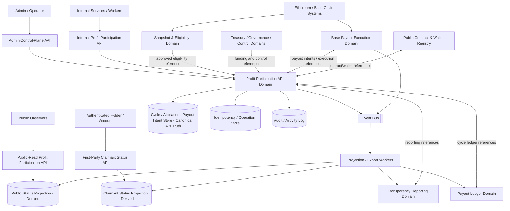
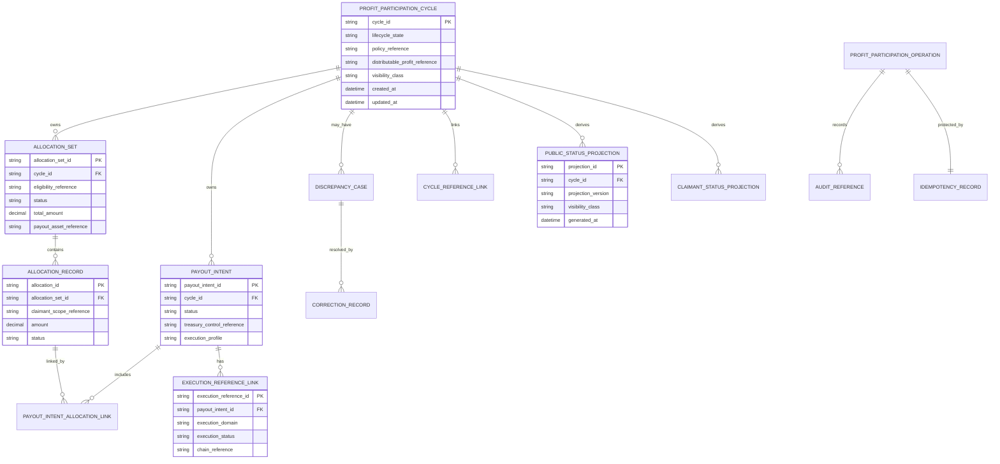
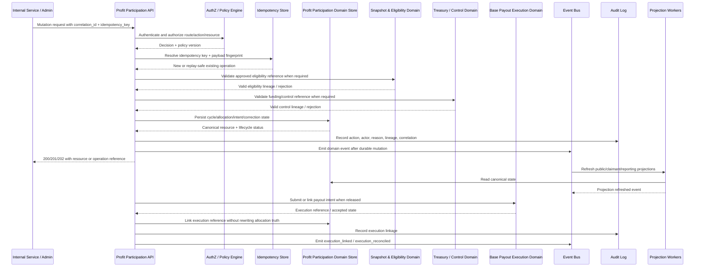

# PROFIT_PARTICIPATION_API_SPEC.md

## Document Metadata

- **Document Name:** `PROFIT_PARTICIPATION_API_SPEC.md`
- **Document Type:** API SPEC v2 — production-grade interface-contract specification
- **Status:** Draft refined API specification pending FUZE approval workflow
- **Version:** 2.0.0
- **Effective Date:** 2026-04-25
- **Last Updated:** 2026-04-25
- **Reviewed On:** 2026-04-25
- **Document Owner:** FUZE Profit Participation API Domain; named individual owner not yet specified
- **Approval Authority:** FUZE constitutional / platform architecture approval workflow; named authority not yet specified
- **Review Cadence:** Quarterly and whenever profit-participation policy, payout architecture, eligibility policy, treasury-control posture, Base payout execution, public reporting, registry publication, audit posture, or implementation-contract posture materially changes
- **Governing Layer:** API contract layer derived from refined profit-participation system semantics
- **Parent Registry:** FUZE API SPEC v2 Canonical File Registry
- **Upstream Semantic Registry:** `REFINED_SYSTEM_SPEC_INDEX.md`
- **Upstream API Registry:** `API_SPEC_INDEX.md`
- **Primary Audience:** Backend engineering, platform architecture, contracts engineering, treasury/governance operators, finance/accounting, security engineering, audit/compliance, runtime operations, public-trust/reporting teams, implementation-contract authors, OpenAPI/AsyncAPI/SDK authors
- **Primary Purpose:** Define the production-grade API contract architecture for FUZE profit-participation cycles, eligibility-consumption, allocation preparation, payout-intent creation, execution linkage, public-safe status exposure, correction/supersession lineage, and cross-domain coordination without redefining refined system semantics
- **Primary Upstream References:** `PROFIT_PARTICIPATION_SYSTEM_SPEC.md`; `SNAPSHOT_AND_ELIGIBILITY_PIPELINE_SPEC.md`; `PAYOUT_LEDGER_SPEC.md`; `BASE_PAYOUT_EXECUTION_LAYER_SPEC.md`; `TREASURY_CONTROL_POLICY_SPEC.md`; `VAULT_ACTION_POLICY_SPEC.md`; `MULTISIG_AND_TIMELOCK_SPEC.md`; `FOUNDATION_GOVERNANCE_SPEC.md`; `GOVERNANCE_MODEL_SPEC.md`; `PUBLIC_CONTRACT_AND_WALLET_REGISTRY_SPEC.md`; `TRANSPARENCY_MODEL_SPEC.md`; `TRANSPARENCY_REPORTING_SPEC.md`; `CHAIN_ARCHITECTURE_SPEC.md`; `ONCHAIN_OFFCHAIN_RESPONSIBILITY_SPEC.md`; `API_ARCHITECTURE_SPEC.md`; `PUBLIC_API_SPEC.md`; `INTERNAL_SERVICE_API_SPEC.md`; `EVENT_MODEL_AND_WEBHOOK_SPEC.md`; `IDEMPOTENCY_AND_VERSIONING_SPEC.md`; `MIGRATION_AND_BACKWARD_COMPATIBILITY_SPEC.md`; `AUDIT_LOG_AND_ACTIVITY_SPEC.md`; `SECURITY_AND_RISK_CONTROL_SPEC.md`; `MONITORING_ALERTING_AND_INCIDENT_RESPONSE_SPEC.md`; `FUZE_ACCOUNT_ACCESS_AND_SESSION_THESIS_FINAL_SPEC.md`; `FUZE_ACCOUNT_ACCESS_AND_SESSION_CANONICAL_FINAL_SPEC.md`; `FUZE_WORKSPACE_ACCESS_CONTROL_BASICS_THESIS_FINAL_SPEC.md`
- **Primary Downstream Dependents:** Profit-participation implementation contracts; payout-cycle administration APIs; payout-cycle worker contracts; payout-ledger linkage APIs; Base payout execution APIs; transparency-reporting publication APIs; public/holder-facing payout-status surfaces; admin/control-plane tooling; audit/reconciliation runbooks; OpenAPI/AsyncAPI/SDK artifacts
- **API Surface Families Covered:** Public-read; first-party authenticated read; internal service; admin/control-plane; event/async; reporting/export; chain-adjacent coordination
- **API Surface Families Excluded:** Direct contract ABI definitions; raw treasury accounting books; raw chain-indexing APIs; end-user wallet-linking proof APIs; private investor-room APIs; tax-document generation APIs; unrelated product-local entitlement APIs
- **Canonical System Owner(s):** FUZE Profit Participation System Domain for semantic cycle meaning; adjacent owners retain their respective truth domains
- **Canonical API Owner:** FUZE Profit Participation API Domain
- **Supersedes:** Existing v1 `PROFIT_PARTICIPATION_API_SPEC.md` to the extent this v2 document is approved; any weaker interpretation that treats the API as a route dump, spreadsheet adapter, one-off admin payout surface, or contract-execution proxy
- **Superseded By:** Not yet specified
- **Related Decision Records:** Not explicitly specified in the retrieved governing materials
- **Canonical Status Note:** This API spec expresses interface contracts derived from refined profit-participation semantics. It does not own semantic truth. Refined system specs remain authoritative for domain meaning and ownership boundaries.
- **Implementation Status:** Normative target for downstream API and implementation-contract work; exact route paths and schemas may be refined only if they preserve the contract rules herein
- **Approval Status:** Draft pending approval
- **Change Summary:** Upgraded the prior profit-participation API material into API SPEC v2 format; added explicit semantic/API truth separation, surface-family boundaries, request/response/error/status/idempotency rules, admin override constraints, read-model and public-exposure rules, chain-adjacent coordination rules, diagrams, flow views, acceptance criteria, and test cases.

---

## Purpose

This specification defines the FUZE Profit Participation API contract. The API expresses the refined profit-participation system semantics at the interface layer: cycle creation, policy and eligibility linkage, allocation preparation, payout-intent creation, execution-reference linkage, correction/supersession, discrepancy handling, and bounded public/holder-facing visibility.

The API exists because FUZE profit participation is a trust-sensitive economic rail. It MUST NOT be implemented as a casual dividend note, wallet spreadsheet, contract-only interpretation, product-local reward table, or unbounded admin transfer list. The API MUST preserve the refined system rule that policy-finalized distributable platform profit becomes bounded, cycle-based stablecoin payout rights only through explicit lifecycle state, approved eligibility basis, approved funding basis, payout-ledger linkage, execution linkage, public-trust reporting, audit lineage, and correction-safe history.

This API specification owns interface-contract expression. It does not redefine distributable-profit methodology, Ethereum token truth, eligible-dataset construction semantics, Base claim mechanics, payout-ledger truth, treasury-control policy, or transparency-reporting meaning.

---

## Scope

This API spec governs:

1. API surface families for profit-participation cycle operations.
2. Resource families exposed by profit-participation APIs.
3. Allowed public, first-party, internal, admin/control, event, reporting/export, and chain-adjacent posture.
4. Request, response, error, status, result, idempotency, retry, and replay rules.
5. Authorization, scope, permission, entitlement, and policy checks at the API layer.
6. Accepted-state versus final-outcome behavior for async operations.
7. Canonical mutation boundaries and read boundaries.
8. Public-safe and first-party-safe derived read models.
9. Audit, traceability, observability, correlation, and operation-reference requirements.
10. Migration, versioning, compatibility, and OpenAPI/AsyncAPI/SDK derivation guardrails.
11. Non-canonical API patterns that downstream teams MUST NOT implement.

---

## Out of Scope

This API spec does not define:

- raw accounting formulas for distributable profit;
- the full treasury approval matrix, reserve accounting method, or multisig signing procedure;
- snapshot extraction algorithms, address-classification policy internals, or proof-generation details;
- Base payout contract ABI, Merkle proof format, claim UX, or low-level transaction-submission implementation;
- payout-ledger publication schema in full detail;
- transparency-report templates in full detail;
- public registry metadata schema in full detail;
- wallet-link proof, account recovery, session security, or workspace authorization semantics except as API dependencies;
- tax, securities, legal, investor-room, or jurisdiction-specific disclosure obligations.

Those concerns remain governed by adjacent refined specs and downstream implementation-contract documents.

---

## Design Goals

1. Preserve explicit separation between profit-participation semantic truth and API contract truth.
2. Prevent route, schema, ownership, public-exposure, and error-semantics drift.
3. Make every trust-sensitive mutation idempotent, auditable, reason-coded, state-checked, and replay-safe.
4. Ensure public and first-party reads are derived from canonical owner-domain truth and never become hidden semantic owners.
5. Support backend implementation, frontend consumption, public-trust surfaces, internal service contracts, admin tooling, OpenAPI/AsyncAPI/SDK generation, and QA validation.
6. Preserve separation among token participation, eligible datasets, allocation truth, payout intent truth, treasury funding, Base execution, payout ledger, reporting, registry, and audit truth.
7. Make failure, correction, supersession, and discrepancy handling explicit.
8. Provide deterministic default rules for contested ownership, incomplete lineage, stale projections, dependency failure, replay attempts, and post-publication correction.

---

## Non-Goals

This API spec is not intended to:

- make sold Platform Credits, gross revenue, product usage, or token balances automatically equivalent to distributable profit;
- make raw Ethereum balances automatically equivalent to claimable payout entitlement;
- let Base payout execution decide eligibility or economic cycle meaning;
- let public reporting or registry entries become canonical economic owners;
- allow hidden spreadsheet, local job, admin-screen, or product-local payout truth;
- expose private treasury, wallet, claimant, or operational detail through public convenience routes;
- replace implementation-specific OpenAPI, AsyncAPI, database migration, worker topology, runbook, or contract ABI documents.

---

## Core Principles

1. **Refined Semantics Own Meaning.** The refined profit-participation system spec owns what a cycle, entitlement, funding reference, and correction mean. This API spec expresses that meaning through interfaces.
2. **Cycle-Based Rights Only.** Profit participation is bounded by explicit cycles. There is no continuous implicit accrual API.
3. **Eligibility Is Consumed, Not Invented.** APIs MUST consume approved snapshot/eligibility outputs and MUST NOT accept frontend-authored or admin-authored wallet lists as eligibility truth.
4. **Execution Is Linked, Not Collapsed.** Base payout execution is execution truth. Profit Participation APIs link to execution references but do not make contract state the sole owner of cycle meaning.
5. **Public Views Are Derived.** Public and first-party read models are subordinate to canonical owner-domain records and MAY lag if they preserve safety and lineage.
6. **Traceability Beats Convenience.** Every sensitive API mutation MUST preserve correlation IDs, idempotency records, audit lineage, reason codes, actor/service identity, and resulting resource references.
7. **Correction Must Preserve History.** The API MUST support correction/supersession lineage instead of silent overwrite.
8. **Conservative Defaults Win.** If required lineage, policy, authorization, eligibility, funding, or execution references are missing, the API MUST reject advancement rather than infer trust-sensitive meaning.

---

## Canonical Definitions

- **Profit Participation Cycle:** A formal distribution cycle with explicit lifecycle state, policy basis, funding basis, eligibility basis, entitlement/allocation basis, execution linkage, reporting linkage, and correction lineage.
- **Distributable Profit Reference:** The approved treasury/accounting reference that establishes the amount eligible for cycle allocation. The API consumes this reference; it does not compute accounting truth.
- **Eligibility Reference:** The approved output from the Snapshot and Eligibility Pipeline used as the cycle's eligibility basis.
- **Allocation Set:** The deterministic profit-participation allocation output derived from an approved eligibility basis and approved distributable amount for a cycle.
- **Payout Intent:** The API-owned execution-preparation object that groups one or more allocation records for downstream payout execution.
- **Execution Reference:** A link to downstream Base payout execution, chain transaction, execution batch, receipt, or reconciliation record. It is not itself allocation truth.
- **Public Status View:** A derived, public-safe view of cycle and payout posture.
- **First-Party Claimant View:** A bounded authenticated view for a user/account/wallet relationship where policy allows claimant-level visibility.
- **Discrepancy Case:** A review/remediation object for detected mismatch, duplicate, stale, failed, partial, or contested profit-participation state.
- **Supersession:** A lineage-preserving replacement of a prior record, dataset, allocation, intent, or public view.

---

## Truth Class Taxonomy

The API MUST distinguish these truth classes:

1. **Semantic Truth:** Refined profit-participation meaning owned by `PROFIT_PARTICIPATION_SYSTEM_SPEC.md`.
2. **API Contract Truth:** Resource, route, request, response, error, idempotency, audit, and versioning contracts governed by this spec.
3. **Policy Truth:** Profit-participation policy, eligibility-treatment policy, and treasury/funding policy references owned by their policy domains.
4. **Accounting / Treasury Truth:** Finalized distributable-profit and funding authorization records owned by treasury/accounting/control domains.
5. **Participation Truth:** Ethereum token-holder state owned by the token/chain layer.
6. **Eligibility Truth:** Approved policy-treated eligible dataset owned by the Snapshot and Eligibility Pipeline.
7. **Allocation Truth:** Profit-participation allocation records owned by this API domain after approved eligibility and funding basis are consumed.
8. **Execution Truth:** Base payout execution and claim/receipt state owned by the Base Payout Execution Domain.
9. **Ledger Truth:** Cycle-level payout ledger record owned by the Payout Ledger Domain.
10. **Registry Truth:** Public official contract/wallet publication truth owned by the Public Contract and Wallet Registry Domain.
11. **Reporting Truth:** Public recurring transparency report publication truth owned by Transparency Reporting.
12. **Audit Truth:** Durable internal action and decision lineage owned by audit/activity systems.
13. **Projection Truth:** Public, first-party, admin dashboard, search, reporting, and export views derived from canonical sources.
14. **Presentation Truth:** Frontend text, layout, status labels, and convenience summaries derived from API responses.

No implementation MAY collapse these truth classes into a single table, endpoint, cache, dashboard, or contract event stream.

---

## Architectural Position in the Spec Hierarchy

This API sits below refined system semantics and above implementation contracts. It depends on:

- constitutional platform and ownership specs for boundary interpretation;
- account/session/workspace/access-control foundation specs for identity and authorization posture;
- on-chain/off-chain responsibility specs for chain-adjacent separation;
- profit-participation refined semantics for cycle meaning;
- snapshot/eligibility refined semantics for eligibility inputs;
- treasury, vault, governance, and multisig/timelock specs for funding and control actions;
- payout ledger and Base execution specs for downstream trust records and execution state;
- transparency and registry specs for public-safe exposure;
- API architecture, public API, internal service API, event/webhook, idempotency/versioning, migration, audit, security, and operations specs for interface-governance posture.

---

## Upstream Semantic Owners

- `PROFIT_PARTICIPATION_SYSTEM_SPEC.md` owns profit-participation semantic truth.
- `SNAPSHOT_AND_ELIGIBILITY_PIPELINE_SPEC.md` owns snapshot, treatment, eligible dataset, and entitlement-preparation lineage truth.
- `TREASURY_CONTROL_POLICY_SPEC.md` owns treasury-sensitive funding-control interpretation.
- `VAULT_ACTION_POLICY_SPEC.md`, `FOUNDATION_GOVERNANCE_SPEC.md`, and `GOVERNANCE_MODEL_SPEC.md` own their relevant stewardship/control meanings.
- `MULTISIG_AND_TIMELOCK_SPEC.md` owns shared authorization and delayed-execution control semantics.
- `PAYOUT_LEDGER_SPEC.md` owns structured cycle-ledger truth.
- `BASE_PAYOUT_EXECUTION_LAYER_SPEC.md` owns Base-side execution-run, claim, batch, receipt, and reconciliation truth.
- `PUBLIC_CONTRACT_AND_WALLET_REGISTRY_SPEC.md` owns public registry publication truth.
- `TRANSPARENCY_MODEL_SPEC.md` and `TRANSPARENCY_REPORTING_SPEC.md` own transparency interpretation and report publication truth.
- `AUDIT_LOG_AND_ACTIVITY_SPEC.md` owns audit lineage truth.

---

## API Surface Families

### Public-Read Surface
Public-read APIs MAY expose published cycle summaries, public-safe cycle status, payout asset references, public reporting links, registry links, correction/supersession notices, and aggregate execution posture. Public APIs MUST NOT expose private claimant detail, internal eligibility rows, treasury internals, admin notes, unreleased funding details, raw discrepancy notes, or security-sensitive execution metadata.

### First-Party Authenticated Surface
First-party authenticated APIs MAY expose claimant-linked, account/wallet-aware payout status only when the caller is authenticated, authorized, and policy allows the view. These APIs MUST distinguish account identity, wallet-link context, token participation, eligible dataset output, allocation status, and execution status.

### Internal Service Surface
Internal service APIs coordinate period creation, eligibility attachment, allocation generation, payout-intent creation, execution-reference linkage, canonical reads, worker progression, and reconciliation linkage. Service routes require service identity, least privilege, version-aware contracts, idempotency, correlation IDs, and audit lineage for mutations.

### Admin / Control-Plane Surface
Admin/control routes MAY approve, lock, release, pause, resume, correct, reprocess, restrict, supersede, resolve discrepancies, and publish status only under explicit permission, policy, reason-code, idempotency, audit, and state-transition constraints. Admin APIs MUST NOT bypass owner-domain validation.

### Event / Webhook / Async Surface
Events represent durable lifecycle changes. Internal domain events are not the same as public webhooks. Public webhooks, if later exposed, MUST be derived from approved event families and MUST preserve public-safety filtering and replay protection.

### Reporting / Export Surface
Reporting/export APIs MAY expose public-safe or internal-governed exports. Exports are derived views and MUST include source references, generated-at timestamps, version identifiers, and visibility class. Exports MUST NOT become canonical allocation, eligibility, or execution owners.

### Chain-Adjacent Surface
Chain-adjacent APIs coordinate with Base payout execution and registry/contract references. They MUST distinguish preparation, submission, confirmation, reconciliation, reporting, and public display. Chain events are normalized signals until owner-domain validation adopts them.

---

## System / API Boundaries

This API governs:

- profit-participation cycle API resources;
- approved eligibility-reference consumption;
- allocation-generation contracts;
- payout-intent contracts;
- execution-reference linkage;
- discrepancy and correction contracts;
- bounded public and authenticated status views;
- events, audit, observability, and migration guardrails.

This API does not own:

- raw token balances;
- snapshot extraction and eligibility policy;
- distributable-profit accounting calculation;
- treasury action approval truth;
- multisig/timelock execution mechanics;
- payout contract ABI and claim validation mechanics;
- payout-ledger source of record;
- transparency-report source of record;
- public contract/wallet registry source of record;
- user identity, session, workspace, or wallet-link truth.

---

## Adjacent API Boundaries

- `SNAPSHOT_AND_ELIGIBILITY_PIPELINE_API_SPEC.md` owns snapshot/reference/dataset construction APIs. Profit Participation APIs consume approved eligibility outputs only.
- `PAYOUT_LEDGER_API_SPEC.md` owns cycle-ledger publication, reconciliation, correction lineage, and ledger visibility APIs. Profit Participation APIs provide source references and lifecycle events.
- `BASE_PAYOUT_EXECUTION_LAYER_API_SPEC.md` owns execution-run, batch, claim, receipt, and reconciliation APIs. Profit Participation APIs create/link payout intents and execution references.
- `TREASURY_CONTROL_POLICY_API_SPEC.md` owns treasury funding approval and treasury-sensitive action APIs. Profit Participation APIs require those references for advancement.
- `PUBLIC_CONTRACT_AND_WALLET_REGISTRY_API_SPEC.md` owns public official contract/wallet lookup APIs. Profit Participation APIs may link to registry references.
- `TRANSPARENCY_REPORTING_API_SPEC.md` owns public reports. Profit Participation APIs may publish report references and source data for downstream reports.
- `WALLET_AWARE_USER_API_SPEC.md` owns account-to-wallet linkage APIs. Profit Participation APIs may consume bounded linkage context for first-party claimant views but MUST NOT redefine wallet-link truth.

---

## Conflict Resolution Rules

1. Higher-order FUZE constitutional, boundary, ownership, and data-governance specs override this API spec on platform ownership questions.
2. Refined system specs override API v1 material and route convenience.
3. `PROFIT_PARTICIPATION_SYSTEM_SPEC.md` controls profit-participation semantic meaning.
4. `SNAPSHOT_AND_ELIGIBILITY_PIPELINE_SPEC.md` controls eligibility derivation and dataset lineage.
5. Treasury, vault, Foundation, governance, and multisig/timelock specs control sensitive funding and control action interpretation.
6. Base payout execution specs control execution-state meaning.
7. Payout ledger specs control structured cycle-ledger truth.
8. Public registry and transparency specs control public registry/reporting publication truth.
9. If route convenience conflicts with traceability, traceability wins.
10. If public exposure conflicts with privacy/security, exposure is narrowed while preserving canonical internal truth.
11. If ambiguity remains, the API MUST choose the most conservative architecture-consistent interpretation and require explicit review before mutation or publication.

---

## Default Decision Rules

1. No approved distributable-profit reference means no allocation generation.
2. No approved eligibility reference means no canonical allocation set.
3. No explicit policy version means no cycle advancement beyond draft/preparation.
4. No treasury funding/control reference means no release for execution.
5. No payout-intent approval means no execution linkage may be treated as authorized.
6. No execution confirmation means public status MUST NOT say execution completed.
7. If eligibility and allocation totals do not reconcile, advancement stops pending discrepancy review.
8. If duplicate idempotency keys carry different mutation payloads, the API MUST return an idempotency conflict.
9. If an address/category is contested without explicit policy treatment, the API MUST exclude or hold it pending policy decision rather than infer inclusion.
10. If public and internal views diverge, canonical internal owner-domain truth wins; public views must be refreshed, corrected, superseded, or retracted as appropriate.
11. If a post-publication issue cannot be safely corrected in place, supersession is required.
12. If async acceptance occurs, accepted state MUST NOT be described as final business success.

---

## Roles / Actors / API Consumers

- **Public Observer:** Reads published public-safe cycle and status summaries.
- **Eligible Holder / Claimant:** Reads bounded first-party status where authenticated and authorized.
- **First-Party Web App:** Consumes public and authenticated status views; does not author canonical truth.
- **Admin Console:** Initiates privileged actions through backend control-plane APIs; does not own truth.
- **Profit Participation Service:** Owns canonical cycle, allocation, payout-intent, discrepancy, and correction API resources.
- **Snapshot / Eligibility Service:** Provides approved eligibility references.
- **Treasury / Governance Service:** Provides funding and control references.
- **Base Payout Execution Service:** Consumes payout intents and returns execution references.
- **Payout Ledger Service:** Records structured cycle ledger and public-safe ledger posture.
- **Transparency / Registry Services:** Publish derived trust artifacts.
- **Audit / Observability Systems:** Record lineage, metrics, traces, logs, alerts, and investigation context.
- **Workers / Async Jobs:** Perform allocation generation, projection refresh, execution-link reconciliation, and export generation under owner-domain control.

---

## Resource / Entity Families

### Canonical API Resources Owned Here

- `profit_participation_cycle`
- `cycle_policy_reference`
- `cycle_distributable_profit_reference`
- `cycle_eligibility_reference`
- `allocation_set`
- `allocation_record`
- `allocation_summary`
- `payout_intent`
- `payout_intent_allocation_link`
- `execution_reference_link`
- `profit_participation_action`
- `profit_participation_discrepancy_case`
- `profit_participation_correction`
- `profit_participation_supersession`
- `profit_participation_operation`
- `profit_participation_public_status_projection`
- `profit_participation_claimant_status_projection`

### Referenced External Resources

- snapshot reference;
- eligible dataset reference;
- entitlement-input reference;
- treasury action reference;
- vault policy reference;
- governance action reference;
- multisig/timelock reference;
- execution-run/batch/receipt reference;
- payout-ledger cycle reference;
- transparency report reference;
- public registry entry reference;
- audit record reference;
- account/session/wallet-link reference where applicable.

---

## Ownership Model

The Profit Participation API Domain owns API resources for cycles, allocation sets, payout intents, execution linkage, discrepancy cases, corrections, and public/claimant projections derived from those resources. It does not own the upstream source truth used to create them.

Mutation ownership is bounded:

- Cycle creation and lifecycle mutation belong to the Profit Participation API Domain.
- Eligibility attachment consumes Snapshot/Eligibility outputs and cannot redefine them.
- Allocation generation belongs to this API domain only after approved eligibility and distributable-profit references exist.
- Payout intent creation belongs to this API domain as execution preparation.
- Execution confirmation belongs to Base Payout Execution and is linked back as execution reference.
- Public reporting and payout ledger publication are adjacent derived/publication domains.

---

## Authority / Decision Model

### Required Authority for Mutations

- Draft cycle creation: internal service authority.
- Policy lock: internal service authority plus policy reference validation.
- Eligibility attachment: internal service authority plus approved eligibility reference validation.
- Allocation generation: internal service authority plus approved distributable amount and eligibility references.
- Allocation approval: admin/control-plane authority or governed workflow authority.
- Payout intent creation: internal service authority after allocation approval.
- Release for execution: admin/control-plane authority plus treasury/control reference validation.
- Execution linkage: internal service authority from Base payout execution or authorized orchestration service.
- Correction/supersession: admin/control-plane authority with reason code, case reference where material, and audit linkage.
- Public projection publication: internal/publication authority derived from approved status and visibility class.

### Operator Override Rules

Operator/admin override APIs MAY exist only when they are:

- explicit route families;
- separated from ordinary application APIs;
- permissioned by role/scope/policy;
- reason-coded;
- idempotency-protected;
- audit-linked;
- state-machine constrained;
- limited to bounded correction, pause, resume, restriction, supersession, or remediation actions;
- unable to rewrite approved eligibility, allocation, funding, or execution history silently.

---

## Authentication Model

- Public-read routes MAY be unauthenticated.
- First-party claimant routes MUST require valid FUZE account/session authentication and, where wallet-linked visibility is needed, canonical wallet-aware linkage checks.
- Internal service routes MUST require authenticated service principal identity, service trust tier, contract version, and route-specific least privilege.
- Admin/control routes MUST require authenticated human/operator identity, elevated role, scoped permission, session freshness where required, and policy/control checks.
- Chain-adjacent callbacks or ingestion routes MUST authenticate source systems or pass through a normalized ingestion boundary before owner-domain adoption.

Wallet possession alone MUST NOT replace account-rooted authentication, operator authorization, or service identity.

---

## Authorization / Scope / Permission Model

Authorization MUST evaluate:

1. caller class and route family;
2. route action class;
3. target resource state;
4. visibility class;
5. actor account/session/workspace context where applicable;
6. service principal and contract version for internal APIs;
7. admin/operator permission and reason-code requirement;
8. treasury/governance/control reference requirement for sensitive actions;
9. entitlement or claimant-visibility policy for first-party reads;
10. rate-limit, risk, and abuse-control posture.

Forbidden authorization shortcuts:

- using wallet address ownership alone to read private claimant details;
- allowing frontend/admin UI to bypass backend policy checks;
- allowing execution service callbacks to mutate allocation truth directly;
- allowing public route parameters to infer private allocation existence;
- allowing product-local roles to approve payout-cycle state transitions.

---

## Entitlement / Capability-Gating Model

Profit participation is not a generic product entitlement. The API MAY expose claimant-linked status only when:

- the caller is authenticated;
- wallet/account linkage is canonical and active where wallet context is required;
- visibility policy allows the specific status class;
- public or first-party view has been generated from canonical sources;
- no security, correction, or discrepancy restriction blocks exposure.

Product capability gating MAY consume published profit-participation status only where approved by entitlement specs. Product teams MUST NOT infer entitlement from raw profit-participation allocations unless a formal entitlement mapping exists.

---

## API State Model

### Cycle States

- `draft`
- `pending_policy_lock`
- `pending_distributable_profit_reference`
- `pending_eligibility_reference`
- `allocation_ready`
- `allocation_generated`
- `allocation_approved`
- `pending_treasury_authorization`
- `released_for_execution`
- `execution_in_progress`
- `open_for_claims`
- `paused`
- `partially_executed`
- `closed`
- `finalized`
- `discrepancy_under_review`
- `superseded`
- `cancelled_pre_funding`
- `restricted`

### Allocation States

- `draft`
- `generated`
- `validated`
- `approved`
- `included_in_intent`
- `released`
- `executed`
- `partially_executed`
- `corrected`
- `superseded`
- `restricted`

### Payout Intent States

- `draft`
- `ready`
- `approved`
- `released`
- `submitted`
- `accepted_by_execution_layer`
- `execution_pending`
- `partially_executed`
- `executed`
- `failed`
- `cancelled`
- `superseded`
- `restricted`

### Discrepancy States

- `opened`
- `triaged`
- `under_review`
- `remediation_pending`
- `remediated`
- `closed`
- `superseded`

State transitions MUST be explicit. Implementations MUST NOT advance lifecycle by hidden side effect from public reads, report generation, frontend display, chain event observation, or unmanaged worker retry.

---

## Lifecycle / Workflow Model

1. **Cycle Initialization:** An internal service creates a draft cycle with period metadata and correlation context.
2. **Policy Lock:** The cycle is linked to an explicit policy version and lifecycle rules.
3. **Distributable-Profit Reference Attachment:** Treasury/accounting-approved distributable-profit and funding-basis references are attached.
4. **Eligibility Reference Attachment:** Approved Snapshot/Eligibility output is attached and validated for purpose/cycle compatibility.
5. **Allocation Generation:** The API creates allocation set and allocation records from approved inputs.
6. **Allocation Validation:** Totals, dataset lineage, policy references, duplicates, excluded/special-treatment classes, and reconciliation checks are validated.
7. **Allocation Approval:** Governed/admin approval locks allocation truth for downstream execution.
8. **Payout Intent Creation:** One or more payout intents are created from approved allocations.
9. **Treasury/Control Release:** Release for execution requires approved treasury/control references.
10. **Execution Submission/Linkage:** Base payout execution receives intents and returns execution references.
11. **Execution Confirmation/Reconciliation:** Execution outcomes are linked and reconciled without overwriting allocation truth.
12. **Public / First-Party Projection Refresh:** Public and claimant views are refreshed according to visibility policy.
13. **Payout Ledger / Reporting Linkage:** Ledger and transparency/reporting references are linked as derived publication outputs.
14. **Closure / Finalization:** Cycle closure records claim/end posture, residual handling references, and final reporting references.
15. **Correction / Supersession:** Discrepancies trigger bounded correction or supersession with immutable lineage.

---

## Architecture Diagram — Mermaid flowchart

---

## Data Design — Mermaid Diagram

Derived projections, reports, exports, and public pages MUST reference canonical resources. They MUST NOT mutate cycle, allocation, or payout-intent truth.

---

## Flow View

### Synchronous Request Path

1. Caller authenticates or proceeds as public if route is public-read.
2. API gateway applies route-family, rate-limit, and abuse controls.
3. Backend resolves caller class, route version, contract version, and correlation ID.
4. Authorization evaluates service/admin/user/public permission and visibility class.
5. Mutation requests require idempotency keys and payload fingerprints.
6. Domain validator checks state machine, required upstream references, policy versions, and target resource ownership.
7. Mutation is accepted or rejected with structured result.
8. Accepted mutation persists canonical state and operation record transactionally.
9. Audit record is created for all sensitive mutations.
10. Domain event is emitted after durable acceptance or durable mutation.
11. Response returns resource summary, status, operation reference, and correlation ID.

### Async Accepted Path

1. Long-running allocation generation, projection refresh, release, reprocessing, export, or discrepancy remediation returns `202 Accepted`.
2. Response includes operation ID, status endpoint, retry guidance, and correlation ID.
3. Worker resumes from operation state and idempotency record.
4. Final domain state is recorded separately from accepted state.
5. Projections, ledger links, reports, and public views refresh asynchronously and remain derived.

### Failure / Retry Path

1. Failed dependency, validation, authorization, idempotency, or state transition returns structured problem details.
2. Retriable failures preserve operation state and do not duplicate allocations, payout intents, or execution links.
3. Non-retriable errors require correction, supersession, or discrepancy handling.
4. Repeated duplicate requests with identical idempotency key and payload return the original safe outcome.
5. Repeated duplicate requests with changed payload return idempotency conflict.

### Admin / Operator Remediation Path

1. Admin opens or selects discrepancy case.
2. Admin submits reason-coded action with idempotency key and supporting references.
3. API verifies role, policy, state, and control-path authority.
4. API creates correction or supersession lineage rather than overwriting historical truth.
5. Audit, event, projection refresh, and public/reporting updates occur according to visibility class.

---

## Data Flows — Mermaid sequenceDiagram

---

## Request Model

All mutation requests MUST include:

- `correlation_id` or platform-generated equivalent;
- `idempotency_key` for mutation, release, correction, reprocess, and async routes;
- API version / contract version where required;
- target resource identifier;
- explicit action type;
- reason code for admin/control actions;
- actor/service identity from authentication context, not self-asserted payload;
- policy/reference identifiers required for the action;
- request payload fingerprint for idempotency enforcement.

Mutation requests MUST NOT accept:

- raw wallet lists as canonical eligibility;
- frontend-authored payout amounts;
- unvalidated execution references;
- unauthenticated chain event data as owner-domain truth;
- hidden admin notes as policy basis;
- route parameters that imply public/private visibility without authorization evaluation.

---

## Response Model

Success responses MUST include:

- stable resource identifier;
- lifecycle state;
- action result or operation state;
- canonical reference links relevant to the route;
- visibility class;
- timestamps;
- correlation ID;
- operation ID for async operations;
- warning/restriction/supersession indicators where relevant.

Responses MUST distinguish:

- `accepted` from `completed`;
- allocation approval from payout execution;
- execution submission from execution confirmation;
- public-safe status from internal canonical status;
- claimant-visible status from raw allocation detail;
- current record from superseded/corrected historical records.

---

## Error / Result / Status Model

Errors MUST use structured problem-details style responses with:

- `type`;
- `title`;
- `status`;
- `code`;
- `detail`;
- `instance`;
- `correlation_id`;
- `operation_id` where applicable;
- safe remediation hint where allowed.

### Required Error Classes

- `PROFIT_PARTICIPATION_AUTHENTICATION_REQUIRED`
- `PROFIT_PARTICIPATION_PERMISSION_DENIED`
- `PROFIT_PARTICIPATION_SCOPE_DENIED`
- `PROFIT_PARTICIPATION_VISIBILITY_DENIED`
- `PROFIT_PARTICIPATION_IDEMPOTENCY_KEY_REQUIRED`
- `PROFIT_PARTICIPATION_IDEMPOTENCY_CONFLICT`
- `PROFIT_PARTICIPATION_REQUEST_INVALID`
- `PROFIT_PARTICIPATION_STATE_CONFLICT`
- `PROFIT_PARTICIPATION_POLICY_REFERENCE_REQUIRED`
- `PROFIT_PARTICIPATION_DISTRIBUTABLE_PROFIT_REFERENCE_REQUIRED`
- `PROFIT_PARTICIPATION_ELIGIBILITY_REFERENCE_REQUIRED`
- `PROFIT_PARTICIPATION_ELIGIBILITY_REFERENCE_INVALID`
- `PROFIT_PARTICIPATION_ALLOCATION_RECONCILIATION_FAILED`
- `PROFIT_PARTICIPATION_TREASURY_CONTROL_REQUIRED`
- `PROFIT_PARTICIPATION_RELEASE_FORBIDDEN`
- `PROFIT_PARTICIPATION_EXECUTION_REFERENCE_INVALID`
- `PROFIT_PARTICIPATION_PUBLICATION_RESTRICTED`
- `PROFIT_PARTICIPATION_CORRECTION_REQUIRED`
- `PROFIT_PARTICIPATION_CORRECTION_NOT_ALLOWED`
- `PROFIT_PARTICIPATION_DEPENDENCY_UNAVAILABLE`
- `PROFIT_PARTICIPATION_RATE_LIMITED`
- `PROFIT_PARTICIPATION_DEGRADED_MODE`

Error responses MUST NOT leak private claimant, treasury, security, eligibility-row, or execution internals through public or unauthorized surfaces.

---

## Idempotency / Retry / Replay Model

Idempotency is mandatory for:

- cycle creation;
- policy lock;
- distributable-profit reference attachment;
- eligibility reference attachment;
- allocation generation;
- allocation approval;
- payout-intent creation;
- release for execution;
- execution-reference linkage;
- correction/supersession;
- discrepancy resolution;
- projection publication;
- export generation.

Idempotency records MUST store:

- key;
- caller identity / service principal;
- route/action family;
- target resource;
- payload fingerprint;
- accepted/completed state;
- result reference;
- created/expired timestamps;
- conflict marker where applicable.

Retries MUST be safe under at-least-once delivery. Workers MUST resume from operation state and MUST NOT duplicate allocation records, payout intents, execution references, public publications, or correction records.

Replay attempts with stale credentials, changed payloads, wrong target resources, or expired policy references MUST be rejected.

---

## Rate Limit / Abuse-Control Model

- Public-read routes MUST have rate limits, cache controls, and scraping protections appropriate to public trust surfaces.
- First-party claimant routes MUST protect against enumeration of wallet/account/claimant status.
- Internal service routes MUST use service-level quotas and circuit breakers.
- Admin/control routes MUST have stricter throttles, session freshness, risk checks, and alerting for unusual activity.
- Chain-adjacent callback/ingestion routes MUST be protected against duplicate, spoofed, stale, or reordered events.

Rate limiting MUST return safe, structured errors and MUST NOT reveal whether a private claimant or allocation exists.

---

## Endpoint / Route Family Model

Exact route paths MAY be refined by downstream OpenAPI, but route families MUST preserve these contracts.

### Public-Read Routes

- `GET /v2/profit-participation/cycles`
- `GET /v2/profit-participation/cycles/{cycle_id}`
- `GET /v2/profit-participation/cycles/{cycle_id}/public-status`
- `GET /v2/profit-participation/cycles/{cycle_id}/corrections`

### First-Party Authenticated Routes

- `GET /v2/profit-participation/me/cycles`
- `GET /v2/profit-participation/me/cycles/{cycle_id}`
- `GET /v2/profit-participation/me/claim-status/{cycle_id}`

### Internal Service Routes

- `POST /internal/v2/profit-participation/cycles`
- `POST /internal/v2/profit-participation/cycles/{cycle_id}/policy-lock`
- `POST /internal/v2/profit-participation/cycles/{cycle_id}/distributable-profit-reference`
- `POST /internal/v2/profit-participation/cycles/{cycle_id}/eligibility-reference`
- `POST /internal/v2/profit-participation/cycles/{cycle_id}/allocation-sets/generate`
- `POST /internal/v2/profit-participation/cycles/{cycle_id}/payout-intents`
- `POST /internal/v2/profit-participation/payout-intents/{payout_intent_id}/execution-references`
- `GET /internal/v2/profit-participation/cycles/{cycle_id}`
- `GET /internal/v2/profit-participation/operations/{operation_id}`

### Admin / Control-Plane Routes

- `POST /admin/v2/profit-participation/cycles/{cycle_id}/approve-allocation`
- `POST /admin/v2/profit-participation/cycles/{cycle_id}/release-for-execution`
- `POST /admin/v2/profit-participation/cycles/{cycle_id}/pause`
- `POST /admin/v2/profit-participation/cycles/{cycle_id}/resume`
- `POST /admin/v2/profit-participation/cycles/{cycle_id}/close`
- `POST /admin/v2/profit-participation/cycles/{cycle_id}/finalize`
- `POST /admin/v2/profit-participation/discrepancies`
- `POST /admin/v2/profit-participation/corrections`
- `POST /admin/v2/profit-participation/supersessions`

### Reporting / Export Routes

- `POST /internal/v2/profit-participation/cycles/{cycle_id}/exports`
- `GET /internal/v2/profit-participation/exports/{export_id}`
- `GET /admin/v2/profit-participation/cycles/{cycle_id}/lineage`

---

## Public API Considerations

Public APIs MUST default to narrow, stable, public-safe contracts. They MAY expose:

- cycle ID;
- public lifecycle state;
- payout asset class where public;
- aggregate funded/executed/claim posture where approved;
- public ledger/report/registry references;
- correction/supersession notice;
- generated-at and version metadata.

Public APIs MUST NOT expose:

- private claimant rows;
- internal eligibility datasets;
- undisclosed funding preparations;
- treasury signing details;
- admin notes;
- security-sensitive execution metadata;
- internal discrepancy investigation details;
- raw audit logs;
- wallet-link ownership or account-specific status.

---

## First-Party Application API Considerations

First-party apps MAY show claimant-linked status only when canonical account/session and wallet-aware rules permit. Responses MUST use bounded status classes and MUST avoid claiming final payout success until execution confirmation and reconciliation support it.

Frontend labels MUST NOT reinterpret lifecycle state. If presentation needs simplified labels, mapping must be derived from approved API status semantics.

---

## Internal Service API Considerations

Internal service APIs MUST:

- require service identity and least privilege;
- be versioned when contract changes affect callers;
- record idempotency and operation state;
- enforce owner-domain state machines;
- emit events after durable acceptance/mutation;
- never expose hidden broad-write shortcuts;
- reject requests that try to mutate adjacent domain truth.

---

## Admin / Control-Plane API Considerations

Admin APIs MUST be separated from public and first-party APIs. They MUST require:

- human operator identity;
- elevated permission;
- reason code;
- operator note where sensitive;
- idempotency key;
- correlation ID;
- policy/control reference where required;
- audit record;
- state-machine validation;
- post-action event emission.

Admin APIs MUST NOT perform silent historical overwrite. Corrections MUST create lineage.

---

## Event / Webhook / Async API Considerations

Canonical domain events SHOULD include:

- `profit_participation.cycle_created`
- `profit_participation.policy_locked`
- `profit_participation.distributable_profit_reference_attached`
- `profit_participation.eligibility_reference_attached`
- `profit_participation.allocation_generation_accepted`
- `profit_participation.allocations_generated`
- `profit_participation.allocations_approved`
- `profit_participation.payout_intents_created`
- `profit_participation.released_for_execution`
- `profit_participation.execution_reference_linked`
- `profit_participation.execution_reconciled`
- `profit_participation.cycle_paused`
- `profit_participation.cycle_resumed`
- `profit_participation.discrepancy_opened`
- `profit_participation.corrected`
- `profit_participation.superseded`
- `profit_participation.public_status_refreshed`
- `profit_participation.cycle_finalized`

Events MUST carry correlation IDs, entity references, operation IDs, actor/service class, visibility class, and schema version. Events are at-least-once; consumers MUST be idempotent.

External webhooks, if added later, MUST be governed by `EVENT_MODEL_AND_WEBHOOK_SPEC.md` and MUST NOT expose internal-only event payloads.

---

## Chain-Adjacent API Considerations

The API MUST distinguish:

- eligibility input from Ethereum participation truth;
- payout-intent preparation from Base execution submission;
- execution submission from execution confirmation;
- transaction observation from owner-domain adoption;
- claim execution truth from allocation truth;
- contract registry publication from private operational wallet inventory.

Chain events and transaction receipts are normalized inputs until validated and linked by the owning API domain. The API MUST preserve chain ID, contract reference, transaction reference, execution batch/run reference, policy/cycle reference, and reconciliation state where relevant.

---

## Data Model / Storage Support Implications

Storage must support:

- immutable or append-only lineage for sensitive state changes;
- canonical cycle, allocation, payout-intent, discrepancy, correction, and operation records;
- idempotency records with payload fingerprints;
- audit/action references;
- external owner-domain references;
- projection versioning;
- supersession relationships;
- visibility classes;
- generated-at and source-version metadata for projections/exports.

Implementations MUST NOT use derived public views as canonical mutation sources.

---

## Read Model / Projection / Reporting Rules

Read models MAY exist for:

- public cycle status;
- first-party claimant status;
- admin dashboards;
- reconciliation views;
- reporting exports;
- search/discovery;
- historical correction views.

Read models MUST:

- declare source references;
- carry projection version and generated-at timestamp;
- distinguish stale, partial, restricted, superseded, corrected, and final states;
- avoid exposing internal-only data through public projections;
- be rebuildable from canonical owner-domain state;
- never become write sources.

---

## Security / Risk / Privacy Controls

Required controls:

- least-privilege service access;
- strict admin/control separation;
- session freshness for privileged actions;
- no claimant enumeration through public or first-party APIs;
- sensitive payload redaction in logs;
- privacy-safe public responses;
- anti-replay for idempotent mutations;
- dependency timeout and circuit-breaker handling;
- alerting for unusual approval/release/correction activity;
- chain-event spoofing protection;
- secure handling of treasury, contract, and wallet references.

---

## Audit / Traceability / Observability Requirements

Every sensitive mutation MUST record:

- authenticated actor or service principal;
- impersonated human actor where applicable;
- route/action family;
- target resource;
- prior state and resulting state where safe;
- reason code;
- policy/control references;
- idempotency key;
- correlation ID and trace ID;
- operation ID;
- emitted event IDs;
- external references created or consumed;
- public projection/report refresh impact where applicable.

Observability MUST include metrics for request volume, validation failures, idempotency conflicts, dependency failures, projection lag, allocation generation duration, release/execute lag, discrepancy cases, and public-status freshness.

---

## Failure Handling / Edge Cases

- Missing policy reference: reject advancement.
- Missing approved eligibility reference: reject allocation generation.
- Eligibility dataset superseded before allocation approval: block approval and require regeneration or explicit review.
- Distributable amount mismatch: open discrepancy and block release.
- Duplicate allocation detected: reject or open discrepancy before approval.
- Payout intent partially executed: preserve partial state and require reconciliation or reprocess path.
- Execution layer unavailable: keep intent in accepted/released state; do not mark executed.
- Public projection lag: expose stale marker or temporarily narrow public status.
- Post-publication material error: create correction/supersession; do not silently rewrite history.
- Chain reorg or receipt ambiguity: keep execution reference pending reconciliation.
- Admin action without reason code: reject.
- Replay with changed payload: idempotency conflict.
- Degraded mode: allow safe reads where possible; block trust-sensitive mutations if dependencies cannot validate required references.

---

## Migration / Versioning / Compatibility / Deprecation Rules

- Route families MUST be versioned when breaking response, request, state, or error semantics change.
- Public API changes require stricter compatibility windows than internal service changes.
- Internal service APIs that affect financial/trust-sensitive state require migration plans and contract-version registration.
- Deprecated v1 route shapes MAY be maintained temporarily as compatibility wrappers only if they call v2-compatible domain logic.
- Legacy spreadsheet/import mechanisms MUST be normalized into approved eligibility/allocation references before use.
- Historical cycles MUST retain lineage and not be silently recast under new semantics.
- Public responses MUST expose correction/supersession where historical meaning changed.

---

## OpenAPI / AsyncAPI / SDK Derivation Rules

OpenAPI artifacts MUST preserve:

- route-family separation;
- public versus first-party versus internal versus admin boundaries;
- required idempotency and correlation headers;
- structured error codes;
- accepted-state versus terminal-state response classes;
- visibility class fields;
- stable resource identifiers;
- deprecation and compatibility metadata.

AsyncAPI artifacts MUST preserve:

- event names;
- schema versions;
- correlation IDs;
- operation IDs;
- source domain;
- visibility class;
- at-least-once delivery semantics;
- idempotent consumer requirements.

SDKs MUST NOT collapse admin routes into ordinary client methods or expose internal service routes to public clients.

---

## Implementation-Contract Guardrails

1. Downstream implementations MUST preserve owner-domain mutation boundaries.
2. Public and claimant projections MUST remain derived.
3. Allocation generation MUST be deterministic and reference-approved inputs.
4. Payout intents MUST remain distinct from execution outcomes.
5. Execution references MUST not rewrite allocation truth.
6. Corrections MUST preserve supersession lineage.
7. Admin overrides MUST be explicit, reason-coded, audited, and policy-constrained.
8. Idempotency MUST protect all sensitive mutations.
9. Public outputs MUST narrow exposure rather than leak private truth.
10. Chain observations MUST pass through normalization and validation before adoption.
11. Workers MUST be resumable without duplicate business outcomes.
12. Downstream docs MUST NOT redefine profit-participation semantics.

---

## Downstream Execution Staging

1. Stabilize canonical cycle, allocation, payout-intent, and discrepancy resources.
2. Stabilize route-family separation and authz policy.
3. Implement idempotency, operation records, correlation IDs, and audit lineage.
4. Integrate approved eligibility references and validation.
5. Integrate treasury/control references for release.
6. Integrate Base payout execution references.
7. Integrate payout-ledger and transparency/reporting references.
8. Build public and claimant projections.
9. Add correction/supersession and discrepancy tooling.
10. Generate OpenAPI/AsyncAPI and QA contract suites.

---

## Required Downstream Specs / Contract Layers

- Profit Participation OpenAPI contract
- Profit Participation AsyncAPI event contract
- allocation-generation implementation contract
- payout-intent worker contract
- execution-reference reconciliation contract
- public/claimant projection contract
- admin/control-plane implementation contract
- correction/supersession runbook
- discrepancy/remediation runbook
- migration compatibility plan from v1 API
- contract test suite and regression suite

---

## Boundary Violation Detection / Non-Canonical API Patterns

Forbidden patterns:

1. Public route exposes internal allocation rows.
2. Admin route accepts arbitrary wallet list as canonical eligibility.
3. Worker creates payout intents without approved allocation state.
4. Execution receipt marks allocation truth executed without domain reconciliation.
5. Public report modifies payout-cycle state.
6. Registry entry implies payout eligibility.
7. Wallet-link status replaces token-holder/eligibility truth.
8. Product-local entitlement table creates payout rights.
9. Spreadsheet import overwrites approved allocations.
10. Retry creates duplicate payout intents.
11. Correction mutates prior record without supersession lineage.
12. Public status reports accepted async operation as final payout success.
13. Internal service route acts as hidden broad-write shortcut.
14. API ignores treasury/control reference for release.

Detection SHOULD use contract tests, schema linting, state-transition tests, audit review, projection lineage checks, and production monitoring.

---

## Canonical Examples / Anti-Examples

### Canonical Example — Cycle Allocation

An internal service creates a cycle, attaches a policy version, attaches an approved distributable-profit reference, attaches an approved eligibility reference, generates allocations, records audit lineage, emits events, and waits for governed approval before release.

### Canonical Example — Execution Linkage

A payout intent is released after treasury/control approval. Base execution returns an execution-run reference and later receipts. The API links those references and updates execution status without rewriting allocation amounts.

### Canonical Example — Public Status

A public endpoint returns that a cycle is finalized, links to the payout ledger and transparency report, shows bounded aggregate status, and includes a correction notice where a supersession occurred.

### Anti-Example — Spreadsheet Payout

An operator uploads a wallet spreadsheet and triggers stablecoin payouts without approved eligibility reference, policy version, allocation generation, treasury control reference, or audit lineage. This is forbidden.

### Anti-Example — Contract-Only Meaning

A frontend reads a Base contract event and declares a FUZE profit participation cycle complete without reconciliation, payout-ledger linkage, or reporting update. This is forbidden.

### Anti-Example — Public Overexposure

A public endpoint exposes per-holder allocation rows, admin notes, discrepancy investigations, or private treasury details. This is forbidden.

---

## Acceptance Criteria

1. All mutation routes require idempotency keys and reject missing keys with a structured error.
2. Duplicate mutation requests with the same idempotency key and identical payload return the original safe result.
3. Duplicate mutation requests with the same key and different payload return `PROFIT_PARTICIPATION_IDEMPOTENCY_CONFLICT`.
4. Allocation generation fails unless approved policy, distributable-profit, and eligibility references are present.
5. Release for execution fails unless allocation approval and treasury/control references are present.
6. Execution-reference linkage cannot mutate allocation amount or eligibility reference.
7. Public-read responses never include private claimant rows, admin notes, raw eligibility datasets, or treasury internals.
8. First-party claimant reads require authenticated account/session context and visibility authorization.
9. Admin corrections require reason code, permission, idempotency key, audit record, and lineage-preserving correction/supersession record.
10. Accepted async responses include operation ID and do not claim final business success.
11. Domain events are emitted after durable mutation and include correlation ID, schema version, entity references, and operation references.
12. Projection records include generated-at, source reference, projection version, visibility class, and stale/superseded markers where applicable.
13. Payout-ledger and transparency/reporting integrations consume canonical references; they cannot write back hidden semantic truth.
14. Chain-adjacent callbacks are normalized and validated before owner-domain adoption.
15. API errors use the required structured error fields and safe error messages.
16. Rate limits prevent public/first-party enumeration of private claimant or allocation existence.
17. Migration wrappers for v1 routes preserve v2 semantics and do not bypass validation.
18. Audit records exist for create, approve, release, pause, resume, correct, supersede, execution-link, and public-status publication actions.
19. Contract tests verify state-machine transition rules for all canonical lifecycle states.
20. OpenAPI/AsyncAPI artifacts preserve route-family separation and required headers/fields.

---

## Test Cases

### Positive Tests

1. Create draft cycle with valid internal service identity and idempotency key; expect `201` and `cycle_id`.
2. Attach approved eligibility reference to prepared cycle; expect state advancement and audit event.
3. Generate allocation set from approved eligibility and distributable-profit references; expect deterministic totals and operation reference.
4. Approve allocations with admin permission and reason code; expect approved state and audit lineage.
5. Create payout intent from approved allocations; expect intent linked to allocation records.
6. Release payout intent with valid treasury/control reference; expect released state and event.
7. Link execution reference from Base payout execution; expect execution link without allocation rewrite.
8. Read public finalized cycle; expect public-safe aggregate status and reporting links.
9. Read claimant status as authorized authenticated user; expect bounded claimant-safe status.
10. Supersede a cycle after approved correction; expect prior record preserved and public correction marker.

### Negative / Authorization Tests

1. Public caller attempts internal cycle read; expect permission denied.
2. Authenticated user attempts to enumerate another claimant; expect visibility denied without existence leak.
3. Admin correction without reason code; expect request invalid.
4. Service without allocation privilege attempts allocation generation; expect service permission denied.
5. Wallet signature without FUZE session attempts private claimant read; expect authentication required.

### Idempotency / Retry Tests

1. Retry cycle creation with same key and same payload; expect original cycle response.
2. Retry cycle creation with same key and modified payload; expect idempotency conflict.
3. Worker retry after partial allocation-generation failure; expect no duplicate allocation records.
4. Duplicate execution-reference callback; expect replay-safe existing link.
5. Retry correction after network timeout; expect one correction record only.

### Conflict / Boundary Tests

1. Generate allocation without eligibility reference; expect eligibility-required error.
2. Release for execution without treasury-control reference; expect release forbidden.
3. Attach superseded eligibility reference; expect state conflict.
4. Execution receipt references unknown payout intent; expect execution-reference invalid.
5. Public projection tries to write cycle state; expect forbidden boundary violation.

### Rate-Limit / Abuse Tests

1. Burst public cycle lookup; expect rate-limited response after threshold.
2. Enumerate claimant status by wallet IDs; expect visibility denial and abuse signal.
3. Repeated failed admin release attempts; expect throttling/alerting.

### Degraded-Mode / Dependency Tests

1. Eligibility service unavailable during allocation generation; expect dependency unavailable and no mutation.
2. Base execution unavailable after release; expect intent remains released/execution_pending, not executed.
3. Projection worker delayed; public status shows stale marker or prior safe version.
4. Chain receipt ambiguous; execution state remains pending reconciliation.

### Audit / Observability Tests

1. Verify audit record for each sensitive mutation includes actor, reason, idempotency key, correlation ID, prior/result state, and resource references.
2. Verify metrics record allocation-generation duration and projection lag.
3. Verify trace spans connect API request, worker job, event emission, and projection refresh.

### Migration / Compatibility Tests

1. v1 compatibility route calls v2 validation and produces equivalent canonical state.
2. Deprecated response field remains additive during compatibility window.
3. Breaking schema change is blocked without versioned route and migration plan.
4. Historical cycle remains visible with legacy lineage and not silently rewritten.

---

## Dependencies / Cross-Spec Links

This spec depends on:

- `REFINED_SYSTEM_SPEC_INDEX.md`
- `API_SPEC_INDEX.md`
- `DOCS_SPEC_INDEX.md`
- `SYSTEM_SPEC_INDEX.md`
- `PROFIT_PARTICIPATION_SYSTEM_SPEC.md`
- `SNAPSHOT_AND_ELIGIBILITY_PIPELINE_SPEC.md`
- `PAYOUT_LEDGER_SPEC.md`
- `BASE_PAYOUT_EXECUTION_LAYER_SPEC.md`
- `TREASURY_CONTROL_POLICY_SPEC.md`
- `VAULT_ACTION_POLICY_SPEC.md`
- `MULTISIG_AND_TIMELOCK_SPEC.md`
- `FOUNDATION_GOVERNANCE_SPEC.md`
- `GOVERNANCE_MODEL_SPEC.md`
- `PUBLIC_CONTRACT_AND_WALLET_REGISTRY_SPEC.md`
- `TRANSPARENCY_MODEL_SPEC.md`
- `TRANSPARENCY_REPORTING_SPEC.md`
- `CHAIN_ARCHITECTURE_SPEC.md`
- `ONCHAIN_OFFCHAIN_RESPONSIBILITY_SPEC.md`
- `API_ARCHITECTURE_SPEC.md`
- `PUBLIC_API_SPEC.md`
- `INTERNAL_SERVICE_API_SPEC.md`
- `EVENT_MODEL_AND_WEBHOOK_SPEC.md`
- `IDEMPOTENCY_AND_VERSIONING_SPEC.md`
- `MIGRATION_AND_BACKWARD_COMPATIBILITY_SPEC.md`
- `AUDIT_LOG_AND_ACTIVITY_SPEC.md`
- `SECURITY_AND_RISK_CONTROL_SPEC.md`
- `MONITORING_ALERTING_AND_INCIDENT_RESPONSE_SPEC.md`
- `FUZE_ACCOUNT_ACCESS_AND_SESSION_THESIS_FINAL_SPEC.md`
- `FUZE_ACCOUNT_ACCESS_AND_SESSION_CANONICAL_FINAL_SPEC.md`
- `FUZE_WORKSPACE_ACCESS_CONTROL_BASICS_THESIS_FINAL_SPEC.md`

---

## Explicitly Deferred Items

- Exact final OpenAPI route schemas and enum sets.
- Exact AsyncAPI event schemas and topic names.
- Exact allocation formula implementation details.
- Exact snapshot proof and entitlement proof format.
- Exact Base payout contract ABI and execution batch schema.
- Exact public report template content.
- Exact tax/legal classification handling.
- Exact retention windows for all historical projection variants.
- Exact admin UI workflow design.
- Exact worker topology and queue retry configuration.

Deferred items MUST preserve this API spec and upstream refined semantics.

---

## Final Normative Summary

The Profit Participation API is the interface-contract layer for FUZE's trust-sensitive cycle-based stablecoin profit-participation system. It MUST preserve refined semantic ownership, consume approved eligibility and treasury/control references, own allocation and payout-intent API truth, link rather than absorb execution truth, publish only derived public/claimant-safe views, and maintain strict idempotency, auditability, correction lineage, and versioning discipline.

No public convenience route, admin tool, worker, execution integration, report, registry entry, spreadsheet, cache, or SDK may redefine profit-participation meaning or bypass owner-domain validation. Accepted state is not final business success. Derived views are not canonical truth. Corrections preserve history. Conservative interpretation wins whenever trust-sensitive ambiguity remains.

---

## Quality Gate Checklist

- [x] Upstream refined semantic owners are explicit.
- [x] Canonical API owner is explicit.
- [x] API surface families are explicit.
- [x] Mutation boundaries are explicit.
- [x] Read boundaries are explicit.
- [x] Adjacent API boundaries are explicit.
- [x] Truth classes are explicit.
- [x] Conflict-resolution rules are explicit.
- [x] Default decision rules are explicit.
- [x] Public, first-party, internal, admin/control, event/webhook, reporting, and chain-adjacent distinctions are explicit.
- [x] Non-canonical API patterns are called out clearly.
- [x] Operator/admin override paths are bounded, reason-coded, and audited.
- [x] Read-model, cache, reporting, and projection rules are explicit.
- [x] On-chain vs off-chain responsibilities are explicit where relevant.
- [x] Accepted-state vs final-success semantics are explicit.
- [x] Idempotency and replay requirements are explicit.
- [x] Request, response, error, result, and status classes are explicit.
- [x] Failure and degraded-mode behaviors are explicit.
- [x] Audit, traceability, and observability requirements are explicit.
- [x] Versioning, migration, compatibility, and deprecation rules are explicit.
- [x] OpenAPI / AsyncAPI / SDK guardrails are explicit.
- [x] Dependencies and downstream impacts are explicit.
- [x] Non-goals and deferred items are explicit.
- [x] Architecture Diagram uses Mermaid `flowchart` syntax.
- [x] Architecture Diagram clarifies API consumers, surface families, owner domains, data stores, event systems, async workers, chain systems, and downstream consumers.
- [x] Data Design diagram uses Mermaid syntax.
- [x] Data Design diagram distinguishes canonical and derived resources.
- [x] Flow View is clear.
- [x] Flow View includes synchronous, asynchronous, failure, retry, audit, admin/operator, and finalization paths.
- [x] Data Flows use Mermaid `sequenceDiagram` syntax.
- [x] Data Flows distinguish accepted-state responses from final outcomes.
- [x] Acceptance Criteria are concrete and testable.
- [x] Acceptance Criteria include observable pass/fail conditions.
- [x] Test Cases cover positive, negative, authorization, entitlement/visibility, idempotency, retry, conflict, rate-limit, degraded-mode, audit, migration, and boundary-violation behavior.
