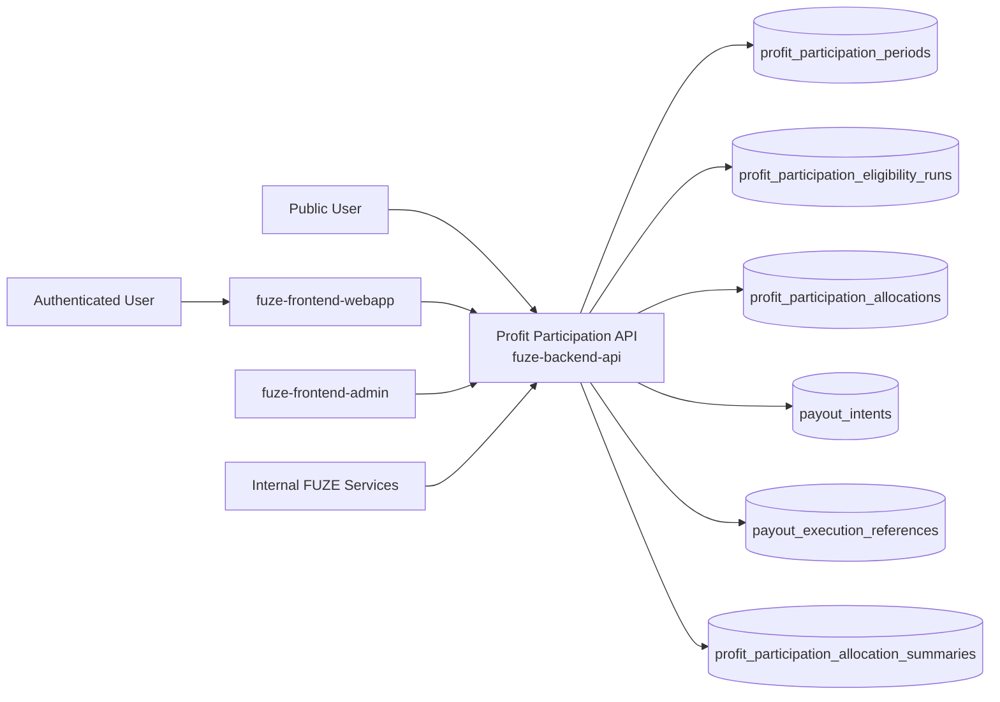
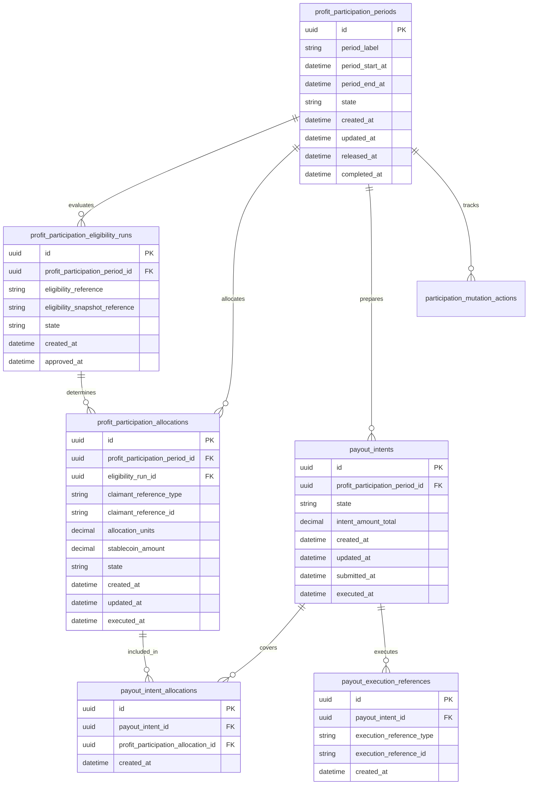
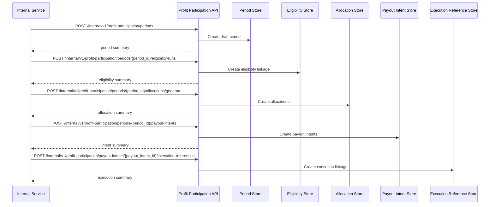

# PROFIT_PARTICIPATION_API_SPEC

## 1. Title

**PROFIT_PARTICIPATION_API_SPEC.md**

---

## 2. Document Metadata

- **Document Name:** PROFIT_PARTICIPATION_API_SPEC.md
- **API Classification:** internal, admin, public-read, event-driven, chain-adjacent
- **Owning Domain:** Profit Participation Domain
- **Primary Implementing Repo:** `fuze-backend-api`
- **Primary Chain-Adjacent Dependency:** `fuze-contracts`
- **Primary System of Record:** profit participation periods, eligibility runs, allocation records, payout intents, payout executions, claim and distribution references, and correction-safe profit participation lineage in `fuze-backend-api`
- **Status:** Draft for canonical source-of-truth approval
- **Purpose:** Define the production-grade API contract architecture for FUZE stablecoin profit participation preparation, allocation, payout intent creation, execution coordination, public-read status disclosure, and controlled correction-safe lifecycle management across the platform
- **Canonical Folder:** `fuze.ac > docs > api-spec`

---

## 2.1 API Classification Header

- **API Classification:** internal | admin | public-read | event-driven | chain-adjacent
- **Owning Domain:** Profit Participation Domain
- **Primary Implementing Repo:** `fuze-backend-api`
- **Primary Chain-Adjacent Dependency:** `fuze-contracts`
- **Primary System of Record:** profit participation allocation and payout-preparation domain

---

## 3. Purpose

This document defines the canonical API specification for FUZE profit participation operations. It translates the governing FUZE platform architecture, transparency model, profit participation system rules, snapshot and eligibility rules, payout ledger rules, Base payout execution rules, chain architecture, treasury-control expectations, and API architecture rules into an implementation-ready API contract.

This API exists because FUZE separates:
- the FUZE token on Ethereum,
- Platform Credits as internal consumption accounting,
- stablecoin profit participation on Base or other approved execution rails,
- and public transparency around eligibility and payout outcomes.

Profit participation therefore cannot be treated as a casual dividend note, a wallet spreadsheet, or an admin-triggered one-off transfer list. It must be governed by explicit reporting periods, eligibility inputs, allocation calculations, payout intent records, execution coordination, correction-safe lineage, and public-read trust surfaces. The domain must preserve strict separation between token holdings, eligibility snapshots, payout preparation, treasury release authority, and executed distributions.

Accordingly, this specification defines how profit participation periods, eligibility outputs, allocation records, payout intents, execution coordination, public-read status, and corrections are represented, and how profit participation remains auditable, idempotent, and architecture-consistent across FUZE.

---

## 4. Scope

This specification covers:

- internal APIs for profit participation period creation and lifecycle management
- internal APIs for allocation preparation from approved snapshot and eligibility inputs
- internal APIs for payout intent creation and execution coordination
- internal read APIs for canonical allocation, intent, and execution status
- admin/control-plane APIs for approve, lock, release, reprocess, correct, or close discrepancy actions
- public-read APIs for published profit participation status and period summaries
- event emission requirements for profit participation lifecycle changes
- request, response, error, idempotency, versioning, audit, and database-shape rules for this domain

This specification does **not** redefine:

- token contract behavior in full detail
- snapshot generation logic in full detail
- payout execution contract internals in full detail
- treasury multisig execution procedures in full detail
- tax treatment or legal classification text
- public transparency-report composition in full detail
- wallet registry semantics in full detail

Those remain governed by their own source-of-truth specifications.

---

## 5. Source-of-Truth Inputs

### Primary FUZE docs and specs used

#### Highest-priority platform and ownership sources
- `SYSTEM_SPEC_INDEX.md`
- `SYSTEM_BOUNDARY_AND_OWNERSHIP_SPEC.md`
- `SYSTEM_OVERVIEW_AND_BOUNDARIES_SPEC.md`
- `PLATFORM_ARCHITECTURE_SPEC.md`
- `DOMAIN_OWNERSHIP_MATRIX_SPEC.md`
- `DATA_MODEL_AND_ENTITY_OWNERSHIP_SPEC.md`
- `ONCHAIN_OFFCHAIN_RESPONSIBILITY_SPEC.md`

#### Primary profit participation / payout / chain sources
- `PROFIT_PARTICIPATION_SYSTEM_SPEC.md`
- `SNAPSHOT_AND_ELIGIBILITY_PIPELINE_SPEC.md`
- `PAYOUT_LEDGER_SPEC.md`
- `BASE_PAYOUT_EXECUTION_LAYER_SPEC.md`
- `TRANSPARENCY_MODEL_SPEC.md`
- `TRANSPARENCY_REPORTING_SPEC.md`
- `TREASURY_CONTROL_POLICY_SPEC.md`
- `VAULT_ACTION_POLICY_SPEC.md`
- `MULTISIG_AND_TIMELOCK_SPEC.md`
- `FOUNDATION_GOVERNANCE_SPEC.md`
- `GOVERNANCE_MODEL_SPEC.md`
- `CHAIN_ARCHITECTURE_SPEC.md`
- `PUBLIC_CONTRACT_AND_WALLET_REGISTRY_SPEC.md`

#### API and runtime sources
- `API_ARCHITECTURE_SPEC.md`
- `PUBLIC_API_SPEC.md`
- `INTERNAL_SERVICE_API_SPEC.md`
- `EVENT_MODEL_AND_WEBHOOK_SPEC.md`
- `IDEMPOTENCY_AND_VERSIONING_SPEC.md`
- `MIGRATION_AND_BACKWARD_COMPATIBILITY_SPEC.md`
- `AUDIT_LOG_AND_ACTIVITY_SPEC.md`

#### Core docs inputs
- `DOCS_SPEC.md`
- `FUZE_CHAIN_ARCHITECTURE.md`
- `STABLECOIN_PROFIT_PARTICIPATION.md`
- `TOKEN_CONTRACT_ARCHITECTURE_.md`
- `ALLOCATION_WALLET_MAP.md`
- tokenomics vault docs in `fuze.ac > docs/tokenomics/`

#### Security and operations sources
- `SECURITY_AND_RISK_CONTROL_SPEC.md`
- `MONITORING_ALERTING_AND_INCIDENT_RESPONSE_SPEC.md`
- `SECRETS_CONFIG_AND_ENVIRONMENT_SPEC.md`

#### Format guides
- `The_API_Specification_guide.md`
- `Database_Schemas_Guide.md`

### Highest-priority interpretation applied

For this file, the most important governing interpretation is:

1. profit participation is a distinct stablecoin distribution layer and must remain separate from FUZE token balances, Platform Credits, treasury inventory, and raw profitability analysis
2. backend owns canonical profit participation period, allocation, and payout-intent truth
3. eligibility comes from approved snapshot and eligibility outputs, not ad hoc wallet lists
4. execution may be chain-adjacent or contract-mediated, but execution coordination does not collapse off-chain preparation and on-chain settlement into one ambiguous layer
5. admin/control-plane may approve, release, reprocess, or correct under controlled policy, but must preserve immutable lineage and treasury controls
6. public-read status must remain bounded and trust-oriented without exposing private payout preparation internals

### Supporting external standards used only as guidance

- HTTP semantics for internal mutation and public-read status APIs
- structured problem-details error design
- general allocation-ledger, distribution-intent, and correction-lineage patterns as supporting guidance

External guidance does not override FUZE source-of-truth documents.

---

## 6. Governing Architecture and Ownership Interpretation

This API belongs to the **Profit Participation Domain** because it owns the canonical lifecycle of:
- profit participation periods,
- eligibility-linked allocation records,
- payout intents,
- execution coordination,
- and publication-safe status summaries.

This API is implemented primarily in `fuze-backend-api` because:

- backend owns durable allocation and payout-preparation truth
- eligibility, allocation, treasury release, execution coordination, and correction logic must be centralized
- multiple adjacent domains must remain separated through explicit interfaces
- public trust surfaces require stable off-chain state even when execution occurs on-chain
- audit generation and discrepancy handling must be backend-governed

This API is **not** owned by:

- `fuze-frontend-webapp`, because frontend only reads public or bounded first-party status
- `fuze-frontend-admin`, because admin may approve or release but must not own canonical allocation truth
- `fuze-contracts`, because contracts may execute or hold payout-related state, but off-chain preparation and publication truth remain in `fuze-backend-api`
- wallet-aware user domain, because user-linked wallets do not define canonical eligibility lists or payout allocations
- treasury domain, because treasury release authority is adjacent and gating, but does not own profit participation allocation truth
- transparency domain, because public transparency consumes approved outputs but does not own profit participation lifecycle semantics

### Architectural implications

- one profit participation period may correspond to one approved economic window
- one approved period may have one or more eligibility runs, but only one current canonical approved eligibility result per finalized period
- one eligible address or claimant scope may have one allocation record per finalized run
- one allocation may map to zero or more payout intents depending on batching, retries, or correction flows
- execution completion does not rewrite source allocation truth; it creates explicit execution lineage
- reversals or corrections must preserve old-to-new lineage rather than silently mutating historical records

---

## 7. Domain Responsibilities

The Profit Participation API domain is responsible for:

1. maintaining canonical profit participation periods
2. linking approved eligibility outputs into allocation preparation
3. recording allocation units and stablecoin payout amounts
4. creating payout intents for execution preparation
5. coordinating execution status with payout-execution and payout-ledger domains
6. exposing public-read and trusted internal status views
7. supporting admin approve, lock, release, correction, and reprocess flows
8. emitting profit participation lifecycle events
9. generating audit lineage for sensitive allocation and release actions
10. preserving separation between eligibility, allocation, treasury release, and execution settlement

The domain is not responsible for:

- owning token-holder snapshot generation logic
- owning treasury multisig execution mechanics
- owning raw profit computation models outside approved inbound values
- owning Platform Credits balances or payout-ledger final execution truth
- silently rewriting historical allocations after publication
- serving as the wallet registry or identity authority

---

## 8. Out of Scope

The following are out of scope for this API specification:

- direct wallet-signing flows
- tax document generation
- legal document workflows
- investor-private reconciliation workpapers
- cross-chain bridge internals
- raw accounting export formats
- final claimant UI design for all surfaces
- contract ABI details

Where later detailed specs are needed, they must remain compatible with this API.

---

## 9. Canonical Entities and Data Ownership

### Durable entities

#### 9.1 profit_participation_periods
- **Owner:** Profit Participation Domain
- **Purpose:** canonical economic periods for profit participation processing
- **Nature:** source-of-truth durable entity

#### 9.2 profit_participation_eligibility_runs
- **Owner:** Profit Participation Domain
- **Purpose:** approved references to eligibility results for one period
- **Nature:** source-of-truth durable lineage entity

#### 9.3 profit_participation_allocations
- **Owner:** Profit Participation Domain
- **Purpose:** canonical per-recipient or per-claimant allocation records for one finalized run
- **Nature:** source-of-truth durable entity

#### 9.4 profit_participation_allocation_summaries
- **Owner:** Profit Participation Domain
- **Purpose:** aggregate totals for one eligibility run or period
- **Nature:** source-of-truth durable aggregate entity

#### 9.5 payout_intents
- **Owner:** Profit Participation Domain
- **Purpose:** execution-preparation records for one or more allocations
- **Nature:** source-of-truth durable entity

#### 9.6 payout_intent_allocations
- **Owner:** Profit Participation Domain
- **Purpose:** linkage between payout intents and covered allocations
- **Nature:** source-of-truth durable lineage entity

#### 9.7 payout_execution_references
- **Owner:** Profit Participation Domain
- **Purpose:** explicit references to downstream payout execution records or contract executions
- **Nature:** durable execution lineage entity

#### 9.8 participation_attestations
- **Owner:** Profit Participation Domain
- **Purpose:** preparation, review, approval, or release metadata linked to periods, runs, or intents
- **Nature:** durable attestation lineage entity

#### 9.9 participation_discrepancy_cases
- **Owner:** Profit Participation Domain
- **Purpose:** review and remediation records for missing, duplicate, failed, conflicting, or stale allocations/intents/executions
- **Nature:** durable review/remediation entity

#### 9.10 participation_mutation_actions
- **Owner:** Profit Participation Domain
- **Purpose:** high-level action records for create, approve, lock, release, reprocess, correct, publish-status, and close discrepancy
- **Nature:** durable action records with audit linkage

#### 9.11 participation_audit_events
- **Owner:** Audit / Activity domain, sourced by Profit Participation Domain
- **Purpose:** immutable trail for sensitive profit participation actions
- **Nature:** durable audit records

### Derived or cached entities

#### 9.12 participation_public_status_views
- **Owner:** derived read-model layer
- **Purpose:** public-safe period and payout-status summaries
- **Nature:** derived

#### 9.13 participation_internal_balance_views
- **Owner:** derived read-model layer
- **Purpose:** trusted aggregate summaries for internal review
- **Nature:** derived

#### 9.14 participation_discrepancy_views
- **Owner:** derived ops read-model layer
- **Purpose:** visibility into failed, inconsistent, or stale participation lifecycle conditions
- **Nature:** derived

---

## 10. State Model and Lifecycle

### 10.1 period lifecycle

Possible states:

- `draft`
- `collecting_inputs`
- `allocation_ready`
- `approved`
- `released_for_execution`
- `partially_executed`
- `completed`
- `closed`
- `restricted`

### 10.2 eligibility run lifecycle

Possible states:

- `received`
- `validated`
- `approved`
- `rejected`
- `superseded`

### 10.3 allocation lifecycle

Possible states:

- `draft`
- `locked`
- `approved`
- `included_in_intent`
- `executed`
- `partially_executed`
- `corrected`
- `superseded`

### 10.4 payout intent lifecycle

Possible states:

- `draft`
- `ready`
- `approved`
- `submitted`
- `partially_executed`
- `executed`
- `failed`
- `cancelled`
- `superseded`

### 10.5 discrepancy lifecycle

Possible states:

- `opened`
- `under_review`
- `resolved`
- `failed`
- `closed`

Lifecycle notes:
- allocations become economically binding only after approved/locked period state according to policy
- payout intents are execution-preparation records and remain distinct from executed payouts
- partial execution must remain explicit
- corrections and supersession must preserve immutable lineage

---

## 11. API Surface Overview

The API surface is divided into four families:

### 11.1 Public-read APIs
Used by public users, holders, and community observers for:
- reading bounded profit participation period summaries
- reading current published payout-status summaries
- reading historical public-safe status views for completed or active periods

### 11.2 First-party authenticated read APIs
Used by `fuze-frontend-webapp` and approved first-party clients for:
- reading bounded status views for linked claimant scopes where policy allows
- reading allocation or payout-status summaries without exposing internal-only preparation details

### 11.3 Internal service APIs
Used by trusted internal services for:
- creating periods
- attaching eligibility runs
- generating allocations
- creating payout intents
- linking execution references
- reading canonical truth

### 11.4 Admin / control-plane APIs
Used by `fuze-frontend-admin` through backend-only privileged routes for:
- approve, lock, release, correct, reprocess, and restrict actions
- discrepancy resolution
- publication-safe status updates where applicable

---

## 12. Authentication and Authorization Model

### 12.1 Authentication posture by route family

#### Public-read routes
No authentication required:
- list public-safe period summaries
- read public-safe detail for published participation periods and statuses

#### Authenticated read routes
Require valid authenticated session:
- read bounded claimant-linked status where actor has authorized visibility
- read first-party status surfaces derived from canonical profit participation truth

#### Internal service routes
Require internal service identity with explicit least privilege:
- create periods
- attach eligibility runs
- generate allocations
- create payout intents
- link execution references
- read canonical truth

#### Admin routes
Require privileged operator identity plus reason-coded actions:
- approve and release periods or intents
- correct allocations or intents
- reprocess failed execution-preparation flows
- restrict or close discrepancy cases

### 12.2 Authorization checkpoints

Authorization must evaluate:
- caller identity and route family
- whether target period, run, allocation, or intent is public-safe or privileged internal state
- actor entitlement for first-party claimant-linked reads
- whether internal service has write privilege for lifecycle mutations
- whether admin/operator role is present for release or correction actions
- whether current state allows requested mutation

### 12.3 Sensitive action rules

The following require heightened checks:
- approval of eligibility-linked allocations
- release of payout intents for execution
- manual correction of allocations or intent contents
- reprocessing failed or partial executions
- publication of public status for incomplete periods if policy restricts it
- discrepancy-resolution actions

---

## 13. API Endpoints / Interface Contracts

## 13.1 Public-Read APIs

### 13.1.1 `GET /v1/profit-participation/periods`
**Purpose:** list published public-safe profit participation periods  
**Caller Type:** public  
**Auth Expectation:** none  
**Query Parameters Summary:**
- optional `state`
- optional `year`
- pagination
**Response Summary:**
- period summaries
- public status
- release/execution posture
- public-safe aggregate amount summary where allowed
- timestamps
**Side Effects:** none
**Audit Requirements:** access logging optional
**Emitted Events:** none required

### 13.1.2 `GET /v1/profit-participation/periods/{period_id}`
**Purpose:** retrieve one public-safe profit participation period detail  
**Caller Type:** public  
**Response Summary:**
- period detail
- public execution status
- bounded aggregate allocation/payout summary
- transparency/trust references where relevant
- correction or supersession guidance where relevant
**Side Effects:** none

## 13.2 Authenticated Read APIs

### 13.2.1 `GET /v1/profit-participation/me`
**Purpose:** retrieve bounded claimant-linked profit participation status for current actor where policy allows  
**Caller Type:** authenticated user  
**Auth Expectation:** valid authenticated session  
**Query Parameters Summary:**
- optional `period_id`
- pagination
**Response Summary:**
- bounded claimant-linked period summaries
- payout status summaries
- claim/reference guidance if applicable
**Side Effects:** none

### 13.2.2 `GET /v1/profit-participation/me/periods/{period_id}`
**Purpose:** retrieve one bounded claimant-linked period detail  
**Caller Type:** authenticated user with authorized linkage  
**Response Summary:**
- bounded allocation status
- payout-intent or execution status summary
- public-safe and first-party-safe guidance
**Side Effects:** none

## 13.3 Internal Service APIs

### 13.3.1 `POST /internal/v1/profit-participation/periods`
**Purpose:** create draft profit participation period  
**Caller Type:** internal trusted service  
**Auth Expectation:** service-to-service identity only  
**Request Body Summary:**
- `period_label`
- `period_start_at`
- `period_end_at`
- optional `economic_summary`
- `idempotency_key`
**Response Summary:** period summary
**Side Effects:** creates draft period
**Idempotency Behavior:** required
**Audit Requirements:** sensitive period-creation audit
**Emitted Events:** `profit_participation.period_created`

### 13.3.2 `POST /internal/v1/profit-participation/periods/{period_id}/eligibility-runs`
**Purpose:** attach approved eligibility output reference to one period  
**Caller Type:** internal trusted service  
**Request Body Summary:**
- `eligibility_reference`
- `eligibility_snapshot_reference`
- `eligibility_summary`
- `idempotency_key`
**Response Summary:** eligibility-run summary and period-state summary
**Side Effects:** creates eligibility-run lineage
**Idempotency Behavior:** required
**Audit Requirements:** eligibility-link audit
**Emitted Events:** `profit_participation.eligibility_attached`

### 13.3.3 `POST /internal/v1/profit-participation/periods/{period_id}/allocations/generate`
**Purpose:** generate allocation set from approved eligibility run and approved amount inputs  
**Caller Type:** internal trusted service  
**Request Body Summary:**
- `eligibility_run_id`
- `allocation_amount_summary`
- optional `generation_profile`
- `idempotency_key`
**Response Summary:** allocation-generation summary and aggregate totals
**Side Effects:** creates allocation records and allocation summary
**Idempotency Behavior:** required
**Audit Requirements:** critical allocation-generation audit
**Emitted Events:** `profit_participation.allocations_generated`

### 13.3.4 `POST /internal/v1/profit-participation/periods/{period_id}/payout-intents`
**Purpose:** create payout intent set from approved allocations  
**Caller Type:** internal trusted service  
**Request Body Summary:**
- `allocation_selection_criteria` or `allocation_ids[]`
- optional `batching_profile`
- `idempotency_key`
**Response Summary:** payout-intent summary and linked allocation summary
**Side Effects:** creates payout intents and linkage records
**Idempotency Behavior:** required
**Audit Requirements:** payout-intent audit
**Emitted Events:** `profit_participation.payout_intents_created`

### 13.3.5 `POST /internal/v1/profit-participation/payout-intents/{payout_intent_id}/execution-references`
**Purpose:** link downstream payout execution reference to one payout intent  
**Caller Type:** internal trusted service  
**Request Body Summary:**
- `execution_reference_type`
- `execution_reference_id`
- optional `execution_summary`
- `idempotency_key`
**Response Summary:** execution-reference summary and updated payout-intent state
**Side Effects:** creates execution lineage and may advance payout-intent state
**Idempotency Behavior:** required
**Audit Requirements:** execution-link audit
**Emitted Events:** `profit_participation.execution_linked`

### 13.3.6 `GET /internal/v1/profit-participation/periods/{period_id}`
**Purpose:** retrieve canonical period truth for trusted services  
**Caller Type:** internal trusted service  
**Response Summary:** full period, eligibility, allocation, payout-intent, and execution lineage
**Side Effects:** none

## 13.4 Admin / Control-Plane APIs

### 13.4.1 `POST /admin/v1/profit-participation/periods/{period_id}/approve`
**Purpose:** approve allocation-ready period under controlled policy  
**Caller Type:** admin/operator  
**Request Body Summary:**
- `reason_code`
- `operator_note`
- `idempotency_key`
**Response Summary:** approved period summary
**Side Effects:** period transitions to approved if policy checks pass
**Audit Requirements:** critical audit
**Emitted Events:** `profit_participation.period_approved`

### 13.4.2 `POST /admin/v1/profit-participation/periods/{period_id}/release`
**Purpose:** release approved payout intents for execution coordination  
**Caller Type:** admin/operator  
**Request Body Summary:**
- `reason_code`
- `operator_note`
- optional `release_profile`
- `idempotency_key`
**Response Summary:** released period summary and affected payout-intent summary
**Side Effects:** period moves to released_for_execution; intents may move to approved/submitted state
**Audit Requirements:** critical audit
**Emitted Events:** `profit_participation.period_released`

### 13.4.3 `POST /admin/v1/profit-participation/allocations/corrections`
**Purpose:** apply controlled allocation or payout-intent correction under policy  
**Caller Type:** admin/operator  
**Request Body Summary:**
- `target_reference_type`
- `target_reference_id`
- `correction_type`
- `correction_summary`
- `reason_code`
- `operator_note`
- optional `related_case_id`
- `idempotency_key`
**Response Summary:** correction summary
**Side Effects:** creates corrected or superseding allocation/intent lineage
**Audit Requirements:** critical audit
**Emitted Events:** `profit_participation.corrected`

### 13.4.4 `POST /admin/v1/profit-participation/payout-intents/{payout_intent_id}/reprocess`
**Purpose:** reprocess failed or partial payout-intent execution-preparation flow  
**Caller Type:** admin/operator  
**Request Body Summary:**
- `reprocess_profile`
- `reason_code`
- `operator_note`
- `idempotency_key`
**Response Summary:** reprocess summary and updated payout-intent state
**Side Effects:** may create superseding payout-intent lineage or refresh execution coordination status
**Audit Requirements:** critical audit
**Emitted Events:** `profit_participation.reprocessed`

### 13.4.5 `POST /admin/v1/profit-participation/discrepancies`
**Purpose:** resolve profit participation discrepancy under controlled policy  
**Caller Type:** admin/operator  
**Request Body Summary:**
- `target_reference_type`
- `target_reference_id`
- `resolution_code`
- `operator_note`
- `related_case_id`
- `idempotency_key`
**Response Summary:** discrepancy-resolution summary
**Side Effects:** may correct, reprocess, restrict, or close discrepancy posture with preserved lineage
**Audit Requirements:** critical audit
**Emitted Events:** `profit_participation.discrepancy_resolved`

---

## 14. Request Rules

### 14.1 General request rules
- all mutation-capable routes must require JSON requests with explicit content type
- all mutation routes must carry correlation IDs
- sensitive profit-participation mutations must carry idempotency keys
- admin mutations must require reason codes and operator notes
- no route may accept frontend-authored allocation or payout truth as authoritative input

### 14.2 Sensitive-action request requirements
The following requests require heightened validation:
- eligibility-run attachment for a finalized period
- allocation generation
- payout-intent creation
- release for execution
- allocation or intent correction
- discrepancy-resolution and reprocess actions

Heightened validation may include:
- period-state checks
- eligibility integrity checks
- aggregate amount and allocation-total checks
- duplicate-allocation or duplicate-intent checks
- operator role confirmation
- governance/finance/security case linkage for sensitive actions

### 14.3 Scope integrity rule
Profit-participation mutations must target valid and authorized periods, allocations, payout intents, and execution references. Services and operators must not mutate unrelated or unauthorized participation state.

### 14.4 Layer-separation rule
Profit participation period, allocation, intent, and execution-reference state must remain explicitly separated. Release for execution must not be conflated with actual executed payout settlement.

---

## 15. Response Rules

### 15.1 Success response rules
Successful responses must include:
- stable resource identifiers
- timestamps for created/updated state
- state/status values
- period, allocation, or payout-intent summaries where relevant
- bounded aggregate totals where relevant
- correlation references for mutations

### 15.2 Async-accepted response rules
If allocation generation, release, reprocessing, or discrepancy remediation is async, the response must:
- return accepted status
- include action or job ID
- provide follow-up status semantics

### 15.3 Terminal mutation response rules
Terminal mutation responses must clearly show:
- target period, allocation, payout intent, or discrepancy
- mutation type
- resulting state
- correction, release, or reprocess effects where relevant
- whether public or first-party status views may refresh asynchronously

### 15.4 Read response rules
Read responses must distinguish:
- canonical internal allocation/intention truth
- public-safe period status
- bounded first-party claimant-linked status
- execution reference versus completed payout settlement

---

## 16. Error Model

The API uses structured problem-details style error responses.

### 16.1 Required error fields
- `type`
- `title`
- `status`
- `code`
- `detail`
- `instance`
- `correlation_id`

### 16.2 Common error codes

#### Authorization / permission errors
- `PROFIT_PARTICIPATION_PERMISSION_DENIED`
- `PROFIT_PARTICIPATION_OPERATOR_PERMISSION_DENIED`
- `PROFIT_PARTICIPATION_SERVICE_PERMISSION_DENIED`
- `PROFIT_PARTICIPATION_AUDIENCE_PERMISSION_DENIED`

#### State conflict errors
- `PROFIT_PARTICIPATION_PERIOD_STATE_INVALID`
- `PROFIT_PARTICIPATION_ELIGIBILITY_STATE_INVALID`
- `PROFIT_PARTICIPATION_ALLOCATION_STATE_INVALID`
- `PROFIT_PARTICIPATION_PAYOUT_INTENT_STATE_INVALID`
- `PROFIT_PARTICIPATION_REPROCESS_CONFLICT`

#### Policy / safety errors
- `PROFIT_PARTICIPATION_ELIGIBILITY_REQUIRED`
- `PROFIT_PARTICIPATION_APPROVAL_REQUIRED`
- `PROFIT_PARTICIPATION_RELEASE_FORBIDDEN`
- `PROFIT_PARTICIPATION_DUPLICATE_INTENT`
- `PROFIT_PARTICIPATION_CORRECTION_NOT_ALLOWED`

#### Request integrity errors
- `PROFIT_PARTICIPATION_IDEMPOTENCY_KEY_REQUIRED`
- `PROFIT_PARTICIPATION_REQUEST_INVALID`
- `PROFIT_PARTICIPATION_REQUEST_UNPROCESSABLE`

#### Dependency or provider errors
- `PROFIT_PARTICIPATION_EXECUTION_UNAVAILABLE`
- `PROFIT_PARTICIPATION_STORAGE_UNAVAILABLE`
- `PROFIT_PARTICIPATION_RECONCILIATION_UNAVAILABLE`

### 16.3 Error handling rules
- do not expose hidden internal treasury/security detail in public or low-privilege responses
- do not imply completed payout execution from released intent state alone
- distinguish no public status from forbidden first-party audience access
- distinguish eligibility-required from generic invalid state
- include retry guidance only where safe

---

## 17. Idempotency and Mutation Safety

### 17.1 Required idempotent mutations
The following mutation routes require idempotent behavior:
- period creation
- eligibility-run attachment
- allocation generation
- payout-intent creation
- execution-reference linking
- approval
- release
- correction
- reprocess
- discrepancy resolution

### 17.2 Idempotency key rules
- mutation requests must supply `Idempotency-Key`
- backend stores key scope, request hash, actor, and terminal result
- replay of same semantic request returns original terminal outcome
- replay of same key with different semantic request must fail with conflict

### 17.3 Mutation safety rules
- one canonical approved eligibility outcome per finalized period unless explicit supersession lineage exists
- allocation totals and payout-intent coverage must remain reconciled to approved economic inputs
- execution-reference linking must not duplicate effective payout-intent settlement lineage
- corrections must be additive or superseding, not in-place destructive rewrites
- reprocessing must preserve prior failed or partial lineage

---

## 18. Versioning and Compatibility Rules

### 18.1 Versioning
This API family is versioned under `/v1`, `/internal/v1`, and `/admin/v1` route families.

### 18.2 Compatibility approach
- additive evolution preferred
- no silent semantic change to approved, released_for_execution, partially_executed, completed, corrected, or superseded states
- new period types, source types, or execution-reference types may be added without breaking existing contracts
- response fields may be added but existing meanings must remain stable

### 18.3 Breaking-change rules
Breaking changes include:
- changing the meaning of released intent versus completed execution
- changing claimant-linked status semantics incompatibly
- removing critical allocation or execution-reference fields
- changing correction or supersession semantics incompatibly

Such changes require explicit migration planning and version evolution.

### 18.4 Deprecation
Deprecated routes or fields must:
- be documented explicitly
- carry deprecation metadata where supported
- preserve compatibility windows long enough for public, first-party, and internal consumers

---

## 19. Event Emission and Webhook Behavior

This domain is event-capable.

### 19.1 Internal events
The Profit Participation domain must emit canonical internal events such as:
- `profit_participation.period_created`
- `profit_participation.eligibility_attached`
- `profit_participation.allocations_generated`
- `profit_participation.payout_intents_created`
- `profit_participation.execution_linked`
- `profit_participation.period_approved`
- `profit_participation.period_released`
- `profit_participation.corrected`
- `profit_participation.reprocessed`
- `profit_participation.discrepancy_resolved`

### 19.2 Event payload minimums
Each event should contain:
- event ID
- event type
- occurred_at
- period ID
- allocation or payout-intent reference where relevant
- execution reference where relevant
- actor type
- correlation ID
- reason code where applicable

### 19.3 External webhook posture
This specification does not expose general third-party outbound profit-participation webhooks by default. Any future outbound status webhook surface must be narrow, security-reviewed, and governed by a separate contract.

---

## 20. Audit and Activity Requirements

The following actions must generate durable audit events:

- period creation
- eligibility attachment
- allocation generation
- payout-intent creation
- approval and release actions
- correction and reprocess actions
- discrepancy resolution
- other sensitive profit-participation mutations

### Required audit fields
- audit event ID
- actor type and actor reference
- target period / allocation / payout intent / execution reference / discrepancy reference as applicable
- action type
- before/after summary where applicable
- reason code
- correlation ID
- operator note if operator action
- occurred_at

Public-facing activity may show selected period publication events through other bounded surfaces, but canonical internal audit truth remains durable and immutable.

---

## 21. Data Model and Database Schema View

### 21.1 `profit_participation_periods`
- `id` PK
- `period_label`
- `period_start_at`
- `period_end_at`
- `state`
- `approved_amount_summary_json` nullable
- `created_at`
- `updated_at`
- `released_at` nullable
- `completed_at` nullable

**Constraints:**
- unique (`period_start_at`, `period_end_at`)
- index on `state`

### 21.2 `profit_participation_eligibility_runs`
- `id` PK
- `profit_participation_period_id` FK -> `profit_participation_periods.id`
- `eligibility_reference`
- `eligibility_snapshot_reference`
- `state`
- `eligibility_summary_json`
- `created_at`
- `approved_at` nullable

**Constraints:**
- index on `profit_participation_period_id`
- index on `state`

### 21.3 `profit_participation_allocations`
- `id` PK
- `profit_participation_period_id` FK -> `profit_participation_periods.id`
- `eligibility_run_id` FK -> `profit_participation_eligibility_runs.id`
- `claimant_reference_type`
- `claimant_reference_id`
- `allocation_units`
- `stablecoin_amount`
- `state`
- `created_at`
- `updated_at`
- `executed_at` nullable
- `corrected_at` nullable

**Constraints:**
- unique (`eligibility_run_id`, `claimant_reference_type`, `claimant_reference_id`)
- index on `profit_participation_period_id`
- index on `state`

### 21.4 `profit_participation_allocation_summaries`
- `id` PK
- `profit_participation_period_id` FK -> `profit_participation_periods.id`
- `eligibility_run_id` FK -> `profit_participation_eligibility_runs.id`
- `total_allocations_count`
- `total_stablecoin_amount`
- `created_at`
- `updated_at`

### 21.5 `payout_intents`
- `id` PK
- `profit_participation_period_id` FK -> `profit_participation_periods.id`
- `state`
- `intent_amount_total`
- `batch_reference` nullable
- `created_at`
- `updated_at`
- `submitted_at` nullable
- `executed_at` nullable
- `failed_at` nullable

**Constraints:**
- index on `profit_participation_period_id`
- index on `state`

### 21.6 `payout_intent_allocations`
- `id` PK
- `payout_intent_id` FK -> `payout_intents.id`
- `profit_participation_allocation_id` FK -> `profit_participation_allocations.id`
- `created_at`

**Constraints:**
- unique (`payout_intent_id`, `profit_participation_allocation_id`)
- index on `payout_intent_id`

### 21.7 `payout_execution_references`
- `id` PK
- `payout_intent_id` FK -> `payout_intents.id`
- `execution_reference_type`
- `execution_reference_id`
- `execution_summary_json`
- `created_at`

**Constraints:**
- index on `payout_intent_id`
- index on (`execution_reference_type`, `execution_reference_id`)

### 21.8 `participation_attestations`
- `id` PK
- `target_reference_type`
- `target_reference_id`
- `attestation_type`
- `attestation_summary_json`
- `created_at`

### 21.9 `participation_discrepancy_cases`
- `id` PK
- `target_reference_type`
- `target_reference_id`
- `state`
- `resolution_code` nullable
- `created_at`
- `updated_at`
- `closed_at` nullable

### 21.10 `participation_mutation_actions`
- `id` PK
- `target_reference_type`
- `target_reference_id`
- `action_type`
- `state`
- `reason_code`
- `operator_note` nullable
- `requested_by_actor_type`
- `requested_by_actor_id`
- `created_at`
- `executed_at` nullable
- `closed_at` nullable
- `correlation_id`

### 21.11 `idempotency_records`
- `id` PK
- `idempotency_key`
- `scope_family`
- `actor_reference`
- `request_hash`
- `response_hash`
- `terminal_status`
- `created_at`
- `expires_at`

### 21.12 `audit_log_entries`
Domain-sourced audit records written into the audit domain.

### Normalization notes
- canonical participation truth stays in periods, eligibility runs, allocations, payout intents, and execution references
- public and first-party status views must derive from canonical truth filtered by disclosure policy
- raw source snapshots and treasury notes remain outside public response shapes
- completed payout execution truth remains referenced, not duplicated as uncontrolled mutation

### Reconciliation notes
- one approved period should reconcile to one current approved eligibility output and one aggregate allocation summary under current lineage
- payout-intent totals must reconcile to linked allocation totals
- execution references must reconcile to payout-intent state changes
- discrepancy cases must preserve visible review lineage for failed or conflicting participation conditions

---

## 22. Architecture Diagram — Mermaid flowchart



---

## 23. Data Design — Mermaid Diagram



---

## 24. Flow View

### 24.1 Happy path — period to release
1. internal service creates draft profit participation period
2. approved eligibility output is attached
3. allocation generation creates recipient allocations and aggregate totals
4. payout intents are created from approved allocations
5. admin approves period
6. admin releases period/intents for execution coordination
7. downstream execution references are linked as payouts progress
8. public and first-party-safe status views refresh

### 24.2 Happy path — public and first-party status
1. public actor lists published profit participation periods
2. authenticated actor checks bounded claimant-linked status
3. backend filters canonical truth into public or claimant-safe read models
4. actor sees current status, not raw internal preparation records

### 24.3 Alternate path — partial execution
1. released payout intents execute in batches
2. some execution references succeed while others remain pending or fail
3. period and intent states move to partially_executed
4. status views expose bounded partial-execution posture
5. remediation or reprocess may follow

### 24.4 Failure path — invalid eligibility or duplicate intent
1. allocation or intent-generation request is attempted
2. backend detects missing approved eligibility, invalid period state, or duplicate coverage conflict
3. request is rejected
4. no effective duplicate allocation or intent is created

### 24.5 Failure and remediation path — correction or reprocess
1. allocation, intent, or execution linkage is found incorrect or stale
2. admin opens correction or reprocess flow
3. backend preserves prior lineage
4. corrected allocation/intents or superseding execution coordination is created
5. discrepancy closes with preserved history

### 24.6 Restrict/close path
1. period becomes restricted or must close without further execution
2. admin applies restrictive lifecycle action through approved controls
3. public-safe views update according to policy
4. historical lineage remains queryable

### 24.7 Retry behavior
- duplicate period creation returns same canonical period result
- duplicate eligibility attachment returns same lineage result where applicable
- duplicate allocation generation or intent creation returns same canonical result or duplicate-safe conflict
- duplicate approve/release/correct/reprocess/discrepancy actions return same terminal action result

---

## 25. Data Flows — Mermaid sequenceDiagram



---

## 26. Security and Risk Controls

1. **Profit-participation truth is backend-owned**  
   Frontends and informal channels may not authoritatively define allocation or payout-intent truth.

2. **Layer separation is mandatory**  
   The API must keep profit participation separate from FUZE token balances, Platform Credits, raw treasury balances, and executed payout settlement.

3. **Eligibility-before-allocation**  
   Allocation generation must require approved eligibility lineage.

4. **Approval-before-release**  
   Release for execution must require explicit period/intention approval according to policy.

5. **Least privilege**  
   Internal write and admin release/correction routes must be limited to authorized services and operators.

6. **Immutable lineage for economic changes**  
   Corrections, supersession, and reprocess actions must preserve historical lineage rather than erase prior state.

7. **Public-private field separation**  
   Public and first-party routes must not expose internal treasury notes, security details, or raw allocation-preparation internals beyond bounded policy.

8. **Problem-details discipline**  
   Error bodies must be structured and safe, without exposing hidden internal-only details.

9. **Audit immutability**  
   Sensitive profit-participation actions require durable immutable audit lineage.

10. **Execution-status integrity**  
    Released payout intents must not be represented as executed payouts until execution-reference lineage confirms downstream progress.

---

## 27. Operational Considerations

- public and first-party status routes should remain highly available
- allocation generation and payout-intent creation are correctness-sensitive and must preserve economic integrity
- partial-execution and failed-execution cases should surface clearly to ops views
- discrepancy and reprocess flows should be observable and retryable
- monitoring should alert on:
  - failed allocation generation
  - duplicate-intent anomalies
  - release-without-approval attempts
  - execution-reference drift
  - unusual correction or reprocess volume
  - public-status inconsistency versus canonical state

---

## 28. Acceptance Criteria

1. The API preserves the distinction between profit participation allocation truth, executed payout settlement, FUZE token holdings, Platform Credits, and treasury truth.
2. Only `fuze-backend-api` owns canonical profit participation period, allocation, and payout-intent truth.
3. Periods, eligibility runs, allocations, payout intents, and execution references are durable and backend-owned.
4. Public and first-party routes expose only bounded safe status views.
5. Eligibility lineage and required approval are enforced before release.
6. Corrections, supersession, and reprocess actions preserve immutable lineage.
7. Allocation, release, correction, and reprocess actions are idempotent and auditable.
8. Internal and admin profit-participation routes are least-privilege and backend-only.
9. Admin routes require reason-coded privileged authorization.
10. Event emissions exist for major profit-participation mutations.
11. Response and error semantics are stable and machine-readable.
12. Database schema separates periods, eligibility, allocations, payout intents, execution references, and discrepancy layers.
13. Public and first-party consumers can rely on canonical status routes without seeing hidden internal preparation details.
14. Discrepancy handling is supported and safely replayable.
15. Mermaid diagrams remain consistent with prose and data model.

---

## 29. Test Cases

### 29.1 Positive cases
1. Internal service creates draft profit participation period successfully.
2. Internal service attaches approved eligibility run successfully.
3. Internal service generates allocations successfully.
4. Internal service creates payout intents successfully.
5. Internal service links execution reference successfully.
6. Admin approves period successfully.
7. Admin releases approved period successfully.
8. Public actor reads published period summary successfully.

### 29.2 Negative cases
9. Public user cannot access internal allocation detail.
10. Internal service without write privilege cannot create period.
11. Allocation generation without approved eligibility returns `PROFIT_PARTICIPATION_ELIGIBILITY_REQUIRED`.
12. Release without approval returns `PROFIT_PARTICIPATION_APPROVAL_REQUIRED`.
13. Duplicate intent creation for same covered allocation set returns `PROFIT_PARTICIPATION_DUPLICATE_INTENT`.
14. Authenticated actor without authorized linkage cannot read claimant-linked detail.

### 29.3 Authorization cases
15. Ordinary public or authenticated user cannot call admin approve/release/correct routes.
16. Internal service without allocation privilege cannot generate allocations.
17. Operator without release privilege cannot release period/intents.
18. Profit-participation release does not authorize treasury execution or prove completed payout settlement by itself.

### 29.4 Idempotency and replay cases
19. Repeating period creation with same idempotency key returns original draft period result.
20. Repeating eligibility attachment with same idempotency key returns original lineage result.
21. Repeating release with same idempotency key returns original release result.
22. Repeating correction or discrepancy resolution with same idempotency key returns original action result.

### 29.5 Concurrency cases
23. Concurrent allocation generation attempts preserve one canonical current allocation lineage and one duplicate-safe outcome where appropriate.
24. Concurrent release and correction actions preserve explicit lifecycle ordering without hidden overwrite.
25. Concurrent execution-reference links on same payout intent preserve one explicit execution lineage set and duplicate-safe outcomes where appropriate.

### 29.6 Recovery / admin cases
26. Failed payout-intent execution-preparation flow can be reprocessed under controlled policy with explicit lineage.
27. Corrected allocation remains historically linked to original allocation.
28. Discrepancy resolution closes allocation or execution conflict with preserved audit history.

### 29.7 Event and audit cases
29. Successful period creation emits `profit_participation.period_created`.
30. Successful eligibility attachment emits `profit_participation.eligibility_attached`.
31. Successful allocation generation emits `profit_participation.allocations_generated`.
32. Successful release emits `profit_participation.period_released`.
33. Successful discrepancy resolution emits `profit_participation.discrepancy_resolved` with critical audit lineage.

---

## 30. Open Questions or Explicit Deferred Decisions

1. Exact claimant-linkage model for first-party authenticated status views is deferred.
2. Exact allocation-unit formula and rounding rules by period are deferred.
3. Exact release-batching strategy for payout intents is deferred.
4. Exact public-safe aggregate disclosure depth for active versus completed periods is deferred.
5. Exact correction taxonomy for partial execution anomalies is deferred.
6. Exact discrepancy taxonomy for allocation and execution coordination conflicts is deferred.

---

## 31. Implementation Notes for `fuze-backend-api`

Recommended backend module layout:

```text
modules/platform/
  profit-participation/
  payout-ledger/
  payout-execution/
  transparency-reporting/
  audit-log/
  control-plane/
  integrations/
```

Implementation guidance:
- keep period identity, eligibility linkage, allocation generation, payout-intent creation, and execution-reference linkage in one canonical domain service
- perform period-state, eligibility-integrity, and allocation-total checks inside the commit boundary
- keep approval, release, correction, and reprocess actions explicit and idempotent
- treat admin remediations as domain actions, not ad hoc row edits
- emit events only after canonical state commit succeeds
- publish public and first-party status views from canonical truth; do not let derived views mutate participation state

---

## 32. Frontend Consumption Notes

### For `fuze-frontend-webapp`
- may read public period/status views and bounded first-party claimant-linked views where approved
- must not infer executed payout settlement from release or submitted-intent status alone
- must treat backend profit-participation responses as authoritative
- should clearly distinguish approved, released, partially executed, completed, corrected, and superseded states when visible

### For `fuze-frontend-admin`
- may trigger privileged approve, release, correction, reprocess, and discrepancy actions only through backend admin APIs
- must require operator reason input for sensitive mutations
- must not directly mutate canonical profit-participation truth client-side
- should present immutable allocation and payout-intent lineage separately from current status summaries

---

## 33. Contract Derivation Notes

### OpenAPI / AsyncAPI
This spec should later derive into:
- public period/status and first-party claimant-linked read operations
- internal period creation, eligibility attachment, allocation generation, payout-intent, and execution-reference operations
- admin approve / release / correction / reprocess / discrepancy operations
- shared problem-details schema
- profit-participation lifecycle events in AsyncAPI

### Future `fuze-sdk`
Future `fuze-sdk` packages may derive:
- public period-status lookup helpers
- first-party claimant-status helpers for approved surfaces
- typed period, allocation-status, and payout-intent summary models
- problem-error models for profit-participation outcomes

The SDK must derive from approved API contracts and must not become the source of truth over this narrative specification.
