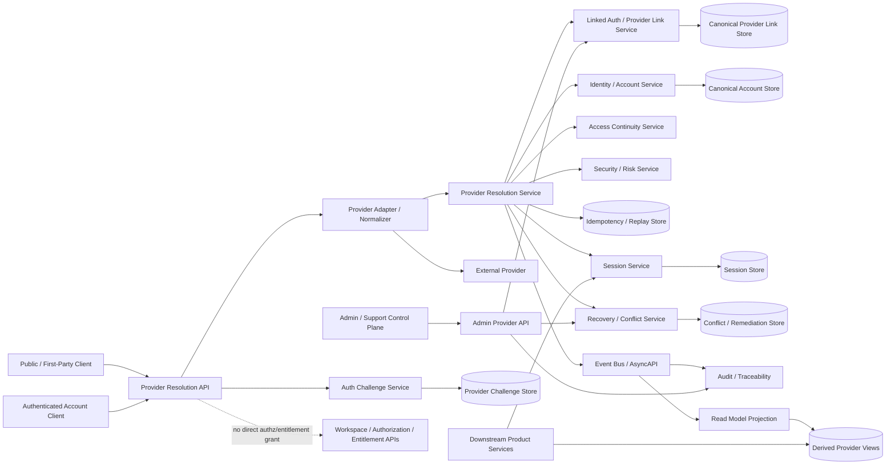
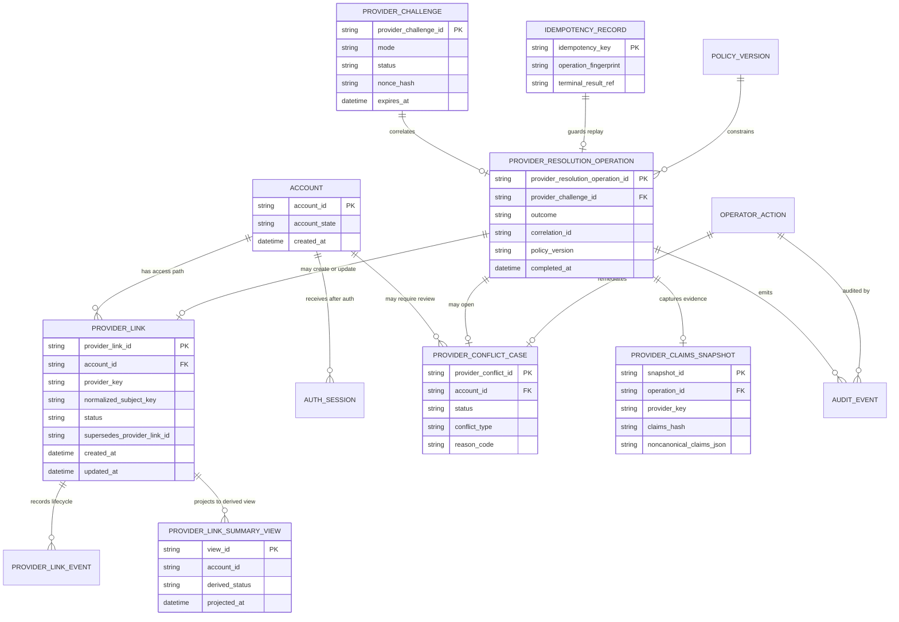
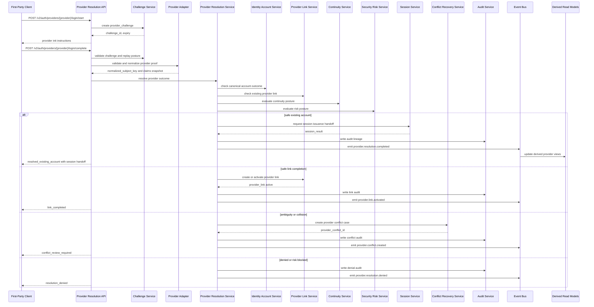

# PROVIDER_RESOLUTION_AND_LINKING_API_SPEC

## Document Metadata

- Document Name: `PROVIDER_RESOLUTION_AND_LINKING_API_SPEC.md`
- Document Type: FUZE API SPEC v2 / Production-grade interface-contract specification
- Status: Draft for canonical API SPEC v2 inclusion
- Version: 2.0.0
- Effective Date: 2026-04-24
- Last Updated: 2026-04-24
- Reviewed On: 2026-04-24
- Document Owner: FUZE Platform Identity and Access Architecture / Provider Resolution Domain
- Approval Authority: FUZE Platform Architecture and Governance Authority
- Review Cadence: Quarterly or upon material change to provider onboarding, provider-subject mapping, login/linking flows, account-resolution policy, recovery/conflict posture, session-security posture, wallet-auth scope, or provider callback security
- Governing Layer: API contract layer derived from refined system semantics
- Parent Registry: `API_SPEC_INDEX.md`
- Upstream Semantic Registry: `REFINED_SYSTEM_SPEC_INDEX.md`
- Upstream API Registry: `API_SPEC_INDEX.md`
- Primary Audience: API design, backend engineering, identity/access engineering, frontend engineering, provider-adapter engineering, security/risk engineering, support/control-plane engineering, audit, QA, implementation-contract authors
- Primary Purpose: Define the FUZE API contract for provider resolution and provider linking without allowing provider inputs, product convenience, frontend callback state, support tooling, or derived views to become canonical identity or access-link truth.
- Primary Upstream References:
  - `REFINED_SYSTEM_SPEC_INDEX.md`
  - `DOCS_SPEC_INDEX.md`
  - `SYSTEM_SPEC_INDEX.md`
  - `API_SPEC_INDEX.md`
  - `IDENTITY_AND_ACCOUNT_SPEC.md`
  - `AUTH_SESSION_AND_LINKED_LOGIN_SPEC.md`
  - `FUZE_ACCOUNT_ACCESS_AND_SESSION_THESIS_FINAL_SPEC.md`
  - `FUZE_ACCOUNT_ACCESS_AND_SESSION_CANONICAL_FINAL_SPEC.md`
  - `FUZE_ACCOUNT_ACCESS_CONTINUITY_SPEC.md`
  - `FUZE_PROVIDER_RESOLUTION_AND_LINKING_SPEC.md`
  - `FUZE_SESSION_LIFECYCLE_AND_SECURITY_SPEC.md`
  - `FUZE_ACCOUNT_RECOVERY_AND_CONFLICT_HANDLING_SPEC.md`
  - `KEY_MANAGEMENT_AND_USER_RECOVERY_SPEC.md`
  - `WALLET_AWARE_USER_SPEC.md`
  - `SECURITY_AND_RISK_CONTROL_SPEC.md`
  - `AUDIT_AND_ACCESS_TRACEABILITY_SPEC.md`
  - `SESSION_AND_LINKED_LOGIN_API_SPEC.md`
- Primary Downstream Dependents:
  - OpenAPI contracts for provider login, provider callback completion, provider link intent, provider unlink, provider review, and provider remediation APIs
  - AsyncAPI contracts for provider resolution result events, provider link mutation events, provider conflict events, and remediation completion events
  - Identity/access service implementation contracts
  - Provider adapter contracts
  - Session issuance implementation contracts
  - Support/admin control-plane implementation contracts
  - QA, contract-test, migration, observability, and audit validation suites
- API Surface Families Covered:
  - public/first-party provider login initiation and completion
  - first-party authenticated provider link and unlink flows
  - internal provider-normalization and owner-domain resolution APIs
  - admin/control-plane provider review and remediation APIs
  - event/async provider-resolution and provider-link lifecycle APIs
  - reporting/read-model APIs for derived provider summaries
- API Surface Families Excluded:
  - standalone workspace authorization APIs
  - standalone entitlement/capability APIs
  - full session lifecycle APIs
  - full account recovery APIs
  - full key/secret management APIs
  - public registry or public transparency APIs
  - provider SDK internals and provider-side protocol specifications
  - legal identity/KYC overlays unless later explicitly adopted
- Canonical System Owner(s): Identity and Account Domain for canonical account identity and provider-to-account resolution outputs; Auth / Session / Linked Login Domain for provider-link lifecycle, auth challenge lifecycle, and post-resolution session coordination; Recovery / Conflict Domain for contested or unsafe remediation.
- Canonical API Owner: FUZE Platform Identity and Access API
- Supersedes: Provider-resolution and provider-linking portions of `SESSION_AND_LINKED_LOGIN_API_SPEC.md` where v1 route posture is broader or less explicit; earlier ad hoc provider callback or identity-linking API interpretations where they conflict.
- Superseded By: Not yet known
- Related Decision Records: Not yet known
- Canonical Status Note: This API spec expresses provider-resolution interface contracts derived from refined system semantics. It does not redefine canonical identity, access continuity, session, recovery, authorization, entitlement, or wallet-aware semantics.
- Implementation Status: Normative API contract baseline for downstream implementation planning
- Approval Status: Drafted for review; formal approval record not yet attached
- Change Summary:
  - split provider-resolution and provider-linking API posture from the broader v1 session/linked-login API family
  - made provider-input, provider-link, canonical identity, session, conflict/remediation, derived read-model, and reporting truth classes explicit
  - introduced deterministic provider resolution outcome contracts, callback idempotency, provider subject uniqueness, conflict/review APIs, admin remediation constraints, and event/async guardrails
  - added diagrams, flow views, acceptance criteria, test cases, and quality gate checklist for implementation-grade API review

---

## Purpose

`PROVIDER_RESOLUTION_AND_LINKING_API_SPEC.md` defines the FUZE API contract for resolving external provider authentication evidence into canonical FUZE account outcomes and for creating, activating, disabling, unlinking, restoring, superseding, reviewing, and remediating provider-backed access paths.

The purpose is to ensure that every provider-backed flow is:

1. backend-normalized before it can affect account or provider-link truth;
2. anchored to a canonical `account_id` outcome rather than provider, frontend, product-local, email-only, wallet-only, or session-only identity;
3. deterministic where safe and explicit-review-based where ambiguous;
4. idempotent and replay-safe across callback and retry boundaries;
5. auditable, traceable, security-aware, and continuity-preserving;
6. separated from downstream workspace authorization, entitlement, wallet-aware participation, product profile, reporting, and presentation layers.

This API spec is not a generic OAuth or social-login document. It is the FUZE interface contract for the provider-resolution domain.

---

## Scope

This API specification governs:

- provider login/start initiation contracts
- provider callback/completion contracts
- provider-input normalization contracts
- provider-to-account resolution outcome contracts
- provider bootstrap outcome contracts
- authenticated provider link-intent contracts
- provider link completion contracts
- provider unlink, disable, restore, and supersession route-family posture
- provider conflict/review result contracts
- admin/control-plane remediation route-family posture
- provider-related event and async contracts
- provider claims snapshot handling as non-canonical cached evidence
- idempotency, retry, replay, rate-limit, audit, and observability requirements
- derived provider read-model and reporting constraints
- OpenAPI, AsyncAPI, SDK, and implementation-contract derivation guardrails

---

## Out of Scope

This API specification does not define:

- canonical account identity lifecycle in full;
- the full session lifecycle, refresh, rotation, logout, revocation, and containment model;
- full recovery-case and conflict-case workflows beyond provider-triggered API coordination;
- workspace membership, organization scope, role assignment, effective permission, or entitlement evaluation;
- provider-specific OAuth/OIDC/messaging SDK internals;
- raw provider credential, secret, or configuration administration;
- exact browser/mobile session transport;
- exact MFA challenge catalog;
- legal-identity, KYC, or compliance verification overlays unless an approved future spec adopts them;
- product-local login UX beyond API behavior constraints;
- public trust or registry exposure except safe provider-read explanations if explicitly approved.

---

## Design Goals

1. Provide one canonical API contract for provider resolution and provider linking across FUZE products.
2. Normalize heterogeneous providers into durable FUZE outcome classes.
3. Prevent accidental duplicate accounts, silent merge, silent provider reassignment, email-only matching, callback replay mutation, and product-local identity drift.
4. Preserve the separation among canonical identity truth, provider-link truth, provider-input truth, auth/session truth, policy truth, conflict/remediation truth, authorization truth, wallet-aware context, derived views, and reporting truth.
5. Make start/callback/link/unlink/review/remediation API families implementation-usable without collapsing into provider SDK details.
6. Enable OpenAPI, AsyncAPI, SDK, contract tests, audit review, and production readiness checks.
7. Keep public/first-party surfaces narrow while exposing stronger internal/admin surfaces only under bounded authorization and audit controls.
8. Require deterministic, machine-readable outcomes for every provider completion and link mutation.

---

## Non-Goals

This API spec MUST NOT be used to:

- make provider subjects into alternate FUZE identities;
- let provider profile claims become canonical account truth;
- make email, display name, avatar, phone number, Telegram handle, wallet address, or social profile similarity the sole matching key;
- let products or frontends directly resolve provider subjects to accounts;
- let support tooling silently reassign provider ownership;
- treat callback receipt as login success;
- treat provider success as workspace authorization, entitlement, or wallet ownership success;
- make derived provider summaries into mutation owners;
- hide remediation or correction through destructive database edits.

---

## Core Principles

### Canonical Account Outcome Principle

Every provider completion MUST result in a canonical FUZE outcome class. It MUST NOT result in a product-local, provider-local, frontend-local, session-local, or reporting-local account outcome.

### Provider Subject Principle

A provider-backed access path MUST be anchored by a normalized provider subject key. Mutable profile hints MUST NOT serve as the durable binding key.

### Backend Normalization Principle

All external provider payloads MUST pass through approved backend normalization before any owner-domain decision, provider-link mutation, session issuance, conflict creation, or audit event.

### Explicit Ambiguity Principle

If the platform cannot safely resolve a provider result to one account outcome and one provider-link state, the API MUST return an explicit review, conflict, or denial outcome.

### Continuity Before Convenience Principle

Provider-link removal, disabling, supersession, and reassignment-sensitive remediation MUST preserve access continuity or route through recovery/remediation.

### Session Subordination Principle

A provider resolution result may permit session issuance by the session domain, but it is not itself a session. A valid session does not rewrite provider truth.

### Downstream Authorization Separation Principle

Provider success proves only provider-backed authentication into a FUZE account outcome. It does not prove workspace authority, role, permission, entitlement, product capability, wallet ownership, or public-registry eligibility.

---

## Canonical Definitions

- **Provider:** An approved external authentication or login source integrated into FUZE.
- **Provider Adapter:** Backend component that validates provider transport, issuer, signatures, callback payloads, nonce/state, and provider-specific proof before normalizing input.
- **Provider Subject:** Stable provider-scoped subject identifier for an actor inside a provider ecosystem.
- **Normalized Provider Subject Key:** FUZE-approved durable provider binding key combining provider namespace, issuer/scope where applicable, and stable subject identifier.
- **Provider Resolution:** Backend-owned process that converts validated provider input into an owner-domain account outcome.
- **Provider Link:** Durable approved access-path relationship between a canonical `account_id` and a normalized provider subject key.
- **Provider Challenge:** Short-lived durable object used for provider start/callback correlation, link intent, re-auth, or step-up gates.
- **Provider Claims Snapshot:** Non-canonical cached provider claims used for review, display, troubleshooting, or audit support.
- **Provider Conflict Case:** Durable review/remediation object created when provider resolution or link mutation cannot safely complete.
- **Provider Resolution Outcome:** Machine-readable API result such as `resolved_existing_account`, `bootstrap_required`, `link_completed`, `conflict_review_required`, `risk_review_required`, or `resolution_denied`.

---

## Truth Class Taxonomy

### Semantic Truth

Refined system specs own semantic truth. This API spec MUST preserve those semantics and MUST NOT redefine the meaning of account identity, provider-link ownership, access continuity, session state, recovery posture, authorization, entitlement, wallet-aware context, or public/reporting truth.

### API Contract Truth

This document owns API surface-family posture, route-family boundaries, request envelope requirements, response class requirements, error/result/status semantics, idempotency requirements, event/API coordination, and downstream contract derivation rules.

### Canonical Identity Truth

`account_id`, account lifecycle, account restriction state, account identity continuity, and identity-domain anti-fragmentation rules are canonical identity truth owned by the Identity and Account Domain.

### Provider-Link Truth

Durable provider-subject bindings, link lifecycle state, and provider-link mutation lineage are provider-link truth consumed by this API and owned by the Identity/Auth Access boundary.

### Provider-Input Truth

Provider callback payloads, claims, issuer-subject pairs, identity-provider metadata, signed assertions, and provider profile fields are evidence inputs. They are not canonical account truth.

### Auth / Session Runtime Truth

Provider challenges, post-resolution auth completion, and session issuance/continuation are adjacent auth/session runtime truth. Sessions remain temporary runtime access records.

### Policy Truth

Provider approval, resolution policy, bootstrap policy, continuity policy, risk policy, operator policy, and remediation policy constrain API behavior but do not become provider-input or identity records.

### Conflict / Remediation Truth

Provider conflict cases, review states, remediation decisions, containment requirements, and approved correction outcomes are durable remediation truth.

### Authorization / Entitlement Truth

Workspace membership, organization scope, roles, permissions, effective permission, entitlement, and product capability are downstream truth classes evaluated after account resolution and session issuance.

### Wallet-Aware Context Truth

Wallet links and wallet-derived participation context are adjacent context. They MUST NOT be used as universal provider-resolution proof unless a future approved spec explicitly defines that provider family.

### Derived Read-Model Truth

Provider summaries, settings cards, support views, dashboards, search projections, account access summaries, and provider activity reports are derived and regenerable.

### Public / Reporting Truth

Public explanations, exports, reports, or user-facing status summaries MAY reflect provider state but MUST NOT become mutation owners or resolve conflicts.

---

## Architectural Position in the Spec Hierarchy

This API spec sits below:

- `REFINED_SYSTEM_SPEC_INDEX.md`
- `API_SPEC_INDEX.md`
- `FUZE_PROVIDER_RESOLUTION_AND_LINKING_SPEC.md`
- `FUZE_ACCOUNT_ACCESS_AND_SESSION_CANONICAL_FINAL_SPEC.md`
- `IDENTITY_AND_ACCOUNT_SPEC.md`
- `AUTH_SESSION_AND_LINKED_LOGIN_SPEC.md`
- `FUZE_ACCOUNT_ACCESS_CONTINUITY_SPEC.md`
- `FUZE_ACCOUNT_RECOVERY_AND_CONFLICT_HANDLING_SPEC.md`
- `FUZE_SESSION_LIFECYCLE_AND_SECURITY_SPEC.md`
- `SECURITY_AND_RISK_CONTROL_SPEC.md`

It sits beside or upstream of:

- `SESSION_LIFECYCLE_AND_SECURITY_API_SPEC.md`
- `ACCOUNT_RECOVERY_AND_CONFLICT_HANDLING_API_SPEC.md`
- `AUTH_SESSION_AND_LINKED_LOGIN_API_SPEC.md`
- `IDENTITY_AND_ACCOUNT_API_SPEC.md`
- `WALLET_AWARE_USER_API_SPEC.md`
- `AUDIT_AND_ACCESS_TRACEABILITY_API_SPEC.md`
- `ENTITLEMENT_AND_CAPABILITY_GATING_API_SPEC.md`

It sits above implementation contracts for:

- provider adapters
- auth challenge services
- identity/account resolution services
- linked-auth storage
- provider conflict/review queues
- provider event emission
- provider link support tooling
- provider-derived read models
- provider contract tests

---

## Upstream Semantic Owners

| Semantic Area | Upstream Owner | API Interpretation |
|---|---|---|
| Canonical account identity | `IDENTITY_AND_ACCOUNT_SPEC.md` | API must return `account_id` as actor anchor and must not create provider-local identities. |
| Account/access/session relationship | `FUZE_ACCOUNT_ACCESS_AND_SESSION_CANONICAL_FINAL_SPEC.md` | API must preserve account as identity root, providers as access paths, sessions as runtime truth. |
| Provider normalization and linking | `FUZE_PROVIDER_RESOLUTION_AND_LINKING_SPEC.md` | Primary semantic owner for this API family. |
| Auth challenge and linked-login lifecycle | `AUTH_SESSION_AND_LINKED_LOGIN_SPEC.md` | API must use auth challenges and linked-login states without absorbing full session semantics. |
| Continuity posture | `FUZE_ACCOUNT_ACCESS_CONTINUITY_SPEC.md` | API must prevent access stranding and route unsafe changes to review/recovery. |
| Session issuance and containment | `FUZE_SESSION_LIFECYCLE_AND_SECURITY_SPEC.md` | API may trigger or permit session issuance but does not own full session lifecycle. |
| Recovery/conflict remediation | `FUZE_ACCOUNT_RECOVERY_AND_CONFLICT_HANDLING_SPEC.md` | API routes contested cases into durable review/remediation truth. |
| Security/risk controls | `SECURITY_AND_RISK_CONTROL_SPEC.md` | API must support risk denial, step-up, containment, abuse control, and operator constraints. |

---

## API Surface Families

### Public / First-Party Provider Login Surface

Used by approved FUZE first-party clients and public unauthenticated entry points for provider-login initiation and callback completion.

Allowed families:

- `POST /v2/auth/providers/{provider_key}/login/start`
- `POST /v2/auth/providers/{provider_key}/login/complete`
- `GET /v2/auth/providers/{provider_key}/login/status/{provider_challenge_id}`

These routes MAY be exposed to public/first-party clients only through narrow request envelopes that do not expose raw backend provider truth.

### First-Party Authenticated Provider-Link Surface

Used by authenticated users to inspect, add, remove, repair, or replace provider-backed access paths.

Allowed families:

- `GET /v2/account/provider-links`
- `POST /v2/account/provider-links/{provider_key}/start`
- `POST /v2/account/provider-links/{provider_key}/complete`
- `POST /v2/account/provider-links/{provider_link_id}/unlink-intent`
- `DELETE /v2/account/provider-links/{provider_link_id}`
- `POST /v2/account/provider-links/{provider_link_id}/repair/start`
- `GET /v2/account/provider-links/continuity-check`

### Internal Service Surface

Used only by trusted internal services and provider adapters.

Allowed families:

- `POST /internal/v2/providers/{provider_key}/normalize`
- `POST /internal/v2/provider-resolutions`
- `GET /internal/v2/provider-links/{provider_link_id}`
- `GET /internal/v2/accounts/{account_id}/provider-links`
- `POST /internal/v2/provider-resolution-events/emit`

Internal APIs MUST NOT become broad-write shortcuts around owner-domain resolution.

### Admin / Control-Plane Surface

Used by authorized support/security/control-plane operators for review and remediation.

Allowed families:

- `GET /admin/v2/provider-conflicts`
- `GET /admin/v2/provider-conflicts/{provider_conflict_id}`
- `POST /admin/v2/provider-conflicts/{provider_conflict_id}/transition`
- `POST /admin/v2/accounts/{account_id}/provider-links/{provider_link_id}/disable`
- `POST /admin/v2/accounts/{account_id}/provider-links/{provider_link_id}/restore`
- `POST /admin/v2/accounts/{account_id}/provider-links/{provider_link_id}/supersede`
- `POST /admin/v2/provider-links/reassignment-review`

Admin APIs MUST be bounded, reason-coded, policy-constrained, and audited.

### Event / Async Surface

Used for lifecycle publication and downstream coordination.

Event families:

- `provider.challenge.created`
- `provider.input.normalized`
- `provider.resolution.completed`
- `provider.resolution.denied`
- `provider.conflict.created`
- `provider.link.created`
- `provider.link.activated`
- `provider.link.disabled`
- `provider.link.removed`
- `provider.link.restored`
- `provider.link.superseded`
- `provider.remediation.completed`

Events MUST distinguish provider-input receipt from canonical provider-resolution success.

### Reporting / Read-Model Surface

Used for safe derived summaries, not canonical mutation.

Allowed families:

- `GET /v2/account/provider-link-summary`
- `GET /admin/v2/provider-resolution-health`
- `GET /internal/v2/provider-resolution/projections/{projection_id}`

---

## System / API Boundaries

This API governs interface contracts for provider resolution and linking. It MUST NOT absorb:

- identity lifecycle ownership;
- session lifecycle ownership;
- recovery-case ownership;
- workspace authorization ownership;
- entitlement ownership;
- wallet-link ownership;
- public-reporting ownership;
- provider SDK ownership.

A provider completion response may include an operation reference, challenge state, conflict reference, account reference, and session-hand-off result. That response MUST NOT imply direct workspace permission, entitlement, or wallet authority.

---

## Adjacent API Boundaries

### Identity and Account API

Owns account creation, identity lifecycle, account restrictions, account status, and identity-safe bootstrap. Provider-resolution APIs may request or receive account outcome decisions but MUST NOT redefine account identity.

### Auth Session and Linked Login API

Owns auth challenge lifecycle, linked-login lifecycle coordination, and session issuance after successful account resolution. This API owns provider-specific normalization and provider outcome contracts.

### Account Access Continuity API

Owns continuity posture reads and continuity-sensitive mutation evaluation. Provider unlink and supersession APIs MUST call or preserve those checks.

### Session Lifecycle and Security API

Owns session continuation, refresh, revocation, containment, and security invalidation. Provider remediation may trigger session containment but does not directly redefine session truth.

### Recovery and Conflict Handling API

Owns durable review/remediation workflows when provider resolution is unsafe. Provider conflicts MUST route into that API family where they exceed ordinary provider-domain review.

### Workspace / Authorization / Entitlement APIs

Consume authenticated account context after provider resolution and session issuance. They MUST NOT treat provider result as direct authorization.

---

## Conflict Resolution Rules

1. Canonical identity records and account restriction state outrank provider claims.
2. Durable provider-link records outrank frontend callback state.
3. Explicit policy and security constraints outrank convenience completion.
4. Validated provider-input evidence may inform resolution only through approved normalization rules.
5. Runtime session state does not override provider-link or account restriction truth.
6. Product-local provider aliases, cached settings cards, support summaries, analytics outputs, and reports never outrank canonical records.
7. A normalized provider subject key already bound to another account MUST return conflict/review or denial unless an explicit remediation workflow authorizes a correction.
8. Email similarity, phone similarity, display name similarity, avatar similarity, Telegram handle similarity, wallet presence, or previous product-local state MUST NOT silently merge, relink, bootstrap, or reassign an account.
9. When a provider callback arrives after a challenge is terminal, the API MUST return a terminal idempotent response or replay-denial response without duplicate mutation.
10. Where ambiguity remains, the API MUST choose the most conservative architecture-consistent outcome: review, denial, or continuity-preserving no-op.

---

## Default Decision Rules

1. Default actor anchor: `account_id`.
2. Default durable provider binding key: normalized provider subject key.
3. Default provider claim status: evidence, not identity truth.
4. Default provider email status: hint/contact/review signal, not sole matching key.
5. Default ambiguous callback outcome: explicit review or denial.
6. Default last-viable-provider unlink outcome: block ordinary self-service.
7. Default provider subject reassignment outcome: forbidden unless remediation-authorized.
8. Default callback retry outcome: idempotent replay of prior terminal outcome if proof and challenge match.
9. Default degraded-provider outcome: deny completion or route to review rather than guess.
10. Default derived view status: stale until regenerated, not owner truth.
11. Default admin mutation posture: reason code, policy reference, operator identity, audit record, and correlation ID required.
12. Default public exposure posture: narrow, stable, and non-revealing.

---

## Roles / Actors / API Consumers

- **Unauthenticated Actor:** Initiates provider login and returns callback proof.
- **Authenticated Account Actor:** Initiates provider link, unlink, repair, or continuity-check flows.
- **First-Party Client:** FUZE-approved web/mobile/frontend client that starts and completes provider flows.
- **Provider Adapter:** Backend integration that validates and normalizes provider payloads.
- **Identity and Account Service:** Determines canonical account outcome.
- **Auth / Linked Login Service:** Owns auth challenge and provider-link lifecycle coordination.
- **Session Service:** Issues session only after canonical resolution and post-auth checks.
- **Recovery / Conflict Service:** Handles unsafe, ambiguous, contested, or remediation-requiring cases.
- **Security / Risk Service:** Applies risk, abuse, step-up, and containment posture.
- **Support / Admin Operator:** Performs bounded remediation through control-plane APIs.
- **Audit / Observability Systems:** Consume immutable audit and trace events.
- **Downstream Product Services:** Consume authenticated account context only after provider resolution and session issuance.

---

## Resource / Entity Families

### API Resources

- `provider`
- `provider_challenge`
- `provider_resolution`
- `provider_link`
- `provider_claims_snapshot`
- `provider_conflict`
- `provider_remediation_action`
- `provider_resolution_operation`
- `provider_resolution_event`
- `provider_link_summary`

### Canonical / Owner-Domain Entities

- `account`
- `linked_auth_method` or `provider_link`
- `auth_challenge`
- `auth_session`
- `recovery_case`
- `conflict_case`
- `audit_event`
- `idempotency_record`

### Derived Entities

- `provider_link_summary_view`
- `provider_settings_card_view`
- `provider_resolution_health_view`
- `support_provider_timeline_view`
- `provider_activity_report`

Derived entities MUST be regenerable from canonical truth and audit lineage.

---

## Ownership Model

### Identity and Account Domain MUST Own

- canonical account identity;
- account restriction state;
- account-safe bootstrap outcome;
- identity-fragmentation prevention;
- provider-to-account outcome approval.

### Auth / Session / Linked Login Domain MUST Own

- provider challenges;
- linked provider access-path lifecycle;
- provider link mutation execution;
- link intent and link completion gates;
- coordination with session issuance.

### Provider Resolution API MUST Own

- public/first-party provider route contracts;
- provider normalization request/response envelopes;
- provider resolution outcome response classes;
- provider link API surface-family boundaries;
- callback idempotency and replay API rules;
- provider-link read-model safety rules;
- event payload contract requirements for provider resolution.

### Recovery / Conflict Domain MUST Own

- durable conflict/review cases where ordinary resolution is unsafe;
- reassignment-sensitive remediation;
- contested provider ownership review;
- recovery-aligned access restoration.

### Products / Frontends MUST NOT Own

- provider-subject uniqueness;
- provider-to-account mapping;
- provider conflict resolution;
- provider reassignment;
- provider-link canonical state;
- provider callback success interpretation.

---

## Authority / Decision Model

Every provider completion MUST follow this authority order:

1. validate request envelope, challenge, CSRF/state/nonce, expiry, and route preconditions;
2. validate provider transport and authenticity through approved provider adapter;
3. normalize provider input into provider namespace, issuer/scope, normalized subject key, claims snapshot, and proof metadata;
4. check idempotency and replay controls before side effects;
5. check existing provider-link binding;
6. request identity-domain account outcome where needed;
7. evaluate policy, continuity, risk, recovery, and restriction posture;
8. choose one machine-readable outcome;
9. mutate provider-link truth only through owner-domain paths;
10. issue or deny session hand-off through the session domain;
11. create audit, operation, and event records;
12. update derived views asynchronously without making them owners.

---

## Authentication Model

- Provider login start routes MAY be unauthenticated.
- Provider login complete routes MAY be unauthenticated but MUST require a valid challenge, callback proof, and anti-replay protections.
- Provider link start and complete routes MUST require authenticated session and, for sensitive mutations, recent-auth/step-up when policy requires.
- Unlink, disable, restore, repair, and supersession routes MUST require authenticated session or admin/service identity as appropriate.
- Internal APIs MUST require service-to-service identity with least privilege.
- Admin APIs MUST require privileged operator identity, scoped permission, policy reference, reason code, and correlation ID.
- No route MAY accept frontend-supplied `account_id` as authoritative identity proof for provider completion.

---

## Authorization / Scope / Permission Model

Provider API authorization MUST evaluate:

- caller class: unauthenticated provider flow, authenticated account actor, service, admin operator;
- challenge ownership and current session binding where applicable;
- account status and restrictions;
- link mutation permission;
- continuity posture;
- policy and risk posture;
- operator permission and scope;
- tenant/workspace scope only after account authentication when needed for display or product routing.

Provider success MUST NOT grant workspace roles, organization scope, product capability, or entitlement.

---

## Entitlement / Capability-Gating Model

Provider-linked state MAY be an input to product experience only when explicitly allowed by policy. It MUST NOT act as a hidden entitlement system.

If product capability depends on provider linkage, the API MUST expose only derived provider-link posture to the entitlement domain. The entitlement domain remains the owner of capability decisions.

---

## API State Model

### Provider Challenge States

- `created`
- `awaiting_provider`
- `callback_received`
- `normalization_failed`
- `awaiting_user_confirmation`
- `completed`
- `expired`
- `cancelled`
- `denied`
- `terminal_replayed`

### Provider Resolution Outcome States

- `resolved_existing_account`
- `bootstrap_required`
- `bootstrap_completed`
- `link_completed`
- `link_pending_confirmation`
- `conflict_review_required`
- `risk_review_required`
- `recovery_required`
- `resolution_denied`

### Provider Link States

- `pending`
- `active`
- `disabled`
- `restricted`
- `removed`
- `superseded`
- `review_required`

### Provider Conflict States

- `open`
- `awaiting_evidence`
- `support_review`
- `security_review`
- `remediation_authorized`
- `resolved`
- `denied`
- `contained`

State transitions MUST be explicit. Missing records, overwritten caches, or stale projections MUST NOT imply state transitions.

---

## Lifecycle / Workflow Model

### Login Start

The client requests provider login start. The backend creates a provider challenge, binds return/correlation metadata, applies rate limits, and returns provider-init instructions.

### Provider Callback / Completion

The client submits callback proof or the provider posts callback input. The backend validates the challenge and provider proof, normalizes input, checks idempotency, chooses a canonical provider resolution outcome, and returns a machine-readable result.

### Existing Account Resolution

If the normalized provider subject key is active on one canonical account and no blocking posture exists, the API returns `resolved_existing_account` and may include session hand-off metadata.

### Controlled Bootstrap

If no durable binding exists and bootstrap is safe under policy, the API returns or performs a controlled bootstrap outcome. Bootstrap MUST be explicit and auditable.

### Authenticated Link

An authenticated actor starts a provider link flow. Completion must validate provider proof, current actor, provider subject uniqueness, continuity posture, and risk posture before creating or activating a provider link.

### Unlink / Disable / Restore

Provider link removal or disablement must preserve access continuity. Restore must evaluate risk, remediation, account status, and previous lineage.

### Conflict / Review

Unsafe or ambiguous flows produce durable conflict/review records and a response that gives safe follow-up references without exposing sensitive provider internals.

### Remediation / Supersession

Any provider-subject reassignment, supersession, or contested correction must use admin/control-plane remediation APIs with reason code, policy authorization, audit lineage, and containment when needed.

---

## Architecture Diagram — Mermaid flowchart



---

## Data Design — Mermaid Diagram



---

## Flow View

1. **Start provider flow**
   - Client calls provider start endpoint.
   - API validates provider availability, client route safety, rate limits, and mode.
   - API creates `provider_challenge`.
   - API returns redirect/init instructions, challenge ID, expiry, and correlation ID.

2. **Receive provider completion**
   - API validates challenge, expiry, state/nonce, CSRF posture, and idempotency.
   - Provider adapter validates external proof and normalizes provider input.
   - Raw provider payload remains provider-input truth.

3. **Resolve canonical outcome**
   - API checks normalized subject uniqueness.
   - Identity/account owner determines account outcome when needed.
   - Continuity, risk, recovery, and restriction posture are evaluated.
   - API chooses a deterministic outcome or explicit review/denial.

4. **Mutate owner-domain state**
   - Existing account resolution does not rewrite provider link unless allowed.
   - Bootstrap creates account only through identity owner.
   - Link completion writes provider-link truth only through owner-domain mutation.
   - Conflict creates durable conflict/remediation truth.

5. **Session hand-off**
   - If login is complete and permitted, session domain may issue session.
   - The API response must distinguish provider resolution success from session issuance success.
   - Provider success never grants workspace permission or entitlement.

6. **Events and audit**
   - API writes audit lineage for every terminal provider outcome.
   - API emits provider resolution and provider link events after canonical mutation.
   - Derived views update asynchronously and remain non-canonical.

7. **Failure and retry**
   - Replayed callback returns prior terminal result or replay denial.
   - Expired challenge denies completion without mutation.
   - Provider outage returns bounded dependency error.
   - Ambiguity opens review or denies; it never silently guesses.

8. **Admin/operator remediation**
   - Operator APIs require privileged identity, reason code, policy reference, evidence references, and correlation ID.
   - Remediation may disable, restore, supersede, or authorize correction.
   - Corrections preserve lineage and may trigger session containment.

---

## Data Flows — Mermaid sequenceDiagram



---

## Request Model

### Common Request Headers

All mutation-capable provider APIs MUST support or require:

- `X-FUZE-Correlation-ID` — required for mutation and callback completion.
- `Idempotency-Key` — required for side-effecting start, complete, link, unlink, admin remediation, and replay-sensitive routes unless the challenge itself is the idempotency key.
- `X-FUZE-Client-ID` — required for approved first-party clients where applicable.
- `X-FUZE-Request-Mode` — optional route-safe marker such as `login`, `link`, `repair`, `callback`.
- authenticated session credential — required for authenticated link/unlink flows.
- service identity credential — required for internal APIs.
- admin identity credential — required for admin/control-plane APIs.

### Provider Login Start Request

```json
{
  "mode": "login",
  "returnUri": "https://app.fuze.example/auth/provider/return",
  "clientContext": {
    "clientId": "fuze_web",
    "deviceLabel": "Chrome on macOS",
    "locale": "en",
    "timezone": "Asia/Bangkok"
  },
  "riskContext": {
    "ipHash": "opaque",
    "userAgentHash": "opaque"
  }
}
```

### Provider Completion Request

```json
{
  "providerChallengeId": "pch_123",
  "providerReturnPayload": {
    "code": "opaque-provider-code",
    "state": "opaque-state"
  },
  "clientContext": {
    "clientId": "fuze_web",
    "redirectUri": "https://app.fuze.example/auth/provider/return"
  }
}
```

Provider-specific fields MAY vary, but the backend-normalized contract MUST converge into provider namespace, issuer/scope where applicable, normalized provider subject key, verified proof metadata, and non-canonical claims snapshot.

### Provider Link Start Request

```json
{
  "mode": "link",
  "returnUri": "https://app.fuze.example/settings/linked-accounts/return",
  "recentAuthAssertion": "reauth_opaque_if_required",
  "clientContext": {
    "surface": "account_settings"
  }
}
```

### Provider Unlink Request

```json
{
  "reasonCode": "user_requested",
  "recentAuthAssertion": "reauth_opaque_if_required",
  "continuityAcknowledgement": {
    "continuityCheckId": "acc_123",
    "acknowledgedAt": "2026-04-24T00:00:00Z"
  }
}
```

### Admin Remediation Request

```json
{
  "reasonCode": "provider_subject_disputed",
  "policyReference": "provider-remediation-policy-v1",
  "evidenceReferences": ["ev_123", "case_note_456"],
  "operatorNote": "Reviewed duplicate provider subject claim and preserving existing ownership pending recovery.",
  "containmentAction": "disable_provider_link_and_revoke_sessions",
  "idempotencyKey": "idem_admin_provider_remediation_001"
}
```

---

## Response Model

### Common Response Fields

Provider API responses MUST include where applicable:

- `resultType`
- `status`
- `correlationId`
- `providerChallengeId`
- `providerResolutionOperationId`
- `providerLinkId`
- `accountId` only when safe and authorized to reveal
- `providerConflictId` when review/conflict is opened
- `sessionHandoff` when session issuance is requested or completed
- `policyVersion`
- `auditReference`
- `nextActions`
- timestamps

### Existing Account Resolution Response

```json
{
  "resultType": "provider_resolution",
  "status": "resolved_existing_account",
  "accountId": "acct_123",
  "providerResolutionOperationId": "pro_123",
  "sessionHandoff": {
    "status": "issued",
    "sessionId": "sess_123"
  },
  "correlationId": "corr_123",
  "auditReference": "aud_123"
}
```

### Conflict Review Response

```json
{
  "resultType": "provider_resolution",
  "status": "conflict_review_required",
  "providerConflictId": "pcf_123",
  "providerResolutionOperationId": "pro_123",
  "safeUserMessageCode": "PROVIDER_REVIEW_REQUIRED",
  "nextActions": [
    "follow_recovery_or_support_review"
  ],
  "correlationId": "corr_123",
  "auditReference": "aud_456"
}
```

### Link Completed Response

```json
{
  "resultType": "provider_link",
  "status": "link_completed",
  "providerLink": {
    "providerLinkId": "plink_123",
    "providerKey": "google",
    "status": "active",
    "linkedAt": "2026-04-24T00:00:00Z"
  },
  "continuityStatus": "preserved",
  "correlationId": "corr_789",
  "auditReference": "aud_789"
}
```

### Accepted Async Response

```json
{
  "resultType": "provider_operation",
  "status": "accepted",
  "operationRef": "op_123",
  "providerConflictId": "pcf_123",
  "statusUrl": "/v2/account/provider-resolution-operations/op_123",
  "correlationId": "corr_123"
}
```

---

## Error / Result / Status Model

Provider API errors MUST use stable problem-details style envelopes.

### Required Error Fields

- `type`
- `title`
- `status`
- `code`
- `detail`
- `instance`
- `correlationId`
- `retryable`
- `safeUserMessageCode`

### Provider Error Codes

- `PROVIDER_NOT_SUPPORTED`
- `PROVIDER_TEMPORARILY_UNAVAILABLE`
- `PROVIDER_CHALLENGE_INVALID`
- `PROVIDER_CHALLENGE_EXPIRED`
- `PROVIDER_CALLBACK_INVALID`
- `PROVIDER_PROOF_INVALID`
- `PROVIDER_SUBJECT_CONFLICT`
- `PROVIDER_LINK_ALREADY_EXISTS`
- `PROVIDER_LINK_NOT_FOUND`
- `PROVIDER_LINK_NOT_ACTIVE`
- `PROVIDER_LINK_RESTRICTED`
- `PROVIDER_LAST_ACCESS_PATH_BLOCKED`
- `PROVIDER_REAUTH_REQUIRED`
- `PROVIDER_RISK_REVIEW_REQUIRED`
- `PROVIDER_CONFLICT_REVIEW_REQUIRED`
- `PROVIDER_RESOLUTION_DENIED`
- `PROVIDER_IDEMPOTENCY_KEY_REQUIRED`
- `PROVIDER_IDEMPOTENCY_CONFLICT`
- `PROVIDER_REPLAY_REJECTED`
- `PROVIDER_RATE_LIMITED`
- `PROVIDER_ADMIN_REASON_REQUIRED`
- `PROVIDER_OPERATOR_PERMISSION_DENIED`
- `PROVIDER_DEPENDENCY_DEGRADED`

### Status Semantics

- `200 OK` MAY be used for successful reads and idempotent replay of an already completed terminal outcome.
- `201 Created` MAY be used when a provider challenge, provider link, or conflict case is created.
- `202 Accepted` MUST be used when the request is accepted for review or async remediation and final business outcome is not complete.
- `400 Bad Request` MUST be used for malformed request envelopes.
- `401 Unauthorized` MUST be used when authentication is required and absent/invalid.
- `403 Forbidden` MUST be used when caller lacks authority.
- `409 Conflict` MUST be used for provider subject conflicts, continuity violations, or idempotency fingerprint mismatches.
- `410 Gone` MAY be used for expired challenge when safe.
- `422 Unprocessable Entity` MUST be used for semantically invalid request state.
- `423 Locked` MAY be used for restricted provider/account state.
- `429 Too Many Requests` MUST be used for rate/abuse limits.
- `503 Service Unavailable` MAY be used for provider dependency outage when no safe completion is possible.

---

## Idempotency / Retry / Replay Model

Provider APIs are replay-sensitive. The following rules are mandatory:

1. Provider start routes MUST deduplicate active equivalent challenges where safe.
2. Provider completion routes MUST be idempotent by challenge ID plus normalized provider proof fingerprint.
3. Replayed terminal completions MUST return prior terminal result or a bounded replay response without duplicate side effects.
4. Idempotency records MUST bind caller class, route family, challenge, normalized provider subject key where known, and operation fingerprint.
5. A reused idempotency key with materially different request fingerprint MUST return `PROVIDER_IDEMPOTENCY_CONFLICT`.
6. Callback replay after challenge expiry MUST NOT create a new provider link or session.
7. Async event consumers MUST be idempotent and MUST NOT recreate provider ownership or duplicate session issuance.
8. Admin remediation APIs MUST require idempotency keys.
9. Idempotency records MUST be retained long enough to cover provider retry windows, async retry windows, and audit reconstruction needs.
10. Idempotency must not hide unsafe ambiguity. Ambiguous repeated requests still resolve to conflict/review or denial.

---

## Rate Limit / Abuse-Control Model

Provider API implementations MUST apply rate and abuse controls for:

- provider start attempts by IP, device, client, provider, and suspected actor;
- provider completion attempts by challenge and provider proof fingerprint;
- repeated conflict-producing provider subjects;
- enumeration attempts against provider link status;
- repeated link/unlink/repair attempts;
- admin remediation attempts;
- provider adapter callback anomalies;
- replay bursts and stale callback submissions.

Rate limits MUST return bounded errors and MUST NOT expose whether a provider subject exists on another account beyond safe conflict semantics.

---

## Endpoint / Route Family Model

### Public / First-Party Login

| Method | Route Family | Purpose | Auth |
|---|---|---|---|
| POST | `/v2/auth/providers/{provider_key}/login/start` | Create provider login challenge | Unauthenticated allowed |
| POST | `/v2/auth/providers/{provider_key}/login/complete` | Complete provider login and resolve canonical outcome | Challenge-bound |
| GET | `/v2/auth/providers/{provider_key}/login/status/{provider_challenge_id}` | Safe challenge/operation status | Challenge-bound and visibility-limited |

### Authenticated Account Provider Links

| Method | Route Family | Purpose | Auth |
|---|---|---|---|
| GET | `/v2/account/provider-links` | List current account provider links | Authenticated |
| GET | `/v2/account/provider-link-summary` | Derived settings-safe summary | Authenticated |
| POST | `/v2/account/provider-links/{provider_key}/start` | Begin provider link intent | Authenticated, recent-auth if required |
| POST | `/v2/account/provider-links/{provider_key}/complete` | Complete provider link | Authenticated + challenge |
| GET | `/v2/account/provider-links/continuity-check` | Check safe unlink/repair posture | Authenticated |
| POST | `/v2/account/provider-links/{provider_link_id}/unlink-intent` | Prepare safe unlink | Authenticated, recent-auth if required |
| DELETE | `/v2/account/provider-links/{provider_link_id}` | Remove or disable provider link | Authenticated, continuity-preserving |
| POST | `/v2/account/provider-links/{provider_link_id}/repair/start` | Start repair flow | Authenticated |

### Internal APIs

| Method | Route Family | Purpose | Auth |
|---|---|---|---|
| POST | `/internal/v2/providers/{provider_key}/normalize` | Validate and normalize provider proof | Service |
| POST | `/internal/v2/provider-resolutions` | Resolve normalized provider input | Service |
| GET | `/internal/v2/accounts/{account_id}/provider-links` | Trusted provider-link lookup | Service |
| POST | `/internal/v2/provider-resolution-events/emit` | Emit owner-domain event | Service |

### Admin / Control Plane

| Method | Route Family | Purpose | Auth |
|---|---|---|---|
| GET | `/admin/v2/provider-conflicts` | List provider conflict cases | Admin |
| GET | `/admin/v2/provider-conflicts/{provider_conflict_id}` | Inspect conflict case | Admin |
| POST | `/admin/v2/provider-conflicts/{provider_conflict_id}/transition` | Transition review case | Admin, reason-coded |
| POST | `/admin/v2/accounts/{account_id}/provider-links/{provider_link_id}/disable` | Disable provider link | Admin, reason-coded |
| POST | `/admin/v2/accounts/{account_id}/provider-links/{provider_link_id}/restore` | Restore provider link | Admin, reason-coded |
| POST | `/admin/v2/accounts/{account_id}/provider-links/{provider_link_id}/supersede` | Supersede provider link with lineage | Admin, reason-coded |
| POST | `/admin/v2/provider-links/reassignment-review` | Request reassignment-sensitive review | Admin, policy-gated |

Route names MAY be refined downstream, but downstream OpenAPI MUST preserve these route families, resource meanings, status semantics, and boundary constraints.

---

## Public API Considerations

Public/unauthenticated provider APIs MUST be narrow and safe:

- no raw account existence disclosure;
- no provider subject disclosure;
- no provider-link inventory disclosure;
- no user enumeration through callback or status endpoints;
- no raw provider error leakage;
- no direct account merge, relink, unlink, or reassignment;
- bounded safe status messages only.

---

## First-Party Application API Considerations

First-party clients MAY initiate and complete provider flows. They MUST:

- treat backend outcome as authoritative;
- render conflict/review/denial states safely;
- never interpret callback receipt as success;
- never stitch provider truth from raw provider SDK state, frontend state, and derived settings data;
- use operation/status references for async review;
- preserve correlation IDs in telemetry.

---

## Internal Service API Considerations

Internal APIs MUST be least-privilege and must not become hidden broad-write surfaces. Internal callers may submit normalized evidence or request resolution, but owner-domain services must remain responsible for canonical decisions and durable mutations.

---

## Admin / Control-Plane API Considerations

Admin/provider remediation APIs MUST require:

- privileged operator authentication;
- explicit permission/scope;
- reason code;
- policy reference;
- evidence references where relevant;
- operator note;
- idempotency key;
- correlation ID;
- audit event;
- event emission if canonical provider truth changes.

Admin APIs MUST prefer disabling, review state, supersession, or lineage-preserving correction over destructive hidden rewrites.

---

## Event / Webhook / Async API Considerations

Provider events MUST be owner-emitted after durable state changes or durable operation outcomes. Events MUST include:

- event ID;
- event type;
- provider resolution operation ID;
- provider challenge ID where relevant;
- provider link ID where relevant;
- account ID where authorized for internal consumption;
- outcome;
- prior and resulting state where applicable;
- policy version;
- correlation ID;
- audit reference;
- occurred at timestamp.

External webhooks are not default for provider-resolution state. If future external webhooks expose provider-link status, they MUST use narrow public-safe derived payloads and MUST NOT expose raw provider subjects or conflict internals.

---

## Chain-Adjacent API Considerations

Provider resolution is off-chain identity/access infrastructure. Wallet-aware or chain-adjacent evidence, if adopted as a provider-like input, MUST still be treated as provider-input truth until approved identity/access validation succeeds. Wallet possession MUST NOT silently resolve provider conflicts, create accounts, reassign provider subjects, or grant entitlements.

---

## Data Model / Storage Support Implications

Downstream storage contracts MUST preserve:

- uniqueness constraint for active normalized provider subject key;
- durable provider challenge records;
- durable provider resolution operation records;
- durable provider link lifecycle records;
- claims snapshots as non-canonical evidence;
- durable idempotency/replay records;
- durable conflict/remediation records;
- audit references for every terminal sensitive outcome;
- projection metadata for derived views.

Destructive updates that erase prior provider ownership, conflict lineage, or remediation rationale are forbidden.

---

## Read Model / Projection / Reporting Rules

Provider read models MAY show:

- provider display name;
- provider link status;
- last-used time where allowed;
- removable/repairable flags;
- safe continuity warning;
- review or degraded status;
- support timeline summary;
- provider health posture.

Read models MUST NOT:

- expose normalized provider subject keys to ordinary clients;
- reveal another account’s provider ownership;
- drive destructive mutation directly;
- override canonical provider-link truth;
- hide review/conflict posture as ordinary active state;
- be treated as source-of-truth for audit or remediation.

---

## Security / Risk / Privacy Controls

Provider resolution APIs MUST implement:

- provider authenticity validation;
- challenge/nonce/state protection;
- callback replay prevention;
- CSRF protection for browser flows;
- recent-auth/step-up for link/unlink/remediation where required;
- provider subject enumeration resistance;
- account takeover risk review;
- conflict/risk denial before session issuance;
- safe error messaging;
- provider claims minimization;
- secret and token redaction;
- per-provider anomaly monitoring;
- session containment triggers after remediation;
- audit durability under degraded runtime conditions.

---

## Audit / Traceability / Observability Requirements

Every terminal provider operation MUST record:

- provider key;
- normalized provider subject key or non-reversible reference;
- challenge ID;
- operation ID;
- account outcome;
- provider-link outcome;
- policy version;
- risk outcome;
- continuity decision;
- idempotency key/fingerprint;
- correlation ID;
- request ID and trace ID;
- operator identity for admin actions;
- reason code for sensitive/admin actions;
- event IDs emitted;
- derived projection update references where applicable.

Observability MUST distinguish provider input receipt, normalization success, canonical resolution success, session hand-off success, conflict creation, and final remediation.

---

## Failure Handling / Edge Cases

### Provider Outage

Return provider dependency error. Do not create fallback identity truth. Existing accounts and provider links remain unchanged.

### Duplicate Provider Subject

Return conflict/review or existing binding result according to canonical ownership. Never overwrite silently.

### Same Email, Different Provider Subject

Treat email as hint only. Do not merge or link solely by email.

### Callback Replay

Return previous terminal result or replay rejection. Do not duplicate provider link, account creation, or session issuance.

### Expired Challenge

Return expired challenge error. Do not create a new challenge implicitly during completion.

### Last Viable Access Path Unlink

Block ordinary self-service and require replacement, recovery, or operator-reviewed remediation.

### Account Restricted

Account restriction blocks ordinary provider success and session issuance.

### Stale Derived View

Canonical records win. Derived views must be regenerated.

### Admin Reassignment Request

Default to preserving existing canonical ownership and open remediation review. Any permitted correction must be lineage-preserving.

### Degraded Continuity or Recovery Service

If the API cannot confirm continuity safety for sensitive mutation, it MUST fail closed or route to review.

---

## Migration / Versioning / Compatibility / Deprecation Rules

1. v1 broad session/linked-login route families may remain temporarily as compatibility facades only.
2. Compatibility facades MUST call v2 provider-resolution owner APIs and MUST NOT maintain separate provider truth.
3. Existing provider-subject mappings must be migrated with uniqueness validation and replay-safe lineage.
4. Product-local provider mapping tables must be deprecated or converted to derived views.
5. Legacy email-only matching must be disabled before v2 production cutover.
6. Route deprecations must provide sunset headers and migration notices where externally visible.
7. OpenAPI schemas must version outcome enums carefully; new outcome states must be additive unless a breaking version is approved.
8. Async event schemas must preserve event ID, operation ID, correlation ID, and prior/resulting state.
9. Rollback plans must preserve canonical provider-link lineage and idempotency records.
10. No migration may silently reassign provider subjects or create duplicate accounts.

---

## OpenAPI / AsyncAPI / SDK Derivation Rules

OpenAPI artifacts MUST preserve:

- route-family separation;
- caller/auth class distinctions;
- required idempotency and correlation headers;
- stable outcome enums;
- problem-details error envelopes;
- safe response visibility rules;
- challenge-bound callback semantics;
- admin reason-code requirements;
- derived vs canonical resource distinctions.

AsyncAPI artifacts MUST preserve:

- event naming;
- event ID and causality;
- operation ID;
- provider link ID;
- account ID visibility class;
- outcome and prior/resulting state;
- idempotent consumer requirements;
- audit reference.

SDKs MUST NOT:

- expose helper functions that treat callback receipt as success;
- infer account identity from provider claims;
- bypass backend status polling;
- hide conflict/review states as generic errors;
- expose admin remediation helpers in ordinary user SDKs.

---

## Implementation-Contract Guardrails

Downstream implementation contracts MUST preserve:

1. backend-owned provider normalization;
2. normalized provider subject uniqueness;
3. provider inputs as evidence only;
4. provider links as access paths, not identities;
5. explicit conflict/review for ambiguity;
6. continuity-aware unlink and repair;
7. session issuance only after successful canonical outcome and policy checks;
8. derived views as derived;
9. replay-safe callback and event handling;
10. reason-coded, audited admin remediation;
11. no product-local provider ownership;
12. no destructive hidden rewrites of provider link history.

---

## Downstream Execution Staging

1. Stabilize provider entity and normalized subject key model.
2. Implement provider challenge and idempotency/replay store.
3. Implement provider adapter normalization contracts.
4. Implement existing binding and provider uniqueness checks.
5. Integrate identity/account outcome service.
6. Integrate continuity and risk evaluation.
7. Implement provider link lifecycle mutations.
8. Integrate session issuance hand-off.
9. Implement conflict/review routing.
10. Implement admin remediation APIs.
11. Implement events, audit, and projections.
12. Add contract, regression, and migration tests.

---

## Required Downstream Specs / Contract Layers

- Provider adapter implementation contracts
- Provider challenge storage contract
- Provider resolution service contract
- Provider link lifecycle storage contract
- Provider conflict/review workflow contract
- Provider audit event contract
- Provider event/AsyncAPI contract
- Provider read-model projection contract
- Provider migration plan from v1 routes and product-local provider tables
- Provider security/risk runbook
- Provider OpenAPI and SDK contracts

---

## Boundary Violation Detection / Non-Canonical API Patterns

The following are forbidden:

- product-owned provider-to-user mapping tables;
- email-only account matching;
- display-name or avatar matching;
- silent provider subject overwrite;
- callback receipt treated as login success;
- new account bootstrap when explicit review is required;
- wallet presence treated as provider resolution;
- support tooling direct writes without policy reference and audit;
- derived settings cards treated as canonical link truth;
- raw provider token or claims leakage to frontend;
- admin destructive rewrites without supersession lineage;
- internal APIs that bypass owner-domain decisioning;
- session issuance before provider outcome is canonical and risk checks pass.

Implementations SHOULD detect these through contract tests, data integrity checks, audit review, anomaly monitoring, and schema constraints.

---

## Canonical Examples / Anti-Examples

### Canonical Example 1 — Existing Provider Login

A Google provider completion resolves to an existing active normalized provider subject key bound to `acct_123`. The API returns `resolved_existing_account`; session issuance proceeds only after account, recovery, and risk checks pass.

### Canonical Example 2 — Add Telegram as Access Path

An authenticated user starts Telegram link. The callback validates, the normalized Telegram subject is unbound, continuity and risk pass, and the API returns `link_completed`.

### Canonical Example 3 — Provider Subject Already Bound Elsewhere

A user attempts to link a provider subject already active on another account. The API returns `conflict_review_required` or denial. It does not silently move the provider subject.

### Canonical Example 4 — Last Access Path Removal Blocked

A user attempts to remove the final viable provider link. The API returns `PROVIDER_LAST_ACCESS_PATH_BLOCKED` unless replacement or recovery is approved.

### Anti-Example 1 — Silent Email Merge

A provider callback contains the same email as another account, so the implementation merges accounts. This is forbidden.

### Anti-Example 2 — Callback Equals Success

A frontend receives a provider callback and marks the user logged in before backend resolution. This is forbidden.

### Anti-Example 3 — Support Reassigns Provider Subject Directly

An operator edits a provider link row without remediation case, reason code, policy authorization, or audit lineage. This is forbidden.

### Anti-Example 4 — Derived Settings Card Drives Mutation

A settings card says a provider is disconnected, so an API creates a new provider link without checking canonical records. This is forbidden.

---

## Acceptance Criteria

1. Provider login start creates a durable challenge with expiry, correlation ID, and replay posture.
2. Provider completion rejects missing, expired, mismatched, or replayed challenge data without side effects.
3. Provider completion normalizes external provider proof before owner-domain resolution.
4. A normalized provider subject key cannot be active on two accounts.
5. Existing active provider binding resolves to the same canonical account unless a remediation workflow authorizes otherwise.
6. Email, display name, avatar, phone, handle, or wallet presence cannot independently resolve account ownership.
7. Link completion requires authenticated actor, valid challenge, provider proof, uniqueness check, continuity check, risk check, idempotency, and audit.
8. Last viable access path removal is blocked unless approved replacement, recovery, or operator-reviewed remediation exists.
9. Conflict and risk states return machine-readable review/denial outcomes rather than generic failure.
10. Provider success does not grant workspace authorization, entitlement, wallet ownership, or product capability.
11. Admin provider remediation requires privileged operator identity, reason code, policy reference, idempotency key, correlation ID, and audit record.
12. Callback retry produces one terminal provider outcome and does not duplicate account creation, provider-link mutation, conflict case, or session issuance.
13. Provider events distinguish provider-input receipt from canonical provider-resolution success.
14. Derived provider summaries are not accepted as mutation-owner inputs.
15. OpenAPI schemas include stable success, accepted, conflict, denial, and error classes.
16. AsyncAPI schemas include event ID, operation ID, correlation ID, audit reference, and idempotent consumer requirements.
17. Audit logs can reconstruct which provider evidence, policy version, account outcome, link outcome, risk decision, continuity decision, and operator action occurred.
18. Migration tests prove v1 compatibility routes do not create separate provider truth.
19. Rate limits prevent enumeration and replay abuse without leaking provider subject ownership.
20. Degraded continuity/risk dependencies fail closed or route to review for sensitive mutations.

---

## Test Cases

### Positive Path Tests

1. `provider_login_existing_account_success`
   - Given an active provider link exists, provider completion returns `resolved_existing_account`, emits audit, and requests session hand-off.

2. `provider_link_new_subject_success`
   - Given authenticated account and unbound provider subject, link completion returns `link_completed` and creates active provider link.

3. `provider_bootstrap_allowed_success`
   - Given no existing binding and bootstrap policy allows, provider completion returns explicit bootstrap outcome and account creation lineage.

4. `provider_unlink_non_last_method_success`
   - Given multiple viable access paths, unlink succeeds with audit and provider link terminal state.

### Negative / Boundary Tests

5. `provider_email_only_merge_forbidden`
   - Same email but different normalized subject does not merge accounts.

6. `provider_subject_already_bound_conflict`
   - Attempt to link provider subject bound to another account returns conflict/review.

7. `provider_callback_expired_challenge_denied`
   - Expired challenge completion returns error and no mutation.

8. `provider_callback_replay_no_duplicate_session`
   - Replayed terminal callback returns prior result or replay rejection and no duplicate session.

9. `provider_unlink_last_viable_access_path_blocked`
   - Last viable provider unlink returns continuity violation.

10. `provider_claims_cache_not_canonical`
   - Mutation using claims snapshot without canonical link check is rejected.

### Authentication / Authorization Tests

11. `link_start_requires_authenticated_session`
   - Unauthenticated link start returns `401`.

12. `link_complete_requires_matching_actor`
   - Provider challenge bound to one account cannot complete under another actor.

13. `admin_disable_requires_operator_permission`
   - Non-privileged operator cannot disable provider link.

14. `admin_remediation_requires_reason_policy_idempotency`
   - Missing reason code, policy reference, or idempotency key is rejected.

### Idempotency / Retry / Concurrency Tests

15. `idempotent_login_complete_same_fingerprint`
   - Same challenge/proof returns same terminal result.

16. `idempotency_key_different_fingerprint_conflict`
   - Same idempotency key with different proof returns conflict.

17. `concurrent_link_same_subject_single_winner`
   - Two concurrent link attempts for same subject produce one success and one conflict/review.

18. `event_consumer_replay_safe`
   - Replayed provider event does not duplicate projection or remediation side effect.

### Rate Limit / Abuse Tests

19. `provider_start_rate_limited`
   - Excessive start attempts return bounded `429`.

20. `provider_subject_enumeration_resistant`
   - Repeated attempts cannot infer target account ownership beyond safe conflict response.

### Degraded / Failure Tests

21. `provider_adapter_unavailable_no_fallback_truth`
   - Provider outage returns dependency error without account/link mutation.

22. `continuity_service_degraded_unlink_fails_closed`
   - Sensitive unlink cannot proceed when continuity safety cannot be determined.

23. `risk_service_blocks_session_handoff`
   - Provider resolution may complete as review/denial but session is not issued when risk blocks it.

### Audit / Observability Tests

24. `audit_lineage_complete_for_link_mutation`
   - Link completion audit contains provider, subject reference, account, policy, continuity, correlation, and outcome.

25. `admin_remediation_audit_contains_operator`
   - Admin action audit contains operator identity, reason code, policy reference, evidence, and resulting state.

### Migration / Compatibility Tests

26. `v1_provider_complete_delegates_to_v2_resolution`
   - v1 compatibility route calls v2 owner-domain logic and does not write separate provider truth.

27. `legacy_email_match_disabled`
   - Legacy email-only match path is absent or returns explicit review.

### Boundary Violation Tests

28. `frontend_callback_success_without_backend_rejected`
   - Client cannot obtain session or linked state from callback without backend completion.

29. `internal_broad_write_shortcut_rejected`
   - Internal service cannot directly create provider link without owner-domain resolution.

30. `derived_view_mutation_rejected`
   - API refuses mutation based only on provider summary projection.

---

## Dependencies / Cross-Spec Links

This API spec depends on:

- `REFINED_SYSTEM_SPEC_INDEX.md`
- `API_SPEC_INDEX.md`
- `IDENTITY_AND_ACCOUNT_SPEC.md`
- `AUTH_SESSION_AND_LINKED_LOGIN_SPEC.md`
- `FUZE_ACCOUNT_ACCESS_AND_SESSION_THESIS_FINAL_SPEC.md`
- `FUZE_ACCOUNT_ACCESS_AND_SESSION_CANONICAL_FINAL_SPEC.md`
- `FUZE_ACCOUNT_ACCESS_CONTINUITY_SPEC.md`
- `FUZE_PROVIDER_RESOLUTION_AND_LINKING_SPEC.md`
- `FUZE_SESSION_LIFECYCLE_AND_SECURITY_SPEC.md`
- `FUZE_ACCOUNT_RECOVERY_AND_CONFLICT_HANDLING_SPEC.md`
- `KEY_MANAGEMENT_AND_USER_RECOVERY_SPEC.md`
- `WALLET_AWARE_USER_SPEC.md`
- `SECURITY_AND_RISK_CONTROL_SPEC.md`
- `AUDIT_AND_ACCESS_TRACEABILITY_SPEC.md`
- `SESSION_AND_LINKED_LOGIN_API_SPEC.md`
- `IDEMPOTENCY_AND_VERSIONING_SPEC.md`
- `EVENT_MODEL_AND_WEBHOOK_SPEC.md`
- `INTERNAL_SERVICE_API_SPEC.md`
- `PUBLIC_API_SPEC.md`

---

## Explicitly Deferred Items

- Exact provider catalog and per-provider protocol fields
- Exact OAuth/OIDC/messaging/wallet-auth SDK implementation
- Exact MFA and step-up challenge catalog
- Exact provider configuration administration API
- Exact support case UI and staffing workflow
- Exact legal identity, KYC, or compliance verification overlay
- Exact public/user copy for provider conflict states
- Exact storage DDL and index names
- Exact event retention windows and audit storage implementation
- Exact mobile/browser token transport

Deferred items MUST NOT weaken the normative API contract in this document.

---

## Final Normative Summary

The FUZE provider-resolution and provider-linking API MUST preserve the following rule: external providers provide evidence, FUZE backend normalizes that evidence, owner domains decide canonical outcomes, provider links remain durable access paths to canonical accounts, sessions are issued only after successful resolution and policy checks, and ambiguous cases become explicit review/denial/remediation rather than silent guesses.

Downstream implementations MUST NOT treat provider callbacks, provider claims, emails, wallets, product-local state, support views, derived summaries, or sessions as substitutes for canonical provider-resolution truth.

---

## Quality Gate Checklist

- [x] Upstream refined semantic owners are explicit.
- [x] Canonical API owner is explicit.
- [x] API surface families are explicit.
- [x] Mutation boundaries are explicit.
- [x] Read boundaries are explicit.
- [x] Adjacent API boundaries are explicit.
- [x] Truth classes are explicit.
- [x] Conflict-resolution rules are explicit.
- [x] Default decision rules are explicit.
- [x] Public, first-party, internal, admin/control, event/webhook, reporting, and chain-adjacent distinctions are explicit.
- [x] Non-canonical API patterns are called out.
- [x] Operator/admin override paths are bounded, reason-coded, policy-constrained, and audited.
- [x] Read-model, cache, reporting, and projection rules are explicit.
- [x] On-chain/chain-adjacent posture is explicit.
- [x] Accepted-state vs final success semantics are explicit.
- [x] Idempotency and replay requirements are explicit.
- [x] Request, response, error, result, and status classes are explicit.
- [x] Failure and degraded-mode behavior are explicit.
- [x] Audit, traceability, and observability requirements are explicit.
- [x] Versioning, migration, compatibility, and deprecation rules are explicit.
- [x] OpenAPI / AsyncAPI / SDK guardrails are explicit.
- [x] Dependencies and downstream impacts are explicit.
- [x] Non-goals and deferred items are explicit.
- [x] Architecture Diagram uses Mermaid `flowchart`.
- [x] Data Design diagram uses Mermaid `erDiagram`.
- [x] Flow View is included.
- [x] Data Flows use Mermaid `sequenceDiagram`.
- [x] Acceptance Criteria are concrete and testable.
- [x] Test Cases cover positive, negative, authorization, idempotency, retry, conflict, rate-limit, degraded-mode, audit, migration, and boundary-violation behavior.
