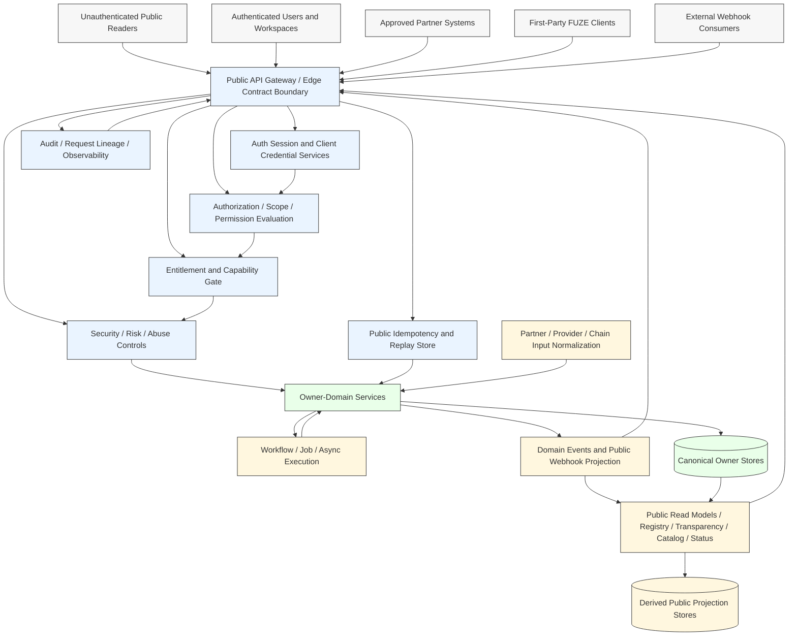
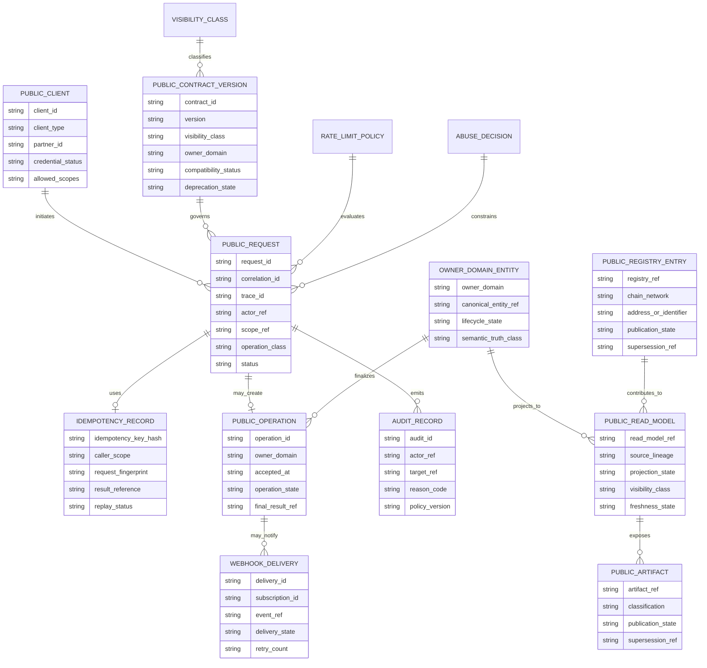
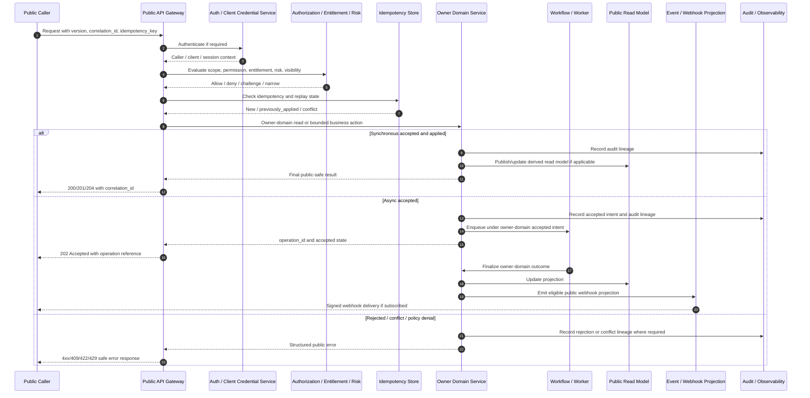

# FUZE Public API Specification

## Document Metadata

- **Document Name:** `PUBLIC_API_SPEC.md`
- **Document Type:** FUZE API SPEC v2 / production-grade interface-contract specification
- **Status:** Draft production-grade API specification
- **Version:** 2.0.0
- **Effective Date:** 2026-04-24
- **Last Updated:** 2026-04-24
- **Reviewed On:** 2026-04-24
- **Document Owner:** FUZE Platform Public API Governance Domain
- **Approval Authority:** FUZE Platform Architecture and Governance Authority; formal named approver not yet specified
- **Review Cadence:** Quarterly, and whenever public exposure posture, partner integration posture, public trust surfaces, API compatibility policy, abuse controls, identity/session behavior, entitlement gating, public registry exposure, or public deprecation posture materially changes
- **Governing Layer:** API SPEC v2 / public and external interface-contract governance layer
- **Parent Registry:** `API_SPEC_INDEX.md`
- **Upstream Semantic Registry:** `REFINED_SYSTEM_SPEC_INDEX.md`
- **Upstream API Registry:** `API_SPEC_INDEX.md`
- **Primary Audience:** Platform architecture, backend engineering, frontend engineering, public API authors, partner integration authors, SDK/OpenAPI authors, security/risk, audit/compliance, operations, public trust/reporting authors, product domain owners, implementation-contract authors
- **Primary Purpose:** Define the production-grade interface contract posture for all FUZE public and external API surfaces, including public-safe reads, authenticated caller-scoped reads, bounded external business actions, partner interfaces, public-trust read models, accepted async operations, abuse controls, compatibility posture, request/response/error semantics, audit lineage, and downstream OpenAPI/SDK derivation guardrails
- **Primary Upstream References:** `REFINED_SYSTEM_SPEC_INDEX.md`, `API_SPEC_INDEX.md`, `DOCS_SPEC_INDEX.md`, `SYSTEM_SPEC_INDEX.md`, `API_ARCHITECTURE_SPEC.md`, `PUBLIC_API_SPEC.md` refined system spec, `INTERNAL_SERVICE_API_SPEC.md`, `EVENT_MODEL_AND_WEBHOOK_SPEC.md`, `IDEMPOTENCY_AND_VERSIONING_SPEC.md`, `MIGRATION_AND_BACKWARD_COMPATIBILITY_SPEC.md`, `SECURITY_AND_RISK_CONTROL_SPEC.md`, `DATA_CLASSIFICATION_AND_HANDLING_SPEC.md`, `DATA_RETENTION_DELETION_AND_ARCHIVAL_SPEC.md`, `AUDIT_LOG_AND_ACTIVITY_SPEC.md`, `AUDIT_AND_ACCESS_TRACEABILITY_SPEC.md`, `FUZE_ACCOUNT_ACCESS_AND_SESSION_THESIS_FINAL_SPEC.md`, `FUZE_ACCOUNT_ACCESS_AND_SESSION_CANONICAL_FINAL_SPEC.md`, `FUZE_WORKSPACE_ACCESS_CONTROL_BASICS_THESIS_FINAL_SPEC.md`, `PUBLIC_CONTRACT_AND_WALLET_REGISTRY_SPEC.md`, `TRANSPARENCY_MODEL_SPEC.md`, `TRANSPARENCY_REPORTING_SPEC.md`, `PUBLIC_CONTRACT_AND_WALLET_REGISTRY_API_SPEC.md` when created, and public companion API specs listed in the API SPEC v2 registry
- **Primary Downstream Dependents:** public OpenAPI contracts, public SDKs, public gateway policies, partner integration contracts, public webhook delivery contracts, public registry lookup contracts, public transparency contracts, product-specific external APIs, API conformance tests, compatibility/deprecation plans, abuse/rate-limit policies, audit/observability implementation contracts
- **API Surface Families Covered:** unauthenticated public read APIs, authenticated public APIs, first-party external application APIs, partner integration APIs, public trust/read-model APIs, public webhook subscription and delivery APIs, public async operation status APIs, public artifact retrieval APIs, public metadata/catalog/status APIs, bounded public write APIs
- **API Surface Families Excluded:** internal service APIs, admin/control-plane APIs, operator override APIs, private provider callback internals, raw event bus contracts, raw worker/job APIs, database/storage APIs, smart-contract ABIs, private treasury/governance controls, private wallet/signing topology, product-local non-public implementation APIs
- **Canonical System Owner(s):** Owner domains named by upstream refined system specs retain semantic ownership. The Public API Governance Domain owns public/external API exposure posture and interface-contract requirements, not business semantics.
- **Canonical API Owner:** FUZE Platform Public API Governance Domain
- **Supersedes:** Earlier public API drafts or v1-style documents that treated public APIs as route lists, mirrors of internal services, first-party frontend conveniences, or public-read exports without explicit owner-domain, truth-class, compatibility, idempotency, audit, and abuse-control posture
- **Superseded By:** Not yet known
- **Related Decision Records:** Not explicitly specified in the retrieved governing materials
- **Canonical Status Note:** This API SPEC v2 document governs the public/external API contract layer. Refined system specs own semantic truth; this document owns how those truths may be exposed, requested, responded to, errored, versioned, audited, retried, migrated, and derived into public OpenAPI/SDK/webhook contracts.
- **Implementation Status:** Ready for downstream implementation-contract derivation; route inventories, gateway policies, service contracts, OpenAPI files, SDK generation, public webhook contracts, tests, and migration plans MUST align before production exposure
- **Approval Status:** Draft pending explicit FUZE approval workflow attachment
- **Change Summary:** Converts the refined public API posture into API SPEC v2 form. Adds explicit API surface families, request/response/error/status semantics, route-family model, idempotency/retry model, rate-limit and abuse-control rules, diagrams, flow view, sequence-level data flows, acceptance criteria, test cases, OpenAPI/SDK derivation guardrails, and non-canonical public API patterns.

## Purpose

This document defines the FUZE public API interface-contract layer.

The public API layer is the set of FUZE contracts intentionally exposed outside ordinary internal service boundaries. It includes openly public reads, authenticated user-scoped reads and actions, partner-safe APIs, public trust surfaces, public artifact retrieval, public webhook subscription/delivery contracts, and bounded external business-action writes.

This API spec exists to ensure that public exposure does not weaken FUZE's owner-domain model. Public APIs MUST remain curated external contracts. They MUST NOT mirror internal services, leak admin/control capabilities, expose raw internal mutation primitives, or convert derived public reads into semantic owners.

The refined system-spec library owns semantic truth. This API spec owns the external interface expression of that truth: surface families, resource families, request/response contracts, error/result/status classes, idempotency, replay safety, versioning, deprecation, compatibility, authorization, entitlement checks, abuse controls, audit lineage, observability, public read-model discipline, and downstream OpenAPI/SDK guardrails.

## Scope

This specification governs:

1. public and external API surface-family classification
2. public visibility classes and exposure approval rules
3. unauthenticated public-read APIs
4. authenticated caller-scoped APIs
5. partner integration APIs
6. bounded external business-action writes
7. public async accepted-state and operation-status contracts
8. public trust, registry, transparency, catalog, metadata, status, and artifact APIs
9. public webhook subscription and delivery posture where externally exposed
10. public request, response, error, status, and result semantics
11. public idempotency, replay, duplicate-submission, and retry safety
12. public rate-limit, abuse-control, signature, and credential posture
13. public audit, correlation, traceability, and observability requirements
14. public versioning, migration, compatibility, deprecation, sunset, and retirement rules
15. implementation-contract guardrails for public OpenAPI, AsyncAPI, SDKs, gateways, service contracts, and tests

## Out of Scope

This specification does not define:

1. exact endpoint paths for every domain
2. complete field-level schemas for every object type
3. exact OAuth, session-token, key-storage, or cryptographic implementation details
4. internal service-to-service collaboration contracts
5. admin/control-plane mutation contracts
6. operator override and support-tool workflows except where public APIs must not expose them
7. raw event bus topics, internal worker/job queues, or private provider callback internals
8. database schemas, storage keys, or read-model implementation tables
9. smart-contract ABI details or chain-native contract behavior
10. exact commercial packaging, plan names, public quotas, or SDK package architecture
11. exact copywriting or UI presentation for public developer documentation

Those topics belong to narrower domain API specs, implementation-contract specs, OpenAPI/AsyncAPI artifacts, runbooks, product-specific contracts, and machine-readable schemas. They MUST remain consistent with this document.

## Design Goals

1. Make public APIs intentionally curated and safer than internal capability.
2. Preserve owner-domain mutation boundaries even when external callers initiate actions.
3. Distinguish public, authenticated-public, partner, first-party, event/webhook, reporting/public-read, and chain-adjacent surfaces.
4. Ensure public writes are bounded business actions rather than generic internal commands.
5. Ensure public async actions represent accepted intent separately from final outcome.
6. Preserve public-read classification: canonical public artifact, caller-scoped canonical state, derived public view, and presentation output are distinct.
7. Make public request/response/error/status semantics deterministic enough for client, SDK, QA, and support implementation.
8. Make abuse resistance, idempotency, replay safety, rate limiting, privacy, auditability, and observability mandatory contract concerns.
9. Enable OpenAPI, AsyncAPI, SDK, gateway, and conformance-test derivation without reinterpretation.
10. Support long-term compatibility, migration, deprecation, and trust-preserving public contract evolution.

## Non-Goals

This specification is not intended to:

1. publish every internal route externally
2. turn first-party frontend needs into a blanket public exposure rule
3. expose raw internal mutation primitives such as arbitrary credits issuance, treasury movement, workflow replay, provider replay, admin correction, risk override, or governance control
4. make public gateways, SDKs, frontend stores, or public caches owners of business truth
5. let public transparency/reporting APIs become hidden ledger, payout, treasury, governance, or registry owners
6. use public route naming to encode entitlement, plan, commercial, or policy truth
7. weaken owner-domain semantics for external developer convenience
8. conceal async execution behind false synchronous success

## Core Principles

### Curated External Contract Principle

Public APIs are curated external contracts, not public mirrors of internal services. Every public route family MUST have an explicit owner domain, visibility class, supportability posture, compatibility posture, abuse posture, and publication approval.

### Owner-Domain Mutation Principle

Public write APIs MUST terminate in the owner domain that owns the semantic state being changed. Gateways, product frontends, partner adapters, public views, and SDKs MUST NOT become hidden mutation owners.

### Authenticated Public Is Still Public Principle

Authenticated caller-scoped APIs remain public/external contracts. Authentication narrows the caller, but it does not convert the surface into an internal service API.

### Narrower-Than-Internal Principle

Public APIs MUST expose a smaller, safer, more stable subset of capability than internal service and admin/control-plane surfaces.

### Public Artifact Classification Principle

Public APIs MUST distinguish canonical public artifacts, caller-scoped canonical state, derived public views, projection/reporting outputs, and presentation data. Derived public views MUST NOT become source-of-truth mutation owners.

### Accepted-State Honesty Principle

Long-running, deferred, review-gated, provider-mediated, chain-adjacent, or retry-heavy public actions MUST return accepted-state operation references when final outcome is not yet determined.

### Normalization-Before-Influence Principle

Partner callbacks, provider inputs, chain observations, public forms, and third-party signals remain provider-input truth until validated, normalized, authorized, and accepted by the owner domain.

### Public Trust Safety Principle

Public registry, transparency, payout-status, governance-disclosure, metadata, catalog, and status APIs MUST derive from approved publication/read-model truth and MUST NOT leak private operational detail or override source-domain truth.

### Strong Compatibility Principle

Published public APIs create external promises. Versioning, deprecation, migration, sunset, idempotency, and compatibility windows are mandatory production concerns.

### Auditability and Abuse-Resistance Principle

Material public mutations, accepted async intents, privileged caller-scoped reads, partner callbacks, webhook deliveries, and public trust publication changes MUST preserve audit, request lineage, correlation, trace, rate-limit, and abuse-control references.

## Canonical Definitions

### Public API

An intentionally exposed external contract surface for unauthenticated public readers, authenticated end users, first-party clients, external developers, partner systems, public trust consumers, or approved ecosystem systems.

### Visibility Class

The externally meaningful exposure class of a public contract. Approved values SHOULD include `open_public`, `authenticated_user`, `workspace_scoped`, `partner_only`, `limited_public`, `public_trust`, `public_status`, `public_metadata`, and `deprecated_public`.

### Public Business Action

A bounded externally exposed mutation request that represents business intent and terminates in an owner-domain mutation or accepted async intent. Examples include `create_workspace`, `initiate_checkout`, `submit_product_request`, `initiate_wallet_link`, or `request_export`.

### Public Request Lineage

Durable traceability data connecting request identity, caller type, client ID, surface family, visibility class, idempotency key, correlation ID, trace ID, operation reference, policy version, auth/scope decision, rate-limit decision, outcome, and audit record.

### Public Operation Reference

A stable public-safe reference returned for accepted async public actions. It allows callers to check status without exposing internal job IDs, queue mechanics, workflow internals, or sensitive provider details.

### Canonical Public Artifact

A publication artifact whose public representation is governed and canonical at the publication layer while remaining downstream of underlying source-domain truth where applicable. Examples include official registry records, approved public metadata, public status records, and transparency artifacts.

### Derived Public View

A public summary, projection, dashboard, aggregate, list view, export, cache, or simplified lookup derived from canonical owner-domain truth. Derived public views are read-only and non-owning.

### Partner Integration API

A public/external API exposed to approved partners under explicit credentials, scopes, replay protection, rate limits, callback authenticity, data-minimization, and support obligations.

### Public Webhook

A delivery contract by which FUZE sends externally consumable event notifications or status updates to a registered endpoint. Public webhooks are delivery contracts and do not replace canonical domain events or owner-domain truth.

## Truth Class Taxonomy

Public API implementations MUST preserve these truth classes:

1. **Semantic truth** — business and lifecycle meaning owned by upstream refined system specs and owner domains.
2. **API contract truth** — public surface families, route/resource contract shape, request/response/error/status semantics, versioning, compatibility, and visibility classification governed by this API spec and narrower API specs.
3. **Policy truth** — authorization, entitlement, rollout, abuse, rate-limit, deprecation, data-classification, and public exposure rules.
4. **Runtime truth** — current request execution, gateway decision, dependency health, async operation progress, retry state, and degraded-mode status.
5. **Ledger / storage truth** — durable owner-domain records, idempotency records, operation records, request lineage, audit records, publication records, and contract-version records.
6. **Public read-model truth** — approved public projections, registry lookup indexes, transparency summaries, catalog views, metadata views, payout-status views, and status pages.
7. **Provider-input truth** — raw partner callbacks, provider signals, chain observations, uploaded/requested inputs, client-supplied metadata, and external assertions prior to owner-domain acceptance.
8. **Event / async execution truth** — event publication, webhook delivery state, workflow progression, job execution, retry, cancellation, and finalization status.
9. **Projection/reporting truth** — analytics, reporting, export, dashboard, and stakeholder-facing summaries derived from stronger truth.
10. **Presentation truth** — SDK ergonomics, developer-doc wording, UI copy, labels, examples, and client-side display state.

These truth classes MUST NOT be collapsed. Public API responses MAY expose selected values from multiple truth classes only when classification, lineage, visibility, and owner-domain boundaries remain explicit.

## Architectural Position in the Spec Hierarchy

This API spec sits below:

- `REFINED_SYSTEM_SPEC_INDEX.md`
- `API_SPEC_INDEX.md`
- `DOCS_SPEC_INDEX.md`
- `SYSTEM_SPEC_INDEX.md`
- `SYSTEM_BOUNDARY_AND_OWNERSHIP_SPEC.md`
- `SYSTEM_OVERVIEW_AND_BOUNDARIES_SPEC.md`
- `PLATFORM_ARCHITECTURE_SPEC.md`
- `DOMAIN_OWNERSHIP_MATRIX_SPEC.md`
- `DATA_MODEL_AND_ENTITY_OWNERSHIP_SPEC.md`
- `ONCHAIN_OFFCHAIN_RESPONSIBILITY_SPEC.md`
- `API_ARCHITECTURE_SPEC.md`
- refined `PUBLIC_API_SPEC.md`

It sits above or alongside:

- product-specific public API specs
- `INTERNAL_SERVICE_API_SPEC.md`
- `EVENT_MODEL_AND_WEBHOOK_SPEC.md`
- `IDEMPOTENCY_AND_VERSIONING_SPEC.md`
- `MIGRATION_AND_BACKWARD_COMPATIBILITY_SPEC.md`
- public companion API specs such as `PUBLIC_METADATA_API_SPEC.md`, `PUBLIC_TRANSPARENCY_API_SPEC.md`, `PUBLIC_PAYOUT_STATUS_API_SPEC.md`, `PUBLIC_REGISTRY_LOOKUP_API_SPEC.md`, `PUBLIC_PRODUCT_CATALOG_API_SPEC.md`, `PUBLIC_CHAIN_REFERENCE_API_SPEC.md`, `PUBLIC_PLATFORM_STATUS_API_SPEC.md`, and `PUBLIC_GOVERNANCE_DISCLOSURE_API_SPEC.md`
- OpenAPI / AsyncAPI / SDK artifacts
- gateway policy specs
- implementation-contract specs

## Upstream Semantic Owners

This API spec consumes, but does not redefine, upstream semantics from:

- API architecture: surface-family, accepted-state, request/response/error, async, versioning, and owner-domain interface posture
- identity/account/auth/session specs: account identity, linked login, authentication, session lifecycle, provider resolution, and recovery posture
- workspace/access-control specs: workspace scope, membership, role, permission, effective permission, access traceability, and admin containment posture
- entitlement/capability-gating specs: capability eligibility and product-access gating
- security/risk specs: challenge, review, restriction, containment, abuse, fraud, and risk decision posture
- audit specs: immutable evidence, request lineage, access traceability, reason codes, actor/target/scope lineage
- data-classification/retention/storage specs: public exposure eligibility, sensitive data handling, deletion, suppression, artifact access, and lifecycle rules
- public registry/transparency/reporting specs: public trust publication and read-model semantics
- chain/off-chain and chain-linked economic specs: chain-native vs off-chain publication, payout, ledger, registry, and chain-adjacent boundaries

## API Surface Families

### Open Public Read APIs

Open public reads expose public-safe data without caller authentication. They are allowed only for information explicitly classified as public-safe or approved public trust material. They MUST NOT leak private object existence, user/workspace membership, partner-specific data, private operational detail, internal IDs, or non-public lifecycle state.

### Authenticated Public APIs

Authenticated public APIs expose caller-scoped reads or bounded business actions after identity/session authentication, scope resolution, authorization, entitlement evaluation, risk checks, and data classification checks where applicable. They remain public/external contracts.

### First-Party Application Public APIs

First-party application APIs used by FUZE products may share public API contracts where those contracts are suitable for long-term external compatibility. A first-party-only route that is not intended as a public contract MUST be classified separately and MUST NOT be published as public API by accident.

### Partner Integration APIs

Partner APIs require explicit partner identity, partner scopes, credential lifecycle, replay protection, signature requirements where needed, bounded visibility, rate limits, support contact posture, and public-compatible error semantics. Partner APIs MUST NOT become internal service APIs under external credentials.

### Public Trust APIs

Public trust APIs expose registry, transparency, governance disclosure, payout-status, chain-reference, public metadata, platform status, and official-contract/wallet information. They MUST be read-only unless a narrower approved public input path exists. They derive from canonical publication/read-model truth and MUST preserve supersession and correction lineage.

### Public Webhook APIs

Public webhook APIs include endpoint registration, subscription configuration, verification, delivery, retry, failure, and delivery-status contracts. Webhooks deliver public-safe external notifications; they do not replace canonical owner-domain events.

### Public Async Operation APIs

Public async APIs initiate long-running, review-gated, provider-mediated, chain-adjacent, export, workflow, AI, or billing-related work and return stable operation references. Status APIs expose public-safe progress and final outcome without exposing internal job topology.

### Public Artifact APIs

Public artifact APIs retrieve public-safe documents, reports, exports, receipts, registry artifacts, transparency artifacts, status artifacts, or caller-scoped files. They MUST enforce data classification, retention, suppression, artifact ownership, bounded delivery tokens, and audit lineage where applicable.

## System / API Boundaries

Public APIs are edge-facing contracts. They MAY call owner-domain services, authorization services, entitlement services, risk services, workflow services, public read-model services, and audit/observability systems. They MUST NOT become owners of the state held by those services.

The public API layer owns:

- public surface classification
- public visibility class
- contract version and compatibility posture
- public request envelope requirements
- public error/result/status posture
- public idempotency posture
- public request lineage and external operation reference posture
- public gateway, rate-limit, and abuse-control obligations
- external documentation and SDK derivation guardrails

The public API layer does not own:

- business object semantics
- identity/account/session truth
- workspace/permission/entitlement truth
- billing, credits, ledger, payout, treasury, governance, registry, transparency, or chain truth
- internal service orchestration truth
- admin override truth
- queue/worker truth
- private provider or connector truth

## Adjacent API Boundaries

### Internal Service API

Internal service APIs govern service-to-service collaboration. Public APIs MAY call internal APIs through approved backend mediation, but public consumers MUST NOT receive internal routes, internal schemas, internal error detail, internal service identities, or private mutation power.

### Event Model and Webhook

Domain events are canonical internal/external notification facts after owner-domain commit. Public webhooks are externally delivered projections of approved events or outcomes. Webhook subscriptions and delivery records are public API contracts; raw event bus topics are not.

### Idempotency and Versioning

This public API spec requires strict idempotency and versioning posture. The cross-cutting idempotency/versioning API spec owns shared mechanics and deprecation posture. Public APIs MUST apply the stricter interpretation when external compatibility or replay safety is at stake.

### Migration and Backward Compatibility

Public APIs MUST maintain explicit coexistence, deprecation, sunset, and retirement posture. Public consumers MUST receive migration-safe behavior rather than internal-breakage-driven changes.

### Public Companion API Specs

Companion specs such as `PUBLIC_REGISTRY_LOOKUP_API_SPEC.md` and `PUBLIC_PLATFORM_STATUS_API_SPEC.md` narrow route families for specific public trust domains. They MUST preserve this specification and may be stricter.

## Conflict Resolution Rules

1. `REFINED_SYSTEM_SPEC_INDEX.md` wins on refined-library membership and refined-over-legacy precedence.
2. Higher-order system boundary and ownership specs win on top-level semantic ownership and plane separation.
3. Owner-domain refined specs win on business meaning, lifecycle semantics, canonical write ownership, and canonical read ownership.
4. `API_ARCHITECTURE_SPEC.md` wins on shared API architecture, surface-family taxonomy, and accepted-state posture.
5. This document wins on public/external API exposure classification, public contract shape requirements, public compatibility posture, public request/response/error/status rules, and public abuse/idempotency/audit requirements.
6. Narrower public domain API specs win on route/resource specifics only when they preserve this document and upstream semantic owners.
7. Internal service specs, admin specs, gateway configs, SDKs, caches, docs, exports, reports, dashboards, and frontends never win over stronger public API or owner-domain rules.
8. If ambiguity remains, FUZE MUST choose the more conservative public-exposure posture and escalate the ambiguity into explicit specification or decision work.

## Default Decision Rules

1. External exposure defaults to non-public until explicitly approved.
2. Public writes default to bounded business actions, not generic commands.
3. Authenticated external access defaults to public/external posture, not internal service posture.
4. Public reads default to minimum necessary fields.
5. Unknown or mixed-class data defaults to the more restrictive public exposure class.
6. Public async work defaults to `202 Accepted` with operation reference, not false completion.
7. Partner callbacks default to provider-input truth until normalized and accepted by owner domains.
8. Public trust outputs default to read-only derived or publication-backed outputs unless narrower specs explicitly permit write input.
9. Public route families without an owner domain, visibility class, compatibility posture, authorization model, idempotency posture, and audit posture are incomplete.
10. Security uncertainty defaults to deny, challenge, review, restriction, containment, or narrower exposure.

## Roles / Actors / API Consumers

- unauthenticated public readers
- authenticated end users
- workspace-scoped members and owners
- first-party FUZE clients
- external developers
- approved partner systems
- public trust consumers, community readers, registry consumers, auditors, and exchanges
- webhook endpoint operators
- support-visible but non-admin callers of public-safe support flows
- public gateway, auth, authorization, entitlement, risk, rate-limit, audit, and observability services
- owner-domain services that satisfy public requests
- public read-model, registry, transparency, status, and catalog services

## Resource / Entity Families

Public API resources SHOULD be organized around public-safe concepts, not internal tables:

- `public_client`
- `public_api_key` or approved client credential reference
- `public_session_context` where caller-scoped and public-safe
- `public_account_profile` where approved
- `workspace_scope_summary`
- `public_operation`
- `public_request_lineage`
- `public_idempotency_record`
- `public_visibility_class`
- `public_contract_version`
- `public_deprecation_notice`
- `public_registry_entry`
- `public_metadata_record`
- `public_product_catalog_item`
- `public_transparency_artifact`
- `public_payout_status_view`
- `public_chain_reference`
- `public_platform_status`
- `public_governance_disclosure`
- `webhook_subscription`
- `webhook_delivery`
- `public_artifact_reference`
- `public_error`
- `rate_limit_decision`
- `abuse_control_decision`

Implementation-specific service objects, database rows, provider payloads, job records, and admin records MUST NOT leak as public resources unless explicitly transformed into public-safe resources.

## Ownership Model

Public API Governance owns public/external contract discipline. It does not own business semantics. Owner domains remain the canonical mutation and read authorities for their domains.

A public write may be initiated through the public API gateway, but the mutation MUST terminate in the owner domain. If the owner domain accepts deferred work, the public API returns an operation reference. If a worker, provider adapter, or chain-adjacent service later executes work, that execution remains subordinate to the owner-domain accepted intent and finalization rules.

Derived public read models are downstream to canonical owner-domain records. They MAY be optimized, cached, indexed, exported, or replicated, but they MUST preserve lineage, classification, suppression, correction, and supersession rules.

## Authority / Decision Model

Public API request handling follows this authority chain:

1. classify surface family and visibility class
2. authenticate caller where required
3. resolve caller, client, account, workspace, partner, and product scope where applicable
4. evaluate authorization, permission, entitlement, rollout, and risk posture
5. apply data-classification and public exposure rules
6. validate request schema and business-intent shape
7. evaluate idempotency and replay state before side effects
8. route to owner-domain contract or public read-model contract
9. commit immediate mutation, reject, or record accepted async intent
10. emit audit, events, metrics, and request lineage
11. return public-safe response, error, or operation status

No gateway, frontend, SDK, cache, or partner adapter may bypass this authority chain for material public operations.

## Authentication Model

Public APIs MAY be unauthenticated only when the resource is intentionally open-public and public-safe.

Authenticated public APIs MUST distinguish:

- identity/authentication status
- session validity
- client/application identity
- account subject
- workspace scope
- partner identity
- delegated or scoped credential authority
- risk/security posture

A valid session or credential is necessary but not sufficient for authorization. It MUST NOT imply workspace authority, product capability, entitlement, public artifact access, privileged read access, partner authority, or mutation authority.

## Authorization / Scope / Permission Model

Public APIs MUST apply scope-aware authorization. Depending on the route family, this may include:

- account self-scope
- workspace membership
- role and permission grants
- effective permission evaluation
- partner scope
- product scope
- visibility class
- data-classification release eligibility
- public artifact visibility state
- security restriction state
- audit and access traceability requirements

Authorization failures MUST avoid leaking unauthorized resource existence. Error responses MAY distinguish `not_authenticated`, `not_authorized`, `scope_denied`, `entitlement_required`, `risk_denied`, and `not_found_or_not_visible` only when safe for the audience.

## Entitlement / Capability-Gating Model

Entitlement is not authorization and not identity. Public APIs that expose product capabilities MUST evaluate entitlement separately from authentication, permission, rollout, and rate limit.

Public APIs MUST NOT encode entitlement meaning solely through route names, frontend behavior, or SDK package availability. If entitlement affects the contract, the API MUST define the possible safe result classes, such as `entitlement_required`, `capability_unavailable`, `quota_exceeded`, or `plan_not_eligible`, without exposing confidential commercial or internal policy detail.

## API State Model

Public API surface lifecycle states:

- `proposed`
- `approved_for_public_design`
- `published`
- `active`
- `deprecated`
- `sunset_scheduled`
- `retired`
- `superseded`
- `withdrawn`

Public request states:

- `received`
- `authenticated_or_public`
- `authorized_if_required`
- `validated`
- `idempotency_checked`
- `accepted`
- `processing`
- `completed`
- `failed_retryable`
- `failed_terminal`
- `cancelled`
- `conflicted`
- `previously_applied`
- `rate_limited`
- `risk_denied`

Public operation states:

- `accepted`
- `queued`
- `in_progress`
- `waiting_for_external_input`
- `waiting_for_review`
- `completed`
- `failed_retryable`
- `failed_terminal`
- `cancelled`
- `expired`
- `superseded`

`accepted` MUST remain distinct from `completed`. `previously_applied` MUST remain distinct from new application. `failed_retryable` MUST remain distinct from `failed_terminal`.

## Lifecycle / Workflow Model

1. A public contract is proposed with owner domain, visibility class, route family, public data classification, supportability, abuse posture, and compatibility policy.
2. Public API Governance and the owner domain approve or reject exposure.
3. The route family is published with explicit version, documentation, SDK policy, error model, idempotency model, and deprecation policy.
4. Requests enter through a public gateway or equivalent public boundary.
5. The gateway validates transport, version, authentication, client identity, signatures, rate limits, and basic schema.
6. Authorization, entitlement, risk, and public visibility are evaluated before owner-domain side effects.
7. Idempotency and replay checks are performed before mutation.
8. The owner domain returns read data, applies the mutation, rejects it, or records accepted async intent.
9. Async work proceeds through workflow/worker/provider/chain-adjacent systems under accepted intent and owner-domain finalization rules.
10. Public-safe events, webhooks, read-model updates, and operation status updates are emitted or projected.
11. Audit, metrics, traces, and access lineage are recorded.
12. Contract changes follow versioning, migration, deprecation, sunset, and retirement rules.

## Architecture Diagram — Mermaid flowchart

## Data Design — Mermaid Diagram

## Flow View

### Public Read Flow

1. Request reaches public gateway with version, route family, correlation ID, and caller context if any.
2. Gateway identifies visibility class.
3. If open-public, the gateway still applies rate-limit, abuse, cache, and public-data classification rules.
4. If authenticated or partner-scoped, authentication, scope, permission, entitlement, and risk checks execute.
5. Public read-model service or owner-domain read contract returns approved public-safe representation.
6. Response includes status, data, pagination/cursor if applicable, version headers, cache policy, and correlation ID.
7. Audit or access logs are captured where required by sensitivity.

### Public Mutation Flow

1. Caller submits bounded business-action request with version, idempotency key where required, correlation ID, and public-safe payload.
2. Gateway authenticates and validates schema.
3. Authorization, entitlement, data-classification, risk, rate-limit, and idempotency checks run before side effects.
4. Owner domain validates business intent.
5. Owner domain either applies synchronously, rejects with structured public error, or records accepted async intent.
6. API returns `200`, `201`, `202`, `204`, `4xx`, or `5xx` according to final or accepted state.
7. Audit, event, observability, and idempotency results are recorded.

### Public Async Flow

1. Caller submits async request.
2. Owner domain records accepted intent and operation reference.
3. Public API returns `202 Accepted` with `operation_id`, current state, status URL, retry guidance, and correlation ID.
4. Workflow/worker/provider/chain-adjacent systems continue execution under owner-domain rules.
5. Public status endpoint exposes public-safe progress.
6. Final outcome updates operation state and may emit webhook delivery.
7. Failure paths preserve retryable vs terminal distinction and audit lineage.

### Public Webhook Flow

1. Caller registers endpoint with verification and approved event families.
2. FUZE verifies endpoint ownership and stores subscription state.
3. Owner-domain event occurs and is eligible for external notification.
4. Public webhook projection filters payload by visibility, data classification, and subscription scope.
5. Delivery is signed, sent, retried according to policy, and recorded.
6. Delivery status is available through public-safe subscription/delivery APIs.

### Failure / Degraded Mode Flow

1. Dependency failure, security uncertainty, stale projection, rate-limit spike, or incident condition is detected.
2. Risk/continuity posture narrows public behavior.
3. Public APIs return safe error/status classes, degraded response indicators, stale-but-labeled read models, or temporary unavailability.
4. Public writes do not proceed if owner-domain acceptance cannot be safely determined.
5. Audit, metrics, incident linkage, and public status updates are recorded where applicable.

## Data Flows — Mermaid sequenceDiagram

## Request Model

Public requests MUST define, where applicable:

- HTTP method or protocol operation class
- version identifier
- route/resource family
- owner domain
- visibility class
- caller type
- authentication requirement
- authorization scope
- entitlement/capability requirement
- idempotency requirement
- request fingerprinting fields
- correlation ID and trace ID behavior
- pagination/cursor fields for list reads
- filter/sort constraints
- public-safe field selection rules
- payload size and content-type limits
- signature fields for partner callbacks/webhooks
- operation intent fields for async actions
- reason code if the public action affects supportable or sensitive state

Mutation requests MUST express business intent. They MUST NOT accept raw internal command names, arbitrary state patches, privileged role names, internal job IDs, hidden policy flags, internal ledger deltas, or admin override parameters.

## Response Model

Public responses MUST be stable, public-safe, and contract-versioned. They SHOULD include:

- `status`
- `data` or `error`
- `request_id`
- `correlation_id`
- `trace_id` where safe
- `operation_id` for async accepted work
- `idempotency_status` where applicable
- `version`
- `deprecation` or `sunset` metadata where applicable
- `pagination` metadata for list responses
- `links` only when public-safe
- `warnings` for degraded, stale, partial, or soon-to-be-deprecated states where appropriate

Responses MUST NOT expose internal service names, database IDs, raw stack traces, private policy internals, private risk reasoning, private wallet/control topology, internal job IDs, provider secret material, raw internal event topics, or unauthorized object existence.

## Error / Result / Status Model

Public APIs MUST distinguish these error/result classes where relevant:

- `invalid_request`
- `unsupported_version`
- `authentication_required`
- `invalid_credentials`
- `session_expired`
- `authorization_denied`
- `scope_denied`
- `entitlement_required`
- `capability_unavailable`
- `not_found_or_not_visible`
- `conflict`
- `idempotency_conflict`
- `previously_applied`
- `validation_failed`
- `policy_denied`
- `risk_denied`
- `challenge_required`
- `rate_limited`
- `quota_exceeded`
- `payload_too_large`
- `unsupported_media_type`
- `dependency_unavailable`
- `provider_input_rejected`
- `operation_accepted`
- `operation_pending`
- `operation_failed_retryable`
- `operation_failed_terminal`
- `deprecated_contract`
- `sunset_contract`

HTTP status mapping SHOULD preserve semantics:

- `200 OK` for successful reads or completed actions returning data
- `201 Created` for synchronous public-safe creation
- `202 Accepted` for accepted async intent
- `204 No Content` for completed action without body
- `400 Bad Request` for malformed requests
- `401 Unauthorized` for missing/invalid authentication
- `403 Forbidden` for safe authorization denial
- `404 Not Found` or generic `not_found_or_not_visible` where existence must not leak
- `409 Conflict` for state conflict or idempotency mismatch
- `422 Unprocessable Entity` for semantic validation failure
- `429 Too Many Requests` for rate limit or quota throttling
- `5xx` only for platform/server/dependency failures, without leaking internals

## Idempotency / Retry / Replay Model

Public mutation APIs MUST require idempotency keys when duplicate submission, retry, external callbacks, payment-like behavior, async acceptance, partner replay, or chain-adjacent initiation could cause duplicate side effects.

Idempotency records MUST be scoped by caller/client, route family, operation class, owner domain, request fingerprint, and time window. The same key with the same fingerprint MUST return `previously_applied` or the prior accepted operation/result. The same key with a different fingerprint MUST return `idempotency_conflict` and MUST NOT execute side effects.

Partner callbacks and webhooks MUST use replay protection appropriate to their trust level, including timestamp, nonce, signature, idempotency key, delivery ID, or provider event ID where applicable.

Retries MUST distinguish:

- safe read retry
- safe duplicate mutation retry with same idempotency key
- retryable dependency failure
- terminal policy rejection
- idempotency conflict
- accepted operation status polling

## Rate Limit / Abuse-Control Model

Public APIs MUST apply rate limits and abuse controls by route family, visibility class, caller type, client ID, account, workspace, partner, IP/device/network signals where appropriate, operation sensitivity, and current security posture.

Public write, partner callback, webhook registration, auth-adjacent, export, AI, billing, wallet-aware, registry, transparency, and public trust routes require stricter posture than routine public metadata reads.

Abuse controls MAY include:

- fixed and adaptive rate limits
- quota and burst controls
- signature enforcement
- replay blocking
- challenge or step-up
- endpoint verification
- temporary suspension
- scope narrowing
- public exposure suppression
- denylist/allowlist decisions
- incident-driven degradation

Rate-limit and abuse responses MUST be public-safe and SHOULD include retry guidance only when safe.

## Endpoint / Route Family Model

This document does not freeze final paths. It governs allowed route families:

### Allowed Route Families

- `/v{version}/public/metadata/*`
- `/v{version}/public/status/*`
- `/v{version}/public/catalog/*`
- `/v{version}/public/registry/*`
- `/v{version}/public/transparency/*`
- `/v{version}/public/payout-status/*`
- `/v{version}/public/chain-reference/*`
- `/v{version}/public/governance-disclosure/*`
- `/v{version}/me/*` for authenticated caller-scoped public APIs
- `/v{version}/workspaces/{workspace_ref}/*` only where workspace-scoped public access is approved
- `/v{version}/partners/*` for approved partner APIs
- `/v{version}/operations/{operation_id}` for public async status
- `/v{version}/webhooks/*` for public subscription and delivery-management contracts
- `/v{version}/artifacts/*` for public-safe or caller-scoped artifact retrieval

### Forbidden Route Families

Public API MUST NOT expose route families that imply:

- `/internal/*`
- `/admin/*`
- `/control/*`
- `/operator/*`
- `/debug/*`
- `/jobs/raw/*`
- `/queues/*`
- `/events/raw/*`
- `/database/*`
- `/ledger/raw-mutate/*`
- `/treasury/execute/*`
- `/governance/override/*`
- `/risk/private-reasoning/*`
- `/wallet/private-inventory/*`
- arbitrary owner-domain state patching

A route path alone does not determine safety. Route family, owner domain, visibility class, request shape, authorization, data classification, and mutation termination all must align.

## Public API Considerations

Public APIs MUST be stable, documented, supportable, minimized, explicit, and compatibility-governed. Field exposure MUST be approved. Sensitive or ambiguous fields MUST default to omitted, redacted, aggregated, or denied.

Open-public APIs SHOULD prefer cacheable, immutable, or low-sensitivity outputs. When serving dynamic status or public trust data, they MUST expose freshness and supersession/correction posture where meaningful.

## First-Party Application API Considerations

First-party clients may use public APIs, but first-party convenience MUST NOT silently publish internal capabilities as external contracts. If a route is first-party-only but externally reachable, it still requires public-style auth, abuse, visibility, compatibility, and audit posture unless explicitly classified as non-public behind appropriate platform boundaries.

## Internal Service API Considerations

Public APIs MAY mediate calls to internal services. They MUST translate external requests into owner-domain business actions. They MUST NOT forward external caller payloads as raw internal commands without validation, normalization, authorization, idempotency, and audit lineage.

## Admin / Control-Plane API Considerations

Admin/control-plane behavior MUST remain outside public API. Public APIs may expose user-facing request submission or public-safe status of a governed process, but not privileged approval, override, correction, remediation, treasury, governance, or security control actions.

If a public API allows users to request support, correction, export, registry review, or policy review, it MUST create a bounded request or case. It MUST NOT execute the privileged control-plane result directly.

## Event / Webhook / Async API Considerations

Public webhooks MUST be derived from eligible owner-domain outcomes or approved event projections. Payloads MUST be public-safe, versioned, signed where appropriate, replay-safe, and delivery-lineaged.

Async public APIs MUST return operation references, not internal workflow IDs. Operation status responses MUST distinguish accepted intent, current processing, waiting for external input, waiting for review, completed, failed retryable, failed terminal, cancelled, expired, and superseded where relevant.

## Chain-Adjacent API Considerations

Public chain-adjacent APIs MAY expose official registry entries, chain references, public-safe contract metadata, payout-status summaries, transaction references, and chain observation summaries. They MUST NOT redefine chain-native truth or off-chain owner-domain policy truth.

Chain observations remain provider/chain-input truth until normalized and accepted by the relevant owner domain. Public APIs MUST label chain-adjacent freshness, network, confirmation, supersession, discrepancy, or reconciliation status when relevant.

## Data Model / Storage Support Implications

Implementations MUST support durable records for:

- public clients and partner credentials
- public contract versions
- public visibility classes
- public request lineage
- public idempotency records
- public operation records
- public webhook subscriptions and deliveries
- public read-model lineage
- public artifact references
- public deprecation/sunset notices
- rate-limit and abuse decisions
- public audit references

These records must not become semantic owners of business truth. They support interface contract safety, lineage, compatibility, and operations.

## Read Model / Projection / Reporting Rules

Public read models MUST:

1. name their upstream canonical sources
2. identify visibility class
3. preserve source lineage or projection version where material
4. distinguish canonical public artifact from derived public view
5. avoid exposing private fields
6. support correction, suppression, deprecation, supersession, and freshness indicators where relevant
7. honor deletion, retention, classification, and incident suppression policies
8. avoid becoming hidden write owners

Caches, CDN edges, public search indexes, SDK local caches, and public exports are derived. They MUST observe invalidation, suppression, deprecation, and correction requirements.

## Security / Risk / Privacy Controls

Public APIs MUST preserve least privilege, audience minimization, safe error disclosure, replay safety, credential hygiene, signature verification, threat monitoring, endpoint verification, abuse controls, security posture narrowing, and data classification.

Security/risk posture may deny, challenge, restrict, narrow, contain, or suppress public exposure. Public APIs MUST not continue unsafe operations due to stale sessions, stale caches, stale rollout decisions, SDK defaults, or product convenience.

## Audit / Traceability / Observability Requirements

Material public operations MUST record:

- request ID
- correlation ID
- trace ID where safe
- caller/client reference
- account/workspace/partner scope where applicable
- route family and contract version
- visibility class
- authorization and entitlement decision references where applicable
- risk/abuse/rate-limit decision references where applicable
- idempotency key hash and replay result where applicable
- owner-domain target reference
- operation reference where applicable
- result/error/status class
- policy version where applicable
- audit record reference

Observability MUST distinguish public gateway failure, auth failure, authorization denial, owner-domain rejection, rate-limit denial, idempotency conflict, accepted async progress, dependency failure, projection lag, and webhook delivery failure.

## Failure Handling / Edge Cases

Public APIs MUST define deterministic behavior for:

- missing authentication
- expired session
- invalid partner credential
- insufficient scope
- insufficient workspace permission
- entitlement denial
- feature rollout denial
- risk challenge or containment
- duplicate idempotency key
- idempotency fingerprint mismatch
- concurrent mutation conflict
- stale public read model
- source-domain correction or supersession
- public contract deprecation
- webhook endpoint failure
- provider callback replay
- dependency outage
- degraded mode
- public status incident
- deletion/suppression of source data
- chain discrepancy or delayed confirmation
- operation cancellation, expiry, or terminal failure

When safe owner-domain acceptance cannot be confirmed, public mutation APIs MUST fail closed or return accepted/pending only if the accepted intent is durably recorded.

## Migration / Versioning / Compatibility / Deprecation Rules

Public APIs MUST use explicit versioning and compatibility policy. Breaking changes require:

1. owner-domain and Public API Governance review
2. documented compatibility impact
3. deprecation notice where public consumers are affected
4. coexistence window when required
5. migration guide or SDK guidance where applicable
6. sunset date where known
7. clear `deprecated`, `sunset_scheduled`, `retired`, or `superseded` contract state
8. monitoring for remaining consumer traffic
9. rollback or exception posture when required

Non-breaking additive changes MAY proceed under compatibility policy if they do not leak data, change semantics, weaken auth, or alter error/result meaning unexpectedly.

## OpenAPI / AsyncAPI / SDK Derivation Rules

OpenAPI, AsyncAPI, SDKs, examples, and developer docs MUST preserve:

- visibility class
- owner domain
- authentication and scope requirements
- entitlement requirements
- request schemas and business-intent names
- response/result/error/status classes
- idempotency requirements
- operation references for async actions
- rate-limit and retry guidance
- deprecation and version metadata
- public-safe field exposure
- webhook signature and replay requirements
- no internal IDs, private fields, admin routes, or internal error detail

SDKs MUST NOT hide accepted-state semantics by pretending async operations are completed. SDK retries MUST respect idempotency and rate-limit guidance.

## Implementation-Contract Guardrails

1. Public route publication requires explicit owner-domain and visibility-class assignment.
2. Public mutations require owner-domain termination.
3. Public async operations require durable operation records.
4. Public idempotent mutations require idempotency records before side effects.
5. Public reads require public-data classification and read-model lineage.
6. Partner APIs require explicit credential, scope, signature/replay, and support posture.
7. Public webhooks require payload filtering, signing where appropriate, delivery lineage, retry policy, and dead-letter/remediation posture.
8. Public gateway logs must avoid sensitive payload leakage while preserving enough request lineage.
9. Public error messages must be audience-minimized and deterministic.
10. Public compatibility changes must preserve migration and deprecation lineage.

## Downstream Execution Staging

1. Inventory candidate public route families and classify each by owner domain, visibility class, and compatibility posture.
2. Map each mutation to owner-domain acceptance/finalization contracts.
3. Establish shared public request, response, error, idempotency, operation, audit, and deprecation envelopes.
4. Implement public gateway policy controls and security/abuse/rate-limit enforcement.
5. Build public read-model lineage and suppression/correction mechanisms.
6. Generate OpenAPI/AsyncAPI contracts and SDK rules from approved contract sources.
7. Add conformance tests for public API boundaries, auth, idempotency, errors, async, audit, and migration.
8. Establish public API review gates before production publication.

## Required Downstream Specs / Contract Layers

- domain-specific public API specs
- `PUBLIC_METADATA_API_SPEC.md`
- `PUBLIC_TRANSPARENCY_API_SPEC.md`
- `PUBLIC_PAYOUT_STATUS_API_SPEC.md`
- `PUBLIC_REGISTRY_LOOKUP_API_SPEC.md`
- `PUBLIC_PRODUCT_CATALOG_API_SPEC.md`
- `PUBLIC_CHAIN_REFERENCE_API_SPEC.md`
- `PUBLIC_PLATFORM_STATUS_API_SPEC.md`
- `PUBLIC_GOVERNANCE_DISCLOSURE_API_SPEC.md`
- public OpenAPI contracts
- public AsyncAPI/webhook contracts
- public SDK derivation specs
- public gateway/rate-limit policy specs
- public API conformance test suite
- public deprecation and migration runbooks

## Boundary Violation Detection / Non-Canonical API Patterns

The following patterns are forbidden unless a stronger approved specification creates a bounded exception:

1. exposing internal service routes publicly
2. exposing admin/control operations publicly
3. using public APIs as raw database mutation surfaces
4. using public reads as hidden source-of-truth owners
5. treating authenticated public users as internal callers
6. treating partner callbacks as canonical truth without normalization
7. exposing raw provider payloads publicly
8. exposing private wallet inventory, signer topology, or treasury controls
9. leaking unauthorized resource existence through errors
10. using idempotency keys without request fingerprinting
11. returning `200 OK` for accepted async intent that is not completed
12. silently changing public response semantics without version/deprecation posture
13. allowing SDK retries to duplicate side effects
14. using public route names to encode hidden entitlement truth
15. allowing frontend or gateway convenience to redefine owner-domain semantics

## Canonical Examples / Anti-Examples

### Canonical Example — Public Registry Lookup

A public caller requests an official contract address. The API reads from registry publication truth, returns only public-safe metadata, includes network, publication state, supersession guidance if applicable, and does not expose private signer/control details.

### Canonical Example — Authenticated Workspace Action

An authenticated user submits a bounded product request inside a workspace. The API authenticates the session, resolves account/workspace scope, checks permission, entitlement, risk, idempotency, and owner-domain acceptance, then returns either final result or `202 Accepted` with operation reference.

### Canonical Example — Partner Callback

A partner sends a signed callback with event ID and timestamp. FUZE verifies signature and replay window, stores provider-input lineage, normalizes the input, routes it to the owner domain, and only then updates canonical state or rejects the input.

### Anti-Example — Internal Route Mirror

A public route directly forwards arbitrary payloads to an internal service mutation endpoint. This is forbidden because it bypasses public validation, owner-domain business-action shape, idempotency, and public error discipline.

### Anti-Example — False Synchronous Completion

A public API returns success for a payout, export, AI run, or chain-adjacent operation before the owner-domain final outcome exists. This is forbidden. The API must return accepted-state or pending operation status.

### Anti-Example — Derived View as Owner

A public transparency cache is edited directly to correct payout status without updating the payout ledger/publication owner. This is forbidden because the derived read model becomes a shadow source of truth.

## Acceptance Criteria

1. Every public route family declares owner domain, visibility class, authentication requirement, authorization model, entitlement posture, idempotency posture, and compatibility status.
2. Public mutation routes express bounded business actions and terminate in owner-domain contracts.
3. No public route exposes internal service, admin/control, raw job, raw event, raw database, raw ledger, raw treasury, private wallet, or private security/risk mutation capability.
4. Authenticated public APIs distinguish authentication, session validity, account scope, workspace scope, authorization, entitlement, and risk posture.
5. Public async APIs return durable public operation references and distinguish accepted intent from final outcome.
6. Public idempotent mutations return prior results for same key/fingerprint and reject same key/different fingerprint without side effects.
7. Public error responses distinguish safe result classes without leaking internal details or unauthorized object existence.
8. Public read models identify upstream source lineage and never become mutation owners.
9. Public trust APIs preserve public artifact classification, publication state, supersession, correction, and visibility constraints.
10. Partner APIs enforce explicit credential, scope, signature/replay, rate-limit, and audit requirements.
11. Public webhook deliveries are payload-filtered, signed where required, replay-safe, retried according to policy, and delivery-lineaged.
12. Public rate-limit and abuse controls apply per route family, caller/client, scope, sensitivity, and current risk posture.
13. Material public operations emit audit and observability records with request ID, correlation ID, actor/client, route family, owner domain, result class, and policy references where applicable.
14. Public contract changes include version/deprecation/sunset/retirement metadata and migration guidance when externally breaking.
15. OpenAPI/AsyncAPI/SDK artifacts preserve visibility, auth, error, idempotency, async, rate-limit, and deprecation semantics.
16. Degraded mode does not allow unsafe public writes and labels stale or partial public reads where applicable.
17. Data classification, retention, deletion, suppression, and artifact-delivery rules are enforced before public exposure.
18. Boundary-violation tests fail builds when internal/admin/private routes or fields are exposed through public contracts.

## Test Cases

### Positive Tests

1. Open-public metadata read returns only public-safe fields, version metadata, cache policy, and correlation ID.
2. Authenticated self-scope read succeeds only for the authenticated account and omits unauthorized workspace data.
3. Workspace-scoped public action succeeds when session, workspace permission, entitlement, risk, and idempotency checks pass.
4. Partner API request with valid credential, scope, signature, timestamp, and nonce succeeds and records request lineage.
5. Async export request returns `202 Accepted` with `operation_id`; status endpoint later returns `completed` after owner-domain finalization.
6. Public registry lookup returns published entry with public role, network, address, publication state, supersession guidance, and no private wallet/control details.
7. Webhook delivery signs payload, records delivery ID, and exposes public-safe delivery status.

### Negative / Boundary Tests

1. Unauthenticated request to authenticated route returns `authentication_required` without object leakage.
2. Authenticated user without workspace permission receives safe denial or `not_found_or_not_visible` according to route policy.
3. Entitlement-denied action returns `entitlement_required` or `capability_unavailable` without redefining entitlement truth.
4. Same idempotency key with different payload returns `idempotency_conflict` and no side effects.
5. Duplicate retry with same idempotency key and fingerprint returns prior operation/result.
6. Public route attempting to call internal admin mutation fails boundary validation.
7. Public response schema containing internal service name, database ID, private risk reason, raw job ID, or private wallet detail fails contract validation.
8. Partner callback with invalid signature, expired timestamp, replayed nonce, or unknown event ID is rejected and audited as provider-input failure.
9. Public async endpoint cannot return `completed` unless owner-domain finalization exists.
10. Deprecated contract version returns deprecation metadata and still preserves compatibility during coexistence window.
11. Sunset route after retirement returns `sunset_contract` or approved migration error, not ambiguous server failure.
12. Rate-limit burst returns `429` with safe retry guidance where allowed.
13. Security containment suppresses public write and returns safe policy/risk denial while recording lineage.
14. Stale public read model returns freshness warning or degraded status; it must not claim canonical currentness.
15. Source deletion/suppression removes or suppresses derived public view and artifact access according to lifecycle policy.
16. Webhook endpoint failure triggers retries and delivery-state updates without duplicate semantic event creation.
17. Chain discrepancy prevents public API from asserting final chain-adjacent outcome until reconciliation posture is explicit.
18. Migration test verifies OpenAPI and SDK outputs preserve accepted-state and idempotency semantics.

## Dependencies / Cross-Spec Links

This document depends on:

- `REFINED_SYSTEM_SPEC_INDEX.md`
- `API_SPEC_INDEX.md`
- `DOCS_SPEC_INDEX.md`
- `SYSTEM_SPEC_INDEX.md`
- `API_ARCHITECTURE_SPEC.md`
- refined `PUBLIC_API_SPEC.md`
- `INTERNAL_SERVICE_API_SPEC.md`
- `EVENT_MODEL_AND_WEBHOOK_SPEC.md`
- `IDEMPOTENCY_AND_VERSIONING_SPEC.md`
- `MIGRATION_AND_BACKWARD_COMPATIBILITY_SPEC.md`
- `SECURITY_AND_RISK_CONTROL_SPEC.md`
- `DATA_CLASSIFICATION_AND_HANDLING_SPEC.md`
- `DATA_RETENTION_DELETION_AND_ARCHIVAL_SPEC.md`
- `AUDIT_LOG_AND_ACTIVITY_SPEC.md`
- `AUDIT_AND_ACCESS_TRACEABILITY_SPEC.md`
- `FUZE_ACCOUNT_ACCESS_AND_SESSION_THESIS_FINAL_SPEC.md`
- `FUZE_ACCOUNT_ACCESS_AND_SESSION_CANONICAL_FINAL_SPEC.md`
- `FUZE_WORKSPACE_ACCESS_CONTROL_BASICS_THESIS_FINAL_SPEC.md`
- `PUBLIC_CONTRACT_AND_WALLET_REGISTRY_SPEC.md`
- `TRANSPARENCY_MODEL_SPEC.md`
- `TRANSPARENCY_REPORTING_SPEC.md`
- domain-specific public companion API specs

## Explicitly Deferred Items

1. final endpoint paths and complete field schemas for each domain
2. exact OAuth, token, API key, or credential implementation
3. exact public gateway vendor and infrastructure topology
4. exact SDK package structure and code-generation templates
5. exact public webhook event catalog
6. exact per-route public quota values
7. exact commercial packaging and pricing plans
8. exact public developer documentation copy
9. exact per-domain public read-model storage schemas
10. exact support runbooks for public API incidents

Deferred items MUST be resolved in narrower specs or implementation contracts without contradicting this document.

## Final Normative Summary

FUZE public APIs are curated external contracts. They are not internal route mirrors, admin surfaces, raw mutation channels, or public cache owners. Public APIs MUST preserve owner-domain truth, truth-class separation, public visibility classification, authenticated-public boundary discipline, bounded business-action writes, accepted-state honesty, idempotency, replay safety, abuse controls, safe error semantics, audit lineage, observability, compatibility posture, migration discipline, and public trust read-model safety.

When public convenience conflicts with owner-domain semantics, security, privacy, auditability, compatibility, or public trust, the stricter architecture-consistent interpretation wins.

## Quality Gate Checklist

- [x] Upstream refined semantic owners are explicit.
- [x] Canonical API owner is explicit.
- [x] API surface families are explicit.
- [x] Mutation boundaries are explicit.
- [x] Read boundaries are explicit.
- [x] Adjacent API boundaries are explicit.
- [x] Truth classes are explicit.
- [x] Conflict-resolution rules are explicit.
- [x] Default decision rules are explicit.
- [x] Public, first-party, internal, admin/control, event/webhook, reporting, and chain-adjacent distinctions are explicit.
- [x] Non-canonical API patterns are called out.
- [x] Operator/admin override paths are excluded from public APIs and bounded to adjacent admin/control specs.
- [x] Read-model, cache, reporting, and projection rules are explicit.
- [x] On-chain vs off-chain responsibilities are explicit where relevant.
- [x] Accepted-state vs final success semantics are explicit.
- [x] Idempotency and replay requirements are explicit.
- [x] Request, response, error, result, and status classes are explicit.
- [x] Failure and degraded-mode behavior is explicit.
- [x] Audit, traceability, and observability requirements are explicit.
- [x] Versioning, migration, compatibility, and deprecation rules are explicit.
- [x] OpenAPI / AsyncAPI / SDK guardrails are explicit.
- [x] Dependencies and downstream impacts are explicit.
- [x] Non-goals and deferred items are explicit.
- [x] Architecture Diagram uses Mermaid flowchart syntax.
- [x] Architecture Diagram clarifies consumers, surfaces, owner domains, stores, event systems, async workers, public read models, and downstream consumers.
- [x] Data Design diagram uses Mermaid ER syntax.
- [x] Data Design distinguishes canonical owner data from derived projections and public artifacts.
- [x] Flow View includes synchronous, asynchronous, failure, retry, audit, webhook, and finalization paths.
- [x] Data Flows use Mermaid sequenceDiagram syntax.
- [x] Data Flows distinguish accepted-state responses from final business outcomes.
- [x] Acceptance Criteria are concrete and testable.
- [x] Test Cases cover positive, negative, authentication, authorization, entitlement, idempotency, retry, conflict, rate-limit, degraded-mode, audit, migration, and boundary-violation behavior.
