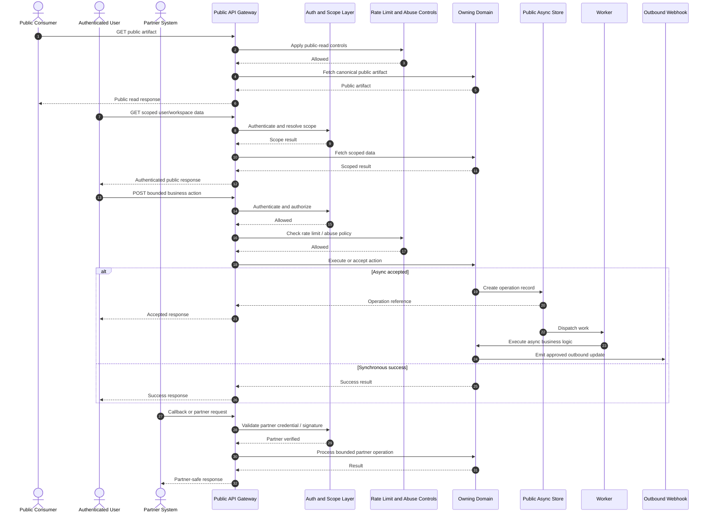

# PUBLIC_API_SPEC.md
Canonical Public API Specification for FUZE.ac

## 1. Title

**PUBLIC_API_SPEC.md**  
Canonical Public API Specification for the FUZE Platform

---

## 2. Document Metadata

- Document Name: `PUBLIC_API_SPEC.md`
- Document Type: Shared public / external interface specification
- Status: Canonical Draft for Source-of-Truth Use
- Governing Registries:
  - `DOCS_SPEC.md`
  - `SYSTEM_SPEC_INDEX.md`
- Primary Implementation Repo: `fuze-backend-api`
- Primary Consumer Classes:
  - external integrators
  - public clients
  - partner systems
  - authenticated end-user clients
  - public transparency consumers
- Related Repos:
  - `fuze-frontend-webapp`
  - `fuze-frontend-admin`
  - `fuze-contracts`
  - `fuze-public-registry`
  - `fuze-specs`
  - `fuze-sdk` (future derived surface)
- Specification Layer: Public / external contract layer
- Intended Folder: `fuze.ac > docs > system-spec`
- Related Specifications:
  - `API_ARCHITECTURE_SPEC.md`
  - `INTERNAL_SERVICE_API_SPEC.md`
  - `EVENT_MODEL_AND_WEBHOOK_SPEC.md`
  - `IDEMPOTENCY_AND_VERSIONING_SPEC.md`
  - `MIGRATION_AND_BACKWARD_COMPATIBILITY_SPEC.md`

---

## 3. Purpose

This document defines the canonical public API specification architecture of the FUZE ecosystem. Its purpose is to establish what parts of the FUZE platform may be exposed to external consumers, how public APIs differ from internal platform and product APIs, what safety and stability requirements apply to external-facing interfaces, and how public API design should preserve architectural clarity around identity, products, Platform Credits, transparency, registry data, and payout-related public information.

FUZE is a multi-product, transparency-first platform ecosystem rather than a closed single-application stack. Over time, external consumers may include public frontend clients, partner integrations, ecosystem services, external developers, selected enterprise consumers, public transparency surfaces, and holder-facing information clients. Public API design therefore cannot be treated as a thin export layer added after the fact. It must be aligned with platform ownership, security, privacy, stability, auditability, and trust-sensitive architectural boundaries from the beginning.

This specification defines the public API layer as a curated external contract surface, not as a raw mirror of internal services.

---

## 4. Scope

This specification covers:

- the canonical role of public APIs in the FUZE ecosystem
- the distinction between public APIs, first-party app APIs, internal service APIs, admin/control APIs, and event-driven integrations
- what kinds of capabilities are appropriate for public exposure
- what domains should remain restricted or indirect rather than publicly writable
- authentication, authorization, rate limiting, abuse resistance, visibility, and stability expectations for public-facing APIs
- public API treatment for identity-aware reads, product access, wallet-aware context, transparency surfaces, registry lookups, and payout-related views
- how public APIs should handle canonical public artifacts versus derived public read models
- versioning, deprecation, and compatibility principles for externally consumed FUZE APIs
- security, auditability, and failure-handling requirements for public API operations
- architecture-level route family design for public surfaces

This specification does **not** define every route path, every schema field, or every SDK class. Those are refined in downstream domain API specs, product API specs, OpenAPI / AsyncAPI contracts, and implementation documents.

---

## 5. Source-of-Truth Inputs

### 5.1 Governing FUZE docs

The following docs-level sources govern this specification:

- `DOCS_SPEC.md`
- `FUZE_WHITEPAPER_v.2026.3.0.1.pdf`
- `FUZE_CHAIN_ARCHITECTURE.md`
- `FUZE_PLATFORM_CREDITS.md`
- `STABLECOIN_PROFIT_PARTICIPATION.md`
- `TOKEN_CONTRACT_ARCHITECTURE_.md`

### 5.2 Governing FUZE system specs

The following system-spec sources govern this specification:

- `SYSTEM_SPEC_INDEX.md`
- `SYSTEM_BOUNDARY_AND_OWNERSHIP_SPEC.md`
- `SYSTEM_OVERVIEW_AND_BOUNDARIES_SPEC.md`
- `PLATFORM_ARCHITECTURE_SPEC.md`
- `DOMAIN_OWNERSHIP_MATRIX_SPEC.md`
- `DATA_MODEL_AND_ENTITY_OWNERSHIP_SPEC.md`
- `ONCHAIN_OFFCHAIN_RESPONSIBILITY_SPEC.md`
- `API_ARCHITECTURE_SPEC.md`
- `AUTH_SESSION_AND_LINKED_LOGIN_SPEC.md`
- `ROLE_PERMISSION_AND_ACCESS_CONTROL_SPEC.md`
- `PLATFORM_CREDITS_SPEC.md`
- `SUBSCRIPTIONS_AND_USAGE_BILLING_SPEC.md`
- `PAYMENT_RAILS_INTEGRATION_SPEC.md`
- `PUBLIC_CONTRACT_AND_WALLET_REGISTRY_SPEC.md`
- `TRANSPARENCY_REPORTING_SPEC.md`
- `PAYOUT_LEDGER_SPEC.md`
- `SECURITY_AND_RISK_CONTROL_SPEC.md`
- `PAYMENT_FRAUD_AND_ABUSE_PREVENTION_SPEC.md`
- `EVENT_MODEL_AND_WEBHOOK_SPEC_refreshed.md`
- `IDEMPOTENCY_AND_VERSIONING_SPEC.md`

### 5.3 Highest-priority interpretation inputs

When conflicts arise, the following are treated as highest priority for this document:

1. `SYSTEM_BOUNDARY_AND_OWNERSHIP_SPEC.md`
2. `SYSTEM_OVERVIEW_AND_BOUNDARIES_SPEC.md`
3. `PLATFORM_ARCHITECTURE_SPEC.md`
4. `DOMAIN_OWNERSHIP_MATRIX_SPEC.md`
5. `DATA_MODEL_AND_ENTITY_OWNERSHIP_SPEC.md`
6. `ONCHAIN_OFFCHAIN_RESPONSIBILITY_SPEC.md`
7. docs-level conflict order from `DOCS_SPEC.md`

### 5.4 Supporting external references

The following external references inform best practices but do not override FUZE source-of-truth rules:

- OpenAPI Specification guidance
- current IETF draft guidance for the `Idempotency-Key` HTTP header
- OWASP API Security Top 10 (2023)
- Mermaid syntax guidance for flowchart, sequence diagrams, and ER diagrams

---

## 6. Governing Architecture and Ownership Interpretation

### 6.1 Core interpretation

FUZE public APIs are not the default interface for all capabilities. They are selected, supportable external contracts intentionally exposed where external use is valid and safe. Public APIs must remain narrower than internal platform and admin surfaces because FUZE contains trust-sensitive economic, governance, treasury, payout, and control-plane functions that must not leak into generic external access patterns.

### 6.2 Why this API belongs to a distinct public layer

A distinct public API layer is necessary because public consumers differ materially from internal services and first-party interfaces:

- callers may be less trusted
- usage patterns may be unpredictable
- compatibility obligations are stronger
- abuse risk is higher
- security and data-exposure consequences are broader
- external developers may assume long-term support once a route is published

Public API designation is therefore a deliberate product and architecture choice, not an accidental result of having an endpoint.

### 6.3 Why other domains do not own this specification

- Product domains do not own it because product public surfaces must still respect shared platform and public-interface rules.
- Frontend repos do not own it because frontend surfaces consume public APIs but do not define their exposure or mutation authority.
- `fuze-contracts` does not own it because on-chain interfaces are bounded chain contracts, not the whole external API model.
- `fuze-sdk` does not own it because SDKs are derived packaging artifacts built from approved public contracts.

### 6.4 Platform constraints that shape the final design

This public API design is constrained by the following FUZE rules:

- backend domains own durable truth
- frontend surfaces must not become shadow owners of business state
- FUZE token, Platform Credits, payout execution, treasury, and governance must remain distinct
- on-chain and off-chain responsibility boundaries must remain explicit
- public write capabilities should express bounded business actions, not raw internal mutation primitives
- public transparency and registry surfaces may be broad in readability but narrow in mutability
- reporting and transparency views may be public, but they must not redefine underlying canonical truth

---

## 7. Domain Responsibilities

### 7.1 Public API layer responsibilities

The public API layer is responsible for:

- exposing intentionally public, supportable, versioned external contracts
- clearly distinguishing public read, authenticated user, partner, and product-access surfaces
- preserving security, privacy, rate-limit, and abuse-control expectations for public consumers
- ensuring that public interfaces align with canonical domain ownership
- ensuring public route stability and deprecation discipline
- ensuring public responses distinguish canonical public artifacts from derived summaries

### 7.2 Platform-owned public API responsibilities

Platform-owned public APIs may include:

- account and self-context reads under authenticated scope
- workspace membership and entitlement reads under authenticated scope
- wallet-link and wallet-aware participation status reads
- credits balance and credits history reads under proper scope
- subscription, invoice, and receipt retrieval under proper scope
- public metadata and product catalog reads
- public contract and wallet registry reads
- public transparency and payout-status reads
- approved public business-action entrypoints such as workspace creation, wallet-link initiation, checkout initiation, or controlled product request submission

### 7.3 Product-owned public API responsibilities

Product domains may expose externally consumable APIs only when the product contract is intentionally designed for external use.

Examples:
- request submission for product jobs
- status-check endpoints for accepted async operations
- result retrieval for caller-owned artifacts
- safe partner-read endpoints for product outputs

These remain product-owned but must fit the public API rules defined here.

### 7.4 Restricted domain responsibilities

The following remain non-public or only indirectly exposed:

- treasury and vault action execution
- governance-sensitive control actions
- raw Platform Credits issuance, arbitrary adjustment, arbitrary reversal, or arbitrary release
- payout entitlement authoring or eligibility editing
- workflow replay or provider failover controls
- fraud resolution and sensitive operator overrides
- raw service-to-service orchestration controls

---

## 8. Out of Scope

This specification does not define:

- every downstream route path and schema
- internal service-to-service contracts
- exact admin/control-plane API design
- exact OAuth, session, or token format implementation
- exact webhook signing implementation details
- exact SDK package structure
- exact monetization or public quota pricing
- exact chain ABI and contract method design
- exact per-product public route inventory
- exact event registry naming

Those details belong in downstream domain API specs, product API specs, OpenAPI / AsyncAPI files, and implementation documents.

---

## 9. Canonical Entities and Data Ownership

This section defines the minimum architecture-level entities required to govern public API behavior coherently.

### 9.1 Public surface entities

| Entity | Purpose | Canonical Owner |
|---|---|---|
| `public_api_surface` | Top-level definition of a public interface family | Platform public API governance |
| `public_api_operation` | Operation-level public contract definition | Owning domain + platform API governance |
| `public_visibility_class` | Defines public, authenticated, partner, or limited-public visibility | Platform public API governance |
| `public_contract_version` | Tracks externally supported contract versions | Platform public API governance |

### 9.2 Caller and scope entities

| Entity | Purpose | Canonical Owner |
|---|---|---|
| `public_client` | External application or partner client registration | Identity / access domain |
| `public_client_credential` | Client authentication material metadata | Identity / security domain |
| `public_access_scope` | Declared account, workspace, product, or partner scope | Access control domain |
| `public_request_lineage` | Public request trace and correlation record | Platform request layer |

### 9.3 Abuse and policy entities

| Entity | Purpose | Canonical Owner |
|---|---|---|
| `rate_limit_policy` | Route- or surface-family rate control | Control / security layer |
| `abuse_signal` | Detection of suspicious or disallowed usage patterns | Security / abuse-prevention layer |
| `public_idempotency_record` | Replay protection for public mutations where required | Owning mutation domain |
| `public_deprecation_notice` | Sunset and migration messaging state | Platform API governance |

### 9.4 Public artifact entities

| Entity | Purpose | Canonical Owner |
|---|---|---|
| `public_registry_entry` | Publicly published contract or wallet metadata | Registry domain |
| `public_transparency_artifact` | Published transparency report or related public artifact | Transparency reporting domain |
| `public_payout_cycle_view` | Publicly exposed payout status or summary | Payout-ledger / transparency domain |
| `public_product_metadata` | Public product listing and discovery metadata | Product catalog / public metadata domain |

### 9.5 Ownership rules

- Public artifacts remain owned by the domain that publishes them; public APIs are the exposure mechanism, not the owner of the underlying fact.
- Public request lineage and rate-limit state are platform-governed cross-cutting entities.
- Platform Credits balances remain credits-domain truth even when exposed via public authenticated reads.
- Registry and transparency surfaces may be public and canonical at the publication layer, but they still do not collapse chain truth, payout execution truth, and internal accounting truth into one object.

---

## 10. State Model and Lifecycle

### 10.1 Public API surface lifecycle

`proposed -> approved -> published -> active -> deprecated -> sunset -> retired`

### 10.2 Public request lifecycle

`received -> authenticated_or_public -> authorized_if_needed -> validated -> processed -> responded -> traced`

### 10.3 Public async operation lifecycle

`received -> authenticated_or_public -> authorized_if_needed -> validated -> accepted -> queued -> executing -> completed | failed | cancelled`

### 10.4 Public artifact publication lifecycle

`prepared -> approved_for_publication -> published -> active -> superseded | archived`

### 10.5 Deprecation lifecycle

`active -> deprecation_announced -> migration_window -> sunset_enforced -> retired`

### 10.6 Important lifecycle rule

Public route publication changes compatibility obligations. Once an interface is published as public, deprecation must be explicit and migration-aware.

---

## 11. API Surface Overview

FUZE public APIs must be structured into clearly understood external surface families.

### 11.1 Public read APIs

Public or partner-safe read surfaces exposing intentionally visible ecosystem data.

Examples:
- public contract and wallet registry reads
- public transparency report catalog and artifact retrieval
- public payout-ledger summaries and cycle status views
- public platform metadata
- public product catalog or ecosystem directory views

### 11.2 Authenticated user public APIs

Externally consumable APIs used by authenticated users or client applications under explicit identity scope.

Examples:
- account profile reads
- workspace-scoped membership and entitlement reads
- credits balance and credits history reads
- subscription plan and billing-state reads
- invoice and receipt retrieval
- wallet-link status reads
- async job status for caller-owned operations

### 11.3 Public product access APIs

Selected public product capability surfaces intentionally designed for controlled external consumption.

Examples:
- submit product request
- query job status
- fetch result artifact
- manage caller-owned product objects where approved

### 11.4 Partner / integration APIs

APIs intended for selected external platforms, ecosystem partners, or enterprise integrations.

Examples:
- partner-safe read feeds
- integration callbacks
- partner data-export retrieval
- contract-limited product operation interfaces

### 11.5 Transparency and registry APIs

Read-oriented public trust surfaces.

Examples:
- registry lookup
- payout-cycle public status
- transparency report catalog
- public governance-history summary if explicitly approved
- public contract address references

### 11.6 Surface-family principle

Each public API family may have different expectations for:

- authentication
- authorization
- rate limits
- caching
- compatibility guarantees
- data sensitivity
- abuse controls
- audit expectations

FUZE must not treat all public APIs as one generic access plane.

---

## 12. Authentication and Authorization Model

### 12.1 Authentication postures

FUZE public APIs should support multiple authentication postures according to surface type:

#### A. Unauthenticated public access
Used only for intentionally public read surfaces.

Examples:
- public registry lookup
- published transparency reports
- public product metadata
- public payout-cycle status summaries

#### B. User-authenticated access
Used for account-, workspace-, or user-owned resource access.

Examples:
- profile reads
- credits balance
- workspace views
- wallet-link operations
- job result access
- invoice retrieval

#### C. Partner / client-credential access
Used for external integrations and ecosystem services under explicit agreements or scoped permissions.

Examples:
- partner ingestion
- integration polling
- partner-safe read surfaces
- callback subscription management where allowed

### 12.2 Authorization dimensions

Public API authorization must consider:

- account identity
- workspace role and scope
- product entitlement
- Platform Credits or billing state where relevant
- wallet-aware context where relevant
- partner client scope
- public visibility class
- environment and feature-gating rules

### 12.3 Scope examples

- **Account scope:** personal profile, wallet link, personal Platform Credits, self-owned jobs
- **Workspace scope:** shared billing, memberships, shared balances, workspace-owned product operations
- **Product scope:** product-owned objects, jobs, and results
- **Public transparency scope:** public registry, reports, and payout-ledger public resources

### 12.4 Principle

Public APIs should never rely on identity alone. They must also understand the scope in which the caller is acting and what rights that scope allows.

---

## 13. API Endpoints / Interface Contracts

This architecture-level public specification defines the canonical route families and contract classes rather than every final downstream endpoint.

### 13.1 Canonical public route families

#### A. Public read families
- `/v1/public/metadata/...`
- `/v1/public/products/...`
- `/v1/public/registry/...`
- `/v1/public/transparency/...`
- `/v1/public/payouts/...`

#### B. Authenticated self-context families
- `/v1/public/me/...`
- `/v1/public/workspaces/...`
- `/v1/public/credits/...`
- `/v1/public/billing/...`
- `/v1/public/invoices/...`
- `/v1/public/receipts/...`
- `/v1/public/wallets/...`

#### C. Public product access families
- `/v1/public/qtb/...`
- `/v1/public/aimm/...`
- `/v1/public/zaga/...`
- `/v1/public/aie/...`
- `/v1/public/herhelp/...`
- `/v1/public/botmad/...`
- `/v1/public/toolgrid/...`

#### D. Partner / integration families
- `/v1/partners/...`
- `/v1/integrations/...`

#### E. Webhook-related public families
- partner callback registration / management routes where explicitly approved
- outbound webhook event contracts
- dedicated inbound callback routes for public/partner integrations

### 13.2 Canonical public contract classes

#### Public canonical artifact read
- Purpose: retrieve intentionally published canonical public artifacts
- Examples: registry entries, published transparency reports, public payout cycle records
- Caller types: public or partner-safe
- Side effects: none
- Audit: request trace only unless risk policy requires more

#### Public derived read
- Purpose: retrieve public summaries, dashboards, or simplified views
- Caller types: public or partner-safe
- Side effects: none
- Rule: response must not be mistaken for the underlying canonical owner of all related facts

#### Authenticated self-scope read
- Purpose: retrieve caller-owned or caller-scoped state
- Caller types: authenticated end-user or partner acting on behalf of approved identity scope
- Side effects: none
- Rule: strict scope and authorization evaluation required

#### Public business-action write
- Purpose: initiate a bounded external action
- Examples: create account, create workspace, initiate checkout, submit product request, link wallet
- Caller types: authenticated user or approved partner
- Side effects: domain-owned mutation or accepted async submission
- Rule: public writes express business actions, not raw internal mutation primitives

#### Accepted async public action
- Purpose: accept long-running external work
- Examples: report generation, AI job submission, product analysis request
- Caller types: authenticated user or approved partner
- Response: accepted + operation reference
- Rule: do not pretend accepted means completed

#### Partner-safe callback / webhook contract
- Purpose: allow external integration event delivery or intake
- Caller types: approved partner systems
- Requirements: signing, replay safety, deduplication, version discipline

### 13.3 Public write boundary rule

Public writes should **not** expose internal mutation primitives directly.

Examples of prohibited direct exposure:
- generic `issue_credits`
- generic `adjust_credits`
- generic `reverse_payout_entitlement`
- generic treasury action execution
- generic governance action approval
- generic workflow replay or operator override controls

Public writes should instead express bounded business actions that terminate in domain-owned policy-checked logic.

---

## 14. Request Rules

### 14.1 Request composition rules

Requests must be explicit about:

- caller identity or public posture
- scope
- target resource or operation
- business-action intent for writes
- idempotency key where applicable
- correlation metadata where supported
- requested contract version where relevant

### 14.2 Public mutation rules

Public mutation-capable routes must validate:

- caller identity and scope
- entitlement and plan state where relevant
- product ownership and allowed action semantics
- billing, Platform Credits, or wallet prerequisites where relevant
- policy constraints for regulated or trust-sensitive flows

### 14.3 Public read rules

Public reads must validate:

- whether the requested data is actually public
- whether the route returns canonical public artifacts or derived views
- whether caller scope is sufficient for authenticated reads
- whether property-level filtering is required to prevent overexposure

### 14.4 Replay safety rule

Retry-capable public mutations must be designed with domain-level idempotency semantics rather than assuming network reliability.

---

## 15. Response Rules

### 15.1 Response philosophy

Public API responses must make clear:

- whether the call succeeded, was accepted, or failed
- whether the returned object is canonical public artifact or derived public view
- whether the data is account-, workspace-, product-, or public-scoped
- whether additional async processing remains pending
- the applicable correlation or operation reference when relevant

### 15.2 Minimum response envelope semantics

At minimum, public APIs should be able to carry these concepts:

- success or accepted outcome
- data payload
- error object when needed
- correlation reference
- pagination metadata where relevant
- async operation metadata where relevant
- public artifact classification where confusion is possible

### 15.3 Public async response rule

Accepted async responses must return an operation reference and must not imply final completion.

### 15.4 Public artifact classification rule

Where helpful, public responses should classify resources as one of:

- canonical public artifact
- public reporting artifact
- derived public view
- caller-scoped canonical object
- caller-scoped derived view

---

## 16. Error Model

### 16.1 Error architecture principles

Public errors must communicate:

- machine-readable code
- human-readable message
- category
- retry guidance where appropriate
- correlation reference
- safe contextual detail without leaking sensitive internals

### 16.2 Minimum public error classes

FUZE public errors must distinguish among:

- validation errors
- authentication errors
- authorization errors
- object-level access errors
- entitlement or plan-state denial
- Platform Credits or billing precondition failures
- rate limit / quota errors
- abuse-protection denials
- unsupported operation or contract version errors
- dependency/provider errors
- internal platform errors
- async operation failure states

### 16.3 Sensitive-domain rule

Commercial and payout-adjacent public APIs must return explicit, supportable error classes and must not hide meaningful caller-actionable conditions behind generic failures.

### 16.4 Public exposure rule

Public errors must not leak internal service names, infrastructure details, secrets, internal decision logic, or confidential operator context.

---

## 17. Idempotency and Mutation Safety

### 17.1 Canonical rule

If the same public business mutation is submitted more than once due to retry, replay, duplicate delivery, or transient failure, FUZE should apply it at most once in business meaning.

### 17.2 When idempotency is required

Idempotency is required for public mutations such as:

- account creation where duplicate create semantics are dangerous
- workspace creation where retry may occur
- wallet-link initiation completion where replay is possible
- checkout or purchase initiation follow-through
- product request submission for async or billable actions
- partner callback ingestion
- external public write flows that can trigger billing or Platform Credits outcomes

### 17.3 Architecture-level mechanism

FUZE should support an `Idempotency-Key` style request mechanism for non-idempotent public HTTP mutations where retry safety matters.

### 17.4 Conflict rule

A repeated key with the same business request should return the stable prior outcome where possible. A repeated key with a materially different payload should be treated as a conflict.

---

## 18. Versioning and Compatibility Rules

### 18.1 Versioning philosophy

Public APIs have the strongest compatibility obligations in the FUZE interface stack.

- Public routes must use explicit, stable versioning.
- Breaking changes must not be introduced casually.
- Deprecation must be explicit and time-bounded.
- Public consumers must have migration windows when contract changes matter.

### 18.2 Preferred evolution pattern

- add rather than break when possible
- deprecate explicitly
- preserve migration windows where needed
- document semantic changes clearly
- keep route-family stability even when payloads evolve carefully
- separate public contract change control from internal service evolution pace

### 18.3 Compatibility rule

The more external and partner-consumed a surface is, the stronger its compatibility discipline must be. Public contract stability takes precedence over internal implementation convenience.

---

## 19. Event Emission and Webhook Behavior

### 19.1 Public event philosophy

FUZE may expose selected event-driven public or partner integration patterns, but only for intentionally supported external outcomes.

Examples:
- async product job completed
- public report published
- external integration callback result available
- partner-safe status update emitted

### 19.2 Event ownership rule

Public webhook or event exposure does not transfer ownership of the underlying truth. Events communicate meaningful outcomes from the owning domain outward.

### 19.3 Webhook safety rule

Public and partner webhooks must support:

- signature verification
- replay protection
- deduplication
- version-aware event payloads
- retry discipline
- clear event taxonomy

### 19.4 Restriction rule

Governance-sensitive, treasury-sensitive, and internal operator-control events must not be exposed as ordinary public or partner webhook families by default.

---

## 20. Audit and Activity Requirements

### 20.1 Public request auditability

Public APIs must support:

- request correlation IDs
- actor and scope traceability where authenticated
- route-family classification
- client registration linkage where partner access exists
- idempotency references where relevant
- async operation references for accepted actions
- abuse and rate-limit observability

### 20.2 Activity versus audit distinction

- public activity/history endpoints are user-facing experience surfaces
- audit records remain durable control traces
- public API request logs are not a substitute for full audit records
- public job history is not the same as internal audit lineage

### 20.3 Stronger audit requirement

Platform Credits-adjacent, billing-adjacent, payout-adjacent, partner-ingestion, and abuse-sensitive public APIs require stronger traceability than ordinary public metadata reads.

---

## 21. Data Model and Database Schema View

This section provides the architecture-level relational blueprint needed to support public API discipline in `fuze-backend-api`. Exact schema details belong in downstream domain specs.

### 21.1 Core public API tables

#### `public_api_surfaces`
- `public_api_surface_id` (PK, UUID)
- `surface_name` (unique)
- `surface_family` (enum: public_read, authenticated_user, public_product, partner_integration, transparency_registry, webhook)
- `owning_domain`
- `visibility_class` (enum: public, authenticated, partner, limited_public)
- `status` (draft, active, deprecated, retired)
- `version_reference`
- `created_at`
- `updated_at`

#### `public_api_operations`
- `public_api_operation_id` (PK, UUID)
- `public_api_surface_id` (FK -> `public_api_surfaces.public_api_surface_id`)
- `operation_name`
- `http_method` (nullable for non-HTTP contracts)
- `route_pattern`
- `operation_type` (public_read, authenticated_read, public_write, async_accept, partner_callback, webhook_outbound)
- `owning_domain`
- `sensitivity_class`
- `requires_authentication`
- `requires_idempotency`
- `rate_limit_policy_id` (nullable FK -> `rate_limit_policies.rate_limit_policy_id`)
- `audit_class`
- `status`
- `created_at`
- `updated_at`

#### `public_request_lineage`
- `public_request_id` (PK, UUID)
- `correlation_id` (indexed)
- `public_api_operation_id` (FK -> `public_api_operations.public_api_operation_id`)
- `caller_type` (public, user, partner)
- `caller_reference` (nullable)
- `client_id` (nullable)
- `workspace_id` (nullable)
- `scope_type`
- `scope_reference`
- `received_at`
- `completed_at` (nullable)
- `response_status`
- `error_code` (nullable)
- `rate_limit_outcome` (nullable)
- `abuse_review_status` (nullable)

#### `public_clients`
- `public_client_id` (PK, UUID)
- `client_name`
- `client_type` (partner, enterprise, ecosystem_service, internal_public_consumer)
- `status` (active, suspended, revoked)
- `owner_account_id` (nullable)
- `created_at`
- `updated_at`

#### `public_client_credentials`
- `public_client_credential_id` (PK, UUID)
- `public_client_id` (FK -> `public_clients.public_client_id`)
- `credential_type`
- `credential_fingerprint`
- `status`
- `issued_at`
- `expires_at` (nullable)
- `revoked_at` (nullable)

#### `rate_limit_policies`
- `rate_limit_policy_id` (PK, UUID)
- `policy_name`
- `surface_family`
- `request_window_seconds`
- `max_requests_per_window`
- `burst_limit` (nullable)
- `scope_dimension` (ip, client_id, account_id, workspace_id, hybrid)
- `created_at`
- `updated_at`

#### `public_idempotency_records`
- `public_idempotency_record_id` (PK, UUID)
- `owning_domain`
- `idempotency_key`
- `request_fingerprint`
- `operation_name`
- `caller_reference`
- `scope_reference`
- `first_public_request_id` (FK -> `public_request_lineage.public_request_id`)
- `stored_outcome_reference`
- `status`
- `expires_at` (nullable)
- `created_at`

**Constraints**
- unique constraint on (`owning_domain`, `idempotency_key`)
- fingerprint mismatch with same key must produce conflict semantics

#### `public_async_operations`
- `public_async_operation_id` (PK, UUID)
- `public_request_id` (FK -> `public_request_lineage.public_request_id`)
- `owning_domain`
- `operation_name`
- `status` (accepted, queued, executing, completed, failed, cancelled)
- `accepted_at`
- `started_at` (nullable)
- `completed_at` (nullable)
- `failed_at` (nullable)
- `result_reference` (nullable)
- `failure_code` (nullable)
- `retry_count`
- `workflow_reference` (nullable)
- `job_reference` (nullable)

#### `public_deprecation_notices`
- `public_deprecation_notice_id` (PK, UUID)
- `surface_name`
- `version_reference`
- `announced_at`
- `sunset_at` (nullable)
- `migration_guidance_reference`
- `status`

### 21.2 Public artifact tables

#### `public_registry_entries`
- `public_registry_entry_id` (PK, UUID)
- `artifact_type`
- `display_label`
- `canonical_reference`
- `chain_reference` (nullable)
- `status`
- `published_at`
- `updated_at`

#### `public_transparency_artifacts`
- `public_transparency_artifact_id` (PK, UUID)
- `artifact_kind`
- `title`
- `publication_version`
- `source_reference`
- `published_at`
- `superseded_by` (nullable FK self-reference)

#### `public_payout_cycle_views`
- `public_payout_cycle_view_id` (PK, UUID)
- `payout_cycle_reference` (unique)
- `public_status`
- `funding_state`
- `publication_state`
- `published_at`
- `updated_at`

#### `public_product_metadata`
- `public_product_metadata_id` (PK, UUID)
- `product_key` (unique)
- `display_name`
- `category`
- `status`
- `public_description`
- `public_docs_reference` (nullable)
- `updated_at`

### 21.3 Relationship model

- one `public_api_surface` has many `public_api_operations`
- one `public_api_operation` has many `public_request_lineage` rows
- one `public_client` may have many `public_client_credentials`
- one public request may have zero or one `public_async_operations`
- one public request may link to one `public_idempotency_record`
- public artifact tables are owned by their publication domains and are exposed through public operations, not owned by the public API layer itself

### 21.4 Database design notes

- Keep `public_request_lineage` append-heavy and searchable by `correlation_id`, `client_id`, `caller_reference`, and `received_at`.
- Keep rate-limit policy association explicit rather than inferred from route naming alone.
- Maintain strict distinction between public artifact tables and underlying domain truth tables.
- Do not store sensitive internal operator notes or service topology in public-facing response models.
- Platform Credits balances, invoices, and workspace relationships remain owned by their canonical domains; public tables expose metadata and access discipline, not a shadow ledger.

---

## 22. Architecture Diagram — Mermaid flowchart

```mermaid
flowchart TD
    A[Public Consumers]
    B[Authenticated End Users]
    C[Partner Systems]

    subgraph PUB[Public API Surface Families]
        D[Public Read APIs]
        E[Authenticated User Public APIs]
        F[Public Product Access APIs]
        G[Partner Integration APIs]
        H[Public Webhook / Callback Interfaces]
    end

    subgraph GATEWAY[fuze-backend-api Public Layer]
        I[Public Route Gateway]
        J[Public Auth and Scope Checks]
        K[Rate Limit and Abuse Controls]
        L[Public Contract Versioning]
    end

    subgraph PLATFORM[Platform Domains]
        M[Identity and Access Domain]
        N[Workspace and Roles Domain]
        O[Wallet-Aware Domain]
        P[Billing and Subscription Domain]
        Q[Platform Credits Domain]
        R[Public Metadata Domain]
        S[Registry Publication Domain]
        T[Transparency Reporting Domain]
        U[Payout-Ledger Public View Domain]
    end

    subgraph PRODUCTS[Product Domains]
        V[QTB]
        W[AIMM]
        X[ZAGA]
        Y[AIE]
        Z[HerHelp]
        AA[Botmad]
        AB[ToolGrid]
    end

    subgraph ASYNC[Async and Integration]
        AC[Async Operation Store]
        AD[Workers and Schedulers]
        AE[Partner Callback Intake]
        AF[Event / Webhook Outbound]
    end

    subgraph OUTPUTS[Derived Outputs]
        AG[fuze-public-registry]
        AH[Published Transparency Artifacts]
        AI[Public Payout Status Views]
    end

    A --> D
    B --> E
    B --> F
    C --> G
    C --> H

    D --> I
    E --> I
    F --> I
    G --> I
    H --> AE

    I --> J
    I --> K
    I --> L

    D --> R
    D --> S
    D --> T
    D --> U

    E --> M
    E --> N
    E --> O
    E --> P
    E --> Q

    F --> V
    F --> W
    F --> X
    F --> Y
    F --> Z
    F --> AA
    F --> AB

    G --> M
    G --> N
    G --> P
    G --> Q
    G --> V
    G --> W
    G --> X
    G --> Y
    G --> Z
    G --> AA
    G --> AB

    F --> AC
    G --> AC
    AC --> AD
    AD --> AF

    S --> AG
    T --> AH
    U --> AI
```



---

## 23. Data Design — Mermaid Diagram

```mermaid
erDiagram
    PUBLIC_API_SURFACES ||--o{ PUBLIC_API_OPERATIONS : contains
    PUBLIC_API_OPERATIONS ||--o{ PUBLIC_REQUEST_LINEAGE : records
    PUBLIC_CLIENTS ||--o{ PUBLIC_CLIENT_CREDENTIALS : owns
    PUBLIC_REQUEST_LINEAGE ||--o| PUBLIC_ASYNC_OPERATIONS : may_create
    PUBLIC_REQUEST_LINEAGE ||--o| PUBLIC_IDEMPOTENCY_RECORDS : may_link
    RATE_LIMIT_POLICIES ||--o{ PUBLIC_API_OPERATIONS : applies_to

    PUBLIC_API_SURFACES {
        uuid public_api_surface_id PK
        string surface_name UK
        string surface_family
        string owning_domain
        string visibility_class
        string status
        string version_reference
        timestamp created_at
        timestamp updated_at
    }

    PUBLIC_API_OPERATIONS {
        uuid public_api_operation_id PK
        uuid public_api_surface_id FK
        string operation_name
        string http_method
        string route_pattern
        string operation_type
        string owning_domain
        string sensitivity_class
        boolean requires_authentication
        boolean requires_idempotency
        uuid rate_limit_policy_id FK
        string audit_class
        string status
        timestamp created_at
        timestamp updated_at
    }

    PUBLIC_REQUEST_LINEAGE {
        uuid public_request_id PK
        string correlation_id IDX
        uuid public_api_operation_id FK
        string caller_type
        string caller_reference
        uuid client_id
        uuid workspace_id
        string scope_type
        string scope_reference
        timestamp received_at
        timestamp completed_at
        string response_status
        string error_code
        string rate_limit_outcome
        string abuse_review_status
    }

    PUBLIC_CLIENTS {
        uuid public_client_id PK
        string client_name
        string client_type
        string status
        uuid owner_account_id
        timestamp created_at
        timestamp updated_at
    }

    PUBLIC_CLIENT_CREDENTIALS {
        uuid public_client_credential_id PK
        uuid public_client_id FK
        string credential_type
        string credential_fingerprint
        string status
        timestamp issued_at
        timestamp expires_at
        timestamp revoked_at
    }

    RATE_LIMIT_POLICIES {
        uuid rate_limit_policy_id PK
        string policy_name
        string surface_family
        int request_window_seconds
        int max_requests_per_window
        int burst_limit
        string scope_dimension
        timestamp created_at
        timestamp updated_at
    }

    PUBLIC_IDEMPOTENCY_RECORDS {
        uuid public_idempotency_record_id PK
        string owning_domain
        string idempotency_key
        string request_fingerprint
        string operation_name
        string caller_reference
        string scope_reference
        uuid first_public_request_id FK
        string stored_outcome_reference
        string status
        timestamp expires_at
        timestamp created_at
    }

    PUBLIC_ASYNC_OPERATIONS {
        uuid public_async_operation_id PK
        uuid public_request_id FK
        string owning_domain
        string operation_name
        string status
        timestamp accepted_at
        timestamp started_at
        timestamp completed_at
        timestamp failed_at
        string result_reference
        string failure_code
        int retry_count
        string workflow_reference
        string job_reference
    }

    PUBLIC_DEPRECATION_NOTICES {
        uuid public_deprecation_notice_id PK
        string surface_name
        string version_reference
        timestamp announced_at
        timestamp sunset_at
        string migration_guidance_reference
        string status
    }

    PUBLIC_REGISTRY_ENTRIES {
        uuid public_registry_entry_id PK
        string artifact_type
        string display_label
        string canonical_reference
        string chain_reference
        string status
        timestamp published_at
        timestamp updated_at
    }

    PUBLIC_TRANSPARENCY_ARTIFACTS {
        uuid public_transparency_artifact_id PK
        string artifact_kind
        string title
        string publication_version
        string source_reference
        timestamp published_at
        uuid superseded_by FK
    }

    PUBLIC_PAYOUT_CYCLE_VIEWS {
        uuid public_payout_cycle_view_id PK
        string payout_cycle_reference UK
        string public_status
        string funding_state
        string publication_state
        timestamp published_at
        timestamp updated_at
    }

    PUBLIC_PRODUCT_METADATA {
        uuid public_product_metadata_id PK
        string product_key UK
        string display_name
        string category
        string status
        string public_description
        string public_docs_reference
        timestamp updated_at
    }
```

---

## 24. Flow View

### 24.1 Happy path — public canonical read

1. A public client calls a public read endpoint.
2. The API classifies the route as a public canonical artifact read.
3. If unauthenticated, the API verifies the route truly allows public access.
4. The API fetches the published public artifact from the owning domain or publication store.
5. The API returns the response marked as canonical public artifact where applicable.
6. Public request lineage is recorded.

### 24.2 Happy path — authenticated self-scope read

1. An authenticated caller requests Platform Credits balance or invoice retrieval.
2. The API authenticates the caller and resolves scope.
3. The API checks account or workspace authorization.
4. The owning domain returns canonical scoped state or derived scoped read model.
5. The API responds with scoped data and a correlation reference.

### 24.3 Happy path — public business-action write

1. A caller submits a bounded public action such as wallet-link initiation, workspace creation, or product request submission.
2. The API authenticates if required, validates scope, and enforces route policy.
3. The API validates payload and business preconditions.
4. The API checks idempotency where required.
5. The owning domain performs canonical mutation or accepts async work.
6. The API returns success or accepted response with references.
7. Public request lineage and required audit traces are recorded.

### 24.4 Happy path — accepted async public product request

1. A caller submits a long-running public product request.
2. The API authenticates, authorizes, validates, and checks idempotency.
3. The API creates a durable async operation record.
4. Work is queued for backend execution.
5. The API returns accepted response with operation reference.
6. The caller polls status or receives approved webhook/event update.
7. Result becomes available through caller-scoped retrieval endpoint.

### 24.5 Alternate flow — derived transparency summary

1. A client requests a public transparency summary endpoint.
2. The API resolves a derived reporting view.
3. The response explicitly presents itself as public reporting artifact or derived summary.
4. No canonical internal accounting state is mutated.

### 24.6 Failure flow — unauthorized workspace access

1. An authenticated user requests workspace-scoped public billing state.
2. The API authenticates the user but fails authorization for workspace scope.
3. The API returns authorization error without exposing foreign workspace details.
4. Public request lineage records the denial outcome.

### 24.7 Failure flow — rate-limit or abuse-control block

1. A public client exceeds a policy threshold or triggers sensitive-flow abuse signals.
2. The API applies rate-limit or abuse-protection controls.
3. The API returns rate-limit or abuse-protection error classification.
4. Public request lineage records control outcome.
5. Sensitive business flow is not executed.

### 24.8 Retry / replay flow

1. A client retries a public mutation with the same idempotency key after timeout.
2. The API looks up the public idempotency record in the owning domain.
3. If the payload matches, the prior stable outcome is returned.
4. If the payload differs, a conflict response is returned.
5. Duplicate mutation is prevented.

### 24.9 Partner callback ingestion flow

1. An external partner sends a callback to an approved inbound public or partner route.
2. The API validates signature and client identity.
3. The API validates replay safety and deduplication state.
4. The API records lineage and forwards a bounded event into the owning domain.
5. Duplicate callback does not create duplicate business effect.

---

## 25. Data Flows — Mermaid sequenceDiagram



---

## 26. Security and Risk Controls

### 26.1 Core security principles

- least privilege
- strict distinction between public, authenticated, partner, internal, and admin surfaces
- object-level and function-level authorization checks
- property-level exposure control
- rate limiting and abuse protection
- replay protection for mutation-capable public routes
- safe consumption of partner and external callbacks
- strong inventory management for published public interfaces

### 26.2 Architecture-level controls

- broken object-level authorization must be addressed for every scoped read or write
- broken function-level authorization must distinguish public product actions from restricted control-plane actions
- property-level exposure must be controlled in response shaping, not delegated to ad hoc frontend hiding
- unrestricted access to sensitive business flows must be prevented with route-level design and anti-abuse policy
- public API inventory and deprecation tracking must remain explicit
- unsafe consumption of upstream APIs and callbacks must be mediated through dedicated inbound integration contracts

### 26.3 Sensitive-domain hardening

The following require tighter controls than ordinary public metadata reads:

- Platform Credits and billing reads or writes
- invoice and receipt access
- wallet-link actions
- async billable product requests
- payout-related public status views where user-specific information exists
- partner callback ingestion
- public routes capable of initiating economically meaningful workflows

---

## 27. Operational Considerations

### 27.1 Degraded mode philosophy

Public APIs should support degraded mode without redefining truth.

Examples:
- public transparency summary unavailable while canonical internal state remains healthy
- partner-safe product submission delayed while accepted async requests remain visible
- public catalog reads available even if selected authenticated surfaces degrade
- public payout summaries delayed without changing actual payout execution truth

### 27.2 Observability requirements

Operational monitoring should support:

- request correlation
- caller classification
- client registration attribution
- surface-family attribution
- rate-limit and abuse-control outcomes
- async operation visibility
- public versus partner traffic segmentation
- error-class aggregation
- deprecation usage monitoring

### 27.3 Runtime placement rule

- public HTTP request handling belongs in public request/response entrypoints
- async work belongs in orchestration and worker layers
- partner callback validation belongs in dedicated inbound integration layers
- public artifact publication belongs in reporting, registry, and publication domains
- public APIs should never host raw control-plane logic in route handlers

---

## 28. Acceptance Criteria

1. The specification explicitly distinguishes public read, authenticated user, public product access, partner/integration, and transparency/registry surface families.
2. The specification clearly distinguishes public APIs from first-party app APIs, internal service APIs, and admin/control APIs.
3. The specification explicitly states that public write APIs must express bounded business actions rather than raw internal mutation primitives.
4. The specification preserves separation among FUZE token, Platform Credits, payout execution, treasury, governance, and transparency layers.
5. The specification identifies domains suitable for public exposure and domains that must remain restricted.
6. The specification defines authentication and scope-aware authorization expectations for public APIs.
7. The specification defines public error, idempotency, versioning, and compatibility rules.
8. The specification includes a concrete architecture-level database schema view with identifiable tables, keys, and constraints.
9. The specification includes a Mermaid architecture diagram that matches the public-surface ownership model.
10. The specification includes a Mermaid data-design diagram that matches the schema view.
11. The specification includes a flow view and Mermaid sequence diagram covering public reads, authenticated reads, public writes, async product requests, authorization failure, rate-limit/abuse-control failure, and retry behavior.
12. The specification aligns with the FUZE repository model and assigns primary implementation ownership to `fuze-backend-api`.
13. The specification is usable as a governing source-of-truth file for downstream public-domain API specs and public OpenAPI / AsyncAPI work.
14. The specification includes contract derivation notes suitable for future `fuze-sdk` generation from approved public contracts.

---

## 29. Test Cases

### 29.1 Positive cases

1. **Public registry read succeeds without auth**
   - Given a published registry entry exists
   - When an unauthenticated client calls the public registry lookup endpoint
   - Then the API returns the published registry entry
   - And no internal-only fields are exposed

2. **Authenticated Platform Credits balance read succeeds within scope**
   - Given a user is authenticated and owns an account-scoped Platform Credits balance
   - When they call the authenticated public credits balance read endpoint
   - Then the API returns their scoped balance
   - And the balance remains clearly distinct from FUZE token holdings and payout claims

3. **Public product request can be accepted asynchronously**
   - Given an authenticated user is entitled to a public product request flow
   - When they submit a long-running product request
   - Then the API returns accepted with an operation reference
   - And the result becomes retrievable through status/result flows

### 29.2 Negative cases

4. **Restricted treasury action is not exposed publicly**
   - Given an external client attempts to access a treasury action route
   - Then the route must not exist in the public contract set
   - Or the request must be denied as unsupported / forbidden by design

5. **Raw Platform Credits mutation primitive is rejected**
   - Given an external client attempts to call a generic Platform Credits issue or adjust endpoint
   - Then the design fails review because public routes must not expose raw internal mutation power

6. **Derived summary is not treated as canonical source for internal truth**
   - Given a public transparency summary endpoint exists
   - When a downstream consumer treats it as the canonical owner of internal payout execution state
   - Then the design is considered misleading and fails review unless the artifact is clearly classified

### 29.3 Authorization cases

7. **Workspace-scoped read denied outside membership**
   - Given a user is authenticated but not a member of the requested workspace
   - When they request workspace-scoped invoice or Platform Credits data
   - Then the API returns authorization denial without leaking workspace details

8. **Partner client denied operator-level action**
   - Given a partner client has partner-safe read scope only
   - When it attempts an admin-like or governance-sensitive action
   - Then the action is denied and traced

### 29.4 Idempotency cases

9. **Public write replay with same key returns stable prior outcome**
   - Given a product submission request is retried with the same idempotency key and identical payload
   - Then the same accepted or successful business outcome is returned without duplicate side effects

10. **Public write replay with different payload conflicts**
   - Given a mutation is retried with the same idempotency key but materially different payload
   - Then the API returns conflict and does not apply a second mutation

### 29.5 Concurrency / replay cases

11. **Partner callback replay is safe**
   - Given a partner callback is delivered twice
   - When the second delivery is received
   - Then replay detection prevents duplicate business effect

12. **Async public operation retry does not create second canonical result**
   - Given a worker retries execution of a public async product request
   - Then the operation lineage remains visible
   - And the canonical business action is still applied at most once

### 29.6 Event / webhook cases

13. **Public webhook is limited to approved event families**
   - Given a proposal to expose internal governance-control events through public webhooks
   - Then the proposal is rejected unless an explicit safe external contract is approved

14. **Published public artifact remains retrievable after publication**
   - Given a transparency artifact is published
   - When a public consumer retrieves it through the catalog and artifact endpoint
   - Then the artifact is returned consistently according to version and publication status

### 29.7 Abuse-control / sensitive-flow cases

15. **Sensitive business flow is rate-limited or abuse-controlled**
   - Given repeated automated calls attempt to abuse a public signup or billable product submission flow
   - When thresholds or abuse signals trigger
   - Then the API blocks or throttles the flow without executing the business action

### 29.8 Diagram consistency cases

16. **Architecture Mermaid matches prose**
   - Given the architecture diagram
   - When reviewed against the architecture and ownership sections
   - Then every major node and relationship used in the diagram is supported by the prose

17. **Data Design Mermaid matches schema**
   - Given the ER diagram
   - When reviewed against the schema section
   - Then every entity and relationship in the diagram exists in the schema prose
   - And no additional unsupported entities appear

18. **Sequence diagram matches flow view**
   - Given the sequence diagram
   - When reviewed against the flow section
   - Then public read, scoped read, public write, async, partner callback, and abuse-control concepts remain consistent

---

## 30. Open Questions or Explicit Deferred Decisions

1. Exact token/session format for user-authenticated public APIs is deferred to auth-specific specs.
2. Exact client-credential model and partner onboarding lifecycle are deferred to identity/access and integration-specific specs.
3. Exact route inventory per product public API is deferred to product API specs.
4. Exact webhook event names and payload schemas are deferred to event/webhook contracts.
5. Exact response envelope schema is deferred to downstream OpenAPI work.
6. Exact rate-limit tiers and public monetization model are deferred.
7. Exact anti-bot or abuse-control vendor/tooling choices are deferred.
8. Exact pagination, filtering, and search conventions are deferred to shared contract design.

---

## 31. Implementation Notes for `fuze-backend-api`

### 31.1 Repository placement

`fuze-backend-api` is the primary implementation owner of this specification.

### 31.2 Required backend structure implications

The backend should preserve explicit separation among:

- public request entrypoints
- platform domains
- product domains
- partner integration handlers
- public artifact publication domains
- orchestration and workers
- internal services and admin/control services

### 31.3 Required backend behaviors

- publish only approved public operations from owning domains
- centralize auth, correlation, error envelope, rate-limit, and idempotency middleware where appropriate
- keep public route handlers thin and policy-aware
- support accepted async patterns uniformly
- ensure public responses classify artifact type where needed
- preserve audit and abuse-control lineage for sensitive routes
- maintain a durable inventory of published public routes and versions

---

## 32. Frontend Consumption Notes

### 32.1 `fuze-frontend-webapp`

The webapp may consume:

- approved public metadata and product catalog routes
- authenticated public self-context routes where appropriate
- approved public product request, status, and result routes
- public transparency and registry routes

The webapp must **not**:
- assume every internal first-party route is public
- use public routes as a shortcut around backend-owned scope checks
- rely on public derived views as if they were all canonical internal truth
- access internal service or admin-only APIs through public route naming

### 32.2 `fuze-frontend-admin`

The admin frontend may reference public routes for comparison or public-view verification, but it must not rely on public APIs as its primary operational surface. Admin workflows require separate privileged control APIs.

The admin frontend must **not**:
- use public routes to perform privileged support operations
- use public routes to mutate treasury, governance, payout, or raw Platform Credits state
- treat public API visibility as sufficient for control-plane work

---

## 33. Contract Derivation Notes

### 33.1 OpenAPI / AsyncAPI derivation

This specification should drive the creation of:

- `public.openapi.yaml`
- public route sections for product-specific OpenAPI files where those products intentionally support external consumption
- `partner-webhooks.asyncapi.yaml`
- shared public error and schema registries
- future public contract overlays or packaging artifacts as needed

### 33.2 Derivation rule

Narrative public API specification comes first. Machine-readable public contracts derive from it. Implementation derives from the approved contracts. SDKs derive later from the approved public contracts.

### 33.3 Future `fuze-sdk`

Future SDK packages must derive from approved public or partner-safe contracts only. Internal and admin contracts must not be included in default external SDK surfaces unless explicitly approved.

---

## Closing Summary

FUZE public APIs are curated external contracts that expose intentionally safe, supportable, and versioned capabilities without weakening platform ownership boundaries. They support public transparency and registry access, authenticated user self-service reads, selected product request and result flows, and partner-safe integrations, while keeping governance, treasury, raw Platform Credits mutation, internal orchestration, and payout-authoring controls outside ordinary public exposure. This structure allows FUZE to be open where useful, disciplined where necessary, and durable enough to support long-term external integrations, public trust surfaces, and future SDK generation.
