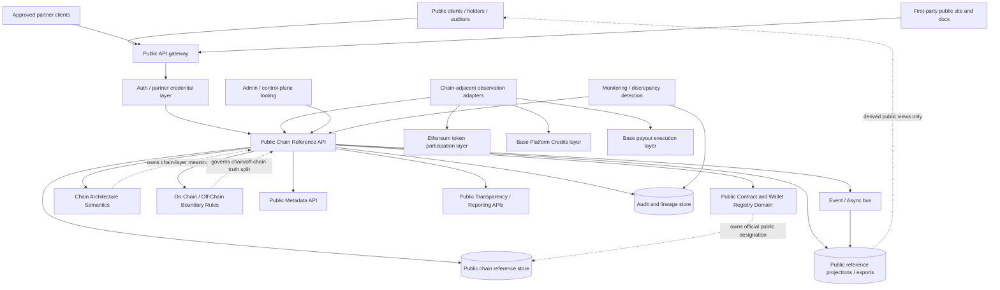
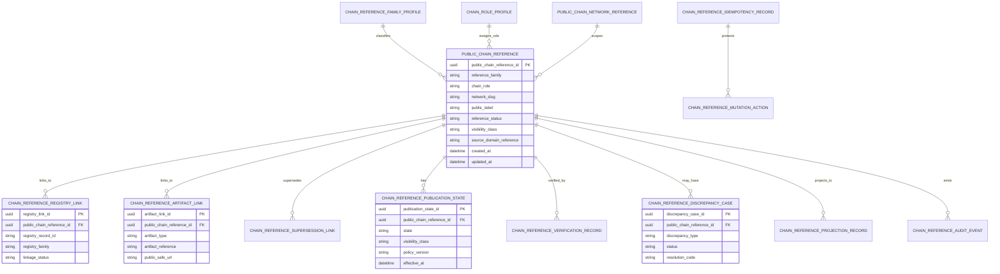
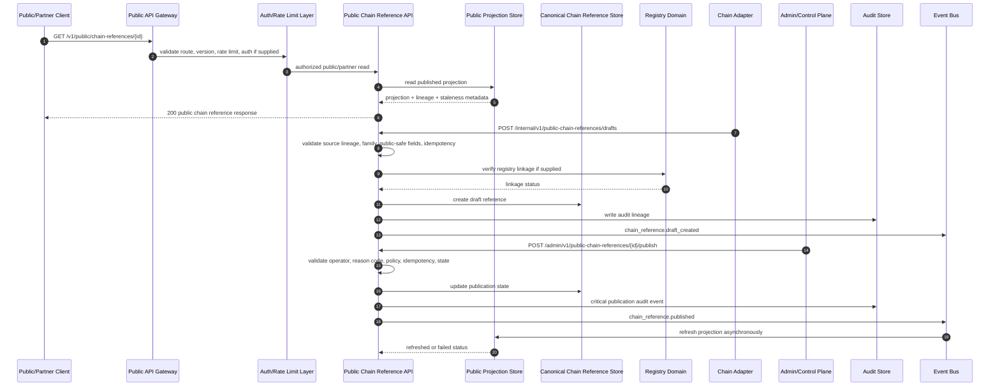

# PUBLIC_CHAIN_REFERENCE_API_SPEC.md

## Title

FUZE Public Chain Reference API Specification

## Document Metadata

- **Document Name:** `PUBLIC_CHAIN_REFERENCE_API_SPEC.md`
- **Document Type:** FUZE API SPEC v2 production-grade API specification
- **Status:** Draft canonical API specification for source-of-truth review
- **Version:** 2.0.0
- **Effective Date:** 2026-04-25
- **Last Updated:** 2026-04-25
- **Reviewed On:** 2026-04-25
- **Document Owner:** FUZE Public Chain Reference API Domain; named individual owner not explicitly specified in the retrieved governing materials
- **Approval Authority:** Not explicitly specified in the retrieved governing materials; constitutional approval remains governed by `REFINED_SYSTEM_SPEC_INDEX.md` and the active FUZE approval workflow
- **Review Cadence:** SHOULD be reviewed quarterly and whenever chain architecture, contract deployments, public registry posture, transparency posture, payout/credits execution posture, governance/treasury controls, public API posture, or chain-adjacent reporting changes materially
- **Governing Layer:** Public-read / public-trust companion API layer for chain-reference publication and discovery
- **Parent Registry:** FUZE API SPEC v2 Canonical File Registry
- **Upstream Semantic Registry:** `REFINED_SYSTEM_SPEC_INDEX.md`
- **Upstream API Registry:** `API_SPEC_INDEX.md`
- **Primary Audience:** Platform architecture, backend engineering, public API authors, contract engineering, chain-adjacent services, registry/publication services, transparency/reporting teams, governance/control-plane teams, security, audit, operations, SDK/OpenAPI authors, implementation-contract authors
- **Primary Purpose:** Define the canonical API contract for public chain references, including public-safe network, contract, role, explorer, deployment, registry-link, verification, publication, correction, supersession, and discrepancy-reference surfaces without turning public references into chain-native truth, registry truth, treasury/governance truth, payout truth, credits truth, wallet-link truth, or raw operational topology
- **Primary Upstream References:** `CHAIN_ARCHITECTURE_SPEC.md`, `ONCHAIN_OFFCHAIN_RESPONSIBILITY_SPEC.md`, `PUBLIC_CONTRACT_AND_WALLET_REGISTRY_SPEC.md`, `PUBLIC_API_SPEC.md`, `API_ARCHITECTURE_SPEC.md`, `PUBLIC_METADATA_API_SPEC.md`, `PUBLIC_REGISTRY_LOOKUP_API_SPEC.md`, `PUBLIC_TRANSPARENCY_API_SPEC.md`, `PUBLIC_PAYOUT_STATUS_API_SPEC.md`, `PUBLIC_CONTRACT_WALLET_REGISTRY_API_SPEC.md`, `EVENT_MODEL_AND_WEBHOOK_SPEC.md`, `IDEMPOTENCY_AND_VERSIONING_SPEC.md`, `MIGRATION_AND_BACKWARD_COMPATIBILITY_SPEC.md`, `AUDIT_LOG_AND_ACTIVITY_SPEC.md`, `SECURITY_AND_RISK_CONTROL_SPEC.md`, `MONITORING_ALERTING_AND_INCIDENT_RESPONSE_SPEC.md`
- **Primary Downstream Dependents:** public website chain-reference surfaces, public metadata surfaces, registry lookup surfaces, transparency pages, payout-status pages, product/public docs surfaces, partner/exchange verification feeds, OpenAPI contracts, SDK read clients, chain-adjacent read-model implementation contracts, monitoring and discrepancy workflows
- **API Surface Families Covered:** public-read, bounded authenticated-read, internal service, admin/control-plane, event/async, reporting/export, chain-adjacent read/reference
- **API Surface Families Excluded:** public write, direct contract mutation, treasury/vault execution, governance approval execution, payout claim execution, credits issuance/spend execution, wallet-link mutation, private signer/custody inventory, raw RPC passthrough, unrestricted partner ingestion
- **Canonical System Owner(s):** Chain Architecture domain for layered chain semantics; Public Contract and Wallet Registry domain for public official address publication; Public Chain Reference API domain for API contract expression and chain-reference publication/read contract posture
- **Canonical API Owner:** FUZE Public Chain Reference API Domain in `fuze-backend-api`, subject to shared API architecture and public API governance
- **Supersedes:** Earlier or weaker interpretations that expose chain references as ad hoc static JSON, frontend-maintained address lists, raw block-explorer links, raw registry exports without publication state, or broad chain metadata endpoints that imply FUZE business truth without source-domain lineage
- **Superseded By:** None currently defined
- **Related Decision Records:** Not explicitly specified in the retrieved governing materials
- **Canonical Status Note:** This API specification is canonical for public chain-reference API contracts. It MUST preserve refined chain architecture, on-chain/off-chain responsibility, public registry, public API, and API architecture rules. It does not own the underlying chain facts, deployment facts, registry publication truth, treasury/governance truth, credits truth, payout truth, or transparency-report truth.
- **Implementation Status:** Draft normative API contract; downstream route families, OpenAPI artifacts, SDK surfaces, public read models, export jobs, admin tooling, and event contracts MUST align before production use
- **Approval Status:** Draft pending explicit FUZE approval workflow
- **Change Summary:** Created API SPEC v2 document for the public chain-reference companion domain; defined public-read route families, chain-reference resources, truth classes, boundary rules, correction and supersession behavior, admin publication controls, event/async implications, audit, idempotency, versioning, diagrams, acceptance criteria, and test cases.

## Purpose

This document defines the canonical FUZE API contract for public chain references.

The Public Chain Reference API exists to expose a safe, stable, public-readable view of FUZE chain architecture references: networks, contract families, officially referenced deployments, chain roles, explorer links, public registry linkages, public artifact linkages, verification posture, publication state, supersession lineage, and discrepancy-safe status.

This API MUST make FUZE chain structure intelligible without becoming the source of every underlying truth. It is a public-read companion surface. It translates approved chain, registry, and public-trust semantics into durable external contracts.

It MUST preserve the following governing interpretation:

1. Ethereum is the canonical FUZE token participation layer.
2. Base is the Platform Credits operational layer where credits state is committed by the approved credits architecture.
3. Base is the stablecoin payout execution layer where payout funding and claim execution are committed by the approved payout architecture.
4. Chain visibility is not the same as off-chain business, policy, accounting, eligibility, reporting, registry, or governance truth.
5. Public chain references explain approved public chain posture; they do not authorize chain actions, expose private control topology, or redefine stronger source domains.

## Scope

This specification governs:

- public-read APIs for approved FUZE chain references
- public network and chain-role reference records
- public contract-reference records and contract-family references
- public official-address references linked to registry records where appropriate
- public-safe deployment, explorer, and chain-role metadata
- publication state, verification state, correction state, supersession state, and discrepancy state for chain references
- bounded authenticated read enrichment for partner or operator-safe contexts where policy allows
- internal service APIs for preparing chain-reference records and projection refreshes
- admin/control-plane APIs for publishing, restricting, superseding, correcting, and resolving public chain-reference records
- event/async behavior for chain-reference publication and refresh
- request, response, error, idempotency, retry, audit, observability, versioning, OpenAPI/SDK, and migration guardrails for this domain

## Out of Scope

This API specification does not govern:

- direct smart-contract ABI design or contract source code
- low-level RPC, indexer, or block explorer implementation
- live transaction submission or contract mutation
- payout claim execution or payout-cycle funding execution
- Platform Credits issuance, spend, reservation, release, reversal, or adjustment execution
- treasury, vault, multisig, timelock, or governance action execution
- wallet-aware user linking or proof-of-control lifecycle
- private wallet inventory, signer topology, custody details, secret-management posture, or operational security records
- full transparency-report authorship and investor/community reporting semantics
- raw database schema beyond API-supporting contract implications
- frontend rendering, static-site generation, or visual presentation details

## Design Goals

1. Provide a stable public API for FUZE chain-reference discovery.
2. Preserve explicit separation between token, credits, payout, reserve, registry, governance, and public-trust roles.
3. Expose public-safe chain references without leaking private operational or security-sensitive details.
4. Distinguish chain-native facts from registry publication facts and public reference facts.
5. Preserve correction, supersession, withdrawal, discrepancy, and historical lineage for public trust.
6. Avoid static address-list drift across frontend, docs, registry, and partner exports.
7. Support partner and public clients with stable, cacheable, versioned, safe read contracts.
8. Keep mutation power internal/admin-only, bounded, audited, reason-coded, and policy-constrained.
9. Support OpenAPI, SDK, public documentation, and external verification surfaces without allowing those derived artifacts to redefine source truth.
10. Make boundary violations testable before production release.

## Non-Goals

- This API is not a generic blockchain explorer.
- This API is not a raw public contract registry replacement.
- This API is not a public chain mutation API.
- This API is not a wallet-link, governance, treasury, payout, credits, or transparency-report owner.
- This API is not a proof that a contract is safe beyond the approved public reference and linked verification posture.
- This API is not a promise that every FUZE-controlled or FUZE-used address is public.
- This API is not an authorization surface for control-plane or chain execution.

## Core Principles

### 1. Public Reference, Not Chain Truth

The API exposes approved public references to chain roles and chain-linked artifacts. Chain-native facts remain chain-native truth. The API MUST NOT imply that a public reference record is itself the canonical source of contract balances, execution state, or chain role mechanics.

### 2. Registry Linkage, Not Registry Replacement

Where a reference identifies an official contract or designated public wallet, it SHOULD link to the canonical public registry record. The chain-reference API MAY summarize registry-safe information, but it MUST NOT replace registry publication truth.

### 3. Layered Chain Clarity

Every public chain reference MUST preserve the layered FUZE model: Ethereum token participation, Base Platform Credits, Base payout execution, and any other future chain roles only when explicitly approved.

### 4. Public-Safe Minimality

Public outputs MUST minimize sensitive operational detail. They may include approved addresses, chain IDs, contract families, roles, explorer URLs, public status, linked registry artifacts, and supersession guidance. They MUST NOT include private signer topology, custody instructions, unpublished deployment inventory, secret names, internal RPC configuration, incident notes, or unapproved control relationships.

### 5. Publication-State Explicitness

A chain reference is not public merely because a contract exists on-chain. Public exposure requires explicit publication state, classification, and lineage.

### 6. Correction Lineage

Corrections, withdrawals, replacements, deprecations, or supersessions MUST preserve historical lineage. Public consumers MUST be able to understand whether a reference is current, deprecated, superseded, withdrawn, or under review.

### 7. Derived Surface Subordination

Public websites, docs pages, SDKs, partner feeds, and cached API projections are downstream to canonical chain-reference records and linked source domains.

### 8. Control-Plane Isolation

Publication, restriction, correction, and supersession operations MUST use internal/admin/control surfaces. No public route may publish or mutate chain-reference truth.

## Canonical Definitions

### Public Chain Reference

A public API resource that describes an approved FUZE chain-related reference, such as a network role, contract family, deployed public contract, designated public wallet reference, chain-layer role, explorer link, registry linkage, or public chain artifact.

### Chain Reference Family

A governed category for a public chain reference, such as `token_layer`, `platform_credits_layer`, `payout_execution_layer`, `reserve_or_vault_layer`, `governance_control_layer`, `public_registry_reference`, `public_chain_artifact`, or `network_reference`.

### Chain Role

The approved business/architecture role represented by a chain reference, such as `ethereum_token_participation`, `base_platform_credits`, `base_payout_execution`, `reserve_vault`, `multisig_control_reference`, or `public_explorer_reference`.

### Public Deployment Reference

A public-safe record linking a chain, network, contract family, and address or artifact reference. It is publication truth, not full deployment truth.

### Registry Linkage

A durable relation from a public chain reference to a public contract/wallet registry entry, where the registry owns official public designation.

### Verification Posture

The API-visible status indicating whether a reference is verified, pending review, deprecated, superseded, withdrawn, or restricted. Verification posture does not replace chain-native execution proof or audit proof.

### Supersession Link

A lineage relation that connects a deprecated, replaced, corrected, or withdrawn chain reference to its successor or explanatory record.

### Chain Discrepancy Case

A review/remediation object representing a mismatch or concern between public chain reference records, registry records, chain observations, transparency artifacts, or source-domain expectations.

### Public-Safe Explorer Link

An approved URL or reference to a block explorer, network page, registry page, documentation page, or public artifact that is safe for external exposure.

## Truth Class Taxonomy

This API MUST preserve the following truth classes:

1. **Semantic truth** — chain architecture meanings and role assignments owned by refined system specs.
2. **API contract truth** — how public chain references are exposed through this API.
3. **Chain-native truth** — balances, events, contract state, transaction receipts, role state, pause state, and other facts committed on-chain.
4. **Registry publication truth** — official public contract/wallet designation and publication state owned by the registry domain.
5. **Policy truth** — approval, visibility, publication, correction, and sensitive-exposure policies.
6. **Runtime truth** — publication jobs, refresh jobs, indexer status, projection lag, and operational state.
7. **Provider/input truth** — raw chain observations, explorer/indexer responses, RPC data, block data, or external evidence before FUZE normalization.
8. **Projection/reporting truth** — public chain-reference indexes, exports, docs pages, caches, public metadata links, and transparency/public-trust outputs.
9. **Audit truth** — immutable records for publication, correction, restriction, supersession, and discrepancy resolution.
10. **Presentation truth** — labels, descriptions, rendered pages, SDK class names, and UI copy.

These truth classes MUST NOT be collapsed. Public chain-reference truth is a publication/read contract, not full chain truth or source business truth.

## Architectural Position in the Spec Hierarchy

This specification sits below:

- `REFINED_SYSTEM_SPEC_INDEX.md`
- `DOCS_SPEC_INDEX.md`
- `SYSTEM_SPEC_INDEX.md`
- `API_SPEC_INDEX.md`
- `SYSTEM_BOUNDARY_AND_OWNERSHIP_SPEC.md`
- `SYSTEM_OVERVIEW_AND_BOUNDARIES_SPEC.md`
- `PLATFORM_ARCHITECTURE_SPEC.md`
- `DOMAIN_OWNERSHIP_MATRIX_SPEC.md`
- `DATA_MODEL_AND_ENTITY_OWNERSHIP_SPEC.md`
- `ONCHAIN_OFFCHAIN_RESPONSIBILITY_SPEC.md`
- `CHAIN_ARCHITECTURE_SPEC.md`
- `API_ARCHITECTURE_SPEC.md`
- `PUBLIC_API_SPEC.md`
- `PUBLIC_CONTRACT_AND_WALLET_REGISTRY_SPEC.md`

It sits alongside or above downstream implementation contracts for:

- public chain-reference OpenAPI artifacts
- SDK public chain-reference clients
- public metadata projections
- public registry lookup integration
- transparency/public-trust site rendering
- partner/exchange chain-reference exports
- chain-reference read-model storage
- admin publication tooling
- event and async contracts

## Upstream Semantic Owners

- **Chain Architecture domain:** owns the layered chain model and chain-role semantics.
- **On-Chain / Off-Chain Responsibility domain:** owns the chain-native versus off-chain/publication boundary model.
- **Public Contract and Wallet Registry domain:** owns official public contract/wallet registry publication truth.
- **Public Metadata domain:** owns generic public metadata publication and discovery where chain references are consumed as metadata.
- **Transparency / Reporting domains:** own transparency artifacts and public-trust explanations that may reference chain records.
- **Treasury / Governance / Vault / Multisig domains:** own sensitive control truths that may be linked publicly only through approved public-safe references.
- **Payout / Credits / Token domains:** own their domain-specific economic truth and execution semantics.

## API Surface Families

### Public-Read Surface

Public unauthenticated reads MAY expose published chain references, chain layers, public contract-reference details, public registry linkages, and public-safe explorer links.

### Bounded Authenticated-Read Surface

Authenticated reads MAY expose actor-safe or partner-safe enrichment, such as additional status fields or integration metadata, only when policy allows and no private control detail is leaked.

### Internal Service Surface

Internal services MAY create drafts, refresh references, attach linked artifacts, import normalized chain observations, and prepare public projections. They MUST NOT bypass owner-domain validation or registry/publication rules.

### Admin / Control-Plane Surface

Admin/control-plane APIs MAY publish, restrict, withdraw, supersede, correct, or resolve discrepancy cases. These operations MUST be reason-coded, audited, policy-constrained, and separated from public routes.

### Event / Async Surface

Events MAY announce chain-reference creation, publication, correction, supersession, restriction, withdrawal, discrepancy opening/resolution, projection refresh, and export publication. Events communicate lifecycle outcomes; they do not become owner truth.

### Reporting / Export Surface

Exports MAY provide partner-safe or public site-safe chain-reference bundles. Exports are derived artifacts and MUST preserve lineage, versioning, and publication-state filtering.

### Chain-Adjacent Surface

Chain-adjacent adapters MAY provide normalized chain observations and verification inputs. Raw provider/RPC/indexer input MUST NOT directly mutate public chain-reference truth without normalization and owner-controlled validation.

## System / API Boundaries

This API governs public chain-reference API contracts only. It does not own:

- chain-native contract truth
- actual deployment truth beyond approved publication references
- private signer/custody/security topology
- registry publication truth for official designation
- wallet-link truth
- credits, payout, token, treasury, or governance semantics
- transparency report narrative truth
- product entitlement or account authorization truth

## Adjacent API Boundaries

- `PUBLIC_REGISTRY_LOOKUP_API_SPEC.md` owns registry lookup API semantics; this API may link to registry records and summarize chain-reference context.
- `PUBLIC_METADATA_API_SPEC.md` owns generic public metadata discovery; this API owns chain-reference-specific resource contract semantics.
- `PUBLIC_TRANSPARENCY_API_SPEC.md` owns public transparency publication views; this API may expose chain references used by transparency artifacts.
- `PUBLIC_PAYOUT_STATUS_API_SPEC.md` owns public payout status; this API may expose public payout-contract references but not payout status truth.
- `PUBLIC_CONTRACT_WALLET_REGISTRY_API_SPEC.md` owns public official contract/wallet registry API semantics; this API consumes registry truth where public chain references identify official contracts or wallets.
- `CHAIN_ARCHITECTURE_API_SPEC.md` owns the broader chain architecture API posture; this API is the narrower public-read companion for external/public chain-reference consumption.

## Conflict Resolution Rules

1. Active refined registry and higher constitutional materials win over narrower documents.
2. `CHAIN_ARCHITECTURE_SPEC.md` wins on Ethereum/Base layer-role semantics.
3. `ONCHAIN_OFFCHAIN_RESPONSIBILITY_SPEC.md` wins on chain-native versus off-chain/publication responsibility.
4. `PUBLIC_CONTRACT_AND_WALLET_REGISTRY_SPEC.md` wins on official public contract/wallet designation and registry publication truth.
5. `API_ARCHITECTURE_SPEC.md` wins on API surface family, accepted-state, idempotency, and boundary discipline.
6. `PUBLIC_API_SPEC.md` wins on public exposure, compatibility, public-safe error, and public-read narrowing rules.
7. Domain specs for payout, credits, token, treasury, governance, vault, multisig, and transparency win on their own semantics.
8. This API wins only on public chain-reference API contract expression.
9. Public references, caches, exports, SDKs, and frontend pages never win over owner-domain truth.
10. If ambiguity remains, choose the more conservative public-safe and architecture-consistent interpretation and require recorded refinement before expansion.

## Default Decision Rules

1. Chain references default to unpublished until explicitly approved.
2. Ambiguous network, chain, or contract roles default to not-public or review-required.
3. A chain address is not official merely because it appears on-chain or in a transaction.
4. Registry-linked official references require valid registry lineage.
5. Deprecated or replaced references preserve historical visibility with successor guidance unless policy requires withdrawal.
6. Private wallet, signer, custody, RPC, secret, and incident details default to non-public.
7. Raw chain observations default to input truth until normalized.
8. Public chain-reference projections default to derived views.
9. Admin/publication actions default to reason-coded, audited, and idempotent.
10. If the API cannot state what is chain-native, registry-owned, public-reference-owned, or derived, the API design is incomplete.

## Roles / Actors / API Consumers

### Public Consumers

- public users
- holders
- community observers
- external auditors
- block-explorer users
- public documentation readers
- public site clients

### Authenticated Consumers

- authenticated users needing actor-safe chain context
- approved partners needing stable public-safe reference enrichment
- internal FUZE clients under public-compatible scope

### Internal System Consumers

- registry services
- public metadata services
- transparency/reporting services
- chain-adjacent adapter services
- public site/export pipelines
- monitoring/discrepancy services

### Admin / Control Consumers

- platform operators
- publication reviewers
- governance/control reviewers
- security reviewers
- audit/remediation operators

## Resource / Entity Families

### Canonical API Resources

- `public_chain_reference`
- `chain_reference_family_profile`
- `chain_role_profile`
- `public_chain_network_reference`
- `public_contract_reference`
- `public_wallet_reference`
- `public_explorer_reference`
- `chain_reference_registry_link`
- `chain_reference_artifact_link`
- `chain_reference_publication_state`
- `chain_reference_verification_posture`
- `chain_reference_supersession_link`
- `chain_reference_discrepancy_case`
- `chain_reference_projection_record`
- `chain_reference_mutation_action`

### Derived / Projection Resources

- `public_chain_reference_index_view`
- `public_chain_reference_bundle_export`
- `public_chain_reference_status_view`
- `partner_chain_reference_feed`
- `public_docs_chain_reference_projection`

### Audit / Operation Resources

- `chain_reference_operation`
- `chain_reference_idempotency_record`
- `chain_reference_audit_event`
- `chain_reference_projection_job`
- `chain_reference_discrepancy_review`

## Ownership Model

The Public Chain Reference API domain owns:

- API contract expression for public chain-reference read and publication-management surfaces
- public chain-reference resource taxonomy
- public chain-reference publication and visibility API posture
- chain-reference API route-family rules
- public-safe response classification
- API-level correction, supersession, and discrepancy contract behavior
- event and export contract posture for chain-reference lifecycle outcomes

It does not own:

- actual chain-native contract state
- official registry publication truth
- private deployment inventories
- contract ABI/source internals
- wallet-link semantics
- payout, credits, treasury, governance, vault, multisig, transparency, or product truth

## Authority / Decision Model

- Chain Architecture authority determines whether a role belongs to Ethereum, Base, or another approved chain role.
- On-chain/off-chain responsibility authority determines whether a fact is chain-native, off-chain policy, execution, reporting, or public-reference truth.
- Registry authority determines official public designation for contracts and designated wallets.
- Public Chain Reference API authority determines how approved chain references are represented through this API.
- Admin/control authority may approve, restrict, correct, or remediate public publication under policy but MUST NOT become chain-native or registry truth owner.
- Public consumers have no mutation authority.

## Authentication Model

### Public Reads

Published public chain-reference routes MAY be unauthenticated. They MUST apply public API rate limits, information minimization, and abuse controls.

### Authenticated Reads

Bounded enrichments require authenticated session, partner credentials, or approved service identity depending on surface family. Authentication does not by itself grant access to non-public operational or control detail.

### Internal Service Routes

Internal routes require service identity, route-level permission, least privilege, environment constraints, and audit lineage for mutation-capable operations.

### Admin / Control Routes

Admin routes require privileged operator identity, explicit permission, reason code, policy version where relevant, idempotency key, correlation ID, and audit emission.

## Authorization / Scope / Permission Model

Authorization MUST evaluate:

- caller posture: public, authenticated user, partner, internal service, admin/control
- route family and visibility class
- target resource publication state
- chain-reference family and sensitivity class
- registry-link sensitivity
- artifact-link sensitivity
- requested operation class
- policy version and approval state for mutation-capable operations
- environment and rollout posture

Public users MAY read only `published_public` records. Authenticated users MAY read only records whose visibility allows their scope. Partners MAY read partner-safe feeds only when scoped and approved. Internal services MAY prepare records only for authorized families. Admin/control operators MAY publish or restrict only within their permission boundary and policy constraints.

## Entitlement / Capability-Gating Model

Public chain-reference reads ordinarily do not require entitlement. Partner feeds, authenticated enrichments, bulk exports, high-volume access, or pre-release/reference-review surfaces MAY require capability gates.

Entitlement checks MUST NOT be confused with registry truth, chain truth, or authorization. Capability gating controls access to an API surface; it does not make the caller an owner of chain-reference state.

## API State Model

### Public Chain Reference Lifecycle

`draft -> review_required -> verified -> published_public | published_authenticated | restricted -> deprecated | superseded | withdrawn | archived`

### Verification Posture

`unverified -> pending_verification -> verified -> verification_expired -> disputed -> corrected -> revoked`

### Discrepancy Lifecycle

`opened -> triaged -> under_review -> correction_prepared -> resolved -> closed | escalated`

### Projection Lifecycle

`stale -> refresh_requested -> refreshing -> refreshed -> failed_retryable | failed_terminal`

### Operation State

`requested -> validated -> accepted -> applied -> previously_applied -> conflicted -> failed_retryable -> failed_terminal -> compensated`

## Lifecycle / Workflow Model

1. A chain reference is observed, proposed, or imported from a source-domain process.
2. Internal service validates family, chain role, network, registry linkage, public-safe fields, and source-domain lineage.
3. Draft public chain-reference record is created with explicit visibility and verification posture.
4. Registry/domain links are attached where applicable.
5. Admin/control reviewer approves publication, restriction, correction, or supersession with reason code.
6. Public projections refresh asynchronously.
7. Public and partner consumers read published views.
8. Events announce lifecycle changes where applicable.
9. Discrepancies are opened when chain observations, registry records, public references, or transparency artifacts diverge.
10. Corrections or supersessions preserve lineage rather than silent overwrite.

## Architecture Diagram — Mermaid flowchart

## Data Design — Mermaid Diagram

## Flow View

### Public Read Flow

1. Public caller requests a chain-reference list or detail route.
2. API validates route version, query filters, and rate-limit posture.
3. API reads only published public projection records.
4. API response identifies chain role, network, reference family, publication state, registry linkage, artifact links, supersession guidance, and staleness metadata where relevant.
5. API emits access telemetry as required by public API risk policy.

### Authenticated / Partner Read Flow

1. Caller authenticates with session or partner credentials.
2. API validates scope, partner allowance, capability gates, and allowed enrichment profile.
3. API reads published or partner-safe projection data.
4. API filters sensitive fields and returns bounded enrichment only.
5. API records request lineage for partner/high-volume/sensitive reads.

### Internal Preparation Flow

1. Internal chain-adjacent or registry service proposes a reference.
2. API validates source-domain lineage, chain family, network, role, visibility target, public-safe fields, and registry linkage.
3. API creates or updates draft reference with idempotency protection.
4. API emits internal event and audit lineage.
5. Admin/control review is required before publication.

### Admin Publication Flow

1. Operator requests publish/restrict/supersede/correct action.
2. API validates operator permission, reason code, policy version, idempotency key, resource state, and conflict constraints.
3. API applies publication mutation or returns conflict/rejection.
4. API emits audit event and lifecycle event.
5. Projection refresh executes asynchronously.
6. Public response surface updates after projection refresh.

### Discrepancy Flow

1. Monitoring or internal service identifies mismatch among chain observation, registry record, public reference, or transparency artifact.
2. API opens discrepancy case with source evidence and lineage.
3. Operator triages and resolves through correction, supersession, restriction, or no-op closure.
4. API preserves case lineage and emits events.
5. Public outputs are updated only after approved resolution.

## Data Flows — Mermaid sequenceDiagram

## Request Model

### Common Headers

- `X-Correlation-ID` SHOULD be accepted on all routes and MUST be generated if absent.
- `Idempotency-Key` MUST be required for mutation-capable internal/admin operations.
- `Accept-Version` or path version MUST identify the contract version.
- Auth headers are required for authenticated, partner, internal, and admin routes.

### Public Read Request Fields

Public reads MAY include:

- `reference_family`
- `chain_role`
- `network_slug`
- `publication_state`
- `registry_record_id`
- `include_superseded`
- `include_artifact_links`
- `page_size`
- `page_token`

Public callers MUST NOT be able to request unpublished/private records by guessing identifiers.

### Internal Draft Request Fields

Internal creation/update requests MUST include:

- `reference_family`
- `chain_role`
- `network_slug`
- `public_label`
- `source_domain_reference`
- `visibility_target`
- `verification_input_reference`
- optional `address` when public-safe and approved
- optional `contract_family`
- optional `registry_record_id`
- optional `artifact_links`
- `idempotency_key`
- `correlation_id`

### Admin Mutation Request Fields

Admin publish/restrict/supersede/correct requests MUST include:

- `reason_code`
- `operator_note`
- `policy_version`
- `idempotency_key`
- `correlation_id`
- operation-specific target fields such as `visibility_target`, `replacement_reference_id`, `restriction_mode`, or `resolution_code`

## Response Model

### Public Reference Response

A successful public detail response SHOULD include:

- `public_chain_reference_id`
- `reference_family`
- `chain_role`
- `network`
- `public_label`
- `public_description`
- `publication_state`
- `verification_posture`
- `registry_links`
- `artifact_links`
- `explorer_links`
- `supersession`
- `last_publication_update_at`
- `projection_staleness`
- `canonicality_notice`

### Canonicality Notice

Responses MUST clearly state whether the resource is:

- public-reference truth
- registry-linked publication truth
- chain-native fact summary
- derived projection
- deprecated/superseded/withdrawn historical reference

### Accepted Admin Response

If projection refresh is async, admin mutation responses MUST distinguish accepted/applied mutation from projection completion:

- `operation_state: applied`
- `projection_state: refresh_requested | refreshing | refreshed | failed_retryable`
- `operation_reference`
- `correlation_id`

## Error / Result / Status Model

Structured errors MUST include:

- `type`
- `title`
- `status`
- `code`
- `detail`
- `instance`
- `correlation_id`
- optional `retry_after`
- optional `conflict_reference`

### Required Error Codes

- `PUBLIC_CHAIN_REFERENCE_NOT_FOUND`
- `PUBLIC_CHAIN_REFERENCE_NOT_PUBLISHED`
- `PUBLIC_CHAIN_REFERENCE_PERMISSION_DENIED`
- `PUBLIC_CHAIN_REFERENCE_SCOPE_DENIED`
- `PUBLIC_CHAIN_REFERENCE_RATE_LIMITED`
- `PUBLIC_CHAIN_REFERENCE_INVALID_FILTER`
- `PUBLIC_CHAIN_REFERENCE_FAMILY_INVALID`
- `PUBLIC_CHAIN_ROLE_INVALID`
- `PUBLIC_CHAIN_NETWORK_INVALID`
- `PUBLIC_CHAIN_REFERENCE_STATE_CONFLICT`
- `PUBLIC_CHAIN_REFERENCE_REGISTRY_LINK_INVALID`
- `PUBLIC_CHAIN_REFERENCE_VISIBILITY_NOT_ALLOWED`
- `PUBLIC_CHAIN_REFERENCE_VERIFICATION_REQUIRED`
- `PUBLIC_CHAIN_REFERENCE_SUPERSESSION_CONFLICT`
- `PUBLIC_CHAIN_REFERENCE_IDEMPOTENCY_CONFLICT`
- `PUBLIC_CHAIN_REFERENCE_POLICY_DENIED`
- `PUBLIC_CHAIN_REFERENCE_DEPENDENCY_UNAVAILABLE`
- `PUBLIC_CHAIN_REFERENCE_PROJECTION_STALE`
- `PUBLIC_CHAIN_REFERENCE_DISCREPANCY_OPEN`

### Status Distinctions

- `published_public` is public-readable.
- `published_authenticated` is not public-readable without allowed auth.
- `restricted` is visible only to authorized internal/admin callers.
- `deprecated` is historical and should show successor guidance.
- `superseded` is historical and must link to successor where allowed.
- `withdrawn` should not expose detailed content except public-safe withdrawal notice where policy allows.

## Idempotency / Retry / Replay Model

Idempotency is mandatory for:

- creating draft references
- attaching registry links
- attaching artifact links
- publishing references
- restricting or withdrawing references
- superseding references
- correcting references
- resolving discrepancy cases
- triggering export/projection refresh operations

A replay with the same idempotency key and same semantic request MUST return the prior result or `previously_applied`. A replay with materially different payload MUST return `PUBLIC_CHAIN_REFERENCE_IDEMPOTENCY_CONFLICT`.

Retries MUST NOT create duplicate public references, duplicate supersession links, duplicate audit events with conflicting meaning, or duplicate publication outcomes.

## Rate Limit / Abuse-Control Model

Public reads MUST be rate-limited by route family, IP/client posture, and abuse signals. Partner feeds MAY have higher quotas but MUST be scoped to approved consumers. Bulk exports MUST be separately controlled. Public API errors MUST NOT leak private topology or unpublished references.

Abuse controls SHOULD detect:

- high-volume address enumeration
- unpublished ID probing
- excessive deprecated/superseded lookups
- partner feed misuse
- suspicious route probing around governance/treasury terms
- scraping that violates public API policy

## Endpoint / Route Family Model

### Public Read Routes

- `GET /v1/public/chain-references`
- `GET /v1/public/chain-references/{public_chain_reference_id}`
- `GET /v1/public/chain-references/families/{reference_family}`
- `GET /v1/public/chain-references/networks/{network_slug}`
- `GET /v1/public/chain-references/roles/{chain_role}`
- `GET /v1/public/chain-references/registry/{registry_record_id}`

### Authenticated / Partner Read Routes

- `GET /v1/public/chain-references/partner/feed`
- `GET /v1/public/chain-references/me/context`
- `GET /v1/public/chain-references/{id}/enrichment`

### Internal Service Routes

- `POST /internal/v1/public-chain-references/drafts`
- `PATCH /internal/v1/public-chain-references/{id}`
- `POST /internal/v1/public-chain-references/{id}/registry-links`
- `POST /internal/v1/public-chain-references/{id}/artifact-links`
- `POST /internal/v1/public-chain-references/{id}/refresh-projection`
- `POST /internal/v1/public-chain-references/discrepancies`
- `GET /internal/v1/public-chain-references/{id}`

### Admin / Control-Plane Routes

- `POST /admin/v1/public-chain-references/{id}/publish`
- `POST /admin/v1/public-chain-references/{id}/restrict`
- `POST /admin/v1/public-chain-references/{id}/withdraw`
- `POST /admin/v1/public-chain-references/{id}/supersede`
- `POST /admin/v1/public-chain-references/{id}/correct`
- `POST /admin/v1/public-chain-references/discrepancies/{case_id}/resolve`

### Export / Reporting Routes

- `GET /v1/public/chain-references/exports/current`
- `GET /v1/public/chain-references/exports/{export_id}`

Exports MUST be derived, versioned, and lineage-linked.

## Public API Considerations

Public routes MUST be read-only, cacheable where safe, versioned, and information-minimized. Public outputs MUST not expose private operational fields or unpublished references. Public references SHOULD be stable enough for public docs, SDK, and partner integration use.

## First-Party Application API Considerations

First-party public sites and docs MAY consume public routes. They MUST NOT maintain divergent address lists, chain role mappings, registry links, or supersession guidance outside this API and the registry/public metadata source domains.

## Internal Service API Considerations

Internal services MAY prepare, refresh, and validate chain-reference records but MUST preserve owner-domain boundaries. Internal routes MUST NOT become broad-write shortcuts for publication without admin/control review where public trust is affected.

## Admin / Control-Plane API Considerations

Admin publication and correction paths MUST be explicit, reason-coded, permissioned, idempotent, audited, and policy-constrained. Admin routes MUST never be routed through public endpoints or hidden behind public parameters.

## Event / Webhook / Async API Considerations

Event families MAY include:

- `public_chain_reference.draft_created`
- `public_chain_reference.registry_linked`
- `public_chain_reference.artifact_linked`
- `public_chain_reference.published`
- `public_chain_reference.restricted`
- `public_chain_reference.withdrawn`
- `public_chain_reference.superseded`
- `public_chain_reference.corrected`
- `public_chain_reference.discrepancy_opened`
- `public_chain_reference.discrepancy_resolved`
- `public_chain_reference.projection_refreshed`
- `public_chain_reference.export_published`

Events MUST include correlation IDs, resource IDs, operation references, policy/version references where applicable, and no secret/internal-only operational detail.

Public webhooks are not required by this spec. If introduced later, they MUST be versioned, signed, retry-safe, and deduplicated.

## Chain-Adjacent API Considerations

Chain-adjacent adapters may feed normalized observations into internal routes. They MUST distinguish:

- raw chain observation
- normalized chain observation
- registry-linked public reference
- public-reference publication state
- source-domain verified consequence

Raw RPC, block explorer, or indexer results MUST NOT directly publish public chain-reference records.

## Data Model / Storage Support Implications

Implementation MUST support durable records for:

- public chain references
- family and role profiles
- network references
- registry links
- artifact links
- publication states
- verification records
- supersession links
- discrepancy cases
- idempotency records
- mutation actions
- audit events
- projection/export records

Derived projections MUST preserve lineage to canonical public chain-reference records and linked source domains.

## Read Model / Projection / Reporting Rules

1. Public indexes, exports, docs views, SDK bundles, and public site data are derived.
2. Derived records MUST link to canonical public chain-reference records.
3. Stale projections MUST expose staleness or be withheld according to policy.
4. Public reporting outputs may cite chain references but MUST NOT redefine chain-reference or registry truth.
5. Public chain references may link to transparency reports but MUST NOT own report content.
6. Public chain references may link to payout/credits artifacts but MUST NOT own payout/credits truth.

## Security / Risk / Privacy Controls

The API MUST protect:

- private signer/custody topology
- unpublished deployment inventory
- internal RPC/indexer/provider details
- security incidents and control-plane notes
- treasury/governance-sensitive operational context
- non-public wallet inventories
- secrets/config/environment references
- internal service topology

Public errors MUST be safe. Public records MUST be explicitly classified before publication. Admin mutations MUST be monitored and audited.

## Audit / Traceability / Observability Requirements

Mutation-capable operations MUST emit audit records with:

- actor/service identity
- operation type
- target reference ID
- reason code
- policy version
- idempotency key
- correlation ID
- previous state
- resulting state
- source-domain references
- registry/artifact links affected
- timestamp

Observability MUST track:

- public read latency and error rates
- projection staleness
- discrepancy counts
- failed projection refreshes
- admin mutation outcomes
- dependency availability
- rate-limit and abuse signals

## Failure Handling / Edge Cases

### Registry Link Missing

If an official contract/wallet reference lacks a valid registry link, the API MUST either keep it unpublished or expose it only as non-official public chain context, if approved.

### Chain Observation Conflict

If raw chain observation conflicts with public reference or registry record, the API MUST open or reference a discrepancy case and avoid silent correction.

### Projection Lag

Projection lag MUST be represented as lag, not source truth change.

### Superseded Address

Superseded references MUST preserve successor guidance unless policy requires restricted visibility.

### Emergency Restriction

Security or governance-sensitive public exposure may be restricted through admin/control route with critical audit and reason code.

### Dependency Outage

If registry, chain adapter, or projection dependencies are unavailable, public reads MAY serve last known good published projections with staleness metadata unless policy requires withholding.

## Migration / Versioning / Compatibility / Deprecation Rules

Public routes MUST use explicit versioning. Breaking response changes require migration windows. Deprecations MUST preserve contract lineage. Public references that change due to new deployments, chain role changes, or registry correction MUST use supersession/correction records rather than destructive overwrite.

SDKs and public docs MUST consume versioned contract outputs. Internal implementation changes MUST NOT break public route compatibility without approved migration.

## OpenAPI / AsyncAPI / SDK Derivation Rules

OpenAPI artifacts MUST preserve:

- public versus authenticated versus internal/admin route separation
- response canonicality notices
- publication-state enums
- verification-posture enums
- supersession and discrepancy models
- structured error codes
- idempotency requirements for mutations
- correlation ID fields
- cache and staleness fields where applicable

AsyncAPI artifacts MUST preserve event family names, versioning, deduplication keys, resource IDs, operation references, and safe payload filtering.

SDKs MUST NOT expose admin/control routes in public clients. SDK naming MUST not imply contract mutation, registry mutation, or chain-native truth ownership.

## Implementation-Contract Guardrails

Implementation MUST NOT:

- hardcode official addresses in frontend repositories as source truth
- expose unpublished references through public filters or ID guessing
- treat chain adapter output as publication truth
- publish official references without registry/domain linkage where required
- expose private signer or custody topology
- combine credits, payout, token, and governance roles into one ambiguous `chainItem`
- hide admin mutation behind public route parameters
- omit audit from publication/correction actions
- overwrite deprecated references without supersession lineage
- use SDK ergonomics to widen public exposure

## Downstream Execution Staging

1. Confirm source-domain owner and registry requirements.
2. Create chain-reference family and role profile.
3. Create draft reference via internal route.
4. Attach registry and artifact links.
5. Verify public-safe fields and visibility.
6. Approve publication via admin/control route.
7. Refresh public projection.
8. Publish OpenAPI/SDK contract where applicable.
9. Monitor discrepancies and projection lag.
10. Apply corrections/supersession through audited admin routes.

## Required Downstream Specs / Contract Layers

- OpenAPI contract for public read routes
- OpenAPI contract for internal/admin routes
- AsyncAPI contract for lifecycle events
- public chain-reference schema implementation contract
- projection/export implementation contract
- admin publication workflow contract
- discrepancy/remediation implementation contract
- SDK public read client contract
- observability and alerting contract

## Boundary Violation Detection / Non-Canonical API Patterns

Forbidden patterns include:

- public route that mutates chain references
- public route that submits transactions
- public route that exposes private signer/custody data
- frontend-maintained official address list as source truth
- raw block explorer scrape exposed as canonical FUZE reference
- public chain reference replacing registry official designation
- public chain reference replacing payout/credits/governance/treasury truth
- single generic chain resource that collapses Ethereum token, Base credits, and Base payout roles
- deleting deprecated references without lineage
- partner bulk feed that includes unpublished or restricted references
- admin publication without reason code, idempotency, audit, or policy version

## Canonical Examples / Anti-Examples

### Canonical Example

A public reference for the FUZE Ethereum token contract includes Ethereum network metadata, token-layer role, public label, explorer link, registry link, publication state, verification posture, and supersession guidance. It does not expose private deployer notes, treasury controls, or raw indexer internals.

### Canonical Example

A Base payout execution contract reference links to registry and payout-status surfaces but states that payout eligibility and payout ledger truth remain owned by their respective domains.

### Anti-Example

A frontend JSON file declares official contracts and wallets without registry linkage or publication-state lineage. This is non-canonical.

### Anti-Example

A public route exposes all wallets ever used by FUZE operations. This violates public-safe minimality and control/security boundaries.

### Anti-Example

A public chain reference describes Base credits balance as distributable profit. This collapses credits truth, accounting truth, and payout truth and is forbidden.

## Acceptance Criteria

1. Public reads return only `published_public` records unless authenticated/partner policy explicitly allows more.
2. Public detail responses include reference family, chain role, network, publication state, verification posture, lineage, and canonicality notice.
3. Official contract/wallet references include registry linkage where required by policy.
4. Public references distinguish Ethereum token participation, Base Platform Credits, and Base payout execution roles.
5. Public responses do not expose private signer/custody topology, secrets, internal RPC/provider configuration, or unpublished deployments.
6. Internal draft creation requires service identity, source-domain reference, correlation ID, and idempotency key.
7. Admin publication requires operator permission, reason code, policy version, idempotency key, and critical audit emission.
8. Duplicate admin publish requests with the same idempotency key do not duplicate state changes.
9. Payload mismatch under the same idempotency key returns an idempotency conflict.
10. Supersession preserves historical reference and successor guidance.
11. Projection refresh lag is visible or withheld according to policy; it is never represented as source truth change.
12. Discrepancies between chain observation, registry records, and public references open discrepancy cases rather than silent overwrite.
13. Public errors use safe structured error codes and do not leak internal topology.
14. OpenAPI artifacts preserve route-family separation and required enums.
15. SDK public clients expose only public/authenticated read methods, not internal/admin routes.
16. Event payloads contain correlation and resource references but no secret or private operational detail.
17. Rate limits prevent high-volume enumeration and unpublished-ID probing.
18. Migration/deprecation preserves public compatibility and lineage.
19. Test coverage includes positive, negative, auth, idempotency, conflict, rate-limit, degraded-mode, audit, migration, and boundary-violation cases.
20. Downstream public site and docs projections can be rebuilt solely from approved API/projection outputs without local source-truth lists.

## Test Cases

### Positive Path

1. Public caller lists chain references and receives only published public records.
2. Public caller retrieves Ethereum token-layer reference and sees token participation role plus registry link.
3. Public caller retrieves Base credits-layer reference and sees credits operational role without payout/profit semantics.
4. Public caller retrieves Base payout execution reference and sees payout execution role without eligibility ownership claims.
5. Partner caller retrieves approved feed with partner-safe enrichment only.
6. Internal service creates draft reference with valid idempotency key and source-domain lineage.
7. Admin publishes draft reference with reason code and audit event.
8. Projection refresh event updates public index.

### Negative / Authorization Path

9. Public caller requests unpublished reference and receives not found or not published without leaking existence.
10. Authenticated user without partner scope cannot access partner feed.
11. Internal service without permission cannot create draft reference.
12. Admin without publication permission cannot publish reference.
13. Public request cannot include `include_private_topology=true` or equivalent unsafe expansion.

### Idempotency / Retry / Conflict Path

14. Retried draft creation with same key and same payload returns previous result.
15. Retried publish with same key and same payload returns previously applied.
16. Same key with different publication target returns idempotency conflict.
17. Projection refresh retry does not create duplicate export records.

### Boundary Tests

18. Attempt to publish official contract reference without required registry link fails verification-required.
19. Attempt to classify Base credits reference as distributable profit fails policy validation.
20. Attempt to expose private signer details fails visibility validation.
21. Attempt to use chain adapter raw observation as public reference without normalization fails.
22. Attempt to delete superseded reference without lineage fails state conflict.

### Rate Limit / Abuse Tests

23. High-volume ID guessing receives rate-limit or abuse response.
24. Partner token exceeding quota receives scoped rate-limit response.
25. Public crawler receives safe errors without unpublished existence leakage.

### Degraded Mode / Failure Tests

26. Registry dependency outage serves last known good public projection with staleness metadata when policy allows.
27. Projection refresh failure leaves canonical publication state intact and emits retryable failure signal.
28. Chain adapter discrepancy opens a case without public silent rewrite.
29. Emergency restriction removes public projection and preserves audit lineage.

### Audit / Observability Tests

30. Admin publish writes audit event with actor, reason, policy, previous state, resulting state, idempotency, and correlation references.
31. Supersession event includes predecessor and successor references.
32. Monitoring detects projection staleness beyond threshold.
33. Public error rates and rate-limit events are observable by route family.

### Migration / Compatibility Tests

34. Deprecated v1 field remains available through migration window or is clearly superseded.
35. New optional field does not break old clients.
36. SDK generation excludes admin/control routes from public SDK package.
37. Public export includes schema version and generated-at metadata.

## Dependencies / Cross-Spec Links

- `CHAIN_ARCHITECTURE_SPEC.md`
- `ONCHAIN_OFFCHAIN_RESPONSIBILITY_SPEC.md`
- `PUBLIC_CONTRACT_AND_WALLET_REGISTRY_SPEC.md`
- `API_ARCHITECTURE_SPEC.md`
- `PUBLIC_API_SPEC.md`
- `PUBLIC_METADATA_API_SPEC.md`
- `PUBLIC_REGISTRY_LOOKUP_API_SPEC.md`
- `PUBLIC_TRANSPARENCY_API_SPEC.md`
- `PUBLIC_PAYOUT_STATUS_API_SPEC.md`
- `EVENT_MODEL_AND_WEBHOOK_SPEC.md`
- `IDEMPOTENCY_AND_VERSIONING_SPEC.md`
- `MIGRATION_AND_BACKWARD_COMPATIBILITY_SPEC.md`
- `AUDIT_LOG_AND_ACTIVITY_SPEC.md`
- `SECURITY_AND_RISK_CONTROL_SPEC.md`
- `MONITORING_ALERTING_AND_INCIDENT_RESPONSE_SPEC.md`
- `SECRETS_CONFIG_AND_ENVIRONMENT_SPEC.md`

## Explicitly Deferred Items

- Exact OpenAPI schemas and field-level examples.
- Exact AsyncAPI event payload schemas.
- Exact SDK package/class naming.
- Exact public export transport and CDN behavior.
- Exact registry verification workflow internals.
- Exact chain adapter/indexer implementation.
- Exact public site rendering and copy.
- Exact partner commercial/quota policy.

Deferred items MUST preserve this API specification and upstream refined semantics.

## Final Normative Summary

The Public Chain Reference API is FUZE's canonical public-read companion contract for approved public chain references. It makes chain architecture externally intelligible while preserving source-domain ownership. It MUST distinguish chain-native truth, registry publication truth, public-reference truth, policy truth, execution truth, projection truth, and presentation truth. It MUST preserve the layered model in which Ethereum anchors token participation, Base supports Platform Credits, and Base supports payout execution where approved. It MUST NOT become a public chain mutation API, registry replacement, wallet-link owner, payout/credits/governance/treasury owner, or private operational disclosure surface. Public reads are narrow and safe; mutations are internal/admin-only, reason-coded, audited, idempotent, and policy-constrained.

## Quality Gate Checklist

- [x] Upstream refined semantic owners are explicit.
- [x] Canonical API owner is explicit.
- [x] API surface families are explicit.
- [x] Mutation boundaries are explicit.
- [x] Read boundaries are explicit.
- [x] Adjacent API boundaries are explicit.
- [x] Truth classes are explicit.
- [x] Conflict-resolution rules are explicit.
- [x] Default decision rules are explicit.
- [x] Public, authenticated, internal, admin/control, event/async, reporting/export, and chain-adjacent distinctions are explicit.
- [x] Non-canonical API patterns are called out.
- [x] Admin/control paths are bounded, reason-coded, and audited.
- [x] Read-model, cache, reporting, and projection rules are explicit.
- [x] On-chain versus off-chain responsibilities are explicit.
- [x] Accepted-state versus final projection completion is explicit.
- [x] Idempotency and replay requirements are explicit.
- [x] Request, response, error, result, and status classes are explicit.
- [x] Failure and degraded-mode behaviors are explicit.
- [x] Audit, traceability, and observability requirements are explicit.
- [x] Versioning, migration, compatibility, and deprecation rules are explicit.
- [x] OpenAPI / AsyncAPI / SDK guardrails are explicit.
- [x] Dependencies and downstream impacts are explicit.
- [x] Non-goals and deferred items are explicit.
- [x] Architecture Diagram uses Mermaid `flowchart` syntax.
- [x] Data Design diagram uses Mermaid `erDiagram` syntax.
- [x] Flow View is included.
- [x] Data Flows use Mermaid `sequenceDiagram` syntax.
- [x] Acceptance Criteria are concrete and testable.
- [x] Test Cases include positive, negative, authorization, idempotency, retry, conflict, rate-limit, degraded-mode, audit, migration, and boundary-violation coverage.
