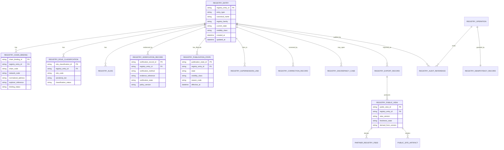
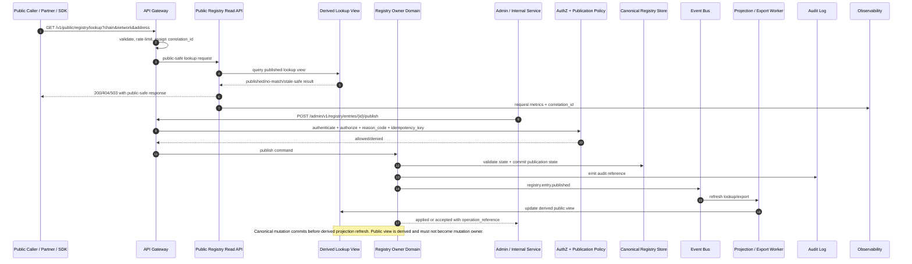

# FUZE Public Contract and Wallet Registry API Specification

## Document Metadata

- **Document Name:** `PUBLIC_CONTRACT_AND_WALLET_REGISTRY_API_SPEC.md`
- **Document Type:** API SPEC v2 — Production-Grade Interface Contract Specification
- **Status:** Draft for production-grade API source-of-truth approval
- **Version:** 2.0.0
- **Effective Date:** 2026-04-25
- **Last Updated:** 2026-04-25
- **Reviewed On:** 2026-04-25
- **Document Owner:** FUZE Public Contract and Wallet Registry Domain
- **Approval Authority:** Not explicitly specified in retrieved governing materials; MUST follow the active FUZE approval workflow and higher-order specification governance process.
- **Review Cadence:** Quarterly and whenever public registry posture, chain architecture, wallet-aware user posture, transparency posture, treasury/governance controls, public API posture, registry role taxonomy, or public correction/supersession policy materially changes.
- **Governing Layer:** API contract layer for public trust, public registry, chain-adjacent publication, and registry control-plane interfaces.
- **Parent Registry:** API SPEC v2 Canonical File Registry
- **Upstream Semantic Registry:** `REFINED_SYSTEM_SPEC_INDEX.md`
- **Upstream API Registry:** `API_SPEC_INDEX.md`
- **Primary Audience:** Platform architecture, backend engineering, public API authors, contracts engineering, public trust authors, transparency/reporting authors, admin/control-plane authors, security, audit/compliance, runtime operations, partner/exchange integration authors, OpenAPI / AsyncAPI / SDK authors, implementation-contract authors.
- **Primary Purpose:** Define the production-grade FUZE API contract for official public contract and wallet registry publication, lookup, verification lineage, lifecycle mutation, public-safe exposure, derived read models, events, auditability, idempotency, compatibility, and downstream implementation guardrails.
- **Primary Upstream References:**
  - `REFINED_SYSTEM_SPEC_INDEX.md`
  - `PUBLIC_CONTRACT_AND_WALLET_REGISTRY_SPEC.md`
  - `API_SPEC_INDEX.md`
  - `DOCS_SPEC_INDEX.md`
  - `SYSTEM_SPEC_INDEX.md`
  - `API_ARCHITECTURE_SPEC.md`
  - `PUBLIC_API_SPEC.md`
  - `INTERNAL_SERVICE_API_SPEC.md`
  - `EVENT_MODEL_AND_WEBHOOK_SPEC.md`
  - `IDEMPOTENCY_AND_VERSIONING_SPEC.md`
  - `MIGRATION_AND_BACKWARD_COMPATIBILITY_SPEC.md`
  - `ONCHAIN_OFFCHAIN_RESPONSIBILITY_SPEC.md`
  - `CHAIN_ARCHITECTURE_SPEC.md`
  - `WALLET_AWARE_USER_SPEC.md`
  - `TRANSPARENCY_MODEL_SPEC.md`
  - `TRANSPARENCY_REPORTING_SPEC.md`
  - `INVESTOR_AND_COMMUNITY_REPORTING_SPEC.md`
  - `GOVERNANCE_MODEL_SPEC.md`
  - `FOUNDATION_GOVERNANCE_SPEC.md`
  - `TREASURY_CONTROL_POLICY_SPEC.md`
  - `VAULT_ACTION_POLICY_SPEC.md`
  - `MULTISIG_AND_TIMELOCK_SPEC.md`
  - `PAYOUT_LEDGER_SPEC.md`
  - `AUDIT_LOG_AND_ACTIVITY_SPEC.md`
  - `AUDIT_AND_ACCESS_TRACEABILITY_SPEC.md`
  - `SECURITY_AND_RISK_CONTROL_SPEC.md`
  - `SECRETS_CONFIG_AND_ENVIRONMENT_SPEC.md`
  - `MONITORING_ALERTING_AND_INCIDENT_RESPONSE_SPEC.md`
  - `BUSINESS_CONTINUITY_AND_RECOVERY_SPEC.md`
  - `FUZE_ACCOUNT_ACCESS_AND_SESSION_THESIS_FINAL_SPEC.md`
  - `FUZE_ACCOUNT_ACCESS_AND_SESSION_CANONICAL_FINAL_SPEC.md`
  - `FUZE_WORKSPACE_ACCESS_CONTROL_BASICS_THESIS_FINAL_SPEC.md`
- **Primary Downstream Dependents:**
  - `PUBLIC_REGISTRY_LOOKUP_API_SPEC.md`
  - `PUBLIC_METADATA_API_SPEC.md`
  - `PUBLIC_TRANSPARENCY_API_SPEC.md`
  - `PUBLIC_PAYOUT_STATUS_API_SPEC.md`
  - `PUBLIC_CHAIN_REFERENCE_API_SPEC.md`
  - `PUBLIC_GOVERNANCE_DISCLOSURE_API_SPEC.md`
  - registry service implementation contracts
  - admin/control-plane registry tools
  - public registry sites and exports
  - partner/exchange verification integrations
  - OpenAPI public contract derivations
  - AsyncAPI event derivations
  - SDK registry lookup clients
  - registry publication and correction runbooks
- **API Surface Families Covered:** public read, first-party application read, partner-safe read, internal service, admin/control-plane, event, webhook/projection-trigger-adjacent, reporting/publication-facing, chain-adjacent read/reference.
- **API Surface Families Excluded:** raw smart-contract ABI APIs, private wallet custody APIs, signer/key-management APIs, treasury execution APIs, governance approval APIs, user wallet-link APIs, payout execution APIs, generic chain indexer APIs, unmanaged static-site content APIs.
- **Canonical System Owner(s):** FUZE Public Contract and Wallet Registry Domain owns registry publication truth, public role classification, verification lineage, publication state, supersession/correction/revocation posture, and public trust-safe registry designation.
- **Canonical API Owner:** FUZE Public Contract and Wallet Registry API Domain, under shared FUZE API Architecture and Public API Governance constraints.
- **Supersedes:** `PUBLIC_CONTRACT_WALLET_REGISTRY_API_SPEC.md` as a v1 / pre-v2 API contract draft; earlier weaker interpretations that treat public registry APIs as simple address-list exports, static website content, raw chain truth, wallet-link truth, treasury-control truth, or public mirrors of internal/admin routes.
- **Superseded By:** Not yet known.
- **Related Decision Records:** Not explicitly specified in retrieved governing materials.
- **Canonical Status Note:** This API SPEC v2 document derives interface-contract truth from `PUBLIC_CONTRACT_AND_WALLET_REGISTRY_SPEC.md`. It does not redefine registry semantics. Downstream OpenAPI, AsyncAPI, SDK, service, admin, export, public-site, and partner verification implementations MUST preserve this document's API boundaries and the upstream refined registry semantics.
- **Implementation Status:** Ready for downstream implementation-contract derivation after approval.
- **Approval Status:** Draft pending explicit approval workflow.
- **Change Summary:** Upgrades the prior public contract/wallet registry API draft into the API SPEC v2 format; aligns filename to the canonical v2 registry; strengthens public/internal/admin/event surface separation, truth-class taxonomy, request/response/error/idempotency/versioning/audit rules, derived read-model constraints, conflict-resolution rules, diagrams, acceptance criteria, and production-grade test cases.

---

## Title

FUZE Public Contract and Wallet Registry API Specification

## Purpose

This specification defines the production-grade API contract for FUZE public contract and wallet registry surfaces.

The API exists so FUZE can expose a trustworthy, stable, public-safe, and historically intelligible registry of official contracts and designated public wallets without forcing public users, partners, exchanges, auditors, or community members to infer official status from informal announcements, scattered documents, chain explorers, or ungoverned static content.

The API contract governs how registry entries are:

- created as internal canonical registry records;
- verified against approved evidence and source-domain references;
- classified by entry family, public role, network, and address binding;
- published to public-safe lookup surfaces;
- corrected, deprecated, superseded, restricted, revoked, or archived;
- exposed through public read, first-party, partner, internal service, admin/control-plane, and event surfaces;
- represented through request, response, error, status, audit, idempotency, and compatibility contracts;
- projected into derived public read models, public sites, exports, partner verification feeds, transparency artifacts, and SDKs.

This specification is an API contract document. It does not own system semantics. The upstream refined system specification owns registry semantics; this document owns the interface expression of those semantics.

## Scope

This API specification governs:

1. public list, detail, and direct-address lookup APIs for published official FUZE contracts and designated public wallets;
2. first-party application reads of public registry views and limited authenticated enrichment where explicitly approved;
3. partner-safe and exchange-safe registry lookup/read contracts;
4. internal service APIs for draft registry entry creation, chain binding, role classification, verification record creation, export generation, and canonical registry reads;
5. admin/control-plane APIs for publication, correction, deprecation, supersession, restriction, revocation, discrepancy resolution, and export remediation;
6. event and webhook-adjacent behavior for registry lifecycle changes and derived projection refreshes;
7. request models, response models, error/result/status classes, idempotency, replay, retry, correlation, and operation reference requirements;
8. public-safe read-model, cache, search, export, and reporting/publication rules;
9. security, privacy, abuse-control, audit, observability, versioning, migration, and OpenAPI / AsyncAPI / SDK derivation rules.

## Out of Scope

This API specification does not govern:

- smart-contract source code, ABI, deployment scripts, or chain-native contract behavior;
- raw chain balances, contract-enforced roles, pause state, tokenholder truth, or block explorer truth;
- private hot wallet, cold wallet, signer, custody, key-management, secret, or recovery mechanics;
- account-to-wallet linkage, wallet login, wallet proof-of-control, or user wallet-aware profile semantics;
- treasury approvals, vault execution, multisig signatures, timelock queueing, governance action lifecycle, or Foundation stewardship semantics;
- payout eligibility, payout ledger, payout execution, claim logic, or profit-participation truth;
- transparency-report authoring, investor/community reporting composition, or public narrative copy in full detail;
- low-level CDN, static-site rendering, indexer vendor, gateway vendor, or database schema implementation details;
- external partner onboarding procedures except where API visibility, replay safety, or registry trust semantics are directly affected.

## Design Goals

1. Preserve public registry semantics from the refined system specification without reinterpretation.
2. Expose stable public lookup and verification-safe registry APIs while minimizing public data exposure.
3. Keep public registry publication truth distinct from chain-native, wallet-link, treasury-control, governance, transparency-report, payout, and private operational wallet truth.
4. Ensure all canonical registry mutations terminate in the registry owner domain.
5. Prevent public, frontend, partner, reporting, export, or static-site layers from becoming shadow registry owners.
6. Make privileged publication, correction, deprecation, supersession, and revocation paths bounded, reason-coded, authorized, auditable, and idempotent.
7. Support async exports, projection refresh, discrepancy remediation, and public-site publication without implying final success before owner-domain completion.
8. Support OpenAPI, AsyncAPI, SDK, implementation-contract, QA, migration, and production-readiness derivation without allowing downstream semantic drift.
9. Make public registry history intelligible by preserving correction and supersession lineage.
10. Provide concrete acceptance criteria and test cases for API implementation review.

## Non-Goals

This specification is not intended to:

- publish every FUZE-controlled wallet or contract;
- expose private signer, custody, security, or operational topology;
- make an address official merely because it appears on-chain or in a deployment artifact;
- prove live balances or control authority through public registry API responses;
- allow public API convenience to bypass verification, authorization, or audit requirements;
- convert derived public registry reads into canonical write authority;
- replace transparency reporting, treasury governance, payout, wallet-aware user, or chain architecture specifications;
- define complete OpenAPI or AsyncAPI machine-readable artifacts directly in this markdown file.

## Core Principles

### 1. Refined Semantics First
The API MUST preserve `PUBLIC_CONTRACT_AND_WALLET_REGISTRY_SPEC.md` as the semantic owner for registry truth.

### 2. Registry Publication Is Off-Chain API Truth
The API expresses off-chain registry publication truth. It does not override chain-native facts.

### 3. Public Registry Is a Trust Surface, Not a Wallet Inventory
Public registry APIs MUST expose official public designations only. They MUST NOT expose private wallet inventories, signer graphs, custody notes, operational controls, or security posture.

### 4. Public Read Is Narrower Than Internal Truth
Public responses MUST contain only public-safe fields approved for the entry's publication state and visibility class.

### 5. Canonical Writes Terminate in Owner Domain
Internal and admin mutations MUST terminate in the registry owner domain and MUST NOT be implemented as direct writes by public sites, frontend clients, worker queues, exports, or partner integrations.

### 6. Publication Requires Verification
A registry entry MUST NOT become publicly visible until the required verification state, role classification, chain binding, visibility state, and audit lineage exist.

### 7. Explicit Lifecycle and Historical Intelligibility
Deprecation, supersession, restriction, revocation, and correction MUST be explicit lifecycle transitions. Public history MUST NOT be silently overwritten.

### 8. Derived Read Models Are Subordinate
Lookup indexes, caches, public-site JSON, partner exports, SDK objects, and search projections MUST derive from canonical registry records and remain regenerable.

### 9. Admin/Control-Plane Separation
Publication, correction, supersession, revocation, discrepancy resolution, and export remediation MUST live on privileged admin/control-plane or internal surfaces, not ordinary public routes.

### 10. Chain-Adjacent Normalization
Chain observations, deployment references, explorer data, and provider inputs are verification inputs until normalized and accepted by the registry owner domain.

## Canonical Definitions

- **Registry Entry:** Canonical API resource representing an official contract or designated public wallet once created in the registry domain.
- **Contract Entry:** A registry entry whose public trust purpose is to designate an official FUZE smart contract or chain-native contract reference.
- **Wallet Entry:** A registry entry whose public trust purpose is to designate a public wallet/address role without exposing private wallet inventory or signer detail.
- **Registry Family:** Contract, wallet, network reference, reserve/vault reference, payout reference, governance/control reference, or another approved public-registry family.
- **Role Classification:** Public-safe governed role such as `token_contract`, `foundation_vault`, `treasury_reserve_vault`, `payout_execution_contract`, `multisig`, `timelock`, `credits_reference`, or another approved role code.
- **Chain Binding:** Normalized chain/network/address tuple and optional explorer/public reference metadata.
- **Verification Record:** Durable evidence lineage used to justify registry publication or lifecycle transition.
- **Publication State:** Visibility/lifecycle state controlling whether and how an entry appears in public, first-party, partner, or internal reads.
- **Supersession Link:** Explicit lineage from a deprecated/replaced/corrected entry to its successor or explanatory continuation.
- **Correction Record:** Durable record describing a public-safe interpretive correction and its reason code.
- **Discrepancy Case:** Review object for duplicate, conflicting, stale, revoked, unpublished, or mismatched registry conditions.
- **Registry Export:** Derived artifact generated from canonical registry truth for public sites, partner feeds, public metadata, or static publication.
- **Operation Reference:** Stable reference for async export, remediation, or projection refresh work accepted by the API.
- **Canonical Public Artifact:** A published registry representation governed by registry publication truth.
- **Derived Public View:** A lookup, cache, search, summary, export, SDK object, or public-site rendering derived from canonical registry records.

## Truth Class Taxonomy

The API MUST preserve the following truth classes:

1. **Semantic truth:** Registry meaning, role classification semantics, lifecycle meaning, and publication-state semantics owned by the refined registry specification.
2. **API contract truth:** Route family, request/response/error/status/idempotency/versioning behavior owned by this API spec.
3. **Policy truth:** Publication, visibility, authorization, reason-code, verification, compatibility, and public exposure rules.
4. **Runtime truth:** Current request processing, accepted async operation state, export job state, retry posture, and degraded-mode status.
5. **Ledger / storage truth:** Durable registry entries, chain bindings, verification records, publication states, alias records, supersession links, correction records, discrepancy cases, idempotency records, and operation records.
6. **Chain-native truth:** On-chain contract facts, balances, deployment transactions, role state, and explorer-observable facts.
7. **Provider-input truth:** Chain indexer responses, explorer links, deployment outputs, external partner signals, or other raw inputs before owner-domain validation.
8. **Audit truth:** Immutable records for trust-sensitive registry creation, verification, publication, correction, supersession, revocation, discrepancy resolution, and export actions.
9. **Projection / reporting truth:** Public lookup indexes, search views, public-site artifacts, partner exports, transparency links, and reporting views.
10. **Presentation truth:** Labels, descriptions, copy, display grouping, explorer URLs, SDK ergonomics, and frontend rendering choices.

These truth classes MUST NOT be collapsed into one table, endpoint, public page, export, or SDK model.

## Architectural Position in the Spec Hierarchy

This API specification sits below:

- `REFINED_SYSTEM_SPEC_INDEX.md`
- `PUBLIC_CONTRACT_AND_WALLET_REGISTRY_SPEC.md`
- `API_ARCHITECTURE_SPEC.md`
- `PUBLIC_API_SPEC.md`
- `INTERNAL_SERVICE_API_SPEC.md`
- `EVENT_MODEL_AND_WEBHOOK_SPEC.md`
- `IDEMPOTENCY_AND_VERSIONING_SPEC.md`
- `MIGRATION_AND_BACKWARD_COMPATIBILITY_SPEC.md`
- system boundary, data ownership, on-chain/off-chain, security, audit, and runtime specifications.

It sits above or alongside:

- OpenAPI public registry contracts;
- AsyncAPI registry event contracts;
- backend registry service implementation contracts;
- admin/control-plane registry UI contracts;
- public registry site/export contracts;
- partner/exchange verification integrations;
- `PUBLIC_REGISTRY_LOOKUP_API_SPEC.md`, which may define narrower public lookup experience details without overriding this domain API contract.

## Upstream Semantic Owners

- `PUBLIC_CONTRACT_AND_WALLET_REGISTRY_SPEC.md` owns registry publication truth, lifecycle semantics, classification rules, verification lineage, public-safe metadata, supersession, revocation, correction, and registry visibility posture.
- `API_ARCHITECTURE_SPEC.md` owns shared API surface-family discipline, owner-domain write rules, accepted-state semantics, derived-read discipline, correlation, traceability, and API family separation.
- `PUBLIC_API_SPEC.md` owns shared external/public exposure posture, public compatibility obligations, abuse controls, public artifact classification, and public request-lineage rules.
- `ONCHAIN_OFFCHAIN_RESPONSIBILITY_SPEC.md` and `CHAIN_ARCHITECTURE_SPEC.md` own chain-native versus off-chain publication separation and chain-adjacent posture.
- `WALLET_AWARE_USER_SPEC.md` owns account-to-wallet linkage and wallet-aware user truth, which this API MUST NOT absorb.
- Governance, treasury, vault, multisig/timelock, Foundation, payout, transparency, and reporting specs own their respective source-domain truths.

## API Surface Families

### Public Read Surface
Open public routes for published entries only. Public routes MAY list, search, filter, and resolve published registry entries but MUST NOT mutate canonical truth.

### First-Party Application Surface
First-party clients MAY consume the same public views plus approved bounded metadata. First-party status does not permit bypassing public-safe visibility rules.

### Partner / Exchange Verification Surface
Partner-safe reads MAY expose stable lookup outputs, signed export metadata, or registry version references where approved. Partner reads remain read-only unless a separate partner-specific contract is approved.

### Internal Service Surface
Internal service routes MAY create draft entries, attach normalized chain bindings, create verification records, request exports, and read canonical internal registry state under service identity and least privilege.

### Admin / Control-Plane Surface
Privileged routes MAY verify, publish, correct, deprecate, supersede, restrict, revoke, resolve discrepancies, and remediate export/projection failures. These routes MUST require operator identity, authorization, reason codes, idempotency, audit lineage, and policy validation.

### Event / Async Surface
Registry lifecycle events and export/projection events MAY be emitted after canonical owner-domain commits. Events MUST NOT be treated as mutation owners.

### Reporting / Publication-Facing Surface
Public-site exports, registry feeds, transparency linkages, and reporting views MUST derive from canonical registry truth and must preserve source references, freshness, and stale/unavailable posture.

### Chain-Adjacent Surface
Chain observations and contract/wallet evidence MAY be consumed for verification. Chain-adjacent inputs remain normalized inputs until owner-domain validation succeeds.

## System / API Boundaries

The registry API boundary is the contract layer between consumers and the registry owner domain. It MUST enforce:

- public reads are derived from published registry truth;
- internal writes create or enrich canonical registry records but cannot publish without approved authority;
- admin/control writes perform governed lifecycle transitions only after policy checks;
- events and exports reflect committed registry outcomes but do not create registry truth;
- chain inputs support verification but do not directly publish entries;
- transparency and reporting layers may link registry artifacts but do not own registry entries;
- wallet-aware user APIs may reference public registry entries but do not become registry publication owners.

## Adjacent API Boundaries

- `PUBLIC_REGISTRY_LOOKUP_API_SPEC.md` may narrow public lookup behavior and UX-facing filter semantics but MUST consume this API's canonical resource model.
- `PUBLIC_METADATA_API_SPEC.md` may expose discovery metadata but MUST not redefine registry role classifications or lifecycle truth.
- `PUBLIC_TRANSPARENCY_API_SPEC.md` may link registry entries into transparency artifacts but MUST not own registry publication state.
- `PUBLIC_CHAIN_REFERENCE_API_SPEC.md` may expose chain/reference metadata but MUST not turn chain observations into official registry designations.
- `WALLET_AWARE_USER_API_SPEC.md` owns user wallet-link flows and MUST not publish official FUZE wallets.
- `TREASURY_CONTROL_POLICY_API_SPEC.md`, `VAULT_ACTION_POLICY_API_SPEC.md`, `MULTISIG_AND_TIMELOCK_API_SPEC.md`, and governance APIs own control actions and MUST not treat registry publication as approval or execution authority.
- `PAYOUT_LEDGER_API_SPEC.md` and `BASE_PAYOUT_EXECUTION_LAYER_API_SPEC.md` may reference public payout contracts/wallets but do not own registry entries.

## Conflict Resolution Rules

1. Active refined system specifications win over older API v1 materials on semantic meaning.
2. `PUBLIC_CONTRACT_AND_WALLET_REGISTRY_SPEC.md` wins on registry publication truth, lifecycle state meaning, role classification, visibility, correction, supersession, and revocation semantics.
3. `API_ARCHITECTURE_SPEC.md` wins on shared API surface-family discipline, accepted-state semantics, owner-domain write posture, and derived-read constraints.
4. `PUBLIC_API_SPEC.md` wins on public/external exposure posture, compatibility obligations, public artifact classification, and abuse controls.
5. Chain architecture and on-chain/off-chain specifications win on chain-native versus off-chain truth separation.
6. Wallet-aware user specifications win on account-to-wallet linkage and user wallet semantics.
7. Treasury, governance, vault, multisig/timelock, Foundation, payout, transparency, and reporting domains win within their own source truths.
8. This API spec wins on the contract expression for registry routes, requests, responses, errors, statuses, idempotency, audit references, event exposure, and implementation guardrails.
9. Public sites, static exports, SDKs, caches, partner feeds, dashboards, or frontend clients never win over canonical registry records.
10. When ambiguity remains, choose the more conservative public-trust-preserving and architecture-consistent interpretation, keep the entry unpublished or review-required, and escalate for explicit decision.

## Default Decision Rules

1. Addresses are not official by default.
2. External exposure is not permitted by default.
3. Unverified entries are not public by default.
4. Ambiguous role classification defaults to narrower, unpublished, or review-required handling.
5. Public responses default to excluding private notes, verification internals, signer details, custody detail, security flags, operator notes, and internal control posture.
6. Deprecated or superseded entries default to preserved historical visibility with successor guidance unless security or legal policy requires restriction.
7. Direct address lookup defaults to explicit no-match, unpublished, or restricted-safe responses rather than revealing hidden entries.
8. Export or projection failure defaults to stale/unavailable posture rather than improvised public registry truth.
9. Chain disagreement with registry state defaults to discrepancy review rather than automatic public mutation.
10. Idempotency conflict defaults to rejection rather than uncertain duplicate mutation.
11. Admin/operator ambiguity defaults to denial or escalation rather than best-effort publication.
12. API version ambiguity defaults to older stable public contract behavior until migration is explicit.

## Roles / Actors / API Consumers

### Public Consumers
- public users;
- community members;
- auditors and researchers;
- exchanges and partners using public endpoints;
- public registry pages;
- public SDK consumers.

### Authenticated / First-Party Consumers
- `fuze-frontend-webapp`;
- authenticated FUZE users viewing public trust surfaces;
- first-party public trust and metadata experiences.

### Internal Consumers
- registry backend service;
- chain deployment / contract reference services;
- verification and evidence ingestion services;
- transparency/reporting services;
- export/publication pipelines;
- public metadata services.

### Admin / Control Consumers
- `fuze-frontend-admin`;
- platform operators;
- governance/treasury reviewers where role-appropriate;
- security/audit reviewers;
- discrepancy and remediation operators.

### System Consumers
- event bus;
- projection builders;
- public search/indexing services;
- public site/static export service;
- partner feed service;
- monitoring and audit systems.

## Resource / Entity Families

### Canonical API Resources

- `registry_entry`
- `registry_chain_binding`
- `registry_role_classification`
- `registry_alias`
- `registry_verification_record`
- `registry_publication_state`
- `registry_supersession_link`
- `registry_correction_record`
- `registry_discrepancy_case`
- `registry_export_record`
- `registry_operation`
- `registry_idempotency_record`
- `registry_audit_reference`

### Derived API Resources

- `registry_public_entry_view`
- `registry_lookup_view`
- `registry_search_result`
- `registry_public_export`
- `partner_registry_feed`
- `registry_projection_status`
- `public_registry_version_manifest`

Derived resources MUST be regenerable from canonical registry records and MUST NOT accept canonical writes.

## Ownership Model

The API MUST preserve the following owner model:

- Registry domain owns registry entries, public designations, classification, publication state, verification lineage, correction, supersession, revocation, and public-safe registry semantics.
- Public API governance owns exposure posture, compatibility, public artifact classification, and abuse controls.
- API architecture owns surface-family discipline and owner-domain termination requirements.
- Audit domain owns immutable audit record semantics.
- Security domain owns risk controls and sensitive-path hardening.
- Chain domains own chain-native facts but not registry publication truth.
- Wallet-aware user owns account-wallet linkage but not official wallet registry truth.
- Treasury/governance/control domains own approval and execution truth but not registry publication truth.
- Transparency/reporting domains own transparency/report semantics but not registry entry lifecycle truth.

## Authority / Decision Model

### Public Read Authority
Public read callers may read only entries whose publication state permits the requested visibility class. Public read access does not imply any mutation, verification, treasury, governance, or chain authority.

### Internal Service Authority
Internal services may create draft records or attach normalized evidence only if they have explicit service authorization for the relevant action family. Internal service authority does not imply publication authority.

### Admin / Operator Authority
Operators may perform privileged lifecycle actions only through admin/control-plane APIs with explicit permission, policy validation, reason codes, idempotency keys, correlation IDs, and audit lineage.

### Source-Domain Reference Authority
Treasury/governance/chain/payout/transparency references may justify or contextualize registry entries, but the referenced domains do not directly mutate registry publication state unless they invoke approved registry APIs.

### Partner Authority
Partners may consume partner-safe reads and feeds. Partner inputs or correction requests are review inputs, not canonical registry mutations.

## Authentication Model

### Public Routes
Open public routes MAY be unauthenticated but MUST still be protected by rate limits, abuse controls, cache controls, and safe error semantics.

### Authenticated First-Party Routes
Authenticated first-party routes MUST authenticate the user/session and evaluate visibility, but they MUST NOT expose privileged registry state merely because the caller is a FUZE user.

### Partner Routes
Partner routes MUST authenticate partner identity, credential scope, contract version, and replay posture where partner-only feeds or higher-rate lookup is allowed.

### Internal Service Routes
Internal routes MUST require service-to-service identity, environment-bound credentials, least privilege, and caller authorization for the action.

### Admin / Control-Plane Routes
Admin routes MUST require operator authentication, session integrity, privileged authorization, policy checks, reason-code capture, and elevated audit posture. MFA or stronger step-up requirements SHOULD be applied to high-sensitivity publication, revocation, and supersession actions.

## Authorization / Scope / Permission Model

Authorization checks MUST evaluate:

- surface family;
- actor type;
- caller identity and credential class;
- route/action family;
- target resource state;
- target role classification and sensitivity tier;
- visibility class;
- policy version;
- workspace/admin scope where applicable;
- service scope where applicable;
- reason code and required approval references for privileged actions.

Public read authorization is visibility-state based. Internal and admin writes require explicit permission and MUST NOT rely on possession of a route alone.

## Entitlement / Capability-Gating Model

Registry public reads are generally public-trust surfaces and do not require commercial entitlement. However:

- partner high-volume feeds MAY require partner capability gating;
- first-party authenticated enrichments MAY require product capability or workspace policy checks;
- admin/control actions MUST require operator capability and policy authority;
- capability gates MUST NOT override registry visibility state or publish hidden data;
- entitlement denial MUST be distinguishable from authorization denial and from unpublished/restricted registry state where safe.

## API State Model

### Registry Entry States
- `draft`
- `verified`
- `published`
- `restricted`
- `deprecated`
- `superseded`
- `revoked`
- `archived`

### Publication States
- `unpublished`
- `published_public`
- `published_partner`
- `published_authenticated_if_approved`
- `restricted`
- `withdrawn`

### Verification States
- `pending`
- `validated`
- `rejected`
- `superseded`

### Operation States
- `accepted`
- `processing`
- `applied`
- `previously_applied`
- `failed_retryable`
- `failed_terminal`
- `conflicted`
- `cancelled`
- `superseded`

### Export / Projection States
- `pending`
- `generated`
- `published`
- `failed`
- `stale`
- `superseded`

### Discrepancy States
- `opened`
- `under_review`
- `resolved`
- `failed`
- `closed`

Implementations MAY use different internal enum names only if the API contract can faithfully express these distinctions.

## Lifecycle / Workflow Model

1. A candidate contract or wallet is identified by an approved source domain, operator, or internal process.
2. Internal service creates a draft registry entry using normalized chain/network/address and role classification inputs.
3. The registry service validates canonical uniqueness, normalized address form, chain/network support, role eligibility, and private/public visibility constraints.
4. Verification evidence is attached through internal service or admin routes.
5. Required checks validate verification basis, source references, role classification, and risk posture.
6. An authorized operator publishes, restricts, deprecates, supersedes, corrects, revokes, or archives the entry through admin/control-plane routes.
7. Canonical registry mutation commits and writes audit lineage, operation references, idempotency records, and domain events.
8. Derived lookup views, search indexes, public exports, public site artifacts, partner feeds, and transparency links refresh asynchronously or synchronously depending on route family.
9. Public readers consume only current public-safe views and explicit deprecated/superseded guidance.
10. Discrepancies, projection failures, or chain/reference conflicts open review cases and require explicit remediation rather than silent mutation.
11. Migration, API version evolution, and compatibility changes preserve old-to-new lineage.

## Architecture Diagram — Mermaid flowchart

```mermaid
flowchart TD
  subgraph Public["Public / External Consumers"]
    PUB[Public users / community / auditors]
    PARTNER[Partners / exchanges]
    SDK[Public SDKs]
  end

  subgraph FirstParty["First-Party Experience"]
    WEB[fuze-frontend-webapp]
    ADMIN[fuze-frontend-admin]
  end

  subgraph API["API Surface Families"]
    PUBLIC_API[Public Registry Read API]
    PARTNER_API[Partner Registry Feed API]
    APP_API[First-Party Registry API]
    INTERNAL_API[Internal Registry Service API]
    ADMIN_API[Admin / Control-Plane Registry API]
  end

  subgraph RegistryDomain["Canonical Registry Owner Domain"]
    REGISTRY_SERVICE[Registry Service]
    POLICY[Publication / Verification Policy]
    IDEMP[Idempotency + Operation Records]
    AUDIT_REF[Audit Reference Emission]
  end

  subgraph CanonicalStores["Canonical Stores"]
    ENTRY_STORE[(Registry Entries)]
    VERIFY_STORE[(Verification Records)]
    LIFE_STORE[(Publication / Supersession / Correction Records)]
    DISCREPANCY_STORE[(Discrepancy Cases)]
  end

  subgraph SourceDomains["Adjacent Source Domains"]
    CHAIN[Chain / Contract References]
    WALLET[Wallet-Aware User Domain]
    TREASURY[Treasury / Vault / Governance]
    PAYOUT[Payout / Eligibility Domains]
    TRANSPARENCY[Transparency / Reporting Domains]
  end

  subgraph Derived["Derived / Publication Layer"]
    LOOKUP[(Lookup Index)]
    EXPORT[(Public Exports)]
    SITE[Public Registry Site]
    FEED[Partner Feed]
    EVENTS[Event Bus / AsyncAPI]
    OBS[Monitoring / Observability]
    AUDIT[(Audit Log)]
  end

  PUB --> PUBLIC_API
  SDK --> PUBLIC_API
  PARTNER --> PARTNER_API
  WEB --> APP_API
  ADMIN --> ADMIN_API
  INTERNAL_API --> REGISTRY_SERVICE
  PUBLIC_API --> LOOKUP
  PARTNER_API --> FEED
  APP_API --> LOOKUP
  ADMIN_API --> REGISTRY_SERVICE

  CHAIN -->|normalized evidence| REGISTRY_SERVICE
  WALLET -. reference only .-> REGISTRY_SERVICE
  TREASURY -. approval/reference only .-> REGISTRY_SERVICE
  PAYOUT -. reference only .-> REGISTRY_SERVICE
  TRANSPARENCY -. linkage only .-> REGISTRY_SERVICE

  REGISTRY_SERVICE --> POLICY
  REGISTRY_SERVICE --> IDEMP
  REGISTRY_SERVICE --> ENTRY_STORE
  REGISTRY_SERVICE --> VERIFY_STORE
  REGISTRY_SERVICE --> LIFE_STORE
  REGISTRY_SERVICE --> DISCREPANCY_STORE
  REGISTRY_SERVICE --> AUDIT_REF
  AUDIT_REF --> AUDIT
  REGISTRY_SERVICE --> EVENTS
  EVENTS --> LOOKUP
  EVENTS --> EXPORT
  LOOKUP --> SITE
  EXPORT --> SITE
  EXPORT --> FEED
  REGISTRY_SERVICE --> OBS
```

## Data Design — Mermaid Diagram

## Flow View

### Main Public Lookup Flow

1. Caller invokes public list, detail, search, or direct-address lookup route.
2. Gateway applies rate limit, abuse controls, cache controls, request validation, and correlation ID assignment.
3. Public Registry Read API queries only public-safe lookup/read models.
4. Lookup view returns published or public-safe deprecated/superseded records.
5. Response includes publication state, chain binding, role classification, alias summary, freshness/version metadata, and successor guidance where relevant.
6. Response excludes private notes, verification internals, signer/custody detail, internal security flags, operator notes, and unpublished entries.
7. Monitoring records request metrics; public access logging is privacy-minimized.

### Internal Draft and Verification Flow

1. Authorized internal service submits draft entry request with idempotency key, normalized chain binding, entry type, role classification, and source references.
2. Registry API authenticates service identity and validates service scope.
3. Registry service validates address normalization, duplicate/conflict status, supported network, role eligibility, and private/public exposure constraints.
4. Canonical draft entry is created or previous idempotent result is returned.
5. Internal service attaches verification records with evidence references and policy version.
6. Registry service validates verification inputs and transitions verification state if permitted.
7. Audit references and internal lifecycle events are emitted after canonical commit.

### Admin Publication / Correction Flow

1. Operator invokes privileged lifecycle route with reason code, operator note, idempotency key, and correlation ID.
2. Admin API verifies operator authentication, privilege, policy version, target state, sensitivity tier, and required approvals.
3. Registry service applies lifecycle transition only if valid.
4. Canonical records, correction/supersession/deprecation/revocation lineage, operation record, idempotency record, and audit reference are committed atomically or through a transactionally safe outbox.
5. Domain event is emitted after commit.
6. Projection/export jobs refresh public views.
7. Public response returns accepted/applied/previously_applied/conflicted semantics and operation reference.
8. If async projection fails, canonical mutation remains truth while public projection state becomes stale or failed with remediation path.

### Discrepancy and Degraded Mode Flow

1. System detects duplicate address, chain/reference disagreement, stale projection, export failure, or public/internal mismatch.
2. Discrepancy case is opened with source references and correlation ID.
3. Public views either continue showing last-known-safe state with freshness markers or return explicit unavailable/stale status.
4. Operator resolves discrepancy through admin/control-plane API with reason code and audit lineage.
5. Resolution may correct, supersede, restrict, revoke, refresh export, or close as non-issue.
6. Public history preserves intelligibility and avoids silent overwrite.

## Data Flows — Mermaid sequenceDiagram

## Request Model

### Required Common Request Headers

- `X-Correlation-Id`: REQUIRED for internal/admin mutations; SHOULD be generated for public reads if not supplied.
- `Idempotency-Key`: REQUIRED for all mutation-capable routes and async export/remediation routes.
- `X-Request-Source`: REQUIRED for internal/admin surfaces where multiple services or tools may initiate actions.
- `X-API-Version` or route version: REQUIRED through versioned route family.
- `Authorization`: REQUIRED for authenticated first-party, partner, internal, and admin routes.
- `Content-Type: application/json`: REQUIRED for JSON mutation requests.

### Public Read Request Fields

Public reads MAY support:

- `chain_code`
- `network_code`
- `address`
- `entry_type`
- `registry_family`
- `role_code`
- `publication_state`
- `include_deprecated`
- `include_superseded`
- `page_token`
- `limit`
- `sort`
- `registry_version`

Public reads MUST validate address format and filter semantics without exposing unpublished or restricted entries.

### Internal Draft Entry Request

Required contract-level fields:

- `entry_type`
- `registry_family`
- `chain_code`
- `network_code`
- `address`
- `primary_role_code`
- `source_reference_type`
- `source_reference_id`
- `request_reason_code`
- `idempotency_key`

Optional fields:

- `canonical_name`
- `alias_labels`
- `public_summary`
- `artifact_links`
- `expected_visibility_class`
- `verification_hint`
- `policy_version`

### Verification Record Request

Required fields:

- `verification_method`
- `verification_summary`
- `evidence_references`
- `policy_version`
- `request_reason_code`
- `idempotency_key`

Verification evidence MUST be references or summaries safe for the internal route family. Public routes MUST NOT expose internal evidence by default.

### Admin Lifecycle Request

Required fields:

- `reason_code`
- `operator_note`
- `policy_version`
- `idempotency_key`
- `correlation_id`

Additional fields by action:

- `replacement_entry_id` for supersession/deprecation with successor guidance;
- `correction_fields` for correction actions;
- `restriction_class` for restriction actions;
- `revocation_summary` for revocation actions;
- `discrepancy_case_id` for remediation actions;
- `export_scope` for export/remediation routes.

## Response Model

### Common Response Fields

All non-empty responses SHOULD include:

- `request_id`
- `correlation_id`
- `api_version`
- `resource_type`
- `status`
- `result_class`
- `generated_at`

Mutation responses MUST include:

- `operation_reference`
- `idempotency_status`
- `audit_reference`
- `state_before` where safe
- `state_after`
- `accepted_at` or `applied_at`
- `projection_refresh_status` if public views update asynchronously.

### Public Registry Entry Summary

Public-safe fields MAY include:

- `registry_entry_id`
- `entry_type`
- `registry_family`
- `canonical_name`
- `public_summary`
- `chain_code`
- `network_code`
- `normalized_address`
- `address_display`
- `explorer_url`
- `role_code`
- `role_label`
- `alias_labels`
- `publication_state`
- `current_status`
- `deprecated_at`
- `superseded_by`
- `replacement_guidance`
- `public_artifact_links`
- `registry_version`
- `freshness_state`
- `last_public_update_at`

Public responses MUST NOT include:

- private wallet inventory;
- signer identities;
- custody or key-management details;
- internal verification notes;
- security flags;
- unpublished evidence;
- operator notes;
- policy internals;
- private source references;
- exact internal risk scoring.

### Internal Canonical Entry Response

Internal responses MAY include canonical registry fields, verification state, operation history, source references, export state, and discrepancy state where caller authorization permits.

### Admin Lifecycle Response

Admin responses MUST include resulting lifecycle state, operation reference, audit reference, idempotency status, reason code, policy version, and projection/export status.

### Async Accepted Response

When work is accepted but not complete, the API MUST return:

- `result_class: accepted`
- `operation_reference`
- `operation_status`
- `status_url` where applicable
- `accepted_at`
- `expected_followup_event_type` where applicable
- explicit statement that final public projection or business outcome is not yet complete.

## Error / Result / Status Model

### Result Classes

- `success`
- `accepted`
- `previously_applied`
- `no_match`
- `not_public`
- `forbidden`
- `invalid_request`
- `unprocessable`
- `conflict`
- `policy_denied`
- `verification_required`
- `state_invalid`
- `rate_limited`
- `failed_retryable`
- `failed_terminal`
- `stale_or_unavailable`

### Structured Error Fields

Errors MUST use structured problem details with:

- `type`
- `title`
- `status`
- `code`
- `detail`
- `instance`
- `correlation_id`
- `request_id`
- `retryable`
- `safe_retry_after` where applicable
- `operation_reference` where applicable.

### Canonical Error Codes

Authorization and authentication:

- `REGISTRY_AUTHENTICATION_REQUIRED`
- `REGISTRY_PERMISSION_DENIED`
- `REGISTRY_OPERATOR_PERMISSION_DENIED`
- `REGISTRY_SERVICE_PERMISSION_DENIED`
- `REGISTRY_PARTNER_SCOPE_DENIED`

Validation and integrity:

- `REGISTRY_REQUEST_INVALID`
- `REGISTRY_ADDRESS_INVALID`
- `REGISTRY_CHAIN_UNSUPPORTED`
- `REGISTRY_ROLE_NOT_ALLOWED`
- `REGISTRY_PRIVATE_METADATA_FORBIDDEN`
- `REGISTRY_SOURCE_REFERENCE_INVALID`

State and conflict:

- `REGISTRY_ENTRY_NOT_FOUND`
- `REGISTRY_ENTRY_NOT_PUBLIC`
- `REGISTRY_ENTRY_STATE_INVALID`
- `REGISTRY_ENTRY_ALREADY_PUBLISHED`
- `REGISTRY_DUPLICATE_ADDRESS`
- `REGISTRY_SUPERSESSION_CONFLICT`
- `REGISTRY_CORRECTION_CONFLICT`
- `REGISTRY_REVOCATION_CONFLICT`

Policy and verification:

- `REGISTRY_VERIFICATION_REQUIRED`
- `REGISTRY_PUBLICATION_FORBIDDEN`
- `REGISTRY_POLICY_VERSION_STALE`
- `REGISTRY_REASON_CODE_REQUIRED`
- `REGISTRY_APPROVAL_REFERENCE_REQUIRED`

Idempotency and replay:

- `REGISTRY_IDEMPOTENCY_KEY_REQUIRED`
- `REGISTRY_IDEMPOTENCY_REPLAY_CONFLICT`
- `REGISTRY_OPERATION_ALREADY_APPLIED`

Runtime and dependency:

- `REGISTRY_EXPORT_UNAVAILABLE`
- `REGISTRY_PROJECTION_STALE`
- `REGISTRY_STORAGE_UNAVAILABLE`
- `REGISTRY_CHAIN_REFERENCE_UNAVAILABLE`
- `REGISTRY_DISCREPANCY_UNDER_REVIEW`

### Public Error Safety

Public errors MUST NOT reveal whether a restricted/private/unpublished entry exists unless the visibility class explicitly allows that distinction. Where safe, direct lookup may return `no_match` or `not_public`; where unsafe, it MUST collapse to public-safe no-match behavior.

## Idempotency / Retry / Replay Model

Idempotency is REQUIRED for:

- internal entry creation;
- verification record creation;
- publication;
- deprecation;
- supersession;
- correction;
- restriction;
- revocation;
- discrepancy resolution;
- export generation;
- projection refresh triggers;
- partner feed generation where mutable operation state exists.

The idempotency record MUST capture:

- idempotency key;
- route family;
- actor/service identity;
- target resource;
- normalized request hash;
- semantic operation type;
- created_at;
- terminal result;
- operation reference;
- audit reference.

Replay rules:

1. same key + same semantic request returns the original terminal result or current accepted operation status;
2. same key + different semantic request fails with `REGISTRY_IDEMPOTENCY_REPLAY_CONFLICT`;
3. retry of accepted async operation returns stable operation reference;
4. retry MUST NOT duplicate lifecycle transitions, audit records, public events, or exports;
5. retryable infrastructure failures MUST be distinguishable from policy denial or terminal conflicts.

## Rate Limit / Abuse-Control Model

Public and partner surfaces MUST apply:

- per-IP, per-client, and per-address lookup throttles;
- stricter limits for direct-address enumeration patterns;
- bot and scraping controls where public registry stability is affected;
- cache-friendly headers for public list/detail endpoints;
- partner credential quotas for high-volume feeds;
- monitoring for suspicious enumeration or phishing-adjacent registry queries;
- safe degradation when read-model or export dependencies fail.

Admin/internal surfaces MUST apply:

- service and operator rate limits;
- sensitive-action throttles;
- duplicate publication prevention;
- brute-force protection for address lookup/correction attempts;
- alerting on unusual publication, revocation, or correction volume.

## Endpoint / Route Family Model

Route names below are normative route-family models, not final OpenAPI path lock-in. Downstream OpenAPI MAY adjust exact paths if the same contract semantics are preserved.

### Public Read Routes

#### `GET /v1/public/registry/contracts`
Lists published official contract entries.

- **Surface:** Public read
- **Auth:** none
- **Writes:** none
- **Allowed filters:** `chain_code`, `network_code`, `role_code`, `include_deprecated`, pagination
- **Canonical data:** no; derived public view
- **Forbidden:** unpublished, restricted, private verification data, signer/custody detail

#### `GET /v1/public/registry/wallets`
Lists published designated public wallet entries.

- **Surface:** Public read
- **Auth:** none
- **Writes:** none
- **Allowed filters:** `chain_code`, `network_code`, `role_code`, `include_deprecated`, pagination
- **Forbidden:** private wallet inventories, signer graphs, custody notes, internal risk posture

#### `GET /v1/public/registry/lookup`
Direct lookup by normalized chain/network/address.

- **Surface:** Public read
- **Auth:** none
- **Required query:** `chain_code`, `network_code`, `address`
- **Returns:** match, no-match, public-safe deprecated/superseded guidance, or stale/unavailable posture
- **Forbidden:** revealing unpublished/restricted entries unless visibility explicitly permits

#### `GET /v1/public/registry/entries/{registry_entry_id}`
Retrieves one published registry entry detail.

- **Surface:** Public read
- **Auth:** none
- **Returns:** public-safe detail, aliases, role labels, chain binding, lifecycle status, successor guidance
- **Forbidden:** private verification and control-plane detail

#### `GET /v1/public/registry/manifest`
Returns public registry manifest/version metadata.

- **Surface:** Public read / publication-facing
- **Auth:** none
- **Returns:** registry version, generated_at, freshness, supported networks, export version references
- **Purpose:** helps public sites, partners, SDKs, and caches detect refresh state without owning truth.

### Partner Read Routes

#### `GET /v1/partners/registry/feed`
Returns approved partner/export feed.

- **Surface:** Partner-safe read
- **Auth:** partner credential required
- **Writes:** none
- **Returns:** partner-safe public registry feed, version manifest, optional signed/checksummed artifact metadata
- **Forbidden:** privileged internal registry records

#### `GET /v1/partners/registry/lookup`
Higher-rate or credentialed address lookup for approved partners.

- **Surface:** Partner-safe read
- **Auth:** partner credential required
- **Writes:** none
- **Additional rules:** partner scope and replay controls required

### First-Party Routes

#### `GET /v1/app/registry/entries`
First-party consumption of public registry views.

- **Surface:** First-party application read
- **Auth:** user/session where app context requires
- **Writes:** none
- **Returns:** public views plus approved UI-support metadata
- **Forbidden:** privileged admin/internal state

### Internal Service Routes

#### `POST /internal/v1/registry/entries`
Creates a draft canonical registry entry.

- **Surface:** Internal service
- **Auth:** service identity
- **Idempotency:** required
- **Side effect:** draft entry, chain binding, initial role classification
- **Events:** `registry.entry.created`

#### `POST /internal/v1/registry/entries/{registry_entry_id}/verification-records`
Attaches verification lineage.

- **Surface:** Internal service
- **Auth:** service identity
- **Idempotency:** required
- **Side effect:** verification record, possible verification state transition
- **Events:** `registry.entry.verified` when state changes to validated

#### `POST /internal/v1/registry/exports`
Requests generation of public registry export or partner feed artifact.

- **Surface:** Internal service
- **Auth:** service identity
- **Idempotency:** required
- **May be async:** yes
- **Events:** `registry.export.generated`, `registry.export.failed`

#### `GET /internal/v1/registry/entries/{registry_entry_id}`
Reads canonical registry entry for authorized internal consumers.

- **Surface:** Internal service
- **Auth:** service identity
- **Writes:** none
- **Visibility:** caller-scoped internal visibility

### Admin / Control-Plane Routes

#### `POST /admin/v1/registry/entries/{registry_entry_id}/publish`
Publishes a verified entry.

- **Surface:** Admin/control-plane
- **Auth:** privileged operator
- **Reason code:** required
- **Idempotency:** required
- **Audit:** critical
- **Events:** `registry.entry.published`

#### `POST /admin/v1/registry/entries/{registry_entry_id}/deprecate`
Deprecates a published entry.

- **Surface:** Admin/control-plane
- **Replacement guidance:** SHOULD be supplied when known
- **Audit:** critical
- **Events:** `registry.entry.deprecated`

#### `POST /admin/v1/registry/entries/{registry_entry_id}/supersede`
Supersedes one entry with another.

- **Surface:** Admin/control-plane
- **Required:** `replacement_entry_id`, reason code, idempotency key
- **Audit:** critical
- **Events:** `registry.entry.superseded`

#### `POST /admin/v1/registry/entries/{registry_entry_id}/correct`
Corrects public-safe classification, aliases, summary, or artifact links.

- **Surface:** Admin/control-plane
- **Audit:** critical
- **Events:** `registry.entry.corrected`
- **Rule:** correction MUST preserve historical lineage

#### `POST /admin/v1/registry/entries/{registry_entry_id}/restrict`
Restricts public visibility.

- **Surface:** Admin/control-plane
- **Audit:** critical
- **Events:** `registry.entry.restricted`
- **Rule:** public view MUST move to safe restricted/unavailable posture

#### `POST /admin/v1/registry/entries/{registry_entry_id}/revoke`
Revokes official designation.

- **Surface:** Admin/control-plane
- **Audit:** critical
- **Events:** `registry.entry.revoked`
- **Rule:** revocation requires explicit public-safe messaging unless policy requires narrower disclosure

#### `POST /admin/v1/registry/discrepancies/{discrepancy_case_id}/resolve`
Resolves discrepancy.

- **Surface:** Admin/control-plane
- **Audit:** critical
- **May cause:** correction, supersession, restriction, export remediation, closure
- **Events:** `registry.discrepancy.resolved`

## Public API Considerations

Public registry APIs MUST be:

- read-only;
- stable and backward-compatible;
- cache-friendly but freshness-aware;
- explicit about deprecated/superseded status;
- narrow in exposed fields;
- safe for unauthenticated consumption;
- safe against phishing and impersonation misuse;
- clear that official registry publication is not proof of live balance, custody, or transaction approval;
- explicit when data is stale or unavailable;
- versioned and compatible with SDK generation.

## First-Party Application API Considerations

First-party app APIs MAY consume public registry views and approved UI-support metadata, but:

- MUST NOT use app routes as admin shortcuts;
- MUST NOT expose internal verification or operator notes;
- MUST NOT let frontend-authored address labels become canonical;
- MUST treat public registry views as derived/public artifacts unless reading internal canonical state through an authorized service path.

## Internal Service API Considerations

Internal service APIs:

- MUST authenticate service identity;
- MUST enforce least privilege by operation family;
- MUST require idempotency for mutations;
- MUST validate normalized chain/address bindings;
- MUST preserve source-domain references and evidence lineage;
- MUST emit events after canonical commits;
- MUST NOT publish entries without explicit publication authority;
- MUST NOT let chain/deployment services bypass registry verification and publication lifecycle.

## Admin / Control-Plane API Considerations

Admin/control APIs:

- MUST be separated from public and ordinary application routes;
- MUST require privileged operator identity;
- MUST require reason codes and operator notes for trust-sensitive actions;
- MUST validate policy version, target state, and required approvals;
- MUST be idempotent and replay-safe;
- MUST emit audit references and domain events;
- MUST preserve historical lineage;
- MUST support safe correction and rollback/remediation posture;
- MUST NOT silently delete public history except where stronger security/legal policy demands restricted presentation.

## Event / Webhook / Async API Considerations

### Internal Domain Events

The registry domain SHOULD emit:

- `registry.entry.created`
- `registry.entry.verified`
- `registry.entry.published`
- `registry.entry.deprecated`
- `registry.entry.superseded`
- `registry.entry.corrected`
- `registry.entry.restricted`
- `registry.entry.revoked`
- `registry.export.requested`
- `registry.export.generated`
- `registry.export.failed`
- `registry.projection.refreshed`
- `registry.discrepancy.opened`
- `registry.discrepancy.resolved`

### Event Payload Minimums

Events MUST include:

- `event_id`
- `event_type`
- `occurred_at`
- `registry_entry_id` where applicable
- `operation_reference`
- `correlation_id`
- `actor_type`
- `surface_family`
- `state_before` where safe
- `state_after`
- `registry_version` where applicable.

### Event Rules

- Events MUST be emitted only after canonical owner-domain commit or through a transactionally safe outbox.
- Events MUST NOT be accepted as canonical registry mutations.
- Public webhooks, if ever exposed, MUST be derived from approved public-safe lifecycle events and MUST NOT contain private verification or security detail.
- Projection workers MUST handle duplicate events idempotently.

## Chain-Adjacent API Considerations

Chain-adjacent behavior MUST follow these rules:

1. On-chain existence does not imply official FUZE registry status.
2. Deployment outputs, explorer links, chain indexer observations, contract ABIs, or partner submissions are verification inputs until registry owner-domain validation.
3. Chain/network/address tuples MUST be normalized before storage and lookup.
4. Chain reorgs, explorer outages, indexer disagreements, or provider errors MUST open runtime/dependency or discrepancy cases where material.
5. Public API responses MUST not state that an entry controls funds, signers, or governance unless such public-safe role is verified and approved for exposure.
6. Registry publication does not execute treasury, governance, vault, payout, or contract actions.

## Data Model / Storage Support Implications

Storage contracts MUST support:

- canonical registry entries;
- normalized chain bindings;
- role classifications and sensitivity tiers;
- aliases and public labels;
- verification records and evidence references;
- publication/lifecycle state history;
- correction records;
- supersession links;
- restriction/revocation history;
- discrepancy cases;
- export records;
- public view versions;
- idempotency records;
- operation records;
- audit references;
- event outbox records.

Storage MUST preserve append-only or lineage-preserving behavior for trust-sensitive lifecycle transitions. Destructive overwrite MUST NOT be used for corrections, supersession, revocation, or publication history.

## Read Model / Projection / Reporting Rules

1. Public lookup views are derived from canonical registry entries.
2. Public views MUST include version/freshness metadata sufficient for public sites and SDKs to detect stale data.
3. Caches and exports MUST be invalidated or versioned after canonical lifecycle transitions.
4. Public feeds MUST be regenerable from canonical registry truth.
5. Transparency/reporting surfaces may link registry entries but MUST not own registry state.
6. Public-site content MUST not maintain local official address lists outside registry-derived artifacts.
7. Projection failure MUST result in explicit stale/unavailable posture, not silent public truth invention.
8. Search indexes MUST not expose unpublished/restricted entries through autocomplete, reverse lookup, logs, or metadata leaks.

## Security / Risk / Privacy Controls

The API MUST protect against:

- publication of private wallet inventories;
- signer/custody information exposure;
- role spoofing or phishing amplification;
- false official-address designation;
- unauthorized publication or revocation;
- duplicate address conflicts;
- stale public exports;
- chain/provider spoofing;
- public enumeration abuse;
- internal operator misuse;
- cache poisoning;
- cross-environment data leakage;
- leakage of internal verification evidence.

Security controls MUST include:

- least-privilege service and operator scopes;
- explicit publication authorization;
- reason-coded admin actions;
- idempotent mutation safety;
- audit logging;
- public response field allowlists;
- sensitive field deny-lists;
- rate limits;
- anomaly detection;
- projection integrity checks;
- environment isolation for public exports.

## Audit / Traceability / Observability Requirements

Trust-sensitive actions MUST create audit lineage for:

- draft entry creation;
- chain binding creation;
- role classification changes;
- verification record creation;
- publication;
- correction;
- deprecation;
- supersession;
- restriction;
- revocation;
- discrepancy resolution;
- export generation/remediation;
- policy-denied attempts where security-relevant.

Audit records MUST preserve:

- actor/service identity;
- route family;
- target resource;
- reason code;
- policy version;
- correlation ID;
- idempotency key reference;
- source references where safe;
- before/after state;
- operation reference;
- emitted event references;
- timestamp.

Observability MUST include:

- public lookup latency and error rate;
- no-match and restricted-safe response rates;
- publication/correction/revocation event counts;
- projection/export lag;
- stale view age;
- partner feed generation metrics;
- idempotency replay conflicts;
- duplicate/discrepancy case volume;
- suspicious lookup/enumeration patterns;
- admin denial and policy violation alerts.

## Failure Handling / Edge Cases

### Duplicate Address
If an address already has a current canonical entry for the same chain/network scope, creation MUST fail or create a discrepancy case unless a supersession/correction workflow explicitly allows lineage-preserving resolution.

### Unverified Publication
Publication MUST fail with `REGISTRY_VERIFICATION_REQUIRED`.

### Chain Reference Unavailable
Internal creation MAY be accepted only if policy allows pending verification; public publication MUST NOT occur until required chain/reference validation is satisfied.

### Projection Failure
Canonical mutation remains truth. Public view MUST indicate stale/unavailable posture or continue last-known-safe view with freshness metadata.

### Revocation
Revocation MUST preserve audit and public-safe explanation where allowed. Revocation MUST NOT silently delete public history unless stronger policy requires concealment.

### Conflicting Source Domains
If treasury/governance/chain/reporting references disagree, the API MUST not resolve by convenience. It MUST open or require discrepancy review.

### Idempotency Replay Conflict
Same idempotency key with different semantic request MUST fail and MUST NOT mutate.

### Public Lookup of Restricted Entry
Public route MUST return a public-safe not-found/not-public response without leaking restricted metadata.

### Degraded Mode
Public reads MAY serve last-known-safe derived views with freshness markers. Admin/control mutations SHOULD fail closed unless policy explicitly allows emergency remediation.

## Migration / Versioning / Compatibility / Deprecation Rules

- Public route families MUST be versioned.
- Public response fields MAY be added compatibly.
- Existing public field meaning MUST NOT change silently.
- Role codes MAY be added, but existing role semantics MUST remain stable or be migrated with explicit versioning.
- Publication states MUST NOT be renamed or semantically reinterpreted without migration plan.
- Deprecated endpoints MUST expose deprecation metadata and migration guidance.
- Public SDKs MUST preserve deprecated/superseded status semantics.
- Export/feed format changes MUST carry manifest version changes.
- Migration from `PUBLIC_CONTRACT_WALLET_REGISTRY_API_SPEC.md` naming to `PUBLIC_CONTRACT_AND_WALLET_REGISTRY_API_SPEC.md` MUST preserve semantic continuity while adopting v2 boundaries and contract rules.

## OpenAPI / AsyncAPI / SDK Derivation Rules

### OpenAPI
OpenAPI contracts MUST:

- separate public, partner, internal, and admin route tags;
- model public-safe schemas separately from internal/admin schemas;
- include structured problem details;
- include idempotency headers on mutations;
- include correlation IDs;
- include enum descriptions for lifecycle states;
- document accepted async operation responses;
- mark deprecated fields/routes explicitly;
- forbid private fields in public schemas.

### AsyncAPI
AsyncAPI contracts MUST:

- model lifecycle events after canonical commit;
- include operation, audit, and correlation references;
- distinguish internal events from public-safe webhook events;
- document idempotent event consumption requirements;
- version event payloads and preserve compatibility.

### SDKs
SDKs MUST:

- expose read-only public registry methods by default;
- avoid admin/internal methods in public SDK packages;
- preserve deprecated/superseded guidance;
- expose registry manifest/freshness metadata;
- avoid treating public views as proof of signer/custody/control authority;
- map error codes into stable typed errors.

## Implementation-Contract Guardrails

1. Do not implement public registry APIs as static hard-coded address lists.
2. Do not let frontend clients create or mutate official registry entries.
3. Do not expose internal verification evidence publicly by default.
4. Do not infer official status from chain deployment alone.
5. Do not allow admin publication without verification, reason code, idempotency, and audit.
6. Do not allow derived read models to write canonical registry state.
7. Do not erase deprecated/superseded entries silently.
8. Do not expose private wallet inventories or signer graphs.
9. Do not let partner feeds include unpublished/restricted data.
10. Do not let public registry publication imply treasury/governance execution.
11. Do not merge wallet-aware user truth into public registry truth.
12. Do not let transparency or reporting layers redefine registry entry lifecycle.
13. Do not treat event replay as a write operation.
14. Do not allow projection freshness failures to become silent public drift.

## Downstream Execution Staging

1. Stabilize canonical registry resource model and lifecycle enums.
2. Implement internal draft, verification, and canonical read routes.
3. Implement admin/control lifecycle mutation routes with audit and idempotency.
4. Implement public lookup/list/detail routes against derived views.
5. Implement event outbox and projection/export refresh pipeline.
6. Implement public manifest and freshness semantics.
7. Implement discrepancy detection and remediation workflow.
8. Implement OpenAPI / AsyncAPI derivation.
9. Implement public SDK read-only registry client.
10. Validate migration from v1 route assumptions to v2 route family semantics.

## Required Downstream Specs / Contract Layers

- OpenAPI: Public Registry API
- OpenAPI: Partner Registry Feed API
- OpenAPI: Internal Registry Service API
- OpenAPI: Admin Registry Control API
- AsyncAPI: Registry Lifecycle Events
- Registry Storage Contract
- Registry Projection / Export Contract
- Registry Public Site Artifact Contract
- Registry Partner Feed Contract
- Registry Admin Runbook
- Registry Discrepancy Remediation Runbook
- Registry Security and Audit Test Plan
- Registry SDK Contract

## Boundary Violation Detection / Non-Canonical API Patterns

The following are forbidden unless a future approved spec explicitly authorizes a bounded exception:

1. `POST /public/registry/*` routes that mutate registry truth.
2. Static frontend JSON files used as official registry truth.
3. Chain deployment service automatically publishing official entries.
4. Admin UI direct database writes for publication/correction.
5. Public lookup revealing private or unpublished entries.
6. Registry export pipeline overwriting canonical entry state.
7. Partner feed containing internal notes or verification evidence.
8. SDK treating published registry entry as proof of signer authority.
9. Transparency report creating registry entries without registry API acceptance.
10. Wallet-link API publishing user wallets as official FUZE wallets.
11. Treasury or governance API treating registry publication as execution approval.
12. Search index holding stale official addresses after revocation without stale/unavailable warning.
13. Corrections implemented as destructive overwrite without lineage.
14. Shared `status` field used ambiguously for verification, publication, chain, and export state.

## Canonical Examples / Anti-Examples

### Canonical Example — Publishing Official Token Contract

1. Chain deployment reference is submitted as normalized evidence.
2. Internal service creates draft contract registry entry.
3. Verification record links deployment evidence and source-domain approval.
4. Operator publishes entry with reason code.
5. Public lookup returns official token contract entry with chain/address, role, publication state, and registry version.
6. Public response does not expose deployer private notes or signer topology.

### Canonical Example — Superseding a Payout Contract

1. Replacement contract is verified and prepared.
2. Admin supersedes prior payout contract entry with replacement entry.
3. Old entry remains visible as superseded with successor guidance.
4. Public manifest version increments and projections refresh.
5. Transparency reports may link to both entries but do not own registry state.

### Canonical Example — Restricting a Sensitive Wallet Entry

1. Risk or policy review determines a wallet entry must be restricted.
2. Admin route restricts entry with reason code and audit lineage.
3. Public lookup stops exposing unsafe metadata and returns public-safe restricted/no-match semantics.
4. Internal canonical record remains preserved.

### Anti-Example — Frontend Official Address List

A frontend repository contains a local JSON list of official addresses that differs from the registry. This is non-canonical. The frontend MUST consume registry-derived public views or exports.

### Anti-Example — Chain Deployment Equals Public Official

A deployed contract is automatically listed publicly because deployment succeeded. This is forbidden. Registry verification and publication lifecycle must occur first.

### Anti-Example — Silent Correction

An incorrect role label is edited in place without correction history. This is forbidden. Corrections require lineage, reason code, audit, and public-safe historical intelligibility where material.

## Acceptance Criteria

1. Public list/detail/lookup routes return only entries whose publication state permits public visibility.
2. Public routes never expose private verification notes, signer/custody detail, internal risk flags, operator notes, or unpublished evidence.
3. Internal draft creation requires service identity, valid chain/network/address normalization, role classification, source reference, and idempotency key.
4. Duplicate current address creation in the same chain/network scope is rejected or opens an explicit discrepancy workflow.
5. Verification record creation preserves evidence references and policy version.
6. Admin publication fails unless entry is in a publishable state with required verification.
7. Admin publication, correction, deprecation, supersession, restriction, and revocation require privileged authorization, reason code, idempotency key, correlation ID, and audit lineage.
8. Idempotent replay of the same mutation returns the same terminal result or stable operation reference.
9. Idempotent replay with different semantic request fails with replay conflict and does not mutate.
10. Supersession preserves old-to-new lineage and public successor guidance.
11. Deprecated and superseded entries remain historically intelligible unless restricted by stronger policy.
12. Public lookup of unpublished or restricted entries does not leak private metadata.
13. Projection/export failure produces explicit stale/unavailable posture and does not change canonical registry truth.
14. Lifecycle events emit only after canonical commit or through a transactionally safe outbox.
15. Projection workers handle duplicate events idempotently.
16. Public registry manifest exposes version/freshness metadata.
17. Partner feed routes require partner authentication and scope.
18. OpenAPI schemas separate public, internal, and admin response shapes.
19. Async operations return accepted-state operation references and do not claim final success prematurely.
20. Audit records exist for every trust-sensitive mutation and include actor, reason code, target, before/after state, operation reference, correlation ID, and policy version.
21. Rate limits and abuse controls are enforced on public and partner lookup routes.
22. Migration from v1 naming does not preserve unsafe public/internal/admin ambiguity.
23. SDK derivation exposes read-only public methods by default and does not include admin/internal methods in public package.
24. Boundary violation tests fail any implementation that makes derived views canonical write owners.

## Test Cases

### Positive Path Tests

1. **Public contract list:** Given two published contract entries and one draft entry, public list returns only the two published entries.
2. **Direct lookup match:** Given a published entry for `chain_code=ethereum`, `network_code=mainnet`, and normalized address, lookup returns public summary with role and publication state.
3. **Deprecated entry lookup:** Given deprecated entry with replacement, lookup returns deprecated status and successor guidance.
4. **Internal draft creation:** Authorized service creates draft entry with idempotency key; response returns draft state and operation reference.
5. **Verification attachment:** Authorized service attaches verification evidence; entry moves to validated verification state where policy allows.
6. **Admin publish:** Authorized operator publishes verified entry; audit record and `registry.entry.published` event are emitted.
7. **Partner feed:** Authenticated partner fetches feed and receives only partner-safe published entries with manifest version.
8. **Export refresh:** After publication, projection worker refreshes public lookup view and increments manifest version.

### Negative Path Tests

9. **Unauthenticated internal creation:** Missing service auth fails with `REGISTRY_AUTHENTICATION_REQUIRED`.
10. **Unauthorized publish:** Authenticated user without operator privilege cannot publish.
11. **Publish without verification:** Publish route fails with `REGISTRY_VERIFICATION_REQUIRED`.
12. **Invalid address:** Draft creation with invalid address fails with `REGISTRY_ADDRESS_INVALID`.
13. **Unsupported chain:** Draft creation on unsupported chain fails with `REGISTRY_CHAIN_UNSUPPORTED`.
14. **Duplicate address:** Creating duplicate current entry fails with `REGISTRY_DUPLICATE_ADDRESS` or opens discrepancy according to policy.
15. **Private metadata in public schema:** Contract test fails if public response contains internal notes, security flags, or signer detail.
16. **Public lookup restricted entry:** Public lookup returns no-match/not-public safe response without leaking private metadata.
17. **Partner scope denied:** Partner with insufficient scope cannot access feed.

### Idempotency / Retry / Replay Tests

18. **Same-key replay:** Same publish request with same idempotency key returns `previously_applied`.
19. **Different body same key:** Same idempotency key with different request body fails with replay conflict.
20. **Retry after timeout:** Client retries draft creation after network timeout and receives stable original operation result.
21. **Duplicate event consumption:** Projection worker receives same `registry.entry.published` event twice and updates derived view once.

### Conflict / Concurrency Tests

22. **Concurrent publish attempts:** Two operators publish same entry concurrently; one succeeds and the other returns already-published or previously-applied semantics.
23. **Concurrent supersession:** Two different replacement entries are submitted; one succeeds and the other fails with supersession conflict.
24. **Correction during restriction:** Correction request while entry is restricted must respect visibility policy and not republish by side effect.
25. **Chain disagreement:** New chain evidence conflicts with existing registry state and opens discrepancy instead of automatic mutation.

### Rate Limit / Abuse Tests

26. **Public enumeration throttle:** High-volume address enumeration triggers rate limiting.
27. **Partner quota:** Partner feed over quota returns rate-limit response with safe retry guidance.
28. **Suspicious admin volume:** Multiple revocations in short interval trigger alert.

### Degraded-Mode Tests

29. **Projection stale:** Canonical entry updated but projection fails; public manifest indicates stale view and admin sees remediation operation.
30. **Storage unavailable:** Public API returns retryable unavailable without exposing internal failure detail.
31. **Chain provider unavailable:** Verification remains pending and public publication is denied until evidence is validated.

### Audit / Observability Tests

32. **Audit completeness:** Publish audit record includes actor, reason code, policy version, target, before/after state, operation reference, correlation ID, and event reference.
33. **Denied action audit:** Security-relevant unauthorized publish attempt records denied audit/security event.
34. **Metrics:** Public lookup latency, error rate, stale-view age, and projection lag are observable.

### Migration / Compatibility Tests

35. **Additive public field:** Adding optional public field does not break older clients.
36. **Role-code addition:** New role code appears without changing existing role semantics.
37. **Deprecated route:** Deprecated v1 route returns deprecation metadata and migration guidance.
38. **State semantic compatibility:** Existing `published`, `deprecated`, and `superseded` meanings remain stable across version upgrade.

### Boundary-Violation Tests

39. **Frontend JSON drift:** Build/test fails if frontend static official address list exists outside registry-derived artifact.
40. **Admin DB bypass:** Any admin publication not going through admin/control API lacks audit and must be rejected in review.
41. **Event as writer:** Event consumer attempting to mutate canonical registry truth directly is rejected.
42. **Transparency shadow owner:** Transparency artifact cannot create or change registry entry without registry API acceptance.
43. **Wallet-link collapse:** User wallet-link route cannot publish user wallet as official FUZE wallet.

## Dependencies / Cross-Spec Links

This API specification depends on:

- `PUBLIC_CONTRACT_AND_WALLET_REGISTRY_SPEC.md` for registry semantics;
- `REFINED_SYSTEM_SPEC_INDEX.md` for refined source-of-truth precedence;
- `API_ARCHITECTURE_SPEC.md` for API surface and ownership discipline;
- `PUBLIC_API_SPEC.md` for public exposure and compatibility posture;
- `INTERNAL_SERVICE_API_SPEC.md` for service-to-service posture;
- `EVENT_MODEL_AND_WEBHOOK_SPEC.md` for lifecycle event posture;
- `IDEMPOTENCY_AND_VERSIONING_SPEC.md` for replay and contract evolution rules;
- `MIGRATION_AND_BACKWARD_COMPATIBILITY_SPEC.md` for deprecation, coexistence, and migration posture;
- `ONCHAIN_OFFCHAIN_RESPONSIBILITY_SPEC.md` and `CHAIN_ARCHITECTURE_SPEC.md` for chain-adjacent boundaries;
- `WALLET_AWARE_USER_SPEC.md` for wallet-link separation;
- `TRANSPARENCY_MODEL_SPEC.md` and reporting specs for public-trust artifact coherence;
- treasury, governance, vault, Foundation, multisig/timelock, payout, security, audit, monitoring, and continuity specs for sensitive reference boundaries.

## Explicitly Deferred Items

- exact OpenAPI YAML route paths and schema definitions;
- exact AsyncAPI event payload schemas;
- exact registry database schema;
- exact partner feed artifact signing scheme;
- exact public registry static-site build implementation;
- exact final role-code catalog and sensitivity-tier matrix;
- exact chain/network support matrix;
- exact operator permission names and approval workflow thresholds;
- exact incident runbook for registry revocation emergencies;
- exact SDK package names and language targets.

Deferred items MUST preserve this API specification and upstream refined semantics.

## Final Normative Summary

`PUBLIC_CONTRACT_AND_WALLET_REGISTRY_API_SPEC.md` governs the API contract expression of FUZE public contract and wallet registry semantics. The registry API is a public-trust and chain-adjacent publication interface, not a raw chain index, private wallet inventory, treasury/governance execution channel, transparency-report owner, or user wallet-link system.

Public registry reads MUST be narrow, stable, public-safe, derived from canonical registry truth, and explicit about lifecycle and freshness. Canonical registry mutations MUST occur only through authorized internal or admin/control-plane routes with validation, reason codes, idempotency, audit lineage, and event emission after commit. Derived projections, exports, partner feeds, public sites, SDKs, and reports MUST remain subordinate and regenerable.

When ambiguity arises, FUZE MUST choose the conservative architecture-consistent interpretation: do not publish, do not widen exposure, do not silently rewrite history, and do not collapse adjacent truth classes. This API specification is strong enough to support downstream OpenAPI, AsyncAPI, SDK, backend, admin, public-site, partner-feed, QA, audit, and migration work without allowing downstream teams to invent contradictory registry semantics.

## Quality Gate Checklist

- [x] Upstream refined semantic owners are explicit.
- [x] Canonical API owner is explicit.
- [x] API surface families are explicit.
- [x] Mutation boundaries are explicit.
- [x] Read boundaries are explicit.
- [x] Adjacent API boundaries are explicit.
- [x] Truth classes are explicit.
- [x] Conflict-resolution rules are explicit.
- [x] Default decision rules are explicit.
- [x] Public, first-party, internal, admin/control, event/webhook, reporting, and chain-adjacent distinctions are explicit.
- [x] Non-canonical API patterns are called out clearly.
- [x] Operator/admin override paths are bounded, reason-coded, and audited.
- [x] Read-model, cache, reporting, and projection rules are explicit.
- [x] On-chain vs off-chain responsibilities are explicit.
- [x] Accepted-state vs final success semantics are explicit.
- [x] Idempotency and replay requirements are explicit.
- [x] Request, response, error, result, and status classes are implementation-usable.
- [x] Failure and degraded-mode behavior is explicit.
- [x] Audit, traceability, and observability requirements are explicit.
- [x] Versioning, migration, compatibility, and deprecation rules are explicit.
- [x] OpenAPI / AsyncAPI / SDK guardrails are explicit.
- [x] Dependencies and downstream impacts are explicit.
- [x] Non-goals and deferred items are explicit.
- [x] Architecture Diagram uses Mermaid `flowchart` syntax.
- [x] Architecture Diagram clarifies consumers, surfaces, owner domains, services, stores, events, projections, and adjacent domains.
- [x] Data Design diagram uses Mermaid syntax and distinguishes canonical from derived data.
- [x] Flow View includes synchronous, asynchronous, failure, retry, audit, admin/operator, and finalization paths.
- [x] Data Flows use Mermaid `sequenceDiagram` syntax.
- [x] Data Flows distinguish accepted/public reads, canonical mutation, derived projection, and final refresh.
- [x] Acceptance Criteria are concrete and testable.
- [x] Test Cases include positive, negative, authorization, entitlement/scope, idempotency, retry, conflict, rate-limit, degraded-mode, audit, migration, and boundary-violation coverage.
