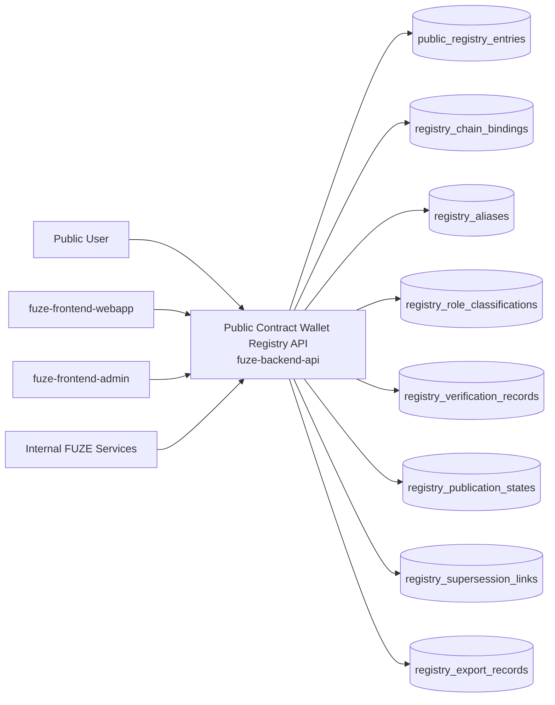
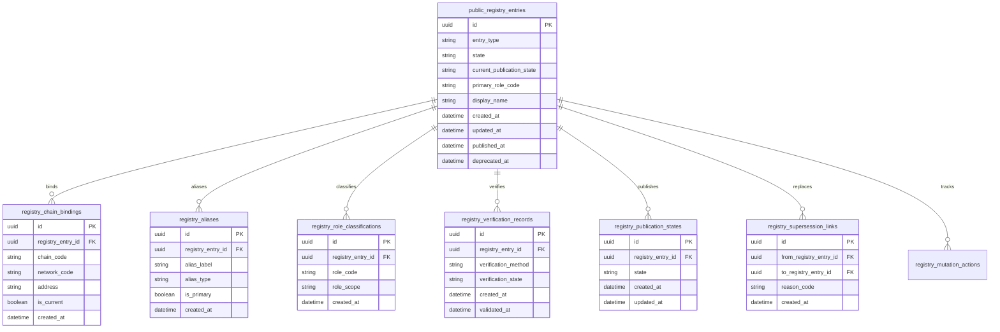
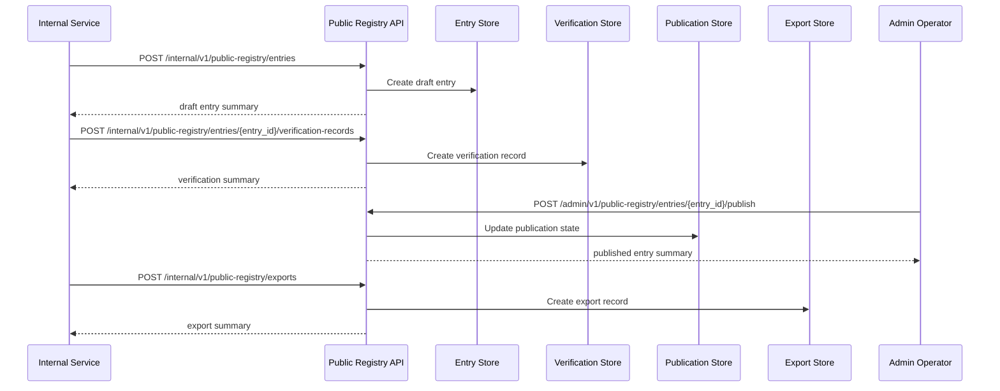

# PUBLIC_CONTRACT_WALLET_REGISTRY_API_SPEC

## 1. Title

**PUBLIC_CONTRACT_WALLET_REGISTRY_API_SPEC.md**

---

## 2. Document Metadata

- **Document Name:** PUBLIC_CONTRACT_WALLET_REGISTRY_API_SPEC.md
- **API Classification:** public, internal, admin, event-driven, chain-adjacent
- **Owning Domain:** Public Contract and Wallet Registry Domain
- **Primary Implementing Repo:** `fuze-backend-api`
- **Primary System of Record:** public contract registry entries, wallet registry entries, verification state, publication state, alias metadata, ownership/role attribution, and registry audit lineage in `fuze-backend-api`
- **Status:** Draft for canonical source-of-truth approval
- **Purpose:** Define the production-grade API contract architecture for FUZE public contract and wallet registry publication, lookup, verification-safe registry updates, and trust-oriented public-read access across the platform
- **Canonical Folder:** `fuze.ac > docs > api-spec`

---

## 2.1 API Classification Header

- **API Classification:** public | internal | admin | event-driven | chain-adjacent
- **Owning Domain:** Public Contract and Wallet Registry Domain
- **Primary Implementing Repo:** `fuze-backend-api`
- **Primary System of Record:** public registry and publication-control domain

---

## 3. Purpose

This document defines the canonical API specification for FUZE public contract and wallet registry operations. It translates the governing FUZE platform architecture, chain architecture, public contract and wallet registry rules, transparency rules, governance and treasury control rules, wallet-aware user rules, audit requirements, and API architecture rules into an implementation-ready API contract.

This API exists because FUZE must expose a trustworthy public-facing registry of official contracts and designated wallets without forcing users, partners, exchanges, auditors, or community members to infer authenticity from informal messages or scattered documents. The registry must therefore be platform-governed, publication-safe, verification-aware, and separated from private operational wallet state. Public registry entries are public trust artifacts. They must be stable, queryable, attributable, and audit-linked.

Accordingly, this specification defines how public contracts and wallets are represented, how publication and verification states are managed, how aliases and role classifications are exposed, how registry entries are read publicly, how admin/internal flows create or update registry records safely, and how registry behavior remains auditable, idempotent, and architecture-consistent across FUZE.

---

## 4. Scope

This specification covers:

- public registry lookup APIs for official contracts and wallets
- public list and detail APIs for registry entries
- internal service APIs for registry entry creation and update
- admin/control-plane APIs for verify, publish, deprecate, supersede, and correct registry entries
- alias and role classification APIs
- event emission requirements for registry publication lifecycle changes
- request, response, error, idempotency, versioning, audit, and database-shape rules for this domain

This specification does **not** redefine:

- smart-contract implementation details
- treasury execution policy in full detail
- multisig/timelock internals in full detail
- profit participation, payout, or credits ledger semantics in full detail
- private wallet operations or signing flows
- user wallet-linking semantics in full detail
- public transparency-report schema in full detail

Those remain governed by their own source-of-truth specifications.

---

## 5. Source-of-Truth Inputs

### Primary FUZE docs and specs used

#### Highest-priority platform and ownership sources
- `SYSTEM_SPEC_INDEX.md`
- `SYSTEM_BOUNDARY_AND_OWNERSHIP_SPEC.md`
- `SYSTEM_OVERVIEW_AND_BOUNDARIES_SPEC.md`
- `PLATFORM_ARCHITECTURE_SPEC.md`
- `DOMAIN_OWNERSHIP_MATRIX_SPEC.md`
- `DATA_MODEL_AND_ENTITY_OWNERSHIP_SPEC.md`
- `ONCHAIN_OFFCHAIN_RESPONSIBILITY_SPEC.md`

#### Primary public registry / chain / trust sources
- `PUBLIC_CONTRACT_AND_WALLET_REGISTRY_SPEC.md`
- `CHAIN_ARCHITECTURE_SPEC.md`
- `WALLET_AWARE_USER_SPEC.md`
- `TRANSPARENCY_MODEL_SPEC.md`
- `TRANSPARENCY_REPORTING_SPEC.md`
- `TREASURY_CONTROL_POLICY_SPEC.md`
- `VAULT_ACTION_POLICY_SPEC.md`
- `MULTISIG_AND_TIMELOCK_SPEC.md`
- `FOUNDATION_GOVERNANCE_SPEC.md`
- `GOVERNANCE_MODEL_SPEC.md`

#### API and runtime sources
- `API_ARCHITECTURE_SPEC.md`
- `PUBLIC_API_SPEC.md`
- `INTERNAL_SERVICE_API_SPEC.md`
- `EVENT_MODEL_AND_WEBHOOK_SPEC.md`
- `IDEMPOTENCY_AND_VERSIONING_SPEC.md`
- `MIGRATION_AND_BACKWARD_COMPATIBILITY_SPEC.md`
- `AUDIT_LOG_AND_ACTIVITY_SPEC.md`

#### Security and operations sources
- `SECURITY_AND_RISK_CONTROL_SPEC.md`
- `MONITORING_ALERTING_AND_INCIDENT_RESPONSE_SPEC.md`
- `SECRETS_CONFIG_AND_ENVIRONMENT_SPEC.md`

#### Core docs inputs
- `DOCS_SPEC.md`
- `FUZE_CHAIN_ARCHITECTURE.md`
- `STABLECOIN_PROFIT_PARTICIPATION.md`
- `TOKEN_CONTRACT_ARCHITECTURE_.md`
- `ALLOCATION_WALLET_MAP.md`
- tokenomics vault docs under `fuze.ac > docs/tokenomics/`

#### Format guides
- `The_API_Specification_guide.md`
- `Database_Schemas_Guide.md`

### Highest-priority interpretation applied

For this file, the most important governing interpretation is:

1. the registry is a public trust and discovery layer for officially designated FUZE contracts and wallets
2. backend owns canonical registry truth and publication state
3. public registry entries must be distinct from private operational wallet inventories
4. publication, verification, deprecation, and supersession must remain explicit
5. admin/control-plane may curate and publish registry entries under controlled policy but must not bypass audit lineage
6. public registry outputs must remain separated from wallet-aware user state, treasury action state, and private security material

### Supporting external standards used only as guidance

- HTTP semantics for public read APIs and controlled mutation APIs
- structured problem-details error design
- general public registry and alias-resolution lineage patterns as supporting guidance

External guidance does not override FUZE source-of-truth documents.

---

## 6. Governing Architecture and Ownership Interpretation

This API belongs to the **Public Contract and Wallet Registry Domain** because it owns the public publication layer for official on-chain addresses and related identity metadata. It governs which contracts and wallets are publicly declared official, how they are classified, when they are visible, and how supersession or deprecation is presented.

This API is implemented primarily in `fuze-backend-api` because:

- backend owns durable registry and publication truth
- public trust artifacts must be centrally controlled
- chain-side addresses need off-chain metadata, state, and publication controls
- verification, aliasing, deprecation, and supersession must be backend-governed
- audit generation and discrepancy handling must be centralized

This API is **not** owned by:

- `fuze-frontend-webapp`, because webapp only reads or triggers allowed publication workflows
- `fuze-frontend-admin`, because admin may publish or deprecate entries but must not own registry truth
- `fuze-contracts`, because deployed contracts and wallets exist on-chain, but registry publication metadata is an off-chain trust layer
- treasury, payouts, or wallet-aware user domains, because they may reference registry entries but do not own public publication semantics
- `fuze-public-registry`, because that repository stores derived public artifacts and exports, while canonical mutable registry truth is owned by `fuze-backend-api`

### Architectural implications

- registry entries are public-facing identifiers for official FUZE contracts and wallets
- one address may map to one current canonical registry entry within a chain/network scope
- aliases, roles, and status labels must remain explicit
- deprecations and replacements must preserve lineage
- public visibility must not expose private notes, signer details, secret material, or internal security posture
- registry publication is a trust signal, not itself a treasury execution or governance action

---

## 7. Domain Responsibilities

The Public Contract and Wallet Registry API domain is responsible for:

1. maintaining canonical public registry entries for official contracts and wallets
2. exposing public list and detail views for official addresses
3. tracking address roles, aliases, chains, networks, and publication status
4. recording verification and publication lineage
5. supporting admin publication, deprecation, and supersession workflows
6. supporting internal synchronization and export to public trust artifacts
7. emitting registry lifecycle events
8. generating audit lineage for sensitive publication actions
9. preserving separation between public registry truth and private operational wallet truth
10. supporting safe public lookup for partners, users, and community members

The domain is not responsible for:

- signing or broadcasting on-chain transactions
- executing treasury or vault actions
- proving live balance or ownership cryptographically in this API contract
- managing user-linked wallets as a private identity system
- replacing transparency reports or payout artifacts
- serving as the full chain-indexing subsystem

---

## 8. Out of Scope

The following are out of scope for this API specification:

- private hot/cold wallet inventory exposure
- signer management or key custody flows
- exchange integration specifics
- on-chain event indexing internals
- final static-site export format details for `fuze-public-registry`
- full ENS or external name-service management
- block explorer deep integration details
- final cross-chain proof standards for every future network

Where later detailed specs are needed, they must remain compatible with this API.

---

## 9. Canonical Entities and Data Ownership

### Durable entities

#### 9.1 public_registry_entries
- **Owner:** Public Contract and Wallet Registry Domain
- **Purpose:** canonical public registry records for contracts and wallets
- **Nature:** source-of-truth durable entity

#### 9.2 registry_aliases
- **Owner:** Public Contract and Wallet Registry Domain
- **Purpose:** alternate public labels and aliases for registry entries
- **Nature:** source-of-truth durable entity

#### 9.3 registry_role_classifications
- **Owner:** Public Contract and Wallet Registry Domain
- **Purpose:** role and category assignments such as token contract, treasury reserve vault, foundation vault, payout wallet, multisig, liquidity ops wallet, etc.
- **Nature:** source-of-truth durable entity

#### 9.4 registry_verification_records
- **Owner:** Public Contract and Wallet Registry Domain
- **Purpose:** lineage of how an entry was verified for publication
- **Nature:** durable verification lineage entity

#### 9.5 registry_publication_states
- **Owner:** Public Contract and Wallet Registry Domain
- **Purpose:** publication lifecycle and visibility state for registry entries
- **Nature:** source-of-truth durable entity

#### 9.6 registry_supersession_links
- **Owner:** Public Contract and Wallet Registry Domain
- **Purpose:** links between deprecated/replaced registry entries
- **Nature:** durable lineage entity

#### 9.7 registry_chain_bindings
- **Owner:** Public Contract and Wallet Registry Domain
- **Purpose:** chain/network/address binding metadata for each entry
- **Nature:** source-of-truth durable entity

#### 9.8 registry_export_records
- **Owner:** Public Contract and Wallet Registry Domain
- **Purpose:** lineage of export or publication pushes to derived public artifacts
- **Nature:** durable export lineage entity

#### 9.9 registry_mutation_actions
- **Owner:** Public Contract and Wallet Registry Domain
- **Purpose:** high-level action records for create, verify, publish, deprecate, supersede, and correct
- **Nature:** durable action records with audit linkage

#### 9.10 registry_audit_events
- **Owner:** Audit / Activity domain, sourced by Public Contract and Wallet Registry Domain
- **Purpose:** immutable trail for sensitive publication actions
- **Nature:** durable audit records

### Derived or cached entities

#### 9.11 registry_public_views
- **Owner:** derived read-model layer
- **Purpose:** public-safe list and detail representations
- **Nature:** derived

#### 9.12 registry_lookup_views
- **Owner:** derived read-model layer
- **Purpose:** optimized search and direct address-lookup responses
- **Nature:** derived

#### 9.13 registry_discrepancy_views
- **Owner:** derived ops read-model layer
- **Purpose:** visibility into duplicate, conflicting, unpublished, or stale registry conditions
- **Nature:** derived

---

## 10. State Model and Lifecycle

### 10.1 registry entry lifecycle

Possible states:

- `draft`
- `verified`
- `published`
- `deprecated`
- `superseded`
- `revoked_if_required`

### 10.2 verification lifecycle

Possible states:

- `pending`
- `validated`
- `rejected`
- `superseded`

### 10.3 publication lifecycle

Possible states:

- `unpublished`
- `published`
- `hidden`
- `deprecated`
- `archived`

### 10.4 export lifecycle

Possible states:

- `pending`
- `generated`
- `published`
- `failed`
- `superseded`

Lifecycle notes:
- draft entries are not visible in public APIs
- verified does not necessarily mean publicly published yet
- deprecated entries may remain publicly visible with replacement guidance
- supersession must preserve old-to-new lineage rather than erase history
- revocation is exceptional and must preserve clear public trust messaging

---

## 11. API Surface Overview

The API surface is divided into four families:

### 11.1 Public read APIs
Used by public users, partners, exchanges, and community members for:
- listing official contracts and wallets
- looking up one address directly
- reading detail for one registry entry
- reading public role, alias, chain, and status summaries

### 11.2 First-party authenticated read APIs
Used by `fuze-frontend-webapp` and approved first-party clients for:
- reading the same public registry views
- optionally reading bounded publication metadata if policy allows

### 11.3 Internal service APIs
Used by trusted internal services for:
- creating registry entries
- attaching verification and classification metadata
- syncing/exporting public artifacts
- reading canonical registry truth

### 11.4 Admin / control-plane APIs
Used by `fuze-frontend-admin` through backend-only privileged routes for:
- verify/publish/deprecate/supersede actions
- alias and role corrections
- discrepancy resolution
- export remediation

---

## 12. Authentication and Authorization Model

### 12.1 Authentication posture by route family

#### Public read routes
No authentication required:
- list published entries
- direct address lookup
- published detail views

#### Internal service routes
Require internal service identity with explicit least privilege:
- create draft entries
- attach chain bindings, roles, aliases
- write verification records
- trigger exports
- read canonical registry records

#### Admin routes
Require privileged operator identity plus reason-coded actions:
- verify and publish entries
- deprecate or supersede entries
- correct aliases or role classifications
- resolve discrepancies
- retry export/publication remediation

### 12.2 Authorization checkpoints

Authorization must evaluate:
- caller identity and route family
- target scope of action
- whether entry is public-only or privileged internal state
- whether internal service has write privilege for registry mutations
- whether admin/operator role is present for publication or deprecation actions
- whether current state allows requested mutation

### 12.3 Sensitive action rules

The following require heightened checks:
- publication of new official addresses
- deprecation or revocation of existing published addresses
- supersession links for important roles
- export/publication retries after failure
- discrepancy-resolution actions

---

## 13. API Endpoints / Interface Contracts

## 13.1 Public Read APIs

### 13.1.1 `GET /v1/public-registry/contracts`
**Purpose:** list published official contract entries  
**Caller Type:** public  
**Auth Expectation:** none  
**Query Parameters Summary:**
- optional `chain_code`
- optional `network_code`
- optional `role_code`
- pagination
**Response Summary:**
- published contract summaries
- contract address
- role classification
- alias summary
- chain/network summary
- status
**Side Effects:** none
**Audit Requirements:** access logging optional
**Emitted Events:** none required

### 13.1.2 `GET /v1/public-registry/wallets`
**Purpose:** list published official wallet entries  
**Caller Type:** public  
**Query Parameters Summary:**
- optional `chain_code`
- optional `network_code`
- optional `role_code`
- pagination
**Response Summary:** published wallet summaries and status metadata
**Side Effects:** none

### 13.1.3 `GET /v1/public-registry/lookup`
**Purpose:** direct public lookup by chain/network/address  
**Caller Type:** public  
**Query Parameters Summary:**
- `chain_code`
- `network_code`
- `address`
**Response Summary:**
- match or no-match result
- published registry summary
- deprecation/replacement summary where relevant
**Side Effects:** none

### 13.1.4 `GET /v1/public-registry/entries/{registry_entry_id}`
**Purpose:** retrieve one published registry entry detail  
**Caller Type:** public  
**Response Summary:**
- public detail view
- role and alias summaries
- chain binding summary
- publication status
- replacement guidance where relevant
**Side Effects:** none

## 13.2 Internal Service APIs

### 13.2.1 `POST /internal/v1/public-registry/entries`
**Purpose:** create draft registry entry for contract or wallet  
**Caller Type:** internal trusted service  
**Auth Expectation:** service-to-service identity only  
**Request Body Summary:**
- `entry_type` (`contract` or `wallet`)
- `chain_code`
- `network_code`
- `address`
- `primary_role_code`
- optional `alias_labels[]`
- optional `metadata_summary`
- `idempotency_key`
**Response Summary:** draft registry-entry summary
**Side Effects:** creates draft entry, chain binding, initial role linkage, and aliases if provided
**Idempotency Behavior:** required
**Audit Requirements:** sensitive registry-ingest audit
**Emitted Events:** `registry.entry_created`

### 13.2.2 `POST /internal/v1/public-registry/entries/{registry_entry_id}/verification-records`
**Purpose:** attach verification lineage to one draft or updated entry  
**Caller Type:** internal trusted service  
**Request Body Summary:**
- `verification_method`
- `verification_summary`
- `idempotency_key`
**Response Summary:** verification-record summary and entry state summary
**Side Effects:** creates verification record, may advance verification state
**Idempotency Behavior:** required
**Audit Requirements:** verification audit
**Emitted Events:** `registry.entry_verified`

### 13.2.3 `POST /internal/v1/public-registry/exports`
**Purpose:** generate or push derived public registry artifact from canonical registry truth  
**Caller Type:** internal trusted service  
**Request Body Summary:**
- optional `export_scope`
- optional `target_artifact`
- `idempotency_key`
**Response Summary:** export-record summary
**Side Effects:** creates export lineage and may generate derived artifact
**Idempotency Behavior:** required
**Audit Requirements:** export audit where sensitivity requires
**Emitted Events:** `registry.export_generated`, `registry.export_failed`

### 13.2.4 `GET /internal/v1/public-registry/entries/{registry_entry_id}`
**Purpose:** retrieve canonical registry-entry truth for trusted services  
**Caller Type:** internal trusted service  
**Response Summary:** full registry entry, aliases, roles, verification, publication, supersession, and export lineage
**Side Effects:** none

## 13.3 Admin / Control-Plane APIs

### 13.3.1 `POST /admin/v1/public-registry/entries/{registry_entry_id}/publish`
**Purpose:** publish verified registry entry to public read surfaces  
**Caller Type:** admin/operator  
**Request Body Summary:**
- `reason_code`
- `operator_note`
- `idempotency_key`
**Response Summary:** published entry summary
**Side Effects:** publication state moves to published, entry becomes visible on public routes
**Audit Requirements:** critical audit
**Emitted Events:** `registry.entry_published`

### 13.3.2 `POST /admin/v1/public-registry/entries/{registry_entry_id}/deprecate`
**Purpose:** deprecate a published entry under controlled policy  
**Caller Type:** admin/operator  
**Request Body Summary:**
- `reason_code`
- optional `replacement_entry_id`
- `operator_note`
- `idempotency_key`
**Response Summary:** deprecated entry summary
**Side Effects:** entry transitions to deprecated, replacement linkage may be attached
**Audit Requirements:** critical audit
**Emitted Events:** `registry.entry_deprecated`

### 13.3.3 `POST /admin/v1/public-registry/entries/{registry_entry_id}/supersede`
**Purpose:** supersede one entry with another published or publishable entry  
**Caller Type:** admin/operator  
**Request Body Summary:**
- `replacement_entry_id`
- `reason_code`
- `operator_note`
- `idempotency_key`
**Response Summary:** supersession summary
**Side Effects:** creates supersession linkage and updates current/public preference state
**Audit Requirements:** critical audit
**Emitted Events:** `registry.entry_superseded`

### 13.3.4 `POST /admin/v1/public-registry/entries/{registry_entry_id}/role-corrections`
**Purpose:** correct alias or role classification for one registry entry  
**Caller Type:** admin/operator  
**Request Body Summary:**
- optional `primary_role_code`
- optional `alias_labels[]`
- `reason_code`
- `operator_note`
- `idempotency_key`
**Response Summary:** corrected entry summary
**Side Effects:** role/alias metadata updated with preserved correction lineage
**Audit Requirements:** critical audit
**Emitted Events:** `registry.entry_corrected`

### 13.3.5 `POST /admin/v1/public-registry/discrepancies`
**Purpose:** resolve registry discrepancy under controlled policy  
**Caller Type:** admin/operator  
**Request Body Summary:**
- `target_reference_type`
- `target_reference_id`
- `resolution_code`
- `operator_note`
- `related_case_id`
- `idempotency_key`
**Response Summary:** discrepancy-resolution summary
**Side Effects:** may publish, deprecate, supersede, correct, or close export discrepancy with preserved lineage
**Audit Requirements:** critical audit
**Emitted Events:** `registry.discrepancy_resolved`

---

## 14. Request Rules

### 14.1 General request rules
- all mutation-capable routes must require JSON requests with explicit content type
- all mutation routes must carry correlation IDs
- sensitive registry mutations must carry idempotency keys
- admin mutations must require reason codes and operator notes
- no route may accept frontend-authored registry truth as authoritative input

### 14.2 Sensitive-action request requirements
The following requests require heightened validation:
- new official address creation
- verification and publication
- deprecation or supersession
- role/alias correction on high-trust entries
- discrepancy-resolution actions

Heightened validation may include:
- chain/network/address normalization checks
- duplicate-address checks
- verification-state checks
- publication-state checks
- operator role confirmation
- governance/security case linkage for high-sensitivity entries

### 14.3 Scope integrity rule
Registry mutations must target valid chain/network/address combinations and authorized registry records. Services and operators must not mutate unrelated or unauthorized registry state.

### 14.4 Public-private separation rule
Only explicitly published public-safe metadata may appear in public responses. Internal verification notes, operator notes, security flags, signer details, or private wallet context must remain out of public routes.

---

## 15. Response Rules

### 15.1 Success response rules
Successful responses must include:
- stable resource identifiers
- timestamps for created/updated state
- state/status values
- chain/network/address summaries
- role and alias summaries where relevant
- correlation references for mutations

### 15.2 Async-accepted response rules
If export generation or discrepancy remediation is async, the response must:
- return accepted status
- include action or job ID
- provide follow-up status semantics

### 15.3 Terminal mutation response rules
Terminal mutation responses must clearly show:
- target entry or export
- mutation type
- resulting registry/publication state
- replacement or deprecation effects where relevant
- whether public views may refresh asynchronously

### 15.4 Read response rules
Read responses must distinguish:
- canonical registry truth on internal routes
- public-safe registry views on public routes
- publication status
- supersession/deprecation guidance where relevant

---

## 16. Error Model

The API uses structured problem-details style error responses.

### 16.1 Required error fields
- `type`
- `title`
- `status`
- `code`
- `detail`
- `instance`
- `correlation_id`

### 16.2 Common error codes

#### Authorization / permission errors
- `REGISTRY_PERMISSION_DENIED`
- `REGISTRY_OPERATOR_PERMISSION_DENIED`
- `REGISTRY_SERVICE_PERMISSION_DENIED`

#### State conflict errors
- `REGISTRY_ENTRY_STATE_INVALID`
- `REGISTRY_ENTRY_ALREADY_PUBLISHED`
- `REGISTRY_ENTRY_ALREADY_DEPRECATED`
- `REGISTRY_SUPERSESSION_CONFLICT`
- `REGISTRY_EXPORT_CONFLICT`

#### Policy / safety errors
- `REGISTRY_DUPLICATE_ADDRESS`
- `REGISTRY_VERIFICATION_REQUIRED`
- `REGISTRY_PUBLICATION_FORBIDDEN`
- `REGISTRY_ROLE_NOT_ALLOWED`
- `REGISTRY_PRIVATE_METADATA_FORBIDDEN`

#### Request integrity errors
- `REGISTRY_IDEMPOTENCY_KEY_REQUIRED`
- `REGISTRY_REQUEST_INVALID`
- `REGISTRY_REQUEST_UNPROCESSABLE`

#### Dependency or provider errors
- `REGISTRY_EXPORT_UNAVAILABLE`
- `REGISTRY_STORAGE_UNAVAILABLE`
- `REGISTRY_CHAIN_BINDING_UNAVAILABLE`

### 16.3 Error handling rules
- do not expose hidden internal security or private wallet detail in public responses
- do not imply treasury or governance execution from registry publication
- distinguish unpublished/no-match from forbidden/private visibility
- distinguish verification-required from generic invalid state
- include retry guidance only where safe

---

## 17. Idempotency and Mutation Safety

### 17.1 Required idempotent mutations
The following mutation routes require idempotent behavior:
- entry creation
- verification record creation
- export generation
- publish
- deprecate
- supersede
- role/alias correction
- discrepancy resolution

### 17.2 Idempotency key rules
- mutation requests must supply `Idempotency-Key`
- backend stores key scope, request hash, actor, and terminal result
- replay of same semantic request returns original terminal outcome
- replay of same key with different semantic request must fail with conflict

### 17.3 Mutation safety rules
- one canonical current public entry per address within chain/network scope unless supersession-safe lineage explicitly exists
- publication must not occur before required verification state
- supersession must preserve old-to-new lineage
- corrections must preserve audit lineage rather than rewrite hidden history
- public exports must derive from canonical registry truth, not bypass it

---

## 18. Versioning and Compatibility Rules

### 18.1 Versioning
This API family is versioned under `/v1`, `/internal/v1`, and `/admin/v1` route families.

### 18.2 Compatibility approach
- additive evolution preferred
- no silent semantic change to published, deprecated, superseded, or verification states
- new role codes, alias types, chains, and networks may be added without breaking existing contracts
- response fields may be added but existing meanings must remain stable

### 18.3 Breaking-change rules
Breaking changes include:
- changing the meaning of published/deprecated/superseded states
- changing public role semantics incompatibly
- removing critical address, chain, or replacement fields
- changing direct lookup semantics incompatibly

Such changes require explicit migration planning and version evolution.

### 18.4 Deprecation
Deprecated routes or fields must:
- be documented explicitly
- carry deprecation metadata where supported
- preserve compatibility windows long enough for public and first-party consumers

---

## 19. Event Emission and Webhook Behavior

This domain is event-capable.

### 19.1 Internal events
The Public Contract and Wallet Registry domain must emit canonical internal events such as:
- `registry.entry_created`
- `registry.entry_verified`
- `registry.entry_published`
- `registry.entry_deprecated`
- `registry.entry_superseded`
- `registry.entry_corrected`
- `registry.export_generated`
- `registry.export_failed`
- `registry.discrepancy_resolved`

### 19.2 Event payload minimums
Each event should contain:
- event ID
- event type
- occurred_at
- registry entry ID
- entry type
- chain/network/address summary
- role summary where relevant
- actor type
- correlation ID
- reason code where applicable

### 19.3 External webhook posture
This specification does not expose general third-party outbound registry webhooks by default. Any future outbound registry webhook surface must be narrow, security-reviewed, and governed by a separate contract.

---

## 20. Audit and Activity Requirements

The following actions must generate durable audit events:

- registry entry creation
- verification record creation
- publication
- deprecation or supersession
- role/alias corrections
- export generation or failure where sensitivity requires
- discrepancy resolution
- other sensitive registry-domain mutations

### Required audit fields
- audit event ID
- actor type and actor reference
- target entry / export / discrepancy reference as applicable
- action type
- before/after registry summary where applicable
- reason code
- correlation ID
- operator note if operator action
- occurred_at

Public-facing activity may show selected publication events, but canonical internal audit truth remains durable and immutable.

---

## 21. Data Model and Database Schema View

### 21.1 `public_registry_entries`
- `id` PK
- `entry_type`
- `state`
- `current_publication_state`
- `primary_role_code`
- `display_name`
- `public_summary_json`
- `created_at`
- `updated_at`
- `published_at` nullable
- `deprecated_at` nullable

**Constraints:**
- index on (`entry_type`, `state`)
- index on `current_publication_state`

### 21.2 `registry_chain_bindings`
- `id` PK
- `registry_entry_id` FK -> `public_registry_entries.id`
- `chain_code`
- `network_code`
- `address`
- `is_current`
- `created_at`

**Constraints:**
- unique (`chain_code`, `network_code`, `address`, `is_current`) under current-entry policy
- index on (`chain_code`, `network_code`, `address`)
- index on `registry_entry_id`

### 21.3 `registry_aliases`
- `id` PK
- `registry_entry_id` FK -> `public_registry_entries.id`
- `alias_label`
- `alias_type`
- `is_primary`
- `created_at`

**Constraints:**
- index on `registry_entry_id`
- index on `alias_label`

### 21.4 `registry_role_classifications`
- `id` PK
- `registry_entry_id` FK -> `public_registry_entries.id`
- `role_code`
- `role_scope`
- `created_at`

**Constraints:**
- index on `registry_entry_id`
- index on `role_code`

### 21.5 `registry_verification_records`
- `id` PK
- `registry_entry_id` FK -> `public_registry_entries.id`
- `verification_method`
- `verification_state`
- `verification_summary_json`
- `created_at`
- `validated_at` nullable

**Constraints:**
- index on `registry_entry_id`
- index on `verification_state`

### 21.6 `registry_publication_states`
- `id` PK
- `registry_entry_id` FK -> `public_registry_entries.id`
- `state`
- `reason_code` nullable
- `created_at`
- `updated_at`

**Constraints:**
- index on `registry_entry_id`
- index on `state`

### 21.7 `registry_supersession_links`
- `id` PK
- `from_registry_entry_id` FK -> `public_registry_entries.id`
- `to_registry_entry_id` FK -> `public_registry_entries.id`
- `reason_code`
- `created_at`

**Constraints:**
- unique (`from_registry_entry_id`, `to_registry_entry_id`)
- index on `from_registry_entry_id`
- index on `to_registry_entry_id`

### 21.8 `registry_export_records`
- `id` PK
- `export_scope`
- `target_artifact`
- `state`
- `source_snapshot_reference`
- `created_at`
- `completed_at` nullable
- `failed_at` nullable

### 21.9 `registry_mutation_actions`
- `id` PK
- `target_reference_type`
- `target_reference_id`
- `action_type`
- `state`
- `reason_code`
- `operator_note` nullable
- `requested_by_actor_type`
- `requested_by_actor_id`
- `created_at`
- `executed_at` nullable
- `closed_at` nullable
- `correlation_id`

### 21.10 `idempotency_records`
- `id` PK
- `idempotency_key`
- `scope_family`
- `actor_reference`
- `request_hash`
- `response_hash`
- `terminal_status`
- `created_at`
- `expires_at`

### 21.11 `audit_log_entries`
Domain-sourced audit records written into the audit domain.

### Normalization notes
- canonical registry truth stays in registry entries, chain bindings, aliases, roles, verification, and publication tables
- public list/detail routes must derive from canonical current published state
- private notes or internal verification detail must remain outside public response shapes
- public artifact exports remain derived from canonical registry truth

### Reconciliation notes
- one published public entry should reconcile to one current chain/network/address binding
- deprecated and superseded entries must preserve replacement lineage
- export records must reconcile to canonical registry snapshots
- duplicate-address discrepancies must be explicitly reviewable

---

## 22. Architecture Diagram — Mermaid flowchart



---

## 23. Data Design — Mermaid Diagram



---

## 24. Flow View

### 24.1 Happy path — create and publish entry
1. internal service creates draft registry entry for contract or wallet
2. chain/network/address binding and role metadata are attached
3. verification lineage is recorded
4. admin reviews and publishes verified entry
5. entry becomes visible on public list/detail/lookup routes
6. audit and registry events are emitted

### 24.2 Happy path — public lookup
1. public actor submits chain/network/address lookup
2. backend searches current published registry bindings
3. matching published entry is returned with public-safe detail
4. if deprecated, replacement guidance is included where relevant

### 24.3 Alternate path — deprecate and replace
1. existing published entry is no longer canonical for public guidance
2. admin deprecates entry and optionally links replacement
3. old entry remains historically visible with deprecation label
4. new entry becomes canonical current result

### 24.4 Failure path — verification missing
1. internal or admin publish action is attempted
2. backend detects missing or insufficient verification state
3. publish is rejected
4. no public visibility change occurs

### 24.5 Failure and remediation path — duplicate or conflicting registry state
1. duplicate chain/network/address or role conflict is detected
2. admin opens discrepancy resolution
3. backend preserves existing lineage
4. entry may be corrected, deprecated, superseded, or export retried
5. discrepancy closes with preserved history

### 24.6 Export path
1. internal service triggers export generation
2. backend snapshots canonical registry truth
3. export record is created
4. derived public artifact is generated or marked failed
5. export lineage remains queryable for remediation

### 24.7 Retry behavior
- duplicate entry creation returns same canonical draft entry or duplicate-safe conflict
- duplicate verification write returns same verification result where applicable
- duplicate publish/deprecate/supersede returns same terminal action result
- duplicate export/discrepancy actions return same terminal action result

---

## 25. Data Flows — Mermaid sequenceDiagram



---

## 26. Security and Risk Controls

1. **Registry truth is backend-owned**  
   Frontends and informal surfaces may not authoritatively define official contract or wallet registry truth.

2. **Public registry is distinct from private wallet operations**  
   The API must keep public registry metadata separate from private operational wallet data.

3. **Verification-before-publication**  
   Publication must require explicit verification state according to policy.

4. **Least privilege**  
   Internal write and admin publication routes must be limited to authorized services and operators.

5. **Immutable lineage for trust changes**  
   Deprecation, supersession, and correction must preserve historical lineage rather than erase prior records.

6. **Public-private field separation**  
   Public routes must never expose internal verification notes, private metadata, or operator/security details.

7. **Problem-details discipline**  
   Error bodies must be structured and safe, without exposing hidden internal-only details.

8. **Audit immutability**  
   Sensitive registry actions require durable immutable audit lineage.

9. **Replay resistance**  
   Entry creation, verification, publication, correction, and export actions must be idempotent and replay-safe.

10. **Public trust messaging control**  
    Deprecated or superseded entries must guide readers clearly without silently disappearing when historical visibility is still required.

---

## 27. Operational Considerations

- public lookup routes should be highly available and cache-friendly
- publication and deprecation flows are correctness-sensitive and must preserve trust integrity
- export generation and public artifact sync should be observable and retryable
- duplicate-address and conflicting-role anomalies should surface clearly to ops views
- monitoring should alert on:
  - failed publication attempts
  - export generation failures
  - duplicate-address discrepancy spikes
  - unusual deprecation or supersession volume
  - public lookup failures
  - registry-canonical vs export drift

---

## 28. Acceptance Criteria

1. The API preserves the distinction between public registry truth and private wallet-operational truth.
2. Only `fuze-backend-api` owns canonical registry and publication truth.
3. Registry entries, bindings, aliases, roles, verification, and publication state are durable and backend-owned.
4. Public routes expose only published public-safe metadata.
5. Verification is required before publication where policy demands it.
6. Deprecation and supersession preserve immutable lineage.
7. Publication, correction, and export actions are idempotent and auditable.
8. Internal and admin registry routes are least-privilege and backend-only.
9. Admin routes require reason-coded privileged authorization.
10. Event emissions exist for major registry mutations.
11. Response and error semantics are stable and machine-readable.
12. Database schema separates canonical entries, chain bindings, aliases, roles, verification, publication, and supersession layers.
13. Public consumers can rely on canonical lookup routes without needing hidden internal context.
14. Discrepancy handling is supported and safely replayable.
15. Mermaid diagrams remain consistent with prose and data model.

---

## 29. Test Cases

### 29.1 Positive cases
1. Internal service creates draft contract registry entry successfully.
2. Internal service attaches verification record successfully.
3. Admin publishes verified entry successfully.
4. Public actor looks up published address successfully.
5. Public actor reads published contract list successfully.
6. Admin deprecates old entry with replacement successfully.
7. Admin corrects alias/role metadata successfully.
8. Internal service triggers export successfully.

### 29.2 Negative cases
9. Public user cannot access internal registry draft detail.
10. Internal service without write privilege cannot create entry.
11. Publish without required verification returns `REGISTRY_VERIFICATION_REQUIRED`.
12. Duplicate current address binding returns `REGISTRY_DUPLICATE_ADDRESS`.
13. Attempt to supersede with invalid replacement state returns state conflict.
14. Public lookup for unpublished address returns no-match or unpublished-safe result.

### 29.3 Authorization cases
15. Ordinary public user cannot call admin publish/deprecate routes.
16. Internal service without export privilege cannot trigger export.
17. Operator without publication privilege cannot publish entry.
18. Registry publication does not authorize treasury action or wallet signing.

### 29.4 Idempotency and replay cases
19. Repeating entry creation with same idempotency key returns original draft entry result.
20. Repeating verification write with same idempotency key returns original verification result.
21. Repeating publish with same idempotency key returns original publish result.
22. Repeating export or discrepancy resolution with same idempotency key returns original action result.

### 29.5 Concurrency cases
23. Concurrent publish and deprecate actions preserve one explicit current publication lineage.
24. Concurrent duplicate entry creation attempts on same address produce one canonical current-entry lineage and one duplicate-safe outcome.
25. Concurrent supersede and role-correction actions preserve explicit lineage without hidden overwrite.

### 29.6 Recovery / admin cases
26. Deprecated entry remains historically queryable with replacement guidance.
27. Export failure can be retried under controlled policy with explicit export lineage.
28. Discrepancy resolution closes duplicate-address conflict with preserved audit history.

### 29.7 Event and audit cases
29. Successful entry creation emits `registry.entry_created`.
30. Successful verification emits `registry.entry_verified`.
31. Successful publication emits `registry.entry_published`.
32. Successful deprecation emits `registry.entry_deprecated`.
33. Successful discrepancy resolution emits `registry.discrepancy_resolved` with critical audit lineage.

---

## 30. Open Questions or Explicit Deferred Decisions

1. Exact role-code taxonomy for all future public registry categories is deferred.
2. Exact cross-chain naming and network-code normalization rules are deferred.
3. Exact public export format and sync cadence to `fuze-public-registry` are deferred.
4. Exact historical visibility policy for revoked entries is deferred.
5. Exact public-safe metadata fields for every entry type are deferred.
6. Exact discrepancy taxonomy for registry conflicts is deferred.

---

## 31. Implementation Notes for `fuze-backend-api`

Recommended backend module layout:

```text
modules/platform/
  public-registry/
  chain-registry/
  audit-log/
  control-plane/
  integrations/
```

Implementation guidance:
- keep registry entry identity, chain binding, role/alias classification, verification, publication, and supersession lineage in one canonical domain service
- perform address normalization and duplicate-current-binding checks inside the commit boundary
- keep publication, deprecation, and correction actions explicit and idempotent
- treat admin remediations as domain actions, not ad hoc row edits
- emit events only after canonical state commit succeeds
- publish public lookup views from canonical truth; do not let derived exports mutate canonical registry state

---

## 32. Frontend Consumption Notes

### For `fuze-frontend-webapp`
- may read public registry lists, detail pages, and lookup results
- must not infer unpublished or draft registry truth from frontend configuration alone
- must treat backend public registry responses as authoritative
- should clearly distinguish current, deprecated, and superseded entries

### For `fuze-frontend-admin`
- may trigger privileged publish, deprecate, supersede, correction, and discrepancy actions only through backend admin APIs
- must require operator reason input for sensitive mutations
- must not directly mutate canonical registry truth client-side
- should present immutable publication lineage and correction history separately from current public view

---

## 33. Contract Derivation Notes

### OpenAPI / AsyncAPI
This spec should later derive into:
- public list, detail, and direct lookup operations
- internal entry creation, verification, and export operations
- admin publish / deprecate / supersede / correction / discrepancy operations
- shared problem-details schema
- registry lifecycle events in AsyncAPI

### Future `fuze-sdk`
Future `fuze-sdk` packages may derive:
- public registry lookup helpers
- typed contract and wallet registry models
- public alias/role resolution helpers
- problem-error models for registry outcomes

The SDK must derive from approved API contracts and must not become the source of truth over this narrative specification.
