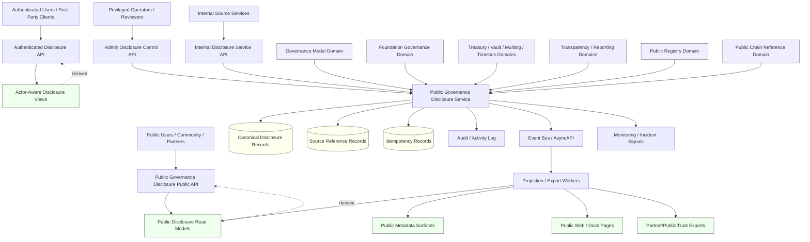
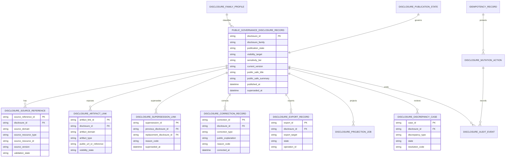
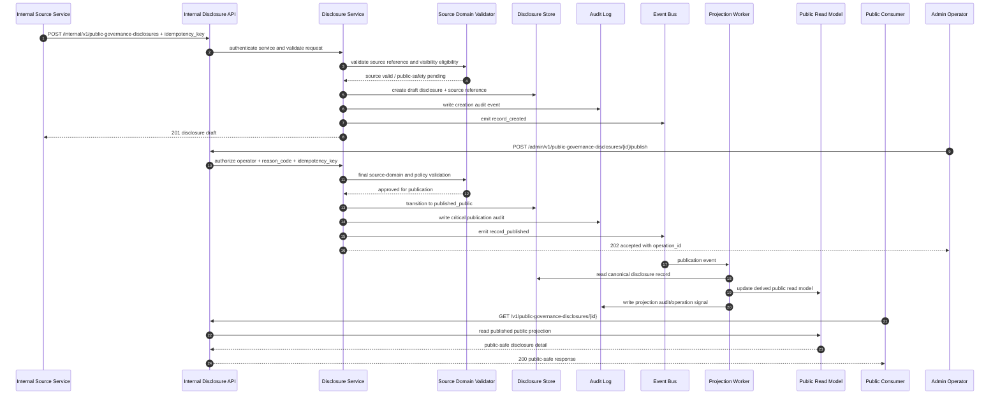

# PUBLIC_GOVERNANCE_DISCLOSURE_API_SPEC.md

## Document Metadata

- **Document Name:** `PUBLIC_GOVERNANCE_DISCLOSURE_API_SPEC.md`
- **Document Type:** FUZE API SPEC v2 production-grade interface-contract specification
- **Status:** Draft for canonical API SPEC v2 approval
- **Version:** 2.0.0
- **Effective Date:** 2026-04-25
- **Last Updated:** 2026-04-25
- **Reviewed On:** 2026-04-25
- **Document Owner:** FUZE Public Governance Disclosure Domain; named individual owner is not explicitly specified in the retrieved governing materials
- **Approval Authority:** Not explicitly specified in retrieved governing materials; approval remains subject to the active FUZE approval workflow and the governing registry hierarchy
- **Review Cadence:** SHOULD be reviewed quarterly and whenever governance-model posture, Foundation governance posture, treasury-control posture, vault-action posture, multisig/timelock posture, public transparency posture, public registry posture, public API exposure posture, or public-trust disclosure policy materially changes
- **Governing Layer:** API contract layer / public-read and publication-facing governance disclosure layer
- **Parent Registry:** `API_SPEC_INDEX.md` and the API SPEC v2 Canonical File Registry
- **Upstream Semantic Registry:** `REFINED_SYSTEM_SPEC_INDEX.md`
- **Upstream API Registry:** `API_SPEC_INDEX.md`
- **Primary Audience:** Platform architecture, backend engineering, public API authors, governance/control-plane authors, Foundation and treasury stakeholders, security engineering, audit/compliance, transparency/reporting authors, public-trust stakeholders, implementation-contract authors, SDK/OpenAPI/AsyncAPI authors
- **Primary Purpose:** Define the canonical FUZE API contract for public governance disclosure surfaces, including public-safe governance policy summaries, governance action disclosure records, Foundation/governance disclosure references, approval-path summaries, control-reference summaries, public reporting linkages, correction/supersession lineage, and trust-safe public-read governance disclosure without exposing unsafe internal governance, treasury, signer, or control-plane detail
- **Primary Upstream References:** `REFINED_SYSTEM_SPEC_INDEX.md`, `DOCS_SPEC_INDEX.md`, `SYSTEM_SPEC_INDEX.md`, `API_SPEC_INDEX.md`, `GOVERNANCE_MODEL_SPEC.md`, `FOUNDATION_GOVERNANCE_SPEC.md`, `TREASURY_CONTROL_POLICY_SPEC.md`, `VAULT_ACTION_POLICY_SPEC.md`, `MULTISIG_AND_TIMELOCK_SPEC.md`, `TRANSPARENCY_MODEL_SPEC.md`, `TRANSPARENCY_REPORTING_SPEC.md`, `PUBLIC_CONTRACT_AND_WALLET_REGISTRY_SPEC.md`, `PUBLIC_API_SPEC.md`, `API_ARCHITECTURE_SPEC.md`, `INTERNAL_SERVICE_API_SPEC.md`, `EVENT_MODEL_AND_WEBHOOK_SPEC.md`, `IDEMPOTENCY_AND_VERSIONING_SPEC.md`, `MIGRATION_AND_BACKWARD_COMPATIBILITY_SPEC.md`, `AUDIT_LOG_AND_ACTIVITY_SPEC.md`, `AUDIT_AND_ACCESS_TRACEABILITY_SPEC.md`, `SECURITY_AND_RISK_CONTROL_SPEC.md`, `MONITORING_ALERTING_AND_INCIDENT_RESPONSE_SPEC.md`, `ONCHAIN_OFFCHAIN_RESPONSIBILITY_SPEC.md`, `CHAIN_ARCHITECTURE_SPEC.md`
- **Primary Downstream Dependents:** public governance disclosure API routes, public governance pages, public transparency surfaces, public metadata surfaces, public registry lookup surfaces, investor/community reporting surfaces, partner/public trust integrations, OpenAPI contracts, SDK read clients, admin publication tooling, disclosure projection workers, disclosure export jobs, audit and discrepancy workflows
- **API Surface Families Covered:** public-read, authenticated-read where explicitly approved, internal service, admin/control-plane, event/async, reporting/export, public-trust companion, chain-adjacent reference linkage
- **API Surface Families Excluded:** arbitrary public write, governance proposal submission by public users unless separately approved, token voting, private treasury mutation, Foundation mutation, vault action mutation, multisig/timelock execution, signer/key management, raw chain indexing, raw audit-log export, private investor materials, internal-only incident/security controls
- **Canonical System Owner(s):** Governance Model Domain owns governance-model semantics; Foundation Governance Domain owns Foundation-specific stewardship semantics; Treasury/Vault/Multisig/Timelock domains own their narrower policy/control truths; Transparency and Reporting domains own public-trust publication/reporting semantics; Public Governance Disclosure Domain owns only public governance disclosure publication truth and public-safe disclosure projections
- **Canonical API Owner:** FUZE backend API / Public Governance Disclosure API owner; named individual owner not explicitly specified
- **Supersedes:** Earlier or weaker interpretations that expose governance disclosure as a generic CMS page, a raw governance export, an informal blog feed, a static document list, or a public control surface without explicit publication state, source linkage, correction lineage, visibility rules, and auditability
- **Superseded By:** None currently defined
- **Related Decision Records:** Not explicitly specified in retrieved governing materials
- **Canonical Status Note:** This API specification is canonical for the public governance disclosure API contract. It does not own governance truth, Foundation truth, treasury truth, vault action truth, multisig/timelock truth, transparency-report truth, registry truth, or chain-native truth. It owns the interface-contract expression for deliberate public-safe governance disclosure records and projections derived from approved source domains.
- **Implementation Status:** Draft normative API contract; downstream API routes, read models, admin publication tools, event consumers, public pages, SDKs, and OpenAPI/AsyncAPI artifacts MUST align once approved
- **Approval Status:** Draft pending explicit FUZE approval workflow
- **Change Summary:** Created a production-grade API SPEC v2 document for public governance disclosure; normalized public governance disclosure truth classes, public/internal/admin/event boundaries, source-domain subordination, route families, request/response/error/status semantics, idempotency and replay rules, audit/observability expectations, migration rules, diagrams, flow views, acceptance criteria, and test cases

---

## Purpose

`PUBLIC_GOVERNANCE_DISCLOSURE_API_SPEC.md` defines the production-grade FUZE API contract for publishing, querying, correcting, superseding, and exporting public-safe governance disclosure records.

The API exists because governance visibility is a public-trust obligation, but governance internals are not automatically public-safe. FUZE governance is a cross-cutting policy and decision layer, Foundation governance is a stricter stewardship domain, treasury/vault/multisig/timelock domains own narrower control semantics, and transparency/reporting domains own public-trust publication artifacts. Public governance disclosure must therefore provide stable external legibility without becoming a hidden governance owner, a raw internal export, or a public mutation interface.

This specification governs how public governance disclosure records, disclosure families, publication states, source references, public-safe summaries, approval-path summaries, control-reference summaries, reporting links, correction lineage, and disclosure projections are represented through APIs. It is intentionally interface-contract-focused: refined system specs own semantic truth; this API spec owns safe contract expression of that truth.

---

## Scope

This API specification covers:

1. public-read APIs for published public governance disclosure records and public-safe governance policy/action summaries;
2. public-read APIs for published Foundation/governance disclosure summaries where policy allows;
3. public-read APIs for disclosure-family discovery, reporting-window references, supersession lineage, and public-safe artifact links;
4. bounded authenticated-read APIs where actor-aware disclosure enrichments are explicitly approved;
5. internal service APIs for creating disclosure drafts, binding source-domain references, preparing publication, linking reporting artifacts, and reading canonical disclosure records;
6. admin/control-plane APIs for publish, restrict, withdraw, supersede, correct, resolve discrepancy, and trigger export/projection refresh actions;
7. event and async behavior for disclosure publication, correction, export, projection, and discrepancy remediation;
8. request, response, error, status, idempotency, retry, replay, audit, observability, versioning, and migration rules for this API domain;
9. downstream OpenAPI, AsyncAPI, SDK, public-page, report-export, and implementation-contract guardrails.

---

## Out of Scope

This API specification does **not** govern:

1. canonical governance-model semantics, proposal validity, approval-path meaning, or governance-action truth;
2. Foundation stewardship semantics, principal-protection posture, allowed-use classifications, or Foundation-sensitive action truth;
3. treasury reserve policy, vault action policy, multisig/timelock execution, signer/key custody, or chain transaction execution;
4. final transparency-report authoring schema or recurring transparency-report publication workflows;
5. public registry publication truth for official contracts or wallets;
6. raw chain-native state, contract ABI, chain indexing internals, or block-explorer integration implementation;
7. raw audit-log export, internal investigation notes, private operator notes, legal workpapers, board-only materials, or confidential investor disclosure;
8. public governance proposal submission, voting, DAO-lite activation, or token-holder governance mechanics unless separately approved in a future spec;
9. frontend website rendering implementation, content design, or marketing copy;
10. database schema details beyond API-facing resource, lineage, idempotency, audit, and projection implications.

---

## Design Goals

1. Provide one stable public-read API contract for governance disclosure.
2. Preserve the separation between governance truth and public governance disclosure truth.
3. Keep Foundation, treasury, vault, multisig/timelock, registry, transparency, and chain-native domains as stronger source owners within their respective boundaries.
4. Make public governance disclosure deliberate, versioned, source-linked, policy-bounded, correction-safe, and historically intelligible.
5. Prevent public pages, dashboards, CMS entries, SDKs, exports, and caches from becoming shadow governance systems of record.
6. Expose enough public-safe structure to support public trust without leaking private wallet inventory, signer topology, security controls, restricted treasury detail, or internal governance deliberation.
7. Support public and partner consumption through durable route families, stable status semantics, predictable error semantics, and conservative compatibility rules.
8. Make publication, correction, withdrawal, restriction, and supersession explicit rather than silent.
9. Require idempotency, auditability, observability, policy checks, and lineage for all mutation paths.
10. Support downstream OpenAPI, AsyncAPI, SDK, public-site, reporting, and implementation-contract work without allowing those layers to reinterpret governance meaning.

---

## Non-Goals

This API is not intended to:

1. turn governance disclosure into direct governance participation;
2. expose all governance internals publicly;
3. replace transparency reports, registry lookup, public metadata, or investor/community reports;
4. create a single generic public object that collapses governance, Foundation, treasury, vault, registry, and reporting truth;
5. allow admin publication convenience to override source-domain policy, approval, visibility, or security controls;
6. make public disclosure volume a substitute for governance quality;
7. expose private signer, key, custody, internal security, or treasury operation details;
8. allow unversioned rewrites of public governance meaning;
9. let cached public pages, search indexes, or exports become canonical disclosure truth;
10. define exact legal-language obligations or external communications strategy.

---

## Core Principles

### 1. Public Disclosure Is Derived and Deliberate

Public governance disclosure is a governed public-read and publication layer derived from approved source-domain truth. It MUST NOT be treated as raw governance truth.

### 2. Governance Truth Remains Upstream

Governance Model, Foundation Governance, Treasury Control, Vault Action, Multisig/Timelock, Transparency Reporting, and Public Registry specifications retain their own semantic ownership. This API may expose public-safe references and summaries only.

### 3. Public-Safe Visibility Is Explicit

No governance record, Foundation action, treasury reference, control path, or registry link becomes public merely because it exists. Public visibility requires explicit publication state, source reference, classification, and policy validation.

### 4. Correction Requires Lineage

Public disclosure correction, restriction, withdrawal, and supersession MUST preserve historical intelligibility. Silent rewrite is forbidden.

### 5. Admin Mutation Is Bounded

Admin/control-plane APIs may publish, correct, restrict, withdraw, supersede, and resolve disclosure discrepancies only through reason-coded, audited, policy-constrained paths.

### 6. Public APIs Are Narrower Than Internal Truth

Public route responses MUST be stable, minimal, and public-safe. They MUST NOT include private deliberation, raw operator notes, signer topology, private wallet inventory, secret material, or internal control-plane detail.

### 7. Derived Views Are Subordinate

Public pages, SDK responses, caches, search indexes, partner exports, transparency artifacts, and metadata catalogs are derived from canonical disclosure records and MUST NOT mint contradictory public governance meaning.

### 8. Source-Linkage Without Source Ownership

Disclosure records MAY link to governance actions, Foundation actions, reports, registry entries, chain references, or public artifacts. Such links do not transfer ownership of those source domains.

### 9. Conservative Ambiguity Handling

Ambiguous visibility, scope, source linkage, or public-safety questions MUST default to non-public, restricted, or review-required treatment.

### 10. Public Trust Over Convenience

If operational convenience conflicts with bounded, historically intelligible, public-safe governance disclosure, public-trust-preserving disclosure discipline wins.

---

## Canonical Definitions

### Public Governance Disclosure Record

A canonical Public Governance Disclosure Domain record representing an intentionally published or publishable public-safe disclosure about governance policy, governance actions, Foundation-sensitive actions, control-reference posture, reporting linkage, or governance-adjacent trust surfaces.

### Disclosure Family

A governed classification for disclosure records, such as `governance_policy_summary`, `governance_action_summary`, `foundation_governance_summary`, `control_path_summary`, `governance_reporting_link`, `public_governance_correction`, or another approved family.

### Source Reference

A stable pointer to an upstream source-domain object, such as a governance action, Foundation-sensitive action, governance policy version, transparency report, registry entry, multisig/timelock record, or approved public artifact. Source references do not transfer semantic ownership.

### Publication State

The explicit lifecycle and visibility state of a disclosure record, such as `draft`, `ready_for_review`, `published_public`, `published_authenticated`, `restricted`, `withdrawn`, `superseded`, or `archived`.

### Public-Safe Summary

A policy-approved explanation that is safe for the intended audience and does not expose internal-only details, private control topology, raw treasury internals, secret material, or unapproved governance deliberation.

### Disclosure Artifact Link

A bounded public-safe link from a disclosure record to a transparency report, registry record, public metadata artifact, governance report, chain reference, or other approved public artifact.

### Governance Disclosure Projection

A derived read model, search index, public page payload, partner export, or SDK-facing representation built from canonical disclosure records.

### Disclosure Correction

A bounded corrective action that changes public governance disclosure interpretation while preserving prior published meaning, replacement guidance, reason codes, and audit lineage.

### Disclosure Supersession

A lineage relationship in which a new disclosure record replaces or updates the public interpretation of an earlier record without deleting historical context.

### Disclosure Discrepancy

A detected conflict, staleness, inconsistency, missing linkage, visibility mismatch, public-safety concern, or source-domain mismatch affecting public governance disclosure.

---

## Truth Class Taxonomy

The Public Governance Disclosure API MUST keep these truth classes distinct:

1. **Governance-model truth** — governance policy versions, governance-scope classifications, governance-action records, proposal/review/approval posture, control references, and governance correction semantics.
2. **Foundation-governance truth** — Foundation stewardship semantics, principal-protection posture, allowed-use/disallowed-use classifications, Foundation-sensitive action records, and Foundation correction lineage.
3. **Treasury / vault / control truth** — treasury policy, vault action, multisig, timelock, signer-control, and control-path execution truth.
4. **Transparency/reporting truth** — transparency reports, reporting periods, source snapshots, attestations, and report publication state.
5. **Registry publication truth** — public contract and wallet registry entries, role classifications, publication states, verification records, and registry supersession lineage.
6. **Chain-native truth** — on-chain contract state, chain transactions, balances, roles, and other committed chain facts.
7. **Public governance disclosure truth** — canonical disclosure records, disclosure families, public-safe summaries, publication states, source references, artifact links, correction and supersession lineage.
8. **Runtime / operation truth** — publication jobs, export jobs, projection jobs, retries, failures, and discrepancy-remediation operations.
9. **Audit truth** — immutable audit and activity records for disclosure mutations, publication, correction, withdrawal, supersession, and discrepancy handling.
10. **Projection / reporting / export truth** — derived public views, partner exports, public-page payloads, search indexes, SDK responses, and reporting extracts.
11. **Presentation truth** — labels, display text, summaries, sorting, filtering, icons, public explanation wording, and frontend presentation context.

These truth classes MUST NOT be collapsed into one public governance object, one CMS entry, one static page, or one generic disclosure table.

---

## Architectural Position in the Spec Hierarchy

This API spec sits below:

- `REFINED_SYSTEM_SPEC_INDEX.md`
- `DOCS_SPEC_INDEX.md`
- `SYSTEM_SPEC_INDEX.md`
- `API_SPEC_INDEX.md`
- `SYSTEM_BOUNDARY_AND_OWNERSHIP_SPEC.md`
- `SYSTEM_OVERVIEW_AND_BOUNDARIES_SPEC.md`
- `PLATFORM_ARCHITECTURE_SPEC.md`
- `DOMAIN_OWNERSHIP_MATRIX_SPEC.md`
- `DATA_MODEL_AND_ENTITY_OWNERSHIP_SPEC.md`
- `ONCHAIN_OFFCHAIN_RESPONSIBILITY_SPEC.md`
- `API_ARCHITECTURE_SPEC.md`
- `PUBLIC_API_SPEC.md`
- `INTERNAL_SERVICE_API_SPEC.md`
- `EVENT_MODEL_AND_WEBHOOK_SPEC.md`
- `IDEMPOTENCY_AND_VERSIONING_SPEC.md`
- `MIGRATION_AND_BACKWARD_COMPATIBILITY_SPEC.md`
- `AUDIT_LOG_AND_ACTIVITY_SPEC.md`
- `AUDIT_AND_ACCESS_TRACEABILITY_SPEC.md`
- `SECURITY_AND_RISK_CONTROL_SPEC.md`

It consumes and must preserve semantics from:

- `GOVERNANCE_MODEL_SPEC.md`
- `FOUNDATION_GOVERNANCE_SPEC.md`
- `TREASURY_CONTROL_POLICY_SPEC.md`
- `VAULT_ACTION_POLICY_SPEC.md`
- `MULTISIG_AND_TIMELOCK_SPEC.md`
- `TRANSPARENCY_MODEL_SPEC.md`
- `TRANSPARENCY_REPORTING_SPEC.md`
- `PUBLIC_CONTRACT_AND_WALLET_REGISTRY_SPEC.md`
- `CHAIN_ARCHITECTURE_SPEC.md`

It coordinates with:

- `PUBLIC_METADATA_API_SPEC.md`
- `PUBLIC_TRANSPARENCY_API_SPEC.md`
- `PUBLIC_REGISTRY_LOOKUP_API_SPEC.md`
- `PUBLIC_CHAIN_REFERENCE_API_SPEC.md`
- `INVESTOR_AND_COMMUNITY_REPORTING_API_SPEC.md`
- `GOVERNANCE_MODEL_API_SPEC.md`
- `FOUNDATION_GOVERNANCE_API_SPEC.md`
- `TREASURY_CONTROL_POLICY_API_SPEC.md`
- `VAULT_ACTION_POLICY_API_SPEC.md`
- `MULTISIG_AND_TIMELOCK_API_SPEC.md`

---

## Upstream Semantic Owners

| Semantic Area | Upstream Owner | This API May Do | This API MUST NOT Do |
|---|---|---|---|
| Governance policy and actions | Governance Model Domain | expose approved public-safe summaries and source references | redefine governance action meaning, approval meaning, or governance scope |
| Foundation stewardship | Foundation Governance Domain | expose approved public-safe Foundation governance disclosures | weaken principal-preservation, allowed-use, or Foundation-specific control semantics |
| Treasury/vault/control paths | Treasury, Vault Action, Multisig/Timelock Domains | expose public-safe control-path summaries and artifact links | expose private signer topology or authorize control-plane execution |
| Transparency/reporting | Transparency Model and Transparency Reporting Domains | link to public reports and publication artifacts | replace transparency-report truth or reporting-period truth |
| Public registry | Public Contract and Wallet Registry Domain | link to official public registry entries where approved | mint official contract/wallet designation truth |
| Chain references | Chain Architecture / On-Chain-Off-Chain Domains | link to public-safe chain references | claim chain-native truth or replace explorers/chain state |
| Public metadata | Public Metadata Domain | share discovery and artifact metadata | duplicate metadata ownership or create inconsistent publication state |

---

## API Surface Families

### Public-Read Surfaces

Public-read surfaces expose only published public-safe disclosure records, disclosure indexes, disclosure details, supersession guidance, and approved artifact links. Authentication MUST NOT be required for public records.

### Authenticated-Read Surfaces

Authenticated-read surfaces MAY expose bounded actor-aware enrichments only when explicitly approved. They MUST NOT expose internal deliberation, operator notes, private treasury detail, signer topology, or restricted source-domain records.

### Internal Service Surfaces

Internal service surfaces create draft disclosure records, bind source references, prepare publication, request projection refresh, and read canonical disclosure records. They require service identity and least privilege.

### Admin / Control-Plane Surfaces

Admin surfaces publish, restrict, withdraw, supersede, correct, and resolve discrepancy cases. Every mutation MUST require privileged operator authorization, reason code, idempotency key, correlation ID, and audit emission.

### Event / Async Surfaces

Event surfaces notify downstream read models, public pages, reporting integrations, metadata catalogs, transparency surfaces, and audit/monitoring systems about disclosure lifecycle changes.

### Reporting / Export Surfaces

Export surfaces generate derived public disclosure artifacts, partner-safe disclosure extracts, and public-page payloads. They are derived and MUST remain subordinate to canonical disclosure records.

### Chain-Adjacent Reference Surfaces

Chain-adjacent references MAY expose public-safe links to chain roles, public contracts, registry entries, explorer links, or transaction references where approved. They MUST NOT expose private wallets, signer topology, or raw chain-indexing internals.

---

## System / API Boundaries

The Public Governance Disclosure API owns:

1. disclosure record API resources;
2. disclosure-family classification within this API domain;
3. publication state for public governance disclosure records;
4. public-safe summary fields and visibility labels;
5. source-reference linkage from disclosure records to upstream source domains;
6. disclosure artifact links;
7. correction, supersession, withdrawal, restriction, and discrepancy lineage;
8. disclosure projection/export operation references;
9. public governance disclosure route families and response semantics.

It does not own:

1. governance action lifecycle truth;
2. Foundation sensitive action lifecycle truth;
3. treasury or vault action semantics;
4. multisig/timelock execution truth;
5. public registry truth;
6. transparency-report truth;
7. chain-native truth;
8. audit-log immutable storage truth;
9. frontend presentation truth;
10. SDK implementation internals.

---

## Adjacent API Boundaries

### Public Transparency API

Public Transparency API owns transparency artifact publication and public-trust record semantics. Public Governance Disclosure MAY link to transparency records, but MUST NOT replace transparency record state, reporting-window ownership, attestation semantics, or transparency correction rules.

### Transparency Reporting API

Transparency Reporting API owns recurring report definitions, report versions, source snapshots, attestations, export lineage, and report publication state. Public Governance Disclosure MAY reference published governance-related reports, but MUST NOT own report content truth.

### Public Registry Lookup API

Public Registry Lookup API owns lookup and discovery of public registry entries. Public Governance Disclosure MAY link to registry entries for official contracts or wallets, but MUST NOT designate official addresses or rewrite registry role classification.

### Governance Model API

Governance Model API owns governance action records, policy versions, review paths, approval links, control references, and governance action state. Public Governance Disclosure consumes approved public-safe summaries and MUST NOT create or mutate governance action truth.

### Foundation Governance API

Foundation Governance API owns Foundation-specific actions, principal-treatment references, allowed-use classifications, and Foundation-sensitive correction lineage. Public Governance Disclosure MAY publish public-safe Foundation summaries where policy allows.

### Treasury / Vault / Multisig / Timelock APIs

These APIs own sensitive control-path, reserve, vault, signer, timelock, and execution semantics. Public Governance Disclosure MAY expose stable public-safe descriptions such as “governance-controlled multisig/timelock path exists” only when approved; it MUST NOT expose unsafe details.

### Public Metadata API

Public Metadata API owns public discovery metadata and cross-surface artifact metadata. Public Governance Disclosure MAY emit metadata-compatible records, but MUST NOT allow metadata surfaces to overwrite disclosure publication state.

### Public Chain Reference API

Public Chain Reference API owns public-safe network, contract, and role references. Public Governance Disclosure MAY link to chain references but MUST NOT collapse disclosure into chain-native truth.

---

## Conflict Resolution Rules

1. The active refined semantic registry and higher constitutional materials win over this API document on semantic ownership.
2. Governance Model semantics win on governance-policy, governance-scope, approval-path, proposal, execution-reference, and governance action meaning.
3. Foundation Governance semantics win on Foundation stewardship, principal-protection, allowed-use, and Foundation-sensitive action meaning.
4. Treasury, Vault Action, Multisig/Timelock, and Chain Architecture specifications win on their narrower control, execution, chain, and signer/control-path meanings.
5. Transparency Model and Transparency Reporting specifications win on transparency-report and public-trust report publication semantics.
6. Public Contract and Wallet Registry specifications win on official public contract/wallet designation and registry publication state.
7. This API wins only on public governance disclosure API contract, disclosure publication state, disclosure response shape, disclosure correction lineage, route-family behavior, idempotency, and projection/export contract rules.
8. Public pages, caches, SDKs, exports, and search indexes never win over canonical disclosure records.
9. When ambiguity remains, the API MUST choose the narrower, safer, non-public or restricted interpretation and open a discrepancy or governance/publication review path.

---

## Default Decision Rules

1. Public disclosure is not implied by source-domain existence.
2. Ambiguous source-domain references default to `restricted` or `ready_for_review`, not public publication.
3. Ambiguous public-safety classification defaults to non-public.
4. Ambiguous governance or Foundation disclosure requires source-domain confirmation before publication.
5. Conflicting source references require a discrepancy case before publication or update.
6. A disclosure record may summarize a control path but MUST NOT expose private signer, custody, security, or operational topology details.
7. Published records may be superseded, corrected, restricted, or withdrawn only through lineage-preserving mutation paths.
8. Public routes must prefer stable, narrow response fields over broad internal mirror payloads.
9. Derived projections must include disclosure record version references so stale views can be detected and invalidated.
10. If public disclosure and source-domain truth disagree, source-domain truth remains authoritative and the disclosure must enter discrepancy handling.

---

## Roles / Actors / API Consumers

### Public Consumers

- community members
- token holders
- prospective users
- public observers
- partners and ecosystem verifiers
- public trust reviewers

### Authenticated Consumers

- authenticated FUZE users with approved actor-aware disclosure visibility
- first-party web clients
- partner clients where explicit policy allows

### Internal System Consumers

- governance model service
- Foundation governance service
- transparency/reporting service
- public metadata service
- public registry service
- public chain reference service
- export/projection workers
- event bus and webhook systems
- audit and monitoring systems

### Admin / Operator Consumers

- governance/publication operators
- public-trust/reporting authors
- security reviewers
- audit/compliance reviewers
- platform architecture reviewers

### Non-Consumers

- public callers may not mutate disclosure truth
- frontend clients may not author canonical disclosure truth
- public exports may not mutate disclosure truth
- external partners may not become canonical disclosure owners

---

## Resource / Entity Families

### Canonical API Resources

1. `public_governance_disclosure_records`
2. `governance_disclosure_family_profiles`
3. `governance_disclosure_classifications`
4. `governance_disclosure_publication_states`
5. `governance_disclosure_source_references`
6. `governance_disclosure_artifact_links`
7. `governance_disclosure_supersession_links`
8. `governance_disclosure_correction_records`
9. `governance_disclosure_discrepancy_cases`
10. `governance_disclosure_export_records`
11. `governance_disclosure_projection_jobs`
12. `governance_disclosure_mutation_actions`

### Derived Resources

1. `public_governance_disclosure_index_views`
2. `public_governance_disclosure_detail_views`
3. `governance_disclosure_search_indexes`
4. `governance_disclosure_partner_exports`
5. `public_governance_disclosure_page_payloads`
6. `governance_disclosure_metadata_views`

### Audit / Operation Resources

1. `governance_disclosure_audit_events`
2. `governance_disclosure_idempotency_records`
3. `governance_disclosure_operation_records`
4. `governance_disclosure_rate_limit_records`

---

## Ownership Model

The Public Governance Disclosure Domain owns canonical public governance disclosure records and publication state. It owns the API contract for how those records are read, published, restricted, withdrawn, superseded, corrected, exported, and projected.

It does not own upstream semantics. Source-domain references MUST remain explicit in API resources and responses. A disclosure record MUST identify its disclosure-family classification, source-reference type, source-reference ID, source-domain owner, publication state, visibility target, version, and supersession/correction lineage where applicable.

---

## Authority / Decision Model

Authority is separated as follows:

1. source domains determine whether source facts are valid;
2. public-safety/publication policy determines whether a fact can be disclosed;
3. Public Governance Disclosure Domain determines how approved disclosure records are represented and published;
4. admin/control-plane operators may mutate disclosure state only through reason-coded audited routes;
5. public, authenticated, SDK, export, and projection consumers read only derived/public-safe API contract representations;
6. audit and monitoring systems record and observe mutation, projection, export, and discrepancy behavior.

No API route may let public or frontend callers directly change source truth, publication truth, visibility posture, or correction history.

---

## Authentication Model

### Public Routes

Public read routes do not require authentication. They MUST expose only `published_public` records and public-safe fields.

### Authenticated Routes

Authenticated read routes require valid session authentication. They MAY expose `published_authenticated` records or actor-aware enrichments only after authorization and visibility-policy checks.

### Internal Routes

Internal routes require service-to-service authentication, explicit service identity, least-privilege grants, and trace/correlation identifiers.

### Admin Routes

Admin routes require privileged authenticated operator identity, appropriate role/permission/scope checks, reason codes, operator notes, idempotency keys, correlation IDs, and critical audit emission.

---

## Authorization / Scope / Permission Model

Authorization MUST evaluate:

1. caller identity and route family;
2. disclosure record visibility target;
3. disclosure family and sensitivity tier;
4. source-domain owner and source-reference validity;
5. whether caller may read public, authenticated, internal, or admin state;
6. whether requested mutation is allowed in the current publication state;
7. whether the operator holds the required publication/correction/restriction/supersession permission;
8. whether higher-risk disclosure requires additional approval or dual-control posture;
9. whether discrepancy, security, or governance hold flags block publication.

Permission failures MUST fail closed and MUST NOT reveal hidden source-domain details.

---

## Entitlement / Capability-Gating Model

Entitlement does not define governance disclosure truth. Product entitlement may affect whether an authenticated user can view approved actor-aware enrichments, but it MUST NOT:

1. publish a disclosure record;
2. authorize admin mutation;
3. redefine source-domain truth;
4. bypass visibility restrictions;
5. expose private governance, treasury, Foundation, signer, or security detail.

Capabilities such as `governance_disclosure.read_authenticated`, `governance_disclosure.publish`, `governance_disclosure.correct`, `governance_disclosure.export`, and `governance_disclosure.resolve_discrepancy` MAY be used at the API layer, but they remain interface permissions, not semantic truth.

---

## API State Model

### Disclosure Record Lifecycle

- `draft`
- `ready_for_review`
- `approved_for_publication`
- `published_public`
- `published_authenticated`
- `restricted`
- `withdrawn`
- `superseded`
- `archived`

### Source-Reference Lifecycle

- `pending_validation`
- `validated`
- `invalid`
- `stale`
- `superseded`
- `blocked_by_source_hold`

### Artifact-Link Lifecycle

- `draft`
- `approved`
- `published`
- `restricted`
- `superseded`
- `removed_with_lineage`

### Discrepancy Lifecycle

- `opened`
- `triaged`
- `blocked_publication`
- `under_review`
- `resolved`
- `failed`
- `closed`

### Export / Projection Lifecycle

- `pending`
- `accepted`
- `running`
- `succeeded`
- `failed`
- `superseded`
- `cancelled`

---

## Lifecycle / Workflow Model

1. An upstream governance, Foundation, control, registry, transparency, or reporting event creates a possible disclosure candidate.
2. An internal service creates a draft disclosure record with source reference, disclosure family, sensitivity tier, and proposed visibility.
3. The API validates source-reference existence, source-domain owner, source-domain state, policy version, publication eligibility, and public-safety posture.
4. Public-trust/reporting and governance reviewers approve, restrict, or reject publication readiness through admin/control-plane flows.
5. An admin/operator publishes the disclosure record to `published_public` or `published_authenticated`, or restricts/withdraws it with reason-coded audit lineage.
6. Publication emits lifecycle events that update public read models, public metadata, public pages, search indexes, and exports.
7. Public and authenticated read routes expose safe, stable representations based on publication state.
8. If source truth changes or a public disclosure conflict is detected, a discrepancy case is opened.
9. Corrective action creates a correction record, supersession link, restriction, withdrawal, or replacement disclosure while preserving historical lineage.
10. Projection/export jobs refresh downstream derived surfaces with operation references and observability signals.

---

## Architecture Diagram — Mermaid flowchart

---

## Data Design — Mermaid Diagram

---

## Flow View

### Primary Publication Flow

1. Internal source service submits a draft disclosure candidate with source reference, disclosure family, proposed visibility, sensitivity tier, and idempotency key.
2. Disclosure service validates request schema, caller service identity, idempotency record, source-domain type, source-resource state, and policy version.
3. Disclosure service records draft disclosure and emits `public_governance_disclosure.record_created`.
4. Reviewer/admin verifies public-safe summary and source linkage.
5. Admin publishes with reason code and operator note.
6. Service transitions record to `published_public` or `published_authenticated` and emits publication event.
7. Projection workers update public read models, public metadata, partner exports, and public pages.
8. Public API exposes stable read responses.

### Correction / Supersession Flow

1. Discrepancy detection opens a case or admin requests correction.
2. API validates operator permission, current publication state, source-domain impact, and idempotency key.
3. Corrective mutation creates correction record or replacement disclosure record.
4. Supersession link preserves prior public meaning and replacement guidance.
5. Projection workers update current/preferred public views while preserving historical access according to policy.
6. Audit and monitoring receive mutation and projection results.

### Withdrawal / Restriction Flow

1. Admin submits restriction or withdrawal request with reason code, public explanation where required, and idempotency key.
2. API validates whether withdrawal is allowed and whether stronger governance/security/public-trust review is required.
3. Record transitions to `restricted` or `withdrawn` with retained lineage.
4. Public routes either return replacement guidance, restricted status, or not-found-equivalent response depending on policy.
5. Derived surfaces refresh asynchronously.

### Failure / Retry Flow

1. If projection/export fails after publication, canonical disclosure record remains authoritative.
2. Operation record enters `failed` with retry-safe operation ID.
3. Retry uses same idempotency semantics where applicable.
4. Public views must either continue serving prior safe projection or show safe degraded-mode status without inventing new disclosure meaning.
5. Incident/monitoring signals are emitted if public freshness thresholds are breached.

---

## Data Flows — Mermaid sequenceDiagram

---

## Request Model

All mutation requests MUST include:

1. `idempotency_key` for internal/admin mutation routes;
2. `correlation_id` via header or request context;
3. authenticated caller identity;
4. stable source-reference identifiers where source truth is consumed;
5. `reason_code` and `operator_note` for admin/control-plane mutations;
6. explicit `visibility_target` for publication or visibility-changing requests;
7. explicit `disclosure_family` and `sensitivity_tier` for creation requests;
8. explicit `source_domain` and `source_resource_type` for source binding.

Public read requests MAY include pagination, filters, disclosure family, publication state filter limited to public-safe states, source-domain filter limited to public-safe labels, and version/supersession options.

Forbidden request patterns:

1. frontend-authored source truth;
2. public caller publication mutation;
3. mutation without idempotency key;
4. admin mutation without reason code;
5. visibility update without source-domain and policy validation;
6. generic `metadata` blobs containing hidden source truth;
7. unaudited overwrite of public-safe summaries.

---

## Response Model

### Public List Response

Public list responses MUST include:

- `disclosure_id`
- `disclosure_family`
- `public_safe_title`
- `public_safe_summary`
- `publication_state`
- `published_at`
- `current_version`
- `source_domain_label`
- `artifact_link_summary`
- `supersession_status`
- pagination metadata

### Public Detail Response

Public detail responses MUST include:

- stable disclosure identifiers;
- disclosure family and classification;
- public-safe summary and explanation;
- source-domain labels, not private source internals;
- approved source references where safe;
- approved artifact links;
- correction/supersession guidance;
- publication timestamps;
- version references;
- cache/projection freshness hints where applicable.

### Internal Detail Response

Internal detail responses MAY include canonical disclosure records, source-reference validation states, publication controls, audit references, discrepancy state, export state, and projection operation state, subject to service authorization.

### Admin Mutation Response

Admin mutation responses MUST include:

- mutation action ID;
- resulting publication state;
- reason code;
- audit reference;
- operation ID if async;
- whether public projections are pending, refreshed, or failed;
- supersession/correction links where relevant.

---

## Error / Result / Status Model

The API MUST use structured problem-details style error responses.

Required error fields:

- `type`
- `title`
- `status`
- `code`
- `detail`
- `instance`
- `correlation_id`
- `retryable` where applicable
- `operation_id` where async remediation exists

### Error Codes

#### Authorization / Visibility

- `PUBLIC_GOVERNANCE_DISCLOSURE_PERMISSION_DENIED`
- `PUBLIC_GOVERNANCE_DISCLOSURE_OPERATOR_PERMISSION_DENIED`
- `PUBLIC_GOVERNANCE_DISCLOSURE_SERVICE_PERMISSION_DENIED`
- `PUBLIC_GOVERNANCE_DISCLOSURE_VISIBILITY_DENIED`
- `PUBLIC_GOVERNANCE_DISCLOSURE_AUTHENTICATED_SCOPE_REQUIRED`

#### State / Conflict

- `PUBLIC_GOVERNANCE_DISCLOSURE_STATE_INVALID`
- `PUBLIC_GOVERNANCE_DISCLOSURE_ALREADY_PUBLISHED`
- `PUBLIC_GOVERNANCE_DISCLOSURE_ALREADY_WITHDRAWN`
- `PUBLIC_GOVERNANCE_DISCLOSURE_SUPERSESSION_CONFLICT`
- `PUBLIC_GOVERNANCE_DISCLOSURE_CORRECTION_CONFLICT`
- `PUBLIC_GOVERNANCE_DISCLOSURE_SOURCE_STATE_CONFLICT`

#### Policy / Safety

- `PUBLIC_GOVERNANCE_DISCLOSURE_PUBLICATION_NOT_ALLOWED`
- `PUBLIC_GOVERNANCE_DISCLOSURE_SOURCE_REFERENCE_REQUIRED`
- `PUBLIC_GOVERNANCE_DISCLOSURE_SOURCE_REFERENCE_INVALID`
- `PUBLIC_GOVERNANCE_DISCLOSURE_CLASSIFICATION_REQUIRED`
- `PUBLIC_GOVERNANCE_DISCLOSURE_PUBLIC_SAFETY_REVIEW_REQUIRED`
- `PUBLIC_GOVERNANCE_DISCLOSURE_RESTRICTED_DETAIL`

#### Request Integrity

- `PUBLIC_GOVERNANCE_DISCLOSURE_IDEMPOTENCY_KEY_REQUIRED`
- `PUBLIC_GOVERNANCE_DISCLOSURE_REASON_CODE_REQUIRED`
- `PUBLIC_GOVERNANCE_DISCLOSURE_REQUEST_INVALID`
- `PUBLIC_GOVERNANCE_DISCLOSURE_REQUEST_UNPROCESSABLE`

#### Runtime / Dependency

- `PUBLIC_GOVERNANCE_DISCLOSURE_STORAGE_UNAVAILABLE`
- `PUBLIC_GOVERNANCE_DISCLOSURE_SOURCE_VALIDATION_UNAVAILABLE`
- `PUBLIC_GOVERNANCE_DISCLOSURE_PROJECTION_UNAVAILABLE`
- `PUBLIC_GOVERNANCE_DISCLOSURE_EXPORT_FAILED`
- `PUBLIC_GOVERNANCE_DISCLOSURE_RATE_LIMITED`

Public errors MUST NOT reveal internal source-domain details. Restricted disclosure routes SHOULD return public-safe status or not-found-equivalent responses according to visibility policy.

---

## Idempotency / Retry / Replay Model

1. All internal/admin mutation routes MUST require idempotency keys.
2. Idempotency keys MUST be scoped by caller identity, route family, target disclosure or source reference, and mutation intent.
3. Replaying the same mutation with identical payload MUST return the original result or current equivalent result.
4. Replaying with the same idempotency key and different payload MUST return an idempotency conflict.
5. Publication, correction, withdrawal, restriction, supersession, artifact linking, export generation, and discrepancy resolution MUST be retry-safe.
6. Async operation IDs MUST be stable and queryable by authorized internal/admin callers.
7. Public reads are naturally idempotent and safe to retry.
8. Projection retries MUST NOT create duplicate disclosure records or duplicate public artifacts.
9. Source-domain validation failures MUST not consume successful publication idempotency state unless the mutation record explicitly stores failed terminal state.
10. Replay logs MUST be auditable for sensitive admin/control-plane actions.

---

## Rate Limit / Abuse-Control Model

Public read APIs MUST support rate limiting by IP, API key where applicable, user-agent heuristics, and abuse signatures. Public rate limits MUST preserve availability of core disclosure records while protecting infrastructure.

Authenticated read APIs MUST rate-limit by actor/session/client.

Internal/admin mutation APIs MUST rate-limit and alert on unusual mutation patterns, repeated publication attempts, repeated restricted-source access attempts, repeated source-validation failures, or high-frequency correction/supersession attempts.

Abuse controls MUST NOT silently alter disclosure truth. They may reject requests, delay responses, require additional authentication, or trigger monitoring/incident workflows.

---

## Endpoint / Route Family Model

### Public Read Routes

#### `GET /v1/public-governance-disclosures`

Lists published public governance disclosure records.

Allowed filters:

- `disclosure_family`
- `source_domain_label`
- `published_after`
- `published_before`
- `supersession_status`
- pagination

Response: public-safe disclosure summaries only.

#### `GET /v1/public-governance-disclosures/{disclosure_id}`

Retrieves one published public disclosure detail. Superseded records MUST include replacement guidance where policy allows.

#### `GET /v1/public-governance-disclosures/families`

Lists public disclosure families and public-safe explanations.

#### `GET /v1/public-governance-disclosures/{disclosure_id}/lineage`

Retrieves public-safe correction and supersession lineage for a published disclosure record.

### Authenticated Read Routes

#### `GET /v1/public-governance-disclosures/me`

Returns bounded actor-aware disclosure enrichments where policy allows.

#### `GET /v1/public-governance-disclosures/me/{disclosure_id}`

Returns one actor-aware disclosure detail. Response MUST include only approved authenticated-visible fields.

### Internal Service Routes

#### `POST /internal/v1/public-governance-disclosures`

Creates draft disclosure record.

Required fields:

- `disclosure_family`
- `source_domain`
- `source_resource_type`
- `source_resource_id`
- `sensitivity_tier`
- `proposed_visibility_target`
- `public_safe_title`
- `public_safe_summary`
- `idempotency_key`

#### `POST /internal/v1/public-governance-disclosures/{disclosure_id}/source-references`

Adds or validates a source reference.

#### `POST /internal/v1/public-governance-disclosures/{disclosure_id}/artifact-links`

Adds public-safe artifact links.

#### `POST /internal/v1/public-governance-disclosures/{disclosure_id}/prepare-publication`

Validates source references and transitions to `ready_for_review` or `approved_for_publication` according to policy.

#### `GET /internal/v1/public-governance-disclosures/{disclosure_id}`

Reads canonical disclosure record for trusted services.

#### `POST /internal/v1/public-governance-disclosures/{disclosure_id}/exports`

Starts export/projection generation for authorized targets.

### Admin / Control-Plane Routes

#### `POST /admin/v1/public-governance-disclosures/{disclosure_id}/publish`

Publishes a disclosure record to public or authenticated visibility.

#### `POST /admin/v1/public-governance-disclosures/{disclosure_id}/restrict`

Restricts a previously visible or ready disclosure record.

#### `POST /admin/v1/public-governance-disclosures/{disclosure_id}/withdraw`

Withdraws a published disclosure under controlled policy with preserved lineage.

#### `POST /admin/v1/public-governance-disclosures/{disclosure_id}/correct`

Attaches correction-safe public explanation or creates corrective version.

#### `POST /admin/v1/public-governance-disclosures/{disclosure_id}/supersede`

Supersedes one disclosure with another disclosure record.

#### `POST /admin/v1/public-governance-disclosures/discrepancies`

Opens or resolves disclosure discrepancy cases.

#### `GET /admin/v1/public-governance-disclosures/operations/{operation_id}`

Reads status of async publication, projection, export, correction, or discrepancy operations.

---

## Public API Considerations

Public API contracts MUST remain stable, narrow, cache-friendly, and safe. Public consumers should be able to discover what FUZE has intentionally published about governance without gaining access to restricted internal governance artifacts.

Public responses MUST NOT include:

1. internal operator notes;
2. private review comments;
3. private treasury details;
4. signer or key-management topology;
5. restricted wallet inventory;
6. internal security posture;
7. raw audit records;
8. source-domain fields not explicitly approved for publication.

Public API responses MAY include:

1. public-safe governance policy summaries;
2. public-safe governance action disclosure summaries;
3. public-safe Foundation governance summaries;
4. publication timestamps;
5. correction/supersession guidance;
6. links to approved transparency reports, registry records, metadata records, or chain references;
7. stable identifiers and version references.

---

## First-Party Application API Considerations

First-party web clients MAY render public disclosure records and authenticated enrichments. They MUST NOT author canonical disclosure truth or determine source-domain validity.

First-party clients MUST:

1. handle superseded and withdrawn records gracefully;
2. display correction/supersession guidance where returned;
3. avoid caching disclosure records beyond published freshness rules;
4. preserve source-domain labels and public-safe warnings;
5. avoid implying that disclosure records are governance approval or execution truth.

---

## Internal Service API Considerations

Internal services MUST treat this API as a disclosure-publication boundary, not as a source-domain owner. They MUST provide stable source references and must not submit unverified, unsupported, or ambiguous source-domain truth as public-safe disclosure.

Internal services MUST:

1. include service identity and correlation IDs;
2. preserve idempotency;
3. attach source references rather than copying source-domain internals into disclosure records;
4. receive explicit failure if source validation or public-safety checks fail;
5. consume lifecycle events for projection and reporting integration;
6. avoid creating parallel public governance disclosure stores.

---

## Admin / Control-Plane API Considerations

Admin/control-plane routes are mutation-capable and high-sensitivity.

They MUST:

1. require privileged operator identity;
2. require reason codes and operator notes;
3. require idempotency keys;
4. produce critical audit events;
5. enforce state transitions;
6. preserve source-domain ownership;
7. preserve correction/supersession lineage;
8. enforce public-safety review gates;
9. expose operation status for async projection/export actions;
10. fail closed on missing policy version, unresolved discrepancy, or invalid source reference.

Admin/control-plane routes MUST NOT:

1. mutate governance action truth;
2. mutate Foundation truth;
3. mutate treasury/vault/control truth;
4. bypass transparency/reporting/registry owners;
5. silently overwrite public records;
6. allow generic operator discretion to publish restricted material.

---

## Event / Webhook / Async API Considerations

Canonical events SHOULD include:

- `public_governance_disclosure.record_created`
- `public_governance_disclosure.source_reference_validated`
- `public_governance_disclosure.ready_for_review`
- `public_governance_disclosure.record_published`
- `public_governance_disclosure.record_restricted`
- `public_governance_disclosure.record_withdrawn`
- `public_governance_disclosure.record_corrected`
- `public_governance_disclosure.record_superseded`
- `public_governance_disclosure.discrepancy_opened`
- `public_governance_disclosure.discrepancy_resolved`
- `public_governance_disclosure.projection_requested`
- `public_governance_disclosure.projection_succeeded`
- `public_governance_disclosure.projection_failed`
- `public_governance_disclosure.export_generated`
- `public_governance_disclosure.export_failed`

Events MUST include:

1. `event_id`;
2. `event_type`;
3. `occurred_at`;
4. `disclosure_id` where applicable;
5. `source_domain` where applicable;
6. `operation_id` where applicable;
7. `correlation_id`;
8. `schema_version`;
9. public/private classification metadata;
10. enough lineage to update projections without reinterpreting source truth.

External webhooks for public governance disclosure are deferred unless separately approved. If introduced, webhook payloads MUST be narrower than internal events and MUST not reveal internal-only state.

---

## Chain-Adjacent API Considerations

Public governance disclosure may reference chain-adjacent artifacts such as public contracts, multisig/timelock references, explorer links, governance-controlled addresses, or transaction references only through approved public-safe source links.

The API MUST NOT:

1. imply that public disclosure is chain-native truth;
2. expose private wallets or signer topology;
3. expose internal custody or security operations;
4. treat a chain event as governance disclosure without off-chain publication approval;
5. replace public chain reference or registry ownership.

When chain and disclosure views differ, chain-native truth remains chain-native truth, registry truth remains registry truth, and the disclosure record must enter discrepancy review if public interpretation is affected.

---

## Data Model / Storage Support Implications

Storage implementation MUST support:

1. immutable disclosure record identifiers;
2. disclosure versions;
3. source-reference validation state;
4. publication state and visibility target;
5. correction and supersession lineage;
6. idempotency records scoped to mutation intent;
7. audit linkage for sensitive mutations;
8. async operation records for projection/export jobs;
9. discrepancy cases and resolution lineage;
10. derived read-model/projection invalidation state;
11. public-safe artifact links and source-domain labels;
12. separation of public-safe fields from internal/admin fields.

Raw source-domain state SHOULD be referenced, not copied, unless the copied value is explicitly part of public-safe disclosure history and versioned accordingly.

---

## Read Model / Projection / Reporting Rules

1. Public read models are derived from canonical disclosure records.
2. Projection workers MUST preserve record versions, publication state, supersession status, and correction guidance.
3. Public read models MUST NOT include internal/admin fields.
4. Search indexes MUST be invalidated or refreshed when disclosure state changes.
5. Partner exports MUST include version and freshness metadata.
6. Public metadata surfaces MUST consume disclosure events or canonical disclosure APIs rather than independently authoring disclosure truth.
7. Reporting systems MAY reference published disclosure records but MUST NOT rewrite them.
8. Caches MUST honor restriction, withdrawal, and supersession events promptly.
9. Derived views MUST include enough source labels to avoid misleading public interpretation while excluding unsafe source detail.
10. If projection is stale or unavailable, the API MUST either serve last-known safe public view with freshness metadata or return safe degraded-mode status.

---

## Security / Risk / Privacy Controls

The API MUST protect against:

1. accidental disclosure of internal governance deliberation;
2. leakage of private treasury or wallet-control detail;
3. signer topology exposure;
4. disclosure of restricted Foundation/governance actions;
5. public inference of private security posture;
6. route drift that turns public read routes into mutation routes;
7. cache staleness after withdrawal/restriction;
8. unauthorized source-reference enumeration;
9. unaudited public meaning changes;
10. bulk scraping abuse that harms availability.

Controls MUST include authentication, authorization, least privilege, visibility-state checks, source-domain validation, output allowlists, rate limits, audit events, monitoring signals, and discrepancy handling.

---

## Audit / Traceability / Observability Requirements

Every internal/admin mutation MUST emit audit records including:

1. actor identity or service identity;
2. route and operation;
3. disclosure ID;
4. source references affected;
5. prior state and resulting state;
6. reason code;
7. operator note for admin actions;
8. idempotency key hash/reference;
9. correlation ID and trace ID;
10. operation ID for async work;
11. public visibility impact;
12. timestamp.

Monitoring MUST track:

1. publication latency;
2. projection/export lag;
3. public read error rate;
4. source-validation failures;
5. discrepancy volume;
6. withdrawal/restriction events;
7. admin mutation frequency;
8. rate-limit and abuse signals;
9. stale public projection age;
10. event delivery failures.

---

## Failure Handling / Edge Cases

### Source Reference Invalid

Creation or publication MUST fail with `PUBLIC_GOVERNANCE_DISCLOSURE_SOURCE_REFERENCE_INVALID`. Existing public records affected by invalidated source references MUST enter discrepancy review.

### Source Domain Unavailable

Internal creation may be accepted only as draft if source validation cannot complete. Publication MUST NOT proceed without required validation.

### Projection Failure After Publication

Canonical disclosure state remains authoritative. Projection operation enters failed state; monitoring alerts if public freshness thresholds are breached.

### Public Record Superseded

Public detail route SHOULD return the superseded record with replacement guidance unless policy requires restriction.

### Public Record Withdrawn

Public route behavior MUST follow visibility policy. It may return a withdrawal notice, replacement guidance, restricted status, or not-found-equivalent response, but MUST preserve audit lineage internally.

### Conflicting Upstream Source Truth

The disclosure record MUST enter discrepancy review. If public harm or misinformation risk exists, admin/control-plane may restrict or withdraw the disclosure with reason-coded audit.

### Unauthorized Publication Attempt

Request MUST fail closed and emit security/audit signal where appropriate.

---

## Migration / Versioning / Compatibility / Deprecation Rules

1. Public API versions MUST preserve response stability for published fields.
2. New disclosure families MAY be added as additive enum values if clients are required to handle unknown families gracefully.
3. Removing public fields requires deprecation notice and migration path unless the field is unsafe and must be restricted urgently.
4. Correction/supersession lineage MUST remain queryable across API versions where policy allows.
5. Route families MUST not be renamed without backward-compatible aliases or documented migration.
6. Public SDKs MUST preserve unknown-field tolerance and unknown-enum handling.
7. Internal/admin route changes MAY be stricter but MUST preserve idempotency and audit semantics.
8. Historical public disclosure records MUST remain interpretable after schema migration.
9. Deprecated disclosure families MUST include replacement or explanation metadata.
10. Migration jobs MUST generate audit/operation records for bulk state changes.

---

## OpenAPI / AsyncAPI / SDK Derivation Rules

OpenAPI artifacts MUST preserve:

1. public/internal/admin route separation;
2. public-safe response schemas distinct from internal/admin schemas;
3. structured problem-details errors;
4. idempotency headers or body fields for mutation routes;
5. correlation ID requirements;
6. status enums and unknown-enum tolerance;
7. pagination and filtering contracts;
8. version and supersession fields;
9. non-authoritative derived projection labels;
10. security schemes per route family.

AsyncAPI artifacts MUST preserve:

1. event names;
2. schema versions;
3. public/private event classification;
4. ordering and idempotency expectations;
5. operation IDs;
6. projection/export status events;
7. discrepancy event semantics.

SDKs MUST default to read-only public behavior for public clients and MUST NOT expose admin/internal mutation methods in public SDK packages.

---

## Implementation-Contract Guardrails

1. Do not store public disclosure records as CMS-only documents.
2. Do not let frontend pages publish or correct disclosure truth directly.
3. Do not copy raw governance records into public responses.
4. Do not expose private operator notes or internal review comments.
5. Do not treat source-reference existence as publication approval.
6. Do not silently overwrite published disclosure records.
7. Do not use one generic `status` field for source validation, publication state, projection state, and discrepancy state.
8. Do not allow public filters to enumerate restricted source references.
9. Do not allow cached public pages to outlive withdrawal/restriction events beyond defined freshness budgets.
10. Do not collapse governance disclosure with public transparency, public metadata, or registry lookup ownership.

---

## Downstream Execution Staging

### Stage 1 — Canonical Disclosure Resource Model

Implement canonical disclosure records, source references, publication states, idempotency records, audit linkage, and public-safe field allowlists.

### Stage 2 — Internal and Admin Mutation APIs

Implement draft creation, source binding, publication preparation, publish, restrict, withdraw, correct, supersede, discrepancy, and operation-status routes.

### Stage 3 — Public Read APIs and Projections

Implement public list/detail/lineage/family APIs, projection workers, cache invalidation, and public metadata integration.

### Stage 4 — Reporting and Export Integrations

Implement public-page payload exports, partner-safe exports, transparency/reporting links, and public governance disclosure search indexes.

### Stage 5 — Hardening and Migration

Add rate-limit/abuse controls, monitoring dashboards, migration/versioning support, compatibility test suites, SDK derivation, and operational runbooks.

---

## Required Downstream Specs / Contract Layers

1. OpenAPI specification for public governance disclosure public routes.
2. OpenAPI specification for internal/admin disclosure routes.
3. AsyncAPI specification for disclosure lifecycle events.
4. Implementation contract for disclosure source-reference validation.
5. Implementation contract for public-safe field allowlists.
6. Projection/export worker contract.
7. Public page/cache invalidation contract.
8. Admin/control-plane UX contract for reason-coded publication workflows.
9. Discrepancy/remediation runbook.
10. SDK contract for public read clients.

---

## Boundary Violation Detection / Non-Canonical API Patterns

Forbidden patterns include:

1. `POST /v1/public-governance-disclosures` from public clients.
2. Public API payloads containing raw governance records.
3. Public disclosure records without source references.
4. Publication by frontend CMS without backend validation.
5. Admin publish without reason code or idempotency key.
6. Silent update of published summary fields without correction/version lineage.
7. Public disclosure of private signer topology or wallet inventory.
8. Treating disclosure records as transparency reports.
9. Treating disclosure records as public registry entries.
10. Treating chain transaction references as governance disclosure approval.
11. Search indexes that expose restricted records.
12. SDKs that include admin mutation methods in public packages.
13. Manual public pages that bypass canonical disclosure records.
14. Partner exports without version/freshness metadata.
15. Derived projections that reinterpret source-domain truth.

Detection SHOULD include schema validation, event reconciliation, projection integrity checks, audit reviews, policy tests, and discrepancy scans.

---

## Canonical Examples / Anti-Examples

### Example: Published Governance Policy Summary

A governance policy version is active upstream. An internal service creates a disclosure candidate with a public-safe summary. Admin publishes it after source validation. Public routes show the summary, source-domain label, publication timestamp, and supersession guidance.

### Example: Foundation Governance Disclosure

A Foundation policy update is approved upstream. Public Governance Disclosure publishes a public-safe explanation that Foundation principal remains distinct from ordinary treasury. It links to an approved transparency artifact. It does not expose internal deliberation or full treasury details.

### Example: Superseded Disclosure

A published governance disclosure has an updated replacement. Admin supersedes the original with reason code. Public detail route shows that the old record is superseded and points to the replacement.

### Anti-Example: Raw Governance Export

A public route returns full governance proposal text, private reviewer notes, internal control references, and raw operator comments. This is forbidden.

### Anti-Example: Static Page as Source of Truth

A frontend page manually lists governance disclosure text without canonical disclosure record/version/source reference. This is forbidden.

### Anti-Example: Disclosure as Control Action

A public disclosure route is used to approve, execute, or cancel a governance action. This is forbidden.

---

## Acceptance Criteria

1. Public list route returns only `published_public` disclosure records and excludes drafts, restricted records, internal notes, and authenticated-only records.
2. Public detail route for a superseded record returns replacement guidance or policy-approved historical status.
3. Public detail route for a withdrawn record follows visibility policy and does not leak internal withdrawal reason beyond approved public explanation.
4. Internal creation route requires service identity, source reference, disclosure family, sensitivity tier, and idempotency key.
5. Internal creation with the same idempotency key and identical payload returns the same result.
6. Internal creation with same idempotency key and different payload fails with idempotency conflict.
7. Admin publish route requires privileged identity, reason code, operator note, idempotency key, and valid source-domain confirmation.
8. Admin publish fails closed when source-reference validation is unavailable or invalid, unless only draft state is requested.
9. Admin correction preserves old value lineage and emits audit and lifecycle events.
10. Admin supersession creates a replacement link and does not delete the prior disclosure record.
11. Source-domain mismatch opens or blocks on discrepancy according to policy.
12. Projection jobs include operation IDs and do not create duplicate records on retry.
13. Public projections update or invalidate after publish, restrict, withdraw, correct, or supersede events.
14. Audit records exist for create, prepare, publish, restrict, withdraw, correct, supersede, export, projection failure, and discrepancy resolution actions.
15. Public responses do not contain private signer topology, raw treasury details, operator notes, internal review comments, or restricted wallet inventory.
16. Rate limiting rejects abusive public read patterns without changing disclosure truth.
17. Authenticated enrichments require both authentication and authorization and do not expose admin/internal fields.
18. Event payloads include schema version, event ID, disclosure ID, operation ID where applicable, and correlation ID.
19. OpenAPI schemas distinguish public, authenticated, internal, and admin response types.
20. SDK generation excludes admin/internal mutation routes from public SDK packages.
21. Migration preserves historical disclosure IDs, publication state, correction lineage, supersession lineage, and public-safe interpretation.
22. Boundary-violation tests fail any route that allows public mutation or frontend-authored canonical disclosure truth.

---

## Test Cases

### Positive Path Tests

1. Create draft disclosure from validated governance source reference.
2. Prepare disclosure for publication after source validation succeeds.
3. Publish disclosure to public visibility with valid admin authorization.
4. Read published disclosure through public list and detail routes.
5. Publish authenticated-only disclosure and confirm public route excludes it while authorized authenticated route returns bounded enrichments.
6. Attach approved transparency artifact link and confirm public detail includes it.
7. Generate partner export and confirm version/freshness metadata.

### Negative Path Tests

1. Public caller attempts to create disclosure and receives permission error.
2. Frontend client attempts to publish disclosure and receives operator permission error.
3. Admin publish without reason code fails.
4. Admin publish without idempotency key fails.
5. Disclosure creation without source reference fails.
6. Publication with invalid source reference fails.
7. Public route attempts to access restricted disclosure and receives policy-safe response.
8. Payload containing private signer topology fails public-safety validation.

### Authorization / Scope Tests

1. Internal service with read-only scope cannot create disclosure.
2. Internal service for unrelated domain cannot bind unauthorized source reference.
3. Admin with publish permission cannot supersede without supersession permission.
4. Authenticated user without actor-aware visibility cannot read authenticated-only disclosure.
5. Operator lacking Foundation disclosure privilege cannot publish Foundation-sensitive disclosure.

### Idempotency / Retry / Replay Tests

1. Repeat draft creation with same payload and idempotency key returns original result.
2. Repeat publish request with same key returns current publication result.
3. Retry projection after worker failure does not duplicate export artifacts.
4. Same idempotency key with different publish target returns conflict.
5. Concurrent publish attempts resolve to one terminal state and one conflict/no-op.

### Conflict / Discrepancy Tests

1. Source record becomes superseded after disclosure publication; discrepancy opens.
2. Registry-linked artifact is revoked; disclosure projection updates or restricts according to policy.
3. Transparency report link becomes superseded; disclosure displays updated lineage.
4. Governance source conflicts with public summary; publication blocks until resolved.
5. Withdrawal preserves internal audit and public-safe replacement/withdrawal behavior.

### Rate Limit / Abuse Tests

1. High-frequency public list requests are throttled.
2. Enumeration attempts for restricted IDs do not reveal hidden record existence beyond policy.
3. Repeated source-validation failures from a service trigger monitoring signal.
4. Admin mutation burst triggers risk alert.

### Degraded-Mode / Failure Tests

1. Source validation service unavailable blocks publication but allows draft creation if policy permits.
2. Projection worker fails after publication; operation state becomes failed and canonical record remains correct.
3. Public read model stale beyond threshold triggers monitoring alert.
4. Export generation fails and can be retried safely.
5. Event delivery failure does not mutate canonical disclosure state.

### Audit / Observability Tests

1. Every admin mutation creates audit event with reason code, actor, correlation ID, and prior/resulting state.
2. Projection failure emits operation and monitoring signals.
3. Discrepancy resolution audit links to disclosure ID and case ID.
4. Public read error rate is observable by route and status class.
5. Source-reference validation failures are counted by source domain.

### Migration / Compatibility Tests

1. Old public disclosure IDs remain resolvable after schema migration.
2. Unknown disclosure family values are tolerated by SDKs.
3. Deprecated fields remain available through transition window or are removed only with approved migration.
4. Supersession lineage remains queryable after version upgrade.
5. Public SDK does not include admin mutation routes.

### Boundary-Violation Tests

1. Public metadata service cannot overwrite disclosure publication state.
2. Public transparency service cannot mutate governance disclosure record except through approved source/artifact linking contract.
3. Registry lookup route cannot mint governance disclosure truth.
4. Chain event ingestion cannot publish disclosure without off-chain validation and admin publication.
5. Frontend CMS cannot bypass canonical disclosure API.

---

## Dependencies / Cross-Spec Links

This API depends on:

- `GOVERNANCE_MODEL_SPEC.md` and `GOVERNANCE_MODEL_API_SPEC.md` for governance action/policy/source truth.
- `FOUNDATION_GOVERNANCE_SPEC.md` and `FOUNDATION_GOVERNANCE_API_SPEC.md` for Foundation-specific source truth.
- `TREASURY_CONTROL_POLICY_SPEC.md`, `VAULT_ACTION_POLICY_SPEC.md`, and `MULTISIG_AND_TIMELOCK_SPEC.md` for control-path and sensitive action boundaries.
- `TRANSPARENCY_MODEL_SPEC.md`, `TRANSPARENCY_REPORTING_SPEC.md`, `PUBLIC_TRANSPARENCY_API_SPEC.md`, and `TRANSPARENCY_REPORTING_API_SPEC.md` for public-trust/report publication semantics.
- `PUBLIC_CONTRACT_AND_WALLET_REGISTRY_SPEC.md` and `PUBLIC_REGISTRY_LOOKUP_API_SPEC.md` for public registry references.
- `PUBLIC_METADATA_API_SPEC.md` for public metadata/discovery integration.
- `PUBLIC_CHAIN_REFERENCE_API_SPEC.md` and `CHAIN_ARCHITECTURE_SPEC.md` for public-safe chain references.
- `API_ARCHITECTURE_SPEC.md`, `PUBLIC_API_SPEC.md`, `INTERNAL_SERVICE_API_SPEC.md`, `EVENT_MODEL_AND_WEBHOOK_SPEC.md`, `IDEMPOTENCY_AND_VERSIONING_SPEC.md`, `MIGRATION_AND_BACKWARD_COMPATIBILITY_SPEC.md`, `AUDIT_LOG_AND_ACTIVITY_SPEC.md`, and `SECURITY_AND_RISK_CONTROL_SPEC.md` for cross-cutting API governance.

---

## Explicitly Deferred Items

1. Public webhook subscription model for governance disclosure events.
2. Formal DAO-lite participation disclosure routes.
3. External assurance-provider attestation integration.
4. Legal disclosure templates and jurisdiction-specific public-language constraints.
5. Detailed frontend rendering and information architecture.
6. Machine-readable public governance disclosure archive export format beyond initial partner exports.
7. Advanced signed disclosure bundles or cryptographic attestation of public disclosure artifacts.
8. Full public governance disclosure search ranking semantics.
9. Policy for every possible Foundation or treasury disclosure family.
10. Dedicated implementation runbooks for incident-time disclosure restriction or withdrawal.

---

## Final Normative Summary

The Public Governance Disclosure API is a public-read/public-trust companion API. It exists to make governance legible without exposing unsafe internal truth or replacing upstream source-domain ownership.

It MUST preserve the distinction between governance truth, Foundation truth, treasury/control truth, registry truth, transparency-report truth, chain-native truth, audit truth, projection truth, and presentation truth. It MUST require explicit publication state, source references, public-safety classification, lineage, idempotency, auditability, and controlled mutation for all disclosure-publication behavior.

It MUST NOT become a public governance control API, a raw governance export, a CMS-only publication mechanism, a registry owner, a transparency-report owner, a treasury owner, a Foundation owner, a signer/control topology leak, or a source of chain-native truth.

Downstream OpenAPI, AsyncAPI, SDK, public web, metadata, reporting, export, and implementation-contract layers MUST preserve these boundaries.

---

## Quality Gate Checklist

- [x] Upstream refined semantic owners are explicit.
- [x] Canonical API owner is explicit.
- [x] API surface families are explicit.
- [x] Mutation boundaries are explicit.
- [x] Read boundaries are explicit.
- [x] Adjacent API boundaries are explicit.
- [x] Truth classes are explicit.
- [x] Conflict-resolution rules are explicit.
- [x] Default decision rules are explicit.
- [x] Public, authenticated, internal, admin/control, event/async, reporting/export, and chain-adjacent distinctions are explicit.
- [x] Non-canonical API patterns are called out clearly.
- [x] Operator/admin override paths are bounded, reason-coded, and audited.
- [x] Read-model, cache, reporting, and projection rules are explicit.
- [x] On-chain vs off-chain responsibilities are explicit where relevant.
- [x] Accepted-state vs final projection/export outcome semantics are explicit.
- [x] Idempotency and replay requirements are explicit.
- [x] Request, response, error, result, and status classes are explicit.
- [x] Failure and degraded-mode behaviors are explicit.
- [x] Audit, traceability, and observability requirements are explicit.
- [x] Versioning, migration, compatibility, and deprecation rules are explicit.
- [x] Downstream OpenAPI / AsyncAPI / SDK guardrails are explicit.
- [x] Dependencies and downstream impacts are explicit.
- [x] Non-goals and deferred items are explicit.
- [x] Architecture Diagram uses Mermaid `flowchart` syntax.
- [x] Architecture Diagram clarifies API consumers, surfaces, owners, services, stores, event systems, workers, public surfaces, and downstream consumers.
- [x] Data Design diagram uses Mermaid syntax and distinguishes canonical, derived, audit, operation, idempotency, and source-reference entities.
- [x] Flow View includes synchronous, async, failure, retry, audit, admin/operator, and finalization paths.
- [x] Data Flows use Mermaid `sequenceDiagram` syntax.
- [x] Data Flows distinguish accepted mutation from projection/public-read finalization.
- [x] Acceptance Criteria are concrete and testable.
- [x] Test Cases cover positive, negative, authorization, entitlement/capability, idempotency, retry, conflict, rate-limit, degraded-mode, audit, migration, and boundary-violation behavior.
