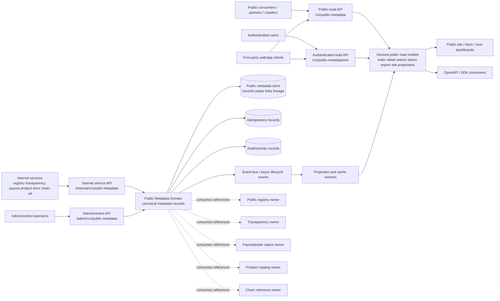
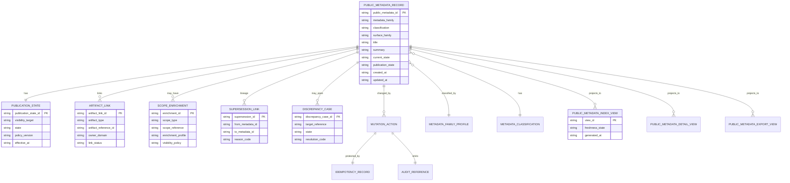
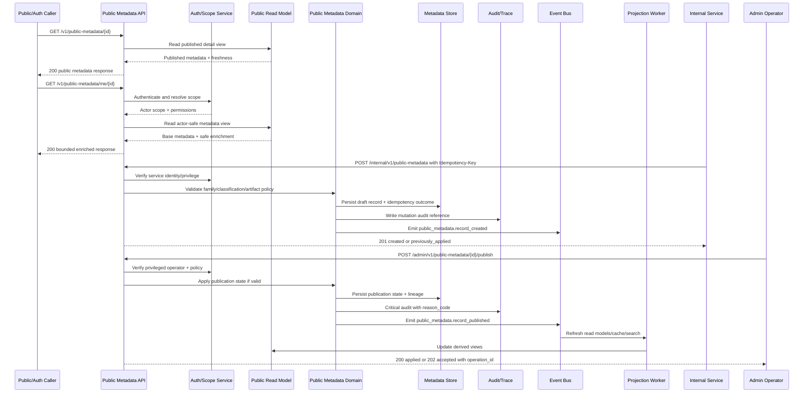

# FUZE Public Metadata API Specification

## Document Metadata

- **Document Name:** `PUBLIC_METADATA_API_SPEC.md`
- **Document Type:** FUZE API SPEC v2 production-grade interface-contract specification
- **Status:** Draft canonical API SPEC v2 for source-of-truth review
- **Version:** 2.0.0
- **Effective Date:** 2026-04-25
- **Last Updated:** 2026-04-25
- **Reviewed On:** 2026-04-25
- **Document Owner:** FUZE Public Metadata Domain; named individual owner not yet specified in retrieved governing materials
- **Approval Authority:** FUZE platform architecture and source-of-truth approval workflow; named approver not yet specified in retrieved governing materials
- **Review Cadence:** Quarterly and whenever public API posture, public trust surfaces, metadata-family taxonomy, registry/transparency/payout/public-catalog publication rules, compatibility posture, or public exposure policy materially changes
- **Governing Layer:** Public-read / public-trust companion API contract layer
- **Parent Registry:** API SPEC v2 Canonical File Registry
- **Upstream Semantic Registry:** `REFINED_SYSTEM_SPEC_INDEX.md`
- **Upstream API Registry:** `API_SPEC_INDEX.md`
- **Primary Audience:** Backend engineering, public API authors, platform architecture, frontend engineering, public-trust and transparency authors, registry authors, product catalog authors, payout/status authors, security, audit, operations, SDK/OpenAPI/AsyncAPI authors, implementation-contract authors
- **Primary Purpose:** Define the canonical API contract for FUZE public metadata surfaces, including public metadata records, metadata-family profiles, publication states, artifact links, actor-aware enrichments, correction lineage, derived public discovery views, and bounded public-read exposure rules
- **Primary Upstream References:** `REFINED_SYSTEM_SPEC_INDEX.md`; `API_SPEC_INDEX.md`; `DOCS_SPEC_INDEX.md`; `SYSTEM_SPEC_INDEX.md`; `PUBLIC_METADATA_API_SPEC.md` v1; `API_ARCHITECTURE_SPEC.md`; `PUBLIC_API_SPEC.md`; `PUBLIC_CONTRACT_AND_WALLET_REGISTRY_SPEC.md`; `PUBLIC_CONTRACT_WALLET_REGISTRY_API_SPEC.md`; `PUBLIC_REGISTRY_LOOKUP_API_SPEC.md`; `TRANSPARENCY_MODEL_SPEC.md`; `TRANSPARENCY_REPORTING_API_SPEC.md`; `PUBLIC_TRANSPARENCY_API_SPEC.md`; `PAYOUT_LEDGER_API_SPEC.md`; `PUBLIC_PAYOUT_STATUS_API_SPEC.md`; `PUBLIC_PRODUCT_CATALOG_API_SPEC.md`; `CHAIN_ARCHITECTURE_API_SPEC.md`; `AUDIT_LOG_AND_ACTIVITY_API_SPEC.md`; `SECURITY_AND_RISK_CONTROL_API_SPEC.md`; `IDEMPOTENCY_AND_VERSIONING_SPEC.md`; `MIGRATION_AND_BACKWARD_COMPATIBILITY_SPEC.md`; `EVENT_MODEL_AND_WEBHOOK_SPEC.md`; `INTERNAL_SERVICE_API_SPEC.md`
- **Primary Downstream Dependents:** Public metadata service implementation; public metadata OpenAPI contract; admin/control-plane public metadata contract; internal public metadata service contract; public website metadata consumers; public registry lookup; public transparency; public payout status; public product catalog; public SDKs; public trust dashboards; event/webhook consumers; read-model and cache builders
- **API Surface Families Covered:** Public-read, authenticated-read, first-party application read, internal service, admin/control-plane, event/async, reporting/export, public-site consumption
- **API Surface Families Excluded:** Arbitrary public writes, product mutation APIs, registry canonical mutation details, transparency-report authoring details, payout-ledger ownership details, governance/treasury/control mutations, chain execution, raw admin CMS implementation, low-level website rendering internals
- **Canonical System Owner(s):** Public Metadata Domain for public metadata publication truth; adjacent domains retain their own canonical truth
- **Canonical API Owner:** Public Metadata API Domain in `fuze-backend-api`
- **Supersedes:** Earlier v1 `PUBLIC_METADATA_API_SPEC.md` interpretations that lacked complete API SPEC v2 metadata, hierarchy framing, explicit truth taxonomy, stronger OpenAPI/AsyncAPI guardrails, richer diagrams, and full acceptance/test coverage
- **Superseded By:** None currently defined
- **Related Decision Records:** Not explicitly specified in retrieved governing materials
- **Canonical Status Note:** This API spec governs interface-contract expression only. Refined system specs own semantic truth. Public metadata APIs MUST preserve upstream domain ownership and MUST NOT reinterpret registry, transparency, payout, product, chain, governance, treasury, account, workspace, or entitlement semantics.
- **Implementation Status:** Normative API SPEC v2 draft; downstream contracts and implementations MUST align after approval
- **Approval Status:** Pending source-of-truth approval
- **Change Summary:** Upgraded Public Metadata API into API SPEC v2 structure; clarified ownership, truth classes, public/internal/admin boundaries, request/response/error/idempotency/audit/versioning rules, read-model safety, diagrams, flow, acceptance criteria, test cases, and non-canonical patterns.

## Purpose

This document defines the FUZE API SPEC v2 contract for public metadata.

Public metadata is the governed public-read and publication-support layer that allows FUZE to expose stable, safe, intentional metadata about public platform surfaces without turning public metadata into a raw export of internal systems. It supports discovery, ecosystem comprehension, public trust navigation, registry legibility, transparency navigation, payout-status discovery, product/public-catalog discovery, architecture/network references, documentation references, and public artifact linkage.

This API exists because FUZE distinguishes between canonical internal domain truth, intentionally published public artifacts, public reporting artifacts, and derived public discovery models. Public metadata therefore MUST NOT be implemented as an ad hoc website JSON dump, a frontend-maintained metadata table, a weakly filtered copy of internal objects, or a shadow system of record for adjacent domains.

The API specification defines how public metadata records, metadata-family profiles, classifications, visibility state, publication state, artifact links, scope-aware enrichments, discrepancy cases, supersession links, correction lineage, read models, and lifecycle events are exposed across public, authenticated, internal, admin/control-plane, and event/async surfaces.

## Scope

This API specification governs:

1. public-read APIs for public metadata indexes, public metadata detail, metadata-family profiles, public artifact discovery, public platform/network/architecture metadata, registry-linked metadata, transparency-linked metadata, payout-linked metadata, product-public-catalog metadata, and documentation metadata;
2. authenticated-read APIs for bounded actor-aware public metadata enrichments where policy explicitly allows;
3. internal service APIs for creating, updating, linking, validating, and reading canonical public metadata records;
4. admin/control-plane APIs for publish, restrict, withdraw, supersede, correct, and resolve discrepancy actions;
5. event and async contract behavior for public metadata lifecycle changes and read-model refreshes;
6. idempotency, replay, retry, audit, observability, versioning, migration, and compatibility requirements;
7. OpenAPI, AsyncAPI, SDK, public-site, and implementation-contract derivation guardrails.

## Out of Scope

This API specification does not govern:

- canonical registry ownership, registry verification semantics, or raw address publication truth beyond consuming approved registry references;
- transparency report authoring, report-period semantics, attestations, or narrative disclosure truth beyond consuming approved public transparency artifacts;
- payout-ledger truth, payout execution, holder eligibility, or claim-state computation beyond consuming approved public payout artifacts;
- product configuration, pricing-engine truth, subscription/billing truth, entitlement truth, or internal rollout truth beyond consuming approved public catalog artifacts;
- governance, treasury, Foundation, vault action, multisig, timelock, or chain execution control flows;
- low-level web rendering, SEO rendering, static-site generation, or frontend component decisions;
- database schema details, service internals, queue internals, or runbook procedures except where necessary to preserve API contract behavior;
- arbitrary public write APIs.

## Design Goals

1. Preserve FUZE semantic truth by treating public metadata as a publication and discovery interface, not as owner-domain truth.
2. Provide stable public-read contracts for public trust, discovery, documentation, and integration use cases.
3. Distinguish canonical public artifacts, public reporting artifacts, derived public summary models, actor-aware enrichments, and presentation-only metadata.
4. Keep public metadata narrower than internal data and safer than first-party or admin views.
5. Make publication, restriction, withdrawal, correction, and supersession explicit and historically intelligible.
6. Support public-safe degraded modes without leaking internal error or control-plane state.
7. Require idempotent and audit-linked mutation behavior for internal and admin actions.
8. Support downstream OpenAPI, AsyncAPI, SDK, read-model, and cache implementations without allowing semantic drift.

## Non-Goals

This API does not attempt to:

- expose every internal object with a public label;
- provide a CMS for arbitrary marketing content;
- give public consumers direct mutation authority over FUZE metadata;
- turn public metadata into a replacement for registry lookup, transparency, payout status, product catalog, or public chain reference APIs;
- expose private operational state, signer topology, control-plane notes, incident details, unreleased product configuration, internal entitlement logic, or treasury/governance mechanics;
- provide final database schema, exact UI rendering, or static-site implementation details.

## Core Principles

### Public Metadata as Deliberate Public Surface Principle

Public metadata MUST be intentionally created, classified, validated, and published. It MUST NOT be inferred merely because an internal object exists.

### Refined Semantics Own Meaning Principle

Refined system specs own semantic truth. This API owns only the interface-contract expression of public metadata publication and read behavior.

### Metadata-Is-Not-Origin-Truth Principle

A public metadata record MAY link to registry, transparency, payout, product, documentation, or chain-reference artifacts. It MUST NOT become the canonical owner of those linked artifacts.

### Publication-State Discipline Principle

Every public metadata record MUST carry explicit visibility and publication state. Public, authenticated-only, restricted, withdrawn, deprecated, and superseded states MUST remain contract-visible where relevant.

### Derived Read Subordination Principle

Indexes, caches, public discovery cards, search summaries, site metadata, and exported feeds are derived from canonical public metadata records. They MUST NOT accept writes that bypass the Public Metadata Domain.

### Public Safety First Principle

When visibility, classification, or artifact-safety is uncertain, the API MUST default to non-public, restricted, or review-required behavior.

### Correction Lineage Principle

Corrections and supersessions MUST preserve history and audit lineage. Public-facing meaning MUST NOT be silently overwritten.

### Bounded Actor Enrichment Principle

Authenticated enrichments MAY add actor-safe context, but they MUST NOT reveal internal metadata, control-plane state, or hidden owner-domain truth.

## Canonical Definitions

- **Public Metadata Record:** A canonical Public Metadata Domain record that describes a public-safe metadata artifact or discovery surface.
- **Metadata Family:** A governed category such as `platform`, `network`, `registry`, `transparency`, `payout`, `product`, `architecture`, `documentation`, `chain_reference`, or another approved family.
- **Classification:** The contract-level category that distinguishes `canonical_public_artifact`, `public_reporting_artifact`, `derived_public_summary`, `public_discovery_profile`, `documentation_reference`, and `presentation_hint`.
- **Publication State:** The explicit lifecycle state governing whether a record is unpublished, public, authenticated-only, restricted, withdrawn, deprecated, superseded, or archived.
- **Artifact Link:** A durable reference to a public or bounded artifact owned by an adjacent domain.
- **Scope Enrichment:** Optional actor-, workspace-, holder-, partner-, or product-scope metadata that is safe only after authentication and authorization.
- **Supersession Link:** A durable lineage relation connecting a record to replacement, correction, withdrawal, or deprecated meaning.
- **Discrepancy Case:** A review/remediation object used when public metadata conflicts with source domains, stale projections, public artifacts, or policy.
- **Public Metadata Index View:** A derived read model optimized for public discovery and listing.
- **Public Metadata Status View:** A derived public or authenticated summary that exposes safe state without becoming semantic owner.

## Truth Class Taxonomy

The API MUST preserve the following truth classes:

1. **Semantic truth:** Owned by refined system specs and adjacent owner domains. Public metadata expresses but does not redefine it.
2. **API contract truth:** Owned by this specification; includes route families, request/response/error/status contracts, idempotency, versioning, and interface boundaries.
3. **Policy truth:** Owned by public API, security, access-control, visibility, publication, and approval policy sources.
4. **Runtime truth:** Request handling, validation status, propagation jobs, cache refreshes, dependency health, and accepted async operation state.
5. **Storage truth:** Durable public metadata records, publication states, artifact links, enrichment rules, supersession links, discrepancy cases, idempotency records, and audit references.
6. **Public read-model truth:** Derived public indexes, public detail views, public status summaries, search summaries, site metadata projections, and public export feeds.
7. **Provider/input truth:** External or adjacent-domain inputs before validation and owner-domain confirmation.
8. **Event/async truth:** Public metadata lifecycle events, read-model refresh events, webhook candidates, propagation jobs, and retry status.
9. **Projection/reporting truth:** Reporting summaries, public-trust dashboards, search indexes, exports, and discovery cards.
10. **Presentation truth:** Titles, descriptions, labels, icons, route hints, SEO metadata, and UI-facing copy.

These truth classes MUST remain distinct. Presentation truth cannot override publication state. Read-model truth cannot override storage truth. Public metadata truth cannot override adjacent owner-domain semantic truth.

## Architectural Position in the Spec Hierarchy

This API specification sits below:

- `REFINED_SYSTEM_SPEC_INDEX.md`
- `DOCS_SPEC_INDEX.md`
- `SYSTEM_SPEC_INDEX.md`
- `API_SPEC_INDEX.md`
- `SYSTEM_BOUNDARY_AND_OWNERSHIP_SPEC.md`
- `SYSTEM_OVERVIEW_AND_BOUNDARIES_SPEC.md`
- `PLATFORM_ARCHITECTURE_SPEC.md`
- `DOMAIN_OWNERSHIP_MATRIX_SPEC.md`
- `DATA_MODEL_AND_ENTITY_OWNERSHIP_SPEC.md`
- `ONCHAIN_OFFCHAIN_RESPONSIBILITY_SPEC.md`
- `API_ARCHITECTURE_SPEC.md`
- `PUBLIC_API_SPEC.md`

It sits alongside or above downstream implementation artifacts:

- Public Metadata OpenAPI contract
- Public Metadata AsyncAPI/event contracts
- public metadata internal service contracts
- public metadata admin/control-plane routes
- read-model projection specs
- public website consumption contracts
- SDK derivation layers
- public trust dashboards and exports

It coordinates with, but does not replace:

- `PUBLIC_REGISTRY_LOOKUP_API_SPEC.md`
- `PUBLIC_TRANSPARENCY_API_SPEC.md`
- `PUBLIC_PAYOUT_STATUS_API_SPEC.md`
- `PUBLIC_PRODUCT_CATALOG_API_SPEC.md`
- `PUBLIC_CHAIN_REFERENCE_API_SPEC.md`
- `PUBLIC_PLATFORM_STATUS_API_SPEC.md`
- `PUBLIC_GOVERNANCE_DISCLOSURE_API_SPEC.md`

## Upstream Semantic Owners

The following upstream semantic owners remain authoritative:

- Public Metadata Domain owns public metadata records, metadata-family profiles, classification, publication state, artifact-link lineage, scope-enrichment rules, supersession lineage, and public metadata discrepancy cases.
- Public API Governance owns external exposure posture, public compatibility expectations, public safety, abuse-control posture, and external contract discipline.
- API Architecture owns shared surface-family taxonomy, accepted-state semantics, owner-domain mutation discipline, idempotency/versioning posture, and interface-boundary rules.
- Public Contract and Wallet Registry owns canonical registry publication truth and registry verification semantics.
- Public Registry Lookup owns registry-specific public lookup contract and lookup-index behavior.
- Transparency Reporting and Public Transparency own transparency-report and public transparency artifact semantics.
- Payout Ledger and Public Payout Status own payout-cycle ledger truth and public payout-status publication.
- Product Catalog/Product domains own product truth, public catalog publication, and product visibility semantics.
- Chain Architecture and On-Chain/Off-Chain Responsibility own chain-role boundaries and chain/off-chain truth separation.
- Security, Audit, Monitoring, Migration, and Event specs own their cross-cutting disciplines.

## API Surface Families

### Public-Read Surface

Public-read routes expose only published public metadata and public-safe derived views. They require no authentication but MUST enforce visibility, publication state, abuse control, cache safety, and information minimization.

### Authenticated-Read Surface

Authenticated-read routes expose bounded actor-aware enrichments only where policy allows. They MUST evaluate identity, scope, actor visibility, feature/rollout constraints, and any audience restrictions.

### First-Party Application Surface

First-party application surfaces MAY consume public and authenticated-read public metadata contracts. They MUST NOT receive broader mutation privileges merely because they are first-party.

### Internal Service Surface

Internal service routes support canonical public metadata creation, update, artifact linking, enrichment configuration, validation, and canonical reads. They require service identity, least privilege, idempotency where mutating, and audit linkage.

### Admin / Control-Plane Surface

Admin/control routes support publish, restrict, withdraw, supersede, correct, and discrepancy-resolution actions. They require privileged identity, explicit authorization, reason codes, operator notes, idempotency, audit, and policy checks.

### Event / Async Surface

Event/async interfaces emit lifecycle and projection refresh signals. Events describe owner-domain accepted or applied public metadata changes and MUST NOT be used as hidden mutation APIs.

### Reporting / Export Surface

Reporting/export surfaces expose derived, public-safe metadata snapshots, indexes, feeds, or public trust exports. They remain read-only and derived.

## System / API Boundaries

Public Metadata API governs interface contracts for public metadata. It does not own adjacent domain meaning.

- Registry links remain registry-owned.
- Transparency links remain transparency-owned.
- Payout links remain payout-ledger or public-payout-status-owned.
- Product links remain product/public-catalog-owned.
- Chain references remain chain/off-chain boundary-governed.
- Website presentation remains frontend/rendering-owned but subordinate to backend public metadata contracts.

The Public Metadata Domain may publish metadata about these artifacts only after safe linkage and classification. It MUST NOT mint official meaning for adjacent domains by itself.

## Adjacent API Boundaries

- `PUBLIC_REGISTRY_LOOKUP_API_SPEC.md` owns direct registry lookup semantics; Public Metadata may link to registry records but does not replace lookup semantics.
- `PUBLIC_TRANSPARENCY_API_SPEC.md` owns transparency-specific public trust records; Public Metadata may index or summarize transparency artifacts.
- `PUBLIC_PAYOUT_STATUS_API_SPEC.md` owns payout-cycle status publication; Public Metadata may discover or link payout status records.
- `PUBLIC_PRODUCT_CATALOG_API_SPEC.md` owns product-catalog public publication; Public Metadata may aggregate discovery and documentation metadata.
- `PUBLIC_CHAIN_REFERENCE_API_SPEC.md` owns public chain/network reference detail; Public Metadata may point to chain-reference families.
- `PUBLIC_PLATFORM_STATUS_API_SPEC.md` owns platform status and runtime availability posture; Public Metadata may expose status-link metadata but not live operational status truth.
- `PUBLIC_GOVERNANCE_DISCLOSURE_API_SPEC.md` owns governance disclosure-specific public artifacts; Public Metadata may link only approved public governance disclosure references.

## Conflict Resolution Rules

1. Refined system specs and `REFINED_SYSTEM_SPEC_INDEX.md` win over API convenience.
2. Domain owner specs win on semantic truth for their domains.
3. `API_ARCHITECTURE_SPEC.md` wins on surface-family, accepted-state, owner-domain mutation, and API governance posture.
4. `PUBLIC_API_SPEC.md` wins on external/public exposure safety and compatibility posture.
5. This API spec wins on public metadata route families, public metadata request/response/error/status behavior, and public metadata contract boundaries.
6. Adjacent domain API specs win for their domain-specific public artifacts.
7. Public metadata records, indexes, exports, caches, and frontend metadata never win over canonical adjacent owner-domain truth.
8. When ambiguity remains, the API MUST choose the narrower, safer, more public-trust-preserving interpretation and raise a discrepancy case or recorded decision.

## Default Decision Rules

1. Metadata is not public unless publication state explicitly permits public exposure.
2. Ambiguous family or classification defaults to unpublished/review-required.
3. Authenticated enrichment is disabled unless an approved policy explicitly permits it.
4. Public metadata records linked to governance, treasury, payout, registry, or chain-adjacent surfaces require heightened review.
5. Missing or unvalidated artifact links block publication.
6. Read models may serve stale data only if the response explicitly marks freshness and stale status.
7. Corrections default to supersession or explicit correction lineage rather than destructive overwrite.
8. Public consumers receive safe 404/410/403/503 behavior without hidden internal details.
9. Admin/operator convenience never bypasses reason-code, audit, policy, and idempotency rules.
10. The API must fail closed when visibility, classification, or publication safety cannot be determined.

## Roles / Actors / API Consumers

### Public Consumers

Unauthenticated readers, community members, ecosystem observers, partners, crawlers, public sites, and public dashboards consuming explicitly public metadata.

### Authenticated Users

End users, workspace members, holders, or partners who may receive bounded metadata enrichments tied to their scope.

### First-Party Clients

`fuze-frontend-webapp`, public website surfaces, mobile or client applications, and future first-party consumers. These render public metadata but do not own metadata truth.

### Internal Services

Registry, transparency, payout status, product catalog, documentation, chain-reference, reporting, and publication services that request metadata creation or linkage through approved internal contracts.

### Admin / Control Operators

Privileged operators who publish, restrict, withdraw, correct, supersede, or resolve discrepancy cases through bounded admin/control APIs.

### Event and Projection Consumers

Read-model builders, search-index builders, public export jobs, cache invalidators, public site refreshers, audit systems, monitoring systems, and downstream public-trust surfaces.

## Resource / Entity Families

### Canonical API Resources

- `public_metadata_record`
- `public_metadata_family_profile`
- `public_metadata_classification`
- `public_metadata_publication_state`
- `public_metadata_artifact_link`
- `public_metadata_scope_enrichment`
- `public_metadata_supersession_link`
- `public_metadata_discrepancy_case`
- `public_metadata_mutation_action`
- `public_metadata_operation`
- `public_metadata_idempotency_record`
- `public_metadata_audit_reference`

### Derived Resources

- `public_metadata_index_view`
- `public_metadata_detail_view`
- `public_metadata_status_view`
- `public_metadata_search_view`
- `public_metadata_export_view`
- `public_metadata_site_projection`

### Adjacent References

- `registry_record_reference`
- `transparency_artifact_reference`
- `payout_status_reference`
- `product_catalog_reference`
- `chain_reference`
- `documentation_reference`
- `governance_disclosure_reference`
- `platform_status_reference`

## Ownership Model

The Public Metadata Domain owns:

- public metadata record identity;
- metadata-family profile taxonomy within this API;
- classification of public metadata records;
- publication/visibility state for public metadata;
- artifact-link lineage within metadata records;
- bounded scope-enrichment rule records;
- supersession and correction lineage;
- discrepancy cases for metadata consistency;
- public metadata lifecycle events;
- canonical public metadata read contract.

The Public Metadata Domain does not own:

- registry verification truth;
- transparency report truth;
- payout-cycle truth;
- product configuration, pricing, entitlement, or rollout truth;
- chain-native truth;
- governance/treasury/control-plane decisions;
- account identity, workspace authorization, or session truth;
- website presentation or SEO rendering truth.

## Authority / Decision Model

- Internal services may request metadata creation or linkage only through approved internal routes.
- The Public Metadata Domain validates classification, family, artifact-link safety, and publication eligibility.
- Admin/control operators approve publication, restriction, withdrawal, supersession, and discrepancy resolution where required.
- Adjacent owner domains remain authoritative for the facts referenced by artifact links.
- Security and public API policy may deny exposure even if the metadata record is otherwise valid.
- Public consumers have no mutation authority.

## Authentication Model

- Public-read routes require no authentication but must enforce publication state, cache policy, abuse controls, and safe error responses.
- Authenticated-read routes require valid account/session authentication and actor-scope resolution.
- Internal routes require service-to-service authentication and least-privilege service identity.
- Admin/control routes require privileged operator identity, step-up or elevated authorization where policy requires, reason-code capture, and auditable action context.
- Event consumers require event-bus or webhook authentication according to event/webhook specifications.

## Authorization / Scope / Permission Model

Authorization MUST evaluate:

- route family;
- caller identity type;
- actor scope and workspace scope where relevant;
- public vs authenticated vs restricted publication state;
- metadata family and classification;
- artifact sensitivity;
- policy version;
- operator role for admin/control actions;
- service role for internal mutations;
- current lifecycle state;
- feature/rollout gates if used for limited public surfaces.

Public-read APIs MUST NOT rely on authentication as a substitute for publication-state filtering. Internal services MUST NOT bypass metadata-domain validation. Admin operators MUST NOT bypass policy and audit requirements.

## Entitlement / Capability-Gating Model

Public metadata generally does not own entitlement truth. However, authenticated metadata enrichment MAY depend on entitlement, workspace scope, product capability, partner scope, holder scope, or rollout state. Where used:

- entitlement checks are read-only inputs;
- entitlement results do not become public metadata truth;
- failure to resolve entitlement defaults to hiding enriched fields while preserving safe base public metadata where allowed;
- public-read surfaces MUST NOT leak the existence of actor-only metadata.

## API State Model

### Metadata Record States

- `draft`
- `validated`
- `published`
- `restricted`
- `deprecated`
- `superseded`
- `withdrawn`
- `archived`

### Publication States

- `unpublished`
- `published_public`
- `published_authenticated`
- `restricted`
- `withdrawn`

### Operation States

- `requested`
- `validated`
- `accepted`
- `applied`
- `previously_applied`
- `rejected`
- `conflicted`
- `failed_retryable`
- `failed_terminal`
- `superseded`

### Discrepancy States

- `opened`
- `under_review`
- `resolved`
- `failed`
- `closed`

`accepted` MUST remain distinct from `applied`. `published` MUST remain distinct from `validated`. `withdrawn` MUST remain distinct from deletion. `superseded` MUST preserve lineage.

## Lifecycle / Workflow Model

1. An internal service proposes or creates a draft metadata record.
2. The Public Metadata Domain validates metadata family, classification, linked artifact references, visibility target, and policy constraints.
3. Artifact links and optional scope-enrichment rules are attached through internal contracts.
4. Admin/control action publishes, restricts, withdraws, corrects, or supersedes the record where privileged approval is required.
5. The mutation is idempotently stored with correlation, trace, idempotency, actor/service, policy, and audit references.
6. Lifecycle events are emitted.
7. Read-model builders refresh index, detail, status, search, export, and site projections.
8. Public and authenticated consumers read from canonical or derived read models with explicit freshness and visibility posture.
9. Discrepancies trigger review, remediation, correction, supersession, restriction, or withdrawal with preserved lineage.

## Architecture Diagram — Mermaid flowchart

## Data Design — Mermaid Diagram

Canonical entities are `PUBLIC_METADATA_RECORD`, publication state, artifact links, enrichment rules, supersession links, discrepancy cases, mutation actions, idempotency records, and audit references. Index, detail, status, search, export, and site projections are derived and MUST NOT become write owners.

## Flow View

### Standard Public Read Flow

1. Caller requests public metadata list, family, or detail.
2. API validates query parameters, pagination, locale, freshness options, and allowed filters.
3. API reads from canonical public metadata read model or safe derived projection.
4. API filters by `published_public` and public-safe classification.
5. API returns metadata with freshness, generated-at, visibility, classification, and supersession guidance.
6. If read model is stale but safe, response includes stale/freshness markers. If state cannot be trusted, API fails closed.

### Authenticated Enrichment Flow

1. Authenticated caller requests actor-aware metadata.
2. API authenticates account/session and resolves actor/workspace/partner/holder scope.
3. API evaluates policy and entitlement/capability if relevant.
4. API returns base public metadata plus only safe enrichment fields.
5. Missing or denied enrichment MUST NOT leak hidden metadata existence.

### Internal Metadata Creation Flow

1. Internal service submits a draft create request with idempotency key and correlation ID.
2. API authenticates service and verifies service privilege.
3. API validates family, classification, surface family, title, artifact constraints, request hash, and policy.
4. API stores draft record and idempotency outcome.
5. API emits `public_metadata.record_created`.
6. Audit and trace records are written.

### Admin Publication Flow

1. Admin submits publish request with reason code, operator note, idempotency key, and target visibility.
2. API authenticates operator and evaluates privileged policy.
3. API verifies record state, artifact links, classification, source-domain references, and public-safety constraints.
4. API applies publication state or returns deterministic conflict/error.
5. API emits lifecycle event and projection refresh job.
6. API returns applied or accepted operation response depending on propagation mode.

### Correction / Supersession Flow

1. Discrepancy is detected by service, operator, projection worker, or external report.
2. Discrepancy case is opened and linked to target metadata.
3. Admin/control action corrects, restricts, withdraws, or supersedes record.
4. Prior public meaning remains linked through correction or supersession lineage.
5. Read models refresh and public responses include replacement or withdrawal guidance.

### Degraded Mode Flow

1. Public read-model dependency is stale, partial, or unavailable.
2. API determines whether stale-safe response is permitted.
3. If permitted, response includes `freshness_state=stale` and `degraded=true` with safe guidance.
4. If metadata safety or publication state cannot be verified, API returns safe `503` or `404` instead of leaking internal state.

## Data Flows — Mermaid sequenceDiagram

## Request Model

### Common Request Requirements

All mutation requests MUST include:

- `Content-Type: application/json`
- `Idempotency-Key`
- `X-Correlation-Id` or generated correlation reference
- authenticated service or operator identity
- explicit target resource identifiers where relevant
- request body schema version where relevant

Admin/control mutation requests MUST include:

- `reason_code`
- `operator_note`
- policy version or policy evaluation reference where available
- target visibility or lifecycle action

Public read requests MAY include:

- pagination
- metadata family filters
- classification filters
- locale or audience-safe rendering hints
- freshness preference
- include options for artifact-link summaries when public-safe

Public read requests MUST NOT include mutation intent.

### Canonical Create Request Fields

- `metadata_family`
- `classification`
- `surface_family`
- `title`
- `summary`
- `artifact_links` optional, validated by type
- `publication_intent` optional, non-authoritative until approved
- `source_domain_reference` optional but required for trust-sensitive families
- `schema_version`

### Publication Request Fields

- `visibility_target`
- `reason_code`
- `operator_note`
- `policy_reference`
- `effective_at` optional
- `idempotency_key`

### Supersession Request Fields

- `replacement_public_metadata_id`
- `reason_code`
- `operator_note`
- `public_guidance` optional
- `idempotency_key`

## Response Model

### Public List Response

Public list responses MUST include:

- `items`
- `pagination`
- `generated_at`
- `freshness_state`
- `filters_applied`
- public-safe `metadata_family`, `classification`, `publication_state`, `title`, `summary`, and artifact summary fields

### Public Detail Response

Public detail responses MUST include:

- `public_metadata_id`
- `metadata_family`
- `classification`
- `publication_state`
- `title`
- `summary`
- public-safe artifact links
- supersession/deprecation guidance where relevant
- `generated_at`
- `freshness_state`
- correlation reference where useful

### Authenticated Enrichment Response

Authenticated responses MUST distinguish:

- base public metadata;
- actor-safe enrichment;
- scope basis;
- omitted fields due to policy;
- freshness and visibility state.

### Mutation Response

Mutation responses MUST include:

- `operation_id` or target resource ID;
- `operation_state` such as `applied`, `accepted`, `previously_applied`, `rejected`, or `conflicted`;
- resulting metadata state where applied;
- `correlation_id`;
- `audit_reference` for internal/admin callers;
- retry guidance only where safe.

## Error / Result / Status Model

The API uses structured problem-details style error responses.

### Required Error Fields

- `type`
- `title`
- `status`
- `code`
- `detail`
- `instance`
- `correlation_id`

### Common Error Codes

#### Authentication and Authorization

- `PUBLIC_METADATA_AUTHENTICATION_REQUIRED`
- `PUBLIC_METADATA_PERMISSION_DENIED`
- `PUBLIC_METADATA_SERVICE_PERMISSION_DENIED`
- `PUBLIC_METADATA_OPERATOR_PERMISSION_DENIED`
- `PUBLIC_METADATA_SCOPE_ENRICHMENT_DENIED`

#### Visibility and Publication

- `PUBLIC_METADATA_NOT_FOUND_OR_NOT_PUBLIC`
- `PUBLIC_METADATA_VISIBILITY_NOT_ALLOWED`
- `PUBLIC_METADATA_PUBLICATION_NOT_ALLOWED`
- `PUBLIC_METADATA_RESTRICTION_NOT_ALLOWED`
- `PUBLIC_METADATA_WITHDRAWN`
- `PUBLIC_METADATA_SUPERSEDED`

#### State and Conflict

- `PUBLIC_METADATA_RECORD_STATE_INVALID`
- `PUBLIC_METADATA_PUBLICATION_STATE_INVALID`
- `PUBLIC_METADATA_SUPERSESSION_CONFLICT`
- `PUBLIC_METADATA_DISCREPANCY_STATE_INVALID`
- `PUBLIC_METADATA_IDEMPOTENCY_CONFLICT`

#### Validation and Policy

- `PUBLIC_METADATA_CLASSIFICATION_REQUIRED`
- `PUBLIC_METADATA_FAMILY_INVALID`
- `PUBLIC_METADATA_ARTIFACT_REFERENCE_REQUIRED`
- `PUBLIC_METADATA_ARTIFACT_REFERENCE_INVALID`
- `PUBLIC_METADATA_POLICY_DENIED`
- `PUBLIC_METADATA_REQUEST_INVALID`
- `PUBLIC_METADATA_REQUEST_UNPROCESSABLE`

#### Dependency and Runtime

- `PUBLIC_METADATA_READ_MODEL_UNAVAILABLE`
- `PUBLIC_METADATA_STORAGE_UNAVAILABLE`
- `PUBLIC_METADATA_PROJECTION_STALE`
- `PUBLIC_METADATA_DEPENDENCY_UNAVAILABLE`
- `PUBLIC_METADATA_RATE_LIMITED`

### Status Semantics

- `200 OK`: successful read or applied synchronous mutation.
- `201 Created`: new metadata record or link created.
- `202 Accepted`: async propagation accepted but not finalized.
- `204 No Content`: safe no-content mutation result only where contract explicitly allows.
- `400 Bad Request`: malformed request or unsupported query.
- `401 Unauthorized`: authentication required.
- `403 Forbidden`: authenticated but not authorized; public surfaces may use safe 404 instead where existence hiding is required.
- `404 Not Found`: absent or not-public metadata.
- `409 Conflict`: lifecycle, idempotency, or supersession conflict.
- `410 Gone`: intentionally withdrawn or no-longer-available public record where public guidance is safe.
- `422 Unprocessable Entity`: semantically invalid request.
- `429 Too Many Requests`: rate limit or abuse protection.
- `503 Service Unavailable`: unsafe dependency or freshness failure.

## Idempotency / Retry / Replay Model

Mutation routes requiring idempotency:

- `POST /internal/v1/public-metadata`
- `POST /internal/v1/public-metadata/{id}/artifact-links`
- `POST /internal/v1/public-metadata/{id}/scope-enrichments`
- `POST /admin/v1/public-metadata/{id}/publish`
- `POST /admin/v1/public-metadata/{id}/restrict`
- `POST /admin/v1/public-metadata/{id}/withdraw`
- `POST /admin/v1/public-metadata/{id}/supersede`
- `POST /admin/v1/public-metadata/discrepancies/{case_id}/resolve`

Rules:

1. Idempotency keys are scoped to actor/service, route family, target resource, and semantic request hash.
2. Replays of the same semantic request return the original terminal result or `previously_applied` status.
3. Replays with changed body under the same key return `PUBLIC_METADATA_IDEMPOTENCY_CONFLICT`.
4. Retryable failures MUST distinguish safe retry from terminal policy denial.
5. Async accepted operations MUST expose operation references and finalization status.
6. Duplicate lifecycle actions MUST NOT create duplicate audit lineage except for safe replay markers.

## Rate Limit / Abuse-Control Model

Public-read APIs MUST enforce:

- IP/client-based and route-family-aware rate limits;
- bot/crawler controls where needed;
- pagination maximums;
- bounded filter complexity;
- cache-compatible response behavior;
- safe failure for dependency overload.

Authenticated routes MUST enforce actor and token limits. Internal/admin routes MUST enforce service/operator limits, anomaly detection, and heightened controls for sensitive metadata families.

## Endpoint / Route Family Model

### Public Read Routes

- `GET /v1/public-metadata`
- `GET /v1/public-metadata/{public_metadata_id}`
- `GET /v1/public-metadata/families`
- `GET /v1/public-metadata/families/{metadata_family}`
- `GET /v1/public-metadata/search`
- `GET /v1/public-metadata/artifacts/{artifact_type}/{artifact_reference_id}` where explicitly approved

### Authenticated Read Routes

- `GET /v1/public-metadata/me`
- `GET /v1/public-metadata/me/{public_metadata_id}`
- `GET /v1/public-metadata/me/families/{metadata_family}`

### Internal Service Routes

- `POST /internal/v1/public-metadata`
- `PATCH /internal/v1/public-metadata/{public_metadata_id}` for non-public draft updates only
- `GET /internal/v1/public-metadata/{public_metadata_id}`
- `POST /internal/v1/public-metadata/{public_metadata_id}/artifact-links`
- `POST /internal/v1/public-metadata/{public_metadata_id}/scope-enrichments`
- `POST /internal/v1/public-metadata/{public_metadata_id}/validate`
- `POST /internal/v1/public-metadata/{public_metadata_id}/projection-refreshes`

### Admin / Control Routes

- `POST /admin/v1/public-metadata/{public_metadata_id}/publish`
- `POST /admin/v1/public-metadata/{public_metadata_id}/restrict`
- `POST /admin/v1/public-metadata/{public_metadata_id}/withdraw`
- `POST /admin/v1/public-metadata/{public_metadata_id}/supersede`
- `POST /admin/v1/public-metadata/{public_metadata_id}/correct`
- `POST /admin/v1/public-metadata/discrepancies`
- `POST /admin/v1/public-metadata/discrepancies/{case_id}/resolve`

### Event / Async Contracts

- `public_metadata.record_created`
- `public_metadata.record_validated`
- `public_metadata.record_published`
- `public_metadata.record_restricted`
- `public_metadata.record_withdrawn`
- `public_metadata.record_superseded`
- `public_metadata.record_corrected`
- `public_metadata.artifact_linked`
- `public_metadata.scope_enrichment_linked`
- `public_metadata.discrepancy_opened`
- `public_metadata.discrepancy_resolved`
- `public_metadata.projection_refresh_requested`
- `public_metadata.projection_refreshed`

## Public API Considerations

Public routes MUST be stable, narrow, cache-safe, and information-minimizing. Public APIs MUST expose only intentionally published records. Public responses MUST NOT reveal internal-only state, draft state, operator notes, policy internals, private artifact references, unpublished future releases, or discrepancy details except through approved public guidance.

Public metadata may be used by public websites, public docs, ecosystem consumers, public trust dashboards, and future SDK consumers. It MUST remain supportable as a long-lived external contract.

## First-Party Application API Considerations

First-party clients may consume public metadata APIs and authenticated enrichment APIs. They MUST NOT maintain a separate long-term metadata truth that conflicts with backend public metadata. They MUST respect freshness, canonical route hints, supersession guidance, publication state, and `not_found_or_not_public` semantics.

## Internal Service API Considerations

Internal service APIs allow adjacent domains to create or link metadata, but only through explicit contracts. Services MUST NOT write public metadata store tables directly or publish public metadata by emitting events alone. Internal routes MUST validate source-domain references and preserve service identity and correlation lineage.

## Admin / Control-Plane API Considerations

Admin/control routes are privileged and must remain separate from ordinary app and public routes. Publication, restriction, withdrawal, supersession, and correction require:

- privileged operator authorization;
- reason code;
- operator note;
- policy evaluation;
- idempotency key;
- audit record;
- discrepancy or source-reference linkage where relevant.

Operators MUST NOT use public metadata controls to rewrite adjacent domain truth.

## Event / Webhook / Async API Considerations

Events are used for lifecycle propagation, read-model refreshes, search-index updates, cache invalidation, and public-site refresh. Events MUST include:

- event ID;
- event type;
- schema version;
- public metadata ID;
- operation ID;
- correlation ID;
- actor/service reference class;
- occurred-at timestamp;
- state transition summary;
- policy/audit references where allowed.

External webhooks for public metadata are not automatically approved. If future partner webhook delivery is approved, webhook payloads MUST be public-safe and derived from applied owner-domain events.

## Chain-Adjacent API Considerations

Public metadata may include chain-reference metadata only as public-safe references. It MUST NOT:

- assert chain-native truth beyond approved references;
- expose private wallet/control details;
- replace public registry lookup;
- claim payout, governance, treasury, or contract execution meaning;
- treat chain observations as canonical public metadata without validation.

When chain-linked public metadata conflicts with chain-owner or registry-owner truth, the API MUST open a discrepancy case and prefer non-public or conservative public guidance.

## Data Model / Storage Support Implications

Storage must support:

- stable public metadata identifiers;
- family and classification fields;
- explicit publication and visibility states;
- artifact links with owner-domain references;
- actor-aware enrichment records;
- supersession lineage;
- discrepancy cases;
- mutation actions;
- idempotency records;
- audit references;
- projection generation state;
- schema versioning and compatibility metadata.

Storage must not force derived views to become canonical records. Destructive overwrite of public-facing meaning is forbidden except where lineage is still preserved through a correction record.

## Read Model / Projection / Reporting Rules

1. Public indexes, search views, site projections, and export feeds are derived.
2. Derived views MUST include generation time and freshness state.
3. Public read models MUST filter by publication state and visibility.
4. Stale read models MAY be served only when safe and explicitly marked.
5. Projection failures MUST NOT cause unsafe fallback to internal records.
6. Reporting exports MUST include snapshot/version references.
7. Public metadata exports MUST NOT include operator notes, internal policy evaluation details, private artifact references, unpublished records, or sensitive discrepancy details.

## Security / Risk / Privacy Controls

The API MUST protect against:

- draft or internal metadata leakage;
- private registry/control/wallet detail leakage;
- public exposure of governance/treasury-sensitive metadata;
- metadata poisoning by internal services;
- cache serving withdrawn or restricted records as current;
- actor-aware enrichment leakage across accounts/workspaces/partners;
- overbroad search exposing hidden metadata existence;
- public scraping abuse that harms availability;
- stale public trust surfaces after correction or withdrawal.

All sensitive mutation routes MUST be covered by security monitoring and audit.

## Audit / Traceability / Observability Requirements

All mutation and privileged read paths MUST emit or store:

- correlation ID;
- trace ID;
- request ID;
- actor/service identity;
- route family;
- target resource;
- before/after lifecycle state where safe;
- reason code for admin actions;
- idempotency key reference;
- policy version/reference;
- audit reference;
- emitted event IDs;
- projection job IDs where relevant.

Public reads require aggregate observability and rate-limit telemetry. Authenticated enrichment reads require enough audit/traceability to investigate leakage or policy errors. Admin/control actions require critical audit.

## Failure Handling / Edge Cases

- If the record does not exist or is not public, public APIs return safe `404` unless `410` public guidance is explicitly allowed.
- If publication state cannot be verified, fail closed.
- If a read model is stale but safe, return marked stale response.
- If an artifact owner domain is unavailable during publication, block publication or return `202 accepted` only if finalization cannot occur until validation succeeds.
- If public metadata conflicts with source-domain truth, open discrepancy case and restrict/supersede/withdraw as policy requires.
- If idempotency replay conflicts, return `409`.
- If an admin attempts to publish an unsafe family/classification combination, return policy denial.
- If an authenticated enrichment cannot be authorized, omit enrichment or return scope-denied without leaking hidden state.
- If projection refresh fails after publication, preserve canonical mutation and expose operation status; public views update only after safe refresh.

## Migration / Versioning / Compatibility / Deprecation Rules

- Route families are versioned under `/v1`, `/internal/v1`, and `/admin/v1`.
- Additive response fields are preferred.
- Public meaning of family, classification, visibility, publication state, correction, and supersession MUST NOT change silently.
- Breaking changes require explicit versioning, migration guidance, compatibility windows, and deprecation notices.
- Deprecated metadata remains readable only where public-trust continuity requires it and policy permits.
- Superseded metadata should return successor guidance where safe.
- SDKs MUST preserve public vs authenticated vs internal/admin distinctions.

## OpenAPI / AsyncAPI / SDK Derivation Rules

OpenAPI derivation MUST:

- separate public, authenticated, internal, and admin route groups;
- mark mutation routes requiring idempotency;
- include structured problem-details error schemas;
- include visibility/publication/freshness fields;
- distinguish canonical internal response schemas from public-derived response schemas;
- avoid exposing admin-only fields in public schemas;
- document pagination, rate limits, freshness, and cache behavior.

AsyncAPI derivation MUST:

- define lifecycle events with schema versions;
- include correlation and operation references;
- distinguish applied lifecycle events from requested/accepted operations;
- document retry and idempotent consumer behavior.

SDK derivation MUST:

- expose public read clients separately from admin/internal clients;
- avoid convenience methods that hide publication state, freshness, or supersession semantics;
- avoid public write clients unless explicitly approved by a future spec.

## Implementation-Contract Guardrails

Downstream implementations MUST NOT:

- read internal owner-domain tables directly to build public metadata responses;
- let frontend maintain canonical metadata truth;
- bypass Public Metadata Domain validation through events or caches;
- publish metadata without classification and publication state;
- expose draft, internal, or restricted metadata through search;
- treat artifact links as ownership transfers;
- allow admin actions without reason code and audit;
- omit idempotency from mutation routes;
- return unmarked stale data;
- collapse public metadata, registry lookup, public transparency, payout status, and product catalog into one generic endpoint.

## Downstream Execution Staging

1. Define canonical resource schemas and error catalog.
2. Implement internal draft creation, artifact linking, validation, and canonical reads.
3. Implement admin publish/restrict/withdraw/supersede/correct/discrepancy routes.
4. Implement idempotency and audit records.
5. Implement lifecycle events and projection workers.
6. Implement public list/detail/family/search routes with safe filters.
7. Implement authenticated enrichments only after policy and scope checks are validated.
8. Implement OpenAPI/AsyncAPI schemas and contract tests.
9. Implement cache/freshness/degraded-mode handling.
10. Perform production readiness review with acceptance criteria and test cases below.

## Required Downstream Specs / Contract Layers

- Public Metadata OpenAPI contract
- Public Metadata AsyncAPI lifecycle event contract
- Public metadata read-model/projection contract
- Public metadata admin/control-plane implementation contract
- Public metadata internal service implementation contract
- Public site consumption contract
- Public metadata audit/event mapping
- Public metadata security and abuse-control contract
- Public metadata migration/deprecation playbook

## Boundary Violation Detection / Non-Canonical API Patterns

Forbidden patterns:

1. Public route returns internal-only metadata.
2. Frontend hard-codes canonical public metadata long term.
3. Internal service writes directly to public metadata storage.
4. Event emission creates public metadata without owner-domain API validation.
5. Admin publish route lacks reason code, audit, policy, or idempotency.
6. Public search leaks draft or restricted record existence.
7. Metadata record claims registry, transparency, payout, product, governance, or chain truth it does not own.
8. Cache continues to present withdrawn metadata as current.
9. Supersession overwrites historical meaning without lineage.
10. SDK exposes internal/admin fields through public client models.

Detection requirements:

- contract tests for schema separation;
- audit checks for privileged actions;
- projection tests for visibility filtering;
- security tests for hidden metadata leakage;
- discrepancy detection between metadata and source-domain references;
- operational alerts for stale public projections after sensitive actions.

## Canonical Examples / Anti-Examples

### Canonical Example: Registry-Linked Metadata

A public metadata record with family `registry`, classification `public_discovery_profile`, and artifact link to a public registry record may expose the registry summary and route hint. It MUST NOT duplicate signer topology or claim registry verification semantics beyond the linked registry artifact.

### Canonical Example: Transparency Report Metadata

A public metadata record with family `transparency` may describe a published transparency artifact, its reporting window, and public link. It MUST NOT redefine report contents or attestation truth.

### Canonical Example: Product Catalog Metadata

A public metadata record may provide a public discovery card for a product family. It MUST reference public product catalog truth and MUST NOT expose internal pricing-engine or entitlement configuration.

### Anti-Example: Website JSON Dump

A frontend JSON file listing public contracts, payout cycles, and product availability without backend publication state is non-canonical.

### Anti-Example: Public Metadata as Control Plane

A route that allows an admin to “fix” payout status or registry role by editing public metadata is forbidden. The owning domain must correct its truth; public metadata may only update its derived/public linkage.

### Anti-Example: Silent Rewrite

Replacing a public metadata record’s meaning without supersession or correction lineage is forbidden.

## Acceptance Criteria

1. Public list and detail routes return only `published_public` metadata and never reveal draft, restricted, withdrawn, or internal-only records.
2. Authenticated enrichment routes require valid authentication and actor-scope authorization before returning enrichment fields.
3. Internal creation routes require service identity, valid family/classification, idempotency key, and correlation ID.
4. Admin publication, restriction, withdrawal, supersession, correction, and discrepancy-resolution routes require privileged identity, reason code, operator note, idempotency key, and audit record.
5. Public metadata records linked to registry, transparency, payout, product, governance, or chain-adjacent artifacts preserve artifact-owner boundaries and do not redefine adjacent semantic truth.
6. Public responses distinguish canonical public artifacts, public reporting artifacts, derived summaries, and presentation hints where relevant.
7. Read models include `generated_at` and `freshness_state` and never serve stale data as fresh.
8. Unsafe freshness or publication-state uncertainty fails closed.
9. Idempotency replay returns original terminal outcome for identical semantic requests and returns conflict for changed request bodies.
10. Supersession and correction preserve historical lineage and public-safe replacement guidance.
11. Public search cannot reveal draft or restricted metadata existence.
12. Rate limits and pagination bounds protect public-read routes.
13. Lifecycle events are emitted only after accepted/applied owner-domain transitions and include correlation/operation/schema-version fields.
14. Projection refresh failure does not corrupt canonical metadata truth or expose unsafe fallback data.
15. OpenAPI schemas separate public, authenticated, internal, and admin fields.
16. AsyncAPI schemas distinguish requested, accepted, applied, and projection-refreshed events.
17. SDKs do not expose admin/internal methods through public clients.
18. Audit logs can reconstruct every sensitive metadata mutation.
19. Migration/deprecation changes preserve existing public meaning or create a new version.
20. Boundary-violation tests detect attempts to use public metadata as registry, transparency, payout, product, governance, treasury, or chain truth.

## Test Cases

### Positive Path Tests

1. Public list returns published metadata records with family, classification, state, freshness, and pagination.
2. Public detail returns one published metadata record with safe artifact links and supersession guidance.
3. Family profile endpoint returns approved metadata-family profile and supported classifications.
4. Authenticated enrichment returns base public metadata plus actor-safe enrichment for authorized actor.
5. Internal service creates draft metadata with valid idempotency key and receives `201 Created`.
6. Internal service attaches artifact link to draft record and emits `public_metadata.artifact_linked`.
7. Admin publishes validated record and read model refresh produces public visibility.
8. Admin supersedes old record with replacement and public detail returns successor guidance.

### Negative and Validation Tests

9. Public detail for draft record returns safe `404`.
10. Public search for restricted title returns no leak.
11. Create request without classification returns `PUBLIC_METADATA_CLASSIFICATION_REQUIRED`.
12. Artifact link to unsupported owner domain returns `PUBLIC_METADATA_ARTIFACT_REFERENCE_INVALID`.
13. Publish request without reason code returns validation error.
14. Public request with unsupported filter returns deterministic `400`.

### Authentication / Authorization / Permission Tests

15. Authenticated enrichment without valid session returns `401`.
16. Authenticated enrichment for unauthorized workspace or actor returns safe denial without hidden data.
17. Internal service without metadata-write privilege cannot create records.
18. Admin user without publication role cannot publish records.
19. Operator cannot withdraw trust-sensitive metadata without required policy permission.

### Entitlement / Scope Tests

20. Entitlement-gated enrichment is omitted when entitlement is absent.
21. Entitlement service outage does not leak enrichment; base public metadata remains available if safe.
22. Partner-scoped metadata enrichments are visible only to approved partner scope.

### Idempotency / Retry / Replay Tests

23. Replaying identical create request with same key returns original result.
24. Replaying same key with changed body returns `409` idempotency conflict.
25. Duplicate publish request returns `previously_applied` or original publication result.
26. Retry after retryable projection failure preserves canonical publication state and exposes operation status.

### Conflict / Concurrency Tests

27. Two concurrent publish attempts resolve deterministically with one applied outcome.
28. Superseding a withdrawn record fails unless policy allows correction lineage.
29. Publishing a record whose artifact owner reference changed opens discrepancy or returns conflict.
30. Restrict and supersede conflict resolves according to lifecycle state rules.

### Rate Limit / Abuse Tests

31. Public list route enforces page-size maximum.
32. Search route throttles excessive filter combinations.
33. High-volume public reads trigger safe rate-limit responses without leaking internal details.

### Degraded Mode / Failure Tests

34. Stale-safe read model returns `freshness_state=stale` and does not claim freshness.
35. Unsafe publication-state uncertainty returns `503` or safe `404`.
36. Metadata store outage returns structured error with correlation ID.
37. Projection worker failure emits alert and does not expose internal fallback records.

### Audit / Observability Tests

38. Admin publish action creates audit record with actor, reason, policy, idempotency, and correlation references.
39. Internal create action creates service audit trace.
40. Public read metrics include route, status, latency, cache, and rate-limit dimensions.
41. Discrepancy resolution can be reconstructed from audit and lineage records.

### Migration / Compatibility Tests

42. Adding a new metadata family does not break existing clients.
43. Removing or changing a classification meaning requires new version or migration plan.
44. Deprecated record remains readable with guidance only where policy allows.
45. OpenAPI public schema does not include internal/admin fields.

### Boundary-Violation Tests

46. Public metadata cannot mutate registry record role classification.
47. Public metadata cannot mark payout cycle paid or claimable.
48. Public metadata cannot publish governance/treasury details without approved public artifact reference.
49. Public metadata cannot override product catalog availability.
50. Public metadata cannot assert chain-native state without approved chain-reference/public-registry linkage.

## Dependencies / Cross-Spec Links

- `REFINED_SYSTEM_SPEC_INDEX.md`
- `API_SPEC_INDEX.md`
- `DOCS_SPEC_INDEX.md`
- `SYSTEM_SPEC_INDEX.md`
- `API_ARCHITECTURE_SPEC.md`
- `PUBLIC_API_SPEC.md`
- `INTERNAL_SERVICE_API_SPEC.md`
- `EVENT_MODEL_AND_WEBHOOK_SPEC.md`
- `IDEMPOTENCY_AND_VERSIONING_SPEC.md`
- `MIGRATION_AND_BACKWARD_COMPATIBILITY_SPEC.md`
- `AUDIT_LOG_AND_ACTIVITY_API_SPEC.md`
- `SECURITY_AND_RISK_CONTROL_API_SPEC.md`
- `PUBLIC_CONTRACT_AND_WALLET_REGISTRY_SPEC.md`
- `PUBLIC_REGISTRY_LOOKUP_API_SPEC.md`
- `PUBLIC_TRANSPARENCY_API_SPEC.md`
- `TRANSPARENCY_REPORTING_API_SPEC.md`
- `PUBLIC_PAYOUT_STATUS_API_SPEC.md`
- `PAYOUT_LEDGER_API_SPEC.md`
- `PUBLIC_PRODUCT_CATALOG_API_SPEC.md`
- `CHAIN_ARCHITECTURE_API_SPEC.md`
- `PUBLIC_CHAIN_REFERENCE_API_SPEC.md`
- `PUBLIC_PLATFORM_STATUS_API_SPEC.md`
- `PUBLIC_GOVERNANCE_DISCLOSURE_API_SPEC.md`

## Explicitly Deferred Items

- Exact database schema and indexes.
- Final OpenAPI operation IDs and exhaustive payload schemas.
- Final AsyncAPI channel names and delivery infrastructure.
- Final SDK package/module naming.
- Public website component mapping and SEO rendering details.
- Exact rate-limit numbers and abuse-scoring thresholds.
- Final approval authority names and ownership roster.
- Future partner webhook exposure for public metadata lifecycle updates.

## Final Normative Summary

The Public Metadata API is the canonical FUZE API contract for intentional public metadata publication and discovery. It MUST preserve the distinction between internal domain truth, published public artifacts, public reporting artifacts, derived summaries, actor-aware enrichments, and presentation metadata. It MUST expose only public-safe metadata, require strong internal/admin mutation controls, preserve correction lineage, enforce idempotency and auditability, support safe read models and degraded modes, and remain subordinate to adjacent domain semantic owners.

No downstream implementation may use public metadata as a hidden owner of registry, transparency, payout, product, governance, treasury, chain, account, workspace, entitlement, or runtime truth. Public metadata is a public trust and discovery layer. It is not a generic mirror, CMS shortcut, control plane, or semantic override layer.

## Quality Gate Checklist

- [x] Upstream refined semantic owners are explicit.
- [x] Canonical API owner is explicit.
- [x] API surface families are explicit.
- [x] Mutation boundaries are explicit.
- [x] Read boundaries are explicit.
- [x] Adjacent API boundaries are explicit.
- [x] Truth classes are explicit.
- [x] Conflict-resolution rules are explicit.
- [x] Default decision rules are explicit.
- [x] Public, authenticated, first-party, internal, admin/control, event, reporting/export, and chain-adjacent distinctions are explicit where relevant.
- [x] Non-canonical API patterns are called out.
- [x] Operator/admin override paths are bounded, reason-coded, policy-constrained, idempotent, and audited.
- [x] Read-model, cache, export, and projection rules are explicit.
- [x] Chain-adjacent responsibilities are explicit where relevant.
- [x] Accepted-state versus final success is explicit for async paths.
- [x] Idempotency and replay requirements are explicit.
- [x] Request, response, error, result, and status classes are explicit.
- [x] Failure and degraded-mode behavior is explicit.
- [x] Audit, traceability, and observability requirements are explicit.
- [x] Versioning, migration, compatibility, and deprecation rules are explicit.
- [x] OpenAPI, AsyncAPI, and SDK guardrails are explicit.
- [x] Dependencies and downstream impacts are explicit.
- [x] Non-goals and deferred items are explicit.
- [x] Architecture Diagram uses Mermaid `flowchart` syntax.
- [x] Data Design diagram uses Mermaid syntax.
- [x] Flow View is clear and includes synchronous, asynchronous, failure, retry, audit, admin/operator, and finalization paths.
- [x] Data Flows use Mermaid `sequenceDiagram` syntax.
- [x] Acceptance Criteria are concrete and testable.
- [x] Test Cases cover positive, negative, authorization, entitlement/scope, idempotency, retry, conflict, rate-limit, degraded-mode, audit, migration, and boundary-violation behavior.
