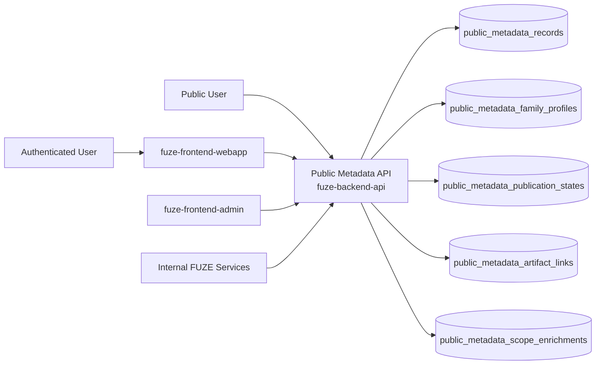
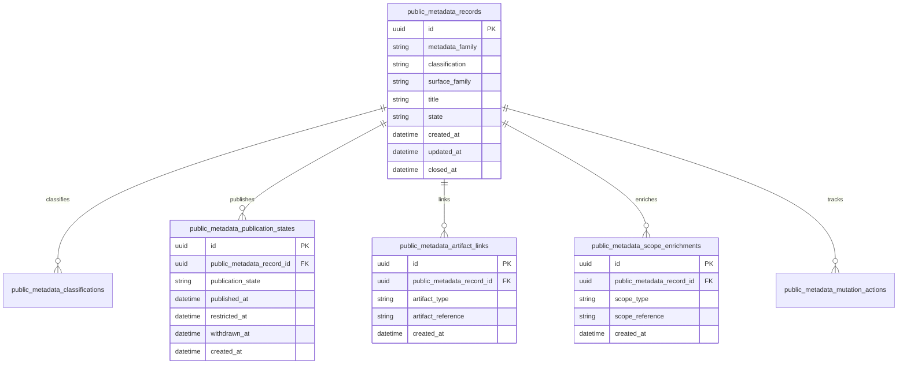
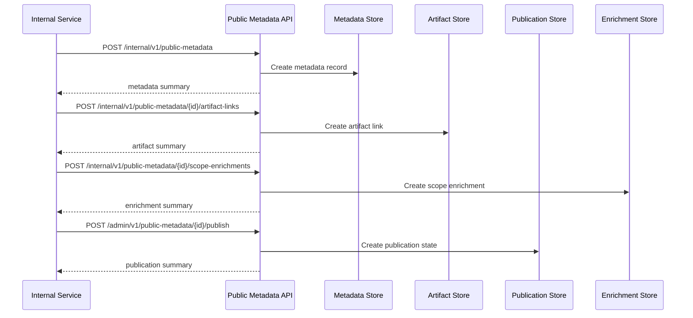

# PUBLIC_METADATA_API_SPEC

## 1. Title

**PUBLIC_METADATA_API_SPEC.md**

---

## 2. Document Metadata

- **Document Name:** PUBLIC_METADATA_API_SPEC.md
- **API Classification:** public-read, authenticated-read, internal, event-driven
- **Owning Domain:** Public Metadata Domain
- **Primary Implementing Repo:** `fuze-backend-api`
- **Primary System of Record:** public metadata records, public metadata profiles, publication states, public artifact link records, public status references, and correction-safe public metadata lineage in `fuze-backend-api`
- **Status:** Draft for canonical source-of-truth approval
- **Purpose:** Define the production-grade API contract architecture for FUZE public metadata, including canonical public artifact exposure, public derived metadata exposure, publication-state handling, public-safe discovery surfaces, and structured audit/reporting-safe lifecycle management across the platform
- **Canonical Folder:** `fuze.ac > docs > api-spec`

---

## 2.1 API Classification Header

- **API Classification:** public-read | authenticated-read | internal | event-driven
- **Owning Domain:** Public Metadata Domain
- **Primary Implementing Repo:** `fuze-backend-api`
- **Primary System of Record:** public metadata publication and public discovery domain

---

## 3. Purpose

This document defines the canonical API specification for FUZE public metadata operations. It translates the governing FUZE platform architecture, public API rules, public registry and transparency rules, public contract metadata expectations, public-safe reporting expectations, and API architecture rules into an implementation-ready API contract.

This API exists because FUZE explicitly distinguishes between:
- canonical public artifacts,
- public reporting artifacts,
- and public derived read models.

Public metadata therefore cannot be treated as an ad hoc website JSON dump or a weakly filtered copy of internal objects. It must remain a deliberate public-read layer that supports discovery, ecosystem comprehension, registry legibility, transparency-first communication, and stable integration surfaces without leaking internal control-plane behavior or hidden system-of-record logic. Public-facing surfaces such as registry entries, transparency reports, public architectural metadata, payout-cycle summaries, product listings, network metadata, and public documentation references are all aligned with FUZE’s public API model when intentionally designed as safe external surfaces. fileciteturn22file0 fileciteturn22file1

Accordingly, this specification defines how public metadata records, metadata families, publication states, canonical-artifact indicators, derived-summary indicators, registry linkages, transparency linkages, and correction lineage are represented, and how public metadata behavior remains auditable, idempotent, and architecture-consistent across FUZE.

---

## 4. Scope

This specification covers:

- public-read APIs for public platform metadata, network metadata, registry-linked metadata, transparency-linked metadata, and product/public ecosystem metadata
- authenticated read APIs for bounded actor-context public metadata enrichment where policy allows
- internal APIs for public metadata record creation, update, publication, supersession, and artifact linkage
- publication-state handling for canonical public artifacts, public reporting artifacts, and public derived summary models
- event emission requirements for public metadata lifecycle changes
- request, response, error, idempotency, versioning, audit, and database-shape rules for this domain

This specification does **not** redefine:

- public contract registry ownership in full detail
- transparency-report authoring in full detail
- payout-ledger ownership in full detail
- product-specific object APIs in full detail
- internal governance, treasury, or control-plane mutation APIs
- low-level website rendering implementation
- documentation-site publishing implementation
- SDK generation strategy in full detail

Those remain governed by their own source-of-truth specifications.

---

## 5. Source-of-Truth Inputs

### Primary FUZE docs and specs used

#### Highest-priority platform and ownership sources
- `SYSTEM_SPEC_INDEX.md`
- `DOCS_SPEC.md`
- `SYSTEM_BOUNDARY_AND_OWNERSHIP_SPEC.md`
- `PLATFORM_ARCHITECTURE_SPEC.md`
- `DOMAIN_OWNERSHIP_MATRIX_SPEC.md`
- `ONCHAIN_OFFCHAIN_RESPONSIBILITY_SPEC.md`

#### Primary public/read/reporting sources
- `PUBLIC_API_SPEC.md`
- `PUBLIC_CONTRACT_AND_WALLET_REGISTRY_SPEC.md`
- `TRANSPARENCY_MODEL_SPEC.md`
- `TRANSPARENCY_REPORTING_SPEC.md`
- `PAYOUT_LEDGER_SPEC.md`
- `API_ARCHITECTURE_SPEC.md`

#### Supporting runtime and control sources
- `EVENT_MODEL_AND_WEBHOOK_SPEC.md`
- `IDEMPOTENCY_AND_VERSIONING_SPEC.md`
- `MIGRATION_AND_BACKWARD_COMPATIBILITY_SPEC.md`
- `SECURITY_AND_RISK_CONTROL_SPEC.md`
- `SECRETS_CONFIG_AND_ENVIRONMENT_SPEC.md`
- `MONITORING_ALERTING_AND_INCIDENT_RESPONSE_SPEC.md`

### Highest-priority interpretation applied

For this file, the most important governing interpretation is:

1. public metadata is a deliberate public surface family and not a convenience export of internal models
2. backend owns canonical public metadata publication truth
3. public metadata must explicitly distinguish canonical public artifacts, public reporting artifacts, and derived public summary models
4. registry, transparency, payout, and architectural-discovery metadata are suitable public-read families when intentionally designed
5. governance-sensitive, treasury-sensitive, and internal orchestration controls must remain non-public
6. public metadata should maximize external intelligibility without weakening ownership boundaries or exposing hidden internal truth

These interpretations are directly grounded in the FUZE public API architecture, which explicitly names public architectural metadata, public registry entries, transparency reports, payout-ledger summaries, product listing metadata, and supported network metadata as suitable public-facing API surfaces, while warning against exposing governance-sensitive operations, treasury mutations, generic credits mutations, entitlement authoring, or internal control-plane capabilities publicly. fileciteturn22file0 fileciteturn22file1 fileciteturn21file11

### Supporting external standards used only as guidance

- HTTP semantics for public-read and bounded authenticated-read APIs
- structured problem-details error design
- general catalog, registry-lookup, and public metadata publication patterns as supporting guidance

External guidance does not override FUZE source-of-truth documents.

---

## 6. Governing Architecture and Ownership Interpretation

This API belongs to the **Public Metadata Domain** because it owns the canonical lifecycle of:

- public metadata records,
- public metadata family classification,
- publication and visibility state,
- canonical-artifact versus derived-summary labeling,
- registry and transparency linkages,
- public documentation references,
- and correction-safe public metadata history.

This API is implemented primarily in `fuze-backend-api` because:

- backend owns durable public metadata publication truth
- public metadata must be built from canonical owned domains without becoming a shadow owner
- multiple public surfaces require one stable integration-oriented metadata layer
- public trust requires structured, versionable metadata beyond manually curated website fragments
- audit generation and correction lineage must be centralized

This API is **not** owned by:

- `fuze-frontend-webapp`, because frontend may render public metadata but must not own its canonical publication truth
- `fuze-frontend-admin`, because admin may publish or supersede records but must not own public metadata truth
- public registry domain, because registry entries are one major metadata family but not the whole public metadata space
- transparency reporting domain, because reports are one public artifact family but not the whole public metadata space
- payout-ledger domain, because payout-cycle public outputs may be linked metadata but not the full public metadata layer
- product domains, because products own product-specific truth while public metadata owns selected public discovery projections and references

### Architectural implications

- every public metadata record must declare what kind of public surface it is
- every public metadata record must preserve whether it is canonical public artifact, public reporting artifact, or derived presentation model
- public metadata may link to registry entries, transparency reports, payout cycles, product catalogs, or documentation artifacts without owning their deeper truth
- public metadata corrections and supersession must preserve historical lineage rather than silently rewriting public meaning
- actor-scoped enrichment should remain bounded and must not convert public metadata into hidden control interfaces

---

## 7. Domain Responsibilities

The Public Metadata API domain is responsible for:

1. maintaining canonical public metadata records and metadata-family profiles
2. classifying public metadata as canonical public artifact, public reporting artifact, or derived summary model
3. publishing stable public-read metadata surfaces for registry, transparency, payout, architecture, network, and product-discovery contexts
4. preserving explicit publication state, visibility state, and supersession lineage
5. linking public metadata to public reports, registries, payout cycles, documentation, and public artifact references
6. exposing bounded authenticated-read metadata enrichment where actor context is relevant
7. emitting public metadata lifecycle events
8. generating audit lineage for sensitive publication and correction actions
9. preserving separation between public-readable metadata and private canonical domain truth
10. supporting public-safe degraded modes and trust-preserving publication behavior

The domain is not responsible for:

- owning registry truth
- owning transparency-report narrative truth
- owning payout execution truth
- owning governance-sensitive or treasury-sensitive controls
- exposing arbitrary internal domain metadata publicly
- replacing domain-specific public APIs where a richer dedicated contract is required

---

## 8. Out of Scope

The following are out of scope for this API specification:

- arbitrary public write APIs
- partner webhook authoring in full detail
- product mutation surfaces
- governance-history full schema
- internal-only metadata catalogs
- secrets/config publication rules beyond public-safe metadata classification
- end-user content management UI
- static site generation internals

---

## 9. Canonical Entities and Data Ownership

### Durable entities

#### 9.1 public_metadata_records
- **Owner:** Public Metadata Domain
- **Purpose:** canonical public metadata records
- **Nature:** source-of-truth durable entity

#### 9.2 public_metadata_family_profiles
- **Owner:** Public Metadata Domain
- **Purpose:** profiles for metadata families such as registry, transparency, payout, network, product, architecture, and documentation
- **Nature:** source-of-truth durable entity

#### 9.3 public_metadata_classifications
- **Owner:** Public Metadata Domain
- **Purpose:** classification of public metadata as canonical artifact, reporting artifact, or derived summary model
- **Nature:** source-of-truth durable entity

#### 9.4 public_metadata_publication_states
- **Owner:** Public Metadata Domain
- **Purpose:** publication, visibility, and lifecycle state of public metadata records
- **Nature:** source-of-truth durable entity

#### 9.5 public_metadata_artifact_links
- **Owner:** Public Metadata Domain
- **Purpose:** links to public reports, registries, payout cycles, docs, and other artifact references
- **Nature:** source-of-truth durable lineage entity

#### 9.6 public_metadata_scope_enrichments
- **Owner:** Public Metadata Domain
- **Purpose:** bounded authenticated-read enrichment rules by actor or scope
- **Nature:** durable lineage entity

#### 9.7 public_metadata_supersession_links
- **Owner:** Public Metadata Domain
- **Purpose:** supersession and correction lineage between public metadata records
- **Nature:** durable lineage entity

#### 9.8 public_metadata_discrepancy_cases
- **Owner:** Public Metadata Domain
- **Purpose:** review and remediation records for stale, incorrect, or inconsistent public metadata
- **Nature:** durable review/remediation entity

#### 9.9 public_metadata_mutation_actions
- **Owner:** Public Metadata Domain
- **Purpose:** high-level action records for create, publish, unpublish, correct, supersede, and resolve discrepancy
- **Nature:** durable action records with audit linkage

#### 9.10 public_metadata_audit_events
- **Owner:** Audit / Activity domain, sourced by Public Metadata Domain
- **Purpose:** immutable trail for sensitive public metadata actions
- **Nature:** durable audit records

### Derived or cached entities

#### 9.11 public_metadata_index_views
- **Owner:** derived read-model layer
- **Purpose:** list/index projections for discovery surfaces
- **Nature:** derived

#### 9.12 public_metadata_status_views
- **Owner:** derived read-model layer
- **Purpose:** public-safe status summaries and bounded authenticated enrichments
- **Nature:** derived

#### 9.13 public_metadata_discrepancy_views
- **Owner:** derived ops read-model layer
- **Purpose:** visibility into stale or inconsistent public metadata conditions
- **Nature:** derived

---

## 10. State Model and Lifecycle

### 10.1 public metadata record lifecycle

Possible states:

- `draft`
- `published`
- `restricted`
- `deprecated`
- `superseded`
- `archived`

### 10.2 publication-state lifecycle

Possible states:

- `unpublished`
- `published_public`
- `published_authenticated`
- `restricted`
- `withdrawn`

### 10.3 discrepancy lifecycle

Possible states:

- `opened`
- `under_review`
- `resolved`
- `failed`
- `closed`

Lifecycle notes:
- published does not imply canonical domain ownership of linked data
- public-safe and authenticated-only visibility must remain explicit
- supersession must preserve historical public intelligibility
- withdrawn or restricted states must not silently erase audit lineage

---

## 11. API Surface Overview

The API surface is divided into three families:

### 11.1 Public-read APIs
Used by public users, holders, community observers, and integrators for:
- public metadata index retrieval
- public metadata detail retrieval
- public network, registry, transparency, payout, and architecture metadata discovery
- public product catalog and documentation metadata discovery where appropriate

### 11.2 Authenticated read APIs
Used by authenticated users and approved clients for:
- bounded metadata enrichment
- actor- or scope-sensitive metadata visibility where policy allows
- authenticated access to metadata references not broadly public but safe within actor scope

### 11.3 Internal service and admin APIs
Used by trusted internal services and privileged operators for:
- creating and updating public metadata records
- publishing, correcting, superseding, or restricting records
- linking artifacts and maintaining correction lineage
- resolving public metadata discrepancies

---

## 12. Authentication and Authorization Model

### 12.1 Authentication posture by route family

#### Public-read routes
No authentication required:
- list public metadata
- retrieve public metadata detail
- read public network, registry, transparency, payout, architecture, and product-discovery metadata where published

#### Authenticated read routes
Require valid authenticated session:
- read bounded authenticated-only metadata
- read actor- or workspace-scoped metadata enrichments where allowed

#### Internal service routes
Require internal service identity with explicit least privilege:
- create and update metadata records
- attach artifact links
- refresh publication states
- read canonical truth

#### Admin routes
Require privileged operator identity plus reason-coded actions:
- publish, correct, restrict, supersede, withdraw, and resolve discrepancy cases

### 12.2 Authorization checkpoints

Authorization must evaluate:
- caller identity and route family
- whether metadata record is public, authenticated-only, or internal-only
- whether actor has scope visibility for authenticated enrichments
- whether service has create/publish/link/read privilege
- whether operator role is present for publication or correction actions
- whether current metadata state allows requested mutation

### 12.3 Sensitive action rules

The following require heightened checks:
- publication of new public metadata records
- correction or supersession of already published records
- visibility reduction for previously public metadata
- publication of metadata linked to payout, registry, or governance-adjacent trust surfaces
- discrepancy-resolution actions

---

## 13. API Endpoints / Interface Contracts

## 13.1 Public-Read APIs

### 13.1.1 `GET /v1/public-metadata`
**Purpose:** list published public metadata records  
**Caller Type:** public  
**Auth Expectation:** none  
**Query Parameters Summary:**
- optional `metadata_family`
- optional `classification`
- optional `surface_family`
- optional `status`
- pagination
**Response Summary:**
- metadata record summaries
- family and classification labels
- publication state
- artifact linkage summary
- timestamps
**Side Effects:** none
**Audit Requirements:** access logging optional
**Emitted Events:** none required

### 13.1.2 `GET /v1/public-metadata/{public_metadata_id}`
**Purpose:** retrieve one public metadata record  
**Caller Type:** public  
**Response Summary:**
- metadata detail
- classification and visibility information
- artifact links
- supersession guidance where relevant
- public-safe status references
**Side Effects:** none

### 13.1.3 `GET /v1/public-metadata/families/{metadata_family}`
**Purpose:** retrieve family-level public metadata profile and discovery summary  
**Caller Type:** public  
**Response Summary:**
- family profile
- allowed classifications
- discovery fields
- public-safe documentation/reference guidance
**Side Effects:** none

## 13.2 Authenticated Read APIs

### 13.2.1 `GET /v1/public-metadata/me`
**Purpose:** retrieve bounded actor-aware metadata enrichments where policy allows  
**Caller Type:** authenticated user  
**Auth Expectation:** valid authenticated session  
**Query Parameters Summary:**
- optional `metadata_family`
- pagination
**Response Summary:**
- metadata summary list
- actor-safe enrichment data
- scoped references where allowed
**Side Effects:** none

### 13.2.2 `GET /v1/public-metadata/me/{public_metadata_id}`
**Purpose:** retrieve one bounded actor-aware metadata detail  
**Caller Type:** authenticated user  
**Response Summary:**
- base public metadata detail
- bounded authenticated enrichment
- scoped artifact references where allowed
**Side Effects:** none

## 13.3 Internal Service APIs

### 13.3.1 `POST /internal/v1/public-metadata`
**Purpose:** create draft public metadata record  
**Caller Type:** internal trusted service  
**Auth Expectation:** service-to-service identity only  
**Request Body Summary:**
- `metadata_family`
- `classification`
- `surface_family`
- `title`
- optional `summary`
- `idempotency_key`
**Response Summary:** metadata record summary
**Side Effects:** creates draft metadata record
**Idempotency Behavior:** required
**Audit Requirements:** metadata-creation audit
**Emitted Events:** `public_metadata.record_created`

### 13.3.2 `POST /internal/v1/public-metadata/{public_metadata_id}/artifact-links`
**Purpose:** attach artifact links to one metadata record  
**Caller Type:** internal trusted service  
**Request Body Summary:**
- `artifact_type`
- `artifact_reference`
- optional `artifact_summary`
- `idempotency_key`
**Response Summary:** artifact-link summary
**Side Effects:** creates artifact-link lineage
**Idempotency Behavior:** required
**Audit Requirements:** artifact-link audit
**Emitted Events:** `public_metadata.artifact_linked`

### 13.3.3 `POST /internal/v1/public-metadata/{public_metadata_id}/scope-enrichments`
**Purpose:** attach bounded authenticated enrichment rules to one metadata record  
**Caller Type:** internal trusted service  
**Request Body Summary:**
- `scope_type`
- `scope_reference`
- `enrichment_profile`
- `idempotency_key`
**Response Summary:** scope-enrichment summary
**Side Effects:** creates enrichment lineage
**Idempotency Behavior:** required
**Audit Requirements:** enrichment audit
**Emitted Events:** `public_metadata.scope_enrichment_linked`

### 13.3.4 `GET /internal/v1/public-metadata/{public_metadata_id}`
**Purpose:** retrieve canonical public metadata truth  
**Caller Type:** internal trusted service  
**Response Summary:** full metadata record, classification, publication state, artifact links, enrichments, supersession lineage, and discrepancy lineage
**Side Effects:** none

## 13.4 Admin / Control-Plane APIs

### 13.4.1 `POST /admin/v1/public-metadata/{public_metadata_id}/publish`
**Purpose:** publish public metadata record under controlled policy  
**Caller Type:** admin/operator  
**Request Body Summary:**
- `visibility_target`
- `reason_code`
- `operator_note`
- `idempotency_key`
**Response Summary:** published metadata summary
**Side Effects:** metadata publication state changes to published_public or published_authenticated
**Audit Requirements:** critical audit
**Emitted Events:** `public_metadata.record_published`

### 13.4.2 `POST /admin/v1/public-metadata/{public_metadata_id}/restrict`
**Purpose:** restrict or withdraw public metadata visibility under controlled policy  
**Caller Type:** admin/operator  
**Request Body Summary:**
- `restriction_mode`
- `reason_code`
- `operator_note`
- `idempotency_key`
**Response Summary:** restricted metadata summary
**Side Effects:** metadata publication state changes to restricted or withdrawn
**Audit Requirements:** critical audit
**Emitted Events:** `public_metadata.record_restricted`

### 13.4.3 `POST /admin/v1/public-metadata/{public_metadata_id}/supersede`
**Purpose:** supersede one public metadata record with another under controlled policy  
**Caller Type:** admin/operator  
**Request Body Summary:**
- `replacement_public_metadata_id`
- `reason_code`
- `operator_note`
- `idempotency_key`
**Response Summary:** supersession summary
**Side Effects:** creates supersession linkage and updates visible preference
**Audit Requirements:** critical audit
**Emitted Events:** `public_metadata.record_superseded`

### 13.4.4 `POST /admin/v1/public-metadata/discrepancies`
**Purpose:** resolve public metadata discrepancy under controlled policy  
**Caller Type:** admin/operator  
**Request Body Summary:**
- `target_reference_type`
- `target_reference_id`
- `resolution_code`
- `operator_note`
- `related_case_id`
- `idempotency_key`
**Response Summary:** discrepancy-resolution summary
**Side Effects:** may correct, supersede, restrict, or close discrepancy posture with preserved lineage
**Audit Requirements:** critical audit
**Emitted Events:** `public_metadata.discrepancy_resolved`

---

## 14. Request Rules

### 14.1 General request rules
- all mutation-capable routes must require JSON requests with explicit content type
- all mutation routes must carry correlation IDs
- sensitive public metadata mutations must carry idempotency keys
- admin mutations must require reason codes and operator notes
- no route may accept frontend-authored public metadata truth as authoritative input

### 14.2 Sensitive-action request requirements
The following requests require heightened validation:
- publication of new public metadata records
- publication of metadata tied to registry, transparency, payout, or governance-adjacent trust surfaces
- restriction or withdrawal of already public metadata
- supersession of public-facing metadata with strong ecosystem dependency
- discrepancy-resolution actions

Heightened validation may include:
- family/classification consistency checks
- artifact-link validation
- public-safe versus authenticated-only visibility checks
- operator role confirmation
- reporting or registry case linkage for sensitive actions

### 14.3 Scope integrity rule
Public metadata mutations must target valid and authorized records, artifact links, enrichment records, and discrepancy records. Services and operators must not mutate unrelated or unauthorized metadata state.

### 14.4 Layer-separation rule
Public metadata domain must remain the public discovery-and-publication layer. It must not collapse:
- registry ownership,
- payout-ledger ownership,
- transparency-report ownership,
- product canonical truth,
- or internal orchestration state
into one ambiguous metadata object.

---

## 15. Response Rules

### 15.1 Success response rules
Successful responses must include:
- stable resource identifiers
- timestamps for created/updated state
- state/status values
- family and classification summaries
- artifact-link and publication-state summaries where relevant
- correlation references for mutations

### 15.2 Async-accepted response rules
If publication propagation, restriction, or discrepancy remediation is async, the response must:
- return accepted status
- include action or job ID
- provide follow-up status semantics

### 15.3 Terminal mutation response rules
Terminal mutation responses must clearly show:
- target metadata record or discrepancy
- mutation type
- resulting publication state
- restriction, supersession, or withdrawal effects where relevant
- whether public-safe views may refresh asynchronously

### 15.4 Read response rules
Read responses must distinguish:
- canonical internal metadata truth
- public canonical artifact references
- public reporting artifact references
- derived public summary models
- actor-scoped enrichment versus ordinary public metadata

---

## 16. Error Model

The API uses structured problem-details style error responses.

### 16.1 Required error fields
- `type`
- `title`
- `status`
- `code`
- `detail`
- `instance`
- `correlation_id`

### 16.2 Common error codes

#### Authorization / permission errors
- `PUBLIC_METADATA_PERMISSION_DENIED`
- `PUBLIC_METADATA_OPERATOR_PERMISSION_DENIED`
- `PUBLIC_METADATA_SERVICE_PERMISSION_DENIED`
- `PUBLIC_METADATA_AUDIENCE_PERMISSION_DENIED`

#### State conflict errors
- `PUBLIC_METADATA_RECORD_STATE_INVALID`
- `PUBLIC_METADATA_PUBLICATION_STATE_INVALID`
- `PUBLIC_METADATA_SUPERSESSION_CONFLICT`
- `PUBLIC_METADATA_VISIBILITY_CONFLICT`

#### Policy / safety errors
- `PUBLIC_METADATA_CLASSIFICATION_REQUIRED`
- `PUBLIC_METADATA_ARTIFACT_REFERENCE_REQUIRED`
- `PUBLIC_METADATA_VISIBILITY_NOT_ALLOWED`
- `PUBLIC_METADATA_PUBLICATION_NOT_ALLOWED`
- `PUBLIC_METADATA_RESTRICTION_NOT_ALLOWED`

#### Request integrity errors
- `PUBLIC_METADATA_IDEMPOTENCY_KEY_REQUIRED`
- `PUBLIC_METADATA_REQUEST_INVALID`
- `PUBLIC_METADATA_REQUEST_UNPROCESSABLE`

#### Dependency or provider errors
- `PUBLIC_METADATA_STORAGE_UNAVAILABLE`
- `PUBLIC_METADATA_REPORTING_UNAVAILABLE`
- `PUBLIC_METADATA_REGISTRY_UNAVAILABLE`

### 16.3 Error handling rules
- do not expose hidden internal governance, treasury, security, or audit detail in public or low-privilege responses
- do not imply canonical domain ownership from metadata publication alone
- distinguish classification/visibility failure from generic invalid state
- distinguish missing artifact reference from generic invalid request
- include retry guidance only where safe

---

## 17. Idempotency and Mutation Safety

### 17.1 Required idempotent mutations
The following mutation routes require idempotent behavior:
- metadata record creation
- artifact-link attachment
- scope-enrichment attachment
- publish
- restrict
- supersede
- discrepancy resolution

### 17.2 Idempotency key rules
- mutation requests must supply `Idempotency-Key`
- backend stores key scope, request hash, actor, and terminal result
- replay of same semantic request returns original terminal outcome
- replay of same key with different semantic request must fail with conflict

### 17.3 Mutation safety rules
- one canonical visible metadata record per current metadata lineage unless explicit supersession exists
- artifact and enrichment links must remain referentially consistent with metadata family and classification
- public publication and authenticated publication must remain explicitly distinct
- corrections and supersession must preserve prior public metadata lineage
- restriction and withdrawal must preserve auditability and public explanation where appropriate

---

## 18. Versioning and Compatibility Rules

### 18.1 Versioning
This API family is versioned under `/v1`, `/internal/v1`, and `/admin/v1` route families.

### 18.2 Compatibility approach
- additive evolution preferred
- no silent semantic change to metadata family, classification, or visibility meaning
- new metadata families, surface families, and artifact-link types may be added without breaking existing contracts
- response fields may be added but existing meanings must remain stable

### 18.3 Breaking-change rules
Breaking changes include:
- changing the meaning of canonical public artifact versus public reporting artifact versus derived summary model
- changing visibility semantics incompatibly
- removing critical artifact-link or publication-state fields
- changing supersession or withdrawal semantics incompatibly

Such changes require explicit migration planning and version evolution. Public APIs have the strongest backward-compatibility obligation in FUZE’s interface model, so public metadata surfaces must evolve conservatively and with preserved lineage. fileciteturn22file4 fileciteturn21file9

### 18.4 Deprecation
Deprecated routes or fields must:
- be documented explicitly
- carry deprecation metadata where supported
- preserve compatibility windows long enough for public, first-party, and internal consumers

---

## 19. Event Emission and Webhook Behavior

This domain is event-capable.

### 19.1 Internal events
The Public Metadata domain must emit canonical internal events such as:
- `public_metadata.record_created`
- `public_metadata.artifact_linked`
- `public_metadata.scope_enrichment_linked`
- `public_metadata.record_published`
- `public_metadata.record_restricted`
- `public_metadata.record_superseded`
- `public_metadata.discrepancy_resolved`

### 19.2 Event payload minimums
Each event should contain:
- event ID
- event type
- occurred_at
- public metadata ID
- metadata family
- classification
- publication state
- actor type
- correlation ID
- reason code where applicable

### 19.3 External webhook posture
This specification does not expose general third-party outbound public metadata webhooks by default. Any future outbound metadata publication webhook surface must be narrow, security-reviewed, and governed by a separate contract. FUZE’s webhook philosophy explicitly requires that only intentionally stable, useful, and safe external contracts be exposed, and it warns against mirroring internal event streams directly. fileciteturn21file13

---

## 20. Audit and Activity Requirements

The following actions must generate durable audit events:

- metadata record creation
- artifact-link attachment
- publish, restrict, supersede, and discrepancy actions
- scope-enrichment linkage where sensitivity requires
- other sensitive public metadata mutations

### Required audit fields
- audit event ID
- actor type and actor reference
- target metadata record / artifact link / discrepancy reference as applicable
- action type
- before/after summary where applicable
- reason code
- correlation ID
- operator note if operator action
- occurred_at

Public API operations are part of the platform’s trust surface and therefore need strong traceability into internal audit systems. fileciteturn22file4

---

## 21. Data Model and Database Schema View

### 21.1 `public_metadata_records`
- `id` PK
- `metadata_family`
- `classification`
- `surface_family`
- `title`
- `summary`
- `state`
- `created_at`
- `updated_at`
- `closed_at` nullable

**Constraints:**
- index on (`metadata_family`, `classification`)
- index on `state`

### 21.2 `public_metadata_family_profiles`
- `id` PK
- `metadata_family`
- `allowed_classifications_json`
- `discovery_profile_json`
- `visibility_profile_json`
- `created_at`
- `updated_at`

**Constraints:**
- unique `metadata_family`

### 21.3 `public_metadata_classifications`
- `id` PK
- `public_metadata_record_id` FK -> `public_metadata_records.id`
- `classification`
- `canonical_owner_reference`
- `created_at`

**Constraints:**
- index on `public_metadata_record_id`

### 21.4 `public_metadata_publication_states`
- `id` PK
- `public_metadata_record_id` FK -> `public_metadata_records.id`
- `publication_state`
- `published_at` nullable
- `restricted_at` nullable
- `withdrawn_at` nullable
- `created_at`

**Constraints:**
- index on `public_metadata_record_id`
- index on `publication_state`

### 21.5 `public_metadata_artifact_links`
- `id` PK
- `public_metadata_record_id` FK -> `public_metadata_records.id`
- `artifact_type`
- `artifact_reference`
- `artifact_summary_json`
- `created_at`

**Constraints:**
- index on `public_metadata_record_id`

### 21.6 `public_metadata_scope_enrichments`
- `id` PK
- `public_metadata_record_id` FK -> `public_metadata_records.id`
- `scope_type`
- `scope_reference`
- `enrichment_profile_json`
- `created_at`

**Constraints:**
- index on `public_metadata_record_id`

### 21.7 `public_metadata_supersession_links`
- `id` PK
- `from_public_metadata_id` FK -> `public_metadata_records.id`
- `to_public_metadata_id` FK -> `public_metadata_records.id`
- `reason_code`
- `created_at`

**Constraints:**
- unique (`from_public_metadata_id`, `to_public_metadata_id`)

### 21.8 `public_metadata_discrepancy_cases`
- `id` PK
- `target_reference_type`
- `target_reference_id`
- `state`
- `resolution_code` nullable
- `created_at`
- `updated_at`
- `closed_at` nullable

### 21.9 `public_metadata_mutation_actions`
- `id` PK
- `target_reference_type`
- `target_reference_id`
- `action_type`
- `state`
- `reason_code`
- `operator_note` nullable
- `requested_by_actor_type`
- `requested_by_actor_id`
- `created_at`
- `executed_at` nullable
- `closed_at` nullable
- `correlation_id`

### 21.10 `idempotency_records`
- `id` PK
- `idempotency_key`
- `scope_family`
- `actor_reference`
- `request_hash`
- `response_hash`
- `terminal_status`
- `created_at`
- `expires_at`

### 21.11 `audit_log_entries`
Domain-sourced audit records written into the audit domain.

### Normalization notes
- canonical public metadata truth stays in metadata records, family profiles, classifications, publication states, artifact links, enrichments, supersession links, and discrepancy records
- registry, transparency, payout, and product canonical truths remain external and are referenced rather than duplicated
- public-safe views must derive from canonical public metadata truth filtered by publication state and visibility class
- actor-scoped enrichments remain bounded overlays rather than new canonical owners of metadata

### Reconciliation notes
- one visible public metadata record should reconcile to one current metadata lineage under current preference
- publication state must reconcile with allowed family/classification combinations
- artifact links must reconcile to linked registry/report/payout/docs artifacts
- discrepancy cases must preserve review lineage for stale or conflicting public metadata conditions

---

## 22. Architecture Diagram — Mermaid flowchart



---

## 23. Data Design — Mermaid Diagram



---

## 24. Flow View

### 24.1 Happy path — publish canonical public metadata
1. internal service creates draft public metadata record
2. artifact links are attached to registry, transparency, payout, docs, or product-discovery artifacts
3. operator validates family/classification and publication intent
4. admin publishes record publicly
5. public index and detail surfaces become available
6. external readers can discover the record as canonical public artifact, public reporting artifact, or derived summary model

### 24.2 Happy path — authenticated enrichment
1. public metadata record is already published or authenticated-visible
2. bounded actor/scope enrichment is linked internally
3. authenticated actor requests the metadata
4. backend returns base public metadata plus scoped enrichment where policy allows
5. actor sees additional safe context without gaining hidden control-plane access

### 24.3 Alternate path — superseding registry or metadata artifact
1. older public metadata record must be replaced
2. replacement record is created and validated
3. admin supersedes the older record
4. previous record remains historically linked and interpretable
5. new record becomes current visible preference

### 24.4 Failure path — invalid classification or publication posture
1. metadata record is created or modified
2. backend detects missing classification, invalid family/classification combination, or disallowed visibility posture
3. request is rejected or record remains unpublished
4. no unsafe public metadata surface is produced

### 24.5 Failure and remediation path — stale or incorrect public metadata
1. linked artifact changes or public metadata becomes stale/inconsistent
2. admin opens discrepancy-resolution flow
3. backend preserves existing lineage
4. corrected or superseding metadata record is created
5. discrepancy closes with preserved history

### 24.6 Degraded-mode path
1. linked public report, registry, or payout artifact is delayed or degraded
2. public metadata surface stays available where safe
3. backend communicates visibility or freshness degradation explicitly
4. canonical truth mutation is not implied by degraded presentation

### 24.7 Retry behavior
- duplicate metadata creation returns same canonical record result
- duplicate artifact or enrichment attachment returns same lineage result where applicable
- duplicate publish/restrict/supersede/discrepancy actions return same terminal action result

---

## 25. Data Flows — Mermaid sequenceDiagram



---

## 26. Security and Risk Controls

1. **Public metadata truth is backend-owned**  
   Frontends and informal publication channels may not authoritatively define public metadata truth.

2. **Public metadata is not a control plane**  
   Public metadata surfaces must support participation, visibility, and discovery, not expose governance, treasury, payout authoring, or internal orchestration control paths. fileciteturn22file0

3. **Classification clarity is mandatory**  
   Public metadata must explicitly distinguish canonical public artifacts, reporting artifacts, and derived summary models so external consumers do not mistake one for another. fileciteturn22file0

4. **Public-safe visibility discipline**  
   Publication state must keep public, authenticated-only, and internal-only metadata clearly separated.

5. **Rate limits and abuse controls**  
   Public metadata surfaces require public-surface protections such as rate limiting, actor/token throttling, input hardening, and stable pagination expectations. fileciteturn22file4

6. **Backward-compatibility discipline**  
   Public metadata surfaces must follow explicit versioning and conservative compatibility rules because public interfaces carry stronger ecosystem trust obligations than most internal APIs. fileciteturn22file4

7. **Audit-linked publication**  
   Publication, restriction, and supersession of public metadata must remain traceable into internal audit systems. fileciteturn22file4

8. **Secrets/config boundary discipline**  
   Public metadata may include only values intentionally classed as public, such as published contract addresses, public documentation URLs, or public chain-role descriptions. It must not leak confidential or control-sensitive configuration. fileciteturn22file16

9. **Trust-preserving degraded modes**  
   Public metadata should preserve the difference between visibility lag, execution delay, and canonical truth mutation. fileciteturn22file4

10. **Historical intelligibility**  
    Corrections and supersession must preserve lineage so public trust surfaces remain historically interpretable. fileciteturn21file9turn22file10

---

## 27. Operational Considerations

- public metadata index and detail reads should be highly available
- publication-state changes and artifact-link correctness are trust-sensitive and must be monitored
- registry-linked, transparency-linked, and payout-linked public metadata should surface clearly to ops views
- supersession and discrepancy workflows should be observable and reviewable
- monitoring should alert on:
  - stale public metadata tied to registry, transparency, or payout surfaces
  - publication failures for trusted public artifacts
  - public/private visibility divergence
  - broken artifact references
  - public-safe view inconsistency versus canonical metadata state
  - degraded public trust surfaces during active trust-sensitive periods such as payout publication windows. fileciteturn22file13turn22file14

---

## 28. Acceptance Criteria

1. The API preserves the distinction between public metadata truth, registry truth, transparency-report truth, payout-ledger truth, and internal domain truth.
2. Only `fuze-backend-api` owns canonical public metadata publication truth.
3. Public metadata records, family profiles, classifications, publication states, artifact links, enrichments, supersession links, and discrepancy records are durable and backend-owned.
4. Public and authenticated routes expose only bounded safe public metadata views.
5. Metadata family, classification, and visibility posture are explicit and validated.
6. Public metadata distinguishes canonical public artifact, public reporting artifact, and derived summary model.
7. Publication, restriction, supersession, and discrepancy actions preserve immutable lineage.
8. Public metadata mutation actions are idempotent and auditable.
9. Internal and admin public metadata routes are least-privilege and backend-only.
10. Admin routes require reason-coded privileged authorization.
11. Event emissions exist for major public metadata mutations.
12. Database schema separates records, family profiles, classifications, publication states, artifact links, enrichments, supersession links, and discrepancy layers.
13. Public-safe consumers can rely on public metadata views without needing internal platform knowledge.
14. Public metadata supports rate-limited, versioned, supportable external integration behavior.
15. Mermaid diagrams remain consistent with prose and data model.

---

## 29. Test Cases

### 29.1 Positive cases
1. Internal service creates draft public metadata record successfully.
2. Internal service attaches artifact link successfully.
3. Internal service attaches scope enrichment successfully.
4. Admin publishes public metadata successfully.
5. Public user reads published metadata index successfully.
6. Public user reads one published metadata record successfully.
7. Authenticated user reads bounded metadata enrichment successfully.
8. Admin supersedes stale metadata successfully.

### 29.2 Negative cases
9. Public user cannot access unpublished or internal-only metadata.
10. Internal service without write privilege cannot create metadata record.
11. Publication without valid classification returns `PUBLIC_METADATA_CLASSIFICATION_REQUIRED`.
12. Publication without required artifact reference returns `PUBLIC_METADATA_ARTIFACT_REFERENCE_REQUIRED`.
13. Disallowed visibility target returns `PUBLIC_METADATA_VISIBILITY_NOT_ALLOWED`.
14. Restriction attempt in incompatible state returns `PUBLIC_METADATA_RESTRICTION_NOT_ALLOWED`.

### 29.3 Authorization cases
15. Ordinary public or authenticated user cannot call admin metadata publication APIs.
16. Internal service without artifact-link privilege cannot attach artifact links.
17. Operator without publication privilege cannot publish metadata.
18. Published public metadata does not imply canonical ownership of linked registry/report/payout truth.

### 29.4 Idempotency and replay cases
19. Repeating metadata creation with same idempotency key returns original metadata result.
20. Repeating artifact-link attachment with same idempotency key returns original linkage result.
21. Repeating publish or restrict with same idempotency key returns original terminal action result.
22. Repeating supersede or discrepancy resolution with same idempotency key returns original terminal action result.

### 29.5 Concurrency cases
23. Concurrent artifact-link updates preserve one explicit current linkage lineage and duplicate-safe outcomes where appropriate.
24. Concurrent publish and restrict actions preserve explicit lifecycle ordering without hidden overwrite.
25. Concurrent supersede and discrepancy actions preserve explicit visible lineage without ambiguity.

### 29.6 Recovery / admin cases
26. Stale or mislinked public metadata can be corrected under controlled policy with explicit lineage.
27. Superseded public metadata remains historically linked to the original record.
28. Discrepancy resolution closes artifact-link, visibility, or reporting conflict with preserved audit history.

### 29.7 Event and audit cases
29. Successful metadata creation emits `public_metadata.record_created`.
30. Successful artifact-link attachment emits `public_metadata.artifact_linked`.
31. Successful publication emits `public_metadata.record_published`.
32. Successful restriction emits `public_metadata.record_restricted`.
33. Successful discrepancy resolution emits `public_metadata.discrepancy_resolved` with critical audit lineage.

---

## 30. Open Questions or Explicit Deferred Decisions

1. Exact metadata-family taxonomy code sets are deferred.
2. Exact surface-family taxonomy and discovery-field standardization are deferred.
3. Exact public-safe disclosure depth for each metadata family is deferred.
4. Exact actor-scoped enrichment taxonomy is deferred.
5. Exact discrepancy taxonomy for metadata/publication conflicts is deferred.
6. Exact partner-oriented public metadata quota strategy is deferred.

---

## 31. Implementation Notes for `fuze-backend-api`

Recommended backend module layout:

```text
modules/platform/
  public-metadata/
  public-registry/
  transparency-reporting/
  payout-ledger/
  audit-log/
  control-plane/
  integrations/
```

Implementation guidance:
- keep metadata records, family profiles, publication state, artifact links, and supersession logic in one canonical domain service
- perform family/classification/visibility checks inside the commit boundary
- keep publish, restrict, supersede, and discrepancy actions explicit and idempotent
- treat admin remediations as domain actions, not ad hoc row edits
- emit events only after canonical state commit succeeds
- publish public-safe metadata views from canonical truth; do not let derived views mutate metadata state

---

## 32. Frontend Consumption Notes

### For `fuze-frontend-webapp`
- may read public metadata and bounded authenticated enrichments where approved
- must not infer canonical domain ownership from public metadata alone
- must treat backend public metadata responses as authoritative for publication state and public discovery semantics
- should clearly distinguish public artifact, reporting artifact, and derived summary views when visible

### For `fuze-frontend-admin`
- may trigger privileged publish, restrict, supersede, and discrepancy actions only through backend admin APIs
- must require operator reason input for sensitive mutations
- must not directly mutate canonical public metadata truth client-side
- should present immutable metadata history and correction lineage separately from current visible state

---

## 33. Contract Derivation Notes

### OpenAPI / AsyncAPI
This spec should later derive into:
- public metadata index/detail/family read operations
- authenticated metadata enrichment read operations
- internal metadata creation, artifact-link, and enrichment operations
- admin publish / restrict / supersede / discrepancy operations
- shared problem-details schema
- public metadata lifecycle events in AsyncAPI

### Future `fuze-sdk`
Future `fuze-sdk` packages may derive:
- public metadata lookup helpers
- public family discovery helpers
- typed metadata-family, classification, and publication-state summary models
- problem-error models for public metadata outcomes

The SDK must derive from approved API contracts and must not become the source of truth over this narrative specification.
