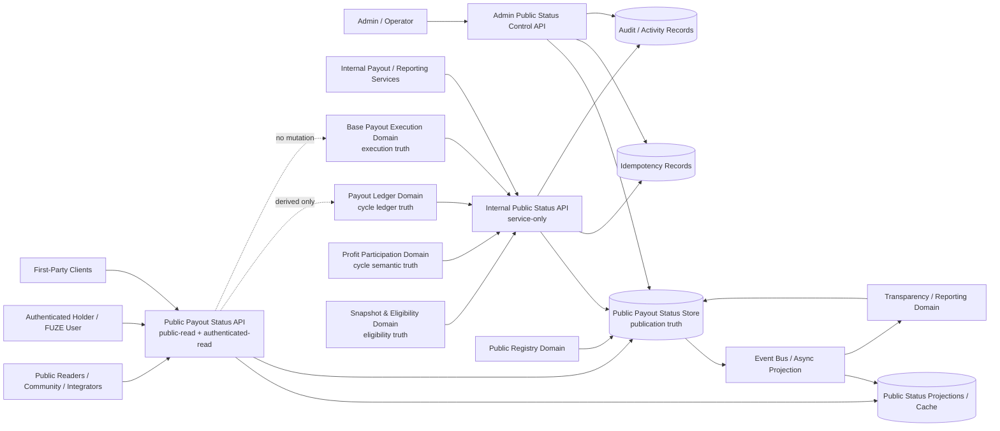
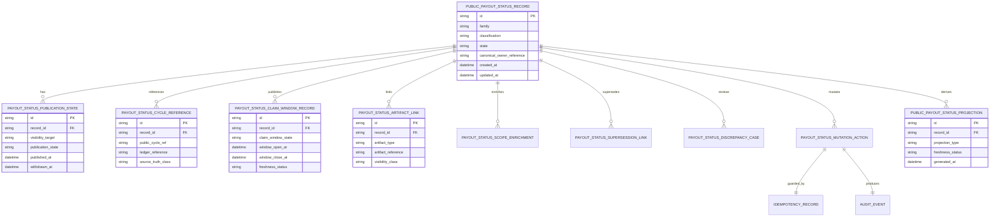
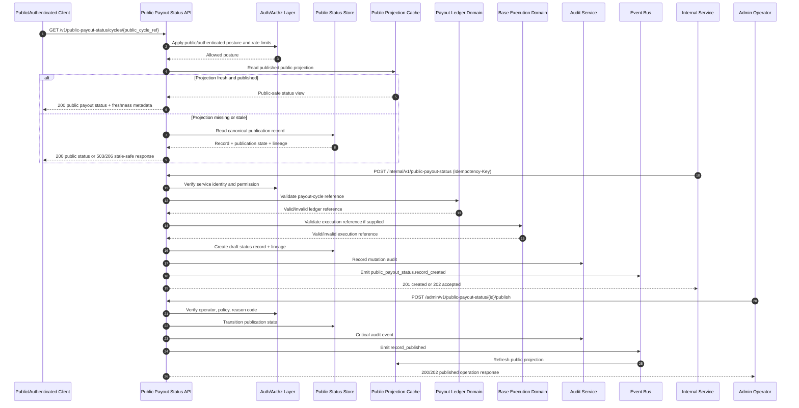

# PUBLIC_PAYOUT_STATUS_API_SPEC.md

## Document Metadata

- **Document Name:** `PUBLIC_PAYOUT_STATUS_API_SPEC.md`
- **Document Type:** FUZE API SPEC v2 / production-grade interface-contract specification
- **Status:** Draft canonical API SPEC v2
- **Version:** 2.0.0
- **Effective Date:** 2026-04-25
- **Last Updated:** 2026-04-25
- **Reviewed On:** 2026-04-25
- **Document Owner:** FUZE Public Payout Status Domain; named individual owner not specified in retrieved governing materials
- **Approval Authority:** FUZE platform architecture and API governance approval workflow; explicit named authority not specified in retrieved governing materials
- **Review Cadence:** Quarterly and whenever payout-ledger, Base payout execution, transparency/reporting, public API, registry, chain, audit, or access-control posture materially changes
- **Governing Layer:** Public-read / public-trust companion API layer derived from refined payout, public API, and public trust semantics
- **Parent Registry:** FUZE API SPEC v2 Canonical File Registry
- **Upstream Semantic Registry:** `REFINED_SYSTEM_SPEC_INDEX.md`
- **Upstream API Registry:** `API_SPEC_INDEX.md`
- **Primary Audience:** Backend/API engineering, frontend/public surfaces, public trust/reporting teams, payout ledger implementers, Base payout execution implementers, registry/reporting authors, security, audit, operations, OpenAPI/AsyncAPI/SDK authors, QA and contract-validation teams
- **Primary Purpose:** Define the canonical API contract for FUZE public payout-status surfaces, including cycle-status publication, claim-window visibility, public-safe funding and claim-progress posture, payout-status timelines, artifact linkage, correction/supersession lineage, authenticated enrichments, event behavior, and implementation guardrails
- **Primary Upstream References:** `PUBLIC_PAYOUT_STATUS_API_SPEC.md` v1, `PAYOUT_LEDGER_SPEC.md`, `PAYOUT_LEDGER_API_SPEC.md`, `BASE_PAYOUT_EXECUTION_LAYER_SPEC.md`, `BASE_PAYOUT_EXECUTION_LAYER_API_SPEC.md`, `PROFIT_PARTICIPATION_SYSTEM_SPEC.md`, `SNAPSHOT_AND_ELIGIBILITY_PIPELINE_SPEC.md`, `TRANSPARENCY_MODEL_SPEC.md`, `TRANSPARENCY_REPORTING_SPEC.md`, `PUBLIC_API_SPEC.md`, `API_ARCHITECTURE_SPEC.md`, `EVENT_MODEL_AND_WEBHOOK_SPEC.md`, `IDEMPOTENCY_AND_VERSIONING_SPEC.md`, `MIGRATION_AND_BACKWARD_COMPATIBILITY_SPEC.md`, `AUDIT_LOG_AND_ACTIVITY_SPEC.md`, `SECURITY_AND_RISK_CONTROL_SPEC.md`, `MONITORING_ALERTING_AND_INCIDENT_RESPONSE_SPEC.md`, `PUBLIC_CONTRACT_AND_WALLET_REGISTRY_SPEC.md`, `CHAIN_ARCHITECTURE_SPEC.md`, account/session foundation documents, workspace access-control foundation documents
- **Primary Downstream Dependents:** public payout pages, holder-facing status views, public transparency surfaces, public metadata and registry lookup surfaces, reporting exports, partner-safe status integrations, API implementation contracts, OpenAPI/AsyncAPI contracts, SDK read surfaces, public cache/projection services, QA/regression suites
- **API Surface Families Covered:** public-read, authenticated-read, first-party read, internal service, admin/control-plane, event/async, reporting/export, public-trust projection
- **API Surface Families Excluded:** claim submission APIs, raw private-holder entitlement APIs, treasury-control APIs, Base contract ABI APIs, internal eligibility computation APIs, governance/vault mutation APIs, low-level worker/runbook APIs, unrestricted third-party payout webhooks
- **Canonical System Owner(s):** Public Payout Status Domain for public payout-status publication truth; Payout Ledger Domain for payout-cycle ledger truth; Base Payout Execution Domain for execution truth; Profit Participation Domain for payout-cycle semantic truth; Snapshot and Eligibility Domain for eligibility truth; Transparency/Registry domains for their own publication truth
- **Canonical API Owner:** FUZE Public Payout Status API owner within `fuze-backend-api`; named owner not specified in retrieved materials
- **Supersedes:** Earlier or weaker interpretations that treat public payout status as raw payout-ledger export, frontend-owned display copy, transparency-report narrative, Base execution status flag, generic payout dashboard, or direct holder-entitlement surface
- **Superseded By:** None currently defined
- **Related Decision Records:** Not explicitly specified in retrieved governing materials
- **Canonical Status Note:** This API spec governs interface-contract expression only. Refined system specs own semantic truth; this API spec expresses public payout-status semantics safely at the interface layer.
- **Implementation Status:** Normative draft for downstream implementation alignment
- **Approval Status:** Pending explicit FUZE approval workflow
- **Change Summary:** Upgrades the v1 public payout-status API into API SPEC v2 with explicit hierarchy metadata, truth classes, ownership boundaries, route families, request/response/error/status models, idempotency, audit, public/internal/admin separation, diagrams, flow views, acceptance criteria, and test cases.

## Purpose

This specification defines the production-grade FUZE API contract for public payout-status operations.

The Public Payout Status API exists because FUZE needs a stable public trust surface for payout-cycle visibility that is narrower than canonical payout-ledger truth, narrower than Base payout execution truth, and more structured than informal announcements or dashboard copy. It exposes public-safe payout-cycle state, claim-window posture, funding posture, correction lineage, linked artifacts, and payout-status history without leaking private eligibility details, internal preparation details, treasury-sensitive controls, or raw execution internals.

This API MUST preserve the distinction between:

- canonical payout-cycle ledger truth,
- public payout-status publication truth,
- Base execution truth,
- profit-participation semantic truth,
- eligibility and holder-specific truth,
- transparency/reporting truth,
- registry truth,
- derived public read-model truth,
- and presentation copy.

## Scope

This specification governs:

- public-read payout-status list and detail surfaces;
- public payout-cycle status lookup by public cycle reference;
- public claim-window visibility surfaces;
- public-safe funding and claim-progress summaries;
- authenticated actor-aware payout-status enrichments where policy permits;
- internal service APIs for creating, linking, refreshing, and preparing payout-status records;
- admin/control-plane APIs for publication, restriction, withdrawal, correction, supersession, and discrepancy resolution;
- event and async behavior for public payout-status lifecycle changes;
- request, response, error, status, idempotency, retry, audit, observability, compatibility, and migration rules.

## Out of Scope

This API MUST NOT define or own:

- claim submission, claim execution, or claimant transaction mutation;
- detailed holder entitlement computation;
- snapshot and eligibility algorithms;
- payout-ledger lifecycle truth beyond bounded public status publication;
- Base payout execution runs, batches, receipts, attempts, or reconciliation truth;
- treasury approval, vault action, multisig, timelock, or governance controls;
- transparency-report authoring workflow;
- public contract/wallet registry mutation truth;
- low-level website rendering, static-site generation, explorer integration, database topology, or queue internals.

## Design Goals

1. Expose payout-cycle status in a stable, public-safe, intelligible form.
2. Prevent public status from becoming a hidden owner of payout-ledger, execution, eligibility, treasury, or reporting truth.
3. Preserve correction, withdrawal, supersession, and discrepancy lineage.
4. Support public, first-party, internal, admin, event, and reporting consumers without collapsing their permissions.
5. Make status publication idempotent, auditable, observable, versionable, and migration-safe.
6. Provide enough contract precision for OpenAPI, AsyncAPI, SDK, backend, frontend, cache, and QA derivation.

## Non-Goals

This specification does not attempt to:

- expose raw internal payout preparation state;
- publish private holder-level eligibility or claim details by default;
- replace the payout ledger with a public status table;
- make public transparency reports canonical payout truth;
- make Base chain observations automatically equivalent to public payout status;
- provide a generic public write surface;
- allow frontend display labels to define business state.

## Core Principles

### Public status is a deliberate publication layer

Public payout status MUST be an intentionally governed publication layer. It MUST NOT be implemented as an automatic raw dump from payout ledger, Base execution, treasury, eligibility, or transparency stores.

### Public status is not payout truth

Payout-ledger truth, Base execution truth, profit-participation truth, eligibility truth, treasury truth, and transparency/reporting truth remain owned by their respective domains. Public payout status MAY reference them and publish bounded summaries, but MUST NOT redefine them.

### Historical intelligibility is mandatory

Corrections, supersessions, withdrawals, and restrictions MUST preserve lineage. Silent rewriting of public payout status is forbidden.

### Public-safe and authenticated-safe are distinct

Public unauthenticated status, authenticated actor-aware enrichments, internal canonical records, and admin/control-plane actions MUST remain distinct route families and response classes.

### Accepted publication is not final source truth

If public-status publication or refresh is asynchronous, `accepted` means that a publication operation was accepted, not that upstream payout state changed or final public propagation completed.

## Canonical Definitions

- **Public Payout Status Record:** The canonical public-status publication-domain record for a payout-status surface.
- **Payout Status Family:** A classification family such as `cycle_status`, `claim_window_status`, `funding_posture`, `correction_notice`, `timeline`, or `supporting_artifact`.
- **Public Cycle Reference:** A public-safe identifier for a payout cycle. It MUST be stable and MUST NOT expose unsafe internal identifiers unless explicitly approved.
- **Claim-Window Visibility Record:** A publication-domain record describing public-safe claim-window posture, such as scheduled, open, closing, closed, or superseded.
- **Artifact Link:** A public-safe link to a transparency report, registry entry, ledger summary, proof artifact, or documentation artifact.
- **Authenticated Enrichment:** A bounded actor-aware extension to public status. It MAY expose additional safe context for an authenticated actor, but MUST NOT expose full private entitlement truth unless governed by a more specific claim/holder API.
- **Supersession Link:** A lineage relation connecting an older status record to its successor or corrective status.
- **Discrepancy Case:** A remediation record for stale, conflicting, incomplete, or unsafe public payout status.

## Truth Class Taxonomy

This API MUST distinguish these truth classes:

1. **Semantic truth:** payout-cycle meaning owned by Profit Participation.
2. **Ledger truth:** cycle identity, funding references, claim-state aggregate posture, correction lineage, and visibility-class posture owned by Payout Ledger.
3. **Execution truth:** Base execution run, submission, receipt, settlement, and claim-state facts owned by Base Payout Execution and chain-adjacent systems.
4. **Eligibility truth:** snapshot, eligibility, and entitlement-input truth owned by Snapshot and Eligibility.
5. **Treasury/control truth:** funding authority, vault action, multisig/timelock, and governance approvals owned by treasury/governance domains.
6. **API contract truth:** route families, request/response/error/status/idempotency/audit expectations governed by this spec.
7. **Public publication truth:** public payout-status record state, classification, artifact linkage, publication state, and supersession lineage owned by this domain.
8. **Event/async truth:** lifecycle event records and async operation status for publication and projection behavior.
9. **Projection/reporting truth:** derived indexes, public pages, exports, reporting summaries, and caches.
10. **Presentation truth:** labels, explanatory text, badge colors, UI status copy, and chart formatting.

These truth classes MUST NOT be collapsed into a single `status` object.

## Architectural Position in the Spec Hierarchy

This API sits below refined system specifications and adjacent to public trust API companions. It expresses, but does not own, upstream payout semantics.

Upstream semantic owners include:

- `PAYOUT_LEDGER_SPEC.md` for structured payout-cycle record truth;
- `BASE_PAYOUT_EXECUTION_LAYER_SPEC.md` for execution truth and reconciliation posture;
- `PROFIT_PARTICIPATION_SYSTEM_SPEC.md` for payout-cycle business meaning;
- `SNAPSHOT_AND_ELIGIBILITY_PIPELINE_SPEC.md` for eligibility truth;
- `TRANSPARENCY_MODEL_SPEC.md` and `TRANSPARENCY_REPORTING_SPEC.md` for public explanation/reporting truth;
- `PUBLIC_CONTRACT_AND_WALLET_REGISTRY_SPEC.md` for official contract and wallet registry truth;
- `PUBLIC_API_SPEC.md` and `API_ARCHITECTURE_SPEC.md` for interface governance.

## API Surface Families

### Public-read surfaces

Public-read routes expose published payout-status records and public cycle status. They require no authentication and MUST be safe for unauthenticated public use.

### Authenticated-read and first-party surfaces

Authenticated routes expose bounded actor-aware enrichments. They MUST use account/session and authorization checks and MUST NOT expose raw entitlement or private claim detail unless approved by a narrower holder/claim API.

### Internal service surfaces

Internal routes create, refresh, link, and prepare payout-status records. They require service identity, least privilege, and idempotency.

### Admin/control-plane surfaces

Admin routes publish, withdraw, supersede, restrict, or resolve discrepancies. They require privileged operator authorization, reason codes, audit events, and idempotency.

### Event/async surfaces

Lifecycle events announce public payout-status changes to internal consumers. External webhook publication is not enabled by default.

### Reporting/export surfaces

Reporting/export surfaces MAY expose derived public-safe status datasets but MUST preserve lineage, classification, and staleness metadata.

## System / API Boundaries

This API governs the public payout-status publication domain. It does not own payout-cycle truth, execution truth, eligibility truth, treasury truth, registry truth, reporting truth, or frontend presentation truth.

Public status MAY reference payout-ledger records, Base execution references, transparency artifacts, and registry entries. Those references MUST remain typed and attributable. A public status record MUST declare whether it is a primary public status record, supporting artifact, derived summary, correction notice, or authenticated enrichment.

## Adjacent API Boundaries

- `PAYOUT_LEDGER_API_SPEC.md` owns payout-cycle ledger mutations and canonical ledger reads.
- `BASE_PAYOUT_EXECUTION_LAYER_API_SPEC.md` owns execution runs, batches, receipts, attempts, reconciliation, and execution-discrepancy APIs.
- `PROFIT_PARTICIPATION_API_SPEC.md` owns participation periods, allocations, and payout-intent semantics.
- `SNAPSHOT_AND_ELIGIBILITY_PIPELINE_API_SPEC.md` owns eligibility runs and eligibility lineage.
- `PUBLIC_TRANSPARENCY_API_SPEC.md` owns public transparency publication records and disclosures.
- `PUBLIC_REGISTRY_LOOKUP_API_SPEC.md` owns public registry lookup and official public designation reads.
- `PUBLIC_METADATA_API_SPEC.md` owns general public metadata publication.
- `PUBLIC_API_SPEC.md` governs public API posture and exposure limits.

## Conflict Resolution Rules

1. Higher-order refined platform and ownership specs override this document on semantic ownership.
2. `PAYOUT_LEDGER_SPEC.md` wins on canonical payout-cycle ledger meaning.
3. `BASE_PAYOUT_EXECUTION_LAYER_SPEC.md` wins on execution state, receipt, and reconciliation meaning.
4. `SNAPSHOT_AND_ELIGIBILITY_PIPELINE_SPEC.md` wins on eligibility and entitlement-input meaning.
5. Treasury/governance specs win on funding authority and control posture.
6. Transparency/reporting specs win on report publication truth.
7. This API wins only on public payout-status interface-contract behavior and publication-domain record contracts.
8. If ambiguity remains, choose the narrower, safer public exposure and mark the record or operation as `discrepancy_under_review`, `restricted`, or `publication_pending` rather than inferring success.

## Default Decision Rules

- No valid public cycle reference means no public cycle-status publication.
- No approved payout-ledger reference means public status MUST NOT imply canonical payout-cycle truth.
- No validated execution reference means public status MUST NOT imply execution confirmation.
- No approved visibility profile means unauthenticated exposure MUST be denied.
- If public status conflicts with canonical ledger or execution truth, public status MUST be corrected, superseded, restricted, or marked under review.
- If authenticated enrichment could reveal private entitlement or unsafe internal detail, it MUST be denied or narrowed.
- If a public record is stale but not incorrect, it MUST expose staleness/last-refreshed metadata rather than silently pretending freshness.
- If an operation mutates publication state, it MUST be reason-coded, idempotent, and audited.

## Roles / Actors / API Consumers

- **Public reader:** unauthenticated public consumer of published payout-status records.
- **Holder / authenticated user:** authenticated actor eligible for bounded actor-aware status enrichment where policy allows.
- **First-party client:** FUZE frontend or first-party application consuming public or authenticated status APIs.
- **Internal service:** service identity creating, refreshing, linking, or preparing publication-domain records.
- **Admin/operator:** privileged actor publishing, withdrawing, superseding, restricting, or resolving public-status discrepancies.
- **Reporting/public-trust consumer:** consumer that incorporates status records into transparency/reporting surfaces.
- **SDK/OpenAPI consumer:** downstream generated client surface consuming stable public or authenticated routes.

## Resource / Entity Families

Canonical publication-domain entities:

- `public_payout_status_record`
- `payout_status_family_profile`
- `payout_status_classification`
- `payout_status_publication_state`
- `payout_status_cycle_reference`
- `payout_status_claim_window_record`
- `payout_status_artifact_link`
- `payout_status_scope_enrichment`
- `payout_status_supersession_link`
- `payout_status_discrepancy_case`
- `payout_status_mutation_action`
- `payout_status_audit_reference`
- `payout_status_idempotency_record`
- `payout_status_projection_checkpoint`

Derived entities:

- `public_payout_status_index_view`
- `public_payout_status_detail_view`
- `public_payout_cycle_status_view`
- `holder_safe_payout_status_view`
- `payout_status_reporting_export`
- `payout_status_cache_entry`

## Ownership Model

The Public Payout Status Domain owns public-status publication records, lifecycle state, status-family classification, public cycle references, claim-window visibility publication, artifact linkage, public-status discrepancy cases, and supersession lineage.

It MUST NOT own payout-cycle ledger truth, Base execution truth, eligibility truth, funding authorization truth, transparency-report truth, registry truth, or private claim history. Derived views, exports, caches, dashboards, frontend pages, and SDK classes MUST remain downstream consumers.

## Authority / Decision Model

Routine public readers have read-only access to published public records. Authenticated actors may receive bounded enrichments only through policy-approved route families. Internal services may create and refresh records only with service identity and least-privilege authorization. Admin/operator actions may publish, restrict, withdraw, correct, supersede, or resolve discrepancies only through explicit reason-coded, audited, idempotent operations.

Admin override paths MUST be bounded and MUST NOT silently rewrite or delete published history.

## Authentication Model

Public-read routes MAY be unauthenticated. Authenticated enrichment routes MUST require valid FUZE account/session authentication. Internal service routes MUST require service-to-service authentication. Admin/control-plane routes MUST require privileged operator authentication and step-up or policy checks where sensitive.

Authentication MUST NOT be treated as authorization. A valid session does not imply entitlement to private payout detail.

## Authorization / Scope / Permission Model

Authorization MUST evaluate:

- caller posture: public, authenticated, service, admin/operator;
- route family and operation class;
- publication state and visibility target;
- public-safe versus authenticated-only classification;
- actor scope and policy for enrichments;
- service permission for internal mutations;
- operator permission for publication/correction actions;
- current state transition validity;
- reason-code and policy-version requirements for sensitive actions.

## Entitlement / Capability-Gating Model

Public status is not an entitlement system. Authenticated enrichments MAY use entitlement or wallet-aware context to determine visibility, but MUST NOT author entitlement truth. Product capability gates MAY govern whether a client can access certain enriched views, but capability gating MUST NOT expand semantic visibility beyond policy-approved data.

## API State Model

### Public payout-status record lifecycle

`draft -> ready_for_review -> published -> restricted -> superseded | deprecated | archived`

### Publication-state lifecycle

`unpublished -> published_public | published_authenticated -> restricted -> withdrawn | archived`

### Claim-window visibility lifecycle

`not_open -> scheduled -> open -> closing -> closed -> superseded`

### Discrepancy lifecycle

`opened -> under_review -> resolved | failed -> closed`

### Async publication action lifecycle

`received -> authenticated -> authorized -> validated -> idempotency_checked -> accepted -> queued -> projected -> published | failed | restricted`

## Lifecycle / Workflow Model

1. Internal service creates or refreshes a draft status record from approved upstream references.
2. The API validates family, classification, public cycle reference, claim-window posture, and source-domain linkage.
3. The API stores idempotency, operation, audit, and correlation lineage.
4. Publication readiness checks ensure visibility and source references are valid.
5. Admin/operator publishes, restricts, withdraws, corrects, or supersedes through reason-coded control-plane actions.
6. Public projections and caches refresh asynchronously where needed.
7. Events notify internal reporting, metadata, transparency, and monitoring consumers.
8. Public and authenticated clients read stable list/detail/cycle surfaces.
9. If source-domain truth changes or conflict is detected, the API opens a discrepancy case and corrects, supersedes, restricts, or withdraws with preserved lineage.

## Architecture Diagram - Mermaid flowchart

## Data Design - Mermaid Diagram

## Flow View

### Public read path

1. Client calls public list/detail/cycle route.
2. API applies public route-level rate limits and abuse controls.
3. API reads only published public projections or canonical records with `published_public` state.
4. API includes classification, public cycle reference, claim-window summary, linked artifacts, supersession guidance, freshness metadata, and stable timestamps.
5. API omits internal references, private eligibility detail, private holder data, treasury-sensitive detail, and raw execution internals.

### Authenticated enrichment path

1. Authenticated client calls `/me` status route.
2. API validates account/session and scope.
3. Authorization evaluates actor-safe enrichment profile.
4. API returns public base data plus bounded enrichment.
5. API does not expose raw entitlement truth unless a narrower approved claim/holder API governs that behavior.

### Internal publication path

1. Internal service submits create/refresh/link request with service identity, correlation ID, and idempotency key.
2. API validates source references against payout ledger, execution, eligibility, transparency, and registry linkage requirements.
3. API persists draft or updated publication-domain record.
4. API emits lifecycle event and audit linkage.
5. Projection jobs refresh public/read views if publication state permits.

### Admin correction path

1. Operator submits publish, withdraw, supersede, restrict, or discrepancy-resolution action.
2. API validates operator permission, reason code, policy posture, state transition, idempotency, and source-domain consistency.
3. API persists action, audit, and lineage records.
4. Public projections are refreshed or restricted asynchronously.
5. Events notify reporting, transparency, monitoring, and dependent public surfaces.

### Failure and degraded-mode path

If source-domain systems are unavailable, public reads MAY serve last-known published projections with freshness/staleness metadata. Mutation and publication actions requiring source validation MUST fail closed or enter `publication_pending` / `discrepancy_under_review`, not infer source truth.

## Data Flows - Mermaid sequenceDiagram

## Request Model

All mutation requests MUST include:

- authenticated service or operator identity;
- `Idempotency-Key` header;
- `X-Correlation-Id` or equivalent request correlation;
- explicit `reason_code` for admin/control-plane actions;
- target resource identifier;
- source reference identifiers where linking upstream domains;
- visibility target where publication state changes;
- request body schema version where supported.

Public read requests SHOULD support pagination, filtering by family/classification/claim-window state/public cycle reference, cache validators, and API versioning metadata.

## Response Model

Responses MUST distinguish:

- public-safe status summaries;
- authenticated enrichments;
- canonical internal publication records;
- admin operation responses;
- async operation references;
- stale/degraded public projections;
- superseded or withdrawn statuses;
- source-domain unavailable states.

Successful public responses MUST include stable identifiers, family, classification, publication state, public cycle reference, claim-window posture where applicable, public-safe funding/claim summary where applicable, artifact links, supersession guidance where applicable, `last_updated_at`, `source_freshness`, and `correlation_id` where available.

## Error / Result / Status Model

Structured errors MUST include:

- `type`
- `title`
- `status`
- `code`
- `detail`
- `instance`
- `correlation_id`

Canonical error classes include:

- `PUBLIC_PAYOUT_STATUS_PERMISSION_DENIED`
- `PUBLIC_PAYOUT_STATUS_OPERATOR_PERMISSION_DENIED`
- `PUBLIC_PAYOUT_STATUS_SERVICE_PERMISSION_DENIED`
- `PUBLIC_PAYOUT_STATUS_AUDIENCE_PERMISSION_DENIED`
- `PUBLIC_PAYOUT_STATUS_RECORD_NOT_FOUND`
- `PUBLIC_PAYOUT_STATUS_RECORD_STATE_INVALID`
- `PUBLIC_PAYOUT_STATUS_PUBLICATION_STATE_INVALID`
- `PUBLIC_PAYOUT_STATUS_VISIBILITY_CONFLICT`
- `PUBLIC_PAYOUT_STATUS_SUPERSESSION_CONFLICT`
- `PUBLIC_PAYOUT_STATUS_PAYOUT_REFERENCE_REQUIRED`
- `PUBLIC_PAYOUT_STATUS_SOURCE_REFERENCE_INVALID`
- `PUBLIC_PAYOUT_STATUS_CLASSIFICATION_REQUIRED`
- `PUBLIC_PAYOUT_STATUS_PUBLICATION_NOT_ALLOWED`
- `PUBLIC_PAYOUT_STATUS_WITHDRAWAL_NOT_ALLOWED`
- `PUBLIC_PAYOUT_STATUS_IDEMPOTENCY_KEY_REQUIRED`
- `PUBLIC_PAYOUT_STATUS_IDEMPOTENCY_CONFLICT`
- `PUBLIC_PAYOUT_STATUS_RATE_LIMITED`
- `PUBLIC_PAYOUT_STATUS_LEDGER_UNAVAILABLE`
- `PUBLIC_PAYOUT_STATUS_EXECUTION_UNAVAILABLE`
- `PUBLIC_PAYOUT_STATUS_PROJECTION_STALE`

Public errors MUST NOT expose hidden treasury, security, signer, provider, internal topology, private eligibility, or audit investigation details.

## Idempotency / Retry / Replay Model

Idempotency is REQUIRED for:

- internal record creation;
- artifact-link attachment;
- scope-enrichment attachment;
- publication;
- withdrawal/restriction;
- supersession;
- correction;
- discrepancy resolution;
- async projection refresh requests where replay could cause duplicate publication or audit ambiguity.

The idempotency store MUST bind key, actor/service, route family, request hash, target resource, operation class, terminal result, and expiration policy. Same-key same-request replay MUST return the original semantic outcome. Same-key different-request replay MUST fail with `PUBLIC_PAYOUT_STATUS_IDEMPOTENCY_CONFLICT`.

Retries MUST NOT create duplicate status records, duplicate artifact links, duplicate supersession links, duplicate audit records, or contradictory publication states.

## Rate Limit / Abuse-Control Model

Public-read routes MUST have route-family-specific rate limits and cache-aware controls. Authenticated enrichment routes MUST have stricter per-account and per-scope limits. Admin/internal routes MUST have low-volume, high-signal controls and anomaly detection.

Abuse controls MUST prevent enumeration of private or authenticated-only statuses, scraping patterns that stress trust surfaces during payout cycles, and attempts to infer unpublished payout state from error variation.

## Endpoint / Route Family Model

### Public read routes

- `GET /v1/public-payout-status`
- `GET /v1/public-payout-status/{public_payout_status_id}`
- `GET /v1/public-payout-status/cycles/{payout_cycle_public_ref}`
- `GET /v1/public-payout-status/cycles/{payout_cycle_public_ref}/timeline`
- `GET /v1/public-payout-status/claim-windows/current`

### Authenticated read routes

- `GET /v1/public-payout-status/me`
- `GET /v1/public-payout-status/me/{public_payout_status_id}`
- `GET /v1/public-payout-status/me/cycles/{payout_cycle_public_ref}`

### Internal service routes

- `POST /internal/v1/public-payout-status`
- `PATCH /internal/v1/public-payout-status/{id}`
- `POST /internal/v1/public-payout-status/{id}/artifact-links`
- `POST /internal/v1/public-payout-status/{id}/scope-enrichments`
- `POST /internal/v1/public-payout-status/{id}/refresh-source-lineage`
- `GET /internal/v1/public-payout-status/{id}`

### Admin/control-plane routes

- `POST /admin/v1/public-payout-status/{id}/publish`
- `POST /admin/v1/public-payout-status/{id}/restrict`
- `POST /admin/v1/public-payout-status/{id}/withdraw`
- `POST /admin/v1/public-payout-status/{id}/supersede`
- `POST /admin/v1/public-payout-status/{id}/correct`
- `POST /admin/v1/public-payout-status/discrepancies`

Route names MAY be refined by implementation contracts, but MUST preserve the surface-family separation and semantics above.

## Public API Considerations

Public routes MUST expose only approved public-safe information. They MUST support stable versioning, conservative response fields, cache semantics, deprecation metadata, and safe error behavior. Public routes MUST NOT expose direct internal IDs unless explicitly classified as public-safe.

## First-Party Application API Considerations

First-party clients MAY consume public and authenticated surfaces. First-party usage does not prove a route should become a public contract. Frontend display copy MUST remain presentational and MUST NOT redefine status-state semantics.

## Internal Service API Considerations

Internal service APIs MUST be service-authenticated, least-privilege, schema-versioned, idempotent, and auditable. Internal routes MUST NOT become broad hidden write shortcuts into payout-ledger, execution, eligibility, treasury, or transparency domains.

## Admin / Control-Plane API Considerations

Admin operations MUST be explicit, bounded, reason-coded, policy-constrained, audited, and separated from public/first-party routes. Admin actions MUST preserve before/after summaries and lineage. Published records MUST NOT be silently deleted.

## Event / Webhook / Async API Considerations

Canonical internal events include:

- `public_payout_status.record_created`
- `public_payout_status.record_updated`
- `public_payout_status.artifact_linked`
- `public_payout_status.scope_enrichment_linked`
- `public_payout_status.record_published`
- `public_payout_status.record_restricted`
- `public_payout_status.record_withdrawn`
- `public_payout_status.record_corrected`
- `public_payout_status.record_superseded`
- `public_payout_status.discrepancy_opened`
- `public_payout_status.discrepancy_resolved`
- `public_payout_status.projection_refreshed`

Event payloads MUST include event ID, event type, occurred_at, public payout-status ID, public cycle reference where applicable, family, classification, publication state, actor type, reason code where applicable, correlation ID, and schema version.

External third-party outbound public payout-status webhooks are intentionally deferred. Any future webhook surface MUST be separately security-reviewed, versioned, deduplicated, retry-safe, and scoped.

## Chain-Adjacent API Considerations

This API may expose public-safe chain-adjacent references such as public cycle references, registry links, contract references, chain network labels, or execution-summary posture. It MUST NOT expose raw signer details, private contract-adapter routing, internal receipt interpretation beyond public-safe summary, or chain facts as if they automatically own public payout-status publication truth.

## Data Model / Storage Support Implications

Implementations MUST support durable records for public-status records, publication states, cycle references, claim-window records, artifact links, enrichments, supersession links, discrepancy cases, mutation actions, idempotency records, audit references, projection checkpoints, and event outbox entries.

Storage convenience MUST NOT change domain ownership. Projection and cache stores MUST preserve canonical record references and freshness metadata.

## Read Model / Projection / Reporting Rules

Read models MAY serve public list/detail/timeline/status responses. They MUST:

- identify projection freshness;
- preserve public cycle reference and source linkage;
- distinguish public-safe, authenticated-safe, internal, and admin-only fields;
- preserve supersession and withdrawal guidance;
- label derived summaries as derived;
- never become mutation owners;
- fail safely or serve stale-safe responses with explicit metadata during source-domain degradation.

## Security / Risk / Privacy Controls

The API MUST protect private holder data, eligibility details, treasury-sensitive data, internal execution topology, signing/provider routes, audit investigations, incident details, and unpublished status. Public responses MUST be safe by default. Authenticated enrichments MUST use object-level and function-level authorization.

## Audit / Traceability / Observability Requirements

Sensitive actions MUST generate durable audit records including actor type, actor reference, route family, operation class, target record, source references, before/after summary, reason code, policy version where applicable, idempotency key, correlation ID, request ID, occurred_at, and outcome.

Observability MUST include request metrics, error rates, stale projection metrics, publication latency, event lag, source-domain validation failures, idempotency conflicts, rate-limit events, authorization failures, and discrepancy counts.

## Failure Handling / Edge Cases

- If payout ledger is unavailable, new publication requiring ledger validation MUST fail closed or remain pending.
- If execution reference validation is unavailable, public status MUST NOT infer execution success.
- If a published record is discovered inaccurate, it MUST be corrected, superseded, restricted, or withdrawn with lineage.
- If a public projection is stale, response MUST include staleness metadata or return a safe degraded status.
- If an authenticated enrichment policy is ambiguous, deny enrichment and return public base status where safe.
- If a public cycle reference maps to superseded lineage, response MUST guide to current canonical public status.
- If idempotency replay conflicts, mutation MUST fail without side effects.

## Migration / Versioning / Compatibility / Deprecation Rules

The API is versioned under `/v1`, `/internal/v1`, and `/admin/v1`. Additive response fields are preferred. Breaking changes require explicit version evolution and migration windows.

Breaking changes include changing the meaning of status family, classification, publication state, claim-window state, supersession semantics, public cycle reference, or visibility target; removing required lineage fields; or widening public exposure without approval.

Deprecated routes and fields MUST include deprecation metadata and compatibility windows suitable for public, first-party, internal, reporting, and SDK consumers.

## OpenAPI / AsyncAPI / SDK Derivation Rules

OpenAPI contracts MUST preserve route-family separation, response-class distinctions, structured errors, idempotency headers, correlation IDs, visibility semantics, and deprecation metadata. AsyncAPI contracts MUST preserve event schemas, event IDs, deduplication keys, schema versions, and lifecycle semantics.

SDKs MUST NOT hide publication-state, staleness, supersession, or visibility semantics behind generic booleans. SDK convenience methods MUST remain subordinate to API contract truth.

## Implementation-Contract Guardrails

Implementations MUST NOT:

- expose payout-ledger internals as public status without classification;
- expose Base execution internals as public status without public-safe projection;
- accept frontend-authored status as canonical;
- let reporting copy mutate publication truth;
- infer claim finality from submission state;
- infer payout success from public publication;
- collapse `published`, `open_for_claims`, `funded`, `confirmed`, and `closed` into one boolean;
- silently overwrite public status history;
- make admin actions appear as public routes;
- omit audit and idempotency for sensitive mutations.

## Downstream Execution Staging

1. Confirm source-domain references and final route taxonomy.
2. Implement storage and idempotency records.
3. Implement internal create/refresh/link APIs.
4. Implement admin publish/restrict/withdraw/supersede/correct APIs.
5. Implement projection generation and public read routes.
6. Implement authenticated enrichment policy evaluation.
7. Implement event outbox and AsyncAPI contracts.
8. Implement audit, observability, abuse controls, and degraded-mode behavior.
9. Validate OpenAPI/SDK derivation and contract tests.
10. Run migration and public compatibility review before publication.

## Required Downstream Specs / Contract Layers

- OpenAPI contract for public, authenticated, internal, and admin routes;
- AsyncAPI contract for lifecycle events;
- implementation contract for public-status store and projection schema;
- authorization policy contract for authenticated enrichments;
- audit event contract;
- cache/projection freshness contract;
- QA/regression suite for public-status lifecycle;
- runbook for discrepancy and withdrawal workflows.

## Boundary Violation Detection / Non-Canonical API Patterns

Forbidden patterns include:

- raw payout-ledger export as public status;
- raw Base execution record exposure as public status;
- public route for payout-status mutation;
- frontend-owned public payout status;
- unclassified status strings;
- public responses with private eligibility details;
- public responses that leak treasury or signer details;
- silent correction of previously published status;
- using transparency-report copy as canonical payout status;
- treating stale projections as source truth;
- broad internal service writes that can bypass publication controls.

## Canonical Examples / Anti-Examples

### Canonical example

A public cycle-status response includes `public_cycle_ref`, `status_family=cycle_status`, `publication_state=published_public`, `claim_window_state=open`, `source_freshness=fresh`, `artifact_links`, `supersession=null`, and public-safe timestamps.

### Anti-example

A public response says `paid=true` because one Base transaction hash exists, without validating payout-ledger lineage, execution confirmation, claim-state posture, and publication policy. This is forbidden because it collapses execution truth, ledger truth, and public publication truth.

### Canonical correction example

A published claim-window status is later found stale. The API creates a correction action, links supersession lineage, emits `record_corrected`, refreshes the public projection, and preserves the original record as superseded.

## Acceptance Criteria

1. Public unauthenticated routes return only records with `published_public` visibility.
2. Authenticated routes require valid session and policy-approved enrichment profile.
3. Internal mutations require service identity, idempotency key, and correlation ID.
4. Admin publication/correction/withdrawal/supersession actions require privileged operator authorization, reason code, idempotency key, audit event, and valid state transition.
5. Public responses distinguish public status, authenticated enrichment, derived summaries, and artifact links.
6. Public status cannot be created without a valid source-domain reference where required.
7. Public status cannot imply ledger truth, execution truth, eligibility truth, or final claim success beyond approved public-safe summary.
8. Idempotent replay of same mutation returns original terminal outcome; conflicting replay fails with no side effects.
9. Corrections and supersessions preserve lineage and never silently overwrite published history.
10. Stale projections include freshness metadata or fail safely.
11. Events are emitted for record creation, publication, withdrawal, supersession, correction, discrepancy resolution, and projection refresh.
12. Audit records include actor, target, action, before/after summary, reason code, idempotency/correlation references, and timestamp.
13. Public errors do not leak private eligibility, treasury, signer, provider, incident, or internal topology details.
14. OpenAPI and AsyncAPI outputs preserve route-family separation and event schema semantics.
15. Migration plans preserve compatibility for public and first-party consumers before semantic changes.

## Test Cases

| ID | Scenario | Expected Result |
|---|---|---|
| PPS-001 | Public list retrieves published statuses | Returns only `published_public` records with public-safe fields |
| PPS-002 | Public detail requests restricted record | Returns not found or visibility-safe denial without leaking existence where policy requires |
| PPS-003 | Authenticated user requests bounded enrichment | Returns base status plus allowed actor-safe enrichment |
| PPS-004 | Authenticated user requests unauthorized enrichment | Returns permission denial or base-only response per policy |
| PPS-005 | Internal service creates draft without idempotency key | Fails with `PUBLIC_PAYOUT_STATUS_IDEMPOTENCY_KEY_REQUIRED` |
| PPS-006 | Internal service retries identical create request | Returns original created record without duplicate side effects |
| PPS-007 | Same idempotency key with different body | Fails with `PUBLIC_PAYOUT_STATUS_IDEMPOTENCY_CONFLICT` |
| PPS-008 | Admin publishes without reason code | Fails validation with no state change |
| PPS-009 | Admin publishes valid ready record | State changes to `published_public` or `published_authenticated`, audit and event recorded |
| PPS-010 | Public status references invalid payout cycle | Mutation fails or remains pending; no public publication |
| PPS-011 | Public status claims execution confirmed without execution reference | Publication denied or restricted |
| PPS-012 | Published record is corrected | New correction/supersession lineage created; original remains historically visible as superseded where safe |
| PPS-013 | Withdrawal of public record | Record becomes withdrawn/restricted; audit/event emitted; public projection removed or marked withdrawn |
| PPS-014 | Projection cache stale | Response includes staleness metadata or safe degraded status |
| PPS-015 | Ledger unavailable during publication | Action fails closed or remains accepted/pending; does not infer source truth |
| PPS-016 | Public API rate limit exceeded | Returns structured rate-limit error without source truth leakage |
| PPS-017 | Event consumer receives duplicate event | Consumer can deduplicate using event ID and schema version |
| PPS-018 | Migration removes classification field | Contract validation fails as breaking change without version migration |
| PPS-019 | Frontend attempts to submit canonical status copy | Request is rejected; frontend is not canonical owner |
| PPS-020 | Audit review of admin correction | Audit trail reconstructs actor, reason, before/after, target, correlation, and idempotency references |

## Dependencies / Cross-Spec Links

- `REFINED_SYSTEM_SPEC_INDEX.md`
- `API_SPEC_INDEX.md`
- `DOCS_SPEC_INDEX.md`
- `SYSTEM_SPEC_INDEX.md`
- `PAYOUT_LEDGER_SPEC.md`
- `PAYOUT_LEDGER_API_SPEC.md`
- `BASE_PAYOUT_EXECUTION_LAYER_SPEC.md`
- `BASE_PAYOUT_EXECUTION_LAYER_API_SPEC.md`
- `PROFIT_PARTICIPATION_SYSTEM_SPEC.md`
- `SNAPSHOT_AND_ELIGIBILITY_PIPELINE_SPEC.md`
- `PUBLIC_API_SPEC.md`
- `API_ARCHITECTURE_SPEC.md`
- `PUBLIC_METADATA_API_SPEC.md`
- `PUBLIC_TRANSPARENCY_API_SPEC.md`
- `PUBLIC_REGISTRY_LOOKUP_API_SPEC.md`
- `TRANSPARENCY_MODEL_SPEC.md`
- `TRANSPARENCY_REPORTING_SPEC.md`
- `PUBLIC_CONTRACT_AND_WALLET_REGISTRY_SPEC.md`
- `EVENT_MODEL_AND_WEBHOOK_SPEC.md`
- `IDEMPOTENCY_AND_VERSIONING_SPEC.md`
- `MIGRATION_AND_BACKWARD_COMPATIBILITY_SPEC.md`
- `AUDIT_LOG_AND_ACTIVITY_SPEC.md`
- `SECURITY_AND_RISK_CONTROL_SPEC.md`
- `MONITORING_ALERTING_AND_INCIDENT_RESPONSE_SPEC.md`

## Explicitly Deferred Items

- Third-party outbound payout-status webhook contracts;
- full private claimant/holder claim-history API;
- explorer-specific chain display details;
- detailed public website rendering design;
- final machine-readable OpenAPI/AsyncAPI schema files;
- named approval authority and named document owner assignment;
- exact retention schedule for public-status records and projections.

## Final Normative Summary

The Public Payout Status API is the canonical interface-contract layer for FUZE public payout-status publication. It MUST provide public-safe and authenticated-safe payout visibility while preserving strict separation from payout-ledger, Base execution, eligibility, treasury, transparency, registry, audit, and presentation truth. It MUST be idempotent, auditable, correction-safe, projection-aware, migration-safe, and explicit about source-domain boundaries. Public status MAY explain approved payout posture; it MUST NOT become hidden source truth.

## Quality Gate Checklist

- [x] Upstream refined semantic owners are explicit.
- [x] Canonical API owner is explicit, with named owner unknown stated.
- [x] API surface families are explicit.
- [x] Mutation boundaries are explicit.
- [x] Read boundaries are explicit.
- [x] Adjacent API boundaries are explicit.
- [x] Truth classes are explicit.
- [x] Conflict-resolution rules are explicit.
- [x] Default decision rules are explicit.
- [x] Public, authenticated, internal, admin/control, event, reporting, and chain-adjacent distinctions are explicit.
- [x] Non-canonical API patterns are called out.
- [x] Admin override paths are bounded, reason-coded, and audited.
- [x] Read-model/projection/cache/reporting rules are explicit.
- [x] Chain-adjacent responsibilities are explicit.
- [x] Accepted-state versus final source truth is explicit.
- [x] Idempotency and replay requirements are explicit.
- [x] Request, response, error, result, and status classes are explicit.
- [x] Failure and degraded-mode behavior is explicit.
- [x] Audit, traceability, and observability requirements are explicit.
- [x] Versioning, migration, compatibility, and deprecation rules are explicit.
- [x] OpenAPI / AsyncAPI / SDK guardrails are explicit.
- [x] Dependencies and downstream impacts are explicit.
- [x] Non-goals and deferred items are explicit.
- [x] Architecture Diagram uses Mermaid `flowchart` syntax.
- [x] Data Design diagram uses Mermaid syntax and distinguishes canonical from derived records.
- [x] Flow View includes synchronous, asynchronous, failure, retry, audit, admin/operator, and finalization paths.
- [x] Data Flows use Mermaid `sequenceDiagram` syntax.
- [x] Acceptance Criteria are concrete and testable.
- [x] Test Cases include positive, negative, authorization, entitlement/enrichment, idempotency, retry, conflict, rate-limit, degraded-mode, audit, migration, and boundary-violation coverage.
