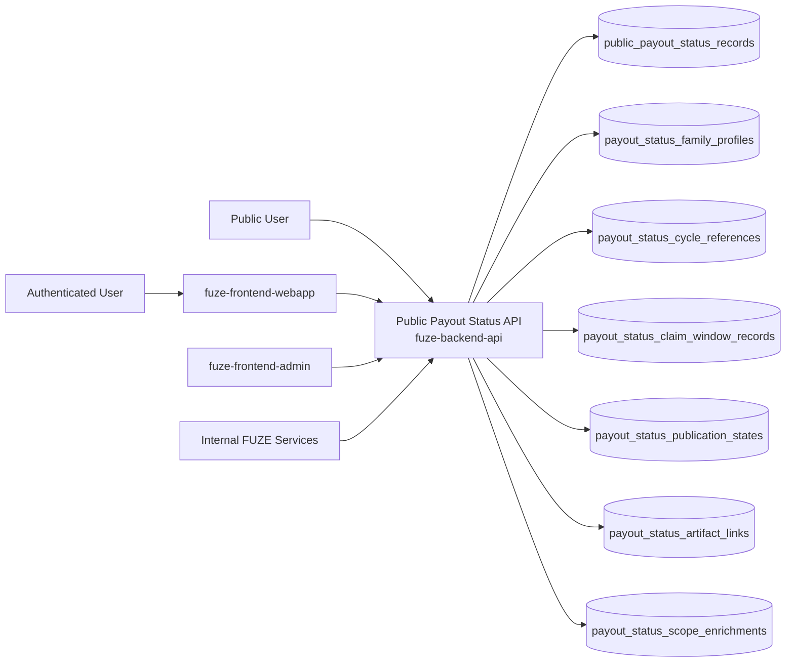
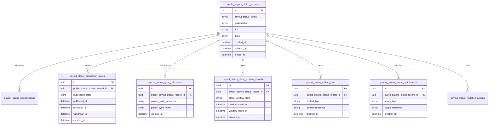
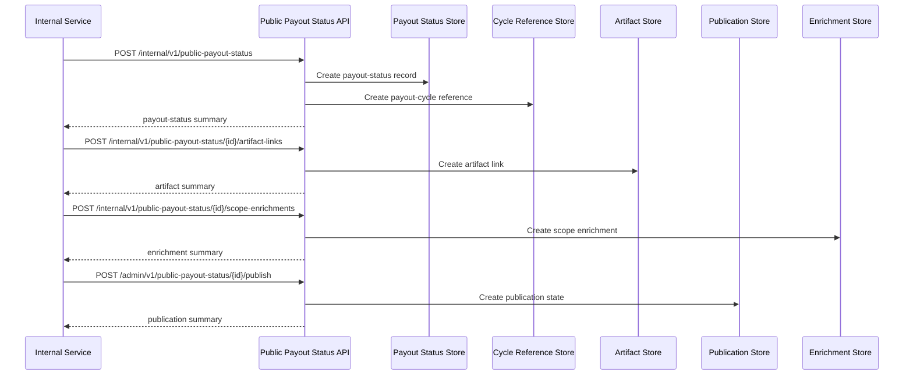

# PUBLIC_PAYOUT_STATUS_API_SPEC

## 1. Title

**PUBLIC_PAYOUT_STATUS_API_SPEC.md**

---

## 2. Document Metadata

- **Document Name:** PUBLIC_PAYOUT_STATUS_API_SPEC.md
- **API Classification:** public-read, authenticated-read, internal, event-driven
- **Owning Domain:** Public Payout Status Domain
- **Primary Implementing Repo:** `fuze-backend-api`
- **Primary System of Record:** public payout status records, payout-status publication states, payout-cycle public projections, claim-window visibility records, artifact link records, correction-safe public payout lineage, and bounded actor-aware payout-status enrichments in `fuze-backend-api`
- **Status:** Draft for canonical source-of-truth approval
- **Purpose:** Define the production-grade API contract architecture for FUZE public payout status, including public cycle-status publication, claim-window visibility, payout-linked trust-surface discovery, bounded holder-safe enrichments, and correction-safe payout-status lineage across the platform
- **Canonical Folder:** `fuze.ac > docs > api-spec`

---

## 2.1 API Classification Header

- **API Classification:** public-read | authenticated-read | internal | event-driven
- **Owning Domain:** Public Payout Status Domain
- **Primary Implementing Repo:** `fuze-backend-api`
- **Primary System of Record:** public payout-status publication domain

---

## 3. Purpose

This document defines the canonical API specification for FUZE public payout status operations. It translates the governing FUZE platform architecture, public API rules, payout-ledger rules, profit participation rules, snapshot and eligibility rules, Base payout execution rules, transparency rules, and API architecture rules into an implementation-ready API contract.

This API exists because FUZE requires a public trust surface for payout-cycle visibility that is narrower than internal payout truth and more structured than informal announcements. Public payout status must therefore remain a deliberate public-read layer that explains cycle state, funding posture, claim-window posture, correction lineage, and public-safe status history without leaking unsafe internal detail or silently redefining canonical payout truth.

Public payout status must preserve explicit distinction between:
- canonical payout-cycle business truth,
- public payout-status publication,
- public payout ledger and transparency artifacts,
- and bounded holder-safe enrichments.

Accordingly, this specification defines how public payout-status records, payout-status families, publication states, cycle references, claim-window visibility, artifact links, and correction lineage are represented, and how public payout-status behavior remains auditable, idempotent, and architecture-consistent across FUZE.

---

## 4. Scope

This specification covers:

- public-read APIs for public payout-cycle status, claim-window visibility, payout-status timelines, and payout-linked trust-surface discovery
- authenticated read APIs for bounded actor-aware payout-status enrichments where policy allows
- internal APIs for public payout-status record creation, artifact linkage, publication, correction, supersession, and withdrawal
- publication-state handling for public payout status records, payout-status timelines, and derived public payout summaries
- event emission requirements for payout-status lifecycle changes
- request, response, error, idempotency, versioning, audit, and database-shape rules for this domain

This specification does **not** redefine:

- payout-ledger ownership in full detail
- profit participation business logic in full detail
- snapshot and eligibility computation in full detail
- Base payout execution internals in full detail
- holder-specific claim entitlement logic in full detail
- transparency-report authoring workflow in full detail
- public registry ownership in full detail
- low-level website rendering implementation

Those remain governed by their own source-of-truth specifications.

---

## 5. Source-of-Truth Inputs

### Primary FUZE docs and specs used

#### Highest-priority platform and ownership sources
- `SYSTEM_SPEC_INDEX.md`
- `DOCS_SPEC.md`
- `SYSTEM_BOUNDARY_AND_OWNERSHIP_SPEC.md`
- `SYSTEM_OVERVIEW_AND_BOUNDARIES_SPEC.md`
- `PLATFORM_ARCHITECTURE_SPEC.md`
- `DOMAIN_OWNERSHIP_MATRIX_SPEC.md`
- `DATA_MODEL_AND_ENTITY_OWNERSHIP_SPEC.md`
- `ONCHAIN_OFFCHAIN_RESPONSIBILITY_SPEC.md`

#### Primary payout / public-read / trust-surface sources
- `PUBLIC_API_SPEC.md`
- `PAYOUT_LEDGER_SPEC.md`
- `PROFIT_PARTICIPATION_SYSTEM_SPEC.md`
- `SNAPSHOT_AND_ELIGIBILITY_PIPELINE_SPEC.md`
- `BASE_PAYOUT_EXECUTION_LAYER_SPEC.md`
- `TRANSPARENCY_MODEL_SPEC.md`
- `TRANSPARENCY_REPORTING_SPEC.md`
- `PUBLIC_CONTRACT_AND_WALLET_REGISTRY_SPEC.md`
- `API_ARCHITECTURE_SPEC.md`

#### Supporting runtime and control sources
- `EVENT_MODEL_AND_WEBHOOK_SPEC.md`
- `IDEMPOTENCY_AND_VERSIONING_SPEC.md`
- `MIGRATION_AND_BACKWARD_COMPATIBILITY_SPEC.md`
- `SECURITY_AND_RISK_CONTROL_SPEC.md`
- `MONITORING_ALERTING_AND_INCIDENT_RESPONSE_SPEC.md`
- `BUSINESS_CONTINUITY_AND_RECOVERY_SPEC.md`
- `SECRETS_CONFIG_AND_ENVIRONMENT_SPEC.md`
- `AUDIT_LOG_AND_ACTIVITY_SPEC.md`

### Highest-priority interpretation applied

For this file, the most important governing interpretation is:

1. public payout status is a deliberate public trust surface and not a convenience export of internal payout records
2. backend owns canonical public payout-status publication truth
3. public payout status must remain explicitly separate from payout-cycle business truth, payout execution truth, and holder-specific entitlement truth
4. cycle state, funding posture, claim-window posture, correction lineage, and public-safe status history are suitable public surfaces when intentionally designed
5. unsafe internal payout preparation detail, private eligibility detail, and control-plane mutation capabilities must remain non-public
6. payout publication corrections and supersession must preserve historical intelligibility rather than silently rewriting public meaning

### Supporting external standards used only as guidance

- HTTP semantics for public-read and bounded authenticated-read APIs
- structured problem-details error design
- general status-surface, timeline, and trust-surface publication patterns as supporting guidance

External guidance does not override FUZE source-of-truth documents.

---

## 6. Governing Architecture and Ownership Interpretation

This API belongs to the **Public Payout Status Domain** because it owns the canonical lifecycle of:

- public payout-status records,
- payout-status family classification,
- payout-cycle public references,
- claim-window visibility publication,
- public funding and claim-progress summaries,
- public-safe artifact linkage,
- and correction-safe payout-status history.

This API is implemented primarily in `fuze-backend-api` because:

- backend owns durable payout-status publication truth
- payout status must be built from canonical payout-owned domains without becoming a shadow owner
- multiple trust-sensitive public surfaces require one stable payout-status layer
- public trust requires structured, versionable payout visibility beyond ad hoc announcements
- audit generation and correction lineage must be centralized

This API is **not** owned by:

- `fuze-frontend-webapp`, because frontend may render payout status but must not own canonical payout-status publication truth
- `fuze-frontend-admin`, because admin may publish or supersede payout-status artifacts but must not own payout-status truth
- payout-ledger domain, because payout ledger owns canonical payout-cycle trust records while this domain owns a bounded public status surface derived from them
- Base payout execution domain, because execution truth is one linked source but not the full public payout-status layer
- snapshot and eligibility domain, because eligibility truth feeds payout status but is not owned here
- transparency domain, because transparency artifacts may link to payout status but do not own payout-status publication truth

### Architectural implications

- every public payout-status record must declare what payout-status surface it is
- every public payout-status record must preserve whether it is a primary public status record, a supporting artifact, or a derived public summary
- public payout status may link to payout cycles, claim windows, transparency reports, registry entries, and public artifacts without owning their deeper truth
- payout-status corrections, supersession, and withdrawal must preserve historical lineage rather than silently rewriting public meaning
- authenticated enrichments must remain bounded and must not turn payout-status surfaces into hidden control interfaces

---

## 7. Domain Responsibilities

The Public Payout Status API domain is responsible for:

1. maintaining canonical public payout-status records and payout-status family profiles
2. classifying payout-status records as primary status records, supporting artifacts, or derived public summaries
3. publishing stable public-read payout-cycle status surfaces for funding posture, claim-window posture, correction lineage, and timeline discovery
4. preserving explicit publication, withdrawal, and supersession state
5. linking payout-status records to payout-ledger artifacts, transparency reports, public registries, and other public trust artifacts
6. exposing bounded authenticated-read payout-status enrichments where actor context is relevant
7. emitting public payout-status lifecycle events
8. generating audit lineage for sensitive publication and correction actions
9. preserving separation between public payout-status artifacts and private canonical payout truth
10. supporting public-safe degraded modes and trust-preserving payout-status behavior

The domain is not responsible for:

- owning payout-ledger truth
- owning entitlement computation truth
- owning payout execution truth
- exposing arbitrary internal payout preparation state publicly
- replacing domain-specific public APIs where richer payout contracts are needed
- performing canonical eligibility reconciliation as its source-of-truth function

---

## 8. Out of Scope

The following are out of scope for this API specification:

- arbitrary public write APIs
- claim submission or claim mutation APIs
- payout entitlement authoring
- private-holder entitlement APIs in full detail
- governance-, treasury-, or control-plane payout mutation flows
- end-user claim portal UX
- low-level static site generation
- internal audit investigation workflows

---

## 9. Canonical Entities and Data Ownership

### Durable entities

#### 9.1 public_payout_status_records
- **Owner:** Public Payout Status Domain
- **Purpose:** canonical public payout-status records
- **Nature:** source-of-truth durable entity

#### 9.2 payout_status_family_profiles
- **Owner:** Public Payout Status Domain
- **Purpose:** profiles for payout-status families such as cycle status, claim-window status, correction notices, payout timelines, and supporting artifacts
- **Nature:** source-of-truth durable entity

#### 9.3 payout_status_classifications
- **Owner:** Public Payout Status Domain
- **Purpose:** classification of payout-status records as primary status records, supporting artifacts, or derived summaries
- **Nature:** source-of-truth durable entity

#### 9.4 payout_status_publication_states
- **Owner:** Public Payout Status Domain
- **Purpose:** publication, visibility, withdrawal, and lifecycle state of payout-status records
- **Nature:** source-of-truth durable entity

#### 9.5 payout_status_cycle_references
- **Owner:** Public Payout Status Domain
- **Purpose:** explicit linkage from public payout-status records to payout-cycle identifiers and public cycle lineage
- **Nature:** source-of-truth durable lineage entity

#### 9.6 payout_status_claim_window_records
- **Owner:** Public Payout Status Domain
- **Purpose:** claim-window visibility posture and public claim-window timeline records
- **Nature:** source-of-truth durable entity

#### 9.7 payout_status_artifact_links
- **Owner:** Public Payout Status Domain
- **Purpose:** links to public reports, payout-ledger records, registry entries, and supporting public artifacts
- **Nature:** source-of-truth durable lineage entity

#### 9.8 payout_status_scope_enrichments
- **Owner:** Public Payout Status Domain
- **Purpose:** bounded authenticated-read enrichment rules by actor or scope
- **Nature:** durable lineage entity

#### 9.9 payout_status_supersession_links
- **Owner:** Public Payout Status Domain
- **Purpose:** supersession and correction lineage between payout-status records
- **Nature:** durable lineage entity

#### 9.10 payout_status_discrepancy_cases
- **Owner:** Public Payout Status Domain
- **Purpose:** review and remediation records for stale, incorrect, incomplete, or inconsistent public payout status
- **Nature:** durable review/remediation entity

#### 9.11 payout_status_mutation_actions
- **Owner:** Public Payout Status Domain
- **Purpose:** high-level action records for create, publish, withdraw, correct, supersede, and resolve discrepancy
- **Nature:** durable action records with audit linkage

#### 9.12 payout_status_audit_events
- **Owner:** Audit / Activity domain, sourced by Public Payout Status Domain
- **Purpose:** immutable trail for sensitive payout-status actions
- **Nature:** durable audit records

### Derived or cached entities

#### 9.13 payout_status_index_views
- **Owner:** derived read-model layer
- **Purpose:** list/index projections for payout-status discovery surfaces
- **Nature:** derived

#### 9.14 payout_status_status_views
- **Owner:** derived read-model layer
- **Purpose:** public-safe payout status summaries and bounded authenticated enrichments
- **Nature:** derived

#### 9.15 payout_status_discrepancy_views
- **Owner:** derived ops read-model layer
- **Purpose:** visibility into stale or inconsistent payout-status conditions
- **Nature:** derived

---

## 10. State Model and Lifecycle

### 10.1 payout-status record lifecycle

Possible states:

- `draft`
- `published`
- `restricted`
- `deprecated`
- `superseded`
- `archived`

### 10.2 publication-state lifecycle

Possible states:

- `unpublished`
- `published_public`
- `published_authenticated`
- `restricted`
- `withdrawn`

### 10.3 claim-window visibility lifecycle

Possible states:

- `not_open`
- `scheduled`
- `open`
- `closing`
- `closed`
- `superseded`

### 10.4 discrepancy lifecycle

Possible states:

- `opened`
- `under_review`
- `resolved`
- `failed`
- `closed`

Lifecycle notes:
- published does not imply ownership of linked payout domains
- public-safe and authenticated-only visibility must remain explicit
- claim-window status is a bounded public visibility object and not the same thing as internal claim-processing truth
- supersession must preserve historical public intelligibility
- withdrawn or restricted states must not silently erase audit lineage

---

## 11. API Surface Overview

The API surface is divided into three families:

### 11.1 Public-read APIs
Used by public users, holders, community observers, and integrators for:
- payout-status index retrieval
- payout-status detail retrieval
- payout-cycle public status discovery
- claim-window public visibility discovery
- payout-linked trust-surface discovery

### 11.2 Authenticated read APIs
Used by authenticated users and approved clients for:
- bounded payout-status enrichment
- actor- or scope-sensitive payout-status visibility where policy allows
- authenticated access to payout references not broadly public but safe within actor scope

### 11.3 Internal service and admin APIs
Used by trusted internal services and privileged operators for:
- creating and updating payout-status records
- publishing, correcting, superseding, restricting, or withdrawing records
- linking artifacts and maintaining correction lineage
- resolving payout-status discrepancies

---

## 12. Authentication and Authorization Model

### 12.1 Authentication posture by route family

#### Public-read routes
No authentication required:
- list payout-status records
- retrieve payout-status detail
- read public cycle-status and claim-window discovery where published

#### Authenticated read routes
Require valid authenticated session:
- read bounded authenticated-only payout status
- read actor- or workspace-scoped payout-status enrichments where allowed

#### Internal service routes
Require internal service identity with explicit least privilege:
- create and update payout-status records
- attach artifact links
- refresh publication states
- read canonical truth

#### Admin routes
Require privileged operator identity plus reason-coded actions:
- publish, withdraw, restrict, supersede, and resolve discrepancy cases

### 12.2 Authorization checkpoints

Authorization must evaluate:
- caller identity and route family
- whether payout-status record is public, authenticated-only, or internal-only
- whether actor has scope visibility for authenticated enrichments
- whether service has create/publish/link/read privilege
- whether operator role is present for publication or correction actions
- whether current payout-status state allows requested mutation

### 12.3 Sensitive action rules

The following require heightened checks:
- publication of new public payout-status records
- publication of funding-, claim-window-, or correction-sensitive payout-status records
- withdrawal or restriction of already public payout-status artifacts
- supersession of trust-sensitive published payout status
- discrepancy-resolution actions

---

## 13. API Endpoints / Interface Contracts

## 13.1 Public-Read APIs

### 13.1.1 `GET /v1/public-payout-status`
**Purpose:** list published public payout-status records  
**Caller Type:** public  
**Auth Expectation:** none  
**Query Parameters Summary:**
- optional `payout_status_family`
- optional `classification`
- optional `claim_window_state`
- optional `status`
- pagination
**Response Summary:**
- payout-status record summaries
- family and classification labels
- publication state
- payout-cycle summary
- claim-window summary
- timestamps
**Side Effects:** none
**Audit Requirements:** access logging optional
**Emitted Events:** none required

### 13.1.2 `GET /v1/public-payout-status/{public_payout_status_id}`
**Purpose:** retrieve one public payout-status record  
**Caller Type:** public  
**Response Summary:**
- payout-status detail
- classification and visibility information
- payout-cycle reference
- claim-window summary
- artifact links
- supersession guidance where relevant
- public-safe status references
**Side Effects:** none

### 13.1.3 `GET /v1/public-payout-status/cycles/{payout_cycle_public_ref}`
**Purpose:** retrieve public payout-cycle status detail by public cycle reference  
**Caller Type:** public  
**Response Summary:**
- public cycle-status summary
- funding posture summary
- claim-window posture
- correction lineage summary
- linked trust-surface references
**Side Effects:** none

## 13.2 Authenticated Read APIs

### 13.2.1 `GET /v1/public-payout-status/me`
**Purpose:** retrieve bounded actor-aware payout-status enrichments where policy allows  
**Caller Type:** authenticated user  
**Auth Expectation:** valid authenticated session  
**Query Parameters Summary:**
- optional `payout_status_family`
- pagination
**Response Summary:**
- payout-status summary list
- actor-safe enrichment data
- scoped references where allowed
**Side Effects:** none

### 13.2.2 `GET /v1/public-payout-status/me/{public_payout_status_id}`
**Purpose:** retrieve one bounded actor-aware payout-status detail  
**Caller Type:** authenticated user  
**Response Summary:**
- base public payout-status detail
- bounded authenticated enrichment
- scoped artifact references where allowed
**Side Effects:** none

## 13.3 Internal Service APIs

### 13.3.1 `POST /internal/v1/public-payout-status`
**Purpose:** create draft public payout-status record  
**Caller Type:** internal trusted service  
**Auth Expectation:** service-to-service identity only  
**Request Body Summary:**
- `payout_status_family`
- `classification`
- `title`
- optional `summary`
- `payout_cycle_reference`
- optional `claim_window_state`
- `idempotency_key`
**Response Summary:** payout-status record summary
**Side Effects:** creates draft payout-status record
**Idempotency Behavior:** required
**Audit Requirements:** payout-status creation audit
**Emitted Events:** `public_payout_status.record_created`

### 13.3.2 `POST /internal/v1/public-payout-status/{public_payout_status_id}/artifact-links`
**Purpose:** attach artifact links to one payout-status record  
**Caller Type:** internal trusted service  
**Request Body Summary:**
- `artifact_type`
- `artifact_reference`
- optional `artifact_summary`
- `idempotency_key`
**Response Summary:** artifact-link summary
**Side Effects:** creates artifact-link lineage
**Idempotency Behavior:** required
**Audit Requirements:** artifact-link audit
**Emitted Events:** `public_payout_status.artifact_linked`

### 13.3.3 `POST /internal/v1/public-payout-status/{public_payout_status_id}/scope-enrichments`
**Purpose:** attach bounded authenticated enrichment rules to one payout-status record  
**Caller Type:** internal trusted service  
**Request Body Summary:**
- `scope_type`
- `scope_reference`
- `enrichment_profile`
- `idempotency_key`
**Response Summary:** scope-enrichment summary
**Side Effects:** creates enrichment lineage
**Idempotency Behavior:** required
**Audit Requirements:** enrichment audit
**Emitted Events:** `public_payout_status.scope_enrichment_linked`

### 13.3.4 `GET /internal/v1/public-payout-status/{public_payout_status_id}`
**Purpose:** retrieve canonical public payout-status truth  
**Caller Type:** internal trusted service  
**Response Summary:** full payout-status record, classification, payout-cycle reference, claim-window records, publication state, artifact links, enrichments, supersession lineage, and discrepancy lineage
**Side Effects:** none

## 13.4 Admin / Control-Plane APIs

### 13.4.1 `POST /admin/v1/public-payout-status/{public_payout_status_id}/publish`
**Purpose:** publish public payout-status record under controlled policy  
**Caller Type:** admin/operator  
**Request Body Summary:**
- `visibility_target`
- `reason_code`
- `operator_note`
- `idempotency_key`
**Response Summary:** published payout-status summary
**Side Effects:** publication state changes to published_public or published_authenticated
**Audit Requirements:** critical audit
**Emitted Events:** `public_payout_status.record_published`

### 13.4.2 `POST /admin/v1/public-payout-status/{public_payout_status_id}/withdraw`
**Purpose:** withdraw or restrict public payout-status visibility under controlled policy  
**Caller Type:** admin/operator  
**Request Body Summary:**
- `withdrawal_mode`
- `reason_code`
- `operator_note`
- `idempotency_key`
**Response Summary:** withdrawn payout-status summary
**Side Effects:** publication state changes to restricted or withdrawn
**Audit Requirements:** critical audit
**Emitted Events:** `public_payout_status.record_withdrawn`

### 13.4.3 `POST /admin/v1/public-payout-status/{public_payout_status_id}/supersede`
**Purpose:** supersede one public payout-status record with another under controlled policy  
**Caller Type:** admin/operator  
**Request Body Summary:**
- `replacement_public_payout_status_id`
- `reason_code`
- `operator_note`
- `idempotency_key`
**Response Summary:** supersession summary
**Side Effects:** creates supersession linkage and updates visible preference
**Audit Requirements:** critical audit
**Emitted Events:** `public_payout_status.record_superseded`

### 13.4.4 `POST /admin/v1/public-payout-status/discrepancies`
**Purpose:** resolve public payout-status discrepancy under controlled policy  
**Caller Type:** admin/operator  
**Request Body Summary:**
- `target_reference_type`
- `target_reference_id`
- `resolution_code`
- `operator_note`
- `related_case_id`
- `idempotency_key`
**Response Summary:** discrepancy-resolution summary
**Side Effects:** may correct, supersede, restrict, withdraw, or close discrepancy posture with preserved lineage
**Audit Requirements:** critical audit
**Emitted Events:** `public_payout_status.discrepancy_resolved`

---

## 14. Request Rules

### 14.1 General request rules
- all mutation-capable routes must require JSON requests with explicit content type
- all mutation routes must carry correlation IDs
- sensitive public payout-status mutations must carry idempotency keys
- admin mutations must require reason codes and operator notes
- no route may accept frontend-authored public payout-status truth as authoritative input

### 14.2 Sensitive-action request requirements
The following requests require heightened validation:
- publication of new public payout-status records
- publication of funding-, claim-window-, or correction-sensitive payout-status records
- withdrawal or restriction of already public payout-status records
- supersession of trust-sensitive published payout-status artifacts
- discrepancy-resolution actions

Heightened validation may include:
- family/classification consistency checks
- payout-cycle and claim-window validation
- public-safe versus authenticated-only visibility checks
- operator role confirmation
- payout or reporting case linkage for sensitive actions

### 14.3 Scope integrity rule
Public payout-status mutations must target valid and authorized records, artifact links, enrichment records, claim-window records, and discrepancy records. Services and operators must not mutate unrelated or unauthorized payout-status state.

### 14.4 Layer-separation rule
Public payout-status domain must remain the public payout visibility layer. It must not collapse:
- payout-ledger ownership,
- entitlement ownership,
- payout execution ownership,
- transparency ownership,
- or internal orchestration state
into one ambiguous payout-status object.

---

## 15. Response Rules

### 15.1 Success response rules
Successful responses must include:
- stable resource identifiers
- timestamps for created/updated state
- state/status values
- family and classification summaries
- payout-cycle and claim-window summaries where relevant
- artifact-link and publication-state summaries where relevant
- correlation references for mutations

### 15.2 Async-accepted response rules
If publication propagation, withdrawal, or discrepancy remediation is async, the response must:
- return accepted status
- include action or job ID
- provide follow-up status semantics

### 15.3 Terminal mutation response rules
Terminal mutation responses must clearly show:
- target payout-status record or discrepancy
- mutation type
- resulting publication state
- withdrawal, supersession, or restriction effects where relevant
- whether public-safe views may refresh asynchronously

### 15.4 Read response rules
Read responses must distinguish:
- canonical internal payout-status truth
- primary public payout-status records
- supporting artifacts
- derived public summaries
- actor-scoped enrichment versus ordinary public payout status

---

## 16. Error Model

The API uses structured problem-details style error responses.

### 16.1 Required error fields
- `type`
- `title`
- `status`
- `code`
- `detail`
- `instance`
- `correlation_id`

### 16.2 Common error codes

#### Authorization / permission errors
- `PUBLIC_PAYOUT_STATUS_PERMISSION_DENIED`
- `PUBLIC_PAYOUT_STATUS_OPERATOR_PERMISSION_DENIED`
- `PUBLIC_PAYOUT_STATUS_SERVICE_PERMISSION_DENIED`
- `PUBLIC_PAYOUT_STATUS_AUDIENCE_PERMISSION_DENIED`

#### State conflict errors
- `PUBLIC_PAYOUT_STATUS_RECORD_STATE_INVALID`
- `PUBLIC_PAYOUT_STATUS_PUBLICATION_STATE_INVALID`
- `PUBLIC_PAYOUT_STATUS_SUPERSESSION_CONFLICT`
- `PUBLIC_PAYOUT_STATUS_VISIBILITY_CONFLICT`

#### Policy / safety errors
- `PUBLIC_PAYOUT_STATUS_CLASSIFICATION_REQUIRED`
- `PUBLIC_PAYOUT_STATUS_PAYOUT_REFERENCE_REQUIRED`
- `PUBLIC_PAYOUT_STATUS_VISIBILITY_NOT_ALLOWED`
- `PUBLIC_PAYOUT_STATUS_PUBLICATION_NOT_ALLOWED`
- `PUBLIC_PAYOUT_STATUS_WITHDRAWAL_NOT_ALLOWED`

#### Request integrity errors
- `PUBLIC_PAYOUT_STATUS_IDEMPOTENCY_KEY_REQUIRED`
- `PUBLIC_PAYOUT_STATUS_REQUEST_INVALID`
- `PUBLIC_PAYOUT_STATUS_REQUEST_UNPROCESSABLE`

#### Dependency or provider errors
- `PUBLIC_PAYOUT_STATUS_STORAGE_UNAVAILABLE`
- `PUBLIC_PAYOUT_STATUS_LEDGER_UNAVAILABLE`
- `PUBLIC_PAYOUT_STATUS_REPORTING_UNAVAILABLE`

### 16.3 Error handling rules
- do not expose hidden internal governance, treasury, security, or audit detail in public or low-privilege responses
- do not imply canonical entitlement or execution truth from payout-status publication alone
- distinguish classification/visibility failure from generic invalid state
- distinguish missing payout reference from generic invalid request
- include retry guidance only where safe

---

## 17. Idempotency and Mutation Safety

### 17.1 Required idempotent mutations
The following mutation routes require idempotent behavior:
- payout-status record creation
- artifact-link attachment
- scope-enrichment attachment
- publish
- withdraw
- supersede
- discrepancy resolution

### 17.2 Idempotency key rules
- mutation requests must supply `Idempotency-Key`
- backend stores key scope, request hash, actor, and terminal result
- replay of same semantic request returns original terminal outcome
- replay of same key with different semantic request must fail with conflict

### 17.3 Mutation safety rules
- one canonical visible payout-status record per current payout-status lineage unless explicit supersession exists
- artifact and enrichment links must remain referentially consistent with payout-status family and classification
- public publication and authenticated publication must remain explicitly distinct
- corrections and supersession must preserve prior payout-status lineage
- withdrawal and restriction must preserve auditability and public explanation where appropriate

---

## 18. Versioning and Compatibility Rules

### 18.1 Versioning
This API family is versioned under `/v1`, `/internal/v1`, and `/admin/v1` route families.

### 18.2 Compatibility approach
- additive evolution preferred
- no silent semantic change to payout-status family, classification, claim-window state, or visibility meaning
- new payout-status families, artifact-link types, and claim-window fields may be added without breaking existing contracts
- response fields may be added but existing meanings must remain stable

### 18.3 Breaking-change rules
Breaking changes include:
- changing the meaning of primary public payout-status record versus supporting artifact versus derived summary
- changing visibility semantics incompatibly
- removing critical payout-reference, claim-window, or artifact-link fields
- changing supersession or withdrawal semantics incompatibly

Such changes require explicit migration planning and version evolution.

### 18.4 Deprecation
Deprecated routes or fields must:
- be documented explicitly
- carry deprecation metadata where supported
- preserve compatibility windows long enough for public, first-party, and internal consumers

---

## 19. Event Emission and Webhook Behavior

This domain is event-capable.

### 19.1 Internal events
The Public Payout Status domain must emit canonical internal events such as:
- `public_payout_status.record_created`
- `public_payout_status.artifact_linked`
- `public_payout_status.scope_enrichment_linked`
- `public_payout_status.record_published`
- `public_payout_status.record_withdrawn`
- `public_payout_status.record_superseded`
- `public_payout_status.discrepancy_resolved`

### 19.2 Event payload minimums
Each event should contain:
- event ID
- event type
- occurred_at
- public payout-status ID
- payout-status family
- classification
- publication state
- actor type
- correlation ID
- reason code where applicable

### 19.3 External webhook posture
This specification does not expose general third-party outbound public payout-status webhooks by default. Any future outbound payout-status publication webhook surface must be narrow, security-reviewed, and governed by a separate contract.

---

## 20. Audit and Activity Requirements

The following actions must generate durable audit events:

- payout-status record creation
- artifact-link attachment
- publish, withdraw, supersede, and discrepancy actions
- scope-enrichment linkage where sensitivity requires
- other sensitive public payout-status mutations

### Required audit fields
- audit event ID
- actor type and actor reference
- target payout-status record / artifact link / discrepancy reference as applicable
- action type
- before/after summary where applicable
- reason code
- correlation ID
- operator note if operator action
- occurred_at

---

## 21. Data Model and Database Schema View

### 21.1 `public_payout_status_records`
- `id` PK
- `payout_status_family`
- `classification`
- `title`
- `summary`
- `state`
- `created_at`
- `updated_at`
- `closed_at` nullable

**Constraints:**
- index on (`payout_status_family`, `classification`)
- index on `state`

### 21.2 `payout_status_family_profiles`
- `id` PK
- `payout_status_family`
- `allowed_classifications_json`
- `claim_window_profile_json`
- `visibility_profile_json`
- `created_at`
- `updated_at`

**Constraints:**
- unique `payout_status_family`

### 21.3 `payout_status_classifications`
- `id` PK
- `public_payout_status_record_id` FK -> `public_payout_status_records.id`
- `classification`
- `canonical_owner_reference`
- `created_at`

**Constraints:**
- index on `public_payout_status_record_id`

### 21.4 `payout_status_publication_states`
- `id` PK
- `public_payout_status_record_id` FK -> `public_payout_status_records.id`
- `publication_state`
- `published_at` nullable
- `restricted_at` nullable
- `withdrawn_at` nullable
- `created_at`

**Constraints:**
- index on `public_payout_status_record_id`
- index on `publication_state`

### 21.5 `payout_status_cycle_references`
- `id` PK
- `public_payout_status_record_id` FK -> `public_payout_status_records.id`
- `payout_cycle_reference`
- `public_cycle_label`
- `created_at`

**Constraints:**
- index on `public_payout_status_record_id`

### 21.6 `payout_status_claim_window_records`
- `id` PK
- `public_payout_status_record_id` FK -> `public_payout_status_records.id`
- `claim_window_state`
- `window_open_at` nullable
- `window_close_at` nullable
- `created_at`

**Constraints:**
- index on `public_payout_status_record_id`
- index on `claim_window_state`

### 21.7 `payout_status_artifact_links`
- `id` PK
- `public_payout_status_record_id` FK -> `public_payout_status_records.id`
- `artifact_type`
- `artifact_reference`
- `artifact_summary_json`
- `created_at`

**Constraints:**
- index on `public_payout_status_record_id`

### 21.8 `payout_status_scope_enrichments`
- `id` PK
- `public_payout_status_record_id` FK -> `public_payout_status_records.id`
- `scope_type`
- `scope_reference`
- `enrichment_profile_json`
- `created_at`

**Constraints:**
- index on `public_payout_status_record_id`

### 21.9 `payout_status_supersession_links`
- `id` PK
- `from_public_payout_status_id` FK -> `public_payout_status_records.id`
- `to_public_payout_status_id` FK -> `public_payout_status_records.id`
- `reason_code`
- `created_at`

**Constraints:**
- unique (`from_public_payout_status_id`, `to_public_payout_status_id`)

### 21.10 `payout_status_discrepancy_cases`
- `id` PK
- `target_reference_type`
- `target_reference_id`
- `state`
- `resolution_code` nullable
- `created_at`
- `updated_at`
- `closed_at` nullable

### 21.11 `payout_status_mutation_actions`
- `id` PK
- `target_reference_type`
- `target_reference_id`
- `action_type`
- `state`
- `reason_code`
- `operator_note` nullable
- `requested_by_actor_type`
- `requested_by_actor_id`
- `created_at`
- `executed_at` nullable
- `closed_at` nullable
- `correlation_id`

### 21.12 `idempotency_records`
- `id` PK
- `idempotency_key`
- `scope_family`
- `actor_reference`
- `request_hash`
- `response_hash`
- `terminal_status`
- `created_at`
- `expires_at`

### 21.13 `audit_log_entries`
Domain-sourced audit records written into the audit domain.

### Normalization notes
- canonical public payout-status truth stays in payout-status records, family profiles, classifications, publication states, cycle references, claim-window records, artifact links, enrichments, supersession links, and discrepancy records
- payout-ledger, profit participation, snapshot/eligibility, and execution canonical truths remain external and are referenced rather than duplicated
- public-safe views must derive from canonical public payout-status truth filtered by publication state and visibility class
- actor-scoped enrichments remain bounded overlays rather than new canonical payout owners

### Reconciliation notes
- one visible public payout-status record should reconcile to one current payout-status lineage under current preference
- publication state must reconcile with allowed family/classification combinations
- cycle references and claim-window records must reconcile to linked payout-cycle truth
- discrepancy cases must preserve review lineage for stale or conflicting public payout-status conditions

---

## 22. Architecture Diagram — Mermaid flowchart



---

## 23. Data Design — Mermaid Diagram



---

## 24. Flow View

### 24.1 Happy path — publish primary public payout status
1. internal service creates draft payout-status record
2. payout-cycle reference, claim-window status, and artifact links are attached to payout-ledger, transparency, or registry artifacts
3. operator validates family/classification and publication intent
4. admin publishes record publicly
5. public index, cycle, and detail surfaces become available
6. external readers can discover the record as primary status record, supporting artifact, or derived summary

### 24.2 Happy path — authenticated enrichment
1. payout-status record is already published or authenticated-visible
2. bounded actor/scope enrichment is linked internally
3. authenticated actor requests the payout-status artifact
4. backend returns base public payout status plus scoped enrichment where policy allows
5. actor sees additional safe context without gaining hidden payout control access

### 24.3 Alternate path — superseding an older payout-status publication
1. older payout-status record must be replaced or corrected
2. replacement record is created and validated
3. admin supersedes the older record
4. previous record remains historically linked and interpretable
5. new record becomes current visible preference

### 24.4 Failure path — invalid classification or publication posture
1. payout-status record is created or modified
2. backend detects missing classification, invalid family/classification combination, or disallowed visibility posture
3. request is rejected or record remains unpublished
4. no unsafe public payout-status surface is produced

### 24.5 Failure and remediation path — stale or incorrect public payout status
1. linked payout-cycle, claim-window, or public artifact changes or payout status becomes stale/inconsistent
2. admin opens discrepancy-resolution flow
3. backend preserves existing lineage
4. corrected or superseding payout-status record is created
5. discrepancy closes with preserved history

### 24.6 Degraded-mode path
1. linked payout report, ledger surface, or status artifact is delayed or degraded
2. public payout-status surface stays available where safe
3. backend communicates freshness or visibility degradation explicitly
4. canonical truth mutation is not implied by degraded presentation

### 24.7 Retry behavior
- duplicate payout-status creation returns same canonical record result
- duplicate artifact or enrichment attachment returns same lineage result where applicable
- duplicate publish/withdraw/supersede/discrepancy actions return same terminal action result

---

## 25. Data Flows — Mermaid sequenceDiagram



---

## 26. Security and Risk Controls

1. **Public payout-status truth is backend-owned**  
   Frontends and informal publication channels may not authoritatively define public payout status.

2. **Payout status is not a control plane**  
   Public payout-status surfaces must support trust, legibility, and cycle visibility, not expose payout authoring, treasury controls, eligibility internals, or execution controls.

3. **Classification clarity is mandatory**  
   Public payout status must explicitly distinguish primary status records, supporting artifacts, and derived public summaries so external consumers do not mistake one for another.

4. **Public-safe visibility discipline**  
   Publication state must keep public, authenticated-only, and internal-only payout status clearly separated.

5. **Rate limits and abuse controls**  
   Public payout-status surfaces require public-surface protections such as rate limiting, actor/token throttling, input hardening, and stable pagination expectations.

6. **Backward-compatibility discipline**  
   Public payout-status surfaces must follow explicit versioning and conservative compatibility rules because public interfaces carry strong ecosystem trust obligations.

7. **Audit-linked publication**  
   Publication, withdrawal, and supersession of payout-status artifacts must remain traceable into internal audit systems.

8. **Secrets/config boundary discipline**  
   Public payout status may include only values intentionally classed as public and must not leak confidential or control-sensitive configuration.

9. **Trust-preserving degraded modes**  
   Public payout status should preserve the difference between freshness lag, execution delay, and canonical truth mutation.

10. **Historical intelligibility**  
   Corrections and supersession must preserve lineage so public trust surfaces remain historically interpretable.

---

## 27. Operational Considerations

- public payout-status index, cycle, and detail reads should be highly available
- publication-state changes and artifact-link correctness are trust-sensitive and must be monitored
- funding-sensitive, claim-window-sensitive, and correction-sensitive payout surfaces should surface clearly to ops views
- supersession and discrepancy workflows should be observable and reviewable
- monitoring should alert on:
  - stale public payout status during active claim windows
  - publication failures for trusted payout-status artifacts
  - public/private visibility divergence
  - broken payout artifact references
  - public-safe view inconsistency versus canonical payout-status state
  - degraded public trust surfaces during active payout cycles

---

## 28. Acceptance Criteria

1. The API preserves the distinction between public payout-status truth, payout-ledger truth, profit participation truth, execution truth, and internal domain truth.
2. Only `fuze-backend-api` owns canonical public payout-status publication truth.
3. Public payout-status records, family profiles, classifications, publication states, cycle references, claim-window records, artifact links, enrichments, supersession links, and discrepancy records are durable and backend-owned.
4. Public and authenticated routes expose only bounded safe public payout-status views.
5. Payout-status family, classification, cycle reference, claim-window posture, and visibility posture are explicit and validated.
6. Public payout status distinguishes primary status records, supporting artifacts, and derived summary models.
7. Publication, withdrawal, supersession, and discrepancy actions preserve immutable lineage.
8. Public payout-status mutation actions are idempotent and auditable.
9. Internal and admin public payout-status routes are least-privilege and backend-only.
10. Admin routes require reason-coded privileged authorization.
11. Event emissions exist for major public payout-status mutations.
12. Database schema separates records, family profiles, classifications, publication states, cycle references, claim-window records, artifact links, enrichments, supersession links, and discrepancy layers.
13. Public-safe consumers can rely on public payout-status views without needing internal platform knowledge.
14. Public payout status supports rate-limited, versioned, supportable external integration behavior.
15. Mermaid diagrams remain consistent with prose and data model.

---

## 29. Test Cases

### 29.1 Positive cases
1. Internal service creates draft public payout-status record successfully.
2. Internal service attaches artifact link successfully.
3. Internal service attaches scope enrichment successfully.
4. Admin publishes public payout status successfully.
5. Public user reads published payout-status index successfully.
6. Public user reads one published payout-status record successfully.
7. Public user reads cycle-status detail successfully.
8. Admin supersedes stale payout status successfully.

### 29.2 Negative cases
9. Public user cannot access unpublished or internal-only payout status.
10. Internal service without write privilege cannot create payout-status record.
11. Publication without valid classification returns `PUBLIC_PAYOUT_STATUS_CLASSIFICATION_REQUIRED`.
12. Publication without required payout reference returns `PUBLIC_PAYOUT_STATUS_PAYOUT_REFERENCE_REQUIRED`.
13. Disallowed visibility target returns `PUBLIC_PAYOUT_STATUS_VISIBILITY_NOT_ALLOWED`.
14. Withdrawal attempt in incompatible state returns `PUBLIC_PAYOUT_STATUS_WITHDRAWAL_NOT_ALLOWED`.

### 29.3 Authorization cases
15. Ordinary public or authenticated user cannot call admin payout-status publication APIs.
16. Internal service without artifact-link privilege cannot attach artifact links.
17. Operator without publication privilege cannot publish payout status.
18. Published public payout status does not imply canonical ownership of linked payout-ledger/execution/eligibility truth.

### 29.4 Idempotency and replay cases
19. Repeating payout-status creation with same idempotency key returns original payout-status result.
20. Repeating artifact-link attachment with same idempotency key returns original linkage result.
21. Repeating publish or withdraw with same idempotency key returns original terminal action result.
22. Repeating supersede or discrepancy resolution with same idempotency key returns original terminal action result.

### 29.5 Concurrency cases
23. Concurrent artifact-link updates preserve one explicit current linkage lineage and duplicate-safe outcomes where appropriate.
24. Concurrent publish and withdraw actions preserve explicit lifecycle ordering without hidden overwrite.
25. Concurrent supersede and discrepancy actions preserve explicit visible lineage without ambiguity.

### 29.6 Recovery / admin cases
26. Stale or mislinked public payout status can be corrected under controlled policy with explicit lineage.
27. Superseded public payout status remains historically linked to the original record.
28. Discrepancy resolution closes payout reference, visibility, or reporting conflict with preserved audit history.

### 29.7 Event and audit cases
29. Successful payout-status creation emits `public_payout_status.record_created`.
30. Successful artifact-link attachment emits `public_payout_status.artifact_linked`.
31. Successful publication emits `public_payout_status.record_published`.
32. Successful withdrawal emits `public_payout_status.record_withdrawn`.
33. Successful discrepancy resolution emits `public_payout_status.discrepancy_resolved` with critical audit lineage.

---

## 30. Open Questions or Explicit Deferred Decisions

1. Exact payout-status family taxonomy code sets are deferred.
2. Exact public-safe claim-window detail depth is deferred.
3. Exact actor-scoped enrichment taxonomy is deferred.
4. Exact public-safe disclosure depth for funding posture is deferred.
5. Exact discrepancy taxonomy for payout-status/publication conflicts is deferred.
6. Exact partner-oriented payout-status quota strategy is deferred.

---

## 31. Implementation Notes for `fuze-backend-api`

Recommended backend module layout:

```text
modules/platform/
  public-payout-status/
  payout-ledger/
  profit-participation/
  public-transparency/
  audit-log/
  control-plane/
  integrations/
```

Implementation guidance:
- keep payout-status records, family profiles, cycle references, claim-window records, publication state, artifact links, and supersession logic in one canonical domain service
- perform family/classification/visibility/payout-reference checks inside the commit boundary
- keep publish, withdraw, supersede, and discrepancy actions explicit and idempotent
- treat admin remediations as domain actions, not ad hoc row edits
- emit events only after canonical state commit succeeds
- publish public-safe payout-status views from canonical truth; do not let derived views mutate payout-status state

---

## 32. Frontend Consumption Notes

### For `fuze-frontend-webapp`
- may read public payout status and bounded authenticated enrichments where approved
- must not infer canonical domain ownership from public payout status alone
- must treat backend public payout-status responses as authoritative for publication state and trust-surface semantics
- should clearly distinguish primary status records, supporting artifacts, and derived summary views when visible

### For `fuze-frontend-admin`
- may trigger privileged publish, withdraw, supersede, and discrepancy actions only through backend admin APIs
- must require operator reason input for sensitive mutations
- must not directly mutate canonical public payout-status truth client-side
- should present immutable payout-status history and correction lineage separately from current visible state

---

## 33. Contract Derivation Notes

### OpenAPI / AsyncAPI
This spec should later derive into:
- public payout-status index/detail/cycle read operations
- authenticated payout-status enrichment read operations
- internal payout-status creation, artifact-link, and enrichment operations
- admin publish / withdraw / supersede / discrepancy operations
- shared problem-details schema
- public payout-status lifecycle events in AsyncAPI

### Future `fuze-sdk`
Future `fuze-sdk` packages may derive:
- public payout-status lookup helpers
- public cycle-status discovery helpers
- typed payout-status family, classification, claim-window, and publication-state summary models
- problem-error models for public payout-status outcomes

The SDK must derive from approved API contracts and must not become the source of truth over this narrative specification.
