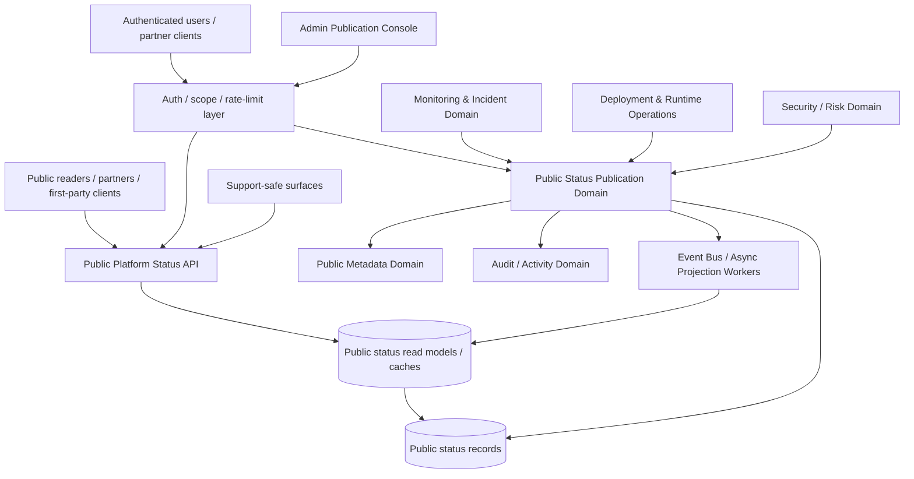
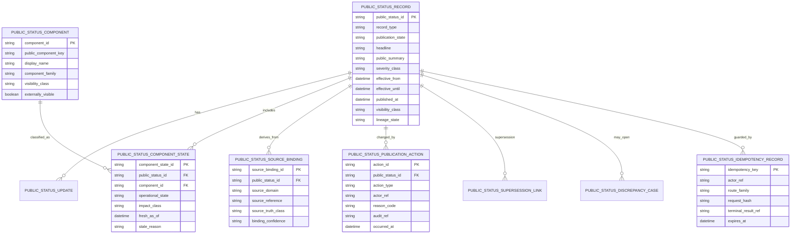
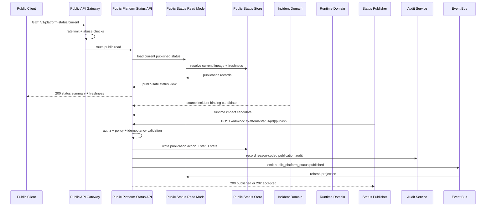

# PUBLIC_PLATFORM_STATUS_API_SPEC.md

## Document Metadata

- **Document Name:** `PUBLIC_PLATFORM_STATUS_API_SPEC.md`
- **Document Type:** FUZE API SPEC v2 / Public-read companion API specification
- **Status:** Draft for canonical source-of-truth approval
- **Version:** 2.0.0
- **Effective Date:** 2026-04-25
- **Last Updated:** 2026-04-25
- **Reviewed On:** 2026-04-25
- **Document Owner:** FUZE Public Platform Status Domain; named individual owner not yet specified
- **Approval Authority:** Not explicitly specified; governed by the FUZE refined specification approval workflow
- **Review Cadence:** Quarterly and whenever public API posture, incident communication, runtime operations, monitoring/alerting, public metadata, public transparency, or business-continuity semantics materially change
- **Governing Layer:** Public-read / public-trust companion API layer
- **Parent Registry:** API SPEC v2 Canonical File Registry
- **Upstream Semantic Registry:** `REFINED_SYSTEM_SPEC_INDEX.md`
- **Upstream API Registry:** `API_SPEC_INDEX.md`
- **Primary Audience:** Backend engineering, platform engineering, reliability/SRE, frontend web, public API authors, trust/status communication owners, security, support, audit/compliance, SDK/OpenAPI authors
- **Primary Purpose:** Define the canonical API contract for public-safe FUZE platform status publication, status component discovery, incident-summary publication, scheduled maintenance visibility, degraded-mode notices, correction/supersession lineage, and stable external status consumption without exposing raw internal runtime, incident, security, or operational-control truth.
- **Primary Upstream References:** `PUBLIC_API_SPEC.md`, `MONITORING_ALERTING_AND_INCIDENT_RESPONSE_SPEC.md`, `DEPLOYMENT_AND_RUNTIME_OPERATIONS_SPEC.md`, `BUSINESS_CONTINUITY_AND_RECOVERY_SPEC.md`, `PUBLIC_METADATA_API_SPEC.md`, `EVENT_MODEL_AND_WEBHOOK_SPEC.md`, `IDEMPOTENCY_AND_VERSIONING_SPEC.md`, `MIGRATION_AND_BACKWARD_COMPATIBILITY_SPEC.md`, `SECURITY_AND_RISK_CONTROL_SPEC.md`, `AUDIT_LOG_AND_ACTIVITY_SPEC.md`, `NOTIFICATION_AND_USER_COMMUNICATION_SPEC.md`, `TRANSPARENCY_MODEL_SPEC.md`, `TRANSPARENCY_REPORTING_SPEC.md`
- **Primary Downstream Dependents:** Public website status page, public app status banners, support/status macros, public API gateway status discovery, SDK health helpers, partner status polling, public metadata references, transparency/public-trust companion surfaces, incident-publication implementation contracts
- **API Surface Families Covered:** public-read, authenticated-read where approved, internal service, admin/control-plane, event/async, reporting/export, public metadata linkage
- **API Surface Families Excluded:** raw internal observability, admin runtime controls, incident-command mutation, security containment mutation, feature-flag mutation, deployment/release activation, audit-log search/export, vendor-specific infrastructure metrics, arbitrary third-party webhook broadcasting
- **Canonical System Owner(s):** Monitoring and Incident domain owns internal incident truth; Deployment and Runtime Operations owns runtime truth; Public Platform Status owns public publication truth for status artifacts; Public API Governance owns external exposure posture
- **Canonical API Owner:** Public Platform Status API domain in `fuze-backend-api`
- **Supersedes:** Ad hoc status page feeds, frontend-composed public platform posture, raw runtime-health endpoints exposed publicly, and any prior implementation that allowed public status to directly mirror internal incident or observability records
- **Superseded By:** None currently defined
- **Related Decision Records:** Not explicitly specified
- **Canonical Status Note:** This document is normative for the public platform status API contract. Public status records are publication-layer truth, derived from internal runtime and incident evidence but not equivalent to raw internal incident truth, monitoring truth, deployment truth, security truth, or support narrative truth.
- **Implementation Status:** Normative source; downstream OpenAPI, SDK, status-page rendering, support tooling, public metadata linkages, and event/publication contracts MUST align
- **Approval Status:** Draft refined canonical API specification pending explicit approval workflow
- **Change Summary:** Created a production-grade API SPEC v2 document for the public platform status surface, consolidating public API governance, monitoring/incident semantics, runtime/deployment posture, public metadata/public-trust discipline, idempotency, auditability, versioning, diagrams, acceptance criteria, and test cases.

## Purpose

This specification defines the canonical FUZE API contract for public platform status.

The Public Platform Status API exists to expose public-safe, stable, externally intelligible information about FUZE platform availability, degradation, maintenance, and incident-publication state. It allows public users, authenticated users, partners, support surfaces, and first-party frontends to understand whether the platform is operating normally, partially degraded, under scheduled maintenance, or affected by a publicly acknowledged incident.

The API MUST preserve the following controlling rule:

**Public platform status is a governed public-read publication layer. It is not internal incident truth, monitoring truth, runtime truth, deployment truth, security truth, audit truth, or support narrative truth.**

The API may publish public-safe status summaries and component states. It MUST NOT leak raw observability signals, internal incident timelines, security-sensitive diagnostics, unapproved outage speculation, private customer impact analysis, internal deployment topology, restricted control-plane posture, or unreleased product/runtime information.

## Scope

This specification governs:

- public platform status summary APIs
- public component-status list and detail APIs
- public incident-summary and maintenance-window APIs
- public-safe degraded-mode and partial-outage semantics
- authenticated caller-safe status enrichments where approved
- internal APIs for preparing status records from incident/runtime/publication sources
- admin/control-plane APIs for publishing, updating, correcting, superseding, or withdrawing public status records
- event emissions for public status lifecycle transitions
- request, response, error, idempotency, retry, rate-limit, audit, observability, versioning, and migration rules for this API family
- OpenAPI, AsyncAPI, SDK, and implementation-contract guardrails

## Out of Scope

This specification does not govern:

- raw internal incident management routes
- incident declaration, severity assignment, containment, or recovery validation as internal operational truth
- internal monitoring signals, traces, logs, detector outputs, alert rules, or raw SLO dashboards
- deployment, release, activation, rollback, feature flags, kill switches, or runtime controls
- security-sensitive containment or fraud/risk response
- per-customer private support cases or confidential enterprise incident disclosures
- legal/compliance notification obligations outside the approved FUZE public status contract
- exact UI rendering of the public status page
- vendor-specific observability, paging, status-page, CDN, or hosting implementation

## Design Goals

1. Provide a stable and conservative public status contract for external consumers.
2. Preserve strict separation between internal operational truth and public publication truth.
3. Support truthful degraded, maintenance, incident, stale, and unknown status without leaking unsafe detail.
4. Make public status updates auditable, attributable, correction-safe, and supersession-aware.
5. Give first-party and partner clients machine-readable status signals without turning status into a control plane.
6. Align status publication with monitoring/incident, runtime, notification, public API, public metadata, and transparency governance.
7. Support OpenAPI, SDK, public website, status widgets, and support tooling derivation.
8. Prevent public status from overstating health when internal status evidence is stale or conflict exists.

## Non-Goals

This API is not intended to:

- expose every internal component or dependency publicly
- make public platform status the source of truth for incident command
- let frontend, marketing, support, or public relations actors invent status independently
- publish raw infrastructure metrics or detailed forensic data
- give external clients control over platform operations
- substitute for internal dashboards used by operators
- guarantee zero delay between internal detection and public publication when disclosure requires validation
- hide material public impact once approved publication criteria are met

## Core Principles

### Public Status Is Publication Truth

Public status records are canonical for what FUZE has intentionally published externally. They are not canonical for internal diagnosis, incident command, runtime state, audit evidence, or business-domain correction.

### Conservative External Exposure

When ambiguity exists, the API MUST choose the safer public status posture: explicit degraded/unknown/stale state is preferred over unsupported `operational` claims.

### Derived-But-Governed

Public platform status is derived from monitoring, incident, runtime, deployment, dependency, and support inputs. Once published, the status artifact has its own publication lifecycle and lineage.

### No Raw Internal Leakage

The API MUST NOT expose raw logs, traces, internal service names beyond approved public components, provider secrets, deployment topology, private customers, incident war-room notes, security findings, or restricted operator actions.

### Status Does Not Control Operations

Status APIs are read/publication APIs. They MUST NOT mutate runtime, incident, deployment, feature flag, queue, security, or support state except through bounded publication lifecycle routes.

### Correction and Supersession Are First-Class

Public status errors, outdated statements, or changed impact assessments MUST be corrected through explicit correction/supersession lineage rather than silent overwrite.

### Accepted-State Honesty

Admin/internal publication operations that require review, propagation, cache invalidation, translation, or artifact generation MUST return accepted-state operation references instead of pretending final public visibility is immediate.

## Canonical Definitions

- **Public Platform Status:** The approved public-safe view of FUZE operational availability, degradation, maintenance, and incident posture.
- **Status Component:** A public-safe named functional area such as `public_api`, `web_app`, `auth`, `workspace`, `billing`, `platform_credits`, `ai_services`, `payout_public_status`, `public_registry`, or `public_transparency`.
- **Public Status Record:** A durable publication-layer record representing a status summary, component state, incident update, maintenance notice, or correction.
- **Public Incident Summary:** A bounded public artifact that communicates approved incident impact and progression without exposing internal incident truth.
- **Maintenance Window:** A scheduled public-facing availability or degradation notice tied to approved runtime/release planning.
- **Status Publication State:** The lifecycle state controlling external visibility of a public status record.
- **Status Lineage:** The durable linkage among initial record, updates, corrections, supersessions, withdrawals, source incident/runtime references, audit records, and publication events.
- **Stale Status:** A public status result whose source or publication data exceeds approved freshness thresholds.
- **Unknown Status:** A status classification used when FUZE cannot safely compute or publish a more precise public state.

## Truth Class Taxonomy

This API MUST preserve the following truth classes:

1. **Public status publication truth** — published public status records, component labels, maintenance notices, incident summaries, corrections, and supersessions.
2. **Monitoring truth** — internal signals, detector outputs, metrics, logs, traces, and health checks.
3. **Alert truth** — routed action signals, suppression, escalation, and acknowledgement posture.
4. **Incident truth** — internal incident records, severity, owner, timeline, containment, recovery validation, and closure.
5. **Runtime truth** — deployment, activation, environment, service posture, dependency health, queue/workflow health, and runtime controls.
6. **Security/risk truth** — protective restrictions, sensitive containment, risk classification, and security-investigation posture.
7. **Audit truth** — immutable evidence of publication actions, status changes, operator actions, and review decisions.
8. **Projection/reporting truth** — dashboards, public status widgets, status history charts, analytics exports, and availability summaries.
9. **Presentation truth** — public page wording, localized copy, icons, colors, frontend banners, and support macros.

Public status may consume or link to other truth classes. It MUST NOT become their semantic owner.

## Architectural Position in the Spec Hierarchy

This document sits below:

- `REFINED_SYSTEM_SPEC_INDEX.md`
- `PUBLIC_API_SPEC.md`
- `MONITORING_ALERTING_AND_INCIDENT_RESPONSE_SPEC.md`
- `DEPLOYMENT_AND_RUNTIME_OPERATIONS_SPEC.md`
- `BUSINESS_CONTINUITY_AND_RECOVERY_SPEC.md`
- `PUBLIC_METADATA_API_SPEC.md`
- `IDEMPOTENCY_AND_VERSIONING_SPEC.md`
- `MIGRATION_AND_BACKWARD_COMPATIBILITY_SPEC.md`

It sits above or alongside:

- public status page implementation contracts
- public status OpenAPI/SDK contracts
- public metadata link contracts
- support macro/status handoff contracts
- public notification/status subscription contracts if later approved
- analytics availability-reporting projections

## Upstream Semantic Owners

- **Public API Governance:** owns external exposure posture and compatibility obligations.
- **Monitoring and Incident Domain:** owns internal monitoring, alert, incident, severity, containment, and recovery validation semantics.
- **Deployment and Runtime Operations Domain:** owns runtime, deployment, activation, rollback, degraded mode, and runtime-control semantics.
- **Business Continuity and Recovery Domain:** owns sustained disruption, restoration ordering, degraded operation, and recovery-safe posture.
- **Public Metadata Domain:** owns public metadata/public-discovery linkage where status records are exposed as public artifacts.
- **Audit / Activity Domain:** owns durable audit evidence semantics.
- **Security and Risk Domain:** owns sensitive security/risk truth that public status may only expose in approved bounded form.

## API Surface Families

### Public-Read Surfaces

Public-read routes expose approved status summaries, component states, public incident summaries, maintenance windows, status history, and status metadata.

### Authenticated-Read Surfaces

Authenticated-read routes MAY expose bounded caller-safe enrichments such as product-scope impact visibility or partner-safe component filters. These routes remain public/external contracts and MUST NOT expose internal incident or raw runtime details.

### Internal Service Surfaces

Internal routes allow trusted services to prepare draft status records, bind source incident/runtime references, validate component impact, create publication candidates, and refresh public status projections.

### Admin / Control-Plane Publication Surfaces

Admin routes allow approved operators to publish, update, correct, supersede, withdraw, and close public status records. They are publication-control APIs, not runtime-control APIs.

### Event / Async Surfaces

Status lifecycle events notify internal/publication consumers when status records are created, published, updated, corrected, superseded, withdrawn, or archived. External webhooks are not approved by default.

### Reporting / Export Surfaces

Reporting surfaces may expose availability/status history summaries but MUST remain derived and MUST NOT become incident truth.

## System / API Boundaries

Public platform status MUST be interpreted as a public trust and publication boundary:

- Public clients may read approved status records.
- First-party apps may display public-safe status banners or degradation notices.
- Internal services may propose or prepare status publication records.
- Admin/publication operators may publish and correct records through reason-coded, audited routes.
- Incident and runtime domains remain source domains for internal operational truth.
- Public status does not own remediation, containment, recovery, or deployment decisions.

## Adjacent API Boundaries

- `PUBLIC_API_SPEC.md` governs external exposure, public visibility, abuse controls, and compatibility.
- `MONITORING_ALERTING_AND_INCIDENT_RESPONSE_API_SPEC.md` or related implementation contracts govern incident lifecycle and internal incident APIs.
- `DEPLOYMENT_AND_RUNTIME_OPERATIONS_API_SPEC.md` governs runtime/deployment controls and operational status internals.
- `PUBLIC_METADATA_API_SPEC.md` governs public artifact metadata linkage and discovery.
- `NOTIFICATION_AND_USER_COMMUNICATION_API_SPEC.md` governs user/partner communication channels if status updates trigger notifications.
- `AUDIT_LOG_AND_ACTIVITY_API_SPEC.md` governs audit record semantics.
- `ANALYTICS_AND_PRODUCT_TELEMETRY_API_SPEC.md` governs downstream status analytics if used for product telemetry or availability summaries.

## Conflict Resolution Rules

1. Higher constitutional and refined registry materials win over this API spec.
2. Public API governance wins on external exposure and compatibility posture.
3. Monitoring/incident specs win on internal incident truth, severity, containment, and recovery validation.
4. Deployment/runtime specs win on runtime truth, activation, deployment, and operational controls.
5. Public Platform Status wins on the public publication contract for platform status artifacts.
6. Public status records MUST NOT override incident, audit, runtime, security, or business-domain truth.
7. Public page copy, frontend rendering, support wording, and analytics dashboards never win over the public status record and its lineage.
8. If source domains disagree, public status MUST choose the more conservative externally safe state and record the conflict for review.

## Default Decision Rules

- Unknown or stale source evidence defaults to `unknown` or `stale`, not `operational`.
- Material degradation affecting public users defaults to public-review-required.
- Security-sensitive incidents default to bounded public wording until approved disclosure is safe.
- Component impact defaults to narrower public component labels, not internal service topology.
- Public correction defaults to supersession lineage, not silent overwrites.
- Publication mutations default to idempotent, reason-coded, audited operations.
- Long-running publication workflows default to `202 accepted` with operation references.
- Status history defaults to public-safe summaries, not raw timeline dumps.

## Roles / Actors / API Consumers

- **Unauthenticated public readers:** read open status summaries and status history.
- **Authenticated users:** may read caller-safe component impact enrichments where approved.
- **Partner systems:** may poll stable public status routes under rate limits.
- **First-party frontend clients:** render status banners, status pages, and degraded-mode notices.
- **Support operators:** consume public status records and approved support-safe summaries.
- **Internal source services:** propose status records and bind source references.
- **Status publication operators:** publish, correct, supersede, withdraw, and close public status records.
- **Incident commanders / reliability operators:** provide internal incident truth but do not directly publish public status unless separately authorized.
- **Audit/compliance reviewers:** inspect status publication lineage and action evidence.

## Resource / Entity Families

### Canonical Publication Entities

- `public_status_records`
- `public_status_components`
- `public_status_component_states`
- `public_status_incident_summaries`
- `public_status_maintenance_windows`
- `public_status_updates`
- `public_status_corrections`
- `public_status_supersession_links`
- `public_status_source_bindings`
- `public_status_publication_actions`
- `public_status_discrepancy_cases`
- `public_status_idempotency_records`

### Derived / Projection Entities

- `public_status_current_view`
- `public_status_component_index_view`
- `public_status_history_view`
- `public_status_public_feed_view`
- `public_status_support_summary_view`
- `public_status_metrics_export_view`

Derived entities MUST NOT accept canonical mutation. They are recomputed from publication records and source bindings.

## Ownership Model

The Public Platform Status API domain owns:

- public status record lifecycle
- public component taxonomy and public labels
- public incident-summary publication state
- maintenance-window public visibility
- correction and supersession lineage
- public status read-model projection rules
- public status publication audit requirements

It does not own:

- incident severity or internal incident lifecycle
- monitoring thresholds or alert rules
- runtime control, release activation, rollback, or deployment
- security/risk investigation truth
- support case truth
- public metadata ownership outside status-specific metadata linkage
- availability SLO policy outside approved status reporting projections

## Authority / Decision Model

- Public status publication authority is limited to approved operators and publication services.
- Internal incident commanders may recommend public status posture, but publication requires the public-status publication path unless emergency policy explicitly grants bounded authority.
- Security-sensitive wording requires security/risk review where applicable.
- Public status corrections require reason codes, supersession lineage, and audit references.
- Automated status publication MAY be allowed only for low-risk, pre-approved component states and MUST be bounded by policy.
- Manual override paths MUST be reason-coded, time-bounded where applicable, and audited.

## Authentication Model

Public-read routes MAY be unauthenticated.

Authenticated-read routes require valid FUZE account/session credentials or approved partner credentials.

Internal service routes require service identity, environment identity, and least-privilege scopes.

Admin/control-plane publication routes require privileged operator identity, step-up where policy requires, role/scope checks, reason codes, and audit correlation.

## Authorization / Scope / Permission Model

Public-read access is limited by publication state and visibility class.

Authenticated enrichments require:

- caller identity validation
- account/workspace/product scope checks where relevant
- status component visibility checks
- partner scope validation where relevant
- privacy and supportability checks

Admin publication mutations require:

- role permission such as `public_status.publish`, `public_status.correct`, `public_status.withdraw`, or `public_status.supersede`
- reason code
- correlation ID
- policy review state where required
- idempotency key

## Entitlement / Capability-Gating Model

Public status reads are generally not entitlement-gated. Authenticated enrichments or partner-specific feeds MAY be capability-gated. Entitlement MUST NOT grant access to raw internal incident, runtime, or security details.

## API State Model

### Public Status Record States

- `draft`
- `review_pending`
- `approved_for_publication`
- `published`
- `updated`
- `corrected`
- `superseded`
- `withdrawn`
- `archived`

### Component Operational States

- `operational`
- `degraded_performance`
- `partial_outage`
- `major_outage`
- `maintenance`
- `unknown`
- `stale`

### Incident Summary States

- `investigating`
- `identified`
- `monitoring`
- `resolved`
- `closed`
- `corrected`
- `superseded`
- `withdrawn`

### Maintenance States

- `scheduled`
- `in_progress`
- `completed`
- `cancelled`
- `rescheduled`
- `superseded`

## Lifecycle / Workflow Model

1. Monitoring/runtime/incident systems detect or declare relevant operational conditions.
2. Internal source services create or update a draft public status candidate with source bindings.
3. Policy and safety validation confirm public component labels, impact wording, visibility, and disclosure posture.
4. Admin/publication route publishes the status record or returns an accepted operation reference.
5. Public read models and caches refresh from publication truth.
6. Public clients consume current status, component details, incident summaries, maintenance windows, and history.
7. Further updates append to the record lineage.
8. Corrections/supersessions preserve prior published meaning and public intelligibility.
9. Final resolution/closure is published only when source incident/runtime recovery validation supports it.
10. Records archive according to retention and public-history rules.

## Architecture Diagram — Mermaid flowchart



## Data Design — Mermaid Diagram



## Flow View

### Public Current Status Read

1. Caller requests current public status.
2. Public API gateway applies rate limits and abuse controls.
3. API loads the current published status view from public status read models.
4. API verifies freshness metadata and publication state.
5. API returns status summary, component states, active incident summaries, maintenance windows, status timestamp, and metadata links.
6. If read-model freshness is stale, response MUST include `freshness.state=stale` and MUST NOT claim unconditional health.

### Public Incident Summary Read

1. Caller requests incident summary list or detail.
2. API filters only published public incident summaries.
3. API returns public-safe summary, state, impact class, component references, update timeline, correction/supersession links, and timestamps.
4. API excludes internal severity notes, raw alerts, incident commander notes, remediation internals, and security-sensitive details.

### Admin Publication Flow

1. Internal source service or operator creates a draft status candidate.
2. System validates source bindings, public components, public wording, impact class, and disclosure policy.
3. Operator submits publish/update/correct/supersede request with idempotency key and reason code.
4. API records publication action, audit event, source lineage, and operation reference.
5. Projection workers refresh public status read models and caches.
6. API returns final or accepted-state response depending on propagation status.

### Failure / Retry Flow

1. Duplicate publication request with same idempotency key returns original terminal result.
2. Same key with different semantic payload returns conflict.
3. Source conflict between incident and runtime posture yields conservative status and opens discrepancy review.
4. Projection failure returns accepted operation with delayed publication state or safe `status_projection_pending` error.

## Data Flows — Mermaid sequenceDiagram



## Request Model

All mutation requests MUST include:

- `Idempotency-Key` header
- `X-Correlation-Id` or platform-generated correlation reference
- authenticated actor or service identity
- explicit action type
- reason code for publication, correction, supersession, withdrawal, or discrepancy resolution
- source binding references where publication derives from incident/runtime evidence

Public read requests MAY include:

- `component_key`
- `status_type`
- `window`
- `locale`
- `include_history`
- `page` / `page_size`

Unknown query parameters MUST be rejected or ignored only where the OpenAPI contract explicitly allows forward-compatible filtering. Public status filters MUST NOT expose internal component names.

## Response Model

### Current Status Response

```json
{
  "data": {
    "overallStatus": "degraded_performance",
    "headline": "Some FUZE services are experiencing elevated latency.",
    "summary": "Core public reads remain available. Some authenticated workflows may be slower than usual.",
    "freshness": {
      "state": "fresh",
      "freshAsOf": "2026-04-25T12:30:00+07:00",
      "maxAgeSeconds": 60
    },
    "components": [
      {
        "componentKey": "public_api",
        "displayName": "Public API",
        "state": "operational",
        "impactClass": "none",
        "freshAsOf": "2026-04-25T12:30:00+07:00"
      }
    ],
    "activeIncidents": [],
    "maintenanceWindows": [],
    "lineage": {
      "publicStatusId": "pst_...",
      "publishedAt": "2026-04-25T12:30:04+07:00",
      "supersedes": null
    }
  },
  "meta": {
    "apiVersion": "v1",
    "requestId": "req_..."
  }
}
```

### Accepted Publication Response

```json
{
  "data": {
    "operationId": "op_...",
    "state": "accepted",
    "targetPublicStatusId": "pst_...",
    "expectedPublicVisibility": "projection_pending",
    "statusUrl": "/admin/v1/platform-status/operations/op_..."
  },
  "meta": {
    "requestId": "req_...",
    "correlationId": "cor_..."
  }
}
```

## Error / Result / Status Model

Errors MUST use structured problem-details style with stable FUZE error codes.

### Required Error Classes

- `PUBLIC_STATUS_NOT_FOUND`
- `PUBLIC_STATUS_PERMISSION_DENIED`
- `PUBLIC_STATUS_PUBLICATION_NOT_ALLOWED`
- `PUBLIC_STATUS_SOURCE_BINDING_REQUIRED`
- `PUBLIC_STATUS_SOURCE_CONFLICT`
- `PUBLIC_STATUS_STATE_CONFLICT`
- `PUBLIC_STATUS_IDEMPOTENCY_KEY_REQUIRED`
- `PUBLIC_STATUS_IDEMPOTENCY_CONFLICT`
- `PUBLIC_STATUS_COMPONENT_NOT_PUBLIC`
- `PUBLIC_STATUS_FRESHNESS_UNKNOWN`
- `PUBLIC_STATUS_PROJECTION_UNAVAILABLE`
- `PUBLIC_STATUS_RATE_LIMITED`
- `PUBLIC_STATUS_ABUSE_BLOCKED`

### Status Code Guidance

- `200` for successful public reads and terminal mutation results
- `202` for accepted publication or projection operations
- `400` for malformed or invalid requests
- `401` for unauthenticated protected routes
- `403` for forbidden protected routes
- `404` when a public-safe resource is absent or not visible
- `409` for state or idempotency conflicts
- `422` for semantically invalid publication inputs
- `429` for rate limiting
- `503` only when no truthful public status response can safely be produced

## Idempotency / Retry / Replay Model

Mutation routes MUST be idempotent. The idempotency scope MUST include:

- actor or service identity
- route family
- target status record where applicable
- request body hash
- source binding references
- reason code
- terminal result

Retrying the same request with the same idempotency key MUST return the original terminal or accepted result. Reusing a key with a materially different request MUST fail with `PUBLIC_STATUS_IDEMPOTENCY_CONFLICT`.

Public read routes are safe and naturally idempotent. They MAY be cached using status-record lineage, ETags, and freshness controls, but caches MUST preserve stale/unknown signaling.

## Rate Limit / Abuse-Control Model

Public status routes are public-trust routes and SHOULD be broadly readable, but they MUST still enforce abuse controls:

- unauthenticated polling rate limits
- partner/client-specific quota classes where applicable
- CDN/cache-friendly responses
- bot and scraping controls that do not block reasonable public status access
- tighter limits for history/export routes
- no leakage of internal status through differential rate-limit behavior

Admin/internal routes require stricter rate and privilege controls.

## Endpoint / Route Family Model

### Public-Read Routes

- `GET /v1/platform-status/current`
- `GET /v1/platform-status/components`
- `GET /v1/platform-status/components/{component_key}`
- `GET /v1/platform-status/incidents`
- `GET /v1/platform-status/incidents/{public_incident_id}`
- `GET /v1/platform-status/maintenance`
- `GET /v1/platform-status/history`
- `GET /v1/platform-status/metadata`

### Authenticated-Read Routes

- `GET /v1/platform-status/me/impact`
- `GET /v1/platform-status/partners/{partner_scope}/impact` where approved

### Internal Service Routes

- `POST /internal/v1/platform-status/candidates`
- `POST /internal/v1/platform-status/{public_status_id}/source-bindings`
- `POST /internal/v1/platform-status/{public_status_id}/component-states`
- `GET /internal/v1/platform-status/{public_status_id}`
- `POST /internal/v1/platform-status/projections/refresh`

### Admin / Control-Plane Publication Routes

- `POST /admin/v1/platform-status/{public_status_id}/publish`
- `POST /admin/v1/platform-status/{public_status_id}/update`
- `POST /admin/v1/platform-status/{public_status_id}/correct`
- `POST /admin/v1/platform-status/{public_status_id}/supersede`
- `POST /admin/v1/platform-status/{public_status_id}/withdraw`
- `POST /admin/v1/platform-status/discrepancies/{case_id}/resolve`
- `GET /admin/v1/platform-status/operations/{operation_id}`

## Public API Considerations

Public status responses MUST be stable, cacheable where safe, and conservative. They MUST include freshness metadata and MUST avoid public labels that reveal restricted internal topology.

Public components SHOULD be few, durable, and understandable. Internal service renames MUST NOT break public component names.

## First-Party Application API Considerations

First-party apps MAY consume public routes to render banners and status pages. Authenticated first-party apps MAY call scoped impact routes where approved. Frontend clients MUST NOT infer private incident details from absent components or stale status data.

## Internal Service API Considerations

Internal services may propose or prepare records, but only the Public Platform Status domain may publish public status artifacts. Internal candidates MUST include source binding references and source truth classification.

## Admin / Control-Plane API Considerations

Admin routes are publication-control routes. They MUST NOT pause services, trigger rollbacks, close incidents, change feature flags, alter alert thresholds, or mutate security controls. All admin actions MUST be reason-coded, policy-constrained, audited, and idempotent.

## Event / Webhook / Async API Considerations

Internal events SHOULD include:

- `public_platform_status.candidate_created`
- `public_platform_status.source_bound`
- `public_platform_status.published`
- `public_platform_status.updated`
- `public_platform_status.corrected`
- `public_platform_status.superseded`
- `public_platform_status.withdrawn`
- `public_platform_status.projection_refreshed`

External webhooks are not approved by default. If later approved, they MUST be narrower than internal events and governed by a separate AsyncAPI contract.

## Chain-Adjacent API Considerations

Public platform status MAY reference chain-adjacent public components such as public registry, public payout status, public chain reference, or public transparency surfaces. It MUST NOT publish raw chain execution internals, signer status, private wallet controls, treasury operation detail, or speculative chain incident causes unless approved by the relevant owner domains.

## Data Model / Storage Support Implications

The implementation MUST preserve:

- immutable publication action records
- source binding references without exposing sensitive details publicly
- public component taxonomy
- public status record state and lineage
- idempotency records for all mutation routes
- audit references for all publication mutations
- read-model projection state and freshness timestamps
- public cache invalidation lineage

## Read Model / Projection / Reporting Rules

Read models are derived and MUST NOT mutate canonical status records. Public history and analytics exports MUST derive from published public status records, not from raw internal incident or monitoring systems.

If projections lag, public responses MUST include stale/projection-pending semantics. They MUST NOT silently serve outdated `operational` status without freshness signaling.

## Security / Risk / Privacy Controls

The API MUST NOT reveal:

- internal service topology beyond approved component labels
- security incident details before approval
- exploit indicators, forensic detail, or active containment tactics
- customer-specific private impact without authenticated scoped permission
- private operational contacts or war-room notes
- raw vendor, dependency, or infrastructure credentials/status detail

Security-sensitive public wording MUST be reviewable and lineage-bound.

## Audit / Traceability / Observability Requirements

Every mutation MUST record:

- actor/service identity
- action type
- target status record
- reason code
- source bindings
- before/after publication state summary
- idempotency key
- correlation ID
- audit reference
- occurred-at timestamp

Public reads SHOULD produce aggregate observability. Sensitive admin/internal reads SHOULD produce access logs.

## Failure Handling / Edge Cases

- If source incident and runtime data conflict, publish conservative status and open discrepancy review.
- If public status projections fail, return accepted publication state and hold public visibility if needed.
- If status data is stale, expose `stale` or `unknown`, not false healthy state.
- If an incident is security-sensitive, publish bounded impact language only after approved review.
- If a correction materially changes prior public meaning, create supersession lineage and preserve prior record.
- If a status component is retired, publish deprecation/supersession metadata before removing it from stable contracts.
- If public status cannot be safely computed, return `503` with safe error body or serve last-known status with explicit stale metadata.

## Migration / Versioning / Compatibility / Deprecation Rules

- Public routes are versioned under `/v1` for implementation contracts.
- Additive fields are preferred.
- Component keys are public contract identifiers and MUST NOT change casually.
- State enum meaning MUST remain stable within a major version.
- Deprecating a component or route requires public-compatible notice and migration guidance.
- Historical public status records MUST remain intelligible after schema evolution.
- Breaking changes require new versioned route families and migration planning.

## OpenAPI / AsyncAPI / SDK Derivation Rules

OpenAPI contracts MUST preserve:

- public vs authenticated vs internal vs admin route separation
- status state enum definitions
- component key stability
- freshness fields
- lineage and supersession fields
- error code taxonomy
- idempotency headers for mutation routes
- accepted-state response schemas

SDKs MUST NOT hide stale/unknown/degraded states behind boolean `isHealthy` helpers unless the helper preserves conservative semantics and exposes detailed state.

AsyncAPI derivation MUST not expose internal event streams as public webhooks without explicit approval.

## Implementation-Contract Guardrails

Implementations MUST NOT:

- compute public status in frontend code from unrelated endpoints
- expose admin/internal health routes publicly
- map raw internal services directly to public components
- treat public status as incident truth
- silently rewrite public status history
- publish security-sensitive details without review
- use status publication routes to mutate runtime or incidents
- omit idempotency for publication mutations
- omit audit for correction/supersession/withdrawal
- show stale status as healthy without freshness metadata

## Downstream Execution Staging

1. Define public component taxonomy.
2. Implement status record store, source binding, and publication action store.
3. Implement public read routes and read models.
4. Implement admin/internal publication routes with idempotency and audit.
5. Integrate incident/runtime source bindings.
6. Add cache/freshness/projection logic.
7. Add OpenAPI/SDK derivation.
8. Add contract tests, security tests, and production readiness gates.

## Required Downstream Specs / Contract Layers

- OpenAPI contract for public status routes
- Admin/internal publication implementation contract
- Public component taxonomy registry
- Incident/publication handoff contract
- Runtime/publication source binding contract
- Public status cache and freshness contract
- Support/status macro contract
- Public status page frontend contract
- Public status analytics/export contract if enabled

## Boundary Violation Detection / Non-Canonical API Patterns

Forbidden patterns:

- `/public/status/raw-incidents`
- `/public/status/internal-services`
- `/public/status/security-details`
- `/public/status/resolve-incident`
- `/public/status/restart-service`
- `/public/status/admin-overrides`
- frontend-only status computation from multiple internal endpoints
- direct public exposure of observability vendor metrics
- silent correction of published status history
- status page copy not backed by public status record lineage

## Canonical Examples / Anti-Examples

### Canonical Example

A public status record states that public API latency is degraded, links to a public incident summary, shows affected public components, includes `freshAsOf`, and later adds a superseding resolution update after internal recovery validation.

### Anti-Example

A public page scrapes internal incident notes and displays service names, raw error rates, private provider details, and an `operational` banner even though the source health snapshot is stale.

## Acceptance Criteria

1. Public current status route returns `overallStatus`, component states, freshness metadata, lineage, and request metadata.
2. Public routes expose only approved public components and never raw internal service topology.
3. Public incident summaries are read-only, publication-layer artifacts and do not expose internal incident-command detail.
4. Admin publication actions require authentication, authorization, reason codes, correlation IDs, idempotency keys, and audit recording.
5. Duplicate publication requests with the same idempotency key return the same terminal or accepted result.
6. Idempotency key reuse with a different semantic payload fails with a conflict error.
7. Stale source/read-model data is represented as `stale` or `unknown`; the API never falsely reports full health.
8. Corrections and supersessions preserve historical lineage and do not silently overwrite prior public meaning.
9. Source conflicts between incident/runtime evidence trigger conservative public posture and discrepancy review.
10. Public read responses remain cache-safe while preserving freshness and current lineage semantics.
11. Authenticated impact routes do not expose internal incident, runtime, security, or customer-private data beyond approved scope.
12. Public status publication does not mutate incidents, runtime state, deployments, feature flags, queues, or security controls.
13. OpenAPI derivation preserves state enums, freshness fields, idempotency headers, and error classes.
14. SDK helpers preserve conservative status semantics and expose detailed state.
15. Public component deprecation preserves migration guidance and history intelligibility.
16. Rate limits protect public routes without blocking reasonable public status visibility.
17. Event emissions occur for publish, update, correction, supersession, withdrawal, and projection refresh.
18. Public status read-model projection failures produce safe accepted/projection-pending or stale responses.
19. Security-sensitive incidents require bounded public wording and approved review before detailed disclosure.
20. Tests validate positive, negative, authorization, idempotency, stale-state, conflict, rate-limit, audit, migration, and boundary-violation behavior.

## Test Cases

### Positive Path

1. `GET /v1/platform-status/current` returns `200` with `overallStatus=operational`, fresh metadata, and approved component states.
2. `GET /v1/platform-status/incidents/{id}` returns a published public incident summary with timeline updates and correction lineage.
3. `GET /v1/platform-status/maintenance` returns scheduled windows ordered by start time.
4. Admin publishes a draft status with valid source binding, reason code, idempotency key, and receives `200` or `202`.

### Negative Path

5. Public request for unpublished incident returns `404` without leaking hidden existence.
6. Public request using internal component key returns `404` or validation error without revealing topology.
7. Admin publish without reason code returns validation error.
8. Internal service candidate without source binding fails policy validation.

### Authorization / Scope

9. Unauthenticated caller cannot access internal or admin routes.
10. Authenticated ordinary user cannot access admin publication routes.
11. Partner impact route denies partner outside approved scope.
12. Support-safe route excludes security-sensitive incident detail.

### Idempotency / Retry / Replay

13. Same publish request and idempotency key returns same result on retry.
14. Same idempotency key with changed body returns conflict.
15. Projection worker retry does not duplicate public status updates.
16. Correction request replay does not create duplicate supersession links.

### Conflict / Concurrency

17. Two operators attempt conflicting updates; one succeeds and the other receives state conflict.
18. Runtime source says healthy while incident source says active degradation; public status becomes conservative and discrepancy is opened.
19. Component retirement while incident is active is rejected or deferred.

### Rate Limit / Abuse

20. Excessive anonymous polling returns `429` with safe retry metadata.
21. History/export route has stricter rate limits than current status route.

### Stale / Degraded / Failure

22. Read model stale beyond threshold returns `freshness.state=stale` and never unconditional `operational`.
23. Projection unavailable returns safe stale status or `503` where no truthful status can be served.
24. Security-sensitive incident returns bounded public language and avoids raw detail.

### Audit / Observability

25. Publish, update, correct, supersede, and withdraw actions each create audit records with actor, reason, source binding, before/after, idempotency, and correlation IDs.
26. Public read traffic is observable without storing unnecessary personal data.

### Migration / Compatibility

27. Adding a component is additive and does not break old clients.
28. Removing a component requires deprecation/supersession metadata.
29. State enum meaning remains stable within `/v1`.
30. SDK `isOperational` helper returns false for `unknown`, `stale`, `degraded_performance`, `partial_outage`, and `major_outage` unless explicitly overridden by detailed caller logic.

### Boundary Violation

31. Attempt to expose raw internal incident notes through public route fails review.
32. Attempt to publish direct observability metrics publicly fails policy validation.
33. Attempt to mutate runtime through public status API is rejected as wrong API family.
34. Frontend-computed status not backed by public status record fails contract review.

## Dependencies / Cross-Spec Links

- `PUBLIC_API_SPEC.md`
- `MONITORING_ALERTING_AND_INCIDENT_RESPONSE_SPEC.md`
- `DEPLOYMENT_AND_RUNTIME_OPERATIONS_SPEC.md`
- `BUSINESS_CONTINUITY_AND_RECOVERY_SPEC.md`
- `PUBLIC_METADATA_API_SPEC.md`
- `NOTIFICATION_AND_USER_COMMUNICATION_API_SPEC.md`
- `AUDIT_LOG_AND_ACTIVITY_SPEC.md`
- `SECURITY_AND_RISK_CONTROL_SPEC.md`
- `IDEMPOTENCY_AND_VERSIONING_SPEC.md`
- `MIGRATION_AND_BACKWARD_COMPATIBILITY_SPEC.md`
- `EVENT_MODEL_AND_WEBHOOK_SPEC.md`
- `ANALYTICS_AND_PRODUCT_TELEMETRY_API_SPEC.md`

## Explicitly Deferred Items

- Exact public component taxonomy approval list
- External webhook/subscription contract for status updates
- SLA/SLO numeric commitments and legal wording
- Public status page visual design
- Partner-specific status feed commercial packaging
- Language/localization matrix
- Long-term status-history retention period
- Exact support macro integration schema

## Final Normative Summary

The Public Platform Status API is FUZE’s canonical public-read contract for platform availability, degradation, maintenance, public incident summaries, and status-publication history. It MUST remain a governed publication layer derived from internal incident, monitoring, runtime, and recovery truth without replacing those domains. It MUST expose narrow, public-safe, freshness-aware, correction-safe status records; preserve idempotency and audit on all publication mutations; avoid raw internal detail; and support stable OpenAPI/SDK/public-page derivation without permitting public status to become a hidden operational control plane.

## Quality Gate Checklist

- [x] Upstream refined semantic owners are explicit.
- [x] Canonical API owner is explicit.
- [x] API surface families are explicit.
- [x] Mutation boundaries are explicit.
- [x] Read boundaries are explicit.
- [x] Adjacent API boundaries are explicit.
- [x] Truth classes are explicit.
- [x] Conflict-resolution rules are explicit.
- [x] Default decision rules are explicit.
- [x] Public, authenticated, internal, admin/control, event, reporting, and chain-adjacent distinctions are explicit where relevant.
- [x] Non-canonical API patterns are identified.
- [x] Admin override/publication paths are bounded, reason-coded, and audited.
- [x] Read-model, cache, reporting, and projection rules are explicit.
- [x] Accepted-state vs final publication semantics are explicit.
- [x] Idempotency and replay requirements are explicit.
- [x] Request, response, error, result, and status classes are explicit.
- [x] Failure and degraded-mode behaviors are explicit.
- [x] Audit, traceability, and observability requirements are explicit.
- [x] Versioning, migration, compatibility, and deprecation rules are explicit.
- [x] OpenAPI / AsyncAPI / SDK guardrails are explicit.
- [x] Dependencies and downstream impacts are explicit.
- [x] Non-goals and deferred items are explicit.
- [x] Architecture Diagram uses Mermaid `flowchart` syntax.
- [x] Data Design diagram uses Mermaid syntax and distinguishes canonical records from derived views.
- [x] Flow View includes synchronous, async, failure, retry, audit, admin/operator, and finalization paths where relevant.
- [x] Data Flows use Mermaid `sequenceDiagram` syntax.
- [x] Acceptance Criteria are concrete and testable.
- [x] Test Cases cover positive, negative, authorization, idempotency, retry, conflict, rate-limit, degraded-mode, audit, migration, and boundary-violation behavior.
