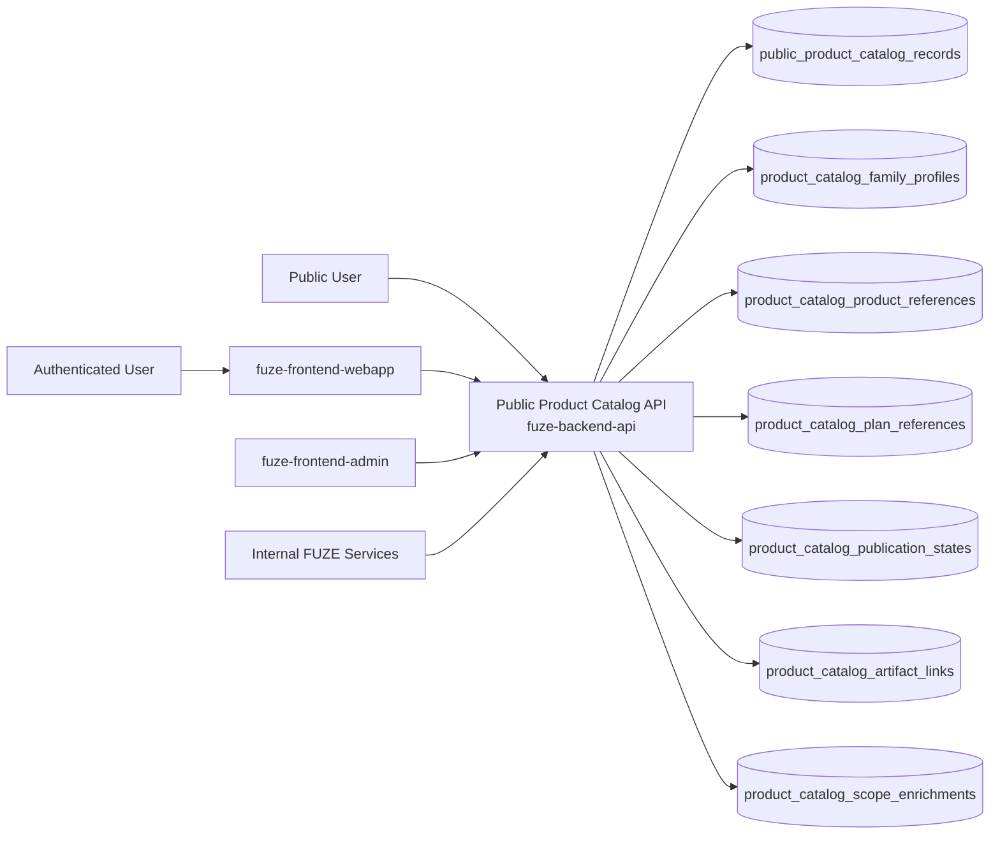
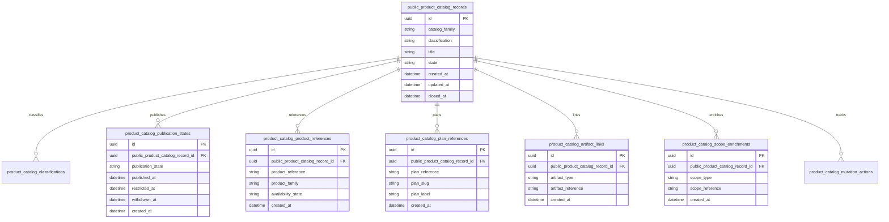
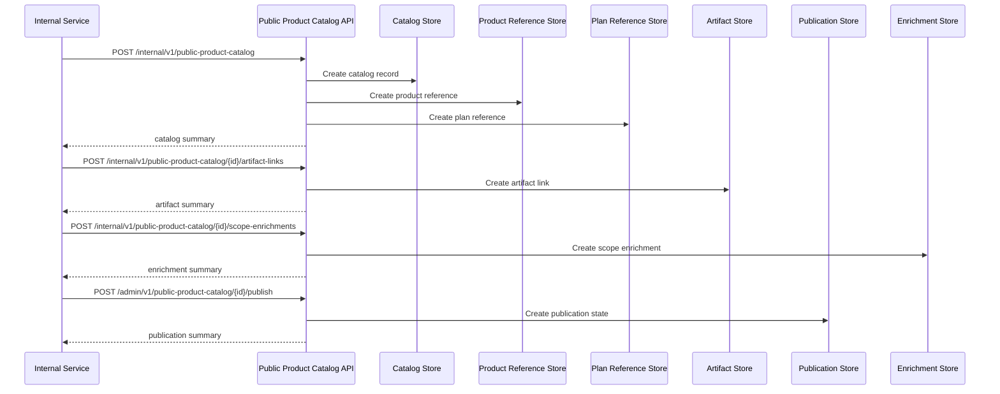

# PUBLIC_PRODUCT_CATALOG_API_SPEC

## 1. Title

**PUBLIC_PRODUCT_CATALOG_API_SPEC.md**

---

## 2. Document Metadata

- **Document Name:** PUBLIC_PRODUCT_CATALOG_API_SPEC.md
- **API Classification:** public-read, authenticated-read, internal, event-driven
- **Owning Domain:** Public Product Catalog Domain
- **Primary Implementing Repo:** `fuze-backend-api`
- **Primary System of Record:** public product catalog records, catalog family profiles, publication states, product artifact links, product visibility rules, correction-safe catalog lineage, and bounded actor-aware catalog enrichments in `fuze-backend-api`
- **Status:** Draft for canonical source-of-truth approval
- **Purpose:** Define the production-grade API contract architecture for the FUZE public product catalog, including public product discovery, public SKU/service-plan visibility, catalog-family publication, artifact linkage, correction-safe catalog lineage, and stable public-read product surfaces across the platform
- **Canonical Folder:** `fuze.ac > docs > api-spec`

---

## 2.1 API Classification Header

- **API Classification:** public-read | authenticated-read | internal | event-driven
- **Owning Domain:** Public Product Catalog Domain
- **Primary Implementing Repo:** `fuze-backend-api`
- **Primary System of Record:** public product catalog publication and discovery domain

---

## 3. Purpose

This document defines the canonical API specification for FUZE public product catalog operations. It translates the governing FUZE platform architecture, public API rules, platform/product integration rules, pricing and monetization rules, subscriptions and billing constraints, public metadata expectations, and API architecture rules into an implementation-ready API contract.

This API exists because FUZE requires a stable public discovery surface for platform products, modules, service plans, activation surfaces, pricing-presentment metadata, product-family visibility, and public go-to-market references that is narrower than internal product truth and more structured than ad hoc landing-page content. Public product catalog must therefore remain a deliberate public-read layer that supports discovery, evaluation, partner/reference integration, and transparency-first positioning without leaking unsafe internal product configuration or silently redefining canonical owned domain truth.

Public product catalog must preserve explicit distinction between:
- canonical product-owned truth,
- public product catalog publication,
- public pricing/presentment references,
- and bounded actor-aware catalog enrichments.

Accordingly, this specification defines how public product catalog records, catalog families, publication states, product references, plan references, artifact links, and correction lineage are represented, and how public catalog behavior remains auditable, idempotent, and architecture-consistent across FUZE.

---

## 4. Scope

This specification covers:

- public-read APIs for public product discovery, product family browsing, product detail retrieval, public plan/package visibility, public capability summaries, and product-linked trust-surface discovery
- authenticated read APIs for bounded actor-aware catalog enrichments where policy allows
- internal APIs for public catalog record creation, artifact linkage, publication, correction, supersession, and withdrawal
- publication-state handling for product records, plan-presentment records, derived public catalog summaries, and bounded rollout visibility
- event emission requirements for public catalog lifecycle changes
- request, response, error, idempotency, versioning, audit, and database-shape rules for this domain

This specification does **not** redefine:

- canonical internal product configuration in full detail
- subscriptions and billing ownership in full detail
- platform credits ownership in full detail
- pricing-engine ownership in full detail
- feature-flag or rollout-control ownership in full detail
- internal entitlement computation in full detail
- low-level website rendering implementation
- SDK generation strategy in full detail

Those remain governed by their own source-of-truth specifications.

---

## 5. Source-of-Truth Inputs

### Primary FUZE docs and specs used

#### Highest-priority platform and ownership sources
- `SYSTEM_SPEC_INDEX.md`
- `DOCS_SPEC.md`
- `SYSTEM_BOUNDARY_AND_OWNERSHIP_SPEC.md`
- `SYSTEM_OVERVIEW_AND_BOUNDARIES_SPEC.md`
- `PLATFORM_ARCHITECTURE_SPEC.md`
- `DOMAIN_OWNERSHIP_MATRIX_SPEC.md`
- `DATA_MODEL_AND_ENTITY_OWNERSHIP_SPEC.md`
- `PRODUCT_INTEGRATION_ARCHITECTURE_SPEC.md`
- `PRODUCT_ROLLOUT_DEPENDENCY_SPEC.md`
- `ONCHAIN_OFFCHAIN_RESPONSIBILITY_SPEC.md`

#### Primary product / catalog / public-read sources
- `PUBLIC_API_SPEC.md`
- `PRICING_AND_MONETIZATION_MODEL_SPEC.md`
- `SUBSCRIPTIONS_AND_USAGE_BILLING_SPEC.md`
- `PLATFORM_CREDITS_SPEC.md`
- `TRANSPARENCY_MODEL_SPEC.md`
- `PUBLIC_CONTRACT_AND_WALLET_REGISTRY_SPEC.md`
- `API_ARCHITECTURE_SPEC.md`
- product integration specs where relevant:
  - `QTB_PRODUCT_INTEGRATION_SPEC.md`
  - `AIMM_PRODUCT_INTEGRATION_SPEC.md`
  - `ZAGA_PRODUCT_INTEGRATION_SPEC.md`
  - `AIE_PRODUCT_INTEGRATION_SPEC.md`
  - `HERHELP_PRODUCT_INTEGRATION_SPEC.md`
  - `BOTMAD_PRODUCT_INTEGRATION_SPEC.md`

#### Supporting runtime and control sources
- `EVENT_MODEL_AND_WEBHOOK_SPEC.md`
- `IDEMPOTENCY_AND_VERSIONING_SPEC.md`
- `MIGRATION_AND_BACKWARD_COMPATIBILITY_SPEC.md`
- `SECURITY_AND_RISK_CONTROL_SPEC.md`
- `MONITORING_ALERTING_AND_INCIDENT_RESPONSE_SPEC.md`
- `SECRETS_CONFIG_AND_ENVIRONMENT_SPEC.md`
- `AUDIT_LOG_AND_ACTIVITY_SPEC.md`

### Highest-priority interpretation applied

For this file, the most important governing interpretation is:

1. public product catalog is a deliberate public discovery surface and not a convenience export of internal product configuration
2. backend owns canonical public catalog publication truth
3. public product catalog must remain explicitly separate from product domain business truth, billing truth, entitlement truth, and rollout-control truth
4. product family, public plan/package labels, pricing-presentment metadata, availability posture, and product capability summaries are suitable public surfaces when intentionally designed
5. unsafe internal pricing rules, entitlement internals, product orchestration detail, and control-plane mutation capabilities must remain non-public
6. catalog publication corrections and supersession must preserve historical intelligibility rather than silently rewriting public meaning

### Supporting external standards used only as guidance

- HTTP semantics for public-read and bounded authenticated-read APIs
- structured problem-details error design
- general public-catalog, search/filter, and public product discovery patterns as supporting guidance

External guidance does not override FUZE source-of-truth documents.

---

## 6. Governing Architecture and Ownership Interpretation

This API belongs to the **Public Product Catalog Domain** because it owns the canonical lifecycle of:

- public product catalog records,
- catalog family classification,
- public product and plan references,
- public availability posture,
- public artifact linkage,
- bounded catalog enrichments,
- and correction-safe public catalog history.

This API is implemented primarily in `fuze-backend-api` because:

- backend owns durable public catalog publication truth
- catalog publication must be built from canonical product-owned domains without becoming a shadow owner
- multiple public discovery surfaces require one stable public catalog layer
- public trust requires structured, versionable product outputs beyond ad hoc website content
- audit generation and correction lineage must be centralized

This API is **not** owned by:

- `fuze-frontend-webapp`, because frontend may render product catalog content but must not own canonical catalog publication truth
- `fuze-frontend-admin`, because admin may publish or supersede catalog artifacts but must not own catalog truth
- product domains, because product domains own canonical product behavior while this domain owns a bounded public discovery projection
- subscriptions/billing domain, because plan charging truth is linked but not owned here
- pricing domain, because public price-presentment references may be published here without making catalog the pricing authority
- public metadata domain, because metadata is a broader publication/discovery layer while catalog owns product-specific public discovery semantics

### Architectural implications

- every public catalog record must declare what product surface it is
- every public catalog record must preserve whether it is a primary product record, public plan/package record, supporting artifact, or derived public summary
- public catalog may link to pricing references, docs, transparency artifacts, registry entries, or public product pages without owning their deeper truth
- catalog corrections, supersession, and withdrawal must preserve historical lineage rather than silently rewriting public meaning
- authenticated enrichments must remain bounded and must not turn catalog surfaces into hidden control or entitlement interfaces

---

## 7. Domain Responsibilities

The Public Product Catalog API domain is responsible for:

1. maintaining canonical public product catalog records and catalog-family profiles
2. classifying catalog records as primary product records, plan/package records, supporting artifacts, or derived public summaries
3. publishing stable public-read product discovery, family browsing, and product detail surfaces
4. preserving explicit publication, withdrawal, and supersession state
5. linking catalog records to public docs, pricing-presentment artifacts, transparency artifacts, registry entries, and other public trust artifacts
6. exposing bounded authenticated-read catalog enrichments where actor context is relevant
7. emitting public catalog lifecycle events
8. generating audit lineage for sensitive publication and correction actions
9. preserving separation between public catalog artifacts and private canonical product truth
10. supporting public-safe degraded modes and trust-preserving catalog behavior

The domain is not responsible for:

- owning product business truth
- owning pricing calculation truth
- owning subscription charging truth
- exposing arbitrary internal roadmap, feature-flag, or orchestration state publicly
- replacing domain-specific product APIs where richer contracts are needed
- performing canonical entitlement computation as its source-of-truth function

---

## 8. Out of Scope

The following are out of scope for this API specification:

- arbitrary public write APIs
- checkout, purchase, or subscription mutation APIs
- private entitlement APIs
- rollout-control APIs
- governance-, treasury-, or payout mutation flows
- end-user onboarding UX
- low-level static site generation
- internal audit investigation workflows

---

## 9. Canonical Entities and Data Ownership

### Durable entities

#### 9.1 public_product_catalog_records
- **Owner:** Public Product Catalog Domain
- **Purpose:** canonical public product catalog records
- **Nature:** source-of-truth durable entity

#### 9.2 product_catalog_family_profiles
- **Owner:** Public Product Catalog Domain
- **Purpose:** profiles for catalog families such as products, product lines, plans, packages, modules, and supporting artifacts
- **Nature:** source-of-truth durable entity

#### 9.3 product_catalog_classifications
- **Owner:** Public Product Catalog Domain
- **Purpose:** classification of catalog records as primary product record, plan/package record, supporting artifact, or derived summary
- **Nature:** source-of-truth durable entity

#### 9.4 product_catalog_publication_states
- **Owner:** Public Product Catalog Domain
- **Purpose:** publication, visibility, withdrawal, and lifecycle state of catalog records
- **Nature:** source-of-truth durable entity

#### 9.5 product_catalog_product_references
- **Owner:** Public Product Catalog Domain
- **Purpose:** explicit linkage from public catalog records to product identities and product-family lineage
- **Nature:** source-of-truth durable lineage entity

#### 9.6 product_catalog_plan_references
- **Owner:** Public Product Catalog Domain
- **Purpose:** explicit linkage from public catalog records to public plan/package references and presentment labels
- **Nature:** source-of-truth durable lineage entity

#### 9.7 product_catalog_artifact_links
- **Owner:** Public Product Catalog Domain
- **Purpose:** links to public docs, pricing-presentment artifacts, transparency artifacts, registry entries, and supporting public artifacts
- **Nature:** source-of-truth durable lineage entity

#### 9.8 product_catalog_scope_enrichments
- **Owner:** Public Product Catalog Domain
- **Purpose:** bounded authenticated-read enrichment rules by actor or scope
- **Nature:** durable lineage entity

#### 9.9 product_catalog_supersession_links
- **Owner:** Public Product Catalog Domain
- **Purpose:** supersession and correction lineage between catalog records
- **Nature:** durable lineage entity

#### 9.10 product_catalog_discrepancy_cases
- **Owner:** Public Product Catalog Domain
- **Purpose:** review and remediation records for stale, incorrect, incomplete, or inconsistent public catalog data
- **Nature:** durable review/remediation entity

#### 9.11 product_catalog_mutation_actions
- **Owner:** Public Product Catalog Domain
- **Purpose:** high-level action records for create, publish, withdraw, correct, supersede, and resolve discrepancy
- **Nature:** durable action records with audit linkage

#### 9.12 product_catalog_audit_events
- **Owner:** Audit / Activity domain, sourced by Public Product Catalog Domain
- **Purpose:** immutable trail for sensitive catalog actions
- **Nature:** durable audit records

### Derived or cached entities

#### 9.13 product_catalog_index_views
- **Owner:** derived read-model layer
- **Purpose:** list/index projections for product discovery surfaces
- **Nature:** derived

#### 9.14 product_catalog_status_views
- **Owner:** derived read-model layer
- **Purpose:** public-safe catalog summaries and bounded authenticated enrichments
- **Nature:** derived

#### 9.15 product_catalog_discrepancy_views
- **Owner:** derived ops read-model layer
- **Purpose:** visibility into stale or inconsistent catalog conditions
- **Nature:** derived

---

## 10. State Model and Lifecycle

### 10.1 catalog record lifecycle

Possible states:

- `draft`
- `published`
- `restricted`
- `deprecated`
- `superseded`
- `archived`

### 10.2 publication-state lifecycle

Possible states:

- `unpublished`
- `published_public`
- `published_authenticated`
- `restricted`
- `withdrawn`

### 10.3 public-availability lifecycle

Possible states:

- `announced`
- `discoverable`
- `active`
- `limited`
- `paused`
- `retired`
- `superseded`

### 10.4 discrepancy lifecycle

Possible states:

- `opened`
- `under_review`
- `resolved`
- `failed`
- `closed`

Lifecycle notes:
- published does not imply ownership of linked pricing, billing, or entitlement domains
- public-safe and authenticated-only visibility must remain explicit
- public availability is a bounded publication object and not the same thing as internal rollout-control truth
- supersession must preserve historical public intelligibility
- withdrawn or restricted states must not silently erase audit lineage

---

## 11. API Surface Overview

The API surface is divided into three families:

### 11.1 Public-read APIs
Used by public users, prospects, partners, community observers, and integrators for:
- catalog index retrieval
- product detail retrieval
- family browsing
- plan/package presentment discovery
- product-linked trust-surface discovery

### 11.2 Authenticated read APIs
Used by authenticated users and approved clients for:
- bounded catalog enrichment
- actor- or scope-sensitive catalog visibility where policy allows
- authenticated access to catalog references not broadly public but safe within actor scope

### 11.3 Internal service and admin APIs
Used by trusted internal services and privileged operators for:
- creating and updating catalog records
- publishing, correcting, superseding, restricting, or withdrawing records
- linking artifacts and maintaining correction lineage
- resolving catalog discrepancies

---

## 12. Authentication and Authorization Model

### 12.1 Authentication posture by route family

#### Public-read routes
No authentication required:
- list catalog records
- retrieve catalog detail
- read public product/plan/family discovery where published

#### Authenticated read routes
Require valid authenticated session:
- read bounded authenticated-only catalog
- read actor- or workspace-scoped catalog enrichments where allowed

#### Internal service routes
Require internal service identity with explicit least privilege:
- create and update catalog records
- attach artifact links
- refresh publication states
- read canonical truth

#### Admin routes
Require privileged operator identity plus reason-coded actions:
- publish, withdraw, restrict, supersede, and resolve discrepancy cases

### 12.2 Authorization checkpoints

Authorization must evaluate:
- caller identity and route family
- whether catalog record is public, authenticated-only, or internal-only
- whether actor has scope visibility for authenticated enrichments
- whether service has create/publish/link/read privilege
- whether operator role is present for publication or correction actions
- whether current catalog state allows requested mutation

### 12.3 Sensitive action rules

The following require heightened checks:
- publication of new public catalog records
- publication of products or plans tied to trust-sensitive pricing-presentment or public capability claims
- withdrawal or restriction of already public catalog artifacts
- supersession of trust-sensitive published catalog records
- discrepancy-resolution actions

---

## 13. API Endpoints / Interface Contracts

## 13.1 Public-Read APIs

### 13.1.1 `GET /v1/public-product-catalog`
**Purpose:** list published public catalog records  
**Caller Type:** public  
**Auth Expectation:** none  
**Query Parameters Summary:**
- optional `catalog_family`
- optional `classification`
- optional `availability_state`
- optional `product_family`
- pagination
**Response Summary:**
- catalog record summaries
- family and classification labels
- publication state
- product summary
- plan/package summary where relevant
- timestamps
**Side Effects:** none
**Audit Requirements:** access logging optional
**Emitted Events:** none required

### 13.1.2 `GET /v1/public-product-catalog/{public_catalog_id}`
**Purpose:** retrieve one public catalog record  
**Caller Type:** public  
**Response Summary:**
- catalog detail
- classification and visibility information
- product reference
- public availability summary
- plan/package presentment summary where relevant
- artifact links
- supersession guidance where relevant
- public-safe status references
**Side Effects:** none

### 13.1.3 `GET /v1/public-product-catalog/families/{catalog_family}`
**Purpose:** retrieve public catalog summary for one catalog family  
**Caller Type:** public  
**Response Summary:**
- family summary
- linked public catalog records
- grouped product discovery view
**Side Effects:** none

### 13.1.4 `GET /v1/public-product-catalog/lookup`
**Purpose:** look up one or more public catalog records by normalized public query fields  
**Caller Type:** public  
**Query Parameters Summary:**
- optional `product_slug`
- optional `product_family`
- optional `plan_slug`
- optional `surface_tag`
- optional `q`
**Response Summary:**
- normalized lookup results
- matched public catalog summaries
- lookup confidence and status hints where relevant
**Side Effects:** none

## 13.2 Authenticated Read APIs

### 13.2.1 `GET /v1/public-product-catalog/me`
**Purpose:** retrieve bounded actor-aware catalog enrichments where policy allows  
**Caller Type:** authenticated user  
**Auth Expectation:** valid authenticated session  
**Query Parameters Summary:**
- optional `catalog_family`
- pagination
**Response Summary:**
- catalog summary list
- actor-safe enrichment data
- scoped references where allowed
**Side Effects:** none

### 13.2.2 `GET /v1/public-product-catalog/me/{public_catalog_id}`
**Purpose:** retrieve one bounded actor-aware catalog detail  
**Caller Type:** authenticated user  
**Response Summary:**
- base public catalog detail
- bounded authenticated enrichment
- scoped artifact references where allowed
**Side Effects:** none

## 13.3 Internal Service APIs

### 13.3.1 `POST /internal/v1/public-product-catalog`
**Purpose:** create draft public catalog record  
**Caller Type:** internal trusted service  
**Auth Expectation:** service-to-service identity only  
**Request Body Summary:**
- `catalog_family`
- `classification`
- `title`
- optional `summary`
- `product_reference`
- optional `plan_reference`
- optional `availability_state`
- `idempotency_key`
**Response Summary:** catalog record summary
**Side Effects:** creates draft catalog record
**Idempotency Behavior:** required
**Audit Requirements:** catalog creation audit
**Emitted Events:** `public_product_catalog.record_created`

### 13.3.2 `POST /internal/v1/public-product-catalog/{public_catalog_id}/artifact-links`
**Purpose:** attach artifact links to one catalog record  
**Caller Type:** internal trusted service  
**Request Body Summary:**
- `artifact_type`
- `artifact_reference`
- optional `artifact_summary`
- `idempotency_key`
**Response Summary:** artifact-link summary
**Side Effects:** creates artifact-link lineage
**Idempotency Behavior:** required
**Audit Requirements:** artifact-link audit
**Emitted Events:** `public_product_catalog.artifact_linked`

### 13.3.3 `POST /internal/v1/public-product-catalog/{public_catalog_id}/scope-enrichments`
**Purpose:** attach bounded authenticated enrichment rules to one catalog record  
**Caller Type:** internal trusted service  
**Request Body Summary:**
- `scope_type`
- `scope_reference`
- `enrichment_profile`
- `idempotency_key`
**Response Summary:** scope-enrichment summary
**Side Effects:** creates enrichment lineage
**Idempotency Behavior:** required
**Audit Requirements:** enrichment audit
**Emitted Events:** `public_product_catalog.scope_enrichment_linked`

### 13.3.4 `GET /internal/v1/public-product-catalog/{public_catalog_id}`
**Purpose:** retrieve canonical public catalog truth  
**Caller Type:** internal trusted service  
**Response Summary:** full catalog record, classification, product references, plan references, publication state, artifact links, enrichments, supersession lineage, and discrepancy lineage
**Side Effects:** none

## 13.4 Admin / Control-Plane APIs

### 13.4.1 `POST /admin/v1/public-product-catalog/{public_catalog_id}/publish`
**Purpose:** publish public catalog record under controlled policy  
**Caller Type:** admin/operator  
**Request Body Summary:**
- `visibility_target`
- `reason_code`
- `operator_note`
- `idempotency_key`
**Response Summary:** published catalog summary
**Side Effects:** publication state changes to published_public or published_authenticated
**Audit Requirements:** critical audit
**Emitted Events:** `public_product_catalog.record_published`

### 13.4.2 `POST /admin/v1/public-product-catalog/{public_catalog_id}/withdraw`
**Purpose:** withdraw or restrict public catalog visibility under controlled policy  
**Caller Type:** admin/operator  
**Request Body Summary:**
- `withdrawal_mode`
- `reason_code`
- `operator_note`
- `idempotency_key`
**Response Summary:** withdrawn catalog summary
**Side Effects:** publication state changes to restricted or withdrawn
**Audit Requirements:** critical audit
**Emitted Events:** `public_product_catalog.record_withdrawn`

### 13.4.3 `POST /admin/v1/public-product-catalog/{public_catalog_id}/supersede`
**Purpose:** supersede one public catalog record with another under controlled policy  
**Caller Type:** admin/operator  
**Request Body Summary:**
- `replacement_public_catalog_id`
- `reason_code`
- `operator_note`
- `idempotency_key`
**Response Summary:** supersession summary
**Side Effects:** creates supersession linkage and updates visible preference
**Audit Requirements:** critical audit
**Emitted Events:** `public_product_catalog.record_superseded`

### 13.4.4 `POST /admin/v1/public-product-catalog/discrepancies`
**Purpose:** resolve public catalog discrepancy under controlled policy  
**Caller Type:** admin/operator  
**Request Body Summary:**
- `target_reference_type`
- `target_reference_id`
- `resolution_code`
- `operator_note`
- `related_case_id`
- `idempotency_key`
**Response Summary:** discrepancy-resolution summary
**Side Effects:** may correct, supersede, restrict, withdraw, or close discrepancy posture with preserved lineage
**Audit Requirements:** critical audit
**Emitted Events:** `public_product_catalog.discrepancy_resolved`

---

## 14. Request Rules

### 14.1 General request rules
- all mutation-capable routes must require JSON requests with explicit content type
- all mutation routes must carry correlation IDs
- sensitive public catalog mutations must carry idempotency keys
- admin mutations must require reason codes and operator notes
- no route may accept frontend-authored public catalog truth as authoritative input

### 14.2 Sensitive-action request requirements
The following requests require heightened validation:
- publication of new public catalog records
- publication of products or plans tied to trust-sensitive pricing-presentment or public capability claims
- withdrawal or restriction of already public catalog records
- supersession of trust-sensitive published catalog artifacts
- discrepancy-resolution actions

Heightened validation may include:
- family/classification consistency checks
- product and plan reference validation
- public-safe versus authenticated-only visibility checks
- operator role confirmation
- pricing or reporting case linkage for sensitive actions

### 14.3 Scope integrity rule
Public catalog mutations must target valid and authorized records, artifact links, enrichment records, product references, plan references, and discrepancy records. Services and operators must not mutate unrelated or unauthorized catalog state.

### 14.4 Layer-separation rule
Public product catalog domain must remain the public discovery-and-presentment layer. It must not collapse:
- product canonical truth,
- pricing ownership,
- billing ownership,
- metadata ownership,
- or internal orchestration state
into one ambiguous catalog object.

---

## 15. Response Rules

### 15.1 Success response rules
Successful responses must include:
- stable resource identifiers
- timestamps for created/updated state
- state/status values
- family and classification summaries
- product and plan summaries where relevant
- artifact-link and publication-state summaries where relevant
- correlation references for mutations

### 15.2 Async-accepted response rules
If publication propagation, withdrawal, or discrepancy remediation is async, the response must:
- return accepted status
- include action or job ID
- provide follow-up status semantics

### 15.3 Terminal mutation response rules
Terminal mutation responses must clearly show:
- target catalog record or discrepancy
- mutation type
- resulting publication state
- withdrawal, supersession, or restriction effects where relevant
- whether public-safe views may refresh asynchronously

### 15.4 Read response rules
Read responses must distinguish:
- canonical internal catalog truth
- primary public product records
- public plan/package records
- supporting artifacts
- derived public summaries
- actor-scoped enrichment versus ordinary public catalog views

---

## 16. Error Model

The API uses structured problem-details style error responses.

### 16.1 Required error fields
- `type`
- `title`
- `status`
- `code`
- `detail`
- `instance`
- `correlation_id`

### 16.2 Common error codes

#### Authorization / permission errors
- `PUBLIC_PRODUCT_CATALOG_PERMISSION_DENIED`
- `PUBLIC_PRODUCT_CATALOG_OPERATOR_PERMISSION_DENIED`
- `PUBLIC_PRODUCT_CATALOG_SERVICE_PERMISSION_DENIED`
- `PUBLIC_PRODUCT_CATALOG_AUDIENCE_PERMISSION_DENIED`

#### State conflict errors
- `PUBLIC_PRODUCT_CATALOG_RECORD_STATE_INVALID`
- `PUBLIC_PRODUCT_CATALOG_PUBLICATION_STATE_INVALID`
- `PUBLIC_PRODUCT_CATALOG_SUPERSESSION_CONFLICT`
- `PUBLIC_PRODUCT_CATALOG_VISIBILITY_CONFLICT`

#### Policy / safety errors
- `PUBLIC_PRODUCT_CATALOG_CLASSIFICATION_REQUIRED`
- `PUBLIC_PRODUCT_CATALOG_PRODUCT_REFERENCE_REQUIRED`
- `PUBLIC_PRODUCT_CATALOG_VISIBILITY_NOT_ALLOWED`
- `PUBLIC_PRODUCT_CATALOG_PUBLICATION_NOT_ALLOWED`
- `PUBLIC_PRODUCT_CATALOG_WITHDRAWAL_NOT_ALLOWED`

#### Request integrity errors
- `PUBLIC_PRODUCT_CATALOG_IDEMPOTENCY_KEY_REQUIRED`
- `PUBLIC_PRODUCT_CATALOG_REQUEST_INVALID`
- `PUBLIC_PRODUCT_CATALOG_REQUEST_UNPROCESSABLE`

#### Dependency or provider errors
- `PUBLIC_PRODUCT_CATALOG_STORAGE_UNAVAILABLE`
- `PUBLIC_PRODUCT_CATALOG_PRODUCT_REFERENCE_UNAVAILABLE`
- `PUBLIC_PRODUCT_CATALOG_PRICING_REFERENCE_UNAVAILABLE`

### 16.3 Error handling rules
- do not expose hidden internal governance, treasury, security, or audit detail in public or low-privilege responses
- do not imply canonical ownership of linked pricing, billing, or entitlement truth from catalog publication alone
- distinguish classification/visibility failure from generic invalid state
- distinguish missing product reference from generic invalid request
- include retry guidance only where safe

---

## 17. Idempotency and Mutation Safety

### 17.1 Required idempotent mutations
The following mutation routes require idempotent behavior:
- catalog record creation
- artifact-link attachment
- scope-enrichment attachment
- publish
- withdraw
- supersede
- discrepancy resolution

### 17.2 Idempotency key rules
- mutation requests must supply `Idempotency-Key`
- backend stores key scope, request hash, actor, and terminal result
- replay of same semantic request returns original terminal outcome
- replay of same key with different semantic request must fail with conflict

### 17.3 Mutation safety rules
- one canonical visible catalog record per current catalog lineage unless explicit supersession exists
- artifact and enrichment links must remain referentially consistent with catalog family and classification
- public publication and authenticated publication must remain explicitly distinct
- corrections and supersession must preserve prior catalog lineage
- withdrawal and restriction must preserve auditability and public explanation where appropriate

---

## 18. Versioning and Compatibility Rules

### 18.1 Versioning
This API family is versioned under `/v1`, `/internal/v1`, and `/admin/v1` route families.

### 18.2 Compatibility approach
- additive evolution preferred
- no silent semantic change to catalog family, classification, availability posture, or visibility meaning
- new catalog families, lookup key types, and artifact-link types may be added without breaking existing contracts
- response fields may be added but existing meanings must remain stable

### 18.3 Breaking-change rules
Breaking changes include:
- changing the meaning of primary public product record versus plan/package record versus supporting artifact versus derived summary
- changing visibility semantics incompatibly
- removing critical product-reference, plan-reference, or artifact-link fields
- changing supersession or withdrawal semantics incompatibly

Such changes require explicit migration planning and version evolution.

### 18.4 Deprecation
Deprecated routes or fields must:
- be documented explicitly
- carry deprecation metadata where supported
- preserve compatibility windows long enough for public, first-party, and internal consumers

---

## 19. Event Emission and Webhook Behavior

This domain is event-capable.

### 19.1 Internal events
The Public Product Catalog domain must emit canonical internal events such as:
- `public_product_catalog.record_created`
- `public_product_catalog.artifact_linked`
- `public_product_catalog.scope_enrichment_linked`
- `public_product_catalog.record_published`
- `public_product_catalog.record_withdrawn`
- `public_product_catalog.record_superseded`
- `public_product_catalog.discrepancy_resolved`

### 19.2 Event payload minimums
Each event should contain:
- event ID
- event type
- occurred_at
- public catalog ID
- catalog family
- classification
- publication state
- actor type
- correlation ID
- reason code where applicable

### 19.3 External webhook posture
This specification does not expose general third-party outbound public catalog webhooks by default. Any future outbound catalog publication webhook surface must be narrow, security-reviewed, and governed by a separate contract.

---

## 20. Audit and Activity Requirements

The following actions must generate durable audit events:

- catalog record creation
- artifact-link attachment
- publish, withdraw, supersede, and discrepancy actions
- scope-enrichment linkage where sensitivity requires
- other sensitive public catalog mutations

### Required audit fields
- audit event ID
- actor type and actor reference
- target catalog record / artifact link / discrepancy reference as applicable
- action type
- before/after summary where applicable
- reason code
- correlation ID
- operator note if operator action
- occurred_at

---

## 21. Data Model and Database Schema View

### 21.1 `public_product_catalog_records`
- `id` PK
- `catalog_family`
- `classification`
- `title`
- `summary`
- `state`
- `created_at`
- `updated_at`
- `closed_at` nullable

**Constraints:**
- index on (`catalog_family`, `classification`)
- index on `state`

### 21.2 `product_catalog_family_profiles`
- `id` PK
- `catalog_family`
- `allowed_classifications_json`
- `lookup_profile_json`
- `visibility_profile_json`
- `created_at`
- `updated_at`

**Constraints:**
- unique `catalog_family`

### 21.3 `product_catalog_classifications`
- `id` PK
- `public_product_catalog_record_id` FK -> `public_product_catalog_records.id`
- `classification`
- `canonical_owner_reference`
- `created_at`

**Constraints:**
- index on `public_product_catalog_record_id`

### 21.4 `product_catalog_publication_states`
- `id` PK
- `public_product_catalog_record_id` FK -> `public_product_catalog_records.id`
- `publication_state`
- `published_at` nullable
- `restricted_at` nullable
- `withdrawn_at` nullable
- `created_at`

**Constraints:**
- index on `public_product_catalog_record_id`
- index on `publication_state`

### 21.5 `product_catalog_product_references`
- `id` PK
- `public_product_catalog_record_id` FK -> `public_product_catalog_records.id`
- `product_reference`
- `product_family`
- `availability_state`
- `created_at`

**Constraints:**
- index on `public_product_catalog_record_id`

### 21.6 `product_catalog_plan_references`
- `id` PK
- `public_product_catalog_record_id` FK -> `public_product_catalog_records.id`
- `plan_reference`
- `plan_slug`
- `plan_label`
- `created_at`

**Constraints:**
- index on `public_product_catalog_record_id`

### 21.7 `product_catalog_artifact_links`
- `id` PK
- `public_product_catalog_record_id` FK -> `public_product_catalog_records.id`
- `artifact_type`
- `artifact_reference`
- `artifact_summary_json`
- `created_at`

**Constraints:**
- index on `public_product_catalog_record_id`

### 21.8 `product_catalog_scope_enrichments`
- `id` PK
- `public_product_catalog_record_id` FK -> `public_product_catalog_records.id`
- `scope_type`
- `scope_reference`
- `enrichment_profile_json`
- `created_at`

**Constraints:**
- index on `public_product_catalog_record_id`

### 21.9 `product_catalog_supersession_links`
- `id` PK
- `from_public_catalog_id` FK -> `public_product_catalog_records.id`
- `to_public_catalog_id` FK -> `public_product_catalog_records.id`
- `reason_code`
- `created_at`

**Constraints:**
- unique (`from_public_catalog_id`, `to_public_catalog_id`)

### 21.10 `product_catalog_discrepancy_cases`
- `id` PK
- `target_reference_type`
- `target_reference_id`
- `state`
- `resolution_code` nullable
- `created_at`
- `updated_at`
- `closed_at` nullable

### 21.11 `product_catalog_mutation_actions`
- `id` PK
- `target_reference_type`
- `target_reference_id`
- `action_type`
- `state`
- `reason_code`
- `operator_note` nullable
- `requested_by_actor_type`
- `requested_by_actor_id`
- `created_at`
- `executed_at` nullable
- `closed_at` nullable
- `correlation_id`

### 21.12 `idempotency_records`
- `id` PK
- `idempotency_key`
- `scope_family`
- `actor_reference`
- `request_hash`
- `response_hash`
- `terminal_status`
- `created_at`
- `expires_at`

### 21.13 `audit_log_entries`
Domain-sourced audit records written into the audit domain.

### Normalization notes
- canonical public catalog truth stays in catalog records, family profiles, classifications, publication states, product references, plan references, artifact links, enrichments, supersession links, and discrepancy records
- product, pricing, billing, and entitlement canonical truths remain external and are referenced rather than duplicated
- public-safe views must derive from canonical public catalog truth filtered by publication state and visibility class
- actor-scoped enrichments remain bounded overlays rather than new canonical catalog owners

### Reconciliation notes
- one visible public catalog record should reconcile to one current catalog lineage under current preference
- publication state must reconcile with allowed family/classification combinations
- product references and plan references must reconcile to linked public product truth
- discrepancy cases must preserve review lineage for stale or conflicting public catalog conditions

---

## 22. Architecture Diagram — Mermaid flowchart



---

## 23. Data Design — Mermaid Diagram



---

## 24. Flow View

### 24.1 Happy path — publish primary public product record
1. internal service creates draft catalog record
2. product reference, plan references, and artifact links are attached to docs, pricing-presentment, transparency, or public artifacts
3. operator validates family/classification and publication intent
4. admin publishes record publicly
5. public index, family, lookup, and detail surfaces become available
6. external readers can discover the record as primary product record, plan/package record, supporting artifact, or derived summary

### 24.2 Happy path — authenticated enrichment
1. catalog record is already published or authenticated-visible
2. bounded actor/scope enrichment is linked internally
3. authenticated actor requests the catalog artifact
4. backend returns base public catalog plus scoped enrichment where policy allows
5. actor sees additional safe context without gaining hidden entitlement or control access

### 24.3 Alternate path — superseding an older catalog publication
1. older catalog record must be replaced or corrected
2. replacement record is created and validated
3. admin supersedes the older record
4. previous record remains historically linked and interpretable
5. new record becomes current visible preference

### 24.4 Failure path — invalid classification or publication posture
1. catalog record is created or modified
2. backend detects missing classification, invalid family/classification combination, or disallowed visibility posture
3. request is rejected or record remains unpublished
4. no unsafe public catalog surface is produced

### 24.5 Failure and remediation path — stale or incorrect public catalog
1. linked product/plan/presentment/public artifact changes or catalog record becomes stale/inconsistent
2. admin opens discrepancy-resolution flow
3. backend preserves existing lineage
4. corrected or superseding catalog record is created
5. discrepancy closes with preserved history

### 24.6 Degraded-mode path
1. linked pricing-presentment, docs, or public artifact is delayed or degraded
2. public catalog surface stays available where safe
3. backend communicates freshness or visibility degradation explicitly
4. canonical truth mutation is not implied by degraded presentation

### 24.7 Retry behavior
- duplicate catalog creation returns same canonical record result
- duplicate artifact or enrichment attachment returns same lineage result where applicable
- duplicate publish/withdraw/supersede/discrepancy actions return same terminal action result

---

## 25. Data Flows — Mermaid sequenceDiagram



---

## 26. Security and Risk Controls

1. **Public catalog truth is backend-owned**  
   Frontends and informal publication channels may not authoritatively define public catalog truth.

2. **Catalog is not a control plane**  
   Public catalog surfaces must support discovery, evaluation, and public presentment, not expose purchase mutation, pricing internals, entitlement internals, or rollout controls.

3. **Classification clarity is mandatory**  
   Public catalog must explicitly distinguish primary product records, plan/package records, supporting artifacts, and derived public summaries so external consumers do not mistake one for another.

4. **Public-safe visibility discipline**  
   Publication state must keep public, authenticated-only, and internal-only catalog clearly separated.

5. **Rate limits and abuse controls**  
   Public catalog surfaces require public-surface protections such as rate limiting, actor/token throttling, input hardening, and stable pagination expectations.

6. **Backward-compatibility discipline**  
   Public catalog surfaces must follow explicit versioning and conservative compatibility rules because public interfaces carry strong ecosystem trust obligations.

7. **Audit-linked publication**  
   Publication, withdrawal, and supersession of catalog artifacts must remain traceable into internal audit systems.

8. **Secrets/config boundary discipline**  
   Public catalog may include only values intentionally classed as public and must not leak confidential or control-sensitive configuration.

9. **Trust-preserving degraded modes**  
   Public catalog should preserve the difference between freshness lag, public presentment lag, and canonical truth mutation.

10. **Historical intelligibility**  
    Corrections and supersession must preserve lineage so public trust surfaces remain historically interpretable.

---

## 27. Operational Considerations

- public catalog index, family, lookup, and detail reads should be highly available
- publication-state changes and product/plan linkage correctness are trust-sensitive and must be monitored
- product-, plan-, and presentment-sensitive catalog surfaces should surface clearly to ops views
- supersession and discrepancy workflows should be observable and reviewable
- monitoring should alert on:
  - stale public catalog records tied to trust-sensitive surfaces
  - publication failures for trusted catalog artifacts
  - public/private visibility divergence
  - broken public artifact references
  - public-safe view inconsistency versus canonical catalog state
  - degraded public discovery surfaces during active launch or plan-transition periods

---

## 28. Acceptance Criteria

1. The API preserves the distinction between public catalog truth, product truth, pricing truth, billing truth, entitlement truth, and internal domain truth.
2. Only `fuze-backend-api` owns canonical public catalog publication truth.
3. Public catalog records, family profiles, classifications, publication states, product references, plan references, artifact links, enrichments, supersession links, and discrepancy records are durable and backend-owned.
4. Public and authenticated routes expose only bounded safe public catalog views.
5. Catalog family, classification, product reference, plan reference, availability posture, and visibility posture are explicit and validated.
6. Public catalog distinguishes primary product records, plan/package records, supporting artifacts, and derived summary models.
7. Publication, withdrawal, supersession, and discrepancy actions preserve immutable lineage.
8. Public catalog mutation actions are idempotent and auditable.
9. Internal and admin public catalog routes are least-privilege and backend-only.
10. Admin routes require reason-coded privileged authorization.
11. Event emissions exist for major public catalog mutations.
12. Database schema separates records, family profiles, classifications, publication states, product references, plan references, artifact links, enrichments, supersession links, and discrepancy layers.
13. Public-safe consumers can rely on public catalog views without needing internal platform knowledge.
14. Public catalog supports rate-limited, versioned, supportable external integration behavior.
15. Mermaid diagrams remain consistent with prose and data model.

---

## 29. Test Cases

### 29.1 Positive cases
1. Internal service creates draft public catalog record successfully.
2. Internal service attaches artifact link successfully.
3. Internal service attaches scope enrichment successfully.
4. Admin publishes public catalog successfully.
5. Public user reads published catalog index successfully.
6. Public user reads one published catalog record successfully.
7. Public user performs product/plan lookup successfully.
8. Admin supersedes stale catalog successfully.

### 29.2 Negative cases
9. Public user cannot access unpublished or internal-only catalog.
10. Internal service without write privilege cannot create catalog record.
11. Publication without valid classification returns `PUBLIC_PRODUCT_CATALOG_CLASSIFICATION_REQUIRED`.
12. Publication without required product reference returns `PUBLIC_PRODUCT_CATALOG_PRODUCT_REFERENCE_REQUIRED`.
13. Disallowed visibility target returns `PUBLIC_PRODUCT_CATALOG_VISIBILITY_NOT_ALLOWED`.
14. Withdrawal attempt in incompatible state returns `PUBLIC_PRODUCT_CATALOG_WITHDRAWAL_NOT_ALLOWED`.

### 29.3 Authorization cases
15. Ordinary public or authenticated user cannot call admin catalog publication APIs.
16. Internal service without artifact-link privilege cannot attach artifact links.
17. Operator without publication privilege cannot publish catalog.
18. Published public catalog does not imply canonical ownership of linked product/pricing/billing truth.

### 29.4 Idempotency and replay cases
19. Repeating catalog creation with same idempotency key returns original catalog result.
20. Repeating artifact-link attachment with same idempotency key returns original linkage result.
21. Repeating publish or withdraw with same idempotency key returns original terminal action result.
22. Repeating supersede or discrepancy resolution with same idempotency key returns original terminal action result.

### 29.5 Concurrency cases
23. Concurrent product/plan linkage updates preserve one explicit current linkage lineage and duplicate-safe outcomes where appropriate.
24. Concurrent publish and withdraw actions preserve explicit lifecycle ordering without hidden overwrite.
25. Concurrent supersede and discrepancy actions preserve explicit visible lineage without ambiguity.

### 29.6 Recovery / admin cases
26. Stale or mislinked public catalog can be corrected under controlled policy with explicit lineage.
27. Superseded public catalog remains historically linked to the original record.
28. Discrepancy resolution closes product reference, visibility, or reporting conflict with preserved audit history.

### 29.7 Event and audit cases
29. Successful catalog creation emits `public_product_catalog.record_created`.
30. Successful artifact-link attachment emits `public_product_catalog.artifact_linked`.
31. Successful publication emits `public_product_catalog.record_published`.
32. Successful withdrawal emits `public_product_catalog.record_withdrawn`.
33. Successful discrepancy resolution emits `public_product_catalog.discrepancy_resolved` with critical audit lineage.

---

## 30. Open Questions or Explicit Deferred Decisions

1. Exact catalog-family taxonomy code sets are deferred.
2. Exact public-safe plan-presentment detail depth is deferred.
3. Exact actor-scoped enrichment taxonomy is deferred.
4. Exact public-safe disclosure depth for pricing-presentment references is deferred.
5. Exact discrepancy taxonomy for catalog/publication conflicts is deferred.
6. Exact partner-oriented catalog quota strategy is deferred.

---

## 31. Implementation Notes for `fuze-backend-api`

Recommended backend module layout:

```text
modules/platform/
  public-product-catalog/
  product-catalog/
  pricing/
  subscriptions-billing/
  public-metadata/
  audit-log/
  control-plane/
  integrations/
```

Implementation guidance:
- keep catalog records, family profiles, product references, plan references, publication state, artifact links, and supersession logic in one canonical domain service
- perform family/classification/visibility/product-reference/plan-reference checks inside the commit boundary
- keep publish, withdraw, supersede, and discrepancy actions explicit and idempotent
- treat admin remediations as domain actions, not ad hoc row edits
- emit events only after canonical state commit succeeds
- publish public-safe catalog views from canonical truth; do not let derived views mutate catalog state

---

## 32. Frontend Consumption Notes

### For `fuze-frontend-webapp`
- may read public catalog and bounded authenticated enrichments where approved
- must not infer canonical domain ownership from public catalog alone
- must treat backend public catalog responses as authoritative for publication state and trust-surface semantics
- should clearly distinguish primary product records, plan/package records, supporting artifacts, and derived summary views when visible

### For `fuze-frontend-admin`
- may trigger privileged publish, withdraw, supersede, and discrepancy actions only through backend admin APIs
- must require operator reason input for sensitive mutations
- must not directly mutate canonical public catalog truth client-side
- should present immutable catalog history and correction lineage separately from current visible state

---

## 33. Contract Derivation Notes

### OpenAPI / AsyncAPI
This spec should later derive into:
- public catalog index/detail/family/lookup read operations
- authenticated catalog enrichment read operations
- internal catalog creation, artifact-link, and enrichment operations
- admin publish / withdraw / supersede / discrepancy operations
- shared problem-details schema
- public catalog lifecycle events in AsyncAPI

### Future `fuze-sdk`
Future `fuze-sdk` packages may derive:
- public catalog lookup helpers
- public family discovery helpers
- typed catalog-family, classification, availability, and publication-state summary models
- problem-error models for public catalog outcomes

The SDK must derive from approved API contracts and must not become the source of truth over this narrative specification.
