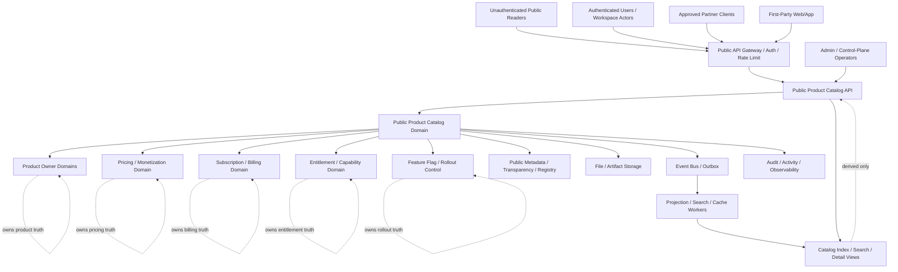
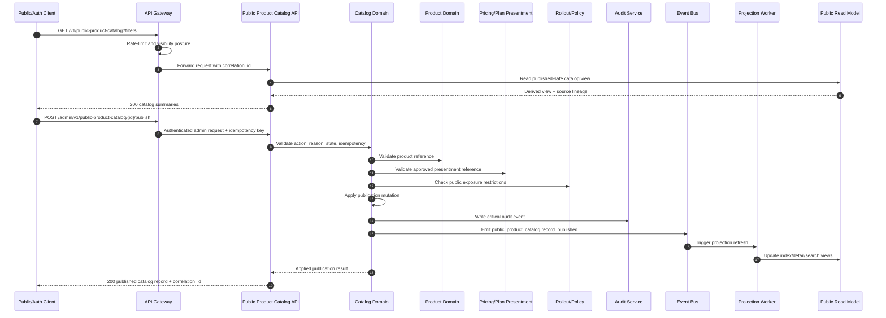

# PUBLIC_PRODUCT_CATALOG_API_SPEC.md

## Document Metadata

- **Document Name:** `PUBLIC_PRODUCT_CATALOG_API_SPEC.md`
- **Document Type:** FUZE API SPEC v2 / production-grade public-read companion API specification
- **Status:** Draft refined canonical API specification
- **Version:** 2.0.0
- **Effective Date:** 2026-04-25
- **Last Updated:** 2026-04-25
- **Reviewed On:** 2026-04-25
- **Document Owner:** FUZE Public Product Catalog API Domain; named individual owner is not yet specified
- **Approval Authority:** FUZE API Governance / Platform Architecture approval workflow; named approval body is not yet specified
- **Review Cadence:** Quarterly and whenever product admission, product visibility, public API posture, pricing presentment, entitlement, rollout, public metadata, trust artifacts, or publication lifecycle materially changes
- **Governing Layer:** Public-read / public-trust companion API layer
- **Parent Registry:** API SPEC v2 Canonical File Registry
- **Upstream Semantic Registry:** `REFINED_SYSTEM_SPEC_INDEX.md`
- **Upstream API Registry:** `API_SPEC_INDEX.md`
- **Primary Audience:** Platform architecture, backend/API engineering, public API governance, product engineering, frontend, growth, public trust, SDK/OpenAPI authors, security, audit, operations, and implementation-contract authors
- **Primary Purpose:** Define the canonical API contract for FUZE public product catalog discovery, publication, lookup, product/plan presentment references, bounded actor-aware catalog enrichments, correction lineage, withdrawal, supersession, public-safe read models, events, auditability, and downstream implementation guardrails
- **Primary Upstream References:** `PUBLIC_PRODUCT_CATALOG_API_SPEC.md` v1, `PUBLIC_API_SPEC.md`, `API_ARCHITECTURE_SPEC.md`, `PRODUCT_BOUNDARY_AND_DOMAIN_OWNERSHIP_SPEC.md`, `PRODUCT_ADMISSION_AND_EXPANSION_GATE_SPEC.md`, `PRICING_AND_MONETIZATION_MODEL_SPEC.md`, `SUBSCRIPTIONS_AND_USAGE_BILLING_SPEC.md`, `ENTITLEMENT_AND_CAPABILITY_GATING_SPEC.md`, `FEATURE_FLAG_AND_ROLLOUT_CONTROL_SPEC.md`, `PUBLIC_METADATA_API_SPEC.md`, `PUBLIC_TRANSPARENCY_API_SPEC.md`, `FILE_OBJECT_AND_ARTIFACT_STORAGE_SPEC.md`, `EVENT_MODEL_AND_WEBHOOK_SPEC.md`, `IDEMPOTENCY_AND_VERSIONING_SPEC.md`, `MIGRATION_AND_BACKWARD_COMPATIBILITY_SPEC.md`, `AUDIT_LOG_AND_ACTIVITY_SPEC.md`, `SECURITY_AND_RISK_CONTROL_SPEC.md`, `MONITORING_ALERTING_AND_INCIDENT_RESPONSE_SPEC.md`
- **Primary Downstream Dependents:** Public OpenAPI contract, public catalog SDK surfaces, first-party web catalog UI, public product pages, partner-safe catalog lookup, public metadata linking, product integration contracts, pricing-presentment contracts, admin publication tooling, read-model/projection jobs, event catalog, audit catalog, implementation-contract specs
- **API Surface Families Covered:** public-read, authenticated public-read, first-party application read, internal service, admin/control-plane, event/async, reporting/export, public metadata linking
- **API Surface Families Excluded:** arbitrary public writes, checkout/payment mutations, subscription lifecycle mutations, entitlement computation APIs, feature-flag/rollout-control APIs, product-internal configuration APIs, governance/treasury/payout APIs, raw storage APIs, raw analytics APIs
- **Canonical System Owner(s):** Public Product Catalog publication domain; upstream product, pricing, billing, entitlement, rollout, metadata, transparency, audit, and file/artifact domains retain their own semantic ownership
- **Canonical API Owner:** Public Product Catalog API Domain
- **Supersedes:** v1 `PUBLIC_PRODUCT_CATALOG_API_SPEC.md` as an API SPEC v2 production-grade contract; earlier weaker interpretations that treat catalog as website content, frontend-owned data, pricing truth, entitlement truth, or a raw export of product internals
- **Superseded By:** Not yet specified
- **Related Decision Records:** Not yet specified
- **Canonical Status Note:** This API specification is canonical for the public product catalog API contract. It does not own underlying product, pricing, billing, entitlement, rollout, or public metadata truth.
- **Implementation Status:** Ready for downstream implementation planning and machine-readable contract derivation; final route inventory and payload schemas remain downstream implementation-contract work
- **Approval Status:** Pending approval
- **Change Summary:** Upgrades the v1 public product catalog API into API SPEC v2 format; strengthens truth-class separation, public/internal/admin boundaries, catalog lineage, visibility states, request/response/error/idempotency/audit rules, read-model controls, diagrams, flow views, acceptance criteria, and tests.

## Title

FUZE Public Product Catalog API Specification

## Purpose

This document defines the production-grade API contract for FUZE public product catalog surfaces.

The Public Product Catalog API provides a stable, governed public-read and bounded authenticated-read surface for discovering FUZE products, product families, product modules, public plan/package labels, public capability summaries, activation posture, availability posture, and product-linked public artifacts. It exists so product discovery can be published through one durable API layer rather than ad hoc landing-page data, frontend-only constants, raw product configuration, or unsafe exports of internal business systems.

The API MUST preserve the distinction between:

- canonical product/domain truth;
- public product catalog publication truth;
- public pricing and plan-presentment references;
- entitlement and capability eligibility truth;
- rollout/control truth;
- public metadata and transparency artifacts;
- derived catalog search/list views; and
- presentation rendering.

## Scope

This specification governs:

1. public-read catalog list, detail, family, lookup, and search route families;
2. authenticated public-read catalog enrichments that are safe for the caller scope;
3. first-party application consumption of the same public or authenticated-public contract posture;
4. internal service APIs for catalog record creation, artifact linkage, product/plan reference validation, draft lifecycle, and projection refresh;
5. admin/control-plane APIs for publication, withdrawal, restriction, correction, supersession, and discrepancy resolution;
6. event and async behavior for catalog publication lifecycle changes;
7. request, response, error, result, status, idempotency, audit, observability, migration, OpenAPI, AsyncAPI, and SDK derivation rules;
8. public catalog read-model, search-index, reporting, export, cache, and public metadata linking boundaries.

## Out of Scope

This specification does not govern:

- product business behavior, product runtime workflows, or product-owned capability semantics;
- canonical pricing policy, billing truth, payment truth, subscription truth, invoice truth, or Platform Credits truth;
- entitlement computation or effective permission calculation;
- rollout flag ownership, kill-switch ownership, admission approval workflow ownership, or release-control policy truth;
- checkout, subscription purchase, payment, refund, or usage billing APIs;
- private internal product configuration schemas;
- arbitrary public write APIs;
- website page rendering, CMS implementation, visual design, analytics instrumentation, or SEO content management;
- raw file storage, object-store delivery, or secret/config management;
- governance, treasury, payout, wallet registry, or chain execution mutations.

## Design Goals

1. Provide stable public discovery of FUZE products and product families.
2. Keep catalog publication narrower than internal product truth.
3. Prevent public catalog records from becoming shadow pricing, billing, entitlement, or rollout owners.
4. Preserve durable publication, withdrawal, correction, and supersession lineage.
5. Support public, authenticated-public, internal, admin/control, event, and reporting surfaces without collapsing them.
6. Support OpenAPI/SDK derivation without allowing SDK ergonomics to redefine product/catalog semantics.
7. Preserve auditability, idempotency, abuse resistance, observability, migration safety, and public trust.

## Non-Goals

This API is not intended to:

- expose all product configuration publicly;
- define commercial pricing policy or billing behavior;
- prove that a user is entitled to use a product;
- act as a rollout-control system;
- turn landing-page copy into source-of-truth product data;
- expose support/admin publication powers through public routes;
- create a broad partner catalog-write interface;
- replace product-specific API specs where products require richer contracts.

## Core Principles

### 1. Catalog-Is-Publication Principle

Public catalog records are governed publication records. They MAY reference product, pricing-presentment, plan, artifact, metadata, and trust surfaces, but they MUST NOT become the canonical owner of those underlying domains.

### 2. Narrower-Than-Product Principle

The public product catalog MUST expose a public-safe subset of product meaning. Internal roadmap, orchestration, feature-flag, entitlement, billing, provider, security, or operations details MUST remain non-public unless a narrower approved spec explicitly permits publication.

### 3. Product-Truth Separation Principle

Product domains own product semantics. Catalog owns public discovery and publication lifecycle. Public catalog consumers MUST NOT infer that catalog visibility alone grants entitlement, workspace access, commercial activation, or product runtime availability.

### 4. Pricing-Presentment Separation Principle

The catalog MAY display approved plan/package labels, public price-presentment references, and pricing artifact links. It MUST NOT calculate, override, or reinterpret canonical pricing policy, billing state, invoices, discounts, taxes, credits, or payment outcomes.

### 5. Explicit Visibility Principle

Every catalog record MUST carry explicit visibility classification: public, authenticated-public, limited-public, partner-safe, internal-only draft, restricted, withdrawn, or superseded. Ambiguous visibility is forbidden.

### 6. Correction-Lineage Principle

Corrections, withdrawal, and supersession MUST preserve lineage. Public catalog history MUST NOT be silently rewritten when historical intelligibility, public trust, or consumer compatibility could be affected.

### 7. Admin-Separation Principle

Publication and correction authority belongs on bounded admin/control-plane surfaces, with reason codes, policy checks, and audit lineage. Public routes MUST NOT hide admin mutation capabilities.

### 8. Derived-Read Discipline Principle

Catalog indexes, search views, recommendation views, exports, and UI caches are derived. They MUST NOT become canonical catalog mutation owners.

### 9. Compatibility and Public Promise Principle

Published public catalog contracts and stable record identifiers are public promises. Breaking changes require migration, deprecation, and supersession discipline.

### 10. Auditability Principle

Meaningful publication, correction, withdrawal, and discrepancy actions MUST be reconstructible through request lineage, actor identity, reason codes, before/after summaries, correlation IDs, and audit records.

## Canonical Definitions

### Public Product Catalog Record

A durable publication-domain record representing a public-safe product, product family, module, plan/package reference, capability summary, supporting artifact, or derived product discovery summary.

### Catalog Family

A stable grouping of catalog records, such as `product`, `product_family`, `module`, `plan`, `package`, `add_on`, `capability`, `artifact`, or `trust_surface`.

### Catalog Classification

A stable classification indicating whether a record is a primary product record, plan/package record, module record, supporting artifact, derived summary, or public metadata link.

### Public Product Reference

A lineage pointer from a catalog record to product-owned truth. It is a reference, not a transfer of product ownership.

### Public Plan Reference

A lineage pointer from a catalog record to an approved public plan/package or price-presentment artifact. It is not billing, pricing, subscription, or invoice truth.

### Catalog Publication State

The publication lifecycle state of a catalog record, including draft, published, authenticated-only, restricted, withdrawn, deprecated, superseded, or archived posture.

### Actor-Aware Catalog Enrichment

A bounded authenticated-public enrichment that MAY tailor catalog presentation to an authenticated user or workspace scope without exposing private entitlement computation or internal controls.

### Catalog Artifact Link

A governed link from a catalog record to public docs, metadata records, transparency artifacts, trust pages, registry references, images, downloadable public artifacts, or public product pages.

### Supersession Link

A lineage relationship indicating that one public catalog record has replaced, corrected, or superseded another record.

### Catalog Discrepancy Case

A review/remediation record for stale, incorrect, incomplete, contradictory, unsafe, or inconsistent catalog publication.

## Truth Class Taxonomy

1. **Semantic Truth:** Product meaning remains owned by product domains; catalog meaning is public discovery/publication meaning.
2. **API Contract Truth:** Route families, request/response/error/status semantics, visibility classes, idempotency, and compatibility rules defined by this document.
3. **Policy Truth:** Public exposure policy, visibility policy, publication approval policy, rollout gating, abuse controls, and migration/deprecation policy.
4. **Runtime Truth:** Current request handling, cache refresh, projection status, async publication job status, and dependency availability.
5. **Ledger / Storage Truth:** Durable catalog records, publication states, action records, idempotency records, artifact links, supersession links, discrepancy cases, audit records, and projections.
6. **Public Read-Model Truth:** Catalog index/search/detail views derived from publication-domain records and safe upstream references.
7. **Provider/Input Truth:** Provider, product-team, frontend, partner, CMS, or imported signals remain input until normalized and accepted by catalog or rightful owner domains.
8. **Event / Async Execution Truth:** Catalog lifecycle events, projection refresh jobs, and webhook-safe projections express accepted or completed publication outcomes without becoming owners.
9. **Projection / Reporting Truth:** Analytics, exports, search indexes, and reporting views are downstream and non-authoritative for mutations.
10. **Presentation Truth:** Frontend copy, UX labels, ordering, badges, screenshots, and SEO rendering are presentation, not catalog source truth.

## Architectural Position in the Spec Hierarchy

This document sits below:

- `REFINED_SYSTEM_SPEC_INDEX.md`;
- `SYSTEM_BOUNDARY_AND_OWNERSHIP_SPEC.md`;
- `SYSTEM_OVERVIEW_AND_BOUNDARIES_SPEC.md`;
- `PLATFORM_ARCHITECTURE_SPEC.md`;
- `DOMAIN_OWNERSHIP_MATRIX_SPEC.md`;
- `DATA_MODEL_AND_ENTITY_OWNERSHIP_SPEC.md`;
- `PRODUCT_BOUNDARY_AND_DOMAIN_OWNERSHIP_SPEC.md`;
- `PRODUCT_ADMISSION_AND_EXPANSION_GATE_SPEC.md`;
- `API_ARCHITECTURE_SPEC.md`;
- `PUBLIC_API_SPEC.md`.

It sits alongside or upstream of downstream implementation artifacts:

- public OpenAPI routes;
- public SDK catalog surfaces;
- first-party catalog UI contracts;
- admin publication tooling;
- catalog event schemas;
- search/projection jobs;
- file/artifact delivery contracts;
- product-specific catalog publication profiles.

## Upstream Semantic Owners

The Public Product Catalog API consumes semantics from the following upstream owners:

- Product boundary and domain ownership specs own product identity, ownership, and domain boundaries.
- Product admission and expansion specs own product admission, lifecycle, and platform-fit rules.
- Pricing and monetization specs own pricing policy, offer construction, plan/package valuation, and commercial policy.
- Subscription and usage billing specs own subscription and billing truth.
- Entitlement and capability gating specs own capability eligibility and usage gating truth.
- Feature flag and rollout control specs own rollout exposure, flags, kill switches, and emergency narrowings.
- Public metadata and transparency specs own broader public metadata and transparency publication where linked.
- File/object/artifact storage specs own artifact custody, classification, lifecycle, delivery tokens, and file handling.
- Public API and API architecture specs own public exposure, surface families, request lineage, accepted-state posture, and API governance.
- Audit, security, monitoring, idempotency, event, and migration specs own cross-cutting implementation obligations.

## API Surface Families

### Public-Read Surface

Exposes approved, unauthenticated public-safe catalog records and summaries.

### Authenticated Public-Read Surface

Exposes bounded actor-aware enrichments to authenticated users or approved client scopes. It remains a public/external contract, not an internal service API.

### First-Party Application Surface

First-party web/mobile clients consume public and authenticated-public route families. First-party consumption does not weaken public contract posture.

### Internal Service Surface

Used by owner-domain and platform services to prepare draft records, validate references, attach artifacts, refresh projections, and read canonical catalog publication truth.

### Admin / Control-Plane Surface

Used for reason-coded publication, withdrawal, restriction, correction, supersession, discrepancy resolution, and emergency narrowing.

### Event / Async Surface

Emits catalog lifecycle events and drives projection/search/cache refresh. Events are not mutation owners.

### Reporting / Export Surface

Supports internal and partner-safe exports of catalog publication state. Exported views are derived and must preserve source lineage.

## System / API Boundaries

- Public catalog publication is downstream of product truth and upstream of public discovery UX.
- Public catalog records MAY reference pricing-presentment artifacts but MUST NOT own pricing rules.
- Public catalog records MAY reference plan/package labels but MUST NOT own subscriptions or billing.
- Public catalog visibility MAY be narrowed by rollout/control policy but MUST NOT become rollout truth.
- Authenticated enrichments MAY show caller-relevant catalog context but MUST NOT expose private entitlement computation or grant access.
- Public catalog may link to metadata, registry, transparency, docs, or trust artifacts without absorbing their source truth.
- Search, recommendation, cache, reporting, and frontend presentation views are derived.

## Adjacent API Boundaries

- `PUBLIC_METADATA_API_SPEC.md` governs broader public metadata; this spec governs product-catalog-specific publication.
- `PUBLIC_TRANSPARENCY_API_SPEC.md` governs transparency artifacts; catalog may link to them.
- `PUBLIC_REGISTRY_LOOKUP_API_SPEC.md` governs registry lookups; catalog may reference registry items where product-facing.
- `PUBLIC_CHAIN_REFERENCE_API_SPEC.md` governs chain references; catalog may expose only approved chain-related product references.
- `PLATFORM_CREDITS_API_SPEC.md`, `BASE_PLATFORM_CREDITS_LAYER_API_SPEC.md`, and billing specs govern commercial/credits truth; catalog may expose public-safe plan or credits-related summaries only as approved references.
- `ENTITLEMENT_AND_CAPABILITY_GATING_API_SPEC.md` governs entitlement and capability checks; catalog may show availability labels but not compute entitlements.
- `FEATURE_FLAG_AND_ROLLOUT_CONTROL_API_SPEC.md` governs rollout and kill switches; catalog may be restricted by them but not replace them.

## Conflict Resolution Rules

1. The active refined registry and higher-order constitutional specs win over this API spec.
2. Product owner-domain specs win on product meaning, product lifecycle, and internal product behavior.
3. Public API and API architecture specs win on shared public/external contract posture.
4. Pricing, billing, credits, entitlement, and rollout owner specs win on their respective truths.
5. This spec wins on catalog publication route families, catalog record visibility, catalog correction lineage, and product-catalog public read contract behavior.
6. Frontend, CMS, landing-page, analytics, SDK, gateway, cache, or search convenience never wins over canonical catalog publication truth.
7. Where ambiguity remains, FUZE MUST choose the more restrictive public-safe interpretation and escalate the ambiguity into spec refinement or recorded decision work.

## Default Decision Rules

1. Unknown product/catalog data defaults to non-public draft.
2. External exposure defaults to no exposure until explicit publication exists.
3. Product visibility in catalog does not imply purchase eligibility, workspace authorization, entitlement, or runtime activation.
4. Public price or plan labels default to presentation-safe references, not pricing truth.
5. Authenticated enrichment defaults to omission when caller scope or policy is uncertain.
6. Withdrawal/restriction defaults to preserving audit and lineage rather than deletion.
7. Search/cache/index discrepancies default to stale projection, not source truth change.
8. Admin publication/correction defaults to reason-coded and audited control-plane action.
9. Any catalog mutation that cannot name owner domain, product reference, visibility target, reason, idempotency key, and correlation ID is incomplete.

## Roles / Actors / API Consumers

### Human Actors

- unauthenticated public readers;
- authenticated FUZE users;
- workspace members and admins;
- product owners;
- product operators;
- publication/admin operators;
- support and trust operators;
- API/SDK consumers;
- public trust, partner, investor, or community readers.

### System Actors

- public website and first-party apps;
- API gateway and public edge;
- public catalog service;
- product domain services;
- pricing-presentment service;
- billing/subscription service;
- entitlement/capability service;
- feature flag/rollout service;
- public metadata service;
- file/artifact service;
- search/index service;
- event bus/outbox;
- audit/activity service;
- monitoring/incident systems;
- admin/control-plane tooling;
- OpenAPI/SDK generation pipeline.

## Resource / Entity Families

### Canonical Catalog Entities

- `public_product_catalog_record`;
- `catalog_family_profile`;
- `catalog_classification`;
- `catalog_publication_state`;
- `catalog_product_reference`;
- `catalog_plan_reference`;
- `catalog_artifact_link`;
- `catalog_scope_enrichment`;
- `catalog_supersession_link`;
- `catalog_discrepancy_case`;
- `catalog_mutation_action`.

### Cross-Domain References

- product reference;
- product family reference;
- product module reference;
- plan/package reference;
- pricing-presentment artifact reference;
- entitlement/capability class reference;
- rollout visibility policy reference;
- metadata artifact reference;
- file/artifact object reference;
- transparency/trust artifact reference.

### Derived Views

- `catalog_index_view`;
- `catalog_search_view`;
- `catalog_family_view`;
- `catalog_detail_view`;
- `actor_catalog_enrichment_view`;
- `catalog_export_view`;
- `catalog_discrepancy_view`.

## Ownership Model

### Public Product Catalog Domain Owns

- catalog publication records;
- catalog family/classification posture;
- publication state and public visibility posture;
- catalog-specific product and plan references;
- catalog artifact linking;
- catalog correction, withdrawal, and supersession lineage;
- public catalog route contract semantics;
- catalog lifecycle events.

### Public Product Catalog Domain Does Not Own

- product business truth;
- product runtime workflows;
- pricing policy or billing outcomes;
- entitlements or permissions;
- rollout flags or kill switches;
- file storage custody beyond catalog artifact references;
- public metadata or transparency truth beyond catalog-specific links;
- checkout, payment, subscription, credits, governance, treasury, payout, or chain truth.

## Authority / Decision Model

- Product domains decide whether a product identity, module, or capability exists and what it means.
- Product admission/governance decides whether a product can be publicly admitted under platform policy.
- Public Product Catalog decides whether an approved public-safe product representation is published, restricted, withdrawn, or superseded.
- Pricing/billing/credits domains decide commercial truth; catalog may show approved presentment references only.
- Entitlement/capability domains decide actor-specific eligibility; catalog may show bounded caller-safe hints only.
- Rollout/control domains may narrow or pause exposure but do not define catalog semantics.
- Admin/control-plane operators may act only through reason-coded, audited, policy-constrained operations.

## Authentication Model

### Public Routes

Unauthenticated access MAY be permitted for records with `visibility_class = public` and `publication_state = published_public`.

### Authenticated Public Routes

Authenticated routes require a valid user/session/client posture and scope resolution. Authenticated routes remain external/public contracts and MUST use public-safe error responses.

### Partner Routes

Partner-safe lookup/export routes require approved client identity, route-specific scopes, rate-limit policy, and stronger audit lineage.

### Internal Routes

Internal service routes require service identity, least-privilege authorization, service-to-service correlation, and catalog-domain action authorization.

### Admin Routes

Admin/control-plane routes require privileged operator identity, reason codes, policy evaluation, correlation ID, idempotency key, and audit logging.

## Authorization / Scope / Permission Model

Authorization MUST evaluate:

1. caller posture: public, authenticated user, partner, first-party, internal service, or admin/operator;
2. route family and visibility class;
3. catalog record publication state;
4. actor or workspace scope for authenticated enrichments;
5. service permission for internal writes;
6. operator permission and reason code for admin actions;
7. product/plan/artifact reference validation;
8. current rollout/control restrictions;
9. abuse, rate-limit, and security policies.

## Entitlement / Capability-Gating Model

Catalog visibility is not entitlement. The catalog MAY expose:

- public product availability labels;
- public capability summaries;
- public plan/package presentment references;
- authenticated hints such as `available_to_request`, `requires_workspace_admin`, or `contact_support`.

The catalog MUST NOT expose:

- raw entitlement computation;
- hidden deny reasons that reveal internal policy;
- private workspace billing state unless an adjacent authenticated contract permits it;
- capability grants or actual access rights as catalog state.

## API State Model

### Catalog Record State

Allowed values:

- `draft`;
- `review_required`;
- `approved_for_publication`;
- `published`;
- `restricted`;
- `deprecated`;
- `superseded`;
- `withdrawn`;
- `archived`.

### Publication State

Allowed values:

- `unpublished`;
- `published_public`;
- `published_authenticated`;
- `limited_public`;
- `partner_only`;
- `restricted`;
- `withdrawn`.

### Availability State

Allowed values:

- `announced`;
- `discoverable`;
- `active`;
- `limited`;
- `waitlist`;
- `paused`;
- `retired`;
- `superseded`.

### Action State

Allowed values:

- `requested`;
- `validated`;
- `accepted`;
- `applied`;
- `previously_applied`;
- `conflicted`;
- `failed_retryable`;
- `failed_terminal`.

## Lifecycle / Workflow Model

1. Product source truth or operator proposes a catalogable product artifact.
2. Catalog service validates product reference, family, classification, visibility, public safety, and optional plan/artifact references.
3. A draft catalog record is created with idempotency and correlation lineage.
4. Internal review or automated checks prepare the record for publication.
5. Admin/control-plane actor publishes, restricts, withdraws, corrects, or supersedes the record with reason code and audit.
6. Catalog events are emitted to outbox/event bus.
7. Search/index/cache/read-model projections refresh asynchronously.
8. Public and authenticated consumers read published-safe views.
9. Discrepancies open review cases and may lead to correction, withdrawal, restriction, or supersession.
10. Migration/deprecation flows preserve compatibility and historical interpretability.

## Architecture Diagram — Mermaid flowchart

## Data Design — Mermaid Diagram

```mermaid
erDiagram
    PUBLIC_PRODUCT_CATALOG_RECORD ||--o{ CATALOG_CLASSIFICATION : has
    PUBLIC_PRODUCT_CATALOG_RECORD ||--o{ CATALOG_PUBLICATION_STATE : has
    PUBLIC_PRODUCT_CATALOG_RECORD ||--o{ CATALOG_PRODUCT_REFERENCE : links
    PUBLIC_PRODUCT_CATALOG_RECORD ||--o{ CATALOG_PLAN_REFERENCE : links
    PUBLIC_PRODUCT_CATALOG_RECORD ||--o{ CATALOG_ARTIFACT_LINK : links
    PUBLIC_PRODUCT_CATALOG_RECORD ||--o{ CATALOG_SCOPE_ENRICHMENT : may_have
    PUBLIC_PRODUCT_CATALOG_RECORD ||--o{ CATALOG_SUPERSESSION_LINK : supersedes
    PUBLIC_PRODUCT_CATALOG_RECORD ||--o{ CATALOG_MUTATION_ACTION : records
    PUBLIC_PRODUCT_CATALOG_RECORD ||--o{ CATALOG_DISCREPANCY_CASE : may_open
    PUBLIC_PRODUCT_CATALOG_RECORD ||--o{ CATALOG_INDEX_VIEW : projects_to
    PUBLIC_PRODUCT_CATALOG_RECORD ||--o{ CATALOG_SEARCH_VIEW : projects_to
    PUBLIC_PRODUCT_CATALOG_RECORD ||--o{ CATALOG_AUDIT_EVENT : emits

    PUBLIC_PRODUCT_CATALOG_RECORD {
      string id
      string catalog_family
      string title
      string summary
      string record_state
      datetime created_at
      datetime updated_at
    }
    CATALOG_PUBLICATION_STATE {
      string id
      string publication_state
      string visibility_class
      datetime published_at
      datetime withdrawn_at
    }
    CATALOG_PRODUCT_REFERENCE {
      string id
      string product_reference
      string product_family
      string availability_state
    }
    CATALOG_PLAN_REFERENCE {
      string id
      string plan_reference
      string presentment_label
      string pricing_reference
    }
    CATALOG_ARTIFACT_LINK {
      string id
      string artifact_type
      string artifact_reference
      string classification
    }
    CATALOG_SCOPE_ENRICHMENT {
      string id
      string scope_type
      string scope_reference
      string enrichment_profile
    }
    CATALOG_SUPERSESSION_LINK {
      string id
      string predecessor_id
      string successor_id
      string reason_code
    }
    CATALOG_MUTATION_ACTION {
      string id
      string action_type
      string idempotency_key_hash
      string correlation_id
      string actor_ref
    }
    CATALOG_DISCREPANCY_CASE {
      string id
      string discrepancy_type
      string state
      string resolution_code
    }
    CATALOG_INDEX_VIEW {
      string id
      string source_record_id
      string projection_version
    }
    CATALOG_SEARCH_VIEW {
      string id
      string source_record_id
      string index_version
    }
    CATALOG_AUDIT_EVENT {
      string id
      string action_type
      string actor_ref
      string correlation_id
    }
```

## Flow View

### Public Read Flow

1. Consumer requests catalog list, lookup, family, or detail.
2. Gateway applies rate limit, abuse controls, and visibility posture.
3. Catalog API reads only published-safe read models or canonical catalog state filtered by visibility.
4. Response includes record ID, family, classification, publication state, availability summary, product reference summary, plan/package presentment summary where approved, artifact links, supersession hints, and cache/projection metadata where relevant.
5. Public response MUST NOT include internal product config, internal rollout flags, entitlement computation, private billing state, or admin/control data.

### Authenticated Enrichment Flow

1. Authenticated actor requests `me`/scope-aware catalog view.
2. API authenticates actor and resolves permitted scope.
3. Authorization checks visibility and actor-safe enrichment policy.
4. Catalog API composes public base record plus safe enrichment.
5. Response distinguishes `public_catalog` from `authenticated_enrichment` and MUST NOT grant entitlement.

### Internal Draft Flow

1. Internal service submits catalog draft request with idempotency key and correlation ID.
2. Catalog validates product reference, family/classification, public safety, plan/artifact references, and visibility target.
3. Catalog creates or replays draft record.
4. Audit and event lineage are recorded.

### Admin Publication / Correction Flow

1. Operator submits reason-coded publish/withdraw/restrict/supersede/correct request.
2. API verifies operator privilege, policy state, idempotency, and dependency references.
3. Catalog applies mutation or records accepted async intent.
4. Audit event is generated.
5. Lifecycle event is emitted.
6. Projections refresh.
7. Public views reflect updated state with supersession or withdrawal lineage.

### Failure / Retry / Degraded Flow

1. If product/pricing/artifact dependency is unavailable, mutation fails retryable or accepts pending review only when safe.
2. Public reads may serve stale-but-labelled views during projection lag.
3. Stale view MUST be labelled as projection lag, not as source truth.
4. Retry of same idempotency key returns same result; changed request hash conflicts.
5. Critical publication discrepancies open catalog discrepancy cases and notify operators.

## Data Flows — Mermaid sequenceDiagram

## Request Model

### Required Request Headers

- `Accept`;
- `Content-Type: application/json` for mutation routes;
- `X-Correlation-ID` for significant reads and all mutations;
- `Idempotency-Key` for all mutation-capable routes;
- authentication headers for authenticated, partner, internal, or admin routes.

### Public Read Query Parameters

Allowed patterns include:

- `catalog_family`;
- `classification`;
- `product_family`;
- `availability_state`;
- `visibility_class` where safe;
- `q` for bounded search;
- `surface_tag`;
- `plan_slug`;
- `product_slug`;
- `page` / `limit` / cursor pagination;
- `include` for safe optional expansions.

### Mutation Request Fields

Mutation requests MUST include:

- target catalog reference where applicable;
- action type;
- reason code for admin/control actions;
- operator note where applicable;
- product or plan references where applicable;
- visibility target;
- idempotency key;
- correlation ID;
- dependency references and policy version references where applicable.

## Response Model

### Public Read Response

Public read responses MUST include:

- `public_catalog_id`;
- `catalog_family`;
- `classification`;
- `title`;
- `summary`;
- `publication_state`;
- `visibility_class`;
- `availability_state`;
- `product_reference_summary`;
- `plan_presentment_summary` where approved;
- `artifact_links` where approved;
- `supersession` where applicable;
- `updated_at`;
- `projection_lineage` when derived.

### Authenticated Enrichment Response

Authenticated enrichment responses MUST distinguish:

- base public catalog record;
- actor-safe enrichment;
- scope reference;
- omitted fields due to visibility;
- entitlement-disclaimer or next-action hints where relevant.

### Mutation Response

Mutation responses MUST include:

- action ID;
- target catalog ID;
- action state;
- resulting publication state;
- reason code;
- correlation ID;
- idempotency replay indicator where applicable;
- audit reference for privileged actions;
- async operation reference if accepted but not completed.

## Error / Result / Status Model

Errors MUST use structured problem-details style fields:

- `type`;
- `title`;
- `status`;
- `code`;
- `detail`;
- `instance`;
- `correlation_id`;
- `retry_after` when safe and applicable.

### Required Error Classes

- `PUBLIC_PRODUCT_CATALOG_NOT_FOUND`;
- `PUBLIC_PRODUCT_CATALOG_PERMISSION_DENIED`;
- `PUBLIC_PRODUCT_CATALOG_OPERATOR_PERMISSION_DENIED`;
- `PUBLIC_PRODUCT_CATALOG_SERVICE_PERMISSION_DENIED`;
- `PUBLIC_PRODUCT_CATALOG_VISIBILITY_NOT_ALLOWED`;
- `PUBLIC_PRODUCT_CATALOG_PUBLICATION_NOT_ALLOWED`;
- `PUBLIC_PRODUCT_CATALOG_RECORD_STATE_INVALID`;
- `PUBLIC_PRODUCT_CATALOG_PUBLICATION_STATE_INVALID`;
- `PUBLIC_PRODUCT_CATALOG_PRODUCT_REFERENCE_REQUIRED`;
- `PUBLIC_PRODUCT_CATALOG_PRODUCT_REFERENCE_INVALID`;
- `PUBLIC_PRODUCT_CATALOG_PLAN_REFERENCE_INVALID`;
- `PUBLIC_PRODUCT_CATALOG_ARTIFACT_REFERENCE_INVALID`;
- `PUBLIC_PRODUCT_CATALOG_SUPERSESSION_CONFLICT`;
- `PUBLIC_PRODUCT_CATALOG_WITHDRAWAL_NOT_ALLOWED`;
- `PUBLIC_PRODUCT_CATALOG_IDEMPOTENCY_KEY_REQUIRED`;
- `PUBLIC_PRODUCT_CATALOG_IDEMPOTENCY_CONFLICT`;
- `PUBLIC_PRODUCT_CATALOG_RATE_LIMITED`;
- `PUBLIC_PRODUCT_CATALOG_PROJECTION_LAGGED`;
- `PUBLIC_PRODUCT_CATALOG_DEPENDENCY_UNAVAILABLE`;
- `PUBLIC_PRODUCT_CATALOG_REQUEST_INVALID`.

### Status Rules

- `accepted` means accepted for async catalog/projection work, not public visibility completion.
- `applied` means catalog owner-domain mutation completed.
- `previously_applied` means idempotent replay.
- `conflicted` means request conflicts with current state, supersession, or idempotency hash.
- `projection_lagged` means derived read model is behind source publication state.

## Idempotency / Retry / Replay Model

All mutation-capable routes MUST be idempotent:

- draft creation;
- artifact-link attachment;
- plan-reference attachment;
- scope-enrichment attachment;
- publication;
- withdrawal;
- restriction;
- supersession;
- discrepancy resolution;
- projection rebuild request.

Idempotency records MUST bind:

- idempotency key hash;
- actor/service/operator identity;
- route family;
- request hash;
- target reference;
- correlation ID;
- terminal result or accepted operation reference;
- expiration/retention policy.

Retries with the same semantic request MUST return the original result. Retries with the same key and different request hash MUST fail with `PUBLIC_PRODUCT_CATALOG_IDEMPOTENCY_CONFLICT`.

## Rate Limit / Abuse-Control Model

Public catalog APIs MUST apply:

- unauthenticated route-family rate limits;
- stricter search/lookup abuse controls;
- partner/client limits;
- request-shape validation to prevent expensive arbitrary query fanout;
- bot/scraping protections where required;
- safe error responses that do not leak hidden catalog state;
- monitoring for enumeration, scraping, and suspicious query patterns.

Rate-limit denial MUST NOT imply whether a hidden product or restricted record exists.

## Endpoint / Route Family Model

### Public Read Routes

- `GET /v1/public-product-catalog`
- `GET /v1/public-product-catalog/{public_catalog_id}`
- `GET /v1/public-product-catalog/families/{catalog_family}`
- `GET /v1/public-product-catalog/lookup`
- `GET /v1/public-product-catalog/search`
- `GET /v1/public-product-catalog/{public_catalog_id}/artifacts`
- `GET /v1/public-product-catalog/{public_catalog_id}/supersession`

### Authenticated Public Routes

- `GET /v1/public-product-catalog/me`
- `GET /v1/public-product-catalog/me/{public_catalog_id}`
- `GET /v1/public-product-catalog/me/availability-hints`

### Partner-Safe Routes

- `GET /v1/partner/public-product-catalog`
- `GET /v1/partner/public-product-catalog/lookup`
- `GET /v1/partner/public-product-catalog/exports/{export_id}`

### Internal Service Routes

- `POST /internal/v1/public-product-catalog`
- `PATCH /internal/v1/public-product-catalog/{public_catalog_id}`
- `POST /internal/v1/public-product-catalog/{public_catalog_id}/product-references`
- `POST /internal/v1/public-product-catalog/{public_catalog_id}/plan-references`
- `POST /internal/v1/public-product-catalog/{public_catalog_id}/artifact-links`
- `POST /internal/v1/public-product-catalog/{public_catalog_id}/scope-enrichments`
- `POST /internal/v1/public-product-catalog/{public_catalog_id}/projection-refresh`
- `GET /internal/v1/public-product-catalog/{public_catalog_id}`

### Admin / Control Routes

- `POST /admin/v1/public-product-catalog/{public_catalog_id}/publish`
- `POST /admin/v1/public-product-catalog/{public_catalog_id}/restrict`
- `POST /admin/v1/public-product-catalog/{public_catalog_id}/withdraw`
- `POST /admin/v1/public-product-catalog/{public_catalog_id}/supersede`
- `POST /admin/v1/public-product-catalog/{public_catalog_id}/correct`
- `POST /admin/v1/public-product-catalog/discrepancies`
- `POST /admin/v1/public-product-catalog/discrepancies/{case_id}/resolve`

## Public API Considerations

Public catalog routes MUST be:

- explicitly classified as public, authenticated-public, partner, or limited-public;
- read-only unless a narrower spec authorizes a bounded business action;
- stable and migration-safe;
- safe against enumeration and private-state leakage;
- narrower than internal/admin surfaces;
- compatible with public API versioning and deprecation requirements.

## First-Party Application API Considerations

First-party clients MUST consume the public/authenticated-public catalog contract unless a private first-party contract is explicitly approved. Frontend constants, CMS entries, cached feature lists, or local UI copy MUST NOT be source truth for catalog publication.

## Internal Service API Considerations

Internal service APIs MUST preserve owner-domain discipline:

- services may propose or update catalog records only through approved catalog contracts;
- product/pricing/billing/entitlement/rollout data must be referenced, not copied as ungoverned truth;
- internal reads of catalog truth must not be exposed directly to public clients;
- service-to-service calls must carry correlation and service identity.

## Admin / Control-Plane API Considerations

Admin/control routes MUST:

- require privileged operator identity;
- require reason codes and operator notes;
- be policy-constrained;
- be idempotent;
- produce critical audit events;
- separate ordinary publication from emergency restriction/withdrawal;
- preserve before/after summaries;
- avoid hidden public route aliases.

## Event / Webhook / Async API Considerations

### Internal Events

The catalog domain SHOULD emit:

- `public_product_catalog.record_created`;
- `public_product_catalog.record_updated`;
- `public_product_catalog.product_reference_linked`;
- `public_product_catalog.plan_reference_linked`;
- `public_product_catalog.artifact_linked`;
- `public_product_catalog.scope_enrichment_linked`;
- `public_product_catalog.record_published`;
- `public_product_catalog.record_restricted`;
- `public_product_catalog.record_withdrawn`;
- `public_product_catalog.record_superseded`;
- `public_product_catalog.record_corrected`;
- `public_product_catalog.discrepancy_opened`;
- `public_product_catalog.discrepancy_resolved`;
- `public_product_catalog.projection_refreshed`.

### Event Payload Minimums

Events MUST include:

- event ID;
- event type;
- occurred_at;
- catalog ID;
- catalog family;
- classification;
- publication state;
- visibility class;
- actor type/reference where applicable;
- reason code where applicable;
- correlation ID;
- source action ID.

### External Webhooks

No general third-party outbound catalog webhook is approved by default. Any future webhook MUST be partner-safe, versioned, deduplicated, replay-safe, scoped, and separately governed.

## Chain-Adjacent API Considerations

Catalog MAY expose approved public-safe chain references only when the chain reference is product-relevant and governed by chain/public registry specs. Catalog MUST NOT:

- define chain truth;
- publish raw contract internals without approved public-chain reference policy;
- imply token, payout, treasury, or governance rights through product catalog visibility;
- collapse Ethereum/Base roles into product availability labels.

## Data Model / Storage Support Implications

Implementation MUST support durable records for:

- catalog records;
- family profiles;
- classifications;
- publication states;
- product references;
- plan references;
- artifact links;
- scope enrichments;
- supersession links;
- discrepancy cases;
- mutation action records;
- idempotency records;
- request lineage;
- audit references;
- projection lineage.

Storage convenience MUST NOT change ownership. Derived tables, search indexes, caches, and exports MUST preserve source lineage and projection version.

## Read Model / Projection / Reporting Rules

- Public list/detail/search views are derived from catalog publication truth.
- Derived views MUST preserve source catalog ID and projection version.
- Stale projections MUST be labelled or remediated; stale projection is not source truth.
- Reporting/export surfaces MUST distinguish publication state from product truth, pricing truth, entitlement truth, and rollout truth.
- Public summaries MUST NOT silently rewrite source owner meaning.
- Search ranking and presentation order are presentation/projection concerns, not catalog semantics.

## Security / Risk / Privacy Controls

The API MUST enforce:

- least privilege by surface family;
- no leakage of draft/restricted/withdrawn internal-only records through public errors;
- route-family-specific rate limits;
- anti-scraping controls for search and lookup;
- safe public error messages;
- authentication and authorization for enrichment routes;
- service identity for internal writes;
- operator privilege and reason codes for admin actions;
- artifact classification and public delivery policy;
- audit logging for sensitive actions;
- incident-response hooks for unsafe publication or leakage.

## Audit / Traceability / Observability Requirements

### Audit Required For

- draft creation;
- product/plan/artifact reference linkage;
- publication;
- restriction;
- withdrawal;
- supersession;
- correction;
- discrepancy open/resolve;
- scope-enrichment policy changes;
- projection rebuild where sensitive.

### Required Audit Fields

- audit event ID;
- actor type and reference;
- service or operator reference;
- route family;
- action type;
- target catalog record;
- before/after summary;
- reason code;
- policy/version reference;
- idempotency reference;
- correlation ID;
- occurred_at.

### Observability Metrics

- public read volume and latency;
- search/lookup rate-limit denials;
- publication mutation latency;
- projection lag;
- stale view incidents;
- discrepancy cases opened/resolved;
- authorization denials;
- idempotency conflicts;
- artifact reference failures;
- unsafe-publication incident count.

## Failure Handling / Edge Cases

- Missing product reference: reject mutation with reference-specific error.
- Product reference withdrawn: restrict or supersede catalog record unless policy permits historical publication.
- Pricing reference unavailable: omit price-presentment or mark dependency unavailable; do not invent price.
- Rollout restriction triggered: narrow visibility or withdraw publication according to control policy.
- Projection lag: serve labelled stale view only where safe.
- Artifact link unsafe: reject link or restrict record until artifact classification is resolved.
- Supersession conflict: reject if multiple active successors would create ambiguity.
- Duplicate publication request: replay idempotent result.
- Admin action without reason: reject.
- Unauthorized enrichment request: omit enrichment or deny with safe error.
- Discrepancy detected publicly: open discrepancy case and avoid silent overwrite.

## Migration / Versioning / Compatibility / Deprecation Rules

- Route family versioning uses `/v1`, `/internal/v1`, `/admin/v1`, and `/partner/v1` where applicable.
- Additive response fields are preferred.
- Breaking changes require migration plan, compatibility window, deprecation notice, and supersession lineage.
- Stable public catalog IDs MUST NOT be reused for different product meaning.
- Classification, visibility, and publication-state semantics MUST NOT change silently.
- Superseded records SHOULD remain resolvable with guidance where public trust or compatibility requires.
- Deprecated fields/routes MUST carry deprecation metadata in OpenAPI and documentation.
- Public SDKs MUST preserve old contract behavior during compatibility windows.

## OpenAPI / AsyncAPI / SDK Derivation Rules

OpenAPI artifacts MUST preserve:

- surface family tags;
- visibility class;
- authentication requirements;
- stable schema names;
- catalog state enums;
- publication state enums;
- structured error codes;
- idempotency header requirements;
- correlation ID requirements;
- deprecation metadata;
- examples for public, authenticated, internal, and admin routes;
- no admin routes in public SDKs unless explicitly separated.

AsyncAPI artifacts MUST preserve:

- internal event names;
- payload minimums;
- event versioning;
- source action/correlation lineage;
- no automatic public webhook exposure.

SDKs MUST NOT:

- hide visibility/publication distinctions;
- treat catalog availability as entitlement;
- expose admin/control routes in public client packages;
- convert derived search results into canonical product truth.

## Implementation-Contract Guardrails

Downstream implementation MUST NOT:

- let frontend constants create canonical catalog records;
- publish internal product configuration directly;
- let pricing fields in catalog become pricing policy;
- expose entitlement internals as catalog enrichments;
- use feature flags as catalog source truth;
- delete historical public records without lineage when withdrawal/supersession is required;
- expose internal/admin routes through public gateway aliases;
- let search indexes mutate canonical catalog state;
- bypass idempotency for publication actions;
- skip audit for sensitive publication actions;
- silently widen public scope during rollout.

## Downstream Execution Staging

1. Confirm canonical catalog entity schema and lineage fields.
2. Confirm visibility/classification enum registry.
3. Implement public-read list/detail/family/lookup routes.
4. Implement authenticated enrichment routes with safe omissions.
5. Implement internal draft/reference/artifact APIs.
6. Implement admin publication/restriction/withdrawal/supersession APIs.
7. Implement idempotency and audit records.
8. Implement event outbox and projection workers.
9. Implement search/index/cache projections with source lineage.
10. Generate OpenAPI and internal implementation contracts.
11. Add conformance and regression tests.
12. Run security, public exposure, and migration review.

## Required Downstream Specs / Contract Layers

- OpenAPI public catalog route contract;
- internal catalog implementation contract;
- admin publication tooling contract;
- catalog event schema catalog;
- catalog read-model/projection contract;
- artifact-link classification contract;
- pricing-presentment reference contract;
- product-reference validation contract;
- entitlement-enrichment omission contract;
- public SDK generation contract;
- QA/regression test contract.

## Boundary Violation Detection / Non-Canonical API Patterns

Forbidden patterns include:

1. exposing internal product config as public catalog JSON;
2. treating catalog visibility as entitlement or access grant;
3. treating catalog price labels as billing or pricing truth;
4. treating feature flags as catalog source truth;
5. allowing frontend/CMS to publish canonical catalog records directly;
6. hiding admin publication under public route names;
7. allowing search indexes to mutate catalog records;
8. overwriting public history without supersession lineage;
9. exposing draft/restricted records through lookup errors;
10. using catalog as a general marketing CMS;
11. exposing private roadmap, support notes, provider configs, or internal rollout states;
12. allowing partner writes to catalog without approved narrow contract.

## Canonical Examples / Anti-Examples

### Canonical Example: Public Product Detail

A public reader requests `GET /v1/public-product-catalog/{id}` and receives a public product summary, plan presentment label, availability state, artifact links, and supersession guidance. The response does not include internal pricing rules, entitlement checks, or rollout flags.

### Canonical Example: Authenticated Enrichment

An authenticated workspace admin requests `GET /v1/public-product-catalog/me/{id}` and receives a base public record plus a safe hint that the product is available to request for the workspace. The response does not grant access or expose entitlement internals.

### Canonical Example: Supersession

A published product package is replaced. The old catalog record becomes `superseded`, links to the new record, preserves historical date and reason, and public detail reads guide consumers to the successor.

### Anti-Example: Pricing Override

A product team changes a public catalog price label in catalog storage to alter billing behavior. This is forbidden; pricing truth belongs to pricing/billing domains.

### Anti-Example: Hidden Admin Route

A public route accepts `?publish=true` to publish a draft record. This is forbidden; publication must use admin/control-plane API with reason code and audit.

## Acceptance Criteria

1. Public catalog list/detail/lookup routes return only records with approved public visibility.
2. Authenticated enrichment routes require authentication and never expose internal entitlement computation.
3. Internal mutation routes require service identity and idempotency keys.
4. Admin publication, restriction, withdrawal, correction, and supersession require privileged operator identity, reason code, idempotency key, and audit event.
5. Catalog records distinguish family, classification, publication state, visibility class, product reference, plan reference, artifact links, and supersession lineage.
6. Public catalog availability does not grant entitlement or subscription activation.
7. Public plan/price-presentment references do not alter pricing, billing, payment, invoice, or credits truth.
8. Search/index/cache views preserve source catalog ID and projection version.
9. Projection lag is observable and does not overwrite canonical state.
10. Replaying the same idempotent mutation returns the same result.
11. Reusing the same idempotency key with a different request hash fails with conflict.
12. Public errors do not reveal draft, restricted, or internal-only record existence.
13. Discrepancy resolution preserves before/after lineage and reason code.
14. Superseded records remain traceable when compatibility or public trust requires.
15. Events include event ID, event type, catalog ID, classification, publication state, visibility class, actor, reason where applicable, and correlation ID.
16. OpenAPI separates public, authenticated-public, partner, internal, and admin route families.
17. SDK generation does not expose admin/control routes through public SDK packages.
18. Rate-limit and abuse controls are enforced on public search and lookup.
19. Migration/deprecation metadata exists for any breaking change to catalog classification, visibility, or stable fields.
20. Audit records can reconstruct each sensitive publication action.

## Test Cases

### Positive Tests

1. Public list returns only `published_public` records.
2. Public detail returns approved artifact links and supersession guidance.
3. Family route groups catalog records by approved family profile.
4. Lookup by product slug returns matching public record with confidence metadata.
5. Authenticated enrichment returns actor-safe hints for permitted scope.
6. Internal service creates draft catalog record with valid product reference.
7. Admin publishes draft record and public read model refreshes.
8. Admin supersedes record and old detail points to successor.
9. Catalog event is emitted after publication.
10. Projection worker builds search view with source lineage.

### Negative / Authorization Tests

11. Public request for draft record returns safe not-found or forbidden without leakage.
12. Authenticated route without valid session fails.
13. User outside allowed scope does not receive enrichment.
14. Internal draft mutation without service identity fails.
15. Admin publication without operator privilege fails.
16. Admin publication without reason code fails.
17. Artifact link with unsafe classification fails.
18. Product reference that cannot be validated fails.
19. Plan reference from unapproved pricing-presentment source fails.
20. Public search cannot infer hidden restricted records through errors.

### Idempotency / Retry / Conflict Tests

21. Duplicate draft create with same idempotency key and same request returns original record.
22. Duplicate publish with same idempotency key returns previously applied result.
23. Same idempotency key with different publish payload fails with conflict.
24. Retry after dependency retryable failure preserves correlation and safe retry guidance.
25. Concurrent publish and withdraw requests produce deterministic conflict resolution.

### Rate Limit / Abuse Tests

26. Excessive unauthenticated search requests are rate-limited.
27. Enumeration of sequential IDs does not reveal hidden record existence.
28. Partner export respects client-specific quota.
29. Public query with unsupported expensive filters fails safely.

### Degraded / Failure Tests

30. Product dependency unavailable during draft creation returns dependency unavailable or accepted review state only where safe.
31. Pricing-presentment dependency unavailable prevents publishing price labels.
32. Projection lag is surfaced internally and public stale views remain labelled or withheld.
33. Search index failure does not mutate canonical catalog record.
34. Emergency rollout restriction narrows catalog visibility without deleting lineage.

### Audit / Observability Tests

35. Publication audit includes actor, target, before/after, reason, idempotency, and correlation references.
36. Withdrawal audit is critical and reconstructible.
37. Discrepancy resolution links case ID, resolution code, and resulting catalog mutation.
38. Metrics include read volume, rate limits, projection lag, idempotency conflicts, and unsafe-publication incidents.

### Migration / Compatibility Tests

39. Deprecated field appears with deprecation metadata in OpenAPI.
40. Superseded record remains resolvable during compatibility window.
41. Changing classification semantics requires versioned migration plan.
42. Public SDK generated from OpenAPI omits admin routes.
43. Old clients can still read compatible fields after additive schema expansion.

### Boundary-Violation Tests

44. Attempt to treat catalog availability as entitlement fails contract validation.
45. Attempt to update billing price through catalog route fails.
46. Attempt to publish via frontend-only/CMS route fails.
47. Attempt to expose internal rollout flag through public catalog response fails schema/security validation.
48. Attempt to mutate catalog from search projection job fails.

## Dependencies / Cross-Spec Links

- `REFINED_SYSTEM_SPEC_INDEX.md`
- `API_SPEC_INDEX.md`
- `API_ARCHITECTURE_SPEC.md`
- `PUBLIC_API_SPEC.md`
- `INTERNAL_SERVICE_API_SPEC.md`
- `EVENT_MODEL_AND_WEBHOOK_SPEC.md`
- `IDEMPOTENCY_AND_VERSIONING_SPEC.md`
- `MIGRATION_AND_BACKWARD_COMPATIBILITY_SPEC.md`
- `PRODUCT_BOUNDARY_AND_DOMAIN_OWNERSHIP_SPEC.md`
- `PRODUCT_ADMISSION_AND_EXPANSION_GATE_SPEC.md`
- `PRICING_AND_MONETIZATION_MODEL_SPEC.md`
- `SUBSCRIPTIONS_AND_USAGE_BILLING_SPEC.md`
- `ENTITLEMENT_AND_CAPABILITY_GATING_SPEC.md`
- `FEATURE_FLAG_AND_ROLLOUT_CONTROL_SPEC.md`
- `PUBLIC_METADATA_API_SPEC.md`
- `PUBLIC_TRANSPARENCY_API_SPEC.md`
- `FILE_OBJECT_AND_ARTIFACT_STORAGE_SPEC.md`
- `AUDIT_LOG_AND_ACTIVITY_SPEC.md`
- `SECURITY_AND_RISK_CONTROL_SPEC.md`
- `MONITORING_ALERTING_AND_INCIDENT_RESPONSE_SPEC.md`

## Explicitly Deferred Items

- Exact machine-readable OpenAPI schemas and examples.
- Exact public SDK package layout.
- Final per-product family catalog taxonomy.
- Final partner export catalog contract.
- Final artifact classification matrix for every product artifact type.
- Final operational runbook for unsafe-publication incident response.
- Exact search ranking and recommendation logic.

Deferred items MUST remain consistent with this specification.

## Final Normative Summary

The Public Product Catalog API is the canonical public-read and bounded authenticated-read contract for FUZE product discovery and product-catalog publication. It owns catalog publication records, classification, visibility, artifact linkage, correction lineage, supersession, discrepancy handling, and catalog-specific route semantics. It does not own product business truth, pricing, billing, entitlement, rollout, file custody, transparency truth, registry truth, governance, treasury, payout, or chain truth.

Every implementation MUST preserve public/internal/admin/event separation, product-truth separation, pricing/billing/entitlement boundaries, idempotency, auditability, visibility classification, projection lineage, migration safety, and public-safe response posture. Derived views, frontend presentations, search indexes, exports, SDKs, and public pages MUST consume the catalog contract without redefining it.

## Quality Gate Checklist

- [x] Upstream refined semantic owners are explicit.
- [x] Canonical API owner is explicit.
- [x] API surface families are explicit.
- [x] Mutation boundaries are explicit.
- [x] Read boundaries are explicit.
- [x] Adjacent API boundaries are explicit.
- [x] Truth classes are explicit.
- [x] Conflict-resolution rules are explicit.
- [x] Default decision rules are explicit.
- [x] Public, first-party, internal, admin/control, event/webhook, reporting, and chain-adjacent distinctions are explicit where relevant.
- [x] Non-canonical API patterns are called out.
- [x] Operator/admin override paths are bounded, reason-coded, and audited.
- [x] Read-model, cache, reporting, and projection rules are explicit.
- [x] On-chain vs off-chain responsibilities are addressed where relevant.
- [x] Accepted-state vs final success semantics are explicit.
- [x] Idempotency and replay requirements are explicit.
- [x] Request, response, error, result, and status classes are explicit.
- [x] Failure and degraded-mode behaviors are explicit.
- [x] Audit, traceability, and observability requirements are explicit.
- [x] Versioning, migration, compatibility, and deprecation rules are explicit.
- [x] OpenAPI / AsyncAPI / SDK guardrails are explicit.
- [x] Dependencies and downstream impacts are explicit.
- [x] Non-goals and deferred items are explicit.
- [x] Architecture Diagram uses Mermaid `flowchart` syntax.
- [x] Data Design uses Mermaid syntax.
- [x] Flow View is included.
- [x] Data Flows use Mermaid `sequenceDiagram` syntax.
- [x] Acceptance Criteria are concrete and testable.
- [x] Test Cases cover positive, negative, authorization, entitlement, idempotency, retry, conflict, rate-limit, degraded-mode, audit, migration, and boundary-violation behavior.
