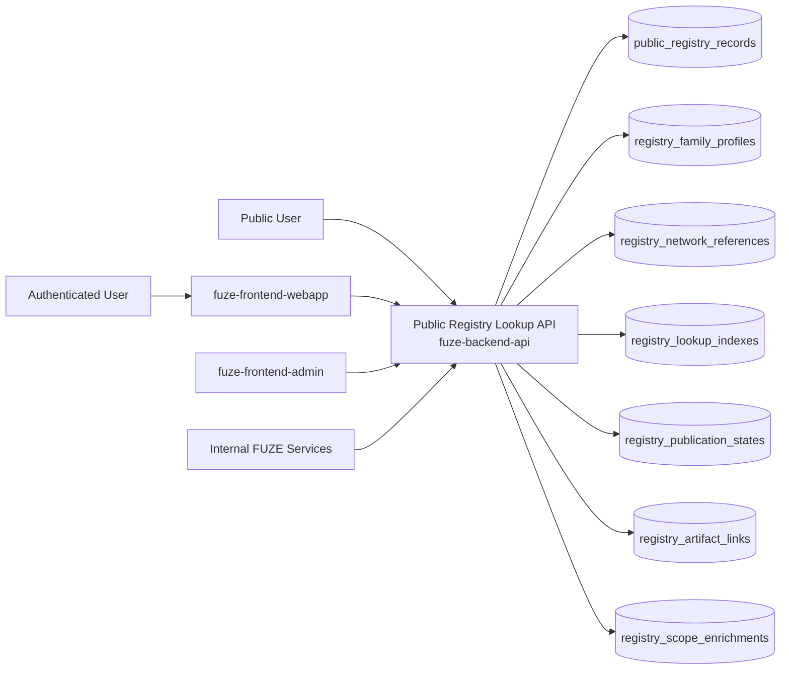
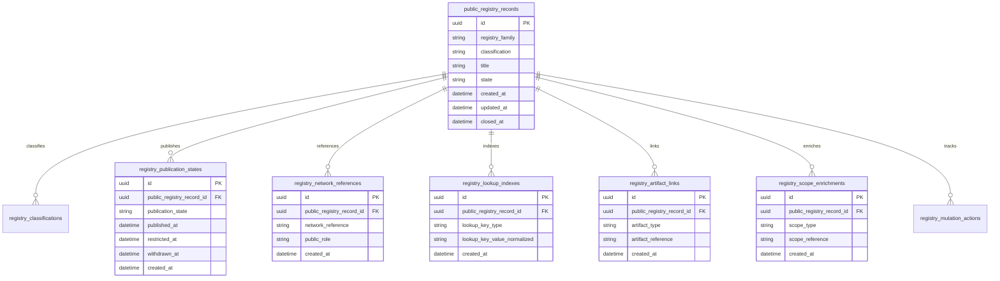
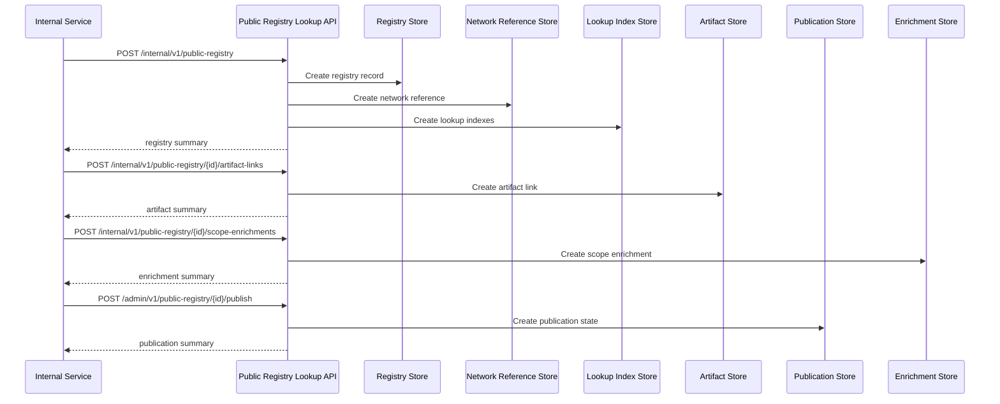

# PUBLIC_REGISTRY_LOOKUP_API_SPEC

## 1. Title

**PUBLIC_REGISTRY_LOOKUP_API_SPEC.md**

---

## 2. Document Metadata

- **Document Name:** PUBLIC_REGISTRY_LOOKUP_API_SPEC.md
- **API Classification:** public-read, authenticated-read, internal, event-driven
- **Owning Domain:** Public Registry Lookup Domain
- **Primary Implementing Repo:** `fuze-backend-api`
- **Primary System of Record:** public registry records, registry publication states, registry family profiles, registry artifact link records, lookup index records, correction-safe public registry lineage, and bounded actor-aware registry enrichments in `fuze-backend-api`
- **Status:** Draft for canonical source-of-truth approval
- **Purpose:** Define the production-grade API contract architecture for FUZE public registry lookup, including public contract and wallet registry discovery, public registry publication, lookup-safe indexability, artifact linkage, correction-safe registry lineage, and stable public-read registry surfaces across the platform
- **Canonical Folder:** `fuze.ac > docs > api-spec`

---

## 2.1 API Classification Header

- **API Classification:** public-read | authenticated-read | internal | event-driven
- **Owning Domain:** Public Registry Lookup Domain
- **Primary Implementing Repo:** `fuze-backend-api`
- **Primary System of Record:** public registry lookup and publication domain

---

## 3. Purpose

This document defines the canonical API specification for FUZE public registry lookup operations. It translates the governing FUZE platform architecture, public API rules, public contract and wallet registry rules, transparency and public trust rules, chain architecture, and API architecture rules into an implementation-ready API contract.

This API exists because FUZE requires a stable public lookup surface for contracts, wallets, network references, public role bindings, registry-linked artifacts, and status-oriented public discovery that is narrower than internal system truth and more structured than ad hoc document publication. Public registry lookup must therefore remain a deliberate public-read layer that supports external verification, ecosystem integration, public chain-role legibility, and transparency-first discovery without leaking unsafe internal control detail or silently redefining canonical owned domain truth.

Public registry lookup must preserve explicit distinction between:
- canonical registry-owned public records,
- linked public trust artifacts,
- and derived public discovery views.

Accordingly, this specification defines how public registry records, registry families, publication states, network references, artifact links, lookup indexes, and correction lineage are represented, and how public registry behavior remains auditable, idempotent, and architecture-consistent across FUZE.

---

## 4. Scope

This specification covers:

- public-read APIs for public contract lookup, public wallet lookup, public network-role lookup, registry-family discovery, and registry-linked trust-surface discovery
- authenticated read APIs for bounded actor-aware registry enrichments where policy allows
- internal APIs for public registry record creation, artifact linkage, publication, correction, supersession, and withdrawal
- publication-state handling for registry records, registry status views, and derived public lookup summaries
- event emission requirements for public registry lifecycle changes
- request, response, error, idempotency, versioning, audit, and database-shape rules for this domain

This specification does **not** redefine:

- chain deployment ownership in full detail
- multisig/timelock ownership in full detail
- transparency-report authoring in full detail
- public metadata ownership in full detail
- governance, treasury, or payout mutation flows
- low-level explorer integration implementation
- website rendering implementation
- SDK generation strategy in full detail

Those remain governed by their own source-of-truth specifications.

---

## 5. Source-of-Truth Inputs

### Primary FUZE docs and specs used

#### Highest-priority platform and ownership sources
- `SYSTEM_SPEC_INDEX.md`
- `DOCS_SPEC.md`
- `SYSTEM_BOUNDARY_AND_OWNERSHIP_SPEC.md`
- `SYSTEM_OVERVIEW_AND_BOUNDARIES_SPEC.md`
- `PLATFORM_ARCHITECTURE_SPEC.md`
- `DOMAIN_OWNERSHIP_MATRIX_SPEC.md`
- `DATA_MODEL_AND_ENTITY_OWNERSHIP_SPEC.md`
- `ONCHAIN_OFFCHAIN_RESPONSIBILITY_SPEC.md`

#### Primary registry / public-read / chain-surface sources
- `PUBLIC_CONTRACT_AND_WALLET_REGISTRY_SPEC.md`
- `PUBLIC_API_SPEC.md`
- `CHAIN_ARCHITECTURE_SPEC.md`
- `TRANSPARENCY_MODEL_SPEC.md`
- `TRANSPARENCY_REPORTING_SPEC.md`
- `API_ARCHITECTURE_SPEC.md`

#### Supporting runtime and control sources
- `EVENT_MODEL_AND_WEBHOOK_SPEC.md`
- `IDEMPOTENCY_AND_VERSIONING_SPEC.md`
- `MIGRATION_AND_BACKWARD_COMPATIBILITY_SPEC.md`
- `SECURITY_AND_RISK_CONTROL_SPEC.md`
- `MONITORING_ALERTING_AND_INCIDENT_RESPONSE_SPEC.md`
- `SECRETS_CONFIG_AND_ENVIRONMENT_SPEC.md`
- `AUDIT_LOG_AND_ACTIVITY_SPEC.md`

### Highest-priority interpretation applied

For this file, the most important governing interpretation is:

1. public registry lookup is a deliberate public verification and discovery surface and not a convenience export of internal contract data
2. backend owns canonical public registry publication truth
3. public registry lookup must remain explicitly separate from raw deployment truth, internal signer/control truth, and broader governance truth
4. contract addresses, wallet addresses, network roles, public labels, public registry statuses, and linked trust artifacts are suitable public lookup surfaces when intentionally designed
5. unsafe internal signer relationships, control-plane mutation capabilities, and private operational bindings must remain non-public
6. registry publication corrections and supersession must preserve historical intelligibility rather than silently rewriting public meaning

### Supporting external standards used only as guidance

- HTTP semantics for public-read and bounded authenticated-read APIs
- structured problem-details error design
- general registry-lookup, searchable-public-catalog, and public verification-surface patterns as supporting guidance

External guidance does not override FUZE source-of-truth documents.

---

## 6. Governing Architecture and Ownership Interpretation

This API belongs to the **Public Registry Lookup Domain** because it owns the canonical lifecycle of:

- public registry records,
- registry family classification,
- public network references,
- contract and wallet lookup publication,
- public role-label visibility,
- public-safe artifact linkage,
- and correction-safe public registry history.

This API is implemented primarily in `fuze-backend-api` because:

- backend owns durable public registry publication truth
- registry lookup must be built from canonical chain- and registry-owned domains without becoming a shadow owner of unrelated truth
- multiple trust-sensitive public verification surfaces require one stable public registry layer
- public trust requires structured, versionable registry outputs beyond ad hoc docs or explorer links
- audit generation and correction lineage must be centralized

This API is **not** owned by:

- `fuze-frontend-webapp`, because frontend may render registry lookup but must not own canonical registry publication truth
- `fuze-frontend-admin`, because admin may publish or supersede registry artifacts but must not own registry truth
- chain deployment domains, because deployment truth is one linked source but not the full public registry lookup layer
- transparency domain, because transparency artifacts may reference registry entries but do not own registry publication truth
- multisig/timelock domain, because public wallet labels may reference control roles without exposing full control mechanics
- public metadata domain, because metadata is a broader publication/discovery layer while registry lookup owns registry-specific verification semantics

### Architectural implications

- every public registry record must declare what registry surface it is
- every public registry record must preserve whether it is a primary registry record, supporting artifact, or derived public lookup summary
- public registry lookup may link to transparency reports, docs, chain references, or public artifacts without owning their deeper truth
- registry corrections, supersession, and withdrawal must preserve historical lineage rather than silently rewriting public meaning
- authenticated enrichments must remain bounded and must not turn registry lookup surfaces into hidden control interfaces

---

## 7. Domain Responsibilities

The Public Registry Lookup API domain is responsible for:

1. maintaining canonical public registry records and registry-family profiles
2. classifying registry records as primary public registry records, supporting artifacts, or derived lookup summaries
3. publishing stable public-read contract, wallet, network-role, and registry discovery surfaces
4. preserving explicit publication, withdrawal, and supersession state
5. linking registry records to transparency artifacts, public docs, public reports, and public chain references
6. exposing bounded authenticated-read registry enrichments where actor context is relevant
7. emitting public registry lifecycle events
8. generating audit lineage for sensitive publication and correction actions
9. preserving separation between public registry artifacts and private canonical domain truth
10. supporting public-safe degraded modes and trust-preserving registry behavior

The domain is not responsible for:

- owning raw deployment truth
- owning governance truth
- owning treasury or payout truth
- exposing arbitrary internal signer or operational control mappings publicly
- replacing domain-specific public APIs where richer contracts are needed
- performing canonical on-chain reconciliation as its source-of-truth function

---

## 8. Out of Scope

The following are out of scope for this API specification:

- arbitrary public write APIs
- address claim ownership mutation APIs
- signer-management APIs
- private control-graph APIs
- governance-, treasury-, or payout mutation flows
- end-user address management UX
- low-level static site generation
- internal audit investigation workflows

---

## 9. Canonical Entities and Data Ownership

### Durable entities

#### 9.1 public_registry_records
- **Owner:** Public Registry Lookup Domain
- **Purpose:** canonical public registry records
- **Nature:** source-of-truth durable entity

#### 9.2 registry_family_profiles
- **Owner:** Public Registry Lookup Domain
- **Purpose:** profiles for registry families such as contracts, wallets, network references, public role bindings, and supporting artifacts
- **Nature:** source-of-truth durable entity

#### 9.3 registry_classifications
- **Owner:** Public Registry Lookup Domain
- **Purpose:** classification of registry records as primary registry record, supporting artifact, or derived summary
- **Nature:** source-of-truth durable entity

#### 9.4 registry_publication_states
- **Owner:** Public Registry Lookup Domain
- **Purpose:** publication, visibility, withdrawal, and lifecycle state of registry records
- **Nature:** source-of-truth durable entity

#### 9.5 registry_network_references
- **Owner:** Public Registry Lookup Domain
- **Purpose:** explicit linkage from public registry records to public chain/network identities and role scopes
- **Nature:** source-of-truth durable lineage entity

#### 9.6 registry_lookup_indexes
- **Owner:** Public Registry Lookup Domain
- **Purpose:** normalized public lookup keys for address, label, contract family, and network-role discovery
- **Nature:** source-of-truth durable entity

#### 9.7 registry_artifact_links
- **Owner:** Public Registry Lookup Domain
- **Purpose:** links to transparency reports, public docs, explorer-safe refs, and supporting public artifacts
- **Nature:** source-of-truth durable lineage entity

#### 9.8 registry_scope_enrichments
- **Owner:** Public Registry Lookup Domain
- **Purpose:** bounded authenticated-read enrichment rules by actor or scope
- **Nature:** durable lineage entity

#### 9.9 registry_supersession_links
- **Owner:** Public Registry Lookup Domain
- **Purpose:** supersession and correction lineage between registry records
- **Nature:** durable lineage entity

#### 9.10 registry_discrepancy_cases
- **Owner:** Public Registry Lookup Domain
- **Purpose:** review and remediation records for stale, incorrect, incomplete, or inconsistent public registry data
- **Nature:** durable review/remediation entity

#### 9.11 registry_mutation_actions
- **Owner:** Public Registry Lookup Domain
- **Purpose:** high-level action records for create, publish, withdraw, correct, supersede, and resolve discrepancy
- **Nature:** durable action records with audit linkage

#### 9.12 registry_audit_events
- **Owner:** Audit / Activity domain, sourced by Public Registry Lookup Domain
- **Purpose:** immutable trail for sensitive registry actions
- **Nature:** durable audit records

### Derived or cached entities

#### 9.13 registry_index_views
- **Owner:** derived read-model layer
- **Purpose:** list/index projections for registry discovery surfaces
- **Nature:** derived

#### 9.14 registry_status_views
- **Owner:** derived read-model layer
- **Purpose:** public-safe registry summaries and bounded authenticated enrichments
- **Nature:** derived

#### 9.15 registry_discrepancy_views
- **Owner:** derived ops read-model layer
- **Purpose:** visibility into stale or inconsistent registry conditions
- **Nature:** derived

---

## 10. State Model and Lifecycle

### 10.1 registry record lifecycle

Possible states:

- `draft`
- `published`
- `restricted`
- `deprecated`
- `superseded`
- `archived`

### 10.2 publication-state lifecycle

Possible states:

- `unpublished`
- `published_public`
- `published_authenticated`
- `restricted`
- `withdrawn`

### 10.3 lookup-index lifecycle

Possible states:

- `active`
- `restricted`
- `superseded`
- `archived`

### 10.4 discrepancy lifecycle

Possible states:

- `opened`
- `under_review`
- `resolved`
- `failed`
- `closed`

Lifecycle notes:
- published does not imply ownership of linked chain or deployment domains
- public-safe and authenticated-only visibility must remain explicit
- lookup indexes are bounded discovery aids and not the same thing as internal ownership truth
- supersession must preserve historical public intelligibility
- withdrawn or restricted states must not silently erase audit lineage

---

## 11. API Surface Overview

The API surface is divided into three families:

### 11.1 Public-read APIs
Used by public users, holders, community observers, and integrators for:
- registry index retrieval
- registry detail retrieval
- contract and wallet lookup
- network-role public visibility
- registry-linked trust-surface discovery

### 11.2 Authenticated read APIs
Used by authenticated users and approved clients for:
- bounded registry enrichment
- actor- or scope-sensitive registry visibility where policy allows
- authenticated access to registry references not broadly public but safe within actor scope

### 11.3 Internal service and admin APIs
Used by trusted internal services and privileged operators for:
- creating and updating registry records
- publishing, correcting, superseding, restricting, or withdrawing records
- linking artifacts and maintaining correction lineage
- resolving registry discrepancies

---

## 12. Authentication and Authorization Model

### 12.1 Authentication posture by route family

#### Public-read routes
No authentication required:
- list registry records
- retrieve registry detail
- read public contract/wallet/network lookup where published

#### Authenticated read routes
Require valid authenticated session:
- read bounded authenticated-only registry
- read actor- or workspace-scoped registry enrichments where allowed

#### Internal service routes
Require internal service identity with explicit least privilege:
- create and update registry records
- attach artifact links
- refresh publication states
- read canonical truth

#### Admin routes
Require privileged operator identity plus reason-coded actions:
- publish, withdraw, restrict, supersede, and resolve discrepancy cases

### 12.2 Authorization checkpoints

Authorization must evaluate:
- caller identity and route family
- whether registry record is public, authenticated-only, or internal-only
- whether actor has scope visibility for authenticated enrichments
- whether service has create/publish/link/read privilege
- whether operator role is present for publication or correction actions
- whether current registry state allows requested mutation

### 12.3 Sensitive action rules

The following require heightened checks:
- publication of new public registry records
- publication of contracts, wallets, or public role bindings tied to trust-sensitive surfaces
- withdrawal or restriction of already public registry artifacts
- supersession of trust-sensitive published registry records
- discrepancy-resolution actions

---

## 13. API Endpoints / Interface Contracts

## 13.1 Public-Read APIs

### 13.1.1 `GET /v1/public-registry`
**Purpose:** list published public registry records  
**Caller Type:** public  
**Auth Expectation:** none  
**Query Parameters Summary:**
- optional `registry_family`
- optional `classification`
- optional `network`
- optional `status`
- pagination
**Response Summary:**
- registry record summaries
- family and classification labels
- publication state
- network summary
- timestamps
**Side Effects:** none
**Audit Requirements:** access logging optional
**Emitted Events:** none required

### 13.1.2 `GET /v1/public-registry/{public_registry_id}`
**Purpose:** retrieve one public registry record  
**Caller Type:** public  
**Response Summary:**
- registry detail
- classification and visibility information
- network reference
- lookup keys
- artifact links
- supersession guidance where relevant
- public-safe status references
**Side Effects:** none

### 13.1.3 `GET /v1/public-registry/lookup`
**Purpose:** look up one or more public registry records by normalized public query fields  
**Caller Type:** public  
**Query Parameters Summary:**
- optional `address`
- optional `label`
- optional `contract_family`
- optional `network`
- optional `public_role`
**Response Summary:**
- normalized lookup results
- matched public registry summaries
- lookup confidence and status hints where relevant
**Side Effects:** none

### 13.1.4 `GET /v1/public-registry/networks/{network_ref}`
**Purpose:** retrieve public registry summary for one network scope  
**Caller Type:** public  
**Response Summary:**
- network summary
- linked public registry records
- role-grouped discovery view
**Side Effects:** none

## 13.2 Authenticated Read APIs

### 13.2.1 `GET /v1/public-registry/me`
**Purpose:** retrieve bounded actor-aware registry enrichments where policy allows  
**Caller Type:** authenticated user  
**Auth Expectation:** valid authenticated session  
**Query Parameters Summary:**
- optional `registry_family`
- pagination
**Response Summary:**
- registry summary list
- actor-safe enrichment data
- scoped references where allowed
**Side Effects:** none

### 13.2.2 `GET /v1/public-registry/me/{public_registry_id}`
**Purpose:** retrieve one bounded actor-aware registry detail  
**Caller Type:** authenticated user  
**Response Summary:**
- base public registry detail
- bounded authenticated enrichment
- scoped artifact references where allowed
**Side Effects:** none

## 13.3 Internal Service APIs

### 13.3.1 `POST /internal/v1/public-registry`
**Purpose:** create draft public registry record  
**Caller Type:** internal trusted service  
**Auth Expectation:** service-to-service identity only  
**Request Body Summary:**
- `registry_family`
- `classification`
- `title`
- optional `summary`
- `network_reference`
- optional `lookup_keys`
- `idempotency_key`
**Response Summary:** registry record summary
**Side Effects:** creates draft registry record
**Idempotency Behavior:** required
**Audit Requirements:** registry creation audit
**Emitted Events:** `public_registry.record_created`

### 13.3.2 `POST /internal/v1/public-registry/{public_registry_id}/artifact-links`
**Purpose:** attach artifact links to one registry record  
**Caller Type:** internal trusted service  
**Request Body Summary:**
- `artifact_type`
- `artifact_reference`
- optional `artifact_summary`
- `idempotency_key`
**Response Summary:** artifact-link summary
**Side Effects:** creates artifact-link lineage
**Idempotency Behavior:** required
**Audit Requirements:** artifact-link audit
**Emitted Events:** `public_registry.artifact_linked`

### 13.3.3 `POST /internal/v1/public-registry/{public_registry_id}/scope-enrichments`
**Purpose:** attach bounded authenticated enrichment rules to one registry record  
**Caller Type:** internal trusted service  
**Request Body Summary:**
- `scope_type`
- `scope_reference`
- `enrichment_profile`
- `idempotency_key`
**Response Summary:** scope-enrichment summary
**Side Effects:** creates enrichment lineage
**Idempotency Behavior:** required
**Audit Requirements:** enrichment audit
**Emitted Events:** `public_registry.scope_enrichment_linked`

### 13.3.4 `GET /internal/v1/public-registry/{public_registry_id}`
**Purpose:** retrieve canonical public registry truth  
**Caller Type:** internal trusted service  
**Response Summary:** full registry record, classification, network references, lookup indexes, publication state, artifact links, enrichments, supersession lineage, and discrepancy lineage
**Side Effects:** none

## 13.4 Admin / Control-Plane APIs

### 13.4.1 `POST /admin/v1/public-registry/{public_registry_id}/publish`
**Purpose:** publish public registry record under controlled policy  
**Caller Type:** admin/operator  
**Request Body Summary:**
- `visibility_target`
- `reason_code`
- `operator_note`
- `idempotency_key`
**Response Summary:** published registry summary
**Side Effects:** publication state changes to published_public or published_authenticated
**Audit Requirements:** critical audit
**Emitted Events:** `public_registry.record_published`

### 13.4.2 `POST /admin/v1/public-registry/{public_registry_id}/withdraw`
**Purpose:** withdraw or restrict public registry visibility under controlled policy  
**Caller Type:** admin/operator  
**Request Body Summary:**
- `withdrawal_mode`
- `reason_code`
- `operator_note`
- `idempotency_key`
**Response Summary:** withdrawn registry summary
**Side Effects:** publication state changes to restricted or withdrawn
**Audit Requirements:** critical audit
**Emitted Events:** `public_registry.record_withdrawn`

### 13.4.3 `POST /admin/v1/public-registry/{public_registry_id}/supersede`
**Purpose:** supersede one public registry record with another under controlled policy  
**Caller Type:** admin/operator  
**Request Body Summary:**
- `replacement_public_registry_id`
- `reason_code`
- `operator_note`
- `idempotency_key`
**Response Summary:** supersession summary
**Side Effects:** creates supersession linkage and updates visible preference
**Audit Requirements:** critical audit
**Emitted Events:** `public_registry.record_superseded`

### 13.4.4 `POST /admin/v1/public-registry/discrepancies`
**Purpose:** resolve public registry discrepancy under controlled policy  
**Caller Type:** admin/operator  
**Request Body Summary:**
- `target_reference_type`
- `target_reference_id`
- `resolution_code`
- `operator_note`
- `related_case_id`
- `idempotency_key`
**Response Summary:** discrepancy-resolution summary
**Side Effects:** may correct, supersede, restrict, withdraw, or close discrepancy posture with preserved lineage
**Audit Requirements:** critical audit
**Emitted Events:** `public_registry.discrepancy_resolved`

---

## 14. Request Rules

### 14.1 General request rules
- all mutation-capable routes must require JSON requests with explicit content type
- all mutation routes must carry correlation IDs
- sensitive public registry mutations must carry idempotency keys
- admin mutations must require reason codes and operator notes
- no route may accept frontend-authored public registry truth as authoritative input

### 14.2 Sensitive-action request requirements
The following requests require heightened validation:
- publication of new public registry records
- publication of contracts, wallets, or public role bindings tied to trust-sensitive surfaces
- withdrawal or restriction of already public registry records
- supersession of trust-sensitive published registry artifacts
- discrepancy-resolution actions

Heightened validation may include:
- family/classification consistency checks
- network and lookup-key validation
- public-safe versus authenticated-only visibility checks
- operator role confirmation
- registry or reporting case linkage for sensitive actions

### 14.3 Scope integrity rule
Public registry mutations must target valid and authorized records, artifact links, enrichment records, lookup-index records, and discrepancy records. Services and operators must not mutate unrelated or unauthorized registry state.

### 14.4 Layer-separation rule
Public registry domain must remain the public verification-and-lookup layer. It must not collapse:
- deployment ownership,
- multisig/control ownership,
- transparency ownership,
- metadata ownership,
- or internal orchestration state
into one ambiguous registry object.

---

## 15. Response Rules

### 15.1 Success response rules
Successful responses must include:
- stable resource identifiers
- timestamps for created/updated state
- state/status values
- family and classification summaries
- network and lookup-key summaries where relevant
- artifact-link and publication-state summaries where relevant
- correlation references for mutations

### 15.2 Async-accepted response rules
If publication propagation, withdrawal, or discrepancy remediation is async, the response must:
- return accepted status
- include action or job ID
- provide follow-up status semantics

### 15.3 Terminal mutation response rules
Terminal mutation responses must clearly show:
- target registry record or discrepancy
- mutation type
- resulting publication state
- withdrawal, supersession, or restriction effects where relevant
- whether public-safe views may refresh asynchronously

### 15.4 Read response rules
Read responses must distinguish:
- canonical internal registry truth
- primary public registry records
- supporting artifacts
- derived public lookup summaries
- actor-scoped enrichment versus ordinary public registry lookup

---

## 16. Error Model

The API uses structured problem-details style error responses.

### 16.1 Required error fields
- `type`
- `title`
- `status`
- `code`
- `detail`
- `instance`
- `correlation_id`

### 16.2 Common error codes

#### Authorization / permission errors
- `PUBLIC_REGISTRY_PERMISSION_DENIED`
- `PUBLIC_REGISTRY_OPERATOR_PERMISSION_DENIED`
- `PUBLIC_REGISTRY_SERVICE_PERMISSION_DENIED`
- `PUBLIC_REGISTRY_AUDIENCE_PERMISSION_DENIED`

#### State conflict errors
- `PUBLIC_REGISTRY_RECORD_STATE_INVALID`
- `PUBLIC_REGISTRY_PUBLICATION_STATE_INVALID`
- `PUBLIC_REGISTRY_SUPERSESSION_CONFLICT`
- `PUBLIC_REGISTRY_VISIBILITY_CONFLICT`

#### Policy / safety errors
- `PUBLIC_REGISTRY_CLASSIFICATION_REQUIRED`
- `PUBLIC_REGISTRY_NETWORK_REFERENCE_REQUIRED`
- `PUBLIC_REGISTRY_VISIBILITY_NOT_ALLOWED`
- `PUBLIC_REGISTRY_PUBLICATION_NOT_ALLOWED`
- `PUBLIC_REGISTRY_WITHDRAWAL_NOT_ALLOWED`

#### Request integrity errors
- `PUBLIC_REGISTRY_IDEMPOTENCY_KEY_REQUIRED`
- `PUBLIC_REGISTRY_REQUEST_INVALID`
- `PUBLIC_REGISTRY_REQUEST_UNPROCESSABLE`

#### Dependency or provider errors
- `PUBLIC_REGISTRY_STORAGE_UNAVAILABLE`
- `PUBLIC_REGISTRY_CHAIN_REFERENCE_UNAVAILABLE`
- `PUBLIC_REGISTRY_REPORTING_UNAVAILABLE`

### 16.3 Error handling rules
- do not expose hidden internal governance, treasury, security, or audit detail in public or low-privilege responses
- do not imply canonical ownership of linked chain or deployment truth from registry publication alone
- distinguish classification/visibility failure from generic invalid state
- distinguish missing network reference from generic invalid request
- include retry guidance only where safe

---

## 17. Idempotency and Mutation Safety

### 17.1 Required idempotent mutations
The following mutation routes require idempotent behavior:
- registry record creation
- artifact-link attachment
- scope-enrichment attachment
- publish
- withdraw
- supersede
- discrepancy resolution

### 17.2 Idempotency key rules
- mutation requests must supply `Idempotency-Key`
- backend stores key scope, request hash, actor, and terminal result
- replay of same semantic request returns original terminal outcome
- replay of same key with different semantic request must fail with conflict

### 17.3 Mutation safety rules
- one canonical visible registry record per current registry lineage unless explicit supersession exists
- artifact and enrichment links must remain referentially consistent with registry family and classification
- public publication and authenticated publication must remain explicitly distinct
- corrections and supersession must preserve prior registry lineage
- withdrawal and restriction must preserve auditability and public explanation where appropriate

---

## 18. Versioning and Compatibility Rules

### 18.1 Versioning
This API family is versioned under `/v1`, `/internal/v1`, and `/admin/v1` route families.

### 18.2 Compatibility approach
- additive evolution preferred
- no silent semantic change to registry family, classification, network reference, or visibility meaning
- new registry families, lookup key types, and artifact-link types may be added without breaking existing contracts
- response fields may be added but existing meanings must remain stable

### 18.3 Breaking-change rules
Breaking changes include:
- changing the meaning of primary public registry record versus supporting artifact versus derived summary
- changing visibility semantics incompatibly
- removing critical network-reference, lookup-key, or artifact-link fields
- changing supersession or withdrawal semantics incompatibly

Such changes require explicit migration planning and version evolution.

### 18.4 Deprecation
Deprecated routes or fields must:
- be documented explicitly
- carry deprecation metadata where supported
- preserve compatibility windows long enough for public, first-party, and internal consumers

---

## 19. Event Emission and Webhook Behavior

This domain is event-capable.

### 19.1 Internal events
The Public Registry Lookup domain must emit canonical internal events such as:
- `public_registry.record_created`
- `public_registry.artifact_linked`
- `public_registry.scope_enrichment_linked`
- `public_registry.record_published`
- `public_registry.record_withdrawn`
- `public_registry.record_superseded`
- `public_registry.discrepancy_resolved`

### 19.2 Event payload minimums
Each event should contain:
- event ID
- event type
- occurred_at
- public registry ID
- registry family
- classification
- publication state
- actor type
- correlation ID
- reason code where applicable

### 19.3 External webhook posture
This specification does not expose general third-party outbound public registry webhooks by default. Any future outbound registry publication webhook surface must be narrow, security-reviewed, and governed by a separate contract.

---

## 20. Audit and Activity Requirements

The following actions must generate durable audit events:

- registry record creation
- artifact-link attachment
- publish, withdraw, supersede, and discrepancy actions
- scope-enrichment linkage where sensitivity requires
- other sensitive public registry mutations

### Required audit fields
- audit event ID
- actor type and actor reference
- target registry record / artifact link / discrepancy reference as applicable
- action type
- before/after summary where applicable
- reason code
- correlation ID
- operator note if operator action
- occurred_at

---

## 21. Data Model and Database Schema View

### 21.1 `public_registry_records`
- `id` PK
- `registry_family`
- `classification`
- `title`
- `summary`
- `state`
- `created_at`
- `updated_at`
- `closed_at` nullable

**Constraints:**
- index on (`registry_family`, `classification`)
- index on `state`

### 21.2 `registry_family_profiles`
- `id` PK
- `registry_family`
- `allowed_classifications_json`
- `lookup_profile_json`
- `visibility_profile_json`
- `created_at`
- `updated_at`

**Constraints:**
- unique `registry_family`

### 21.3 `registry_classifications`
- `id` PK
- `public_registry_record_id` FK -> `public_registry_records.id`
- `classification`
- `canonical_owner_reference`
- `created_at`

**Constraints:**
- index on `public_registry_record_id`

### 21.4 `registry_publication_states`
- `id` PK
- `public_registry_record_id` FK -> `public_registry_records.id`
- `publication_state`
- `published_at` nullable
- `restricted_at` nullable
- `withdrawn_at` nullable
- `created_at`

**Constraints:**
- index on `public_registry_record_id`
- index on `publication_state`

### 21.5 `registry_network_references`
- `id` PK
- `public_registry_record_id` FK -> `public_registry_records.id`
- `network_reference`
- `public_role`
- `created_at`

**Constraints:**
- index on `public_registry_record_id`

### 21.6 `registry_lookup_indexes`
- `id` PK
- `public_registry_record_id` FK -> `public_registry_records.id`
- `lookup_key_type`
- `lookup_key_value_normalized`
- `created_at`

**Constraints:**
- index on `public_registry_record_id`
- index on (`lookup_key_type`, `lookup_key_value_normalized`)

### 21.7 `registry_artifact_links`
- `id` PK
- `public_registry_record_id` FK -> `public_registry_records.id`
- `artifact_type`
- `artifact_reference`
- `artifact_summary_json`
- `created_at`

**Constraints:**
- index on `public_registry_record_id`

### 21.8 `registry_scope_enrichments`
- `id` PK
- `public_registry_record_id` FK -> `public_registry_records.id`
- `scope_type`
- `scope_reference`
- `enrichment_profile_json`
- `created_at`

**Constraints:**
- index on `public_registry_record_id`

### 21.9 `registry_supersession_links`
- `id` PK
- `from_public_registry_id` FK -> `public_registry_records.id`
- `to_public_registry_id` FK -> `public_registry_records.id`
- `reason_code`
- `created_at`

**Constraints:**
- unique (`from_public_registry_id`, `to_public_registry_id`)

### 21.10 `registry_discrepancy_cases`
- `id` PK
- `target_reference_type`
- `target_reference_id`
- `state`
- `resolution_code` nullable
- `created_at`
- `updated_at`
- `closed_at` nullable

### 21.11 `registry_mutation_actions`
- `id` PK
- `target_reference_type`
- `target_reference_id`
- `action_type`
- `state`
- `reason_code`
- `operator_note` nullable
- `requested_by_actor_type`
- `requested_by_actor_id`
- `created_at`
- `executed_at` nullable
- `closed_at` nullable
- `correlation_id`

### 21.12 `idempotency_records`
- `id` PK
- `idempotency_key`
- `scope_family`
- `actor_reference`
- `request_hash`
- `response_hash`
- `terminal_status`
- `created_at`
- `expires_at`

### 21.13 `audit_log_entries`
Domain-sourced audit records written into the audit domain.

### Normalization notes
- canonical public registry truth stays in registry records, family profiles, classifications, publication states, network references, lookup indexes, artifact links, enrichments, supersession links, and discrepancy records
- deployment, transparency, metadata, and control canonical truths remain external and are referenced rather than duplicated
- public-safe views must derive from canonical public registry truth filtered by publication state and visibility class
- actor-scoped enrichments remain bounded overlays rather than new canonical registry owners

### Reconciliation notes
- one visible public registry record should reconcile to one current registry lineage under current preference
- publication state must reconcile with allowed family/classification combinations
- network references and lookup indexes must reconcile to linked public registry truth
- discrepancy cases must preserve review lineage for stale or conflicting public registry conditions

---

## 22. Architecture Diagram — Mermaid flowchart



---

## 23. Data Design — Mermaid Diagram



---

## 24. Flow View

### 24.1 Happy path — publish primary public registry record
1. internal service creates draft registry record
2. network reference, lookup indexes, and artifact links are attached to docs, reports, or other public artifacts
3. operator validates family/classification and publication intent
4. admin publishes record publicly
5. public index, lookup, network, and detail surfaces become available
6. external readers can discover the record as primary registry record, supporting artifact, or derived summary

### 24.2 Happy path — authenticated enrichment
1. registry record is already published or authenticated-visible
2. bounded actor/scope enrichment is linked internally
3. authenticated actor requests the registry artifact
4. backend returns base public registry plus scoped enrichment where policy allows
5. actor sees additional safe context without gaining hidden control access

### 24.3 Alternate path — superseding an older registry publication
1. older registry record must be replaced or corrected
2. replacement record is created and validated
3. admin supersedes the older record
4. previous record remains historically linked and interpretable
5. new record becomes current visible preference

### 24.4 Failure path — invalid classification or publication posture
1. registry record is created or modified
2. backend detects missing classification, invalid family/classification combination, or disallowed visibility posture
3. request is rejected or record remains unpublished
4. no unsafe public registry surface is produced

### 24.5 Failure and remediation path — stale or incorrect public registry
1. linked network ref, role label, or public artifact changes or registry record becomes stale/inconsistent
2. admin opens discrepancy-resolution flow
3. backend preserves existing lineage
4. corrected or superseding registry record is created
5. discrepancy closes with preserved history

### 24.6 Degraded-mode path
1. linked explorer-safe reference, doc, or trust artifact is delayed or degraded
2. public registry surface stays available where safe
3. backend communicates freshness or visibility degradation explicitly
4. canonical truth mutation is not implied by degraded presentation

### 24.7 Retry behavior
- duplicate registry creation returns same canonical record result
- duplicate artifact or enrichment attachment returns same lineage result where applicable
- duplicate publish/withdraw/supersede/discrepancy actions return same terminal action result

---

## 25. Data Flows — Mermaid sequenceDiagram



---

## 26. Security and Risk Controls

1. **Public registry truth is backend-owned**  
   Frontends and informal publication channels may not authoritatively define public registry truth.

2. **Registry lookup is not a control plane**  
   Public registry surfaces must support trust, verification, and discovery, not expose governance, treasury, signer control, or internal orchestration controls.

3. **Classification clarity is mandatory**  
   Public registry must explicitly distinguish primary registry records, supporting artifacts, and derived public summaries so external consumers do not mistake one for another.

4. **Public-safe visibility discipline**  
   Publication state must keep public, authenticated-only, and internal-only registry clearly separated.

5. **Rate limits and abuse controls**  
   Public registry surfaces require public-surface protections such as rate limiting, actor/token throttling, input hardening, and stable pagination expectations.

6. **Backward-compatibility discipline**  
   Public registry surfaces must follow explicit versioning and conservative compatibility rules because public interfaces carry strong ecosystem trust obligations.

7. **Audit-linked publication**  
   Publication, withdrawal, and supersession of registry artifacts must remain traceable into internal audit systems.

8. **Secrets/config boundary discipline**  
   Public registry may include only values intentionally classed as public and must not leak confidential or control-sensitive configuration.

9. **Trust-preserving degraded modes**  
   Public registry should preserve the difference between freshness lag, external reference lag, and canonical truth mutation.

10. **Historical intelligibility**  
    Corrections and supersession must preserve lineage so public trust surfaces remain historically interpretable.

---

## 27. Operational Considerations

- public registry index, lookup, network, and detail reads should be highly available
- publication-state changes and lookup-index correctness are trust-sensitive and must be monitored
- contract-, wallet-, and role-binding-sensitive registry surfaces should surface clearly to ops views
- supersession and discrepancy workflows should be observable and reviewable
- monitoring should alert on:
  - stale public registry records tied to trust-sensitive surfaces
  - publication failures for trusted registry artifacts
  - public/private visibility divergence
  - broken public artifact references
  - public-safe view inconsistency versus canonical registry state
  - degraded public trust surfaces during active ecosystem verification periods

---

## 28. Acceptance Criteria

1. The API preserves the distinction between public registry truth, chain/deployment truth, control truth, transparency truth, and internal domain truth.
2. Only `fuze-backend-api` owns canonical public registry publication truth.
3. Public registry records, family profiles, classifications, publication states, network references, lookup indexes, artifact links, enrichments, supersession links, and discrepancy records are durable and backend-owned.
4. Public and authenticated routes expose only bounded safe public registry views.
5. Registry family, classification, network reference, lookup keys, and visibility posture are explicit and validated.
6. Public registry distinguishes primary registry records, supporting artifacts, and derived summary models.
7. Publication, withdrawal, supersession, and discrepancy actions preserve immutable lineage.
8. Public registry mutation actions are idempotent and auditable.
9. Internal and admin public registry routes are least-privilege and backend-only.
10. Admin routes require reason-coded privileged authorization.
11. Event emissions exist for major public registry mutations.
12. Database schema separates records, family profiles, classifications, publication states, network references, lookup indexes, artifact links, enrichments, supersession links, and discrepancy layers.
13. Public-safe consumers can rely on public registry views without needing internal platform knowledge.
14. Public registry supports rate-limited, versioned, supportable external integration behavior.
15. Mermaid diagrams remain consistent with prose and data model.

---

## 29. Test Cases

### 29.1 Positive cases
1. Internal service creates draft public registry record successfully.
2. Internal service attaches artifact link successfully.
3. Internal service attaches scope enrichment successfully.
4. Admin publishes public registry successfully.
5. Public user reads published registry index successfully.
6. Public user reads one published registry record successfully.
7. Public user performs address/label lookup successfully.
8. Admin supersedes stale registry successfully.

### 29.2 Negative cases
9. Public user cannot access unpublished or internal-only registry.
10. Internal service without write privilege cannot create registry record.
11. Publication without valid classification returns `PUBLIC_REGISTRY_CLASSIFICATION_REQUIRED`.
12. Publication without required network reference returns `PUBLIC_REGISTRY_NETWORK_REFERENCE_REQUIRED`.
13. Disallowed visibility target returns `PUBLIC_REGISTRY_VISIBILITY_NOT_ALLOWED`.
14. Withdrawal attempt in incompatible state returns `PUBLIC_REGISTRY_WITHDRAWAL_NOT_ALLOWED`.

### 29.3 Authorization cases
15. Ordinary public or authenticated user cannot call admin registry publication APIs.
16. Internal service without artifact-link privilege cannot attach artifact links.
17. Operator without publication privilege cannot publish registry.
18. Published public registry does not imply canonical ownership of linked deployment/control truth.

### 29.4 Idempotency and replay cases
19. Repeating registry creation with same idempotency key returns original registry result.
20. Repeating artifact-link attachment with same idempotency key returns original linkage result.
21. Repeating publish or withdraw with same idempotency key returns original terminal action result.
22. Repeating supersede or discrepancy resolution with same idempotency key returns original terminal action result.

### 29.5 Concurrency cases
23. Concurrent lookup-index updates preserve one explicit current linkage lineage and duplicate-safe outcomes where appropriate.
24. Concurrent publish and withdraw actions preserve explicit lifecycle ordering without hidden overwrite.
25. Concurrent supersede and discrepancy actions preserve explicit visible lineage without ambiguity.

### 29.6 Recovery / admin cases
26. Stale or mislinked public registry can be corrected under controlled policy with explicit lineage.
27. Superseded public registry remains historically linked to the original record.
28. Discrepancy resolution closes network ref, visibility, or reporting conflict with preserved audit history.

### 29.7 Event and audit cases
29. Successful registry creation emits `public_registry.record_created`.
30. Successful artifact-link attachment emits `public_registry.artifact_linked`.
31. Successful publication emits `public_registry.record_published`.
32. Successful withdrawal emits `public_registry.record_withdrawn`.
33. Successful discrepancy resolution emits `public_registry.discrepancy_resolved` with critical audit lineage.

---

## 30. Open Questions or Explicit Deferred Decisions

1. Exact registry-family taxonomy code sets are deferred.
2. Exact normalized lookup-key taxonomy is deferred.
3. Exact public-safe disclosure depth for role bindings is deferred.
4. Exact actor-scoped enrichment taxonomy is deferred.
5. Exact discrepancy taxonomy for registry/publication conflicts is deferred.
6. Exact partner-oriented registry quota strategy is deferred.

---

## 31. Implementation Notes for `fuze-backend-api`

Recommended backend module layout:

```text
modules/platform/
  public-registry/
  public-metadata/
  public-transparency/
  chain-registry/
  audit-log/
  control-plane/
  integrations/
```

Implementation guidance:
- keep registry records, family profiles, network references, lookup indexes, publication state, artifact links, and supersession logic in one canonical domain service
- perform family/classification/visibility/network-reference/lookup-key checks inside the commit boundary
- keep publish, withdraw, supersede, and discrepancy actions explicit and idempotent
- treat admin remediations as domain actions, not ad hoc row edits
- emit events only after canonical state commit succeeds
- publish public-safe registry views from canonical truth; do not let derived views mutate registry state

---

## 32. Frontend Consumption Notes

### For `fuze-frontend-webapp`
- may read public registry and bounded authenticated enrichments where approved
- must not infer canonical domain ownership from public registry alone
- must treat backend public registry responses as authoritative for publication state and trust-surface semantics
- should clearly distinguish primary registry records, supporting artifacts, and derived summary views when visible

### For `fuze-frontend-admin`
- may trigger privileged publish, withdraw, supersede, and discrepancy actions only through backend admin APIs
- must require operator reason input for sensitive mutations
- must not directly mutate canonical public registry truth client-side
- should present immutable registry history and correction lineage separately from current visible state

---

## 33. Contract Derivation Notes

### OpenAPI / AsyncAPI
This spec should later derive into:
- public registry index/detail/lookup/network read operations
- authenticated registry enrichment read operations
- internal registry creation, artifact-link, and enrichment operations
- admin publish / withdraw / supersede / discrepancy operations
- shared problem-details schema
- public registry lifecycle events in AsyncAPI

### Future `fuze-sdk`
Future `fuze-sdk` packages may derive:
- public registry lookup helpers
- public network discovery helpers
- typed registry-family, classification, lookup-key, and publication-state summary models
- problem-error models for public registry outcomes

The SDK must derive from approved API contracts and must not become the source of truth over this narrative specification.
