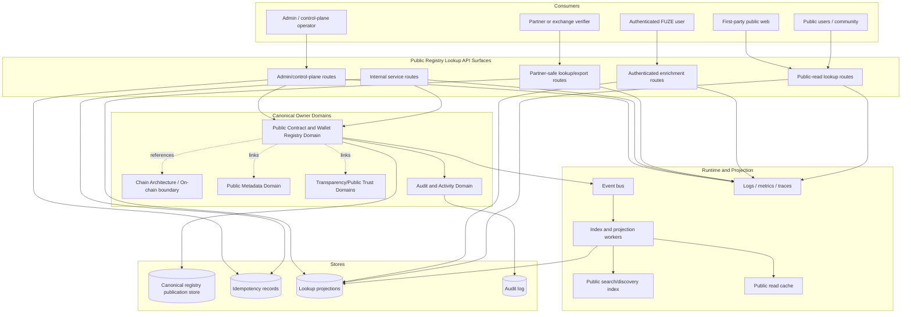
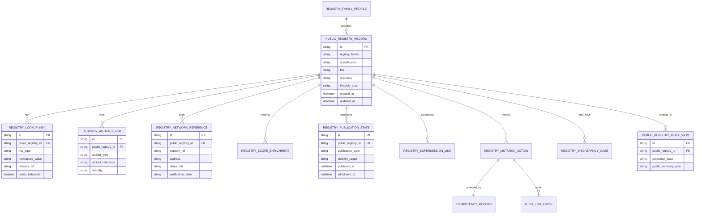
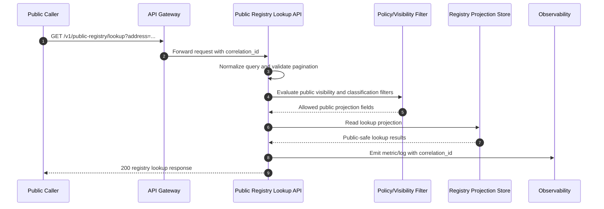
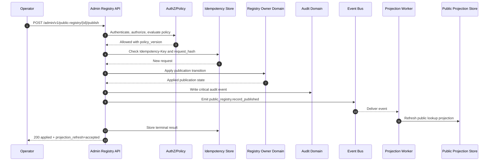

# PUBLIC_REGISTRY_LOOKUP_API_SPEC.md

## Document Metadata

- **Document Name:** `PUBLIC_REGISTRY_LOOKUP_API_SPEC.md`
- **Document Type:** FUZE API SPEC v2 / production-grade interface-contract specification
- **Status:** Draft for canonical source-of-truth approval
- **Version:** 2.0.0
- **Effective Date:** 2026-04-25
- **Last Updated:** 2026-04-25
- **Reviewed On:** 2026-04-25
- **Document Owner:** FUZE Public Registry Lookup API Domain; named individual owner not explicitly specified in retrieved governing materials
- **Approval Authority:** Not explicitly specified; approval remains governed by FUZE refined-spec and API-spec approval workflow
- **Review Cadence:** SHOULD be reviewed quarterly and whenever public registry semantics, public API posture, chain architecture, transparency posture, public metadata posture, wallet/contract registry governance, or external verification requirements materially change
- **Governing Layer:** API contract layer / public-read and public-trust companion API layer
- **Parent Registry:** FUZE API SPEC v2 Canonical File Registry
- **Upstream Semantic Registry:** `REFINED_SYSTEM_SPEC_INDEX.md`
- **Upstream API Registry:** `API_SPEC_INDEX.md`
- **Primary Audience:** Backend API engineers, platform architects, public API authors, registry/public-trust service owners, frontend engineers, partner-integration authors, security, audit, compliance, operations, implementation-contract authors, OpenAPI/SDK authors
- **Primary Purpose:** Define the production-grade API contract for FUZE public registry lookup, including public registry list/detail/lookup surfaces, bounded authenticated enrichments, internal publication support APIs, admin/control-plane publication and correction operations, registry events, auditability, idempotency, derived read-model boundaries, and downstream contract guardrails.
- **Primary Upstream References:** `REFINED_SYSTEM_SPEC_INDEX.md`, `PUBLIC_CONTRACT_AND_WALLET_REGISTRY_SPEC.md`, `API_ARCHITECTURE_SPEC.md`, `PUBLIC_API_SPEC.md`, `PUBLIC_METADATA_API_SPEC.md`, `PUBLIC_TRANSPARENCY_API_SPEC.md`, `CHAIN_ARCHITECTURE_SPEC.md`, `ONCHAIN_OFFCHAIN_RESPONSIBILITY_SPEC.md`, `DATA_CLASSIFICATION_AND_HANDLING_SPEC.md`, `SEARCH_INDEXING_AND_DISCOVERY_SPEC.md`, `FILE_OBJECT_AND_ARTIFACT_STORAGE_SPEC.md`, `AUDIT_LOG_AND_ACTIVITY_SPEC.md`, `SECURITY_AND_RISK_CONTROL_SPEC.md`, `EVENT_MODEL_AND_WEBHOOK_SPEC.md`, `IDEMPOTENCY_AND_VERSIONING_SPEC.md`, `MIGRATION_AND_BACKWARD_COMPATIBILITY_SPEC.md`
- **Primary Downstream Dependents:** Public registry lookup service implementation, public web registry pages, public metadata surfaces, transparency/public-trust pages, partner/exchange verification integrations, OpenAPI and SDK artifacts, public search/discovery indexes, admin registry tools, registry publication events, audit/reconciliation tooling, implementation-contract specs
- **API Surface Families Covered:** public-read, authenticated-read, partner-read where explicitly approved, internal service, admin/control-plane, event/async, reporting/export, public-read projection
- **API Surface Families Excluded:** arbitrary public writes, private signer/custody control APIs, wallet-link mutation APIs, governance/treasury execution APIs, raw chain indexer APIs, internal security investigation APIs, unrestricted partner bulk export, smart-contract ABI/execution APIs
- **Canonical System Owner(s):** Public Contract and Wallet Registry Domain owns registry publication semantics; API Architecture governs interface posture; Public API governs public exposure posture; Chain Architecture and On-Chain/Off-Chain Responsibility govern chain boundary interpretation
- **Canonical API Owner:** Public Registry Lookup API Domain in coordination with Platform API Architecture
- **Supersedes:** Earlier v1 `PUBLIC_REGISTRY_LOOKUP_API_SPEC.md` interpretations that were less explicit about refined-system precedence, truth classes, public/internal/admin separation, derived read-model limits, idempotency, audit, OpenAPI/AsyncAPI guardrails, and production-grade testability
- **Superseded By:** None currently defined
- **Related Decision Records:** Not explicitly specified in retrieved governing materials
- **Canonical Status Note:** This document is an API SPEC v2 contract. It derives from refined system semantics and MUST NOT redefine the semantic truth owned by `PUBLIC_CONTRACT_AND_WALLET_REGISTRY_SPEC.md` or adjacent refined system specs.
- **Implementation Status:** Ready for implementation planning and downstream contract derivation; concrete route schemas, database migrations, and generated OpenAPI/AsyncAPI files remain downstream artifacts
- **Approval Status:** Draft pending FUZE approval workflow
- **Change Summary:** Upgraded public registry lookup into a production-grade API SPEC v2 document with explicit public/read/admin/event boundaries, truth-class taxonomy, conflict rules, request/response/error/idempotency/audit/versioning rules, diagrams, flow views, acceptance criteria, test cases, and implementation-contract guardrails.

## Purpose

This specification defines the canonical FUZE API contract for public registry lookup. The API exists to expose a stable, public-safe verification and discovery surface for FUZE official contracts, designated public wallets, public network references, public role bindings, lookup-safe registry indexes, and registry-linked public trust artifacts.

The Public Registry Lookup API MUST remain a bounded public-read and public-trust interface. It is not a raw dump of internal deployment state, wallet inventories, treasury controls, signer topology, governance decisions, payout internals, or audit evidence. It exposes deliberately published registry records and lookup projections that are derived from canonical registry publication truth.

This API owns interface-contract expression only. The upstream refined system specifications own semantic truth.

## Scope

This specification governs:

1. Public-read registry list, detail, lookup, and network-scope APIs.
2. Bounded authenticated registry enrichment APIs where policy permits actor-aware context.
3. Partner-safe lookup behavior when explicitly approved by a narrower partner contract.
4. Internal service APIs for creating draft registry lookup records, linking artifacts, maintaining lookup indexes, and attaching bounded enrichments.
5. Admin/control-plane APIs for publishing, withdrawing, restricting, superseding, correcting, and resolving registry lookup discrepancies.
6. Event and async behavior for registry publication, supersession, withdrawal, index refresh, and discrepancy remediation.
7. Request, response, error, status, idempotency, retry, rate-limit, audit, migration, and compatibility posture for this API family.
8. Derived read-model, cache, export, search, and public presentation boundaries for public registry lookup.
9. OpenAPI, AsyncAPI, SDK, implementation-contract, and test derivation guardrails.

## Out of Scope

This specification does not govern:

1. Smart-contract deployment, ABI, contract execution, or chain-native state.
2. Private wallet custody, signer inventory, hot/cold wallet operation, key management, or signer-control topology.
3. Account-to-wallet linking, user proof-of-control, or wallet-aware user lifecycle.
4. Treasury approval, vault action policy, multisig/timelock execution, or governance decision truth.
5. Profit participation, eligibility calculation, payout ledger truth, payout execution truth, or holder-specific claim truth.
6. Transparency report authoring, investor/community reporting, or public metadata publication beyond registry-linked artifact references.
7. Raw search-engine ranking internals, storage bucket/key layouts, static site implementation, or partner onboarding procedures.
8. Generic public write APIs for external users to create official registry truth.

## Design Goals

1. Provide a stable public verification and discovery surface for official FUZE contract and wallet registry records.
2. Preserve the refined public registry rule that registry lookup is public publication truth, not chain-native truth, wallet-link truth, or control truth.
3. Keep public read, authenticated read, internal service, admin/control, event, reporting/export, and derived projection surfaces explicit.
4. Prevent frontend, partner, docs, or cache layers from becoming shadow registry owners.
5. Require idempotency, audit lineage, reason codes, correlation IDs, and policy checks for every sensitive mutation.
6. Support OpenAPI/SDK generation without allowing generated clients to imply broader authority than this API allows.
7. Make public registry correction and supersession historically intelligible instead of silent overwrite.
8. Support abuse-resistant public lookup behavior while preserving external usability.
9. Make acceptance criteria and tests concrete enough for implementation QA and production-readiness review.

## Non-Goals

1. This API does not prove live chain state, balances, contract safety, or signer control.
2. This API does not expose all wallets or contracts FUZE may use internally.
3. This API does not authorize treasury, governance, payout, or operational actions.
4. This API does not replace transparency reports, public metadata, public payout status, or chain architecture APIs.
5. This API does not allow public callers to publish, claim, correct, or mutate official registry state directly.
6. This API does not provide raw internal evidence, private audit details, security posture, or incident information.

## Core Principles

### 1. Refined-Semantics-First Principle

API behavior MUST derive from refined system semantics. If an API convenience conflicts with refined public registry semantics, the API design is wrong.

### 2. Public Registry Lookup Is a Publication Layer

Public registry lookup communicates FUZE-approved public designation and lookup metadata. It does not replace chain-native facts, wallet-link facts, control-plane facts, treasury facts, governance facts, payout facts, or transparency-report facts.

### 3. Public Read Does Not Mean Public Write

Unauthenticated callers MAY read intentionally published public registry records. They MUST NOT create, correct, publish, withdraw, supersede, or otherwise mutate registry truth.

### 4. Derived Lookup Discipline

Lookup indexes, public search projections, cached views, partner exports, and website renderings are derived from canonical registry publication records. They MUST NOT become canonical mutation owners.

### 5. Explicit Visibility and Lifecycle

Every registry lookup record MUST carry explicit publication, visibility, classification, supersession, and correction state. Silent overwrite is forbidden.

### 6. Chain-Adjacent Boundary

Addresses, contract references, and network references may be chain-adjacent inputs or links. They are not sufficient to establish official registry truth until normalized, verified, classified, approved, and published by the registry domain.

### 7. Admin Actions Are Bounded

Operator/admin actions MUST be separate from public and ordinary application APIs, reason-coded, policy-constrained, idempotent, audited, observable, and reversible or supersession-safe where applicable.

### 8. Public-Safe Minimization

Public responses MUST expose the minimum stable public-safe information needed for verification and discovery. Private signer topology, security controls, internal notes, and raw evidence remain non-public unless an approved publication artifact explicitly exposes them.

## Canonical Definitions

- **Public Registry Lookup Record:** API-facing resource representing a published or publication-managed registry entry or lookup target.
- **Registry Publication Truth:** Canonical off-chain truth about whether FUZE publicly designates a contract, wallet, network reference, or role binding.
- **Lookup Index:** Derived, normalized, queryable representation of canonical registry records for address, label, network, role, alias, or artifact discovery.
- **Registry Family:** Classification family such as `contract`, `wallet`, `network_reference`, `role_binding`, `artifact_reference`, or another approved family.
- **Registry Role:** Public-safe role label such as token contract, payout wallet, reserve wallet, foundation address, multisig, timelock, product contract, or network role where approved.
- **Network Reference:** Public-safe network identifier and chain/context binding, such as Ethereum mainnet or Base, represented without implying ownership of chain-native truth.
- **Artifact Link:** Public-safe link to a transparency artifact, metadata record, public documentation, report, explorer page, or public status record.
- **Supersession:** Historical lineage indicating that one public registry record replaces or corrects another without erasing prior public meaning.
- **Withdrawal:** Visibility reduction for a registry record that should no longer appear as active public designation, while preserving audit and lineage.
- **Discrepancy Case:** Review/remediation object for stale, inconsistent, contested, incomplete, or unsafe registry lookup state.
- **Actor-Aware Enrichment:** Authenticated-only bounded information layered on top of a public registry lookup response where policy allows.

## Truth Class Taxonomy

The API MUST distinguish the following truth classes:

1. **Semantic truth:** Owned by refined system specs, especially Public Contract and Wallet Registry.
2. **API contract truth:** Owned by this specification; route families, request/response/error/status behavior, idempotency, versioning, and interface obligations.
3. **Registry publication truth:** Canonical off-chain public designation and visibility state.
4. **Chain-native truth:** Contract state, balances, transaction history, on-chain roles, and chain events.
5. **Wallet-link truth:** Account-to-wallet linkage, proof-of-control, and user wallet lifecycle.
6. **Governance/treasury/control truth:** Approval, vault action, multisig, timelock, treasury, and foundation control semantics.
7. **Verification-input truth:** Evidence and observations considered before registry publication.
8. **Runtime truth:** In-flight requests, jobs, retries, and propagation state.
9. **Event/async truth:** Durable registry lifecycle events and asynchronous index/projection updates.
10. **Projection/reporting truth:** Public lookup indexes, public search results, partner exports, public status summaries, and derived caches.
11. **Public metadata truth:** Broader public metadata publication records that may link to registry records but do not own registry semantics.
12. **Presentation truth:** Labels, formatting, summaries, website cards, and SDK convenience views.
13. **Audit truth:** Immutable activity/evidence records for sensitive registry actions.

These truth classes MUST NOT be collapsed.

## Architectural Position in the Spec Hierarchy

This API spec sits below:

- `REFINED_SYSTEM_SPEC_INDEX.md`
- `PUBLIC_CONTRACT_AND_WALLET_REGISTRY_SPEC.md`
- `API_ARCHITECTURE_SPEC.md`
- `PUBLIC_API_SPEC.md`
- `ONCHAIN_OFFCHAIN_RESPONSIBILITY_SPEC.md`
- `CHAIN_ARCHITECTURE_SPEC.md`
- `DATA_CLASSIFICATION_AND_HANDLING_SPEC.md`
- `AUDIT_LOG_AND_ACTIVITY_SPEC.md`
- `SECURITY_AND_RISK_CONTROL_SPEC.md`
- `IDEMPOTENCY_AND_VERSIONING_SPEC.md`
- `MIGRATION_AND_BACKWARD_COMPATIBILITY_SPEC.md`

It is adjacent to:

- `PUBLIC_METADATA_API_SPEC.md`
- `PUBLIC_TRANSPARENCY_API_SPEC.md`
- `PUBLIC_PAYOUT_STATUS_API_SPEC.md`
- `PUBLIC_PRODUCT_CATALOG_API_SPEC.md`
- `PUBLIC_CHAIN_REFERENCE_API_SPEC.md`
- `PUBLIC_PLATFORM_STATUS_API_SPEC.md`

It sits above downstream OpenAPI, AsyncAPI, SDK, implementation-contract, storage, route-handler, read-model, dashboard, and QA artifacts for public registry lookup.

## Upstream Semantic Owners

1. `PUBLIC_CONTRACT_AND_WALLET_REGISTRY_SPEC.md` owns public registry publication semantics, registry roles, verification, supersession, visibility, and public trust-safe registry meaning.
2. `API_ARCHITECTURE_SPEC.md` owns shared API surface-family posture, owner-domain mutation discipline, accepted-state semantics, and derived-read discipline.
3. `PUBLIC_API_SPEC.md` owns public exposure posture, public compatibility expectations, abuse controls, and public API safety.
4. `CHAIN_ARCHITECTURE_SPEC.md` and `ONCHAIN_OFFCHAIN_RESPONSIBILITY_SPEC.md` own chain/native vs off-chain/publication boundary meaning.
5. `PUBLIC_METADATA_API_SPEC.md` owns broader public metadata API contract behavior; it may reference registry records but does not own registry lookup semantics.
6. `SECURITY_AND_RISK_CONTROL_SPEC.md`, `DATA_CLASSIFICATION_AND_HANDLING_SPEC.md`, and `AUDIT_LOG_AND_ACTIVITY_SPEC.md` own cross-cutting security, disclosure, classification, and audit requirements.

## API Surface Families

### Public-Read Surface

Unauthenticated, intentionally public lookup endpoints for published registry data. This surface MUST be read-only and public-safe.

### Authenticated-Read Surface

Bounded read endpoints for actor-aware registry enrichments. This surface MAY expose additional context only when authorization, scope, and classification permit.

### Partner-Read Surface

Optional and explicitly approved partner read feeds or filtered lookup contracts. Partner access MUST remain narrower than internal service access and MUST NOT imply admin power.

### Internal Service Surface

Service-to-service routes for draft creation, index management, artifact linkage, enrichment linkage, and canonical internal reads. These routes require service identity and least privilege.

### Admin / Control-Plane Surface

Privileged operator routes for publish, restrict, withdraw, supersede, correct, and resolve discrepancies. These routes require operator authorization, reason codes, idempotency, audit, and policy evaluation.

### Event / Async Surface

Internal events and async jobs for record publication, index refresh, propagation, discrepancy remediation, and downstream projection updates. External webhooks are not enabled by default.

### Reporting / Export Surface

Derived public-safe and partner-safe exports generated from canonical registry records. Exports MUST remain subordinate to canonical registry truth.

## System / API Boundaries

1. Public lookup APIs read public-safe registry projections and, where needed, canonical registry records filtered by publication policy.
2. Internal service APIs may create or prepare registry records but MUST NOT bypass canonical registry publication rules.
3. Admin APIs may transition publication state only with explicit reason code, policy version, idempotency key, audit lineage, and actor identity.
4. Event handlers and index workers may project or refresh lookup state but MUST NOT invent registry meaning.
5. Search and discovery systems may index approved public-safe registry representations only.
6. Frontend and website systems may render registry lookup output but MUST NOT own registry truth.
7. Public metadata and transparency APIs may link registry records but MUST NOT reinterpret official designation or registry lifecycle state.

## Adjacent API Boundaries

- **Public Metadata API:** broader metadata/public discovery layer; may embed registry references but does not own registry lookup semantics.
- **Public Transparency API:** exposes transparency artifacts and reporting windows; may link registry records but does not own registry publication truth.
- **Public Payout Status API:** exposes payout-status summaries; may link payout wallets/contracts but does not own registry roles.
- **Public Chain Reference API:** exposes public chain/network reference metadata; must not treat all chain observations as official registry records.
- **Governance/Treasury/Vault/Multisig APIs:** own control and execution semantics; public registry lookup may publish public-safe references only.
- **Wallet-Aware User APIs:** own account-wallet linkage; public registry wallet records do not become user-wallet truth.
- **Search/Discovery APIs:** may surface approved registry records; search rank and snippets are derived.

## Conflict Resolution Rules

When conflicts arise:

1. `REFINED_SYSTEM_SPEC_INDEX.md` wins on refined registry membership and refined-over-legacy precedence.
2. Higher-order boundary and ownership specs win on platform-wide ownership and plane separation.
3. `PUBLIC_CONTRACT_AND_WALLET_REGISTRY_SPEC.md` wins on registry publication semantics.
4. `API_ARCHITECTURE_SPEC.md` wins on API surface-family and interface-boundary posture.
5. `PUBLIC_API_SPEC.md` wins on public exposure, public compatibility, and public abuse-control posture within its scope.
6. Chain architecture and on-chain/off-chain specs win on chain-native versus off-chain publication boundaries.
7. Security, data classification, and audit specs win where stricter handling, disclosure, or evidence controls are required.
8. This API spec wins on public registry lookup route-family, request/response/error/idempotency/versioning/audit contract behavior.
9. Public sites, SDKs, caches, exports, and partner integrations never win over canonical registry publication truth.
10. Where ambiguity remains, FUZE MUST choose the more restrictive, public-trust-preserving, architecture-consistent interpretation and escalate for recorded decision work.

## Default Decision Rules

1. A contract or wallet is not official-public by default.
2. Ambiguous address or role classification defaults to unpublished or restricted.
3. Public lookup defaults to a minimum safe representation.
4. Internal evidence defaults to non-public.
5. Signer, custody, risk, and operational control details default to non-public.
6. Deprecated, superseded, withdrawn, or revoked entries default to preserved historical lineage rather than silent deletion.
7. Search, index, cache, and export records default to derived status.
8. Chain observations default to provider/chain input until normalized and validated by the appropriate owner domain.
9. Authenticated enrichments default to denied unless policy explicitly permits them.
10. Admin mutation requests without reason code, idempotency key, and audit context MUST be rejected.

## Roles / Actors / API Consumers

- Public users and community observers
- Holders and ecosystem participants
- Partners, exchanges, auditors, and external verifiers
- Authenticated FUZE users with bounded registry context
- First-party web and mobile clients
- Public website/rendering systems
- Registry service and public API gateway
- Internal platform services
- Admin/control-plane tools
- Indexing/search/projection workers
- Event bus and async job workers
- Audit, monitoring, and security systems
- OpenAPI/SDK consumers

## Resource / Entity Families

### Canonical API Resources

- `PublicRegistryRecord`
- `RegistryFamilyProfile`
- `RegistryClassification`
- `RegistryPublicationState`
- `RegistryNetworkReference`
- `RegistryLookupKey`
- `RegistryArtifactLink`
- `RegistryScopeEnrichment`
- `RegistrySupersessionLink`
- `RegistryDiscrepancyCase`
- `RegistryMutationAction`
- `RegistryOperationReference`
- `RegistryAuditReference`
- `RegistryIdempotencyRecord`

### Derived Resources

- `PublicRegistryIndexView`
- `PublicRegistryLookupResult`
- `RegistryNetworkSummaryView`
- `RegistryPartnerExportView`
- `RegistrySearchProjection`
- `RegistryPresentationCard`

Derived resources MUST include fields or documentation sufficient to avoid being mistaken for canonical owner-domain mutation targets.

## Ownership Model

The Public Registry Lookup API owns:

1. Route-family contract posture for public registry lookup.
2. Request and response envelopes for registry lookup operations.
3. Error/status/result semantics for this API domain.
4. API-level idempotency and retry requirements for mutation-capable routes.
5. API-level audit, correlation, and observability requirements.
6. Public-read and authenticated-read exposure rules for registry lookup resources.
7. Downstream OpenAPI/AsyncAPI/SDK derivation guardrails.

The Public Registry Lookup API does not own:

1. Registry semantic truth.
2. Chain-native truth.
3. Wallet-link truth.
4. Governance, treasury, vault, multisig, or timelock truth.
5. Payout, eligibility, or profit-participation truth.
6. Transparency-report truth.
7. Public metadata truth beyond registry references.
8. Search ranking truth or frontend presentation truth.

## Authority / Decision Model

1. Registry semantic authority belongs to the Public Contract and Wallet Registry Domain.
2. API contract authority belongs to the Public Registry Lookup API Domain under Platform API Architecture governance.
3. Public exposure authority is constrained by Public API, Data Classification, Security, and Audit requirements.
4. Chain authority remains with chain-native systems for chain facts; FUZE registry publication authority decides official public designation.
5. Admin/control-plane authority may approve publication or correction, but only through bounded, audited, policy-constrained actions.
6. Partner authority is contractual and never equivalent to internal service or admin authority.

## Authentication Model

### Public Reads

Public-read endpoints MAY be unauthenticated when all returned fields are intentionally public.

### Authenticated Reads

Actor-aware enrichment endpoints MUST require valid user/session authentication and must evaluate account, workspace, entitlement, and policy constraints where relevant.

### Partner Reads

Partner-read endpoints MUST require client credentials or equivalent partner identity and scope. They MUST be separately rate-limited and auditable.

### Internal Service Calls

Internal mutation/read routes MUST require service-to-service identity, explicit service permissions, and correlation IDs.

### Admin / Control-Plane Calls

Admin routes MUST require privileged operator identity, policy evaluation, reason code, idempotency key, correlation ID, and audit logging.

## Authorization / Scope / Permission Model

Authorization MUST evaluate:

1. Route family.
2. Caller identity and authentication posture.
3. Registry record publication state and visibility target.
4. Registry family and classification.
5. Actor/workspace/partner scope where relevant.
6. Service privilege for internal writes.
7. Operator privilege and policy version for admin actions.
8. Current lifecycle state and allowed transition.
9. Data classification and public-safe handling.
10. Rate-limit and abuse-control posture.

Public-read authorization must never imply mutation authority.

## Entitlement / Capability-Gating Model

Public registry lookup is generally public-read and does not require product entitlement for published public records. However:

1. Authenticated enrichments MAY require capability or workspace entitlement.
2. Partner exports MAY require contractual capability gating.
3. Bulk lookup, high-volume exports, and enriched registry feeds MAY require partner scope, rate-limit tier, or explicit integration approval.
4. Entitlement does not override visibility, classification, security, or registry publication state.

## API State Model

The API MUST distinguish:

- `received`
- `authenticated_or_public`
- `authorized`
- `validated`
- `accepted`
- `queued`
- `applied`
- `previously_applied`
- `published`
- `restricted`
- `withdrawn`
- `superseded`
- `conflicted`
- `failed_retryable`
- `failed_terminal`
- `rejected`

`accepted` is not final business success. Projection refresh completion is not the same as canonical registry mutation success.

## Lifecycle / Workflow Model

1. A registry candidate is prepared from authorized internal source material.
2. Internal service creates a draft registry record with classification, network reference, lookup keys, and source lineage.
3. Registry owner validates classification, visibility, public-safety, and supporting evidence.
4. Admin/control-plane actor publishes, restricts, withdraws, supersedes, or corrects with reason code and idempotency key.
5. Canonical registry state changes terminate in the registry owner domain.
6. Events are emitted for downstream projection and audit.
7. Lookup indexes and public views refresh asynchronously.
8. Public reads expose only approved published views.
9. Discrepancies open review/remediation cases.
10. Supersession and withdrawal preserve public historical intelligibility.

## Architecture Diagram — Mermaid flowchart

## Data Design — Mermaid Diagram

## Flow View

### Main Public Lookup Flow

1. Caller submits lookup query by address, network, label, registry family, public role, or registry ID.
2. API classifies request as public-read, authenticated-read, or partner-read.
3. API validates query shape, normalization, pagination, and rate-limit posture.
4. API applies visibility and classification filters.
5. API reads from public-safe projection store or canonical registry store through a policy-filtered read path.
6. API returns registry lookup results with publication state, supersession guidance, artifact links, and public-safe metadata.
7. API records access logs/metrics and correlation references appropriate to route sensitivity.

### Admin Publication Flow

1. Admin submits publish/restrict/withdraw/supersede/correct action.
2. API authenticates operator and checks policy, role, reason code, idempotency key, and lifecycle transition.
3. Idempotency layer checks existing request hash and terminal result.
4. Registry owner domain applies mutation or rejects with explicit conflict/status.
5. Audit record is written with before/after summary and reason code.
6. Event is emitted.
7. Projection/index refresh is accepted asynchronously.
8. Response distinguishes applied registry mutation from later public projection refresh.

### Failure / Retry Flow

1. Validation or authorization failure returns terminal structured error.
2. Retryable dependency failure returns retry-safe error code and correlation ID.
3. Idempotency replay returns prior outcome when request hash matches.
4. Same key with different payload returns conflict.
5. Projection failure opens discrepancy or retry job without rolling back already-applied canonical mutation unless policy requires compensation.

## Data Flows — Mermaid sequenceDiagram

## Request Model

### Required Common Headers

- `X-Correlation-ID` SHOULD be provided by clients and MUST be generated if absent.
- `Idempotency-Key` MUST be required on mutation-capable internal/admin routes.
- `Authorization` MUST be required for authenticated, partner, internal, and admin surfaces.
- `X-FUZE-Client` SHOULD identify first-party, partner, or SDK clients where applicable.

### Public Query Parameters

Public lookup endpoints MAY support:

- `address`
- `network`
- `registry_family`
- `classification`
- `public_role`
- `label`
- `artifact_type`
- `status`
- `q`
- `page_size`
- `page_token`

Every query parameter MUST be normalized and validated before lookup. Address matching MUST be network-aware. Ambiguous queries MUST return explicit ambiguity/status hints rather than fabricated certainty.

### Mutation Request Requirements

Internal/admin mutation requests MUST include:

- target resource identifier or creation fields
- registry family and classification where relevant
- network/address/role binding where relevant
- visibility target
- reason code for admin actions
- operator note for sensitive admin actions
- idempotency key
- correlation ID
- policy version or policy evaluation reference where available

## Response Model

### Public Read Response Requirements

Public responses MUST include:

- stable public resource ID
- registry family and classification
- publication state
- public lifecycle state
- network/address/reference summary where applicable
- public role label where applicable
- artifact links where approved
- supersession/replacement guidance where applicable
- `canonicality` or equivalent indication distinguishing public registry record vs derived lookup result
- timestamps suitable for public interpretation
- pagination metadata for list responses

Public responses MUST NOT expose:

- private signer topology
- private custody details
- internal risk notes
- raw verification evidence unless separately published
- internal audit record contents
- admin/operator notes
- private incident or security posture

### Mutation Response Requirements

Mutation responses MUST include:

- operation/action ID
- target registry record ID
- resulting lifecycle/publication state
- whether mutation was newly applied or previously applied
- projection refresh status when asynchronous
- correlation ID
- audit reference for internal/admin routes where safe

## Error / Result / Status Model

The API MUST use structured problem-details compatible errors.

Required fields:

- `type`
- `title`
- `status`
- `code`
- `detail`
- `instance`
- `correlation_id`
- `retryable`
- `safe_to_retry`

Common error codes:

- `PUBLIC_REGISTRY_REQUEST_INVALID`
- `PUBLIC_REGISTRY_LOOKUP_AMBIGUOUS`
- `PUBLIC_REGISTRY_RECORD_NOT_FOUND`
- `PUBLIC_REGISTRY_NOT_PUBLIC`
- `PUBLIC_REGISTRY_PERMISSION_DENIED`
- `PUBLIC_REGISTRY_AUTHENTICATION_REQUIRED`
- `PUBLIC_REGISTRY_PARTNER_SCOPE_DENIED`
- `PUBLIC_REGISTRY_OPERATOR_PERMISSION_DENIED`
- `PUBLIC_REGISTRY_SERVICE_PERMISSION_DENIED`
- `PUBLIC_REGISTRY_CLASSIFICATION_REQUIRED`
- `PUBLIC_REGISTRY_NETWORK_REFERENCE_REQUIRED`
- `PUBLIC_REGISTRY_PUBLICATION_NOT_ALLOWED`
- `PUBLIC_REGISTRY_VISIBILITY_NOT_ALLOWED`
- `PUBLIC_REGISTRY_STATE_CONFLICT`
- `PUBLIC_REGISTRY_SUPERSESSION_CONFLICT`
- `PUBLIC_REGISTRY_IDEMPOTENCY_KEY_REQUIRED`
- `PUBLIC_REGISTRY_IDEMPOTENCY_CONFLICT`
- `PUBLIC_REGISTRY_RATE_LIMITED`
- `PUBLIC_REGISTRY_ABUSE_BLOCKED`
- `PUBLIC_REGISTRY_PROJECTION_STALE`
- `PUBLIC_REGISTRY_DEPENDENCY_UNAVAILABLE`

## Idempotency / Retry / Replay Model

Idempotency is required for:

1. Draft record creation.
2. Artifact-link attachment.
3. Lookup-key creation or refresh request.
4. Scope-enrichment attachment.
5. Publish, restrict, withdraw, supersede, correct, and discrepancy resolution.
6. Partner export generation where accepted asynchronously.

Rules:

1. Idempotency scope MUST include actor/service, route family, target resource, request hash, and operation type.
2. Replay with identical semantic request MUST return the original terminal outcome.
3. Replay with same key and different semantic request MUST fail with `PUBLIC_REGISTRY_IDEMPOTENCY_CONFLICT`.
4. Public GETs are safe and idempotent by HTTP semantics but may be rate-limited.
5. Retryable failures MUST be clearly distinguishable from terminal denials.
6. Projection refresh retry MUST not duplicate canonical registry mutations.

## Rate Limit / Abuse-Control Model

Public lookup endpoints MUST enforce abuse controls appropriate to public trust surfaces:

1. IP/client/user-agent rate limits for unauthenticated reads.
2. Stricter limits for broad search and bulk-like queries.
3. Partner-specific quotas and API-key/client-credential attribution.
4. Bot and scraping controls where needed.
5. Query normalization to prevent wildcard enumeration of non-public state.
6. No leakage of unpublished records through timing, errors, or partial matches.
7. Backoff metadata where safe.

## Endpoint / Route Family Model

### Public-Read Routes

- `GET /v1/public-registry`
- `GET /v1/public-registry/{public_registry_id}`
- `GET /v1/public-registry/lookup`
- `GET /v1/public-registry/networks/{network_ref}`
- `GET /v1/public-registry/families/{registry_family}`
- `GET /v1/public-registry/artifacts/{artifact_ref}` where explicitly approved

### Authenticated Read Routes

- `GET /v1/public-registry/me`
- `GET /v1/public-registry/me/{public_registry_id}`
- `GET /v1/public-registry/me/lookup`

### Partner Routes

- `GET /partner/v1/public-registry/lookup`
- `GET /partner/v1/public-registry/export-status/{operation_id}`
- `POST /partner/v1/public-registry/exports` where explicitly approved

### Internal Service Routes

- `POST /internal/v1/public-registry`
- `PATCH /internal/v1/public-registry/{public_registry_id}`
- `POST /internal/v1/public-registry/{public_registry_id}/artifact-links`
- `POST /internal/v1/public-registry/{public_registry_id}/lookup-keys`
- `POST /internal/v1/public-registry/{public_registry_id}/scope-enrichments`
- `GET /internal/v1/public-registry/{public_registry_id}`

### Admin / Control-Plane Routes

- `POST /admin/v1/public-registry/{public_registry_id}/publish`
- `POST /admin/v1/public-registry/{public_registry_id}/restrict`
- `POST /admin/v1/public-registry/{public_registry_id}/withdraw`
- `POST /admin/v1/public-registry/{public_registry_id}/supersede`
- `POST /admin/v1/public-registry/{public_registry_id}/correct`
- `POST /admin/v1/public-registry/discrepancies`
- `GET /admin/v1/public-registry/discrepancies`

## Public API Considerations

1. Public routes MUST be stable, narrow, versioned, and safe for external use.
2. Public route publication creates compatibility obligations.
3. Public responses MUST identify whether results are current, superseded, deprecated, withdrawn, or restricted.
4. Public lookup MUST not imply endorsement beyond explicit registry role/classification.
5. Public route behavior MUST avoid leaking private state through error messages, filtering, sorting, or result counts.

## First-Party Application API Considerations

First-party clients may use public routes for public pages and authenticated routes for bounded enrichments. They MUST NOT use internal/admin routes through client-visible code. Frontend convenience MUST NOT justify adding broad public fields that violate registry publication boundaries.

## Internal Service API Considerations

Internal services may prepare and update registry records only through owner-approved contracts. Internal APIs MUST preserve least privilege and MUST NOT provide hidden broad-write shortcuts. Internal callers must treat registry creation as draft/preparation unless publication has been explicitly approved.

## Admin / Control-Plane API Considerations

Admin routes MUST be:

- separate from public and first-party routes
- protected by privileged authentication and authorization
- reason-coded
- policy-versioned where possible
- idempotent
- audited
- observable
- guarded against unsafe state transitions
- designed to preserve correction/supersession lineage

## Event / Webhook / Async API Considerations

Internal events SHOULD include:

- `public_registry.record_created`
- `public_registry.lookup_key_added`
- `public_registry.artifact_linked`
- `public_registry.scope_enrichment_linked`
- `public_registry.record_published`
- `public_registry.record_restricted`
- `public_registry.record_withdrawn`
- `public_registry.record_superseded`
- `public_registry.record_corrected`
- `public_registry.discrepancy_opened`
- `public_registry.discrepancy_resolved`
- `public_registry.projection_refresh_requested`
- `public_registry.projection_refreshed`

External webhooks are not enabled by default. If introduced, they MUST be narrower than internal events, versioned separately, public-safe, signed, retry-safe, and governed by AsyncAPI contracts.

## Chain-Adjacent API Considerations

1. Chain addresses and network references are public lookup keys only when publication-approved.
2. Chain-native state is not registry publication truth.
3. Registry lookup may include explorer links or chain references, but those are public-safe references, not FUZE guarantees of live state.
4. Chain observations must cross normalization and owner-domain validation before influencing registry publication.
5. Base/Ethereum roles must remain explicit and must not be collapsed into generic chain labels.

## Data Model / Storage Support Implications

Required storage-support records include:

- public registry records
- registry family profiles
- classifications
- publication states
- network references
- lookup keys
- artifact links
- scope enrichments
- supersession links
- discrepancy cases
- mutation action records
- idempotency records
- audit references
- projection/index records

Storage keys and database layouts are implementation details. They MUST NOT become semantic truth.

## Read Model / Projection / Reporting Rules

1. Public lookup projections are derived from canonical registry records.
2. Projection lag MUST be observable and, where relevant, surfaced as `projection_status` to internal/admin callers.
3. Public views MUST not show unpublished records.
4. Superseded records SHOULD provide replacement guidance where public trust requires continuity.
5. Cache invalidation MUST occur on publication, withdrawal, restriction, supersession, correction, and classification changes.
6. Search snippets MUST be classification-safe and public-safe.
7. Exports MUST include generation time, source version, and lineage references.

## Security / Risk / Privacy Controls

1. Public responses must be information-minimized.
2. Sensitive operator notes, audit evidence, private source evidence, and internal risk indicators must be suppressed from public responses.
3. Admin routes must require MFA or equivalent elevated control where FUZE policy requires it.
4. Partner and authenticated routes must be scope-limited and rate-limited.
5. Bulk/lookup enumeration must be constrained.
6. Logs and traces must not contain secrets, raw private evidence, or sensitive internal-only details.
7. Public metadata and artifact links must be screened for classification and storage-delivery safety.

## Audit / Traceability / Observability Requirements

Audit is mandatory for:

- internal registry creation/update
- artifact-link changes
- lookup-key changes
- publication
- withdrawal
- restriction
- supersession
- correction
- discrepancy opening/resolution
- partner export generation
- privileged reads where policy requires

Required audit references:

- actor type and ID
- service/client identity
- target resource
- action type
- reason code
- policy version/reference
- before/after summary
- idempotency key hash
- correlation ID
- trace ID
- timestamp

Observability MUST include request rates, latency, error codes, rate-limit hits, projection lag, index refresh failures, admin action counts, event delivery status, and discrepancy queues.

## Failure Handling / Edge Cases

1. **Unpublished target queried publicly:** return not found or not public without leaking internal existence.
2. **Superseded target queried:** return superseded state and replacement guidance when safe.
3. **Withdrawn target queried:** return withdrawn/restricted explanation if public-trust continuity requires, otherwise not found.
4. **Ambiguous address lookup:** return ambiguity result with matched public-safe candidates; do not guess official meaning.
5. **Network mismatch:** reject or return no match; never normalize across chains silently.
6. **Projection stale:** public may receive last known public-safe state; internal/admin views must show projection lag.
7. **Dependency unavailable:** public routes return retryable service error where safe; admin routes preserve operation state.
8. **Admin double-submit:** idempotency returns prior terminal result.
9. **Conflicting publish/supersede:** reject with explicit conflict.
10. **Security incident:** restrict or withdraw public visibility via audited control-plane path; preserve lineage.

## Migration / Versioning / Compatibility / Deprecation Rules

1. Public routes are versioned under `/v1` and MUST evolve conservatively.
2. Additive fields MAY be added when public-safe.
3. Removing fields, changing status meaning, changing classification meaning, or changing supersession semantics is breaking.
4. Breaking changes require new version or explicit migration window.
5. Deprecated routes/fields MUST include deprecation metadata where possible.
6. Public SDKs MUST preserve compatibility with active public route versions.
7. Migration MUST preserve public historical intelligibility of registry records.
8. Legacy v1 interpretations are superseded where they conflict with refined semantics and this API SPEC v2.

## OpenAPI / AsyncAPI / SDK Derivation Rules

OpenAPI artifacts MUST preserve:

- route-family separation
- authentication requirements
- visibility and publication-state fields
- stable error codes
- idempotency headers on mutation routes
- correlation ID behavior
- canonical vs derived resource distinctions
- pagination and rate-limit metadata
- deprecation/version metadata

AsyncAPI artifacts MUST preserve:

- internal event names and payload contracts
- event IDs, occurred_at, correlation IDs, actor/service references
- registry ID, family, classification, publication state, and reason code where relevant
- retry and ordering expectations
- public-safe webhook subset if any future webhook is approved

SDKs MUST NOT expose admin/internal methods in public client packages. SDK naming MUST not imply that lookup results are chain-native truth or wallet-link truth.

## Implementation-Contract Guardrails

1. No implementation may write canonical registry truth from public routes.
2. No implementation may treat cache, search index, export, or website data as source truth.
3. No implementation may silently overwrite public registry history.
4. No implementation may expose private signer/control details through lookup fields or artifacts.
5. No implementation may treat partner credentials as operator authority.
6. No implementation may allow chain observation callbacks to directly publish official registry records.
7. No implementation may skip idempotency, audit, or reason codes for sensitive mutations.
8. No implementation may merge public metadata, transparency, payout, and registry semantics into one generic public object without explicit typed ownership.

## Downstream Execution Staging

1. Confirm route families and resource names.
2. Define machine-readable OpenAPI schemas.
3. Define AsyncAPI internal event schemas.
4. Define storage migration plan for registry records, lookup keys, publication states, idempotency records, and audit references.
5. Implement public-safe projection worker.
6. Implement admin/control-plane policy checks.
7. Implement cache invalidation and search index refresh.
8. Implement public/partner rate limits and abuse controls.
9. Implement contract tests, authorization tests, idempotency tests, and audit tests.
10. Run production-readiness review before public launch.

## Required Downstream Specs / Contract Layers

- OpenAPI spec for public/authenticated/partner/internal/admin route families
- AsyncAPI spec for registry lifecycle events
- Storage contract for registry lookup records and projections
- Audit event contract
- Admin policy contract
- Rate-limit and abuse-control contract
- Public web rendering contract
- SDK packaging contract
- Migration/deprecation plan
- QA/regression test plan

## Boundary Violation Detection / Non-Canonical API Patterns

Forbidden patterns:

1. Public endpoint that creates official registry records.
2. Frontend-maintained official address list outside backend registry truth.
3. Public registry response exposing private signer/custody/control topology.
4. Chain indexer callback directly changing publication state.
5. Search index treated as canonical registry truth.
6. Admin publication without reason code, idempotency key, or audit event.
7. Partner export containing unpublished or internal-only registry records.
8. Generic `address_status` API that mixes registry, chain, payout, wallet-link, and governance truth without typed boundaries.
9. Silent deletion of published registry history.
10. SDK method names that imply registry lookup proves chain safety or ownership beyond the published registry role.

## Canonical Examples / Anti-Examples

### Canonical Example

A public caller looks up a Base payout wallet address. The response returns a published registry record with network reference, public role, registry family, publication state, artifact links, and supersession guidance. It does not expose internal signer details, treasury approval documents, or private risk notes.

### Canonical Example

An operator supersedes a deprecated contract registry record with a replacement. The action requires operator auth, reason code, idempotency key, policy check, audit event, and event emission. Public lookup of the old record returns supersession guidance.

### Anti-Example

A frontend repository contains a hard-coded `official_wallets.json` file and publishes it directly. This is forbidden because frontend presentation becomes shadow registry truth.

### Anti-Example

A partner bulk export includes unpublished registry records because they exist in a database. This is forbidden because publication state, visibility, and partner scope govern exposure.

## Acceptance Criteria

1. Public lookup endpoints return only records with approved public visibility.
2. Public lookup responses distinguish registry publication truth from chain-native truth and derived lookup projections.
3. Public responses never expose private signer/custody/security/operator details.
4. Address lookup is network-aware and never silently merges matching addresses across chains.
5. Superseded and withdrawn records preserve lineage according to public-trust policy.
6. Authenticated enrichment endpoints require valid auth and scope checks.
7. Partner endpoints require partner credentials, explicit scope, and partner-specific rate limits.
8. Internal mutation routes require service identity and least privilege.
9. Admin mutation routes require privileged operator identity, reason code, policy evaluation, idempotency key, and audit event.
10. Mutation replay with identical idempotency key and same request returns prior result.
11. Mutation replay with same key and different request fails with conflict.
12. Projection refresh is distinguishable from canonical mutation success.
13. Public cache/search projections invalidate or refresh after publication, restriction, withdrawal, correction, or supersession events.
14. Structured errors include stable machine-readable codes and correlation IDs.
15. Public errors do not leak unpublished record existence.
16. Rate limits and abuse controls are enforced for public and partner lookup.
17. Events include event ID, registry ID, family, classification, publication state, actor/service reference, reason code where relevant, and correlation ID.
18. OpenAPI output keeps public, authenticated, partner, internal, and admin routes separated.
19. SDKs do not expose admin/internal route families to public clients.
20. Migration/deprecation plan preserves public historical intelligibility and compatibility windows.
21. Audit and observability can reconstruct who changed what, why, under what policy, and with what resulting public state.

## Test Cases

### Positive Path Tests

1. Public caller lists published registry records and receives only public-visible results.
2. Public caller retrieves a published registry record by ID and receives public-safe detail.
3. Public caller looks up a published address with matching network and receives the correct registry record.
4. Authenticated user retrieves bounded enrichment for an allowed registry record.
5. Internal service creates a draft registry record with valid idempotency key.
6. Admin publishes a draft registry record with valid reason code and receives applied state.
7. Superseded record returns replacement guidance.
8. Projection worker refreshes lookup index after publication event.

### Negative Path Tests

1. Public caller queries unpublished registry ID and receives no existence leakage.
2. Public caller submits invalid address format and receives validation error.
3. Public caller queries address without network where multiple public matches exist and receives ambiguity result.
4. Authenticated user without allowed scope is denied enrichment.
5. Partner caller without required scope is denied export.
6. Internal service without permission cannot create registry record.
7. Admin without privileged role cannot publish registry record.
8. Admin publish request without reason code is rejected.
9. Admin publish request without idempotency key is rejected.
10. Same idempotency key with different payload returns conflict.

### Authorization / Entitlement / Scope Tests

1. Public-read route requires no auth but returns only public fields.
2. Authenticated route requires user/session auth and scope evaluation.
3. Partner route requires partner credential and approved partner scope.
4. Internal route rejects user tokens.
5. Admin route rejects service token without operator identity.
6. Entitlement-gated enrichment is denied when capability is absent.

### Idempotency / Retry / Replay Tests

1. Duplicate publish request returns prior terminal result.
2. Retry after retryable projection failure does not duplicate canonical mutation.
3. Network timeout after applied mutation can be safely retried with same idempotency key.
4. Concurrent supersede and withdraw requests produce deterministic conflict or ordering behavior.
5. Idempotency record expiry policy does not allow unsafe duplicate sensitive mutations.

### Conflict / Boundary Tests

1. Chain indexer reports address but registry remains unpublished until owner approval.
2. Public metadata link references registry record but cannot change registry state.
3. Search index contains stale record; public API filters or refreshes according to canonical publication state.
4. Frontend hard-coded official address list is detected as non-canonical.
5. Partner export cannot include private signer/control fields.

### Rate-Limit / Abuse Tests

1. High-volume unauthenticated lookup receives rate-limit response.
2. Broad wildcard query is denied or constrained.
3. Partner quota exhaustion returns partner-specific rate-limit error.
4. Error responses do not expose unpublished candidate counts.

### Failure / Degraded-Mode Tests

1. Projection store unavailable returns retryable dependency error or safe degraded response.
2. Canonical store unavailable prevents admin mutation rather than applying partial state.
3. Event delivery failure creates retryable event job and observability alert.
4. Cache invalidation failure is observable and does not permit unsafe stale publication indefinitely.
5. Security incident restriction path updates public visibility through audited admin route.

### Audit / Observability Tests

1. Publish action writes audit event with actor, reason code, before/after summary, policy reference, idempotency key hash, correlation ID, and timestamp.
2. Withdrawal action emits event and audit record.
3. Discrepancy resolution preserves lineage and audit trail.
4. Logs and traces exclude private signer/custody details.
5. Metrics expose rate-limit hits, projection lag, error codes, and admin action counts.

### Migration / Compatibility Tests

1. Adding a new registry family is additive and does not break existing clients.
2. Deprecated field includes migration guidance and remains available during compatibility window.
3. Breaking status semantic change requires new version or explicit migration plan.
4. SDK generated from OpenAPI does not expose internal/admin APIs in public package.
5. Old v1 consumers receive compatible public-read payloads or documented deprecation path.

## Dependencies / Cross-Spec Links

- `REFINED_SYSTEM_SPEC_INDEX.md`
- `API_SPEC_INDEX.md`
- `PUBLIC_CONTRACT_AND_WALLET_REGISTRY_SPEC.md`
- `PUBLIC_CONTRACT_WALLET_REGISTRY_API_SPEC.md`
- `API_ARCHITECTURE_SPEC.md`
- `PUBLIC_API_SPEC.md`
- `INTERNAL_SERVICE_API_SPEC.md`
- `EVENT_MODEL_AND_WEBHOOK_SPEC.md`
- `IDEMPOTENCY_AND_VERSIONING_SPEC.md`
- `MIGRATION_AND_BACKWARD_COMPATIBILITY_SPEC.md`
- `CHAIN_ARCHITECTURE_SPEC.md`
- `ONCHAIN_OFFCHAIN_RESPONSIBILITY_SPEC.md`
- `PUBLIC_METADATA_API_SPEC.md`
- `PUBLIC_TRANSPARENCY_API_SPEC.md`
- `PUBLIC_PAYOUT_STATUS_API_SPEC.md`
- `PUBLIC_PRODUCT_CATALOG_API_SPEC.md`
- `DATA_CLASSIFICATION_AND_HANDLING_SPEC.md`
- `SEARCH_INDEXING_AND_DISCOVERY_SPEC.md`
- `FILE_OBJECT_AND_ARTIFACT_STORAGE_SPEC.md`
- `SECURITY_AND_RISK_CONTROL_SPEC.md`
- `AUDIT_LOG_AND_ACTIVITY_SPEC.md`
- `AUDIT_AND_ACCESS_TRACEABILITY_SPEC.md`
- `MONITORING_ALERTING_AND_INCIDENT_RESPONSE_SPEC.md`

## Explicitly Deferred Items

1. Exact JSON schemas and generated OpenAPI files.
2. Exact AsyncAPI event payload schema details.
3. Exact database migrations and index definitions.
4. Exact partner export packaging and contractual terms.
5. Exact public website rendering behavior.
6. Exact search ranking and indexing implementation.
7. Exact admin workflow screen design.
8. Exact incident/runbook procedure for emergency registry restriction.

Deferred items MUST preserve this specification and upstream refined semantics.

## Final Normative Summary

The Public Registry Lookup API is the production interface layer for FUZE public registry discovery and verification. It MUST expose only deliberate, public-safe, publication-approved registry lookup resources. It MUST preserve the separation between registry publication truth, chain-native truth, wallet-link truth, governance/control truth, payout truth, transparency truth, public metadata truth, projection truth, presentation truth, and audit truth.

Public callers may read approved registry lookup surfaces. Authenticated and partner callers may receive bounded enrichments only under explicit policy. Internal services may prepare registry state only under owner-domain contracts. Admin/control-plane actors may publish, restrict, withdraw, supersede, correct, and remediate only through reason-coded, policy-constrained, idempotent, audited routes.

Downstream OpenAPI, AsyncAPI, SDKs, frontend surfaces, search indexes, exports, public sites, and partner integrations MUST preserve these boundaries and MUST NOT reinterpret public registry lookup as chain truth, private wallet truth, signer/control truth, public metadata truth, or arbitrary public write authority.

## Quality Gate Checklist

- [x] Upstream refined semantic owners are explicit.
- [x] Canonical API owner is explicit.
- [x] API surface families are explicit.
- [x] Mutation boundaries are explicit.
- [x] Read boundaries are explicit.
- [x] Adjacent API boundaries are explicit.
- [x] Truth classes are explicit.
- [x] Conflict-resolution rules are explicit.
- [x] Default decision rules are explicit.
- [x] Public, authenticated, partner, internal, admin/control, event, reporting/export, and chain-adjacent distinctions are explicit.
- [x] Non-canonical API patterns are called out.
- [x] Operator/admin override paths are bounded, reason-coded, idempotent, and audited.
- [x] Read-model, cache, reporting, and projection rules are explicit.
- [x] Chain-adjacent responsibilities are explicit.
- [x] Accepted-state versus final success semantics are explicit.
- [x] Idempotency and replay requirements are explicit.
- [x] Request, response, error, result, and status classes are explicit.
- [x] Failure and degraded-mode behavior is explicit.
- [x] Audit, traceability, and observability requirements are explicit.
- [x] Versioning, migration, compatibility, and deprecation rules are explicit.
- [x] OpenAPI / AsyncAPI / SDK guardrails are explicit.
- [x] Dependencies and downstream impacts are explicit.
- [x] Non-goals and deferred items are explicit.
- [x] Architecture Diagram uses Mermaid `flowchart` syntax.
- [x] Data Design diagram uses Mermaid syntax and distinguishes canonical and derived data.
- [x] Flow View includes synchronous, asynchronous, failure, retry, audit, admin/operator, and finalization paths.
- [x] Data Flows use Mermaid `sequenceDiagram` syntax and distinguish canonical mutation from projection refresh.
- [x] Acceptance Criteria are concrete and testable.
- [x] Test Cases cover positive, negative, authorization, entitlement/capability, idempotency, retry, conflict, rate-limit, degraded-mode, audit, migration, and boundary-violation behavior.
