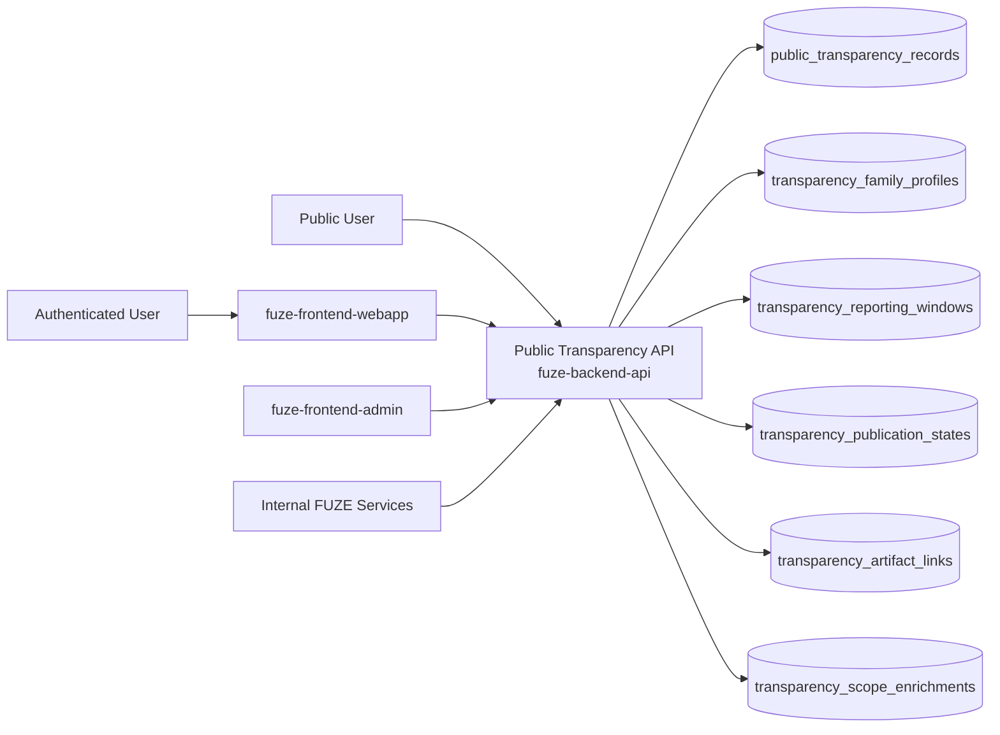
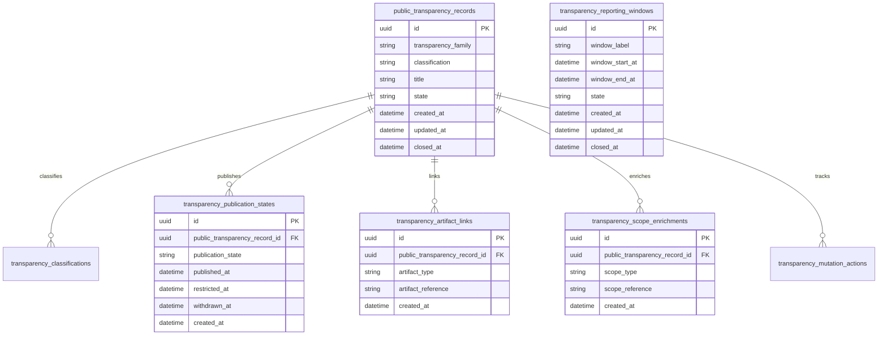
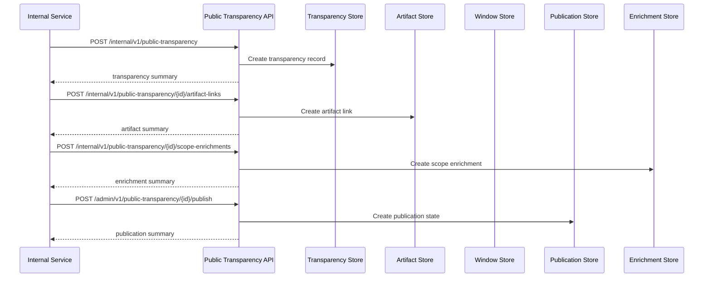

# PUBLIC_TRANSPARENCY_API_SPEC

## 1. Title

**PUBLIC_TRANSPARENCY_API_SPEC.md**

---

## 2. Document Metadata

- **Document Name:** PUBLIC_TRANSPARENCY_API_SPEC.md
- **API Classification:** public-read, authenticated-read, internal, event-driven
- **Owning Domain:** Public Transparency Domain
- **Primary Implementing Repo:** `fuze-backend-api`
- **Primary System of Record:** public transparency records, transparency publication profiles, reporting windows, artifact link records, attestation references, correction-safe transparency lineage, and public-read transparency projections in `fuze-backend-api`
- **Status:** Draft for canonical source-of-truth approval
- **Purpose:** Define the production-grade API contract architecture for FUZE public transparency, including transparency publication families, public reporting windows, attested public disclosures, artifact linkage, correction-safe publication lineage, and stable public-read transparency surfaces across the platform
- **Canonical Folder:** `fuze.ac > docs > api-spec`

---

## 2.1 API Classification Header

- **API Classification:** public-read | authenticated-read | internal | event-driven
- **Owning Domain:** Public Transparency Domain
- **Primary Implementing Repo:** `fuze-backend-api`
- **Primary System of Record:** public transparency publication domain

---

## 3. Purpose

This document defines the canonical API specification for FUZE public transparency operations. It translates the governing FUZE platform architecture, transparency model rules, transparency reporting rules, public API rules, public registry and payout-ledger trust-surface rules, and API architecture rules into an implementation-ready API contract.

This API exists because FUZE treats transparency as a structured public trust layer rather than as marketing copy, ad hoc announcements, or arbitrary file drops. Public transparency surfaces must therefore remain deliberate, versioned, attributable, bounded, and historically intelligible. They must expose what FUZE intentionally publishes as public trust artifacts while preserving the separation between:

- canonical internal domain truth,
- published public trust artifacts,
- and public derived views or summaries.

Accordingly, this specification defines how transparency records, transparency families, reporting windows, attestation references, publication states, artifact links, and correction lineage are represented, and how public transparency behavior remains auditable, idempotent, and architecture-consistent across FUZE.

---

## 4. Scope

This specification covers:

- public-read APIs for published transparency records, transparency windows, ledger-linked transparency summaries, payout-linked transparency disclosures, and trust-surface discovery
- authenticated read APIs for bounded actor-aware transparency enrichments where policy allows
- internal APIs for transparency record creation, attestation linkage, artifact linkage, publication, supersession, and withdrawal
- publication-state handling for transparency reports, attestations, supporting artifacts, and derived summaries
- event emission requirements for transparency lifecycle changes
- request, response, error, idempotency, versioning, audit, and database-shape rules for this domain

This specification does **not** redefine:

- transparency report authoring workflow in full detail
- payout-ledger ownership in full detail
- public contract registry ownership in full detail
- public metadata ownership in full detail
- governance/treasury/foundation mutation flows
- low-level website or document rendering implementation
- internal audit-log ownership
- SDK generation strategy in full detail

Those remain governed by their own source-of-truth specifications.

---

## 5. Source-of-Truth Inputs

### Primary FUZE docs and specs used

#### Highest-priority platform and ownership sources
- `SYSTEM_SPEC_INDEX.md`
- `DOCS_SPEC.md`
- `SYSTEM_BOUNDARY_AND_OWNERSHIP_SPEC.md`
- `PLATFORM_ARCHITECTURE_SPEC.md`
- `DOMAIN_OWNERSHIP_MATRIX_SPEC.md`
- `ONCHAIN_OFFCHAIN_RESPONSIBILITY_SPEC.md`

#### Primary transparency / public-read sources
- `TRANSPARENCY_MODEL_SPEC.md`
- `TRANSPARENCY_REPORTING_SPEC.md`
- `PUBLIC_API_SPEC.md`
- `PUBLIC_CONTRACT_AND_WALLET_REGISTRY_SPEC.md`
- `PAYOUT_LEDGER_SPEC.md`
- `PROFIT_PARTICIPATION_SYSTEM_SPEC.md`
- `API_ARCHITECTURE_SPEC.md`

#### Supporting runtime and control sources
- `EVENT_MODEL_AND_WEBHOOK_SPEC.md`
- `IDEMPOTENCY_AND_VERSIONING_SPEC.md`
- `MIGRATION_AND_BACKWARD_COMPATIBILITY_SPEC.md`
- `SECURITY_AND_RISK_CONTROL_SPEC.md`
- `MONITORING_ALERTING_AND_INCIDENT_RESPONSE_SPEC.md`
- `SECRETS_CONFIG_AND_ENVIRONMENT_SPEC.md`
- `AUDIT_LOG_AND_ACTIVITY_SPEC.md`

### Highest-priority interpretation applied

For this file, the most important governing interpretation is:

1. public transparency is a deliberate public trust surface and not a convenience export of internal records
2. backend owns canonical transparency publication truth
3. transparency publications must preserve clear distinctions between public reports, attestation references, supporting artifacts, and derived summaries
4. payout-linked and registry-linked trust artifacts are suitable public transparency families when intentionally designed
5. governance-sensitive, treasury-sensitive, and control-plane mutation capabilities must remain non-public
6. transparency corrections and supersession must preserve historical intelligibility rather than silently rewriting public meaning

### Supporting external standards used only as guidance

- HTTP semantics for public-read and bounded authenticated-read APIs
- structured problem-details error design
- general report-index, artifact-discovery, and public trust-surface publication patterns as supporting guidance

External guidance does not override FUZE source-of-truth documents.

---

## 6. Governing Architecture and Ownership Interpretation

This API belongs to the **Public Transparency Domain** because it owns the canonical lifecycle of:

- public transparency records,
- transparency family classification,
- reporting-window publication,
- attestation references,
- supporting artifact linkage,
- public visibility and withdrawal states,
- and correction-safe transparency history.

This API is implemented primarily in `fuze-backend-api` because:

- backend owns durable transparency publication truth
- transparency artifacts must be built from canonical owned domains without becoming shadow owners
- multiple public trust surfaces require one stable transparency layer
- public trust requires structured, versionable transparency outputs beyond ad hoc content publishing
- audit generation and correction lineage must be centralized

This API is **not** owned by:

- `fuze-frontend-webapp`, because frontend may render transparency artifacts but must not own their canonical publication truth
- `fuze-frontend-admin`, because admin may publish or supersede artifacts but must not own transparency truth
- payout-ledger domain, because payout-cycle truth is one linked trust source but not the whole transparency space
- public registry domain, because registry entries are one linked artifact family but not the whole transparency space
- public metadata domain, because metadata is the public discovery/publication layer while transparency owns transparency-specific trust artifacts and semantics
- governance or treasury domains, because those domains own sensitive decision truth, not public transparency publication truth

### Architectural implications

- every transparency record must declare what transparency family it belongs to
- every transparency record must preserve whether it is a primary published report, an attestation artifact, a supporting artifact, or a derived public summary
- transparency records may link to payout cycles, registry entries, governance references, public reports, and public documents without owning their deeper truth
- transparency corrections, supersession, and withdrawals must preserve historical lineage rather than silently rewriting public meaning
- authenticated enrichments must remain bounded and must not turn transparency surfaces into hidden control interfaces

---

## 7. Domain Responsibilities

The Public Transparency API domain is responsible for:

1. maintaining canonical public transparency records and transparency-family profiles
2. classifying transparency records as primary reports, attestations, supporting artifacts, or derived public summaries
3. publishing stable public-read transparency surfaces for reporting windows, payout-linked disclosures, registry-linked disclosures, and trust-surface discovery
4. preserving explicit publication, withdrawal, and supersession state
5. linking transparency records to public reports, attestations, registries, payout cycles, and other public trust artifacts
6. exposing bounded authenticated-read transparency enrichments where actor context is relevant
7. emitting public transparency lifecycle events
8. generating audit lineage for sensitive publication and correction actions
9. preserving separation between public transparency artifacts and private canonical domain truth
10. supporting public-safe degraded modes and trust-preserving transparency behavior

The domain is not responsible for:

- owning payout-ledger truth
- owning registry truth
- owning governance truth
- exposing arbitrary internal domain data publicly
- replacing domain-specific public APIs where richer contracts are needed
- performing internal financial reconciliation as its source-of-truth function

---

## 8. Out of Scope

The following are out of scope for this API specification:

- arbitrary public write APIs
- partner webhook authoring in full detail
- internal-only transparency drafts
- governance-history full schema
- end-user content management UI
- static site generation internals
- general document CMS behavior
- internal audit investigation workflows

---

## 9. Canonical Entities and Data Ownership

### Durable entities

#### 9.1 public_transparency_records
- **Owner:** Public Transparency Domain
- **Purpose:** canonical public transparency records
- **Nature:** source-of-truth durable entity

#### 9.2 transparency_family_profiles
- **Owner:** Public Transparency Domain
- **Purpose:** profiles for transparency families such as quarterly reports, payout-linked transparency, registry-linked transparency, attestation artifacts, and supporting evidence artifacts
- **Nature:** source-of-truth durable entity

#### 9.3 transparency_classifications
- **Owner:** Public Transparency Domain
- **Purpose:** classification of transparency records as primary report, attestation artifact, supporting artifact, or derived summary
- **Nature:** source-of-truth durable entity

#### 9.4 transparency_publication_states
- **Owner:** Public Transparency Domain
- **Purpose:** publication, visibility, withdrawal, and lifecycle state of transparency records
- **Nature:** source-of-truth durable entity

#### 9.5 transparency_reporting_windows
- **Owner:** Public Transparency Domain
- **Purpose:** reporting period and publication-window records for transparency disclosures
- **Nature:** source-of-truth durable entity

#### 9.6 transparency_artifact_links
- **Owner:** Public Transparency Domain
- **Purpose:** links to public reports, attestations, payout artifacts, registry entries, and supporting documentation
- **Nature:** source-of-truth durable lineage entity

#### 9.7 transparency_scope_enrichments
- **Owner:** Public Transparency Domain
- **Purpose:** bounded authenticated-read enrichment rules by actor or scope
- **Nature:** durable lineage entity

#### 9.8 transparency_supersession_links
- **Owner:** Public Transparency Domain
- **Purpose:** supersession and correction lineage between transparency records
- **Nature:** durable lineage entity

#### 9.9 transparency_discrepancy_cases
- **Owner:** Public Transparency Domain
- **Purpose:** review and remediation records for stale, incorrect, incomplete, or inconsistent public transparency
- **Nature:** durable review/remediation entity

#### 9.10 transparency_mutation_actions
- **Owner:** Public Transparency Domain
- **Purpose:** high-level action records for create, publish, withdraw, correct, supersede, and resolve discrepancy
- **Nature:** durable action records with audit linkage

#### 9.11 transparency_audit_events
- **Owner:** Audit / Activity domain, sourced by Public Transparency Domain
- **Purpose:** immutable trail for sensitive transparency actions
- **Nature:** durable audit records

### Derived or cached entities

#### 9.12 transparency_index_views
- **Owner:** derived read-model layer
- **Purpose:** list/index projections for trust-surface discovery
- **Nature:** derived

#### 9.13 transparency_status_views
- **Owner:** derived read-model layer
- **Purpose:** public-safe status summaries and bounded authenticated enrichments
- **Nature:** derived

#### 9.14 transparency_discrepancy_views
- **Owner:** derived ops read-model layer
- **Purpose:** visibility into stale or inconsistent transparency conditions
- **Nature:** derived

---

## 10. State Model and Lifecycle

### 10.1 transparency record lifecycle

Possible states:

- `draft`
- `published`
- `restricted`
- `deprecated`
- `superseded`
- `archived`

### 10.2 publication-state lifecycle

Possible states:

- `unpublished`
- `published_public`
- `published_authenticated`
- `restricted`
- `withdrawn`

### 10.3 reporting-window lifecycle

Possible states:

- `scheduled`
- `open`
- `published`
- `superseded`
- `closed`

### 10.4 discrepancy lifecycle

Possible states:

- `opened`
- `under_review`
- `resolved`
- `failed`
- `closed`

Lifecycle notes:
- published does not imply ownership of linked source domains
- public-safe and authenticated-only visibility must remain explicit
- supersession must preserve historical public intelligibility
- withdrawn or restricted states must not silently erase audit lineage

---

## 11. API Surface Overview

The API surface is divided into three families:

### 11.1 Public-read APIs
Used by public users, holders, community observers, and integrators for:
- transparency index retrieval
- transparency detail retrieval
- transparency-window discovery
- attestation and supporting artifact discovery
- payout-linked and registry-linked transparency discovery

### 11.2 Authenticated read APIs
Used by authenticated users and approved clients for:
- bounded transparency enrichment
- actor- or scope-sensitive transparency visibility where policy allows
- authenticated access to transparency references not broadly public but safe within actor scope

### 11.3 Internal service and admin APIs
Used by trusted internal services and privileged operators for:
- creating and updating transparency records
- publishing, correcting, superseding, restricting, or withdrawing records
- linking artifacts and maintaining correction lineage
- resolving transparency discrepancies

---

## 12. Authentication and Authorization Model

### 12.1 Authentication posture by route family

#### Public-read routes
No authentication required:
- list transparency records
- retrieve transparency detail
- read transparency windows and trust-surface discovery where published

#### Authenticated read routes
Require valid authenticated session:
- read bounded authenticated-only transparency
- read actor- or workspace-scoped transparency enrichments where allowed

#### Internal service routes
Require internal service identity with explicit least privilege:
- create and update transparency records
- attach artifact links
- refresh publication states
- read canonical truth

#### Admin routes
Require privileged operator identity plus reason-coded actions:
- publish, withdraw, restrict, supersede, and resolve discrepancy cases

### 12.2 Authorization checkpoints

Authorization must evaluate:
- caller identity and route family
- whether transparency record is public, authenticated-only, or internal-only
- whether actor has scope visibility for authenticated enrichments
- whether service has create/publish/link/read privilege
- whether operator role is present for publication or correction actions
- whether current transparency state allows requested mutation

### 12.3 Sensitive action rules

The following require heightened checks:
- publication of new public transparency records
- publication of payout-linked, registry-linked, or attestation-linked transparency records
- withdrawal or restriction of already public transparency artifacts
- supersession of trusted public transparency artifacts
- discrepancy-resolution actions

---

## 13. API Endpoints / Interface Contracts

## 13.1 Public-Read APIs

### 13.1.1 `GET /v1/public-transparency`
**Purpose:** list published public transparency records  
**Caller Type:** public  
**Auth Expectation:** none  
**Query Parameters Summary:**
- optional `transparency_family`
- optional `classification`
- optional `reporting_window`
- optional `status`
- pagination
**Response Summary:**
- transparency record summaries
- family and classification labels
- publication state
- artifact linkage summary
- timestamps
**Side Effects:** none
**Audit Requirements:** access logging optional
**Emitted Events:** none required

### 13.1.2 `GET /v1/public-transparency/{public_transparency_id}`
**Purpose:** retrieve one public transparency record  
**Caller Type:** public  
**Response Summary:**
- transparency detail
- classification and visibility information
- artifact links
- reporting-window reference
- supersession guidance where relevant
- public-safe status references
**Side Effects:** none

### 13.1.3 `GET /v1/public-transparency/windows/{reporting_window_id}`
**Purpose:** retrieve transparency reporting-window detail and linked records  
**Caller Type:** public  
**Response Summary:**
- reporting-window summary
- linked transparency records
- publication chronology
- public-safe trust-surface references
**Side Effects:** none

## 13.2 Authenticated Read APIs

### 13.2.1 `GET /v1/public-transparency/me`
**Purpose:** retrieve bounded actor-aware transparency enrichments where policy allows  
**Caller Type:** authenticated user  
**Auth Expectation:** valid authenticated session  
**Query Parameters Summary:**
- optional `transparency_family`
- pagination
**Response Summary:**
- transparency summary list
- actor-safe enrichment data
- scoped references where allowed
**Side Effects:** none

### 13.2.2 `GET /v1/public-transparency/me/{public_transparency_id}`
**Purpose:** retrieve one bounded actor-aware transparency detail  
**Caller Type:** authenticated user  
**Response Summary:**
- base public transparency detail
- bounded authenticated enrichment
- scoped artifact references where allowed
**Side Effects:** none

## 13.3 Internal Service APIs

### 13.3.1 `POST /internal/v1/public-transparency`
**Purpose:** create draft public transparency record  
**Caller Type:** internal trusted service  
**Auth Expectation:** service-to-service identity only  
**Request Body Summary:**
- `transparency_family`
- `classification`
- `title`
- optional `summary`
- optional `reporting_window_reference`
- `idempotency_key`
**Response Summary:** transparency record summary
**Side Effects:** creates draft transparency record
**Idempotency Behavior:** required
**Audit Requirements:** transparency-record creation audit
**Emitted Events:** `public_transparency.record_created`

### 13.3.2 `POST /internal/v1/public-transparency/{public_transparency_id}/artifact-links`
**Purpose:** attach artifact links to one transparency record  
**Caller Type:** internal trusted service  
**Request Body Summary:**
- `artifact_type`
- `artifact_reference`
- optional `artifact_summary`
- `idempotency_key`
**Response Summary:** artifact-link summary
**Side Effects:** creates artifact-link lineage
**Idempotency Behavior:** required
**Audit Requirements:** artifact-link audit
**Emitted Events:** `public_transparency.artifact_linked`

### 13.3.3 `POST /internal/v1/public-transparency/{public_transparency_id}/scope-enrichments`
**Purpose:** attach bounded authenticated enrichment rules to one transparency record  
**Caller Type:** internal trusted service  
**Request Body Summary:**
- `scope_type`
- `scope_reference`
- `enrichment_profile`
- `idempotency_key`
**Response Summary:** scope-enrichment summary
**Side Effects:** creates enrichment lineage
**Idempotency Behavior:** required
**Audit Requirements:** enrichment audit
**Emitted Events:** `public_transparency.scope_enrichment_linked`

### 13.3.4 `GET /internal/v1/public-transparency/{public_transparency_id}`
**Purpose:** retrieve canonical public transparency truth  
**Caller Type:** internal trusted service  
**Response Summary:** full transparency record, classification, reporting window, publication state, artifact links, enrichments, supersession lineage, and discrepancy lineage
**Side Effects:** none

## 13.4 Admin / Control-Plane APIs

### 13.4.1 `POST /admin/v1/public-transparency/{public_transparency_id}/publish`
**Purpose:** publish public transparency record under controlled policy  
**Caller Type:** admin/operator  
**Request Body Summary:**
- `visibility_target`
- `reason_code`
- `operator_note`
- `idempotency_key`
**Response Summary:** published transparency summary
**Side Effects:** publication state changes to published_public or published_authenticated
**Audit Requirements:** critical audit
**Emitted Events:** `public_transparency.record_published`

### 13.4.2 `POST /admin/v1/public-transparency/{public_transparency_id}/withdraw`
**Purpose:** withdraw or restrict public transparency visibility under controlled policy  
**Caller Type:** admin/operator  
**Request Body Summary:**
- `withdrawal_mode`
- `reason_code`
- `operator_note`
- `idempotency_key`
**Response Summary:** withdrawn transparency summary
**Side Effects:** publication state changes to restricted or withdrawn
**Audit Requirements:** critical audit
**Emitted Events:** `public_transparency.record_withdrawn`

### 13.4.3 `POST /admin/v1/public-transparency/{public_transparency_id}/supersede`
**Purpose:** supersede one public transparency record with another under controlled policy  
**Caller Type:** admin/operator  
**Request Body Summary:**
- `replacement_public_transparency_id`
- `reason_code`
- `operator_note`
- `idempotency_key`
**Response Summary:** supersession summary
**Side Effects:** creates supersession linkage and updates visible preference
**Audit Requirements:** critical audit
**Emitted Events:** `public_transparency.record_superseded`

### 13.4.4 `POST /admin/v1/public-transparency/discrepancies`
**Purpose:** resolve public transparency discrepancy under controlled policy  
**Caller Type:** admin/operator  
**Request Body Summary:**
- `target_reference_type`
- `target_reference_id`
- `resolution_code`
- `operator_note`
- `related_case_id`
- `idempotency_key`
**Response Summary:** discrepancy-resolution summary
**Side Effects:** may correct, supersede, restrict, withdraw, or close discrepancy posture with preserved lineage
**Audit Requirements:** critical audit
**Emitted Events:** `public_transparency.discrepancy_resolved`

---

## 14. Request Rules

### 14.1 General request rules
- all mutation-capable routes must require JSON requests with explicit content type
- all mutation routes must carry correlation IDs
- sensitive public transparency mutations must carry idempotency keys
- admin mutations must require reason codes and operator notes
- no route may accept frontend-authored public transparency truth as authoritative input

### 14.2 Sensitive-action request requirements
The following requests require heightened validation:
- publication of new public transparency records
- publication of payout-linked, registry-linked, or attestation-linked transparency artifacts
- withdrawal or restriction of already public transparency records
- supersession of trust-sensitive published transparency records
- discrepancy-resolution actions

Heightened validation may include:
- family/classification consistency checks
- reporting-window and artifact-link validation
- public-safe versus authenticated-only visibility checks
- operator role confirmation
- reporting or registry case linkage for sensitive actions

### 14.3 Scope integrity rule
Public transparency mutations must target valid and authorized records, artifact links, enrichment records, reporting windows, and discrepancy records. Services and operators must not mutate unrelated or unauthorized transparency state.

### 14.4 Layer-separation rule
Public transparency domain must remain the public trust-publication layer. It must not collapse:
- payout-ledger ownership,
- registry ownership,
- public metadata ownership,
- product canonical truth,
- or internal orchestration state
into one ambiguous transparency object.

---

## 15. Response Rules

### 15.1 Success response rules
Successful responses must include:
- stable resource identifiers
- timestamps for created/updated state
- state/status values
- family and classification summaries
- artifact-link and publication-state summaries where relevant
- correlation references for mutations

### 15.2 Async-accepted response rules
If publication propagation, withdrawal, or discrepancy remediation is async, the response must:
- return accepted status
- include action or job ID
- provide follow-up status semantics

### 15.3 Terminal mutation response rules
Terminal mutation responses must clearly show:
- target transparency record or discrepancy
- mutation type
- resulting publication state
- withdrawal, supersession, or restriction effects where relevant
- whether public-safe views may refresh asynchronously

### 15.4 Read response rules
Read responses must distinguish:
- canonical internal transparency truth
- primary published reports
- attestation artifacts
- supporting artifacts
- derived public summaries
- actor-scoped enrichment versus ordinary public transparency

---

## 16. Error Model

The API uses structured problem-details style error responses.

### 16.1 Required error fields
- `type`
- `title`
- `status`
- `code`
- `detail`
- `instance`
- `correlation_id`

### 16.2 Common error codes

#### Authorization / permission errors
- `PUBLIC_TRANSPARENCY_PERMISSION_DENIED`
- `PUBLIC_TRANSPARENCY_OPERATOR_PERMISSION_DENIED`
- `PUBLIC_TRANSPARENCY_SERVICE_PERMISSION_DENIED`
- `PUBLIC_TRANSPARENCY_AUDIENCE_PERMISSION_DENIED`

#### State conflict errors
- `PUBLIC_TRANSPARENCY_RECORD_STATE_INVALID`
- `PUBLIC_TRANSPARENCY_PUBLICATION_STATE_INVALID`
- `PUBLIC_TRANSPARENCY_SUPERSESSION_CONFLICT`
- `PUBLIC_TRANSPARENCY_VISIBILITY_CONFLICT`

#### Policy / safety errors
- `PUBLIC_TRANSPARENCY_CLASSIFICATION_REQUIRED`
- `PUBLIC_TRANSPARENCY_ARTIFACT_REFERENCE_REQUIRED`
- `PUBLIC_TRANSPARENCY_VISIBILITY_NOT_ALLOWED`
- `PUBLIC_TRANSPARENCY_PUBLICATION_NOT_ALLOWED`
- `PUBLIC_TRANSPARENCY_WITHDRAWAL_NOT_ALLOWED`

#### Request integrity errors
- `PUBLIC_TRANSPARENCY_IDEMPOTENCY_KEY_REQUIRED`
- `PUBLIC_TRANSPARENCY_REQUEST_INVALID`
- `PUBLIC_TRANSPARENCY_REQUEST_UNPROCESSABLE`

#### Dependency or provider errors
- `PUBLIC_TRANSPARENCY_STORAGE_UNAVAILABLE`
- `PUBLIC_TRANSPARENCY_REPORTING_UNAVAILABLE`
- `PUBLIC_TRANSPARENCY_REGISTRY_UNAVAILABLE`

### 16.3 Error handling rules
- do not expose hidden internal governance, treasury, security, or audit detail in public or low-privilege responses
- do not imply canonical domain ownership from transparency publication alone
- distinguish classification/visibility failure from generic invalid state
- distinguish missing artifact reference from generic invalid request
- include retry guidance only where safe

---

## 17. Idempotency and Mutation Safety

### 17.1 Required idempotent mutations
The following mutation routes require idempotent behavior:
- transparency record creation
- artifact-link attachment
- scope-enrichment attachment
- publish
- withdraw
- supersede
- discrepancy resolution

### 17.2 Idempotency key rules
- mutation requests must supply `Idempotency-Key`
- backend stores key scope, request hash, actor, and terminal result
- replay of same semantic request returns original terminal outcome
- replay of same key with different semantic request must fail with conflict

### 17.3 Mutation safety rules
- one canonical visible transparency record per current transparency lineage unless explicit supersession exists
- artifact and enrichment links must remain referentially consistent with transparency family and classification
- public publication and authenticated publication must remain explicitly distinct
- corrections and supersession must preserve prior transparency lineage
- withdrawal and restriction must preserve auditability and public explanation where appropriate

---

## 18. Versioning and Compatibility Rules

### 18.1 Versioning
This API family is versioned under `/v1`, `/internal/v1`, and `/admin/v1` route families.

### 18.2 Compatibility approach
- additive evolution preferred
- no silent semantic change to transparency family, classification, or visibility meaning
- new transparency families, artifact-link types, and reporting-window fields may be added without breaking existing contracts
- response fields may be added but existing meanings must remain stable

### 18.3 Breaking-change rules
Breaking changes include:
- changing the meaning of primary report versus attestation artifact versus supporting artifact versus derived summary
- changing visibility semantics incompatibly
- removing critical artifact-link or reporting-window fields
- changing supersession or withdrawal semantics incompatibly

Such changes require explicit migration planning and version evolution.

### 18.4 Deprecation
Deprecated routes or fields must:
- be documented explicitly
- carry deprecation metadata where supported
- preserve compatibility windows long enough for public, first-party, and internal consumers

---

## 19. Event Emission and Webhook Behavior

This domain is event-capable.

### 19.1 Internal events
The Public Transparency domain must emit canonical internal events such as:
- `public_transparency.record_created`
- `public_transparency.artifact_linked`
- `public_transparency.scope_enrichment_linked`
- `public_transparency.record_published`
- `public_transparency.record_withdrawn`
- `public_transparency.record_superseded`
- `public_transparency.discrepancy_resolved`

### 19.2 Event payload minimums
Each event should contain:
- event ID
- event type
- occurred_at
- public transparency ID
- transparency family
- classification
- publication state
- actor type
- correlation ID
- reason code where applicable

### 19.3 External webhook posture
This specification does not expose general third-party outbound public transparency webhooks by default. Any future outbound transparency publication webhook surface must be narrow, security-reviewed, and governed by a separate contract.

---

## 20. Audit and Activity Requirements

The following actions must generate durable audit events:

- transparency record creation
- artifact-link attachment
- publish, withdraw, supersede, and discrepancy actions
- scope-enrichment linkage where sensitivity requires
- other sensitive public transparency mutations

### Required audit fields
- audit event ID
- actor type and actor reference
- target transparency record / artifact link / discrepancy reference as applicable
- action type
- before/after summary where applicable
- reason code
- correlation ID
- operator note if operator action
- occurred_at

---

## 21. Data Model and Database Schema View

### 21.1 `public_transparency_records`
- `id` PK
- `transparency_family`
- `classification`
- `title`
- `summary`
- `state`
- `created_at`
- `updated_at`
- `closed_at` nullable

**Constraints:**
- index on (`transparency_family`, `classification`)
- index on `state`

### 21.2 `transparency_family_profiles`
- `id` PK
- `transparency_family`
- `allowed_classifications_json`
- `window_profile_json`
- `visibility_profile_json`
- `created_at`
- `updated_at`

**Constraints:**
- unique `transparency_family`

### 21.3 `transparency_classifications`
- `id` PK
- `public_transparency_record_id` FK -> `public_transparency_records.id`
- `classification`
- `canonical_owner_reference`
- `created_at`

**Constraints:**
- index on `public_transparency_record_id`

### 21.4 `transparency_publication_states`
- `id` PK
- `public_transparency_record_id` FK -> `public_transparency_records.id`
- `publication_state`
- `published_at` nullable
- `restricted_at` nullable
- `withdrawn_at` nullable
- `created_at`

**Constraints:**
- index on `public_transparency_record_id`
- index on `publication_state`

### 21.5 `transparency_reporting_windows`
- `id` PK
- `window_label`
- `window_start_at`
- `window_end_at`
- `state`
- `created_at`
- `updated_at`
- `closed_at` nullable

**Constraints:**
- index on `state`

### 21.6 `transparency_artifact_links`
- `id` PK
- `public_transparency_record_id` FK -> `public_transparency_records.id`
- `artifact_type`
- `artifact_reference`
- `artifact_summary_json`
- `created_at`

**Constraints:**
- index on `public_transparency_record_id`

### 21.7 `transparency_scope_enrichments`
- `id` PK
- `public_transparency_record_id` FK -> `public_transparency_records.id`
- `scope_type`
- `scope_reference`
- `enrichment_profile_json`
- `created_at`

**Constraints:**
- index on `public_transparency_record_id`

### 21.8 `transparency_supersession_links`
- `id` PK
- `from_public_transparency_id` FK -> `public_transparency_records.id`
- `to_public_transparency_id` FK -> `public_transparency_records.id`
- `reason_code`
- `created_at`

**Constraints:**
- unique (`from_public_transparency_id`, `to_public_transparency_id`)

### 21.9 `transparency_discrepancy_cases`
- `id` PK
- `target_reference_type`
- `target_reference_id`
- `state`
- `resolution_code` nullable
- `created_at`
- `updated_at`
- `closed_at` nullable

### 21.10 `transparency_mutation_actions`
- `id` PK
- `target_reference_type`
- `target_reference_id`
- `action_type`
- `state`
- `reason_code`
- `operator_note` nullable
- `requested_by_actor_type`
- `requested_by_actor_id`
- `created_at`
- `executed_at` nullable
- `closed_at` nullable
- `correlation_id`

### 21.11 `idempotency_records`
- `id` PK
- `idempotency_key`
- `scope_family`
- `actor_reference`
- `request_hash`
- `response_hash`
- `terminal_status`
- `created_at`
- `expires_at`

### 21.12 `audit_log_entries`
Domain-sourced audit records written into the audit domain.

### Normalization notes
- canonical public transparency truth stays in transparency records, family profiles, classifications, publication states, reporting windows, artifact links, enrichments, supersession links, and discrepancy records
- payout-ledger, registry, and metadata canonical truths remain external and are referenced rather than duplicated
- public-safe views must derive from canonical public transparency truth filtered by publication state and visibility class
- actor-scoped enrichments remain bounded overlays rather than new canonical transparency owners

### Reconciliation notes
- one visible public transparency record should reconcile to one current transparency lineage under current preference
- publication state must reconcile with allowed family/classification combinations
- artifact links must reconcile to linked reports, attestations, payout artifacts, and registry artifacts
- discrepancy cases must preserve review lineage for stale or conflicting public transparency conditions

---

## 22. Architecture Diagram — Mermaid flowchart



---

## 23. Data Design — Mermaid Diagram



---

## 24. Flow View

### 24.1 Happy path — publish primary transparency record
1. internal service creates draft transparency record
2. reporting-window reference and artifact links are attached to reports, attestations, payout artifacts, or registry artifacts
3. operator validates family/classification and publication intent
4. admin publishes record publicly
5. public index, window, and detail surfaces become available
6. external readers can discover the record as primary report, attestation artifact, supporting artifact, or derived summary

### 24.2 Happy path — authenticated enrichment
1. transparency record is already published or authenticated-visible
2. bounded actor/scope enrichment is linked internally
3. authenticated actor requests the transparency artifact
4. backend returns base public transparency plus scoped enrichment where policy allows
5. actor sees additional safe context without gaining hidden control-plane access

### 24.3 Alternate path — superseding an older transparency publication
1. older transparency record must be replaced or corrected
2. replacement record is created and validated
3. admin supersedes the older record
4. previous record remains historically linked and interpretable
5. new record becomes current visible preference

### 24.4 Failure path — invalid classification or publication posture
1. transparency record is created or modified
2. backend detects missing classification, invalid family/classification combination, or disallowed visibility posture
3. request is rejected or record remains unpublished
4. no unsafe public transparency surface is produced

### 24.5 Failure and remediation path — stale or incorrect public transparency
1. linked payout/report/registry artifact changes or transparency becomes stale/inconsistent
2. admin opens discrepancy-resolution flow
3. backend preserves existing lineage
4. corrected or superseding transparency record is created
5. discrepancy closes with preserved history

### 24.6 Degraded-mode path
1. linked public report, registry, or payout artifact is delayed or degraded
2. public transparency surface stays available where safe
3. backend communicates freshness or visibility degradation explicitly
4. canonical truth mutation is not implied by degraded presentation

### 24.7 Retry behavior
- duplicate transparency creation returns same canonical record result
- duplicate artifact or enrichment attachment returns same lineage result where applicable
- duplicate publish/withdraw/supersede/discrepancy actions return same terminal action result

---

## 25. Data Flows — Mermaid sequenceDiagram



---

## 26. Security and Risk Controls

1. **Public transparency truth is backend-owned**  
   Frontends and informal publication channels may not authoritatively define public transparency truth.

2. **Transparency is not a control plane**  
   Public transparency surfaces must support trust, legibility, and disclosure, not expose governance, treasury, payout authoring, or internal orchestration controls.

3. **Classification clarity is mandatory**  
   Public transparency must explicitly distinguish primary reports, attestation artifacts, supporting artifacts, and derived public summaries so external consumers do not mistake one for another.

4. **Public-safe visibility discipline**  
   Publication state must keep public, authenticated-only, and internal-only transparency clearly separated.

5. **Rate limits and abuse controls**  
   Public transparency surfaces require public-surface protections such as rate limiting, actor/token throttling, input hardening, and stable pagination expectations.

6. **Backward-compatibility discipline**  
   Public transparency surfaces must follow explicit versioning and conservative compatibility rules because public interfaces carry strong ecosystem trust obligations.

7. **Audit-linked publication**  
   Publication, withdrawal, and supersession of transparency artifacts must remain traceable into internal audit systems.

8. **Secrets/config boundary discipline**  
   Public transparency may include only values intentionally classed as public and must not leak confidential or control-sensitive configuration.

9. **Trust-preserving degraded modes**  
   Public transparency should preserve the difference between freshness lag, execution delay, and canonical truth mutation.

10. **Historical intelligibility**  
    Corrections and supersession must preserve lineage so public trust surfaces remain historically interpretable.

---

## 27. Operational Considerations

- public transparency index, window, and detail reads should be highly available
- publication-state changes and artifact-link correctness are trust-sensitive and must be monitored
- payout-linked, registry-linked, and attestation-linked transparency should surface clearly to ops views
- supersession and discrepancy workflows should be observable and reviewable
- monitoring should alert on:
  - stale public transparency tied to payout, registry, or trust-sensitive reporting surfaces
  - publication failures for trusted public artifacts
  - public/private visibility divergence
  - broken artifact references
  - public-safe view inconsistency versus canonical transparency state
  - degraded public trust surfaces during active payout or reporting windows

---

## 28. Acceptance Criteria

1. The API preserves the distinction between public transparency truth, payout-ledger truth, registry truth, public metadata truth, and internal domain truth.
2. Only `fuze-backend-api` owns canonical public transparency publication truth.
3. Public transparency records, family profiles, classifications, publication states, reporting windows, artifact links, enrichments, supersession links, and discrepancy records are durable and backend-owned.
4. Public and authenticated routes expose only bounded safe public transparency views.
5. Transparency family, classification, reporting-window, and visibility posture are explicit and validated.
6. Public transparency distinguishes primary reports, attestation artifacts, supporting artifacts, and derived summary models.
7. Publication, withdrawal, supersession, and discrepancy actions preserve immutable lineage.
8. Public transparency mutation actions are idempotent and auditable.
9. Internal and admin public transparency routes are least-privilege and backend-only.
10. Admin routes require reason-coded privileged authorization.
11. Event emissions exist for major public transparency mutations.
12. Database schema separates records, family profiles, classifications, publication states, reporting windows, artifact links, enrichments, supersession links, and discrepancy layers.
13. Public-safe consumers can rely on public transparency views without needing internal platform knowledge.
14. Public transparency supports rate-limited, versioned, supportable external integration behavior.
15. Mermaid diagrams remain consistent with prose and data model.

---

## 29. Test Cases

### 29.1 Positive cases
1. Internal service creates draft public transparency record successfully.
2. Internal service attaches artifact link successfully.
3. Internal service attaches scope enrichment successfully.
4. Admin publishes public transparency successfully.
5. Public user reads published transparency index successfully.
6. Public user reads one published transparency record successfully.
7. Public user reads reporting-window detail successfully.
8. Admin supersedes stale transparency successfully.

### 29.2 Negative cases
9. Public user cannot access unpublished or internal-only transparency.
10. Internal service without write privilege cannot create transparency record.
11. Publication without valid classification returns `PUBLIC_TRANSPARENCY_CLASSIFICATION_REQUIRED`.
12. Publication without required artifact reference returns `PUBLIC_TRANSPARENCY_ARTIFACT_REFERENCE_REQUIRED`.
13. Disallowed visibility target returns `PUBLIC_TRANSPARENCY_VISIBILITY_NOT_ALLOWED`.
14. Withdrawal attempt in incompatible state returns `PUBLIC_TRANSPARENCY_WITHDRAWAL_NOT_ALLOWED`.

### 29.3 Authorization cases
15. Ordinary public or authenticated user cannot call admin transparency publication APIs.
16. Internal service without artifact-link privilege cannot attach artifact links.
17. Operator without publication privilege cannot publish transparency.
18. Published public transparency does not imply canonical ownership of linked payout/report/registry truth.

### 29.4 Idempotency and replay cases
19. Repeating transparency creation with same idempotency key returns original transparency result.
20. Repeating artifact-link attachment with same idempotency key returns original linkage result.
21. Repeating publish or withdraw with same idempotency key returns original terminal action result.
22. Repeating supersede or discrepancy resolution with same idempotency key returns original terminal action result.

### 29.5 Concurrency cases
23. Concurrent artifact-link updates preserve one explicit current linkage lineage and duplicate-safe outcomes where appropriate.
24. Concurrent publish and withdraw actions preserve explicit lifecycle ordering without hidden overwrite.
25. Concurrent supersede and discrepancy actions preserve explicit visible lineage without ambiguity.

### 29.6 Recovery / admin cases
26. Stale or mislinked public transparency can be corrected under controlled policy with explicit lineage.
27. Superseded public transparency remains historically linked to the original record.
28. Discrepancy resolution closes artifact-link, visibility, or reporting conflict with preserved audit history.

### 29.7 Event and audit cases
29. Successful transparency creation emits `public_transparency.record_created`.
30. Successful artifact-link attachment emits `public_transparency.artifact_linked`.
31. Successful publication emits `public_transparency.record_published`.
32. Successful withdrawal emits `public_transparency.record_withdrawn`.
33. Successful discrepancy resolution emits `public_transparency.discrepancy_resolved` with critical audit lineage.

---

## 30. Open Questions or Explicit Deferred Decisions

1. Exact transparency-family taxonomy code sets are deferred.
2. Exact reporting-window schema standardization is deferred.
3. Exact public-safe disclosure depth for each transparency family is deferred.
4. Exact actor-scoped enrichment taxonomy is deferred.
5. Exact discrepancy taxonomy for transparency/publication conflicts is deferred.
6. Exact partner-oriented transparency quota strategy is deferred.

---

## 31. Implementation Notes for `fuze-backend-api`

Recommended backend module layout:

```text
modules/platform/
  public-transparency/
  transparency-reporting/
  public-registry/
  payout-ledger/
  audit-log/
  control-plane/
  integrations/
```

Implementation guidance:
- keep transparency records, family profiles, reporting windows, publication state, artifact links, and supersession logic in one canonical domain service
- perform family/classification/visibility/reporting-window checks inside the commit boundary
- keep publish, withdraw, supersede, and discrepancy actions explicit and idempotent
- treat admin remediations as domain actions, not ad hoc row edits
- emit events only after canonical state commit succeeds
- publish public-safe transparency views from canonical truth; do not let derived views mutate transparency state

---

## 32. Frontend Consumption Notes

### For `fuze-frontend-webapp`
- may read public transparency and bounded authenticated enrichments where approved
- must not infer canonical domain ownership from public transparency alone
- must treat backend public transparency responses as authoritative for publication state and trust-surface semantics
- should clearly distinguish primary reports, attestation artifacts, supporting artifacts, and derived summary views when visible

### For `fuze-frontend-admin`
- may trigger privileged publish, withdraw, supersede, and discrepancy actions only through backend admin APIs
- must require operator reason input for sensitive mutations
- must not directly mutate canonical public transparency truth client-side
- should present immutable transparency history and correction lineage separately from current visible state

---

## 33. Contract Derivation Notes

### OpenAPI / AsyncAPI
This spec should later derive into:
- public transparency index/detail/window read operations
- authenticated transparency enrichment read operations
- internal transparency creation, artifact-link, and enrichment operations
- admin publish / withdraw / supersede / discrepancy operations
- shared problem-details schema
- public transparency lifecycle events in AsyncAPI

### Future `fuze-sdk`
Future `fuze-sdk` packages may derive:
- public transparency lookup helpers
- public reporting-window discovery helpers
- typed transparency-family, classification, and publication-state summary models
- problem-error models for public transparency outcomes

The SDK must derive from approved API contracts and must not become the source of truth over this narrative specification.
