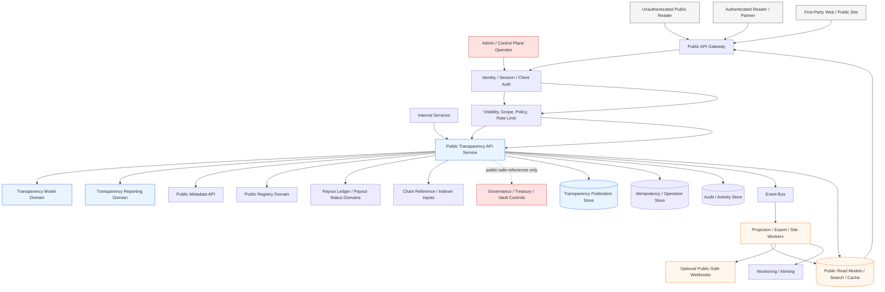
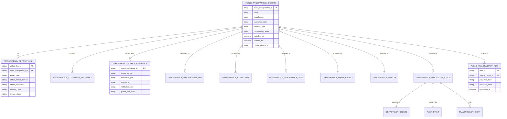
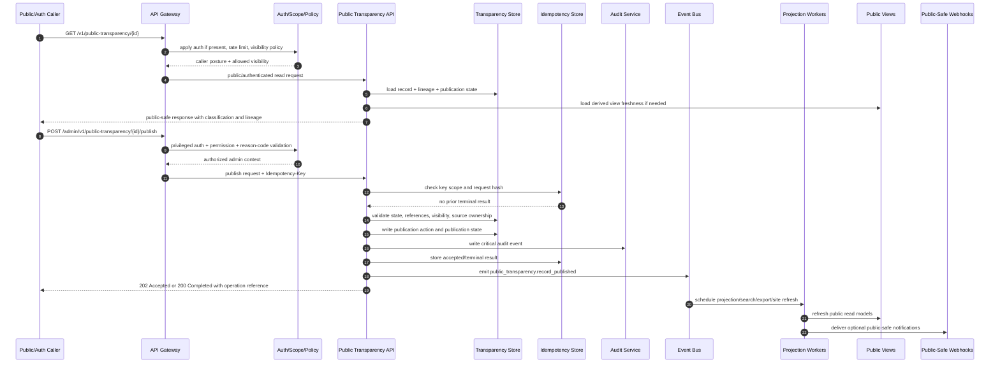

# PUBLIC_TRANSPARENCY_API_SPEC.md

## Title
FUZE Public Transparency API Specification

## Document Metadata

- **Document Name:** `PUBLIC_TRANSPARENCY_API_SPEC.md`
- **Document Type:** Production-grade API SPEC v2 / public-read and publication-control API specification
- **Status:** Draft canonical API specification pending approval
- **Version:** 2.0.0
- **Effective Date:** 2026-04-25
- **Last Updated:** 2026-04-25
- **Reviewed On:** 2026-04-25
- **Document Owner:** FUZE Public Transparency API Domain; named individual owner is not explicitly specified in the retrieved governing materials
- **Approval Authority:** FUZE canonical specification approval workflow; specific named authority not explicitly specified in the retrieved governing materials
- **Review Cadence:** Quarterly and whenever public-trust posture, transparency reporting, registry publication, payout-ledger publication, treasury/governance disclosure posture, public API posture, or chain architecture materially changes
- **Governing Layer:** API SPEC v2 / public trust and public-read companion API layer
- **Parent Registry:** FUZE API SPEC v2 Canonical File Registry
- **Upstream Semantic Registry:** `REFINED_SYSTEM_SPEC_INDEX.md`
- **Upstream API Registry:** `API_SPEC_INDEX.md`
- **Primary Audience:** Platform architecture, backend engineering, public API authors, transparency/reporting authors, public-site authors, security, audit/compliance, operations, governance/treasury stakeholders, SDK/OpenAPI/AsyncAPI authors, implementation-contract authors
- **Primary Purpose:** Define the canonical FUZE API contract for public transparency publication, public transparency read access, artifact linkage, public-trust discovery, correction-safe transparency lineage, internal publication workflows, admin/control-plane correction actions, event behavior, and derived public read-model safety
- **Primary Upstream References:** `TRANSPARENCY_MODEL_SPEC.md`, `TRANSPARENCY_REPORTING_SPEC.md`, `PUBLIC_API_SPEC.md`, `PUBLIC_METADATA_API_SPEC.md`, `PUBLIC_CONTRACT_AND_WALLET_REGISTRY_SPEC.md`, `PAYOUT_LEDGER_SPEC.md`, `PROFIT_PARTICIPATION_SYSTEM_SPEC.md`, `CHAIN_ARCHITECTURE_SPEC.md`, `ONCHAIN_OFFCHAIN_RESPONSIBILITY_SPEC.md`, `API_ARCHITECTURE_SPEC.md`, `EVENT_MODEL_AND_WEBHOOK_SPEC.md`, `IDEMPOTENCY_AND_VERSIONING_SPEC.md`, `MIGRATION_AND_BACKWARD_COMPATIBILITY_SPEC.md`, `AUDIT_LOG_AND_ACTIVITY_SPEC.md`, `SECURITY_AND_RISK_CONTROL_SPEC.md`, `MONITORING_ALERTING_AND_INCIDENT_RESPONSE_SPEC.md`
- **Primary Downstream Dependents:** public transparency routes, transparency publication services, public transparency sites, public metadata discovery surfaces, public registry lookup surfaces, public payout-status surfaces, transparency report publication pipelines, export/index/search layers, OpenAPI/AsyncAPI contracts, SDKs, contract-validation suites, incident/discrepancy runbooks
- **API Surface Families Covered:** public-read, authenticated-read, first-party read, internal service, admin/control-plane, event/async, webhook-adjacent, reporting/export, public-site read model, SDK/OpenAPI/AsyncAPI derivation
- **API Surface Families Excluded:** arbitrary public write, raw internal service mirroring, direct treasury/governance controls, raw audit-log access, raw chain/indexer ingestion control, product-local mutation APIs, account/session APIs, workspace authorization APIs
- **Canonical System Owner(s):** Transparency Model Domain owns transparency semantics; Transparency Reporting Domain owns recurring report semantics; Public Transparency API Domain owns API contract expression and publication-read interface posture
- **Canonical API Owner:** Public Transparency API Domain
- **Supersedes:** v1 `PUBLIC_TRANSPARENCY_API_SPEC.md` and weaker interpretations that treat public transparency as ad hoc content, raw dashboard export, website rendering, or a source-of-truth replacement for registry, payout, governance, treasury, chain, audit, or reporting domains
- **Superseded By:** Not currently specified
- **Related Decision Records:** Not explicitly specified in the retrieved governing materials
- **Canonical Status Note:** This document is the API SPEC v2 governing contract for public transparency interfaces. Refined system specs own semantic truth; this API spec owns the interface-contract expression of that truth.
- **Implementation Status:** Normative target for downstream route, schema, event, SDK, publication, read-model, audit, and QA implementation
- **Approval Status:** Draft pending explicit approval
- **Change Summary:** Upgrades public transparency API governance from a v1 API-contract baseline into an API SPEC v2 production-grade specification with explicit hierarchy metadata, truth taxonomy, public/internal/admin/event separation, ownership boundaries, request/response/error/status/idempotency/audit/versioning rules, diagrams, flow views, acceptance criteria, and test cases.

---

## Purpose

This specification defines the canonical API contract for FUZE public transparency interfaces.

The Public Transparency API exists to expose governed public-trust transparency artifacts, transparency windows, artifact relationships, attestation references, correction lineage, and public-safe transparency summaries in a stable, bounded, auditable, versioned API surface. It does not create the underlying system truth that transparency explains. It expresses transparency truth and approved public-trust publication state through API contracts.

The API MUST preserve the FUZE principle that transparency is an interpretive public-legibility and publication layer derived from stronger source domains. Public transparency artifacts MAY explain registry entries, payout cycles, treasury/governance-sensitive structures, chain references, public metadata, and report artifacts, but they MUST NOT become the owner of registry truth, payout truth, treasury truth, governance truth, chain-native truth, audit truth, accounting truth, or product truth.

This specification is intentionally governing. It is not a route dump, website content model, CMS template, report authoring guide, or generic public API best-practice note.

---

## Scope

This specification governs:

1. Public-read APIs for published transparency records, transparency families, transparency windows, artifact links, attestation references, correction/supersession lineage, and trust-surface discovery.
2. Authenticated-read APIs for bounded actor-aware transparency enrichments where policy explicitly allows.
3. First-party application read APIs that consume the same public transparency truth without gaining ownership of it.
4. Internal service APIs for creating draft transparency records, linking artifacts, preparing publication, attaching lineage, validating source references, and refreshing projections.
5. Admin/control-plane APIs for publication, restriction, withdrawal, supersession, correction, discrepancy resolution, and exceptional remediation.
6. Event and async contracts for transparency lifecycle changes, projection refreshes, export generation, public-site updates, and webhook-safe notifications.
7. Public transparency read-model, cache, export, search-index, and public-site projection rules.
8. Request, response, error, result, status, idempotency, replay, audit, observability, migration, compatibility, OpenAPI, AsyncAPI, and SDK guardrails.

---

## Out of Scope

This specification does not govern:

- canonical transparency-model semantics in full depth; those belong to `TRANSPARENCY_MODEL_SPEC.md`
- recurring transparency report-family semantics in full depth; those belong to `TRANSPARENCY_REPORTING_SPEC.md`
- public metadata discovery semantics in full depth; those belong to `PUBLIC_METADATA_API_SPEC.md`
- public registry lookup semantics in full depth; those belong to `PUBLIC_REGISTRY_LOOKUP_API_SPEC.md` and the registry system spec
- payout-cycle or payout-ledger semantic truth; those belong to payout specs
- treasury, governance, vault, multisig, timelock, Foundation, or reserve-control truth
- raw chain-native state, contract ABI behavior, indexer implementation, or explorer integration internals
- internal audit-log storage semantics
- static website rendering, CMS templates, copywriting, charts, or design implementation
- legal disclaimer wording, accounting policy text, investor-relations packaging, or confidential stakeholder communications
- arbitrary public write APIs or partner ingestion flows not explicitly approved by narrower specs

---

## Design Goals

The Public Transparency API is designed to:

1. expose public trust artifacts safely without turning public surfaces into source-truth owners
2. preserve clear separation among transparency-model truth, transparency-reporting truth, public-transparency API truth, source-domain truth, audit truth, runtime truth, projection truth, and presentation truth
3. make transparency artifacts discoverable, attributable, correction-safe, historically intelligible, and version-aware
4. ensure public APIs remain narrower than internal/admin capabilities
5. support public metadata, public registry, public payout-status, reporting, and chain-reference companion surfaces without duplicating or redefining them
6. support accepted-state async publication workflows without implying final public availability before projection/export completion
7. require deterministic idempotency, audit, authorization, rate-limit, and error behavior for sensitive publication and correction operations
8. provide enough contract detail for backend, frontend, SDK, OpenAPI, AsyncAPI, QA, security, audit, operations, and public-site teams to implement safely

---

## Non-Goals

This API specification is not intended to:

- publish every internal system event as public transparency
- make raw chain visibility equivalent to transparency
- allow public readers to mutate transparency truth
- let frontend dashboards define canonical public meaning
- expose private wallet inventories, signer topology, internal incident-only notes, secret material, treasury execution detail, or unsafe governance/control metadata
- collapse transparency reports, registry entries, payout ledgers, metadata records, and public statuses into one object
- silently overwrite public history after correction
- hide admin/control actions behind public routes
- let SDK or website convenience redefine API ownership or route semantics

---

## Core Principles

### 1. Public Transparency Is Governed Publication
Public transparency APIs expose governed publication truth and derived public views. They MUST NOT expose arbitrary internal state merely because the state is adjacent to a transparency topic.

### 2. Transparency Is Not Source Truth
Public transparency records explain or link to stronger source domains. They do not own chain truth, registry truth, payout truth, treasury truth, governance truth, accounting truth, audit truth, or product truth.

### 3. Public APIs Are Curated External Contracts
Public transparency routes are curated external contracts. They are not serialized internal services and not first-party frontend conveniences made public by accident.

### 4. Correction Must Be Historically Intelligible
Corrections, restrictions, withdrawals, and supersessions MUST preserve lineage and successor guidance where public trust would otherwise be harmed.

### 5. Visibility Is Explicit
Every record, field family, artifact link, and enrichment MUST carry an explicit visibility posture. Public, authenticated, internal, restricted, and withdrawn states MUST NOT be inferred from route location alone.

### 6. Derived Surfaces Are Subordinate
Public sites, caches, indexes, exports, feeds, dashboards, SDK views, and summaries are derived from canonical public transparency publication truth. They MUST NOT become hidden mutation owners.

### 7. Public-Safe Boundary Wins
When public intelligibility conflicts with security, privacy, treasury/governance safety, or operational containment, the safer bounded public-transparency posture wins.

### 8. Accepted Does Not Mean Published Everywhere
Publication or correction actions MAY be accepted while projection refresh, search indexing, public-site rendering, webhook delivery, and export generation continue asynchronously. API responses MUST preserve this distinction.

---

## Canonical Definitions

- **Public Transparency Record:** Canonical API-facing transparency publication record that describes a public-trust artifact, transparency view, disclosure, notice, attestation reference, or supporting artifact under governed visibility and lineage rules.
- **Transparency Family:** A governed category such as platform transparency, registry-linked transparency, payout-linked transparency, governance-control transparency, reserves/vault transparency, chain-architecture transparency, or supporting evidence artifacts.
- **Transparency Classification:** The contract label that distinguishes primary transparency artifact, recurring report reference, attestation reference, supporting artifact, derived summary, public notice, correction notice, or withdrawal notice.
- **Transparency Window:** A time, cycle, event, or publication window used to organize transparency artifacts.
- **Artifact Link:** A public-safe linkage from a transparency record to an approved report, registry entry, payout record, public metadata record, document, attestation, chain reference, or supporting artifact.
- **Attestation Reference:** A bounded reference to validation, review, approval, source snapshot, or external/public evidence used to support a transparency artifact. It is not automatically public in full.
- **Correction Lineage:** Durable relationship showing how a record was corrected, clarified, superseded, restricted, or withdrawn.
- **Discrepancy Case:** A controlled review/remediation object used when public transparency appears stale, inconsistent, incomplete, unsafe, or contradicted by a stronger source domain.
- **Canonical Public Artifact:** A publication-layer artifact whose public representation is governed as a durable public-trust object while remaining downstream of stronger source-domain truth.
- **Derived Public View:** A list, detail, index, feed, search result, export, dashboard, or public-site view generated from canonical public transparency records.
- **Public Interpretation State:** The active public-facing meaning of a transparency record after publication, correction, supersession, restriction, and withdrawal rules are applied.

---

## Truth Class Taxonomy

The Public Transparency API MUST preserve the following truth classes:

1. **Semantic truth:** Transparency-model semantics and public-legibility rules owned by the transparency model domain.
2. **API contract truth:** Route families, resource contracts, request/response/error/status behavior, and visibility expression owned by this API spec.
3. **Transparency-publication truth:** Durable records of what transparency artifact was published, in what state, with what family, classification, visibility, lineage, and references.
4. **Transparency-reporting truth:** Recurring report-family records, reporting periods, publication state, source-lineage grounding, and report corrections owned by transparency reporting.
5. **Source-domain truth:** Registry, payout, profit participation, treasury, governance, chain, product, accounting, and policy truths owned by their domains.
6. **Provider/input truth:** Chain observations, external evidence, source snapshots, attestation inputs, or partner/public evidence before validation and publication.
7. **Runtime truth:** Publication jobs, export jobs, projection refreshes, index updates, webhook delivery, retries, incidents, and operational status.
8. **Audit truth:** Immutable audit and activity records for sensitive transparency actions.
9. **Projection/reporting truth:** Public lists, details, indexes, summaries, exports, feeds, caches, and public-site projections.
10. **Presentation truth:** Labels, copy, explanatory framing, UI grouping, charts, cards, and SDK ergonomics.
11. **Public-read truth:** The externally visible state after applying visibility, supersession, correction, withdrawal, and stale/projection rules.

These truth classes MUST NOT be collapsed into one undifferentiated table, object, route, dashboard, CMS entry, or SDK model.

---

## Architectural Position in the Spec Hierarchy

This API spec sits below:

- `REFINED_SYSTEM_SPEC_INDEX.md`
- `DOCS_SPEC_INDEX.md`
- `SYSTEM_SPEC_INDEX.md`
- `API_SPEC_INDEX.md`
- `SYSTEM_BOUNDARY_AND_OWNERSHIP_SPEC.md`
- `SYSTEM_OVERVIEW_AND_BOUNDARIES_SPEC.md`
- `PLATFORM_ARCHITECTURE_SPEC.md`
- `DOMAIN_OWNERSHIP_MATRIX_SPEC.md`
- `DATA_MODEL_AND_ENTITY_OWNERSHIP_SPEC.md`
- `ONCHAIN_OFFCHAIN_RESPONSIBILITY_SPEC.md`
- `API_ARCHITECTURE_SPEC.md`
- `PUBLIC_API_SPEC.md`
- `INTERNAL_SERVICE_API_SPEC.md`
- `EVENT_MODEL_AND_WEBHOOK_SPEC.md`
- `IDEMPOTENCY_AND_VERSIONING_SPEC.md`
- `MIGRATION_AND_BACKWARD_COMPATIBILITY_SPEC.md`
- `TRANSPARENCY_MODEL_SPEC.md`
- `TRANSPARENCY_REPORTING_SPEC.md`

It sits above or alongside:

- route inventories for public transparency surfaces
- OpenAPI contracts for public/authenticated/internal/admin routes
- AsyncAPI contracts for public transparency lifecycle events
- public transparency read-model contracts
- public-site and export implementation contracts
- transparency discrepancy/correction runbooks
- SDK models and client documentation

---

## Upstream Semantic Owners

- **Transparency Model Domain:** owns transparency-model semantics, public-legibility posture, artifact taxonomy, cross-artifact coherence, public-safe framing, correction/supersession posture, and transparency truth-class separation.
- **Transparency Reporting Domain:** owns recurring transparency report semantics, reporting-period/cycle/event-window rules, report publication state, source-lineage grounding, and report correction/supersession behavior.
- **Public API Governance Domain:** owns external surface posture, visibility classes, public write constraints, accepted-state behavior, compatibility, deprecation, abuse resistance, and public request lineage.
- **Public Metadata Domain:** owns public metadata publication/discovery semantics where transparency artifacts are discoverable as metadata.
- **Public Contract and Wallet Registry Domain:** owns public registry publication truth, official address/designation semantics, verification lineage, and registry correction posture.
- **Payout Ledger Domain:** owns payout-cycle ledger truth, visibility classes, correction/supersession, reconciliation, and public-safe payout ledger references.
- **Profit Participation / Snapshot / Base Payout Domains:** own cycle semantics, eligibility lineage, and execution truth consumed by transparency surfaces.
- **Governance / Treasury / Vault / Multisig / Timelock Domains:** own control, approval, reserve, vault, and governance truth; transparency may explain approved public-safe interpretations only.
- **Audit / Security / Operations Domains:** own immutable activity records, risk controls, monitoring, incident posture, and runtime operational integrity.

---

## API Surface Families

| Surface Family | Allowed Posture | Mutation Allowed | Notes |
| --- | --- | --- | --- |
| Public-read | Published, public-safe transparency records and derived views | No | Open unauthenticated reads with rate limits and stale/visibility labeling |
| Authenticated-read | Bounded actor-aware enrichment where policy allows | No | Authenticated access does not convert this API into an internal API |
| First-party application | Same public/authenticated contract as external clients plus approved UX needs | No canonical mutation except approved public actions | Frontend does not own transparency truth |
| Internal service | Draft creation, artifact linkage, source validation, projection refresh | Yes, bounded | Service identity, least privilege, idempotency, audit required |
| Admin/control-plane | Publish, restrict, withdraw, supersede, correct, resolve discrepancy | Yes, privileged | Reason-coded, policy-constrained, audited, separable from public routes |
| Event/async | Lifecycle event emission and projection/export refresh | No direct source mutation | Events communicate outcomes; they do not own truth |
| Webhook-adjacent | Optional public/partner-safe transparency notifications | No | Versioned, retry-safe, deduplicated, public-safe payloads only |
| Reporting/export | Derived exports and report-linked transparency views | No canonical source mutation | Exports remain derived and lineaged |

---

## System / API Boundaries

The Public Transparency API governs the interface expression of public transparency publication truth. It MUST NOT redefine stronger upstream semantics.

Boundary rules:

1. Public transparency routes MAY expose canonical transparency publication records and derived public transparency views.
2. Public routes MUST NOT expose internal drafts, unsafe source snapshots, internal audit logs, private approvals, signer topology, private wallet inventories, secret material, or raw incident-only artifacts.
3. Internal service routes MAY create and prepare transparency records but MUST NOT bypass transparency-model, reporting, registry, payout, treasury/governance, security, or audit policy requirements.
4. Admin/control routes MAY change publication state only through bounded, reason-coded, policy-constrained, auditable operations.
5. Event and webhook routes MAY announce accepted or completed publication outcomes but MUST NOT act as mutation owners.
6. Read models, indexes, and public sites MUST be derived from canonical publication records and MUST show stale/unavailable posture when refresh is incomplete.

---

## Adjacent API Boundaries

- **PUBLIC_METADATA_API_SPEC.md:** owns public metadata discovery and classification contracts. Public transparency MAY provide records that metadata discovers, but metadata does not own transparency semantics.
- **PUBLIC_REGISTRY_LOOKUP_API_SPEC.md:** owns public lookup of official contracts/wallets and registry publication views. Public transparency MAY link to registry entries but MUST NOT redefine registry state.
- **PUBLIC_PAYOUT_STATUS_API_SPEC.md:** owns public payout-status surfaces. Public transparency MAY link to payout-status artifacts but MUST NOT own payout status truth.
- **PUBLIC_PRODUCT_CATALOG_API_SPEC.md:** owns public product catalog metadata. Public transparency MAY reference products when approved but MUST NOT own product lifecycle truth.
- **PUBLIC_CHAIN_REFERENCE_API_SPEC.md:** owns public-safe chain reference exposure. Public transparency MAY link chain references but MUST distinguish chain-native truth from transparency interpretation.
- **TRANSPARENCY_REPORTING_API_SPEC.md:** owns report-generation and report-publication API contracts. Public transparency MAY aggregate, discover, and link published report artifacts.
- **AUDIT_LOG_AND_ACTIVITY_API_SPEC.md:** owns audit log APIs. Public transparency emits audit events but does not expose raw audit truth publicly.

---

## Conflict Resolution Rules

When documents, systems, API behavior, or implementation choices conflict:

1. The active refined registry and higher constitutional materials win over narrower documents.
2. Platform boundary, architecture, domain ownership, data ownership, and on-chain/off-chain specs win on system ownership and layer boundaries.
3. Transparency model wins on transparency meaning, public-legibility, truth separation, artifact coherence, correction/supersession posture, and public-safe framing.
4. Transparency reporting wins on recurring report semantics, report families, reporting windows, source-lineage, and report publication lifecycle.
5. Source-domain specs win on their own canonical truths, including registry, payout, chain, governance, treasury, accounting, product, and audit truth.
6. Public API governance wins on external exposure, visibility-class posture, public-read safety, compatibility, deprecation, abuse controls, and accepted-state contracts.
7. This document wins on the API contract expression of public transparency publication and read behavior.
8. Frontend, SDK, public-site, export, CMS, dashboard, or gateway convenience never wins over canonical transparency or source-domain truth.
9. When ambiguity remains, the API MUST choose the narrower, more conservative, trust-preserving interpretation and escalate the ambiguity into documented refinement.

---

## Default Decision Rules

1. Public transparency records are derived public-trust artifacts unless explicitly classified as canonical publication-layer artifacts.
2. Ambiguity about visibility defaults to non-public or review-required.
3. Ambiguity about source ownership defaults to explicit linkage to the stronger source domain rather than copied semantics.
4. Ambiguity about correction defaults to explicit correction/supersession lineage rather than silent overwrite.
5. Ambiguity about public-safe fields defaults to omission, redaction, or authenticated/restricted treatment.
6. If chain data and transparency explanation differ, chain truth remains chain truth and transparency must be corrected or caveated.
7. If registry truth and transparency linkage differ, registry truth remains registry truth and transparency linkage must be corrected.
8. If payout-ledger truth and transparency summary differ, payout-ledger truth remains ledger truth and transparency summary must be corrected.
9. If report truth and transparency index differ, report truth remains report truth and public transparency projection must refresh or mark stale.
10. If a public transparency response cannot distinguish current, superseded, withdrawn, restricted, stale, or derived status, it MUST NOT be presented as canonical current meaning.

---

## Roles / Actors / API Consumers

### Human Actors

- unauthenticated public readers
- authenticated users with bounded transparency enrichments
- token holders and ecosystem observers
- partners, exchanges, auditors, and external verifiers
- first-party frontend consumers
- transparency/reporting authors
- platform operators
- governance/treasury reviewers
- audit/compliance reviewers
- security and incident-response teams

### System Actors

- public API gateway
- identity/auth/session layer
- scope/visibility/policy service
- public transparency service
- transparency model service
- transparency reporting service
- public metadata service
- public registry service
- payout ledger publication service
- chain reference/indexing services
- event bus
- projection/index/export workers
- public site renderer
- audit/activity service
- monitoring/alerting service
- admin/control-plane console

---

## Resource / Entity Families

### Canonical API Resources

- `public_transparency_record`
- `transparency_family_profile`
- `transparency_classification`
- `transparency_publication_state`
- `transparency_window`
- `transparency_artifact_link`
- `transparency_attestation_reference`
- `transparency_source_reference`
- `transparency_supersession_link`
- `transparency_correction`
- `transparency_discrepancy_case`
- `transparency_publication_action`
- `transparency_operation_reference`
- `transparency_idempotency_record`

### Derived API Resources

- `public_transparency_index_view`
- `public_transparency_detail_view`
- `transparency_family_index_view`
- `transparency_search_index_entry`
- `transparency_export_record`
- `public_site_transparency_projection`
- `actor_transparency_enrichment_view`

### Non-Canonical / Input Resources

- external evidence references
- chain observations
- source snapshots
- manual operator notes
- attestation input payloads
- report-generation job outputs before publication acceptance

---

## Ownership Model

The Public Transparency API Domain owns:

- API route family posture for public transparency surfaces
- API resource contract shape for transparency records and views
- request/response/error/status semantics
- public/authenticated/internal/admin/event separation
- API-level idempotency and accepted-state behavior
- API-level audit, correlation, and observability requirements
- OpenAPI/AsyncAPI/SDK guardrails for this API family

It does not own:

- transparency-model semantics in full depth
- recurring report semantics
- registry publication truth
- payout-cycle or payout-ledger truth
- chain-native truth
- treasury/governance/control truth
- internal audit truth
- public-site rendering truth
- frontend presentation truth

---

## Authority / Decision Model

1. Source domains decide whether source facts are valid.
2. Transparency-model domain decides whether and how those facts can be made publicly legible.
3. Transparency-reporting domain decides report-family and reporting-window semantics.
4. Public Transparency API domain decides how approved transparency publication truth is expressed in API contracts.
5. Public API governance decides external exposure posture, compatibility, and visibility-class discipline.
6. Admin/control-plane actors may publish, withdraw, restrict, supersede, or correct records only through approved, reason-coded, audited operations.
7. Derived read layers may cache or render; they may not decide truth.

---

## Authentication Model

- Public-read routes MAY be unauthenticated but MUST be rate-limited and abuse-controlled.
- Authenticated-read routes MUST require valid user or client authentication and MUST remain caller-scope bounded.
- First-party application routes MUST use the same public/authenticated contract constraints and MUST NOT bypass visibility policy.
- Internal routes MUST require service-to-service identity and least-privilege service authorization.
- Admin/control routes MUST require privileged operator identity, strong session posture, explicit role/scope authorization, and reason-coded action payloads.
- Event producers and consumers MUST use authenticated service identities and versioned event contracts.

Authentication MUST NOT be treated as authorization. A valid session only identifies the actor; it does not grant access to restricted transparency artifacts or mutation actions.

---

## Authorization / Scope / Permission Model

Authorization MUST evaluate:

1. route family
2. caller identity class
3. visibility class
4. record publication state
5. transparency family
6. classification
7. actor scope or audience class where applicable
8. policy version
9. reason-code requirement for mutations
10. source-domain linkage sensitivity
11. current lifecycle state
12. incident/degraded-mode restrictions

Public-read routes may return only `published_public` records and public-safe derived views. Authenticated-read routes may return `published_authenticated` or actor-enriched views only when policy permits. Internal routes may access draft and canonical publication records only if the service is authorized for the operation. Admin/control routes may mutate state only through explicit, bounded operation types.

---

## Entitlement / Capability-Gating Model

Public transparency is generally not a product entitlement surface. However:

- partner-only or authenticated-audience transparency enrichments MAY require capability gates
- export access MAY require partner/client capability gates
- rate-limit tiers MAY vary by public, authenticated, partner, or internal caller class
- admin/control publication actions MUST require operational capability checks in addition to role checks
- no entitlement or capability gate may expose restricted source-domain truth that transparency policy has not approved

Entitlement grants access to an API capability; it does not redefine public-transparency meaning.

---

## API State Model

### Record States

- `draft`
- `review_pending`
- `verified`
- `published`
- `restricted`
- `deprecated`
- `superseded`
- `withdrawn`
- `archived`

### Publication States

- `unpublished`
- `published_public`
- `published_authenticated`
- `restricted`
- `withdrawn`

### Operation States

- `received`
- `validated`
- `accepted`
- `processing`
- `projection_pending`
- `published`
- `completed`
- `failed`
- `cancelled`
- `conflicted`

### Discrepancy States

- `opened`
- `under_review`
- `remediation_required`
- `resolved`
- `failed`
- `closed`

State rules:

- `accepted` is not `published`.
- `published` is not `projected_everywhere`.
- `withdrawn` is not deleted.
- `superseded` requires successor or explanatory lineage unless a safety exception is recorded.
- stale derived views must be labeled as stale, unavailable, or projection-pending.

---

## Lifecycle / Workflow Model

1. A transparency-relevant source fact, report, artifact, disclosure, or trust event is identified.
2. Source references, public-safe scope, family, classification, and visibility posture are prepared.
3. Internal service creates or updates a draft transparency record with idempotency and correlation.
4. Validation checks family, classification, source references, public-safe boundary, and adjacent-domain consistency.
5. Review confirms transparency-model alignment, reporting/report-window linkage if relevant, registry/payout/chain references if relevant, and safety posture.
6. Admin/control actor publishes, restricts, withdraws, supersedes, or corrects using a reason-coded operation.
7. The API returns synchronous completion or accepted-state operation reference depending on propagation needs.
8. Lifecycle events are emitted.
9. Derived projections, public-site pages, search indexes, feeds, exports, and optional webhooks refresh asynchronously.
10. Public reads return current, superseded, withdrawn, stale, or correction-linked states accurately.
11. Discrepancies trigger review, correction, restriction, withdrawal, or supersession with preserved lineage.
12. Audit and observability records support reconstruction of every sensitive lifecycle action.

---

## Architecture Diagram — Mermaid flowchart

---

## Data Design — Mermaid Diagram

Data design rules:

- `PUBLIC_TRANSPARENCY_RECORD` is canonical only for public-transparency publication truth.
- `PUBLIC_TRANSPARENCY_VIEW` is always derived.
- Source references point to stronger owner domains and MUST NOT copy their semantic ownership.
- Idempotency, audit, and event records are contract-support records, not transparency meaning owners.

---

## Flow View

### Public Read Flow

1. Caller requests a list/detail/window/family endpoint.
2. Gateway applies public rate limits and abuse controls.
3. API resolves visibility, publication state, supersession state, stale/projection status, and safe field set.
4. API returns public-safe canonical publication record or derived view with classification labels.
5. Response includes correction/supersession guidance where material.
6. No mutation occurs.

### Authenticated Enrichment Flow

1. Caller authenticates.
2. Authorization evaluates actor scope, visibility class, policy, and capability if relevant.
3. API loads the public baseline record plus permitted actor-aware enrichment.
4. Response distinguishes public fields from authenticated enrichment fields.
5. Audit/access logs capture significant restricted reads where required.

### Internal Draft / Link Flow

1. Internal service submits draft record or artifact link with idempotency key.
2. API validates service identity, payload, family, classification, references, and source ownership.
3. API creates or updates draft canonical publication truth.
4. Audit and events are written.
5. Projection remains unavailable until approved publication.

### Admin Publication / Correction Flow

1. Operator authenticates with privileged posture.
2. Operator submits reason-coded publish/restrict/withdraw/supersede/correct request with idempotency key.
3. API validates policy, current state, source-reference readiness, visibility safety, and adjacent-domain consistency.
4. API records the operation and either completes synchronously or returns accepted operation reference.
5. Audit, lifecycle events, projection jobs, public-site refreshes, and optional webhook notifications execute.
6. Public reads update only after canonical state and projection rules are satisfied.

### Failure / Retry / Degraded Flow

1. Validation or authorization failure returns deterministic structured error.
2. Transient projection/export/webhook failures mark operation as `projection_pending`, `retrying`, or `degraded`, not as failed publication if canonical state succeeded.
3. Idempotent retry returns prior accepted or terminal outcome.
4. Discrepancy or unsafe inconsistency triggers review and may restrict public visibility.
5. Public views expose stale/unavailable/degraded posture where required rather than fabricating current meaning.

---

## Data Flows — Mermaid sequenceDiagram

---

## Request Model

All mutation requests MUST include:

- authenticated actor or service identity
- `Idempotency-Key`
- `X-Correlation-Id` or equivalent correlation context
- operation-specific resource reference
- reason code for admin/control actions
- operator note for sensitive publication/correction actions
- policy version or policy context where required
- source-reference list or artifact-link list where applicable

Public read requests SHOULD support:

- pagination
- `family`
- `classification`
- `publication_state`
- `window_id`
- `artifact_type`
- `include_superseded`
- `include_lineage`
- `freshness_mode`

Requests MUST NOT accept:

- raw source-domain truth as public-transparency truth
- frontend-authored public meaning without backend validation
- arbitrary publication-state mutation strings
- unrestricted artifact URLs without classification, owner-domain reference, and public-safe validation
- admin/control actions without reason codes

---

## Response Model

### Public Read Responses MUST include, where relevant:

- stable `public_transparency_id`
- `family`
- `classification`
- `title`
- public-safe `summary`
- `visibility_class`
- `publication_state`
- `interpretation_state`
- `published_at`
- `last_public_update_at`
- artifact link summaries
- source-domain references safe for public exposure
- correction/supersession lineage
- derived view freshness state
- response `version`

### Authenticated Read Responses MUST additionally distinguish:

- public baseline fields
- authenticated enrichment fields
- audience/scope basis
- withheld/restricted fields where safe to disclose as withheld

### Mutation Responses MUST include:

- operation reference
- target resource reference
- resulting state or accepted state
- idempotency result classification
- correlation ID
- audit reference where safe and appropriate
- projection status when async
- next poll/status URL if applicable

---

## Error / Result / Status Model

Errors MUST use structured problem-details style responses with:

- `type`
- `title`
- `status`
- `code`
- `detail`
- `instance`
- `correlation_id`
- optional `retry_after`
- optional `operation_id`

Canonical error classes:

- `PUBLIC_TRANSPARENCY_NOT_FOUND`
- `PUBLIC_TRANSPARENCY_NOT_PUBLIC`
- `PUBLIC_TRANSPARENCY_PERMISSION_DENIED`
- `PUBLIC_TRANSPARENCY_SCOPE_DENIED`
- `PUBLIC_TRANSPARENCY_OPERATOR_PERMISSION_DENIED`
- `PUBLIC_TRANSPARENCY_SERVICE_PERMISSION_DENIED`
- `PUBLIC_TRANSPARENCY_STATE_INVALID`
- `PUBLIC_TRANSPARENCY_VISIBILITY_CONFLICT`
- `PUBLIC_TRANSPARENCY_SOURCE_REFERENCE_INVALID`
- `PUBLIC_TRANSPARENCY_ARTIFACT_LINK_INVALID`
- `PUBLIC_TRANSPARENCY_CLASSIFICATION_REQUIRED`
- `PUBLIC_TRANSPARENCY_PUBLICATION_NOT_ALLOWED`
- `PUBLIC_TRANSPARENCY_WITHDRAWAL_NOT_ALLOWED`
- `PUBLIC_TRANSPARENCY_SUPERSESSION_CONFLICT`
- `PUBLIC_TRANSPARENCY_IDEMPOTENCY_KEY_REQUIRED`
- `PUBLIC_TRANSPARENCY_IDEMPOTENCY_CONFLICT`
- `PUBLIC_TRANSPARENCY_RATE_LIMITED`
- `PUBLIC_TRANSPARENCY_ABUSE_BLOCKED`
- `PUBLIC_TRANSPARENCY_PROJECTION_STALE`
- `PUBLIC_TRANSPARENCY_DEPENDENCY_UNAVAILABLE`
- `PUBLIC_TRANSPARENCY_DEGRADED_MODE`

Status rules:

- `200` for successful synchronous reads and completed safe mutations.
- `201` for created draft/internal resources.
- `202` for accepted publication/projection/export/discrepancy workflows not yet finalized.
- `304` may be used for cache validation when safe.
- `400/422` for invalid request or semantic validation failure.
- `401/403` for authentication/authorization failures.
- `404` for not found or intentionally undisclosed restricted records where appropriate.
- `409` for state, idempotency, supersession, or visibility conflicts.
- `429` for rate limit or abuse control.
- `503` for dependency outage or degraded mode where no safe stale view exists.

---

## Idempotency / Retry / Replay Model

Idempotency is mandatory for:

- draft record creation
- artifact/source/attestation link attachment
- publication actions
- withdrawal/restriction actions
- supersession actions
- correction actions
- discrepancy resolution actions
- export generation actions
- webhook retry state transitions where applicable

Rules:

1. Idempotency key scope MUST include caller identity, route family, operation type, target resource, request hash, and policy context.
2. Replay with the same semantic request MUST return the original accepted or terminal result.
3. Replay with the same key and different semantic request MUST fail with `PUBLIC_TRANSPARENCY_IDEMPOTENCY_CONFLICT`.
4. Idempotency records MUST retain operation references, terminal state, failure class, and correlation ID.
5. Projection retries MUST NOT duplicate public publication state.
6. Webhook retries MUST be deduplicated by event ID and delivery attempt lineage.
7. Admin retries MUST NOT create duplicate corrections, supersessions, or withdrawals.

---

## Rate Limit / Abuse-Control Model

Public-read routes MUST apply:

- IP/client rate limits
- route-family quotas
- pagination caps
- expensive filter/query controls
- cache-aware throttling
- suspicious scraping controls
- public-site protection for high-traffic public trust pages

Authenticated/partner routes MUST additionally apply:

- client identity limits
- scope-specific quotas
- export download limits
- webhook subscription/delivery controls where applicable

Internal/admin routes MUST apply:

- privileged operation throttles
- anomaly detection for unusual publication/correction patterns
- high-severity alerts for repeated failures, unexpected withdrawals, or bulk supersessions

Abuse controls MUST NOT silently mutate transparency truth. They may deny, throttle, degrade, or require review.

---

## Endpoint / Route Family Model

### Public Read Routes

- `GET /v1/public-transparency`
- `GET /v1/public-transparency/{public_transparency_id}`
- `GET /v1/public-transparency/families`
- `GET /v1/public-transparency/families/{family_id}`
- `GET /v1/public-transparency/windows`
- `GET /v1/public-transparency/windows/{window_id}`
- `GET /v1/public-transparency/{public_transparency_id}/lineage`
- `GET /v1/public-transparency/{public_transparency_id}/artifacts`

### Authenticated Read Routes

- `GET /v1/public-transparency/me`
- `GET /v1/public-transparency/me/{public_transparency_id}`
- `GET /v1/public-transparency/partner/export-requests/{operation_id}` where approved

### Internal Service Routes

- `POST /internal/v1/public-transparency`
- `PATCH /internal/v1/public-transparency/{public_transparency_id}`
- `POST /internal/v1/public-transparency/{public_transparency_id}/artifact-links`
- `POST /internal/v1/public-transparency/{public_transparency_id}/source-references`
- `POST /internal/v1/public-transparency/{public_transparency_id}/attestation-references`
- `POST /internal/v1/public-transparency/{public_transparency_id}/validate-publication-readiness`
- `POST /internal/v1/public-transparency/projections/refresh`

### Admin / Control-Plane Routes

- `POST /admin/v1/public-transparency/{public_transparency_id}/publish`
- `POST /admin/v1/public-transparency/{public_transparency_id}/restrict`
- `POST /admin/v1/public-transparency/{public_transparency_id}/withdraw`
- `POST /admin/v1/public-transparency/{public_transparency_id}/supersede`
- `POST /admin/v1/public-transparency/{public_transparency_id}/correct`
- `POST /admin/v1/public-transparency/discrepancies`
- `POST /admin/v1/public-transparency/discrepancies/{case_id}/resolve`

### Operation Status Routes

- `GET /v1/public-transparency/operations/{operation_id}` for public-safe accepted operations where exposed
- `GET /internal/v1/public-transparency/operations/{operation_id}`
- `GET /admin/v1/public-transparency/operations/{operation_id}`

Route names MAY evolve in downstream route inventories, but the route families and boundary posture MUST be preserved.

---

## Public API Considerations

Public transparency routes MUST:

- expose only public-safe, intentionally published records
- distinguish canonical public artifacts from derived summaries
- show supersession and correction lineage where material
- avoid leaking internal source IDs when unsafe
- preserve compatibility and deprecation discipline
- avoid public write routes except explicitly approved public-safe requests, which are not currently required for this domain
- prevent route naming from implying ownership of registry, payout, chain, treasury, or governance truth

---

## First-Party Application API Considerations

First-party clients MAY render transparency artifacts, filters, windows, lineage, and public summaries. They MUST NOT:

- write transparency publication truth directly
- infer visibility from UI state
- hide supersession/withdrawal/correction state when material
- treat a cached public page as canonical current truth when the API reports stale/projection-pending state
- use private/admin routes from public frontend contexts

---

## Internal Service API Considerations

Internal routes MUST:

- authenticate service identity
- authorize per operation
- validate owner-domain references
- require idempotency for mutations
- write audit/activity records for sensitive actions
- emit lifecycle events after canonical state changes
- distinguish draft/preparation from publication
- prevent internal service convenience from becoming broad write authority

---

## Admin / Control-Plane API Considerations

Admin/control routes MUST be:

- explicitly named
- separated from public and internal service routes
- privileged and least-privilege scoped
- reason-coded
- policy-constrained
- idempotent
- audited
- observable
- reviewable after the fact
- unable to silently erase public historical meaning

Allowed admin operations include publish, restrict, withdraw, supersede, correct, create discrepancy, resolve discrepancy, and trigger projection refresh. Arbitrary raw state mutation is forbidden.

---

## Event / Webhook / Async API Considerations

Canonical events SHOULD include:

- `public_transparency.record_created`
- `public_transparency.record_validated`
- `public_transparency.artifact_linked`
- `public_transparency.attestation_linked`
- `public_transparency.record_published`
- `public_transparency.record_restricted`
- `public_transparency.record_withdrawn`
- `public_transparency.record_superseded`
- `public_transparency.record_corrected`
- `public_transparency.discrepancy_opened`
- `public_transparency.discrepancy_resolved`
- `public_transparency.projection_refresh_requested`
- `public_transparency.projection_refreshed`
- `public_transparency.export_generated`

Event rules:

- Events report accepted or completed domain outcomes; they do not own truth.
- Events MUST include event ID, event version, occurred-at timestamp, actor/service class, correlation ID, operation ID, target ID, and visibility-safe payload.
- Public/partner webhook payloads MUST be narrower than internal events.
- Async projection failures MUST be observable and retry-safe.

---

## Chain-Adjacent API Considerations

Public transparency MAY link to chain references, contract addresses, public registry records, explorer links, payout execution references, or chain observations only when:

- the chain/network/reference is public-safe
- registry or chain-reference owner semantics are preserved
- the response distinguishes chain-native truth from transparency interpretation
- private operational wallet inventories, signer/control topology, key-management detail, or unsafe governance/treasury controls are not exposed
- stale or disputed chain-derived transparency is labeled and remediated

Raw chain visibility alone MUST NOT be treated as sufficient transparency.

---

## Data Model / Storage Support Implications

Implementation MUST provide durable support for:

- canonical transparency publication records
- transparency family/classification tables
- publication state and visibility class
- artifact/source/attestation references
- correction and supersession lineage
- discrepancy cases
- publication actions
- idempotency records
- operation records
- audit event references
- lifecycle events
- projection/index/export records
- public-site/cache freshness metadata

Storage convenience MUST NOT alter ownership. Derived stores MUST preserve source links, freshness state, and public-safe field classification.

---

## Read Model / Projection / Reporting Rules

1. Public lists, detail views, search indexes, feeds, exports, and public-site renderings are derived unless explicitly classified otherwise.
2. Derived views MUST include freshness, source version, or generated-at metadata where stale risk matters.
3. Public summaries MUST NOT silently rewrite source-domain meaning.
4. Stale projection is lag, not evidence that source truth changed.
5. Correction/supersession lineage MUST remain visible where material to public interpretation.
6. Withdrawn records MUST follow safe visibility rules; they may return a public withdrawal notice, 404-like response, or restricted response depending on policy.
7. Reporting exports MUST identify whether they are full publication records, public-safe summaries, or presentation packages.

---

## Security / Risk / Privacy Controls

The API MUST protect:

- private operational wallet details
- signer topology
- secret material
- internal incident detail
- privileged source snapshots
- treasury/governance decision internals not approved for publication
- non-public audit records
- private user/workspace data
- unsafe chain-adjacent operational detail

Security controls MUST include:

- least privilege
- object-level authorization
- route-family rate limits
- safe public errors
- abuse detection
- public-safe field redaction
- privileged-action alerts
- projection integrity checks
- export access controls
- dependency outage handling

---

## Audit / Traceability / Observability Requirements

Every sensitive action MUST preserve:

- actor/service identity
- route family
- operation type
- target resource
- prior state and resulting state
- reason code
- policy version/context
- idempotency key reference
- correlation ID
- trace ID
- source-domain references
- audit event ID
- event IDs emitted
- projection/export job IDs when applicable

Observability MUST include metrics for:

- public read volume
- cache hit/miss/stale states
- projection lag
- publication operations
- correction/supersession frequency
- withdrawal/restriction operations
- idempotency conflicts
- authorization denials
- rate-limit/abuse blocks
- dependency failures
- webhook delivery failures

---

## Failure Handling / Edge Cases

- If a source reference is invalid, publication MUST fail before public state changes.
- If a source domain later contradicts a transparency record, the record MUST enter discrepancy review, correction, restriction, or supersession.
- If projection refresh fails after canonical publication succeeds, the operation may remain published with `projection_pending` or degraded view state.
- If public-site cache is stale, API responses MUST report freshness when material.
- If an artifact link becomes unsafe, the link may be restricted or withdrawn without deleting record lineage.
- If a record is withdrawn for safety, public response may disclose a safe withdrawal notice rather than details.
- If admin retry repeats a publish/correct action, idempotency MUST prevent duplicate lineage.
- If two corrections race, deterministic conflict handling MUST select a single accepted lineage or reject the later request.
- If an operator attempts raw state mutation, the API MUST reject it as non-canonical.

---

## Migration / Versioning / Compatibility / Deprecation Rules

- Route families MUST be versioned, starting with `/v1`, `/internal/v1`, and `/admin/v1`.
- Public response fields MAY evolve additively.
- Public semantics for family, classification, visibility, publication state, correction, and supersession MUST NOT change silently.
- Breaking changes require versioned route, deprecation notice, migration guidance, and compatibility window where applicable.
- Deprecated records or routes MUST remain externally intelligible until sunset.
- Migration from v1 to v2 MUST preserve stable identifiers where possible or provide mapping lineage.
- Derived view migration MUST not change canonical publication truth.

---

## OpenAPI / AsyncAPI / SDK Derivation Rules

OpenAPI artifacts MUST preserve:

- route family separation
- public/authenticated/internal/admin distinctions
- visibility classes
- response classification fields
- operation and idempotency headers
- error code taxonomy
- accepted-state response models
- public-safe field constraints
- correction/supersession lineage models

AsyncAPI artifacts MUST preserve:

- event names and versions
- event IDs
- correlation/operation references
- target resource references
- visibility-safe payload constraints
- retry/deduplication semantics

SDKs MUST NOT:

- hide correction/supersession state
- collapse public and admin clients
- infer canonical truth from derived views
- retry unsafe mutations without idempotency keys
- expose internal/admin methods through public SDKs

---

## Implementation-Contract Guardrails

Downstream implementations MUST NOT:

- expose internal service routes publicly
- let frontend/CMS/static content write canonical transparency truth
- treat public transparency as registry, payout, governance, treasury, chain, or audit owner
- store public transparency as an unversioned CMS blob
- silently delete public history
- make public-state changes without reason-coded audit
- rely on dashboard exports as canonical truth
- expose raw source snapshots without classification
- use one generic `status` field to represent publication, interpretation, projection, and discrepancy state
- omit idempotency on mutation routes
- omit source-domain linkage for material transparency records

---

## Downstream Execution Staging

1. Confirm canonical resource names and route inventory.
2. Define storage contracts for records, links, lineage, operations, idempotency, and projections.
3. Implement internal draft/link APIs.
4. Implement admin/control publication and correction APIs.
5. Implement public read routes with visibility-safe fields.
6. Implement projection/search/export workers.
7. Implement events and optional public-safe webhooks.
8. Implement audit and monitoring hooks.
9. Generate OpenAPI/AsyncAPI contracts.
10. Build contract tests, authorization tests, idempotency tests, and regression tests.
11. Migrate v1 records or routes with mapping lineage.
12. Conduct public-trust publication readiness review.

---

## Required Downstream Specs / Contract Layers

- Public Transparency OpenAPI contract
- Public Transparency AsyncAPI contract
- Public Transparency storage contract
- Public Transparency event catalog
- Public Transparency projection/export contract
- Public Transparency admin/control-plane contract
- Public Transparency audit mapping
- Public Transparency public-site consumption contract
- Public Transparency SDK contract
- Public Transparency QA/regression test suite
- Public Transparency discrepancy/correction runbook

---

## Boundary Violation Detection / Non-Canonical API Patterns

Forbidden patterns:

1. Public route that publishes, corrects, or withdraws transparency records.
2. Admin route hidden under `/v1/public-transparency`.
3. Transparency record that copies payout-ledger state and becomes a shadow payout ledger.
4. Transparency page that silently overwrites a prior public artifact without correction lineage.
5. Generic `PATCH publication_state` route without bounded operation semantics.
6. CMS or frontend write becoming canonical transparency publication truth.
7. Public response exposing private source snapshots, signer topology, internal risk notes, or privileged audit events.
8. SDK method that retries publication without idempotency.
9. Derived search index treated as canonical current state.
10. Chain observation accepted as public transparency without registry/source validation.

Detection controls:

- route inventory review
- schema linting for required classification/visibility fields
- admin-route namespace enforcement
- audit-event completeness checks
- idempotency contract tests
- projection freshness monitoring
- public-field redaction tests
- lineage completeness checks
- source-domain ownership checks

---

## Canonical Examples / Anti-Examples

### Canonical Example: Published Transparency Record
A quarterly public transparency artifact is published with family `platform_transparency`, classification `primary_report_reference`, source references to the transparency-reporting domain, public-safe artifact links, publication state `published_public`, and correction lineage empty. Public list/detail routes expose it with generated-at freshness metadata.

### Canonical Example: Registry-Linked Transparency
A public transparency record links to an official contract registry entry. The transparency record explains why the registry entry matters in a public-trust context, but the registry remains the owner of official address designation.

### Canonical Example: Payout-Linked Transparency
A payout-linked transparency record links to a payout-ledger public cycle reference and a transparency report. It does not compute payout eligibility or claim outcomes.

### Anti-Example: Raw Dashboard Export
An internal dashboard export is exposed at a public transparency route without publication review, lineage, visibility class, or correction semantics. This is forbidden.

### Anti-Example: Silent Correction
An operator edits a published public transparency summary in place and removes the prior wording. This is forbidden; correction or supersession lineage is required.

### Anti-Example: Public Admin Shortcut
A frontend route calls `/v1/public-transparency/{id}/publish`. This is forbidden; publication belongs in admin/control routes with reason-coded audit.

---

## Acceptance Criteria

1. Public read endpoints return only records with public-safe visibility and approved publication state.
2. Authenticated enrichment endpoints never expose restricted data without explicit actor-scope policy approval.
3. Internal draft/link routes require service identity, least-privilege authorization, idempotency key, and correlation ID.
4. Admin publish/restrict/withdraw/supersede/correct routes require privileged identity, reason code, idempotency key, policy validation, and audit record.
5. Public responses distinguish family, classification, visibility, publication state, interpretation state, and freshness where material.
6. Correction and supersession lineage is preserved and visible where public interpretation would otherwise be misleading.
7. Source-domain references are validated and do not transfer ownership into the transparency API.
8. Derived read models never mutate canonical publication truth.
9. Projection lag is represented as stale, projection-pending, or degraded; it is not treated as source truth.
10. Idempotent replay of a mutation returns the original result; conflicting replay fails deterministically.
11. Events are emitted after canonical state change and include event ID, version, target, correlation, and operation references.
12. Public errors do not leak internal topology, secret material, private source snapshots, signer details, or privileged audit context.
13. Rate limits and abuse controls apply to public reads and export-like operations.
14. Migration and deprecation behavior preserves public compatibility and visible lineage.
15. OpenAPI and SDK contracts do not collapse public, internal, and admin clients.
16. Async accepted responses include stable operation IDs and do not imply final publication/projection completion.
17. Audit records can reconstruct every sensitive publication, restriction, withdrawal, correction, and supersession.
18. Boundary violation tests reject raw internal state export, generic state mutation, frontend-owned publication, and shadow ownership of registry/payout/governance truth.

---

## Test Cases

### Positive Path

1. **Public list published records:** `GET /v1/public-transparency` returns only `published_public` records with family, classification, publication state, and freshness metadata.
2. **Public detail with lineage:** detail endpoint returns artifact links and supersession guidance for a superseded record without hiding history.
3. **Authenticated enrichment:** authenticated caller receives public baseline plus permitted actor-scoped enrichment, with enrichment fields labeled.
4. **Internal draft creation:** service creates a draft with idempotency and receives stable `public_transparency_id`.
5. **Artifact link attach:** service attaches approved public-safe report link and emits `artifact_linked` event.
6. **Admin publish:** privileged operator publishes a verified record with reason code; API writes audit event and emits lifecycle event.
7. **Async projection:** publish returns `202 Accepted`; later operation status reports projection completion and public views refresh.

### Negative / Authorization

8. Public caller requests restricted record and receives safe `404` or `403` according to visibility policy.
9. Authenticated caller without scope requests actor enrichment and receives `PUBLIC_TRANSPARENCY_SCOPE_DENIED`.
10. Internal service without permission attempts artifact link mutation and receives `PUBLIC_TRANSPARENCY_SERVICE_PERMISSION_DENIED`.
11. Operator without publication permission attempts publish and receives `PUBLIC_TRANSPARENCY_OPERATOR_PERMISSION_DENIED`.
12. Frontend attempts admin route with public token and is denied.

### Idempotency / Retry / Replay

13. Duplicate draft creation with same key and same request returns original resource.
14. Duplicate publish with same key returns original accepted or completed operation.
15. Same idempotency key with changed request hash returns conflict.
16. Projection worker retry does not duplicate publication state or event-visible canonical mutation.
17. Webhook delivery retry preserves event ID and delivery attempt lineage.

### Conflict / Boundary

18. Publish attempt with invalid source reference fails before public state change.
19. Supersession request with replacement in wrong family fails with `PUBLIC_TRANSPARENCY_SUPERSESSION_CONFLICT` unless explicitly allowed.
20. Correction request that would erase history is rejected unless converted to correction/supersession lineage.
21. Transparency record attempts to own payout eligibility fields and fails schema/contract validation.
22. Public response attempts to expose raw governance approval notes and fails public-field redaction tests.

### Rate Limit / Abuse

23. Public reader exceeds rate limit and receives `429` with safe retry guidance.
24. Scraping pattern triggers abuse block without mutating transparency state.
25. Export-like request above maximum page size is rejected or constrained.

### Degraded / Failure

26. Projection store unavailable after canonical publish; operation remains accepted/published with `projection_pending` and alert.
27. Source-domain discrepancy opens discrepancy case and restricts public view where policy requires.
28. Public detail endpoint returns stale label when derived view is behind canonical state.
29. Event bus outage records retryable failure and does not falsely report webhook completion.
30. Dependency outage returns safe `503` if no reliable stale view exists.

### Audit / Observability / Migration

31. Audit reconstruction test verifies actor, reason code, source references, prior/resulting state, idempotency key, correlation ID, and event IDs for a correction.
32. Metrics emit publication latency, projection lag, stale-view counts, and idempotency conflicts.
33. v1-to-v2 migration preserves identifiers or provides mapping lineage.
34. Deprecated route returns migration guidance and does not silently change response semantics.
35. SDK contract test ensures public SDK excludes admin/control methods.

---

## Dependencies / Cross-Spec Links

This API depends on:

- `TRANSPARENCY_MODEL_SPEC.md`
- `TRANSPARENCY_REPORTING_SPEC.md`
- `PUBLIC_API_SPEC.md`
- `API_ARCHITECTURE_SPEC.md`
- `INTERNAL_SERVICE_API_SPEC.md`
- `EVENT_MODEL_AND_WEBHOOK_SPEC.md`
- `IDEMPOTENCY_AND_VERSIONING_SPEC.md`
- `MIGRATION_AND_BACKWARD_COMPATIBILITY_SPEC.md`
- `PUBLIC_METADATA_API_SPEC.md`
- `PUBLIC_REGISTRY_LOOKUP_API_SPEC.md`
- `PUBLIC_PAYOUT_STATUS_API_SPEC.md`
- `PUBLIC_CONTRACT_AND_WALLET_REGISTRY_SPEC.md`
- `PAYOUT_LEDGER_SPEC.md`
- `PROFIT_PARTICIPATION_SYSTEM_SPEC.md`
- `CHAIN_ARCHITECTURE_SPEC.md`
- `ONCHAIN_OFFCHAIN_RESPONSIBILITY_SPEC.md`
- `AUDIT_LOG_AND_ACTIVITY_SPEC.md`
- `SECURITY_AND_RISK_CONTROL_SPEC.md`
- `MONITORING_ALERTING_AND_INCIDENT_RESPONSE_SPEC.md`
- account/session and workspace/access-control foundation documents where authenticated or admin routes are used

---

## Explicitly Deferred Items

The following are intentionally deferred to downstream implementation contracts:

- final route path inventory and naming approval
- complete OpenAPI schemas and JSON Schema field constraints
- exact AsyncAPI event payload definitions
- exact public-site rendering contract
- exact cache/TTL values
- exact export formats
- exact policy engine integration details
- exact admin UI workflow
- exact legal disclaimer wording
- exact partner webhook catalog
- exact data retention periods for non-canonical projection stores

Deferred items MUST NOT reinterpret this specification.

---

## Final Normative Summary

The Public Transparency API is the governed interface layer for FUZE public transparency publication truth and derived public transparency reads. It MUST expose public-trust artifacts in a bounded, auditable, versioned, lineage-preserving, public-safe manner. It MUST preserve separation from transparency-model semantics, transparency-reporting truth, registry truth, payout truth, governance/treasury truth, chain-native truth, audit truth, runtime truth, and presentation truth.

Public reads are safe, narrow, and classification-aware. Internal service writes are bounded and validated. Admin/control mutations are reason-coded, policy-constrained, audited, idempotent, and separated from public routes. Events and projections are derived execution surfaces, not source-truth owners. Corrections and supersessions preserve historical intelligibility. Public convenience, frontend rendering, SDK ergonomics, dashboard exports, or CMS workflows MUST NOT override FUZE canonical ownership and public-trust rules.

---

## Quality Gate Checklist

- [x] Upstream refined semantic owners are explicit.
- [x] Canonical API owner is explicit.
- [x] API surface families are explicit.
- [x] Mutation boundaries are explicit.
- [x] Read boundaries are explicit.
- [x] Adjacent API boundaries are explicit.
- [x] Truth classes are explicit.
- [x] Conflict-resolution rules are explicit.
- [x] Default decision rules are explicit.
- [x] Public, first-party, internal, admin/control, event/webhook, reporting, and chain-adjacent distinctions are explicit.
- [x] Non-canonical API patterns are called out.
- [x] Operator/admin override paths are bounded, reason-coded, and audited.
- [x] Read-model, cache, reporting, and projection rules are explicit.
- [x] On-chain versus off-chain responsibilities are explicit where relevant.
- [x] Accepted-state versus final-success semantics are explicit.
- [x] Idempotency and replay requirements are explicit.
- [x] Request, response, error, result, and status classes are implementation-usable.
- [x] Failure and degraded-mode behaviors are explicit.
- [x] Audit, traceability, and observability requirements are explicit.
- [x] Versioning, migration, compatibility, and deprecation rules are explicit.
- [x] OpenAPI, AsyncAPI, and SDK guardrails are explicit.
- [x] Dependencies and downstream impacts are explicit.
- [x] Non-goals and deferred items are explicit.
- [x] Architecture Diagram uses Mermaid `flowchart` syntax.
- [x] Data Design diagram uses Mermaid syntax and distinguishes canonical from derived entities.
- [x] Flow View covers synchronous, async, failure, retry, audit, admin/operator, and finalization paths.
- [x] Data Flows use Mermaid `sequenceDiagram` syntax.
- [x] Acceptance Criteria are concrete and testable.
- [x] Test Cases cover positive, negative, authorization, idempotency, retry, conflict, rate-limit, degraded-mode, audit, migration, and boundary-violation behavior.
