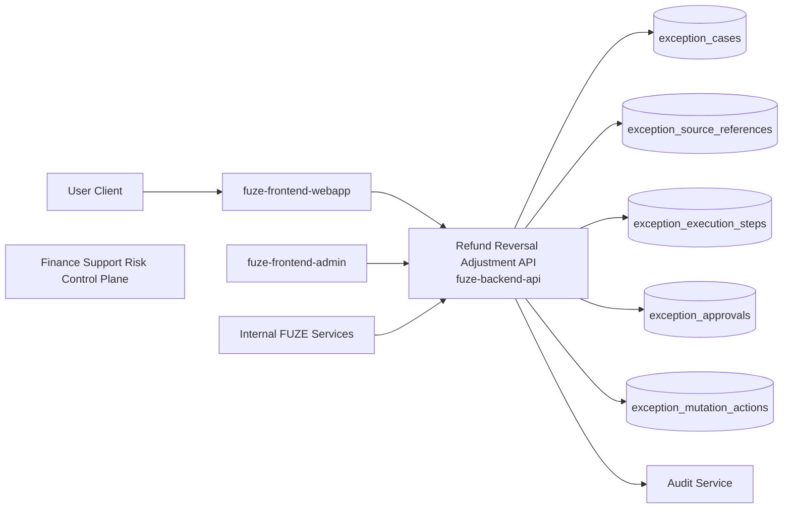
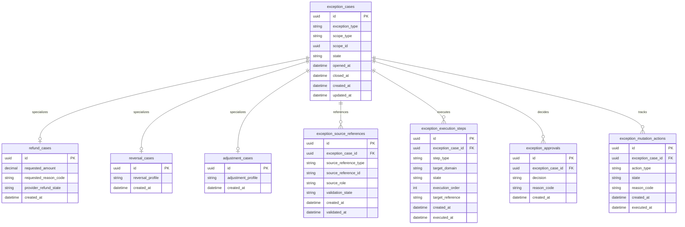
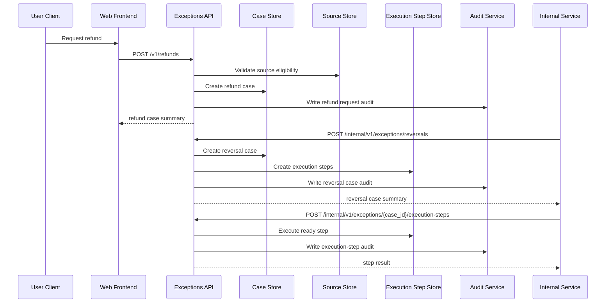

# REFUND_REVERSAL_ADJUSTMENT_API_SPEC

## 1. Title

**REFUND_REVERSAL_ADJUSTMENT_API_SPEC.md**

---

## 2. Document Metadata

- **Document Name:** REFUND_REVERSAL_ADJUSTMENT_API_SPEC.md
- **API Classification:** public, internal, admin, event-driven, chain-adjacent
- **Owning Domain:** Refund, Reversal, and Adjustment Domain
- **Primary Implementing Repo:** `fuze-backend-api`
- **Primary System of Record:** refund case, reversal case, adjustment case, commercial exception lineage, and downstream mutation coordination stores in `fuze-backend-api`
- **Status:** Draft for canonical source-of-truth approval
- **Purpose:** Define the production-grade API contract architecture for FUZE refunds, reversals, controlled financial adjustments, and exception-safe downstream correction behavior across the platform
- **Canonical Folder:** `fuze.ac > docs > api-spec`

---

## 2.1 API Classification Header

- **API Classification:** public | internal | admin | event-driven | chain-adjacent
- **Owning Domain:** Refund, Reversal, and Adjustment Domain
- **Primary Implementing Repo:** `fuze-backend-api`
- **Primary System of Record:** refund, reversal, and adjustment exception domain

---

## 3. Purpose

This document defines the canonical API specification for FUZE refund, reversal, and adjustment operations. It translates the governing FUZE platform architecture, payment-rail integration rules, subscriptions and usage billing rules, invoicing and receipt rules, Platform Credits semantics, fraud/abuse-prevention controls, and API architecture rules into an implementation-ready API contract.

This API exists because commercial exceptions are unavoidable in a multi-rail platform. Failed downstream fulfillment, duplicate settlement, cancellation windows, support-approved goodwill actions, payment-provider reversals, app-store corrections, fraud responses, and finance reconciliation mismatches all create situations where previously accepted commercial outcomes must be corrected carefully. These corrections must remain explicit, auditable, and lineage-preserving. A refund is not the same thing as a payment reversal, and neither is the same thing as a manual adjustment. Likewise, a downstream Platform Credits correction is not the same thing as a raw payment-rail refund.

Accordingly, this specification defines how refund, reversal, and adjustment cases are represented, how exception requests and approvals are handled, how upstream and downstream correction effects are coordinated safely, how user-visible status is exposed in a bounded way, and how exception handling remains idempotent, audit-safe, and architecture-consistent.

---

## 4. Scope

This specification covers:

- refund-case visibility APIs
- reversal-case visibility APIs
- adjustment-case visibility APIs
- user-facing refund-request initiation where policy allows
- internal service APIs for approved refund, reversal, and adjustment execution
- downstream correction coordination across payments, subscriptions, invoices/receipts, and Platform Credits
- admin/control-plane APIs for approval, denial, override-safe remediation, and discrepancy resolution
- event emission requirements for refund, reversal, and adjustment lifecycle changes
- request, response, error, idempotency, versioning, audit, and database-shape rules for this domain

This specification does **not** redefine:

- full payment-rail normalization rules
- full Platform Credits ledger semantics
- full subscription state machine semantics
- full invoice/receipt issuance rules
- payout execution or profit participation rules
- token or treasury semantics
- external provider contractual refund windows in provider-specific detail
- final legal/compliance policy wording

Those remain governed by their own source-of-truth specifications.

---

## 5. Source-of-Truth Inputs

### Primary FUZE docs and specs used

#### Highest-priority platform and ownership sources
- `SYSTEM_SPEC_INDEX.md`
- `SYSTEM_BOUNDARY_AND_OWNERSHIP_SPEC.md`
- `SYSTEM_OVERVIEW_AND_BOUNDARIES_SPEC.md`
- `PLATFORM_ARCHITECTURE_SPEC.md`
- `DOMAIN_OWNERSHIP_MATRIX_SPEC.md`
- `DATA_MODEL_AND_ENTITY_OWNERSHIP_SPEC.md`
- `ONCHAIN_OFFCHAIN_RESPONSIBILITY_SPEC.md`

#### Primary exception / commercial / financial sources
- `REFUND_REVERSAL_AND_ADJUSTMENT_SPEC.md`
- `PAYMENT_RAILS_INTEGRATION_SPEC.md`
- `PAYMENT_FRAUD_AND_ABUSE_PREVENTION_SPEC.md`
- `PLATFORM_CREDITS_SPEC.md`
- `CREDIT_LEDGER_AND_SETTLEMENT_SPEC.md`
- `SUBSCRIPTIONS_AND_USAGE_BILLING_SPEC.md`
- `INVOICING_AND_RECEIPTS_SPEC.md`
- `PRICING_AND_MONETIZATION_MODEL_SPEC.md`

#### API and runtime sources
- `API_ARCHITECTURE_SPEC.md`
- `PUBLIC_API_SPEC.md`
- `INTERNAL_SERVICE_API_SPEC.md`
- `EVENT_MODEL_AND_WEBHOOK_SPEC.md`
- `IDEMPOTENCY_AND_VERSIONING_SPEC.md`
- `MIGRATION_AND_BACKWARD_COMPATIBILITY_SPEC.md`
- `AUDIT_LOG_AND_ACTIVITY_SPEC.md`

#### Security and operations sources
- `SECURITY_AND_RISK_CONTROL_SPEC.md`
- `SECRETS_CONFIG_AND_ENVIRONMENT_SPEC.md`
- `MONITORING_ALERTING_AND_INCIDENT_RESPONSE_SPEC.md`

#### Format guides
- `The_API_Specification_guide.md`
- `Database_Schemas_Guide.md`

### Highest-priority interpretation applied

For this file, the most important governing interpretation is:

1. refunds, reversals, and adjustments are exception-handling domains, not ordinary primary commercial flows
2. payment refund, payment reversal, credits correction, billing correction, and document supersession must remain explicitly distinct
3. backend owns canonical exception-case truth
4. downstream corrections must preserve lineage instead of rewriting earlier commercial history
5. products may request eligible exceptions or consume corrected downstream state, but do not define exception semantics
6. admin/control-plane may approve or remediate under controlled policy but do not own underlying commercial truth

### Supporting external standards used only as guidance

- HTTP semantics for safe reads and mutation responses
- structured problem-details error design
- general exception-case workflow and immutable-ledger correction patterns as supporting guidance

External guidance does not override FUZE source-of-truth documents.

---

## 6. Governing Architecture and Ownership Interpretation

This API belongs to the **Refund, Reversal, and Adjustment Domain** because it owns the lifecycle of exceptional commercial corrections after primary commercial events have already occurred or partially occurred. It governs how a correction request is recorded, validated, approved or denied, executed, and linked to upstream causes and downstream correction effects.

This API is implemented primarily in `fuze-backend-api` because:

- backend owns durable exception-case truth
- exception handling crosses multiple sensitive domains and cannot be frontend-owned
- downstream corrections must be coordinated transactionally or with explicit orchestration lineage
- finance/support/fraud interventions must be backend-governed
- audit generation and policy enforcement must be centralized

This API is **not** owned by:

- `fuze-frontend-webapp`, because webapp may initiate eligible requests and read status but does not own exception truth
- `fuze-frontend-admin`, because admin surfaces approve or remediate but do not own canonical exception truth
- payment-rail providers, because provider refund status is an upstream or adjacent signal, not the canonical cross-domain exception owner
- Platform Credits, Billing, or Invoicing domains, because those domains consume controlled correction outputs rather than own cross-domain exception-case orchestration
- product domains, because products may be the context of a case but do not define refund/reversal/adjustment semantics

### Architectural implications

- one exception case may reference one or more upstream commercial sources
- refund, reversal, and adjustment types must remain explicitly typed
- a payment refund may require downstream credits or billing corrections, but that correction must be represented explicitly
- not all exception cases produce user-facing monetary return; some produce only internal correction or reversal of prior platform state
- user-facing status must remain bounded and not expose hidden operator or fraud-review detail
- correction outputs must preserve original lineage rather than silently mutate prior records

---

## 7. Domain Responsibilities

The Refund, Reversal, and Adjustment API domain is responsible for:

1. maintaining canonical refund, reversal, and adjustment case records
2. exposing bounded case status for eligible user, support, and admin consumers
3. validating exception eligibility against policy and source lineage
4. coordinating approved upstream payment corrections and downstream platform corrections
5. supporting internal service execution of exception actions
6. supporting admin/control-plane approval, denial, and remediation actions
7. emitting exception-domain events
8. generating audit lineage for sensitive correction actions
9. preserving separation between payment correction, credits correction, billing correction, and document correction
10. preserving immutable historical lineage for all corrections

The domain is not responsible for:

- directly owning all underlying payment or billing state as source of truth
- directly replacing immutable ledger history with rewritten balances
- defining full fraud-policy logic
- defining payout correction policy
- defining treasury policy
- defining all product refund eligibility policy details outside canonical platform controls

---

## 8. Out of Scope

The following are out of scope for this API specification:

- direct provider SDK and settlement API internals
- full legal/consumer-rights policy wording per jurisdiction
- raw chargeback dispute process detail
- final invoice/receipt PDF regeneration detail
- payout or profit-participation correction rules
- unsupported discretionary peer-to-peer settlements
- accounting export format details
- full human support SOPs

Where later detailed specs are needed, they must remain compatible with this API.

---

## 9. Canonical Entities and Data Ownership

### Durable entities

#### 9.1 exception_cases
- **Owner:** Refund, Reversal, and Adjustment Domain
- **Purpose:** canonical supertype or routing record for all commercial exception cases
- **Nature:** source-of-truth durable entity

#### 9.2 refund_cases
- **Owner:** Refund, Reversal, and Adjustment Domain
- **Purpose:** canonical refund-case records
- **Nature:** source-of-truth durable entity

#### 9.3 reversal_cases
- **Owner:** Refund, Reversal, and Adjustment Domain
- **Purpose:** canonical reversal-case records
- **Nature:** source-of-truth durable entity

#### 9.4 adjustment_cases
- **Owner:** Refund, Reversal, and Adjustment Domain
- **Purpose:** canonical manual or policy-driven adjustment-case records
- **Nature:** source-of-truth durable entity

#### 9.5 exception_source_references
- **Owner:** Refund, Reversal, and Adjustment Domain
- **Purpose:** normalized references to payment attempts, subscription cycles, invoices, receipts, credit ledger entries, or approved upstream sources involved in the case
- **Nature:** source-of-truth durable reference entity

#### 9.6 exception_execution_steps
- **Owner:** Refund, Reversal, and Adjustment Domain
- **Purpose:** explicit execution-step lineage for upstream and downstream corrections
- **Nature:** durable orchestration lineage entity

#### 9.7 exception_approvals
- **Owner:** Refund, Reversal, and Adjustment Domain
- **Purpose:** approval or denial records where policy requires review
- **Nature:** durable approval lineage entity

#### 9.8 exception_mutation_actions
- **Owner:** Refund, Reversal, and Adjustment Domain
- **Purpose:** high-level action records for request, approval, execution, denial, remediation, and closure
- **Nature:** durable action records with audit linkage

#### 9.9 exception_audit_events
- **Owner:** Audit / Activity domain, sourced by Refund, Reversal, and Adjustment Domain
- **Purpose:** immutable trail for sensitive correction actions
- **Nature:** durable audit records

### Derived or cached entities

#### 9.10 exception_status_views
- **Owner:** derived read-model layer
- **Purpose:** user-facing and admin-facing case summaries
- **Nature:** derived

#### 9.11 downstream_correction_views
- **Owner:** derived ops read-model layer
- **Purpose:** visibility into completed downstream corrections across domains
- **Nature:** derived

#### 9.12 exception_eligibility_views
- **Owner:** derived read-model layer
- **Purpose:** bounded view of whether a source may still be eligible for exception initiation
- **Nature:** derived, not canonical policy truth

---

## 10. State Model and Lifecycle

### 10.1 exception case lifecycle

Possible states:

- `opened`
- `under_review`
- `approved`
- `denied`
- `executing`
- `partially_executed`
- `completed`
- `failed`
- `closed`

### 10.2 refund case subtype lifecycle

Possible states:

- `opened`
- `eligible`
- `ineligible`
- `approved`
- `submitted_to_provider_if_needed`
- `provider_confirmed`
- `completed`
- `failed`
- `closed`

### 10.3 reversal case subtype lifecycle

Possible states:

- `opened`
- `validated`
- `approved_if_required`
- `executing`
- `completed`
- `failed`
- `closed`

### 10.4 adjustment case subtype lifecycle

Possible states:

- `opened`
- `validated`
- `approved_if_required`
- `executing`
- `completed`
- `failed`
- `closed`

### 10.5 execution-step lifecycle

Possible states:

- `pending`
- `ready`
- `executing`
- `completed`
- `failed`
- `cancelled`
- `superseded`

Lifecycle notes:
- approval may be required before execution depending on policy
- exception execution may include multiple ordered steps across domains
- completion requires all mandatory execution steps to be terminally completed
- denied and failed remain durable historical outcomes and must not be silently removed

---

## 11. API Surface Overview

The API surface is divided into four families:

### 11.1 Public / first-party user-facing APIs
Used by `fuze-frontend-webapp` and approved first-party clients for:
- listing eligible user-visible exception cases
- creating refund requests where policy allows
- reading current case status
- reading bounded exception eligibility summaries for owned/authorized scopes

### 11.2 Internal service APIs
Used by trusted internal services for:
- creating internal reversal or adjustment cases
- validating and executing correction steps
- coordinating downstream corrections across payments, billing, credits, and documents
- reading canonical case and execution status

### 11.3 Admin / control-plane APIs
Used by `fuze-frontend-admin` through backend-only privileged routes for:
- approve/deny actions
- forced remediation or controlled override-safe execution
- discrepancy closure
- exception review transitions
- case restriction or escalation handling

### 11.4 Event-driven interfaces
Used for downstream side effects:
- audit generation
- payment correction coordination
- credits correction coordination
- billing/document correction coordination
- analytics and reconciliation
- monitoring and fraud/support workflows

---

## 12. Authentication and Authorization Model

### 12.1 Authentication posture by route family

#### Authenticated user routes
Require valid authenticated session:
- read owned/authorized exception cases
- request eligible refund case initiation
- read bounded eligibility and case status

#### Internal service routes
Require internal service identity with explicit least privilege:
- create reversal/adjustment cases
- execute approved correction steps
- read canonical case status and execution-step status

#### Admin routes
Require privileged operator identity plus reason-coded actions:
- approve or deny
- force remediation under controlled policy
- escalate or close discrepancy
- override-safe step execution where policy allows

### 12.2 Authorization checkpoints

Authorization must evaluate:
- canonical account identity
- session validity
- target scope and source ownership
- actor’s workspace role where applicable
- whether action is request, read, internal execution, or privileged approval/remediation
- whether source is still eligible for exception handling
- whether operator approval is required
- whether admin/operator role is present for privileged actions

### 12.3 Sensitive action rules

The following require heightened checks:
- refund request creation for paid commercial sources
- approval or denial decisions
- internal execution of reversal/adjustment steps
- override-safe remediation and forced closure
- any action affecting multiple downstream domains

---

## 13. API Endpoints / Interface Contracts

## 13.1 Public / First-Party User APIs

### 13.1.1 `GET /v1/refunds`
**Purpose:** list visible refund cases for current actor’s account scope  
**Caller Type:** authenticated user  
**Auth Expectation:** valid authenticated session  
**Query Parameters Summary:**
- pagination
- optional state filters
- optional date range
**Response Summary:**
- refund case summaries
- created_at
- current state
- bounded source summary
- bounded outcome summary
**Side Effects:** none
**Audit Requirements:** access logging only
**Emitted Events:** none required

### 13.1.2 `GET /v1/workspaces/{workspace_id}/refunds`
**Purpose:** list visible refund cases for an authorized workspace scope  
**Caller Type:** authenticated user  
**Response Summary:** workspace refund case summaries
**Side Effects:** none

### 13.1.3 `POST /v1/refunds`
**Purpose:** create refund request for an eligible source where policy allows user initiation  
**Caller Type:** authenticated user with scope authority  
**Request Body Summary:**
- `scope_type`
- `scope_id`
- `source_reference_type`
- `source_reference_id`
- `requested_reason_code`
- optional `user_note`
- `idempotency_key`
**Response Summary:**
- refund case summary
- initial state
- eligibility or review summary
**Side Effects:** creates refund case and initial action lineage
**Idempotency Behavior:** required
**Audit Requirements:** sensitive exception initiation audit
**Emitted Events:** `exceptions.refund_requested`

### 13.1.4 `GET /v1/refunds/{refund_case_id}`
**Purpose:** retrieve canonical bounded refund-case detail view  
**Caller Type:** authenticated user with scope visibility  
**Response Summary:**
- case summary
- state
- bounded review/execution summary
- created_at / updated_at
- bounded source summary
**Side Effects:** none

### 13.1.5 `GET /v1/exception-eligibility`
**Purpose:** retrieve bounded eligibility summary for one owned/authorized source  
**Caller Type:** authenticated user  
**Query Parameters Summary:**
- `scope_type`
- `scope_id`
- `source_reference_type`
- `source_reference_id`
**Response Summary:**
- eligible / ineligible
- bounded reason codes
- applicable exception families
**Side Effects:** none

## 13.2 Internal Service APIs

### 13.2.1 `POST /internal/v1/exceptions/reversals`
**Purpose:** create reversal case from an internal detected condition or approved upstream signal  
**Caller Type:** internal trusted services  
**Auth Expectation:** service-to-service identity only  
**Request Body Summary:**
- `scope_type`
- `scope_id`
- `source_references[]`
- `reversal_reason_code`
- `execution_profile`
- `idempotency_key`
**Response Summary:** reversal-case summary and initial execution-step plan
**Side Effects:** creates reversal case and execution-step lineage
**Idempotency Behavior:** required
**Audit Requirements:** sensitive exception initiation audit
**Emitted Events:** `exceptions.reversal_opened`

### 13.2.2 `POST /internal/v1/exceptions/adjustments`
**Purpose:** create adjustment case for approved manual/platform correction need  
**Caller Type:** internal trusted services with adjustment authority  
**Request Body Summary:**
- `scope_type`
- `scope_id`
- `source_references[]`
- `adjustment_reason_code`
- `adjustment_profile`
- `idempotency_key`
**Response Summary:** adjustment-case summary and initial execution-step plan
**Side Effects:** creates adjustment case and execution-step lineage
**Idempotency Behavior:** required
**Audit Requirements:** sensitive exception initiation audit
**Emitted Events:** `exceptions.adjustment_opened`

### 13.2.3 `POST /internal/v1/exceptions/{exception_case_id}/execution-steps`
**Purpose:** execute one ready correction step in a case  
**Caller Type:** internal trusted services with execution authority  
**Request Body Summary:**
- `execution_step_id`
- optional `execution_metadata`
- `idempotency_key`
**Response Summary:** updated execution-step summary and case progression summary
**Side Effects:** executes a downstream correction step and updates case state
**Idempotency Behavior:** required
**Audit Requirements:** critical exception execution audit
**Emitted Events:** `exceptions.execution_step_completed`, `exceptions.execution_step_failed`

### 13.2.4 `GET /internal/v1/exceptions/{exception_case_id}`
**Purpose:** retrieve canonical exception-case truth for trusted services  
**Caller Type:** internal trusted services  
**Response Summary:** full case status, subtype detail, execution-step summaries, approval summaries, and source references
**Side Effects:** none

### 13.2.5 `POST /internal/v1/exceptions/{exception_case_id}/close`
**Purpose:** close completed or terminally denied/failed case with explicit closure lineage  
**Caller Type:** internal trusted services with close authority  
**Request Body Summary:**
- `closure_reason_code`
- `idempotency_key`
**Response Summary:** closed case summary
**Side Effects:** case transitions to closed
**Idempotency Behavior:** required
**Audit Requirements:** critical exception closure audit
**Emitted Events:** `exceptions.case_closed`

## 13.3 Admin / Control-Plane APIs

### 13.3.1 `POST /admin/v1/exceptions/{exception_case_id}/approve`
**Purpose:** approve exception case requiring operator approval  
**Caller Type:** admin/operator  
**Request Body Summary:**
- `reason_code`
- `operator_note`
- optional `approval_scope`
- `idempotency_key`
**Response Summary:** approval summary and updated case state
**Side Effects:** approval record created, case may move to approved or ready-for-execution
**Audit Requirements:** critical audit
**Emitted Events:** `exceptions.case_approved`

### 13.3.2 `POST /admin/v1/exceptions/{exception_case_id}/deny`
**Purpose:** deny exception case requiring operator decision  
**Caller Type:** admin/operator  
**Request Body Summary:**
- `reason_code`
- `operator_note`
- `idempotency_key`
**Response Summary:** denial summary and updated case state
**Side Effects:** denial record created, case moves to denied or closed-ready
**Audit Requirements:** critical audit
**Emitted Events:** `exceptions.case_denied`

### 13.3.3 `POST /admin/v1/exceptions/{exception_case_id}/remediate`
**Purpose:** apply controlled remediation or override-safe execution path under policy  
**Caller Type:** admin/operator  
**Request Body Summary:**
- `remediation_action`
- `operator_note`
- `related_case_id`
- `idempotency_key`
**Response Summary:** remediation summary and updated case/execution state
**Side Effects:** may create remediation step, retry failed step, or mark bounded override action
**Audit Requirements:** critical audit
**Emitted Events:** `exceptions.case_remediated`

### 13.3.4 `POST /admin/v1/exception-discrepancies`
**Purpose:** resolve discrepancy involving refund, reversal, or adjustment case under controlled policy  
**Caller Type:** admin/operator  
**Request Body Summary:**
- `exception_case_id`
- `resolution_code`
- `operator_note`
- `related_case_id`
- `idempotency_key`
**Response Summary:** discrepancy-resolution summary
**Side Effects:** may update case, execution, or closure posture with preserved lineage
**Audit Requirements:** critical audit
**Emitted Events:** `exceptions.discrepancy_resolved`

---

## 14. Request Rules

### 14.1 General request rules
- all mutation-capable routes must require JSON requests with explicit content type
- all mutation routes must carry correlation IDs
- sensitive exception mutations must carry idempotency keys
- admin mutations must require reason codes and operator notes
- no route may accept frontend-computed correction truth as authoritative input

### 14.2 Sensitive-action request requirements
The following requests require heightened validation:
- refund request initiation
- reversal/adjustment case creation
- approval or denial
- execution-step execution
- remediation and discrepancy resolution
- closure of cases with partial execution history

Heightened validation may include:
- source ownership and scope checks
- duplicate-source correction checks
- approval-policy checks
- execution-step readiness checks
- operator role confirmation
- support/finance/fraud case linkage for admin flows

### 14.3 Scope integrity rule
Exception mutations must target valid and authorized sources and scopes. Product or service callers must not create or execute exception cases for unrelated or unauthorized scopes.

### 14.4 Downstream-correction rule
A refund, reversal, or adjustment case must coordinate downstream corrections explicitly. The exception domain records the case truth first, then triggers or tracks downstream correction steps, rather than silently mutating downstream domains without lineage.

---

## 15. Response Rules

### 15.1 Success response rules
Successful responses must include:
- stable resource identifiers
- timestamps for created/updated state
- state/status values
- scope and source summaries
- approval or execution summaries where relevant
- correlation references for mutations

### 15.2 Async-accepted response rules
If review, approval, or correction execution is async, the response must:
- return accepted status
- include action or job ID
- provide follow-up status semantics

### 15.3 Terminal mutation response rules
Terminal mutation responses must clearly show:
- target exception case
- mutation type
- resulting case, approval, or execution state
- downstream correction effects where relevant
- whether user-visible status may refresh asynchronously

### 15.4 Read response rules
Read responses must distinguish:
- durable case truth
- bounded user-visible review/execution summaries
- downstream correction summaries that are safe to expose
- operator-only details that must remain excluded from user-facing views

---

## 16. Error Model

The API uses structured problem-details style error responses.

### 16.1 Required error fields
- `type`
- `title`
- `status`
- `code`
- `detail`
- `instance`
- `correlation_id`

### 16.2 Common error codes

#### Authorization / permission errors
- `EXCEPTIONS_SESSION_REQUIRED`
- `EXCEPTIONS_PERMISSION_DENIED`
- `EXCEPTIONS_OPERATOR_PERMISSION_DENIED`
- `EXCEPTIONS_SERVICE_PERMISSION_DENIED`

#### State conflict errors
- `EXCEPTIONS_CASE_STATE_INVALID`
- `EXCEPTIONS_APPROVAL_ALREADY_TERMINAL`
- `EXCEPTIONS_EXECUTION_STEP_ALREADY_TERMINAL`
- `EXCEPTIONS_SOURCE_ALREADY_CORRECTED`
- `EXCEPTIONS_CLOSURE_CONFLICT`

#### Policy / safety errors
- `EXCEPTIONS_SOURCE_NOT_ELIGIBLE`
- `EXCEPTIONS_SCOPE_RESTRICTED`
- `EXCEPTIONS_APPROVAL_REQUIRED`
- `EXCEPTIONS_DOWNSTREAM_CORRECTION_REQUIRED`
- `EXCEPTIONS_REMEDIATION_FORBIDDEN`

#### Request integrity errors
- `EXCEPTIONS_IDEMPOTENCY_KEY_REQUIRED`
- `EXCEPTIONS_REQUEST_INVALID`
- `EXCEPTIONS_REQUEST_UNPROCESSABLE`

#### Dependency or provider errors
- `EXCEPTIONS_DOWNSTREAM_UNAVAILABLE`
- `EXCEPTIONS_PROVIDER_REFUND_UNAVAILABLE`
- `EXCEPTIONS_RECONCILIATION_UNAVAILABLE`

### 16.3 Error handling rules
- do not expose hidden fraud/support/operator internals
- do not imply final credits, billing, or provider refund success solely from case creation
- distinguish ineligible source from approval-required outcome
- distinguish failed downstream correction from denied case
- include retry guidance only where safe

---

## 17. Idempotency and Mutation Safety

### 17.1 Required idempotent mutations
The following mutation routes require idempotent behavior:
- refund request creation
- reversal case creation
- adjustment case creation
- execution-step execution
- approval / denial
- remediation
- discrepancy resolution
- case closure

### 17.2 Idempotency key rules
- mutation requests must supply `Idempotency-Key`
- backend stores key scope, request hash, actor, and terminal result
- replay of same semantic request returns original terminal outcome
- replay of same key with different semantic request must fail with conflict

### 17.3 Mutation safety rules
- the same source must not be corrected twice through conflicting exception outcomes unless an explicit supersession-safe case lineage exists
- execution steps must not apply the same downstream correction twice
- approval and denial must preserve explicit decision lineage
- case closure must not hide unfinished mandatory execution steps
- remediation must preserve immutable history rather than rewrite prior records

---

## 18. Versioning and Compatibility Rules

### 18.1 Versioning
This API family is versioned under `/v1`, `/internal/v1`, and `/admin/v1` route families.

### 18.2 Compatibility approach
- additive evolution preferred
- no silent semantic change to case, approval, or execution-step states
- new source-reference types may be added without breaking existing contracts
- response fields may be added but existing meanings must remain stable

### 18.3 Breaking-change rules
Breaking changes include:
- changing the meaning of approved, denied, completed, or failed exception states
- changing downstream-correction semantics incompatibly
- removing critical case or execution fields
- changing source-eligibility rules incompatibly

Such changes require explicit migration planning and version evolution.

### 18.4 Deprecation
Deprecated routes or fields must:
- be documented explicitly
- carry deprecation metadata where supported
- preserve compatibility windows long enough for first-party consumers and future SDKs

---

## 19. Event Emission and Webhook Behavior

This domain is event-capable.

### 19.1 Internal events
The Refund, Reversal, and Adjustment domain must emit canonical internal events such as:
- `exceptions.refund_requested`
- `exceptions.reversal_opened`
- `exceptions.adjustment_opened`
- `exceptions.case_approved`
- `exceptions.case_denied`
- `exceptions.execution_step_completed`
- `exceptions.execution_step_failed`
- `exceptions.case_remediated`
- `exceptions.discrepancy_resolved`
- `exceptions.case_closed`

### 19.2 Event payload minimums
Each event should contain:
- event ID
- event type
- occurred_at
- scope type and scope ID
- exception case ID
- subtype classification
- source references where relevant
- actor type
- correlation ID
- reason code where applicable

### 19.3 External webhook posture
This specification does not expose general third-party webhooks for raw refund, reversal, or adjustment case mutations by default. Any future outbound exception webhook surface must be narrow, security-reviewed, and governed by a separate contract.

---

## 20. Audit and Activity Requirements

The following actions must generate durable audit events:

- refund request creation
- reversal/adjustment case creation
- approval or denial
- execution-step completion or failure
- remediation actions
- discrepancy resolution
- case closure
- other sensitive exception flows

### Required audit fields
- audit event ID
- actor type and actor reference
- scope type and scope reference
- target case / action / execution-step reference as applicable
- action type
- before/after case summary where applicable
- reason code
- correlation ID
- operator note if operator action
- occurred_at

User-facing activity feeds may show a filtered subset, but audit truth must remain durable and immutable.

---

## 21. Data Model and Database Schema View

### 21.1 `exception_cases`
- `id` PK
- `exception_type`
- `scope_type`
- `scope_id`
- `state`
- `opened_at`
- `closed_at` nullable
- `created_at`
- `updated_at`

**Constraints:**
- index on (`scope_type`, `scope_id`)
- index on (`exception_type`, `state`)

### 21.2 `refund_cases`
- `id` PK and FK -> `exception_cases.id`
- `requested_amount` nullable
- `requested_reason_code`
- `provider_refund_state` nullable
- `created_at`

### 21.3 `reversal_cases`
- `id` PK and FK -> `exception_cases.id`
- `reversal_profile`
- `created_at`

### 21.4 `adjustment_cases`
- `id` PK and FK -> `exception_cases.id`
- `adjustment_profile`
- `created_at`

### 21.5 `exception_source_references`
- `id` PK
- `exception_case_id` FK -> `exception_cases.id`
- `source_reference_type`
- `source_reference_id`
- `source_role`
- `validation_state`
- `created_at`
- `validated_at` nullable

**Constraints:**
- index on `exception_case_id`
- index on (`source_reference_type`, `source_reference_id`)

### 21.6 `exception_execution_steps`
- `id` PK
- `exception_case_id` FK -> `exception_cases.id`
- `step_type`
- `target_domain`
- `state`
- `execution_order`
- `target_reference`
- `created_at`
- `executed_at` nullable
- `failed_at` nullable

**Constraints:**
- index on `exception_case_id`
- index on (`state`, `execution_order`)

### 21.7 `exception_approvals`
- `id` PK
- `exception_case_id` FK -> `exception_cases.id`
- `decision`
- `reason_code`
- `operator_note` nullable
- `decided_by_actor_type`
- `decided_by_actor_id`
- `created_at`

**Constraints:**
- index on `exception_case_id`

### 21.8 `exception_mutation_actions`
- `id` PK
- `exception_case_id` FK -> `exception_cases.id`
- `action_type`
- `state`
- `reason_code`
- `operator_note` nullable
- `requested_by_actor_type`
- `requested_by_actor_id`
- `created_at`
- `executed_at` nullable
- `closed_at` nullable
- `correlation_id`

### 21.9 `idempotency_records`
- `id` PK
- `idempotency_key`
- `scope_family`
- `actor_reference`
- `request_hash`
- `response_hash`
- `terminal_status`
- `created_at`
- `expires_at`

### 21.10 `audit_log_entries`
Domain-sourced audit records written into the audit domain.

### Normalization notes
- canonical exception truth stays in `exception_cases` and subtype tables
- sources, approvals, and execution steps remain separate lineage layers
- downstream domain corrections are referenced through execution steps, not hidden inside case status only
- user-facing summaries are derived and must not replace canonical case state

### Reconciliation notes
- one source may map to multiple exception cases only when policy and lineage explicitly allow it
- execution steps must reconcile to downstream domain outcomes
- closure must reconcile to all mandatory steps reaching terminal states
- approvals and denials must remain historically queryable

---

## 22. Architecture Diagram — Mermaid flowchart



---

## 23. Data Design — Mermaid Diagram



---

## 24. Flow View

### 24.1 Happy path — user refund request
1. authenticated actor requests refund for eligible source
2. backend validates scope authority and source eligibility
3. refund case is created
4. case enters opened or under_review according to policy
5. audit event is written
6. `exceptions.refund_requested` event is emitted

### 24.2 Happy path — approved reversal/adjustment execution
1. internal service or admin creates reversal/adjustment case
2. required approvals are gathered if policy requires
3. execution steps are created in ordered sequence
4. internal services execute ready steps one by one
5. all mandatory steps complete successfully
6. case moves to completed and then closed
7. audit and events are emitted

### 24.3 Alternate path — approval denied
1. case enters under_review
2. operator evaluates policy and lineage
3. operator denies case
4. denial record is created
5. case transitions to denied and later closed
6. audit and denial event are emitted

### 24.4 Failure path — source not eligible
1. request is submitted for source outside policy or already terminally corrected
2. backend rejects initiation or validation
3. no active executable case is opened
4. bounded failure response is returned

### 24.5 Failure and remediation path — downstream correction step fails
1. case is approved and executing
2. one execution step fails in downstream domain
3. case moves to failed or partially_executed
4. operator or internal remediation path retries or applies alternate remediation
5. immutable lineage records failed and remediated attempts
6. case completes or closes with explicit failure posture

### 24.6 Retry behavior
- duplicate request initiation returns same terminal case result
- duplicate approval or denial returns same terminal decision result
- duplicate execution-step invocation returns same terminal step result
- duplicate closure returns same terminal closed state

---

## 25. Data Flows — Mermaid sequenceDiagram



---

## 26. Security and Risk Controls

1. **Exception truth is backend-owned**  
   Frontends and products may not authoritatively mark refunds, reversals, or adjustments as completed outside approved backend APIs.

2. **Refund, reversal, and adjustment are distinct**  
   The API must keep exception-family semantics explicitly separate.

3. **Source validation**  
   Cases must validate ownership, eligibility, and prior-correction lineage before execution.

4. **Least privilege**  
   Internal execution routes must be limited to authorized service callers with explicit exception-execution privileges.

5. **Approval support**  
   The domain must support explicit review and approval where policy requires it.

6. **Immutable lineage**  
   Corrections, denials, failures, and remediations must preserve history instead of rewriting prior records.

7. **Problem-details discipline**  
   Error bodies must be structured and safe, without exposing hidden support/fraud/operator-only details.

8. **Audit immutability**  
   Sensitive exception actions require durable immutable audit lineage.

9. **Replay resistance**  
   Case creation, approval, execution, remediation, and closure must be idempotent and replay-safe.

10. **Downstream separation**  
    Payment correction, credits correction, billing correction, and document correction must remain explicitly represented and not silently collapse together.

---

## 27. Operational Considerations

- exception-case reads are user- and support-visible and should be highly available
- execution-step orchestration must be correctness-sensitive and traceable
- failed downstream steps require explicit remediation visibility
- approval queues should surface clearly to support/finance/admin tools
- monitoring should alert on:
  - spikes in refund requests
  - unusual approval/denial ratios
  - repeated execution-step failures
  - discrepancy-resolution spikes
  - partially-executed cases left open too long

---

## 28. Acceptance Criteria

1. The API preserves the distinction between refunds, reversals, adjustments, Platform Credits corrections, billing corrections, and payment-provider outcomes.
2. Only `fuze-backend-api` owns canonical exception-case truth.
3. Exception cases are durable and backend-owned.
4. User-facing refund initiation is policy-bounded and source-validated.
5. Approval, denial, and execution-step lineage are explicit and immutable.
6. Downstream corrections are represented explicitly through execution steps.
7. Case completion and closure are idempotent and auditable.
8. Internal execution routes are least-privilege and backend-only.
9. Admin routes require reason-coded privileged authorization.
10. Event emissions exist for major exception-case mutations.
11. Response and error semantics are stable and machine-readable.
12. Database schema separates canonical cases, subtype detail, sources, approvals, and execution lineage.
13. Products can consume canonical exception APIs without redefining refund/reversal/adjustment semantics.
14. Discrepancy and remediation handling are supported and safely replayable.
15. Mermaid diagrams remain consistent with prose and data model.

---

## 29. Test Cases

### 29.1 Positive cases
1. Authenticated user creates eligible refund request successfully.
2. Authenticated user reads owned refund-case summary successfully.
3. Internal service creates reversal case successfully.
4. Internal service creates adjustment case successfully.
5. Admin approves case successfully.
6. Internal service executes ready correction step successfully.
7. Admin remediates failed case successfully.
8. Internal service closes completed case successfully.

### 29.2 Negative cases
9. Unauthenticated call to user exception route is rejected.
10. User without scope authority cannot request refund for workspace-owned source.
11. Request for ineligible source returns `EXCEPTIONS_SOURCE_NOT_ELIGIBLE`.
12. Attempt to execute step before approval when approval is required returns `EXCEPTIONS_APPROVAL_REQUIRED`.
13. Duplicate correction attempt against already corrected source returns `EXCEPTIONS_SOURCE_ALREADY_CORRECTED`.
14. Closure with unfinished mandatory step returns closure conflict/state error.

### 29.3 Authorization cases
15. Ordinary user cannot call admin approve/deny/remediate routes.
16. Internal service without execution privilege cannot execute correction step.
17. Internal service without close privilege cannot close case.
18. Product service cannot mark correction complete without canonical execution-step path.

### 29.4 Idempotency and replay cases
19. Repeating refund request with same idempotency key returns original case result.
20. Repeating approval with same idempotency key returns original approval result.
21. Repeating execution-step call with same idempotency key returns original terminal step result.
22. Repeating closure with same idempotency key returns original closed result.

### 29.5 Concurrency cases
23. Concurrent approval and denial attempts preserve one explicit terminal decision lineage.
24. Concurrent execution of the same step produces one terminal success/failure result and one duplicate-safe outcome.
25. Concurrent remediation and closure preserve explicit case-state ordering without hidden overwrite.

### 29.6 Recovery / admin cases
26. Failed downstream correction step can be remediated under controlled policy.
27. Denied case remains historically queryable after closure.
28. Partially-executed case preserves explicit downstream correction status until remediation or final closure.

### 29.7 Event and audit cases
29. Successful refund request emits `exceptions.refund_requested`.
30. Successful approval emits `exceptions.case_approved`.
31. Successful execution-step completion emits `exceptions.execution_step_completed`.
32. Successful discrepancy resolution emits `exceptions.discrepancy_resolved` with critical audit lineage.

---

## 30. Open Questions or Explicit Deferred Decisions

1. Exact user-initiable refund eligibility rules by product and rail are deferred.
2. Exact dual-approval requirements for large exceptions are deferred.
3. Exact provider-refund state mapping for all rails is deferred.
4. Exact downstream step templates for each exception family are deferred.
5. Exact user-visible explanation detail for denied cases is deferred.
6. Exact reconciliation-case taxonomy is deferred.

---

## 31. Implementation Notes for `fuze-backend-api`

Recommended backend module layout:

```text
modules/platform/
  refund-reversal-adjustment/
  payment-normalization/
  commerce-billing/
  platform-credits/
  invoicing-receipts/
  audit-log/
  control-plane/
```

Implementation guidance:
- keep case identity, subtype detail, source validation, approval lineage, and execution-step orchestration in one canonical domain service
- perform source-eligibility and duplicate-correction checks inside the commit boundary
- keep downstream correction coordination explicit and idempotent
- treat approvals, denials, and remediations as domain actions, not ad hoc row edits
- emit events only after canonical state commit succeeds
- publish user-facing summaries from canonical truth; do not let derived views mutate case state

---

## 32. Frontend Consumption Notes

### For `fuze-frontend-webapp`
- may read owned/authorized refund cases and request eligible refunds
- must not infer canonical correction success from provider UI state or product-local status alone
- must treat backend exception responses as authoritative
- should clearly distinguish requested, under review, approved, executing, completed, denied, and failed states
- should not present refund request creation as automatic financial completion unless final case outcome confirms that result

### For `fuze-frontend-admin`
- may trigger privileged approval, denial, remediation, discrepancy, and closure actions only through backend admin APIs
- must require operator reason input for sensitive mutations
- must not directly mutate exception truth client-side
- should present immutable audit-linked summaries after privileged actions

---

## 33. Contract Derivation Notes

### OpenAPI / AsyncAPI
This spec should later derive into:
- refund-case read and request operations
- internal reversal/adjustment creation operations
- execution-step operations
- admin approval/denial/remediation/discrepancy operations
- shared problem-details schema
- exception-domain events in AsyncAPI

### Future `fuze-sdk`
Future `fuze-sdk` packages may derive:
- refund-case request helpers
- exception-status polling helpers
- typed case, approval, and execution-step models
- problem-error models for exception outcomes

The SDK must derive from approved API contracts and must not become the source of truth over this narrative specification.
