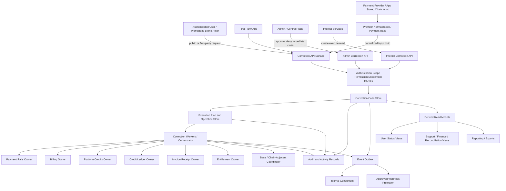
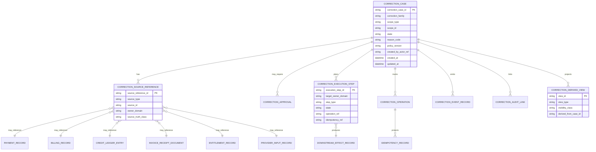
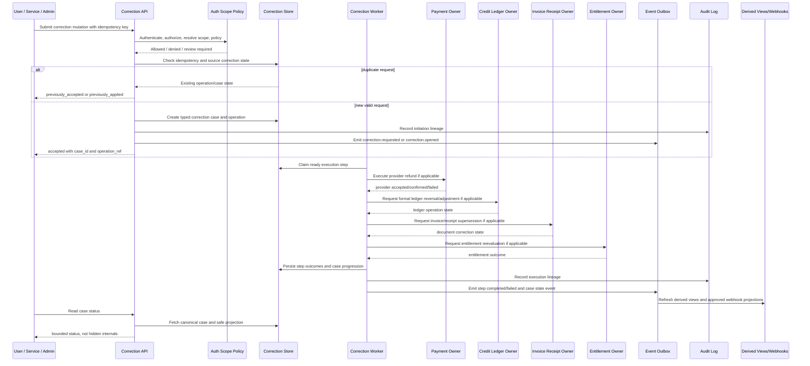

# REFUND_REVERSAL_AND_ADJUSTMENT_API_SPEC

## Title
FUZE Refund, Reversal, and Adjustment API Specification

## Document Metadata

- **Document Name:** `REFUND_REVERSAL_AND_ADJUSTMENT_API_SPEC.md`
- **Document Type:** Production-grade API SPEC v2 / interface-contract specification
- **Status:** Draft for canonical API SPEC v2 approval
- **Version:** 2.0.0
- **Effective Date:** 2026-04-24
- **Last Updated:** 2026-04-24
- **Reviewed On:** 2026-04-24
- **Document Owner:** FUZE Platform Commercial Corrections API Governance Domain
- **Approval Authority:** FUZE Platform Architecture and Governance Authority; formal named approver not yet attached
- **Review Cadence:** Quarterly or upon material change to refund policy, payment-rail correction behavior, Platform Credits semantics, credit-ledger settlement posture, subscription/billing correction posture, invoice/receipt supersession posture, fraud/risk controls, admin-control authority, event/webhook semantics, or chain-adjacent commitment correction posture
- **Governing Layer:** API SPEC v2 / shared commercial, monetization, and financial rails API layer
- **Parent Registry:** API SPEC v2 Canonical File Registry
- **Upstream Semantic Registry:** `REFINED_SYSTEM_SPEC_INDEX.md`
- **Upstream API Registry:** `API_SPEC_INDEX.md`
- **Primary Audience:** API architecture, backend engineering, payments engineering, billing engineering, credits and ledger engineering, finance operations, support operations, fraud/risk operations, security engineering, audit/compliance, frontend application teams, admin/control-plane implementers, event/webhook contract authors, OpenAPI/AsyncAPI/SDK authors, QA and contract-validation teams
- **Primary Purpose:** Define the production-grade FUZE API contract for typed refund, reversal, and adjustment cases so exceptional commercial corrections remain explicit, lineage-preserving, idempotent, auditable, scope-aware, policy-constrained, and safe across payment records, subscriptions, usage billing, Platform Credits, credit-ledger settlement, invoices/receipts, entitlements, reporting, and Base commitment linkage.
- **Primary Upstream References:** `REFINED_SYSTEM_SPEC_INDEX.md`; `API_SPEC_INDEX.md`; `DOCS_SPEC_INDEX.md`; `SYSTEM_SPEC_INDEX.md`; `REFUND_REVERSAL_AND_ADJUSTMENT_SPEC.md`; `PLATFORM_CREDITS_SPEC.md`; `CREDIT_LEDGER_AND_SETTLEMENT_SPEC.md`; `SUBSCRIPTIONS_AND_USAGE_BILLING_SPEC.md`; `PAYMENT_RAILS_INTEGRATION_SPEC.md`; `INVOICING_AND_RECEIPTS_SPEC.md`; `PAYMENT_FRAUD_AND_ABUSE_PREVENTION_SPEC.md`; `PRICING_AND_MONETIZATION_MODEL_SPEC.md`; `API_ARCHITECTURE_SPEC.md`; `PUBLIC_API_SPEC.md`; `INTERNAL_SERVICE_API_SPEC.md`; `EVENT_MODEL_AND_WEBHOOK_SPEC.md`; `IDEMPOTENCY_AND_VERSIONING_SPEC.md`; `MIGRATION_AND_BACKWARD_COMPATIBILITY_SPEC.md`; `AUDIT_LOG_AND_ACTIVITY_SPEC.md`; `AUDIT_AND_ACCESS_TRACEABILITY_SPEC.md`; `SECURITY_AND_RISK_CONTROL_SPEC.md`; `MONITORING_ALERTING_AND_INCIDENT_RESPONSE_SPEC.md`; `FUZE_ACCOUNT_ACCESS_AND_SESSION_THESIS_FINAL_SPEC.md`; `FUZE_ACCOUNT_ACCESS_AND_SESSION_CANONICAL_FINAL_SPEC.md`; `FUZE_WORKSPACE_ACCESS_CONTROL_BASICS_THESIS_FINAL_SPEC.md`.
- **Primary Downstream Dependents:** OpenAPI contracts for refund/reversal/adjustment routes; AsyncAPI contracts for correction-domain events and webhooks; backend service implementation contracts; admin/control-plane contracts; public and first-party application clients; finance/support/fraud workflows; reconciliation and reporting projections; contract-validation suites; audit and observability instrumentation; migration plans from v1 `REFUND_REVERSAL_ADJUSTMENT_API_SPEC.md`.
- **API Surface Families Covered:** First-party application APIs, authenticated caller-scoped public APIs, internal service APIs, admin/control-plane APIs, event APIs, webhook projections, reporting/read-model APIs, chain-adjacent coordination references.
- **API Surface Families Excluded:** Raw payment-provider SDK APIs, raw ledger database APIs, raw accounting-book exports, direct treasury/vault/multisig APIs, direct chain contract ABIs, unsupported public refund authority, product-local hidden correction endpoints.
- **Canonical System Owner(s):** Refund, Reversal, and Adjustment Domain for typed correction case truth; Payment Rails Integration Domain for normalized payment-origin truth; Subscription and Usage Billing Domain for billing truth; Platform Credits Domain for credits semantics; Credit Ledger and Settlement Domain for authoritative ledger mutation truth; Invoicing and Receipts Domain for billing-document truth; Entitlement and Capability Gating Domain for product capability truth; Audit and Activity domains for audit evidence; Security/Risk domains for risk restrictions and containment.
- **Canonical API Owner:** FUZE Platform Commercial Corrections API Governance Domain, implemented primarily through `fuze-backend-api` owner-domain routes and contracts.
- **Supersedes:** v1 `REFUND_REVERSAL_ADJUSTMENT_API_SPEC.md` as the current production-grade API SPEC v2 expression for this domain; any weaker route inventories that collapse refund, reversal, adjustment, ledger correction, document supersession, or goodwill compensation.
- **Superseded By:** Not yet known.
- **Related Decision Records:** Not explicitly specified in retrieved governing materials.
- **Canonical Status Note:** This API specification expresses interface-contract truth only. Refined system specifications own semantic truth. API, SDK, route, event, webhook, admin, reporting, and implementation layers MUST NOT reinterpret refund, reversal, adjustment, ledger, document, billing, payment, entitlement, fraud/risk, or chain-adjacent semantics for convenience.
- **Implementation Status:** Normative API SPEC v2 baseline; implementation contracts, route handlers, event catalogs, read-model contracts, and QA suites must be derived from this file and the named upstream refined semantics.
- **Approval Status:** Draft for API SPEC v2 review.
- **Change Summary:** Renamed and upgraded the v1 refund/reversal/adjustment API specification into the API SPEC v2 canonical filename and structure; strengthened metadata, truth classes, surface families, route family posture, request/response/error semantics, idempotency, conflict-resolution, admin-control constraints, event/webhook rules, data design, diagrams, acceptance criteria, tests, migration posture, and forbidden non-canonical patterns.

## Purpose

This specification defines the production-grade API contract for FUZE refund, reversal, and adjustment capabilities.

The API exists because FUZE must correct commercial state after primary commercial events have occurred, partially occurred, failed downstream, been invalidated by a provider, been disputed, been overcharged, been scoped incorrectly, or been approved for support/finance remediation. Refunds, reversals, and adjustments are not one generic correction primitive. They are separate typed correction families with different authority, lineage, audit, policy, downstream-effect, and user-visibility rules.

This API therefore governs how correction cases are requested, classified, validated, approved, denied, executed, retried, remediated, closed, exposed through bounded reads, emitted through events, projected through webhooks where approved, and preserved for audit and reconciliation.

## Scope

This API specification governs:

1. caller-scoped refund request and refund-status APIs;
2. workspace-scoped refund visibility APIs where authorization permits;
3. internal reversal and adjustment case creation APIs;
4. internal correction execution-step APIs;
5. admin/control-plane approval, denial, remediation, escalation, discrepancy-resolution, and closure APIs;
6. event families for correction case and correction execution lifecycle changes;
7. webhook projection posture for approved external-safe correction events;
8. request, response, error, result, status, idempotency, rate-limit, replay, audit, observability, versioning, and migration requirements;
9. read-model and reporting boundaries for correction status views, finance dashboards, support views, reconciliation exports, and public-safe projections;
10. implementation-contract guardrails for OpenAPI, AsyncAPI, SDKs, backend services, workers, event consumers, admin tooling, and QA suites.

## Out of Scope

This API specification does not govern:

- full payment-provider refund protocol details or provider SDK behavior;
- final consumer-law or jurisdiction-specific refund rights;
- raw payment normalization semantics beyond consuming normalized payment truth;
- Platform Credits semantic truth;
- authoritative credit-ledger append mechanics in full depth;
- subscription pricing, billing-cycle, or usage-rating semantics in full depth;
- invoice/receipt rendering, PDF generation, or tax document formatting in full depth;
- fraud/risk threshold policy in full depth;
- final accounting-book treatment;
- treasury, vault, payout, token, or governance execution semantics;
- exact Base contract ABI or chain-write batching internals;
- support SOP wording, refund copy, or user-interface messaging.

Those items belong to adjacent refined system specs and downstream implementation/runbook artifacts. This API spec defines the interface-contract posture that must preserve those boundaries.

## Design Goals

1. Preserve typed correction semantics across API surfaces.
2. Prevent silent balance, billing, payment, ledger, document, entitlement, or reporting rewrites.
3. Make correction initiation, approval, execution, retry, remediation, and closure idempotent and audit-safe.
4. Provide bounded user-facing status without exposing sensitive fraud, support, finance, or operator internals.
5. Ensure internal service APIs coordinate downstream corrections without becoming hidden broad-write shortcuts.
6. Keep admin/control-plane authority explicit, reason-coded, policy-constrained, and separate from ordinary application routes.
7. Make accepted-state distinct from final business outcome for async and multi-domain correction flows.
8. Keep derived reads, dashboards, exports, and public/webhook projections downstream to canonical correction truth.
9. Support OpenAPI, AsyncAPI, SDK, migration, and QA derivation without allowing schema or route drift.
10. Make conflict-resolution, default decision, and forbidden-pattern rules explicit enough for implementation review.

## Non-Goals

This API specification is not intended to:

- make every refund request user-initiated or publicly available;
- mirror internal service routes as public APIs;
- give frontend, product, provider, admin, or worker code authority to directly mutate balances or documents;
- represent support goodwill as a payment refund;
- treat chargeback, provider refund, ledger reversal, billing correction, document supersession, and entitlement restriction as the same state;
- guarantee full unwind where value has already been consumed;
- hide complex multi-domain correction behind fake synchronous success;
- make event receipt a substitute for explicit owner-domain mutation authority;
- allow reporting or support dashboards to become canonical correction owners.

## Core Principles

### 1. Refined Semantics Own Meaning
`REFUND_REVERSAL_AND_ADJUSTMENT_SPEC.md` owns the semantic distinction among refund, reversal, and adjustment. This API owns only the interface expression of that meaning.

### 2. Typed Correction Is Mandatory
Every correction case exposed or mutated by this API MUST have a stable correction family: `refund`, `reversal`, or `adjustment`. Generic `fix`, `credit_change`, `manual_balance_update`, or `support_action` mutations are non-canonical.

### 3. Owner-Domain Mutation Boundary
Correction APIs may coordinate downstream effects, but canonical writes MUST terminate in the rightful owner domains: payment normalization, billing, credits, ledger, documents, entitlements, fraud/risk, audit, and chain-adjacent layers remain separate.

### 4. Lineage Over Rewrite
The API MUST preserve the original commercial event and every correction action as linked historical records. Corrective state is additive, superseding, reversing, or offsetting; it is not destructive rewrite.

### 5. Accepted Is Not Completed
A response that accepts a correction request, approval, remediation, or execution step MUST NOT imply final provider refund, ledger mutation, entitlement change, document supersession, or chain-adjacent reconciliation unless the relevant owner-domain outcome is terminal.

### 6. Public and First-Party Narrowing
Authenticated user and first-party application APIs may request or read eligible status, but they MUST expose a narrower, safer, caller-scoped subset of correction truth than internal or admin APIs.

### 7. Admin Control Is Bounded
Admin/control-plane APIs exist for review, approval, denial, remediation, discrepancy resolution, containment, and closure. They MUST be reason-coded, permission-bounded, policy-versioned where applicable, attributable, and durably audited.

### 8. Internal APIs Are Not Escape Hatches
Internal service APIs MUST preserve owner-domain boundaries. Service-to-service trust does not authorize arbitrary balance mutation, unscoped document voiding, provider refund fabrication, or entitlement removal without typed correction lineage.

### 9. Derived Reads Are Not Owners
Correction views, finance dashboards, support summaries, analytics exports, and public/webhook projections MAY derive from canonical correction truth but MUST NOT become semantic owners or mutation authorities.

### 10. Replay Safety Is Required
Correction flows are financially sensitive and cross-domain. All mutation-capable routes and event consumers MUST be idempotent, replay-safe, duplicate-tolerant, and correlation-aware.

## Canonical Definitions

### Refund
A formal return-of-value case tied to an original paid commercial event, payment rail event, or billing correction. A refund may require provider submission, provider confirmation, billing-document correction, credits reversal, entitlement change, or debt/offset treatment depending on unused versus consumed value.

### Reversal
An internal unwind of economic effects already represented in FUZE, such as unused paid credits, duplicated ledger effects, invalid subscription activation, incorrect usage settlement, or entitlement activated from invalidated funding. Reversal does not necessarily return external value.

### Adjustment
A controlled corrective mutation for cases that standard refund or reversal semantics cannot fully resolve, such as support-issued compensating credits, wrong workspace assignment, incident repair, enterprise settlement correction, migration repair, reconciliation fix, or post-review fraud/dispute correction.

### Correction Case
The canonical supertype resource that records typed correction family, scope, source references, lifecycle state, reason code, approval posture, execution plan, downstream effects, audit linkage, and terminal outcome.

### Source Reference
A normalized reference to the original commercial source: payment intent, payment attempt, provider event, billing cycle, invoice, receipt, credit ledger entry, entitlement activation, usage event, adjustment case, fraud/dispute case, or approved migration/remediation source.

### Execution Step
A durable step in the correction plan that coordinates with an owner domain, such as provider refund submission, ledger reversal, document supersession, entitlement restriction, reporting projection refresh, or Base commitment reconciliation.

### Operation Reference
A stable API-level reference returned for accepted async work. It is not a final business outcome.

### Bounded User View
A caller-safe representation of correction status that excludes fraud-review internals, operator notes, sensitive policy details, provider secrets, and internal reconciliation evidence.

### Correction Scope
The account, workspace, organization, or narrower commercial scope whose state is being corrected. Scope resolution MUST use canonical account/session/workspace/access semantics.

### Provider Input
Raw payment-provider, app-store, Telegram, stablecoin, partner, or chain observation data prior to FUZE normalization and owner-domain acceptance.

## Truth Class Taxonomy

The API MUST preserve these truth classes:

1. **Semantic Truth** — refund, reversal, adjustment, source lineage, unused/consumed value, correction scope, and correction lifecycle meaning owned by refined system specs.
2. **API Contract Truth** — route families, request classes, response classes, error classes, status contracts, idempotency rules, versioning posture, and surface-family constraints owned by this API specification.
3. **Policy Truth** — refund eligibility, approval requirement, operator authority, fraud/risk hold, review escalation, scope restrictions, and public exposure policy owned by policy/security/fraud/access domains.
4. **Runtime Truth** — current request handling, operation state, execution-step progression, retry/degraded mode, provider availability, worker status, and dependency state.
5. **Ledger / Storage Truth** — durable correction cases, source references, execution steps, idempotency records, audit references, ledger entries, document records, and owner-domain storage records.
6. **Payment-Rail Truth** — normalized payment events, provider refund/reversal status, chargebacks, disputes, revocations, and provider settlement state owned by payment rails integration.
7. **Billing Truth** — subscription and usage-billing obligations, billing cycle state, overcharge state, commercial entitlement state, and pricing/proration policy references owned by billing and pricing domains.
8. **Credit Ledger Truth** — append-oriented credits ledger mutation and settlement lineage owned by credit ledger and settlement.
9. **Invoice / Receipt Truth** — document issuance, voiding, supersession, receipt allocation, delivery, and correction note truth owned by invoicing and receipts.
10. **Entitlement Truth** — product capability eligibility and gating effects owned by entitlement/capability domains.
11. **Event / Async Truth** — event records, operation references, queue/workflow progression, webhook projections, replay, and redelivery state.
12. **Projection / Reporting Truth** — support dashboards, finance exports, reconciliation views, analytics, public-safe summaries, and user-facing status views derived from canonical records.
13. **Presentation Truth** — UI labels, help text, receipt copy, support wording, SDK field names, and frontend composition.

These truth classes MUST NOT be collapsed. In particular, provider refund status is not correction truth until normalized and accepted; ledger balance is derived from ledger entries, not admin input; public refund status is a bounded view, not the full operator case.

## Architectural Position in the Spec Hierarchy

This API spec sits below:

- `REFINED_SYSTEM_SPEC_INDEX.md`
- `DOCS_SPEC_INDEX.md`
- `SYSTEM_SPEC_INDEX.md`
- `API_SPEC_INDEX.md`
- `REFUND_REVERSAL_AND_ADJUSTMENT_SPEC.md`
- shared commercial refined specs for credits, ledger, billing, payments, invoicing, fraud/risk, pricing, entitlement, audit, and security
- shared API refined specs for API architecture, public API, internal service API, event/webhook, idempotency/versioning, migration/backward compatibility, audit/activity, and operations
- account/session and workspace/access-control canonical foundation documents

This API spec sits above or alongside:

- OpenAPI route definitions for refund/reversal/adjustment routes;
- AsyncAPI event and webhook contracts;
- service implementation contracts;
- database schema and migration specs;
- worker orchestration contracts;
- admin/control-plane implementation specs;
- read-model and reporting contracts;
- QA and contract-validation suites.

## Upstream Semantic Owners

The following upstream semantic owners MUST be preserved:

| Semantic Area | Upstream Owner | API Consumption Rule |
| --- | --- | --- |
| Correction classification and lifecycle | Refund, Reversal, and Adjustment refined spec | API MUST expose typed correction case semantics and cannot merge families. |
| External payment and provider inputs | Payment Rails Integration | API consumes normalized payment truth; raw provider input is never accepted as final correction truth. |
| Platform Credits meaning | Platform Credits | API cannot redefine credits, scopes, classes, or spend semantics. |
| Ledger entries and settlement | Credit Ledger and Settlement | API triggers or tracks formal ledger correction; it cannot directly rewrite balances. |
| Subscription and usage billing | Subscriptions and Usage Billing | API consumes billing correction eligibility and effect rules; it cannot rewrite billing history. |
| Invoices and receipts | Invoicing and Receipts | API requests document supersession/voiding/correction notes; document truth remains separate. |
| Fraud and abuse prevention | Payment Fraud and Abuse Prevention | API consumes holds, restrictions, and review outcomes; fraud internals stay bounded. |
| Access, scopes, and permissions | Account/session and workspace/access specs | API must use canonical actor, session, workspace, role, permission, and access-evaluation semantics. |
| Entitlements | Entitlement and Capability Gating | API may cause entitlement reevaluation but does not own capability truth. |
| Events and webhooks | Event Model and Webhook | API emits owner-domain events and projections under event rules. |
| Audit and observability | Audit / Security / Operations specs | API must preserve reconstructible lineage. |

## API Surface Families

### Public / Authenticated Caller-Scoped Surfaces
Public or public-adjacent authenticated routes MAY expose:

- eligible refund request creation for caller-owned sources;
- bounded refund status reads;
- caller or workspace correction-history summaries;
- eligibility reads for caller-owned sources;
- operation references for accepted async requests.

They MUST NOT expose:

- arbitrary adjustment creation;
- internal reversal execution;
- provider refund control primitives;
- fraud/risk details beyond safe status classes;
- operator notes;
- cross-scope correction histories;
- ledger or billing internals that exceed caller visibility.

### First-Party Application Surfaces
First-party web or app clients MAY use authenticated public/application routes for caller-safe initiation and status. They do not receive internal write authority merely because FUZE owns the client.

### Internal Service Surfaces
Internal service APIs support service-to-service creation, validation, planning, execution, and status reads for correction cases. They require explicit service identity, least-privilege grants, owner-domain boundaries, idempotency, and audit lineage.

### Admin / Control-Plane Surfaces
Admin/control APIs support approval, denial, escalation, remediation, retry, discrepancy resolution, restriction, and closure. They require privileged actor identity, scope authority, reason codes, operator notes, policy references where applicable, idempotency, and critical audit records.

### Event Surfaces
Events announce correction facts, accepted intents, execution-step progression, downstream outcomes, remediation, terminal closure, and projection refresh triggers. Events are not write authority.

### Webhook Surfaces
External webhook projections MAY exist only for approved public-safe events and MUST be minimal, stable, identifier-forward, replay-safe, and narrower than internal event families.

### Reporting / Read-Model Surfaces
Reporting and support views are derived and read-only. They must preserve canonical case, source, downstream-effect, and audit references.

### Chain-Adjacent Surfaces
Chain-adjacent references MAY expose or coordinate Base commitment linkage, stable identifiers, reconciliation status, and operation state. They MUST NOT claim on-chain completion before chain-native evidence exists and MUST NOT collapse off-chain correction truth into contract-native truth.

## System / API Boundaries

### Governed by This API Spec

- correction case resource families;
- public/first-party/internal/admin route family posture;
- request/response/status/error contracts;
- operation references and accepted-state semantics;
- idempotency and replay behavior;
- correction event and webhook posture;
- admin/control-plane guardrails;
- read-model and reporting derivation rules;
- migration/versioning and OpenAPI/AsyncAPI/SDK derivation rules.

### Governed by Upstream Refined System Specs

- what refunds, reversals, adjustments, unused value, consumed value, debt state, commercial source, and correction lineage mean;
- which owner domain owns payment, credits, ledger, billing, document, entitlement, audit, fraud/risk, or chain-adjacent truth;
- conflict-resolution posture for commercial correction semantics.

### Governed by Implementation Contracts

- exact database schemas;
- exact endpoint path parameter formats;
- final JSON schema enumerations;
- worker queue names and retry schedules;
- provider-adapter API calls;
- exact OpenAPI/AsyncAPI YAML;
- metrics names and alert thresholds;
- internal service module boundaries.

## Adjacent API Boundaries

- `PLATFORM_CREDITS_API_SPEC.md` owns credits balance, reservation, debit, release, and credit-facing read/write APIs.
- `CREDIT_LEDGER_AND_SETTLEMENT_API_SPEC.md` owns authoritative ledger-entry and settlement APIs.
- `SUBSCRIPTIONS_AND_USAGE_BILLING_API_SPEC.md` owns subscription, billing-cycle, usage-billing, and proration APIs.
- `PAYMENT_RAILS_INTEGRATION_API_SPEC.md` owns payment intent, payment attempt, provider callback, payment status, and provider refund normalization APIs.
- `INVOICING_AND_RECEIPTS_API_SPEC.md` owns invoice/receipt resource, issuance, voiding, supersession, access, and delivery APIs.
- `PAYMENT_FRAUD_AND_ABUSE_PREVENTION_API_SPEC.md` owns risk holds, risk review, dispute containment, and abuse-control APIs.
- `AUDIT_LOG_AND_ACTIVITY_API_SPEC.md` owns audit evidence and activity-history APIs.
- `EVENT_MODEL_AND_WEBHOOK_SPEC.md` and derived event/API specs own event envelope and webhook projection posture.
- `IDEMPOTENCY_AND_VERSIONING_SPEC.md` owns shared replay and contract-version posture.
- `MIGRATION_AND_BACKWARD_COMPATIBILITY_SPEC.md` owns API coexistence, migration, cutover, deprecation, and historical interpretability rules.

## Conflict Resolution Rules

When API behavior is contested, the following order applies:

1. Active refined registry and higher-order platform boundary specs win on semantic authority.
2. `REFUND_REVERSAL_AND_ADJUSTMENT_SPEC.md` wins on typed correction meaning.
3. Domain owner specs win on their own payment, billing, credits, ledger, document, entitlement, fraud/risk, audit, and chain-adjacent truth.
4. Shared API architecture specs win on surface families, accepted-state, public/internal/admin separation, and API contract governance.
5. This API spec wins on refund/reversal/adjustment interface contract posture where it does not contradict upstream semantics.
6. OpenAPI/AsyncAPI/SDK/generated artifacts never win over this spec or upstream semantic specs.
7. Implementation convenience, support tooling, dashboards, exports, provider UIs, and frontend state never win over canonical owner-domain API contracts.
8. Where ambiguity remains, FUZE MUST choose the more conservative, architecture-consistent interpretation and require explicit recorded refinement.

## Default Decision Rules

1. Default to typed correction case creation rather than direct downstream mutation.
2. Default external exposure to non-public unless explicitly approved.
3. Default user-facing APIs to bounded status and safe reason codes.
4. Default admin actions to separated control-plane routes.
5. Default internal service writes to owner-domain contracts and least privilege.
6. Default accepted async corrections to `202 Accepted` or equivalent accepted-state responses with operation references.
7. Default duplicate requests to idempotent `previously_applied` or equivalent stable responses, not duplicated effects.
8. Default provider callbacks to normalized-input status until owner-domain validation succeeds.
9. Default consumed-value ambiguity to review, hold, debt/offset, or partial correction rather than full unwind.
10. Default reports, dashboards, caches, and exports to derived read-only posture.
11. Default chain-adjacent ambiguity to off-chain correction truth plus explicit pending/reconciliation status, not false chain completion.
12. Default unsupported or unsafe correction patterns to failure with structured errors.

## Roles / Actors / API Consumers

### Human Actors

- authenticated end user;
- workspace owner or billing admin;
- support operator;
- finance operator;
- fraud/risk reviewer;
- platform administrator;
- security reviewer;
- governance or approval actor.

### System Actors

- first-party web application;
- admin frontend;
- payment rails service;
- billing service;
- Platform Credits service;
- credit ledger and settlement service;
- invoicing/receipts service;
- entitlement service;
- fraud/risk service;
- event outbox and dispatcher;
- worker/orchestration service;
- reporting and reconciliation systems;
- Base/chain-adjacent coordination service;
- audit and observability systems;
- public webhook projection service.

## Resource / Entity Families

### Canonical API Resources

- `correction_case`
- `refund_case`
- `reversal_case`
- `adjustment_case`
- `correction_source_reference`
- `correction_policy_reference`
- `correction_approval`
- `correction_execution_plan`
- `correction_execution_step`
- `correction_downstream_effect`
- `correction_operation`
- `correction_discrepancy`
- `correction_remediation_action`
- `correction_closure`
- `correction_audit_link`
- `correction_event_projection`
- `correction_status_view`

### Derived / Read-Only Resources

- `caller_correction_summary`
- `workspace_correction_summary`
- `finance_reconciliation_view`
- `support_case_correction_view`
- `admin_review_queue_view`
- `public_safe_correction_status_projection`
- `correction_analytics_export`

Derived resources MUST carry canonical references and MUST NOT accept canonical correction mutations.

## Ownership Model

### This API Owns

- API contract shape for correction cases;
- route family posture;
- request, response, error, result, status, and operation reference classes;
- correction API idempotency requirements;
- admin/control-plane API guardrails;
- event/webhook exposure posture for this domain;
- API-level migration and downstream contract derivation rules.

### This API Does Not Own

- payment truth;
- billing truth;
- Platform Credits semantic truth;
- credit ledger mutation truth;
- invoice/receipt truth;
- entitlement truth;
- fraud/risk policy truth;
- audit record truth;
- chain-native truth;
- accounting-book truth;
- public reporting truth.

### Canonical Write Rule

A correction case may coordinate one or more downstream mutations, but each downstream mutation MUST be executed through that downstream owner domain's explicit contract. Direct database writes across domains are forbidden.

## Authority / Decision Model

### Correction Authority
The correction API domain decides correction family, case lifecycle state, source-reference set, execution plan, approval posture, operation identity, and downstream-effect coordination requirements.

### Source Authority
Payment, billing, invoice, receipt, credit, ledger, entitlement, and fraud/risk domains decide the truth and validity of their source records and state.

### Policy Authority
Policy/security/fraud/access domains decide whether a correction action is allowed, restricted, review-required, escalated, or blocked.

### Execution Authority
Execution workers and service callers may execute only ready, approved, authorized, idempotent execution steps. Worker possession of a job does not grant semantic authority.

### Operator Authority
Admin actors may approve, deny, remediate, retry, close, or escalate only through reason-coded control-plane APIs, under permission, scope, policy, and audit constraints.

## Authentication Model

### Caller-Scoped Public and First-Party APIs

- MUST require authenticated account/session for owned-source reads and refund initiation.
- MUST validate active session and account continuity through canonical account/session semantics.
- MUST require workspace context where the source is workspace-owned.
- MUST not infer workspace billing authority from login alone.

### Internal Service APIs

- MUST require authenticated service identity.
- MUST authorize service principal for the specific operation and domain collaboration.
- MUST carry correlation ID and service lineage.

### Admin / Control-Plane APIs

- MUST require privileged operator identity.
- MUST bind the operator to a role/permission granting the specific correction action.
- MUST require step-up or stronger approval for high-impact correction classes where policy requires it.

### Event and Webhook APIs

- Event publication requires authorized owner-domain service identity.
- Webhook endpoint management requires owner-scoped or admin-scoped authorization.
- Webhook delivery uses signing, delivery identifiers, and replay-safe receiving semantics.

## Authorization / Scope / Permission Model

Authorization MUST evaluate:

1. actor identity;
2. session validity;
3. source ownership;
4. account or workspace scope;
5. workspace role and effective permission;
6. requested action class;
7. correction family;
8. source eligibility;
9. policy hold/restriction state;
10. approval requirement;
11. service principal grants;
12. admin/control-plane authority;
13. cross-domain downstream effect rights;
14. visibility class for requested response.

### Required Permission Classes

- `correction.refund.request`
- `correction.refund.read`
- `correction.case.read_internal`
- `correction.reversal.create_internal`
- `correction.adjustment.create_internal`
- `correction.execution.execute_internal`
- `correction.admin.review`
- `correction.admin.approve`
- `correction.admin.deny`
- `correction.admin.remediate`
- `correction.admin.close`
- `correction.reporting.read`
- `correction.audit.link_read`

Permission names are normative class names. Exact IAM identifiers belong in implementation contracts.

## Entitlement / Capability-Gating Model

Correction eligibility and visibility may be constrained by entitlement and capability gates, but entitlement does not replace authorization.

- Refund request initiation MAY be unavailable for a product, plan, rail, jurisdiction, or source class.
- Workspace correction reads MAY require billing-admin or owner capability.
- Admin remediation MAY require product, rail, financial, fraud, or governance-sensitive capability gates.
- Entitlement changes caused by corrections MUST flow through entitlement owner-domain contracts.
- Capability denial MUST return structured policy/scope errors rather than pretending the source is absent unless privacy requires non-disclosure.

## API State Model

### Correction Case States

- `drafted`
- `opened`
- `validating`
- `ineligible`
- `under_review`
- `approved`
- `denied`
- `execution_planned`
- `executing`
- `partially_executed`
- `completed`
- `failed_retryable`
- `failed_terminal`
- `remediation_required`
- `remediated`
- `closed`
- `superseded`

### Refund Substates

- `refund_requested`
- `source_eligible`
- `source_ineligible`
- `approval_required`
- `approved_for_provider_submission`
- `submitted_to_provider`
- `provider_pending`
- `provider_confirmed`
- `provider_rejected`
- `internal_effects_pending`
- `refund_completed`

### Reversal Substates

- `reversal_opened`
- `source_validated`
- `ledger_effects_planned`
- `approval_required`
- `approved_for_execution`
- `ledger_reversal_pending`
- `ledger_reversal_applied`
- `downstream_effects_pending`
- `reversal_completed`

### Adjustment Substates

- `adjustment_opened`
- `adjustment_validated`
- `approval_required`
- `approved_for_execution`
- `adjustment_execution_pending`
- `adjustment_applied`
- `downstream_effects_pending`
- `adjustment_completed`

### Operation States

- `accepted`
- `previously_accepted`
- `processing`
- `applied`
- `previously_applied`
- `conflicted`
- `failed_retryable`
- `failed_terminal`
- `cancelled`

## Lifecycle / Workflow Model

1. **Intake:** A user, service, provider-normalization path, admin operator, or scheduled reconciliation process proposes a correction.
2. **Authentication and Scope Resolution:** The API resolves actor, session, account, workspace, service principal, and source visibility.
3. **Idempotency Check:** Mutation routes check request idempotency before any side effect.
4. **Source Validation:** The API validates source references with owner domains.
5. **Correction Classification:** The API records a typed correction family and source lineage.
6. **Eligibility / Policy Evaluation:** Policy, fraud/risk, entitlement, billing, payment, credits, and scope constraints are evaluated.
7. **Approval Routing:** If required, case enters review and awaits bounded admin/control-plane approval or denial.
8. **Execution Planning:** Approved cases generate explicit downstream execution steps.
9. **Execution:** Workers or internal services execute ready steps through owner-domain contracts.
10. **Event and Audit Emission:** Meaningful state changes emit audit records and events.
11. **Projection Refresh:** Derived reads, support views, finance dashboards, and webhook projections update downstream.
12. **Completion or Remediation:** Cases complete only when mandatory effects are terminal, or they enter remediation-required/failed states.
13. **Closure:** A completed, denied, failed-terminal, remediated, or superseded case may be closed with lineage preserved.

## Architecture Diagram — Mermaid Flowchart



## Data Design — Mermaid Diagram



Derived views and provider input records are not canonical mutation owners. Ledger, payment, billing, document, and entitlement records are owned by their respective domains.

## Flow View

### Primary Refund Request Flow

1. Caller submits a refund request for an owned or authorized source with an idempotency key.
2. API authenticates the caller and resolves account/workspace scope.
3. API validates source reference and caller visibility with the owning source domain.
4. API checks eligibility, policy holds, fraud/risk state, entitlement gates, duplicate correction state, unused/consumed value posture, and approval requirements.
5. API creates or returns the existing correction case under the idempotency key.
6. If immediate approval is not allowed, API returns accepted/review state with operation reference.
7. If approval is automatic and execution can begin, API creates execution steps.
8. Execution workers coordinate payment refund, ledger reversal, billing/document correction, entitlement adjustment, reporting refresh, and chain-adjacent reconciliation as applicable.
9. Events and audit records are emitted at each meaningful transition.
10. User-facing status reads show bounded case state and final outcome only after owner-domain terminal states exist.

### Admin Approval / Denial Flow

1. Operator reads eligible review queue.
2. Operator submits approve or deny request with reason code, note, idempotency key, and policy reference where required.
3. API validates operator identity, permission, scope, dual-control requirement, and case state.
4. API records approval/denial as durable lineage.
5. Approved cases move to execution planning; denied cases move to terminal or close-ready state.
6. Audit and events are emitted.

### Internal Reversal / Adjustment Flow

1. Internal service proposes reversal or adjustment with source references and idempotency key.
2. API validates service principal, source scope, and owner-domain claims.
3. API creates typed case and execution plan or routes to approval.
4. Execution steps run only through owner-domain contracts.
5. Partial failure enters retryable/remediation-required state without hiding partial effects.
6. Closure requires terminal step states or explicit remediation lineage.

### Failure, Retry, and Degraded Mode

- Retryable provider or owner-domain failure returns accepted state and operation reference, not final success.
- Duplicate execution attempts use idempotency and step identity to return existing state.
- Downstream unavailable state may pause execution and emit operational events.
- Failed provider refund does not erase correction case truth.
- Failed webhook delivery does not roll back correction truth.
- Chain-adjacent failure leaves off-chain correction truth intact and marks reconciliation pending or failed.

## Data Flows — Mermaid sequenceDiagram



## Request Model

### Common Request Headers

All mutation-capable routes MUST support or require:

- `Authorization` or service-auth equivalent;
- `Idempotency-Key` for mutation routes;
- `X-FUZE-Correlation-Id`;
- `X-FUZE-Request-Id` where generated by gateway or caller;
- `X-FUZE-API-Version` or versioned route family equivalent;
- content type `application/json` for JSON mutations;
- service identity or operator identity metadata for privileged routes.

### Common Mutation Body Fields

Mutation request bodies SHOULD include, as applicable:

- `scope_type` and `scope_id`;
- `source_references[]`;
- `requested_reason_code` or `operator_reason_code`;
- `requested_correction_family` where caller may propose but not decide family;
- `correction_profile` for internal/admin flows;
- `user_note` for caller-submitted context;
- `operator_note` for admin/control actions;
- `policy_reference` or `approval_policy_version` where required;
- `expected_case_state` for state-transition safety;
- `operation_metadata` for internal execution;
- `client_reference` for caller-side traceability.

### Request Rules

1. Frontend-computed monetary, credit, ledger, billing, or entitlement outcomes MUST NOT be accepted as authoritative.
2. Source references MUST identify owner domain and source type.
3. Admin and internal requests MUST not omit reason codes.
4. Cross-scope correction requests MUST fail unless explicitly authorized through control-plane policy.
5. Requests that would affect consumed value, negative balances, debt state, fraud holds, or chain-adjacent linkage MUST route to stricter policy checks.
6. Mutation routes MUST be safe under client retries.

## Response Model

### Common Response Fields

Responses SHOULD include:

- `correction_case_id`;
- `correction_family`;
- `state`;
- `substate`;
- `scope`;
- `source_summary`;
- `operation_ref` where async or idempotent mutation occurred;
- `idempotency_status` (`new`, `replayed`, `previously_accepted`, `previously_applied`);
- `created_at`;
- `updated_at`;
- `correlation_id`;
- `next_action` where safe;
- `safe_reason_code` for user-facing views;
- `approval_summary` for internal/admin views;
- `execution_summary` for internal/admin views;
- `downstream_effect_summary` for authorized internal/admin views.

### Response Classes

- `200 OK` for successful reads and already-applied idempotent mutations where route contract chooses stable replay response.
- `201 Created` for synchronous creation of case records where no async execution claim is made.
- `202 Accepted` for accepted async correction, approval, remediation, or execution work.
- `204 No Content` for rare idempotent no-body operations where contract explicitly permits.
- `400 Bad Request` for malformed requests.
- `401 Unauthorized` for missing/invalid authentication.
- `403 Forbidden` for authenticated but disallowed actions.
- `404 Not Found` for unavailable resources where non-disclosure is required.
- `409 Conflict` for state, duplicate source, concurrency, or correction conflict.
- `422 Unprocessable Entity` for semantically invalid source/correction requests.
- `423 Locked` or equivalent for policy/fraud/review hold where adopted by implementation conventions.
- `429 Too Many Requests` for rate-limit or abuse throttling.
- `500/502/503/504` for server/dependency failures with safe details only.

### Accepted-State Response Requirements

Accepted responses MUST include:

- operation reference;
- current case state;
- what has been accepted;
- what has not yet completed;
- safe status polling or webhook semantics;
- no claim of final provider refund, ledger correction, document supersession, entitlement change, or chain completion unless terminal owner-domain outcome exists.

## Error / Result / Status Model

### Error Body

Structured errors MUST include:

```json
{
  "type": "https://api.fuze.example/errors/correction-source-not-eligible",
  "title": "Correction source is not eligible",
  "status": 422,
  "code": "CORRECTION_SOURCE_NOT_ELIGIBLE",
  "detail": "The requested source cannot be corrected through this route.",
  "instance": "correction_cases/<case-or-request-ref>",
  "correlation_id": "corr_...",
  "retryable": false
}
```

### Error Code Families

#### Authentication / Authorization

- `CORRECTION_SESSION_REQUIRED`
- `CORRECTION_PERMISSION_DENIED`
- `CORRECTION_SCOPE_FORBIDDEN`
- `CORRECTION_OPERATOR_PERMISSION_DENIED`
- `CORRECTION_SERVICE_PERMISSION_DENIED`

#### Eligibility / Policy

- `CORRECTION_SOURCE_NOT_ELIGIBLE`
- `CORRECTION_APPROVAL_REQUIRED`
- `CORRECTION_POLICY_HOLD`
- `CORRECTION_FRAUD_REVIEW_REQUIRED`
- `CORRECTION_ENTITLEMENT_BLOCKED`
- `CORRECTION_CHAIN_RECONCILIATION_REQUIRED`

#### State / Conflict

- `CORRECTION_CASE_STATE_INVALID`
- `CORRECTION_SOURCE_ALREADY_CORRECTED`
- `CORRECTION_DUPLICATE_PENDING_CASE`
- `CORRECTION_EXECUTION_STEP_STATE_INVALID`
- `CORRECTION_CONSUMED_VALUE_CONFLICT`
- `CORRECTION_CLOSURE_CONFLICT`

#### Request Integrity

- `CORRECTION_IDEMPOTENCY_KEY_REQUIRED`
- `CORRECTION_IDEMPOTENCY_KEY_CONFLICT`
- `CORRECTION_SOURCE_REFERENCE_INVALID`
- `CORRECTION_REASON_CODE_REQUIRED`
- `CORRECTION_REQUEST_UNPROCESSABLE`

#### Dependency / Runtime

- `CORRECTION_PAYMENT_PROVIDER_UNAVAILABLE`
- `CORRECTION_LEDGER_UNAVAILABLE`
- `CORRECTION_BILLING_UNAVAILABLE`
- `CORRECTION_DOCUMENT_SERVICE_UNAVAILABLE`
- `CORRECTION_ENTITLEMENT_SERVICE_UNAVAILABLE`
- `CORRECTION_EXECUTION_RETRYABLE_FAILURE`
- `CORRECTION_EXECUTION_TERMINAL_FAILURE`

### Status Rules

- `denied` is not the same as `failed`.
- `provider_pending` is not the same as `completed`.
- `partially_executed` must preserve which steps succeeded and which remain pending/failed.
- `remediation_required` must not be hidden as generic failure in internal/admin APIs.
- User-facing status may simplify internal state only if the simplification does not misrepresent finality or eligibility.

## Idempotency / Retry / Replay Model

### Idempotency Required For

- refund request creation;
- reversal case creation;
- adjustment case creation;
- approval;
- denial;
- execution-step execution;
- retry/remediation;
- discrepancy resolution;
- closure;
- webhook delivery registration and redelivery actions where applicable.

### Idempotency Key Scope

Keys MUST be scoped by:

- caller identity or service principal;
- route family;
- target scope;
- source reference set;
- correction family;
- semantic operation type;
- request body hash or equivalent mutation fingerprint;
- policy version where required.

### Replay Rules

1. Same key and same semantic mutation returns the prior operation state.
2. Same key with different mutation fingerprint returns `CORRECTION_IDEMPOTENCY_KEY_CONFLICT`.
3. Duplicate source correction under different key returns a state or conflict response depending on whether the existing case is compatible.
4. Execution-step retry MUST be step-scoped and idempotent against owner-domain downstream contracts.
5. Event consumers and webhook consumers MUST assume at-least-once delivery.
6. Replay MUST not create duplicate provider refunds, ledger entries, document supersessions, or entitlement changes.

## Rate Limit / Abuse-Control Model

- Public/user refund initiation routes MUST be rate-limited per account, workspace, source, IP/device risk where applicable, and payment/source class.
- Eligibility read routes MUST be rate-limited to prevent enumeration of payment, billing, or workspace sources.
- Admin routes MUST be monitored for unusual volume, sensitive pattern, high-value corrections, and repeated override use.
- Internal execution APIs MUST use backpressure and dependency-aware retry controls.
- Webhook delivery and redelivery MUST have bounded retry windows and dead-letter posture.
- Abuse-control denials MUST preserve safe error semantics and avoid exposing fraud internals.

## Endpoint / Route Family Model

Exact paths may be refined in OpenAPI. The following route families are canonical.

### Public / First-Party Caller Routes

#### `GET /v2/corrections/refunds`
List caller-visible refund cases.

- Surface: authenticated public / first-party.
- Mutability: read-only.
- Required checks: session, account/workspace scope, visibility.
- Response: paginated bounded refund summaries.
- Forbidden: operator notes, fraud internals, full execution steps.

#### `GET /v2/workspaces/{workspace_id}/corrections/refunds`
List workspace-visible refund cases.

- Surface: authenticated public / first-party.
- Required checks: workspace membership and billing/correction visibility permission.

#### `POST /v2/corrections/refunds`
Request a refund for an eligible caller-owned source.

- Surface: authenticated public / first-party.
- Mutability: creates/returns correction case.
- Required: idempotency key, source reference, scope, reason code.
- Response: `201 Created` or `202 Accepted` with case and operation reference.
- Forbidden: caller-authoritative amounts, direct ledger changes, provider refund control.

#### `GET /v2/corrections/refunds/{refund_case_id}`
Read bounded refund case status.

- Surface: authenticated public / first-party.
- Response: safe state, substate, source summary, bounded outcome, operation references.

#### `GET /v2/corrections/eligibility`
Read bounded eligibility for a source.

- Surface: authenticated public / first-party.
- Response: eligible/ineligible/review-required plus safe reason classes.
- Forbidden: hidden fraud scoring, internal policy thresholds.

### Internal Service Routes

#### `POST /internal/v2/corrections/reversals`
Create an internal reversal case.

- Required: service identity, source references, scope, reason code, execution profile, idempotency key.
- Response: case and execution plan or review-required state.

#### `POST /internal/v2/corrections/adjustments`
Create an internal adjustment case.

- Required: service identity with adjustment authority, source references, adjustment profile, reason code, idempotency key.
- Sensitive: may require approval before execution.

#### `GET /internal/v2/corrections/{correction_case_id}`
Read canonical case detail for authorized services.

- Includes source references, execution steps, downstream effects, approval summaries, and audit links as permitted.

#### `POST /internal/v2/corrections/{correction_case_id}/execution-steps/{step_id}/execute`
Execute a ready correction step.

- Required: service identity, step readiness, idempotency key, expected step state.
- Must call downstream owner-domain API, not direct database writes.

#### `POST /internal/v2/corrections/{correction_case_id}/close`
Close terminal cases with closure lineage.

- Required: terminal state or approved remediation closure path, reason code, idempotency key.

### Admin / Control-Plane Routes

#### `GET /admin/v2/corrections/review-queue`
Read admin review queue.

- Requires operator permission and scope restrictions.

#### `POST /admin/v2/corrections/{correction_case_id}/approve`
Approve a correction case.

- Required: reason code, operator note, approval scope, idempotency key.
- May require dual control for high-impact actions.

#### `POST /admin/v2/corrections/{correction_case_id}/deny`
Deny a correction case.

- Required: reason code, operator note, idempotency key.

#### `POST /admin/v2/corrections/{correction_case_id}/remediate`
Apply bounded remediation.

- Required: remediation action type, reason code, operator note, related step/case, idempotency key.
- Forbidden: direct hidden mutation without correction lineage.

#### `POST /admin/v2/corrections/discrepancies`
Open or resolve a correction discrepancy.

- Required: discrepancy type, source/case references, resolution proposal, reason code, idempotency key.

#### `POST /admin/v2/corrections/{correction_case_id}/escalate`
Escalate to finance, fraud/risk, governance, or engineering review.

- Required: escalation reason, target review class, idempotency key.

### Event / Webhook Route Families

Event names are canonical families; exact schema belongs in AsyncAPI.

- `correction.case.opened`
- `correction.case.validation_failed`
- `correction.case.review_required`
- `correction.case.approved`
- `correction.case.denied`
- `correction.execution.planned`
- `correction.execution_step.started`
- `correction.execution_step.completed`
- `correction.execution_step.failed`
- `correction.case.partially_executed`
- `correction.case.completed`
- `correction.case.remediation_required`
- `correction.case.remediated`
- `correction.case.closed`
- `correction.case.superseded`

Public webhook projection is allowed only for explicitly approved safe subsets, typically `correction.case.completed`, `correction.case.denied`, and safe status transitions for caller-owned cases.

## Public API Considerations

Public/caller-scoped APIs MUST:

- expose only user/workspace-owned or authorized correction status;
- minimize sensitive policy and fraud details;
- use accepted-state honestly;
- require idempotency for mutations;
- enforce rate limits and anti-enumeration controls;
- avoid exposing internal service IDs unless converted into stable public-safe references;
- preserve compatibility stronger than internal APIs;
- avoid publishing arbitrary adjustment or reversal creation capability.

Public APIs MUST NOT expose raw internal mutation primitives, generic balance edits, provider refund calls, ledger reversal controls, or admin remediation power.

## First-Party Application API Considerations

First-party clients MAY use public/authenticated route families but MUST NOT receive extra semantic authority because they are first-party. Internal-only detail needed for admin workflows belongs behind admin/control-plane routes, not ordinary first-party app routes.

## Internal Service API Considerations

Internal service APIs MUST:

- require service identity and least-privilege grants;
- identify owner domain for every source reference;
- preserve correction lineage;
- call downstream owner-domain APIs for effects;
- maintain operation references and execution-step identities;
- treat partial failures explicitly;
- emit audit and events;
- avoid broad-write shortcuts and cross-domain database mutation.

## Admin / Control-Plane API Considerations

Admin/control APIs MUST:

- be physically and logically separated from ordinary application routes;
- require operator identity, permission, scope, and reason code;
- support dual control or higher approval where policy requires;
- preserve operator notes as internal/audit material, not public details;
- distinguish approval, denial, remediation, retry, escalation, discrepancy resolution, and closure;
- record policy version and related evidence where applicable;
- never create false provider refund, false ledger entry, or false billing-document history.

## Event / Webhook / Async API Considerations

- Events MUST be emitted by or on behalf of the correction owner domain for correction facts.
- Downstream owner domains emit their own events for their own terminal facts.
- Accepted, execution, completion, remediation, and closure events MUST remain semantically distinct.
- Event envelopes MUST include stable event ID, event type, version, producer, correction case ID, operation reference, correlation ID, causation ID, scope, occurred time, and exposure class.
- Webhook payloads MUST be minimal, stable, public-safe, identifier-forward projections.
- Webhook delivery failure MUST NOT roll back correction truth.
- Events and webhooks MUST be replay-safe and versioned.

## Chain-Adjacent API Considerations

Correction cases may affect Base commitment linkage, Base Platform Credits representation, or chain-adjacent reconciliation status. API rules:

1. Off-chain correction truth may exist before chain-adjacent update completes.
2. Chain-native facts MUST NOT be claimed until observed/confirmed under chain-owner rules.
3. Chain-adjacent operation references MUST be explicit and separate from correction case IDs.
4. Failed or delayed chain reconciliation MUST not erase correction truth.
5. Public chain-facing status MUST distinguish off-chain correction accepted/completed from chain-adjacent committed/reconciled.

## Data Model / Storage Support Implications

Implementation storage MUST support:

- immutable or append-oriented correction case action history;
- typed case subtype data;
- source reference graph;
- policy and approval records;
- execution plans and execution steps;
- idempotency records;
- operation records;
- downstream owner-domain operation references;
- audit links;
- event outbox records;
- derived view provenance;
- migration/version lineage;
- discrepancy and remediation records.

Storage MUST NOT support silent in-place overwrites of original source, balance, document, or entitlement truth as the primary correction mechanism.

## Read Model / Projection / Reporting Rules

Read models MAY exist for:

- caller correction status;
- workspace correction history;
- support case context;
- admin review queues;
- finance reconciliation;
- fraud/risk review;
- reporting exports;
- analytics summaries;
- public-safe webhook payloads.

Rules:

1. Derived read models are read-only.
2. Derived views must carry canonical case and source references.
3. Derived views must preserve state finality distinctions.
4. Dashboards must not hide partial execution or remediation-required states from authorized operators.
5. Public/user projections must not expose sensitive fraud, internal policy, operator notes, provider secrets, or cross-scope data.
6. Reports must not become authoritative over correction truth.

## Security / Risk / Privacy Controls

- Sensitive correction mutations require least privilege.
- High-value, consumed-value, debt-state, cross-workspace, fraud-linked, provider-dispute, or chain-adjacent corrections require heightened policy checks.
- Public reads must avoid source enumeration.
- Operator actions must be attributable and monitored.
- Fraud/risk internals must be withheld from caller-facing responses.
- Provider secrets, raw callbacks, and internal evidence must not be exposed through public/status routes.
- PII and commercial-sensitive fields must follow data classification and retention rules.
- Emergency suspension/containment must be available through control-plane policy without rewriting case truth.

## Audit / Traceability / Observability Requirements

Every meaningful mutation MUST produce traceable evidence containing:

- actor or service principal;
- route family and operation type;
- correction case ID;
- source references;
- scope;
- reason code;
- policy version where applicable;
- idempotency key reference;
- correlation ID;
- request ID;
- operation reference;
- downstream owner-domain operation references;
- before/after state class where safe;
- approval/denial/remediation details for admin actions;
- event IDs emitted.

Observability MUST include metrics and traces for:

- case creation rate;
- eligibility denial classes;
- approval backlog;
- execution latency;
- retry count;
- downstream dependency errors;
- partial execution;
- remediation required;
- provider refund failures;
- ledger correction failures;
- document supersession failures;
- webhook delivery failures;
- high-value admin actions;
- idempotency conflicts.

## Failure Handling / Edge Cases

### Duplicate Refund Request
Return existing case or conflict, depending on state and same-source compatibility. Do not create duplicate provider refunds.

### Provider Refund Accepted but Internal Reversal Fails
Case becomes `partially_executed` or `remediation_required`; provider refund truth and internal reversal truth remain distinct.

### Internal Reversal Succeeds but Document Supersession Fails
Case remains incomplete until document owner-domain step is retried, remediated, or explicitly waived under policy.

### Consumed Value After Provider Chargeback
System must evaluate debt/offset/restriction/partial reversal policy. Do not pretend consumed value remains unused.

### Workspace Scope Conflict
Fail closed or route to admin remediation. Do not correct the wrong workspace.

### Approval Race
Use expected state and idempotency. Second approval/denial receives terminal conflict or previously-applied response.

### Downstream Owner Unavailable
Return accepted/retryable state and operation reference. Do not claim completion.

### Webhook Delivery Failure
Record delivery failure, retry or dead-letter under webhook rules, and preserve correction truth.

### Migration Between v1 and v2
Maintain old identifiers and aliases as compatibility references only. Canonical v2 semantics use `correction_case` and typed family names.

## Migration / Versioning / Compatibility / Deprecation Rules

- This file supersedes v1 `REFUND_REVERSAL_ADJUSTMENT_API_SPEC.md` for current API SPEC v2 governance.
- v1 route names may remain temporarily as compatibility aliases only if they preserve v2 semantics.
- Public route changes require explicit versioning, compatibility windows, deprecation notices, and migration guidance.
- Internal route changes require coordinated cutover and event/schema compatibility.
- Event schemas require versioned envelopes and coexistence where consumers need migration.
- Derived views may be backfilled, but backfill must not rewrite canonical correction truth.
- Migration must preserve historical correction case references, source references, audit links, and idempotency lineage.
- If v1 semantics conflict with refined system specs, refined semantics win and v1 compatibility must adapt.

## OpenAPI / AsyncAPI / SDK Derivation Rules

OpenAPI derivation MUST:

- declare surface family and visibility class;
- mark mutation routes with idempotency requirements;
- distinguish `201`, `202`, `409`, `422`, `429`, and dependency failure responses;
- include structured problem-details errors;
- exclude internal/admin fields from public schemas;
- represent operation references and accepted-state semantics;
- preserve stable resource identifiers and enum semantics;
- include deprecation metadata for migrated v1 aliases.

AsyncAPI derivation MUST:

- define event names, versions, producer domain, exposure class, envelope fields, replay posture, and payload lineage references;
- distinguish internal events from webhook projections;
- define idempotent consumer requirements and dedupe keys;
- preserve event immutability and correction-by-later-event semantics.

SDK derivation MUST:

- not expose admin or internal routes in public SDKs;
- include idempotency helpers for mutation routes;
- model accepted-state as operation references;
- prevent caller code from treating accepted correction as final outcome;
- provide safe pagination and filtering for caller-scoped reads.

## Implementation-Contract Guardrails

1. No route may directly mutate balances, invoice status, receipt status, billing state, payment state, entitlement state, or chain-adjacent records outside owner-domain APIs.
2. No implementation may treat provider refund callback as final internal reversal without explicit validation and correction flow.
3. No admin implementation may alter financial state without correction case, reason code, audit, and idempotency lineage.
4. No worker may execute a step without checking step readiness, idempotency, case state, policy restrictions, and downstream owner-domain contract.
5. No projection may omit enough references to reconstruct source lineage.
6. No public schema may include fraud scores, operator notes, provider secrets, raw callbacks, internal policy thresholds, or cross-scope evidence.
7. No event consumer may assume exactly-once delivery.
8. No migration may remove historical interpretability of earlier correction cases.

## Downstream Execution Staging

### Stage 1 — Contract Alignment
Finalize OpenAPI/AsyncAPI schemas, permission classes, route inventory, and error catalog.

### Stage 2 — Canonical Case Store
Implement case, source reference, operation, idempotency, approval, execution-step, and audit-link storage.

### Stage 3 — Downstream Owner Integrations
Implement payment, ledger, billing, document, entitlement, fraud/risk, reporting, and chain-adjacent integration contracts.

### Stage 4 — Admin and Support Review
Implement review queues, approval/denial/remediation routes, dual-control support, operator audit, and discrepancy workflows.

### Stage 5 — Public / First-Party Caller Status
Expose bounded caller-visible refund status and eligibility routes.

### Stage 6 — Events, Webhooks, Reporting
Implement event outbox, internal consumers, webhook projections, finance/support reports, and reconciliation exports.

### Stage 7 — Migration and QA Hardening
Backfill v1 references, compatibility aliases, replay/idempotency tests, degraded-mode tests, audit validation, and production-readiness checks.

## Required Downstream Specs / Contract Layers

- OpenAPI: refund/reversal/adjustment public and first-party routes;
- OpenAPI: internal correction service routes;
- OpenAPI: admin/control-plane correction routes;
- AsyncAPI: correction events and webhook projections;
- Database schema: correction case, source reference, execution step, approval, operation, idempotency, audit link, derived views;
- Worker contract: correction execution orchestration;
- Permission contract: correction permissions and admin privileges;
- Audit contract: correction evidence schema;
- Observability contract: metrics, traces, alerts;
- Migration contract: v1 to v2 route/schema/event compatibility;
- QA contract: contract validation and regression tests.

## Boundary Violation Detection / Non-Canonical API Patterns

Forbidden patterns include:

1. `POST /credits/{id}/adjust` from admin UI without correction case.
2. `POST /payments/{id}/refund` that directly triggers provider refund without correction lineage and idempotency.
3. Public route allowing arbitrary adjustment creation.
4. Internal service writing directly to ledger tables to reverse credits.
5. Document service voiding invoices without correction/source references.
6. Product service granting goodwill credits while labeling them as refunds.
7. Dashboard export used as correction source of truth.
8. Provider callback automatically revoking entitlements without owner-domain validation.
9. Webhook payload exposing fraud/operator internals.
10. Worker retry causing duplicate provider refunds or duplicate ledger entries.
11. Migration deleting old correction identifiers or audit references.
12. Chain-adjacent UI showing correction as on-chain final before chain evidence.

Detection SHOULD include contract tests, schema linting, route ownership review, audit reconciliation, idempotency replay tests, permission simulation, and production anomaly alerts.

## Canonical Examples / Anti-Examples

### Example: Eligible Unused Credits Refund
A user requests refund for unused paid credits. API creates refund case, validates payment and unused credits, routes to approval or automatic execution, submits provider refund where applicable, triggers ledger reversal, emits events, updates document/read models, and returns completed only after terminal owner-domain effects exist.

### Anti-Example: Direct Balance Decrement
Support subtracts credits directly from a workspace balance field and leaves a note. This is forbidden because it bypasses correction case truth, ledger truth, idempotency, audit, and source lineage.

### Example: Chargeback After Credits Consumed
Provider chargeback arrives after credits were consumed. Payment rails normalize the dispute. Correction API opens a case, classifies source, evaluates consumed value posture, routes to fraud/risk and finance review, may restrict account or create debt/offset treatment, and records explicit ledger/document/entitlement effects.

### Anti-Example: Chargeback Equals Full Unwind
System automatically reverses all credits and voids receipts without evaluating consumed value or downstream state. This is forbidden.

### Example: Support Goodwill Adjustment
Support grants compensating credits after an incident. API creates adjustment case with reason code, source incident reference, approval if needed, formal ledger adjustment through credit ledger owner, audit, event, and derived status. It is not represented as a payment refund.

### Anti-Example: Provider UI as Truth
Operator sees a provider refund in a provider dashboard and marks FUZE refund complete without normalized provider evidence and downstream owner-domain terminal states. This is forbidden.

## Acceptance Criteria

1. Every mutation-capable route requires idempotency and returns stable replay behavior.
2. Public and first-party routes expose only bounded caller-scoped refund status and eligibility.
3. Reversal and adjustment creation are not available through public routes.
4. Admin approval, denial, remediation, discrepancy resolution, and closure require reason codes, operator attribution, permission checks, and audit records.
5. Internal execution steps call downstream owner-domain APIs and never write foreign-domain storage directly.
6. Accepted-state responses never imply final provider, ledger, document, entitlement, or chain success.
7. Duplicate refund requests for the same source cannot create duplicate provider refunds or duplicate ledger corrections.
8. Partial execution state is visible to authorized internal/admin consumers.
9. User-facing views hide fraud/risk internals, operator notes, policy thresholds, provider secrets, and cross-scope data.
10. Every correction case preserves source references and downstream-effect references.
11. Event records include stable event ID, type, version, producer, scope, correlation, causation, and correction case references.
12. Webhook projections are explicitly approved, public-safe, minimal, and replay-safe.
13. Derived reporting views remain read-only and include provenance to canonical case truth.
14. Chain-adjacent status distinguishes off-chain correction truth from chain-native confirmation.
15. Migration preserves v1 identifiers, audit lineage, and historical interpretability.
16. Error responses distinguish authorization denial, ineligible source, approval required, state conflict, idempotency conflict, retryable dependency failure, and terminal failure.
17. Rate limits prevent public source enumeration and repeated refund abuse.
18. QA can verify owner-domain boundaries through contract tests and audit reconciliation.
19. OpenAPI and AsyncAPI artifacts preserve surface-family separation and do not expose internal/admin fields publicly.
20. The implementation can reconstruct who did what, under which policy, to which source, with which downstream effects, using correlation and audit references.

## Test Cases

### Positive Path Tests

1. **User requests refund for eligible unused source:** returns `201` or `202`, creates refund case, stores idempotency record, emits request event, creates audit record.
2. **Workspace billing admin lists workspace refunds:** returns only authorized workspace cases.
3. **Internal service creates reversal:** creates typed reversal case with source references and execution plan.
4. **Admin approves review-required case:** records approval, state changes to approved/execution planned, emits event, writes audit.
5. **Execution worker completes ledger reversal:** downstream ledger operation applies once, execution step completes, case advances.
6. **Completed correction read:** user sees bounded completed status; admin sees execution details.

### Negative Path Tests

7. **Unauthenticated refund request:** returns `401`.
8. **User requests refund for another workspace source:** returns `403` or non-disclosing `404` where required.
9. **Ineligible source:** returns `422 CORRECTION_SOURCE_NOT_ELIGIBLE`.
10. **Public adjustment creation attempt:** route unavailable or returns `403`.
11. **Admin approval without reason code:** returns `400/422 CORRECTION_REASON_CODE_REQUIRED`.
12. **Execution step not ready:** returns `409 CORRECTION_EXECUTION_STEP_STATE_INVALID`.

### Idempotency / Retry / Replay Tests

13. **Same refund request with same key:** returns same case and operation without duplicate side effects.
14. **Same key with different body:** returns idempotency conflict.
15. **Worker retries provider refund step:** provider refund submitted once or prior operation returned.
16. **Event replay:** consumer deduplicates using event ID and consumer checkpoint.
17. **Webhook redelivery:** creates new delivery attempt for same event projection, not new business fact.

### Conflict / Concurrency Tests

18. **Two refund requests for same source with different keys:** second returns existing pending case or conflict.
19. **Approve and deny race:** only one terminal approval decision applies; other receives conflict/previously applied.
20. **Concurrent execution-step claim:** only one worker executes; other receives already claimed/completed state.

### Authorization / Entitlement Tests

21. **Workspace member without billing permission lists refunds:** denied.
22. **Service principal lacking reversal authority creates reversal:** denied.
23. **Operator lacking remediation permission remediates:** denied.
24. **Capability-gated refund not available for source class:** returns safe policy denial.

### Failure / Degraded Mode Tests

25. **Payment provider unavailable:** case remains accepted/pending or retryable failure; no final success claim.
26. **Ledger unavailable after provider refund confirmed:** case becomes partial/remediation-required.
27. **Document supersession failure:** case remains incomplete for authorized views; retry step exists.
28. **Webhook delivery dead-letter:** correction remains completed; delivery status dead-lettered.
29. **Chain-adjacent reconciliation delayed:** off-chain case completed with chain reconciliation pending status.

### Audit / Observability Tests

30. **Admin action audit reconstruction:** audit includes actor, reason, case, source, policy, operation, correlation, and emitted events.
31. **User refund request trace:** request ID links API gateway, correction case, event, worker, and downstream owner-domain calls.
32. **High-value adjustment alert:** metrics/alerts identify review and approval lineage.

### Migration / Compatibility Tests

33. **v1 identifier read:** v2 compatibility endpoint resolves old case ID to v2 correction case without semantic loss.
34. **Deprecated v1 route:** returns deprecation metadata and equivalent v2 semantics.
35. **Schema compatibility:** public SDK excludes internal/admin fields and models accepted-state correctly.

### Boundary Violation Tests

36. **Direct ledger write attempt by correction service:** fails policy/contract lint or integration test.
37. **Document void without correction reference:** rejected by document owner-domain API.
38. **Provider callback direct entitlement revoke:** rejected unless normalized and accepted by owner-domain correction flow.
39. **Dashboard tries to mutate correction case:** read-model route has no mutation capability.
40. **Public webhook includes operator note:** schema validation fails.

## Dependencies / Cross-Spec Links

This specification depends on and must remain consistent with:

- `REFINED_SYSTEM_SPEC_INDEX.md`
- `API_SPEC_INDEX.md`
- `REFUND_REVERSAL_AND_ADJUSTMENT_SPEC.md`
- `PLATFORM_CREDITS_SPEC.md`
- `CREDIT_LEDGER_AND_SETTLEMENT_SPEC.md`
- `SUBSCRIPTIONS_AND_USAGE_BILLING_SPEC.md`
- `PAYMENT_RAILS_INTEGRATION_SPEC.md`
- `INVOICING_AND_RECEIPTS_SPEC.md`
- `PAYMENT_FRAUD_AND_ABUSE_PREVENTION_SPEC.md`
- `PRICING_AND_MONETIZATION_MODEL_SPEC.md`
- `ENTITLEMENT_AND_CAPABILITY_GATING_SPEC.md`
- `API_ARCHITECTURE_SPEC.md`
- `PUBLIC_API_SPEC.md`
- `INTERNAL_SERVICE_API_SPEC.md`
- `EVENT_MODEL_AND_WEBHOOK_SPEC.md`
- `IDEMPOTENCY_AND_VERSIONING_SPEC.md`
- `MIGRATION_AND_BACKWARD_COMPATIBILITY_SPEC.md`
- `AUDIT_LOG_AND_ACTIVITY_SPEC.md`
- `AUDIT_AND_ACCESS_TRACEABILITY_SPEC.md`
- `SECURITY_AND_RISK_CONTROL_SPEC.md`
- `MONITORING_ALERTING_AND_INCIDENT_RESPONSE_SPEC.md`
- `FUZE_ACCOUNT_ACCESS_AND_SESSION_CANONICAL_FINAL_SPEC.md`
- `FUZE_WORKSPACE_ACCESS_CONTROL_BASICS_THESIS_FINAL_SPEC.md`

## Explicitly Deferred Items

- Exact OpenAPI YAML schemas and examples.
- Exact AsyncAPI event payload schemas.
- Exact database schema DDL.
- Exact worker queue names, retry schedules, and dead-letter policy values.
- Exact fraud/risk score thresholds and review SOPs.
- Exact provider-specific refund/dispute windows.
- Exact tax/legal copy for invoices, receipts, refund notes, and user messages.
- Exact chain contract ABI and commitment batching internals.
- Exact analytics dashboard layout.
- Exact support playbook language.

Deferred items MUST preserve this API spec and upstream refined semantics.

## Final Normative Summary

`REFUND_REVERSAL_AND_ADJUSTMENT_API_SPEC.md` governs the FUZE interface-contract expression of typed commercial correction. The API MUST preserve the distinction among refunds, reversals, and adjustments; MUST preserve source and downstream lineage; MUST keep payment, billing, credits, ledger, document, entitlement, fraud/risk, audit, and chain-adjacent ownership separate; MUST make accepted-state distinct from final outcome; MUST require idempotency and audit for meaningful mutations; MUST bound public and first-party exposure; MUST constrain admin/control actions through reason-coded, policy-bounded, auditable routes; MUST keep events and webhooks replay-safe and exposure-safe; and MUST prevent derived views, provider inputs, dashboards, workers, SDKs, or implementation shortcuts from becoming hidden semantic owners.

## Quality Gate Checklist

- [x] Upstream refined semantic owners are explicit.
- [x] Canonical API owner is explicit.
- [x] API surface families are explicit.
- [x] Mutation boundaries are explicit.
- [x] Read boundaries are explicit.
- [x] Adjacent API boundaries are explicit.
- [x] Truth classes are explicit.
- [x] Conflict-resolution rules are explicit.
- [x] Default decision rules are explicit.
- [x] Public, first-party, internal, admin/control, event/webhook, reporting, and chain-adjacent distinctions are explicit.
- [x] Non-canonical API patterns are called out.
- [x] Operator/admin override paths are bounded, reason-coded, and audited.
- [x] Read-model, cache, reporting, and projection rules are explicit.
- [x] On-chain/off-chain responsibilities are explicit where relevant.
- [x] Accepted-state versus final success semantics are explicit.
- [x] Idempotency and replay requirements are explicit.
- [x] Request, response, error, result, and status classes are explicit.
- [x] Failure and degraded-mode behavior is explicit.
- [x] Audit, traceability, and observability requirements are explicit.
- [x] Versioning, migration, compatibility, and deprecation rules are explicit.
- [x] OpenAPI / AsyncAPI / SDK guardrails are explicit.
- [x] Dependencies and downstream impacts are explicit.
- [x] Non-goals and deferred items are explicit.
- [x] Architecture Diagram uses Mermaid `flowchart` syntax.
- [x] Architecture Diagram clarifies consumers, surfaces, owner domains, services, stores, event systems, workers, providers, chain-adjacent systems, and downstream consumers.
- [x] Data Design diagram uses Mermaid syntax.
- [x] Data Design distinguishes canonical data from derived, projected, provider-input, and presentation-adjacent data.
- [x] Flow View includes synchronous, asynchronous, failure, retry, audit, admin/operator, and finalization paths.
- [x] Data Flows use Mermaid `sequenceDiagram` syntax.
- [x] Data Flows distinguish accepted state from final business outcomes.
- [x] Acceptance Criteria are concrete and testable.
- [x] Test Cases include positive, negative, authorization, entitlement, idempotency, retry, conflict, rate-limit, degraded-mode, audit, migration, and boundary-violation coverage where relevant.
