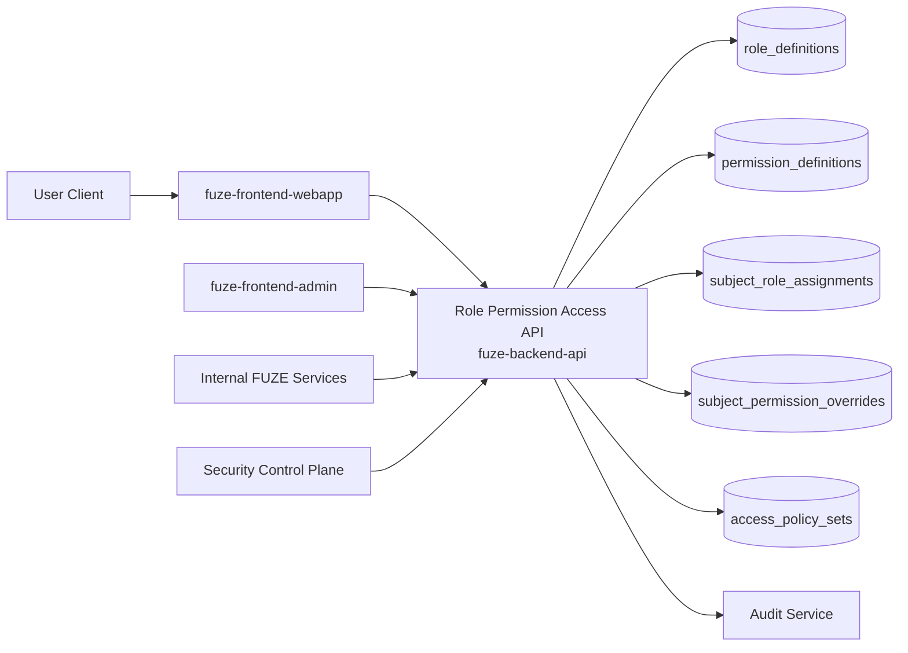
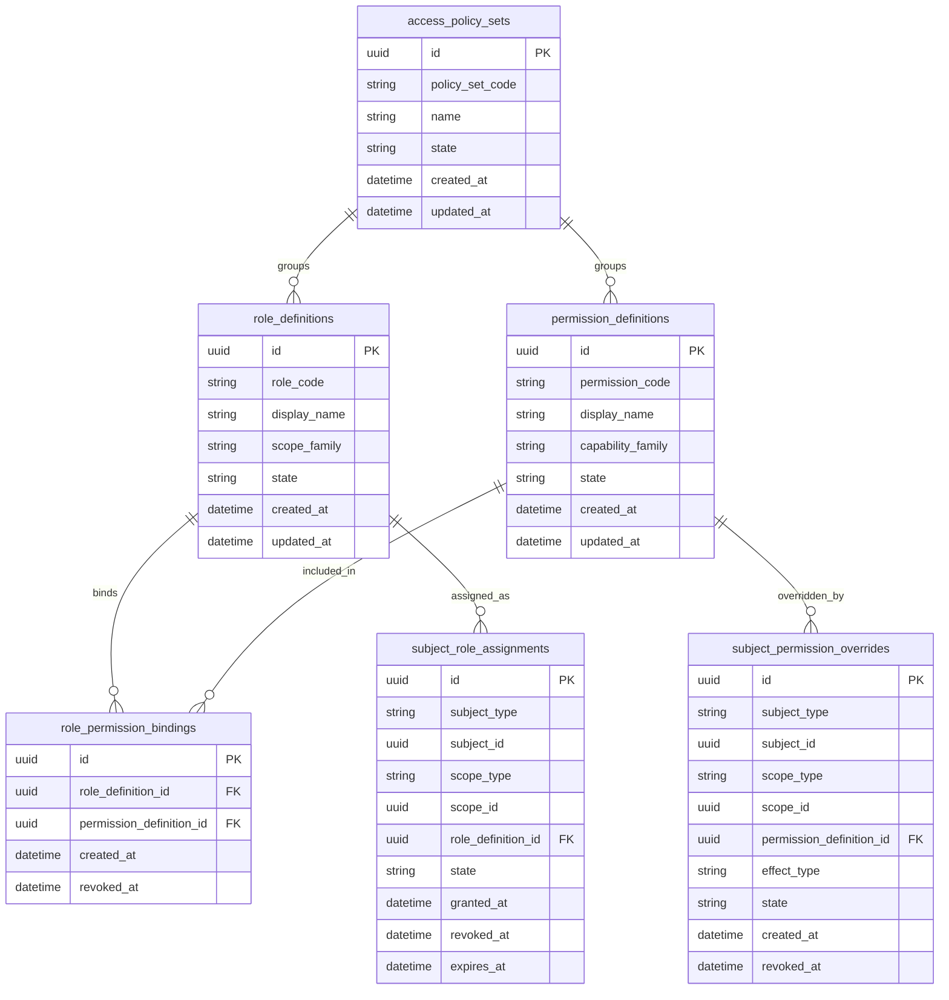
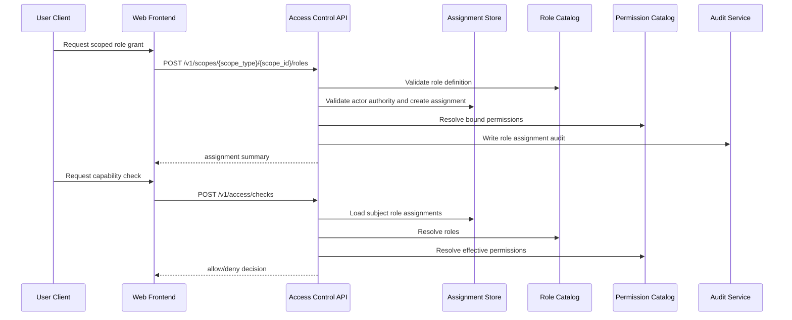

# ROLE_PERMISSION_ACCESS_API_SPEC

## 1. Title

**ROLE_PERMISSION_ACCESS_API_SPEC.md**

---

## 2. Document Metadata

- **Document Name:** ROLE_PERMISSION_ACCESS_API_SPEC.md
- **API Classification:** public, internal, admin, derived-public, event-driven
- **Owning Domain:** Role, Permission, and Access Control Domain
- **Primary Implementing Repo:** `fuze-backend-api`
- **Primary System of Record:** role / permission / policy / access evaluation stores in `fuze-backend-api`
- **Status:** Draft for canonical source-of-truth approval
- **Purpose:** Define the production-grade API contract architecture for FUZE role assignment, permission policy evaluation, scoped capability checks, access grants, and access-control administration across the platform and product ecosystem
- **Canonical Folder:** `fuze.ac > docs > api-spec`

---

## 3. Purpose

This document defines the canonical API specification for FUZE role, permission, and access-control operations. It translates the governing FUZE platform boundary, identity, workspace, product integration, security, audit, and API architecture rules into an implementation-ready API contract.

This API exists because FUZE is a multi-product, multi-scope platform where access cannot be determined from authentication alone. A user may be authenticated but still require explicit role- and scope-based authorization to act within a workspace, a product, an admin surface, a billing context, or a trust-sensitive operational domain.

Accordingly, this specification defines how scoped roles and permissions are modeled through APIs, how access checks are executed, how grants are assigned or revoked, how role bundles and permission sets are managed, how products consume canonical access decisions, and how privileged actions remain auditable, safety-bounded, and architecture-consistent.

---

## 4. Scope

This specification covers:

- role catalog and permission catalog APIs
- scoped role assignment and revocation APIs
- effective-permission and access-check APIs
- capability resolution for account, workspace, product, admin, and internal service contexts
- role bundle / policy set management APIs
- permission inheritance and precedence behavior
- admin/control-plane APIs for access correction and emergency containment
- internal service APIs for access decision resolution
- event emission requirements for access-control mutations
- request, response, error, idempotency, versioning, audit, and database-shape rules for this domain

This specification does **not** redefine:

- canonical account identity or authentication session behavior
- workspace truth or membership truth
- product-owned business objects
- credits, billing, payout, governance, or treasury business rules themselves
- product-local feature semantics beyond whether the platform authorizes access
- detailed policy text for every future product role

Those remain governed by their own source-of-truth specifications.

---

## 5. Source-of-Truth Inputs

### Primary FUZE docs and specs used

#### Highest-priority platform and ownership sources
- `SYSTEM_SPEC_INDEX.md`
- `SYSTEM_BOUNDARY_AND_OWNERSHIP_SPEC.md`
- `SYSTEM_OVERVIEW_AND_BOUNDARIES_SPEC.md`
- `PLATFORM_ARCHITECTURE_SPEC.md`
- `DOMAIN_OWNERSHIP_MATRIX_SPEC.md`
- `DATA_MODEL_AND_ENTITY_OWNERSHIP_SPEC.md`

#### Primary access / identity / scope sources
- `ROLE_PERMISSION_AND_ACCESS_CONTROL_SPEC.md`
- `IDENTITY_AND_ACCOUNT_SPEC.md`
- `AUTH_SESSION_AND_LINKED_LOGIN_SPEC.md`
- `WORKSPACE_AND_ORGANIZATION_SPEC.md`
- `WALLET_AWARE_USER_SPEC.md`

#### API and runtime sources
- `API_ARCHITECTURE_SPEC.md`
- `PUBLIC_API_SPEC.md`
- `INTERNAL_SERVICE_API_SPEC.md`
- `IDEMPOTENCY_AND_VERSIONING_SPEC.md`
- `EVENT_MODEL_AND_WEBHOOK_SPEC.md`
- `MIGRATION_AND_BACKWARD_COMPATIBILITY_SPEC.md`
- `AUDIT_LOG_AND_ACTIVITY_SPEC.md`

#### Security and operations sources
- `SECURITY_AND_RISK_CONTROL_SPEC.md`
- `SECRETS_CONFIG_AND_ENVIRONMENT_SPEC.md`
- `MONITORING_ALERTING_AND_INCIDENT_RESPONSE_SPEC.md`

#### Format guides
- `The_API_Specification_guide.md`
- `Database_Schemas_Guide.md`

### Highest-priority interpretation applied

For this file, the most important governing interpretation is:

1. authentication and authorization are separate domains and must remain separate
2. backend owns durable role, permission, and access-control truth
3. roles are scope-bound and do not imply universal platform authority
4. products consume canonical access decisions instead of inventing product-local shadow authorization for platform-relevant concerns
5. admin surfaces may trigger privileged access-control mutations but do not own access truth
6. token participation, wallet linkage, subscriptions, and credits do not automatically replace scoped permission evaluation

### Supporting external standards used only as guidance

- HTTP semantics for read, mutation, conflict, and authorization-failure behavior
- RFC 9457 problem-details style for machine-readable error responses
- standard least-privilege and policy-evaluation practices for access-control design

External guidance does not override FUZE source-of-truth documents.

---

## 6. Governing Architecture and Ownership Interpretation

This API belongs to the **Role, Permission, and Access Control Domain** because it owns the durable logic that determines which actors can do what in which scope under what policy constraints.

This API is implemented primarily in `fuze-backend-api` because:

- backend owns durable access truth
- access decisions must be consistent across webapp, admin, internal services, and products
- role/permission mutations are sensitive backend operations
- products require a shared authorization authority for platform-scoped behavior
- audit, security containment, and admin intervention must be backend-governed

This API is **not** owned by:

- `fuze-frontend-webapp`, because the frontend only asks for and consumes effective access results
- `fuze-frontend-admin`, because admin surfaces trigger privileged changes but do not own canonical authorization truth
- `fuze-contracts`, because role/permission authorization for the platform is off-chain application truth
- product domains, because products may define product-specific role families but must integrate with platform-owned access-control semantics for shared concerns
- workspace domain, because workspace membership and workspace truth are separate from access-control policy and evaluation even though they are closely related inputs

### Architectural implications

- a valid session does not imply broad authority
- one account may hold different roles in different workspaces
- one account may hold product-specific capabilities in one scope and not another
- admin/operator access is a distinct and more sensitive class of authorization
- internal service access is not equivalent to end-user access
- derived access summaries must not replace canonical role and permission truth
- permission checks must be explicit, scope-aware, and audit-compatible

---

## 7. Domain Responsibilities

The role, permission, and access-control API domain is responsible for:

1. maintaining canonical role and permission definitions
2. assigning and revoking scoped role grants
3. evaluating effective permissions for actors in context
4. exposing authorization decision APIs to platform and product consumers
5. expressing permission inheritance, allow/deny, and policy precedence behavior
6. supporting admin/control-plane corrections and emergency access containment
7. enabling internal services to query access truth safely
8. emitting access-control domain events
9. generating audit records for sensitive access mutations
10. preserving separation between authentication, membership, entitlement, and authorization

The domain is not responsible for:

- proving identity
- issuing sessions
- owning workspace membership truth
- owning billing, credits, payout, or governance business outcomes
- owning product business objects
- replacing product-specific validation for product-owned business rules

---

## 8. Out of Scope

The following are out of scope for this API specification:

- human resources organizational hierarchy modeling
- enterprise external IAM federation details
- cryptographic secret management for service credentials
- smart-contract permission systems
- full policy engine implementation internals
- every future product-specific permission name
- price-plan-to-entitlement mapping logic in full detail
- business-rule validation unrelated to access authority

Where later detailed specs are needed, they must remain compatible with this API.

---

## 9. Canonical Entities and Data Ownership

### Durable entities

#### 9.1 role_definitions
- **Owner:** Role / Permission / Access Control Domain
- **Purpose:** canonical role catalog definitions
- **Nature:** source-of-truth durable entity

#### 9.2 permission_definitions
- **Owner:** Role / Permission / Access Control Domain
- **Purpose:** canonical permission / capability catalog
- **Nature:** source-of-truth durable entity

#### 9.3 role_permission_bindings
- **Owner:** Role / Permission / Access Control Domain
- **Purpose:** bind role definitions to permission definitions
- **Nature:** source-of-truth durable entity

#### 9.4 subject_role_assignments
- **Owner:** Role / Permission / Access Control Domain
- **Purpose:** scoped assignment of role definitions to subjects
- **Nature:** source-of-truth durable entity

#### 9.5 subject_permission_overrides
- **Owner:** Role / Permission / Access Control Domain
- **Purpose:** explicit allow/deny overrides where policy permits
- **Nature:** source-of-truth durable entity

#### 9.6 access_policy_sets
- **Owner:** Role / Permission / Access Control Domain
- **Purpose:** named policy bundles, sensitivity rules, or capability groupings
- **Nature:** source-of-truth durable entity

#### 9.7 access_evaluation_records
- **Owner:** Role / Permission / Access Control Domain
- **Purpose:** optional durable record of significant access decisions for audit/security workflows
- **Nature:** durable but not canonical source of permissions; it records evaluations, not role truth

#### 9.8 access_control_actions
- **Owner:** Role / Permission / Access Control Domain
- **Purpose:** sensitive grant/revoke/correction/emergency access actions
- **Nature:** durable action records with audit linkage

#### 9.9 access_audit_events
- **Owner:** Audit / Activity domain, sourced by access-control domain
- **Purpose:** immutable trail for sensitive role or permission changes
- **Nature:** durable audit records

### Derived or cached entities

#### 9.10 effective_access_views
- **Owner:** derived read-model layer
- **Purpose:** convenience view of currently effective permissions in a given scope
- **Nature:** derived, not source-of-truth

#### 9.11 subject_scope_capability_views
- **Owner:** derived read-model layer
- **Purpose:** fast access summaries for first-party clients or internal services
- **Nature:** derived

#### 9.12 role_catalog_views
- **Owner:** derived read-model layer
- **Purpose:** product- or scope-friendly presentation of role catalog metadata
- **Nature:** derived

---

## 10. State Model and Lifecycle

### 10.1 role definition lifecycle

Possible states:

- `draft`
- `active`
- `deprecated`
- `disabled`

### 10.2 permission definition lifecycle

Possible states:

- `draft`
- `active`
- `deprecated`
- `disabled`

### 10.3 role assignment lifecycle

Possible states:

- `pending`
- `active`
- `suspended`
- `revoked`
- `expired`

### 10.4 permission override lifecycle

Possible states:

- `active`
- `suspended`
- `revoked`
- `expired`

### 10.5 access control action lifecycle

Possible states:

- `requested`
- `pending_review`
- `approved_if_required`
- `executed`
- `failed`
- `cancelled`
- `closed`

Lifecycle notes:
- catalog definitions may remain `draft` until approved for active use
- `deprecated` definitions remain readable but should not be assigned newly unless explicitly allowed
- role assignment and override state transitions must be monotonic toward terminal states
- emergency containment actions may suspend rather than revoke for recoverability

---

## 11. API Surface Overview

The API surface is divided into four families:

### 11.1 Public / first-party user-facing APIs
Used by `fuze-frontend-webapp` and approved first-party clients for:
- reading current effective permissions
- reading role catalog metadata where visible
- listing scoped grants visible to the actor
- assigning/revoking roles where actor is authorized
- checking whether a target capability is allowed in context

### 11.2 Internal service APIs
Used by trusted internal services for:
- access decision resolution
- subject capability checks
- workspace/product/admin scope authorization introspection
- policy-set and role catalog reads

### 11.3 Admin / control-plane APIs
Used by `fuze-frontend-admin` through backend-only privileged routes for:
- emergency grant/revoke/suspend actions
- access corrections
- policy-set activation/deactivation
- role definition and permission definition administration
- emergency containment of privileged access

### 11.4 Event-driven interfaces
Used for downstream side effects:
- audit generation
- monitoring and security alerting
- product-side cache invalidation
- notification handling where relevant
- analytics and reporting

---

## 12. Authentication and Authorization Model

### 12.1 Authentication posture by route family

#### Authenticated user routes
Require valid authenticated session:
- current effective access reads
- access-check requests in actor-owned scope
- scoped role assignment where actor has grant authority
- role revocation where actor has revoke authority

#### Internal service routes
Require internal service identity with explicit least privilege:
- access evaluation
- effective permission resolution
- scoped authorization checks
- role and permission catalog reads

#### Admin routes
Require privileged operator identity plus reason-coded actions:
- emergency suspend/revoke of grants
- access corrections
- catalog administration
- policy-set changes
- containment of privileged roles

### 12.2 Authorization checkpoints

Authorization must evaluate:
- canonical account identity
- session validity
- target scope
- actor’s effective permissions in that scope
- whether target action is sensitive or privileged
- workspace or organization state where relevant
- whether catalog objects are assignable in current state
- whether policy forbids self-escalation or circular escalation
- whether minimum-admin or minimum-owner safety rules apply through integration with other domains

### 12.3 Sensitive action rules

The following require heightened checks:
- assigning elevated roles
- revoking or suspending elevated roles
- granting admin/control-plane capabilities
- activating or disabling policy sets
- catalog definition changes
- emergency containment actions
- self-affecting privilege changes that could alter grant authority

---

## 13. API Endpoints / Interface Contracts

## 13.1 Public / First-Party User APIs

### 13.1.1 `GET /v1/access/me`
**Purpose:** retrieve effective access summary for current actor across visible scopes  
**Caller Type:** authenticated user  
**Auth Expectation:** valid authenticated session  
**Response Summary:**
- actor account ID
- visible scopes
- effective roles by scope
- effective permissions/capabilities by scope family
- derived access warnings or restrictions
**Side Effects:** none
**Audit Requirements:** access logging only
**Emitted Events:** none required

### 13.1.2 `POST /v1/access/checks`
**Purpose:** check whether current actor is allowed to perform one or more capabilities in a specific scope  
**Caller Type:** authenticated user  
**Request Body Summary:**
- `scope_type`
- `scope_id`
- `capabilities[]`
- optional `product_context`
**Response Summary:**
- allow/deny result per capability
- denial reason codes where not allowed
- evaluated role summary
**Side Effects:** none by default
**Audit Requirements:** access logging; durable evaluation record optional for sensitive checks
**Emitted Events:** none required unless sensitivity policy requires

### 13.1.3 `GET /v1/scopes/{scope_type}/{scope_id}/roles`
**Purpose:** list role assignments visible to actor in target scope  
**Caller Type:** authenticated user with visibility rights  
**Response Summary:**
- role assignments
- subjects
- assignment state
- granted_at
- granted_by summary where visible
**Side Effects:** none

### 13.1.4 `POST /v1/scopes/{scope_type}/{scope_id}/roles`
**Purpose:** assign one or more roles to a subject in target scope  
**Caller Type:** authenticated user with grant authority  
**Request Body Summary:**
- `subject_type`
- `subject_id`
- `role_codes[]`
- optional `reason_code`
- optional `expires_at`
- optional `idempotency_key`
**Response Summary:** resulting assignment summaries
**Side Effects:** role assignment creation/activation
**Idempotency Behavior:** required
**Audit Requirements:** high-sensitivity audit
**Emitted Events:** `access.role_assignment_created`, `access.role_assignment_activated`

### 13.1.5 `DELETE /v1/scopes/{scope_type}/{scope_id}/roles/{assignment_id}`
**Purpose:** revoke one scoped role assignment  
**Caller Type:** authenticated user with revoke authority  
**Request Body Summary:**
- optional `reason_code`
- optional `idempotency_key`
**Response Summary:** revoked assignment summary
**Side Effects:** assignment transitions to revoked
**Idempotency Behavior:** required
**Audit Requirements:** high-sensitivity audit
**Emitted Events:** `access.role_assignment_revoked`

### 13.1.6 `GET /v1/roles/catalog`
**Purpose:** list visible role catalog entries for allowed scope families  
**Caller Type:** authenticated user  
**Response Summary:**
- role definitions visible to actor
- assignability flags
- scope families
- deprecation/disabled indicators where visible
**Side Effects:** none

### 13.1.7 `GET /v1/permissions/catalog`
**Purpose:** list visible permission definitions for allowed scope families  
**Caller Type:** authenticated user  
**Response Summary:**
- permission definitions visible to actor
- groupings and policy metadata where visible
**Side Effects:** none

## 13.2 Internal Service APIs

### 13.2.1 `POST /internal/v1/access/evaluations`
**Purpose:** resolve whether a subject is allowed to perform capabilities in a given scope  
**Caller Type:** internal trusted service  
**Auth Expectation:** service-to-service identity only  
**Request Body Summary:**
- `subject_type`
- `subject_id`
- `scope_type`
- `scope_id`
- `capabilities[]`
- optional `product_context`
- optional `record_if_sensitive`
**Response Summary:**
- allow/deny decisions
- evaluated roles
- effective permission basis
- restriction flags
**Side Effects:** optional evaluation record for sensitive checks
**Audit Requirements:** internal access logging
**Emitted Events:** none required by default

### 13.2.2 `GET /internal/v1/subjects/{subject_type}/{subject_id}/effective-access`
**Purpose:** retrieve effective access summary for a subject across requested scopes  
**Caller Type:** internal trusted services with least privilege  
**Response Summary:**
- scopes
- roles
- permissions
- derived restriction flags
**Side Effects:** none

### 13.2.3 `POST /internal/v1/access/subjects/{subject_type}/{subject_id}/emergency-suspend`
**Purpose:** emergency suspension of one or more grants or capability families  
**Caller Type:** restricted internal security/control workflows only  
**Request Body Summary:**
- `scope_filters[]`
- `role_codes[]` optional
- `reason_code`
- `correlation_reference`
- optional `expires_at`
**Response Summary:** action record and affected assignment summary
**Side Effects:** suspends assignments or access paths
**Idempotency Behavior:** required
**Audit Requirements:** critical audit
**Emitted Events:** `access.emergency_suspension_executed`

## 13.3 Admin / Control-Plane APIs

### 13.3.1 `POST /admin/v1/access/role-definitions`
**Purpose:** create or activate a role definition  
**Caller Type:** admin/operator  
**Request Body Summary:**
- `role_code`
- `display_name`
- `scope_families[]`
- `permission_codes[]`
- `state`
- optional `policy_set_id`
- `reason_code`
- `operator_note`
**Response Summary:** created/updated role definition
**Side Effects:** catalog mutation
**Audit Requirements:** critical audit
**Emitted Events:** `access.role_definition_changed`

### 13.3.2 `POST /admin/v1/access/permission-definitions`
**Purpose:** create or activate a permission definition  
**Caller Type:** admin/operator  
**Request Body Summary:**
- `permission_code`
- `display_name`
- `capability_family`
- `state`
- `reason_code`
- `operator_note`
**Response Summary:** created/updated permission definition
**Side Effects:** catalog mutation
**Audit Requirements:** critical audit
**Emitted Events:** `access.permission_definition_changed`

### 13.3.3 `POST /admin/v1/access/policy-sets`
**Purpose:** create or update an access policy set  
**Caller Type:** admin/operator  
**Request Body Summary:**
- `policy_set_code`
- `name`
- `rules_patch`
- `state`
- `reason_code`
- `operator_note`
**Response Summary:** policy-set summary
**Side Effects:** policy mutation
**Audit Requirements:** critical audit
**Emitted Events:** `access.policy_set_changed`

### 13.3.4 `POST /admin/v1/scopes/{scope_type}/{scope_id}/access-corrections`
**Purpose:** corrective grant/revoke/suspend/restore actions under controlled policy  
**Caller Type:** admin/operator  
**Request Body Summary:**
- `subject_type`
- `subject_id`
- `correction_action`
- `role_codes[]` optional
- `reason_code`
- `operator_note`
- optional `related_case_id`
- optional `idempotency_key`
**Response Summary:** access-control action record and resulting grant summaries
**Side Effects:** corrective role mutation and/or suspension
**Audit Requirements:** critical audit
**Emitted Events:** `access.correction_executed`

### 13.3.5 `POST /admin/v1/access/containment`
**Purpose:** emergency containment for elevated roles or capability sets  
**Caller Type:** admin/operator  
**Request Body Summary:**
- `subject_filters`
- `scope_filters`
- `role_codes[]` optional
- `permission_codes[]` optional
- `reason_code`
- `operator_note`
- optional `expires_at`
**Response Summary:** containment action summary
**Side Effects:** emergency suspension/restriction of access
**Audit Requirements:** critical audit
**Emitted Events:** `access.containment_executed`

---

## 14. Request Rules

### 14.1 General request rules
- all mutation-capable routes must require JSON requests with explicit content type
- all mutation routes must carry correlation IDs
- sensitive access-control mutations must carry idempotency keys
- admin mutations must require reason codes and operator notes
- no route may accept frontend-computed authorization truth as authoritative input

### 14.2 Sensitive-action request requirements
The following requests require heightened validation:
- elevated role assignment
- elevated role revocation
- emergency suspend/containment
- catalog definition changes
- policy-set changes
- access corrections affecting admin/operator subjects

Heightened validation may include:
- recent re-auth assertion for user routes where appropriate
- operator role confirmation
- self-escalation prevention checks
- circular grant-authority prevention checks
- minimum-owner or minimum-admin safety checks where integrated with other domains
- workspace / organization state validation

### 14.3 Scope integrity rule
Any request that attempts to assign authority outside a valid scope or to a subject without valid membership/subject eligibility must fail.

### 14.4 Grant-authority rule
An actor may not grant or restore a role/capability they do not have authority to manage, and may not silently escalate their own authority unless an approved explicit policy path exists.

---

## 15. Response Rules

### 15.1 Success response rules
Successful responses must include:
- stable resource identifiers
- timestamps for created/updated state
- state/status values
- effective scope metadata
- correlation references for mutations

### 15.2 Async-accepted response rules
If sensitive access corrections or bulk containment are async, the response must:
- return accepted status
- include action or job ID
- provide follow-up status semantics

### 15.3 Terminal mutation response rules
Terminal mutation responses must clearly show:
- target subject and scope
- resulting role or permission state
- whether capabilities changed
- whether containment or correction logic was applied

### 15.4 Read response rules
Read responses must distinguish:
- durable source data
- derived effective access summaries
- policy hints or assignability hints
- convenience capability aggregations that are not canonical catalog truth

---

## 16. Error Model

The API uses structured problem-details style error responses with stable error codes.

### 16.1 Required error fields
- `type`
- `title`
- `status`
- `code`
- `detail`
- `instance`
- `correlation_id`

### 16.2 Common error codes

#### Authorization / permission errors
- `ACCESS_SESSION_REQUIRED`
- `ACCESS_PERMISSION_DENIED`
- `ACCESS_GRANT_AUTHORITY_DENIED`
- `ACCESS_SELF_ESCALATION_DENIED`

#### State conflict errors
- `ACCESS_ROLE_ASSIGNMENT_ALREADY_TERMINAL`
- `ACCESS_ROLE_DEFINITION_CONFLICT`
- `ACCESS_PERMISSION_DEFINITION_CONFLICT`
- `ACCESS_POLICY_SET_CONFLICT`

#### Policy / safety errors
- `ACCESS_SCOPE_INVALID`
- `ACCESS_SUBJECT_NOT_ELIGIBLE`
- `ACCESS_MINIMUM_ADMIN_VIOLATION`
- `ACCESS_MINIMUM_OWNER_VIOLATION`
- `ACCESS_CONTAINMENT_REQUIRED`
- `ACCESS_RESTRICTED_BY_POLICY`

#### Request integrity errors
- `ACCESS_IDEMPOTENCY_KEY_REQUIRED`
- `ACCESS_REQUEST_INVALID`
- `ACCESS_REQUEST_UNPROCESSABLE`

#### Dependency or provider errors
- `ACCESS_DEPENDENCY_TIMEOUT`
- `ACCESS_EVALUATION_UNAVAILABLE`

### 16.3 Error handling rules
- do not expose hidden policy internals beyond bounded explanation
- do not expose operator-only details to user-facing callers
- distinguish authentication failure from authorization failure
- distinguish policy denial from missing scope or missing subject eligibility
- include retry guidance only where safe

---

## 17. Idempotency and Mutation Safety

### 17.1 Required idempotent mutations
The following mutation routes require idempotent behavior:
- scoped role assignment
- scoped role revocation
- emergency suspend
- catalog creation/update when exposed as mutation endpoint
- policy-set creation/update
- access corrections
- containment actions

### 17.2 Idempotency key rules
- mutation requests must supply `Idempotency-Key` where required
- backend stores key scope, request hash, actor, and terminal result
- replay of same semantic request returns original terminal outcome
- replay of same key with different semantic request must fail with conflict

### 17.3 Mutation safety rules
- role assignment and override state transitions must be monotonic toward terminal states
- grant and revoke operations must re-check scope and subject eligibility at commit time
- elevated role grants must prevent circular or self-amplifying unsafe escalation
- containment actions must be safe under retries and concurrent execution
- derived effective-access views must be refreshed from canonical truth

---

## 18. Versioning and Compatibility Rules

### 18.1 Versioning
This API family is versioned under `/v1`, `/internal/v1`, and `/admin/v1` route families.

### 18.2 Compatibility approach
- additive evolution preferred
- no silent semantic change to role state, permission meaning, or policy precedence
- new roles and permissions may be added without breaking existing clients
- response fields may be added but existing meanings must remain stable

### 18.3 Breaking-change rules
Breaking changes include:
- changing meaning of canonical role codes
- changing precedence of allow/deny or override handling incompatibly
- removing critical effective-access fields
- changing scope-family interpretation incompatibly

Such changes require explicit migration planning and version evolution.

### 18.4 Deprecation
Deprecated routes or fields must:
- be documented explicitly
- carry deprecation metadata where supported
- preserve compatibility windows long enough for first-party consumers and future SDKs

---

## 19. Event Emission and Webhook Behavior

This domain is event-capable.

### 19.1 Internal events
The access-control domain must emit canonical internal events such as:
- `access.role_assignment_created`
- `access.role_assignment_activated`
- `access.role_assignment_suspended`
- `access.role_assignment_revoked`
- `access.permission_override_changed`
- `access.role_definition_changed`
- `access.permission_definition_changed`
- `access.policy_set_changed`
- `access.correction_executed`
- `access.containment_executed`
- `access.emergency_suspension_executed`

### 19.2 Event payload minimums
Each event should contain:
- event ID
- event type
- occurred_at
- subject type and subject ID
- scope type and scope ID where relevant
- role / permission / policy references where applicable
- actor type
- correlation ID
- reason code where applicable

### 19.3 External webhook posture
This specification does not expose general third-party webhooks for raw access-control mutations by default. Any future external access-control webhook surface must be narrow, privacy-safe, security-reviewed, and governed by a separate contract.

---

## 20. Audit and Activity Requirements

The following actions must generate durable audit events:

- role assignment creation/activation
- role suspension/revocation
- permission override creation/change/removal
- role definition changes
- permission definition changes
- policy-set changes
- emergency suspension
- containment actions
- access corrections
- significant admin/operator access changes

### Required audit fields
- audit event ID
- actor type and actor reference
- subject type and subject reference
- scope type and scope reference
- target role / permission / policy references
- action type
- before/after state summary where applicable
- reason code
- correlation ID
- operator note if operator action
- occurred_at

User-facing activity feeds may show only a filtered subset, but audit truth must remain durable and immutable.

---

## 21. Data Model and Database Schema View

### 21.1 `role_definitions`
- `id` PK
- `role_code`
- `display_name`
- `scope_family`
- `state`
- `description`
- `is_assignable`
- `created_at`
- `updated_at`
- `deprecated_at` nullable

**Constraints:**
- unique `role_code`
- index on `scope_family`
- index on `state`

### 21.2 `permission_definitions`
- `id` PK
- `permission_code`
- `display_name`
- `capability_family`
- `state`
- `description`
- `created_at`
- `updated_at`
- `deprecated_at` nullable

**Constraints:**
- unique `permission_code`
- index on `capability_family`
- index on `state`

### 21.3 `role_permission_bindings`
- `id` PK
- `role_definition_id` FK -> `role_definitions.id`
- `permission_definition_id` FK -> `permission_definitions.id`
- `created_at`
- `revoked_at` nullable

**Constraints:**
- unique (`role_definition_id`, `permission_definition_id`) for active bindings

### 21.4 `subject_role_assignments`
- `id` PK
- `subject_type`
- `subject_id`
- `scope_type`
- `scope_id`
- `role_definition_id` FK -> `role_definitions.id`
- `state`
- `granted_by_actor_type`
- `granted_by_actor_id`
- `granted_at`
- `suspended_at` nullable
- `revoked_at` nullable
- `expires_at` nullable
- `reason_code` nullable
- `created_at`
- `updated_at`

**Constraints:**
- unique (`subject_type`, `subject_id`, `scope_type`, `scope_id`, `role_definition_id`) for active assignment space
- index on (`subject_type`, `subject_id`)
- index on (`scope_type`, `scope_id`)
- index on `state`

### 21.5 `subject_permission_overrides`
- `id` PK
- `subject_type`
- `subject_id`
- `scope_type`
- `scope_id`
- `permission_definition_id` FK -> `permission_definitions.id`
- `effect_type` (`allow` or `deny`)
- `state`
- `created_by_actor_type`
- `created_by_actor_id`
- `created_at`
- `revoked_at` nullable
- `expires_at` nullable

**Constraints:**
- unique active override per (`subject_type`, `subject_id`, `scope_type`, `scope_id`, `permission_definition_id`, `effect_type`)
- index on (`subject_type`, `subject_id`)
- index on (`scope_type`, `scope_id`)

### 21.6 `access_policy_sets`
- `id` PK
- `policy_set_code`
- `name`
- `state`
- `rules_json`
- `created_at`
- `updated_at`
- `disabled_at` nullable

**Constraints:**
- unique `policy_set_code`
- index on `state`

### 21.7 `access_control_actions`
- `id` PK
- `action_type`
- `subject_type`
- `subject_id`
- `scope_type` nullable
- `scope_id` nullable
- `state`
- `reason_code`
- `operator_note` nullable
- `requested_by_actor_type`
- `requested_by_actor_id`
- `created_at`
- `executed_at` nullable
- `closed_at` nullable
- `correlation_id`

### 21.8 `access_evaluation_records`
- `id` PK
- `subject_type`
- `subject_id`
- `scope_type`
- `scope_id`
- `requested_capabilities_json`
- `decision_json`
- `sensitivity_class`
- `created_at`
- `correlation_id`

### 21.9 `idempotency_records`
- `id` PK
- `idempotency_key`
- `scope_family`
- `actor_reference`
- `request_hash`
- `response_hash`
- `terminal_status`
- `created_at`
- `expires_at`

### 21.10 `audit_log_entries`
Domain-sourced audit records written into the audit domain.

### Normalization notes
- canonical role and permission truth stays in catalog tables and scoped assignment tables
- effective access is derived from catalog + assignments + overrides + scope inputs
- product dashboards and admin summaries must not replace canonical assignment truth
- subject eligibility inputs from identity/workspace domains are referenced, not duplicated as canonical fields in access tables

### Reconciliation notes
- effective-access rebuilds should reconcile from canonical catalog and assignment tables
- elevated-role containment actions must reconcile against active assignment counts
- role definition deprecation must not silently invalidate historical audit meaning

---

## 22. Architecture Diagram — Mermaid flowchart



---

## 23. Data Design — Mermaid Diagram



---

## 24. Flow View

### 24.1 Happy path — access check
1. authenticated actor requests capability check in target scope
2. backend validates session and scope visibility
3. backend loads applicable role assignments, permission bindings, overrides, and policy-set rules
4. effective permission decision is computed
5. allow/deny result is returned
6. optional evaluation record is written for sensitive checks

### 24.2 Happy path — assign scoped role
1. authorized actor requests role assignment to a subject in a scope
2. backend validates actor grant authority and subject eligibility
3. backend validates role definition and policy-set state
4. assignment is created or activated
5. audit event is written
6. role-assignment event is emitted

### 24.3 Happy path — revoke role
1. authorized actor requests revocation of assignment
2. backend validates revoke authority and safety rules
3. assignment transitions to revoked
4. audit and event are emitted

### 24.4 Alternate path — deny by policy override
1. access check is requested
2. actor has role-derived allow for capability
3. explicit deny override or containment rule applies
4. backend returns deny with policy-based denial reason
5. optional sensitive evaluation record is written

### 24.5 Failure path — self-escalation attempt
1. actor attempts to grant themselves an elevated role
2. backend detects self-escalation is not allowed by policy
3. mutation is rejected
4. no assignment change occurs
5. audit may record denied escalation attempt where policy requires

### 24.6 Failure and containment path — compromised privileged actor
1. security workflow identifies compromised admin/operator account
2. containment route is called
3. backend suspends targeted grants in scope
4. critical audit and containment event are emitted
5. downstream services consume updated access truth immediately or on cache invalidation

### 24.7 Retry behavior
- role assignment retries return the same terminal assignment result
- role revocation retries return the same terminal revoked result
- containment retries return the same suspended/contained state
- policy-set changes with the same idempotency key return the same terminal result

---

## 25. Data Flows — Mermaid sequenceDiagram



---

## 26. Security and Risk Controls

1. **Authentication is not authorization**  
   Effective permission checks must be explicit and scope-aware.

2. **Least privilege**  
   Actors and services receive only the capabilities explicitly granted or derived by policy.

3. **No frontend-owned authorization truth**  
   Frontends may cache or display access summaries but must not authoritatively decide platform-sensitive access.

4. **No product-owned shadow authorization for shared concerns**  
   Products may define product-local semantics, but platform-shared access decisions must derive from canonical access-control truth.

5. **Self-escalation prevention**  
   The API must prevent unsafe self-grants and circular grant-authority amplification.

6. **Emergency containment support**  
   The domain must support rapid suspension or restriction of privileged capabilities when risk signals occur.

7. **Policy-aware precedence**  
   Explicit deny or containment rules must override ordinary allow results where policy requires.

8. **Audit immutability**  
   Sensitive access mutations require durable immutable audit lineage.

9. **Problem-details discipline**  
   Errors must be structured and safe, without exposing hidden operator-only policy details.

10. **Replay resistance**  
    Assignment, revocation, and containment mutations must use idempotency-safe patterns.

---

## 27. Operational Considerations

- access evaluation APIs are latency-sensitive and must be highly available
- derived capability caches must be invalidated quickly on sensitive role changes
- catalog changes should be rare, reviewed, and observable
- containment actions should prioritize rapid propagation to downstream consumers
- evaluation records for highly sensitive routes should support incident reconstruction
- monitoring should alert on:
  - spikes in failed access checks for sensitive capabilities
  - repeated self-escalation attempts
  - unusual admin/operator grant patterns
  - unusual containment actions
  - sudden changes to policy sets or elevated role catalogs

---

## 28. Acceptance Criteria

1. The API preserves the distinction between authentication and authorization.
2. Only `fuze-backend-api` owns canonical role, permission, and access-control truth.
3. Role assignments are scope-bound and do not imply universal authority by default.
4. Effective access decisions derive from canonical catalogs, assignments, overrides, and policy rules.
5. Scoped role assignment requires grant authority and subject eligibility.
6. Role revocation is idempotent and auditable.
7. Self-escalation and circular privilege amplification are blocked unless explicitly policy-approved.
8. Internal access-evaluation routes are least-privilege and backend-only.
9. Admin routes require reason-coded privileged authorization.
10. Event emissions exist for major access-control mutations.
11. Response and error semantics are stable and machine-readable.
12. Database schema separates canonical catalog and assignment truth from derived access views.
13. Products can consume canonical access decisions without redefining shared authorization truth.
14. Emergency containment is supported and safely replayable.
15. Mermaid diagrams remain consistent with prose and data model.

---

## 29. Test Cases

### 29.1 Positive cases
1. Authenticated actor reads their effective access summary successfully.
2. Authorized actor assigns a scoped role successfully.
3. Authorized actor revokes a scoped role successfully.
4. Internal service receives allow result for a permitted capability in a valid scope.
5. Admin creates or updates a role definition successfully.
6. Admin executes containment against a compromised elevated subject successfully.
7. Effective access correctly reflects role + permission bindings in a workspace scope.

### 29.2 Negative cases
8. Unauthenticated call to access-check route is rejected.
9. Actor without grant authority cannot assign role.
10. Attempt to grant disabled role definition is rejected.
11. Self-escalation attempt is denied.
12. Assignment to subject outside eligible scope is rejected.
13. Mutation against invalid scope returns `ACCESS_SCOPE_INVALID`.

### 29.3 Authorization cases
14. Ordinary user cannot call admin catalog mutation routes.
15. Internal service without required privilege cannot call sensitive evaluation route.
16. User cannot revoke elevated role they are not authorized to manage.
17. Product service cannot bypass access evaluation by posting product-local derived truth.

### 29.4 Idempotency and replay cases
18. Repeating role assignment with same idempotency key returns original terminal result.
19. Repeating revocation with same idempotency key returns original revoked result.
20. Replaying containment action with same idempotency key returns same terminal action summary.

### 29.5 Concurrency cases
21. Two concurrent grants of same role in same scope produce one active assignment and one idempotent/conflict outcome.
22. Concurrent revoke and containment produce consistent terminal access state.
23. Concurrent policy-set disable and access evaluation do not yield ambiguous catalog state after commit.

### 29.6 Recovery / admin cases
24. Emergency suspension removes effective elevated access immediately or via fast invalidation path.
25. Access correction restores intended scoped access under controlled policy.
26. Deprecated role definition remains readable but non-assignable where policy requires.

### 29.7 Event and audit cases
27. Role assignment emits `access.role_assignment_created` and `access.role_assignment_activated`.
28. Revocation emits `access.role_assignment_revoked`.
29. Containment emits `access.containment_executed` and critical audit lineage.

---

## 30. Open Questions or Explicit Deferred Decisions

1. Exact enterprise IAM federation mapping into canonical role grants is deferred.
2. Exact product-specific role taxonomies for all future products are deferred.
3. Exact policy-rule expression language for policy sets is deferred.
4. Exact cache invalidation propagation mechanism for access summaries is deferred.
5. Whether some elevated grants require dual-control approval is deferred.
6. Exact public-read visibility rules for role and permission catalogs are deferred.

---

## 31. Implementation Notes for `fuze-backend-api`

Recommended backend module layout:

```text
modules/platform/
  role-access/
  identity/
  workspace-organization/
  audit-log/
  control-plane/
```

Implementation guidance:
- keep role and permission catalogs separate from scoped assignment truth
- centralize effective-access evaluation in one domain service
- integrate workspace and identity inputs as referenced truth, not duplicated truth
- treat containment and correction as domain actions, not ad hoc row patches
- perform self-escalation and circular-authority checks inside the commit boundary
- emit events only after canonical state commit succeeds
- publish derived effective-access views from canonical state; do not let read models mutate authorization truth

---

## 32. Frontend Consumption Notes

### For `fuze-frontend-webapp`
- may request effective access summaries and scoped access checks
- may initiate role grant/revoke flows only when actor has authority
- must not infer authoritative access from cached UI state alone
- must treat backend access decisions as authoritative
- should clearly surface denied actions and capability boundaries to avoid confusing UX

### For `fuze-frontend-admin`
- may trigger privileged access-control mutations only through backend admin APIs
- must require operator reason input for sensitive mutations
- must not directly mutate role or permission truth client-side
- should present immutable audit-linked summaries after privileged actions

---

## 33. Contract Derivation Notes

### OpenAPI / AsyncAPI
This spec should later derive into:
- effective access summary operations
- access-check operations
- scoped role assignment operations
- catalog management operations
- internal access-evaluation operations
- admin correction and containment operations
- shared problem-details schema
- access-control events in AsyncAPI

### Future `fuze-sdk`
Future `fuze-sdk` packages may derive:
- shared access-check helpers
- role assignment helpers for authorized clients
- typed scope and capability models
- problem-error models for authorization outcomes

The SDK must derive from approved API contracts and must not become the source of truth over this narrative specification.
