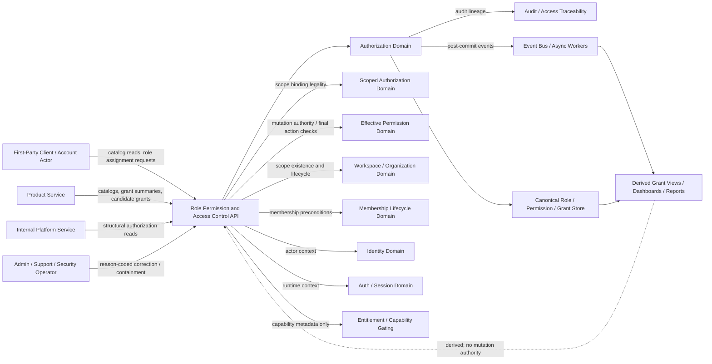
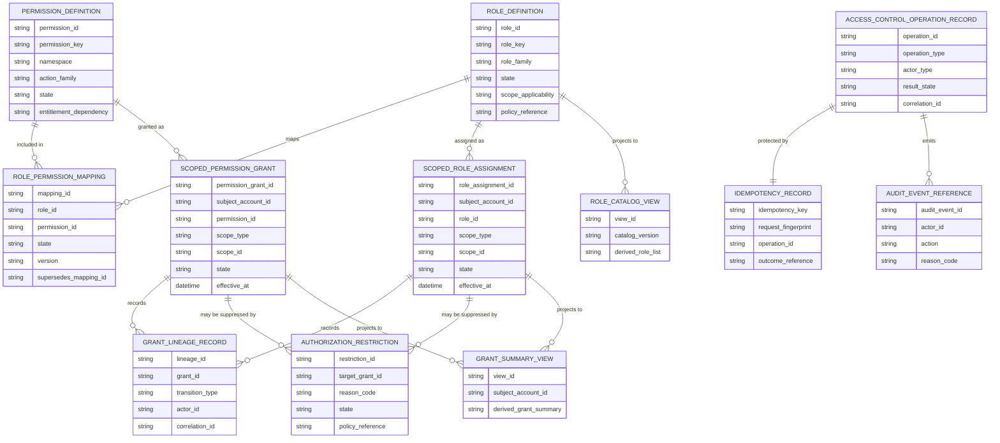
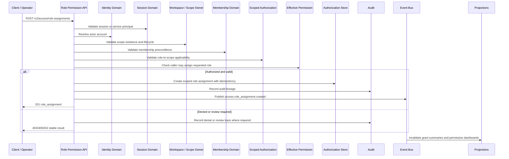

# ROLE_PERMISSION_AND_ACCESS_CONTROL_API_SPEC.md

## Document Metadata

- **Document Name:** `ROLE_PERMISSION_AND_ACCESS_CONTROL_API_SPEC.md`
- **Document Type:** FUZE API SPEC v2 / Production-grade interface-contract specification
- **Status:** Draft for production-grade API-spec review
- **Version:** 2.0.0
- **Effective Date:** 2026-04-24
- **Last Updated:** 2026-04-24
- **Reviewed On:** 2026-04-24
- **Document Owner:** FUZE Authorization Domain
- **Approval Authority:** FUZE Platform Architecture and Governance Authority
- **Review Cadence:** Quarterly or upon material change to role catalog semantics, permission namespace design, role-to-permission mappings, grant assignment and revocation behavior, restriction posture, governance-sensitive controls, product-local role mapping, internal operational roles, admin correction posture, audit traceability, or API exposure.
- **Governing Layer:** API SPEC v2 / Workspace, Organization, Authorization, and Access Control API family
- **Parent Registry:** `API_SPEC_INDEX.md`
- **Upstream Semantic Registry:** `REFINED_SYSTEM_SPEC_INDEX.md`
- **Upstream API Registry:** `API_SPEC_INDEX.md`
- **Primary Audience:** API designers, backend engineers, authorization engineers, workspace engineers, frontend/client engineers, product engineers, security engineers, support/control-plane engineers, audit/governance reviewers, OpenAPI/AsyncAPI/SDK authors, QA and contract-validation teams.
- **Primary Purpose:** Define the FUZE production API contract for role, permission, and access-control structures: role catalog reads, permission catalog reads, role-to-permission mapping reads and controlled mutations, scoped role assignments, direct permission grants where approved, role revocation, restriction/suppression, grant summaries, internal authorization-structure APIs, admin/control-plane corrections, event emission, idempotency, replay safety, audit lineage, derived read-model boundaries, migration, and downstream derivation guardrails.
- **Primary Upstream References:**
  - `REFINED_SYSTEM_SPEC_INDEX.md`
  - `DOCS_SPEC_INDEX.md`
  - `SYSTEM_SPEC_INDEX.md`
  - `API_SPEC_INDEX.md`
  - `SYSTEM_BOUNDARY_AND_OWNERSHIP_SPEC.md`
  - `SYSTEM_OVERVIEW_AND_BOUNDARIES_SPEC.md`
  - `PLATFORM_ARCHITECTURE_SPEC.md`
  - `DOMAIN_OWNERSHIP_MATRIX_SPEC.md`
  - `DATA_MODEL_AND_ENTITY_OWNERSHIP_SPEC.md`
  - `FUZE_ACCOUNT_ACCESS_AND_SESSION_CANONICAL_FINAL_SPEC.md`
  - `IDENTITY_AND_ACCOUNT_SPEC.md`
  - `AUTH_SESSION_AND_LINKED_LOGIN_SPEC.md`
  - `FUZE_SESSION_LIFECYCLE_AND_SECURITY_SPEC.md`
  - `WORKSPACE_AND_ORGANIZATION_SPEC.md`
  - `FUZE_WORKSPACE_ACCESS_CONTROL_BASICS_THESIS_FINAL_SPEC.md`
  - `WORKSPACE_MEMBERSHIP_LIFECYCLE_SPEC.md`
  - `ROLE_PERMISSION_AND_ACCESS_CONTROL_SPEC.md`
  - `SCOPED_AUTHORIZATION_MODEL_SPEC.md`
  - `ACCESS_EVALUATION_AND_EFFECTIVE_PERMISSION_SPEC.md`
  - `ADMIN_ACCESS_CORRECTION_AND_CONTAINMENT_SPEC.md`
  - `AUDIT_AND_ACCESS_TRACEABILITY_SPEC.md`
  - `ENTITLEMENT_AND_CAPABILITY_GATING_SPEC.md`
  - `SECURITY_AND_RISK_CONTROL_SPEC.md`
  - `WALLET_AWARE_USER_SPEC.md`
  - `WORKSPACE_ORGANIZATION_API_SPEC.md`
  - `ROLE_PERMISSION_ACCESS_API_SPEC.md`
- **Primary Downstream Dependents:**
  - OpenAPI contracts for role/permission/access-control APIs
  - AsyncAPI contracts for role, permission, grant, restriction, and access-control events
  - scoped authorization APIs
  - effective-permission APIs
  - workspace membership APIs
  - workspace/organization APIs
  - entitlement/capability gating APIs
  - admin correction and containment APIs
  - audit and access traceability pipelines
  - product integration contracts consuming platform authorization truth
  - internal service authorization adapters
  - support/admin tooling
  - SDK role/permission helpers
  - QA, contract validation, and regression suites
- **API Surface Families Covered:** first-party application APIs, internal service APIs, admin/control-plane APIs, event/async APIs, reporting/projection APIs, limited public/read-safe APIs where explicitly approved.
- **API Surface Families Excluded:** canonical account identity APIs, login/session APIs, provider-resolution APIs, workspace lifecycle APIs, membership invitation/activation/removal APIs in full depth, scoped authorization binding internals in full depth, final effective-permission evaluation APIs, entitlement formulas, billing/credits/ledger truth, wallet-link lifecycle, chain/on-chain authority, product-local object rule engines.
- **Canonical System Owner(s):** FUZE Authorization Domain for roles, permissions, mappings, grant state, restriction posture, and baseline structural authority; adjacent ownership held by Workspace/Organization, Membership Lifecycle, Scoped Authorization, Effective Permission, Entitlement, Audit, Security/Risk, Admin Correction, Identity, and Auth/Session domains.
- **Canonical API Owner:** FUZE Platform API Architecture / Role Permission Access API owner
- **Supersedes:** Role, permission, access-control, authorization-catalog, and structural-grant portions of `ROLE_PERMISSION_ACCESS_API_SPEC.md` where this API v2 document is narrower, stricter, or more explicit.
- **Superseded By:** Not yet known
- **Related Decision Records:** Not explicitly available in retrieved governing materials
- **Canonical Status Note:** This API spec derives from `ROLE_PERMISSION_AND_ACCESS_CONTROL_SPEC.md`. It owns interface-contract expression only. It MUST NOT redefine identity truth, session truth, workspace truth, membership truth, scoped authorization truth, final effective-permission truth, entitlement truth, wallet-aware truth, audit truth, privileged correction truth, or product-local object truth.
- **Implementation Status:** Normative API contract baseline; downstream OpenAPI, AsyncAPI, SDK, service, storage, event, support-tool, audit, and migration contracts must conform.
- **Approval Status:** Drafted for API SPEC v2 inclusion; formal approval record not yet attached.
- **Change Summary:** Created a production-grade API v2 contract for role/permission/access-control structures; split baseline structural authorization APIs from workspace/organization, membership lifecycle, scoped authorization, effective-permission, entitlement, and admin correction APIs; hardened role assignment, permission mapping, direct grants, restrictions, revocations, catalog evolution, sensitive role controls, idempotency, audit, events, projection safety, migration, and forbidden-pattern rules.

---

## Purpose

This document defines the FUZE API contract for **role, permission, and access control**.

This API layer exposes the platform-owned structural authorization model: role catalogs, permission catalogs, role-to-permission mappings, assignment and revocation of role/permission grants, structural restrictions, grant summaries, access-control mutation events, and admin correction entry points.

This API spec does **not** own final action-level access evaluation. It supplies canonical structural authority inputs to scoped authorization and effective-permission layers. A role assignment or permission mapping is a candidate authority signal, not final allow. Final allow, deny, restricted, review-required, entitlement-missing, and policy-blocked outcomes belong to the effective-permission API family.

---

## Scope

This specification governs API contracts for:

1. canonical role catalog reads;
2. canonical permission catalog reads;
3. role-to-permission mapping reads and controlled mutations;
4. role assignment to approved subjects and scopes;
5. direct permission grants where explicitly approved;
6. role revocation, restriction, expiration, and supersession;
7. permission mapping deprecation, disablement, and supersession;
8. structural grant summaries for UX, support, internal services, and downstream evaluation;
9. grant mutation idempotency and replay safety;
10. access-control event emission;
11. admin/control-plane correction of misgrants, overbroad roles, or unsafe mappings;
12. derived read-model and reporting boundaries;
13. request, response, error, status, audit, observability, migration, OpenAPI, AsyncAPI, and SDK derivation rules.

---

## Out of Scope

This API spec does not govern:

- canonical account identity lifecycle;
- login, session issuance, session refresh, logout, or session invalidation;
- workspace/organization lifecycle in full depth;
- invitation and membership lifecycle in full depth;
- scoped authorization internals in full depth;
- final effective-permission evaluation and action-level allow/deny logic;
- entitlement formulas, billing truth, credits truth, pricing, or commercial ledger state;
- wallet verification or token-holder semantics;
- product-local object rule engines except where they consume canonical role/permission truth;
- exact database schema or policy-engine DSL;
- exact support staffing or break-glass runbooks.

---

## Design Goals

1. Make structural authority explicit, durable, scoped, auditable, and least-privilege by default.
2. Preserve separation between authentication, workspace presence, membership, role assignment, permission mapping, final effective permission, entitlement, wallet context, and product-local state.
3. Provide stable, durable, namespaced permission contracts for products and platform services.
4. Support canonical role catalog evolution without semantic drift.
5. Prevent cross-scope leakage, self-escalation, product-local shadow authorization, wallet-to-admin shortcuts, and entitlement-to-permission shortcuts.
6. Support internal operational and governance-sensitive roles through stronger route separation, policy, review, and audit.
7. Support deterministic mutation semantics, idempotency, replay safety, lineage, and event invalidation.
8. Provide enough API contract clarity for downstream OpenAPI, AsyncAPI, SDKs, QA, security review, observability, and migration from v1.

---

## Non-Goals

This API spec is not intended to:

- treat role assignment as final action permission;
- treat workspace membership as sufficient authority;
- treat valid session or current workspace selection as permission;
- treat entitlement as permission;
- treat billing participation as admin control;
- treat wallet linkage or token status as support, finance, workspace, or governance authority;
- let products create hidden global powers from product-local role names;
- allow support/admin routes to become hidden alternate authorization truth;
- replace effective-permission evaluation or scoped-authorization binding specs.

---

## Core Principles

### Authentication Is Not Authorization

A valid session is prerequisite runtime state for ordinary user APIs. It is not authority.

### Scope Before Authority

Role and permission grants MUST bind to an explicit, resolved scope. The API MUST NOT create contextless grants except for separately governed platform-global roles.

### Role-Manages / Permission-Enforces

Roles are manageable bundles. Permissions are enforceable action classes. Final enforcement must resolve to concrete permission outcomes through downstream evaluation.

### Explicit Grant

Authority exists only where explicitly granted through canonical role/permission structures or policy-approved exception paths.

### Deny by Default

Missing, invalid, unresolved, stale, contradictory, or unauthorized structural grant context defaults to deny or review-required, never allow.

### Least Privilege

Role and permission APIs MUST prefer narrow scope, narrow action classes, and narrow duration.

### No Implicit Escalation

Membership, product usage, wallet status, billing participation, session continuity, current workspace selector, or UI labels MUST NOT silently create authority.

### Product Consumption

Products may consume canonical authorization truth or approved namespaced product roles. Products MUST NOT become owners of shared platform authorization semantics.

### Restriction Precedence

Restriction, suspension, risk, review, containment, lifecycle state, or higher-order policy MAY suppress otherwise valid structural grants.

### Governance Separation

Governance-sensitive, finance-sensitive, support-sensitive, and platform-operational powers require stronger and separate controls. They MUST NOT inherit casually from ordinary workspace roles.

---

## Canonical Definitions

- **Role:** Named bundle of authority assigned within a defined scope.
- **Permission:** Concrete action right or action class that software can evaluate and enforce.
- **Role Catalog:** Canonical registry of role definitions, role families, applicability, lifecycle state, and semantic constraints.
- **Permission Catalog:** Canonical registry of permission definitions, namespaces, action semantics, applicability, lifecycle state, and deprecation posture.
- **Role-to-Permission Mapping:** Canonical mapping between role definitions and permission sets.
- **Role Assignment:** Durable structural grant binding a subject to a role in an explicit scope.
- **Direct Permission Grant:** Explicit permission-level grant outside a role bundle, allowed only through approved scope/applicability rules.
- **Structural Grant:** Role assignment, permission grant, or equivalent canonical authorization input before final effective-permission evaluation.
- **Restriction:** State suppressing otherwise valid grants.
- **Sensitive Role:** Role family requiring stronger checks, review, or control-plane separation.
- **Governance-Sensitive Permission:** Permission whose exercise requires stronger governance or approval posture than ordinary workspace administration.
- **Grant Lineage:** Durable history connecting creation, mutation, revocation, restriction, supersession, and correction of a grant.
- **Derived Grant View:** Cache, dashboard, support summary, or UX view derived from canonical grant records.

---

## Truth Class Taxonomy

This API spec preserves the following truth classes:

1. **Semantic Truth:** Defined by upstream refined system specs.
2. **API Contract Truth:** Defined here for role, permission, grant, restriction, event, idempotency, and response semantics.
3. **Canonical Identity Truth:** `account_id` actor anchor owned by Identity Domain.
4. **Runtime Session Truth:** Temporary authenticated runtime state owned by Auth / Session Domain.
5. **Collaborative Scope Truth:** Workspace and organization records, hierarchy, lifecycle, and selector context owned by Workspace / Organization Domain.
6. **Membership Truth:** Durable account-to-scope structural relationship owned by Membership Lifecycle Domain.
7. **Structural Authorization Truth:** Roles, permissions, mappings, assignments, direct grants, restrictions, grant states, and baseline authorization semantics owned by Authorization Domain.
8. **Scoped Authorization Truth:** Grant-to-scope binding legality, scope applicability, inheritance, narrowing, and scope mismatch semantics.
9. **Effective-Permission Truth:** Final action-level result owned by Effective Permission Domain.
10. **Entitlement Truth:** Commercial or policy eligibility owned by Entitlement Domain.
11. **Policy / Restriction Truth:** Security, risk, containment, governance, review, lifecycle, and higher-order suppressors.
12. **Audit / Traceability Truth:** Durable actor/scope/action/reason/policy/correlation/event lineage.
13. **Derived Read-Model Truth:** Dashboards, support views, cached permission summaries, search projections, analytics, and UX summaries.
14. **Reporting / Public View Truth:** Public, partner, or operator-facing summaries that remain presentations.

---

## Architectural Position in the Spec Hierarchy

This API spec sits below:

- `REFINED_SYSTEM_SPEC_INDEX.md`
- `WORKSPACE_AND_ORGANIZATION_SPEC.md`
- `FUZE_WORKSPACE_ACCESS_CONTROL_BASICS_THESIS_FINAL_SPEC.md`
- `WORKSPACE_MEMBERSHIP_LIFECYCLE_SPEC.md`
- `ROLE_PERMISSION_AND_ACCESS_CONTROL_SPEC.md`

It sits beside and above downstream API/implementation layers for:

- scoped authorization;
- access evaluation and effective permission;
- admin correction and containment;
- audit and access traceability;
- entitlement and capability gating;
- product integration authorization adapters;
- internal operational access;
- SDK and generated API clients.

---

## Upstream Semantic Owners

### `ROLE_PERMISSION_AND_ACCESS_CONTROL_SPEC.md`

Primary semantic owner for canonical roles, permission semantics, role-to-permission mapping direction, restriction precedence, baseline authorization ordering, sensitive/internal/governance role separation, and product-local anti-drift rules.

### `FUZE_WORKSPACE_ACCESS_CONTROL_BASICS_THESIS_FINAL_SPEC.md`

Interpretive source for the post-auth sequence: identity, session, workspace scope, membership, role/permission, effective access, entitlement/product policy, and allow/deny.

### `WORKSPACE_AND_ORGANIZATION_SPEC.md`

Owns workspace and organization scope truth consumed by role assignment and grant APIs.

### `WORKSPACE_MEMBERSHIP_LIFECYCLE_SPEC.md`

Owns membership existence and lifecycle state consumed by role assignment eligibility and grant evaluation.

### `SCOPED_AUTHORIZATION_MODEL_SPEC.md`

Owns explicit grant-to-scope binding, scope resolution, scope mismatch, inheritance, narrowing, and grant portability semantics.

### `ACCESS_EVALUATION_AND_EFFECTIVE_PERMISSION_SPEC.md`

Owns final action-level outcome semantics. This API exposes structural inputs, not final decisions.

### `ENTITLEMENT_AND_CAPABILITY_GATING_SPEC.md`

Owns capability eligibility and commercial gating. Entitlement may narrow capability use but MUST NOT widen role/permission authority.

### `ADMIN_ACCESS_CORRECTION_AND_CONTAINMENT_SPEC.md`

Owns privileged correction and containment workflow semantics for misgrants, unsafe authority, or emergency suppression.

### `AUDIT_AND_ACCESS_TRACEABILITY_SPEC.md`

Owns minimum access lineage, traceability categories, and reconstruction requirements.

---

## API Surface Families

### First-Party Application APIs

Used by FUZE clients to read role catalogs, permission catalogs, grant summaries, and manage ordinary workspace-scoped role assignments where the caller has sufficient effective permission.

### Internal Service APIs

Used by platform services and products to read canonical catalogs, grant structures, mappings, and structural authorization inputs for downstream evaluation.

### Admin / Control-Plane APIs

Used for privileged role/mapping correction, misgrant remediation, sensitive role assignment, platform-operational grants, governance-sensitive grant controls, and containment.

### Event / Async APIs

Used for post-commit grant, mapping, role, permission, restriction, and correction events. Events invalidate caches and feed audit/projections. Events do not become mutation owners.

### Reporting / Projection APIs

Used for derived grant views, permission dashboards, access summaries, support tools, and analytics. They MUST be read-only and clearly derived.

### Public APIs

No broad unauthenticated public role/permission mutation API is defined. Public reads, if introduced, must be narrow and non-sensitive.

---

## System / API Boundaries

This API spec governs structural authorization APIs.

It does not govern:

- who the actor is;
- whether the session is valid;
- whether the workspace exists;
- whether membership exists;
- whether a grant structurally applies to a nested scope in every case;
- whether a concrete action is finally allowed;
- whether a capability is commercially eligible;
- whether a wallet qualifies the actor for ecosystem participation.

Downstream APIs MUST preserve these boundaries.

---

## Adjacent API Boundaries

- `WORKSPACE_AND_ORGANIZATION_API_SPEC.md` owns workspace/organization scope APIs.
- `WORKSPACE_MEMBERSHIP_LIFECYCLE_API_SPEC.md` owns invitation and membership lifecycle APIs.
- `SCOPED_AUTHORIZATION_MODEL_API_SPEC.md` owns deep scope-binding and scope-resolution APIs.
- `ACCESS_EVALUATION_AND_EFFECTIVE_PERMISSION_API_SPEC.md` owns final evaluation APIs.
- `ENTITLEMENT_AND_CAPABILITY_GATING_API_SPEC.md` owns capability eligibility APIs.
- `ADMIN_ACCESS_CORRECTION_AND_CONTAINMENT_API_SPEC.md` owns privileged remediation workflows.
- `AUDIT_AND_ACCESS_TRACEABILITY_API_SPEC.md` owns access traceability APIs.
- `SECURITY_AND_RISK_CONTROL_API_SPEC.md` owns risk and containment policy surfaces.

---

## Conflict Resolution Rules

When interpretation conflicts arise:

1. Active refined system specs win on semantic truth.
2. `ROLE_PERMISSION_AND_ACCESS_CONTROL_SPEC.md` wins on role/permission/access-control structure.
3. `SCOPED_AUTHORIZATION_MODEL_SPEC.md` wins on grant-to-scope binding, inheritance, narrowing, and mismatch.
4. `ACCESS_EVALUATION_AND_EFFECTIVE_PERMISSION_SPEC.md` wins on final allow/deny/restricted/review-required outcome.
5. `WORKSPACE_MEMBERSHIP_LIFECYCLE_SPEC.md` wins on membership state.
6. `WORKSPACE_AND_ORGANIZATION_SPEC.md` wins on scope existence and lifecycle.
7. `ENTITLEMENT_AND_CAPABILITY_GATING_SPEC.md` wins on capability eligibility.
8. `ADMIN_ACCESS_CORRECTION_AND_CONTAINMENT_SPEC.md` wins on privileged correction workflow.
9. This API spec wins only on interface-contract expression that does not contradict refined semantic owners.
10. Older `ROLE_PERMISSION_ACCESS_API_SPEC.md` may inform historical route families but MUST NOT override refined semantics or this v2 contract.

Specific API conflict rules:

- valid session does not imply grant;
- membership does not imply final permission;
- role assignment does not imply final allow;
- entitlement success does not override missing role/permission;
- wallet status does not create admin, support, finance, or governance authority;
- product-local role names do not widen shared platform authority;
- stale derived summaries do not override canonical grant state;
- restriction, suspension, containment, or review posture suppresses otherwise valid grants.

---

## Default Decision Rules

1. Default actor anchor is `account_id`.
2. Default ordinary collaborative scope is `workspace_id`.
3. Default structural authority source is explicit role assignment or explicit permission grant.
4. Default grant scope is narrowest valid scope.
5. Default outcome for missing or unresolved grant context is deny.
6. Default sensitive-role posture is review-required or deny unless stronger controls pass.
7. Default product-local role interpretation is subordinate to canonical platform role/permission semantics.
8. Default wallet interpretation is eligibility/visibility context only, not authority.
9. Default entitlement interpretation is downstream capability eligibility, not permission.
10. Default correction posture is explicit audited remediation, not destructive rewrite.

---

## Roles / Actors / API Consumers

- **End User:** Authenticated actor reading own role/grant summaries or performing ordinary role management where authorized.
- **Workspace Owner / Administrator:** Ordinary workspace-scope actor allowed to manage bounded workspace roles.
- **Workspace Billing Manager:** Role family for commercial/billing-related workspace actions, still subject to entitlement/billing APIs.
- **Workspace Operator / Member / Viewer:** Workspace-scoped operational role families.
- **Product Operator / Product Manager / Product Editor:** Product-scoped roles under approved product namespace and parent scope.
- **Support Operator:** Internal role for bounded support workflows.
- **Finance Operator:** Internal role for billing/credits/commercial corrective workflows.
- **Risk Reviewer:** Internal role for restriction/abuse/review workflows.
- **Platform Administrator:** Internal role for platform operations, still policy-bounded.
- **Governance-Aware Actor:** Actor involved in governance-sensitive workflows.
- **Product Service:** Consumer of role/permission structures and grant summaries.
- **Authorization Service:** Owner-domain service for structural grant mutation.
- **Effective-Permission Evaluator:** Downstream consumer of candidate grants.
- **Admin / Control-Plane Operator:** Privileged actor performing correction or containment.
- **Audit / Traceability Service:** Consumer and owner of access lineage records.

---

## Resource / Entity Families

### API-Facing Resources

- `role`
- `permission`
- `role_permission_mapping`
- `role_assignment`
- `permission_grant`
- `authorization_restriction`
- `grant_summary`
- `role_catalog`
- `permission_catalog`
- `access_control_operation`
- `grant_correction_action`
- `grant_audit_reference`
- `authorization_event`

### Canonical Owner-Domain Entities

- `role_definition`
- `permission_definition`
- `role_permission_mapping`
- `scoped_role_assignment`
- `scoped_permission_grant`
- `authorization_restriction`
- `grant_lineage_record`
- `permission_mapping_lineage_record`
- `access_control_operation_record`
- `idempotency_record`
- `audit_event_reference`

### Referenced but Non-Owned Entities

- `account`
- `auth_session`
- `workspace`
- `organization`
- `workspace_membership`
- `scope_resolution_result`
- `effective_permission_result`
- `entitlement`
- `wallet_link`
- `security_risk_signal`
- `admin_correction_case`

### Derived Entities

- `account_grant_summary`
- `workspace_role_summary`
- `permission_dashboard_item`
- `support_access_summary`
- `product_authorization_cache`
- `access_report_export`

Derived entities MUST be regenerable from canonical records and MUST NOT write canonical authorization truth.

---

## Ownership Model

### Authorization Domain Owns

- canonical role definitions;
- canonical permission definitions;
- role-to-permission mappings;
- baseline role families;
- grant mutation rules;
- role assignment and direct permission grant state;
- restriction and deny posture semantics;
- structural authorization events;
- authorization mutation audit requirements.

### Authorization Domain MAY

- expose role and permission catalogs;
- expose grant summaries;
- expose low-risk derived UX summaries;
- coordinate with scope, membership, effective-permission, entitlement, security, and product domains;
- provide candidate grants to downstream evaluation.

### Authorization Domain MUST NOT

- redefine identity, session, workspace, membership, entitlement, wallet, final effective permission, or product object truth;
- let product-local roles become shared platform roles without explicit mapping;
- let support tools mutate grants outside owner-domain APIs;
- silently widen grants during catalog migration;
- treat role presence as final allow.

### Product Domains MAY

- define product-local roles beneath approved product scope;
- request role/permission metadata;
- request final permission from the effective-permission API;
- provide object facts to evaluation.

### Product Domains MUST NOT

- replace shared role/permission truth;
- create hidden global powers;
- keep access alive after revocation/restriction;
- treat product plan, feature flag, wallet status, or UI role as canonical permission.

---

## Authority / Decision Model

### Upstream Layers Provide

- canonical identity;
- session validity;
- resolved workspace/organization/product scope;
- membership state;
- requested subject and role/permission;
- caller authority to mutate grants;
- restriction/security/admin posture;
- entitlement context where needed for downstream capability.

### Role / Permission API Decides

- whether role exists;
- whether permission exists;
- whether role-to-permission mapping is valid;
- whether assignment/grant request is structurally valid;
- whether caller may perform structural grant mutation after downstream effective-permission check;
- whether role/permission applicability requires scoped authorization validation;
- whether grant must be restricted, rejected, reviewed, or delegated to admin correction.

### Scoped Authorization Decides

- whether grant binding to the requested scope is structurally legal;
- whether inheritance/narrowing is valid;
- whether scope mismatch exists.

### Effective-Permission Decides

- whether a concrete action is allowed now.

This separation is mandatory.

---

## Authentication Model

### First-Party APIs

Require valid session and canonical account context. Role-management mutations additionally require effective permission.

### Internal APIs

Require service-to-service authentication, explicit service identity, least privilege, correlation ID, and operation lineage.

### Admin / Control-Plane APIs

Require privileged operator identity, privileged-session/control posture where required, scoped operator authority, reason code, policy reference, idempotency key, and audit context.

### Public APIs

Unauthenticated public APIs are not approved for role/permission mutation. Public catalog reads, if introduced, must be read-safe and separate from sensitive definitions.

---

## Authorization / Scope / Permission Model

This API both consumes and manages structural authorization state.

Protected mutations MUST require effective permission or privileged control-plane authority. The API MUST NOT authorize itself by checking only the role it is about to mutate. At minimum, mutation paths MUST validate:

- actor identity;
- session or service principal;
- target scope;
- caller relationship to scope;
- membership state where applicable;
- existing role/permission grants;
- effective permission for requested mutation;
- restriction, containment, review, and security posture;
- idempotency state;
- reason/policy requirements.

---

## Entitlement / Capability-Gating Model

Entitlement does not grant structural authority. Entitlement may constrain whether a capability can be used after role/permission prerequisites are met. Role and permission APIs MAY expose mapping metadata that indicates a permission requires entitlement evaluation, but MUST NOT decide commercial eligibility.

---

## API State Model

### Role Definition States

- `active`
- `deprecated`
- `disabled`
- `superseded`

### Permission Definition States

- `active`
- `deprecated`
- `disabled`
- `superseded`

### Role-Permission Mapping States

- `active`
- `deprecated`
- `disabled`
- `superseded`

### Role Assignment States

- `pending`
- `active`
- `restricted`
- `revoked`
- `expired`
- `superseded`

### Permission Grant States

- `pending`
- `active`
- `restricted`
- `revoked`
- `expired`
- `superseded`

### Restriction States

- `active`
- `cleared`
- `superseded`

### Operation States

- `accepted`
- `completed`
- `partially_completed`
- `denied`
- `failed`
- `cancelled`
- `requires_review`
- `superseded`

### State Rules

- Restrictive states outrank stale summaries.
- Deprecated mappings MUST NOT silently widen privilege.
- Supersession MUST preserve lineage.
- Revoked, expired, restricted, or superseded grants MUST NOT remain usable through caches.
- Direct overrides MUST be rare, explicit, reason-coded, and auditable.

---

## Lifecycle / Workflow Model

### Role / Permission Catalog Read

1. Caller requests role or permission catalog.
2. API validates caller and sensitivity.
3. API returns role/permission definitions with states, namespaces, applicability, and deprecation metadata.
4. Sensitive internal/governance roles may be omitted or redacted unless caller is authorized.

### Role Assignment

1. Caller submits scoped role assignment request with idempotency key.
2. API validates target subject, role, scope, membership preconditions, and caller effective permission.
3. API delegates scope-binding legality to scoped authorization where needed.
4. API records assignment, lineage, idempotency, audit, and events.
5. Response returns structural grant state and downstream evaluation flags.

### Direct Permission Grant

1. Caller submits permission grant request.
2. API verifies direct grants are permitted for that permission and scope.
3. API applies least privilege and policy checks.
4. High-risk direct grants route to review or admin/control-plane.
5. API records grant and lineage.

### Grant Revocation / Restriction

1. Caller requests revocation or restriction.
2. API checks authority, target state, owner-continuity, and policy.
3. API transitions grant to revoked/restricted or routes review.
4. Events invalidate caches and derived views.
5. Audit captures actor, target, reason, policy, and resulting state.

### Mapping Mutation

1. Authorized platform caller requests role-to-permission mapping change.
2. API validates catalog governance, compatibility, deprecation, and migration posture.
3. Sensitive mapping changes require admin/control-plane or governance pathway.
4. API records mapping lineage and emits invalidation events.

### Admin Correction

1. Operator opens correction/remediation action.
2. API validates privileged context, reason code, policy reference, idempotency, and audit.
3. API corrects misgrant, overbroad role, misbound scope, or unsafe mapping through owner-domain mutation.
4. Events and projections update post-commit.

---

## Architecture Diagram — Mermaid flowchart

---

## Data Design — Mermaid Diagram

---

## Flow View

### Primary Flow — Role Assignment

1. Caller submits role assignment request with target subject, role, scope, idempotency key, and correlation ID.
2. API authenticates caller and resolves canonical account/session or service principal.
3. API validates role definition and state.
4. API validates target scope and membership preconditions.
5. API requests scoped authorization validation for grant-to-scope legality.
6. API requests effective-permission check for caller authority to assign the role.
7. API records canonical scoped role assignment and lineage.
8. API commits audit record and emits events.
9. API returns structural grant result and downstream evaluation flags.

### Primary Flow — Grant Revocation

1. Caller submits revocation request.
2. API validates caller authority, target grant, target scope, and restriction posture.
3. API prevents owner-continuity breakage or routes to review where required.
4. API transitions grant to revoked.
5. API emits invalidation event.
6. Downstream caches and effective-permission consumers refresh.

### Admin Correction Flow

1. Operator submits correction action with reason, policy, idempotency, and target grant/mapping.
2. API validates privileged operator posture.
3. API rejects correction through ordinary user route.
4. API applies bounded correction through authorization owner domain.
5. API records audit and lineage.
6. API emits correction and invalidation events.

### Degraded / Failure Flow

1. Required scope, membership, effective-permission, audit, or risk dependency is unavailable.
2. High-impact mutation fails closed or returns accepted/retry according to policy.
3. API does not use cached grant summaries as mutation truth.
4. API returns stable error or operation status.

---

## Data Flows — Mermaid sequenceDiagram

---

## Request Model

Side-effecting requests MUST include or derive:

- caller identity or service identity;
- target subject account or service principal;
- role ID/key or permission ID/key;
- target scope type and scope ID;
- operation type;
- idempotency key;
- correlation ID and trace ID;
- reason code for sensitive, admin, restriction, revocation, or correction actions;
- policy reference where required;
- effective date or expiration where supported;
- actor confirmation for privileged actions;
- migration or supersession reference where applicable.

Requests MUST NOT include:

- caller-declared permission success as authority;
- frontend-declared membership truth;
- current workspace selector as grant authority;
- product-local role as shared platform role without mapping;
- entitlement as grant authority;
- wallet proof as admin authority;
- direct storage mutation intent;
- broad admin override without reason/policy/audit.

---

## Response Model

### Success / Progress Response Classes

- `role_catalog.read`
- `permission_catalog.read`
- `role_permission_mapping.read`
- `role_assignment.created`
- `role_assignment.updated`
- `role_assignment.revoked`
- `role_assignment.restricted`
- `permission_grant.created`
- `permission_grant.revoked`
- `permission_mapping.updated`
- `access_control_operation.accepted`
- `access_control_operation.completed`
- `access_control_operation.partial`
- `grant_summary.read`

### Required Fields Where Applicable

- `role_id`;
- `role_key`;
- `permission_id`;
- `permission_key`;
- `role_assignment_id`;
- `permission_grant_id`;
- `subject_account_id`;
- `scope_type`;
- `scope_id`;
- `state`;
- `operation_id`;
- `correlation_id`;
- `audit_reference` for sensitive actions;
- `policy_reference`;
- `reason_code`;
- `effective_at`;
- `expires_at`;
- `supersedes`;
- `requires_scope_validation`;
- `requires_effective_permission_evaluation`;
- `requires_entitlement_evaluation`;
- `derived` flag for summaries.

### Response Constraints

Responses MUST NOT expose hidden internal operational roles, sensitive permission mappings, support notes, raw policy internals, risk scores, or governance-control details to unauthorized callers.

---

## Error / Result / Status Model

### HTTP Classes

- `200 OK` for successful reads and completed idempotent terminal outcomes.
- `201 Created` for successful grant creation.
- `202 Accepted` for review, async correction, migration, or controlled mapping changes.
- `400 Bad Request` for malformed input.
- `401 Unauthorized` for missing/invalid session where required.
- `403 Forbidden` for insufficient authority.
- `404 Not Found` where resource is unavailable or must be concealed.
- `409 Conflict` for state conflict, scope mismatch, owner-continuity risk, mapping conflict, or idempotency conflict.
- `423 Locked` or equivalent problem code for restricted/review-required/containment posture where FUZE maps it that way.
- `429 Too Many Requests` for rate-limit or abuse-control denial.
- `500/503` for server/dependency failure with fail-closed posture for high-impact mutations.

### Stable Error Codes

- `ROLE_NOT_FOUND`
- `ROLE_DISABLED`
- `ROLE_DEPRECATED`
- `PERMISSION_NOT_FOUND`
- `PERMISSION_DISABLED`
- `PERMISSION_DEPRECATED`
- `ROLE_PERMISSION_MAPPING_INVALID`
- `ROLE_SCOPE_NOT_APPLICABLE`
- `PERMISSION_SCOPE_NOT_APPLICABLE`
- `SUBJECT_NOT_ELIGIBLE`
- `MEMBERSHIP_REQUIRED`
- `SCOPE_REQUIRED`
- `SCOPE_UNRESOLVED`
- `SCOPE_MISMATCH`
- `GRANT_ALREADY_EXISTS`
- `GRANT_NOT_FOUND`
- `GRANT_REVOKED`
- `GRANT_RESTRICTED`
- `GRANT_SUPERSEDED`
- `DIRECT_GRANT_FORBIDDEN`
- `SELF_ESCALATION_FORBIDDEN`
- `OWNER_CONTINUITY_RISK`
- `GOVERNANCE_ROLE_REQUIRES_REVIEW`
- `INTERNAL_ROLE_REQUIRES_CONTROL_PLANE`
- `PRODUCT_SHADOW_AUTHORIZATION_FORBIDDEN`
- `WALLET_AUTHORITY_FORBIDDEN`
- `ENTITLEMENT_NOT_AUTHORITY`
- `REASON_CODE_REQUIRED`
- `POLICY_REFERENCE_REQUIRED`
- `OPERATOR_PERMISSION_DENIED`
- `IDEMPOTENCY_KEY_REQUIRED`
- `IDEMPOTENCY_CONFLICT`
- `DERIVED_VIEW_UNAVAILABLE`
- `OWNER_DOMAIN_UNAVAILABLE_FAIL_CLOSED`

### Result Semantics

Accepted-state responses mean a request was accepted or routed. They do not imply role/mapping/grant mutation has completed until `operation.state = completed`.

---

## Idempotency / Retry / Replay Model

Idempotency is mandatory for:

- role assignment;
- direct permission grant;
- grant revocation;
- grant restriction;
- grant supersession;
- role-to-permission mapping mutation;
- role/permission catalog migration;
- admin correction;
- sensitive internal/governance grant mutation.

Rules:

1. Idempotency keys MUST be scoped to caller/service, operation family, target subject, target scope, role/permission, and request fingerprint.
2. Same key and same fingerprint returns prior result or operation reference.
3. Same key and different fingerprint returns `IDEMPOTENCY_CONFLICT`.
4. Duplicate role assignment MUST NOT create duplicate active grants.
5. Duplicate revocation returns terminal success-equivalent or prior result.
6. Mapping migration retries MUST NOT create contradictory mapping versions.
7. Idempotency records MUST be retained for retry windows, audit, and async finalization.

---

## Rate Limit / Abuse-Control Model

Access-control APIs MUST apply route-sensitive controls.

- Catalog reads may be cached and rate-limited according to sensitivity.
- Grant mutations require stricter user/service limits.
- Sensitive role, finance, support, platform-admin, and governance mutations require stricter limits and may require review.
- Repeated denied grant attempts SHOULD emit risk signals.
- Admin correction actions require operator- and target-specific throttling.
- Rate-limit responses MUST avoid leaking sensitive role existence or internal authority structure.

---

## Endpoint / Route Family Model

The following route families are normative contract families, not final OpenAPI path commitments.

### Catalog APIs

#### `GET /v2/access/roles`

Reads authorized role catalog.

Required behavior:
- redacts sensitive internal roles unless authorized;
- includes state, family, applicability, and deprecation metadata.

#### `GET /v2/access/permissions`

Reads authorized permission catalog.

Required behavior:
- supports namespace filtering;
- includes state, action family, and entitlement/effective-evaluation flags.

#### `GET /v2/access/roles/{role_id}/permissions`

Reads role-to-permission mapping.

Required behavior:
- redacts sensitive mappings;
- marks deprecated/disabled/superseded mappings.

### Grant APIs

#### `POST /v2/access/role-assignments`

Creates scoped role assignment.

Required behavior:
- idempotency required;
- validates scope, membership, caller authority, and role applicability;
- emits audit/events.

#### `GET /v2/access/role-assignments`

Lists role assignments visible to caller.

Required behavior:
- marks derived summaries as derived;
- supports subject/scope filters according to caller authority.

#### `PATCH /v2/access/role-assignments/{role_assignment_id}`

Updates allowed metadata, expiration, or restriction posture where policy allows.

Required behavior:
- protected mutation;
- idempotent;
- audit-linked.

#### `DELETE /v2/access/role-assignments/{role_assignment_id}`

Revokes role assignment.

Required behavior:
- idempotent;
- owner-continuity checks;
- audit/events.

#### `POST /v2/access/permission-grants`

Creates direct permission grant where approved.

Required behavior:
- direct grant must be explicitly allowed;
- scope applicability required;
- idempotency and audit required.

#### `DELETE /v2/access/permission-grants/{permission_grant_id}`

Revokes direct grant.

Required behavior:
- idempotent;
- audit/events.

### Internal APIs

#### `POST /internal/v2/access/grant-summaries`

Returns structural grant summaries for downstream evaluation.

Required behavior:
- service-authenticated;
- no final effective-permission claim;
- freshness metadata included.

#### `POST /internal/v2/access/catalog/validate`

Validates role/permission/mapping compatibility.

Required behavior:
- service-authenticated;
- returns structural validity, not final allow.

### Admin / Control-Plane APIs

#### `POST /admin/v2/access/grant-correction-actions`

Creates correction action for misgrant or unsafe authority.

Required behavior:
- privileged route;
- reason code, policy reference, operator note where required;
- idempotency and audit.

#### `POST /admin/v2/access/role-permission-mapping-actions`

Creates controlled mapping mutation or migration.

Required behavior:
- platform-admin/governance authority;
- compatibility and migration checks;
- audit/events.

#### `POST /admin/v2/access/restrictions`

Creates or clears authorization restriction.

Required behavior:
- privileged or policy-owned route;
- reason-coded;
- idempotent;
- emits invalidation event.

### Event Families

- `access.role.created`
- `access.role.updated`
- `access.permission.created`
- `access.permission.updated`
- `access.role_permission_mapping.updated`
- `access.role_assignment.created`
- `access.role_assignment.revoked`
- `access.role_assignment.restricted`
- `access.permission_grant.created`
- `access.permission_grant.revoked`
- `access.authorization_restriction.created`
- `access.authorization_restriction.cleared`
- `access.grant_correction.completed`
- `access.catalog_migration.completed`

Events MUST include event ID, occurred time, operation ID, correlation ID, actor/service reference where safe, subject, scope reference, grant/mapping reference, state transition, reason code where applicable, and policy reference where applicable.

---

## Public API Considerations

No broad public role/permission mutation API is approved. Public catalog exposure, if introduced, must be minimal, privacy-safe, redacted, and separated from internal or governance-sensitive catalogs.

---

## First-Party Application API Considerations

First-party clients MUST:

- treat role/grant summaries as structural inputs;
- request final effective permission before protected actions;
- not infer authority from current workspace, UI badges, membership, entitlement, wallet status, or product-local role labels;
- refresh caches after grant events;
- handle restricted/revoked/superseded states deterministically.

---

## Internal Service API Considerations

Internal services MUST:

- use service-to-service authentication;
- pass explicit scope and subject references;
- request final evaluation for action execution;
- cache grant summaries only within policy freshness limits;
- invalidate on authorization events;
- fail closed for high-impact operations when canonical grant state is unavailable.

---

## Admin / Control-Plane API Considerations

Admin/control-plane APIs MUST be:

- separated from ordinary user APIs;
- privileged;
- reason-coded;
- policy-referenced;
- idempotent;
- audited;
- bounded to explicit subject, grant, scope, mapping, or restriction;
- unable to silently widen authority;
- unable to bypass effective-permission, scoped-authorization, or admin-correction rules.

---

## Event / Webhook / Async API Considerations

Access-control events are post-commit notifications or controlled migration signals. They invalidate caches and update projections. They MUST NOT become mutation owners.

External webhooks for role/permission changes are not generally approved by this spec. If introduced, they must be narrow, redacted, permission-safe, and separately governed.

---

## Chain-Adjacent API Considerations

Wallet or chain status MUST NOT create role assignments, permission grants, admin power, support power, finance power, or governance-sensitive authority. Chain-adjacent participation may be an input to product-specific eligibility only where approved by other specs.

---

## Data Model / Storage Support Implications

Downstream storage contracts MUST support:

- durable role definitions;
- durable permission definitions;
- role-to-permission mapping versions;
- scoped role assignments;
- direct permission grants;
- restriction records;
- grant lineage;
- mapping lineage;
- idempotency records;
- operation records;
- audit references;
- reason codes and policy references;
- correlation IDs and trace IDs;
- event publication markers;
- derived view regeneration.

Storage implementations MUST avoid destructive rewrites that erase grant history, mapping history, restriction history, or correction lineage.

---

## Read Model / Projection / Reporting Rules

Derived views MAY expose:

- subject grant summary;
- workspace role summary;
- permission dashboard;
- catalog summary;
- support access summary;
- product authorization cache;
- reporting exports.

Derived views MUST NOT:

- mutate canonical grant state;
- assert final effective permission for sensitive actions;
- hide revocation/restriction;
- replace canonical role/permission catalogs;
- widen product-local roles into platform roles;
- trigger correction directly from reports;
- override canonical lineage.

---

## Security / Risk / Privacy Controls

Role/permission APIs MUST enforce:

- least privilege;
- deny by default;
- explicit scope;
- sensitive-role redaction;
- self-escalation prevention;
- owner-continuity safety;
- review for governance-sensitive grants;
- strict internal/admin route separation;
- redaction of sensitive operational roles and mappings;
- fail-closed behavior for high-impact degraded states;
- audit on sensitive mutations.

---

## Audit / Traceability / Observability Requirements

Material authorization actions MUST record:

- actor/service/operator identity;
- target subject;
- target role or permission;
- target scope;
- operation ID;
- idempotency key reference;
- pre-state and post-state;
- reason code;
- policy reference;
- caller authority check reference;
- scope validation reference;
- effective-permission check reference where applicable;
- correlation ID;
- trace ID;
- audit event ID;
- emitted event IDs;
- operator note where required.

Observability MUST include catalog reads, grant mutations, revocations, restrictions, mapping changes, sensitive role attempts, self-escalation denials, idempotency conflicts, dependency failures, cache invalidations, and projection lag.

---

## Failure Handling / Edge Cases

### Membership Removed After Role Assignment

Grant becomes non-usable for final evaluation. API may show revoked/restricted/superseded or inactive-by-prerequisite state according to downstream model. Effective permission must deny.

### Role Deprecated

Existing grants remain only under explicit compatibility policy. New assignments are denied or review-routed.

### Permission Mapping Disabled

Candidate permission is no longer emitted through mapping. Events invalidate caches.

### Product Role Name Collision

Product-local role cannot become platform role without approved mapping.

### Owner Continuity Risk

Grant mutation that would strand workspace control routes to review or admin correction.

### Direct Grant Requested

Denied unless direct grant is approved for permission/scope/action family.

### Governance-Sensitive Role Assignment

Requires stronger route, review, policy, and audit.

### Derived View Stale

Canonical grant store wins. Projection freshness must be reported.

### Dependency Unavailable

High-impact mutation fails closed or returns governed retry/accepted state.

---

## Migration / Versioning / Compatibility / Deprecation Rules

- API v2 MUST preserve refined role/permission semantics during migration from `ROLE_PERMISSION_ACCESS_API_SPEC.md`.
- v1 compatibility adapters MAY exist but must map to v2 truth classes.
- Deprecated routes MUST NOT treat role as final allow.
- Deprecated routes MUST NOT conflate membership, grant, effective permission, and entitlement without labels.
- Role/permission catalog migration must preserve semantic version, deprecation, supersession, and lineage.
- Grant migrations must preserve subject, scope, state, reason, and audit references.
- SDK changes must distinguish catalog, grant, scope applicability, final evaluation, and entitlement.
- Version changes MUST NOT silently widen authority.

---

## OpenAPI / AsyncAPI / SDK Derivation Rules

OpenAPI artifacts MUST preserve:

- route-family separation;
- role/permission/grant state enums;
- explicit scope fields;
- idempotency requirements;
- stable error codes;
- admin reason/policy/audit requirements;
- derived vs canonical labels;
- accepted-state vs final completion semantics;
- redaction rules.

AsyncAPI artifacts MUST preserve:

- post-commit event semantics;
- event ID;
- operation ID;
- subject and scope references;
- grant/mapping references;
- state transition;
- correlation ID;
- reason and policy reference where applicable;
- idempotent consumer requirements.

SDKs MUST preserve:

- no final allow from role presence;
- explicit final evaluation handoff;
- cache invalidation on grant events;
- self-escalation protections;
- role/permission state handling;
- separation from entitlement and wallet context.

---

## Implementation-Contract Guardrails

Downstream implementations MUST NOT:

1. treat login as authorization;
2. treat membership as final permission;
3. treat role assignment as final allow;
4. treat entitlement as permission;
5. treat wallet status as authority;
6. treat current workspace as grant;
7. create unscoped ordinary grants;
8. allow product-local roles to become platform-wide authority;
9. skip scope applicability validation;
10. skip effective-permission check for protected grant mutations;
11. allow self-escalation;
12. allow hidden destructive grant rewrites;
13. omit idempotency for grant mutation;
14. omit audit for sensitive role or permission mutation;
15. use stale dashboards as canonical grant truth;
16. silently widen permission during catalog migration.

---

## Downstream Execution Staging

1. Stabilize role and permission catalog schema.
2. Implement catalog read APIs.
3. Implement scoped role assignment APIs.
4. Implement direct permission grant APIs for approved cases.
5. Implement revocation/restriction APIs.
6. Implement role-to-permission mapping management.
7. Implement internal grant summary APIs.
8. Implement admin correction/control-plane APIs.
9. Implement event emission and projection invalidation.
10. Implement audit and observability.
11. Generate OpenAPI/AsyncAPI artifacts.
12. Generate SDK helpers.
13. Migrate v1 role-permission-access routes.

---

## Required Downstream Specs / Contract Layers

- OpenAPI route contract for role/permission/access-control APIs
- AsyncAPI access-control event contract
- role catalog storage contract
- permission catalog storage contract
- grant storage and lineage contract
- role-to-permission mapping migration contract
- scoped authorization integration contract
- effective-permission evaluation integration contract
- admin correction contract
- audit event schema
- cache/projection invalidation contract
- migration adapter plan from `ROLE_PERMISSION_ACCESS_API_SPEC.md`
- frontend/admin UX contract
- SDK authorization helper contract
- QA and regression test contract

---

## Boundary Violation Detection / Non-Canonical API Patterns

Forbidden patterns:

1. API grants role with no explicit scope.
2. API assigns role without membership/scope validation where required.
3. API treats role assignment as final allow.
4. API allows workspace owner to inherit platform administrator.
5. API allows billing manager to mutate support, finance correction, or governance state without explicit permission.
6. Product role creates shared platform admin power.
7. Entitlement grants role assignment.
8. Wallet status grants role assignment.
9. Current workspace selector creates authority.
10. Derived dashboard revokes or grants canonical access.
11. Report export triggers grant correction.
12. Grant mutation succeeds without idempotency.
13. Sensitive mutation succeeds without audit.
14. Deprecated mapping silently widens permission.
15. Direct grant bypasses approved catalog.

---

## Canonical Examples / Anti-Examples

### Canonical Example — Workspace Role Assignment

A workspace administrator with effective permission assigns `workspace.viewer` to a member in `workspace_123`. The API validates membership, role applicability, scope binding, caller effective permission, idempotency, and audit before creating the role assignment.

### Canonical Example — Product-Scoped Role

A product service requests a product-scoped role under one workspace and one product namespace. The API validates parent workspace scope and product namespace. The grant does not apply to other products or parent workspace admin controls.

### Canonical Example — Sensitive Internal Grant

A support operator role is assigned through control-plane APIs with stronger authorization, reason code, policy reference, audit, and explicit operational scope.

### Anti-Example — Membership Equals Permission

A member is allowed to manage billing only because they are a workspace member. This is forbidden.

### Anti-Example — Entitlement Equals Admin

A paid plan grants workspace owner privileges without explicit role assignment. This is forbidden.

### Anti-Example — Wallet Equals Governance

A token holder is granted governance-sensitive operational authority through wallet linkage alone. This is forbidden.

---

## Acceptance Criteria

1. Role catalog reads distinguish active, deprecated, disabled, and superseded roles.
2. Permission catalog reads distinguish active, deprecated, disabled, and superseded permissions.
3. Role-to-permission mappings preserve version and supersession lineage.
4. Role assignment requires explicit scope.
5. Role assignment validates role applicability to scope.
6. Role assignment validates membership or structural prerequisite where applicable.
7. Role assignment checks caller effective permission or privileged control-plane authority.
8. Direct permission grants are denied unless explicitly allowed.
9. Grant revocation is idempotent and audit-linked.
10. Grant restriction suppresses candidate authority and emits invalidation events.
11. Sensitive internal roles require control-plane routes.
12. Governance-sensitive grants require stronger review/policy/audit.
13. Product-local roles cannot widen shared platform authority.
14. Entitlement cannot create role or permission authority.
15. Wallet-aware context cannot create platform authority.
16. Derived grant views cannot mutate canonical state.
17. Events are emitted only after canonical commit.
18. Event consumers cannot become mutation owners.
19. v1 compatibility adapters preserve v2 truth separation.
20. SDKs distinguish structural grants from final effective permission.

---

## Test Cases

### Positive Path

1. **Read role catalog:** authorized caller receives visible roles with state and applicability.
2. **Read permission catalog:** authorized caller receives visible permissions with namespace and state.
3. **Assign workspace role:** caller with effective permission assigns active role to active member in workspace.
4. **Revoke role:** caller revokes grant; subsequent summary shows revoked state.
5. **Restrict grant:** admin applies restriction; downstream evaluation sees suppression.
6. **Direct grant approved:** approved direct permission grant succeeds with explicit scope.
7. **Product-scoped role:** product role assigned under product namespace and parent workspace.
8. **Admin correction:** privileged operator corrects misgrant with reason/policy/audit.

### Negative Path

9. **No scope:** role assignment without scope returns `SCOPE_REQUIRED`.
10. **Invalid role:** disabled role assignment returns `ROLE_DISABLED`.
11. **Invalid permission:** disabled direct grant returns `PERMISSION_DISABLED`.
12. **Wrong scope:** workspace-only role assigned to product scope returns `ROLE_SCOPE_NOT_APPLICABLE`.
13. **No membership:** workspace role assignment to non-member returns `MEMBERSHIP_REQUIRED`.
14. **Self-escalation:** actor cannot grant themselves owner/admin without allowed pathway.
15. **Entitlement as authority:** entitlement-only request to assign role is denied.
16. **Wallet as authority:** wallet-only request to assign admin role is denied.
17. **Product shadow role:** local product admin cannot grant platform admin.

### Idempotency / Retry / Replay

18. **Duplicate assignment same key:** returns same grant.
19. **Duplicate assignment different fingerprint:** returns `IDEMPOTENCY_CONFLICT`.
20. **Duplicate revocation:** returns terminal success-equivalent.
21. **Mapping migration retry:** does not duplicate mapping version.
22. **Restriction retry:** returns prior restriction outcome.

### Authorization / Admin

23. **Caller lacks effective permission:** mutation returns forbidden.
24. **Sensitive role through user route:** returns `INTERNAL_ROLE_REQUIRES_CONTROL_PLANE`.
25. **Admin missing reason:** returns `REASON_CODE_REQUIRED`.
26. **Admin missing policy:** returns `POLICY_REFERENCE_REQUIRED`.
27. **Operator lacks privilege:** returns `OPERATOR_PERMISSION_DENIED`.

### Rate Limit / Abuse

28. **Grant mutation storm:** throttled and risk-observed.
29. **Catalog probing:** sensitive catalog enumeration is rate-limited/redacted.
30. **Repeated self-escalation:** emits security signal.
31. **Admin bulk correction abuse:** operator throttling/escalation triggers.

### Degraded Mode

32. **Scope service unavailable:** high-impact grant mutation fails closed.
33. **Membership service unavailable:** workspace role assignment fails closed.
34. **Effective-permission service unavailable:** protected mutation fails closed.
35. **Audit unavailable:** sensitive mutation does not proceed silently.
36. **Projection unavailable:** canonical grant read works; derived summary reports stale/unavailable.

### Migration / Compatibility

37. **v1 assignment adapter:** maps to v2 scoped role assignment.
38. **v1 grant summary:** labels derived/canonical fields.
39. **v1 final allow field:** removed or redirected to effective-permission API.
40. **Deprecated role migration:** preserves lineage and does not widen permission.

### Boundary Violation

41. **Unscoped grant:** rejected.
42. **Derived view mutation:** rejected.
43. **Role as final allow:** contract test fails if protected action executes without effective-permission check.
44. **Workspace owner becomes platform admin:** rejected.
45. **Entitlement grants permission:** rejected.

---

## Dependencies / Cross-Spec Links

This spec depends on:

- `REFINED_SYSTEM_SPEC_INDEX.md`
- `API_SPEC_INDEX.md`
- `ROLE_PERMISSION_AND_ACCESS_CONTROL_SPEC.md`
- `FUZE_WORKSPACE_ACCESS_CONTROL_BASICS_THESIS_FINAL_SPEC.md`
- `WORKSPACE_AND_ORGANIZATION_SPEC.md`
- `WORKSPACE_MEMBERSHIP_LIFECYCLE_SPEC.md`
- `SCOPED_AUTHORIZATION_MODEL_SPEC.md`
- `ACCESS_EVALUATION_AND_EFFECTIVE_PERMISSION_SPEC.md`
- `ADMIN_ACCESS_CORRECTION_AND_CONTAINMENT_SPEC.md`
- `AUDIT_AND_ACCESS_TRACEABILITY_SPEC.md`
- `ENTITLEMENT_AND_CAPABILITY_GATING_SPEC.md`
- `SECURITY_AND_RISK_CONTROL_SPEC.md`
- `IDENTITY_AND_ACCOUNT_SPEC.md`
- `AUTH_SESSION_AND_LINKED_LOGIN_SPEC.md`
- `FUZE_SESSION_LIFECYCLE_AND_SECURITY_SPEC.md`
- `WALLET_AWARE_USER_SPEC.md`
- `WORKSPACE_ORGANIZATION_API_SPEC.md`
- `ROLE_PERMISSION_ACCESS_API_SPEC.md`

Downstream specs and implementation layers MUST preserve the semantic boundaries established by these upstream sources.

---

## Explicitly Deferred Items

The following are intentionally deferred:

- exact complete role catalog;
- exact complete permission catalog;
- exact product-specific permission table;
- exact policy-engine DSL;
- exact storage indexing strategy;
- exact governance approval graph;
- exact support/admin UI workflow;
- exact cache TTLs by route;
- exact public catalog exposure;
- exact SDK method names.

Deferred items MUST NOT be implemented in ways that weaken this API contract.

---

## Final Normative Summary

`ROLE_PERMISSION_AND_ACCESS_CONTROL_API_SPEC.md` governs the API expression of FUZE structural authorization truth.

Roles are manageable bundles. Permissions are enforceable action classes. Assignments and grants are scoped structural authority inputs. They are not final allow. Final effective permission remains downstream. Workspace membership, session validity, entitlement, wallet status, product-local roles, dashboards, and reports do not create platform authority.

No downstream API, product, frontend, SDK, support tool, admin route, cache, dashboard, event consumer, report, wallet signal, entitlement record, or billing surface may redefine role/permission/access-control truth or bypass the owner-domain rules defined by refined system semantics.

---

## Quality Gate Checklist

- [x] Upstream refined semantic owners are explicit.
- [x] Canonical API owner is explicit.
- [x] API surface families are explicit.
- [x] Mutation boundaries are explicit.
- [x] Read boundaries are explicit.
- [x] Adjacent API boundaries are explicit.
- [x] Truth classes are explicit.
- [x] Conflict-resolution rules are explicit.
- [x] Default decision rules are explicit.
- [x] Public, first-party, internal, admin/control, event/webhook, reporting, and chain-adjacent distinctions are explicit.
- [x] Non-canonical API patterns are called out.
- [x] Operator/admin paths are bounded, reason-coded, policy-constrained, and audited.
- [x] Read-model/projection/reporting rules are explicit.
- [x] On-chain/wallet responsibilities are explicitly non-authoritative for roles/permissions.
- [x] Accepted-state vs final completion semantics are explicit.
- [x] Idempotency and replay requirements are explicit.
- [x] Request, response, error, result, and status classes are defined.
- [x] Failure and degraded-mode behavior are explicit.
- [x] Audit, traceability, and observability requirements are explicit.
- [x] Versioning, migration, compatibility, and deprecation rules are explicit.
- [x] OpenAPI / AsyncAPI / SDK guardrails are explicit.
- [x] Dependencies and downstream impacts are explicit.
- [x] Non-goals and deferred items are explicit.
- [x] Architecture Diagram uses Mermaid `flowchart`.
- [x] Data Design diagram uses Mermaid `erDiagram`.
- [x] Flow View includes sync, async, failure, retry, audit, admin/operator, and finalization paths.
- [x] Data Flows use Mermaid `sequenceDiagram`.
- [x] Acceptance Criteria are concrete and testable.
- [x] Test Cases cover positive, negative, authorization, entitlement, idempotency, retry, conflict, rate-limit, degraded-mode, audit, migration, and boundary-violation behavior.

---

## End of Document
