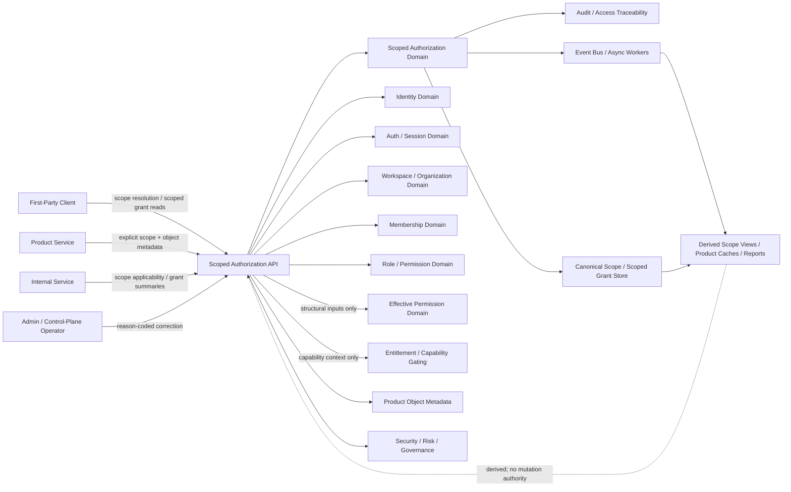
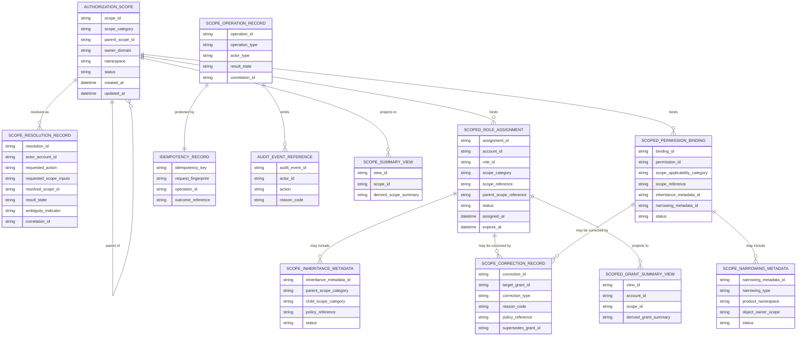
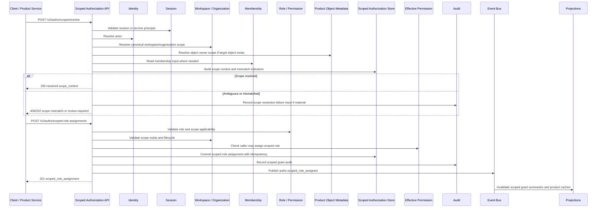

# SCOPED_AUTHORIZATION_MODEL_API_SPEC.md

## Document Metadata

- **Document Name:** `SCOPED_AUTHORIZATION_MODEL_API_SPEC.md`
- **Document Type:** FUZE API SPEC v2 / Production-grade interface-contract specification
- **Status:** Draft for production-grade API-spec review
- **Version:** 2.0.0
- **Effective Date:** 2026-04-24
- **Last Updated:** 2026-04-24
- **Reviewed On:** 2026-04-24
- **Document Owner:** FUZE Platform Identity and Access Architecture / Scoped Authorization Domain
- **Approval Authority:** FUZE Platform Architecture and Governance Authority
- **Review Cadence:** Quarterly or upon material change to scope categories, scope hierarchy, grant-to-scope binding, scope resolution, inheritance/narrowing rules, role/permission applicability, product sub-scope posture, internal operational scope, governance-sensitive scope, privileged correction, audit traceability, or API exposure.
- **Governing Layer:** API SPEC v2 / Workspace, Organization, Authorization, and Access Control API family
- **Parent Registry:** `API_SPEC_INDEX.md`
- **Upstream Semantic Registry:** `REFINED_SYSTEM_SPEC_INDEX.md`
- **Upstream API Registry:** `API_SPEC_INDEX.md`
- **Primary Audience:** API designers, backend engineers, authorization engineers, workspace engineers, product engineers, frontend/client engineers, security engineers, support/control-plane engineers, audit/governance reviewers, OpenAPI/AsyncAPI/SDK authors, QA and contract-validation teams.
- **Primary Purpose:** Define the FUZE production API contract for scoped authorization: scope category and applicability metadata, explicit server-owned scope resolution, grant-to-scope binding validation, scoped role assignments, scoped permission grants, inheritance and narrowing metadata, scope mismatch handling, scope-aware grant reads, correction/supersession, event emission, idempotency, replay safety, audit lineage, derived read-model boundaries, migration, and downstream derivation guardrails.
- **Primary Upstream References:**
  - `REFINED_SYSTEM_SPEC_INDEX.md`
  - `DOCS_SPEC_INDEX.md`
  - `SYSTEM_SPEC_INDEX.md`
  - `API_SPEC_INDEX.md`
  - `SYSTEM_BOUNDARY_AND_OWNERSHIP_SPEC.md`
  - `SYSTEM_OVERVIEW_AND_BOUNDARIES_SPEC.md`
  - `PLATFORM_ARCHITECTURE_SPEC.md`
  - `DOMAIN_OWNERSHIP_MATRIX_SPEC.md`
  - `DATA_MODEL_AND_ENTITY_OWNERSHIP_SPEC.md`
  - `FUZE_ACCOUNT_ACCESS_AND_SESSION_CANONICAL_FINAL_SPEC.md`
  - `IDENTITY_AND_ACCOUNT_SPEC.md`
  - `AUTH_SESSION_AND_LINKED_LOGIN_SPEC.md`
  - `FUZE_SESSION_LIFECYCLE_AND_SECURITY_SPEC.md`
  - `WORKSPACE_AND_ORGANIZATION_SPEC.md`
  - `FUZE_WORKSPACE_ACCESS_CONTROL_BASICS_THESIS_FINAL_SPEC.md`
  - `WORKSPACE_MEMBERSHIP_LIFECYCLE_SPEC.md`
  - `ROLE_PERMISSION_AND_ACCESS_CONTROL_SPEC.md`
  - `SCOPED_AUTHORIZATION_MODEL_SPEC.md`
  - `ACCESS_EVALUATION_AND_EFFECTIVE_PERMISSION_SPEC.md`
  - `ADMIN_ACCESS_CORRECTION_AND_CONTAINMENT_SPEC.md`
  - `AUDIT_AND_ACCESS_TRACEABILITY_SPEC.md`
  - `ENTITLEMENT_AND_CAPABILITY_GATING_SPEC.md`
  - `SECURITY_AND_RISK_CONTROL_SPEC.md`
  - `WALLET_AWARE_USER_SPEC.md`
  - `WORKSPACE_ORGANIZATION_API_SPEC.md`
  - `ROLE_PERMISSION_ACCESS_API_SPEC.md`
- **Primary Downstream Dependents:**
  - OpenAPI contracts for scoped authorization APIs
  - AsyncAPI contracts for scope resolution, scoped grant, scope hierarchy, and scope correction events
  - role/permission/access-control APIs
  - access evaluation and effective-permission APIs
  - entitlement/capability gating APIs
  - admin correction and containment APIs
  - audit and access traceability APIs
  - product integration specifications
  - internal service authorization adapters
  - support/control-plane workflow contracts
  - SDK scope-resolution and scoped-grant helpers
  - QA, contract validation, and regression suites
- **API Surface Families Covered:** first-party application APIs, internal service APIs, admin/control-plane APIs, event/async APIs, reporting/projection APIs, limited public/read-safe metadata APIs where explicitly approved.
- **API Surface Families Excluded:** canonical account identity APIs, login/session APIs, workspace/organization lifecycle APIs in full depth, membership lifecycle APIs in full depth, baseline role/permission catalog APIs in full depth, final effective-permission evaluation APIs in full depth, entitlement formula APIs, billing/credits/ledger truth, wallet-link lifecycle, chain/on-chain authority, product-local rule engines.
- **Canonical System Owner(s):** Scoped Authorization Domain for authorization scope categories, scope resolution semantics, grant-to-scope binding, scope applicability, hierarchy/inheritance/narrowing metadata, scope mismatch semantics, and scoped-grant lifecycle inputs; adjacent ownership remains with Identity, Auth/Session, Workspace/Organization, Membership, Role/Permission, Effective Permission, Entitlement, Security/Risk, Admin Correction, Audit, and Product domains.
- **Canonical API Owner:** FUZE Platform API Architecture / Scoped Authorization API owner
- **Supersedes:** Scoped-grant, scope-resolution, scope-binding, and scope-mismatch portions of `WORKSPACE_ORGANIZATION_API_SPEC.md` and `ROLE_PERMISSION_ACCESS_API_SPEC.md` where this API v2 document is narrower, stricter, or more explicit.
- **Superseded By:** Not yet known
- **Related Decision Records:** Not explicitly available in retrieved governing materials
- **Canonical Status Note:** This API spec derives from `SCOPED_AUTHORIZATION_MODEL_SPEC.md`. It owns interface-contract expression only. It MUST NOT redefine canonical identity, session, workspace/organization, membership, role/permission catalog, final effective-permission, entitlement, wallet-aware, product-local, audit, security/risk, or admin correction semantics.
- **Implementation Status:** Normative API contract baseline; downstream OpenAPI, AsyncAPI, SDK, service, storage, event, support-tool, audit, product-integration, and migration contracts must conform.
- **Approval Status:** Drafted for API SPEC v2 inclusion; formal approval record not yet attached.
- **Change Summary:** Created a production-grade API v2 contract for scoped authorization; separated scope resolution and grant-to-scope binding from workspace truth, membership truth, role/permission truth, final effective-permission truth, and entitlement truth; hardened explicit-scope requirements, no-cross-scope-leakage, bounded inheritance, narrowing, product/object scope attachment, internal/governance scope controls, idempotency, replay safety, correction lineage, event invalidation, audit, migration, and forbidden-pattern rules.

---

## Purpose

This document defines the FUZE API contract for **scoped authorization**.

Scoped authorization is the structural API layer that binds roles, permissions, direct grants, and equivalent authorization inputs to explicit scope. It answers:

- what scope is being used;
- whether the scope was resolved from canonical server-owned inputs;
- whether a grant may attach to that scope category;
- whether a broader grant may apply to a narrower scope;
- whether a narrower grant is insufficient for a broader action;
- whether scope mismatch, ambiguity, restriction, or stale context requires deny or review.

It does **not** answer final action-level allow/deny by itself. Final effective permission belongs downstream.

FUZE is a multi-workspace, multi-product platform. Authority cannot safely rest on current UI selection, route context, stale cache, product-local team state, entitlement, wallet status, or support-dashboard assumptions. Durable authority must bind to platform-owned scope.

---

## Scope

This specification governs API contracts for:

1. scope category metadata;
2. scope applicability metadata for roles and permissions;
3. explicit server-side scope resolution;
4. scope context reads;
5. grant-to-scope binding validation;
6. scoped role assignment contract behavior where scope binding is the governing concern;
7. scoped permission grant contract behavior where scope binding is the governing concern;
8. scope hierarchy, parent-scope reference, inheritance, and narrowing metadata;
9. scope mismatch and ambiguity outcomes;
10. product-scope and object/sub-resource scope attachment;
11. internal operational and governance-sensitive scope controls;
12. scope-bound grant correction and supersession;
13. scoped authorization events and async invalidation;
14. derived scoped-grant and scope-resolution read-model boundaries;
15. request, response, error, status, idempotency, audit, observability, migration, OpenAPI, AsyncAPI, and SDK derivation rules.

---

## Out of Scope

This API spec does not govern:

- canonical account identity semantics;
- login, session issuance, refresh, or revocation;
- workspace or organization lifecycle in full depth;
- invitation and membership-state mutation mechanics in full depth;
- full role and permission catalog design;
- final object-level allow/deny evaluation for every action;
- entitlement or commercial eligibility formulas;
- billing, credits, payment, invoice, ledger, or payout truth;
- wallet-link lifecycle, wallet custody, or chain authority;
- exact policy-engine DSL;
- exact database storage implementation;
- exact product permission tables;
- exact admin break-glass staffing procedures;
- exact UI explanation copy.

---

## Design Goals

1. Make scope explicit for every meaningful durable authorization grant.
2. Preserve strict separation between identity, session, scope, membership, structural authorization, final effective permission, entitlement, and product-local state.
3. Prevent scope ambiguity from becoming authority leakage.
4. Prevent cross-workspace, cross-organization, cross-product, cross-object, cross-operational, and cross-governance leakage.
5. Support one canonical account operating across many workspaces, organizations, products, internal domains, and object scopes.
6. Support future-safe scope hierarchy and narrowing without hidden global power.
7. Preserve auditability and reconstruction for scope resolution and scope-bound grant mutation.
8. Prevent product-local scope drift from replacing platform-owned scope semantics.
9. Keep governance-sensitive and internal-operational authority separately modeled and tightly controlled.
10. Provide deterministic structural inputs to downstream effective-permission evaluation.

---

## Non-Goals

This API spec is not intended to:

- treat current workspace selection as canonical authority;
- treat workspace membership as unrestricted workspace-wide power;
- treat product participation as platform-wide admin capability;
- define every final allow or deny rule;
- collapse entitlement, billing, or feature rollout posture into scope truth;
- let products invent incompatible shared scope categories for shared platform behavior;
- allow cached summaries to substitute for fresh canonical scope checks on sensitive actions;
- make scoped authorization a monolithic replacement for role/permission, effective-permission, entitlement, or admin correction APIs.

---

## Core Principles

### Explicit Scope Principle

Every durable authorization grant in FUZE MUST bind to one explicit scope category and one explicit scope reference or approved scope-pattern construct. Contextless authority is disallowed except where a narrowly defined platform-global role is explicitly owned, justified, and separately governed.

### Scope-Resolution-Before-Grant-Use Principle

A grant MUST NOT be evaluated until the relevant scope has been resolved from canonical inputs.

### Scope-Is-Not-Identity Principle

Identity answers who the actor is. Scope answers where the actor is operating. These truths are connected but distinct.

### Scope-Is-Not-Permission Principle

Scope defines the domain in which authority may be considered. Scope itself MUST NOT be treated as permission.

### Membership-Is-Not-Scope Principle

Membership is a structural account-to-scope relationship. It is an input to scoped authorization, not a substitute for scope resolution and not final authority.

### Narrowest Valid Scope Principle

Authority SHOULD be granted at the narrowest scope that satisfies the operating need unless broader scope is explicitly required and policy-approved.

### No Cross-Scope Leakage Principle

A grant for one workspace, organization, product namespace, object family, or operational domain MUST NOT silently apply to another unrelated scope.

### Bounded Inheritance Principle

Inheritance across scope levels is allowed only where explicitly modeled, policy-safe, and auditable. It MUST NEVER be assumed casually.

### Runtime Selector Is Not Grant Principle

Current workspace selection, active product tab, route context, or frontend state may assist scope resolution but MUST NOT create authority.

### Restriction Precedence Principle

Restriction, suspension, review posture, containment, or lifecycle-state blocks affecting the relevant scope or its parent MUST outrank ordinary grants.

### Product-Consumption Principle

Products may extend authorization beneath a valid parent scope, but they MUST consume platform-owned scope truth instead of replacing it.

### Reconstruction Principle

Scope-bound grants and scope-resolution outcomes MUST remain reconstructable from canonical records, policy references, and audit lineage.

---

## Canonical Definitions

- **Scope:** Defined operational context in which a grant may apply.
- **Scope Category:** Named class of scope such as `account`, `organization`, `workspace`, `product`, `internal_operational`, `governance_sensitive`, or `object`.
- **Scope Identifier:** Durable identifier or composite reference identifying the scope instance.
- **Scope Resolution:** Server-owned process that turns canonical runtime inputs into a concrete scope reference and structural scope context.
- **Scope Context:** Resolved facts needed for downstream evaluation, including scope category, scope ID, parent scope, actor relation, lifecycle state, ambiguity, and mismatch indicators.
- **Scoped Grant:** Role assignment, permission grant, or equivalent authorization binding that explicitly references scope and applies only within that scope or explicitly modeled descendant scope.
- **Scope Hierarchy:** Structural parent/child relationship among scopes, such as organization-to-workspace or workspace-to-product-within-workspace.
- **Scope Inheritance:** Controlled ability for a broader grant to satisfy authority requirements in a narrower scope where policy explicitly allows it.
- **Scope Narrowing:** Process of limiting a broader role or grant to a product namespace, object family, workflow family, container path, or bounded action family.
- **Unscoped Grant:** Grant with no explicit scope reference. Unscoped grants are non-canonical and forbidden for ordinary behavior.
- **Scope Applicability:** Rule family defining which role or permission types are valid for which scope categories.
- **Scope Mismatch:** Condition in which requested action, target object, claimed context, or grant binding does not match canonical resolved scope required for safe authorization.
- **Object Owner Scope:** Canonical scope to which a product object, container, dataset, workflow, artifact, or sub-resource belongs for authorization.
- **Scope Correction:** Audited remediation that corrects misbound grants or scope references without erasing lineage.
- **Scope Pattern Construct:** Approved policy-bound scope reference pattern, such as a bounded product namespace under a workspace, that remains machine-checkable and auditable.

---

## Truth Class Taxonomy

This API spec preserves:

1. **Semantic Truth:** Defined by upstream refined system specs.
2. **API Contract Truth:** Defined here for scope-resolution, binding-validation, events, request/response/error/status, idempotency, and audit behavior.
3. **Canonical Identity Truth:** Durable actor anchor represented by `account_id`.
4. **Runtime Session Truth:** Temporary authenticated runtime state; prerequisite state, not authorization.
5. **Collaborative Scope Truth:** Canonical organization and workspace records, hierarchy, ownership, lifecycle, and selector semantics owned by Workspace/Organization Domain.
6. **Membership Truth:** Durable relationship between account and collaborative scope; structural input, not final authority.
7. **Role / Permission Truth:** Baseline role and permission catalog semantics owned by Role/Permission Domain.
8. **Scoped Authorization Truth:** Scope categories, scope resolution outputs, grant-to-scope bindings, applicability, inheritance, narrowing, mismatch, and scoped-grant lifecycle state.
9. **Effective-Permission Truth:** Final allow/deny/restricted/review-required outcome owned by Effective Permission Domain.
10. **Entitlement Truth:** Commercial or policy eligibility for capabilities owned by Entitlement Domain.
11. **Policy / Restriction Truth:** Security, risk, containment, governance, restriction, and review posture.
12. **Product-Local Truth:** Product object and object-condition facts beneath valid parent scope.
13. **Audit / Traceability Truth:** Durable actor, scope, grant, reason, policy, operation, correlation, and event lineage.
14. **Derived Read-Model Truth:** Support views, dashboards, cached scoped-grant summaries, search projections, and UX summaries.
15. **Reporting / Public View Truth:** Aggregated or user-facing summaries that remain downstream presentations.

---

## Architectural Position in the Spec Hierarchy

This API spec sits below:

- `REFINED_SYSTEM_SPEC_INDEX.md`
- `SYSTEM_BOUNDARY_AND_OWNERSHIP_SPEC.md`
- `SYSTEM_OVERVIEW_AND_BOUNDARIES_SPEC.md`
- `PLATFORM_ARCHITECTURE_SPEC.md`
- `DOMAIN_OWNERSHIP_MATRIX_SPEC.md`
- `DATA_MODEL_AND_ENTITY_OWNERSHIP_SPEC.md`
- `FUZE_ACCOUNT_ACCESS_AND_SESSION_CANONICAL_FINAL_SPEC.md`
- `WORKSPACE_AND_ORGANIZATION_SPEC.md`
- `ROLE_PERMISSION_AND_ACCESS_CONTROL_SPEC.md`
- `WORKSPACE_MEMBERSHIP_LIFECYCLE_SPEC.md`
- `FUZE_WORKSPACE_ACCESS_CONTROL_BASICS_THESIS_FINAL_SPEC.md`
- `SCOPED_AUTHORIZATION_MODEL_SPEC.md`

It sits above or feeds:

- `ACCESS_EVALUATION_AND_EFFECTIVE_PERMISSION_API_SPEC.md`
- `ADMIN_ACCESS_CORRECTION_AND_CONTAINMENT_API_SPEC.md`
- `AUDIT_AND_ACCESS_TRACEABILITY_API_SPEC.md`
- `ENTITLEMENT_AND_CAPABILITY_GATING_API_SPEC.md`
- product integration specifications
- internal service authorization adapters
- control-plane workflow specifications.

---

## Upstream Semantic Owners

### `SCOPED_AUTHORIZATION_MODEL_SPEC.md`

Primary semantic owner for authorization scope categories, scope-resolution prerequisites and outputs, grant-to-scope binding, inheritance/narrowing, scope mismatch semantics, product/object scope attachment, and scope correction lineage.

### `WORKSPACE_AND_ORGANIZATION_SPEC.md`

Owns canonical workspace and organization existence, hierarchy, lifecycle, and collaborative scope truth consumed by scoped authorization.

### `WORKSPACE_MEMBERSHIP_LIFECYCLE_SPEC.md`

Owns membership state consumed as structural input by scoped authorization.

### `ROLE_PERMISSION_AND_ACCESS_CONTROL_SPEC.md`

Owns baseline role and permission catalog semantics that scoped authorization binds to explicit scope.

### `ACCESS_EVALUATION_AND_EFFECTIVE_PERMISSION_SPEC.md`

Owns final action-level outcome after scope, grants, restrictions, object facts, policy, and entitlement posture are combined.

### `ENTITLEMENT_AND_CAPABILITY_GATING_SPEC.md`

Owns capability eligibility. Entitlement may constrain downstream use but does not redefine scope truth.

### `ADMIN_ACCESS_CORRECTION_AND_CONTAINMENT_SPEC.md`

Owns privileged correction and containment workflows for unsafe or mistaken scope/grant state.

### `AUDIT_AND_ACCESS_TRACEABILITY_SPEC.md`

Owns durable access traceability and reconstruction requirements.

---

## API Surface Families

### First-Party Application APIs

Used for scope resolution, scope context reads, scoped-grant summaries, and safe client-side preparation. First-party APIs MUST NOT expose internal/governance-sensitive scope internals to ordinary users.

### Internal Service APIs

Used by products and services to resolve canonical scope, validate scope applicability, read scoped-grant summaries, and supply structural inputs to effective-permission evaluation.

### Admin / Control-Plane APIs

Used for scope correction, misbound grant remediation, broader-scope/governance-sensitive grant review, and privileged scope-context inspection. These APIs are separated, reason-coded, policy-constrained, idempotent, and audited.

### Event / Async APIs

Used to publish post-commit scope resolution failures, scoped-grant changes, scope hierarchy changes, scope restrictions, and correction outcomes. Events invalidate caches and projections; they do not own scope truth.

### Reporting / Projection APIs

Used for derived scope summaries, grant dashboards, support views, product authorization caches, analytics, and access reports. They are read-only and non-authoritative.

### Public APIs

No broad unauthenticated public scoped-authorization API is defined. Public metadata exposure, if later introduced, must be narrow, redacted, stable, and separately governed.

---

## System / API Boundaries

This API spec governs the structural binding layer between role/permission truth and final effective-permission truth.

It does not own:

- account identity;
- session validity;
- workspace/organization existence;
- membership lifecycle;
- full role/permission catalog;
- final effective-permission outcomes;
- entitlement/capability eligibility;
- wallet status;
- product-local object policy;
- audit storage;
- privileged correction policy.

Downstream APIs MUST preserve these boundaries.

---

## Adjacent API Boundaries

- `WORKSPACE_AND_ORGANIZATION_API_SPEC.md` owns canonical scope resources.
- `WORKSPACE_MEMBERSHIP_LIFECYCLE_API_SPEC.md` owns membership lifecycle resources.
- `ROLE_PERMISSION_AND_ACCESS_CONTROL_API_SPEC.md` owns role/permission catalog and baseline grant resources.
- `WORKSPACE_ACCESS_CONTROL_BASICS_API_SPEC.md` owns layered post-auth access-context ordering.
- `ACCESS_EVALUATION_AND_EFFECTIVE_PERMISSION_API_SPEC.md` owns final action evaluation.
- `ENTITLEMENT_AND_CAPABILITY_GATING_API_SPEC.md` owns capability eligibility.
- `ADMIN_ACCESS_CORRECTION_AND_CONTAINMENT_API_SPEC.md` owns privileged correction/containment workflow.
- `AUDIT_AND_ACCESS_TRACEABILITY_API_SPEC.md` owns generic access traceability APIs.

---

## Conflict Resolution Rules

When multiple layers disagree, scope-related interpretation MUST resolve in this order unless a higher-order policy explicitly overrides it:

1. canonical identity truth;
2. canonical workspace or organization truth, including lifecycle posture;
3. canonical membership truth;
4. canonical scope-resolution rules and scope ownership metadata;
5. explicit restriction, risk, containment, and governance posture;
6. scoped-grant validity and applicability;
7. effective-permission evaluation;
8. entitlement posture;
9. derived views, caches, UI state, and reports.

Specific rules:

- canonical owner scope metadata for a target object outranks client-supplied scope hints;
- explicit parent-scope restrictions outrank broader inferred allows;
- ambiguous scope resolves to deny or review-required, never silent fallback;
- stale caches do not outrank fresh canonical scope or grant truth;
- privileged correction preserves lineage rather than flattening prior mistaken state;
- product scope cannot silently become workspace scope;
- workspace scope cannot silently become organization scope;
- ordinary operational scope cannot silently become governance-sensitive scope;
- current workspace selection and route context are hints, not authority.

---

## Default Decision Rules

1. Default to no grant portability across scopes.
2. Default to no inheritance from broader to narrower scope unless explicitly declared.
3. Default to no escalation from product scope to workspace scope.
4. Default to no escalation from workspace scope to organization scope.
5. Default to no escalation from ordinary operational scope to governance-sensitive scope.
6. Default to server-side scope resolution over client-supplied context.
7. Default to deny or review-required for unresolved, mismatched, or structurally ambiguous scope.
8. Default to preserving existing canonical control relationships during correction.
9. Default to canonical parent-scope attachment for product and object scopes.
10. Default to explicit reason codes and audit lineage for privileged scope correction.
11. Default to derived-view invalidation on authoritative scope or scoped-grant mutation.
12. Default to final action answer coming from the effective-permission layer, not from scoped-grant presence.

---

## Roles / Actors / API Consumers

- **Canonical Account Actor:** Authenticated FUZE account attempting to act.
- **Scope Subject:** Scope instance under which the actor attempts to operate.
- **Scope Owner:** Domain owner of the scope record itself.
- **Scope Resolver:** Platform service or boundary resolving intended scope from canonical runtime inputs and target metadata.
- **Scoped Role Holder:** Actor with role assignment bound to a specific scope.
- **Scoped Permission Holder:** Actor with permission grant or derived permission set bound to a specific scope.
- **Product Authorization Consumer:** Product or internal service reading scoped grants and scope context to request or perform authorization evaluation.
- **Control-Plane Reviewer:** Privileged actor approving, constraining, correcting, or superseding scope-bound grants in high-sensitivity cases.
- **Object Owner Scope Provider:** Product or platform owner that supplies canonical object-to-scope metadata.
- **Effective-Permission Evaluator:** Downstream service computing final action result.

---

## Resource / Entity Families

### API-Facing Resources

- `authorization_scope`
- `scope_context`
- `scope_resolution`
- `scope_applicability`
- `scoped_role_assignment`
- `scoped_permission_grant`
- `scoped_permission_binding`
- `scope_inheritance_rule`
- `scope_narrowing_rule`
- `scope_mismatch_result`
- `scope_correction_action`
- `scoped_grant_summary`
- `scope_resolution_audit_reference`
- `scoped_authorization_event`

### Canonical Owner-Domain Entities

- `authorization_scope`
- `scope_resolution_record`
- `scope_applicability_rule`
- `scoped_role_assignment`
- `scoped_permission_binding`
- `scope_inheritance_metadata`
- `scope_narrowing_metadata`
- `scope_correction_record`
- `scope_operation_record`
- `idempotency_record`
- `audit_event_reference`

### Referenced but Non-Owned Entities

- `account`
- `auth_session`
- `workspace`
- `organization`
- `workspace_membership`
- `role_definition`
- `permission_definition`
- `effective_permission_result`
- `entitlement_result`
- `product_object`
- `security_risk_signal`
- `admin_correction_case`

### Derived Entities

- `scoped_grant_summary`
- `scope_resolution_summary`
- `product_authorization_cache`
- `support_scope_view`
- `scope_audit_report`
- `scope_search_projection`

Derived entities MUST be regenerable from canonical scope and scoped-grant records and MUST NOT write canonical scoped authorization truth.

---

## Ownership Model

### Scoped Authorization Domain Owns

- canonical authorization scope categories;
- structural binding rules between grants and scope;
- scope-reference format and applicability semantics;
- inheritance and narrowing rules between scope layers;
- scope-resolution outputs and mismatch semantics;
- scope-bound grant lifecycle state where scope binding is authoritative;
- audit lineage for scope-bound grant mutation in coordination with Audit Domain;
- publication of scope-aware grant events after canonical commit.

### Scoped Authorization Domain MAY

- expose scope applicability metadata;
- validate whether requested grants may bind to requested scope;
- publish scoped-grant summaries;
- publish scope-resolution summaries;
- coordinate with effective-permission, entitlement, security, product, and admin-correction domains.

### Scoped Authorization Domain MUST NOT

- redefine identity truth;
- redefine workspace or organization truth;
- redefine membership lifecycle;
- own final effective-permission outcomes;
- own commercial eligibility truth;
- allow products to invent incompatible shared scope models;
- treat UI selection, route state, or cached context as canonical scope truth;
- create contextless ordinary authority;
- erase grant lineage during correction.

---

## Authority / Decision Model

### Upstream Layers Provide

- canonical account identity;
- runtime session validity;
- workspace or organization context where relevant;
- membership presence and status;
- workspace or organization lifecycle state;
- product namespace;
- object ownership metadata;
- role/permission catalog applicability;
- restriction, containment, privileged approval, or governance context where relevant.

### Scoped Authorization Layer Decides

- which scope category and scope identifier the request is operating in;
- whether scope can be resolved from canonical inputs;
- whether the relevant grant may attach to that scope category;
- whether a broader grant may apply to a narrower context;
- whether a narrower grant is insufficient for a broader action;
- whether scope mismatch requires deny or review;
- whether requested scope-bound grant mutation is structurally legal;
- whether correction/supersession is required for misbound scope.

### Effective Permission Layer Decides

- whether resolved scoped grants plus object conditions, restrictions, policy, and entitlement posture yield the final action outcome.

This separation is mandatory.

---

## Canonical Scope Categories

FUZE APIs MUST support at least these scope categories.

### Account Scope

Authority that applies only within the actor’s own account domain.

Representative examples: managing own access methods, viewing own receipts, self-service account recovery, reading own audit summaries.

### Organization Scope

Authority that applies to a broader organizational umbrella where explicitly modeled.

Representative examples: reporting across contained workspaces, managed provisioning across child workspaces, organization-level policy settings where allowed.

### Workspace Scope

Authority that applies to one specific workspace, which remains the primary actionable collaborative scope.

Representative examples: inviting/removing members, assigning workspace roles, editing shared settings, managing workspace-scoped product surfaces.

### Product Scope

Authority that applies to one product namespace within a valid account or workspace context.

Representative examples: operating a product workflow in one workspace, administering product-local content, configuring a bounded product feature set.

### Internal Operational Scope

Authority that applies to internal support, finance, risk, trust, reporting, or operational domains.

Representative examples: support correction execution, abuse review, finance-side corrective actions, operational diagnostics.

### Governance-Sensitive Scope

Authority that applies to higher-trust operations requiring stronger control pathways.

Representative examples: registry-affecting changes, payout-cycle operational transitions, high-impact credits control actions, emergency control posture.

### Object / Sub-Resource Scope

Authority that applies to a bounded object family, object container, dataset, workflow, automation namespace, or sub-resource nested under a broader parent scope.

Object scope remains subordinate to account, workspace, organization, or product structure and MUST NOT become an alternate shared-scope system.

---

## Scope Hierarchy Model

### Representative Hierarchy

1. Account
2. Organization, where explicitly modeled
3. Workspace
4. Product within workspace or account
5. Object / container / sub-resource

### Hierarchy Rules

- Organization may contain one or more workspaces where implemented distinctly.
- Workspace remains the primary actionable collaborative scope.
- Product scope MUST attach to a valid parent scope, usually account or workspace.
- Object or sub-resource scope MUST attach to a valid parent scope.
- Broader scope does not imply unrestricted authority in descendants unless explicitly modeled.
- Narrower scope NEVER implies authority in parent scope.
- Internal operational and governance-sensitive scopes remain separately classified even when actions affect workspace or product state.
- Parent-scope restriction may suppress child-scope grant usability.
- Hierarchy changes MUST invalidate or refresh derived scoped-grant summaries.

---

## Scope Resolution Model

### Inputs MAY Include

- canonical account identity from session;
- requested action or route family;
- explicit workspace identifier;
- explicit organization identifier;
- explicit product namespace;
- object identifier and object owner scope;
- membership state;
- workspace or organization lifecycle state;
- route family or control-plane context;
- privileged approval context;
- policy and restriction posture;
- correlation ID or trace ID.

### Outputs MUST Include

- resolved scope category;
- resolved scope identifier;
- parent scope reference where applicable;
- actor relation to scope;
- scope validity status;
- structural mismatch indicator;
- ambiguity indicator;
- restriction or lifecycle indicator where relevant;
- source-of-truth references used;
- correlation identifier or equivalent trace linkage.

### Rules

- Scope MUST be resolved before evaluating scoped grants.
- Ambiguous scope MUST NOT silently fall back to a broader scope.
- Runtime UI selection is an input hint, not canonical proof.
- Product routes MUST NOT silently invent workspace scope when canonical workspace context is missing.
- Object owner scope MUST be derived from canonical object metadata, not user assumption.
- Missing or conflicting inputs MUST produce deny or review-required.
- Server-side resolution wins over client-supplied scope claims.
- Resolution results MUST be reconstructable for sensitive actions.

---

## Grant Binding Model

Every durable authorization grant MUST bind to one explicit scope category and one explicit scope identifier or approved scope-pattern construct.

### Allowed Structural Forms

- role assignment to one account scope;
- role assignment to one organization scope;
- role assignment to one workspace scope;
- role assignment to one product scope under a parent workspace or account;
- internal operational role assignment under one operational domain;
- governance-sensitive role assignment under one governance-sensitive domain;
- object-scoped grant under an approved parent scope.

### Disallowed Structural Forms

- implicit grant with no scope;
- workspace-wide semantics inferred from one product-local grant without explicit policy;
- product-wide semantics inferred from one object grant;
- organization-wide semantics inferred from one workspace grant;
- authority widened by frontend-selected context alone;
- global shared-platform semantics inferred from workspace-local role names;
- wallet-derived authority used as scoped grant;
- entitlement-derived authority used as scoped grant.

### Binding Rules

- Scope applicability MUST be validated at grant-creation time.
- Invalid scope-to-role combinations MUST be rejected.
- Invalid scope-to-permission combinations MUST be rejected.
- Product-scoped grants MUST include product namespace and parent scope reference.
- Object-scoped grants MUST include durable parent-scope and object-owner metadata.
- Internal operational and governance-sensitive grants MUST remain separately classified.
- Expired, revoked, restricted, or superseded grants MUST NOT remain structurally valid through stale caches.
- Direct grants outside approved catalogs or approved exception pathways are non-canonical and forbidden.

---

## Inheritance and Narrowing Model

Scoped authorization MAY support inheritance, but it MUST be explicit and bounded.

### Permitted Examples

- workspace-owner role may satisfy certain workspace-subscope requirements where policy explicitly allows;
- organization-level administrative grant may apply to child workspace only where hierarchy and policy allow;
- product-manager grant for a workspace-specific product scope may apply to bounded object scopes inside that product where policy declares that relation.

### Disallowed Examples

- workspace membership automatically inheriting product admin across all products;
- product admin automatically inheriting workspace ownership or billing authority;
- workspace owner automatically inheriting platform admin or governance-sensitive authority;
- one workspace grant automatically applying to another workspace;
- one object grant automatically expanding to sibling objects without explicit policy;
- organization scope automatically granting all child workspace actions.

### Narrowing Rules

- Grants MAY be narrowed by object owner scope, product namespace, workflow family, container path, dataset, or bounded action family.
- Narrowed grants MUST remain auditable and machine-checkable.
- Direct per-object overrides SHOULD remain rare, visible, and policy-constrained.
- Narrowing MAY reduce authority but MUST NOT silently widen it.
- Narrowing metadata MUST be preserved for effective-permission evaluation and audit reconstruction.

---

## Relationship to Membership and Workspace Truth

Scoped authorization depends on workspace and membership truth but does not own them.

Required rules:

- workspace scope exists only if canonical workspace truth exists;
- organization scope exists only if canonical organization truth exists where modeled;
- workspace-scoped grants are meaningful only when the actor’s relationship to workspace is valid enough for downstream use;
- membership state is structural input, not final authorization;
- removed, suspended, restricted, or containment-affected membership may invalidate otherwise matching scoped grants;
- active workspace selection is runtime context only and MUST NOT substitute for membership or scope truth;
- workspace or organization lifecycle restrictions may suppress scoped-grant usability even where grant records still exist.

---

## Relationship to Effective Permission

Scoped authorization is upstream of effective permission and MUST remain distinct.

Required rules:

- scoped authorization determines candidate structural applicability, not final action outcome;
- effective permission consumes resolved scope context plus scoped grants, restrictions, object conditions, policy posture, and entitlement posture;
- products MUST NOT answer high-impact permission questions from scoped-grant presence alone;
- cached scoped-grant summaries MUST NOT be treated as final allow for sensitive actions.

---

## Relationship to Entitlement and Capability Gating

Scoped authorization is not entitlement.

Required rules:

- valid scoped grant may still be insufficient if capability is not entitled;
- entitlement without valid scoped grant is insufficient for protected action;
- products MUST NOT confuse plan status, billing status, or feature rollout assignment with scoped authorization;
- entitlement-aware blocks may suppress use of structurally valid grants downstream but do not redefine scope truth.

---

## Relationship to Product and Object-Level Policy

Products may refine authorization beneath the shared platform model.

Allowed:

- product-specific sub-scopes under a valid parent scope;
- object-specific permissions within valid product or workspace scope;
- product-local role namespaced under product ownership;
- product-local object-condition checks feeding downstream effective-permission evaluation.

Not allowed:

- alternate workspace systems for shared behavior;
- global product-admin roles silently acting across all workspaces;
- product-local overrides bypassing platform restriction, containment, or governance rules;
- object-owner assumptions ignoring canonical object scope metadata;
- product-local grant summary used as final allow for sensitive platform actions.

---

## API State Model

### Scope Resolution States

- `resolved`
- `unresolved`
- `ambiguous`
- `mismatched`
- `restricted`
- `review_required`
- `unsupported_scope`
- `stale`
- `dependency_unavailable`

### Scope Applicability States

- `applicable`
- `not_applicable`
- `requires_parent_scope`
- `requires_product_namespace`
- `requires_object_owner_scope`
- `requires_governance_scope`
- `requires_control_plane`
- `deprecated`
- `disabled`

### Scoped Grant States

- `pending`
- `active`
- `restricted`
- `revoked`
- `expired`
- `superseded`
- `correction_pending`
- `review_required`

### Scope Correction States

- `accepted`
- `under_review`
- `completed`
- `partially_completed`
- `denied`
- `failed`
- `superseded`

### Operation States

- `accepted`
- `completed`
- `partially_completed`
- `denied`
- `failed`
- `cancelled`
- `requires_review`
- `superseded`

---

## Lifecycle / Workflow Model

### Scope Resolution

1. Caller submits action, target, scope inputs, product namespace, and object references where applicable.
2. API validates identity/session or service principal.
3. API resolves canonical owner scope from server-side records.
4. API compares resolved scope against caller-supplied scope.
5. API evaluates hierarchy, lifecycle, membership, restriction, and ambiguity posture as structural inputs.
6. API returns resolved scope context or stable failure/review result.
7. Sensitive resolution records trace/audit references.

### Scoped Grant Creation

1. Caller submits subject, role/permission, scope category, scope identifier, parent scope, idempotency key, and correlation ID.
2. API validates role/permission existence through role/permission owner.
3. API validates scope existence through scope owner.
4. API validates membership or actor relation where required.
5. API validates scope applicability and inheritance/narrowing metadata.
6. API records scoped grant and lineage.
7. API emits post-commit event.
8. Downstream effective-permission caches refresh.

### Scoped Grant Revocation

1. Caller submits grant revocation request with idempotency key.
2. API validates caller authority, grant state, scope state, and correction constraints.
3. API transitions grant to revoked or returns terminal prior outcome.
4. API emits scoped-grant revocation event.
5. Derived views and product caches invalidate.

### Scope Correction / Supersession

1. Misbound grant, wrong parent scope, stale object owner scope, or unsafe inheritance is detected.
2. API routes ordinary correction or admin/control-plane correction depending on sensitivity.
3. Privileged correction requires reason code, policy reference, idempotency, and audit.
4. API preserves prior assignment lineage and creates superseding correction record.
5. Events invalidate derived and downstream evaluation state.

### Hierarchy / Parent Scope Change

1. Workspace/product/object hierarchy changes in owning domain.
2. Scoped authorization receives event or internal signal.
3. API invalidates affected scoped-grant summaries.
4. Sensitive future actions re-resolve scope.
5. Existing grants are evaluated under explicit migration/correction rules.

---

## Architecture Diagram — Mermaid flowchart

---

## Data Design — Mermaid Diagram

---

## Flow View

### Primary Flow — Scope Resolution

1. Client, product, or service submits requested action, target object, explicit scope fields, and correlation ID.
2. API authenticates session or service principal.
3. API obtains canonical actor identity.
4. API resolves workspace/organization/product/object owner scope from server-side owner records.
5. API checks membership, lifecycle, restriction, hierarchy, and parent-scope posture where required.
6. API compares canonical resolved scope against client-supplied scope hints.
7. API returns `resolved`, `unresolved`, `mismatched`, `ambiguous`, `restricted`, or `review_required`.
8. API records trace where action is sensitive.

### Primary Flow — Scoped Grant Creation

1. Caller requests role/permission assignment to explicit scope with idempotency key.
2. API validates caller authority through effective-permission/control-plane path.
3. API validates role/permission scope applicability.
4. API validates canonical scope existence and parent attachment.
5. API rejects unscoped or mismatched grant.
6. API creates scoped grant and lineage.
7. API emits event and invalidates derived summaries.
8. Response returns grant state and downstream evaluation flags.

### Inheritance / Narrowing Flow

1. Effective-permission or product integration requests candidate grants for narrower context.
2. API resolves parent and child scopes.
3. API checks explicit inheritance metadata.
4. API applies narrowing metadata where present.
5. API returns structural candidate grants, not final allow.
6. Downstream effective-permission layer computes final outcome.

### Correction Flow

1. Misbound grant or scope mismatch is detected.
2. API routes ordinary correction or control-plane correction.
3. Privileged correction includes reason code, policy reference, idempotency key, and audit.
4. API preserves prior lineage and creates superseding record.
5. API emits correction event.
6. Derived summaries and product caches invalidate.

### Degraded Flow

1. Canonical scope, membership, role/permission, or object metadata dependency is unavailable.
2. Low-risk read may return partial/stale state with labels.
3. Sensitive action or grant mutation fails closed.
4. API never uses stale cache, UI state, or product-local context to widen authority.

---

## Data Flows — Mermaid sequenceDiagram

---

## Request Model

Side-effecting requests MUST include or derive:

- caller identity or service identity;
- target subject account/service principal;
- role ID/key or permission ID/key;
- explicit scope category;
- explicit scope identifier;
- parent scope reference where applicable;
- product namespace where applicable;
- object identifier and object owner scope where applicable;
- inheritance or narrowing metadata where applicable;
- idempotency key;
- correlation ID and trace ID;
- reason code for correction, privileged, governance-sensitive, or internal operational actions;
- policy reference where required;
- actor confirmation for privileged actions.

Requests MUST NOT include:

- unscoped grant mutation for ordinary behavior;
- frontend-selected workspace as grant authority;
- product-local team/project as canonical workspace scope;
- entitlement or billing status as grant authority;
- wallet proof as scoped grant;
- object-owner guesses without canonical metadata;
- direct storage mutation intent;
- broad admin override without reason, policy, idempotency, and audit.

---

## Response Model

### Success / Progress Response Classes

- `scope_resolution.resolved`
- `scope_resolution.unresolved`
- `scope_resolution.mismatched`
- `scope_resolution.ambiguous`
- `scope_resolution.restricted`
- `scope_resolution.review_required`
- `scope_applicability.read`
- `scope_applicability.validated`
- `scoped_role_assignment.created`
- `scoped_role_assignment.revoked`
- `scoped_permission_grant.created`
- `scoped_permission_grant.revoked`
- `scoped_grant.corrected`
- `scoped_grant.superseded`
- `scope_operation.accepted`
- `scope_operation.completed`
- `scope_operation.partial`

### Required Fields Where Applicable

- `scope_category`;
- `scope_id`;
- `parent_scope_reference`;
- `scope_validity`;
- `actor_relation`;
- `membership_input_state`;
- `lifecycle_input_state`;
- `ambiguity_indicator`;
- `mismatch_indicator`;
- `object_owner_scope`;
- `product_namespace`;
- `inheritance_metadata`;
- `narrowing_metadata`;
- `scoped_grant_id`;
- `operation_id`;
- `correlation_id`;
- `audit_reference`;
- `policy_reference`;
- `reason_code`;
- `requires_effective_permission_evaluation`;
- `requires_entitlement_evaluation`;
- `derived` flag for summaries;
- `freshness` or `projection_freshness` for derived views.

### Response Constraints

Responses MUST distinguish unsupported scope, unresolved scope, unauthorized scope, restricted scope, mismatched scope, and review-required scope. Responses MUST NOT expose internal operational scope details, governance-sensitive rules, private object-owner metadata, risk internals, or privileged correction notes to unauthorized callers.

---

## Error / Result / Status Model

### HTTP Classes

- `200 OK` for successful reads/resolutions and completed idempotent terminal outcomes.
- `201 Created` for scoped grant creation.
- `202 Accepted` for review, async correction, or privileged-scope workflows.
- `400 Bad Request` for malformed or underspecified scope input.
- `401 Unauthorized` for missing/invalid session where required.
- `403 Forbidden` for insufficient authority or unauthorized scope.
- `404 Not Found` where resource/scope is unavailable or must be concealed.
- `409 Conflict` for scope mismatch, ambiguity, hierarchy conflict, grant conflict, or idempotency conflict.
- `423 Locked` or equivalent problem code for restricted/suspended/contained scope where FUZE maps that way.
- `429 Too Many Requests` for rate-limit or abuse-control denial.
- `500/503` for server/dependency failure with fail-closed high-impact posture.

### Stable Error Codes

- `SCOPE_REQUIRED`
- `SCOPE_UNRESOLVED`
- `SCOPE_AMBIGUOUS`
- `SCOPE_MISMATCH`
- `SCOPE_UNSUPPORTED`
- `SCOPE_RESTRICTED`
- `SCOPE_REVIEW_REQUIRED`
- `SCOPE_HIERARCHY_INVALID`
- `PARENT_SCOPE_REQUIRED`
- `PARENT_SCOPE_RESTRICTED`
- `OBJECT_OWNER_SCOPE_REQUIRED`
- `OBJECT_OWNER_SCOPE_MISMATCH`
- `PRODUCT_NAMESPACE_REQUIRED`
- `PRODUCT_SCOPE_PARENT_INVALID`
- `ROLE_SCOPE_NOT_APPLICABLE`
- `PERMISSION_SCOPE_NOT_APPLICABLE`
- `UNSCOPED_GRANT_FORBIDDEN`
- `CROSS_SCOPE_LEAKAGE_FORBIDDEN`
- `INHERITANCE_NOT_DECLARED`
- `NARROWER_SCOPE_INSUFFICIENT`
- `GOVERNANCE_SCOPE_REQUIRED`
- `INTERNAL_OPERATIONAL_SCOPE_REQUIRED`
- `CURRENT_WORKSPACE_NOT_AUTHORITY`
- `PRODUCT_SHADOW_SCOPE_FORBIDDEN`
- `ENTITLEMENT_NOT_AUTHORITY`
- `WALLET_AUTHORITY_FORBIDDEN`
- `REASON_CODE_REQUIRED`
- `POLICY_REFERENCE_REQUIRED`
- `OPERATOR_PERMISSION_DENIED`
- `IDEMPOTENCY_KEY_REQUIRED`
- `IDEMPOTENCY_CONFLICT`
- `DERIVED_VIEW_UNAVAILABLE`
- `OWNER_DOMAIN_UNAVAILABLE_FAIL_CLOSED`

### Result Semantics

Accepted-state responses mean a scope correction, review, migration, or privileged operation has been accepted or routed. They do not imply final scoped-grant mutation or final business access outcome until operation state is `completed`.

---

## Idempotency / Retry / Replay Model

Idempotency is mandatory for:

- scoped role assignment;
- scoped permission grant;
- scoped grant revocation;
- scope correction;
- scope supersession;
- hierarchy-affecting authorization metadata mutation;
- governance-sensitive scope mutation;
- internal operational scope mutation.

Rules:

1. Idempotency keys MUST be scoped to caller/service, operation family, subject, role/permission, scope category, scope identifier, and request fingerprint.
2. Same key and same fingerprint returns prior outcome or operation reference.
3. Same key and different fingerprint returns `IDEMPOTENCY_CONFLICT`.
4. Duplicate scoped grant creation MUST NOT create duplicate active grants.
5. Duplicate revocation returns terminal success-equivalent or prior outcome.
6. Correction retry preserves prior correction outcome and lineage.
7. Replayed migration or supersession MUST NOT create contradictory scope versions.
8. Idempotency records MUST be retained for retry windows, audit, and async finalization.

---

## Rate Limit / Abuse-Control Model

Scoped authorization APIs MUST apply route-sensitive controls.

- Scope-resolution reads may be cached where low risk, but sensitive actions require freshness rules.
- Scope mismatch probing SHOULD emit security/risk signals.
- Scoped grant mutations require strict caller/service limits.
- Internal operational and governance-sensitive scope routes require stricter throttling.
- Admin correction requires operator- and target-specific rate limits.
- Rate-limit responses MUST not leak private scope existence or privileged scope metadata.

---

## Endpoint / Route Family Model

The following route families are normative contract families, not final OpenAPI path commitments.

### Scope Metadata APIs

#### `GET /v2/authz/scopes/categories`

Returns authorized scope category metadata.

Required behavior:
- redacts internal/governance metadata unless authorized;
- includes category state, parent requirements, and visibility posture.

#### `GET /v2/authz/scopes/applicability`

Returns scope applicability for role/permission categories.

Required behavior:
- supports role/permission filters;
- marks deprecated, disabled, restricted, or control-plane-only applicability.

### Scope Resolution APIs

#### `POST /v2/authz/scopes/resolve`

Resolves scope for first-party or authorized client flows.

Required behavior:
- explicit action/target context;
- server-side resolution wins;
- returns mismatch/ambiguity/restriction states;
- does not return final effective permission.

#### `POST /internal/v2/authz/scopes/resolve`

Internal service scope resolution.

Required behavior:
- service-authenticated;
- explicit actor or service principal;
- explicit product/object metadata where applicable;
- richer structural output allowed under least privilege.

#### `POST /internal/v2/authz/scopes/validate-binding`

Validates role/permission-to-scope binding.

Required behavior:
- service-authenticated;
- validates role/permission applicability, scope existence, parent scope, product namespace, and object owner scope;
- returns structural validity only.

### Scoped Grant APIs

#### `POST /v2/authz/scoped-role-assignments`

Creates scoped role assignment.

Required behavior:
- explicit scope category and identifier required;
- idempotency required;
- validates scope applicability and caller authority;
- emits audit/events.

#### `DELETE /v2/authz/scoped-role-assignments/{assignment_id}`

Revokes scoped role assignment.

Required behavior:
- idempotent;
- emits revocation event;
- preserves lineage.

#### `POST /v2/authz/scoped-permission-grants`

Creates scoped direct permission grant where approved.

Required behavior:
- direct grants must be allowed by catalog/policy;
- explicit scope required;
- idempotency and audit required.

#### `DELETE /v2/authz/scoped-permission-grants/{grant_id}`

Revokes scoped permission grant.

Required behavior:
- idempotent;
- emits invalidation event.

#### `GET /v2/authz/scoped-grants`

Reads scoped grants visible to caller.

Required behavior:
- authorized read;
- marks derived summaries;
- no final allow claim.

### Internal Candidate APIs

#### `POST /internal/v2/authz/scoped-grants/candidates`

Returns candidate scoped grants for downstream effective-permission evaluation.

Required behavior:
- structural inputs only;
- returns scope, inheritance, narrowing, and restriction metadata;
- not final allow.

### Admin / Control-Plane APIs

#### `POST /admin/v2/authz/scope-correction-actions`

Creates correction action for misbound or unsafe scope/grant state.

Required behavior:
- privileged route;
- reason code, policy reference, operator note where required;
- idempotency and audit;
- lineage preservation.

#### `POST /admin/v2/authz/governance-scope-actions`

Creates or modifies governance-sensitive scope binding.

Required behavior:
- governance/control-plane authority;
- stronger approval posture;
- idempotency, reason, policy, audit.

#### `GET /admin/v2/authz/scope-resolution-records/{resolution_id}`

Reads scope-resolution trace.

Required behavior:
- privileged/read-scoped access;
- redacted according to authority;
- read audit where sensitive.

### Event Families

- `authz.scope_resolved`
- `authz.scope_resolution_failed`
- `authz.scope_mismatch_detected`
- `authz.scoped_role_assigned`
- `authz.scoped_role_revoked`
- `authz.scoped_permission_granted`
- `authz.scoped_permission_revoked`
- `authz.scoped_grant_corrected`
- `authz.scoped_grant_superseded`
- `authz.scope_restriction_applied`
- `authz.scope_hierarchy_changed`
- `authz.scope_applicability_changed`

Events MUST include event ID, occurred time, operation ID, correlation ID, scope category, scope reference, parent scope reference where applicable, subject reference where applicable, grant reference where applicable, reason code where applicable, policy reference where applicable, and lineage reference.

---

## Public API Considerations

No broad unauthenticated public scoped-authorization surface is approved. Public metadata, if ever exposed, must be narrow, stable, redacted, non-sensitive, non-mutating, and separately governed.

---

## First-Party Application API Considerations

First-party clients MUST:

- pass explicit scope identifiers;
- not rely on current workspace selection as authority;
- not infer final access from scoped-grant summaries;
- handle unresolved, mismatched, restricted, and review-required scope responses deterministically;
- refresh cached context after scope/grant events;
- distinguish product/object scope from workspace scope.

---

## Internal Service API Considerations

Internal services MUST:

- use service-to-service authentication;
- pass explicit action, scope, product namespace, and object owner metadata;
- request candidate grants for downstream effective-permission evaluation;
- avoid treating candidate grants as final allow;
- fail closed for sensitive actions when scope resolution is unavailable;
- invalidate caches after scoped-authorization events.

---

## Admin / Control-Plane API Considerations

Admin/control-plane APIs MUST:

- be separated from ordinary app APIs;
- require privileged operator/control posture;
- require reason code and policy reference;
- preserve correction lineage;
- be idempotent and audited;
- avoid hidden destructive rewrites;
- use governance-sensitive scope classes for high-trust actions;
- avoid becoming alternate scope owners.

---

## Event / Webhook / Async API Considerations

Scoped authorization events are post-commit coordination and invalidation events. Event consumers MAY refresh caches, projections, reports, or downstream evaluation data. They MUST NOT become scope or grant mutation owners.

External webhooks are not approved for detailed scoped authorization changes by default. If later approved, they must be narrow, redacted, and separately governed.

---

## Chain-Adjacent API Considerations

Wallet or chain context does not create scoped authorization. Wallet-aware context may be used as product eligibility or participation input only where separately approved. It MUST NOT create workspace, organization, product, internal operational, or governance-sensitive authority.

---

## Data Model / Storage Support Implications

Downstream storage contracts MUST support:

- durable authorization scope records or controlled canonical configuration;
- scope category and applicability metadata;
- parent scope references;
- scope-resolution records for sensitive actions;
- scoped role assignments;
- scoped permission bindings/grants;
- inheritance metadata;
- narrowing metadata;
- correction and supersession records;
- operation records;
- idempotency records;
- reason codes;
- policy references;
- correlation IDs and trace IDs;
- audit references;
- event publication markers;
- derived view regeneration.

Storage implementations MUST avoid destructive rewrites that erase scope-resolution, grant-binding, inheritance, narrowing, correction, or supersession lineage.

---

## Read Model / Projection / Reporting Rules

Derived views MAY expose:

- scope summaries;
- scoped grant summaries;
- product authorization caches;
- support scope views;
- access reports;
- projection freshness.

Derived views MUST NOT:

- mutate canonical scope or grant state;
- become final allow for sensitive actions;
- hide revoked/restricted/superseded grants;
- create product-local shadow scope;
- infer broader authority from narrower grants;
- trigger correction directly from reports;
- preserve stale authority after invalidation.

---

## Security / Risk / Privacy Controls

Scoped authorization is a security boundary because scope confusion is authority confusion.

APIs MUST enforce:

- fail-closed behavior on unresolved or mismatched scope;
- no implicit widening from runtime context or product-local assumptions;
- stronger controls around broader-scope and governance-sensitive assignments;
- anti-self-escalation protections for scope assignment affecting membership, billing, finance, support, or governance;
- rapid suppression when relevant scope is restricted, suspended, or invalid;
- auditability for scope binding and correction mutations;
- explicit approval pathways for high-trust scope classes;
- redaction of sensitive internal/governance scope metadata.

---

## Audit / Traceability / Observability Requirements

Scoped authorization actions MUST enable reconstruction of:

- which scope a role or permission grant was bound to;
- who created, changed, revoked, corrected, or superseded that scoped grant;
- what parent scope relation existed at the time;
- why a scope mismatch caused deny or review;
- how product/object scope attached to parent workspace or account;
- whether broader grant inheritance into narrower context was legitimate;
- whether a visible scope summary is canonical or derived;
- how current scoped-grant state was reached from prior states.

Material APIs MUST record:

- actor/service/operator identity;
- target subject;
- scope category and scope reference;
- parent scope reference;
- object owner scope where applicable;
- role/permission/grant reference;
- operation ID;
- idempotency key reference;
- pre-state and post-state;
- reason code;
- policy reference;
- correlation ID;
- trace ID;
- audit event ID;
- emitted event IDs.

Observability MUST include scope-resolution failures, mismatch rates, unsupported scope attempts, cross-scope leakage attempts, scoped grant mutations, corrections, revocations, cache invalidation lag, projection lag, hierarchy changes, and governance-sensitive scope attempts.

---

## Failure Handling / Edge Cases

### Valid Session, No Scope

Protected workspace or product action MUST fail closed until scope is resolved.

### Workspace Selected, Membership Missing

Selected workspace may exist in UI or stale runtime state, but scope-bound authority MUST be denied or review-routed.

### Product Object Belongs to Different Workspace

Canonical object owner scope wins. Request fails or reroutes explicitly.

### Organization Admin Acts on Child Workspace

Only explicitly modeled organization-to-workspace inheritance may allow this. It MUST NOT be assumed.

### Product Admin Attempts Workspace Billing Action

Grant is mismatched in scope and domain. Action denied unless separately granted.

### Workspace Owner Attempts Governance-Sensitive Action

Ordinary workspace scope is insufficient. Action routes through governance-sensitive scope and stronger control.

### Membership Removed but Scoped Grant Cache Persists

Canonical membership and scope validity suppress stale scoped grants.

### Object Migrated Between Scopes

Grant applicability must be re-evaluated against new canonical owner scope. Stale object-scope assumptions must not persist.

### Wrong Scope Passed by Client

Server-side scope resolution detects mismatch and fails closed.

### Derived View Unavailable

Canonical scope/grant records win. Derived response reports unavailability.

### Owner-Domain Dependency Unavailable

Sensitive scope resolution or grant mutation fails closed or returns governed retry/review posture.

---

## Migration / Versioning / Compatibility / Deprecation Rules

- API v2 MUST preserve refined scoped authorization semantics during migration from v1 workspace/role APIs.
- Migrations MUST remove or remediate contextless or ambiguously scoped grants.
- Compatibility layers MAY preserve legacy role names temporarily, but explicit scope binding MUST become canonical.
- Deprecated routes MUST NOT treat workspace selection as authority.
- Deprecated routes MUST NOT treat product-local admin as cross-workspace authority.
- Flattened organization/workspace models MAY be preserved temporarily, but grants MUST be explicit about scope.
- Object-scope and product-scope adoption SHOULD prefer explicit parent-scope references over inference.
- Migrations MUST preserve assignment IDs, scope references, parent references, correction lineage, idempotency, and audit references.
- Version changes MUST NOT silently widen authority.

---

## OpenAPI / AsyncAPI / SDK Derivation Rules

OpenAPI artifacts MUST preserve:

- explicit scope category and scope reference fields;
- parent-scope reference fields;
- product namespace and object-owner-scope fields;
- scope resolution state enums;
- scoped grant state enums;
- stable error codes;
- idempotency requirements;
- reason-code and policy-reference requirements;
- admin/control-plane separation;
- derived vs canonical labels;
- accepted-state vs final mutation semantics.

AsyncAPI artifacts MUST preserve:

- post-commit event semantics;
- event ID;
- operation ID;
- scope category and reference;
- parent scope reference;
- grant reference;
- transition type;
- correlation ID;
- reason and policy references where applicable;
- idempotent consumer requirements.

SDKs MUST preserve:

- explicit scope passing;
- no authority inference from current workspace or product route;
- no final allow from scoped-grant presence;
- deterministic mismatch/review/restriction handling;
- cache invalidation on scope/grant events;
- product/object scope parent references.

---

## Implementation-Contract Guardrails

Downstream implementations MUST NOT:

1. create ordinary unscoped grants;
2. treat frontend-selected workspace as authority;
3. treat route context as canonical scope truth;
4. treat membership as final permission;
5. treat scoped grant presence as final allow;
6. treat product-local team/project as canonical workspace scope;
7. treat product admin as workspace owner;
8. treat workspace owner as platform or governance admin;
9. treat wallet status as scoped authorization;
10. treat entitlement or billing status as scope grant;
11. infer organization-wide authority from workspace grant;
12. infer workspace-wide authority from product grant;
13. infer product-wide authority from object grant;
14. preserve stale authority after revocation or hierarchy change;
15. destructively overwrite misbound grants without lineage;
16. bypass effective-permission evaluation for protected actions.

---

## Downstream Execution Staging

1. Stabilize workspace and organization scope semantics.
2. Stabilize membership lifecycle semantics.
3. Stabilize baseline role and permission applicability metadata.
4. Implement scope category metadata.
5. Implement scope-resolution APIs.
6. Implement scope-binding validation APIs.
7. Implement scoped grant structures.
8. Implement inheritance and narrowing metadata.
9. Integrate effective-permission evaluation.
10. Integrate entitlement/capability gating.
11. Integrate privileged correction and containment pathways.
12. Implement events and cache invalidation.
13. Generate OpenAPI/AsyncAPI artifacts.
14. Generate SDK helpers.
15. Migrate legacy v1 workspace/role authorization routes.

---

## Required Downstream Specs / Contract Layers

- OpenAPI route contract for scoped authorization APIs
- AsyncAPI scoped authorization event contract
- authorization scope metadata storage contract
- scope resolution record contract
- scoped role assignment storage contract
- scoped permission binding storage contract
- inheritance/narrowing metadata contract
- scope correction and supersession contract
- effective-permission integration contract
- entitlement/capability gating integration contract
- audit event schema
- cache/projection invalidation contract
- product object owner-scope contract
- migration adapter plan from v1 workspace/role APIs
- SDK scoped-authorization helper contract
- QA and regression test contract

---

## Boundary Violation Detection / Non-Canonical API Patterns

Forbidden patterns:

1. unscoped roles used for ordinary workspace or product behavior;
2. frontend state treated as authority;
3. current workspace selector treated as scope truth;
4. product-local team models replacing canonical workspace scope;
5. workspace-wide admin inferred from product-local grant;
6. organization-wide admin inferred from workspace grant;
7. product-wide admin inferred from object grant;
8. object owner heuristics replacing canonical object-scope metadata;
9. entitlement or billing status creating scoped grant;
10. wallet status creating scoped grant;
11. destructive correction erasing prior grant lineage;
12. stale cache continuation after membership removal, workspace suspension, or grant revocation;
13. governance-sensitive action allowed from ordinary workspace scope;
14. internal operational authority exposed through first-party route.

---

## Canonical Examples / Anti-Examples

### Canonical Example — Workspace Role Bound to One Workspace

An actor has workspace-admin role for workspace A. The grant authorizes structurally applicable workspace-admin actions in workspace A and explicitly modeled descendants only. It does not authorize workspace B.

### Canonical Example — Product Scope Under Workspace

An actor has product-manager role for one product namespace in workspace A. The grant may authorize bounded product actions in that namespace and workspace. It does not create workspace ownership, billing authority, or cross-product authority.

### Canonical Example — Organization Grant Narrowed to Child Workspace

An organization-level operations role may authorize certain child-workspace actions only where organization/workspace hierarchy and policy explicitly allow inheritance.

### Canonical Example — Object Scope Attached to Parent Product Scope

A bounded object-admin grant for one automation namespace inside a workspace product context permits actions for that namespace only. It does not widen to full product admin or full workspace admin.

### Anti-Example — Current Workspace as Authority

A client remembers last selected workspace and sends a mutation without fresh canonical scope confirmation. The platform treats the remembered workspace as authority and permits the action. This is forbidden.

### Anti-Example — Product Admin Implies Workspace Billing

A product-local admin role is sufficient to mutate workspace billing settings. This is forbidden unless a separately valid workspace or governance-sensitive grant exists.

### Anti-Example — Membership Equals Final Permission

An active workspace member is treated as authorized for every workspace action. This is forbidden.

### Anti-Example — One Workspace Grant Applies to Another

Workspace-owner assignment in workspace A is used to manage roles in workspace B. This is forbidden.

### Anti-Example — Silent Grant Rewrite

A misbound grant is corrected by destructive overwrite with no preserved lineage. This is forbidden.

---

## Acceptance Criteria

1. Every durable scoped role assignment has explicit scope category and scope reference.
2. Every durable scoped permission grant has explicit scope category and scope reference.
3. Scope resolution occurs before scoped-grant evaluation.
4. Server-side canonical scope resolution wins over client-supplied hints.
5. Ambiguous scope returns deny or review-required, never silent fallback.
6. Product scope requires valid parent scope and product namespace.
7. Object scope requires durable object-owner scope metadata.
8. Scope applicability is validated at grant creation.
9. Invalid role/permission-to-scope combinations are rejected.
10. Broader-scope inheritance applies only with explicit metadata.
11. Narrower scope never satisfies broader action by default.
12. Governance-sensitive actions require governance-sensitive scope/control posture.
13. Internal operational scopes remain separated from first-party application scopes.
14. Scoped authorization returns candidate structural inputs, not final allow.
15. Entitlement cannot create scoped authorization.
16. Wallet context cannot create scoped authorization.
17. Stale caches cannot preserve authority after canonical invalidation.
18. Correction/supersession preserves prior grant lineage.
19. Scope/grant events are emitted only after canonical commit.
20. Derived views are marked derived and cannot mutate canonical scope/grant truth.
21. v1 compatibility adapters preserve explicit scope semantics.
22. OpenAPI/AsyncAPI/SDK artifacts preserve scope category, scope reference, parent scope, and mismatch semantics.

---

## Test Cases

### Positive Path

1. **Resolve workspace scope:** valid account/session/workspace returns `scope_resolution.resolved`.
2. **Create workspace-scoped role:** valid role, valid workspace, valid caller authority creates scoped role assignment.
3. **Create product-scoped grant:** valid product namespace and parent workspace create product-scoped grant.
4. **Object-scoped candidate:** object owner scope resolves from canonical metadata and returns candidate grant.
5. **Explicit inheritance:** organization grant applies to child workspace only when policy metadata permits.
6. **Narrowing:** product grant narrows to a workflow family without widening authority.
7. **Revoke scoped grant:** revocation is idempotent and emits event.
8. **Correct misbound grant:** admin correction preserves supersession lineage and audit.

### Negative Path

9. **Unscoped grant:** role assignment without scope returns `UNSCOPED_GRANT_FORBIDDEN`.
10. **Client wrong scope:** client-supplied workspace differs from object owner scope; returns `OBJECT_OWNER_SCOPE_MISMATCH`.
11. **Ambiguous scope:** missing/conflicting scope inputs return `SCOPE_AMBIGUOUS` or review-required.
12. **Product grant as workspace admin:** returns `CROSS_SCOPE_LEAKAGE_FORBIDDEN`.
13. **Workspace grant as organization admin:** returns scope mismatch unless explicit inheritance exists.
14. **Object grant as product admin:** denied without explicit policy.
15. **Wallet as scope authority:** returns `WALLET_AUTHORITY_FORBIDDEN`.
16. **Entitlement as grant:** returns `ENTITLEMENT_NOT_AUTHORITY`.

### Authorization / Admin

17. **Caller cannot assign:** protected scoped grant mutation denied by effective-permission/control-plane check.
18. **Governance route through ordinary API:** returns `GOVERNANCE_SCOPE_REQUIRED` or control-plane-required error.
19. **Admin correction missing reason:** returns `REASON_CODE_REQUIRED`.
20. **Admin correction missing policy:** returns `POLICY_REFERENCE_REQUIRED`.
21. **Operator lacks privilege:** returns `OPERATOR_PERMISSION_DENIED`.

### Idempotency / Retry / Replay

22. **Duplicate grant same key:** returns same scoped grant/operation.
23. **Duplicate grant different fingerprint:** returns `IDEMPOTENCY_CONFLICT`.
24. **Duplicate revocation:** returns terminal success-equivalent.
25. **Correction retry:** returns prior correction outcome.
26. **Migration retry:** does not create contradictory scoped grant versions.

### Rate Limit / Abuse

27. **Scope probing:** repeated mismatched scope inputs are throttled/observed.
28. **Grant storm:** scoped grant mutation storm is rate-limited.
29. **Governance-scope abuse:** governance route attempts are strictly throttled.
30. **Admin correction abuse:** operator throttling/escalation triggers.

### Degraded Mode

31. **Workspace dependency unavailable:** sensitive scope resolution fails closed.
32. **Object metadata unavailable:** object-scoped authorization fails closed.
33. **Membership dependency unavailable:** workspace scoped-grant use fails closed for sensitive actions.
34. **Audit dependency unavailable:** privileged correction does not proceed silently.
35. **Projection unavailable:** canonical scoped grant read works; derived summary reports stale/unavailable.

### Migration / Compatibility

36. **v1 unscoped role adapter:** routes to migration/remediation; no ordinary unscoped grant remains.
37. **v1 product admin adapter:** attaches explicit parent workspace/product namespace.
38. **v1 workspace role adapter:** preserves workspace ID and audit lineage.
39. **SDK migration:** SDK requires explicit scope for protected operations.

### Boundary Violation

40. **Frontend state authority:** contract test rejects current workspace as authority.
41. **Product-local team as workspace:** rejected.
42. **Workspace owner as platform admin:** rejected.
43. **Derived cache as final allow:** rejected for sensitive action.
44. **Silent destructive correction:** rejected.
45. **Cross-workspace leakage:** rejected.

---

## Dependencies / Cross-Spec Links

This spec depends on:

- `REFINED_SYSTEM_SPEC_INDEX.md`
- `API_SPEC_INDEX.md`
- `SCOPED_AUTHORIZATION_MODEL_SPEC.md`
- `WORKSPACE_AND_ORGANIZATION_SPEC.md`
- `WORKSPACE_MEMBERSHIP_LIFECYCLE_SPEC.md`
- `ROLE_PERMISSION_AND_ACCESS_CONTROL_SPEC.md`
- `WORKSPACE_ACCESS_CONTROL_BASICS_API_SPEC.md`
- `ACCESS_EVALUATION_AND_EFFECTIVE_PERMISSION_SPEC.md`
- `ADMIN_ACCESS_CORRECTION_AND_CONTAINMENT_SPEC.md`
- `AUDIT_AND_ACCESS_TRACEABILITY_SPEC.md`
- `ENTITLEMENT_AND_CAPABILITY_GATING_SPEC.md`
- `SECURITY_AND_RISK_CONTROL_SPEC.md`
- `IDENTITY_AND_ACCOUNT_SPEC.md`
- `AUTH_SESSION_AND_LINKED_LOGIN_SPEC.md`
- `FUZE_SESSION_LIFECYCLE_AND_SECURITY_SPEC.md`
- `WALLET_AWARE_USER_SPEC.md`
- `WORKSPACE_ORGANIZATION_API_SPEC.md`
- `ROLE_PERMISSION_ACCESS_API_SPEC.md`

Downstream specs and implementation layers MUST preserve the semantic boundaries established by these upstream sources.

---

## Explicitly Deferred Items

The following are intentionally deferred:

- exact policy-engine implementation language;
- exact row-level or field-level enforcement strategy;
- exact product-specific object rule tables;
- exact scope metadata storage indexing;
- exact end-user explanation copy;
- exact observability dashboards and alert thresholds;
- exact governance approval workflow implementation;
- exact control-plane UI layout;
- exact public metadata exposure policy;
- exact SDK method names.

Deferred items MUST NOT be implemented in ways that weaken this API contract.

---

## Final Normative Summary

`SCOPED_AUTHORIZATION_MODEL_API_SPEC.md` governs the API expression of FUZE scope-bound authorization structure.

Every durable authorization grant must be explicitly scoped. Scope must be resolved from canonical server-side inputs before grant use. Scope is not identity, not membership, not final permission, and not entitlement. Scoped authorization determines structural applicability and candidate grants; effective permission determines the final action outcome.

Products, frontends, SDKs, support tools, admin routes, event consumers, reports, caches, entitlement systems, wallet-aware systems, and product-local abstractions may consume scoped authorization truth, but they MUST NOT redefine it or widen authority through convenience.

---

## Quality Gate Checklist

- [x] Upstream refined semantic owners are explicit.
- [x] Canonical API owner is explicit.
- [x] API surface families are explicit.
- [x] Mutation boundaries are explicit.
- [x] Read boundaries are explicit.
- [x] Adjacent API boundaries are explicit.
- [x] Truth classes are explicit.
- [x] Conflict-resolution rules are explicit.
- [x] Default decision rules are explicit.
- [x] Public, first-party, internal, admin/control, event/webhook, reporting, and chain-adjacent distinctions are explicit.
- [x] Non-canonical API patterns are called out.
- [x] Operator/admin paths are bounded, reason-coded, policy-constrained, and audited.
- [x] Read-model/projection/reporting rules are explicit.
- [x] On-chain/wallet responsibilities are explicitly non-authoritative for scoped authorization.
- [x] Accepted-state vs final completion semantics are explicit.
- [x] Idempotency and replay requirements are explicit.
- [x] Request, response, error, result, and status classes are defined.
- [x] Failure and degraded-mode behavior are explicit.
- [x] Audit, traceability, and observability requirements are explicit.
- [x] Versioning, migration, compatibility, and deprecation rules are explicit.
- [x] OpenAPI / AsyncAPI / SDK guardrails are explicit.
- [x] Dependencies and downstream impacts are explicit.
- [x] Non-goals and deferred items are explicit.
- [x] Architecture Diagram uses Mermaid `flowchart`.
- [x] Data Design diagram uses Mermaid `erDiagram`.
- [x] Flow View includes sync, async, failure, retry, audit, admin/operator, and finalization paths.
- [x] Data Flows use Mermaid `sequenceDiagram`.
- [x] Acceptance Criteria are concrete and testable.
- [x] Test Cases cover positive, negative, authorization, entitlement, idempotency, retry, conflict, rate-limit, degraded-mode, audit, migration, and boundary-violation behavior.

---

## End of Document
