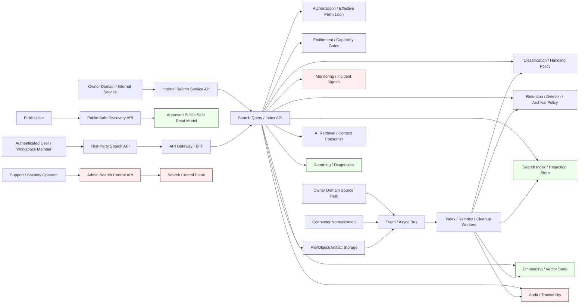
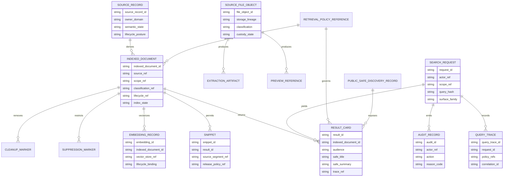
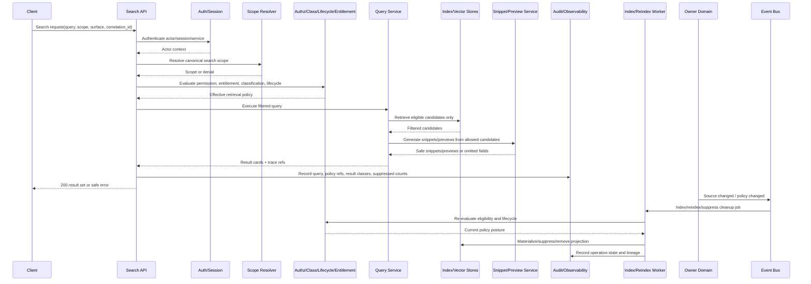

# FUZE Search, Indexing, and Discovery API Specification

## Document Metadata

- **Document Name:** `SEARCH_INDEXING_AND_DISCOVERY_API_SPEC.md`
- **Document Type:** FUZE API SPEC v2 / production-grade API contract specification
- **Status:** Draft API SPEC v2 derived from active refined system semantics
- **Version:** 2.0.0
- **Effective Date:** 2026-04-24
- **Last Updated:** 2026-04-24
- **Reviewed On:** 2026-04-24
- **Document Owner:** FUZE Platform Search, Retrieval, and Discovery API Domain; named individual owner is not explicitly specified in the retrieved governing materials.
- **Approval Authority:** FUZE Platform Architecture and Governance Authority; explicit named approver is not available in the retrieved governing materials.
- **Review Cadence:** Quarterly and whenever search/indexing posture, classification policy, lifecycle policy, workspace authorization, connector ingest posture, AI retrieval posture, public discovery posture, storage lineage, audit posture, or API compatibility materially changes.
- **Governing Layer:** API contract layer derived from the FUZE refined system-spec library.
- **Parent Registry:** `API_SPEC_INDEX.md` for API-family routing and `REFINED_SYSTEM_SPEC_INDEX.md` for upstream semantic routing.
- **Upstream Semantic Registry:** `REFINED_SYSTEM_SPEC_INDEX.md`.
- **Upstream API Registry:** `API_SPEC_INDEX.md`.
- **Primary Audience:** API architecture, backend engineering, search/indexing engineering, frontend and first-party application engineering, AI platform engineering, connector engineering, storage engineering, security, privacy/compliance, audit, support/control-plane operators, SRE/reliability, SDK/OpenAPI/AsyncAPI authors, implementation-contract authors, and QA/contract-validation teams.
- **Primary Purpose:** Define the canonical FUZE API contract posture for search, indexing, retrieval, discovery, result cards, snippets, previews, embeddings, indexing operations, reindexing, suppression, cleanup, and public-safe discovery without allowing API convenience to redefine semantic owner truth, authorization truth, classification posture, lifecycle posture, or public disclosure posture.
- **Primary Upstream References:** `SEARCH_INDEXING_AND_DISCOVERY_SPEC.md`; `REFINED_SYSTEM_SPEC_INDEX.md`; `API_SPEC_INDEX.md`; `API_ARCHITECTURE_SPEC.md`; `PUBLIC_API_SPEC.md`; `INTERNAL_SERVICE_API_SPEC.md`; `EVENT_MODEL_AND_WEBHOOK_SPEC.md`; `IDEMPOTENCY_AND_VERSIONING_SPEC.md`; `MIGRATION_AND_BACKWARD_COMPATIBILITY_SPEC.md`; `INTEGRATION_CONNECTOR_FRAMEWORK_SPEC.md`; `DATA_CLASSIFICATION_AND_HANDLING_SPEC.md`; `DATA_RETENTION_DELETION_AND_ARCHIVAL_SPEC.md`; `FILE_OBJECT_AND_ARTIFACT_STORAGE_SPEC.md`; `SCOPED_AUTHORIZATION_MODEL_SPEC.md`; `ACCESS_EVALUATION_AND_EFFECTIVE_PERMISSION_SPEC.md`; `ENTITLEMENT_AND_CAPABILITY_GATING_SPEC.md`; `AI_ORCHESTRATION_SPEC.md`; `MODEL_ROUTING_AND_CONTEXT_SPEC.md`; `AUDIT_LOG_AND_ACTIVITY_SPEC.md`; `AUDIT_AND_ACCESS_TRACEABILITY_SPEC.md`; `SECURITY_AND_RISK_CONTROL_SPEC.md`; `SECRETS_CONFIG_AND_ENVIRONMENT_SPEC.md`; `MONITORING_ALERTING_AND_INCIDENT_RESPONSE_SPEC.md`; `FUZE_ACCOUNT_ACCESS_AND_SESSION_THESIS_FINAL_SPEC.md`; `FUZE_ACCOUNT_ACCESS_AND_SESSION_CANONICAL_FINAL_SPEC.md`; `FUZE_WORKSPACE_ACCESS_CONTROL_BASICS_THESIS_FINAL_SPEC.md`.
- **Primary Downstream Dependents:** Search API route contracts; retrieval and result-card schemas; indexing ingestion contracts; reindex/backfill job contracts; vector/embedding retrieval contracts; snippet/highlight contracts; public-safe discovery APIs; support search tooling; AI retrieval context APIs; connector search projection contracts; audit and observability instrumentation; OpenAPI, AsyncAPI, SDK, and implementation-contract artifacts.
- **API Surface Families Covered:** First-party application APIs, internal service APIs, admin/control-plane APIs, event/async APIs, reporting/read-model APIs, limited public-safe discovery APIs where explicitly approved, and implementation-facing contracts for search jobs and projections.
- **API Surface Families Excluded:** Raw search-engine vendor APIs; direct index-store writes by product teams; database-specific storage schemas; exact ranking formulas; UI layout details; legal notice copy; unapproved public crawling or public disclosure endpoints; unmanaged support/operator broad-search shortcuts.
- **Canonical System Owner(s):** FUZE Platform Search, Retrieval, and Discovery Architecture Domain as semantic owner for search/indexing/discovery semantics; owner domains remain canonical owners of underlying source records; authorization, classification, lifecycle, storage, connector, AI, public trust, audit, and security domains retain their respective upstream ownership.
- **Canonical API Owner:** FUZE Platform Search, Retrieval, and Discovery API Domain.
- **Supersedes:** Earlier or weaker API interpretations that treat search as a generic convenience layer, expose internal search indexes publicly, allow query-time snippets from denied content, let index presence imply access, or allow search-derived stores to outlive classification/lifecycle constraints.
- **Superseded By:** None.
- **Related Decision Records:** Not explicitly linked in the retrieved governing materials.
- **Canonical Status Note:** This API specification is a downstream interface-contract expression of refined search/indexing/discovery semantics. Refined system specs own semantic truth; this document owns route-family, request/response, error/status, idempotency, authorization, audit, versioning, event, and SDK derivation posture for search-related APIs.
- **Implementation Status:** Ready for downstream implementation-contract derivation; not a machine-readable OpenAPI or AsyncAPI artifact by itself.
- **Approval Status:** Draft pending explicit FUZE approval workflow.
- **Change Summary:** Created API SPEC v2 contract for search, indexing, and discovery APIs; normalized public, first-party, internal, admin/control, event, reporting, AI retrieval, and connector boundaries; added contract-level request/response/error/status/idempotency rules, API route families, diagrams, flow view, sequence diagram, acceptance criteria, test cases, and implementation guardrails.

## Purpose

This document defines the FUZE API contract layer for search, indexing, and discovery.

The purpose is to make search APIs implementation-usable without letting the API layer reinterpret search semantics. The upstream refined search specification establishes that search is a subordinate retrieval layer, not a semantic owner, authorization engine, lifecycle authority, or publication authority. This API specification expresses that rule through concrete API surface families, route families, request models, response models, error classes, idempotency requirements, audit obligations, event posture, migration rules, and downstream OpenAPI/AsyncAPI/SDK guardrails.

## Scope

This API specification governs API contracts for:

1. user-facing and first-party search requests;
2. internal query service calls;
3. index eligibility evaluation requests;
4. ingestion and projection materialization coordination;
5. reindex, backfill, suppression, cleanup, and remediation operations;
6. snippet, highlight, preview, result-card, facet, autocomplete, suggestion, related-item, and public-safe discovery response contracts;
7. search event publication and async job lifecycle contracts;
8. AI retrieval and connector-originated discovery boundaries;
9. audit, lineage, observability, and incident-support contracts for search exposure; and
10. compatibility rules for search API evolution.

## Out of Scope

This API specification does not define:

- exact search-engine vendor choices, index shard topology, vector-store internals, query parser implementation, or ranking formulas;
- exact UI layouts for search experiences;
- exact per-product search relevance tuning;
- full database schemas for index storage;
- full OCR, embedding, parser, tokenizer, or machine-learning implementation details;
- legal wording for search notices or public result disclaimers;
- non-search domain semantics for the records that search returns; or
- raw direct access to underlying indexes, caches, extracted text stores, or vector stores.

These concerns belong to downstream implementation contracts, ranking policies, product-specific discovery contracts, runbooks, and machine-readable API artifacts, provided they preserve this specification.

## Design Goals

1. Preserve refined search semantics while making API implementation deterministic.
2. Ensure search APIs consume canonical identity, session, scope, authorization, entitlement, classification, lifecycle, and storage-lineage decisions rather than redefining them.
3. Prevent route drift between public, first-party, internal, admin/control, event, reporting, AI retrieval, and connector surfaces.
4. Ensure result cards, snippets, previews, suggestions, embeddings, and discovery caches remain governed read models, not shadow semantic owners.
5. Make retry, replay, idempotency, reindex, suppression, cleanup, and incident remediation explicit.
6. Provide clear contract hooks for OpenAPI, AsyncAPI, SDK generation, implementation contracts, QA, audit, observability, and production readiness review.

## Non-Goals

This API spec does not aim to maximize recall, ranking convenience, public discoverability, or operator search access at the expense of classification, lifecycle, authorization, public trust, or audit obligations. It does not create a generic indexing API for product teams to write arbitrary data into search. It does not authorize public search over internal corpora. It does not make search results proof of business state, entitlement, publication approval, or object availability.

## Core Principles

1. **Search APIs are governed reads.** A search query, suggestion call, preview call, snippet call, or AI retrieval call is a governed read operation and MUST apply scope, permission, entitlement, classification, lifecycle, and suppression posture before payload exposure.
2. **Index presence is not access.** API responses MUST NOT imply that an indexed record is visible, current, retained, public, or semantically authoritative merely because an index entry exists.
3. **Filter before exposure.** Candidate filtering MUST occur before ranking, snippet generation, preview exposure, suggestion exposure, or AI context release.
4. **Search does not own source meaning.** Search APIs MUST return references and derived representations while preserving owner-domain source lineage.
5. **Derived stores inherit governance.** Indexes, snippets, previews, embeddings, suggestions, caches, and result cards inherit classification, lifecycle, scope, and cleanup posture from their governing source records and objects.
6. **Public discovery is opt-in.** Public or partner-visible search MUST use explicitly approved public-safe read models and MUST NOT reuse internal search semantics by convenience.
7. **Operator access is bounded.** Admin/control-plane APIs MUST be separated, reason-coded, policy-constrained, auditable, and incapable of silently widening ordinary search exposure.
8. **Replay and cleanup are first-class.** Indexing, reindexing, backfill, suppression, and cleanup APIs MUST be idempotent and replay-safe.

## Canonical Definitions

- **Search API:** Any API that accepts a query, filter, scope, result cursor, retrieval request, indexing command, reindex command, suppression command, or discovery action related to search-derived representations.
- **Search Request:** A governed read request against a declared search scope, actor context, query model, and audience surface.
- **Indexed Document API Resource:** API-facing representation of a search projection derived from source truth, not the source truth itself.
- **Result Card:** API response object containing authorized, classified, lifecycle-safe, and audience-safe identifiers, labels, metadata, snippets, scores, links, or actions.
- **Snippet API Resource:** A bounded query-relevant fragment generated only from discoverable content after filtering.
- **Preview API Resource:** A limited discoverable representation, often storage-backed, governed by source classification and storage lineage.
- **Search Scope:** API contract boundary determining the workspace, organization, tenant, product domain, account, corpus, public collection, or specialized support corpus a query may traverse.
- **Retrieval Policy Reference:** API-visible or audit-visible reference to policy posture governing indexability, result exposure, snippets, previews, embeddings, and public discovery.
- **Suppression Operation:** A governed operation preventing ordinary discovery of search-derived representations without necessarily deleting source truth.
- **Reindex Operation:** A replay-safe operation to rebuild or refresh search projections from source truth.
- **Public-Safe Discovery Record:** Approved public/read-model resource prepared for public or partner-safe discovery.

## Truth Class Taxonomy

This API spec preserves these truth classes:

1. **Semantic truth:** Owned by source owner domains; search APIs MUST NOT redefine it.
2. **API contract truth:** Owned by this document and downstream machine-readable contracts; defines route families, payload classes, statuses, errors, idempotency, compatibility, and exposure posture.
3. **Policy truth:** Owned by authorization, entitlement, classification, lifecycle, public-trust, and retrieval-policy domains.
4. **Runtime truth:** Query execution, indexing job state, parser outcomes, vectorization state, reindex progress, backfill progress, cleanup progress, and degraded-mode posture.
5. **Ledger / storage truth:** Index records, embedding records, extraction metadata, lineage markers, suppression markers, cleanup markers, object catalog references, and operation records.
6. **Provider-input truth:** External-provider or connector-originated inputs before owner-domain acceptance and index eligibility.
7. **Read-model truth:** Result cards, snippets, previews, suggestions, facets, related-item edges, autocomplete terms, public-safe discovery records, and reporting projections.
8. **Presentation truth:** UI display text, ordering, labels, and highlighting. Presentation truth MUST NOT become semantic or authorization truth.

## Architectural Position in the Spec Hierarchy

This document sits below `SEARCH_INDEXING_AND_DISCOVERY_SPEC.md` and `REFINED_SYSTEM_SPEC_INDEX.md`, and beside `PUBLIC_API_SPEC.md`, `INTERNAL_SERVICE_API_SPEC.md`, `EVENT_MODEL_AND_WEBHOOK_SPEC.md`, `IDEMPOTENCY_AND_VERSIONING_SPEC.md`, `MIGRATION_AND_BACKWARD_COMPATIBILITY_SPEC.md`, and `INTEGRATION_CONNECTOR_FRAMEWORK_API_SPEC.md` as a domain-specific API contract.

It must preserve the refined registry rule that API specs derive from refined system semantics and must not reinterpret truth classes, ownership, lifecycle meaning, or conflict-resolution posture.

## Upstream Semantic Owners

- `SEARCH_INDEXING_AND_DISCOVERY_SPEC.md` owns search, indexing, retrieval, result-card, snippet, preview, embedding, discovery, suppression, and reindex semantics.
- Source owner-domain specs own the meaning and lifecycle of underlying records.
- `SCOPED_AUTHORIZATION_MODEL_SPEC.md`, `ACCESS_EVALUATION_AND_EFFECTIVE_PERMISSION_SPEC.md`, and `ENTITLEMENT_AND_CAPABILITY_GATING_SPEC.md` own access, effective permission, and capability gating semantics.
- `DATA_CLASSIFICATION_AND_HANDLING_SPEC.md` owns classification, handling, masking, and release posture.
- `DATA_RETENTION_DELETION_AND_ARCHIVAL_SPEC.md` owns lifecycle, hold, archival, suppression, cleanup, and destruction posture.
- `FILE_OBJECT_AND_ARTIFACT_STORAGE_SPEC.md` owns source-object, preview, extraction, artifact, and storage-lineage semantics.
- `INTEGRATION_CONNECTOR_FRAMEWORK_SPEC.md` owns provider normalization before connector-originated content may influence owner domains or discovery.
- `AI_ORCHESTRATION_SPEC.md` and `MODEL_ROUTING_AND_CONTEXT_SPEC.md` own AI execution and context-release semantics that consume retrieval.
- `AUDIT_LOG_AND_ACTIVITY_SPEC.md` and `AUDIT_AND_ACCESS_TRACEABILITY_SPEC.md` own durable audit posture.
- `SECURITY_AND_RISK_CONTROL_SPEC.md`, `SECRETS_CONFIG_AND_ENVIRONMENT_SPEC.md`, and `MONITORING_ALERTING_AND_INCIDENT_RESPONSE_SPEC.md` own higher-order security and operational controls.

## API Surface Families

### Public API
Public search APIs MAY exist only for explicitly approved public-safe discovery records. They MUST NOT query internal indexes directly. Public result cards MUST be stable, narrow, correction-aware, lifecycle-safe, and non-sensitive.

### First-Party Application API
First-party application APIs MAY support authenticated user search, workspace search, product-local discovery, suggestions, result cards, and previews. They MUST bind to canonical actor context, session posture, workspace or account scope, effective permissions, entitlement checks, classification posture, lifecycle posture, and source lineage.

### Internal Service API
Internal service APIs MAY coordinate query execution, indexing, extraction, vectorization, ranking, projection materialization, and cleanup. They MUST use service identity, service scopes, policy references, and owner-domain provenance. Internal APIs MUST NOT become broad-write shortcuts into search indexes.

### Admin / Control-Plane API
Admin APIs MAY support suppression, reindex, backfill, policy repair, exposure investigation, incident remediation, and diagnostic inspection. They MUST be separated from ordinary application APIs, require elevated authorization, reason codes, approval references where required, operation references, audit lineage, and bounded scope.

### Event / Webhook / Async API
Search events MAY represent indexing requested, index updated, result suppressed, cleanup completed, or exposure incident detected. Public webhooks MUST NOT include internal search payloads unless an approved webhook spec explicitly permits a public-safe projection.

### Reporting API
Reporting APIs MAY expose aggregate retrieval metrics, coverage, latency, cleanup progress, and audit-safe search diagnostics. Reporting MUST NOT expose restricted query strings, denied content fragments, hidden identifiers, or source payloads unless explicitly authorized and classification-safe.

### Chain-Adjacent API
Search APIs MUST NOT index or expose chain-adjacent content as canonical blockchain truth unless a chain-specific source spec approves the public-safe record. Search may expose chain references only as derived public/read-model data with clear lineage.

## System / API Boundaries

Search APIs govern discovery and retrieval expression. They do not govern source record mutation, canonical access policy mutation, classification policy creation, lifecycle policy creation, storage object custody, connector provider acceptance, AI execution, or public publication approval.

The API layer MUST preserve the following boundaries:

- owner domains mutate source truth;
- search APIs expose derived discovery representations;
- authorization services decide access and effective permission;
- classification services decide release and handling posture;
- lifecycle services decide retention, deletion, archival, hold, cleanup, and suppression obligations;
- storage services govern file/object/artifact lineage and delivery tokens;
- connector services normalize provider-origin content before search eligibility;
- AI services consume search under context-release rules; and
- public/read-model services approve public-safe discovery.

## Adjacent API Boundaries

- `PUBLIC_API_SPEC.md` governs general public API exposure and compatibility. This spec governs search-specific public-safe result contracts.
- `INTERNAL_SERVICE_API_SPEC.md` governs service-to-service posture. This spec governs search-specific internal operation contracts.
- `EVENT_MODEL_AND_WEBHOOK_SPEC.md` governs events and webhooks. This spec governs search event payload constraints.
- `IDEMPOTENCY_AND_VERSIONING_SPEC.md` governs replay and contract evolution. This spec applies those rules to query, indexing, suppression, reindex, and cleanup actions.
- `MIGRATION_AND_BACKWARD_COMPATIBILITY_SPEC.md` governs compatibility, deprecation, coexistence, and migration. This spec applies those rules to search API versions, index schema versions, and result-card contracts.
- `INTEGRATION_CONNECTOR_FRAMEWORK_API_SPEC.md` governs connector-facing APIs. This spec governs search projection after connector normalization.
- `FILE_OBJECT_AND_ARTIFACT_STORAGE_API_SPEC.md` governs object delivery and artifact references. This spec governs file-derived search eligibility and preview exposure.
- `DATA_CLASSIFICATION_AND_HANDLING_API_SPEC.md` governs classification interfaces. This spec consumes classification decisions for result and snippet safety.
- `DATA_RETENTION_DELETION_AND_ARCHIVAL_API_SPEC.md` governs lifecycle operations. This spec consumes lifecycle outcomes for suppression and cleanup.

## Conflict Resolution Rules

1. `REFINED_SYSTEM_SPEC_INDEX.md` wins on refined-library membership, precedence, and derivation posture.
2. `SEARCH_INDEXING_AND_DISCOVERY_SPEC.md` wins on search/indexing/discovery semantics.
3. Source owner-domain specs win on source record meaning and canonical mutation.
4. Authorization, effective-permission, entitlement, classification, lifecycle, storage, connector, AI, audit, and security specs win on their owned truth classes.
5. This API spec wins on search-specific API contract expression where it does not weaken upstream semantics.
6. Public, internal, event, idempotency, migration, and connector API specs win on their cross-cutting API-family posture where narrower and consistent.
7. Where ambiguity remains, FUZE MUST choose the more restrictive architecture-consistent interpretation and record the ambiguity for refinement.

## Default Decision Rules

1. Unknown source families default to not indexable.
2. Unknown API surface defaults to non-public.
3. Ambiguous scope defaults to denial rather than broad search.
4. Mixed-sensitivity records default to the most restrictive effective classification for indexing, snippets, previews, suggestions, and embeddings.
5. Query execution defaults to filter-before-rank and filter-before-snippet.
6. If snippet safety cannot be proven, return metadata-only result cards or no result.
7. If source lineage, effective scope, effective classification, lifecycle posture, and retrieval-policy reference cannot be named, the result MUST NOT be production-exposed.
8. Provider-originated content defaults to non-canonical and not broadly searchable until normalized, accepted, and explicitly eligible.
9. Public discovery defaults to approved public-safe read models, not source records or internal result cards.
10. Admin override defaults to bounded, reason-coded, approval-linked, auditable, and reversible where possible.

## Roles / Actors / API Consumers

### Human Actors
- Anonymous public users where public-safe discovery is explicitly approved.
- Authenticated end users.
- Workspace members and workspace administrators.
- Product operators.
- Support operators.
- Security, privacy, compliance, and incident-response operators.
- Governance and approval actors.

### System Actors
- First-party web and mobile clients.
- API gateway and backend-for-frontend services.
- Search query services.
- Indexing, extraction, vectorization, ranking, and projection services.
- Reindex, backfill, cleanup, and suppression workers.
- Owner-domain services.
- Authorization/effective-permission services.
- Classification and lifecycle services.
- Storage/object/artifact services.
- Connector and provider-normalization services.
- AI orchestration and context-routing systems.
- Audit, observability, and incident systems.
- Reporting and public-safe discovery services.

## Resource / Entity Families

Search APIs SHOULD expose stable resource families such as:

- `search_request`
- `search_scope`
- `query_expression`
- `result_card`
- `result_cursor`
- `facet_set`
- `snippet`
- `preview_reference`
- `suggestion`
- `related_item_edge`
- `indexed_document`
- `search_projection`
- `embedding_record_reference`
- `retrieval_policy_reference`
- `index_eligibility_decision`
- `index_operation`
- `reindex_operation`
- `backfill_operation`
- `suppression_operation`
- `cleanup_operation`
- `query_trace`
- `search_audit_record`
- `public_safe_discovery_record`

Resource names MAY be refined downstream, but downstream contracts MUST preserve these semantic distinctions.

## Ownership Model

The API ownership model is:

- Search APIs own interface contracts for discovery and indexing operations.
- Search/retrieval domain owns search projection and retrieval mechanics.
- Source owner domains own record meaning and source mutations.
- Authorization/entitlement domains own access eligibility.
- Classification governance owns content handling and snippet/preview eligibility.
- Lifecycle governance owns suppression, cleanup, archival, and deletion outcomes.
- Storage owns file/object/artifact lineage and preview/object delivery constraints.
- Connector owns provider normalization and source acceptance posture.
- AI owns context use after retrieval eligibility is proven.
- Audit owns traceability for queries, exposures, and operator actions.

## Authority / Decision Model

Search APIs MUST rely on upstream decision points:

1. **Authentication and actor resolution** determine who is calling.
2. **Scope resolution** determines what corpus may be searched.
3. **Authorization/effective-permission evaluation** determines whether the actor can discover or open results.
4. **Entitlement/capability gating** determines whether search features are available.
5. **Classification evaluation** determines what can be indexed, snippeted, previewed, suggested, embedded, or publicly discovered.
6. **Lifecycle evaluation** determines whether representations must be active, suppressed, archived, cleanup-pending, or removed.
7. **Search governance** determines result assembly, ranking, projection, query trace, and discovery behavior.

Search APIs MUST NOT make local irreversible decisions that belong to those upstream domains.

## Authentication Model

- Public-safe endpoints MAY allow unauthenticated access only where the public-safe read model is explicitly approved.
- Authenticated user search MUST bind to canonical account identity and current session posture.
- First-party service calls MUST authenticate via first-party client/session context or service identity as appropriate.
- Internal indexing and query services MUST use service principal authentication and service scopes.
- Admin/control-plane endpoints MUST require elevated operator authentication and step-up controls where required by security policy.

## Authorization / Scope / Permission Model

Every non-public search request MUST include or resolve:

- canonical actor context;
- canonical search scope;
- requested surface family;
- product/domain context where applicable;
- effective permission evaluation reference;
- entitlement/capability gate reference where applicable;
- classification release posture; and
- lifecycle eligibility posture.

Search APIs MUST avoid local ACL shortcuts. They MAY cache effective permission inputs only under approved policy, bounded TTL, invalidation, and audit rules.

Cross-workspace, cross-organization, cross-account, support, admin, and public search MUST require explicit surface-specific authorization. Lack of a scope MUST deny search.

## Entitlement / Capability-Gating Model

Entitlement gates MAY control:

- access to global search;
- semantic/vector retrieval;
- document preview search;
- exportable result sets;
- AI retrieval over search results;
- connector-originated corpus search;
- public-safe product catalog discovery;
- support/admin search tooling; and
- reindex/backfill/suppression operations.

Entitlement permits feature use only. It does not grant access to source content or weaken classification/lifecycle restrictions.

## API State Model

Search APIs MUST preserve distinguishable states including:

- `not_eligible`
- `eligible_pending_ingest`
- `ingest_pending`
- `indexed_active`
- `indexed_suppressed`
- `snippet_restricted`
- `preview_restricted`
- `embedding_active`
- `embedding_suppressed`
- `reindex_pending`
- `backfill_pending`
- `cleanup_pending`
- `archival_discovery_restricted`
- `deleted_cleanup_pending`
- `removed`
- `error_quarantined`
- `accepted`
- `completed`
- `failed`
- `partially_completed`
- `cancelled`

State MUST remain distinct from source business-object state. `indexed_active` does not mean visible to every actor. `accepted` for an async operation does not mean final business success.

## Lifecycle / Workflow Model

### Query Lifecycle
1. Request received.
2. Actor/session/service authentication resolved.
3. Search scope resolved.
4. Authorization, permission, entitlement, classification, lifecycle, and suppression posture evaluated.
5. Candidate set filtered.
6. Ranking applies only to filtered candidates.
7. Snippets/previews/suggestions are generated only from allowed content.
8. Result cards assembled with lineage and trace references.
9. Audit and observability records emitted.
10. Cursor/pagination state returned only if safe and bounded.

### Indexing Lifecycle
1. Source owner event or internal command proposes index eligibility.
2. Index eligibility evaluates source lineage, classification, lifecycle, scope, connector normalization, and storage lineage.
3. Ingestion/extraction/vectorization occurs only if eligible.
4. Projection materializes with policy and cleanup bindings.
5. Queryable state transitions only after required gates pass.
6. Events and audit records are emitted.

### Suppression / Cleanup Lifecycle
1. Source posture changes or operator incident flow triggers suppression/cleanup.
2. Operation is recorded with idempotency and reason code.
3. Derived search stores, snippets, previews, embeddings, suggestions, and caches are suppressed or removed.
4. Completion is observable and auditable.
5. Public-safe representations are updated or withdrawn where required.

## Architecture Diagram — Mermaid flowchart

## Data Design — Mermaid Diagram

## Flow View

### Synchronous Search Flow
1. Client submits a search request with query, scope, surface family, desired result types, and correlation metadata.
2. API gateway authenticates actor/session or public-safe context.
3. Search API resolves canonical scope and rejects ambiguous or unauthorized scope.
4. Authorization, effective-permission, entitlement, classification, lifecycle, and suppression checks execute before candidate release.
5. Query service retrieves only eligible candidates.
6. Ranking operates only within the filtered candidate set.
7. Snippets, previews, suggestions, facets, and related edges are generated from filtered and release-approved content only.
8. API returns result cards with safe fields, lineage references, trace references, and bounded cursors.
9. Audit and observability records capture request, decision references, result classes, and suppressed/error counts without leaking denied content.

### Asynchronous Indexing / Reindex Flow
1. Owner-domain source change, storage event, connector acceptance, lifecycle change, classification change, or admin operation creates a search operation.
2. Search control plane validates idempotency key, operation scope, operation type, source lineage, policy references, and actor/service authority.
3. API returns `202 Accepted` with operation reference when work is asynchronous.
4. Workers perform eligibility evaluation, extraction, chunking, projection materialization, vectorization, cleanup, or suppression.
5. Workers emit events and audit records for state transitions.
6. Operation status reaches `completed`, `partially_completed`, `failed`, `cancelled`, or `requires_remediation`.

### Failure / Retry / Degraded-Mode Flow
1. If policy evaluation fails closed, the API denies or returns metadata-only safe responses.
2. If ranking or vector services degrade, keyword or metadata-only search MAY be used if release controls are intact.
3. If snippet safety cannot be proven, omit snippets.
4. If indexing is delayed, expose operation state and never claim source truth is unavailable solely because the index is stale.
5. If over-exposure occurs, admin suppression and incident remediation flows must be used with reason codes and audit lineage.

## Data Flows — Mermaid sequenceDiagram

## Request Model

Search API requests MUST use explicit contract fields appropriate to the route family:

- `request_id` or server-generated equivalent;
- `correlation_id` and trace context;
- `actor_context` or resolvable caller identity;
- `surface_family`;
- `search_scope`;
- `query` or structured filter object;
- `result_types` requested;
- `pagination` or cursor object;
- `sort` or ranking preference where allowed;
- `include_snippets`, `include_previews`, `include_facets`, `include_related`, `include_suggestions`, or equivalent flags;
- `retrieval_policy_ref` where used by internal/admin routes;
- `source_ref` for indexing operations;
- `operation_type` for async operations;
- `reason_code` and `approval_ref` for admin/control operations;
- `idempotency_key` for mutations, reindex, backfill, suppression, cleanup, and retryable operation creation.

Requests MUST NOT include raw index IDs, direct object-store keys, raw denied content, unbounded corpus selectors, or policy override flags outside admin/control-plane routes.

## Response Model

Responses MUST distinguish:

- successful synchronous result sets;
- accepted asynchronous operations;
- empty authorized result sets;
- filtered/suppressed result counts where safe;
- metadata-only degraded results;
- permission-denied responses;
- classification/lifecycle-denied responses;
- conflict responses;
- stale-index or operation-pending responses; and
- remediation-required responses.

Result cards SHOULD include:

- stable result identifier;
- source reference or safe source alias;
- owner-domain reference;
- result type;
- safe title/label;
- safe metadata;
- snippet or preview only when approved;
- score/rank metadata only where safe;
- allowed actions;
- lifecycle and supersession hints where safe;
- trace reference; and
- next action/open reference only if actor may access the underlying source.

## Error / Result / Status Model

Search APIs MUST distinguish these error/status classes:

- `invalid_request`
- `invalid_query`
- `ambiguous_scope`
- `authentication_required`
- `authorization_denied`
- `entitlement_required`
- `classification_restricted`
- `lifecycle_restricted`
- `snippet_restricted`
- `preview_restricted`
- `source_not_indexable`
- `source_not_found_or_not_discoverable`
- `index_stale`
- `index_operation_pending`
- `conflict`
- `idempotency_conflict`
- `rate_limited`
- `abuse_detected`
- `degraded_mode`
- `operation_failed`
- `remediation_required`

APIs MUST avoid using `not_found` in a way that leaks existence of restricted content. Existence disclosure posture MUST be governed by surface family and policy.

## Idempotency / Retry / Replay Model

- Search read requests SHOULD be safely repeatable and MAY use request hashes for traceability.
- Reindex, backfill, suppression, cleanup, projection materialization, ingestion, and remediation operations MUST require idempotency keys or deterministic operation identity.
- Retrying an operation with the same idempotency key and equivalent request body MUST return the same operation reference or final state.
- Retrying with the same key and materially different body MUST return `idempotency_conflict`.
- Operation replay MUST preserve source lineage, policy version, actor/service identity, reason code, correlation ID, and audit lineage.
- Cleanup and suppression flows MUST be safe under duplicate events, delayed events, partial failure, and backfill replays.

## Rate Limit / Abuse-Control Model

Search APIs MUST enforce surface-specific rate and abuse controls:

- public endpoints: strict quotas, bot controls, payload limits, cursor limits, no broad enumeration;
- first-party endpoints: per-user, per-workspace, per-session, and per-feature limits;
- internal endpoints: service-scope quotas and backpressure;
- admin endpoints: operator limits, approval requirements, and anomaly alerts;
- AI retrieval endpoints: token/context/data-release limits and prompt-injection-aware controls;
- connector-originated indexing: provider and connector quotas, replay limits, and quarantine for malformed payloads.

Abuse controls MUST NOT weaken access checks or classification restrictions.

## Endpoint / Route Family Model

This spec authorizes route families, not exact final OpenAPI paths. Downstream OpenAPI MAY express paths such as:

### First-Party Search
- `POST /v2/search/query`
- `GET /v2/search/results/{result_id}`
- `GET /v2/search/suggestions`
- `GET /v2/search/facets`
- `GET /v2/search/related`
- `GET /v2/search/previews/{preview_ref}`

### Public-Safe Discovery
- `GET /v2/public/discovery/search`
- `GET /v2/public/discovery/results/{public_result_id}`
- `GET /v2/public/discovery/suggestions`

### Internal Search Service
- `POST /v2/internal/search/query`
- `POST /v2/internal/search/index-eligibility/evaluate`
- `POST /v2/internal/search/index-operations`
- `GET /v2/internal/search/index-operations/{operation_id}`
- `POST /v2/internal/search/reindex-operations`
- `POST /v2/internal/search/cleanup-operations`
- `POST /v2/internal/search/suppression-operations`

### Admin / Control Plane
- `POST /v2/admin/search/suppressions`
- `POST /v2/admin/search/reindex`
- `POST /v2/admin/search/backfill`
- `GET /v2/admin/search/exposure-traces/{trace_id}`
- `GET /v2/admin/search/operations/{operation_id}`
- `POST /v2/admin/search/remediations`

### Events / Async
- `search.indexing.requested`
- `search.indexing.completed`
- `search.indexing.failed`
- `search.projection.suppressed`
- `search.cleanup.completed`
- `search.exposure_incident.detected`
- `search.reindex.requested`
- `search.reindex.completed`

Route families MUST NOT expose raw search-engine query endpoints, unbounded scan APIs, or direct vector-store nearest-neighbor APIs except under tightly governed internal implementation contracts.

## Public API Considerations

Public search MUST:

- use only approved public-safe discovery records;
- expose stable, narrow, non-sensitive contracts;
- avoid internal identifiers, private ranking features, workspace labels, denied source hints, and internal lifecycle details;
- preserve correction, supersession, archival, and withdrawal posture;
- support public-safe rate limits and enumeration controls;
- avoid snippets from internal source records unless explicitly public-safe; and
- treat public result absence carefully to avoid misleading publication truth.

## First-Party Application API Considerations

First-party search MAY expose richer result cards, facets, previews, snippets, and suggestions than public APIs, but only after actor, session, scope, permission, entitlement, classification, and lifecycle gates are satisfied. First-party clients MUST treat result cards as discovery objects and must call the appropriate owner-domain API to open or mutate the source record.

## Internal Service API Considerations

Internal services MAY:

- perform query execution and result assembly;
- evaluate index eligibility;
- create indexing operations;
- materialize projections;
- refresh embeddings;
- suppress and clean up derived search stores; and
- expose diagnostics to authorized services.

Internal service APIs MUST NOT become hidden broad-write shortcuts, hidden authorization engines, hidden lifecycle bypasses, or hidden public-disclosure paths.

## Admin / Control-Plane API Considerations

Admin/control APIs MUST:

- require elevated operator authorization;
- require reason codes;
- include operation references;
- support audit and traceability;
- be scoped to concrete source families, index families, workspaces, tenants, or incidents;
- avoid unbounded broad searches unless explicitly approved for incident response;
- support reversible suppression where possible;
- distinguish suppression from deletion and cleanup;
- not silently rewrite history; and
- route irreversible cleanup/destruction through lifecycle governance.

## Event / Webhook / Async API Considerations

Search events MUST include only the minimum necessary payload:

- event ID;
- event type;
- version;
- source family;
- source reference or safe alias;
- operation reference;
- scope reference where safe;
- policy version reference where safe;
- status;
- correlation ID;
- trace reference; and
- timestamps.

Events MUST NOT include raw snippets, extracted text, private query strings, denied content fragments, embeddings, or sensitive ranking features unless a narrower internal event contract permits it and classification allows it.

## Chain-Adjacent API Considerations

Search APIs may expose chain references only as derived read-model facts. Public chain discovery MUST preserve on-chain/off-chain responsibility boundaries, correction posture, and source lineage. Search indexes MUST NOT treat chain observations, wallet labels, public addresses, or governance records as semantic owner truth outside their governing specs.

## Data Model / Storage Support Implications

Downstream storage and implementation contracts MUST preserve:

- source-to-index lineage;
- indexed-document state;
- classification references;
- lifecycle references;
- scope references;
- retrieval-policy references;
- operation records;
- suppression and cleanup markers;
- embedding lifecycle binding;
- snippet and preview lineage;
- query trace references;
- audit references;
- index schema version; and
- compatibility/supersession posture.

Raw index vendor schema MAY vary, but these semantic fields or equivalent bindings MUST be reconstructable.

## Read Model / Projection / Reporting Rules

Search projections, result cards, snippets, previews, suggestions, facets, and public-safe discovery records are derived read models. They MUST NOT become mutation owners. They MUST be suppressible, cleanable, reconstructable, and explainable.

Reporting may aggregate search coverage, freshness, latency, suppression counts, cleanup progress, or incident statistics. Reporting MUST NOT leak denied query strings, restricted titles, sensitive snippets, hidden identifiers, or internal ranking features.

## Security / Risk / Privacy Controls

Search APIs MUST enforce:

- least-privilege service scopes;
- no direct raw index access for ordinary clients;
- strict public-safe exposure rules;
- query and payload size limits;
- sensitive title/suggestion suppression;
- query logging minimization and classification-aware logs;
- prompt-injection-aware controls for AI retrieval;
- incident hooks for over-broad indexing or exposure;
- secret and credential redaction from extraction and snippets;
- secure handling of temporary extraction buffers; and
- containment controls for malformed or suspicious connector/provider input.

## Audit / Traceability / Observability Requirements

Every production search API surface MUST emit sufficient traceability to reconstruct:

- actor/service identity;
- surface family;
- scope;
- query trace or safe query hash;
- policy references used;
- result classes returned;
- snippets/previews included or omitted;
- suppression decisions;
- lifecycle restrictions;
- operation IDs;
- correlation and trace IDs;
- admin reason codes and approval references; and
- degraded-mode indicators.

Audit logs MUST minimize sensitive content and MUST NOT become an uncontrolled copy of restricted query strings or snippets.

## Failure Handling / Edge Cases

- **Ambiguous scope:** deny with `ambiguous_scope`.
- **Permission service unavailable:** fail closed or return safe degraded response with no content exposure.
- **Classification service unavailable:** deny snippets/previews and MAY return metadata-only only where policy allows.
- **Lifecycle service unavailable:** fail closed for deleted/archived-sensitive corpora.
- **Index stale:** return `index_stale` or safe partial results with freshness metadata where allowed.
- **Embedding unavailable:** degrade to keyword/metadata search if release controls remain intact.
- **Snippet unsafe:** omit snippet.
- **Preview unsafe:** omit preview or require owner-domain access route.
- **Provider input unaccepted:** do not expose broad search results.
- **Cleanup partial failure:** retain observable `cleanup_pending` or `partially_completed` operation state.
- **Exposure incident:** support bounded suppression, operation tracing, incident record, and replay-safe remediation.

## Migration / Versioning / Compatibility / Deprecation Rules

Search API changes MUST preserve:

- stable result-card semantics;
- explicit versioning for route, schema, event, and operation models;
- compatibility for public-safe discovery contracts;
- additive evolution by default;
- explicit deprecation and sunset notices for public/partner APIs;
- no silent widening of public fields;
- index schema migration lineage;
- coexistence of old/new index schemas during migration where required;
- replay-safe reindex/backfill operations; and
- correction/supersession posture for stale or deprecated result models.

Any migration that changes result eligibility, snippet behavior, preview behavior, public exposure, lifecycle cleanup, or authorization filtering MUST pass architecture, security, privacy, and compatibility review.

## OpenAPI / AsyncAPI / SDK Derivation Rules

OpenAPI artifacts MUST preserve:

- surface-family separation;
- route family constraints;
- request model requirements;
- response classes;
- error classes;
- idempotency headers/fields for operations;
- correlation and trace fields;
- result-card safety distinctions;
- public vs authenticated vs internal/admin schemas;
- no raw index or vector-store leakage; and
- deprecation/version metadata.

AsyncAPI artifacts MUST preserve event type, event version, operation references, safe payload constraints, lineage references, and no-content-leakage rules.

SDKs MUST not create client helpers that bypass scope, permission, entitlement, classification, lifecycle, or owner-domain open/mutation routes. SDK convenience methods MUST preserve safe defaults and discourage broad enumeration.

## Implementation-Contract Guardrails

Downstream implementation contracts MUST define:

- search index schema contracts;
- projection materialization contracts;
- vector/embedding lifecycle bindings;
- snippet/highlight release contracts;
- preview retrieval contracts;
- index eligibility decision contracts;
- reindex/backfill/cleanup worker contracts;
- suppression and remediation contracts;
- query trace and audit contracts;
- public-safe discovery schema contracts;
- admin control-plane contracts;
- incident response runbooks; and
- migration/backfill validation plans.

They MUST NOT weaken this API spec or redefine refined search semantics.

## Downstream Execution Staging

Recommended staging:

1. Define machine-readable OpenAPI/AsyncAPI route families.
2. Define index eligibility and result-card schemas.
3. Define policy integration and fail-closed behavior.
4. Implement first-party search with metadata-only fallback.
5. Implement snippet/preview gating.
6. Implement indexing/reindex/cleanup operations with idempotency.
7. Implement admin suppression and incident trace APIs.
8. Implement public-safe discovery only after public-read-model approval.
9. Add contract tests, regression tests, and migration tests.
10. Run production-readiness review with audit, security, privacy, and runtime teams.

## Required Downstream Specs / Contract Layers

- Search OpenAPI contract.
- Search AsyncAPI event contract.
- Search result-card schema contract.
- Snippet/highlight release contract.
- Preview and file-derived discovery contract.
- Index eligibility evaluation contract.
- Index projection schema and lineage contract.
- Embedding/vector lifecycle contract.
- Reindex/backfill/cleanup job contract.
- Admin suppression/remediation contract.
- Public-safe discovery contract.
- AI retrieval context-admission contract.
- Connector search projection contract.
- Search audit/observability contract.

## Boundary Violation Detection / Non-Canonical API Patterns

Forbidden patterns include:

1. Public API querying internal indexes directly.
2. Search API returning raw source records instead of discovery-safe representations.
3. Snippets generated before authorization/classification/lifecycle filtering.
4. Autocomplete leaking restricted titles, names, identifiers, or existence.
5. Search result opening a source object without owner-domain access revalidation.
6. Product-specific indexing route bypassing shared eligibility rules.
7. Direct index writes from product teams.
8. Direct vector nearest-neighbor API exposed to ordinary clients.
9. Admin search used as ordinary support disclosure without reason code and audit.
10. Index presence used as proof that a record exists, is active, is visible, or is public.
11. Derived search projections used as semantic mutation sources.
12. Deleted/archived/held/quarantined content remaining discoverable without approved exception.
13. Query logs storing restricted content without classification-aware minimization.
14. Public result cards reusing internal result identifiers or hidden ranking features.

## Canonical Examples / Anti-Examples

### Canonical Example: Workspace Document Search
An authenticated workspace member searches within one workspace. The API resolves the workspace scope, checks effective permission and entitlement, filters candidates, applies classification/lifecycle restrictions, ranks filtered candidates, generates snippets from allowed content, returns result cards, and records query trace/audit metadata.

### Anti-Example: Snippet From Denied Document
A query engine ranks an unfiltered corpus, generates highlights from a denied document, and removes the denied result card afterward. This is forbidden because snippet generation occurred before exposure filtering.

### Canonical Example: Reindex After Classification Change
A classification change event triggers a replay-safe reindex operation. The worker suppresses affected snippets and embeddings, updates projection metadata, records cleanup state, and emits search projection updated/suppressed events.

### Anti-Example: Public Search Over Internal Index
A public endpoint queries the internal workspace index with a public filter. This is forbidden. Public discovery must use approved public-safe records.

### Canonical Example: Admin Suppression During Incident
Security opens a bounded suppression operation for a concrete incident, with reason code, approval reference, target scope, operation ID, audit record, and completion state. This is permitted.

## Acceptance Criteria

1. Public search routes cannot query internal indexes directly.
2. Every authenticated search request resolves exactly one canonical search scope or fails.
3. Every result card can identify source lineage, scope, classification posture, lifecycle posture, retrieval policy reference, and trace reference.
4. Query-time filtering occurs before ranking, snippets, previews, suggestions, and result payload exposure.
5. Snippets and previews are omitted when safety cannot be proven.
6. Search suggestions and autocomplete follow the same access/classification/lifecycle posture as ordinary search.
7. Reindex, suppression, backfill, and cleanup operations require idempotency and return stable operation references.
8. Retrying an operation with the same idempotency key and different body returns an idempotency conflict.
9. Admin/control routes require elevated authorization, reason code, operation reference, audit record, and bounded target scope.
10. Connector-originated content is not broadly searchable until normalized, accepted, and explicitly index-eligible.
11. Public-safe discovery records are distinct from internal result cards.
12. Deleted, archived, held, quarantined, or restricted source material is suppressed or cleaned up according to lifecycle policy.
13. Search audit logs contain enough lineage for review without storing uncontrolled restricted snippets or raw denied content.
14. Degraded mode never widens exposure.
15. OpenAPI, AsyncAPI, and SDK outputs preserve public/first-party/internal/admin/event separation.
16. Search result contracts remain backward-compatible or follow migration/deprecation rules when changed.
17. AI retrieval calls perform access and release checks before context is provided to model execution.
18. Query logs and traces are classification-aware and minimization-aware.
19. Boundary-violation tests prevent direct raw index or vector-store exposure to ordinary clients.
20. Production readiness review verifies classification, lifecycle, authorization, idempotency, audit, observability, and migration behavior.

## Test Cases

### Positive Path Tests
1. Authenticated user searches an authorized workspace and receives only allowed result cards.
2. Authorized user requests snippets and receives snippets only for discoverable content.
3. Public user searches approved public-safe discovery records and receives narrow public result cards.
4. Internal service creates an index operation for an eligible source record and receives `202 Accepted` with operation reference.
5. Admin operator suppresses a result set with reason code and receives auditable operation state.

### Negative / Boundary Tests
6. Request without scope returns `ambiguous_scope` or denial.
7. Unauthorized actor searching a workspace receives no restricted result or existence leak.
8. Entitlement-disabled actor cannot use semantic/vector retrieval.
9. Classification-restricted content appears neither in result cards nor snippets.
10. Deleted source content causes derived index, embedding, suggestion, and snippet cleanup or suppression.
11. Public API cannot access internal result IDs.
12. Product service attempting direct raw index write is rejected.
13. Ordinary client attempting direct vector search is rejected.
14. Connector-originated unaccepted content is not discoverable.
15. Snippet generation from unfiltered corpus fails contract validation.

### Idempotency / Retry / Replay Tests
16. Duplicate reindex request with same idempotency key returns same operation ID.
17. Same idempotency key with different body returns `idempotency_conflict`.
18. Duplicate cleanup event does not recreate removed result exposure.
19. Replayed suppression operation preserves original reason code and audit lineage.
20. Partial cleanup failure remains observable as `partially_completed` or `cleanup_pending`.

### Rate Limit / Abuse Tests
21. Public search enumeration triggers rate limit without leaking restricted corpus information.
22. High-volume autocomplete calls suppress sensitive suggestions and enforce quotas.
23. Abusive query pattern triggers `abuse_detected` and observability signal.

### Degraded Mode Tests
24. Ranking service outage returns metadata-only or keyword results without widening exposure.
25. Classification service outage fails closed for snippets/previews.
26. Index stale state is reported without asserting source truth is stale or missing.
27. Embedding service outage does not bypass scope filtering.

### Audit / Observability Tests
28. Every search response includes or records correlation and trace references.
29. Admin suppression creates audit record with actor, reason code, operation ID, and target scope.
30. Exposure incident remediation is traceable from incident to suppression and cleanup operations.
31. Query audit minimization prevents raw denied snippets from being stored.

### Migration / Compatibility Tests
32. Existing public result schema remains compatible after additive fields are introduced.
33. Deprecated result-card field emits deprecation metadata before removal.
34. Index schema migration can run old and new projections without double-exposing suppressed content.
35. SDK generation does not include hidden admin routes in public SDKs.

## Dependencies / Cross-Spec Links

- `REFINED_SYSTEM_SPEC_INDEX.md`
- `SEARCH_INDEXING_AND_DISCOVERY_SPEC.md`
- `API_SPEC_INDEX.md`
- `API_ARCHITECTURE_SPEC.md`
- `PUBLIC_API_SPEC.md`
- `INTERNAL_SERVICE_API_SPEC.md`
- `EVENT_MODEL_AND_WEBHOOK_SPEC.md`
- `IDEMPOTENCY_AND_VERSIONING_SPEC.md`
- `MIGRATION_AND_BACKWARD_COMPATIBILITY_SPEC.md`
- `INTEGRATION_CONNECTOR_FRAMEWORK_API_SPEC.md`
- `DATA_CLASSIFICATION_AND_HANDLING_API_SPEC.md`
- `DATA_RETENTION_DELETION_AND_ARCHIVAL_API_SPEC.md`
- `FILE_OBJECT_AND_ARTIFACT_STORAGE_API_SPEC.md`
- `SCOPED_AUTHORIZATION_MODEL_SPEC.md`
- `ACCESS_EVALUATION_AND_EFFECTIVE_PERMISSION_SPEC.md`
- `ENTITLEMENT_AND_CAPABILITY_GATING_SPEC.md`
- `AI_ORCHESTRATION_SPEC.md`
- `MODEL_ROUTING_AND_CONTEXT_SPEC.md`
- `SECURITY_AND_RISK_CONTROL_SPEC.md`
- `AUDIT_LOG_AND_ACTIVITY_SPEC.md`
- `AUDIT_AND_ACCESS_TRACEABILITY_SPEC.md`
- `MONITORING_ALERTING_AND_INCIDENT_RESPONSE_SPEC.md`

## Explicitly Deferred Items

- Exact final OpenAPI route names and schema field definitions.
- Exact search engine, vector database, and ranking architecture.
- Exact ranking formula and relevance tuning weights.
- Exact UI interaction model for result cards and filters.
- Exact public legal/disclaimer copy.
- Exact per-domain index eligibility matrix.
- Exact SLOs and capacity targets.
- Exact per-connector search projection mapping.
- Exact AI retrieval chunking/tokenization implementation.

Deferred items MUST preserve this API contract and upstream refined search semantics.

## Final Normative Summary

Search, indexing, and discovery APIs in FUZE MUST function as governed interface expressions of refined search semantics. They MUST preserve source ownership, access boundaries, classification handling, lifecycle cleanup, storage lineage, connector normalization, public-safe disclosure, auditability, idempotency, replay safety, and compatibility. They MUST NOT turn indexes, snippets, embeddings, previews, suggestions, result cards, public endpoints, internal services, admin tools, or SDK convenience helpers into hidden semantic owners, hidden authorization engines, hidden lifecycle bypasses, or hidden publication systems.

## Quality Gate Checklist

- [x] Upstream refined semantic owners are explicit.
- [x] Canonical API owner is explicit.
- [x] API surface families are explicit.
- [x] Mutation and operation boundaries are explicit.
- [x] Read boundaries are explicit.
- [x] Adjacent API boundaries are explicit.
- [x] Truth classes are explicit.
- [x] Conflict-resolution rules are explicit.
- [x] Default decision rules are explicit.
- [x] Public, first-party, internal, admin/control, event/webhook, reporting, AI, connector, and chain-adjacent distinctions are explicit.
- [x] Non-canonical API patterns are called out.
- [x] Operator/admin override paths are bounded, reason-coded, and audited.
- [x] Read-model, cache, reporting, projection, snippet, preview, suggestion, and embedding rules are explicit.
- [x] Accepted-state vs final-success semantics are explicit for async operations.
- [x] Idempotency and replay requirements are explicit.
- [x] Request, response, error, result, and status classes are explicit.
- [x] Failure and degraded-mode behaviors are explicit.
- [x] Audit, traceability, and observability requirements are explicit.
- [x] Versioning, migration, compatibility, and deprecation rules are explicit.
- [x] OpenAPI, AsyncAPI, and SDK guardrails are explicit.
- [x] Dependencies and downstream impacts are explicit.
- [x] Non-goals and deferred items are explicit.
- [x] Architecture Diagram uses Mermaid `flowchart` syntax.
- [x] Data Design diagram uses Mermaid syntax.
- [x] Flow View includes synchronous, asynchronous, failure, retry, audit, admin/operator, and finalization paths.
- [x] Data Flows use Mermaid `sequenceDiagram` syntax.
- [x] Acceptance Criteria are concrete and testable.
- [x] Test Cases cover positive, negative, authorization, entitlement, idempotency, retry, conflict, rate-limit, degraded-mode, audit, migration, and boundary-violation behavior.
